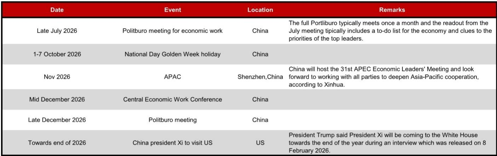
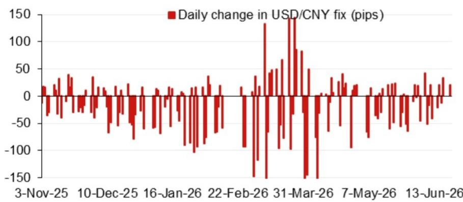
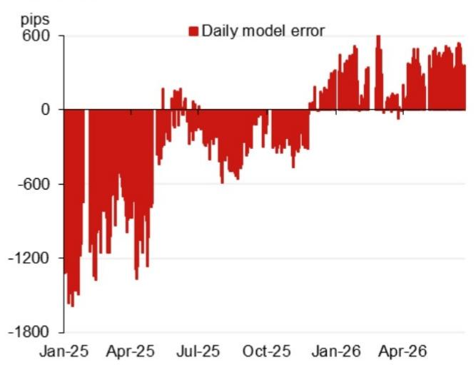

# The PBOC's Fix Model Reveals a Strategic Tightrope: Why the Currency Anchor is Shifting Beneath the Surface

The People's Bank of China is not simply managing the renminbi; it is signaling a recalibration of its entire external stability framework. According to the latest USD/CNY fix model projection from a leading global investment bank, the official fixing for June 23, 2026, is projected at 6.7851, a remarkable 299 pips lower than the previous model projection of 6.8150. This is not a minor adjustment. It is a deliberate compression of the currency's trading band that carries profound implications for global trade dynamics, capital flows, and the strategic posture of China's monetary authorities. The model's projection, when stripped of the counter-cyclical factor, sits 88 pips higher than the previous official spot close, while the full model with the counter-cyclical factor lands at 6.8008. This gap between the raw model and the adjusted fix tells a story of active intervention that goes far beyond simple market smoothing.

The timing of this shift is everything. We are approaching late July 2026, when the Politburo will convene its critical economic work meeting, and the market is already pricing in a more accommodative policy stance. The fix model is not a backward-looking technical exercise; it is a forward-looking policy instrument. The data reveals that the top four weighted overnight contributions to the projected change are exerting significant downward pressure on USD/CNY, suggesting that the PBOC is leaning against a strengthening dollar environment. But the real question is why now, and what does this mean for the broader strategic calculus of Chinese economic management?

The conventional narrative holds that China manages its currency to maintain export competitiveness. This framework is no longer sufficient. The fix model data indicates that the PBOC is increasingly using the fixing as a tool for financial stability, not just trade competitiveness. The 299-pip drop in the model projection is a clear signal that the authorities are willing to absorb short-term volatility in exchange for a more predictable anchor for domestic asset prices and capital account management. This is a strategic choice that prioritizes domestic financial conditions over external price signals, and it is a choice that will have second-order effects on everything from corporate hedging strategies to sovereign bond yields.

The most critical insight from this data is that the counter-cyclical factor is being deployed with increasing precision and frequency. The model projection without this factor is 6.7851, but the adjusted projection is 6.8008, a difference of 157 pips. This is not a rounding error. It is a deliberate intervention that tells us the PBOC is willing to accept a weaker fix than the raw model would suggest, but only within a tightly controlled corridor. The message to markets is clear: we will allow the renminbi to depreciate, but we will not allow it to depreciate in a disorderly fashion. This is a subtle but powerful signal that the PBOC is shifting from a regime of managed appreciation to one of managed depreciation, with all the attendant risks and opportunities that implies.

## The Fix Model is Not a Forecast; It is a Policy Signal That Market Participants Must Decode

The model's projection of 6.7851 is not a prediction of where the spot rate will trade. It is a statement of where the PBOC *wants* the fixing to be, given the current constellation of overnight inputs. The key inputs include the dollar index, the euro-yen cross, and the Asian FX basket, and each of these carries a different weight in the model. The fact that the model projection has dropped by 299 pips from the previous reading tells us that the weighted contribution from these inputs has shifted dramatically. The top four weighted contributors are likely reflecting a weaker dollar environment, a stronger yen, or a combination of both. But the model does not tell us why these inputs have shifted; it only tells us that the PBOC's algorithm has registered the change and adjusted the fix accordingly.

The real analytical value lies in the divergence between the model projection and the actual fix. When the actual fix deviates from the model projection by a significant margin, it is a signal that the PBOC is overriding its own algorithm. This is precisely what we see with the counter-cyclical factor adjustment. The model says 6.7851, but the PBOC fixes at 6.8008. This 157-pip gap is a clear indication that the authorities are injecting a discretionary element into the fixing process. The question for market participants is whether this discretion is temporary or structural. If it is temporary, then the model will eventually revert to the actual fix. If it is structural, then the model itself is becoming less relevant as a forecasting tool, and the PBOC's discretionary interventions become the primary signal.

This distinction is critical for anyone trading or hedging renminbi exposure. If the model is losing predictive power, then the traditional approach of using the fix as a guide for spot movements becomes less reliable. Instead, market participants must focus on the political economy of PBOC decision-making. The upcoming Politburo meeting in late July is the obvious catalyst. The readout from this meeting will provide clues about the leadership's priorities, and the fix model data suggests that the PBOC is front-loading a more accommodative stance in anticipation of these policy signals. The risk is that the model's projection is too optimistic, and that the actual fix will be weaker than the model suggests as the PBOC prioritizes export competitiveness over currency stability.

## The Gap Between the Model and the Actual Fix Exposes the PBOC's Strategic Ambiguity

The 157-pip gap between the raw model projection and the counter-cyclical factor adjusted fix is the most important number in this report. It is a measure of the PBOC's willingness to absorb short-term depreciation pressure in exchange for longer-term stability. But it is also a measure of the authorities' uncertainty about the appropriate level of the currency. If the PBOC were confident that 6.7851 was the right fix, they would not need to apply the counter-cyclical factor. The fact that they are applying it suggests that they believe the raw model is too strong, and that a weaker fix is more appropriate for the current economic environment.

This ambiguity is strategic. By keeping the market guessing about the exact level of the fix, the PBOC retains the ability to surprise. A surprise fix can be a powerful tool for disrupting speculative positions or signaling a change in policy direction. The data from the recent model errors, as shown in the report, indicates that the model has been systematically overestimating the fix in recent periods. This suggests that the PBOC has been consistently applying the counter-cyclical factor to weaken the fix relative to the model's projection. The pattern is clear: the PBOC is leaning against the model's implied strength, and this leaning is becoming more pronounced.

The second-order implication is that the PBOC is effectively running a two-tiered currency policy. On the surface, the fix is determined by a transparent, rules-based model. Below the surface, the fix is being adjusted by a discretionary, political factor. This dual structure creates opportunities for those who can anticipate the discretionary adjustments, but it also creates risks for those who rely too heavily on the model. The most important question for the next six months is whether the PBOC will continue to apply the counter-cyclical factor with the same intensity, or whether they will allow the model to reassert itself. The answer depends on the outcome of the Politburo meeting and the broader trajectory of US-China relations, including the anticipated visit of President Xi to the US towards the end of 2026.

## The Calendar of Upcoming Events Provides a Roadmap for When the Fix Model Will Face Its Greatest Tests

The report includes a calendar of events that is essential for understanding the timing of potential shifts in the fix. The late July Politburo meeting is the immediate catalyst, but the more consequential events are the APEC summit in Shenzhen in November and the Central Economic Work Conference in mid-December. Each of these events represents a potential inflection point for the fix model. At the APEC summit, China will be under pressure to demonstrate its commitment to market-oriented reforms, which could lead to a more transparent fixing process. At the Central Economic Work Conference, the leadership will set the policy agenda for 2027, which could include a more explicit depreciation bias if the economy continues to slow.

The most significant event on the calendar is the anticipated visit of President Xi to the US towards the end of 2026. This visit will be the first high-level engagement between the two leaders in over a year, and it will have profound implications for the renminbi. If the visit is successful, it could lead to a phase-one trade deal that includes a commitment from China to avoid competitive depreciation. If the visit is unsuccessful, the PBOC could feel free to pursue a more aggressive depreciation strategy. The fix model data suggests that the PBOC is already positioning for the latter scenario, with a weaker fix that gives them room to maneuver.

The interplay between these events and the fix model is not deterministic, but it is highly predictable. The PBOC will use the fix as a tool to manage expectations ahead of each event. Before the Politburo meeting, we can expect a relatively stable fix as the authorities wait for policy guidance. Before the APEC summit, we may see a stronger fix as China seeks to project stability. Before the Central Economic Work Conference, we may see a weaker fix as the authorities signal a more accommodative stance. The key is to watch the gap between the model projection and the actual fix. A widening gap is a sign of increasing discretion, while a narrowing gap is a sign of increasing transparency.

## What the Report Does Not Fully Answer: The Endogeneity of the Counter-Cyclical Factor and the Role of Capital Flows

The report provides a detailed model of the fix, but it does not fully explain the determinants of the counter-cyclical factor. This is a critical omission. The counter-cyclical factor is not a fixed parameter; it is a variable that the PBOC adjusts in response to changing conditions. The report shows that the factor is currently adding 157 pips to the fix, but it does not tell us why this number is 157 and not 100 or 200. Understanding the determinants of the counter-cyclical factor is essential for predicting future adjustments.

One plausible explanation is that the factor is a function of capital flow pressures. When capital is flowing out of China, the PBOC may apply a larger counter-cyclical factor to weaken the fix and discourage further outflows. When capital is flowing in, the PBOC may reduce the factor to allow the fix to strengthen. The recent data on capital flows is mixed, but there is evidence of increased outflows in the first half of 2026. If this trend continues, the counter-cyclical factor could increase further, pushing the actual fix even lower than the model projection.

Another explanation is that the factor is a function of the PBOC's inflation target. If the PBOC is concerned about imported inflation, they may apply a smaller counter-cyclical factor to allow the fix to strengthen and reduce the cost of imported goods. If they are concerned about deflation, they may apply a larger factor to weaken the fix and boost export demand. The current data suggests that the PBOC is more concerned about deflation than inflation, which would support a larger counter-cyclical factor.

The report also does not fully address the role of the offshore renminbi market. The CNH market is increasingly disconnected from the onshore fix, and this disconnection creates arbitrage opportunities that can put pressure on the fix. The PBOC has tools to manage this disconnection, including the use of swap lines and intervention in the offshore market, but these tools are not captured in the fix model. A complete analysis of the renminbi must include both the onshore and offshore markets, and the interaction between them.

## A Decision Framework for Navigating the Fix Model's Signals

For market participants, the fix model is not a black box to be accepted or rejected. It is a signal that must be interpreted within a broader decision framework. The following framework is designed to help readers translate the model's output into actionable insights.

First, identify the direction of the gap between the model projection and the actual fix. A positive gap means the actual fix is weaker than the model, indicating that the PBOC is applying a counter-cyclical factor to weaken the currency. A negative gap means the actual fix is stronger than the model, indicating that the PBOC is applying a factor to strengthen the currency. The current data shows a positive gap of 157 pips, which is a clear signal of depreciation bias.

Second, assess the magnitude of the gap relative to historical norms. The report provides data on recent model errors, which can be used to establish a baseline. If the gap is larger than the historical average, it suggests that the PBOC is increasing its discretionary intervention. If the gap is smaller, it suggests that the PBOC is allowing the model to reassert itself. The current gap of 157 pips is significant, but it is not unprecedented. The key is to watch for changes in the gap over time.

Third, correlate the gap with the calendar of events. If the gap is widening ahead of a major event, it suggests that the PBOC is positioning for a specific outcome. If the gap is narrowing after an event, it suggests that the PBOC is returning to a more neutral stance. The upcoming Politburo meeting is the obvious test case. If the gap widens further ahead of the meeting, it will confirm that the PBOC is leaning towards a more accommodative stance.

Fourth, consider the second-order effects on other asset classes. A weaker fix is generally positive for Chinese equities, as it boosts export competitiveness and corporate earnings. It is negative for Chinese bonds, as it increases the risk of capital outflows and higher yields. It is neutral for commodities, as the impact depends on the specific commodity and the direction of global demand. The key is to avoid treating the fix as an isolated variable and to consider its impact on the broader portfolio.

Finally, be prepared for regime change. The fix model is not static, and the PBOC has a history of changing the model's parameters in response to changing conditions. If the model's projections become consistently inaccurate, it may be a sign that the PBOC is preparing to abandon the model altogether in favor of a more discretionary approach. This would be a regime change of the highest order, and it would require a complete reassessment of renminbi strategy.

## The Unresolved Questions That Make the Full Report Essential

The fix model data raises more questions than it answers, and these questions are precisely why the full report is worth reading. Why is the gap between the model and the actual fix exactly 157 pips? What is the specific weighting of each input in the model? How does the counter-cyclical factor interact with the PBOC's other policy tools, such as the reserve requirement ratio and the open market operations? These are not academic questions. They are the questions that separate those who understand the renminbi from those who are merely trading it.

The full report, with its detailed charts and analysis of model errors, provides the data needed to answer these questions. It also provides a more granular breakdown of the top four weighted overnight contributions, which is essential for understanding the drivers of the fix. Without this data, market participants are flying blind. With it, they can develop a more nuanced understanding of the PBOC's strategy and position themselves accordingly.

The most important unresolved question is whether the PBOC's current approach is sustainable. A managed depreciation is a delicate balancing act. If the PBOC weakens the fix too quickly, it risks triggering a capital flight that could destabilize the financial system. If it weakens the fix too slowly, it risks losing export competitiveness and prolonging the economic slowdown. The fix model is the PBOC's attempt to navigate this tightrope, but it is not a perfect tool. The model's errors, as shown in the report, are a reminder that even the best algorithms cannot fully capture the complexity of the global economy.

For those who want to understand the full implications of the fix model, the original charts and data are indispensable. They provide the raw material for independent analysis and allow readers to test their own hypotheses. The report's analysis is a starting point, not an end point. The real value lies in the ability to go beyond the report and develop a proprietary view.

Join the community to read the full report and review the original charts.

*This article is for learning and discussion only and does not constitute investment advice.*

Personal reading notes and learning share only. Not investment advice.

