# Industry Industrial Logic

Europe Capital Goods Electrical Equipment

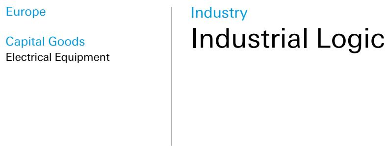

# Cyclicals: Back on the Menu?

Chart of the week: Sensitivity to IP vs price performance since Iran war
With the US and Iran signing an MoU last week, the Hormuz blockade lifted and the ceasefire extended by 60 days, the companies hit hardest by the war may now have the most to gain. Europe bore much of the pain given its sensitivity to energy prices, but as inflationary pressure fades and corporate investment sentiment recovers, capital goods names most exposed to industrial production should be well placed for a rebound. This week's chart plots the correlation between organic sales growth and German industrial production across our coverage, against share price performance since the start of the Iran war. Those with the highest short-cycle exposure, including KION, Knorr-Bremse and SKF, still trade below pre-war levels. As the market moves through the post-war aftershocks, a number of upcoming catalysts could support the recovery in the shares.

Figure 1: Cap goods sales growth correlation to German IP vs price performance since Iran war  
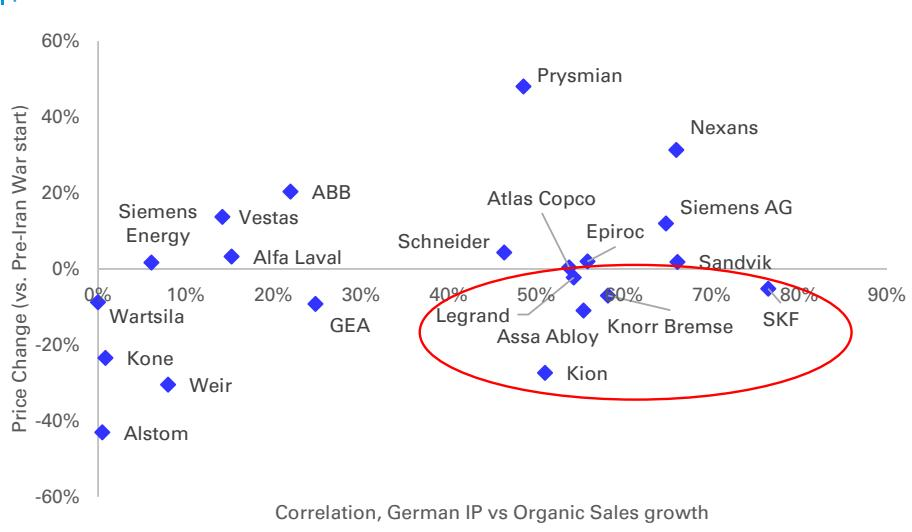  
Source : Company data, DB estimates, Bloomberg; Note: Price change since 27-Feb-2026

Periodical

Date
22 June 2026

John Kim

Research Analyst +44-20-754-18699

Nabil Najeeb
Research Analyst
+44-20-754-17410

Lars Vom-Cleff
Research Analyst
+49-69-910-13526

Seetharaman Ramakrishna
Research Associate

## DB AG

1/ Knorr-Bremse will provide a strategic update alongside Q2 results on 30 July, including new mid-term targets. We expect a 16%+ margin target for 2029 or 2030, around 2pts above its 2026 guidance. 2/ KION, meanwhile, continues to trade near historically low multiples, with the market giving little credit for its more resilient business mix versus prior cycles. A potential mid-single-digit cut to FY26 EBIT guidance should be a clearing event, while a better post-war growth outlook creates an attractive risk/reward skew. 3/ For SKF, the planned spin-off of the Automotive division remains on track for the autumn and should help drive a re-rating.

## Last week

Schneider announced a strategic collaboration with Foxconn to deliver integrated, ready-to-deploy solutions that enable customers to build AI data centers more rapidly and with greater efficiency. This collaboration brings together Foxconn's expertise in advanced compute platforms, AI rack integration, and global manufacturing with Schneider's expertise in power and cooling. Production will begin later this year.

Wärtsilä announced a 50/50 JV with RCT Solutions for its Energy Storage business with new investors possibly joining at a later stage. The company had struggled with profitability in Storage (6% target margins vs. core group margin of 14%), with the JV creating more vertical integration as RCT has been a key supplier to Wärtsilä for several years. The press release indicates that the JV will be loss-making in 2026, with -€40m to -€50m in expected EBIT contribution to Wärtsilä, including a negative impact from transformative actions such as the write-down of R&D. The deal is expected to close in Q3 2026, with the JV to be reported as a share of results in associated companies going forward.

According to Manager Magazin, Siemens Energy is looking into a potential separation of its Tol division through an IPO, the spin-off of a majority stake, or a merger with a competitor. If completed, the separation would allow Siemens Energy to fully refocus on electrification markets, eliminate its Oil&Gas/petrochemical exposure, and mechanically improve its margin profile by at least +50bps.

Fujikura raised its FY26 operating profit guide by 47%, and its H1 profit guide by 89% after just one quarter into the fiscal year. The upgrade came only a month after Fujikura provided a conservative FY26 guide, which lead to a sell-off in its shares. Fujikura has secured new orders for optical components, raised its prices and sees an easing of the impact from hydrogen shortages. While the update from Fujikura is supportive for sentiment in the space, the read-across for Prysmian is limited, in our view. Fujikura does not have meaningful domestic bare fiber capacity in the US (making it exposed to tariffs), while the previous FY26 guide took into account hydrogen shortages on the back of the war (while in Prysmian's case, the company was not affected by the Hormuz blockade for inputs such as hydrogen).

On Friday, Nexans' shares were up nearly 3%. We attribute the strength to its Electra event on Thursday. The Q&A with management was positive with CEO indicating that they would know the result of an MI project tender to replace GSI in the short term, by early Q3. Outside of transmission, management sounded very positive on the demand outlook within data centers, both in Europe (where large project momentum is accelerating) and in the US, with Republic Wire providing a springboard for its MV cable offering.

On the macro side, US Empire manufacturing index for June declined to +5.7 (vs. cons: +13.7) from +19.6 in May, Industrial production for May increased +0.1% MoM (vs. cons: +0.3%, April: +0.7%), Housing starts declined to 1.177m (cons: 1.43m) from 1.465m in April, and provisional building permits for May stayed almost flat MoM at 1.413m (vs. cons: 1.418m, Apr: 1.423m). Germany's ZEW survey expectations index for June improved to +10.5 (vs. cons: -5.5) from -10.2 in May and PPI increased to +2.2% YoY in May (vs. cons: +2.5%) from +1.7% in April. China's industrial production for May increased +4.5% YoY (vs. cons: +4.4%, April: +4.1%).

## This week

On the macro front, key releases this week include the provisional Eurozone, Germany, France - Manufacturing PMI for June, France's Manufacturing Confidence Index for June, and US - Richmond Fed manufacturing Index for June on Tuesday, US Building Permits MoM (May F) on Wednesday, followed by provisional US Wholesale inventories for May and Italy's Manufacturing Confidence Index for June on Friday. A full schedule is shown below.

Figure 2: Calendar of upcoming events this week

<table><tr><td></td><td>Event</td></tr><tr><td>23-Jun</td><td>Eurozone, Germany, France - Manufacturing PMI (June prov); France - Manufacturing Confidence Index (June); US - Richmond Fed manufacturing Index (June)</td></tr><tr><td>24-Jun</td><td>US - Building Permits MoM (May F)</td></tr><tr><td>26-Jun</td><td>US - Wholesale inventories MoM (May Prov); Italy - Manufacturing Confidence Index (June)</td></tr></table>

Source : DB, Bloomberg Finance LP

Sector weekly performance and valuation: The sector ended the week up +6.0%, and up +3.5% vs. the STOXX Europe 600. As of Thursday, the sector traded on a median 2026E P/E of 22.2x and EV/EBITA of 16.0x. For detailed valuation and risk sections, please see referenced reports.

## Table Of Contents

Reports you might have missed....5   
We read in the news....9   
European EV/EBITA Multiples....12   
European Share Price Performance....14   
US Share Price Performance....15   
Asia Share Price Performance....16   
Valuation table....17

## Reports you might have missed

Siemens Energy: TI in the spotlight: According to Manager Magazin (June 18), Siemens Energy is exploring the separation of its "Transformation of Industry" division (TI, €5.7bn revenue, 14% of group) through an IPO, the spin-off of a majority stake, or a merger with a competitor. If completed, we believe the move would benefit shareholders; it would allow Siemens Energy to fully refocus on electrification markets, eliminate its Oil&Gas/petrochemical exposure, and mechanically improve its margin profile (we estimate by at least +50bps). It would also simplify the group's reporting structure and make its profile even more comparable to that of GEV, potentially further reducing the gap between the two companies' valuation multiples. We rate the stock Buy. See full report here.

Kion: Six arguments for asymmetric upside: While the stock came under pressure due to valid concerns (unpredictable macro, rising interest rates, inflationary pressures, at-risk guidance), the extent of its decline (-40% YTD) appears excessively severe. KION is now trading nearing historically low multiples, both on an absolute and relative basis. With the risk of appearing naïve, we continue to believe that valuation matters. The current stock price already seems to reflect a worst-case scenario, suggesting the market may be underestimating the group's enhanced resilience characteristics including a more dynamic pricing strategy, escalation clauses in place and a lower breakeven point. Although a MSD downward revision to the FY26 EBIT guidance is possible, the buyside has already factored this in, and it should be viewed as a clearing event. The risk/reward profile is very asymmetric, as we see 20% downside risk and 100% upside potential. See full report here.

Assa Abloy: Q2'26 results due July 17 - volume growth remains subdued: Assa Abloy will release its Q2 results on July 17. After a subdued Q1 performance primarily due to adverse weather conditions and significant negative FX effects, we anticipate Q2 will better align with the group's usual standards, although still slightly below consensus estimates. So far this year, the M&A contribution has been relatively limited and volume growth has been modest compared to the sector average. Higher rates and weaker consumer confidence are further delaying the recovery of the residential market. We retain a Hold rating. See full report here.

Nexans: Feedback from the Electra event: We attended Nexans' inauguration of its third cable-laying vessel, Electra, in Oslo yesterday, which was followed by a Q&A with management. Electra is a best-in-class cable laying vessel with lower emissions that should help Nexans win more tenders and improve margins as it relies less on 3rd parties. Nexans should also know the result of an MI project tender to replace GSI in the short term, by early Q3. Outside of transmission, management sounded very positive on the demand outlook within data centers, both in Europe (where large project momentum is accelerating) and in the US, with Republic Wire providing a springboard for its MV cable offering. The valuation remains compelling with the shares trading at a deep c.40% discount to Prysmian, with a growing exposure to data centers and the US market. See full report here.

Sandvik: Q2 faces tougher order comps but trend growth remains intact: Sandvik reports Q2 results on July 17. The company is enjoying positive market dynamics in both mining and industrial exposures but growth comps get tougher from here in Mining. That said, we think the company will deliver Q2 results in line with DB estimates to slightly ahead of consensus for Q2 and the year. We see better positive operational leverage in the quarter, with c.300bps margin expansion yr/yr in group

EBITA and with forex less of a headwind (-80bps vs -240bps yr/yr in Q1). On the SMM side, tungsten pricing has come off its relative peak but continues to underpin positive price cost on cutting tools where we continue to see real growth. We remain BUY rated on the share with a new target price of 445 SEK. See full report here.

Epiroc: Fundamentals intact but limited ability to beat in the quarter: Epiroc is set to report Q2 results on July 17th. The quarter looks good with soft order comps in E&S, unchanged positive fundamentals with execution and margin delivery the watch items this year as the market looks for evidence that positive industry dynamics will translate to margin improvement more in-line with historic levels. DB estimates are in-line to slightly ahead for Q2 and full-year numbers for 2026. With no announced large orders in the quarter to date, visibility is lower on equipment orders and we trim our estimate here. With its recent capital markets day (link here), we expect little to no change in messaging on the company's outlook statement 'mining demand remains strong with construction expected to increase somewhat from a low level.' We maintain our HOLD rating but adjust our target price to 267 SEK. See full report here.

SKF: Q2 looks benign with separation on track, new target price 280 SEK: SKF reports Q2 2026 results on July 17th. DB estimates are in line with consensus at the group level on Q2 numbers with the expected spin of Automotive the larger driver for the share. Normal cyclicality has been distorted in 2025 and 2026 due to the start-stop nature of tariff changes, as well as various bouts of pre-buy activity. We continue to forecast modest volume recovery in late 2026 with recent cost inflation more of a headwind in H2. We remain positive on SKF as a share due to the expected re-rating post-spinoff of SKF Automotive and adjust our target price to 280 SEK as we maintain our BUY rating. See full report here.

GEA: A compelling mismatch / Upgrade to Buy: We upgrade GEA to Buy and raise our target price to EUR 70 (from EUR 64) as we now see a more compelling mismatch between the group's resilient fundamentals and the current valuation. We have become more confident in the outlook for improving revenue momentum, sustained margin expansion and continued execution against MISSION 30, supported by a favorable mix shift towards higher-margin service and digital revenues, additional cost savings and disciplined capital allocation. Against this background, we have increased our FY26E-FY28E EPS forecast by 4-6%. At the same time, GEA's defensive end-market exposure, low customer concentration and healthy order/backlog dynamics continue to underpin earnings resilience. Yet the shares trade at 10.3x EV/EBITDA, c.15% below their 10-year median and without the historical premium to peers, which in our view leaves the stock offering an attractive risk-reward profile from current levels. GEA management has already invested EUR 1.6m ytd in GEA shares via 13 disclosed purchases by all six board members, which we also view as a strong signal of confidence. Nevertheless, following the drop to a 52-week low at the beginning of this month, the stock has underperformed the MDAX and STOXX 600 Industrial Goods & Services ytd, leaving \~25% potential upside to our new price target. See full report here.

US and Asia Capital Goods
Humanoid Robot: Comparing Unitree, UBTECH, DEEP, Dobot and Leju: Opportunities and risks coexist
Iris Zheng, 15 June 2026

DeBLASEing the Trail: HVAC Update: It's Getting Hot In Here
Nicole DeBlase, 14 June 2026

## Macro

US Economic Perspectives: Yield to Warsh: 50bps of hikes in 2026
Matthew Luzzetti, 19 June 2026

UK Weekly Digest: The Consequences of Peace – What a MoU means for the UK
Sanjay Raja, 19 June 2026

Euro Weekly Digest: Memorandum is welcomed, but price pressures are already in the pipeline
Michael Kirker, 19 June 2026

Fed Notes: Who's who in the June 2026 dot plot
Matthew Luzzetti, 18 June 2026

UK economic notes: BoE Recap: A steady hand
Sanjay Raja, 18 June 2026

Focus Europe: Europe and 'China Shock 2.0': Competitiveness Under Pressure
Clemente Delucia, 18 June 2026

Thematic Research: AI's tightest bottleneck: Memory chips
Marion Laboure, 18 June 2026

Focus Europe: Inflation Chartbook: Energy shock might be peaking, but inflation persistence risks have not disappeared
Maria Contreras, 17 June 2026

Fed Notes: June FOMC recap: Rock Chalk, Warsh-hawk
Matthew Luzzetti, 17 June 2026

UK Macro Handbook: Inflation Chartbook – More Discounts, More Time
Sanjay Raja, 17 June 2026

Europe Blog: What to expect for China trade defence, competitiveness & the next EU budget
Marion Muehlberger, 17 June 2026

Hsueh On Oil: New data points
Michael Hsueh, 16 June 2026

Thematic Research: AI twist in the tale for Anthropic's Fable and Mythos
Adrian Cox, 16 June 2026

Thematic Research: Is the Ceasefire a reset: Iran, the US and the Middle East they can't restore
Helen Belopolsky, 16 June 2026

China Macro: May activity: deepening K-shaped divide
Yi Xiong, 16 June 2026

Europe Blog: Core goods inflation, is it back?
Maria Contreras, 15 June 2026

US Economic Chartbook: Who is buying Treasuries, mortgages, credit and munis? (June 2026)
Steven Zeng, 15 June 2026

China Macro: RMB Internationalization Blog (4): How China Becomes an Exporter of Capital
Yi Xiong, 15 June 2026

## We read in the news

System solutions for Europe's new train platform: Knorr-Bremse wins contract from Siemens Mobility: Rail travel across Europe is becoming more important, attractive, and popular. Siemens Mobility has created Vectouro, a new passenger train platform for flexible international use in Europe. Knorr-Bremse is supplying key technologies – including braking and entrance systems – to enhance the performance, availability, and efficiency of the trains. Equipment contract with an order volume for Knorr-Bremse in the mid double-digit million-euro range. (Source: Knorr-Bremse, 18 June 2026)

Alstom-led consortium signed €690 million to modernise Egypt's strategic rail corridors: Alstom, leading a consortium with Rowad Modern Engineering and Concrete Plus, has signed four landmark contracts with Egyptian National Railways (ENR) to modernise Egypt's strategic railway corridors, covering the 6th of October–Alexandria corridor and Belbes–10th of Ramadan (B10) line. The combined value of the contracts is approximately €690 million, with Alstom's share representing around €300 million. As four of Egypt's most significant rail modernisation projects, the contracts support Egypt Vision 2030 by strengthening national logistics and improving connectivity between new dry ports, industrial zones, and major seaports. The 6th of October–Alexandria corridor, valued at €550 million, of which Alstom's share amounts to approximately €240 million, will be delivered across three major implementation lots. It will modernise the corridor with next-generation digital railway systems, upgraded telecommunications, reinforced power supply, and comprehensive civil and track rehabilitation. These enhancements will improve safety, increase capacity, enhance operational reliability, and reduce full route travel time by nearly 80 minutes. The Belbes–10th of Ramadan (B10) project, valued at approximately €140 million, of which Alstom's share amounts to approximately €60 million, will introduce the same advanced railway technologies and modernisation scope. It will enhance connectivity to one of Egypt's largest industrial hubs, strengthening freight efficiency and supporting industrial growth across the eastern logistics corridor. By transforming freight operations between the 6th of October Dry Port and the Alexandria Seaport and enhancing rail connectivity to the 10th of Ramadan industrial zone, the projects will strengthen links between Egypt's major logistics hubs and maritime gateways. They will help ease supply chain bottlenecks, support sustainable freight transport, and boost national and regional trade flows. (Source: Alstom, 18 June 2026)

Schindler Holding Ltd. increases ongoing share buyback program to up to CHF 700 million: The Board of Directors has resolved to increase the total value of the ongoing share buyback program to up to CHF 700 million. On October 17, 2024, Schindler Holding Ltd. announced a share buyback program for registered shares and participation certificates with a total value of up to CHF 500 million. The program was launched in November 2024 and is expected to be completed by November 2026 at the latest. The buyback is being conducted on second trading lines on the SIX Swiss Exchange. With immediate effect, the ongoing share buyback program will be increased by up to CHF 200 million. The total value of the program therefore now amounts to up to CHF 700 million. All other terms stated in the buyback notice dated November 5, 2024, remain valid. The Board of Directors intends to cancel the repurchased registered shares and participation certificates by way of a capital reduction to be resolved by the next Annual General Meeting. (Source: Schindler, 17 June 2026)

first time: Siemens Energy and Neptun Smulders Offshore Renewables (NSORe) have been awarded a contract to deliver a new grid connection system for offshore wind farms in the North Sea for German transmission system operator, 50Hertz. The connection, known as North Sea Connector 2, will enable up to 2 gigawatts of wind power to be transmitted from offshore to onshore in the future. The offshore converter platform will be fabricated by NSORe, a joint venture between Neptun Werft - part of the German Meyer Werft Group - and the Belgian construction company Smulders, primarily at the Neptun Werft shipyard in Rostock-Warnemünde. Siemens Energy will equip the platform with electrical transmission technologies, which will largely be manufactured at the company's German factories. Siemens Energy has also been awarded a long-term service contract to cover maintenance, IT services, and on-call support. The company expects to fully book the order in the next fiscal year starting on October 1, 2026. (Source: Siemens Energy, 17 June 2026)

Siemens partners with Databricks and FFT to turn production data into scalable AI-driven insights: Siemens announced a new edge-to-cloud integration with Databricks, the Data and AI company, and long time automation partner FFT Produktionssysteme GmbH (FFT). Together, the partners will connect production data directly to enterprise AI – without complex IoT middleware. This will help industrial customers transform their data into actionable insights and scale industrial AI across global operations. With the new integration, customers are able to stream contextualized shopfloor and plant data from Siemens Industrial Edge via the FFT DataBridge directly to the Databricks Platform, where it can be analyzed and used to train AI models centrally for implementation across global production networks. These models can then be deployed back to the edge for execution at the point of production. This approach helps industrial companies optimize their operations, reduce costs and increase productivity with low latency, data driven decision making. It lays the foundation for physical AI and future autonomous operations. (Source: Siemens, 16 June 2026)

Sandvik wins SEK 350 million mining equipment order in Australia: Sandvik has received a major equipment order from the Australia-based mining contractor Barminco, to be deployed at the Bellevue Gold Project in Western Australia. The order is valued at approximately SEK 350 million and was booked in the second quarter of 2026. The order includes underground loaders, trucks and drill rigs, with deliveries expected to begin in the third quarter of 2026 and continue through the first quarter of 2027. Sandvik will also provide rock tools and parts and services. (Source: Sandvik, 15 June 2026)

Wärtsilä to establish a joint venture for its global Energy Storage business with RCT Solutions GmbH and discontinue Energy Storage as a separate reporting segment: Wärtsilä has agreed to establish a joint venture with German company RCT Solutions GmbH for its global Energy Storage business. The ownership structure of the joint venture will be 50% RCT Solutions and 50% Wärtsilä. At a later stage, new investors may join the joint venture, which could reduce the ownership of the initial shareholders. The joint venture would include Wärtsilä's Energy Storage business currently reported as a separate segment. The Energy Storage business has been the smallest segment within Wärtsilä, with about 480 employees globally and net sales of EUR 694 million with a profitability of 3.3% in 2025. Wärtsilä would transfer net assets representing less than 5% of Wärtsilä's total net assets into the joint venture. Wärtsilä's Energy Storage business supports the decarbonisation of the energy market by delivering utility-scale integrated battery energy storage systems (BESS) and optimisation with proven reliability, flexibility, and safety. The portfolio includes high-performance hardware, intelligent controls and optimisation software, and full-service lifecycle support. RCT Solutions GmbH is a German engineering company, founded in 2012, with strong international expertise in solar and battery energy storage systems (BESS). RCT Solutions brings strong market knowhow, business execution capability, knowledge of the global supply chain, as well as an opportunity for vertical integration through an existing integrated BESS manufacturing initiative in the USA in the near term. RCT has led the engineering and establishment of several battery and solar manufacturing facilities worldwide, while one of the RCT companies has supported Wärtsilä Energy Storage as a key supplier for several years. (Source: Wartsila, 15 June 2026)

Schneider Electric and Hon Hai Technology Group (Foxconn) announce strategic collaboration to accelerate next-generation AI data centers: Schneider Electric, a global energy technology leader, today announced a strategic collaboration with Hon Hai Technology Group (Foxconn), the world's largest electronics manufacturer, to help define and scale the next generation of AI data centers. As AI adoption surges, the demands on digital infrastructure are being fundamentally reshaped. This collaboration brings together Foxconn's unmatched expertise in advanced compute platforms, AI rack integration, and global manufacturing with Schneider Electric's leadership in power systems, cooling, and energy management. Together, the companies aim to deliver integrated, ready-to-deploy solutions that enable customers to build and operate AI infrastructure with greater speed, efficiency, and predictability across regions. Production will begin later this year. Through this collaboration, Foxconn and Schneider Electric will co-develop next-generation reference architectures for AI data centers. The partnership will also explore innovations in closed-loop energy optimization, modular power and cooling skids, and standardized design frameworks, creating repeatable, high-performance blueprints for AI factories worldwide. By aligning manufacturing excellence with energy intelligence, the two companies are setting the foundation for a new class of AI infrastructure that is scalable by design, efficient by default, and ready to meet the accelerating demands of the AI era. (Source: Schneider Electric, 15 June 2026)

## European EV/EBITA Multiples

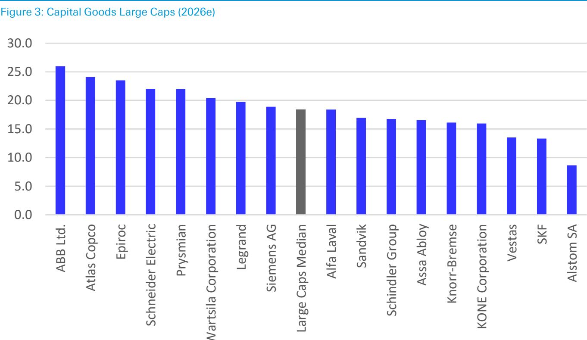  
Source : DB estimates. \*Multiples as close on 18 June 2026

Figure 4: Capital Goods SMID Caps (2026e)  
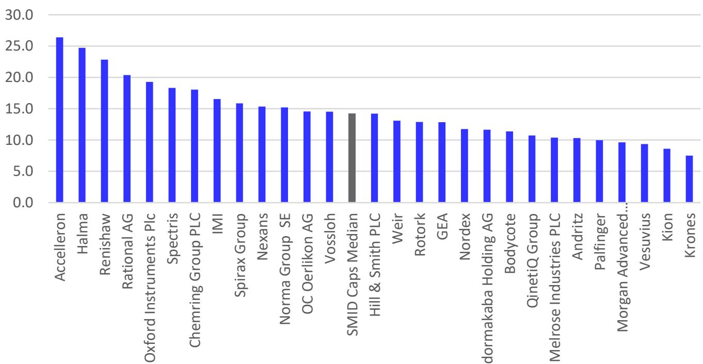  
Source : DB estimates. \*Multiples as of close on 18 June 2026

European Share Price Performance  
Figure 5: Europe 1 week performance  
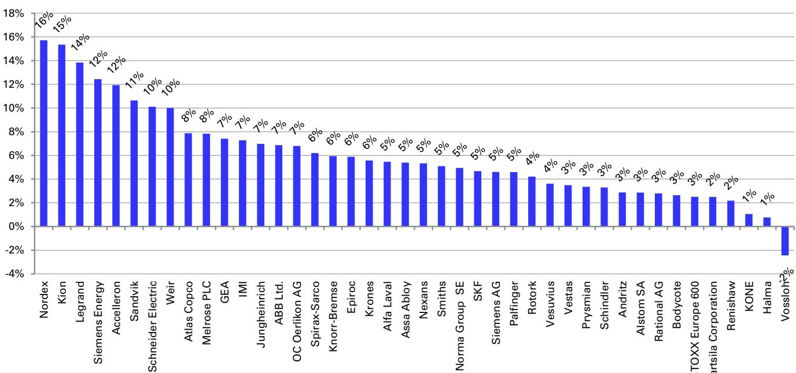  
Source : DB, Bloomberg Finance LP. \*Prices as of close on 18 June 2026, change is vs. on 11 June 2026

Figure 6: Europe YTD performance  
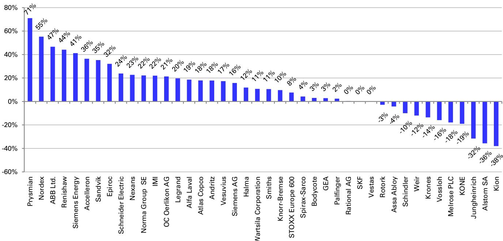  
Source : DB, Bloomberg Finance LP. \*Prices as of close on 18 June 2026

## US Share Price Performance

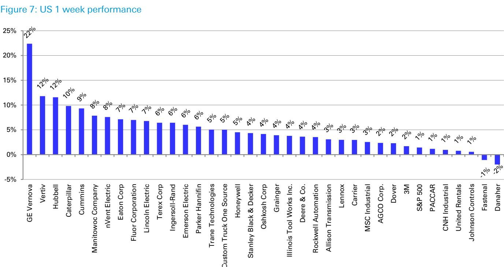  
Source : DB, Bloomberg Finance LP. \*Prices as of close on 18 June 2026, change is vs. close on 11 June 2026

Figure 8: US YTD performance  
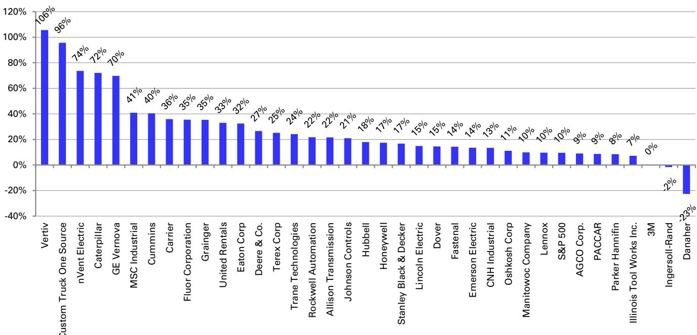  
Source : DB, Bloomberg Finance LP. \*Prices as of close on 18 June 2026

## Asia Share Price Performance

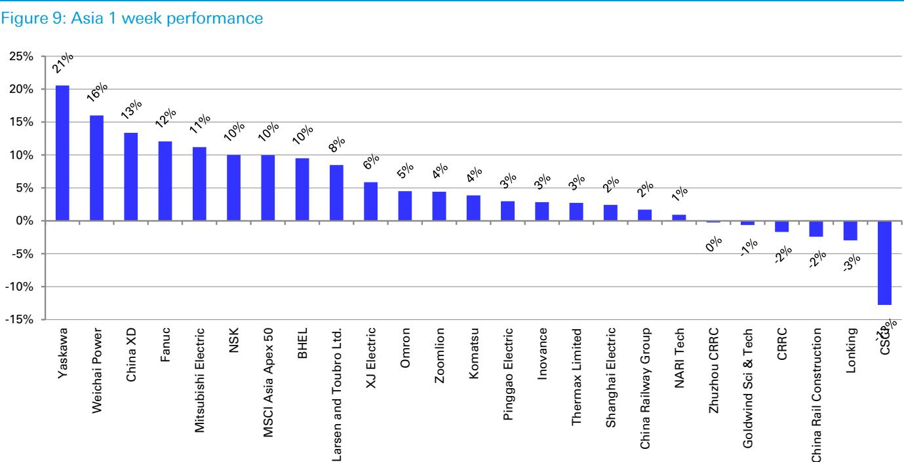  
Source : DB, Bloomberg Finance LP. \*Prices as of close on 18 June 2026, change is vs. on 11 June 2026

Figure 10: Asia YTD performance  
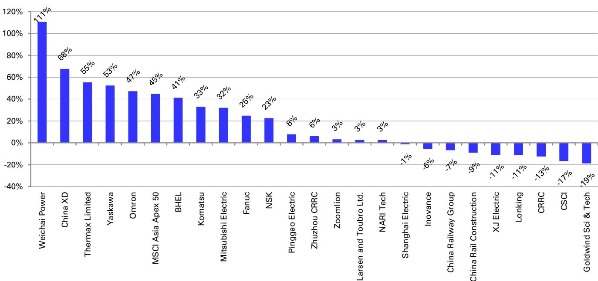  
Source : DB, Bloomberg Finance LP. \*Prices as of close on 18 June 2026

## Valuation table

Figure 11: European valuation table

<table><tr><td colspan="17">DB European Capital Goods Valuation Table</td></tr><tr><td>19 Jun 2026</td><td></td><td rowspan="2">Current Price</td><td rowspan="2">Target Price</td><td rowspan="2">Upside/ downside</td><td rowspan="2">Rating</td><td rowspan="2">Mcap EURm</td><td colspan="2">PE **</td><td colspan="2">EV/EBITA **</td><td colspan="2">FCF yield **</td><td colspan="2">EV/Sales</td><td>EBITA Margin (%)</td><td>Div. yield (%)*</td></tr><tr><td>Company Name</td><td>Lead Analyst</td><td>2026</td><td>2027</td><td>2026</td><td>2027</td><td>2026</td><td>2027</td><td>2026</td><td>2027</td><td>2026</td><td>2026</td></tr><tr><td>ABB Ltd.</td><td>Gael de-Bray, CFA</td><td>86.9</td><td>68.0</td><td>-21.7%</td><td>Hold</td><td>134,493</td><td>34.7</td><td>30.6</td><td>26.0</td><td>22.5</td><td>2.3</td><td>3.0</td><td>5.1</td><td>4.6</td><td>19.5</td><td>1.2</td></tr><tr><td>Alfa Laval</td><td>John Kim</td><td>552.6</td><td>570.0</td><td>3.1%</td><td>Buy</td><td>20,828</td><td>24.4</td><td>23.0</td><td>18.4</td><td>16.9</td><td>4.0</td><td>3.2</td><td>3.3</td><td>3.0</td><td>17.9</td><td>1.7</td></tr><tr><td>Alstom SA</td><td>Gael de-Bray, CFA</td><td>16.2</td><td>19.0</td><td>17.3%</td><td>Hold</td><td>7,476</td><td>10.4</td><td>8.5</td><td>8.6</td><td>6.8</td><td>NM</td><td>5.4</td><td>0.5</td><td>0.4</td><td>5.4</td><td>0.0</td></tr><tr><td>Assa Abloy</td><td>Gael de-Bray, CFA</td><td>343.5</td><td>340.0</td><td>-1.0%</td><td>Hold</td><td>34,794</td><td>22.2</td><td>20.4</td><td>16.5</td><td>15.1</td><td>4.7</td><td>4.9</td><td>2.8</td><td>2.6</td><td>16.8</td><td>2.0</td></tr><tr><td>Atlas Copco</td><td>John Kim</td><td>195.9</td><td>190.0</td><td>-3.0%</td><td>Hold</td><td>86,987</td><td>31.5</td><td>27.9</td><td>24.1</td><td>21.1</td><td>3.1</td><td>3.3</td><td>5.5</td><td>5.0</td><td>22.8</td><td>1.6</td></tr><tr><td>Epiroc</td><td>John Kim</td><td>277.2</td><td>267.0</td><td>-3.7%</td><td>Hold</td><td>30,234</td><td>32.1</td><td>27.0</td><td>23.5</td><td>19.8</td><td>2.5</td><td>2.8</td><td>5.1</td><td>4.4</td><td>21.6</td><td>1.4</td></tr><tr><td>Knorr-Bremse</td><td>Gael de-Bray, CFA</td><td>104.4</td><td>115.0</td><td>10.2%</td><td>Buy</td><td>16,829</td><td>22.2</td><td>19.4</td><td>16.1</td><td>14.0</td><td>3.8</td><td>4.8</td><td>2.3</td><td>2.2</td><td>14.5</td><td>2.0</td></tr><tr><td>KONE Corporation</td><td>John Kim</td><td>49.0</td><td>66.0</td><td>34.6%</td><td>Buy</td><td>25,411</td><td>22.0</td><td>19.5</td><td>16.0</td><td>14.0</td><td>5.3</td><td>6.1</td><td>2.1</td><td>1.9</td><td>13.1</td><td>4.0</td></tr><tr><td>Legrand</td><td>Gael de-Bray, CFA</td><td>152.3</td><td>148.0</td><td>-2.8%</td><td>Hold</td><td>39,681</td><td>26.3</td><td>23.9</td><td>19.7</td><td>17.7</td><td>3.5</td><td>4.1</td><td>4.1</td><td>3.7</td><td>20.7</td><td>1.7</td></tr><tr><td>Prysmian</td><td>Nabil Najeeb</td><td>147.8</td><td>167.0</td><td>13.0%</td><td>Buy</td><td>42,365</td><td>33.1</td><td>27.7</td><td>22.0</td><td>18.7</td><td>2.8</td><td>2.8</td><td>2.1</td><td>1.9</td><td>9.3</td><td>0.7</td></tr><tr><td>Sandvik</td><td>John Kim</td><td>406.7</td><td>445.0</td><td>9.4%</td><td>Buy</td><td>46,522</td><td>21.7</td><td>19.4</td><td>17.0</td><td>14.8</td><td>3.9</td><td>4.5</td><td>3.8</td><td>3.3</td><td>22.3</td><td>1.5</td></tr><tr><td>Schindler Group</td><td>John Kim</td><td>261.0</td><td>290.0</td><td>11.1%</td><td>Hold</td><td>29,907</td><td>24.6</td><td>23.1</td><td>16.8</td><td>15.7</td><td>5.0</td><td>5.4</td><td>2.3</td><td>2.2</td><td>13.9</td><td>2.6</td></tr><tr><td>Schneider Electric</td><td>Gael de-Bray, CFA</td><td>291.0</td><td>300.0</td><td>3.1%</td><td>Buy</td><td>163,890</td><td>30.0</td><td>25.6</td><td>22.0</td><td>18.8</td><td>2.8</td><td>3.5</td><td>4.1</td><td>3.7</td><td>18.5</td><td>1.7</td></tr><tr><td>Siemens AG</td><td>Gael de-Bray, CFA</td><td>276.8</td><td>255.0</td><td>-7.9%</td><td>Hold</td><td>214,873</td><td>25.3</td><td>22.0</td><td>18.9</td><td>15.9</td><td>3.3</td><td>3.8</td><td>2.8</td><td>2.5</td><td>14.7</td><td>2.0</td></tr><tr><td>Siemens Energy</td><td>Gael de-Bray, CFA</td><td>169.3</td><td>200.0</td><td>18.1%</td><td>Buy</td><td>137,889</td><td>36.5</td><td>27.1</td><td>28.1</td><td>19.9</td><td>5.0</td><td>3.2</td><td>3.2</td><td>2.8</td><td>11.2</td><td>1.0</td></tr><tr><td>SKF</td><td>John Kim</td><td>246.1</td><td>280.0</td><td>13.8%</td><td>Buy</td><td>10,219</td><td>19.4</td><td>15.7</td><td>13.3</td><td>11.0</td><td>4.3</td><td>6.0</td><td>1.4</td><td>1.3</td><td>10.3</td><td>2.9</td></tr><tr><td>Vestas</td><td>John Kim</td><td>173.6</td><td>190.0</td><td>9.4%</td><td>Hold</td><td>22,784</td><td>19.7</td><td>16.4</td><td>13.5</td><td>10.7</td><td>5.6</td><td>6.7</td><td>1.0</td><td>0.8</td><td>7.3</td><td>0.5</td></tr><tr><td>Wartsila Corporation</td><td>John Kim</td><td>33.7</td><td>35.0</td><td>3.9%</td><td>Hold</td><td>19,819</td><td>31.0</td><td>27.5</td><td>20.4</td><td>17.9</td><td>3.3</td><td>3.1</td><td>2.8</td><td>2.6</td><td>14.0</td><td>1.6</td></tr><tr><td colspan="7">Large cap electricals &amp; machinery median</td><td>24.9</td><td>23.1</td><td>18.6</td><td>16.4</td><td>3.8</td><td>4.0</td><td>2.8</td><td>2.6</td><td>14.6</td><td>1.6</td></tr><tr><td>Accelleron</td><td>John Kim</td><td>84.0</td><td>74.0</td><td>-11.9%</td><td>Hold</td><td>6,656</td><td>34.2</td><td>30.4</td><td>26.4</td><td>23.5</td><td>2.8</td><td>2.7</td><td>6.8</td><td>6.1</td><td>25.6</td><td>1.8</td></tr><tr><td>Andritz</td><td>Lars vom-Cleff</td><td>78.7</td><td>90.0</td><td>14.4%</td><td>Buy</td><td>7,713</td><td>13.8</td><td>12.8</td><td>10.3</td><td>9.1</td><td>6.3</td><td>7.2</td><td>0.9</td><td>0.8</td><td>9.0</td><td>3.5</td></tr><tr><td>Bodycote</td><td>Thomas Elgar, CFA</td><td>719.0</td><td>960.0</td><td>33.5%</td><td>Buy</td><td>1,416</td><td>15.0</td><td>13.2</td><td>11.4</td><td>10.3</td><td>5.4</td><td>7.6</td><td>1.9</td><td>1.9</td><td>16.9</td><td>3.3</td></tr><tr><td>Chemring Group PLC</td><td>Richard Paige</td><td>487.4</td><td>650.0</td><td>33.4%</td><td>Buy</td><td>1,532</td><td>23.8</td><td>21.0</td><td>18.1</td><td>15.7</td><td>NM</td><td>2.5</td><td>2.7</td><td>2.4</td><td>15.0</td><td>1.7</td></tr><tr><td>dormakaba Holding AG</td><td>Lars vom-Cleff</td><td>54.2</td><td>77.0</td><td>42.1%</td><td>Buy</td><td>2,267</td><td>18.4</td><td>16.1</td><td>11.6</td><td>10.5</td><td>10.8</td><td>11.1</td><td>1.5</td><td>1.4</td><td>12.8</td><td>2.0</td></tr><tr><td>GEA</td><td>Lars vom-Cleff</td><td>59.6</td><td>70.0</td><td>17.5%</td><td>Buy</td><td>9,704</td><td>18.1</td><td>16.8</td><td>12.8</td><td>11.5</td><td>5.2</td><td>5.7</td><td>1.7</td><td>1.6</td><td>13.3</td><td>2.5</td></tr><tr><td>Halma</td><td>Richard Paige</td><td>3,958.0</td><td>3,980.0</td><td>0.6%</td><td>Hold</td><td>17,255</td><td>32.6</td><td>30.4</td><td>24.7</td><td>22.9</td><td>3.1</td><td>3.3</td><td>5.6</td><td>5.2</td><td>22.4</td><td>0.7</td></tr><tr><td>Hill &amp; Smith PLC</td><td>Richard Paige</td><td>2,875.0</td><td>2,975.0</td><td>3.5%</td><td>Buy</td><td>2,586</td><td>20.3</td><td>18.5</td><td>14.2</td><td>13.4</td><td>3.4</td><td>5.2</td><td>2.5</td><td>2.4</td><td>17.6</td><td>2.0</td></tr><tr><td>IMI</td><td>Richard Paige</td><td>3,036.0</td><td>3,250.0</td><td>7.0%</td><td>Buy</td><td>8,334</td><td>21.9</td><td>20.8</td><td>16.5</td><td>16.3</td><td>4.8</td><td>5.1</td><td>3.3</td><td>3.3</td><td>20.0</td><td>1.2</td></tr><tr><td>Kion</td><td>Gael de-Bray, CFA</td><td>42.4</td><td>63.0</td><td>48.6%</td><td>Buy</td><td>5,559</td><td>12.4</td><td>9.4</td><td>8.6</td><td>6.7</td><td>6.4</td><td>9.4</td><td>0.7</td><td>0.6</td><td>7.7</td><td>2.1</td></tr><tr><td>Krones</td><td>Lars vom-Cleff</td><td>117.8</td><td>180.0</td><td>52.8%</td><td>Buy</td><td>3,722</td><td>11.6</td><td>10.0</td><td>7.5</td><td>6.1</td><td>7.0</td><td>8.7</td><td>0.6</td><td>0.5</td><td>7.6</td><td>2.8</td></tr><tr><td>Melrose Industries PLC</td><td>Richard Paige</td><td>483.3</td><td>570.0</td><td>17.9%</td><td>Hold</td><td>6,831</td><td>12.5</td><td>10.3</td><td>10.4</td><td>8.8</td><td>3.4</td><td>4.1</td><td>2.0</td><td>1.8</td><td>18.9</td><td>1.8</td></tr><tr><td>Morgan Advanced Materials f</td><td>Richard Paige</td><td>228.0</td><td>210.0</td><td>-7.9%</td><td>Hold</td><td>728</td><td>13.9</td><td>12.4</td><td>9.6</td><td>9.4</td><td>3.3</td><td>4.8</td><td>0.9</td><td>0.9</td><td>9.7</td><td>5.4</td></tr><tr><td>Nexans</td><td>Nabil Najeeb</td><td>154.4</td><td>179.0</td><td>15.9%</td><td>Buy</td><td>6,726</td><td>23.4</td><td>17.9</td><td>15.4</td><td>11.6</td><td>2.8</td><td>4.5</td><td>0.8</td><td>0.7</td><td>5.3</td><td>2.1</td></tr><tr><td>Nordex</td><td>John Kim</td><td>45.4</td><td>59.0</td><td>30.0%</td><td>Buy</td><td>10,730</td><td>22.7</td><td>18.5</td><td>11.7</td><td>9.0</td><td>6.2</td><td>6.4</td><td>1.0</td><td>0.8</td><td>8.2</td><td>0.0</td></tr><tr><td>Oxford Instruments Plc</td><td>Richard Paige</td><td>3,018.0</td><td>3,450.0</td><td>14.3%</td><td>Buy</td><td>1,921</td><td>26.9</td><td>24.0</td><td>19.3</td><td>17.0</td><td>2.7</td><td>3.6</td><td>3.5</td><td>3.2</td><td>17.9</td><td>0.8</td></tr><tr><td>Palfinger</td><td>Lars vom-Cleff</td><td>34.2</td><td>48.0</td><td>40.6%</td><td>Buy</td><td>1,284</td><td>13.1</td><td>10.9</td><td>10.0</td><td>8.4</td><td>7.3</td><td>7.8</td><td>0.7</td><td>0.6</td><td>7.1</td><td>2.9</td></tr><tr><td>QinetiQ Group</td><td>Richard Paige</td><td>439.8</td><td>600.0</td><td>36.4%</td><td>Buy</td><td>2,716</td><td>13.1</td><td>12.0</td><td>10.7</td><td>10.1</td><td>7.0</td><td>9.0</td><td>1.2</td><td>1.1</td><td>11.2</td><td>2.7</td></tr><tr><td>Rational AG</td><td>Lars vom-Cleff</td><td>668.0</td><td>773.0</td><td>15.7%</td><td>Hold</td><td>7,595</td><td>29.0</td><td>26.7</td><td>20.4</td><td>18.6</td><td>3.7</td><td>3.5</td><td>5.2</td><td>4.8</td><td>25.6</td><td>2.5</td></tr><tr><td>Renishaw</td><td>Richard Paige</td><td>5,060.0</td><td>4,960.0</td><td>-2.0%</td><td>Hold</td><td>4,245</td><td>29.4</td><td>27.1</td><td>22.8</td><td>20.6</td><td>2.2</td><td>3.1</td><td>4.2</td><td>3.9</td><td>18.4</td><td>1.7</td></tr><tr><td>Rotork</td><td>Thomas Elgar, CFA</td><td>316.4</td><td>400.0</td><td>26.4%</td><td>Buy</td><td>3,001</td><td>18.5</td><td>17.5</td><td>12.9</td><td>12.0</td><td>4.7</td><td>5.5</td><td>3.2</td><td>3.0</td><td>24.6</td><td>2.7</td></tr><tr><td>Spirax Group</td><td>Thomas Elgar, CFA</td><td>7,110.0</td><td>7,500.0</td><td>5.5%</td><td>Hold</td><td>6,044</td><td>22.5</td><td>20.1</td><td>15.9</td><td>14.3</td><td>3.8</td><td>4.1</td><td>3.3</td><td>3.1</td><td>20.5</td><td>2.5</td></tr><tr><td>Vesuvius</td><td>Thomas Elgar, CFA</td><td>465.6</td><td>440.0</td><td>-5.5%</td><td>Hold</td><td>1,327</td><td>12.5</td><td>10.7</td><td>9.3</td><td>8.2</td><td>8.3</td><td>9.2</td><td>0.8</td><td>0.8</td><td>8.9</td><td>5.1</td></tr><tr><td>Vossloh</td><td>Lars vom-Cleff</td><td>64.3</td><td>87.0</td><td>35.3%</td><td>Buy</td><td>1,242</td><td>17.4</td><td>15.6</td><td>14.5</td><td>13.2</td><td>5.9</td><td>7.0</td><td>1.3</td><td>1.2</td><td>9.2</td><td>1.9</td></tr><tr><td>Weir</td><td>John Kim</td><td>2,506.0</td><td>3,230.0</td><td>28.9%</td><td>Buy</td><td>7,457</td><td>18.9</td><td>17.3</td><td>13.1</td><td>12.0</td><td>5.3</td><td>5.7</td><td>2.7</td><td>2.5</td><td>20.9</td><td>1.8</td></tr><tr><td colspan="7">Mid cap &amp; UK machinery median</td><td>18.7</td><td>17.4</td><td>13.0</td><td>11.8</td><td>4.8</td><td>5.3</td><td>1.8</td><td>1.7</td><td>14.1</td><td>2.0</td></tr></table>

Figure 12: US valuation table

<table><tr><td colspan="17">DB North America Capital Goods Valuation Table</td></tr><tr><td colspan="17">19 Jun 2026</td></tr><tr><td rowspan="2">Company Name</td><td rowspan="2">Lead Analyst</td><td rowspan="2">Current Price</td><td rowspan="2">Target Price</td><td rowspan="2">Upside/ downside</td><td rowspan="2">Rating</td><td rowspan="2">Mcap EURm</td><td colspan="2">PE**</td><td colspan="2">EV/EBITA**</td><td colspan="2">FCF yield**</td><td colspan="2">EV/Sales</td><td>EBITA Margin (%)</td><td>Div. yield (%)* **</td></tr><tr><td>2026</td><td>2027</td><td>2026</td><td>2027</td><td>2026</td><td>2027</td><td>2026</td><td>2027</td><td>2026</td><td>2026</td></tr><tr><td>3M</td><td>Nicole DeBlase</td><td>160.6</td><td>171.0</td><td>6.5%</td><td>Hold</td><td>73,798</td><td>18.7</td><td>17.3</td><td>15.3</td><td>14.4</td><td>3.3</td><td>4.9</td><td>3.7</td><td>3.6</td><td>24.1</td><td>1.9</td></tr><tr><td>Dover</td><td>Nicole DeBlase</td><td>223.6</td><td>229.0</td><td>2.4%</td><td>Hold</td><td>26,291</td><td>21.1</td><td>19.8</td><td>19.5</td><td>17.2</td><td>4.0</td><td>4.6</td><td>3.6</td><td>3.3</td><td>18.3</td><td>1.0</td></tr><tr><td>Eaton Corp</td><td>Nicole DeBlase</td><td>421.8</td><td>461.0</td><td>9.3%</td><td>Buy</td><td>142,648</td><td>31.5</td><td>25.8</td><td>28.6</td><td>22.3</td><td>2.5</td><td>3.2</td><td>5.6</td><td>5.0</td><td>19.6</td><td>1.0</td></tr><tr><td>Emerson Electric</td><td>Nicole DeBlase</td><td>150.7</td><td>164.0</td><td>8.9%</td><td>Hold</td><td>73,479</td><td>23.4</td><td>21.4</td><td>21.1</td><td>20.3</td><td>4.2</td><td>4.5</td><td>5.0</td><td>4.7</td><td>23.8</td><td>1.5</td></tr><tr><td>GE Vernova</td><td>Nicole DeBlase</td><td>1,109.7</td><td>1,288.0</td><td>16.1%</td><td>Buy</td><td>259,758</td><td>87.6</td><td>45.8</td><td>59.3</td><td>32.1</td><td>2.6</td><td>2.2</td><td>6.3</td><td>5.3</td><td>10.6</td><td>0.0</td></tr><tr><td>Honeywell</td><td>Nicole DeBlase</td><td>229.0</td><td>250.0</td><td>9.2%</td><td>Buy</td><td>126,741</td><td>21.7</td><td>19.8</td><td>21.2</td><td>19.1</td><td>3.6</td><td>4.3</td><td>4.2</td><td>3.9</td><td>19.7</td><td>2.2</td></tr><tr><td>Hubbell</td><td>Nicole DeBlase</td><td>523.7</td><td>520.0</td><td>-0.7%</td><td>Hold</td><td>24,212</td><td>26.2</td><td>24.0</td><td>19.7</td><td>17.8</td><td>3.6</td><td>3.7</td><td>4.5</td><td>4.1</td><td>22.9</td><td>1.1</td></tr><tr><td>Illinois Tool Works Inc.</td><td>Nicole DeBlase</td><td>264.1</td><td>286.0</td><td>8.3%</td><td>Hold</td><td>65,832</td><td>23.4</td><td>21.7</td><td>18.7</td><td>17.6</td><td>4.3</td><td>4.7</td><td>5.0</td><td>4.9</td><td>27.0</td><td>2.5</td></tr><tr><td>Ingersoll-Rand</td><td>Nicole DeBlase</td><td>77.9</td><td>86.0</td><td>10.4%</td><td>Hold</td><td>26,567</td><td>22.3</td><td>21.0</td><td>16.3</td><td>15.0</td><td>4.3</td><td>5.1</td><td>4.1</td><td>3.9</td><td>25.5</td><td>0.0</td></tr><tr><td>nVent Electric</td><td>Nicole DeBlase</td><td>177.0</td><td>187.0</td><td>5.6%</td><td>Buy</td><td>24,950</td><td>38.3</td><td>29.9</td><td>28.3</td><td>22.3</td><td>2.5</td><td>2.9</td><td>5.9</td><td>4.9</td><td>20.7</td><td>0.5</td></tr><tr><td>Parker Hannifin</td><td>Nicole DeBlase</td><td>953.3</td><td>896.0</td><td>-6.0%</td><td>Hold</td><td>104,861</td><td>28.2</td><td>NA</td><td>24.3</td><td>NA</td><td>3.5</td><td>NA</td><td>5.6</td><td>NA</td><td>23.0</td><td>0.9</td></tr><tr><td>Johnson Controls</td><td>Nicole DeBlase</td><td>144.8</td><td>164.0</td><td>13.2%</td><td>Buy</td><td>76,936</td><td>29.8</td><td>25.3</td><td>24.9</td><td>20.9</td><td>3.3</td><td>3.4</td><td>3.8</td><td>3.5</td><td>15.3</td><td>1.1</td></tr><tr><td>Otis Worldwide</td><td>Nicole DeBlase</td><td>73.3</td><td>90.0</td><td>22.8%</td><td>Hold</td><td>24,611</td><td>17.8</td><td>16.6</td><td>14.2</td><td>13.4</td><td>6.2</td><td>6.0</td><td>2.3</td><td>2.2</td><td>16.3</td><td>0.0</td></tr><tr><td>Rockwell Automation</td><td>Nicole DeBlase</td><td>473.8</td><td>438.0</td><td>-7.6%</td><td>Hold</td><td>46,246</td><td>36.8</td><td>33.5</td><td>30.9</td><td>27.3</td><td>2.7</td><td>3.0</td><td>6.2</td><td>5.9</td><td>20.2</td><td>1.2</td></tr><tr><td>Stanley Black &amp; Decker</td><td>Nicole DeBlase</td><td>86.8</td><td>82.0</td><td>-5.5%</td><td>Hold</td><td>11,512</td><td>16.2</td><td>16.3</td><td>11.3</td><td>10.8</td><td>6.2</td><td>6.7</td><td>1.1</td><td>1.1</td><td>10.0</td><td>4.0</td></tr><tr><td>Trane Technologies</td><td>Nicole DeBlase</td><td>483.4</td><td>498.0</td><td>3.0%</td><td>Hold</td><td>92,849</td><td>32.5</td><td>28.8</td><td>24.9</td><td>22.3</td><td>3.2</td><td>3.3</td><td>4.7</td><td>4.3</td><td>18.7</td><td>0.9</td></tr><tr><td>Vertiv</td><td>Nicole DeBlase</td><td>333.1</td><td>373.0</td><td>12.0%</td><td>Buy</td><td>111,110</td><td>51.8</td><td>36.3</td><td>39.5</td><td>27.1</td><td>1.8</td><td>2.2</td><td>9.1</td><td>6.8</td><td>23.1</td><td>0.1</td></tr><tr><td colspan="7">North America Multi-industry &amp; electricals (Median)</td><td>26.2</td><td>22.8</td><td>21.2</td><td>19.7</td><td>3.5</td><td>4.0</td><td>4.7</td><td>4.2</td><td>20.2</td><td>1.0</td></tr></table>

Source : DB estimates. \*Using prices as of close on 18 June 2026

Figure 13: Europe stock performance table

<table><tr><td colspan="9">DB European Capital Goods Performance Table</td></tr><tr><td colspan="2">June 19, 2026</td><td colspan="2">Current</td><td colspan="3">Recent performance</td><td rowspan="2">52-wk % from high</td><td rowspan="2">52-wk % above low</td></tr><tr><td>Company Name</td><td>Currency</td><td>Price</td><td>1M</td><td>3M</td><td>12M</td><td>YTD</td></tr><tr><td>ABB Ltd.</td><td>USD</td><td>86.9</td><td>9%</td><td>32%</td><td>85%</td><td>47%</td><td>0%</td><td>90%</td></tr><tr><td>Alfa Laval</td><td>SEK</td><td>552.6</td><td>2%</td><td>7%</td><td>38%</td><td>19%</td><td>-4%</td><td>41%</td></tr><tr><td>Alstom SA</td><td>EUR</td><td>16.2</td><td>-4%</td><td>-31%</td><td>-11%</td><td>-36%</td><td>-46%</td><td>3%</td></tr><tr><td>Assa Abloy</td><td>SEK</td><td>343.5</td><td>3%</td><td>7%</td><td>17%</td><td>-4%</td><td>-13%</td><td>18%</td></tr><tr><td>Atlas Copco</td><td>SEK</td><td>195.9</td><td>14%</td><td>23%</td><td>30%</td><td>18%</td><td>0%</td><td>36%</td></tr><tr><td>Epiroc</td><td>SEK</td><td>277.2</td><td>7%</td><td>26%</td><td>33%</td><td>32%</td><td>0%</td><td>47%</td></tr><tr><td>Knorr-Bremse</td><td>EUR</td><td>104.4</td><td>2%</td><td>9%</td><td>27%</td><td>10%</td><td>-10%</td><td>34%</td></tr><tr><td>KONE Corporation</td><td>EUR</td><td>49.0</td><td>-5%</td><td>-10%</td><td>-12%</td><td>-19%</td><td>-30%</td><td>1%</td></tr><tr><td>Legrand</td><td>EUR</td><td>152.3</td><td>5%</td><td>13%</td><td>41%</td><td>20%</td><td>-5%</td><td>42%</td></tr><tr><td>Prysmian</td><td>EUR</td><td>147.8</td><td>5%</td><td>56%</td><td>165%</td><td>71%</td><td>-6%</td><td>166%</td></tr><tr><td>Sandvik</td><td>SEK</td><td>406.7</td><td>13%</td><td>20%</td><td>94%</td><td>35%</td><td>0%</td><td>95%</td></tr><tr><td>Schindler Group</td><td>CHF</td><td>261.0</td><td>4%</td><td>3%</td><td>-7%</td><td>-7%</td><td>-13%</td><td>6%</td></tr><tr><td>Schneider Electric</td><td>EUR</td><td>291.0</td><td>14%</td><td>20%</td><td>36%</td><td>24%</td><td>0%</td><td>39%</td></tr><tr><td>Siemens AG</td><td>EUR</td><td>276.8</td><td>8%</td><td>32%</td><td>33%</td><td>16%</td><td>-1%</td><td>36%</td></tr><tr><td>Siemens Energy</td><td>EUR</td><td>169.3</td><td>1%</td><td>16%</td><td>96%</td><td>41%</td><td>-10%</td><td>101%</td></tr><tr><td>SKF</td><td>SEK</td><td>246.1</td><td>7%</td><td>14%</td><td>19%</td><td>0%</td><td>-6%</td><td>19%</td></tr><tr><td>Vestas</td><td>EUR</td><td>173.6</td><td>-11%</td><td>13%</td><td>66%</td><td>0%</td><td>-14%</td><td>83%</td></tr><tr><td>Wartsila Corporation</td><td>EUR</td><td>33.7</td><td>0%</td><td>5%</td><td>74%</td><td>11%</td><td>-15%</td><td>74%</td></tr><tr><td colspan="3">Large cap electricals &amp; machinery median</td><td>4%</td><td>14%</td><td>34%</td><td>17%</td><td>-6%</td><td>40%</td></tr><tr><td>Accelleron</td><td>USD</td><td>84.0</td><td>2%</td><td>11%</td><td>54%</td><td>36%</td><td>-6%</td><td>54%</td></tr><tr><td>Andritz</td><td>EUR</td><td>78.7</td><td>9%</td><td>29%</td><td>32%</td><td>18%</td><td>-1%</td><td>33%</td></tr><tr><td>Bodycote</td><td>GBP</td><td>719.0</td><td>6%</td><td>15%</td><td>29%</td><td>3%</td><td>-14%</td><td>29%</td></tr><tr><td>Chemring Group PLC</td><td>GBP</td><td>487.4</td><td>3%</td><td>-7%</td><td>-13%</td><td>3%</td><td>-19%</td><td>6%</td></tr><tr><td>dormakaba Holding AG</td><td>CHF</td><td>54.2</td><td>4%</td><td>11%</td><td>-21%</td><td>-16%</td><td>-32%</td><td>12%</td></tr><tr><td>GEA</td><td>EUR</td><td>59.6</td><td>7%</td><td>-3%</td><td>3%</td><td>3%</td><td>-10%</td><td>11%</td></tr><tr><td>Halma</td><td>GBP</td><td>3958.0</td><td>-10%</td><td>7%</td><td>27%</td><td>12%</td><td>-19%</td><td>27%</td></tr><tr><td>Hill &amp; Smith PLC</td><td>GBP</td><td>2875.0</td><td>11%</td><td>40%</td><td>74%</td><td>34%</td><td>0%</td><td>74%</td></tr><tr><td>IMI</td><td>GBP</td><td>3036.0</td><td>12%</td><td>17%</td><td>47%</td><td>22%</td><td>0%</td><td>50%</td></tr><tr><td>Kion</td><td>EUR</td><td>42.4</td><td>-4%</td><td>-5%</td><td>4%</td><td>-38%</td><td>-40%</td><td>18%</td></tr><tr><td>Krones</td><td>EUR</td><td>117.8</td><td>1%</td><td>2%</td><td>-12%</td><td>-13%</td><td>-18%</td><td>8%</td></tr><tr><td>Melrose Industries PLC</td><td>GBP</td><td>483.3</td><td>0%</td><td>-1%</td><td>-3%</td><td>-18%</td><td>-29%</td><td>8%</td></tr><tr><td>Morgan Advanced Materials PL</td><td>GBP</td><td>228.0</td><td>5%</td><td>18%</td><td>9%</td><td>5%</td><td>-6%</td><td>22%</td></tr><tr><td>Nexans</td><td>EUR</td><td>154.4</td><td>0%</td><td>34%</td><td>56%</td><td>23%</td><td>-8%</td><td>62%</td></tr><tr><td>Nordex</td><td>EUR</td><td>45.4</td><td>3%</td><td>0%</td><td>173%</td><td>56%</td><td>-9%</td><td>174%</td></tr><tr><td>Oxford Instruments Plc</td><td>GBP</td><td>3018.0</td><td>6%</td><td>25%</td><td>72%</td><td>47%</td><td>-9%</td><td>72%</td></tr><tr><td>Palfinger</td><td>EUR</td><td>34.2</td><td>2%</td><td>0%</td><td>-2%</td><td>2%</td><td>-15%</td><td>17%</td></tr><tr><td>QinetiQ Group</td><td>GBP</td><td>439.8</td><td>5%</td><td>-11%</td><td>-12%</td><td>0%</td><td>-20%</td><td>8%</td></tr><tr><td>Rational AG</td><td>EUR</td><td>668.0</td><td>3%</td><td>2%</td><td>-3%</td><td>1%</td><td>-13%</td><td>10%</td></tr><tr><td>Renishaw</td><td>GBP</td><td>5060.0</td><td>3%</td><td>35%</td><td>79%</td><td>44%</td><td>-7%</td><td>86%</td></tr><tr><td>Rotork</td><td>GBP</td><td>316.4</td><td>5%</td><td>4%</td><td>-3%</td><td>-3%</td><td>-18%</td><td>6%</td></tr><tr><td>Spirax Group</td><td>GBP</td><td>7110.0</td><td>4%</td><td>9%</td><td>22%</td><td>4%</td><td>-11%</td><td>22%</td></tr><tr><td>Vesuvius</td><td>GBP</td><td>465.6</td><td>7%</td><td>17%</td><td>25%</td><td>17%</td><td>-7%</td><td>33%</td></tr><tr><td>Vossloh</td><td>EUR</td><td>64.3</td><td>-4%</td><td>-11%</td><td>-12%</td><td>-16%</td><td>-32%</td><td>3%</td></tr><tr><td>Weir</td><td>GBP</td><td>2506.0</td><td>3%</td><td>-9%</td><td>2%</td><td>-12%</td><td>-29%</td><td>10%</td></tr><tr><td colspan="3">Mid cap machinery median</td><td>3%</td><td>7%</td><td>15%</td><td>4%</td><td>-12%</td><td>22%</td></tr><tr><td colspan="9"></td></tr><tr><td colspan="3">European sector (Median)</td><td>3%</td><td>10%</td><td>28%</td><td>10%</td><td>-10%</td><td>33%</td></tr></table>

Figure 14: US stock performance table

<table><tr><td colspan="9">19 Jun 2026</td></tr><tr><td rowspan="2">Company Name</td><td rowspan="2">Currency</td><td rowspan="2">Current Price</td><td rowspan="2">1M</td><td colspan="3">Relative performance</td><td rowspan="2">52-week % from high</td><td rowspan="2">52-week % above low</td></tr><tr><td>3M</td><td>12M</td><td>YTD</td></tr><tr><td>3M</td><td>USD</td><td>160.6</td><td>8%</td><td>13%</td><td>13%</td><td>0%</td><td>-8%</td><td>14%</td></tr><tr><td>Dover</td><td>USD</td><td>223.6</td><td>8%</td><td>6%</td><td>27%</td><td>15%</td><td>-4%</td><td>39%</td></tr><tr><td>Eaton Corp</td><td>USD</td><td>421.8</td><td>13%</td><td>17%</td><td>26%</td><td>32%</td><td>-3%</td><td>34%</td></tr><tr><td>Emerson Electric</td><td>USD</td><td>150.7</td><td>15%</td><td>16%</td><td>17%</td><td>14%</td><td>-7%</td><td>22%</td></tr><tr><td>GE Vernova</td><td>USD</td><td>1,109.7</td><td>10%</td><td>26%</td><td>126%</td><td>70%</td><td>-3%</td><td>132%</td></tr><tr><td>Honeywell</td><td>USD</td><td>229.0</td><td>5%</td><td>0%</td><td>3%</td><td>17%</td><td>-8%</td><td>23%</td></tr><tr><td>Hubbell</td><td>USD</td><td>523.7</td><td>13%</td><td>6%</td><td>31%</td><td>18%</td><td>-6%</td><td>33%</td></tr><tr><td>Illinois Tool Works Inc.</td><td>USD</td><td>264.1</td><td>7%</td><td>1%</td><td>9%</td><td>7%</td><td>-12%</td><td>10%</td></tr><tr><td>Ingersoll-Rand</td><td>USD</td><td>77.9</td><td>14%</td><td>-5%</td><td>-4%</td><td>-2%</td><td>-21%</td><td>14%</td></tr><tr><td>nVent Electric</td><td>USD</td><td>177.0</td><td>12%</td><td>44%</td><td>151%</td><td>74%</td><td>0%</td><td>158%</td></tr><tr><td>Parker Hannifin</td><td>USD</td><td>953.3</td><td>12%</td><td>6%</td><td>46%</td><td>8%</td><td>-7%</td><td>46%</td></tr><tr><td>Johnson Controls</td><td>USD</td><td>144.8</td><td>7%</td><td>9%</td><td>40%</td><td>21%</td><td>-2%</td><td>42%</td></tr><tr><td>Otis Worldwide</td><td>USD</td><td>73.3</td><td>3%</td><td>-9%</td><td>-23%</td><td>-16%</td><td>-28%</td><td>6%</td></tr><tr><td>Rockwell Automation</td><td>USD</td><td>473.8</td><td>12%</td><td>33%</td><td>47%</td><td>22%</td><td>0%</td><td>47%</td></tr><tr><td>Stanley Black &amp; Decker</td><td>USD</td><td>86.8</td><td>17%</td><td>26%</td><td>34%</td><td>17%</td><td>-6%</td><td>40%</td></tr><tr><td>Trane Technologies</td><td>USD</td><td>483.4</td><td>8%</td><td>14%</td><td>15%</td><td>24%</td><td>-2%</td><td>28%</td></tr><tr><td>Vertiv</td><td>USD</td><td>333.1</td><td>3%</td><td>24%</td><td>180%</td><td>106%</td><td>-11%</td><td>186%</td></tr><tr><td>North America sector (Median)</td><td></td><td></td><td>10%</td><td>13%</td><td>31%</td><td>18%</td><td>-6%</td><td>34%</td></tr></table>

Source : DB. \*Using prices as of close on 18 June 2026

## Appendix 1

## Important Disclosures

## \*Other information available upon request

\*Prices are current as of the end of the previous trading session unless otherwise indicated and are sourced from local exchanges via Reuters, Bloomberg and other vendors. Other information is sourced from DB, subject companies, and other sources. For disclosures pertaining to recommendations or estimates made on securities other than the primary subject of this research, please see the most recently published company report or visit our global disclosure look-up page on our website at https://research.db.com/Research/Disclosures/EquityResearchDisclosures. Aside from within this report, important risk and conflict disclosures can also be found at https://research.db.com/Research/Disclosures/Disclaimer. Investors are strongly encouraged to review this information before investing.

## Analyst Certification

The views expressed in this report accurately reflect the personal views of the undersigned lead analyst about the subject issuers and the securities of those issuers. In addition, the undersigned lead analyst has not and will not receive any compensation for providing a specific recommendation or view in this report. Gael de-Bray, John Kim, Nabil Najeeb, Lars Vom-Cleff.

Equity rating dispersion and banking relationships  
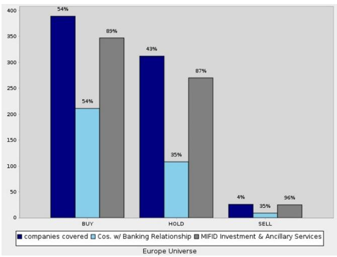  
Equity Rating and Dispersion Key

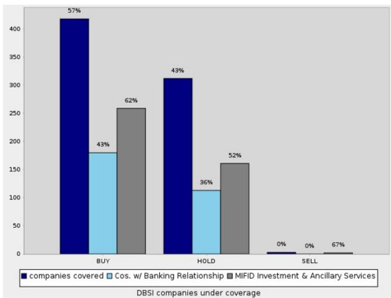

The Equity Rating Dispersion Chart depicts the following:

The proportion of recommendations that are rated "buy", "sell" and "hold" over the previous 12 months. This is shown for securities issued in the stated region e.g. "Europe Universe". See rating definitions below. This is represented by the "Companies Covered" bars in the chart. The percentage value displayed above the bar is the proportion as a percentage. E.g. 50% above the "buy" / "Companies Covered" bar means that 50% of DB's equity research covered companies over the past 12 months have a "buy" rating.

Next to each of the three respective bars showing the proportion of "buy", "sell" and "hold" recommendations we provide two additional bars to show:

\- The proportion of "buy", "sell" or "hold recommendations where DB and or/Affiliates provided MIFID Investment or Ancillary Services in the past 12 months. This is represented in the "MIFID Investment and Ancillary Services" bar. The percentage value displayed above the bar shows the proportion of Companies Covered with the given rating where DB has also provided MIFID Investment and Ancillary Services in the past 12 months. E.g. 50% above the "Cos. w/ MIFID Investment and Ancillary Services" bar means 50% of the Companies Covered with the rating stated have also received MIFID Investment and Ancillary Services from DB.

\- The proportion of "buy" (or "sell" or "hold") recommendations where DB and or/Affiliates has provided Investment Banking services in the past 12 months for which it has received compensation. The percentage value displayed above the bar shows the proportion of Companies Covered with the stated rating where DB has also provided Investment Banking services in the past 12 months. E.g. 50% above the "Cos. w/ Investment Banking relationship" bar means 50% of the Companies Covered with the rating stated also have an Investment Banking Relationship with DB.

Buy: Based on a current 12-month view of TSR, we recommend that investors buy the stock.

Sell: Based on a current 12-month view of TSR, we recommend that investors sell the stock.

Hold: We take a neutral view on the stock 12-months out and, based on this time horizon, do not recommend either a Buy or Sell.

TSR = Total Shareholder Return. Percentage change in share price from current price to projected target price plus projected dividend yield

Newly issued research recommendations and target prices supersede previously published research.

## Additional Information

The information and opinions in this report were prepared by DB AG or one of its affiliates (collectively 'DB'). Though the information herein is believed to be reliable and has been obtained from public sources believed to be reliable, DB makes no representation as to its accuracy or completeness. Hyperlinks to third-party websites in this report are provided for reader convenience only. DB neither endorses the content nor is responsible for the accuracy or security controls of those websites.

If you use the services of DB in connection with a purchase or sale of a security that is discussed in this report, or is included or discussed in another communication (oral or written) from a DB analyst, DB may act as principal for its own account or as agent for another person.

DB may consider this report in deciding to trade as principal. It may also engage in transactions, for its own account or with customers, in a manner inconsistent with the views taken in this research report. Others within DB, including strategists, sales staff and other analysts, may take views that are inconsistent with those taken in this research report. DB issues a variety of research products, including fundamental analysis, equity-linked analysis, quantitative analysis and trade ideas. Recommendations contained in one type of communication may differ from recommendations contained in others, whether as a result of differing time horizons, methodologies, perspectives or otherwise. DB and/or its affiliates may also be holding debt or equity securities of the issuers it writes on. Analysts are paid in part based on the profitability of DB AG and its affiliates, which includes investment banking, trading and principal trading revenues.

Opinions, estimates and projections constitute the current judgment of the author as of the date of this report. They do not necessarily reflect the opinions of DB and are subject to change without notice. DB provides liquidity for buyers and sellers of securities issued by the companies it covers. DB analysts sometimes have shorter-term trade ideas that may be inconsistent with DB's existing longer-term ratings. Some trade ideas for equities are listed as Catalyst Calls on the Research Website (https://research.db.com/Research/), and can be found on the general coverage list and also on the covered company's page. A Catalyst Call represents a high-conviction belief by an analyst that a stock will outperform or underperform the market and/or a specified sector over a time frame of no less than two weeks and no more than three months. In addition to Catalyst Calls, analysts may occasionally discuss with our clients, and with DB salespersons and traders, trading strategies or ideas that reference catalysts or events that may have a near-term or medium-term impact on the market price of the securities discussed in this report, which impact may be directionally counter to the analysts' current 12-month view of total return or investment return as described herein. DB has no obligation to update, modify or amend this report or to otherwise notify a recipient thereof if an opinion, forecast or estimate changes or becomes inaccurate. Coverage and the frequency of changes in market conditions and in both general and company-specific economic prospects make it difficult to update research at defined intervals. Updates are at the sole discretion of the coverage analyst or of the Research Department Management, and the majority of reports are published at irregular intervals. This report is provided for informational purposes only and does not take into account the particular investment objectives, financial situations, or needs of individual clients. It is not an offer or a solicitation of an offer to buy or sell any financial instruments or to participate in any particular trading strategy. Target prices are inherently imprecise and a product of the analyst's judgment. The financial instruments discussed in this report may not be suitable for all investors, and investors must make their own informed investment decisions. Prices and availability of financial instruments are subject to change without notice, and investment transactions can lead to losses as a result of price fluctuations and other factors. If a financial instrument is denominated in a currency other than an investor's currency, a change in exchange rates may adversely affect the investment. Past performance is not necessarily indicative of future results. Performance calculations exclude transaction costs, unless otherwise indicated. Unless otherwise indicated, prices are current as of the end of the previous trading session and are sourced from local exchanges via Reuters, Bloomberg and other vendors. Data is also sourced from DB, subject companies, and other parties. Artificial intelligence tools may be used in the preparation of this material, including but not limited to assist in fact-finding, data analysis, pattern recognition, content drafting and editorial corrections pertaining to research material.

The DB Department is independent of other business divisions of the Bank. Details regarding our organizational arrangements and information barriers we have to prevent and avoid conflicts of interest with respect to our research are available on our website (https://research.db.com/Research/) under Disclaimer.

Macroeconomic fluctuations often account for most of the risks associated with exposures to instruments that promise to pay fixed or variable interest rates. For an investor who is long fixed-rate instruments (thus receiving these cash flows), increases in interest rates naturally lift the discount factors applied to the expected cash flows and thus cause a loss. The longer the maturity of a certain cash flow and the higher the move in the discount factor, the higher will be the loss. Upside surprises in inflation, fiscal funding needs, and FX depreciation rates are among the most common adverse macroeconomic shocks to receivers. But counterparty exposure, issuer creditworthiness, client segmentation, regulation (including changes in assets holding limits for different types of investors), changes in tax policies, currency convertibility (which may constrain currency conversion, repatriation of profits and/or liquidation of positions), and settlement issues related to local clearing houses are also important risk factors. The sensitivity of fixed-income instruments to macroeconomic shocks may be mitigated by indexing the contracted cash flows to inflation, to FX depreciation, or to specified interest rates - these are common in emerging markets. The index fixings may - by construction - lag or mis-measure the actual move in the underlying variables they are intended to track. The choice of the proper fixing (or metric) is particularly important in swaps markets, where floating coupon rates (i.e., coupons indexed to a typically short-dated interest rate reference index) are exchanged for fixed coupons. Funding in a currency that differs from the currency in which coupons are denominated carries FX risk. Options on swaps (swaptions) the risks typical to options in addition to the risks related to rates movements.

Derivative transactions involve numerous risks including market, counterparty default and illiquidity risk. The appropriateness of these products for use by investors depends on the investors' own circumstances, including their tax position, their regulatory environment and the nature of their other assets and liabilities; as such, investors should take expert legal and financial advice before entering into any transaction similar to or inspired by the contents of this publication. The risk of loss in futures trading and options, foreign or domestic, can be substantial. As a result of the high degree of leverage obtainable in futures and options trading, losses may be incurred that are greater than the amount of funds initially deposited - up to theoretically unlimited losses. Trading in options involves risk and is not suitable for all investors. Prior to buying or selling an option, investors must review the 'Characteristics and Risks of Standardized Options", at https://www.theocc.com/company-information/documents-and-archives/options-disclosure-document. If you are unable to access the website, please contact your DB representative for a copy of this important document.

Participants in foreign exchange transactions may incur risks arising from several factors, including the following: (i) exchange rates can be volatile and are subject to large fluctuations; (ii) the value of currencies may be affected by numerous market factors, including world and national economic, political and regulatory events, events in equity and debt markets and changes in interest rates; and (iii) currencies may be subject to devaluation or government-imposed exchange controls, which could affect the value of the currency. Investors in securities such as ADRs, whose values are affected by the currency of an underlying security, effectively assume currency risk.

Unless governing law provides otherwise, all transactions should be executed through the DB entity in the investor's home jurisdiction. Aside from within this report, important conflict disclosures can also be found at https://research.db.com/Research/ on each company's research page or under the 'Disclosures' tab. Investors are strongly encouraged to review this information before investing.

DB (which includes DB AG, its branches and affiliated companies) is not acting as a financial adviser, consultant or fiduciary to you or any of your agents (collectively, "You" or "Your") with respect to any information provided in this report. DB does not provide investment, legal, tax or accounting advice, DB is not acting as your impartial adviser, and does not express any opinion or recommendation whatsoever as to any strategies, products or any other information presented in the materials. Information contained herein is being provided solely on the basis that the recipient will make an independent assessment of the merits of any investment decision, and it does not constitute a recommendation of, or express an opinion on, any product or service or any trading strategy.

The information presented is general in nature and is not directed to retirement accounts or any specific person or account type, and is therefore provided to You on the express basis that it is not advice, and You may not rely upon it in making Your decision. The information we provide is being directed only to persons we believe to be financially sophisticated, who are capable of evaluating investment risks independently, both in general and with regard to particular transactions and investment strategies, and who understand that DB has financial interests in the offering of its products and services. If this is not the case, or if You are an IRA or other retail investor receiving this directly from us, we ask that you inform us immediately.

In July 2018, DB revised its rating system for short term ideas whereby the branding has been changed to Catalyst Calls ("CC") from SOLAR ideas; the rating categories for Catalyst Calls originated in the Americas region have been made consistent with the categories used by Analysts globally; and the effective time period for CCs has been reduced from a maximum of 180 days to 90 days.

United States: Approved and/or distributed by DB Securities Incorporated, a member of FINRA and SIPC. Analysts located outside of the United States are employed by non-US affiliates and are not registered/qualified as research analysts with FINRA.

European Economic Area (exc. United Kingdom): Approved and/or distributed by DB AG, a joint stock corporation with limited liability incorporated in the Federal Republic of Germany with its principal office in Frankfurt am Main. DB AG is authorized under German Banking Law and is subject to supervision by the European Central Bank and by BaFin, Germany's Federal Financial Supervisory Authority.

United Kingdom: Approved and/or distributed by DB AG acting through its London Branch at 21 Moorfields, London EC2Y 9DB. DB AG in the United Kingdom is authorised by the Prudential Regulation Authority and is subject to limited regulation by the Prudential Regulation Authority and Financial Conduct Authority. Details about the extent of our authorisation and regulation are available on request.

Hong Kong SAR: Distributed by DB AG, Hong Kong Branch except for any research content relating to futures contracts within the meaning of the Hong Kong Securities and Futures Ordinance Cap. 571. Research reports on such futures contracts are not intended for access by persons who are located, incorporated, constituted or resident in Hong Kong. The author(s) of a research report, and the entities for which they act and/or are affiliated with, may not be licensed to carry on regulated activities in Hong Kong and, if not licensed, do not hold themselves out as being able to do so. The provisions set out above in the 'Additional Information' section shall apply to the fullest extent permissible by local laws and regulations, including without limitation the Code of Conduct for Persons Licensed or Registered with the Securities and Futures Commission. This report is intended for distribution only to 'professional investors' as defined in Part 1 of Schedule of the SFO. This document must not be acted or relied on by persons who are not professional investors. Any investment or investment activity to which this document relates is only available to professional investors and will be engaged only with professional investors.

India: Prepared by Deutsche Equities India Private Limited (DEIPL) having CIN: U65990MH2002PTC137431 and registered office at 14th Floor, The Capital, C-70, G Block, Bandra Kurla Complex, Mumbai (India) 400051. Tel: +91 22 7180 4444. It is registered by the Securities and Exchange Board of India (SEBI) as a Stock broker bearing registration no.: INZ000252437; Merchant Banker bearing SEBI Registration no.: INM000010833 and Research Analyst bearing SEBI Registration no.: INH000001741. DEIPL's Compliance / Grievance officer is Ms. Rashmi Poddar (Tel: +91 22 7180 4929 email ID: complaints.deipl@db.com). Registration granted by SEBI and certification from NISM in no way guarantee performance of DEIPL or provide any assurance of returns to investors. Investment in securities market are subject to market risks. Read all the related documents carefully before investing. DEIPL may have received administrative warnings from the SEBI for breaches of Indian regulations. DB and/or its affiliate(s) may have debt holdings or positions in the subject company. With regard to information on associates, please refer to the "Shareholdings" section in the Annual Report at: https://www.db.com/ir/en/annual-reports.htm. For latest India research audit report, refer https://country.db.com/india/deutsche-equities-india/index?language\_id=1.

Japan: Approved and/or distributed by Deutsche Securities Inc.(DSI). Registration number - Registered as a financial instruments dealer by the Head of the Kanto Local Finance Bureau (Kinsho) No. 117. Member of associations: JSDA, Type II Financial Instruments Firms Association and The Financial Futures Association of Japan. Commissions and risks involved in stock transactions - for stock transactions, we charge stock commissions and consumption tax by multiplying the transaction amount by the commission rate agreed with each customer. Stock transactions can lead to losses as a result of share price fluctuations and other factors. Transactions in foreign stocks can lead to additional losses stemming from foreign exchange fluctuations. We may also charge commissions and fees for certain categories of investment advice, products and services. Recommended investment strategies, products and services carry the risk of losses to principal and other losses as a result of changes in market and/or economic trends, and/or fluctuations in market value. Before deciding on the purchase of financial products and/or services, customers should carefully read the relevant disclosures, prospectuses and other documentation. 'Moody's', 'Standard Poor's', and 'Fitch' mentioned in this report are not registered credit rating agencies in Japan unless Japan or 'Nippon' is specifically designated in the name of the entity. Reports on Japanese listed companies not written by analysts of DSI are written by DB Group's analysts with the coverage companies specified by DSI. Some of the foreign securities stated on this report are not disclosed according to the Financial Instruments and Exchange Law of Japan. Target prices set by DB's equity analysts are based on a 12-month forecast period.

## Korea: Distributed by Deutsche Securities Korea Co.

South Africa: DB AG Johannesburg is incorporated in the Federal Republic of Germany (Branch Register Number in South Africa: 1998/003298/10).

Singapore: This report is issued by DB AG, Singapore Branch (One Raffles Quay #18-00 South Tower Singapore 048583, 65 6423 8001), which may be contacted in respect of any matters arising from, or in connection with, this report. Where this report is issued or promulgated by DB in Singapore to a person who is not an accredited investor, expert investor or institutional investor (as defined in the applicable Singapore laws and regulations), they accept legal responsibility to such person for its contents.

Taiwan: Information on securities/investments that trade in Taiwan is for your reference only. Readers should independently evaluate investment risks and are solely responsible for their investment decisions. DB may not be distributed to the Taiwan public media or quoted or used by the Taiwan public media without written consent. Information on securities/instruments that do not trade in Taiwan is for informational purposes only and is not to be construed as a recommendation to trade in such securities/instruments.

Qatar: DB AG in the Qatar Financial Centre (registered no. 00032) is regulated by the Qatar Financial Centre Regulatory Authority. DB AG - QFC Branch may undertake only the financial services activities that fall within the scope of its existing QFCRA license. Its principal place of business in the QFC: Qatar Financial Centre, Tower, West Bay, Level 5, PO Box 14928, Doha, Qatar. This information has been distributed by DB AG. Related financial products or services are only available only to Business Customers, as defined by the Qatar Financial Centre Regulatory Authority.

Russia: The information, interpretation and opinions submitted herein are not in the context of, and do not constitute, any appraisal or evaluation activity requiring a license in the Russian Federation.

Kingdom of Saudi Arabia: Deutsche Securities Saudi Arabia (DSSA) is a closed joint stock company authorized by the Capital Market Authority of the Kingdom of Saudi Arabia with a license number (No. 37-07073) to conduct the following business activities: Dealing, Arranging, Advising, and Custody activities. DSSA registered office is Faisaliah Tower, 17th Floor, King Fahad Road - Al Olaya District Riyadh, Kingdom of Saudi Arabia P.O. Box 301806.

United Arab Emirates: DB AG in the Dubai International Financial Centre (registered no. 00045) is regulated by the Dubai Financial Services Authority. DB AG - DIFC Branch may only undertake the financial services activities that fall within the scope of its existing DFSA license. Principal place of business in the DIFC: Dubai International Financial Centre, The Gate Village, Building 5, PO Box 504902, Dubai, U.A.E. This information has been distributed by DB AG. Related financial products or services are available only to Professional Clients, as defined by the Dubai Financial Services Authority.

Australia and New Zealand: This research is intended only for 'wholesale clients' within the meaning of the Australian Corporations Act and New Zealand Financial Advisors Act, respectively. Please refer to Australia-specific research disclosures and related information at https://www.dbresearch.com/PROD/RPS\_EN-PROD/PROD0000000000521304.xhtml. Where research refers to any particular financial product recipients of the research should consider any product disclosure statement, prospectus or other applicable disclosure document before making any decision about whether to acquire the product. In preparing this report, the primary analyst or an individual who assisted in the preparation of this report has likely been in contact with the company that is the subject of this research for confirmation/clarification of data, facts, statements, permission to use company-sourced material in the report, and/or site-visit attendance. Without prior approval from Research Management, analysts may not accept from current or potential Banking clients the costs of travel, accommodations, or other expenses incurred by analysts attending site visits, conferences, social events, and the like. Similarly, without prior approval from Research Management and Anti-Bribery and Corruption ("ABC") team, analysts may not accept perks or other items of value for their personal use from issuers they cover.

Additional information relative to securities, other financial products or issuers discussed in this report is available upon request. This report may not be reproduced, distributed or published without DB's prior written consent.

Backtested, hypothetical or simulated performance results have inherent limitations. Unlike an actual performance record based on trading actual client portfolios, simulated results are achieved by means of the retroactive application of a backtested model itself designed with the benefit of hindsight. Taking into account historical events the backtesting of performance also differs from actual account performance because an actual investment strategy may be adjusted any time, for any reason, including a response to material, economic or market factors. The backtested performance includes hypothetical results that do not reflect the reinvestment of dividends and other earnings or the deduction of advisory fees, brokerage or other commissions, and any other expenses that a client would have paid or actually paid. No representation is made that any trading strategy or account will or is likely to achieve profits or losses similar to those shown. Alternative modeling techniques or assumptions might produce significantly different results and prove to be more appropriate. Past hypothetical backtest results are neither an indicator nor guarantee of future returns. Actual results will vary, perhaps materially, from the analysis.

The method for computing individual E,S,G and composite ESG scores set forth herein is a novel method developed by the Research department within DB AG, computed using a systematic approach without human intervention. Different data providers, market sectors and geographies approach ESG analysis and incorporate the findings in a variety of ways. As such, the ESG scores referred to herein may differ from equivalent ratings developed and implemented by other ESG data providers in the market and may also differ from equivalent ratings developed and implemented by other divisions within the DB Group. Such ESG scores also differ from other ratings and rankings that have historically been applied in research reports published by DB AG. Further, such ESG scores do not represent a formal or official view of DB AG. It should be noted that the decision to incorporate ESG factors into any investment strategy may inhibit the ability to participate in certain investment opportunities that otherwise would be consistent with your investment objective and other principal investment strategies. The returns on a portfolio consisting primarily of sustainable investments may be lower or higher than portfolios where ESG factors, exclusions, or other sustainability issues are not considered, and the investment opportunities available to such portfolios may differ. Companies may not necessarily meet high performance standards on all aspects of ESG or sustainable investing issues; there is also no guarantee that any company will meet expectations in connection with corporate responsibility, sustainability, and/or impact performance.

Copyright © 2026 DB AG

<table><tr><td>DB AG21 MoorfieldsLondon EC2Y 9DBUnited KingdomTel: (44) 20 7545 8000</td><td>DB Securities Inc.The DB Center1 Columbus CircleNew York, NY 10019Tel: (1) 212 250 2500</td><td>DB AGFiliale SingapurOne Raffles Quay, South Tower,Singapore 048583TeL: +65 6423 8001</td></tr></table>

<table><tr><td colspan="4">David Folkerts-LandauGroup Chief Economist and Global Head of Research</td></tr><tr><td>Pam FinelliCOO and Head of Fixed Income Research</td><td>Steve PollardGlobal Head of Company Research and Sales</td><td>Jim ReidGlobal Head of Macro and Thematic Research</td><td>Tim RokossaHead of European Company Research</td></tr><tr><td>Matthew BarnardHead of AmericasCompany Research</td><td>Debbie JonesGlobal Head of Sustainability and Data Innovation, Research</td><td>Robin WinklerHead of German Macro Research</td><td>Sameer GoelGlobal Head of EM &amp; APAC Research</td></tr><tr><td>Francis YaredGlobal Head of Rates Research</td><td>George SaravelosGlobal Head of FX Research</td><td>Peter HooperVice-Chair of Research</td><td>Nilendra de-MelHead of APAC &amp; Middle East Product Development</td></tr></table>

## International Production Locations

<table><tr><td>DB AG</td><td>DB AG</td><td>DB AG</td><td>Deutsche Securities Inc.</td></tr><tr><td>DB Place</td><td>Equity Research</td><td>Filiale Hongkong</td><td>1-3-1 Azabudai</td></tr><tr><td>Level 16</td><td>Mainzer Landstrasse 11-17</td><td>International Commerce</td><td>Azabudai Hills Mori JP Tower</td></tr><tr><td>Corner of Hunter &amp; Phillip</td><td>60329 Frankfurt am Main</td><td>Centre,</td><td>Minato-ku, Tokyo 106-0041</td></tr><tr><td>Streets</td><td>Germany</td><td>1 Austin Road West,Kowloon,</td><td>Japan</td></tr><tr><td>Sydney, NSW 2000</td><td>Tel: (49) 69 910 00</td><td>Hong Kong</td><td>Tel: (81) 3 6730 1000</td></tr><tr><td>Australia</td><td></td><td>Tel: (852) 2203 8888</td><td></td></tr><tr><td>Tel: (61) 2 8258 1234</td><td></td><td></td><td></td></tr></table>