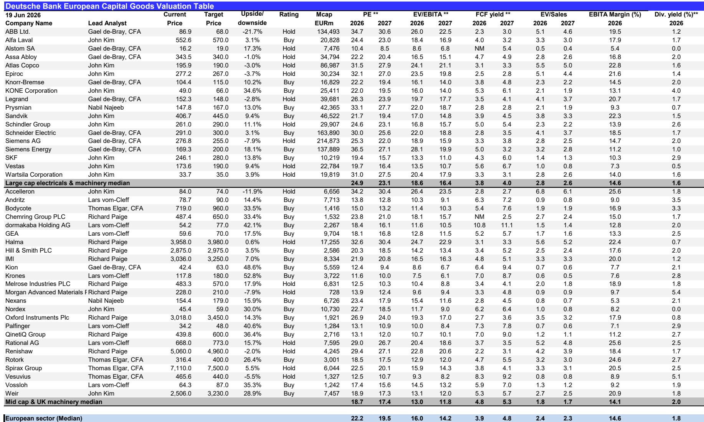
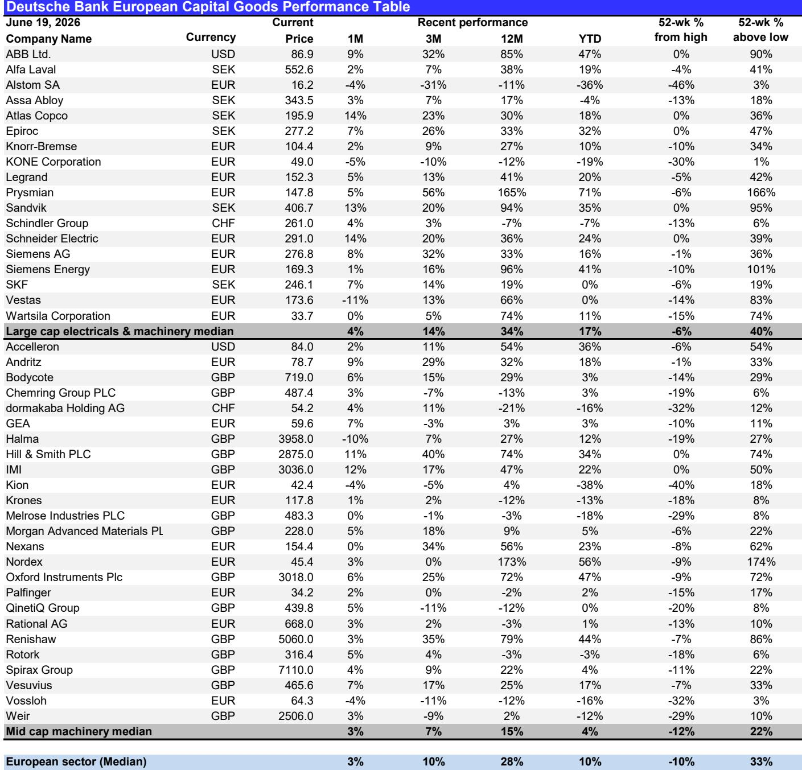
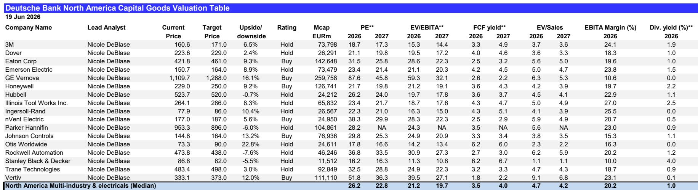

# Cyclicals Are Not Yet Priced for a Post-War Recovery, But the Window of Opportunity Is Narrowing

The most important investment question in European capital goods today is not whether a cyclical recovery will come, but whether the market has already priced it in. The answer, based on the data, is that it has not. Despite a ceasefire extension and the lifting of the Hormuz blockade, the stocks most sensitive to industrial production remain deeply discounted relative to pre-war levels. This disconnect creates a strategic opportunity, but one that requires careful navigation of timing, company-specific catalysts, and macro crosscurrents. The market is in a post-war aftershock phase where the macro outlook is improving but still fragile, and where individual corporate events—not broad sector momentum—will determine which names re-rate first.

The prevailing narrative has shifted from fear of energy disruption to cautious optimism about normalization. Yet share prices for companies like KION, Knorr-Bremse, and SKF still trade below where they were when the conflict began. The correlation between organic sales growth and German industrial production—a proxy for short-cycle exposure—is high for these names, meaning they are positioned to benefit disproportionately from a recovery in manufacturing activity. But the market is not yet giving them credit for this exposure. The asymmetry is real, but it is not uniform. Investors must distinguish between companies that will merely recover and those that will structurally re-rate.

This article argues that the post-war recovery trade in European capital goods is legitimate but selective. It is not a sector-wide call. The opportunity lies in companies with high cyclical sensitivity, upcoming catalysts that can reset expectations, and valuations that already discount a worst-case scenario. But the path to re-rating is not linear, and the macro data remains mixed. The next several weeks will be decisive.

## The Post-War Recovery Trade Is Real, But the Market Is Still Discounting It

The chart that matters most in this report plots the correlation between organic sales growth and German industrial production against share price performance since the start of the Iran war. The pattern is unambiguous: companies with the highest short-cycle exposure have underperformed the most, and they remain below pre-war levels. This is not a sign that the market has correctly priced in a weak recovery. It is a sign that the market is still anchored to the war-era narrative of disruption, uncertainty, and margin compression.

The implication is strategic. If the macro environment continues to normalize—and the ceasefire extension and MoU between the US and Iran are meaningful steps in that direction—then these stocks should re-rate. The sensitivity of their revenues to industrial production is a structural feature, not a bug. When German IP recovers, these companies will see it in their order books and margins. The question is whether the market will wait for the data to confirm the recovery, or whether it will anticipate it.

The answer depends on catalysts. And that is where the specific company stories become critical. The general case for cyclicals is sound, but the execution will be stock-specific.

## Knorr-Bremse, KION, and SKF Each Have Distinct Catalysts That Could Trigger Re-Rating

The report highlights three names that stand out for their combination of cyclical exposure and near-term events that could reset investor expectations. Each has a different catalyst, but together they illustrate the broader thesis that the market is underestimating the potential for re-rating in high-beta cyclicals.

Knorr-Bremse is set to provide a strategic update alongside its Q2 results on July 30, including new mid-term targets. The expectation is for a margin target of 16% or more for 2029 or 2030, roughly two percentage points above its 2026 guidance. If delivered, this would signal that management sees structural improvement, not just cyclical recovery. The market has been skeptical of margin expansion in capital goods, but a credible mid-term target could change that narrative. The risk is that the target is seen as aspirational rather than achievable, but the direction of travel is clear.

KION presents a different case. It trades near historically low multiples, both absolute and relative. The market is pricing in a worst-case scenario that may already be reflected in the stock. A potential mid-single-digit cut to FY26 EBIT guidance would be a clearing event, removing uncertainty and allowing the market to focus on the post-war growth outlook. The asymmetry is stark: the report sees 20% downside risk but 100% upside potential. That is not a typical risk/reward profile for a large-cap industrial. It suggests that the market has overcorrected for cyclical risk and is ignoring the company's improved business mix, pricing strategy, and lower breakeven point.

SKF's catalyst is structural rather than cyclical. The planned spin-off of its Automotive division remains on track for the autumn. This is a value-creation event that should drive a re-rating by separating a lower-margin, more cyclical business from the core industrial operations. The spin-off is well understood by the market, but the timing and execution will matter. If the separation proceeds smoothly, SKF could re-rate even if the macro environment remains tepid.

These three names are not interchangeable. They represent different paths to re-rating: strategic guidance, valuation clearing, and structural separation. But they all share one thing in common: the market is not giving them full credit for their potential.

## Not All Cyclical Exposure Is Created Equal: The Data Center and Transmission Themes Are Distinct

The report also covers companies that are less dependent on the traditional industrial cycle. Schneider's collaboration with Foxconn to deliver integrated AI data center solutions, Nexans' positive demand outlook for data centers in both Europe and the US, and the potential separation of Siemens Energy's Tol division all point to structural growth themes that are not captured by the German IP correlation.

This is a critical distinction. The cyclical recovery trade is about mean reversion. The data center and transmission trade is about structural growth. They are not mutually exclusive, but they require different analytical frameworks and different risk assessments.

Schneider's partnership with Foxconn is a reminder that the AI infrastructure buildout remains a powerful demand driver for electrical equipment. The ability to deliver integrated, ready-to-deploy solutions for AI data centers is a competitive advantage that goes beyond cyclical exposure. Nexans' commentary about accelerating large project momentum in Europe and the Republic Wire springboard for its MV cable offering in the US reinforces this point. These companies are benefiting from secular trends that will persist regardless of the macro cycle.

The potential separation of Siemens Energy's Tol division is another example of structural value creation. If completed, it would allow Siemens Energy to focus entirely on electrification markets, eliminate its oil and gas exposure, and mechanically improve its margin profile by at least 50 basis points. This is not a cyclical story. It is a portfolio optimization story that could unlock significant shareholder value.

Investors need to separate the cyclical recovery trade from these structural themes. They are both investable, but they require different time horizons and different risk tolerances.

## What the Report Does Not Fully Answer: The Timing and Magnitude of the Recovery

For all its detail, the report leaves several important questions unanswered. The most critical is timing. The ceasefire is extended, but for only 60 days. The macro data is improving but uneven: German ZEW expectations improved, but US Empire manufacturing and housing starts disappointed. The recovery is not yet self-sustaining.

The report does not provide a clear framework for when the cyclical recovery will translate into earnings upgrades. It identifies catalysts, but catalysts are not the same as outcomes. Knorr-Bremse's strategic update could be well received or could disappoint. KION's guidance cut could be a clearing event or a signal of deeper problems. The spin-off of SKF Automotive could be delayed or complicated by regulatory issues.

There is also the question of magnitude. The report suggests 100% upside potential for KION, but that assumes a full re-rating to historical multiples. Is that realistic in a world where interest rates are higher and the macro environment is more uncertain? The report acknowledges the risks but does not fully address the possibility that the market's skepticism is rational.

These unanswered questions are not flaws in the analysis. They are the natural boundaries of any research report. They are also the reason why investors need to do their own work and make their own judgments. The report provides the data and the framework, but the decision is yours.

## A Decision Framework for Investors: Three Questions to Ask Before Acting

Based on the report's logic, I propose a simple decision framework for investors considering the post-war recovery trade in European capital goods.

First, ask whether you are investing in cyclical recovery or structural growth. If the former, focus on names with high short-cycle exposure and upcoming catalysts. If the latter, focus on companies with exposure to data centers, transmission, or portfolio optimization. The two are not incompatible, but they require different entry points and risk management.

Second, ask whether the market is pricing in a worst-case scenario or a base case. For KION, the answer is clearly the former. For Knorr-Bremse, it is less clear. For SKF, the spin-off is a known event that is partially priced in. The asymmetry is greatest where the market has overshot to the downside.

Third, ask what catalyst will change the narrative. For Knorr-Bremse, it is the strategic update. For KION, it is the guidance reset. For SKF, it is the spin-off. For Siemens Energy, it is the potential separation of Tol. Each catalyst has a timeline. If you are not willing to wait for that catalyst, you should not own the stock.

This framework is not a substitute for detailed financial analysis, but it provides a structured way to think about the opportunity set. The report provides the raw material. The framework provides the lens.

## The Recovery Trade Is Real, But It Requires Conviction and Patience

The post-war recovery in European capital goods is not a sure thing. The macro data is mixed, the geopolitical situation is fragile, and the market is still skeptical. But that is precisely why the opportunity exists. If the recovery were obvious, it would already be priced in.

The companies with the highest cyclical sensitivity are trading at levels that imply a deep and prolonged downturn. If the recovery materializes, even partially, these stocks should re-rate significantly. The catalysts are coming. The data is improving. The question is whether investors have the conviction to act before the market confirms the trend.

The report makes a compelling case that the risk/reward is attractive, especially for KION, Knorr-Bremse, and SKF. But it also acknowledges the uncertainties. The next several weeks will be critical. The macro releases, the earnings reports, and the strategic updates will determine whether the recovery trade is real or a false dawn.

For serious investors, this is exactly the kind of environment where active management and deep research add value. The easy trades are over. The hard ones are just beginning.

Join the community to read the full report and review the original charts.

*This article is for learning and discussion only and does not constitute investment advice.*

Personal reading notes and learning share only. Not investment advice.

