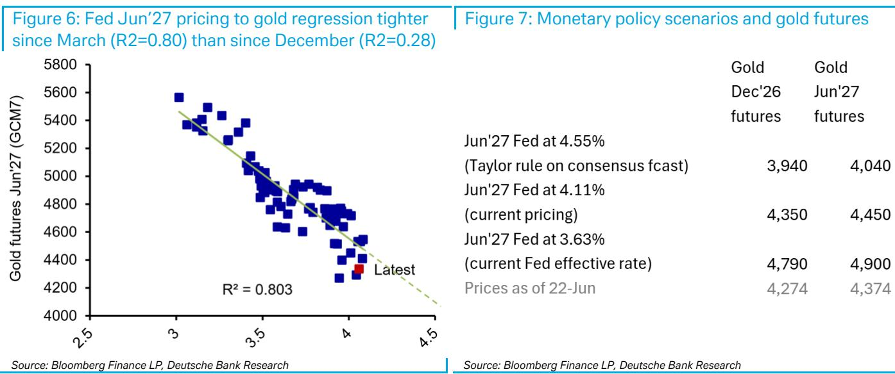
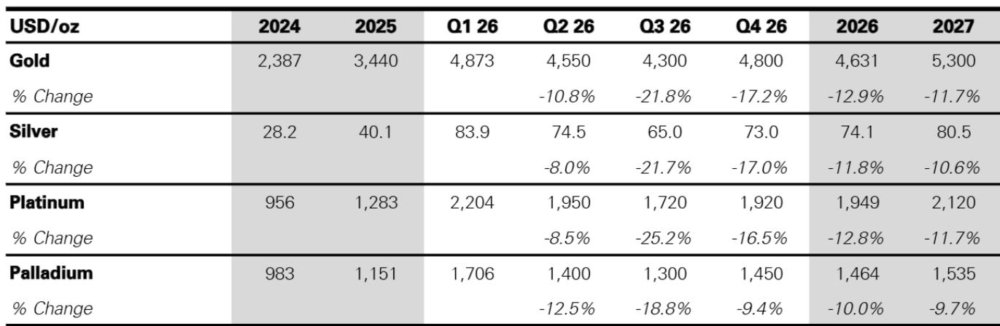

# DB：黄金不缺央行，缺的是ETF

黄金市场正在经历一场罕见的“三重背离”。价格从高位回落，但央行仍在买，ETF却在卖，而中国和印度的实物需求也同时转弱。DB最新发布的贵金属专题报告给出了一个判断：黄金当前最大的问题不是缺乏长期买家，而是短期投资需求出现了结构性断裂。这份报告将2026年Q4的黄金基准预测下调至4800美元/盎司，但更值得关注的不是这个数字本身，而是报告揭示的黄金定价逻辑正在发生根本性切换——从地缘政治溢价转向货币政策定价。

如果你还停留在“黄金就是避险”的简单框架里，你可能已经错过了最重要的信号。

## 1. 黄金与原油的脱钩，暴露了真正的定价锚已经切换

今年3月至4月，黄金与原油价格高度负相关，市场普遍认为这是地缘政治溢价在主导金价。但5月中旬之后，这个关系彻底断裂了。DB的分析师指出，黄金开始与美联储加息预期紧密挂钩，而原油价格的下行反而被市场忽略。

这意味着什么？黄金已经从“战争避险”模式切换到了“货币政策定价”模式。美联储主席Warsh在6月FOMC会议上的鹰派表态——强调“我们已经在通胀目标上失守了五年，现在要纠正”——直接成为压制金价的核心力量。

> **KC评论：** 许多投资者仍然习惯用“地缘风险”来理解黄金，但这份报告清楚地表明，黄金当前的主要矛盾是美联储的利率路径。如果你还在关注中东局势来判断金价，你可能需要重新校准你的分析框架。完整报告中有一张图清晰展示了黄金与Fed定价的回归关系，R2高达0.80，值得仔细研究。

## 2. ETF清仓的速度，已经超过了央行买入的速度

央行需求确实是黄金市场最坚实的支柱。Q1全球央行购金量创下历史新高，达到389亿美元。但问题是，这部分需求并没有加速，而ETF投资者的抛售却在持续。

DB的报告显示，自6月11日以来，ETF投资者在金价反弹时持续卖出，黄金ETF资产已跌至年内新低。期货未平仓合约创下17年新低，净多持仓接近年内低点而非高点。更关键的是，黄金价格对ETF流量的敏感度正在急剧上升——从2003-2022年期间每100万盎司ETF流量驱动1%的金价变动，已经上升到当前的2.9%。

这意味着，要达到4800美元/盎司的目标价，ETF年初至今的净流入需要达到500万盎司——这几乎是当前水平的五倍。

> **KC评论：** 央行买黄金是长期的、战略性的，但ETF投资者是短期的、情绪化的。当前的情况是，央行买了，但ETF在卖，而且卖的速度更快。黄金价格要真正启动，必须看到ETF资金重新流入。报告里有一张图直接展示了ETF流量与金价之间的关系，非常直观，完整版里有。

## 3. 中国和印度这两个“大买家”同时转弱

如果说ETF是黄金的“快钱”，那么中国和印度就是黄金的“慢钱”。但这两股力量现在都在减弱。

中国方面，上海黄金交易所对Comex的溢价已经转为折价。这是一个关键信号——当中国投资者不再愿意支付溢价购买黄金，意味着进口需求将显著下降。背后的逻辑是：人民币走强，中国投资者没有理由通过黄金来对冲货币风险；同时，中国房地产可能正在触底，这进一步削弱了黄金作为替代投资品的吸引力。

印度方面，5月份黄金进口增值税从6%大幅上调至15%，直接抑制了需求。虽然灰色市场出现了高达200美元/盎司的折价——暗示走私活动可能上升——但这并不能弥补正规渠道进口量的下滑。

> **KC评论：** 中国和印度的黄金需求变化往往被市场低估。过去几年，这两个国家的实物需求是支撑金价的重要力量。但现在，中国溢价转负、印度加税，双重压力下，黄金失去了两个重要的实物支撑。报告里有一张图展示了中国SGE折价与进口量的正相关关系，值得仔细看。

## 4. 美联储的“泰勒规则”指向80个基点的加息空间

这是报告中最硬的数字，也是最具冲击力的判断。

DB美国经济团队的计算显示，如果使用泰勒规则，结合市场对核心PCE（3.1%）和失业率（4.4%）的一致预期，以及美联储SEP对中性实际利率（1.1%）和NAIRU（4.2%）的估计，当前政策利率应该比美联储的上限（4.55%）高出80个基点。

换句话说，市场定价的加息幅度可能还不够。如果美联储真的被迫加息，黄金可能跌向3800美元/盎司。

但报告也指出了鸽派风险：如果油价继续下行、盈亏平衡通胀率下降、核心PCE如预期回落，美联储可能会在7月FOMC会议上选择观望，这将对黄金形成支撑。

## 5. 报告没有完全回答的问题：黄金的“结构性牛市”还能撑多久？

DB在报告中反复强调，长期来看黄金仍然有结构性支撑：美国联邦债务以8%的年增速扩张，高于CBO长期预期的6%；央行购金的结构性需求不会消失。但这些长期因素能否对冲短期投资需求的萎缩，报告并没有给出明确的答案。

一个关键的不确定性是：如果美联储真的进入加息周期，黄金的ETF资金会进一步流出，而央行购金能否独立支撑金价？报告指出，央行需求在Q1并没有加速，这意味着它无法单独弥补投资需求的缺口。

另一个未解的问题是：中国和印度的实物需求什么时候会重新成为支撑？人民币走强和房地产触底这两个因素，短期内可能都不会逆转。

> **KC评论：** 这份报告的价值不在于给出一个具体的金价预测，而在于它清晰地展示了黄金市场的“多空交战”格局。长期看多因素和短期看空因素同时存在，而且短期内空头似乎更占优势。如果你想深入了解黄金ETF流量、央行购金数据和全球债务增长的详细图表，以及DB对未来几个季度金价的完整路径预测，欢迎继续阅读完整报告。

---

这些未解问题正是我们每天在社群里讨论的内容。我们的AI agent会结合人工review，每天生成国际投行中文摘要与KC评论，更新约10-40页，同时整理当天最新数据图表合集。这些内容既方便你喂给AI做进一步分析，也方便你人工快速把握全球市场动态。欢迎来星球和微信群里继续讨论。

Personal reading notes and learning share only. Not investment advice.

