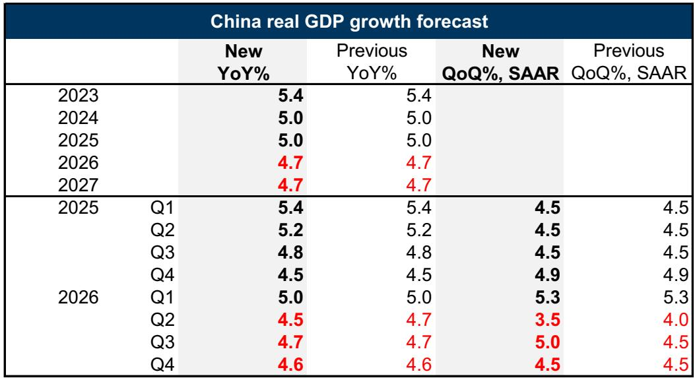
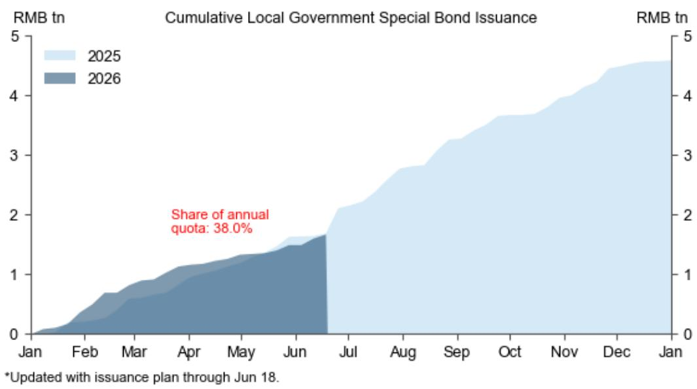
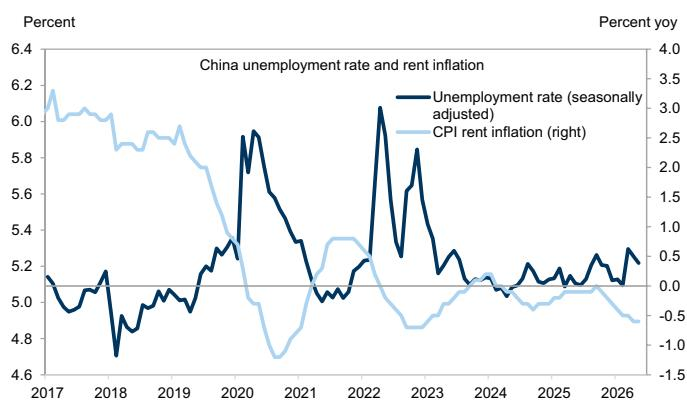

# GS：中国经济真正的风险不是增长放缓，而是AI替代就业的速度

理解中国当前的经济格局，最核心的一个判断是：出口和科技是唯一的亮点，而国内消费和房地产仍在收缩。GS最新发布的这份中国宏观报告，并不仅仅是对5月数据的常规复盘。它在做一件更重要的事——把短期数据波动与中国长期战略转型之间的张力，清晰地摆在了决策者和投资者面前。

报告的核心主张是：中国正在全力押注科技驱动型经济转型，这个方向在工业生产、资本市场和政策信号中已经极其明确。但问题在于，如果AI对就业的替代速度过快，它可能会打断从“技术投入”到“收入增长”再到“内需扩张”这个理想循环。这不是一个遥远的担忧，而是当前已经可以观测到的结构性风险。

## 1. 5月数据揭示了一个前所未有的“双收缩”格局

5月的经济数据，在出口和工业生产的亮眼表现之外，暴露了国内需求的深度疲软。GS的数据分析显示，5月零售销售同比下降0.6%，1-5月固定资产投资同比下降4.1%。在官方统计史上，零售销售和固定资产投资同时录得负增长，这是第二次——第一次是2020年疫情封锁期间。

更直观的对比来自汽车行业。5月国内汽车销售同比下降22%，而汽车出口同比飙升75%。出口对GDP增长的贡献大约为3个百分点，这意味着国内需求的实际增速可能只有1-2%。这个数字比市场普遍感知的还要低。

> **KC评论：** 这里的关键不是“数据不好”，而是“结构极度分化”。出口和科技制造撑住了总量的体面，但内需的收缩幅度已经接近疫情最严重时期。对于关注消费和地产板块的投资者来说，这组数据意味着，任何关于“内需触底”的判断都需要更谨慎的验证。

GS据此将二季度实际GDP环比年化增速预测从4.0%下调至3.5%，但维持全年4.7%的预测不变。这背后的逻辑是，随着油价回落、财政支出加速以及天气条件正常化，三季度增长有望反弹至5.0%。但这份乐观建立在“短期扰动消退”的假设上，而非内需自发性修复。

## 2. 科技与AI正在重塑经济结构，但资本市场已经提前定价

报告用一组非常清晰的对比展示了中国经济的结构性变化。与2019年相比，工业机器人产量增长了三倍，半导体产量翻了一倍以上，而玻璃和水泥产量则持续下降。在A股市场，信息技术板块指数年内上涨超过50%，而可选消费板块指数下跌超过25%。

这种背离不是偶然的。国家统计局在5月数据发布后的新闻发布会上，重点宣传的是光量子计算和涡扇发动机测试等科技进展。高技术制造业增加值同比增长15.1%，远高于整体工业增加值4.5%的增速。在1-5月固定资产投资整体下降4.1%的背景下，信息传输行业（包括AI计算）的投资增长了30.4%。

政策信号同样清晰。4月发布的国务院令834号聚焦供应链安全，6月初发布的837号令涉及技术转让和跨境投资监管。陆家嘴论坛上宣布了建立价格型货币政策框架和加速人民币国际化的步骤。这些都不是短期刺激，而是长达五到十年的战略布局。

> **KC评论：** 科技板块的估值已经在反映这个长期叙事。但问题在于，资本市场往往比实体经济跑得更快。当科技指数已经上涨50%而消费指数下跌25%时，投资者需要问：这个价差是否已经充分反映了结构转型，还是说它已经开始脱离基本面支撑？报告的图表显示，这种背离仍在扩大，但背离本身并不构成买卖信号。

## 3. AI对就业的替代风险可能成为整个转型的“阿喀琉斯之踵”

这是报告中最值得深入阅读的部分。GS指出，中国AI相关资本开支表面上远低于美国——美国四大云厂商加甲骨文2026年资本开支预计超过7500亿美元，而中国阿里、腾讯、字节、百度合计只有约1000亿美元。但中国的数据中心装机容量已经达到美国的60%。原因在于中国建设数据中心的成本更低，且政府直接参与了大量投资——十四五规划中，仅算力网络一项就计划投资2万亿元人民币。

真正的风险不在于AI投入不足，而在于AI应用对就业的冲击。报告引用了美国的历史经验：自动化对常规职业的就业替代，几乎全部发生在经济下行期。当企业利润承压时，用技术替代劳动力的动力会急剧上升。

中国目前的情况是：企业竞争激烈，利润率普遍偏低，经济增速放缓。这意味着中国雇主可能比美国同行更愿意用AI替代劳动力来维持竞争力。如果AI替代导致大规模失业，房价可能面临新一轮下行压力——报告显示，失业率上升往往领先于租金下跌。而租金是房价的基石。

> **KC评论：** 这是一个危险的反馈循环。AI替代就业 -> 收入下降 -> 消费收缩 -> 房价进一步承压 -> 居民信心恶化 -> 消费进一步收缩。国务院6月发布的“就业优先战略”文件试图在AI发展和就业稳定之间取得平衡，但报告坦率地指出，在青年失业率已经高企、AI正在威胁越来越多的入门级白领岗位时，具体有效的措施是什么，目前并不清楚。

这正是报告标题“All About Tech”的深层含义：科技既是增长引擎，也是潜在的系统性风险源。而政策的长期规划与短期管理之间的张力，决定了这个转型能否平稳实现。

## 4. 报告尚未完全回答的三个关键问题

GS的报告提出了一个清晰的分析框架，但有几个问题需要读者自己去追问和验证。

第一，AI替代就业的速度能否被量化？报告引用了美国的历史数据，但中美在劳动力市场结构、社会保障体系和政策干预能力上存在显著差异。中国的政策空间是否足以在AI加速普及的同时维持就业稳定？这个问题的答案，将决定“反馈循环”的风险有多大。

第二，财政和货币政策能否在“保增长”和“促转型”之间找到动态平衡？报告提到，过去几年的模式是：一个季度的强劲增长后，财政支出就会放缓；只有当数据疲软威胁到全年目标时，政策才会再次加码。这种“季调式”的周期管理，在报告看来不利于信心建设。但问题是，在外部环境高度不确定的情况下，是否存在更好的政策框架？

第三，资本市场如何定价“转型中的不确定性”？科技板块的高估值已经隐含了对未来增长的乐观预期，但消费和地产板块的深度下跌是否已经完全反映了内需的疲弱？如果AI替代风险成为现实，这两个板块可能还需要进一步重估。

这些问题的答案，不在GS这份报告的结论里，而在于读者如何结合自己的投资框架和风险偏好，去拆解报告中的数据和图表。每一张图背后都藏着更细分的逻辑，比如数据中心的区域分布、不同行业AI渗透率的差异、政策工具的实施路径——这些在完整报告中都有更详细的展开。

---

*每天，我们的AI agent会结合人工审核，生成国际投行最新研报的中文摘要与KC评论，日均更新10-40页，同时整理当天最新数据图表合集。这些内容既方便直接喂给AI模型做进一步分析，也方便人工快速把握全球市场的动态变化。如果你对今天讨论的AI就业替代风险、财政政策节奏或科技板块估值有更深入的兴趣，欢迎加入我们的微信群继续讨论。*

Personal reading notes and learning share only. Not investment advice.

