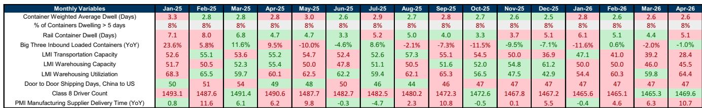
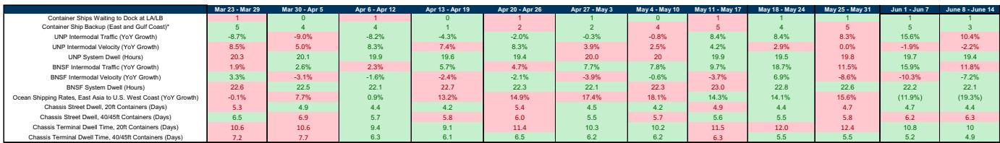

# The U.S. Supply Chain Is No Longer Broken, but the Real Question Is Whether It Has Become Too Efficient for Its Own Good

The U.S. supply chain congestion index has fallen to a level that, by historical standards, signals something close to normalcy. As of late June 2026, the weekly bottleneck scale sits at 2 on a 10-point scale, with the composite index declining another 6% week over week. Container ship backlogs on the West Coast remain at 1, East Coast backlogs have ticked down from 5 to 3, and chassis dwell times are edging lower across most categories. These numbers would have been unthinkable during the peak congestion of late 2021 and early 2022, when the scale hit 10 and ports were paralyzed by a logjam of ships, containers, and chassis.

The temptation is to declare victory. The pandemic-era supply chain crisis is over. Fluidity has returned. The machinery of global trade is once again humming at pre-Covid efficiency. But that conclusion, while comforting, misses the deeper strategic shift that this data reveals. The supply chain is not simply recovering to its old baseline. It is settling into a new equilibrium that is structurally different from the pre-pandemic period, and that difference carries profound implications for inventory strategy, pricing power, and the geography of global trade.

The key insight from the latest data is not that congestion is low. It is that the index is hovering at 2, not at 1. The report itself notes that if pressures continue to mitigate, the index could remain more consistently in 1 territory in 2026. The fact that it has not yet done so, despite months of sequential improvement, suggests that the system is encountering a floor. This floor is not a sign of residual dysfunction. It is a sign that the supply chain has been permanently recalibrated by structural changes in demand patterns, tariff regimes, and geopolitical risk management. The question every executive should be asking is not whether the supply chain is fixed, but whether the new normal is actually more fragile than the old one.

## The Congestion Index Has Fallen to Pre-Covid Levels, but the Composition of That Fluidity Is Fundamentally Different

The most striking finding in the data is that the current bottleneck scale of 2 is broadly in line with the pre-Covid baseline. The index tracks back to February 2020, and the current reading sits near the levels seen before the pandemic disrupted global logistics. At first glance, this suggests that the system has fully healed. Container dwell times at San Pedro Bay are around 2.6 days, unchanged from March and well below the crisis peaks. Door-to-door shipping from China to the United States has stabilized at 47 days, a far cry from the 80-plus days seen at the height of the congestion. Rail container dwell, while slightly elevated in April at 5.1 days, remains dramatically below the 2022 peak of roughly 16 days.

But the composition of this fluidity matters more than the aggregate number. During the pre-Covid period, low congestion reflected a steady-state system operating at predictable volumes with stable trade policy and minimal geopolitical disruption. Today, low congestion coexists with a radically different environment. Tariffs are elevated and fragmented. Trade flows are being redirected away from China toward Southeast Asia, Mexico, and other alternative sourcing destinations. The LMI Transportation Capacity Index contracted sharply in April to 28.4, down from 39.2 in March, indicating that transportation capacity is shrinking even as demand moderates. Warehousing capacity is also contracting, while warehousing utilization is expanding. These are not the signals of a system that has returned to equilibrium. They are the signals of a system that has adapted to a new set of constraints, and that adaptation has created its own vulnerabilities.

The implication is that the supply chain is now operating at a lower level of throughput capacity than it did pre-Covid, even though congestion metrics look similar. The system has shed excess capacity during the post-pandemic correction, and it has not fully rebuilt it. This means that any sudden surge in demand, or any new disruption, could push the index back into elevated territory much faster than it would have in the pre-pandemic environment. The floor of 2 is not a sign of stability. It is a sign of a system that is running leaner and therefore has less buffer.

## The Divergence Between West Coast and East Coast Backlogs Reveals a Structural Shift in Trade Routing

One of the most telling data points in the report is the divergence between the West Coast and East Coast container ship backlogs. The West Coast backlog has remained flat at 1 for weeks, indicating near-zero congestion at the ports of Los Angeles and Long Beach. The East Coast backlog, while improving from 5 to 3 in the most recent week, remains notably higher. This is not a random fluctuation. It reflects a structural shift in how goods are flowing into the United States.

During the pandemic, the West Coast ports became the epicenter of the congestion crisis, with dozens of ships waiting at anchor for weeks. The response from shippers and logistics providers was to diversify port usage, shifting volume to East Coast and Gulf Coast ports to reduce exposure to West Coast bottlenecks. That shift appears to be persisting even as West Coast congestion has normalized. The East Coast is now absorbing a larger share of containerized imports, and its infrastructure is under correspondingly greater strain.

This has two strategic implications. First, it means that the West Coast fluidity is partly a function of lower volume share, not just improved efficiency. If trade patterns shift back toward the West Coast, the congestion picture could change quickly. Second, it means that the East Coast and Gulf Coast ports are now more critical nodes in the national supply chain than they were pre-Covid, and their capacity constraints are becoming a binding constraint on overall system fluidity. The report tracks East Coast backlogs using satellite data, and the fact that the number has been volatile, ranging from 1 to 5 over the past several months, suggests that the East Coast system is still adjusting to its new role.

For companies that have moved their port of entry from the West Coast to the East Coast as a risk management strategy, the data suggests that this hedge is now less effective than it was. The congestion risk has not been eliminated. It has been redistributed. The question is whether the East Coast ports can scale their capacity fast enough to match the demand shift, or whether the next crisis will originate in Savannah or Charleston rather than in Los Angeles.

## Ocean Shipping Rates Are Falling Year over Year, but the Deceleration Is Masking a More Complex Pricing Dynamic

Ocean container shipping rates from East Asia to the U.S. West Coast were approximately $4,840 per forty-foot equivalent unit in the most recent week, unchanged week over week but down 19% year over year. This is a dramatic decline from the peak rates of 2021 and 2022, when spot rates exceeded $20,000 per container. The conventional narrative is that falling rates are a sign of normalizing supply and demand, and that they provide relief to importers who were squeezed by sky-high logistics costs during the pandemic.

But the year-over-year deceleration is accelerating. In the prior week, rates were down 12% year over year. In the current week, they are down 19%. The sequential pattern matters because it suggests that the rate decline is not simply a return to trend. It is a correction that may be overshooting. The report notes that West Coast rail intermodal traffic growth decelerated to plus 11% year over year from plus 16% in the prior week. Rail volumes are a leading indicator of broader economic activity, and a deceleration in rail intermodal growth, combined with falling ocean rates, could signal that import demand is softening more than expected.

This creates a strategic dilemma for importers. On one hand, lower ocean rates are a clear near-term benefit. On the other hand, if the rate decline is driven by weakening demand rather than by capacity normalization, it could be a precursor to a broader economic slowdown that would reduce consumer spending and increase inventory risk. The report does not take a position on whether the rate decline is demand-driven or supply-driven, but the data points in the direction of demand weakness. The LMI Warehousing Utilization Index expanded in April to 64.4, up from 59.8 in March, which suggests that inventory is building. If demand is softening and inventory is accumulating, the next phase of the cycle could involve destocking, which would further pressure ocean rates and reduce transportation demand.

For executives making procurement and inventory decisions, the key question is whether the current rate environment represents an opportunity to lock in favorable long-term contracts or a trap that will lead to overcommitment at a time when demand is rolling over. The data does not provide a clear answer, but it does provide a framework for thinking about the question. The rate decline is real, but it is accelerating, and the acceleration is happening alongside softening demand indicators. That combination argues for caution rather than aggression in procurement strategy.

## The Report Leaves Unanswered Whether the System Has Enough Capacity to Absorb a New Demand Shock

The report is meticulous in its tracking of weekly and monthly metrics, and it provides a rich picture of the current state of the supply chain. But it does not fully address what is perhaps the most important strategic question: how much spare capacity does the system actually have?

The bottleneck scale is at 2, which implies that the system is operating at roughly pre-Covid fluidity. But pre-Covid fluidity was achieved in an environment where global trade volumes were growing steadily, tariffs were relatively stable, and geopolitical risk was manageable. The current environment is none of those things. Tariff uncertainty is high. Trade routes are being reconfigured. Labor markets in trucking and warehousing remain tight. The truck transportation employee count is still below pre-pandemic highs, and year-over-year growth in trucking employment has averaged negative 1.7% over the past six months. The LMI Transportation Capacity Index is contracting, and warehousing capacity is also contracting.

What this means is that the system may be fluid today, but it is fluid at a lower level of throughput capacity. If demand were to rebound, or if a new disruption were to occur, the system would have less slack to absorb the shock than it did in 2019. The report acknowledges this implicitly by noting that the index could remain in 1 territory if pressures continue to mitigate, but it does not model what would happen if pressures reverse. The vulnerability is not in the current congestion level. It is in the thinness of the buffers.

For readers, this is the unresolved analytical question that makes the full report worth studying. The weekly metrics are useful for tactical decision-making, but the strategic insight lies in understanding the structural changes that have occurred beneath the surface of the aggregate index. The report provides the data to begin that analysis, but it leaves the synthesis to the reader.

## Translating the Data into a Decision Framework: Three Questions Every Supply Chain Executive Should Be Asking

For executives who need to act on this information, the data can be organized into a simple decision framework built around three questions.

First, are you managing for a continuation of the current environment or for a reversal? The index is at 2 and trending toward 1. If that trend continues, the strategic imperative is to reduce inventory buffers, optimize working capital, and renegotiate logistics contracts to capture the benefit of lower rates. But if the trend reverses, the imperative shifts to building buffer inventory, locking in capacity, and diversifying port and routing options. The data currently points toward continuation, but the structural vulnerabilities point toward the risk of reversal. The right approach is probably to prepare for both scenarios by building optionality into contracts and capacity commitments.

Second, is your port strategy aligned with the new geography of congestion? The East Coast is now a higher-congestion zone than the West Coast, and that is unlikely to change in the near term. If your company shifted volume to the East Coast during the pandemic as a risk mitigation measure, it may be time to reassess that decision. The West Coast ports are fluid, and they may offer better service levels than East Coast ports that are still adjusting to higher volume shares. The data on backlogs and dwell times supports a more balanced port allocation strategy than the pandemic-era shift toward the East Coast.

Third, are you prepared for a demand shock that could quickly reset the congestion index? The system is running lean. If consumer demand surprises to the upside, or if a geopolitical event disrupts a major trade route, the supply chain could snap back into congestion much faster than it did in 2020. The difference is that in 2020, the system was caught off guard by a sudden demand surge. Today, the system has less capacity to absorb a similar surge. The prudent strategy is to stress-test your supply chain against a rapid return to a bottleneck scale of 5 or higher, and to identify the specific nodes where you would be most exposed.

## The Full Report Contains the Granular Data Needed to Answer These Questions

The analysis above is based on the high-level findings from the weekly supply chain congestion report. But the full report contains far more granular data that allows for deeper analysis. It includes detailed weekly metrics on rail intermodal traffic, dwell times, and ocean shipping rates, as well as monthly lagging indicators on container dwell, warehouse utilization, and PMI supplier delivery times. It also includes the methodology for how the congestion scale is constructed, which is essential for understanding the weighting of different variables and the assumptions behind the index.

For executives who need to make real decisions about inventory, logistics, and procurement, the full report provides the raw material for scenario analysis. It allows you to track the specific metrics that matter most to your business, rather than relying on the aggregate index alone. It also provides the historical context needed to distinguish between cyclical noise and structural change.

The report leaves open several important questions that only a deeper dive into the data can answer. How much of the improvement in West Coast congestion is due to volume shifting to the East Coast versus genuine efficiency gains? What is the relationship between the decline in ocean rates and the deceleration in rail volumes? How much spare capacity actually exists in the trucking and warehousing sectors? These are not academic questions. They are the basis for strategic decisions that will determine whether your supply chain is resilient or vulnerable in the next phase of the cycle.

Join the community to read the full report and review the original charts.

*This article is for learning and discussion only and does not constitute investment advice.*

Personal reading notes and learning share only. Not investment advice.

