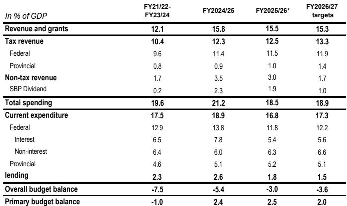
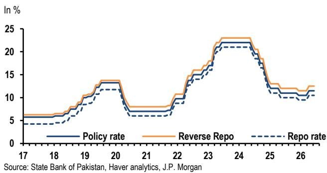
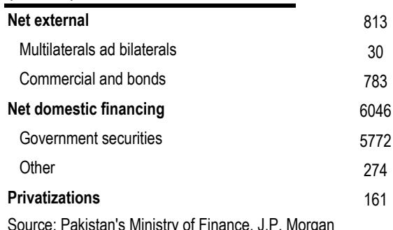

# The Middle East Ceasefire Is the Most Underappreciated Macro Tailwind for Asia Edge Economies

A durable ceasefire in the Middle East is not merely a geopolitical relief—it is a structural shift in the operating environment for Asia's frontier economies. For months, the energy shock from the Strait of Hormuz closure compressed growth, widened trade deficits, and forced central banks into a tightening posture they could ill afford. If the ceasefire holds and oil prices settle near current levels of roughly USD 80 per barrel, the implications extend far beyond a one-time disinflationary pulse. The real story is about policy space restored, fiscal credibility rebuilt, and a narrow window for reform that may not reopen.

The report from which this analysis draws makes a conservative baseline assumption: oil prices above USD 100 per barrel through the third quarter of 2026, easing only gradually. But the data already suggests that the actual path may be materially lower. The gap between baseline and reality is where the most interesting strategic questions lie. For investors, the question is not whether Asia Edge economies benefit from lower energy prices—they do—but which economies are positioned to translate that benefit into durable gains in growth, external balances, and institutional credibility.

This is not a uniform story. The ceasefire creates winners and exposes laggards. The distinction depends on each economy's fiscal architecture, monetary policy framework, and the depth of its pre-crisis vulnerabilities. The report provides the raw material for this distinction; the task of the strategist is to assemble it into a decision framework.

## The Energy Shock Was Never Symmetric, and Neither Is the Recovery

Asia Edge economies were not equally exposed to the energy shock, and they will not benefit equally from its resolution. The report's data on trade balances during the March-to-May period tells a clear story: every economy in the region except Mongolia saw its trade balance deteriorate sharply. Mongolia stood apart because its commodity export windfall offset the import cost shock. That exception is instructive.

The economies that suffered most were those with the highest energy import dependence relative to GDP and the least fiscal space to absorb the shock. Pakistan, Sri Lanka, and Vietnam experienced the most acute inflation surges. The report notes that inflation in Pakistan accelerated from 7.3 percent in March to 11.7 percent in May—a direct consequence of fuel price pass-through. Sri Lanka and Vietnam faced similar dynamics, though with different magnitudes.

The recovery will follow the same asymmetric pattern. Economies with larger current account deficits stand to gain the most from a sustained decline in oil prices. The report estimates that Pakistan's current account deficit, projected at roughly 1 percent of GDP for fiscal year 2026-27, could narrow by about 0.5 percentage points if oil prices settle near USD 80 per barrel. That is a meaningful improvement for an economy that has struggled to maintain external stability.

But the more important implication is about the quality of the adjustment. A terms-of-trade improvement that is driven by lower import costs rather than export expansion is welcome, but it is also fragile. It does not address the structural competitiveness problems that made these economies vulnerable in the first place. The ceasefire buys time, but it does not buy reform.

## Lower Oil Prices Unlock Monetary Policy Flexibility, but Central Banks Face a Credibility Trap

The most immediate benefit of the ceasefire may be felt in monetary policy, not because inflation falls overnight, but because central banks gain room to pause or even reverse tightening cycles that were damaging growth. The report highlights that the State Bank of Pakistan left its policy rate unchanged at 11.5 percent in June, against the analyst's call for a 50-basis-point hike. The central bank explicitly cited the decline in global oil prices following the ceasefire as a factor in its decision.

This is a critical moment. The report's baseline scenario, assuming oil prices above USD 100 per barrel, projected Pakistan's headline inflation peaking at 14 percent in August. Under the lower oil price scenario, the peak falls to near 12 percent. That two-percentage-point difference is the difference between a central bank that must continue hiking and one that can afford to wait.

Yet the report also notes a tension: even under the lower oil price scenario, both headline and core inflation were already rising before the Middle East conflict began. The ceasefire reduces the marginal pressure, but it does not eliminate the underlying inflation dynamics. Food inflation in Pakistan accelerated from 3.5 percent in March to 7.9 percent in May, driven by wheat prices that have little to do with oil.

The strategic question for central banks in the region is whether they can use the disinflationary tailwind to rebuild credibility, or whether they will be tempted to ease prematurely. The report's analysis of the State Bank of Pakistan's decision reveals low conviction about the central bank's reaction function under its new monetary policy regime. That uncertainty is itself a risk. Investors need to watch not just the inflation data, but the consistency of central bank communication and the willingness to maintain tight policy even as the energy shock fades.

## Pakistan's Fiscal Path Is a Case Study in the Limits of Windfall Gains

The report's detailed analysis of Pakistan's fiscal year 2026-27 budget is the most revealing section for understanding the structural constraints that lower oil prices cannot solve. The budget targets a primary surplus of 2 percent of GDP, consistent with the IMF program. But the path to that target is narrow—dangerously so.

Tax revenue targets have been missed repeatedly. The report notes that Federal Board of Revenue collections in the current fiscal year are estimated at about 0.3 percent of GDP below the IMF review projection and close to 1 percent of GDP below the original budget target. For the next fiscal year, the budget targets a 0.4 percent of GDP increase in FBR revenue, but the planned measures are narrow in scope, their yield uncertain, and tax relief for salaried employees and businesses will weigh on collections.

The adjustment burden is shifting to provincial and capital spending. The report observes that the fiscal year 2026-27 plan reduces transfers to provinces and cuts their spending by about 0.7 percent of GDP. These savings may be difficult to sustain. The implication is clear: Pakistan is meeting its fiscal targets by squeezing spending rather than broadening its tax base. That approach works in the short term but leaves the economy vulnerable to any revenue shock.

Lower oil prices help Pakistan's fiscal arithmetic indirectly—by reducing the subsidy burden and improving the current account—but they do not address the core problem of tax revenue inadequacy. The report's financing table reveals that Pakistan plans about USD 3 billion in net external borrowing next fiscal year, the highest level in four years, including possible Eurobond issuance and panda bonds. This is manageable with continued official creditor support, but it is not a sign of fiscal self-sufficiency.

## The Report Leaves a Critical Question Unanswered: How Durable Is the Disinflationary Effect?

The report is careful to note that the disinflationary effects of lower oil prices will likely emerge only gradually. Governments across the region introduced targeted support measures to contain the rise in fuel prices, and they will need to unwind these measures carefully. Sri Lanka's government, for example, has announced that price adjustments will come only after it has sold the stock of fuel imported at high prices.

This creates a timing mismatch. The wholesale oil price declines immediately, but the retail price pass-through is delayed by policy decisions. In the interim, fiscal costs remain elevated. The report does not fully model this transition, and it leaves open a crucial question: will governments have the political will to pass through lower global prices to consumers, or will they use the ceasefire as an excuse to maintain subsidies and delay fiscal consolidation?

The answer will vary by country, but the report's data on Pakistan suggests that the risk of slippage is real. The budget's narrow path to fiscal targets leaves little room for error, and the temptation to use lower oil prices as a political buffer rather than a reform catalyst is high. Investors should watch the pace of domestic fuel price adjustments as a leading indicator of fiscal discipline.

## A Decision Framework for Investing in the Asia Edge Recovery

The report provides the building blocks for a practical decision framework. Investors should evaluate Asia Edge economies along three dimensions to determine which are best positioned to benefit from the ceasefire.

First, assess the energy import dependency relative to fiscal space. Economies with high energy imports and low fiscal capacity to absorb shocks—like Pakistan and Sri Lanka—will see the largest improvement in external balances, but they also face the highest risk of policy slippage. Mongolia, by contrast, benefits less from lower oil prices because it was never a net loser from the shock.

Second, evaluate the monetary policy framework and central bank credibility. The report's analysis of Pakistan's central bank reveals uncertainty about the reaction function. Economies with transparent, rules-based monetary policy frameworks will be better able to translate lower energy prices into sustained disinflation without losing credibility. Those with ad hoc decision-making risk squandering the opportunity.

Third, examine the fiscal adjustment path. Lower oil prices reduce subsidy costs and improve the current account, but they do not substitute for tax reform. Economies that use the breathing room to broaden their tax base and reduce spending rigidities will emerge stronger. Those that rely on spending compression alone will remain vulnerable.

The report's data on Pakistan's tax revenue shortfalls and the narrow scope of planned measures suggests that the country falls into the second category. The question for investors is whether other Asia Edge economies are following a similar pattern or whether any are using the ceasefire to accelerate structural reform.

## The Full Report Contains the Charts That Tell the Real Story

The trade balance chart in the original report is worth studying carefully. It shows the March-to-May seasonal adjustment across the region, and the pattern is not simply a uniform deterioration. The outliers—Mongolia on the positive side, Pakistan and Sri Lanka on the negative side—reveal which economies were most exposed and which were best insulated. Understanding those dynamics is essential for positioning in the recovery.

The inflation charts for Pakistan, showing the relationship between fuel prices, transport costs, and food inflation, provide the granular data needed to assess the pace of disinflation. The report's forecasts under different oil price scenarios are the closest thing to a sensitivity analysis that investors will find.

But the report also leaves questions that only deeper analysis can answer. How quickly will the pass-through from lower oil prices to retail fuel prices occur in each country? What is the elasticity of food inflation to energy costs in economies with different agricultural structures? How will the unwinding of fuel subsidies affect fiscal balances in the second half of 2026? These are the questions that the full report and its underlying data can help answer.

Join the community to read the full report and review the original charts.

*This article is for learning and discussion only and does not constitute investment advice.*

Personal reading notes and learning share only. Not investment advice.

