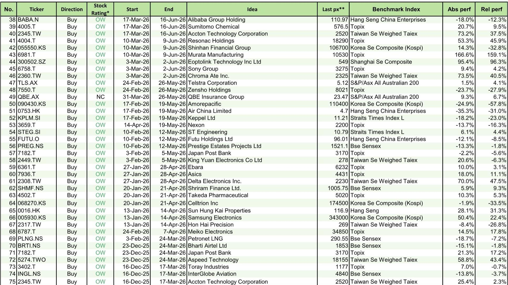
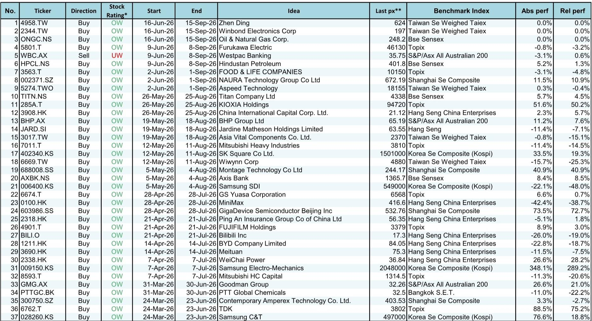
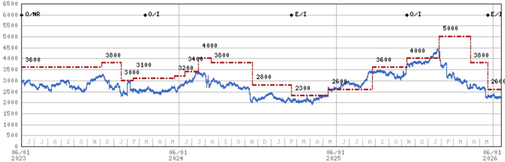

# 摩根斯坦利：亚洲市场正在出现三个不可忽视的结构性机会

当市场还在为宏观不确定性争论不休时，摩根斯坦利的最新一期“Three Actionable Ideas”给出了一个清晰的信号：亚洲市场内部的结构性分化正在加速，真正的超额收益机会来自那些能够抓住AI基础设施、利率正常化和能源转型三重浪潮的公司。

这份报告的核心判断是：亚洲市场的投资逻辑正在从“宏观博弈”转向“微观验证”。那些能够证明自己受益于AI资本开支、利率上升周期和政策驱动型能源投资的公司，正在获得明显的估值溢价。而市场对某些公司的回调反应过度，恰恰创造了重新入场的机会。

报告精选了三只标的：村田制作所、三井住友金融集团和斗山能源。但这三只股票背后，其实代表了亚洲市场正在发生的三个趋势性变化。

> **KC评论：** 摩根斯坦利这个“Three Actionable Ideas”系列的历史表现值得关注。截至2026年6月16日，累计相对超额收益达到8955个基点，平均持有期总回报4.3%，相对基准的12个月平均回报为11.5%。这不是一个随意的选股组合，而是一个经过长期验证的、基于基本面研究的信号系统。对读者来说，理解这三只股票背后的逻辑，比记住股票代码重要得多。

## 1. AI基础设施的需求正在从“芯片”向“被动元件”传导，村田制造是最大受益者

市场对AI的关注长期集中在GPU和服务器层面，但摩根斯坦利指出，下一个需求爆发的环节可能是高附加值MLCC（多层陶瓷电容）。报告预计，AI和数据中心应用对高附加值MLCC的需求年复合增长率将接近100%。

这是一个典型的“二阶效应”投资逻辑。AI服务器的功耗和信号处理复杂度远超传统服务器，对高端电容的需求量是普通服务器的数倍。村田制造作为全球MLCC龙头，拥有最完整的高端产品线和最大的产能规模，在这个趋势中处于最有利的位置。

值得注意的是，摩根斯坦利将村田制造提升为“新首选股”，同时下调了太阳诱电的评级至低配。这一调仓动作本身就说明：行业内部的分化正在加剧，不是所有被动元件公司都能吃到AI红利。技术壁垒、产品组合和客户结构将成为区分赢家和输家的关键。

> **KC评论：** 村田制造在3月10日至6月9日的上一个推荐周期中，绝对回报高达166.6%，相对基准超额收益159.1%。摩根斯坦利选择在这个位置继续上调评级，意味着他们认为AI对MLCC需求的拉动才刚刚开始。完整报告中对MLCC供需格局、价格趋势和村田的产能扩张计划有更详细的测算，这些数据对于判断这个投资逻辑的可持续性至关重要。

## 2. 日本银行股正在进入一个“盈利上修与股东回报增强”的正向循环

三井住友金融集团被选为第二个推荐标的，其核心逻辑是：终端利率预期的上升和企业盈利的韧性正在同时改善银行的基本面。

日本央行在2026年的加息路径比市场预期更为坚定。对于日本银行来说，这意味着净息差的持续扩大。同时，日本企业的盈利状况依然稳健，贷款质量没有出现恶化迹象。这两个因素叠加，为银行股的盈利上修提供了基础。

更关键的是股东回报。日本交易所集团的治理改革正在产生实质效果，银行作为日本最传统的行业之一，正在通过股票回购和股息提升来回应市场对资本效率的期待。摩根斯坦利认为，盈利上修和股东回报增强将成为股价的催化剂。

这个逻辑不仅仅是针对三井住友。报告同期还推荐了新韩金融集团，并在此前的推荐中获得了正向回报。日本金融板块的整体吸引力正在提升。

## 3. 斗山能源的回调是“催化剂真空”而非“逻辑破坏”，核能/SMR主题值得重新关注

斗山能源在近期经历了明显的股价回调。摩根斯坦利的判断是：这不是基本面的问题，而是催化剂真空。市场在等待下一个明确的政策或订单信号。

报告提到，2026年下半年核能与小型模块化反应堆的“观察清单”将变得更加清晰。斗山能源作为韩国在核能设备领域的核心供应商，其业务与全球核电重启和SMR商业化进程高度绑定。

这个推荐背后的宏观判断是：全球能源转型正在从“可再生能源优先”转向“核电回归”。无论是美国、欧洲还是亚洲，政策和资本都在向核能倾斜。斗山能源的股价回调，恰恰为那些愿意等待催化剂兑现的投资者提供了入场机会。

> **KC评论：** 斗山能源的案例很有趣。摩根斯坦利在5月12日推荐的三菱重工（同样是核能/能源设备标的）至今相对收益为负，而斗山能源在5月12日的推荐中获得了33.5%的绝对回报。这说明核能主题内部的个股分化也非常明显。完整报告中应该会对核能/SMR的全球政策进展、订单可见度和估值框架做更深入的拆解，这些信息对于判断“催化剂何时兑现”至关重要。

## 4. 报告尚未完全回答的关键问题：AI需求的结构性能见度有多高？

尽管AI对MLCC的需求逻辑清晰，但报告并未充分讨论一个问题：这个需求的可持续性如何？MLCC的产能扩张周期通常需要12-18个月，如果AI资本开支在2027年出现放缓，行业可能面临供过于求的风险。

同样，日本银行股的盈利改善高度依赖日本央行的加息路径。如果全球经济出现超预期下行，迫使日本央行放缓加息，银行的净息差改善空间将大幅收窄。

这些不确定性并不意味着应该回避这些机会，而是提醒投资者：需要持续跟踪关键假设的变化。摩根斯坦利在报告中对这些风险有更详细的敏感性分析，但这些内容在公开的“Three Actionable Ideas”摘要中并未完全展开。

## 5. 给读者的观察框架：如何判断这三个机会是否适合自己？

对于机构投资者和高净值读者来说，这三个标的提供了一个很好的“情景分析”框架：

第一，你如何看待AI资本开支的持续性？如果认同AI基础设施投资将贯穿未来2-3年，村田制造的逻辑是最直接的。

第二，你是否相信日本央行的加息路径？如果认为日本利率正常化是大势所趋，三井住友金融集团提供了清晰的盈利弹性。

第三，你愿意等待核能催化剂的兑现吗？如果对核电和SMR的长期趋势有信心，斗山能源的回调是值得研究的窗口。

这三个问题没有标准答案，但它们决定了投资者应该在这些标的上配置多少仓位、持有多长时间。

---

这三个机会背后的行业趋势、估值水平和风险敞口，每一层都有大量值得深挖的数据和图表。我们每天会由AI agent和人工review生成国际投行中文摘要与KC评论，daily更新约10-40页，并整理当天最新数据图表合集，方便喂给AI，也方便人工快速把握market dynamics。欢迎来星球微信群里继续讨论，我们会持续跟踪这三只标的的关键催化剂和风险变化。

Personal reading notes and learning share only. Not investment advice.

