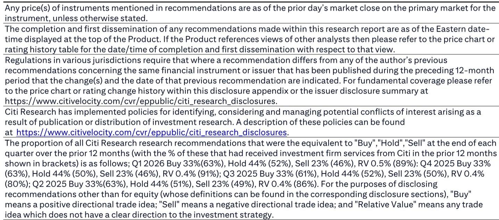
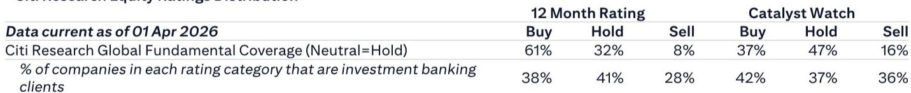
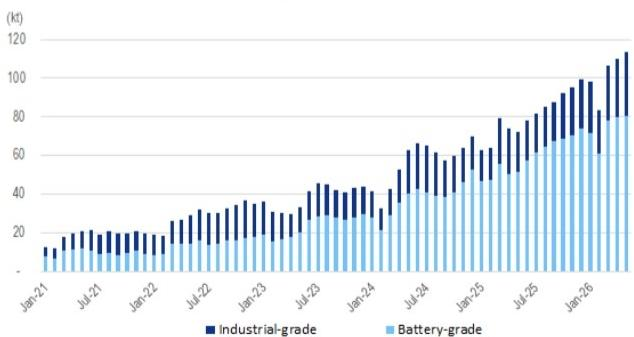

# Citi：锂价暴跌的真正信号不是供给，是市场对“重启”的定价方式变了

这份Citi研报发布的时间点，恰好卡在一个微妙窗口：市场刚刚消化了江西某重要锂矿（JXW）初步场地评估获批的消息，锂盐现货价格随即急转直下。但如果你只把注意力放在“复产时间表”上，可能就错过了这份报告真正想传达的结构性判断。

Citi的核心结论是：锂的供需基本面在2026年三季度前仍然偏紧，但市场已经开始提前交易一个更复杂的逻辑——不是复产本身，而是市场对复产预期的反应机制已经发生了不可逆的改变。

为什么这份报告值得认真看？因为它同时触及了三个层面：短期库存数据的真实状态、中期供给释放的节奏博弈，以及长期市场定价权从供给端向需求端的转移。而这三个层面，恰好指向同一个问题：锂价的下一个锚点在哪里？

---

## 1. 库存数据出现了一个容易被忽略的拐点，但市场选择了无视

先看Citi给出的最硬的数据：截至6月18日当周，中国碳酸锂总库存为96,645吨，环比下降1,184吨，降幅约1.2%。其中冶炼厂库存下降7%至15,373吨，下游正极材料厂商库存持平，贸易商和电池厂库存也基本持平。

这个库存下降值得注意。Citi在报告中特别指出，这是库存连续几周横盘后首次出现周度环比下降。更关键的是，冶炼厂库存的下降幅度明显大于下游，说明上游正在主动去库存，而不是需求端在主动补库。

但市场的反应是什么呢？锂盐现货价格在当周基本持平，碳酸锂和氢氧化锂报价分别为16.725万元/吨和15.25万元/吨，周环比几乎无变动。也就是说，库存下降这个利多信号，被市场完全忽略了。

> **KC评论：** 库存下降但价格不涨，这在商品市场里通常意味着“市场认为这个库存下降不可持续”或“市场在等待一个更大的利空”。Citi报告暗示，这个更大的利空就是JXW复产预期。完整报告里有两张周度库存和月度库存的对比图，能清楚看出库存下降的节奏和结构，值得仔细看。

这对读者的含义是：短期交易者不能再单纯依赖库存数据做多锂价。库存下降正在从一个“买入信号”变成“需要验证的观察点”。

---

## 2. Citi对JXW复产的判断比市场普遍预期更谨慎，但市场已经在提前定价

这是整份报告最具洞察力的部分。Citi通过行业渠道调研得出一个分层判断：JXW的采矿（采矿）可能在8月或10月恢复，但选矿（选矿）可能需要推迟；而锂云母矿可能外包给第三方进行后续的选矿和转化。

这个判断的微妙之处在于：市场普遍预期的是“全面复产”，但Citi认为实际复产可能是一个分阶段、分环节的过程。采矿恢复不等于选矿恢复，选矿恢复不等于产能完全释放。

但问题在于，市场似乎已经在按照“最坏情况”——即全面复产——来定价。Citi在报告中用了一个非常克制的词：“looming concern”（隐现的担忧）。这个词选得很精准：不是恐慌，不是确定性，而是一种持续累积的、尚未兑现的担忧。

> **KC评论：** Citi并没有断言JXW一定会全面复产，而是指出“市场已经在定价这个预期”。这是两个完全不同的概念。前者是基本面判断，后者是市场行为判断。Citi作为卖方机构，更擅长的是后者。完整报告里应该还有对复产时间表的更详细拆解，以及对不同情景下锂价区间的测算。

对产业决策者的含义：如果你正在做锂盐采购或库存管理，不能只盯着官方复产公告，而要关注“市场预期”与“实际复产进度”之间的偏差。这个偏差越大，价格波动就越剧烈。

---

## 3. 真正的供需矛盾不在当下，而在2026年三季度的大规模电池产能投放

Citi在报告中留下了一个非常关键的伏笔。在讨论完JXW复产的担忧后，它紧接着写了一句：“但我们仍然预计锂的供需动态可能持续偏紧，因为大量新电池产能计划在2026年三季度投放。”

这句话值得反复读三遍。

Citi的逻辑链条是这样的：即使JXW部分复产，供给端的增量是有限的；但需求端，2026年三季度的电池产能投放是刚性的、已经规划的、不太可能大幅推迟的。因此，供需在中期仍然存在结构性缺口。

这个判断与市场当前的主流叙事——锂供给过剩、价格将持续低迷——形成了鲜明对比。Citi并没有直接反驳这个叙事，而是通过指出“2026年三季度”这个时间节点，暗示当前的价格下跌可能是一次过度反应。

> **KC评论：** 这是整份报告里最值得追问的部分。Citi提到了“大量新电池产能”，但没有展开具体是哪些项目、多少GWh、分布在哪些地区。这些细节恰恰是判断供需缺口大小的关键。完整报告里应该有更详细的产能投放时间表和对应的锂需求测算。如果你在跟踪锂电产业链，这部分信息可能是报告里最有价值的增量信息。

对投资者的含义：如果Citi的判断成立，那么当前锂价的下跌可能是一次中期买入机会。但前提是，你必须相信2026年三季度的电池产能投放不会大规模延期。

---

## 4. 报告没有完全回答的一个关键问题：谁在定价？

这份报告最引人深思的地方，恰恰是它没有说透的部分。

Citi提供了详尽的周度产量和库存数据，给出了对JXW复产的分阶段判断，也指出了2026年三季度需求端的潜在支撑。但它没有回答一个更根本的问题：在当前这个时间点，锂价的定价权到底在谁手里？

从数据看，冶炼厂在主动去库存，下游在观望，贸易商在等待。这意味着市场缺乏一个明确的多头或空头主导力量。价格的下跌更多是“预期自我实现”的结果：因为市场担心复产，所以提前抛售；因为提前抛售，价格下跌；因为价格下跌，进一步强化了市场对供给过剩的预期。

这种“预期主导”的定价模式，与2021-2022年“供需缺口主导”的模式完全不同。Citi报告实际上暗示了这一点——它用了大量篇幅描述市场预期，而不是基本面本身。

> **KC评论：** Citi作为卖方，擅长的是“描述市场状态”而不是“预测市场方向”。这份报告的价值在于帮你理解当前市场的定价逻辑，而不是告诉你该买还是该卖。如果你想深入理解锂价的下一个拐点在哪里，完整报告里的库存结构图和产能投放时间表是必须仔细看的。

---

## 5. 对读者的观察框架：从“供给博弈”转向“预期博弈”

综合Citi报告的核心信息，我们可以提炼出一个更通用的观察框架：

第一，锂市场的分析重心正在从“供给端”转向“预期端”。过去两年，市场关注的是“谁在减产”“谁在复产”“成本曲线在哪里”。但Citi报告显示，当前市场更关注的是“市场预期什么”“预期如何被定价”“预期何时被证伪或证实”。

第二，库存数据的作用正在发生变化。过去，库存下降是明确的利多信号。现在，库存下降需要与“市场是否相信这个下降可持续”结合起来看。Citi报告提供了一个很好的方法：观察冶炼厂库存与下游库存的相对变化，来判断去库存是主动还是被动。

第三，2026年三季度是一个关键的时间节点。无论是做多还是做空，都需要回答一个问题：你相信2026年三季度的电池产能投放会如期进行吗？如果相信，当前的锂价可能被低估；如果不相信，当前的锂价可能还有下行空间。

---

Citi这份报告的价值，不在于它给出了一个明确的买卖建议，而在于它帮你重新校准了分析锂市场的坐标系。从“供给博弈”到“预期博弈”，从“库存数据”到“市场对库存数据的反应”，从“当下供需”到“2026年三季度的结构性缺口”——这些框架性的调整，可能比任何一个具体的价格预测都更有长期价值。

但报告里还有一些关键细节没有完全展开：JXW复产的具体审批流程和不确定性来源、2026年三季度电池产能投放的详细清单、以及不同情景下锂价的敏感性分析。这些内容，都藏在完整报告的图表和附录里。

每天，我们的AI agent和人工团队会从国际投行的最新报告中提炼中文摘要，并附上KC评论，生成约10-40页的daily更新，同时整理当天最新的数据图表合集。这些内容既方便直接喂给AI做进一步分析，也方便人工快速把握全球市场的dynamics。如果你对锂电产业链或更广泛的大宗商品市场有持续跟踪的需求，欢迎来我们的星球和微信群里继续讨论。

Personal reading notes and learning share only. Not investment advice.

