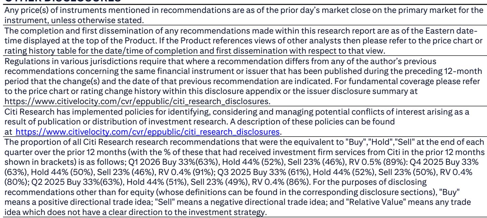
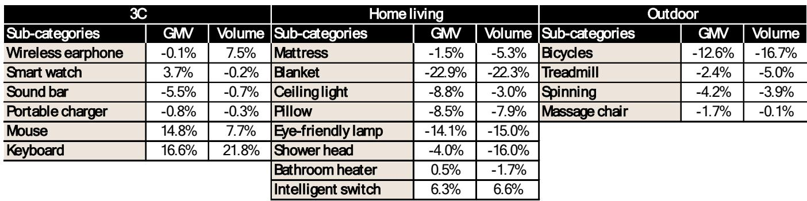
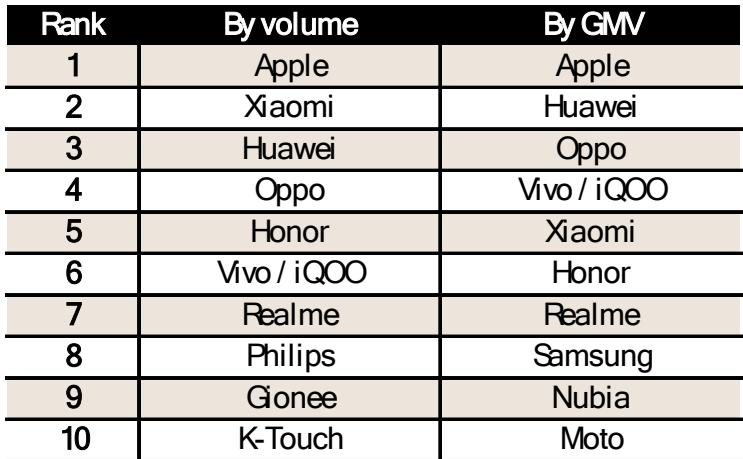

# Citi：2026年618是16年来最低调的一届，但真正的信号藏在品类结构里

2026年的618购物节，在一种近乎静默的氛围中结束了。各大平台不再高调发布战报，GMV增速仅为3.2%，创下16年来的最低调记录。Citi在最新研报中给出了一个清晰的判断：这不是一次简单的“消费降级”，而是消费者行为正在从“价格驱动”转向“场景驱动”的结构性转变。

这份报告最值得关注的信息，不是GMV增速本身，而是品类分化的背后，哪些平台正在失去议价权，哪些品类正在成为新的增长锚点。对于关注中国互联网和消费资产的投资者来说，理解这种结构性变化，比关注短期GMV数字更有意义。

---

## 1. 3.2%的增速背后，是平台从“补贴战”转向“品牌战”的集体默契

Citi研报指出，2026年618期间，阿里巴巴显著削减了在“淘宝闪购”上的补贴投入，转而将资源投向剧集品牌广告和明星代言。京东则通过服务类目（家政、育儿、家电安装）拉动用户增长。抖音虽然保持了直播GMV翻倍，但更多依赖长尾主播和消费券，而非平台大额补贴。

这种“默契”并非偶然。过去几年，电商平台在618和双11期间的补贴战，边际效用已经递减到几乎为零。消费者对“满减”“红包”的敏感度下降，平台则面临毛利率持续承压的困境。2026年的618，更像是行业集体完成了一次成本结构的优化。

> **KC评论：** 平台不再烧钱换GMV，意味着利润表的修复可能比市场预期的更快。但代价是，增速数据会变得更难看。对于投资者来说，这反而是一个更健康的信号——行业从“跑马圈地”进入“精细化运营”阶段。完整报告里Citi对各家平台利润率趋势的拆解，值得细读。

---

## 2. 京东在3C和家电领域的护城河，比市场想象的要深

Citi援引复旦大学消费市场大数据实验室的数据显示，京东在3C、家电和医疗健康三大品类中，分别占据了57.8%、53.9%和48.6%的GMV份额。在智能手机品牌排名中，苹果无论是按销量还是按GMV都稳居第一，而华为在GMV维度上超过了小米，位居第二。

这些数字本身并不意外，但Citi报告里有一个容易被忽略的细节：京东的以旧换新家电GMV同比增长超过50%，AI相关电子产品GMV翻倍，高端智能手机和笔记本电脑GMV分别增长300%和100%。这意味着，京东在3C家电领域的领先，正在从“价格优势”升级为“服务+场景优势”。

当消费者愿意为一台高端手机支付溢价，并且通过以旧换新服务完成升级时，京东实际上已经掌握了这个品类里的“定价权”——不是通过补贴，而是通过服务闭环。这种能力，是抖音和拼多多短期内难以复制的。

---

## 3. 服装和家居品类正在经历一场“无声的洗牌”，抖音和京东成为赢家

Citi报告显示，服装品类整体增速放缓，但京东以11.6%的增速领先，淘宝天猫增速从2025年的3.5%回升至5.9%，抖音为7.3%，拼多多为6.7%。家居品类中，抖音和京东分别以10.6%和10.5%的增速领先，而淘宝天猫和拼多多基本持平。

这个数据组合透露了一个重要信号：服装和家居这两个曾经属于淘宝天猫的“优势品类”，正在被京东和抖音分食。京东靠的是品牌信任和服务能力（42个服装品类增速超过行业平均，超过2000个品牌GMV翻倍），抖音靠的是内容驱动和长尾主播生态（超过30万个新商家参与，GMV超百万）。

> **KC评论：** 对于关注电商格局变化的读者来说，品类份额的迁移比总量增速更重要。淘宝天猫在服装和家居上的“失守”，意味着其核心利润池正在被侵蚀。Citi报告里对各家平台品类结构的详细图表，是判断未来竞争格局的关键依据。

---

## 4. 阿里巴巴的“品牌广告”转型，是一步险棋，但可能是正确的方向

Citi指出，阿里巴巴今年618的策略发生了显著变化：减少对淘宝闪购的补贴，转而投资多部热播剧的品牌广告，并调整了明星代言策略——从直接赞助转为邀请参与活动的品牌进行联合代言。参与的品牌包括Spes、Dessmann、Bose、Molsion、Fila等。

这种策略转变的底层逻辑是：在消费环境偏弱的情况下，阿里巴巴选择放弃“低价引流”的短期策略，转而巩固品牌商家的忠诚度和广告收入。从第三方数据来看，3C品类中鼠标和键盘的GMV和订单量环比增长明显，但家居和户外品类则出现环比下滑。

这里有一个尚未完全验证的假设：品牌广告投入能否在更长周期内转化为GMV和利润？目前的数据还不足以回答这个问题。Citi报告中对阿里巴巴各品类表现的详细拆解，是判断这一策略成败的关键素材。

---

## 5. 抖音的“内容电商”正在从补充角色变成主力渠道，但可持续性仍需验证

Citi报告显示，抖音电商2026年618期间有12万商家和57万主播参与，直播GMV翻倍。超过3万个新商家首次参与618，每个商家GMV超过100万元。长尾主播贡献了超过80%的KOL GMV。带购物车的短视频观看量同比增长57%，消费券驱动的百万GMV商家数量在直播和短视频维度分别增长152%和432%。

这些数字看起来亮眼，但有两个关键问题Citi报告没有完全展开：第一，抖音的GMV增长是否可持续，还是主要靠消费券和补贴驱动？第二，长尾主播的生态能否持续贡献高质量增长，还是会出现流量成本上升后的边际递减？

> **KC评论：** 抖音的电商增长逻辑是“内容即货架”，但货架的效率取决于流量的成本。Citi报告里对抖音消费券效果的拆解，是理解其增长质量的关键数据。完整报告中的相关图表，可以帮助读者判断抖音电商是否已经形成真正的飞轮效应。

---

## 6. 报告尚未完全回答的关键问题：平台利润与GMV增长的“平衡点”在哪里？

Citi这份报告的核心价值，在于它提供了2026年618最完整、最结构化的数据快照。但它也留下了一个尚未完全回答的问题：当平台集体从补贴战转向品牌战和服务战，GMV增速放缓至3.2%时，利润率的改善能否弥补增速的损失？

对于阿里巴巴来说，品牌广告投入的回报周期尚不明确；对于京东来说，服务类目的增长能否持续拉动用户增量；对于抖音来说，内容电商的流量成本是否会侵蚀利润空间。这些问题的答案，将决定未来12个月中国互联网板块的估值逻辑。

---

2026年的618，表面上是“最安静的一届”，但本质上是一场行业集体从“规模竞争”转向“效率竞争”的转折点。对于投资者和产业决策者来说，理解这种转折的深度，比关注短期GMV数字更重要。

我们每天会由AI agent加人工review，生成国际投行中文摘要与KC评论，每日更新约10至40页，并整理当天最新数据图表合集，既方便喂给AI，也方便人工快速把握市场动态。欢迎来星球微信群里继续讨论，一起拆解这些未解问题。

Personal reading notes and learning share only. Not investment advice.

