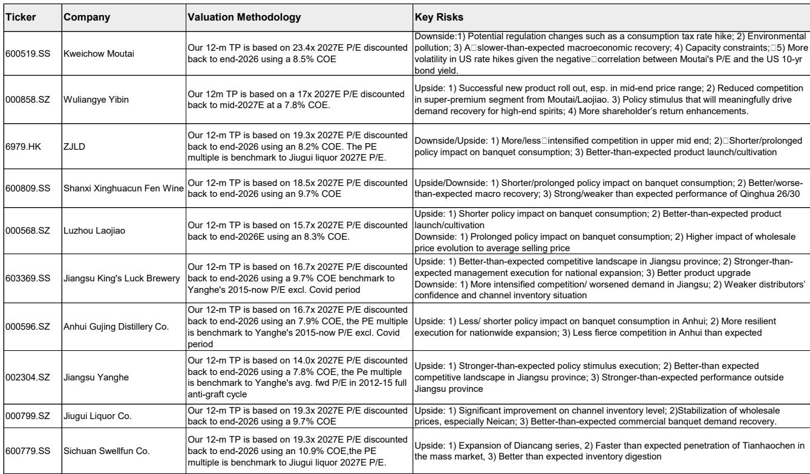
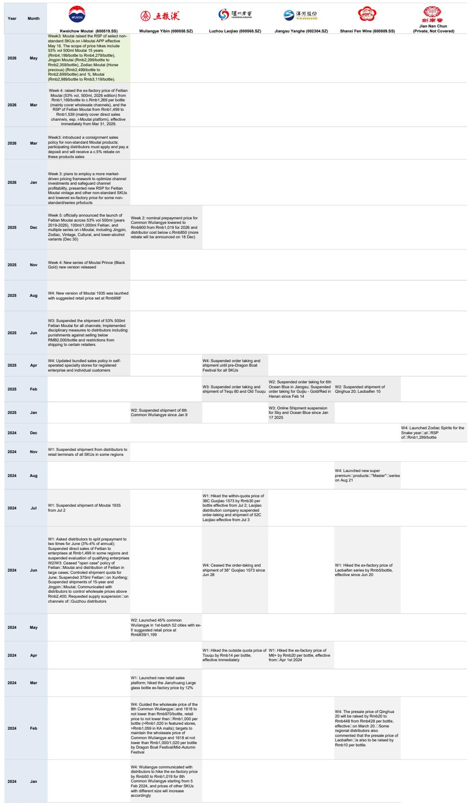
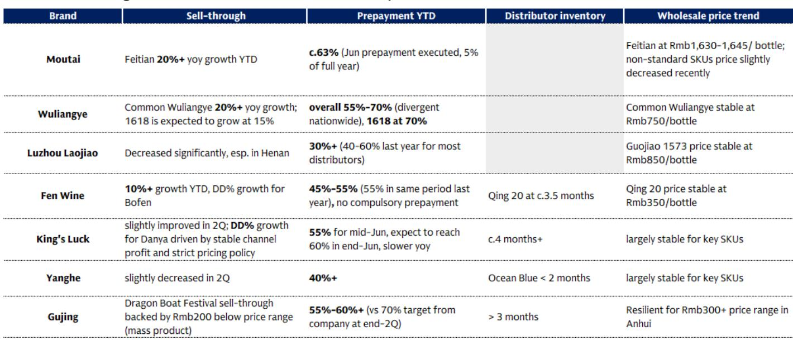

# GS：白酒端午动销恢复，但分化才是真正的胜负手

这份GS在端午后发布的渠道追踪报告，给出了一个看似矛盾、实则清晰的判断：白酒行业正在走出最糟糕的时刻，但复苏的红利几乎全部流向了超高端和少数区域强势单品。中高端、次高端品牌，尤其是那些依赖商务宴请场景的，依然承压。这轮复苏不是普涨，而是一次结构性的出清与集中。

报告的核心价值不在于“动销同比改善”这个事实——这几乎是共识——而在于它精确刻画了改善的分布、驱动力以及背后尚未解决的结构性问题。对于投资者和产业决策者而言，理解这种“有温度的复苏”的边界，远比知道一个总量数字更重要。

以下是基于这份报告的深度解读与延伸思考。

## 1. 总量改善背后的“温差”：超高端两位数增长，中高端仍在失血

端午小长假期间，茅台和五粮液的终端动销实现了10%至20%以上的同比增长，预收款比例也维持在健康水平。这直接印证了高端送礼和自饮需求的韧性。但与此同时，泸州老窖在河南等核心市场动销“显著下降”，洋河二季度动销“略有下滑”，渠道库存压力并未实质性缓解。

这份报告揭示了一个关键事实：白酒消费的“K型分化”正在加剧。超高端品牌凭借品牌势能和刚需场景（送礼、高端宴请）率先反弹，而300至800元价格带的产品，尤其是那些依赖商务宴请和团购渠道的品牌，依然在消化过去几年过度铺货的苦果。

> **KC评论：** 这意味着，对于持有或关注白酒股的投资者，不能再用“行业整体回暖”的框架来估值。茅台、五粮液的动销数据，并不能线性外推至整个板块。真正需要关注的是，哪些品牌在库存去化后，依然能维持价格体系和渠道利润。这份报告中的渠道检查表格，详细列出了各品牌的库存月数和批发价走势，是判断这一点的关键素材。完整报告中有更细分的区域数据，值得仔细拆解。

## 2. 商务宴请“缺席”的复苏：增长引擎切换，政策影响仍在消化

报告明确指出，传统的商务和政府相关需求“仍显著低于历史水平”。推动本轮动销改善的核心力量是“送礼”和“大众自饮”。而宴席场景（如婚宴、寿宴）的消费量依然疲弱。

这一判断至关重要。它意味着，当前白酒消费的复苏基础并不牢固。送礼需求具有明显的节日脉冲特征，端午之后、中秋之前，能否持续存在疑问。大众自饮则更倾向于百元价格带，对高端品牌的贡献有限。真正能支撑行业持续增长的核心引擎——商务活动恢复——尚未启动。

> **KC评论：** 市场此前对白酒复苏的定价，隐含了商务场景会逐步恢复的假设。但这份报告提醒我们，政策影响在许多地区仍在消化。例如，安徽市场“持续疲弱”，而江苏、四川虽有“轻微复苏”，但企业商务活动量仍比2024年低30%至40%。这意味着，即便在乐观情境下，白酒行业也需要更长的时间来消化库存、重建渠道信心。完整报告中对各区域的动销差异分析，给出了判断复苏节奏的关键坐标。

## 3. 茅台批价小幅波动，五粮液、国窖价格企稳：谁在真正“挺价”？

报告期内，飞天茅台原箱批发价下跌25元至1645元/瓶，而普五和国窖1573价格基本持平。茅台作为行业风向标，其批价小幅回落引发市场关注。但更值得思考的问题是：为什么五粮液和国窖能在此轮调整中稳住价格？

原因在于，五粮液和国窖在过去一年中采取了更为积极的“控货挺价”策略。从报告整理的2024-2026年政策梳理表可以看出，两大品牌多次暂停发货、调整配额、甚至直接干预终端批发价。而茅台在2026年3月提价后，渠道利润空间扩大，但终端动销放量也带来了短期的价格压力。

这揭示了一个更深层的竞争逻辑：在需求偏弱的环境下，谁有能力维持渠道利润，谁就能在下一轮周期中占据主动。茅台依靠的是绝对品牌力，而五粮液和国窖依靠的是精细化的渠道管理。这份报告中的政策梳理表格，是理解各家酒企“工具箱”差异的绝佳材料。

## 4. 报告尚未完全回答的关键问题：库存去化的“终点”在哪里？

报告提供了各品牌当前的库存月数，例如青花20约3.5个月，今世缘超过4个月，古井贡酒超过3个月。这些数字高于健康水平（通常认为1.5-2个月是合理区间）。但报告并未给出一个明确的“去化终点”判断。

真正的悬念在于：当前的动销改善，是库存去化的开始，还是节日脉冲下的暂时性反弹？如果商务活动在三季度依然低迷，中秋国庆旺季的动销能否消化掉渠道中的过剩库存？如果库存无法在旺季前降至健康水平，那么价格体系可能面临新一轮冲击。

> **KC评论：** 这是这份研报最值得追问的问题。GS提供了数据框架，但判断需要读者自己结合宏观环境和企业动态来推导。完整报告中包含的“2019-2026年飞天茅台价格走势图”和“各品牌批发价历史对比图”，是回答这个问题的关键工具。我们会在社群内结合最新的草根调研数据，持续跟踪这一变量。

## 5. 给决策者的观察框架：从“量价齐升”到“量稳价增”

基于这份报告，我们可以提炼出一个适用于当前阶段的观察框架：

- **核心指标**：不再只看总收入增速，而要关注“量价拆分”——销量增长是否伴随价格稳定或提升？如果销量靠的是降价促销，则利润弹性有限。
- **渠道健康度**：预收款比例、经销商库存月数、批发价走势，三者需要联动判断。预收款高而库存低，是强势信号；预收款高但库存也高，则可能是压货。
- **场景结构**：送礼、宴席、商务、自饮四大场景的占比变化，决定了品牌的增长天花板。过度依赖单一场景的品牌，脆弱性更高。
- **区域分化**：江苏、四川、安徽、河南等核心市场的表现差异，是判断行业整体复苏节奏的前瞻指标。

这份GS报告的价值，不在于给出了一个简单的“买入或卖出”信号，而在于它用详实的数据，为上述框架提供了最新的注脚。它告诉我们，复苏是真实的，但也是高度分化的。对于投资和经营决策而言，理解这种分化，比押注一个方向更重要。

---

如果你希望继续深入讨论这份报告中的具体数据图表，或者想获取我们每日整理的投行研报摘要与数据合集（包含GS、MS、JPM等机构的最新观点），欢迎加入我们的知识星球与微信群。每天，AI agent 与人工 review 会共同生成约10至40页的中文摘要与图表整理，方便你快速把握市场动态，也方便直接喂给AI进行二次分析。我们会在社群中持续跟踪白酒行业的库存去化进程与价格演变。

Personal reading notes and learning share only. Not investment advice.

