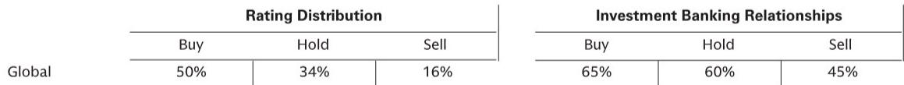

# GS：中国光伏需求2028年才会迎来真正拐点

市场对2026年中国光伏装机下滑已有预期，但多数投资者仍倾向于认为，这不过是行业周期中的一次短暂调整，2027年即可重回增长。GS最新发布的一份专家调研报告，给出了一个更为审慎的判断：中国光伏需求的真正拐点可能要到2028年才会到来。这意味着，产业链的盈利修复时间表将被推迟，而行业出清的过程将比市场普遍预期的更为漫长。

这份报告的核心信号并非悲观，而是提供了一个更贴近产业现实的观察框架。它揭示了一个关键矛盾：当前市场对分布式光伏的韧性存在高估，而对电网消纳瓶颈的解决速度存在低估。真正的拐点，取决于政策、电网投资和电力需求三者能否在2028年前后形成合力。

## 1. 2026年装机下滑已成定局，分布式结构将出现显著分化

GS专家预计，2026年中国光伏装机将同比下降26%至238GW左右，这一总量预测与GS此前给出的235GW基本吻合。但真正值得注意的，是装机结构内部的显著分化。

公用事业规模项目（USS）预计下滑18%，至135GW，与GS此前预测基本一致。分布式工商业项目（DS-C&I）预计下滑48%，至55GW，显著低于GS此前预测的83GW。而分布式户用项目（DS-Resi）则展现出意外韧性，预计同比增长3%，至57GW，远超GS此前预测的14GW。

这一分化背后，是不同细分市场商业模式的根本性转变。工商业项目正在从“余电上网”模式转向“自发自用+储能”模式。随着光伏配储的平准化度电成本（LCOE）降至0.65-0.7元/kWh，已低于多数地区的工商业峰值电价，经济性驱动了模式切换。但“直供电”项目因电网接入要求更复杂，建设周期显著拉长，这解释了近期的装机低于预期。户用市场的韧性，则源于融资成本下降后，部分运营商接受了更低的内部收益率门槛，且需求集中在东南沿海等电网接入保障较好的区域。

> **KC评论：** 这一结构分化告诉我们，2026年装机下滑不是“所有类型都不行”，而是工商业项目正处于模式切换的阵痛期。GS的预测低估了户用市场的韧性，但高估了工商业项目的短期恢复速度。完整报告中还拆分了各细分市场的IRR敏感性分析和区域分布数据，这些细节对于判断2027年各细分市场的恢复节奏至关重要。

## 2. 2027年将是更严峻的考验，项目储备不足是核心瓶颈

GS此前预测2027年中国光伏装机将同比增长14%至268GW，但专家给出了更为保守的判断：2027年装机将继续下滑，只是降幅可能放缓。核心原因在于，公用事业项目的新增储备严重不足。

数据显示，2026年前四个月，公用事业项目的新开工量同比下降了34%。考虑到从开工到并网通常有6-12个月的时滞，这意味着2027年的装机量将面临显著的供给缺口。分布式工商业项目虽然有望在2027年恢复增长，但难以完全对冲公用事业项目的下滑。

这一判断与市场普遍预期的“2027年触底回升”存在明显分歧。如果专家的判断成立，那么2027年将成为行业出清的关键年份，更多边际产能将被迫退出。

> **KC评论：** 这里需要特别关注一个细节：GS自己的预测与专家判断出现了分歧。GS预测2027年增长14%，而专家预测继续下滑。这种分歧本身就很有价值，它意味着2027年的需求存在较大的不确定性。完整报告中包含了GS与专家在关键假设上的详细对比表格，包括对各省份消纳能力、电网投资进度、以及电价政策的差异化假设。这些假设差异，正是判断2027年需求走向的关键。

## 3. 消纳改善是2028年需求反转的前提，三大结构性杠杆正在形成

专家认为，2028年将成为中国光伏需求的真正拐点，而前提条件是电网消纳能力的显著改善。这一判断基于三个正在形成的结构性杠杆。

第一，政策层面正在发生战略性转变。国家发改委已将清洁能源消费占比纳入省级政府的强制性考核指标。这意味着，过去“重建设、轻消纳”的激励机制正在被扭转，地方政府有更强的动力去解决弃光问题。

第二，电网投资正在大幅加码。2026-2030年，中国电网投资预计将达到约5万亿元，较2020-2025年的2.77万亿元增长近80%。这笔投资将重点用于提升跨区域输电能力、建设新型储能设施、以及优化配电网结构，直接缓解光伏发电的消纳瓶颈。

第三，电力需求仍在稳健增长。2026年前四个月，全社会用电量同比增长5%。持续增长的用电需求，为新增光伏装机提供了消纳空间。

> **KC评论：** 这三个杠杆中，电网投资规划最为关键，也最容易被市场低估。5万亿元的投资规模是历史性的，但投资节奏和区域分布才是决定2028年能否成为拐点的核心变量。完整报告中包含了专家对各区域消纳改善节奏的详细预测，以及2025年各省份光伏利用小时数变化的完整数据，这些信息对于判断不同区域的市场机会至关重要。

## 4. 报告尚未完全回答的关键问题：2027-2028年过渡期的行业生态

GS的这份报告，对2026年、2028年及以后的装机趋势给出了清晰的判断，但2027-2028年的过渡期仍存在几个关键问题。

第一，2027年装机持续下滑时，产业链的盈利底会在哪里？专家认为，2027年下滑将加速边际产能退出，但这个过程的具体节奏和深度，报告并未给出量化分析。如果出清速度慢于预期，行业盈利修复可能推迟到2028年下半年甚至更晚。

第二，分布式工商业项目的模式切换能否在2027年完成？目前“自发自用+储能”模式虽然经济性已经成立，但建设周期拉长的问题尚未解决。如果这一问题在2027年得到缓解，工商业项目可能成为2027年需求的意外支撑。

第三，GS自身的预测与专家判断在2027年存在分歧，这意味着GS内部可能也在重新评估2027年的需求假设。这种分歧背后，是对电网投资进度、项目审批节奏、以及电价政策的不同假设。这些假设的调整，将直接影响对隆基、通威等龙头企业的盈利预测和估值判断。

## 5. 对投资者的观察框架：关注三个领先指标，而非总量预测

基于这份报告的逻辑，投资者可以建立一个更实用的观察框架，而不是仅仅关注2027年装机是否增长。

第一个领先指标是公用事业项目的新开工量。这直接决定了12个月后的装机量，是最具前瞻性的需求信号。如果2026年下半年新开工量出现环比改善，那么2027年装机的下行风险将显著降低。

第二个领先指标是电网投资的落地情况。5万亿元的规划是长期利好，但短期执行节奏才是关键。关注特高压线路的核准和建设进度，以及各省配电网改造的投资公告，可以更早判断消纳改善的拐点。

第三个领先指标是光伏配储的经济性变化。如果储能成本进一步下降，或者峰谷价差继续拉大，工商业分布式项目的经济性将加速改善，从而缩短“自发自用”模式的推广周期。

这三个指标，比单纯关注月度装机数据，更能反映行业真实的需求动能。而GS这份报告中，恰恰包含了专家对这些指标的详细预测和敏感性分析，这是完整报告中最有价值的部分。

---

**顺着这些未解问题继续深入**

2027年的需求走向、产业链盈利底部的深度、以及分布式工商业模式的切换节奏，这些问题都需要更细致的拆解和数据支撑。GS这份报告的完整版本包含了专家对各细分市场的详细预测、与GS预测的对比表格、以及各省份消纳改善节奏的量化分析。

我们每天会由AI agent结合人工Review，生成国际投行中文摘要与KC评论，日更约10-40页，整理当天最新数据图表合集，既方便喂给AI，也方便人工快速把握market dynamics。欢迎来星球微信群里继续讨论，一起跟踪这些关键变量的变化。

Personal reading notes and learning share only. Not investment advice.

