June 22, 2026 09:07 AM GMT

Tracking China's Semi Localization | Asia Pacific

# Raising China AI GPU TAM on recent geopolitical dynamics

The recent tightening of US export controls for China's overseas entities may create a new TAM for China's AI GPU.

Recent news regarding halting of AI chip shipments to Chinese firms outside of China poses a 'bull case' scenario for China AI GPU: in early June, news reported that the US Department of Commerce had moved to close a potential loophole that may have led companies to export the world's most advanced chips – such as NVIDIA's most sophisticated Blackwell processors – to subsidiaries of Chinese companies located outside China. We think that, in the short term, China CSPs may turn to more GPU rental to fulfill the strong computing demand, while in the mid-to-longer term, it is likely that China AI GPU may potentially see overseas adoption, which is the bull base we argue in our China AI GPU Insight report.

We raise our forecast of China's AI chip TAM to US\$91bn by 2030, up 36%, from US\$67bn previously, implying a 23% CAGR over 2025-30. The upward revision is mainly because of: 1) Adding "CSP's overseas capex" as the new TAM; 2) Bytedance's plan to sharply increase its capital spending in 2026 and 2027 (link); 3) the addition of Kingsoft Cloud to the database; and 4) revised up sovereign and SOE-related TAM on back of government advocacy to increase spending on AI infrastructure.

Domestic AI infrastructure enters a critical deployment window: Our recent field trip in China in suggests that despite ongoing capacity expansion, major CSPs continue to face compute shortages, while vendor qualification activity is accelerating. We believe 2026 will be a critical year for domestic suppliers to enter CSP procurement systems, with competition increasingly driven by ecosystem maturity, software optimization and cluster deployment capabilities. On the supply side, access to leading-edge foundry capacity remains a key differentiator. Vendors approved for CCATS (Commodity Classification Automated Tracking System) with BIS (Bureau of Industry and Security) are allowed access to TSMC manufacturing and generally benefit from better cost and power efficiency, for example 7nm/6nm node for Iluvatar. Meanwhile, domestic advanced-node capacity continues to ramp. Industry participants expect a more stable local supply chain to emerge in 2027-28 other than SMIC South, supporting broader adoption of domestic AI infrastructure.

Stock implications – OW China GPU companies, fab and semicap plays: We like Cambricon (OW) – we raise our PT to Rmb1,528, and Iluvatar CoreX (OW) – we raise our PT to HK\$688 on back of stronger China CSP demand; we also like SMIC (0981.HK, OW) and Hua Hong (1347.HK, EW) as key enablers of China's AI localization. We are constructive on Chinese semi equipment – Naura (002371.SZ), AMEC (688012.SS) and ACMR (ACMR.O) – on their positioning in China's accelerating semiconductor localization cycle; and ASMPT (0522.HK) as an enabler of China advanced packaging.

MS TAIWAN LIMITED+

Daniel Yen, CFA
Equity Analyst
Daniel Yeng@morganstanley.com +896 2 2730-2863

<table><tr><td colspan="2">Daisy Dai, CFA</td></tr><tr><td>Equity Analyst</td><td></td></tr><tr><td>Daisy Dai@morganstanley.com</td><td>+852 2848-7310</td></tr></table>

<table><tr><td colspan="2">MS TAIWAN LIMITED+</td></tr><tr><td colspan="2">Tiffany Yeh</td></tr><tr><td colspan="2">Equity Analyst</td></tr><tr><td>Tiffany Yeh@morganstanley.com</td><td>+886 2 7712-3032</td></tr></table>

<table><tr><td colspan="2">MS ASIA LIMITED+</td></tr><tr><td colspan="2">Henry Zhao</td></tr><tr><td colspan="2">Research Associate</td></tr><tr><td>Henry.Zhao@morganstanley.com</td><td>+852 2239-7731</td></tr></table>

<table><tr><td colspan="2">Ethan Jia</td></tr><tr><td>Research Associate</td><td></td></tr><tr><td>Ethan.Jia@morganstanley.com</td><td>+852 3963-2287</td></tr></table>

<table><tr><td colspan="2">MS TAIWAN LIMITED+</td></tr><tr><td colspan="2">Lucas Wang</td></tr><tr><td colspan="2">Research Associate</td></tr><tr><td>Lucas.Wang@morganstanley.com</td><td>+886 2 2730-2875</td></tr></table>

Asia Summer School 2026

<table><tr><td colspan="2">GREATER CHINA TECHNOLOGY SEMICONDUCTORS</td></tr><tr><td>Asia Pacific</td><td></td></tr><tr><td>Industry View</td><td>Attractive</td></tr></table>

<table><tr><td colspan="3">Cambricon Technology</td></tr><tr><td>Corporation (688256.SS)</td><td>From</td><td>To</td></tr><tr><td>Price Target</td><td>Rmb1,342.28</td><td>Rmb1,528.00</td></tr></table>

<table><tr><td colspan="3">lluvatar CoreX Semiconductor</td></tr><tr><td>Co., Ltd. (9903.HK)</td><td>From</td><td>To</td></tr><tr><td>Price Target</td><td>HK$600.00</td><td>HK$688.00</td></tr></table>

MS does and seeks to do business with companies covered in MS. As a result, investors should be aware that the firm may have a conflict of interest that could affect the objectivity of MS. Investors should consider MS as only a single factor in making their investment decision.

For analyst certification and other important disclosures, refer to the Disclosure Section, located at the end of this report.

+= Analysts employed by non-U.S. affiliates are not registered with FINRA, may not be associated persons of the member and may not be subject to FINRA restrictions on communications with a subject company, public appearances and trading securities held by a research analyst account.

## China AI GPU market TAM

China's AI GPU demand is concentrated across a small number of large buyer groups, whose capex decisions ultimately define the size of the addressable market.

\- The first group comprises China's CSPs – including ByteDance, Alibaba and Tencent – which procure AI chips both to train and run inference on proprietary models and to deploy AI infrastructure for external cloud customers.

\- The second group includes China's telecom operators, SOEs and municipal governments – the so-called sovereign-AI buyers – where demand is driven by national AI infrastructure build-out, data sovereignty, and public-sector applications.

\- AI start-ups (e.g., DeepSeek, MiniMax) and auto OEMs (e.g., Xpeng, Xiaomi) also purchase AI chips, although their volumes currently remain smaller than those of the first two groups.

## We forecast China's AI chip TAM to reach US\$91bn by 2030 up 36% from US\$67bn previously, implying a 23% CAGR over 2025-30. The upward revision is mainly because:

\- We added new category (China CSP's overseas AI data center using local GPU). In the short term, China CSPs may turn to more GPU rental to fulfill the strong computing demand, while in the mid-to-longer term, it is likely that China AI GPU may potentially see overseas adoption. Therefore we assume that part to be zero until 2027, but from 2028 onwards, we expect $3\% / 10\% / 20\%$ of overseas capex to be addressed by local CPU in 2028/29/30.

\- Bytedance is planning to sharply increase its capital spending in 2026 and 2027 in a bid to lead the Chinese artificial intelligence market and challenge the top US players abroad – the news reported that 2027 capex could be US\$100 bn if economic and business conditions are favourable, we put US\$80bn (\~Rmb54+2bn) to build in some conservatism.

\- We added Kingsoft Cloud to the database, its capex surged to Rmb3bn, with full-year 2026 capital investments projected to exceed Rmb15-20bn to meet explosive AI and cloud demand.

\- We revised up sovereign and SOE-related TAM to US\$9bn up from US\$7bn previously. Recent news (Bloomberg, Jun 9) reported that China is preparing Rmb2tn over the next five years for building data centres across the country, so far we did not see specific government guidance, but directionally SOE and local government will spend more on AI infrastructure.

We expect China's AI-chip self-sufficiency to rise from 42% in 2025 to 70% in 2030e. We expect leading-node-capacity expansion and continued chip-performance improvement to drive local AI-chip revenue growth.

Exhibit 1: We expect China AI chip TAM to grow to US\$91bn by 2030E  
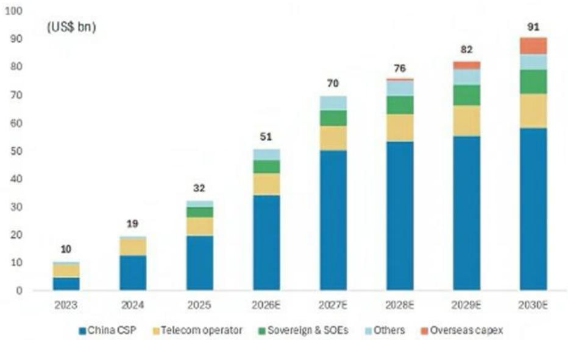  
Source: Company data, MS (E) estimates

Exhibit 2: We expect China AI chip self-sufficiency to reach 70% in 2030E  
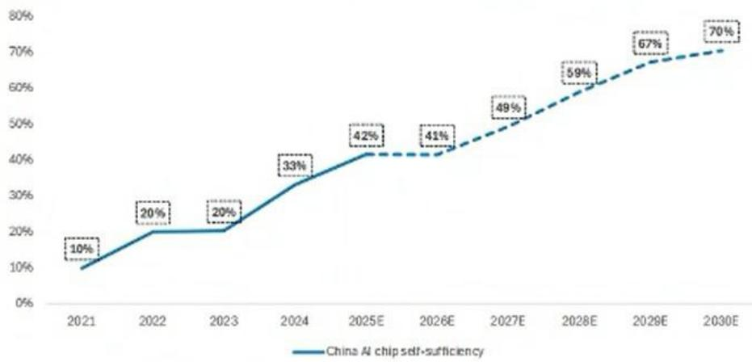  
Source: Company data, MS (e) estimates

## China Semi Equipment Import Trends

China's semi equipment import value was US\$2.4bn in Apr 2026, down 6% Y/Y. On a three-month moving average basis, the Y/Y growth was -9%, up from the -14% YoY in Mar 2026 (Exhibit 3). Our US team expects China WFE to grow at 16% yoy in 2026, to US \$48bn, mainly driven by memory and leading-node capacity expansion (link). We expect local equipment vendors to further gain market share on the back of an increasing China WFE TAM.

YTD, import values from the US, Netherlands, Korea and Japan have all decreased: -43%, -22%, -23% and -28% Y/Y, respectively. Only import from Singapore was up 43% YoY.

Exhibit 3: Growth in China's semi equipment imports declined to -9% Y/Y (3MMA) in Apr 2026  
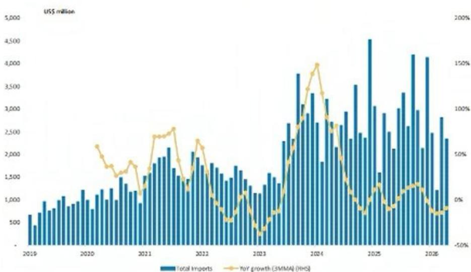  
Source: China's General Administration of Customs, MS.

Exhibit 4: Semi equipment imports from most major countries was down yoy (YTD)  
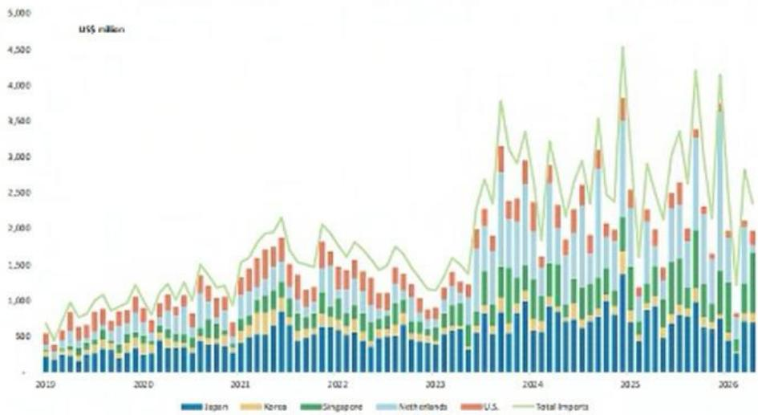  
Source: China's General Administration of Customs, MS

## Monthly Performance and Catalysts

Outperformers: ACMR +49.2%, Gigadevice +36.2%, JCET +24.8%

Underperformers: Shanghai Fudan -38.4%, USI -20.7%, Maxscend -18.3%

Over the past month, ACMR has outperformed, because of strong demand from memory clients and, in our view, because Huawei's LogicFolding process will drive increased adoption of ECP for TSV metallization, catalyzing rapid growth in ACMR's non-wet cleaning tool business (link). For Gigadevice, we see recent developments for servers (for high performance NAND) suggest potential adoption of SLC in datacenters, as SLC is ideal for fast reading and writing speed, Gigadevice is one of the beneficiary of this trend. Also NOR is seeing more tightness on mature foundry shortages (link).

Among the underperformers, Shanghai Fudan's share price saw a decline of 38.4% in the past month on corrected sentiment toward low earth orbit satellites, as carrier rockets are not yet recyclable. Also, USI share price declined by 20.7%, reflect market concern regarding delays in CPO introduction (link).

Exhibit 5: Share price performance of key Chinese semi localization stocks

<table><tr><td rowspan="2" colspan="2"></td><td rowspan="2">Price (loc)</td><td rowspan="2">Mkt Cap (US$ mn)</td><td rowspan="2">Stock Rating</td><td colspan="4">Performance</td></tr><tr><td>1M</td><td>3M</td><td>12M</td><td>YTD</td></tr><tr><td colspan="9">Foundry</td></tr><tr><td>0981.HK</td><td>SMIC</td><td>71.65</td><td>91,921</td><td>O</td><td>(6.5%)</td><td>13.5%</td><td>75.6%</td><td>0.3%</td></tr><tr><td>1347.HK</td><td>Hua Hong Semiconductor Ltd</td><td>139.20</td><td>36,794</td><td>E</td><td>7.5%</td><td>46.5%</td><td>366.3%</td><td>87.3%</td></tr><tr><td colspan="9">Backend</td></tr><tr><td>601231.SS</td><td>Universal Scientific Ind. (Shanghai)</td><td>33.90</td><td>11,978</td><td>O</td><td>(20.7%)</td><td>(13.3%)</td><td>136.9%</td><td>13.0%</td></tr><tr><td>600584.SS</td><td>JCET</td><td>68.92</td><td>18,240</td><td>E</td><td>24.8%</td><td>50.7%</td><td>114.6%</td><td>87.4%</td></tr><tr><td colspan="9">AI GPU</td></tr><tr><td>688256.SS</td><td>Cambricon Technology Corporation</td><td>1,240.00</td><td>115,226</td><td>O</td><td>(3.0%)</td><td>68.1%</td><td>205.5%</td><td>36.3%</td></tr><tr><td>9903.HK</td><td>Iluvatar CoreX Semiconductor Co., Ltd.</td><td>528.00</td><td>17,136</td><td>O</td><td>1.5%</td><td>67.6%</td><td>--</td><td>--</td></tr><tr><td>688802.SS</td><td>MetaX Integrated Circuits</td><td>694.89</td><td>41,120</td><td>E</td><td>(10.6%)</td><td>33.6%</td><td>--</td><td>19.8%</td></tr><tr><td colspan="9">Equipment</td></tr><tr><td>ACMR.O</td><td>ACM Research Inc</td><td>93.95</td><td>6,493</td><td>O</td><td>49.2%</td><td>107.5%</td><td>265.2%</td><td>138.1%</td></tr><tr><td>0522.HK</td><td>ASMPT Ltd</td><td>182.90</td><td>9,789</td><td>O</td><td>3.8%</td><td>67.3%</td><td>236.5%</td><td>136.2%</td></tr><tr><td>688012.SS</td><td>Advanced Micro-Fabrication Equipment Inc</td><td>303.92</td><td>42,059</td><td>O</td><td>16.6%</td><td>43.6%</td><td>172.8%</td><td>66.0%</td></tr><tr><td>002371.SZ</td><td>NAURA Technology Group Co Ltd</td><td>667.19</td><td>71,582</td><td>O</td><td>14.7%</td><td>45.7%</td><td>122.8%</td><td>45.3%</td></tr><tr><td colspan="9">Analog</td></tr><tr><td>300661.SZ</td><td>SG Micro Corp.</td><td>111.44</td><td>10,290</td><td>E</td><td>7.8%</td><td>49.0%</td><td>57.7%</td><td>62.4%</td></tr><tr><td colspan="9">Smartphone Semis</td></tr><tr><td>300782.SZ</td><td>Maxscend Microelectronics Co Ltd</td><td>89.76</td><td>7,633</td><td>U</td><td>(18.3%)</td><td>9.6%</td><td>27.3%</td><td>10.2%</td></tr><tr><td>603501.SS</td><td>OmniVision Integrated Circuits Group Inc</td><td>86.01</td><td>15,871</td><td>E</td><td>(16.7%)</td><td>(23.8%)</td><td>(31.5%)</td><td>(31.7%)</td></tr><tr><td>603160.SS</td><td>Shenzhen Goodix Technology Co Ltd</td><td>55.99</td><td>3,858</td><td>U</td><td>(15.6%)</td><td>(22.4%)</td><td>(17.6%)</td><td>(29.1%)</td></tr><tr><td colspan="9">Consumer Semis</td></tr><tr><td>688018.SS</td><td>Espressif Systems</td><td>112.00</td><td>3,883</td><td>O</td><td>(9.8%)</td><td>1.7%</td><td>14.5%</td><td>(7.8%)</td></tr><tr><td colspan="9">Memory</td></tr><tr><td>603986.SS</td><td>GigaDevice Semiconductor Beijing Inc</td><td>481.47</td><td>50,330</td><td>O</td><td>36.2%</td><td>75.2%</td><td>301.4%</td><td>124.7%</td></tr><tr><td colspan="9">Cloud Semis</td></tr><tr><td>688008.SS</td><td>Montage Technology Co Ltd -A</td><td>224.88</td><td>41,563</td><td>O</td><td>(6.6%)</td><td>52.1%</td><td>176.7%</td><td>90.9%</td></tr><tr><td>6809.HK</td><td>Montage Technology Co Ltd -H</td><td>355.00</td><td>41,563</td><td>O</td><td>(14.0%)</td><td>91.4%</td><td>--</td><td>--</td></tr><tr><td colspan="9">Power Semis/SiC</td></tr><tr><td>688396.SS</td><td>China Resources Microelectronics Limited</td><td>60.80</td><td>11,944</td><td>U</td><td>(0.2%)</td><td>19.0%</td><td>33.0%</td><td>15.0%</td></tr><tr><td>603290.SS</td><td>StarPower Semiconductor Ltd</td><td>109.00</td><td>3,861</td><td>E</td><td>(3.7%)</td><td>(0.1%)</td><td>36.3%</td><td>13.4%</td></tr><tr><td>300373.SZ</td><td>Yangjie Technology</td><td>96.68</td><td>7,787</td><td>O</td><td>23.3%</td><td>22.6%</td><td>97.8%</td><td>42.2%</td></tr><tr><td>600460.SS</td><td>Hangzhou Silan Microelectronics Co. Ltd.</td><td>32.15</td><td>7,913</td><td>U</td><td>6.4%</td><td>10.9%</td><td>35.0%</td><td>13.2%</td></tr><tr><td>688234.SS</td><td>SICC Co Ltd</td><td>123.70</td><td>8,454</td><td>O</td><td>(4.9%)</td><td>48.9%</td><td>120.4%</td><td>39.2%</td></tr><tr><td>2577.HK</td><td>InnoScience</td><td>57.70</td><td>6,738</td><td>E</td><td>(17.7%)</td><td>(9.3%)</td><td>59.4%</td><td>(26.4%)</td></tr><tr><td colspan="9">EDA/IP</td></tr><tr><td>301269.SZ</td><td>Empyrean Technology Co Ltd</td><td>94.57</td><td>7,629</td><td>E</td><td>(1.3%)</td><td>(0.3%)</td><td>(19.3%)</td><td>(11.1%)</td></tr><tr><td colspan="9">FPGA</td></tr><tr><td>002049.SZ</td><td>Unigroup Guoxin Microelectronics Co Ltd</td><td>71.51</td><td>8,986</td><td>U</td><td>(10.2%)</td><td>(4.9%)</td><td>13.7%</td><td>(9.3%)</td></tr><tr><td>1385.HK</td><td>Shanghai Fudan Microelectronics</td><td>26.80</td><td>5,206</td><td>O</td><td>(38.4%)</td><td>(37.0%)</td><td>(3.8%)</td><td>(40.9%)</td></tr><tr><td></td><td>CSI 300</td><td>4,777.32</td><td></td><td></td><td>(3.5%)</td><td>1.9%</td><td>22.7%</td><td>3.2%</td></tr><tr><td></td><td>SSE Composite</td><td>4,031.51</td><td></td><td></td><td>(4.3%)</td><td>(2.4%)</td><td>18.5%</td><td>1.6%</td></tr></table>

Source: FactSet, MS. Note: Market data as of the close on Jun 12, 2026. Past performance is no guarantee of future results. Results shown do not include transaction costs.

Exhibit 8:  
Exhibit 6: 12-month share price performance, by segment  
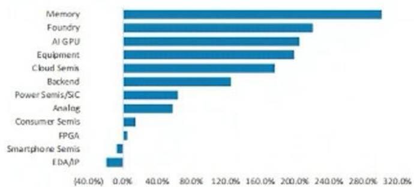  
Source: FactSet, MS. Note: Market data as of the close on Jun 12, 2026. Past performance is no guarantee of future results. Results shown do not include transaction costs.

Exhibit 7: Key stocks' 12-month share price performance  
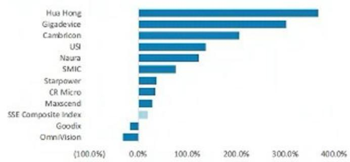  
Source: FactSet, MS. Note: Market data as of the close on Jun 12, 2026. Past performance is no guarantee of future results. Results shown do not include transaction costs.

Greater China semi localization stocks' performance trends  
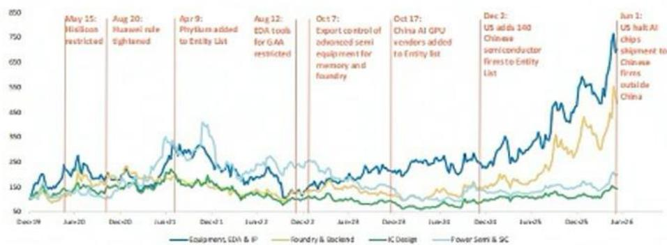  
Source: FactSet, MS. Note: Market data as of the close on Jun 9, 2026. Past performance is no guarantee of future results. Results shown do not include transaction costs.

## Catalysts and key events

<table><tr><td>Date</td><td>Event</td><td>Location</td></tr><tr><td>July 17-20, 2026</td><td>World Artificial Intelligence Conference</td><td>Shanghai, China</td></tr><tr><td>August 26-28, 2026</td><td>AGIC Shenzhen Int&#x27;l AGI Conference &amp; Expo</td><td>Shenzhen, China</td></tr><tr><td>Aug 31 - Sep 2, 2026</td><td>Semiconductor Equipment, Materials and Core Parts Exhibition (CSEAC)</td><td>Wuxi China</td></tr><tr><td>Sept 9-11, 2026</td><td>China International Optoelectronics Exposition &amp; Int&#x27;l Integrated Circuit Innovation Expo</td><td>Shenzhen, China</td></tr><tr><td>Oct 14-16, 2026</td><td>SemiBay</td><td>Shenzhen, China</td></tr><tr><td>Oct 27-29, 2026</td><td>China Int&#x27;l Semiconductor Technology &amp; Application Expo</td><td>Shenzhen, China</td></tr><tr><td>Nov 26-28, 2026</td><td>China AI &amp; Robot Industry Chain Expo</td><td>Shenzhen, China</td></tr></table>

## Cambricon: Earnings estimate revisions and quarterly financials

We raise our revenue forecasts 6% for 2026, 10% for 2027 and 9% for 2028: This primarily reflects our upgraded China AI accelerator market TAM. Cambricon, as one of the top players in this market, is likely to further benefited by the robust AI semi demand. We also see stable supply chain at SMIC for Cambricon, which could help the company to volume ship MLU580 and MLU690 in 2H26.

Given better product mix (higher contribution from more advanced AI chips like MLU690), we also lift our gross margin assumptions to 49.7%, and 49.2% (from 49.3%, and 48.7%) in 2027 and 2028. Therefore, we increase our EPS estimates 5%, 12%, and 12% for 2026, 2027, and 2028.

Exhibit 9: Cambricon: Earnings estimate revisions

<table><tr><td>US$ mn</td><td>New &#x27;26</td><td>Old&#x27;26E</td><td>Diff.</td><td>New &#x27;27</td><td>Old&#x27;27E</td><td>Diff.</td><td>New &#x27;28</td><td>Old&#x27;28E</td><td>Diff.</td></tr><tr><td>Net sales</td><td>22,869</td><td>21,669</td><td>6%</td><td>42,274</td><td>38,409</td><td>10%</td><td>55,971</td><td>51,176</td><td>9%</td></tr><tr><td>Gross profit</td><td>11,637</td><td>11,037</td><td>5%</td><td>21,011</td><td>18,944</td><td>11%</td><td>27,558</td><td>24,940</td><td>10%</td></tr><tr><td>Operating profit</td><td>7,868</td><td>7,470</td><td>5%</td><td>14,374</td><td>12,875</td><td>12%</td><td>19,682</td><td>17,639</td><td>12%</td></tr><tr><td>Pretax Income</td><td>7,776</td><td>7,377</td><td>5%</td><td>14,451</td><td>12,952</td><td>12%</td><td>19,750</td><td>17,707</td><td>12%</td></tr><tr><td>Net income</td><td>7,332</td><td>6,973</td><td>5%</td><td>12,283</td><td>11,009</td><td>12%</td><td>16,788</td><td>15,051</td><td>12%</td></tr><tr><td>EPS for consensus</td><td>12.39</td><td>11.82</td><td>5%</td><td>19.45</td><td>17.44</td><td>12%</td><td>26.59</td><td>23.84</td><td>12%</td></tr></table>

<table><tr><td colspan="7">Margins</td></tr><tr><td>Gross margin</td><td>50.9%</td><td>50.9%</td><td>49.7%</td><td>49.3%</td><td>49.2%</td><td>48.7%</td></tr><tr><td>Operating margin</td><td>34.4%</td><td>34.5%</td><td>34.0%</td><td>33.5%</td><td>35.2%</td><td>34.5%</td></tr><tr><td>Pretax margin</td><td>34.0%</td><td>34.0%</td><td>34.2%</td><td>33.7%</td><td>35.3%</td><td>34.6%</td></tr><tr><td>Net margin</td><td>32.1%</td><td>32.2%</td><td>29.1%</td><td>28.7%</td><td>30.0%</td><td>29.4%</td></tr><tr><td>Opex %</td><td>16.5%</td><td>16.5%</td><td>15.7%</td><td>15.8%</td><td>14.1%</td><td>14.3%</td></tr></table>

Source: MS (e) estimates

Exhibit 10: Cambricon: Quarterly financials

<table><tr><td>(Rmb mn)</td><td>1Q25</td><td>2Q25</td><td>3Q25</td><td>4Q25</td><td>1Q26</td><td>2Q26E</td><td>3Q26E</td><td>4Q26E</td><td>2025</td><td>2026E</td><td>2027E</td><td>2028E</td></tr><tr><td>Total revenues</td><td>1,111.4</td><td>1,769.2</td><td>1,726.8</td><td>1,889.8</td><td>2,884.7</td><td>3,871.7</td><td>5,913.8</td><td>10,198.8</td><td>6,497.2</td><td>22,869.0</td><td>42,274.2</td><td>55,971.1</td></tr><tr><td>Q/Q Change</td><td>12.4%</td><td>59.2%</td><td>-2.4%</td><td>9.4%</td><td>52.6%</td><td>34.2%</td><td>52.7%</td><td>72.5%</td><td>0.0%</td><td>0.0%</td><td>0.0%</td><td>0.0%</td></tr><tr><td>Y/Y Change</td><td>4229.6%</td><td>4424.9%</td><td>1332.5%</td><td>91.0%</td><td>159.6%</td><td>118.8%</td><td>242.5%</td><td>439.7%</td><td>453.2%</td><td>252.0%</td><td>84.9%</td><td>32.4%</td></tr><tr><td>Cost of Sales</td><td>489.1</td><td>780.5</td><td>790.2</td><td>854.0</td><td>1,317.4</td><td>1,858.4</td><td>2,956.8</td><td>5,099.3</td><td>2,913.9</td><td>11,232.0</td><td>21,262.7</td><td>28,413.0</td></tr><tr><td>Percent of Revenues</td><td>44%</td><td>44%</td><td>46%</td><td>45%</td><td>46%</td><td>48%</td><td>50%</td><td>50%</td><td>45%</td><td>49%</td><td>50%</td><td>51%</td></tr><tr><td>Gross Profit</td><td>622.3</td><td>988.7</td><td>936.6</td><td>1,035.7</td><td>1,567.3</td><td>2,013.3</td><td>2,957.0</td><td>5,099.5</td><td>3,583.3</td><td>11,637.1</td><td>21,011.5</td><td>27,558.0</td></tr><tr><td>Gross Margin</td><td>1.0%</td><td>55.9%</td><td>54.2%</td><td>54.8%</td><td>54.3%</td><td>52.0%</td><td>50.0%</td><td>50.0%</td><td>55.2%</td><td>50.9%</td><td>49.7%</td><td>49.2%</td></tr><tr><td>Incremental Margin</td><td>47.9%</td><td>55.7%</td><td>NM</td><td>60.8%</td><td>53.4%</td><td>45.2%</td><td>46.2%</td><td>50.0%</td><td>54.8%</td><td>49.2%</td><td>48.3%</td><td>47.8%</td></tr><tr><td>Total Opex</td><td>330.0</td><td>338.0</td><td>355.2</td><td>593.7</td><td>372.6</td><td>689.2</td><td>993.5</td><td>1,713.4</td><td>1,616.9</td><td>3,768.7</td><td>6,637.1</td><td>7,875.9</td></tr><tr><td>Percent of Revenues</td><td>29.7%</td><td>19.1%</td><td>20.6%</td><td>31.4%</td><td>12.9%</td><td>17.6%</td><td>16.8%</td><td>16.8%</td><td>24.9%</td><td>16.5%</td><td>15.7%</td><td>14.1%</td></tr><tr><td>R&amp;D</td><td>272.6</td><td>269.3</td><td>300.9</td><td>508.0</td><td>324.0</td><td>619.5</td><td>887.1</td><td>1,529.8</td><td>1,350.8</td><td>3,360.4</td><td>5,918.4</td><td>6,980.3</td></tr><tr><td>Percent of Revenues</td><td>24.5%</td><td>15.2%</td><td>17.4%</td><td>26.9%</td><td>11.2%</td><td>16.0%</td><td>15.0%</td><td>15.0%</td><td>20.8%</td><td>14.7%</td><td>14.0%</td><td>12.5%</td></tr><tr><td>General &amp; Adm Exp.</td><td>43.1</td><td>54.9</td><td>39.8</td><td>60.4</td><td>35.9</td><td>50.3</td><td>76.9</td><td>132.6</td><td>198.1</td><td>295.7</td><td>507.3</td><td>615.7</td></tr><tr><td>Percent of Revenues</td><td>3.9%</td><td>3.1%</td><td>2.3%</td><td>3.2%</td><td>1.2%</td><td>1.3%</td><td>1.3%</td><td>1.3%</td><td>3.0%</td><td>1.3%</td><td>1.2%</td><td>1.1%</td></tr><tr><td>Selling Expenses</td><td>14.4</td><td>13.7</td><td>14.6</td><td>25.4</td><td>12.6</td><td>19.4</td><td>29.6</td><td>51.0</td><td>68.0</td><td>112.6</td><td>211.4</td><td>279.9</td></tr><tr><td>Percent of Revenues</td><td>1.3%</td><td>0.8%</td><td>0.8%</td><td>1.3%</td><td>0.4%</td><td>0.5%</td><td>0.5%</td><td>0.5%</td><td>1.0%</td><td>0.5%</td><td>0.5%</td><td>0.5%</td></tr><tr><td>Operating Income</td><td>292.2</td><td>650.8</td><td>581.3</td><td>442.1</td><td>1,194.6</td><td>1,324.2</td><td>1,963.5</td><td>3,386.1</td><td>1,966.4</td><td>7,868.3</td><td>14,374.4</td><td>19,682.2</td></tr><tr><td>Operating Margin</td><td>26.3%</td><td>36.8%</td><td>33.7%</td><td>23.4%</td><td>41.4%</td><td>34.2%</td><td>33.2%</td><td>33.2%</td><td>30.3%</td><td>34.4%</td><td>34.0%</td><td>35.2%</td></tr><tr><td>Total Non-operating Income (loss)</td><td>63.1</td><td>31.6</td><td>(15.2)</td><td>13.5</td><td>(180.4)</td><td>30.5</td><td>20.7</td><td>36.4</td><td>93.0</td><td>(92.7)</td><td>76.2</td><td>67.4</td></tr><tr><td>Profit Before Taxes</td><td>355.4</td><td>682.4</td><td>566.1</td><td>455.5</td><td>1,014.2</td><td>1,354.7</td><td>1,984.2</td><td>3,422.5</td><td>2,059.4</td><td>7,775.6</td><td>14,450.6</td><td>19,749.6</td></tr><tr><td>Percent of Revenues</td><td>32.0%</td><td>38.6%</td><td>32.8%</td><td>24.1%</td><td>35.2%</td><td>35.0%</td><td>33.6%</td><td>33.6%</td><td>31.7%</td><td>34.0%</td><td>34.2%</td><td>35.3%</td></tr><tr><td>Taxes</td><td>0.1</td><td>(0.0)</td><td>(0.3)</td><td>1.1</td><td>1.1</td><td>1.4</td><td>99.2</td><td>342.2</td><td>0.9</td><td>443.9</td><td>2,167.6</td><td>2,962.4</td></tr><tr><td>Tax Rate</td><td>0.0%</td><td>0.0%</td><td>0.0%</td><td>0.2%</td><td>0.1%</td><td>0.1%</td><td>5.0%</td><td>10.0%</td><td>0.0%</td><td>5.7%</td><td>15.0%</td><td>15.0%</td></tr><tr><td>Total Net Income to Parent</td><td>355.5</td><td>682.6</td><td>566.6</td><td>454.6</td><td>1,013.2</td><td>1,353.4</td><td>1,885.1</td><td>3,080.3</td><td>2,059.2</td><td>7,332.0</td><td>12,283.4</td><td>16,787.5</td></tr><tr><td>Percent of Revenues</td><td>32.0%</td><td>38.6%</td><td>32.8%</td><td>24.1%</td><td>35.1%</td><td>35.0%</td><td>31.9%</td><td>30.2%</td><td>31.7%</td><td>32.1%</td><td>29.1%</td><td>30.0%</td></tr><tr><td>EPS for consensus (Rmb)</td><td>0.8</td><td>1.6</td><td>1.3</td><td>1.1</td><td>2.4</td><td>2.1</td><td>3.0</td><td>4.9</td><td>4.9</td><td>12.4</td><td>19.5</td><td>26.6</td></tr></table>

Source: Company data, MS (e) estimates

## Cambricon: Valuation, raising price target to Rmb1,528

We continue to derive our price target (our base case scenario value) from a residual income model. The price target change reflects our EPS estimate revisions for 2026-28, driven by improved market TAM forecast and stabilized supply chain from local suppliers.

Key valuation assumptions remain the same: cost of equity of 8.4% (beta of 1.06, risk-free rate of 2%, and risk premium of 6%), intermediate growth rate of 16%, and terminal growth rate of 6.0%.

Our bull and bear case scenario values also rise from Rmb2,536.79 and Rmb676.21 to Rmb2,887 and Rmb770, respectively, implying 2026e P/S of 73x and 20x.

Exhibit 11: Cambricon: Residual income model

<table><tr><td>Rmb million</td><td>2026E</td><td>2027E</td><td>2028E</td><td>2029E</td><td>2030E</td><td>2031E</td><td>2032E</td><td>2033E</td><td>2034E</td><td>2035E</td><td>2036E</td><td>2037E</td><td>2038E</td></tr><tr><td>Total Equity</td><td>18,675</td><td>29,459</td><td>43,746</td><td>55,469</td><td>69,068</td><td>84,843</td><td>103,141</td><td>124,367</td><td>148,990</td><td>177,552</td><td>210,684</td><td>249,117</td><td>293,699</td></tr><tr><td>Net Profit</td><td>7,332</td><td>12,283</td><td>16,788</td><td>19,474</td><td>22,589</td><td>26,204</td><td>30,396</td><td>35,260</td><td>40,901</td><td>47,445</td><td>55,036</td><td>63,842</td><td>74,057</td></tr><tr><td>ROAE</td><td>48.0%</td><td>51.0%</td><td>45.9%</td><td>39.3%</td><td>36.3%</td><td>34.1%</td><td>32.3%</td><td>31.0%</td><td>29.9%</td><td>29.1%</td><td>28.4%</td><td>27.8%</td><td>27.3%</td></tr><tr><td>Residual Income</td><td>4,701</td><td>7,970</td><td>11,048</td><td>13,515</td><td>15,485</td><td>17,744</td><td>20,345</td><td>23,347</td><td>26,820</td><td>30,840</td><td>35,496</td><td>40,893</td><td>47,148</td></tr><tr><td>Spread</td><td>39.7%</td><td>42.7%</td><td>37.5%</td><td>30.9%</td><td>27.9%</td><td>25.7%</td><td>24.0%</td><td>22.6%</td><td>21.6%</td><td>20.7%</td><td>20.0%</td><td>19.4%</td><td>18.9%</td></tr><tr><td>Ending Equity Capital</td><td>18,675</td><td></td><td></td><td></td><td></td><td></td><td></td><td></td><td></td><td></td><td></td><td></td><td></td></tr><tr><td>PV of Forecast Period</td><td>138,265</td><td></td><td></td><td></td><td></td><td></td><td></td><td></td><td></td><td></td><td></td><td></td><td></td></tr><tr><td>PV of Continuing Value</td><td>808,041</td><td></td><td></td><td></td><td></td><td></td><td></td><td></td><td></td><td></td><td></td><td></td><td></td></tr><tr><td>Equity Value</td><td>964,981</td><td></td><td></td><td></td><td></td><td></td><td></td><td></td><td></td><td></td><td></td><td></td><td></td></tr><tr><td>No. of Shares</td><td>631</td><td></td><td></td><td></td><td></td><td></td><td></td><td></td><td></td><td></td><td></td><td></td><td></td></tr><tr><td>Price Target</td><td>1,528</td><td></td><td></td><td></td><td></td><td></td><td></td><td></td><td></td><td></td><td></td><td></td><td></td></tr></table>

Source: Company data, MS (e) estimates

Exhibit 12: Cambricon: One-year forward P/S trend  
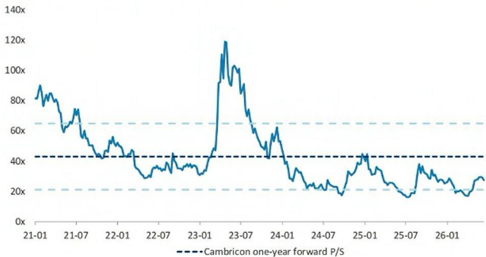  
Source: Company data, FactSet, MS

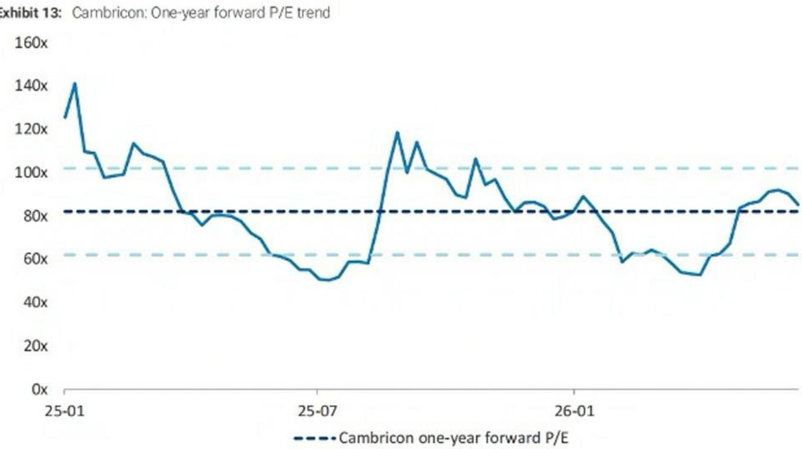  
Source: Company data, FactSet, MS

## Risk Reward – Cambricon Technology Corporation (688256.SS)

Raising China AI GPU TAM

## PRICE TARGET Rmb1,528.00

Key valuation assumptions underpinning our model include: an 8.4% cost of equity (derived from a beta of 1.06, risk-free rate of 2.0%, and equity risk premium of 6.0%), a long-term payout ratio of 40% (was 57%), a medium-term growth rate of 16%, and a terminal growth rate of 6.0%.

Consensus Price Target Distribution

Source: Refinitiv, MS

Rmb1,116.51

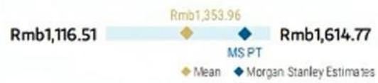

## RISK REWARD CHART

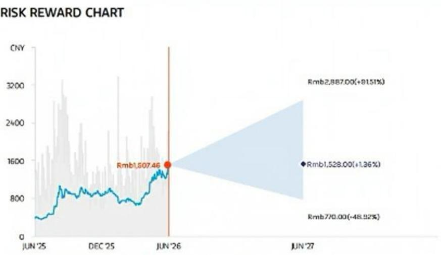  
Key: — Historical Stock Performance ● Current Stock Price ◆ Price Target  
Source: Refinitiv, MS

## OVERWEIGHT THESIS

\- Cambricon has deep engagement with major CSPs with proven product-market fit. MLU590 is widely deployed in SAD workloads, supporting strong order visibility as AI infrastructure scales.
- Domestic supply chain transition is underway, with production shifting to SMIC. Yields remain a challenge, but we expect gradual improvement through 2026.
- Aggressive product roadmap, with next-generation MLU690 expected in 4Q26, potentially boosting performance \~2.2x and sustaining technology leadership.
- P/E and P/S multiples are elevated in absolute terms, but we find them justified by superior growth profile, improving supply visibility, and strong positioning as a key domestic AI chip supplier.

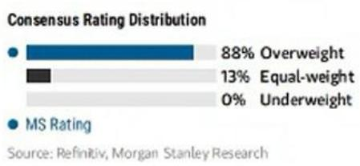  
Source: Refinitiv, MS

## Risk Reward Themes

New Data Era: Positive  
Secular Growth: Positive  
Technology Diffusion: Positive  
View descriptions of Risk Rewards Themes here

## BULL CASE

## 73x 2026e P/S

## Rmb2,887.00

We assume (1) >130% revenue CAGR in 2025-28 driven by stronger-than-expected domestic generative AI infrastructure build-out and large-scale procurement of cloud training and inference chips; (2) sustained share gains in China's domestic high-performance AI chip market; (3) gross margin improves to over 55% in 2026 and 2027 thanks to production scale effects, mature technology iteration and optimized high-value product structure.

## BASE CASE

## 39x 2026e P/S

## Rmb1,528.00

We assume (1) 105% revenue CAGR in 2025-28 driven by domestic generative AI infrastructure spending from CSP clients; (2) gross margin reaches 51% and 50% in 2026 and 2027 given lower selling prices due to products with smaller die size.

## BEAR CASE

Rmb770.00

## 20x 2026e P/S

We assume (1) <60% revenue CAGR in 2025-28 given slower-than-expected domestic AI capital expenditure and LLM commercialization progress; (2) market share loss in China's AI chip market, and failure to secure continuous mass orders from top-tier customers; and (3) gross margin falls below 40% in 2026 and 2027 due to fierce price competition, rising wafer fabrication costs and underutilized production capacity.

## Risk Reward – Cambricon Technology Corporation (688256.SS)

## KEY EARNINGS INPUTS

<table><tr><td>Drivers</td><td>Dec 2025</td><td>Dec 2026e</td><td>Dec 2027e</td><td>Dec 2028e</td></tr><tr><td>Gross Profit (YoY) (%)</td><td>438.0</td><td>224.8</td><td>80.6</td><td>31.2</td></tr></table>

## INVESTMENT DRIVERS

\- CSP capex expansion

• Large model deployment growth

• Domestic substitution tailwind

• Product iteration (MLU roadmap)

\- Software ecosystem improvement

• Policy support for AI chips

\- New customer penetration

\- Scaling of Al clusters

## GLOBAL REVENUE EXPOSURE

  
Source: MS Estimate View explanation of regional hierarchies here

## MS ALPHA MODELS

4/5 MOST 3 Month Horizon

Source: Refinitiv, FactSet, MS; 1 is the highest favored Quintile and 5 is the least favored Quintile

## RISKS TO PT/RATING

• Stronger-than-expected AI demand

\- CSP order ramp-up

\- Accelerating localization

## RISKS TO DOWNSIDE

• Capacity and yield constraints

\- Customer concentration risk

\- Slower technology iteration

## OWNERSHIP POSITIONING

Source: Refinitiv, MS

## MS ESTIMATES VS. CONSENSUS

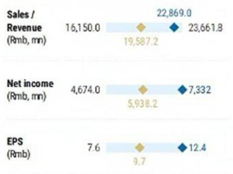  
◆ Mean ◆ MS Estimates
Source: Refinitiv, MS

Financial Ratios

Cambricon: Financial Summary

<table><tr><td colspan="5">Income statement</td></tr><tr><td>Rmb mn (Years End Dec )</td><td>2025</td><td>2026E</td><td>2027E</td><td>2028E</td></tr><tr><td>Net sales</td><td>6,497.2</td><td>22,889.0</td><td>42,274.2</td><td>55,971.1</td></tr><tr><td>COGS</td><td>2,913.9</td><td>11,232.0</td><td>21,262.7</td><td>28,413.0</td></tr><tr><td>Gross profit</td><td>3,583.3</td><td>11,637.1</td><td>21,011.5</td><td>27,558.0</td></tr><tr><td>Operating expenses</td><td>1,616.9</td><td>3,768.7</td><td>6,637.1</td><td>7,875.9</td></tr><tr><td>Operating income</td><td>1,966.4</td><td>7,868.3</td><td>14,374.4</td><td>19,682.2</td></tr><tr><td>Non-operating income</td><td>93.0</td><td>(92.7)</td><td>76.2</td><td>67.4</td></tr><tr><td>Pre-tax income</td><td>2,059.4</td><td>7,775.6</td><td>14,450.6</td><td>19,749.6</td></tr><tr><td>Income tax</td><td>0.9</td><td>443.9</td><td>2,167.6</td><td>2,962.4</td></tr><tr><td>Minority Interest</td><td>(0.7)</td><td>(0.4)</td><td>(0.4)</td><td>(0.4)</td></tr><tr><td>Reported net Income</td><td>2,059.2</td><td>7,332.0</td><td>12,283.4</td><td>16,787.5</td></tr><tr><td>Adj.wtd.avg.shrs( m)</td><td>419.6</td><td>576.6</td><td>628.3</td><td>628.3</td></tr><tr><td>Reported EPS (Rmb)</td><td>4.9</td><td>12.5</td><td>19.6</td><td>26.7</td></tr><tr><td>EPS for consensus (Rmb)</td><td>4.9</td><td>12.4</td><td>19.5</td><td>26.6</td></tr></table>

<table><tr><td>Rmb mn (Years End Dec )</td><td>2025</td><td>2026E</td><td>2027E</td><td>2028E</td></tr><tr><td>Cash</td><td>1,317.4</td><td>3,291.5</td><td>13,395.4</td><td>24,338.8</td></tr><tr><td>Mkt Securities</td><td>4,261.2</td><td>4,261.2</td><td>4,261.2</td><td>4,261.2</td></tr><tr><td>AR/NR</td><td>670.6</td><td>2,506.2</td><td>4,632.8</td><td>6,133.8</td></tr><tr><td>Inventory</td><td>4,943.5</td><td>9,231.8</td><td>8,738.1</td><td>11,676.6</td></tr><tr><td>Other</td><td>887.8</td><td>887.8</td><td>887.8</td><td>887.8</td></tr><tr><td>Current Assets</td><td>12,080.4</td><td>20,178.4</td><td>31,915.2</td><td>47,298.1</td></tr><tr><td>Long-term investments</td><td>299.7</td><td>299.7</td><td>299.7</td><td>299.7</td></tr><tr><td>Fixed assets</td><td>372.7</td><td>372.7</td><td>372.7</td><td>372.7</td></tr><tr><td>Intangible Assets</td><td>189.1</td><td>169.1</td><td>149.1</td><td>129.1</td></tr><tr><td>Other assets</td><td>495.8</td><td>595.8</td><td>695.8</td><td>795.8</td></tr><tr><td>Total Assets</td><td>13,437.7</td><td>21,615.6</td><td>33,432.5</td><td>48,895.4</td></tr><tr><td>S/T borrowings</td><td>0.0</td><td>0.0</td><td>0.0</td><td>0.0</td></tr><tr><td>AP/NP</td><td>1,115.9</td><td>2,461.8</td><td>3,495.2</td><td>4,670.6</td></tr><tr><td>Other ST liabilities</td><td>217.0</td><td>217.0</td><td>217.0</td><td>217.0</td></tr><tr><td>LT debt</td><td>0.0</td><td>0.0</td><td>0.0</td><td>0.0</td></tr><tr><td>Other LT liabilities</td><td>261.5</td><td>261.5</td><td>261.5</td><td>261.5</td></tr><tr><td>Total Liabilities</td><td>1,594.5</td><td>2,940.3</td><td>3,973.8</td><td>5,149.2</td></tr><tr><td>Common shares</td><td>421.7</td><td>421.7</td><td>421.7</td><td>421.7</td></tr><tr><td>Additional capital</td><td>11,270.3</td><td>11,270.3</td><td>11,270.3</td><td>11,270.3</td></tr><tr><td>Retained earning</td><td>(11.8)</td><td>6,820.3</td><td>17,603.7</td><td>31,891.2</td></tr><tr><td>Other shareholders&#x27; equity</td><td>163.0</td><td>163.0</td><td>163.0</td><td>163.0</td></tr><tr><td>Total Equity</td><td>11,843.3</td><td>18,675.3</td><td>29,458.7</td><td>43,746.2</td></tr><tr><td>Total Liab. &amp; Shrhldr&#x27;s Equity</td><td>13,437.7</td><td>21,615.6</td><td>33,432.5</td><td>48,895.4</td></tr></table>

E = MS Estimates  
Source: MS, Company Data

Cash Flow Statement

<table><tr><td>Rmb mn (Years End Dec )</td><td>2025</td><td>2026E</td><td>2027E</td><td>2028E</td></tr><tr><td>Cashflow from Operations</td><td>(498.5)</td><td>2,554.1</td><td>11,683.9</td><td>13,523.4</td></tr><tr><td>Net profits</td><td>2,059.2</td><td>7,332.0</td><td>12,283.4</td><td>16,787.5</td></tr><tr><td>Depreciation</td><td>116.7</td><td>0.0</td><td>0.0</td><td>0.0</td></tr><tr><td>Working Capital Change</td><td>(3,126.6)</td><td>(4,777.9)</td><td>(599.5)</td><td>(3,264.1)</td></tr><tr><td>Other adjustments</td><td>452.2</td><td>0.0</td><td>0.0</td><td>0.0</td></tr><tr><td>Cashflow from Investing</td><td>(4,142.0)</td><td>(80.0)</td><td>(80.0)</td><td>(80.0)</td></tr><tr><td>Capex</td><td>(142.8)</td><td>0.0</td><td>0.0</td><td>0.0</td></tr><tr><td>Change of LT Investment</td><td>(53.1)</td><td>0.0</td><td>0.0</td><td>0.0</td></tr><tr><td>Change of ST Investment</td><td>(3,501.0)</td><td>0.0</td><td>0.0</td><td>0.0</td></tr><tr><td>Other adjustments</td><td>(445.1)</td><td>(80.0)</td><td>(80.0)</td><td>(80.0)</td></tr><tr><td>Cashflow from financing</td><td>3,986.0</td><td>(500.0)</td><td>(1,500.0)</td><td>(2,500.0)</td></tr><tr><td>Increase in L/T debt</td><td>0.0</td><td>0.0</td><td>0.0</td><td>0.0</td></tr><tr><td>Increase in S/T debt</td><td>(100.1)</td><td>0.0</td><td>0.0</td><td>0.0</td></tr><tr><td>Cash Dividend Paid</td><td>0.0</td><td>(500.0)</td><td>(1,500.0)</td><td>(2,500.0)</td></tr><tr><td>Issuance of stock</td><td>1,465.7</td><td>0.0</td><td>0.0</td><td>0.0</td></tr><tr><td>Other adjustments</td><td>2,620.4</td><td>0.0</td><td>0.0</td><td>0.0</td></tr><tr><td>Exchange rate adjustment</td><td>(0.0)</td><td>0.0</td><td>0.0</td><td>0.0</td></tr><tr><td>Net change in cash</td><td>(654.6)</td><td>1,974.1</td><td>10,103.9</td><td>10,943.4</td></tr></table>

<table><tr><td colspan="5">Financial Ratios</td></tr><tr><td></td><td>2025</td><td>2026E</td><td>2027E</td><td>2028E</td></tr><tr><td colspan="5">Growth(%)</td></tr><tr><td>Revenue</td><td>453.2</td><td>252.0</td><td>84.9</td><td>32.4</td></tr><tr><td>Operating profits</td><td>NA</td><td>300.1</td><td>82.7</td><td>36.9</td></tr><tr><td>Pretax profits</td><td>NA</td><td>277.6</td><td>85.8</td><td>36.7</td></tr><tr><td>Net profits</td><td>NA</td><td>256.1</td><td>67.5</td><td>36.7</td></tr><tr><td>EPS</td><td>NA</td><td>153.9</td><td>56.9</td><td>36.7</td></tr><tr><td colspan="5">Margins (%)</td></tr><tr><td>Gross Margin</td><td>55.2</td><td>50.9</td><td>49.7</td><td>49.2</td></tr><tr><td>Operating Margin</td><td>30.3</td><td>34.4</td><td>34.0</td><td>35.2</td></tr><tr><td>Pretax Margin</td><td>31.7</td><td>34.0</td><td>34.2</td><td>35.3</td></tr><tr><td>Net Profit</td><td>31.7</td><td>32.1</td><td>29.1</td><td>30.0</td></tr><tr><td colspan="5">Return (%)</td></tr><tr><td>ROAE</td><td>23.8</td><td>48.0</td><td>51.0</td><td>45.9</td></tr><tr><td>ROAA</td><td>20.4</td><td>41.8</td><td>44.6</td><td>40.8</td></tr><tr><td colspan="5">Gearing (%)</td></tr><tr><td>Net Debt/Equity</td><td>(11.1)</td><td>(17.6)</td><td>(45.5)</td><td>(55.6)</td></tr><tr><td>Liabilities/Equity</td><td>13.5</td><td>15.7</td><td>13.5</td><td>11.8</td></tr><tr><td colspan="5">Ratios (X)</td></tr><tr><td>Current ratio</td><td>9.1</td><td>7.5</td><td>8.6</td><td>9.7</td></tr><tr><td>Quick ratio</td><td>1.5</td><td>2.2</td><td>4.9</td><td>6.2</td></tr><tr><td colspan="5">Others</td></tr><tr><td>AR/NR Turnover (days)</td><td>40.0</td><td>40.0</td><td>40.0</td><td>40.0</td></tr><tr><td>Inventory Turnover (days)</td><td>500.0</td><td>300.0</td><td>150.0</td><td>150.0</td></tr><tr><td>AP Turnover (days)</td><td>90.0</td><td>80.0</td><td>60.0</td><td>60.0</td></tr><tr><td>Cash Conversion (days)</td><td>450.0</td><td>260.0</td><td>130.0</td><td>130.0</td></tr></table>

## Iluvatar CoreX: Earnings estimate revisions

We raise our revenue forecasts 6% for 2026, 10% for 2027 and 8% for 2028: We believe Iluvatar CoreX will be another company that is benefited by stronger demand for China AI accelerator. Given Iluvatar's order received from major CSP client in China, we expect to see robust revenue and earnings growth for the company. Besides, Iluvatar adopts TSMC as their foundry supplier and will produce fully-compliant chip according to BIS restrictions.

As Tiangai 300 (new products)'s ASP will be much higher than Tiangai 150, we also lift our gross margin assumptions to 52.4%, and 51.7% (from 51.3%, and 50.7%) in 2027 and 2028. Therefore, we increase our EPS estimates 13%, and 14% for 2027, and 2028.

Exhibit 14: Iluvatar: Earnings estimate revisions

<table><tr><td>US$ mn</td><td>New &#x27;26</td><td>Old&#x27;26E</td><td>Diff.</td><td>New &#x27;27</td><td>Old&#x27;27E</td><td>Diff.</td><td>New &#x27;28</td><td>Old&#x27;28E</td><td>Diff.</td></tr><tr><td>Net sales</td><td>3,251</td><td>3,060</td><td>6%</td><td>8,244</td><td>7,501</td><td>10%</td><td>12,271</td><td>11,379</td><td>8%</td></tr><tr><td>Gross profit</td><td>1,651</td><td>1,572</td><td>5%</td><td>4,318</td><td>3,850</td><td>12%</td><td>6,348</td><td>5,771</td><td>10%</td></tr><tr><td>Operating profit</td><td>(279)</td><td>(308)</td><td>-10%</td><td>1,588</td><td>1,400</td><td>13%</td><td>3,048</td><td>2,681</td><td>14%</td></tr><tr><td>Pretax Income</td><td>(232)</td><td>(262)</td><td>-11%</td><td>1,637</td><td>1,449</td><td>13%</td><td>3,096</td><td>2,729</td><td>13%</td></tr><tr><td>Net income</td><td>(232)</td><td>(262)</td><td>-11%</td><td>1,637</td><td>1,449</td><td>13%</td><td>2,920</td><td>2,570</td><td>14%</td></tr><tr><td>EPS for consensus</td><td>(0.91)</td><td>(1.03)</td><td>-11%</td><td>6.44</td><td>5.70</td><td>13%</td><td>11.48</td><td>10.10</td><td>14%</td></tr><tr><td colspan="10">Margins</td></tr><tr><td>Gross margin</td><td>50.8%</td><td>51.4%</td><td></td><td>52.4%</td><td>51.3%</td><td></td><td>51.7%</td><td>50.7%</td><td></td></tr><tr><td>Operating margin</td><td>-8.6%</td><td>-10.1%</td><td></td><td>19.3%</td><td>18.7%</td><td></td><td>24.8%</td><td>23.6%</td><td></td></tr><tr><td>Pretax margin</td><td>-7.1%</td><td>-8.6%</td><td></td><td>19.9%</td><td>19.3%</td><td></td><td>25.2%</td><td>24.0%</td><td></td></tr><tr><td>Net margin</td><td>-7.1%</td><td>-8.6%</td><td></td><td>19.9%</td><td>19.3%</td><td></td><td>23.8%</td><td>22.6%</td><td></td></tr><tr><td>Opex %</td><td>59.4%</td><td>61.4%</td><td></td><td>33.1%</td><td>32.7%</td><td></td><td>26.9%</td><td>27.2%</td><td></td></tr></table>

Source: MS (e) estimates

Exhibit 15: Iluvatar: Half-year financials

<table><tr><td>(Rmb mn)</td><td>1H25</td><td>2H25</td><td>1H26E</td><td>2H26E</td><td>1H27E</td><td>2H27E</td><td>1H28E</td><td>2H28E</td><td>2025</td><td>2026E</td><td>2027E</td><td>2028E</td></tr><tr><td>Total revenues</td><td>324.3</td><td>709.3</td><td>976.0</td><td>2,274.9</td><td>3,294.7</td><td>4,948.8</td><td>5,613.1</td><td>6,657.4</td><td>1,033.6</td><td>3,250.9</td><td>8,243.5</td><td>12,270.5</td></tr><tr><td>H/H Change</td><td>-5.2%</td><td>118.8%</td><td>37.6%</td><td>133.1%</td><td>44.8%</td><td>50.2%</td><td>13.4%</td><td>18.6%</td><td></td><td></td><td></td><td></td></tr><tr><td>Y/Y Change</td><td>84.2%</td><td>107.4%</td><td>201.0%</td><td>220.7%</td><td>237.6%</td><td>117.5%</td><td>70.4%</td><td>34.5%</td><td>91.6%</td><td>214.5%</td><td>153.6%</td><td>48.9%</td></tr><tr><td>Cost of Sales</td><td>(161.8)</td><td>(313.8)</td><td>(496.4)</td><td>(1,103.3)</td><td>(1,576.6)</td><td>(2,348.8)</td><td>(2,711.3)</td><td>(3,211.5)</td><td>(475.6)</td><td>(1,599.7)</td><td>(3,925.4)</td><td>(5,922.7)</td></tr><tr><td>Percent of Revenues</td><td>50%</td><td>44%</td><td>51%</td><td>48%</td><td>48%</td><td>47%</td><td>48%</td><td>48%</td><td>46%</td><td>49%</td><td>48%</td><td>48%</td></tr><tr><td>Gross Profit</td><td>162.4</td><td>326.6</td><td>479.5</td><td>1,171.6</td><td>1,718.1</td><td>2,600.0</td><td>2,901.8</td><td>3,445.9</td><td>558.0</td><td>1,651.2</td><td>4,318.2</td><td>6,347.8</td></tr><tr><td>Gross Margin</td><td>50.1%</td><td>55.8%</td><td>49.1%</td><td>51.5%</td><td>52.1%</td><td>52.5%</td><td>51.7%</td><td>51.8%</td><td>54.0%</td><td>50.8%</td><td>52.4%</td><td>51.7%</td></tr><tr><td>Incremental Margin</td><td>0.0%</td><td>0.0%</td><td>0.0%</td><td>0.0%</td><td>0.0%</td><td>0.0%</td><td>0.0%</td><td>0.0%</td><td>0.0%</td><td>0.0%</td><td>0.0%</td><td>0.0%</td></tr><tr><td>Total Opex</td><td>(793.7)</td><td>(813.8)</td><td>(950.0)</td><td>(980.0)</td><td>(1,300.0)</td><td>(1,430.0)</td><td>(1,590.0)</td><td>(1,710.0)</td><td>(1,607.5)</td><td>(1,930.0)</td><td>(2,730.0)</td><td>(3,300.0)</td></tr><tr><td>Percent of Revenues</td><td>244.8%</td><td>114.7%</td><td>97.3%</td><td>43.1%</td><td>39.5%</td><td>28.9%</td><td>28.3%</td><td>25.7%</td><td>155.5%</td><td>59.4%</td><td>33.1%</td><td>26.9%</td></tr><tr><td>R&amp;D</td><td>(451.5)</td><td>(522.7)</td><td>(580.0)</td><td>(600.0)</td><td>(750.0)</td><td>(780.0)</td><td>(820.0)</td><td>(840.0)</td><td>(974.2)</td><td>(1,180.0)</td><td>(1,530.0)</td><td>(1,860.0)</td></tr><tr><td>Percent of Revenues</td><td>139.2%</td><td>73.7%</td><td>59.4%</td><td>26.4%</td><td>22.8%</td><td>15.8%</td><td>14.6%</td><td>12.6%</td><td>94.2%</td><td>36.3%</td><td>18.0%</td><td>13.0%</td></tr><tr><td>General &amp; Adm Exp.</td><td>(274.6)</td><td>(207.2)</td><td>(220.0)</td><td>(230.0)</td><td>(300.0)</td><td>(350.0)</td><td>(420.0)</td><td>(470.0)</td><td>(481.8)</td><td>(450.0)</td><td>(650.0)</td><td>(890.0)</td></tr><tr><td>Percent of Revenues</td><td>84.7%</td><td>29.2%</td><td>22.5%</td><td>10.1%</td><td>9.1%</td><td>7.1%</td><td>7.5%</td><td>7.1%</td><td>46.6%</td><td>13.8%</td><td>7.9%</td><td>7.3%</td></tr><tr><td>Selling Expenses</td><td>(67.6)</td><td>(83.9)</td><td>(150.0)</td><td>(150.0)</td><td>(250.0)</td><td>(300.0)</td><td>(350.0)</td><td>(400.0)</td><td>(151.6)</td><td>(300.0)</td><td>(550.0)</td><td>(750.0)</td></tr><tr><td>Percent of Revenues</td><td>20.9%</td><td>11.8%</td><td>15.4%</td><td>6.6%</td><td>7.0%</td><td>6.1%</td><td>6.2%</td><td>6.0%</td><td>14.7%</td><td>9.2%</td><td>6.7%</td><td>6.1%</td></tr><tr><td>Operating Income</td><td>(631.3)</td><td>(418.3)</td><td>(470.5)</td><td>191.6</td><td>418.1</td><td>1,170.0</td><td>1,311.8</td><td>1,735.9</td><td>(1,049.5)</td><td>(278.8)</td><td>1,588.2</td><td>3,047.8</td></tr><tr><td>Operating Margin</td><td>-194.7%</td><td>-59.0%</td><td>-48.2%</td><td>8.4%</td><td>12.7%</td><td>23.6%</td><td>23.4%</td><td>26.1%</td><td>-101.5%</td><td>-8.6%</td><td>19.3%</td><td>24.8%</td></tr><tr><td>Total Non-operating Income (loss)</td><td>21.9</td><td>23.9</td><td>23.5</td><td>23.0</td><td>25.6</td><td>23.7</td><td>23.9</td><td>24.0</td><td>45.9</td><td>46.5</td><td>49.3</td><td>48.0</td></tr><tr><td>Profit Before Taxes</td><td>(609.3)</td><td>(394.3)</td><td>(446.9)</td><td>214.6</td><td>443.7</td><td>1,193.7</td><td>1,335.8</td><td>1,760.0</td><td>(1,003.7)</td><td>(232.4)</td><td>1,637.4</td><td>3,095.8</td></tr><tr><td>Percent of Revenues</td><td>-187.9%</td><td>-55.6%</td><td>-45.8%</td><td>9.4%</td><td>13.5%</td><td>24.1%</td><td>23.8%</td><td>26.4%</td><td>-97.1%</td><td>-7.1%</td><td>19.9%</td><td>25.2%</td></tr><tr><td>Taxes</td><td>0.0</td><td>0.0</td><td>0.0</td><td>0.0</td><td>0.0</td><td>0.0</td><td>0.0</td><td>176.0</td><td>0.0</td><td>0.0</td><td>0.0</td><td>176.0</td></tr><tr><td>Tax Rate</td><td>0.0%</td><td>0.0%</td><td>0.0%</td><td>0.0%</td><td>0.0%</td><td>0.0%</td><td>0.0%</td><td>10.0%</td><td>0.0%</td><td>0.0%</td><td>0.0%</td><td>0.7%</td></tr><tr><td>Total Net Income to Parent</td><td>(609.3)</td><td>(394.3)</td><td>(446.9)</td><td>214.6</td><td>443.7</td><td>1,193.7</td><td>1,335.8</td><td>1,584.0</td><td>(1,003.7)</td><td>(232.4)</td><td>1,637.4</td><td>2,919.8</td></tr><tr><td>Percent of Revenues</td><td>-187.9%</td><td>-55.6%</td><td>-45.8%</td><td>9.4%</td><td>13.5%</td><td>24.1%</td><td>23.8%</td><td>23.8%</td><td>-97.1%</td><td>-7.1%</td><td>19.9%</td><td>23.8%</td></tr><tr><td>EPS for consensus (Rmb)</td><td>(3.9)</td><td>(1.8)</td><td>(1.8)</td><td>0.6</td><td>1.7</td><td>4.7</td><td>5.3</td><td>6.2</td><td>(5.3)</td><td>(0.9)</td><td>6.4</td><td>11.5</td></tr></table>

Source: Company data, MS (e) estimates

## Iluvatar: Valuation methodology, raising PT to HK\$688

We continue to derive our price target (our base case scenario value) from a residual income model. The price target change reflects our EPS estimate revisions for 2026-28.

We remain our key valuation assumptions unchanged: cost of equity of 8.3% (beta of 1.05, risk-free rate of 2%, and risk premium of 6%), intermediate growth rate of 16%, and terminal growth rate of 6.0%.

Our bull and bear case scenario values also rise from Rmb1,100 and Rmb300 to Rmb1,261 and Rmb344, respectively, implying 2026e P/S of 87x and 24x.

Exhibit 16: Iluvatar: Residual income model

<table><tr><td>Rmb million</td><td>2026E</td><td>2027E</td><td>2028E</td><td>2029E</td><td>2030E</td><td>2031E</td><td>2032E</td><td>2033E</td><td>2034E</td><td>2035E</td><td>2036E</td><td>2037E</td></tr><tr><td>Total Equity</td><td>5,461</td><td>7,099</td><td>10,018</td><td>12,264</td><td>14,869</td><td>17,890</td><td>21,395</td><td>25,461</td><td>30,178</td><td>35,649</td><td>41,995</td><td>49,357</td></tr><tr><td>Net Profit</td><td>(232)</td><td>1,637</td><td>2,920</td><td>3,387</td><td>3,929</td><td>4,557</td><td>5,287</td><td>6,132</td><td>7,114</td><td>8,252</td><td>9,572</td><td>11,104</td></tr><tr><td>ROAE</td><td>NM</td><td>26.1%</td><td>34.1%</td><td>30.4%</td><td>29.0%</td><td>27.8%</td><td>26.9%</td><td>26.2%</td><td>25.6%</td><td>25.1%</td><td>24.7%</td><td>24.3%</td></tr><tr><td>Residual Income</td><td></td><td>971</td><td>1,833</td><td>2,214</td><td>2,534</td><td>2,903</td><td>3,330</td><td>3,825</td><td>4,397</td><td>5,061</td><td>5,831</td><td>6,723</td></tr><tr><td>Spread</td><td></td><td>17.8%</td><td>25.8%</td><td>22.1%</td><td>20.7%</td><td>19.5%</td><td>18.6%</td><td>17.9%</td><td>17.3%</td><td>16.8%</td><td>16.4%</td><td>16.0%</td></tr><tr><td>Ending Equity Capital</td><td>5,461</td><td></td><td></td><td></td><td></td><td></td><td></td><td></td><td></td><td></td><td></td><td></td></tr><tr><td>PV of Forecast Period</td><td>19,665</td><td></td><td></td><td></td><td></td><td></td><td></td><td></td><td></td><td></td><td></td><td></td></tr><tr><td>PV of Continuing Value</td><td>128,899</td><td></td><td></td><td></td><td></td><td></td><td></td><td></td><td></td><td></td><td></td><td></td></tr><tr><td>Equity Value</td><td>154,025</td><td></td><td></td><td></td><td></td><td></td><td></td><td></td><td></td><td></td><td></td><td></td></tr><tr><td>No. of Shares</td><td>254</td><td></td><td></td><td></td><td></td><td></td><td></td><td></td><td></td><td></td><td></td><td></td></tr><tr><td>HKD/RMB</td><td>0.88</td><td></td><td></td><td></td><td></td><td></td><td></td><td></td><td></td><td></td><td></td><td></td></tr><tr><td>Price Target (HK$)</td><td>688</td><td></td><td></td><td></td><td></td><td></td><td></td><td></td><td></td><td></td><td></td><td></td></tr></table>

Source: Company data, MS (e) estimates

Exhibit 17: Iluvatar: One-year forward P/S trend  
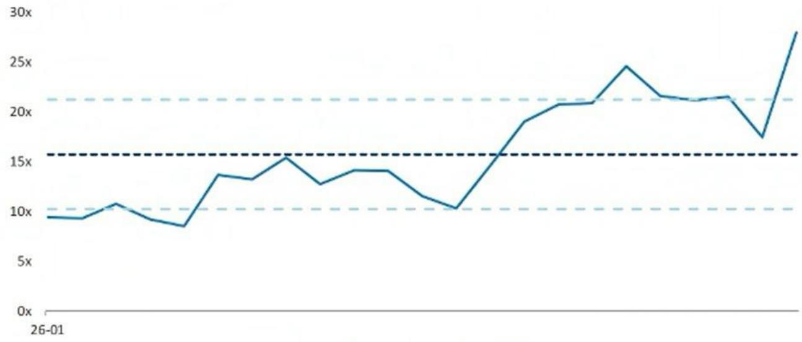  
- - - - Iluvatar one-year forward P/S  
Source: Company data, FactSet, MS

## Risk Reward – Iluvatar CoreX Semiconductor Co., Ltd. (9903.HK)

Leveraging supply chain resilience with strong order visibility

## PRICE TARGET HK\$688.00

Key valuation assumptions include:

\- An 8.3% cost of equity (derived from a beta of 1.05, risk-free rate of 2.0%, and equity risk premium of 6.0%)

• A long-term payout ratio of 34% (was 33%)

• A medium-term growth rate of 16%

• A perpetual terminal growth rate of 6%

## RISK REWARD CHART

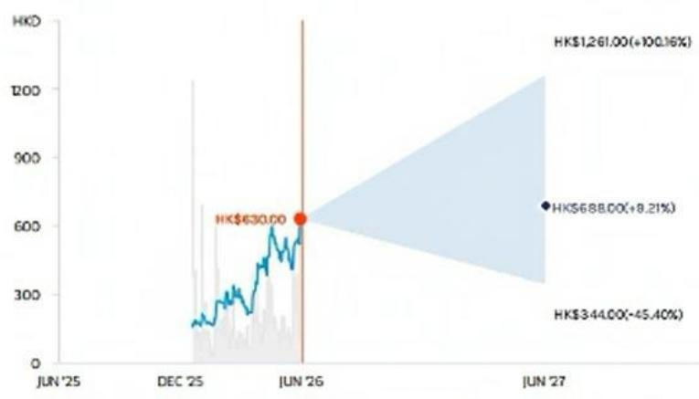  
Key: — Historical Stock Performance ● Current Stock Price ◆ Price Target  
Source: Refinitiv, MS

## OVERWEIGHT THESIS

■ Strong order visibility from domestic CSPs, with TianGai-150 shipments ramping in 2H26 and contributing >Rmb4bn revenue over 2026–27.

\- Diversified foundry strategy ensures supply security, with access to TSMC capacity mitigating risks from export controls and domestic yield constraints.
- High CUDA compatibility enables low-friction migration, with successful LLM deployment validating product-market fit.
- Clear path to profitability, with breakeven expected in 2026 and full-year profitability in 2027 driven by operating leverage and scaling.

\- Our price target implies 47x 2026e P/S, which is lower than the peer average of 75x 2026e P/S.

## Risk Reward Themes

New Data Era: Positive
Technology Diffusion: Positive
View descriptions of Risk Rewards Themes here

## BULL CASE

## 87x 2026e P/S

HK\$1,261.00

We assume: 1) >150% revenue CAGR in 2025-28e driven by a more aggressive domestic AI infrastructure build-out and large-scale procurement of both training and inference chips from Chinese cloud service providers and state-owned enterprises. 2) Gross margin improves to over 60% in 2026e and 2027e thanks to production scale effects, mature technology iteration and optimized high-value product structure. 3) The company achieves full-year profitability in 2026, ahead of our base case.

## BASE CASE

## 47x 2026e P/S

## HK\$688.00

We assume: 128% revenue CAGR in 2025-28e given strong orders from CSP clients and solid supply chain capacity. 2) Gross margin at 50.8% in 2026e and 52.4% 2027e due to better product mix. 3) The company achieve full-year profitability in 2027.

## BEAR CASE

## 24x 2026e P/S

HK\$344.00

We assume: <80% revenue CAGR in 2025-28e given slower-than-expected domestic AI capital expenditure and large model commercialization progress. 2) Nvidia relaxes export restrictions on mid-range AI chips to China, leading to intensified price competition. 3) Gross margin falls below 45% in 2026e and 2027e due to fierce price competition. 4) The company does not achieve full-year profitability until 2028.

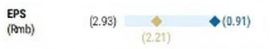

## Risk Reward – Iluvatar CoreX Semiconductor Co., Ltd. (9903.HK)

## KEY EARNINGS INPUTS

<table><tr><td>Drivers</td><td>Dec 2025</td><td>Dec 2026e</td><td>Dec 2027e</td><td>Dec 2028e</td></tr><tr><td>Operating profit (YoY) (%)</td><td>18.3</td><td>(73.4)</td><td>(669.6)</td><td>91.9</td></tr></table>

## INVESTMENT DRIVERS

• CSP AI capex growth

• TianGai shipment ramp

• CUDA migration trend

• Supply chain advantage (TSMC)

• AI inference expansion

• Policy support

\- Customer base expansion

• Margin improvement trajectory

## GLOBAL REVENUE EXPOSURE

  
Source: MS Estimate View explanation of regional hierarchies here  
◆ Mean ◆ MS Estimates
Source: Refinitiv, MS

## RISKS TO PT/RATING

## RISKS TO UPSIDE

• Stronger-than-expected CSP orders

\- Faster CUDA replacement with Iluvatar's software

\- Expansion of overseas and domestic capacity

## RISKS TO DOWNSIDE

• Order ramp below expectations

\- Escalation of sanctions

\- Intensifying competition

## OWNERSHIP POSITIONING

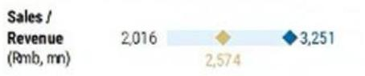

## MS ESTIMATES VS. CONSENSUS

Source: Refinitiv, MS

Income Statement

Iluvatar: Financial Summary

<table><tr><td>Rmb mn (Years End Dec )</td><td>2025</td><td>2026E</td><td>2027E</td><td>2028E</td></tr><tr><td>Net sales</td><td>1,033.6</td><td>3,250.9</td><td>8,243.5</td><td>12,270.5</td></tr><tr><td>COGS</td><td>(475.6)</td><td>(1,599.7)</td><td>(3,925.4)</td><td>(5,922.7)</td></tr><tr><td>Gross profit</td><td>558.0</td><td>1,651.2</td><td>4,318.2</td><td>6,347.8</td></tr><tr><td>Operating expenses</td><td>(1,607.5)</td><td>(1,930.0)</td><td>(2,730.0)</td><td>(3,300.0)</td></tr><tr><td>Operating income</td><td>(1,049.5)</td><td>(278.8)</td><td>1,588.2</td><td>3,047.8</td></tr><tr><td>Non-operating income</td><td>45.9</td><td>46.5</td><td>49.3</td><td>48.0</td></tr><tr><td>Pre-tax income</td><td>(1,003.7)</td><td>(232.4)</td><td>1,637.4</td><td>3,095.8</td></tr><tr><td>Income tax</td><td>0.0</td><td>0.0</td><td>0.0</td><td>176.0</td></tr><tr><td>Minority Interest</td><td>0.0</td><td>0.0</td><td>0.0</td><td>0.0</td></tr><tr><td>Reported net Income</td><td>(1,003.7)</td><td>(232.4)</td><td>1,637.4</td><td>2,919.8</td></tr><tr><td>Adj.wtd.avg.shrs( m)</td><td>189.0</td><td>254.3</td><td>254.3</td><td>254.3</td></tr><tr><td>Reported EPS (Rmb)</td><td>(5.3)</td><td>(0.9)</td><td>6.4</td><td>11.5</td></tr><tr><td>EPS for consensus (Rmb)</td><td>(5.3)</td><td>(0.9)</td><td>6.4</td><td>11.5</td></tr></table>

<table><tr><td>Rmb mn (Years End Dec )</td><td>2025</td><td>2026E</td><td>2027E</td><td>2028E</td></tr><tr><td>Cash</td><td>1,504.7</td><td>2,512.8</td><td>810.9</td><td>2,011.1</td></tr><tr><td>Mkt Securities</td><td>0.0</td><td>0.0</td><td>0.0</td><td>0.0</td></tr><tr><td>AR/NR</td><td>630.1</td><td>830.1</td><td>1,030.1</td><td>1,230.1</td></tr><tr><td>Inventory</td><td>709.8</td><td>1,753.1</td><td>3,441.4</td><td>4,056.7</td></tr><tr><td>Other</td><td>587.5</td><td>1,435.9</td><td>3,172.8</td><td>4,045.0</td></tr><tr><td>Current Assets</td><td>3,432.0</td><td>6,532.0</td><td>8,455.2</td><td>11,342.9</td></tr><tr><td>Long-term investments</td><td>76.9</td><td>76.2</td><td>76.2</td><td>76.2</td></tr><tr><td>Fixed assets</td><td>187.7</td><td>287.7</td><td>387.7</td><td>487.7</td></tr><tr><td>Intangible Assets</td><td>189.8</td><td>289.8</td><td>389.8</td><td>489.8</td></tr><tr><td>Other assets</td><td>25.5</td><td>25.5</td><td>25.5</td><td>25.5</td></tr><tr><td>Total Assets</td><td>3,912.0</td><td>7,211.2</td><td>9,334.4</td><td>12,422.2</td></tr><tr><td>S/T borrowings</td><td>643.6</td><td>643.6</td><td>643.6</td><td>643.6</td></tr><tr><td>AP/NP</td><td>291.0</td><td>482.1</td><td>967.9</td><td>1,135.9</td></tr><tr><td>Other ST liabilities</td><td>177.8</td><td>177.8</td><td>177.8</td><td>177.8</td></tr><tr><td>LT debt</td><td>365.4</td><td>365.4</td><td>365.4</td><td>365.4</td></tr><tr><td>Other LT liabilities</td><td>81.1</td><td>81.1</td><td>81.1</td><td>81.1</td></tr><tr><td>Total Liabilities</td><td>1,558.9</td><td>1,750.0</td><td>2,235.8</td><td>2,403.8</td></tr><tr><td>Common shares</td><td>228.9</td><td>254.3</td><td>254.3</td><td>254.3</td></tr><tr><td>Additional capital</td><td>0.0</td><td>3,315.0</td><td>3,315.0</td><td>3,315.0</td></tr><tr><td>Retained earning</td><td>2,162.1</td><td>1,929.8</td><td>3,567.2</td><td>6,487.0</td></tr><tr><td>Other shareholders&#x27; equity</td><td>(37.9)</td><td>(37.9)</td><td>(37.9)</td><td>(37.9)</td></tr><tr><td>Total Equity</td><td>2,353.1</td><td>5,461.2</td><td>7,098.6</td><td>10,018.4</td></tr><tr><td>Total Liab. &amp; Shrhldr&#x27;s Equity</td><td>3,912.0</td><td>7,211.2</td><td>9,334.4</td><td>12,422.2</td></tr></table>

E = MS Estimates
Source: MS, Company Data

Cash Flow Statement

<table><tr><td>Rmb mn (Years End Dec )</td><td>2025</td><td>2026E</td><td>2027E</td><td>2028E</td></tr><tr><td>Cashflow from Operations</td><td>(1,161.6)</td><td>(1,933.0)</td><td>(1,301.9)</td><td>1,600.2</td></tr><tr><td>Net profits</td><td>(1,003.7)</td><td>(232.4)</td><td>1,637.4</td><td>2,919.8</td></tr><tr><td>Depreciation</td><td>97.0</td><td>100.0</td><td>100.0</td><td>100.0</td></tr><tr><td>Working Capital Change</td><td>(823.6)</td><td>(1,900.7)</td><td>(3,139.4)</td><td>(1,519.5)</td></tr><tr><td>Other adjustments</td><td>568.8</td><td>100.0</td><td>100.0</td><td>100.0</td></tr><tr><td>Cashflow from Investing</td><td>(132.3)</td><td>(399.3)</td><td>(400.0)</td><td>(400.0)</td></tr><tr><td>Capex</td><td>(59.7)</td><td>(200.0)</td><td>(200.0)</td><td>(200.0)</td></tr><tr><td>Change of LT Investment</td><td>(49.1)</td><td>0.7</td><td>0.0</td><td>0.0</td></tr><tr><td>Change of ST Investment</td><td>0.1</td><td>0.0</td><td>0.0</td><td>0.0</td></tr><tr><td>Other adjustments</td><td>(23.6)</td><td>(200.0)</td><td>(200.0)</td><td>(200.0)</td></tr><tr><td>Cashflow from financing</td><td>2,490.9</td><td>3,340.4</td><td>0.0</td><td>0.0</td></tr><tr><td>Increase in L/T debt</td><td>323.4</td><td>0.0</td><td>0.0</td><td>0.0</td></tr><tr><td>Increase in S/T debt</td><td>77.6</td><td>0.0</td><td>0.0</td><td>0.0</td></tr><tr><td>Cash Dividend Paid</td><td>0.0</td><td>0.0</td><td>0.0</td><td>0.0</td></tr><tr><td>Issuance of stock</td><td>38.0</td><td>3,340.4</td><td>0.0</td><td>0.0</td></tr><tr><td>Other adjustments</td><td>2,051.9</td><td>0.0</td><td>0.0</td><td>0.0</td></tr><tr><td>Exchange rate adjustment</td><td>(5.9)</td><td>0.0</td><td>0.0</td><td>0.0</td></tr><tr><td>Net change in cash</td><td>1,197.1</td><td>1,008.1</td><td>(1,701.9)</td><td>1,200.2</td></tr></table>

<table><tr><td></td><td>2025</td><td>2026E</td><td>2027E</td><td>2028E</td></tr><tr><td colspan="5">Growth(%)</td></tr><tr><td>Revenue</td><td>91.6</td><td>214.5</td><td>153.6</td><td>48.9</td></tr><tr><td>Operating profits</td><td>18.3</td><td>(73.4)</td><td>NA</td><td>91.9</td></tr><tr><td>Pretax profits</td><td>12.5</td><td>(76.8)</td><td>NA</td><td>89.1</td></tr><tr><td>Net profits</td><td>12.5</td><td>(76.8)</td><td>NA</td><td>78.3</td></tr><tr><td>EPS</td><td>(2.6)</td><td>(82.8)</td><td>NA</td><td>78.3</td></tr><tr><td colspan="5">Margins (%)</td></tr><tr><td>Gross Margin</td><td>54.0</td><td>50.8</td><td>52.4</td><td>51.7</td></tr><tr><td>Operating Margin</td><td>(101.5)</td><td>(8.6)</td><td>19.3</td><td>24.8</td></tr><tr><td>Pretax Margin</td><td>(97.1)</td><td>(7.1)</td><td>19.9</td><td>25.2</td></tr><tr><td>Net Profit</td><td>(97.1)</td><td>(7.1)</td><td>19.9</td><td>23.8</td></tr><tr><td colspan="5">Return (%)</td></tr><tr><td>ROAE</td><td>(66.0)</td><td>(5.9)</td><td>26.1</td><td>34.1</td></tr><tr><td>ROAA</td><td>(35.9)</td><td>(4.2)</td><td>19.8</td><td>26.8</td></tr><tr><td colspan="5">Gearing (%)</td></tr><tr><td>Net Debt/Equity</td><td>(21.1)</td><td>(27.5)</td><td>2.8</td><td>(10.0)</td></tr><tr><td>Liabilities/Equity</td><td>66.2</td><td>32.0</td><td>31.5</td><td>24.0</td></tr><tr><td colspan="5">Ratios (X)</td></tr><tr><td>Current ratio</td><td>3.1</td><td>5.0</td><td>4.7</td><td>5.8</td></tr><tr><td>Quick ratio</td><td>1.9</td><td>2.6</td><td>1.0</td><td>1.7</td></tr><tr><td colspan="5">Others</td></tr><tr><td>AR/NR Turnover (days)</td><td>168.4</td><td>160.0</td><td>140.0</td><td>120.0</td></tr><tr><td>Inventory Turnover (days)</td><td>403.8</td><td>400.0</td><td>320.0</td><td>250.0</td></tr><tr><td>AP Turnover (days)</td><td>29.5</td><td>10.0</td><td>10.0</td><td>10.0</td></tr><tr><td>Cash Conversion (days)</td><td>542.8</td><td>550.0</td><td>450.0</td><td>360.0</td></tr></table>

## Related Research Reports

## Industry:

• China's Industrial Evolution: Global Semis – How China Will Chip In (Mar 2019)

• Disruption Decoded: How China Is Rewiring Global Semis (Jun 2020)

## Segment:

## AI GPU Semis:

• China's AI Accelerators – Who's Poised to Win? (Apr 2026)

\- China's Emerging Frontiers: China AI GPUs – Closing the Gap with the US (Mar 2026)

• China's Localization: Exploring the niche in ASICs (Apr 2023)

\- China's Localization: How will China chip in? Developing CPU and AI semi designs for the local market (Nov 2019)

## Analog:

• China's Localization: Analog IC: Identifying the long-term beneficiaries (Sept 2022)

## Cloud Semis:

\- Global Semiconductors: How will China chip in? Seizing cloud semi strength in China (Mar 2020)

## EDA & IP

• Empyrean Technology: EDA: Local semis' core enabler (Jun 2023)

• M31 Technology: Building the IP foundations of China's semi localization (Jun 2023)

## Foundry:

\- SMIC: Key foundry for China's semi localization, but advanced nodes ROI the main challenge (Aug 2020)

• Hua Hong Semiconductor Ltd: Powering China's Specialty Semi Localization (Aug 2020)

## Backend:

• Jiangsu Changjiang Electronics TechSlow recovery with share loss (Sept 2024)

## FPGA:

• China's Localization: How China Will Chip In; Exploring FPGA Localization Opportunities (Jul, 2022)

## MCU:

\- China's Localization: How Will China Chip In? Exploring MCU Localization Opportunities (Jul, 2021)

## Power Semis, Silicon Carbide & Gallium Nitride:

• China's Localization: The driving force behind power semis (April 2021)

\- China's Localization: How China will chip in; rising power in discrete world (Oct 2021)

• China's Localization: The Driving Force Behind Silicon Carbide (Jun 2023)

\- Semiconductors: Three investment themes in China auto semi localization (Jun 2025)

• Innoscience: Riding the GaN secular growth wave; initiate at EW (Oct 2025)

## RF Semis:

\- China's Localization: RF semis: A major untapped market in the China smartphone supply chain (Jun 2020)

## Semi equipment:

\- Greater China Semiconductors: How will China chip in? Chinese memory fabs to yield soon (Jan 2020)

\- NAURA Technology Group Co Ltd: China semi localization enabler facing near-term turbulence (Nov 2022)

MS Securities (China) Co., Ltd. is engaged by ASMPT Limited ("ASMPT") in relation to certain matters. MS Securities (China) Co., Ltd. may receive fees as a result of the engagement. Please refer to the notes at the end of this report.

This report references U.S. Executive Order 14032 and/or entities or securities that are designated thereunder. U.S. persons may be prohibited from buying certain securities of entities named in this report. Readers are solely responsible for ensuring that their investment activities are carried out in compliance with applicable laws.

This report references export controls and/or entities that may be subject to export control restrictions. Readers are solely responsible for ensuring that their investment or trade activities are carried out in compliance with applicable laws.

## Risk Reward Reference links

1. View explanation of Options Probabilities methodology -

Options\_Probabilities\_Exhibit\_Link.pdf

2. View descriptions of Risk Rewards Themes - RR\_Themes\_Exhibit\_Link.pdf

3. View explanation of regional hierarchies - GEG\_Exhibit\_Link.pdf

4. View explanation of Theme/Exposure methodology -

ESG\_Sustainable\_Solutions\_External\_Link.pdf

5. View explanation of HERS methodology - ESG\_HERS\_External\_Link.pdf

## Disclosure Section

The information and opinions in MS were prepared or are disseminated by MS Asia Limited (which accepts the responsibility for its contents) and/or MS Asia (Singapore) Pte. (Registration number 199206298Z) and/or MS Asia (Singapore) Securities Pte Ltd (Registration number 200008434H), regulated by the Monetary Authority of Singapore (which accepts legal responsibility for its contents and should be contacted with respect to any matters arising from, or in connection with, MS), and/or MS Taiwan Limited and/or MS & Co International plc, Seoul Branch, and/or MS Australia Limited (A.B.N. 67 003 734 576, holder of Australian financial services License No. 233742, which accepts responsibility for its contents), and/or MS Wealth Management Australia Pty Ltd (A.B.N. 19 009 145 555, holder of Australian financial services License No. 240813, which accepts responsibility for its contents), and/or MS India Company Private Limited having Corporate Identification No (CIN) U2299OMH1998PTC115305, regulated by the Securities and Exchange Board of India ("SEBI") and holder of licenses as a Research Analyst (SEBI Registration No.INH000001105); Stock Broker (SEBI Stock Broker Registration No. INZ000244438), Merchant Banker (SEBI Registration No.INM000011203), and depository participant with National Securities Depository Limited (SEBI Registration No. IN-DP-NSDL-567-2021) having registered office at Altimus, Level 39 & 40, Pandurang Budhkar Marg, Worli, Mumbai 400018, India; Telephone no. +91-22-61181000; Compliance Officer Details: Mr. Tejarshi Hardas, Tel No.: +91-22-61181000 or Email: tejarshihardas@morganstanley.com; Grievance officer details: Mr. Tejarshi Hardas, Tel No.: +91-22-61181000 or Email: msic-compliance@morganstanley.com which accepts the responsibility for its contents and should be contacted with respect to any matters arising from, or in connection with, MS, and their affiliates (collectively, "MS"). MS India Company Private Limited (MSICPL) may use AI tools in providing research services. All recommendations contained herein are made by the duly qualified research analysts.

For important disclosures, stock price charts and equity rating histories regarding companies that are the subject of this report, please see the MS Disclosure Website at www.morganstanley.com/eqr/disclosures/webapp/generalresearch, or contact your investment representative or MS at 1585 Broadway, (Attention: Research Management), New York, NY, 10036 USA

For valuation methodology and risks associated with any recommendation, rating or price target referenced in this research report, please contact the Client Support Team as follows: US/Canada +1 800 303-2495; Hong Kong +852 2848-5999; Latin America +1 718 754-5444 (U.S.); London +44 (0)20-7425-8169; Singapore +65 6834-6860; Sydney +61 (0)2-9770-1505; Tokyo +81 (0)3-6836-9000. Alternatively you may contact your investment representative or MS at 1585 Broadway. (Attention: Research Management), New York, NY 10036 USA.

## Analyst Certification

The following analysts hereby certify that their views about the companies and their securities discussed in this report are accurately expressed and that they have not received and will not receive direct or indirect compensation in exchange for expressing specific recommendations or views in this report: Charlie Chan, Daisy Dai, CFA; Daniel Yen, CFA.

## Global Research Conflict Management Policy

MS has been published in accordance with our conflict management policy, which is available at www.morganstanley.com/institutional/research/conflictpolicies. A Portuguese version of the policy can be found at www.morganstanley.com.br

## Important Regulatory Disclosures on Subject Companies

As of May 29, 2026, MS beneficially owned 1% or more of a class of common equity securities of the following companies covered in MS: ACM Research Inc, Advanced Micro Fabrication Equipment Inc, Advanced Wireless Semiconductor Co, Alchip Technologies Ltd, AllRing Tech Co., AP Memory Technology Corp, ASE Technology Holding Co Ltd, ASMPT Ltd, Aspeed Technology, Cambricon Technology Corporation, Dosilicon Co Ltd, FOCI Fiber Optic Communications Inc, GigaDevice Semiconductor Beijing Inc, Global Unichip Corp, GlobalWafers Co Ltd, Gudeng Precision, Hon Precision, Hua Hong Semiconductor Ltd, King Yuan Electronics Co Ltd, Macronix International Co Ltd, MediaTek, Montage Technology Co Ltd, Nanya Technology Corp., NAURA Technology Group Co Ltd, Nuvoton Technology Corporation, Parade Technologies Ltd, Phison Electronics Corp, Realtek Semiconductor, Shanghai Fudan Microelectronics, Silergy Corp, Silicon Motion, TSMC, UMC, Vanguard International Semiconductor, WIN Semiconductors Corp, Winbond Electronics Corp, WinWay Technology Co Ltd, WPG Holdings, WT Microelectronics Co. Ltd.

Within the last 12 months, MS managed or co-managed a public offering (or 144A offering) of securities of Montage Technology Co Ltd, Powerchip Semiconductor Manufacturing Co.

Within the last 12 months, MS has received compensation for investment banking services from ASMPT Ltd, Montage Technology Co Ltd, Powerchip Semiconductor Manufacturing Co.

In the next 3 months, MS expects to receive or intends to seek compensation for investment banking services from Advanced Micro-Fabrication Equipment Inc, Alchip Technologies Ltd, AP Memory Technology Corp, ASE Technology Holding Co. Ltd., ASMedia Technology Inc, ASMPT Ltd, Aspeed Technology, Espressif Systems, GigaDevice Semiconductor Beijing Inc, GlobalWafers Co Ltd, Gudeng Precision, Himax Technologies Inc, Hua Hong Semiconductor Ltd, Iluvatar CoreX Semiconductor Co, Ltd., Innoscience, King Yuan Electronics Co Ltd, Macronix International Co Ltd, MediaTek, Montage Technology Co Ltd, Novatek, Phison Electronics Corp, Powerchip Semiconductor Manufacturing Co, Realtek Semiconductor, Shenzhen Longsys Electronics Co Ltd, Silergy Corp, Silicon Motion, TSMC, UMC, Vanguard International Semiconductor, Winbond Electronics Corp, WinWay Technology Co Ltd, WPG Holdings, WT Microelectronics Co. Ltd.

Within the last 12 months, MS has received compensation for products and services other than investment banking services from ASE Technology Holding Co. Ltd., King Yuan Electronics Co Ltd, MediaTek, Nanya Technology Corp, Novatek, Nuvoton Technology Corporation, Realtek Semiconductor, Silicon Motion, SMIC, TSMC, UMC, Universal Scientific Ind. (Shanghai), Winbond Electronics Corp, WT Microelectronics Co. Ltd.

Within the last 12 months, MS has provided or is providing investment banking services to, or has an investment banking client relationship with, the following company: Advanced Micro-Fabrication Equipment Inc, Alchip Technologies Ltd, AP Memory Technology Corp, ASETechnology Holding Co. Ltd., ASMedia Technology Inc, ASMPT Ltd, Aspeed Technology, Espressif Systems, GigaDevice Semiconductor Beijing Inc, GlobalWafers Co Ltd, Gudeng Precision, Himax Technologies Inc, Hua Hong Semiconductor Ltd, Iluvatar CoreX Semiconductor Co., Ltd., Innoscience, King Yuan Electronics Co Ltd, Macronix International Co Ltd, MediaTek, Montage Technology Co Ltd, Novatek, Phison Electronics Corp, Powerchip Semiconductor Manufacturing Co, Realtek Semiconductor, Shenzhen Longsys Electronics Co Ltd, Silergy Corp., Silicon Motion, TSMC, UMC, Vanguard International Semiconductor, Winbond Electronics Corp, WinWay Technology Co Ltd, WPG Holdings, WT Microelectronics Co. Ltd.

Within the last 12 months, MS has either provided or is providing non-investment banking, securities-related services to and/or in the past has entered into an agreement to provide services or has a client relationship with the following company: ASE Technology Holding Co. Ltd, King Yuan Electronics Co Ltd, MediaTek, Montage Technology Co Ltd, Nanya Technology Corp., Novatek, Nuvoton Technology Corporation, Realtek Semiconductor, Silicon Motion, SMIC, TSMC, UMC, Universal Scientific Ind. (Shanghai), Winbond Electronics Corp, WT Microelectronics Co. Ltd.

MS & Co. LLC makes a market in the securities of ACM Research Inc, Himax Technologies Inc, Silicon Motion.

The equity research analysts or strategists principally responsible for the preparation of MS have received compensation based upon various factors, including quality of research, investor client feedback, stock picking, competitive factors, firm revenues and overall investment banking revenues. Equity Research analysts' or strategists' compensation is not linked to investment banking or capital markets transactions performed by MS or the profitability or revenues of particular trading desks.

MS and its affiliates do business that relates to companies/instruments covered in MS, including market making, providing liquidity, fund management, commercial banking, extension of credit, investment services and investment banking. MS sells to and buys from customers the securities/instruments of companies covered in MS on a principal basis. MS may have a position in the debt of the Company or instruments discussed in this report. MS trades or may trade as principal in the debt securities (or in related derivatives) that are the subject of the debt research report.

Certain disclosures listed above are also for compliance with applicable regulations in non-US jurisdictions.

## STOCK RATINGS

MS uses a relative rating system using terms such as Overweight, Equal-weight, Not-Rated or Underweight (see definitions below). MS does not assign ratings of Buy, Hold or Sell to the stocks we cover. Overweight, Equal-weight, Not-Rated and Underweight are not the equivalent of buy, hold and sell. Investors should carefully read the definitions of all ratings used in MS. In addition, since MS contains more complete information concerning the analyst's views, investors should carefully read MS, in its entirety, and not infer the contents from the rating alone. In any case, ratings (or research) should not be used or relied upon as investment advice. An investor's decision to buy or sell a stock should depend on individual circumstances (such as the investor's existing holdings) and other considerations.

## Global Stock Ratings Distribution

(as of May 31, 2026)

The Stock Ratings described below apply to MS's Fundamental Equity Research and do not apply to Debt Research produced by the Firm.

For disclosure purposes only (in accordance with FINRA requirements), we include the category headings of Buy, Hold, and Sell alongside our ratings of Overweight, Equal-weight, Not-Rated and Underweight. MS does not assign ratings of Buy, Hold or Sell to the stocks we cover. Overweight, Equal-weight, Not-Rated and Underweight are not the equivalent of buy, hold, and sell but represent recommended relative weightings (see definitions below). To satisfy regulatory requirements, we correspond Overweight, our most positive stock rating, with a buy recommendation; we correspond Equal-weight and Not-Rated to hold and Underweight to sell recommendations, respectively.

<table><tr><td></td><td colspan="2">Coverage Universe</td><td colspan="3">Investment Banking Clients (IBC)</td><td colspan="2">Other Material Investment ServicesClients (MISC)</td></tr><tr><td>Stock RatingCategory</td><td>Count</td><td>% of Total</td><td>Count</td><td>% of Total IBC</td><td>% of RatingCategory</td><td>Count</td><td>% of Total OtherMISC</td></tr><tr><td>Overweight/Buy</td><td>1542</td><td>42%</td><td>465</td><td>51%</td><td>30%</td><td>707</td><td>43%</td></tr><tr><td>Equal-weight/Hold</td><td>1571</td><td>43%</td><td>369</td><td>40%</td><td>23%</td><td>723</td><td>44%</td></tr><tr><td>Not-Rated/Hold</td><td>3</td><td>0%</td><td>0</td><td>0%</td><td>0%</td><td>1</td><td>0%</td></tr><tr><td>Underweight/Sell</td><td>551</td><td>15%</td><td>86</td><td>9%</td><td>16%</td><td>201</td><td>12%</td></tr><tr><td>Total</td><td>3,667</td><td></td><td>920</td><td></td><td></td><td>1632</td><td></td></tr></table>

Data include common stock and ADRs currently assigned ratings. Investment Banking Clients are companies from whom MS received Investment banking compensation in the last 12 months. Due to rounding off of decimals, the percentages provided in the "6% of total" column may not add up to exactly 100 percent.

## Analyst Stock Ratings

Overweight (O). The stock's total return is expected to exceed the average total return of the analyst's industry (or industry team's) coverage universe, on a risk-adjusted basis, over the next 12-18 months.

Equal-weight (E). The stock's total return is expected to be in line with the average total return of the analyst's industry (or industry team's) coverage universe, on a risk-adjusted basis, over the next 12-18 months.

Not Rated (NR). Currently the analyst does not have adequate conviction about the stock's total return relative to the average total return of the analyst's industry (or industry team's) coverage universe, on a risk-adjusted basis, over the next 12-18 months.

Underweight (U). The stock's total return is expected to be below the average total return of the analyst's industry (or industry team's) coverage universe, on a risk-adjusted basis, over the next 12-18 months.

Unless otherwise specified, the time frame for price targets included in MS is 12 to 18 months.

## Analyst Industry Views

Attractive (A): The analyst expects the performance of his or her industry coverage universe over the next 12-18 months to be attractive vs. the relevant broad market benchmark, as indicated below.

In-Line (I): The analyst expects the performance of his or her industry coverage universe over the next 12-18 months to be in line with the relevant broad market benchmark, as indicated below. Cautious (C): The analyst views the performance of his or her industry coverage universe over the next 12-18 months with caution vs. the relevant broad market benchmark, as indicated below. Benchmarks for each region are as follows: North America - S&P 500; Latin America - relevant MSCI country index or MSCI Latin America Index; Europe - MSCI Europe; Japan - TOPIX; Asia - relevant MSCI country index or MSCI sub-regional Index or MSCI AC Asia Pacific ex Japan Index.

## Important Disclosures for MS Smith Barney LLC Customers

Important disclosures regarding any material conflict of interest that can reasonably be expected to have influenced MS Smith Barney LLC's choice of a third-party research provider or the subject company of a third-party research report, are available on the MS Wealth Management disclosure website at www.morganstanley.com/online/researchdisclosures. For MS specific disclosures, you may refer to https://www.morganstanley.com/eqr/disclosures/webapp/generalresearch.

Each MS report is reviewed and approved on behalf of MS Smith Barney LLC. This review and approval is conducted by the same person who reviews the

research report on behalf of MS. This could create a conflict of interest.

## Other Important Disclosures

MS policy is to update research reports as and when the Research Analyst and Research Management deem appropriate, based on developments with the issuer, the sector, or the market that may have a material impact on the research views or opinions stated therein. In addition, certain Research publications are intended to be updated on a regular periodic basis (weekly/monthly/quarterly/annual) and will ordinarily be updated with that frequency, unless the Research Analyst and Research Management determine that a different publication schedule is appropriate based on current conditions.

MS is not acting as a municipal advisor and the opinions or views contained herein are not intended to be, and do not constitute, advice within the meaning of Section 975 of the Dodd-Frank Wall Street Reform and Consumer Protection Act.

MS produces an equity research product called a "Tactical Idea." Views contained in a "Tactical Idea" on a particular stock may be contrary to the recommendations or views expressed in research on the same stock. This may be the result of differing time horizons, methodologies, market events, or other factors. For all research available on a particular stock, please contact your sales representative or go to Matrix at http://www.morganstanley.com/matrix.

MS is provided to our clients through our proprietary research portal on Matrix and also distributed electronically by MS to clients. Certain, but not all, MS products are also made available to clients through third-party vendors or redistributed to clients through alternate electronic means as a convenience. For access to all available MS, please contact your sales representative or go to Matrix at http://www.morganstanley.com/matrix.

Any access and/or use of MS is subject to MS's Terms of Use (http://www.morganstanley.com/terms.html). By accessing and/or using MS, you are indicating that you have read and agree to be bound by our Terms of Use (http://www.morganstanley.com/terms.html). In addition, you consent to MS processing your personal data and using cookies in accordance with our Privacy Policy and our Global Cookies Policy (http://www.morganstanley.com/privacy\_pledge.html), including for the purposes of setting your preferences and to collect readership data so that we can deliver better and more personalized service and products to you. To find out more information about how MS processes personal data, how we use cookies and how to reject cookies see our Privacy Policy and our Global Cookies Policy (http://www.morganstanley.com/privacy\_pledge.html). Please use the provided link to review the Terms and Conditions and Most Important Terms and Conditions for MS India Company Private Limited (https://www.morganstanley.com/assets/pdfs/about-us-global-offices/India/Terms\_and\_conditions.pdf) and the following link to review the audit report (https://my.matrix.ms.com/eqr/research/webapp/researchdocs/MSKPI\_Morgan\_Stanley\_Research\_Audit\_Report.pdf).

If you do not agree to our Terms of Use and/or if you do not wish to provide your consent to MS processing your personal data or using cookies please do not access our research. MS does not provide individually tailored investment advice. MS has been prepared without regard to the circumstances and objectives of those who receive it. MS recommends that investors independently evaluate particular investments and strategies, and encourages investors to seek the advice of a financial adviser. The appropriateness of an investment or strategy will depend on an investor's circumstances and objectives. The securities, instruments, or strategies discussed in MS may not be suitable for all investors, and certain investors may not be eligible to purchase or participate in some or all of them. MS is not an offer to buy or sell or the solicitation of an offer to buy or sell any security/instrument or to participate in any particular trading strategy. The value of and income from your investments may vary because of changes in interest rates, foreign exchange rates, default rates, prepayment rates, securities/instruments prices, market indexes, operational or financial conditions of companies or other factors. There may be time limitations on the exercise of options or other rights in securities/instruments transactions. Past performance is not necessarily a guide to future performance. Estimates of future performance are based on assumptions that may not be realized. If provided, and unless otherwise stated, the closing price on the cover page is that of the primary exchange for the subject company's securities/instruments.

The fixed income research analysts, strategists or economists principally responsible for the preparation of MS have received compensation based upon various factors, including quality, accuracy and value of research, firm profitability or revenues (which include fixed income trading and capital markets profitability or revenues), client feedback and competitive factors. Fixed Income Research analysts', strategists' or economists' compensation is not linked to investment banking or capital markets transactions performed by MS or the profitability or revenues of particular trading desks.

The "Important Regulatory Disclosures on Subject Companies" section in MS lists all companies mentioned where MS owns 1% or more of a class of common equity securities of the companies. For all other companies mentioned in MS, MS may have an investment of less than 1% in securities/instruments or derivatives of securities/instruments of companies and may trade them in ways different from those discussed in MS. Employees of MS not involved in the preparation of MS may have investments in securities/instruments or derivatives of securities/instruments of companies mentioned and may trade them in ways different from those discussed in MS. Derivatives may be issued by MS or associated persons.

With the exception of information regarding MS, MS is based on public information. MS makes every effort to use reliable, comprehensive information, but we make no representation that it is accurate or complete. We have no obligation to tell you when opinions or information in MS change apart from when we intend to discontinue equity research coverage of a subject company. Facts and views presented in MS have not been reviewed by, and may not reflect information known to, professionals in other MS business areas, including investment banking personnel.

MS personnel may participate in company events such as site visits and are generally prohibited from accepting payment by the company of associated expenses unless pre-approved by authorized members of Research management.

MS may make investment decisions that are inconsistent with the recommendations or views in this report.

To our readers based in Taiwan or trading in Taiwan securities/instruments: Information on securities/instruments that trade in Taiwan is distributed by MS Taiwan Limited ("MSTL"). Such information is for your reference only. The reader should independently evaluate the investment risks and is solely responsible for their investment decisions. MS may not be distributed to the public media or quoted or used by the public media without the express written consent of MS. Any non-customer reader within the scope of Article 7-1 of the Taiwan Stock Exchange Recommendation Regulations accessing and/or receiving MS is not permitted to provide MS to any third party (including but not limited to related parties, affiliated companies and any other third parties) or engage in any activities regarding MS which may create or give the appearance of creating a conflict of interest. Information on securities/instruments that do not trade in Taiwan is for informational purposes only and is not to be construed as a recommendation or a solicitation to trade in such securities/instruments. MSTL may not execute transactions for clients in these securities/instruments.

Certain information in MS was sourced by employees of the Shanghai Representative Office of MS Asia Limited for the use of MS Asia Limited. MS is not incorporated under PRC law and the research in relation to this report is conducted outside the PRC. MS does not constitute an offer to sell or the solicitation of an offer to buy any securities in the PRC. PRC investors shall have the relevant qualifications to invest in such securities and shall be responsible for obtaining all relevant approvals, licenses, verifications and/or registrations from the relevant governmental authorities themselves. Neither this report nor any part of it is intended as, or shall constitute, provision of any consultancy or advisory service of securities investment as defined under PRC law. Such information is provided for your reference only.

MS is disseminated in Brazil by MS C.T.V.M.S.A. located at Av. Brigadeiro Faria Lima, 3600, 6th floor, São Paulo - SP, Brazil; and is regulated by the Comissão de Valores Mobiliários; in Mexico by MS México, Casa de Bolsa, S.A. de C.V which is regulated by Comision Nacional Bancaria y de Valores. Paseo de Los Tamarindos 90, Torre 1, Col. Bosques de Las Lomas Floor 29, 05120 Mexico City; in Japan by MS MUFG Securities Co., Ltd. and, for Commodities related research reports only, MS Capital Group Japan Co., Ltd; in Hong Kong by MS Asia Limited (which accepts responsibility for its contents) and by MS Bank Asia Limited; in Singapore by MS Asia (Singapore) Pte. (Registration number 199206298Z) and/or MS Asia (Singapore) Securities Pte Ltd (Registration number 200008434H), regulated by the Monetary Authority of Singapore (which accepts legal responsibility for its contents and should be contacted with respect to any matters arising from, or in connection with, MS) and by MS Bank Asia Limited, Singapore Branch (Registration number T14FC0118); in Australia to "wholesale clients" within the meaning of the Australian Corporations Act by MS Australia Limited A.B.N. 67 003 734 576, holder of Australian financial services license No. 233742, which accepts responsibility for its contents; in Australia to "wholesale clients" and "retail clients" within the meaning of the Australian Corporations Act by MS Wealth Management Australia Pty Ltd (A.B.N. 19 009 145 555, holder of Australian financial services license No. 240813, which accepts responsibility for its contents; in Korea by MS & Co International plc, Seoul Branch; in India by MS India Company Private Limited having Corporate Identification No (CIN) U22990MH1998PTC115305, regulated by the Securities and Exchange Board of India ("SEBI") and holder of licenses as a Research Analyst (SEBI Registration No. INH000001105); Stock Broker (SEBI Stock Broker Registration No. INZ000244438), Merchant Banker (SEBI Registration No. INM000011203), and depository participant with National Securities Depository Limited (SEBI Registration No. IN-DP-NSDL-567-2021) having registered office at Altimus, Level 39 & 40, Pandurang Budhkar Marg. Worli, Mumbai 400018, India; Telephone no.+91-22-61181000; Compliance Officer Details: Mr. Tejarshi Hardas, Tel. No.: +91-22-61181000 or Email: tejarshi.hardas@morganstanley.com; Grievance officer details: Mr. Tejarshi Hardas, Tel. No.: +91-22-61181000 or Email: msic-compliance@morganstanley.com. MS India Company Private Limited (MSICPL) may use AI tools in providing research services. All recommendations contained herein are made by the duly qualified research analysts; in Canada by MS Canada Limited; in Germany and the European Economic Area where required by MS Europe S.E., authorised and regulated by Bundesanstalt fuer Finanzdienstleistungsaufsicht (BaFin) under the reference number 149169; in the US by MS & Co. LLC, which accepts responsibility for its contents. MS & Co. International plc, authorized by the Prudential Regulation Authority and regulated by the Financial Conduct Authority and the Prudential Regulation Authority, disseminates in the UK research that it has prepared, and research which has been prepared by any of its affiliates, only to persons who (i) are investment professionals falling within Article 19(5) of the Financial Services and Markets Act 2000 (Financial Promotion) Order 2005 (as amended, the "Order"); (ii) are persons who are high net worth entities falling within Article 49(2)(a) to (d) of the Order; or (iii) are persons to whom an invitation or inducement to engage in investment activity (within the meaning of section 21 of the Financial Services and Markets Act 2000, as amended) may otherwise lawfully be communicated or caused to be communicated. RMB MS Proprietary Limited is a member of the JSE Limited and A2X (Pty) Ltd. RMB MS Proprietary Limited is a joint venture owned equally by MS International Holdings Inc. and RMB Investment Advisory (Proprietary)Limited, which is wholly owned by FirstRand Limited. The information in MS is being disseminated by MS Saudi Arabia, regulated by the Capital Market Authority in the Kingdom of Saudi Arabia, and is directed at Sophisticated investors only.

MS Hong Kong Securities Limited is the liquidity provider/market maker for securities of ASMPT Ltd, Hua Hong Semiconductor Ltd listed on the Stock Exchange of Hong Kong Limited. An updated list can be found on HKEx website: http://www.hkex.com.hk.

The information in MS is being communicated by MS & Co. International plc (DIFC Branch), regulated by the Dubai Financial Services Authority (the DFSA) or by MS & Co. International plc (ADGM Branch), regulated by the Financial Services Regulatory Authority Abu Dhabi (the FSRA), and is directed at Professional Clients only, as defined by the DFSA or the FSRA, respectively. The financial products or financial services to which this research relates will only be made available to a customer who we are satisfied meets the regulatory criteria of a Professional Client. A distribution of the different MS Research ratings or recommendations, in percentage terms for Investments in each sector covered, is available upon request from your sales representative.

The Information in MS is being communicated by MS & Co. International plc (QFC Branch), regulated by the Qatar Financial Centre Regulatory Authority (the QFCRA), and is directed at business customers and market counterparties only and is not intended for Retail Customers as defined by the QFCRA.

As required by the Capital Markets Board of Turkey, investment information, comments and recommendations stated here, are not within the scope of investment advisory activity. Investment advisory service is provided exclusively to persons based on their risk and income preferences by the authorized firms. Comments and recommendations stated here are general in nature. These opinions may not fit to your financial status, risk and return preferences. For this reason, to make an investment decision by relying solely to this information stated here may not bring about outcomes that fit your expectations.

The trademarks and service marks contained in MS are the property of their respective owners. Third-party data providers make now warranties or representations relating to the accuracy, completeness, or timeliness of the data they provide and shall not have liability for any damages relating to such data. The Global Industry Classification Standard (GICS) was developed by and is the exclusive property of MSCI and S&P.

MS, or any portion thereof may not be reprinted, sold or redistributed without the written consent of MS.

Indicators and trackers referenced in MS may not be used as, or treated as, a benchmark under Regulation EU 2015/1011, or any other similar framework.

The issuers and/or fixed income products recommended or discussed in certain fixed income research reports may not be continuously followed. Accordingly, investors should regard those fixed income research reports as providing stand-alone analysis and should not expect continuing analysis or additional reports relating to such issuers and/or individual fixed income products. MS may hold, from time to time, material financial and commercial interests regarding the company subject to the Research report.

Registration granted by SEBI and certification from the National Institute of Securities Markets (NISM) in no way guarantee performance of the intermediary or provide any assurance of returns to investors. Investment in securities market are subject to market risks. Read all the related documents carefully before investing.

INDUSTRY COVERAGE: Greater China Technology Semiconductors

<table><tr><td>COMPANY (TICKER)</td><td>RATING (AS OF)</td><td>PRICE* (06/22/2026)</td></tr><tr><td colspan="3">Charlie Chan</td></tr><tr><td>ACM Research Inc (ACMR.O)</td><td>O (03/07/2023)</td><td>US$109.87</td></tr><tr><td>Advanced Micro-Fabrication Equipment Inc (688012.SS)</td><td>O (11/06/2023)</td><td>Rmb372.74</td></tr><tr><td>Advanced Wireless Semiconductor Co (8086.TW0)</td><td>U (07/14/2025)</td><td>NT$165.50</td></tr><tr><td>Alchip Technologies Ltd (3661.TW)</td><td>O (05/14/2021)</td><td>NT$4,325.00</td></tr><tr><td>ASE Technology Holding Co. Ltd (3711.TW)</td><td>O (09/15/2024)</td><td>NT$674.00</td></tr><tr><td>Cambricon Technology Corporation (688256.SS)</td><td>O (04/27/2026)</td><td>Rmb1,456.99</td></tr><tr><td>Global Unichip Corp (3443.TW)</td><td>E (05/28/2026)</td><td>NT$4,755.00</td></tr><tr><td>GlobalWafers Co Ltd (6488.TWO)</td><td>E (05/19/2026)</td><td>NT$1,115.00</td></tr><tr><td>Gudeng Precision (3680.TWO)</td><td>O (11/25/2025)</td><td>NT$547.00</td></tr><tr><td>Hua Hong Semiconductor Ltd (1347.HK)</td><td>E (03/12/2026)</td><td>HK$168.10</td></tr><tr><td>Iluvatar CoreX Semiconductor Co., Ltd. (9903.HK)</td><td>O (04/27/2026)</td><td>HK$630.00</td></tr><tr><td>King Yuan Electronics Co Ltd (2449.TW)</td><td>O (03/03/2023)</td><td>NT$339.00</td></tr><tr><td>Maxscend Microelectronics Co Ltd (300782.SZ)</td><td>U (01/11/2021)</td><td>Rmb112.38</td></tr><tr><td>MediaTek (2454.TW)</td><td>O (11/28/2025)</td><td>NT$4,465.00</td></tr><tr><td>MetaX Integrated Circuits (688802.SS)</td><td>E (04/27/2026)</td><td>Rmb758.00</td></tr><tr><td>Nanya Technology Corp. (2408.TW)</td><td>O (05/28/2026)</td><td>NT$505.00</td></tr><tr><td>NAURA Technology Group Co Ltd (002371.SZ)</td><td>O (11/06/2023)</td><td>Rmb745.00</td></tr><tr><td>OmniVision Integrated Circuits Group Inc (603501.SS)</td><td>E (11/17/2025)</td><td>Rmb90.56</td></tr><tr><td>Phison Electronics Corp (8299.TWO)</td><td>E (02/25/2026)</td><td>NT$2,580.00</td></tr><tr><td>SG Micro Corp. (300661.SZ)</td><td>E (11/03/2025)</td><td>Rmb136.81</td></tr><tr><td>Silergy Corp. (6415.TW)</td><td>U (05/19/2026)</td><td>NT$673.00</td></tr><tr><td>SMIC (0981.HK)</td><td>O (10/21/2025)</td><td>HK$76.50</td></tr><tr><td>TSMC (2330.TW)</td><td>O (02/07/2022)</td><td>NT$2,510.00</td></tr><tr><td>UMC (2303.TW)</td><td>O (05/19/2026)</td><td>NT$160.00</td></tr><tr><td>Vanguard International Semiconductor (5347.TWO)</td><td>E (01/14/2026)</td><td>NT$191.50</td></tr><tr><td>WIN Semiconductors Corp (3105.TWO)</td><td>U (07/14/2025)</td><td>NT$541.00</td></tr><tr><td colspan="3">Daisy Dai, CFA</td></tr><tr><td>ASMPT Ltd (0522.HK)</td><td>O (07/24/2025)</td><td>HK$208.80</td></tr><tr><td>China Resources Microelectronics Limited (688396.SS)</td><td>U (03/02/2026)</td><td>Rmb78.20</td></tr><tr><td>Elan Microelectronics Corp (2458.TW)</td><td>O (10/03/2025)</td><td>NT$178.50</td></tr><tr><td>Empyrean Technology Co Ltd (301269.SZ)</td><td>E (01/17/2025)</td><td>Rmb101.71</td></tr><tr><td>Hangzhou Silan Microelectronics Co. Ltd. (600460.SS)</td><td>U (08/25/2025)</td><td>Rmb44.80</td></tr><tr><td>Innoscience (2577.HK)</td><td>E (10/13/2025)</td><td>HK$66.90</td></tr><tr><td>JCET Group Co Ltd (600584.SS)</td><td>E (01/16/2026)</td><td>Rmb91.33</td></tr><tr><td>Shanghai Fudan Microelectronics (1385.HK)</td><td>O (03/07/2025)</td><td>HK$29.62</td></tr><tr><td>SICC Co Ltd (688234.SS)</td><td>O (03/20/2026)</td><td>Rmb158.00</td></tr><tr><td>StarPower Semiconductor Ltd (603290.SS)</td><td>E (05/14/2026)</td><td>Rmb135.59</td></tr><tr><td>Unigroup Guoxin Microelectronics Co Ltd (002049.SZ)</td><td>U (01/10/2023)</td><td>Rmb81.96</td></tr><tr><td>Universal Scientific Ind. (Shanghai) (601231.SS)</td><td>O (11/05/2025)</td><td>Rmb37.49</td></tr><tr><td>Yangjie Technology (300373.SZ)</td><td>O (06/10/2022)</td><td>Rmb128.11</td></tr><tr><td colspan="3">Daniel Yen, CFA</td></tr><tr><td>AP Memory Technology Corp (6531.TW)</td><td>O (07/11/2025)</td><td>NT$1,115.00</td></tr><tr><td>ASMedia Technology Inc (5269.TW)</td><td>U (10/03/2025)</td><td>NT$1,450.00</td></tr><tr><td>Aspeed Technology (5274.TWO)</td><td>O (06/09/2025)</td><td>NT$19,275.00</td></tr><tr><td>Egis Technology Inc (6462.TWO)</td><td>E (01/28/2026)</td><td>NT$122.00</td></tr><tr><td>Espressif Systems (688018.SS)</td><td>O (05/15/2023)</td><td>Rmb123.11</td></tr><tr><td>GigaDevice Semiconductor Beijing Inc (603986.SS)</td><td>O (05/15/2025)</td><td>Rmb689.70</td></tr><tr><td>Macronix International Co Ltd (2337.TW)</td><td>O (09/18/2025)</td><td>NT$185.50</td></tr><tr><td>Montage Technology Co Ltd (6809.HK)</td><td>O (03/18/2026)</td><td>HK$446.40</td></tr><tr><td>Montage Technology Co Ltd (688008.SS)</td><td>O (03/18/2026)</td><td>Rmb280.05</td></tr><tr><td>Novatek (3034.TW)</td><td>U (02/04/2026)</td><td>NT$567.00</td></tr><tr><td>Nuvoton Technology Corporation (4919.TW)</td><td>U (11/10/2025)</td><td>NT$216.00</td></tr><tr><td>Parade Technologies Ltd (4966.TWO)</td><td>O (05/27/2026)</td><td>NT$695.00</td></tr><tr><td>Powerchip Semiconductor Manufacturing Co (6770.TW)</td><td>O (10/27/2025)</td><td>NT$81.60</td></tr><tr><td>Realtek Semiconductor (2379.TW)</td><td>E (01/30/2026)</td><td>NT$900.00</td></tr><tr><td>Shenzhen Goodix Technology Co Ltd (603160.SS)</td><td>U (07/14/2025)</td><td>Rmb59.19</td></tr><tr><td>Winbond Electronics Corp (2344.TW)</td><td>O (05/28/2026)</td><td>NT$222.00</td></tr><tr><td>WPG Holdings (3702.TW)</td><td>O (03/16/2026)</td><td>NT$112.50</td></tr><tr><td>WT Microelectronics Co. Ltd. (3036.TW)</td><td>O (01/27/2026)</td><td>NT$225.00</td></tr><tr><td colspan="3">Duan Liu</td></tr><tr><td>Dosilicon Co Ltd (688110.SS)</td><td>U (09/06/2024)</td><td>Rmb159.28</td></tr><tr><td>Shenzhen Longsys Electronics Co Ltd (301308.SZ)</td><td>E (02/25/2026)</td><td>Rmb616.16</td></tr><tr><td colspan="3">Tiffany Yeh</td></tr><tr><td>AllRing Tech Co. (6187.TWO)</td><td>O (09/23/2025)</td><td>NT$1,260.00</td></tr><tr><td>FOCI Fiber Optic Communications Inc (3363.TWO)</td><td>O (01/15/2025)</td><td>NT$712.00</td></tr><tr><td>Himax Technologies Inc (HIMX.O)</td><td>E (02/04/2026)</td><td>US$18.11</td></tr><tr><td>Hon Precision (7769.TW)</td><td>O (04/17/2026)</td><td>NT$6,915.00</td></tr><tr><td>MPI Corporation (6223.TWO)</td><td>O (04/17/2026)</td><td>NT$6,425.00</td></tr><tr><td>Silicon Motion (SIMO.O)</td><td>O (05/06/2024)</td><td>US$321.66</td></tr><tr><td>WinWay Technology Co Ltd (6515.TW)</td><td>O (04/17/2026)</td><td>NT$9,460.00</td></tr></table>

Stock Ratings are subject to change. Please see latest research for each company.  
\* Historical prices are not split adjusted.

© 2026 MS