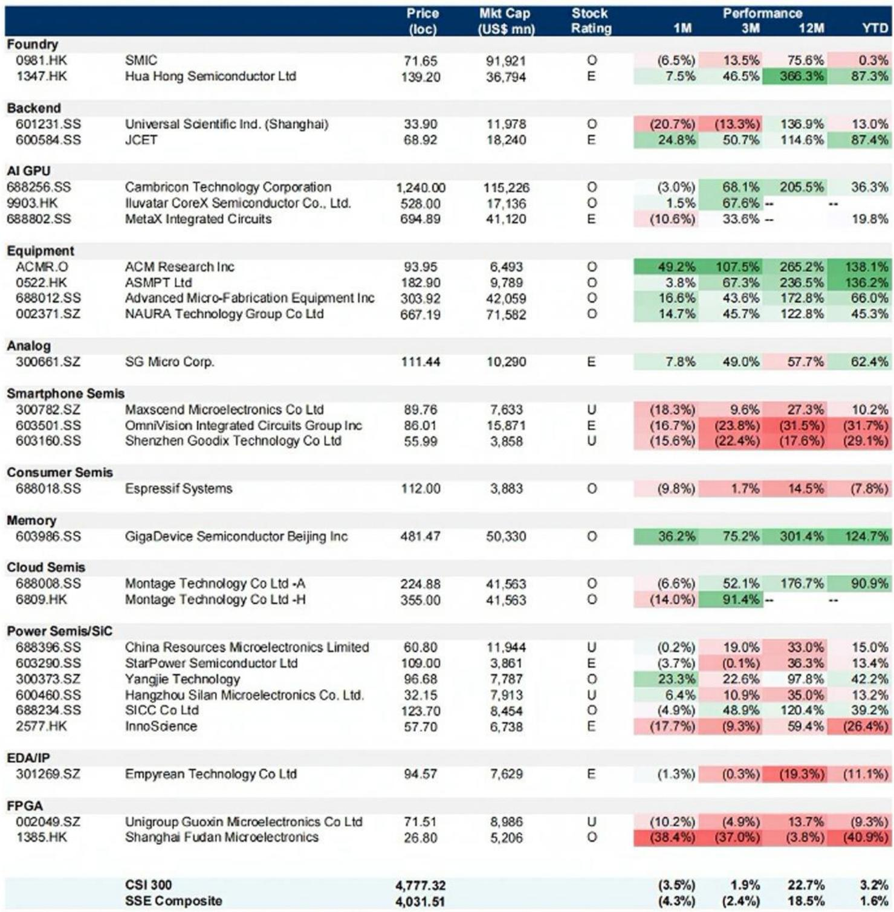
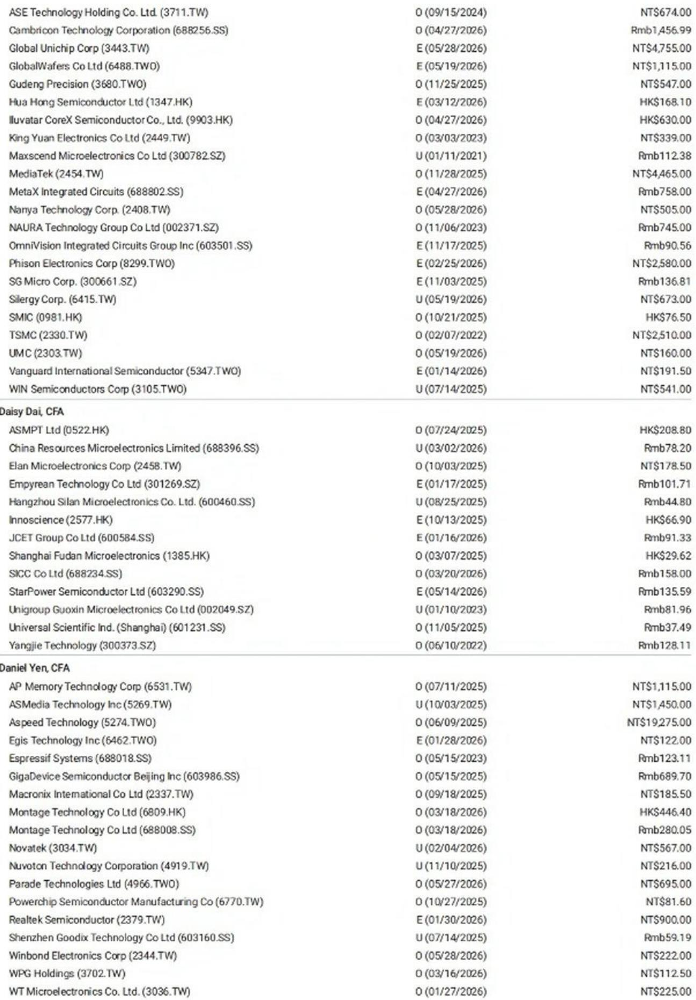
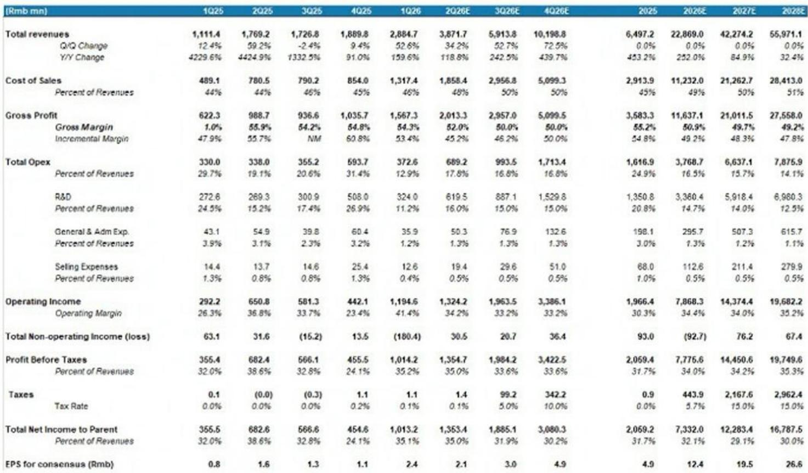

# 摩根斯坦利：MS：中国AI芯片TAM上调36%，但真正的变量不在国内

当美国商务部在6月初悄然收紧对中资海外子公司获取最先进AI芯片的管制时，大多数人的第一反应是“又一轮利空”。但MS最新发布的这份中国半导体本土化追踪报告，给出了一个反直觉的判断：这恰恰是中国AI GPU的“牛市情景”。

报告将中国AI芯片可寻址市场（TAM）从670亿美元大幅上调至910亿美元，增幅36%，对应2025-2030年23%的年复合增长率。这个数字背后，核心驱动力并非国内需求的线性增长，而是一个此前未被纳入测算的新变量：中国云服务商的海外数据中心，将开始采用本土GPU。

这不是一份简单的“国产替代”叙事。它揭示了一个正在发生的结构性转折：当海外供应通道被系统性收窄，中国AI基础设施的投资逻辑正从“被动替代”转向“主动扩张”。而后者，才是真正值得产业决策者和投资者重新审视的底层变化。

---

## 1. 最关键的增量来自海外：中国GPU的“出海”假设被首次纳入

报告上调TAM的第一条理由，是新增了“中国CSP（云服务商）海外AI数据中心使用本土GPU”这一类别。MS的假设是：2028至2030年，中国云厂商海外资本开支中分别有3%、10%、20%将由本土芯片满足。

这个假设的含金量在于它打破了两个固有认知。第一，此前市场普遍认为中国AI芯片只能在国内市场消化，海外需求几乎为零。第二，即便在短期，中国云厂商面临算力缺口时，首选方案仍是GPU租赁而非本地采购——这本身就意味着海外数据中心的需求真实存在，只是供应链尚未切换。

> **KC评论：** MS把“海外采用”放进TAM模型，本质上是在押注一个闭环逻辑：美国管制越紧，中国云厂商在海外越难买到英伟达Blackwell，就越有动力在自己的海外数据中心里测试和部署国产GPU。这个假设到2028年才起量，但方向比数字重要。

这份报告最值得深读的部分，是它对“海外采用”背后供应链可行性的拆解——包括哪些企业已经具备CCATS（商品分类自动跟踪系统）审批、能够获取台积电先进制程产能，以及国内先进节点产能何时能够形成稳定供应。这些细节决定了3%到20%的渗透率假设是否可信。

---

## 2. 字节跳动的万亿美元算力野心，正在重新定义需求天花板

报告上调TAM的另一大驱动，是字节跳动2026-2027年资本开支的激增。根据媒体报道，字节跳动2027年资本开支在条件允许下可能达到1000亿美元。MS将其保守设定为800亿美元（约合5420亿元人民币），并将其纳入TAM测算。

这个数字的冲击力需要放在中国CSP的竞争格局中理解。目前中国AI芯片需求高度集中在少数大买家手中：字节跳动、阿里巴巴、腾讯是第一梯队；电信运营商、国企和地方政府构成“主权AI”采购的第二梯队；AI初创公司和车企是第三梯队。字节跳动一家的大幅扩张，足以对整个TAM产生系统性影响。

> **KC评论：** 字节跳动的资本开支计划不是孤立的公司动作。它意味着中国AI军备竞赛的节奏正在被重新定义。如果字节能在2027年达到接近万亿人民币级别的算力投入，其他CSP必须跟进，否则将在模型能力和云业务上被彻底甩开。这份报告对TAM的上调，实际上隐含了对“军备竞赛加速”的判断，而不仅仅是单一公司的扩表。

报告在字节之外，还新增了金山云的数据库——其2026年资本开支预计超过150-200亿元人民币，用于满足爆发式增长的AI和云需求。这说明需求端的扩散正在从头部向二线云厂商蔓延。

---

## 3. 2026年是国内供应商进入CSP采购体系的“资格赛”窗口

报告基于近期中国实地调研指出，尽管主要CSP仍在持续扩容，但算力短缺问题并未缓解，而供应商资质认证活动正在加速。MS明确判断：2026年将是国内供应商进入CSP采购体系的关键年份。

这意味着什么？过去几年，国内AI芯片公司虽然产品迭代不断，但在CSP的大规模采购中始终处于“试用”阶段。2026年，这个窗口可能正式打开。但竞争的门槛已经显著提高——不再只是芯片算力指标的对决，而是生态成熟度、软件优化能力和集群部署能力的综合竞争。

> **KC评论：** 很多投资者关注的是国产芯片的单卡算力能否对标英伟达，但这可能不是2026年真正的筛选标准。CSP采购的是“集群可用算力”和“部署效率”，单卡性能只是起点。谁的软件栈能更快适配现有框架、谁的大规模集群稳定性更好，谁才能通过资格赛。这份报告对“生态成熟度”的强调，值得所有关注国产AI芯片的人反复读。

在供应端，能够获得台积电先进制程（如7nm/6nm）的企业仍然享有成本和功耗优势——例如报告提到的沐曦（Iluvatar）。而国内先进节点产能（除中芯南方外）预计要到2027-2028年才能形成更稳定的本地供应链，这意味着未来两年的竞争格局仍将受到制程获取能力的深刻影响。

---

## 4. 自给率从42%到70%：这个数字背后的假设需要被验证

报告预计中国AI芯片自给率将从2025年的42%提升至2030年的70%。这个预测比市场普遍预期更为乐观。支撑它的核心变量有两个：先进节点产能扩张和芯片性能持续提升。

但这里有一个尚未完全回答的关键问题：70%的自给率，意味着中国AI芯片市场到2030年将有超过630亿美元的份额由本土企业占据。按当前收入体量计算，这要求本土AI芯片公司未来五年的复合增长率远超行业平均。哪些公司能够兑现这个增长？是寒武纪、沐曦，还是其他尚未上市的玩家？

> **KC评论：** 自给率假设是整份报告最敏感的变量。如果产能扩张或性能提升任何一个环节不及预期，70%的目标就可能被打破。这也是为什么报告对中芯国际和华虹半导体给出了增持或等权重评级——它们是整个自给率故事的基础设施支撑，没有足够的先进制程产能，自给率就是空中楼阁。

报告对自给率的乐观，还隐含了一个判断：中国AI芯片的性能差距正在以比市场预期更快的速度缩小。但这个判断目前缺乏公开的第三方基准测试数据支撑。这是投资者需要持续追踪的关键验证点。

---

## 5. 设备国产化正在加速，但进口数据揭示了一个结构性矛盾

报告显示，中国半导体设备进口在2026年4月同比下降6%，三个月移动平均同比增速为-9%，较3月的-14%有所收窄。但分国别看，来自美国、荷兰、韩国和日本的进口同比分别下降43%、22%、23%和28%。唯一增长的是来自新加坡的进口，同比上升43%。

这个数据组合揭示了一个结构性矛盾：中国正在加速推进设备国产化，但短期内仍无法完全摆脱对海外关键设备的依赖。来自新加坡的进口大增，可能意味着部分设备正在通过第三国渠道流入，但这并不能从根本上解决先进制程设备的供应问题。

MS预计2026年中国WFE（晶圆制造设备）市场将同比增长16%至480亿美元，主要由存储器和先进节点产能扩张驱动。在这个背景下，本土设备商的份额有望进一步提升——报告看好的标的中，北方华创、中微公司和ACM Research均被列为增持。

> **KC评论：** 设备国产化是整条半导体本土化链条中最慢、但也是最关键的一环。报告对本土设备商的乐观，建立在“中国WFE TAM持续扩大”和“国产份额持续提升”的双重假设上。但进口数据的下降幅度需要被密切关注——如果下降是因为国产替代真正发生，那是好事；如果是因为设备被限制无法到货，那就是供应瓶颈的信号。这两者之间的区别，报告没有完全展开，但值得每一个关注这个赛道的人自己追踪。

---

## 6. 报告没有完全回答的关键问题：海外采用的真实可行性

尽管报告将“海外采用”作为TAM上调的核心增量，但这一假设面临几个尚未被充分论证的挑战。

首先是性能验证。中国AI芯片在海外数据中心与英伟达GPU的直接竞争，不仅需要单卡算力达标，更需要软件生态、集群效率、功耗控制等综合指标达到可接受水平。目前公开信息中，尚缺乏中国AI芯片在海外大规模部署的案例。

其次是地缘政治风险。即便中国AI芯片通过第三国渠道进入海外市场，美国是否会进一步扩大管制范围、限制含有美国技术的中国芯片出口？这不是一个可以轻易排除的风险。

最后是时间窗口。报告假设海外采用从2028年开始起量，但届时英伟达的下一代产品（可能超越Rubin架构）已经推出，性能差距是否会被再次拉大？这是一个需要持续跟踪的问题。

**这些未解问题，恰恰是这份报告最有价值的部分——它提出了一个足够大胆的假设，但没有回避其中的不确定性。对于真正想理解中国半导体本土化中长期逻辑的读者，完整报告中对每家公司产品路线图、产能规划和竞争壁垒的详细拆解，才是做出独立判断的起点。**

---

每天，我们的团队通过AI agent加人工review，从MS、GS、JPM等国际投行的最新研报中，提炼出10-40页的中文摘要与KC评论，同时整理当天最新数据图表合集。这些内容既方便你喂给AI做进一步分析，也方便你快速把握市场dynamics。如果你对这份中国AI芯片本土化报告中的海外采用假设、自给率路径或具体标的估值有进一步讨论的兴趣，欢迎来我们的星球微信群继续交流。

Personal reading notes and learning share only. Not investment advice.

