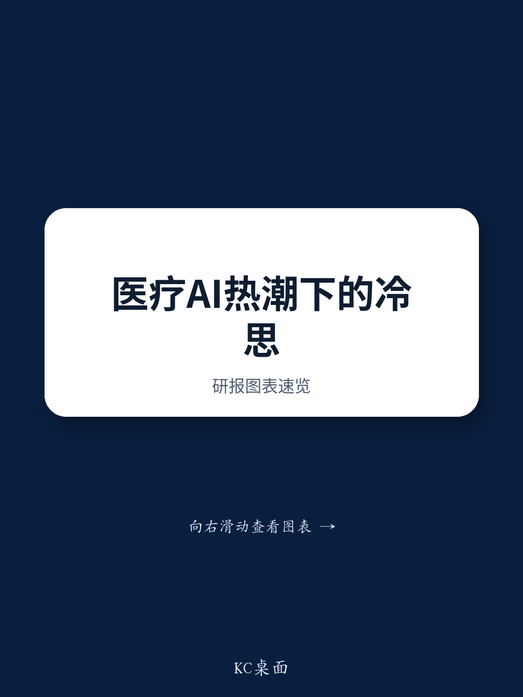
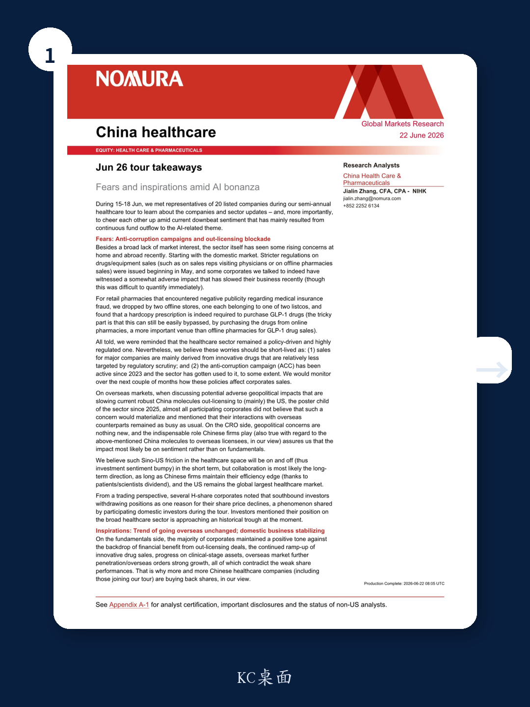
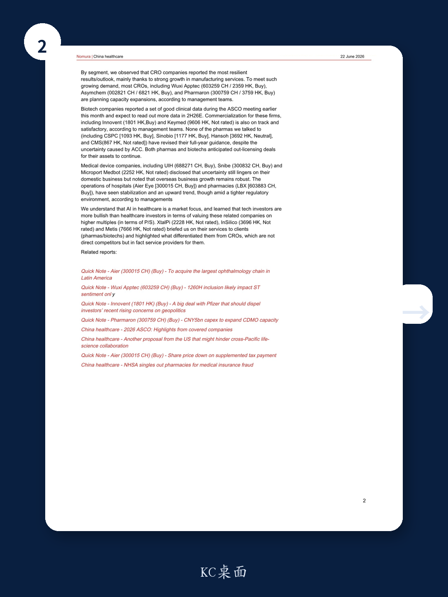

# NOM：中国医疗板块的“恐惧”与“灵感”，AI之外还有结构性机会

当市场几乎将所有注意力都倾注于AI主题时，中国医疗板块正经历着一场由资金流出引发的情绪低谷。NOM在2025年6月15日至18日的半年度医疗产业调研中，与20家上市公司管理层进行了深入交流，其结论与当前市场悲观情绪形成了鲜明对比：基本面正在改善，但市场尚未定价。

这份调研报告的核心判断是：中国医疗板块正处在一个“恐惧与灵感并存”的关键节点。恐惧来自国内反腐政策的持续深化、海外地缘政治对license-out的潜在封锁，以及医保基金监管的收紧；而灵感则来自于企业海外扩张的不可逆趋势、创新药销售的持续爬坡，以及CRO/CDMO领域强劲的产能扩张需求。报告认为，短期情绪波动无法掩盖长期结构性机会，而当前资金配置已接近历史低位，这本身就是一个值得关注的信号。

## 1. 资金持续流出AI主题，医疗板块配置已近历史冰点

调研中一个反复出现的现象是，无论是南向资金还是国内机构投资者，都在持续从医疗板块撤出，转而涌入AI相关主题。多家H股上市公司管理层直言，南向投资者的减持是其股价下跌的直接原因之一。参与调研的国内投资者也承认，其医疗板块的整体仓位已接近历史最低水平。

这一现象意味着什么？NOM分析师张佳琳团队认为，这并非基本面恶化所致，而是一种典型的“主题轮动”效应。当AI成为市场唯一的热点，资金集中度达到极端水平时，其他板块必然面临失血。但经验表明，当某一板块的配置比例降至历史冰点时，往往也意味着最悲观的预期已经充分定价，后续任何边际改善都可能引发估值修复。

> **KC评论：** 这不是一个简单的“别人恐惧我贪婪”的口号。关键在于理解，当前医疗板块的估值压缩并非源于盈利下调，而是单纯的资金搬家。一旦AI主题出现阶段性调整或医疗板块出现超预期的催化剂，资金回流的弹性可能非常可观。完整报告中包含了各细分赛道的估值分位图和资金流向数据，这些图表能帮你更精确地判断“冰点”的具体位置。

## 2. 国内反腐政策短期扰动难免，但创新药企业受影响有限

5月以来，针对药品和器械销售行为的更严格监管措施陆续出台，包括限制销售代表拜访医生、规范线下药店销售等。调研中部分企业确实反映这些政策对近期业务产生了负面影响，但量化影响较为困难。

NOM的分析框架给出了两个关键判断：第一，主要上市公司的收入来源以创新药为主，这类产品受监管审查的力度相对较小；第二，自2023年启动的反腐运动已持续两年，行业在某种程度上已经适应了这种监管环境。因此，这些担忧应该是短暂的。

但需要警惕的是，零售药店领域出现了新的风险点。医保基金欺诈问题被监管部门点名，这对连锁药店的合规经营提出了更高要求。调研团队实地走访了两家上市药店，发现购买GLP-1药物确实需要纸质处方——但这一规定很容易被绕过，因为线上药店才是GLP-1药物销售的主要渠道。

> **KC评论：** 这里有一个容易被忽略的二阶效应：监管收紧可能会加速行业洗牌，头部合规企业反而受益。但药店板块的医保欺诈风险尚未完全出清，后续的监管细则和处罚力度将是关键变量。完整报告中对每家公司的合规敞口做了详细拆解，这对于判断个股风险至关重要。

## 3. 海外扩张趋势不可逆，地缘政治更多影响情绪而非基本面

海外市场是当前中国医疗板块最大的结构性亮点，也是市场最大的担忧来源。2025年以来，中国分子向海外（主要是美国）的license-out交易持续火爆，成为板块最重要的催化剂。但当被问及地缘政治风险是否会阻碍这一趋势时，几乎所有参会的上市公司都表示“不认为这种担忧会成真”，并强调他们与海外合作伙伴的沟通依然繁忙如常。

对于CRO企业而言，地缘政治担忧更是老生常谈。NOM的判断是，中国企业不可替代的角色决定了实际影响更多停留在情绪层面。只要中国企业保持效率优势（得益于病人/科学家红利），而美国仍是全球最大的医疗市场，合作就将是长期方向。

这一判断与近期药明康德被美国NDAA法案纳入“1260H清单”的事件形成对照。NOM在另一份报告中明确指出，这一事件对药明康德的影响“仅限于短期情绪”，不改变基本面。调研中CRO企业的产能扩张计划也从侧面印证了这一判断——药明康德、康龙化成、凯莱英等头部企业均在规划新的产能扩张。

## 4. CRO/CDMO景气度最高，生物科技和制药企业基本面稳健

按细分领域来看，CRO/CDMO企业给出了最具韧性的业绩展望，主要得益于制造服务（CDMO）的强劲增长。为了满足持续增长的需求，包括药明康德、凯莱英、康龙化成在内的多数CRO企业都在规划产能扩张。

生物科技企业在ASCO会议上公布了一系列良好的临床数据，并预计2026年下半年将有更多数据读出。信达生物、科济医药等企业的商业化进程也符合预期。制药企业方面，石药集团、中国生物制药、翰森制药、中国中药等均未因反腐政策的不确定性而调整全年指引。

医疗器械企业包括联影医疗、新产业生物、微创医疗机器人等，虽然国内业务仍面临不确定性，但海外业务增长依然强劲。爱尔眼科、老百姓等医院和药店的经营也已经出现稳定和上升趋势。

## 5. AI+医疗是市场焦点，但估值逻辑与传统CRO截然不同

调研中一个有趣的发现是，AI在医疗领域的应用确实是市场关注的焦点，但科技投资者和医疗投资者对此的估值逻辑存在显著差异。科技投资者更愿意用P/S倍数来评估这些公司，给出的估值水平远高于医疗投资者。

晶泰科技、英矽智能、未知君等AI+医疗企业向调研团队介绍了他们的服务模式，并强调了他们与传统CRO的区别——他们不是直接竞争对手，而是服务提供商。这一区分至关重要：传统CRO的估值逻辑基于订单和产能，而AI+医疗公司的估值更多取决于技术平台的价值和潜在颠覆性。

> **KC评论：** 这里有一个尚未被充分讨论的问题：AI+医疗公司到底应该被归类为“科技股”还是“医疗股”？不同的分类决定了完全不同的估值框架和资金属性。如果市场最终将其归入科技板块，当前估值可能还有空间；但如果以医疗股的标准来衡量，很多公司的P/S倍数已经相当昂贵。关于这一点的深入分析和可比公司估值表，在完整报告中有详细展开。

## 6. 三个未解问题：报告没有完全回答的关键变量

尽管NOM这份调研提供了大量一手信息，但仍有几个关键问题需要持续跟踪：

第一，反腐政策的长期影响边界在哪里？报告指出创新药受影响较小，但并未量化如果监管范围扩大，对仿制药和传统中药企业的冲击有多大。

第二，美国生物安全法案的最终落地形态仍不确定。虽然企业端反馈乐观，但政治层面的博弈存在不可预测性。报告本身也承认“中美在医疗领域的摩擦将时断时续”，这意味着投资情绪在短期内仍会波动。

第三，AI+医疗公司的商业化路径仍不清晰。它们强调自己不是CRO的竞争对手，但尚未证明自己能够创造独立于传统CRO之外的价值。技术平台的价值兑现需要更长的验证周期。

## 文末指引

如果你对以下问题感兴趣：当前医疗板块各细分赛道的估值分位具体在哪里？哪些CRO企业的产能扩张计划最具确定性？AI+医疗公司与传统CRO的估值差异有多大？欢迎加入我们的知识星球社群。

每天，我们会由AI agent加上人工review，生成国际投行中文摘要与KC评论，daily更新约10-40页，同时整理当天最新数据图表合集。这份内容既方便你直接喂给AI做进一步分析，也方便人工快速把握全球市场的动态变化。我们每天在星球微信群里继续讨论这些未解问题的进展。

Personal reading notes and learning share only. Not investment advice.

