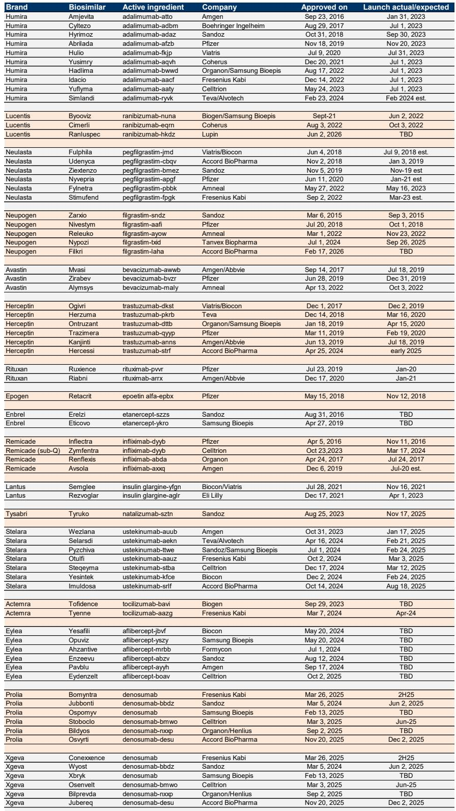
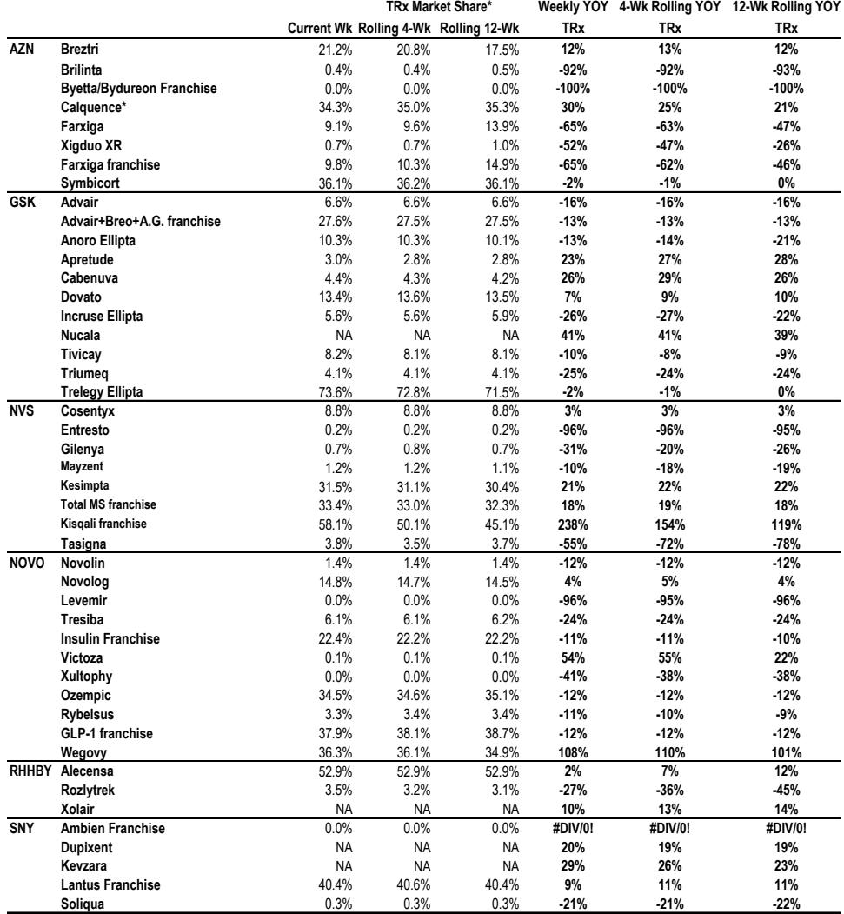
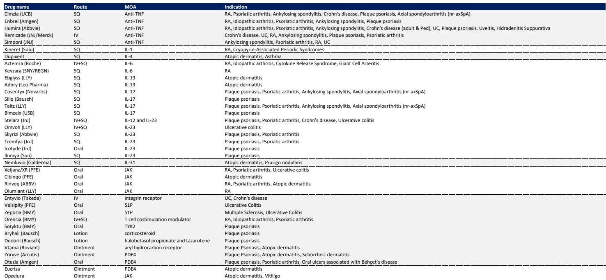

# 摩根斯坦利：MS：新药放量正在改写美国处方药市场的竞争规则

美国处方药市场正在经历一场静水深流的格局重塑。在整体处方量增速放缓至1%左右的大背景下，少数新药正在以远超历史对标的速度撕开市场缺口，而另一些曾经的现象级产品则在生物类似药和竞争替代的双重挤压下加速失血。

MS最新发布的美国药品市场追踪报告，以IQVIA处方数据为锚，揭示了这一结构性分化。报告的核心判断并非总量层面的惊喜或恐慌，而是一个更值得产业决策者关注的信号：新药放量的斜率，正在成为区分赢家与输家的关键分水岭。

对于关注生物医药投资的读者来说，这份报告的价值不在于它复述了哪些药卖得好，而在于它用处方数据这条“硬线”，量化了市场共识预期与真实放量轨迹之间的差距。这些差距，恰恰是投资判断中最重要的变量。

> **KC评论：** MS这份报告的核心价值在于“校准”。它不提供宏大叙事，而是用每周处方数据去检验市场共识的合理性。对于投资者而言，真正重要的不是知道某个药卖了多少，而是知道它目前的放量速度能否支撑华尔街的营收预期——如果不能，预期差本身就是机会或风险。

## 1. 整体市场增速已降至1%附近，但结构性分化远比总量数字更剧烈

截至6月12日当周，美国全市场总处方量同比增速仅为0.6%，低于前一周的0.9%和过去12周滚动均值1.1%。4周滚动同比增速为1.0%，12周滚动为1.1%。这意味着美国处方药市场已经进入一个低增速的稳态区间。

但总量数字掩盖了剧烈的结构性变化。在GLP-1赛道，诺和诺德和礼来的双头垄断格局依然稳固，但增速正在分化。诺和诺德的Ozempic和Wegovy周处方量分别稳定在51.8万和47.5万的水平，礼来的Mounjaro和Zepbound合计周处方量已接近157.7万。值得注意的是，Zepbound的12周滚动同比增速高达83%，但单周同比增速已回落至49%，这提示放量曲线正在从陡峭的早期爬坡转向更为平缓的成熟期。

与此同时，传统重磅药物的衰退速度同样值得关注。Humira的处方量同比下跌接近50%，Revlimid和Pomalyst的跌幅更是分别达到69%和86%。生物类似药的渗透正在系统性地重塑这些曾经的现象级产品的生命周期曲线。

> **KC评论：** 1%的整体增速意味着市场总量几乎不再提供beta收益。所有超额回报必须来自alpha——也就是押中那些放量斜率远超市场平均的新药。这正是MS这份报告最擅长回答的问题：哪些新药的处方数据正在“超预期”，哪些正在“不及预期”？

## 2. Cobenfy的放量轨迹正在检验一个关键假设：精神分裂症市场能否容纳一个口服新星

BMY的Cobenfy（精神分裂症适应症，2024年9月获批）是这份报告中最值得关注的早期放量案例之一。最新一周处方量约为3200张，略低于前一周的3430张。从绝对数字看，这个量级并不惊人。

但MS的分析揭示了一个关键问题：要达到2026年市场共识预期的2.96亿美元营收，Cobenfy的处方量需要达到历史对标产品（Rexulti、Caplyta、Lybalvi在精神分裂症适应症中的放量）的2至5倍。这是一个极高的门槛。

报告给出的测算逻辑很清晰：假设净价约1450美元，2026年需要约19.7万张总处方。而目前每周3000多张的处方量，折年化仅约15-16万张。这意味着Cobenfy需要在未来18个月内实现处方量的倍数级增长。

这里的关键不确定性在于：Cobenfy作为首个非D2受体机制的精神分裂症药物，其临床差异化能否转化为处方医生的广泛接受？早期处方数据尚未显示出突破性的放量斜率，但考虑到精神分裂症患者群体的慢病属性，医生对新机制的处方采纳可能需要更长的观察期。

> **KC评论：** Cobenfy的案例完美展示了处方数据如何检验市场共识。华尔街的2.96亿美元预期隐含了一个相当激进的放量假设。如果未来几个季度的处方数据不能加速，这个预期就面临下修风险。完整报告中对历史对标产品的详细放量曲线对比，是理解这一判断的关键图表。

## 3. Yeztugo的PrEP市场突破正在验证一个更大逻辑：预防医学的支付方接纳度正在提升

GILD的Yeztugo（lenacapavir，2025年6月获批用于PrEP）是另一个值得深入拆解的案例。最新周处方量约为1720张（口服+注射），其中注射剂约980张。从绝对量看，这个数字仍处于早期爬坡阶段。

但MS指出了一个更积极的信号：Yeztugo已经获得了95%的支付方覆盖，且大多数支付方不要求共付额，仅少数有事先授权或阶梯治疗要求。这被解读为支付方正在与USPSTF指南保持一致，对长效PrEP方案的接纳度显著高于预期。

更重要的是，PrEP整体市场正在以14%的同比增长加速扩张，Descovy的市场份额仍维持在45%以上。这意味着Yeztugo不是在零和博弈中抢夺存量，而是在一个快速扩大的市场中获取增量。

MS对GILD 2026年PrEP营收的预测为美国11.48亿美元（全球11.55亿美元），远高于Visible Alpha共识的9.56亿美元（全球10.25亿美元）。这份乐观预期能否被处方数据验证，将是未来几个季度的核心看点。

> **KC评论：** Yeztugo的案例揭示了一个容易被忽视的投资逻辑：预防医学的市场天花板可能比治疗药物更高。当支付方愿意为预防性用药提供几乎无障碍的覆盖时，市场扩容速度往往会超出线性外推。完整报告中对Yeztugo与Descovy、Apretude的放量对比图表，以及基于1Q26每处方收入对2Q26共识的测算，是理解这一逻辑的必读材料。

## 4. Journavx的GTN谜题：急性疼痛市场的定价权博弈远未结束

VRTX的Journavx（急性疼痛，2025年1月获批）是另一个需要密切追踪处方数据的案例。最新周处方量约为2.24万张，环比略有增长。但真正的问题在于Gross-to-Net（GTN）折扣率。

MS的测算显示，要达到2026年Visible Alpha共识的2.39亿美元营收，在12天处方疗程的假设下，GTN为50%时需要约120万张总处方，GTN为70%时则需要约210万张。基于过去几个季度的销售与处方数据反推，报告估计Journavx的实际GTN在65%-75%之间。

这意味着Journavx的真实净价可能远低于标价，而处方量的增长必须足够快才能弥补定价上的折让。VRTX管理层指出，医院处方未被IQVIA数据完全捕捉，且平均处方疗程已从14天降至10-11天，预计2026年将回升。这些因素都会影响最终的营收转化率。

> **KC评论：** Journavx的GTN谜题是这份报告中最值得投资者反复推敲的部分。它提醒我们，处方量只是营收方程的一半，另一半是净价。当市场共识隐含的GTN假设与真实数据出现偏差时，预期差就会产生。完整报告中对Journavx在不同GTN假设下的处方量路径测算图，是理解这一风险的最佳工具。

## 5. 报告尚未完全回答的关键问题：生物类似药的渗透速度是否会加速

MS在这份报告中提供了全面的生物类似药渗透追踪数据，覆盖Actemra、Avastin、Humira、Stelara、Prolia等十余个品种。数据显示，Stelara生物类似药中，Biocon的Yesintek已占据约39%的处方份额，AMGN的Wezlana约12%；Prolia生物类似药中，Sandoz的Jubbonti约25%，Celltrion的Stoboclo约12%，而品牌药Prolia的份额已降至约56%。

但报告没有完全回答的问题是：生物类似药的渗透速度是否会因为支付方政策的收紧而进一步加速？特别是在Stelara和Humira这类曾经的重磅产品上，生物类似药的价格优势正在被越来越多的PBM（药品福利管理公司）纳入优选目录。如果渗透速度超出当前模型的假设，品牌药的营收衰退曲线可能会比预期更陡峭。

这一问题对于持有ABBV、JNJ等公司股票的投资者尤为重要。Humira的处方量同比已跌去近50%，但Skyrizi和Rinvoq的增长能否完全对冲这一损失，仍需持续验证。

## 6. 投资者的观察框架：从“总量思维”转向“放量斜率思维”

综合MS这份报告的核心信息，我们认为投资者需要建立一个新的分析框架：不再过度关注市场总量的季度波动，而是聚焦于新药放量斜率与市场共识预期之间的差距。

这个框架包含三个层次：第一，确认新药所在治疗领域的市场增速是否健康（如PrEP市场14%的增长）；第二，评估新药的处方放量斜率是否达到或超过历史对标产品的早期轨迹；第三，将处方数据与GTN假设结合，反推营收能否达到共识预期。

Cobenfy、Yeztugo、Journavx和Icotyde（JNJ的银屑病口服IL-23抑制剂）这四个案例，恰好代表了四种不同类型的放量斜率挑战。它们的共同点在于：处方数据正在成为检验市场共识的最直接工具，而任何偏离都可能带来股价的重新定价。

> **KC评论：** 这份报告的终极价值在于它提供了一套“可操作的验证框架”。投资者不需要等到季报发布，每周的IQVIA处方数据就能提前揭示趋势。但真正理解这些数据的含义，需要完整报告中的历史对标图表、GTN测算模型以及分析师对关键假设的讨论。

---

以上讨论只触及了MS这份报告的冰山一角。完整报告包含超过160张图表，覆盖了从GLP-1到阿尔茨海默病、从CDK4/6抑制剂到COVID疫苗的几乎所有重要治疗领域。更重要的是，报告中对每个新药的放量路径都做了与市场共识的交叉验证，这些测算背后的假设和敏感性分析，是无法在摘要中完全展开的。

我们每天会由AI agent结合人工review，生成国际投行中文摘要与KC评论，daily更新约10-40页，并整理当天最新数据图表合集。这份材料既方便喂给AI做进一步分析，也方便人工快速把握market dynamics。欢迎来星球微信群里继续讨论，一起追踪这些新药放量曲线的真实走向。

Personal reading notes and learning share only. Not investment advice.

