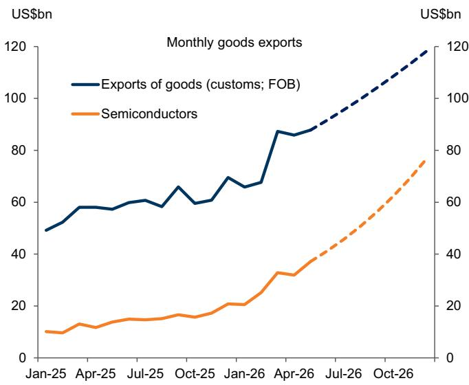
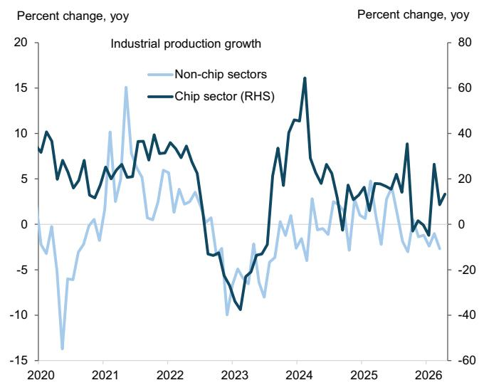
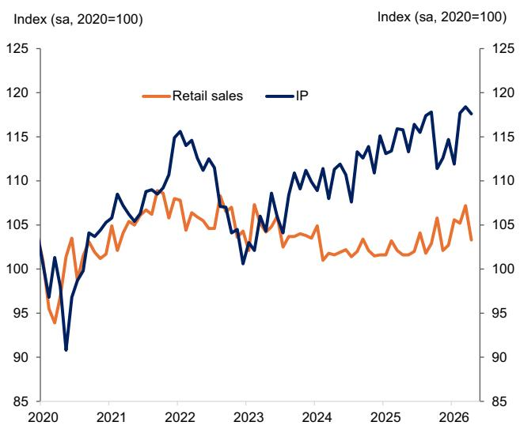
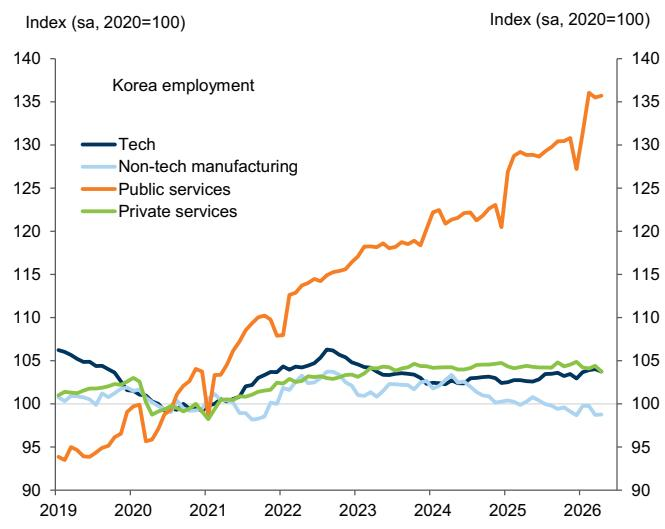
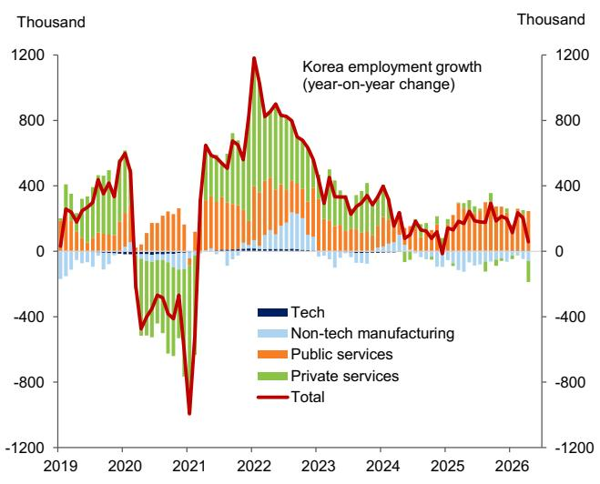
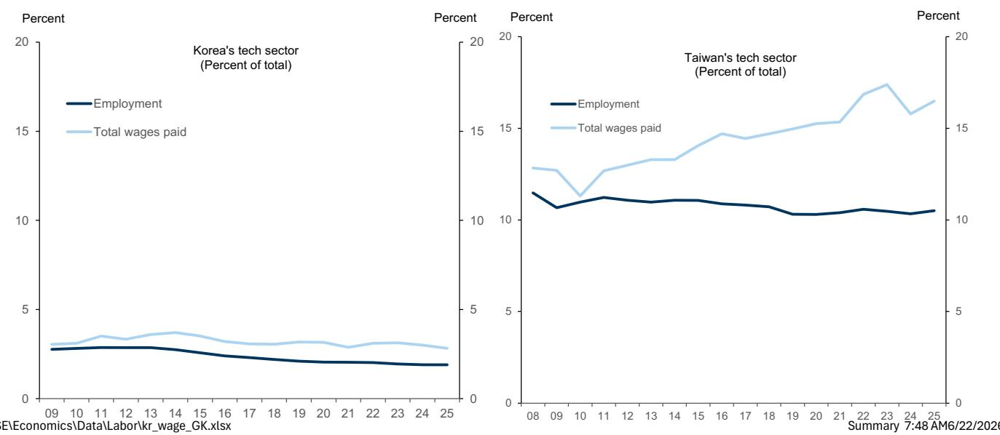
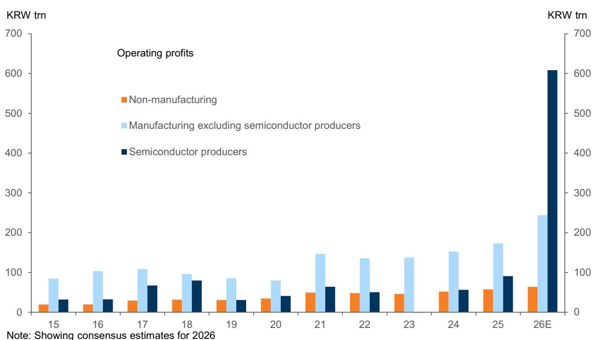
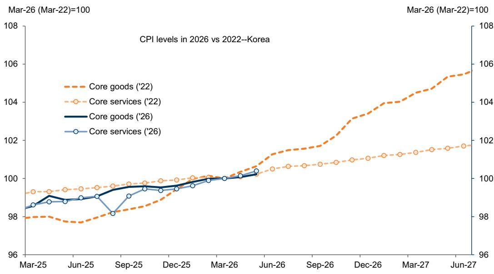
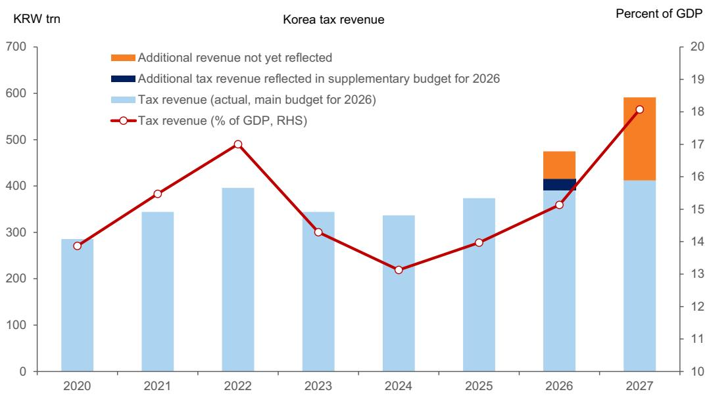
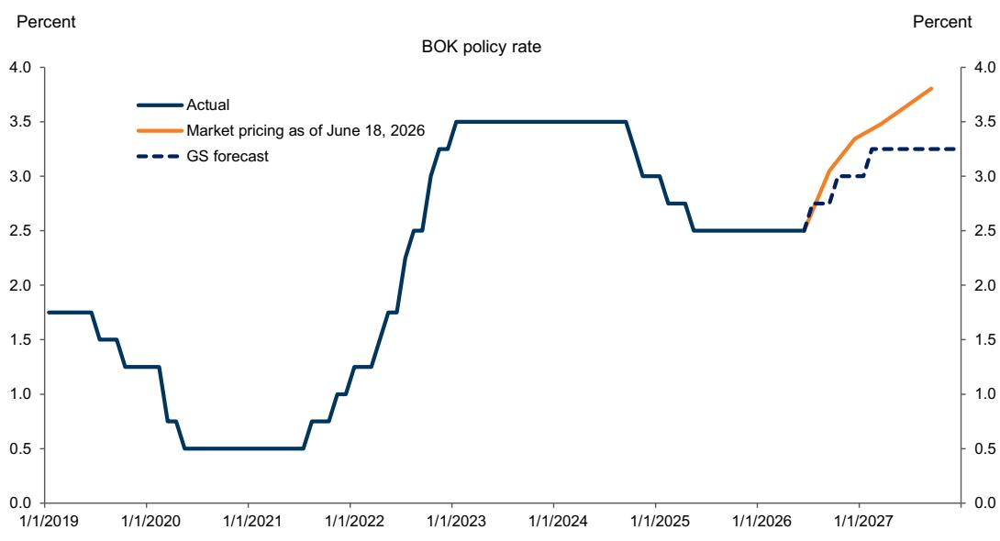

# Korea Views: Korea—Riding Stronger and Longer AI Tailwinds

The AI capex boom is proving stronger and longer than expected for Korea's chip cycle, as reflected in our tech team's upgrade to the memory demand outlook. We expect the AI-driven super surplus to accelerate into year-end, pushing total exports above USD1 trillion and the current account surplus to a record high of around 15% of GDP.

We raise our real GDP growth forecasts to 2.7% in 2026 (+10bp) and 2.3% in 2027 (+40bp), both above consensus, on a stronger and more durable AI impulse through capex, R&D, and wealth effects. We leave inflation unchanged at 2.6% and 2.2%, under our updated base-case scenario for reopening of the Strait of Hormuz, and extend the hiking cycle into 2027 and lift our terminal policy-rate forecast to 3.25% from 3.0%.

Domestic transmission remains uneven. First-half data show a wider gap between semiconductors and the rest of the economy: memory-led exports are surging, while non-tech exports, retail sales, consumption, and tech-sector job creation remain subdued. Wage and inflation spillovers also look contained. The tech wage base is small, and low margins elsewhere should limit broad wage inflation. We expect headline inflation pressure to come mainly from import prices and forex rates, while core goods inflation has remained contained this time, unlike in 2022. Housing risks are more localized. Seoul metropolitan area prices have re-accelerated since mid-May, but prices elsewhere remain stable.

Fiscal balances could be substantially stronger than projected a year ago. We estimate additional memory-related tax revenue of about 2% of GDP in 2026, which together with a recent decision to save some excess revenues could reduce the consolidated deficit from a planned 1.9% of GDP to less than 0.5% of GDP.

The stronger fiscal and external positions reinforce our market view: KRW looks too weak relative to fundamentals and the policy direction, while rates markets are pricing in an increasingly hawkish policy path. Policy is already leaning towards countering potential overheating, as reflected in hawkish guidance on monetary policy and the decision to avoid procyclical spending increases. KRW stabilization is likely to become a broad policy priority, given strong forex pass-through to inflation and equity-rally-related forex pressures from rebalancing needs and leveraged positions. Monetary tightening is unlikely to move rapidly, however, given still-limited domestic demand pressures and high household debt-service burdens. Risks to our updated policy-rate views are balanced: upside from wage pressures and downside from KRW appreciation.

## Goohoon Kwon, CFA

+852-2978-0048 | goohoon.kwon@gs.com GS (Asia) L.L.C.

Irene Choi
+82(2)3788-1722 | irene.choi@gs.com
GS (Asia) L.L.C., Seoul Branch

Andrew Tilton
+852-2978-1802 |
andrew.tilton@gs.com
GS (Asia) L.L.C.

1. The AI boom is boosting Korea's chip demand more strongly and for longer than previously expected, as reflected in a recent upgrade to the memory demand outlook by our tech team.-Korea's current account reached a record high of $15\%$ of GDP in Q1, and we expect the AI-driven super surplus to accelerate into year-end, pushing total exports above USD1 trillion (Exhibit 1) and the current account surplus in excess of $15\%$ of GDP in 2026. High frequency data show that almost all the surplus in the first half was recycled offshore through record-high net foreign equity outflows (rebalancing needs and leveraged positions), weakening the KRW despite a sharp improvement in the current account balance (Exhibit 2).

Exhibit 1: Exports of goods on track to reach USD 1 trillion in 2026 on strong memory demand  
  
Source: Haver Analytics, GS Global Investment Research  
Exhibit 2: Recent surge in foreign equity outflows outweighed gains in the current account, weakening KRW

  
Source: Haver Analytics, GS Global Investment Research

2. We raise our growth forecasts to 2.7% in 2026 (+10bp) and 2.3% in 2027 (+40bp), both above consensus, on a stronger and more durable AI impulse (Exhibit 3). The revision is driven mainly by capex, including R&D, with a smaller contribution from wealth effects. Consistent with a recent BOK study, we keep the estimated wealth effect modest, reflecting the concentration of equity investors among wealthy and older households, higher local equity-market volatility, and small financial assets relative to property assets, similar to Australia. Our inflation forecasts remain unchanged at 2.6% and 2.2%, versus consensus of 2.7% and 2.1%, under our updated base-case scenario for reopening of the Strait of Hormuz, which assumes normalization in oil exports from Gulf producers by late August. In line with these macro revisions, we now forecast the hiking cycle to extend into 2027 with a terminal policy rate of 3.25%, up from 3.0% previously.

Exhibit 3: We expect growth meaningfully higher in 2027 than consensus

<table><tr><td colspan="4">Macro forecasts</td></tr><tr><td></td><td>2025</td><td>2026</td><td>2027</td></tr><tr><td colspan="4">Real GDP growth</td></tr><tr><td>GS forecast</td><td>1.1</td><td>2.7</td><td>2.3</td></tr><tr><td>BOK forecast</td><td></td><td>2.6</td><td>2.1</td></tr><tr><td>BBG consensus</td><td></td><td>2.6</td><td>2.0</td></tr><tr><td colspan="4">Headline CPI inflation</td></tr><tr><td>GS forecast</td><td>2.1</td><td>2.6</td><td>2.2</td></tr><tr><td>BOK forecast</td><td></td><td>2.7</td><td>2.3</td></tr><tr><td>BBG consensus</td><td></td><td>2.6</td><td>2.1</td></tr></table>

Source: GS Global Investment Research

3. The stronger AI cycle is lifting Korea's external balances and growth outlook, but its domestic transmission remains narrow. First-half data show a widening divergence between semiconductors and the rest of the economy (Exhibit 4). Memory-led exports continued to surge, while non-tech exports remained stagnant and retail sales stayed subdued (Exhibit 4). Overall consumption also remained soft, despite recent pickups in luxury goods sales.

Exhibit 4: K-shaped cycle—tech vs non-tech and production vs consumption  

  
Source: Haver Analytics, GS Global Investment Research

4. This uneven transmission is also visible in the labor market. Job growth has shifted increasingly toward public services, including healthcare, public administration, and defense, rather than the tech sector. Public services have more than fully accounted for job growth since 2025, after contributing less than $50\%$ in 2019. This reflects demographic headwinds and related government job programs that have expanded public employment for more than a decade, largely at the expense of non-tech manufacturing jobs (Exhibit 5). Overall labor markets remain lackluster, with subdued wage growth and little support from tech-sector hiring, as semiconductor job creation has been broadly flat since 2024 given the sector's heavy capex orientation.

Exhibit 5: Increasing dominance of public sector jobs in labor markets in Korea  
  
Source: Haver Analytics, Korea Statistics Office

5. The same limited labor-market transmission should also contain wage spillovers. Recent wage agreements at major semiconductor companies should have only a limited near-term impact on overall wage growth, given the small tech wage base. Tech-sector wages accounted for around 3% of total wage bills, or 1.2% of GDP in 2025—less than one-third of Taiwan’s share—while wage bills of major memory companies accounted for just 0.4% of GDP (Exhibit 6). Tech-sector wages are set to rise on strong chip earnings and related performance payments. Even so, we estimate that post-tax bonus payments at major memory companies would remain around 0.5% of GDP in 2026 and 0.9% of GDP in 2027, equivalent to a relatively small supplementary budget early this year. The main offsets are special-bonus payment terms, mostly in locked-up equities, and high tax rates of nearly 50%, reflecting the top personal income tax rate and various mandatory social contributions.

Exhibit 6: Korea's tech sector accounts for far smaller jobs and total wages paid than Taiwan  
  
Source: CEIC, Haver Analytics, GS Global Investment Research

6. The key question, then, is whether higher memory-sector wages could spill over to the rest of the economy. We think this spillover risk is constrained by weak profitability outside semiconductors. Nearly 80% of jobs are in non-manufacturing sectors such as retail, construction, education, and healthcare, where margins have historically been below 5%. Within manufacturing, non-tech profit margins have also weakened in recent years to cyclical lows of around 5%, due to sustained regional overcapacity and competitive global markets. The divergence in earnings is also stark: operating profits of semiconductor companies will rise more than 6 times year-on-year in 2026, compared with just 40% for non-tech listed companies and 10% for non-manufacturing companies (Exhibit 7).

Exhibit 7: Large divergence in profits between chip and other sectors  
  
Note: Showing consensus estimates for 2026

## Source: Quantiwise

7. With broader wage spillovers likely contained, inflation pressures should come mainly through imported goods prices and exchange rates. Headline inflation has picked up on surging energy prices, largely as expected. Core price pressures, however, remain contained. Core goods prices, excluding food and fuel, rose only moderately through May, unlike in 2022, when they had increased a cumulative 3.4% from March to December and 4.0% yoy in December (Exhibit 8). In contrast, core services prices, excluding eating out, utilities, and transportation services, increased only moderately in Korea in both cycles, rendering further support for limited second-round effects from imported inflation.

Exhibit 8: Korea's core goods prices have been stable relative to those during the post-pandemic inflation cycle  
  
Source: Haver Analytics, GS Global Investment Research

8. The main domestic policy concern, however, is shifting from broad inflation to localized financial-stability risks. Seoul metropolitan housing prices have re-accelerated since early May, while housing prices elsewhere have remained stable since early April, after initial signs of modest recovery. This stands in sharp contrast to the broad housing boom during the pandemic period (Exhibit 9). This combination points to a policy mix that can remain targeted rather than broadly restrictive, especially as stronger fiscal and external balances create additional room for macro stabilization as discussed before.

Exhibit 9: Housing prices in Seoul metropolitan area have recently re-accelerated but those elsewhere have remained stable

Source: Haver Analytics, Kookmin Bank

9. Fiscal balances in 2026 and 2027 could be substantially stronger than projected a year ago. The 2026 budget assumed a consolidated deficit of KRW52.7trn on KRW390trn of tax revenue. Given the sharp improvement in semiconductor earnings prospects, we estimate roughly KRW60trn of additional tax revenue (approximately $2\%$ of GDP) could be collected in 2026, on top of the KRW25trn already reflected in the government's March supplementary budget (Exhibit 10). As a result, the consolidated budget deficit could fall from a planned $1.9\%$ of GDP to less than $0.5\%$ of GDP, even if a second supplementary budget were passed in the second half with spending similar to the first one. $^{1}$ Semiconductor-related corporate tax upside could remain significant in 2027 as well, at roughly $5\%$ of GDP above the amounts projected last year.

Exhibit 10: The AI boom strengthens Korea's fiscal outlook materially  
  
Source: Haver Analytics, GS Global Investment Research

10. Korea's stronger external and fiscal positions together with narrow domestic transmission reinforce our market view: KRW looks too weak relative to fundamentals and policy direction, while rates markets price an increasingly more hawkish policy path (Exhibit 11). Policy is already leaning towards countering potential overheating. The government has chosen to save large excess revenues to lift growth potential rather than increase procyclical spending, while the BOK has provided hawkish guidance on monetary policy. KRW stabilization is likely to become a broad policy priority, given strong forex pass-through to inflation and equity-rally-related forex pressures from rebalancing needs and leveraged positions. Even so, monetary tightening is unlikely to proceed rapidly, given still-limited domestic demand pressures and an elevated household debt-service burden. The BOK is hence more likely to focus on managing inflation expectations and supporting broader policy efforts to counter overheating in metropolitan housing markets. Risks to our updated policy-rate views are balanced, with upside risk from wage pressures and downside risk from KRW appreciation.

Exhibit 11: Market pricing of policy rates is more hawkish than our view  
  
Source: Haver Analytics, GS Global Investment Research

## Disclosure Appendix

## Reg AC

We, Goohoon Kwon, CFA, Irene Choi and Andrew Tilton, hereby certify that all of the views expressed in this report accurately reflect our personal views, which have not been influenced by considerations of the firm's business or client relationships.

Unless otherwise stated, the individuals listed on the cover page of this report are analysts in GS' Global Investment Research division.

Contributing Authors: Goohoon Kwon, CFA GS (Asia) L.L.C., Irene Choi GS (Asia) L.L.C., Seoul Branch, Andrew Tilton GS (Asia) L.L.C..

Unless otherwise stated, the individuals listed in the Contributing Authors disclosure of this report are analysts in GS' Global Investment Research division.

## Disclosures

## Regulatory disclosures

## Disclosures required by United States laws and regulations

See company-specific regulatory disclosures above for any of the following disclosures required as to companies referred to in this report: manager or co-manager in a pending transaction; 1% or other ownership; compensation for certain services; types of client relationships; managed/co-managed public offerings in prior periods; directorships; for equity securities, market making and/or specialist role. GS trades or may trade as a principal in debt securities (or in related derivatives) of issuers discussed in this report.

The following are additional required disclosures: Ownership and material conflicts of interest: GS policy prohibits its analysts, professionals reporting to analysts and members of their households from owning securities of any company in the analyst's area of coverage. Analyst compensation: Analysts are paid in part based on the profitability of GS, which includes investment banking revenues. Analyst as officer or director: GS policy generally prohibits its analysts, persons reporting to analysts or members of their households from serving as an officer, director or advisor of any company in the analyst's area of coverage. Non-U.S. Analysts: Non-U.S. analysts may not be associated persons of GS & Co. LLC and therefore may not be subject to FINRA Rule 2241 or FINRA Rule 2242 restrictions on communications with a subject company, public appearances and trading in securities covered by the analysts.

Additional disclosures required under the laws and regulations of jurisdictions other than the United States
The following disclosures are those required by the jurisdiction indicated, except to the extent already made above pursuant to United States laws and regulations. Australia: GS Australia Pty Ltd and its affiliates are not authorised deposit-taking institutions (as that term is defined in the Banking Act 1959 (Cth)) in Australia and do not provide banking services, nor carry on a banking business, in Australia. This research, and any access to it, is intended only for “wholesale clients” within the meaning of the Australian Corporations Act, unless otherwise agreed by GS. In producing research reports, members of Global Investment Research of GS Australia may attend site visits and other meetings hosted by the companies and other entities which are the subject of its research reports. In some instances the costs of such site visits or meetings may be met in part or in whole by the issuers concerned if GS Australia considers it is appropriate and reasonable in the specific circumstances relating to the site visit or meeting. To the extent that the contents of this document contains any financial product advice, it is general advice only and has been prepared by GS without taking into account a client’s objectives, financial situation or needs. A client should, before acting on any such advice, consider the appropriateness of the advice having regard to the client’s own objectives, financial situation and needs. A copy of certain GS Australia and New Zealand disclosure of interests and a copy of GS’ Australian Sell-Side Research Independence Policy Statement are available at: https://www.goldmansachs.com/disclosures/australia-new-zealand/index.html. Brazil: Disclosure information in relation to CVM Resolution n. 20 is available at https://www.gs.com/worldwide/brazil/area/gir/index.html. Where applicable, the Brazil-registered analyst primarily responsible for the content of this research report, as defined in Article 20 of CVM Resolution n. 20, is the first author named at the beginning of this report, unless indicated otherwise at the end of the text. Canada: This information is being provided to you for information purposes only and is not, and under no circumstances should be construed as, an advertisement, offering or solicitation by GS & Co. LLC for purchasers of securities in Canada to trade in any Canadian security. GS & Co. LLC is not registered as a dealer in any jurisdiction in Canada under applicable Canadian securities laws and generally is not permitted to trade in Canadian securities and may be prohibited from selling certain securities and products in certain jurisdictions in Canada. If you wish to trade in any Canadian securities or other products in Canada please contact GS Canada Inc., an affiliate of The GS Group Inc., or another registered Canadian dealer. Hong Kong: Further information on the securities of covered companies referred to in this research may be obtained on request from GS (Asia) L.L.C. India: Further information on the subject company or companies referred to in this research may be obtained from GS (India) Securities Private Limited, Research Analyst - SEBI Registration Number INH000001493, 10th Floor, Ascent-Worli, Sudam Kalu Ahire Marg, Worli, Mumbai-400 025, India, Corporate Identity Number U74140MH2006FTC160634, Phone +91 22 6616 9000, Fax +91 22 6616 9001. GS may beneficially own 1% or more of the securities (as such term is defined in clause 2 (h) the Indian Securities Contracts (Regulation) Act, 1956) of the subject company or companies referred to in this research report. Investment in securities market are subject to market risks. Read all the related documents carefully before investing. Registration granted by SEBI and certification from NISM in no way guarantee performance of the intermediary or provide any assurance of returns to investors. GS (India) Securities Private Limited compliance officer and investor grievance contact details can be found at: https://www.goldmansachs.com/worldwide/india/documents/Grievance-Redressal-and-Escalation-Matrix.pdf, and a copy of the annual audit compliance report can be found at this link: https://publishing.gs.com/content/site/india-annual-compliance-report.html. Japan: See below. Korea: This research, and any access to it, is intended only for “professional investors” within the meaning of the Financial Services and Capital Markets Act, unless otherwise agreed by GS. Further information on the subject company or companies referred to in this research may be obtained from GS (Asia) L.L.C., Seoul Branch. New Zealand: GS New Zealand Limited and its affiliates are neither “registered banks” nor “deposit takers” (as defined in the Reserve Bank of New Zealand Act 1989) in New Zealand. This research, and any access to it, is intended for “wholesale clients” (as defined in the Financial Advisers Act 2008) unless otherwise agreed by GS. A copy of certain GS Australia and New Zealand disclosure of interests is available at: https://www.goldmansachs.com/disclosures/australia-new-zealand/index.html.
Russia: Research reports distributed in the Russian Federation are not advertising as defined in the Russian legislation, but are information and analysis not having product promotion as their main purpose and do not provide appraisal within the meaning of the Russian legislation on appraisal activity. Research reports do not constitute a personalized investment recommendation as defined in Russian laws and regulations, are not addressed to a specific client, and are prepared without analyzing the financial circumstances, investment profiles or risk profiles of clients. GS assumes no responsibility for any investment decisions that may be taken by a client or any other person based on this research report. Singapore: GS (Singapore) Pte. (Company Number: 198602165W), which is regulated by the Monetary Authority of Singapore, accepts legal responsibility for this research, and should be contacted with respect to any matters arising from, or in connection with, this research. Taiwan: This material is for reference only and must not be reprinted without permission. Investors should carefully consider their own investment risk. Investment results are the responsibility of the individual investor. United Kingdom: Persons who would be categorized as retail clients in the United Kingdom, as such term is

defined in the rules of the Financial Conduct Authority, should read this research in conjunction with prior GS on the covered companies referred to herein and should refer to the risk warnings that have been sent to them by GS International. A copy of these risks warnings, and a glossary of certain financial terms used in this report, are available from GS International on request.

European Union and United Kingdom: Disclosure information in relation to Article 6 (2) of the European Commission Delegated Regulation (EU) (2016/958) supplementing Regulation (EU) No 596/2014 of the European Parliament and of the Council (including as that Delegated Regulation is implemented into United Kingdom domestic law and regulation following the United Kingdom's departure from the European Union and the European Economic Area) with regard to regulatory technical standards for the technical arrangements for objective presentation of investment recommendations or other information recommending or suggesting an investment strategy and for disclosure of particular interests or indications of conflicts of interest is available at https://www.gs.com/disclosures/europeanpolicy.html which states the European Policy for Managing Conflicts of Interest in Connection with Investment Research.

Japan: GS Japan Co., Ltd. is a Financial Instrument Dealer registered with the Kanto Financial Bureau under registration number Kinsho 69, and a member of Japan Securities Dealers Association, Financial Futures Association of Japan Type II Financial Instruments Firms Association, and Investment Management Association of Japan. Sales and purchase of equities are subject to commission pre-determined with clients plus consumption tax. See company-specific disclosures as to any applicable disclosures required by Japanese stock exchanges, the Japanese Securities Dealers Association or the Japanese Securities Finance Company.

## Global product; distributing entities

GS Global Investment Research produces and distributes research products for clients of GS on a global basis. Analysts based in GS offices around the world produce research on industries and companies, and research on macroeconomics, currencies, commodities and portfolio strategy. This research is disseminated in Australia by GS Australia Pty Ltd (ABN 21 006 797 897); in Brazil by GS do Brasil Corretora de Títulos e Valores Mobiliários S.A.; Public Communication Channel GS Brazil: 0800 727 5764 and / or contatogoldmanbrasil@gs.com. Available Weekdays (except holidays), from 9am to 6pm. Canal de Comunicação com o Público GS Brasil: 0800 727 5764 e/ou contatogoldmanbrasil@gs.com. Horário de funcionamento: segunda-feira à sexta-feira (exceto feriados), das 9h às 18h; in Canada by GS & Co. LLC; in Hong Kong by GS (Asia) L.L.C.; in India by GS (India) Securities Private Ltd.; in Japan by GS Japan Co., Ltd.; in the Republic of Korea by GS (Asia) L.L.C., Seoul Branch; in New Zealand by GS New Zealand Limited; in Russia by OOO GS; in Singapore by GS (Singapore) Pte. (Company Number: 198602165W); and in the United States of America by GS & Co. LLC. GS International has approved this research in connection with its distribution in the United Kingdom.

GS International (“GSI”), authorised by the Prudential Regulation Authority (“PRA”) and regulated by the Financial Conduct Authority (“FCA”) and the PRA, has approved this research in connection with its distribution in the United Kingdom.

European Economic Area: GS Bank Europe SE (“GSBE”) is a credit institution incorporated in Germany and, within the Single Supervisory Mechanism, subject to direct prudential supervision by the European Central Bank and in other respects supervised by German Federal Financial Supervisory Authority (Bundesanstalt für Finanzdienstleistungsaufsicht, BaFin) and Deutsche Bundesbank and disseminates research within the European Economic Area.

## General disclosures

This research is for our clients only. Other than disclosures relating to GS, this research is based on current public information that we consider reliable, but we do not represent it is accurate or complete, and it should not be relied on as such. The information, opinions, estimates and forecasts contained herein are as of the date hereof and are subject to change without prior notification. We seek to update our research as appropriate, but various regulations may prevent us from doing so. Other than certain industry reports published on a periodic basis, the large majority of reports are published at irregular intervals as appropriate in the analyst's judgment.

GS conducts a global full-service, integrated investment banking, investment management, and brokerage business. We have investment banking and other business relationships with a substantial percentage of the companies covered by Global Investment Research. GS & Co. LLC, the United States broker dealer, is a member of SIPC (https://www.sipc.org).

Our salespeople, traders, and other professionals may provide oral or written market commentary or trading strategies to our clients and principal trading desks that reflect opinions that are contrary to the opinions expressed in this research. Our asset management area, principal trading desks and investing businesses may make investment decisions that are inconsistent with the recommendations or views expressed in this research.

We and our affiliates, officers, directors, and employees will from time to time have long or short positions in, act as principal in, and buy or sell, the securities or derivatives, if any, referred to in this research, unless otherwise prohibited by regulation or GS policy.

The views attributed to third party presenters at GS arranged conferences, including individuals from other parts of GS, do not necessarily reflect those of Global Investment Research and are not an official view of GS.

Any third party referenced herein, including any salespeople, traders and other professionals or members of their household, may have positions in the products mentioned that are inconsistent with the views expressed by analysts named in this report.

This research is focused on investment themes across markets, industries and sectors. It does not attempt to distinguish between the prospects or performance of, or provide analysis of, individual companies within any industry or sector we describe.

Any trading recommendation in this research relating to an equity or credit security or securities within an industry or sector is reflective of the investment theme being discussed and is not a recommendation of any such security in isolation.

This research is not an offer to sell or the solicitation of an offer to buy any security in any jurisdiction where such an offer or solicitation would be illegal. It does not constitute a personal recommendation or take into account the particular investment objectives, financial situations, or needs of individual clients. Clients should consider whether any advice or recommendation in this research is suitable for their particular circumstances and, if appropriate, seek professional advice, including tax advice. The price and value of investments referred to in this research and the income from them may fluctuate. Past performance is not a guide to future performance, future returns are not guaranteed, and a loss of original capital may occur. Fluctuations in exchange rates could have adverse effects on the value or price of, or income derived from, certain investments.

Certain transactions, including those involving futures, options, and other derivatives, give rise to substantial risk and are not suitable for all investors. Investors should review current options and futures disclosure documents which are available from GS sales representatives or at https://www.theocc.com/about/publications/character-risks.jsp and https://www.goldmansachs.com/disclosures/cftc\_fcm\_disclosures. Transaction costs may be significant in option strategies calling for multiple purchase and sales of options such as spreads. Supporting documentation will be supplied upon request.

Differing Levels of Service provided by Global Investment Research: The level and types of services provided to you by GS Global Investment Research may vary as compared to that provided to internal and other external clients of GS, depending on various factors including your individual preferences as to the frequency and manner of receiving communication, your risk profile and investment focus and perspective (e.g., marketwide, sector specific, long term, short term), the size and scope of your overall client relationship with GS, and legal and regulatory constraints. As an example, certain clients may request to receive notifications when research on specific securities is published, and certain clients may request that specific data underlying analysts' fundamental analysis available on our internal client websites be delivered to them electronically through data feeds or otherwise. No change to an analyst's fundamental research views (e.g., ratings, price targets, or material changes to earnings estimates for equity securities), will be communicated to any client prior to inclusion of such information in a research report broadly disseminated through electronic publication to our internal client websites or through other means, as necessary, to all clients who are entitled to receive such reports.

All research reports are disseminated and available to all clients simultaneously through electronic publication to our internal client websites. Not all research content is redistributed to our clients or available to third-party aggregators, nor is GS responsible for the redistribution of our research by third party aggregators. For research, models or other data related to one or more securities, markets or asset classes (including related services) that may be available to you, please contact your GS representative or go to https://research.gs.com.

Disclosure information is also available at https://www.gs.com/research/hedge.html or from Research Compliance, 200 West Street, New York, NY 10282.

## © 2026 GS.

You are permitted to store, display, analyze, modify, reformat, and print the information made available to you via this service only for your own use. You may not resell or reverse engineer this information to calculate or develop any index for disclosure and/or marketing or create any other derivative works or commercial product(s), data or offering(s) without the express written consent of GS. You are not permitted to publish, transmit, or otherwise reproduce this information, in whole or in part, in any format to any third party without the express written consent of GS. This foregoing restriction includes, without limitation, using, extracting, downloading or retrieving this information, in whole or in part, to train or finetune a machine learning or artificial intelligence system, or to provide or reproduce this information, in whole or in part, as a prompt or input to any such system.