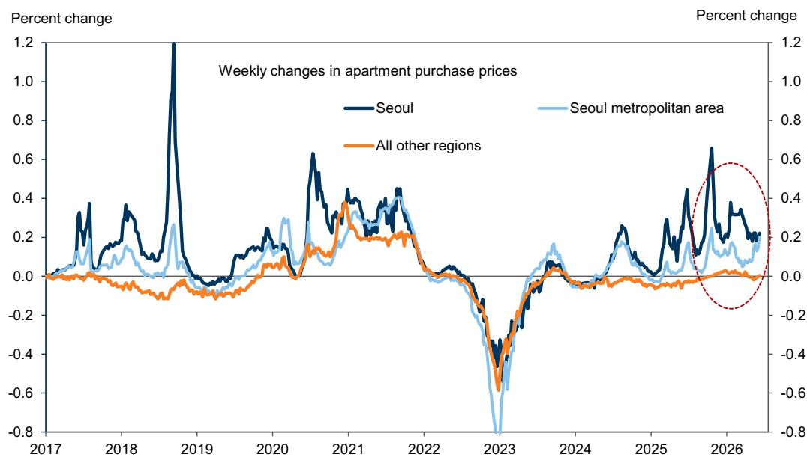
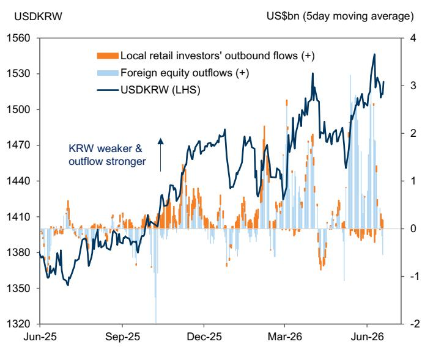

# Korea’s AI Boom Is Reshaping the Economy, But the Benefits Are Not Spreading

The artificial intelligence investment cycle is proving more powerful and more durable for South Korea than nearly any forecaster anticipated. A global investment bank’s latest research has raised growth projections for 2026 and 2027 meaningfully above consensus, driven by an AI impulse that is now expected to push total exports past USD 1 trillion and the current account surplus to a record high of roughly 15 percent of GDP. This is not a modest revision. It is a structural upgrade to the nation’s external position and growth trajectory.

Yet the real story is not the scale of the boom. It is the shape of it. The same report that upgrades Korea’s outlook also documents a widening chasm between the semiconductor sector and virtually every other part of the economy. Memory-led exports are surging. Non-tech exports are stagnant. Retail sales remain subdued. Job creation is concentrated in public services, not in the technology sector itself. Wage spillovers are likely contained. Core inflation, outside of imported goods and currency effects, is behaving differently than it did in 2022.

The implications for investors, policymakers, and corporate strategists are profound. Korea is not experiencing a broad-based recovery. It is experiencing an AI-driven super cycle that is concentrated, uneven, and potentially fragile in its domestic transmission. The policy response must therefore be equally precise: targeted rather than blanket tightening, fiscal discipline rather than stimulus, and a currency policy that recognizes the disconnect between Korea’s external strength and the won’s persistent weakness.

This article unpacks the strategic logic of that argument. It examines why the AI tailwind is stronger and longer than expected, how the domestic economy is failing to catch up, what that means for inflation and policy, and where the most important unanswered questions lie.

## The AI Super Cycle Is Real, and It Is Getting Bigger

The first-order insight from the report is that the AI-driven capital expenditure boom is not fading. It is accelerating. The memory demand outlook has been upgraded, and the effects are cascading through Korea’s export and current account mechanics. Exports of goods are on track to reach USD 1 trillion in 2026. The current account surplus, already at a record 15 percent of GDP in the first quarter, is expected to accelerate further into year-end.

This is not a cyclical bounce. It reflects a structural shift in global demand for the high-bandwidth memory and advanced logic chips that underpin AI infrastructure. Korea’s semiconductor ecosystem is the primary beneficiary. The report raises real GDP growth forecasts to 2.7 percent in 2026 and 2.3 percent in 2027, both above consensus. The revision is driven mainly by capital expenditure, including research and development, with a smaller contribution from wealth effects.

The wealth effects are deliberately kept modest. The report notes that equity investors in Korea are concentrated among wealthy and older households, local equity-market volatility is high, and financial assets are small relative to property assets. This mirrors findings from a recent Bank of Korea study. The implication is that the AI boom’s macroeconomic lift will come through investment and production, not through consumer spending fueled by stock market gains.

So why does this matter now? Because the market has not fully priced in the durability of this cycle. Consensus forecasts for 2027 are still below the revised projections. If the AI impulse continues to strengthen, the gap between reality and expectations will widen, creating opportunities and risks across asset classes.

## Domestic Transmission Remains Narrow, Creating a K-Shaped Recovery

The most striking finding in the report is the divergence between the semiconductor sector and the rest of the economy. The report describes this as a K-shaped cycle, and the data supports that characterization. Memory-led exports are surging. Non-tech exports are flat. Retail sales are subdued. Consumption overall remains soft, even with some recent pickup in luxury goods.

This is not a temporary lag. It reflects structural features of Korea’s economy. The tech sector is highly capital-intensive. Its job creation has been broadly flat since 2024, because the industry invests in machines and R&D, not labor. The jobs that are being created are overwhelmingly in public services: healthcare, public administration, and defense. Public services have more than fully accounted for job growth since 2025, after contributing less than 50 percent in 2019.

The report highlights demographic headwinds and related government job programs as drivers of this shift. But the strategic implication is clear: the AI boom is not generating broad-based employment gains. It is not lifting wages across the economy. It is not stimulating consumption in a meaningful way. The benefits are concentrated in corporate profits, tax revenues, and the external accounts.

This narrow transmission has important consequences for policy. If the boom were broad-based, the central bank would need to tighten aggressively to prevent overheating. But because the benefits are concentrated, the policy response can be more targeted. The risk of broad wage inflation is low. The risk of generalized price pressures is limited. The main domestic policy concern shifts from inflation to localized financial-stability risks, particularly in the Seoul metropolitan housing market.

## Wage Spillovers Are Likely Contained, Limiting Second-Round Inflation

A central question for any economy experiencing a sectoral boom is whether higher wages in the booming sector spill over to the rest of the economy. The report argues that this risk is constrained in Korea, and the reasoning is compelling.

The tech sector’s wage base is small. Tech-sector wages account for about 3 percent of total wage bills, or 1.2 percent of GDP. That is less than one-third of Taiwan’s share. The wage bills of major memory companies account for just 0.4 percent of GDP. Even with strong performance payments, post-tax bonus payments at major memory companies would remain around 0.5 percent of GDP in 2026 and 0.9 percent in 2027. The main offsets are special-bonus payment terms, mostly in locked-up equities, and high tax rates of nearly 50 percent.

More importantly, the rest of the economy lacks the profitability to match these wage increases. Nearly 80 percent of jobs are in non-manufacturing sectors such as retail, construction, education, and healthcare, where margins have historically been below 5 percent. Within manufacturing, non-tech profit margins have weakened to cyclical lows of around 5 percent, due to sustained regional overcapacity and competitive global markets.

The divergence in earnings is stark. Operating profits of semiconductor companies are expected to rise more than six times year-on-year in 2026. For non-tech listed companies, the increase is just 40 percent. For non-manufacturing companies, it is 10 percent.

This means that even if semiconductor workers receive large bonuses, the rest of the economy cannot follow suit. The wage channel for second-round inflation is effectively blocked. Inflation pressures, therefore, will come mainly through imported goods prices and exchange rates. Core goods prices have remained stable so far, unlike in 2022, when they rose sharply. Core services prices have also been moderate.

The report’s conclusion is that headline inflation, while elevated by energy prices, does not signal a broad-based overheating. The policy focus should be on managing inflation expectations and addressing localized risks, not on blanket tightening.

## The Fiscal and External Positions Are Strengthening, But the Won Remains Weak

One of the most striking implications of the AI boom is its impact on Korea’s fiscal position. The 2026 budget assumed a consolidated deficit of KRW 52.7 trillion on KRW 390 trillion of tax revenue. The report estimates that roughly KRW 60 trillion of additional tax revenue, about 2 percent of GDP, could be collected in 2026, on top of the KRW 25 trillion already reflected in the government’s March supplementary budget.

This would reduce the consolidated budget deficit from a planned 1.9 percent of GDP to less than 0.5 percent of GDP, even if a second supplementary budget were passed. Semiconductor-related corporate tax upside could remain significant in 2027 as well, at roughly 5 percent of GDP above the amounts projected last year.

The government has already signaled that it will save these excess revenues rather than increase procyclical spending. This is the right policy response. It avoids adding fuel to a concentrated boom and preserves fiscal space for future downturns.

Yet the won remains weak. The report notes that almost all of the current account surplus in the first half was recycled offshore through record-high net foreign equity outflows, driven by rebalancing needs and leveraged positions. This has weakened the won despite a sharp improvement in the current account balance.

The report argues that the won looks too weak relative to fundamentals and policy direction. KRW stabilization is likely to become a broad policy priority, given strong forex pass-through to inflation and equity-rally-related forex pressures. But monetary tightening is unlikely to proceed rapidly, given still-limited domestic demand pressures and an elevated household debt-service burden.

This creates a tension. The external accounts argue for a stronger won. The domestic economy argues for caution. The policy path is therefore likely to be gradual and targeted, with the central bank focusing on managing inflation expectations and supporting broader policy efforts to counter overheating in metropolitan housing markets.

## What the Report Does Not Fully Answer: The Sustainability of the AI Impulse

For all its analytical rigor, the report leaves several important questions open. The most critical is the sustainability of the AI investment cycle. The report upgrades the outlook, but it does not provide a detailed framework for when or how the cycle might peak. Is this a multi-year structural shift, or a super-cycle that will eventually normalize? The answer has enormous implications for Korea’s growth trajectory, fiscal position, and asset prices.

A second open question is the political economy of the K-shaped recovery. If the benefits of the AI boom remain concentrated, what happens to social cohesion and political stability? The report documents the shift toward public-sector employment, but it does not explore the longer-term implications of a labor market that is increasingly dependent on government jobs while the private sector’s most dynamic segment creates few jobs.

A third question concerns the housing market. The report notes that Seoul metropolitan area prices have re-accelerated since mid-May, while prices elsewhere remain stable. This is a localized risk, but localized risks can become systemic if left unaddressed. The report does not specify what policy tools the government might use to manage this without triggering a broader downturn.

Finally, the report does not fully explore the global risks to its base case. The assumption of a reopening of the Strait of Hormuz by late August is a specific scenario. What happens if that assumption proves wrong? What happens if global AI demand slows due to regulatory constraints, energy shortages, or a shift in corporate investment priorities?

These are not criticisms of the report. They are natural boundaries of any analytical exercise. The report provides a clear and compelling framework for understanding Korea’s current position. The unanswered questions are invitations for further analysis.

## A Decision Framework for Investors and Policymakers

The report’s insights can be translated into a practical decision framework. For investors, the key question is whether the market is pricing in the durability of the AI cycle and the narrowness of its domestic transmission. The report suggests that rates markets are pricing an increasingly hawkish policy path, while the won looks undervalued. This creates potential opportunities in currency and fixed-income positioning, but also risks if the domestic economy fails to gain traction.

For policymakers, the framework is about calibration. The AI boom provides fiscal and external strength, but it does not justify broad-based tightening. The policy response should be targeted: saving excess tax revenues, managing housing risks in Seoul, and allowing the won to strengthen gradually. Monetary policy should focus on inflation expectations and financial stability, not on fighting a boom that is concentrated and capital-intensive.

For corporate strategists, the framework highlights the importance of positioning within the AI value chain. The benefits are accruing to semiconductor companies and their suppliers, not to the broader economy. Companies outside the tech sector should not expect a rising tide to lift all boats. They need to focus on their own competitiveness and cost structures.

The report also implies a risk management framework. The upside risk is that the AI cycle proves even stronger and longer than expected. The downside risk is that it falters, leaving Korea with a concentrated economy, a weak won, and a housing bubble in Seoul. The prudent approach is to plan for both outcomes.

## Join the Community to Read the Full Report and Review the Original Charts

The analysis above draws on a detailed research report that includes charts on export trajectories, current account dynamics, labor market shifts, wage comparisons, and fiscal projections. These charts are essential for understanding the full picture. They show the data behind the arguments and allow readers to test the logic for themselves.

The full report also includes the authors' detailed forecasts, their risk assessments, and their policy recommendations. It is a resource for anyone who needs to understand Korea’s economic trajectory in the age of AI.

Join the community to read the full report and review the original charts.

*This article is for learning and discussion only and does not constitute investment advice.*

Personal reading notes and learning share only. Not investment advice.

