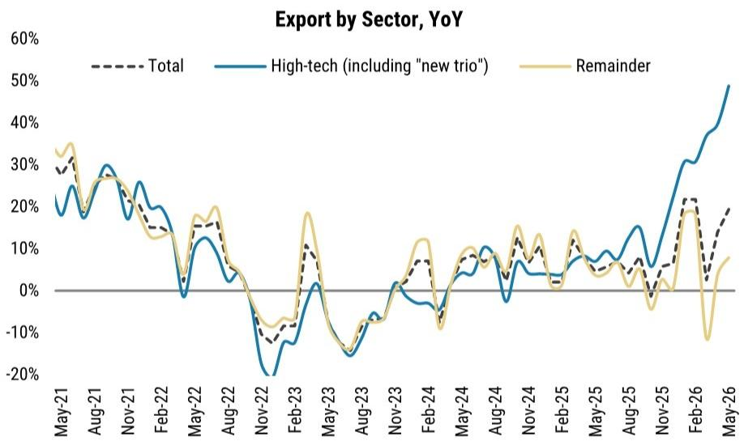
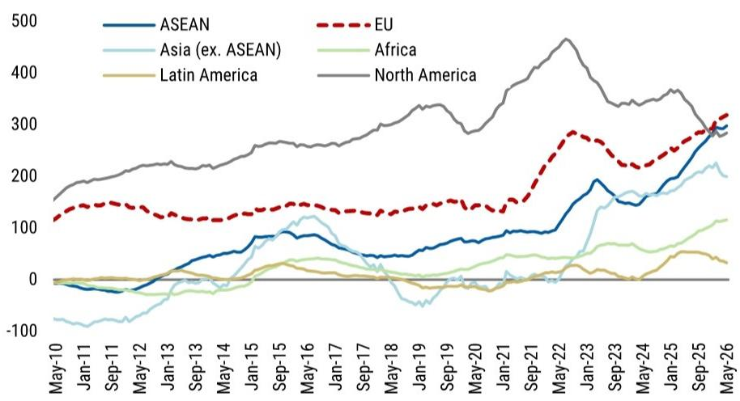
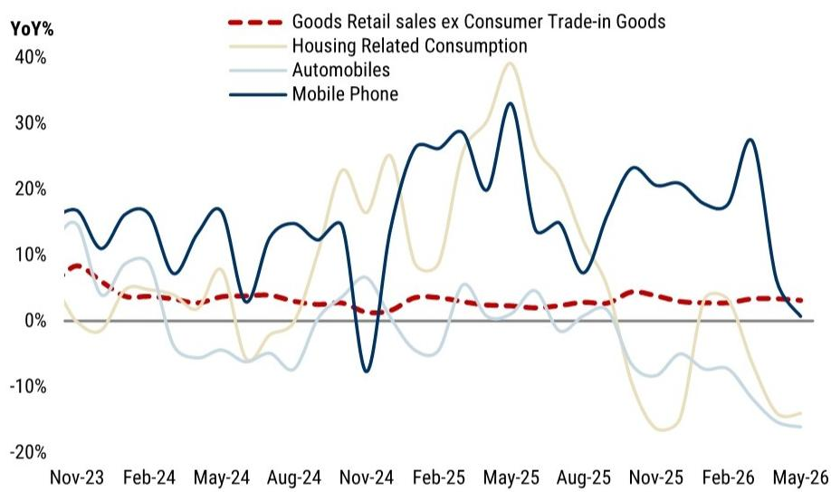

# 摩根斯坦利：MS：中国经济的“K型”分裂正在固化，而不是修复

这份报告的核心判断，比标题“Beijing Will Fine-tune, Not Pivot”要锋利得多。MS首席中国经济学家邢自强及其团队在6月18日的投资者演示中，并没有停留在“政策不会转向”这一市场共识上。他们真正想说的是：中国经济的“双速”格局——出口强劲、内需疲软——不是暂时现象，而是一个正在自我强化的结构性分裂。而市场对下半年消费反弹的期待，可能忽略了几个正在收紧的约束条件。

为什么现在重要？因为5月零售数据转负，已经不是一个基数效应可以解释的信号。报告明确指出，消费放缓“more than a base effect”。当出口和工业生产的韧性还在支撑宏观叙事时，内需的冷却正在从“预期中的放缓”滑向“超预期的收缩”。这意味着，投资者需要重新校准对中国资产定价的底层假设——尤其是那些押注消费复苏的仓位。

以下是我们从这份研报中提炼出的五个核心洞察，以及一个报告尚未完全回答的关键问题。

> **KC评论：** 邢自强团队的报告通常以“不惊不乍、逻辑严密”著称。这次他们用一个“fine-tune”的标题，装下了一个“结构性分化正在加深”的硬核判断。对读者而言，关键不是记住结论，而是理解他们用来推导结论的那几个数据链条——尤其是消费、固定资产投资和贸易摩擦这三条线。完整报告里有更多细分图表和交叉验证，值得细读。

## 1. 出口与内需的裂口在扩大，这不是周期波动，是结构分化

报告用两张图直接对比了工业生产和零售销售的趋势。工业生产在出口和“新三样”的拉动下保持韧性，而零售销售——尤其是剔除汽车和石油后的核心零售——在5月出现了同比负增长。这不是一个短期的库存调整或天气扰动。

更关键的是，报告指出这种分化正在被“收入预期”和“资产价格效应”双重强化。出口部门的就业和工资增长相对稳定，但面向国内的行业——房地产、服务业、中小企业——面临的是更弱的定价能力和更谨慎的招聘意愿。这导致了一个“K型”消费格局：高收入群体受财富效应影响较小，而中低收入群体正在主动压缩非必需支出。

**这意味着什么？** 对于消费品公司，尤其是依赖大众市场的品牌，下半年的增长假设需要下调。而对于投资者，那些以“内需复苏”为逻辑的仓位，可能需要重新审视其赔率。

## 2. 固定资产投资的方向比规模更重要，隐性债务化解正在改变地方行为

报告在固定资产投资部分提出了一个容易被忽略的观点：FAI（固定资产投资）的方向比规模更重要。这不是一句套话。

具体来说，报告指出，随着地方政府将更多精力放在化解隐性债务上，叠加“正确政绩观”的考核导向，固定资产投资正在从“规模驱动”转向“合规优先”。这意味着两件事：第一，过去那些被“前移”和“高报”的固定资产投资数据，现在可能面临修正。第二，地方政府对基建投资的冲动正在被制度性约束，而不是简单的资金不足。

> **KC评论：** 这是一个非常重要的微观机制变化。过去市场习惯于用“专项债发行进度”来预判基建投资强度，但报告暗示，即使额度充足，项目的落地效率也可能因为地方政府的风险规避行为而低于预期。完整报告里有一张关于政策性银行债券净发行的图表，直观展示了“准财政工具”的落地节奏有多慢。

## 3. 消费的“高基数”是表象，劳动力市场的真实温度才是核心

5月零售数据转负后，市场很容易用“去年以旧换新补贴的高基数”来解释。但报告明确表示，这“more than a base effect”。他们提供了更有说服力的证据：餐饮、服装、日用品等非补贴依赖型品类，增速也在放缓。

背后的核心变量是劳动力市场。报告虽然没有直接给出失业率的分项数据，但从消费结构的变化可以推断：服务消费中的“可选部分”——航空、酒店、餐饮——正在被消费者主动削减。这与报告中提到的“石油冲击”部分形成了闭环：消费者减少燃油车使用和航空出行，既有价格因素，也有主动降级消费的意愿。

**对投资者的含义：** 任何依赖“消费升级”或“服务消费扩张”的行业叙事，都需要面对一个更保守的消费者。而劳动力市场的真实温度，可能要到三季度末的校招和跳槽季才能完全显现。

## 4. 石油冲击的宏观影响可控，但加剧了K型分化

报告认为，油价上涨对中国GDP的拖累是“manageable”（可控的），因为工业端有商业原油库存、煤炭供应和发电量作为缓冲。但真正值得关注的，是油价对消费端的“二阶效应”。

消费者正在减少非必需的石油消费——包括燃油车使用和航空出行。这不仅仅是价格弹性，更是消费信心不足的信号。报告指出，这一趋势“reinforces the K-shaped economy”。换句话说，油价上涨并没有均匀地影响所有消费者，而是让那些已经收缩预算的群体更加谨慎，而对高收入群体的影响有限。

**这意味着：** 能源价格的波动，现在不能仅从通胀角度分析，而应视为消费分化的加速器。对于航空、旅游、汽车（尤其是燃油车）等行业的投资判断，需要叠加一个“消费降级”的因子。

## 5. 政策空间充足，但执行节奏和方向才是关键

报告承认，财政政策有“catch-up”的空间——大约60%的年度政府债券额度尚未使用，8000亿准财政融资工具的落地也偏慢。但关键不在于“有没有钱”，而在于“钱会投向哪里”。

报告明确指出，北京偏好的需求支撑方向仍然是“战略性基础设施”——尤其是“六张网”中的AI和能源转型。这意味着，传统的“铁公基”刺激逻辑正在被替代。对于投资者而言，这意味着：

- 传统基建相关的周期股，其弹性可能低于历史周期。
- 与AI基础设施、电网升级、新能源相关的资本品和工程服务，可能是政策红利的主要受益者。
- 消费端的直接刺激（如更大规模的消费券或现金补贴）概率较低，至少从这份报告的基调看，决策层更倾向于供给侧和投资侧的调控。

> **KC评论：** 报告没有展开的是，这种“投资驱动”的刺激模式，与“消费驱动”的复苏路径之间存在根本矛盾。如果政策资源继续向战略性基础设施倾斜，而劳动力市场的收入预期没有改善，那么经济“双速”格局的收敛时间线可能会被进一步拉长。完整报告中对“六张网”的具体拆解和投资规模估算，是理解这一判断的关键。

## 报告尚未完全回答的关键问题：贸易摩擦的“尾部风险”有多大？

报告确实提到了“Rising Risk of Trade Frictions”，并展示了中国贸易顺差的地域分布——尤其是对欧盟的顺差正在扩大。报告也指出，欧盟可能采取更强的贸易防御措施。

**但报告没有回答的是：** 如果贸易摩擦从“预期”变成“现实”，对“双速经济”中那台“出口引擎”的冲击有多大？目前出口的韧性建立在两个前提上：一是全球需求尚未显著走弱，二是中国在新能源和中间品领域的竞争优势。这两个前提如果有一个被打破，那么“双速”格局中的“快速”部分也可能降速，届时政策面临的就不是“fine-tune”的压力，而是更根本的平衡问题。

这可能是这份报告留给读者最大的一个思考题，也是我们后续会持续跟踪的核心变量。

---

这篇文章只是我们基于MS这份研报的初步解读。如果你希望看到完整的图表数据、更详细的行业拆解，以及每天由AI agent+人工review生成的国际投行中文摘要与KC评论，欢迎来我们的星球和微信群继续讨论。我们每天更新约10-40页的内容，包含当天最新数据图表合集，既方便喂给AI做深度分析，也方便人工快速把握全球市场的动态变化。

在这个信息过载、噪音多于信号的时代，我们试图做那个帮你“把报告读薄、把判断读透”的角色。

---

Personal reading notes and learning share only. Not investment advice.

