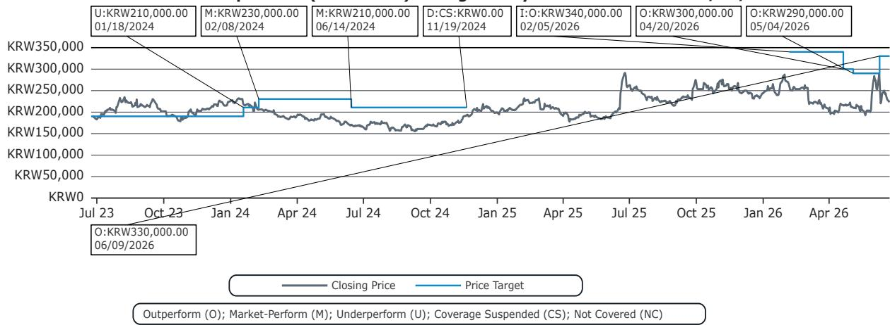
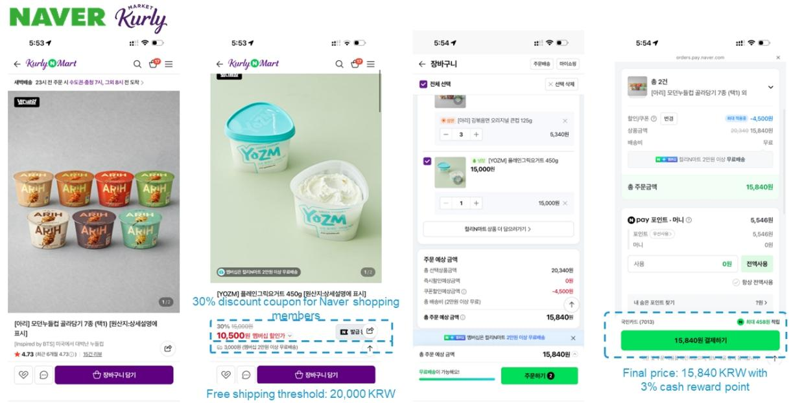
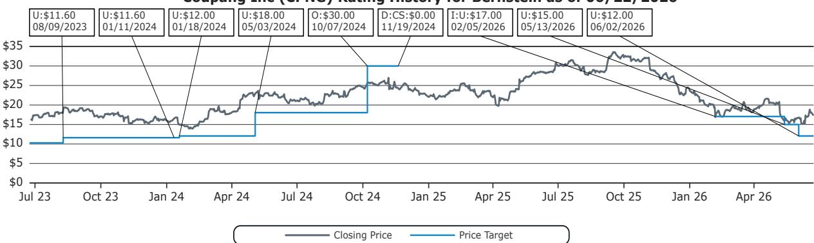

# Korea's Online Grocery Race Is Not Won by Price Alone: The Hidden Advantage of Structural Flexibility

The conventional wisdom in e-commerce investing holds that the lowest absolute price wins. A ground-level comparison of four major Korean grocery platforms—Coupang, Naver Shopping with Kurly, SSG.com, and Baemin B-Mart—reveals a more nuanced reality. When a consumer sets out to purchase a simple basket of yogurt and instant ramen, the winning platform is not necessarily the one with the lowest headline price, but the one whose delivery threshold, category rules, and assortment depth align most seamlessly with real-world shopping behavior. This distinction matters for investors because it suggests that market share dynamics in Korean quick commerce will be shaped less by pricing wars and more by structural design decisions that most platforms have not yet fully optimized.

The stakes are high. Korea's online grocery market is approaching a critical inflection point where penetration growth slows and competition shifts from customer acquisition to retention and basket share. In this environment, the platforms that reduce friction in the shopping experience—not just in checkout, but in the logic of how items combine toward delivery minimums—will capture disproportionate value. The report underlying this analysis, produced by a leading global investment bank, uses a single shopping trip as a diagnostic tool to expose competitive advantages that standard metrics like average order value or gross merchandise value cannot capture. The implications for investors are clear: the platforms that win on structural flexibility today are building durable moats that pricing alone cannot breach.

## The Delivery Threshold Is a Hidden Competitive Weapon That Most Investors Overlook

The most counterintuitive finding from this comparison is that Coupang, widely regarded as the pricing leader in Korean e-commerce, introduces structural friction through its delivery threshold design. Rocket Fresh requires a minimum of KRW 15,000 based on discounted prices, not listing prices. Furthermore, products outside the Fresh category—such as the ramen in this shopping scenario—do not contribute to meeting that threshold. In practice, this means a consumer who wants to combine a grocery item with a non-grocery item faces a choice: either pay for delivery on one of the two categories, or inflate the basket beyond what is needed. This is not a pricing problem; it is a basket construction problem.

The strategic implication is that Coupang's absolute pricing advantage is partially neutralized by the cognitive and economic cost of meeting its delivery rules. For the consumer, the effective price of a basket includes not just the cost of goods but the forced purchase of additional items to meet thresholds. This dynamic suppresses conversion rates for smaller, more frequent orders—precisely the kind of shopping behavior that defines online grocery. Investors who focus solely on Coupang's price competitiveness may be overestimating its ability to capture the high-frequency, low-value transactions that drive repeat engagement and long-term customer lifetime value.

## Naver and Kurly Exploit a Structural Loophole That Creates a Defensible Competitive Position

Naver Shopping and Kurly have designed their delivery threshold mechanism in a way that creates a subtle but powerful advantage. Their free delivery minimums are based on listing prices rather than post-discount payment amounts. This means a consumer can qualify for free shipping more easily, even when using coupons or promotional discounts. In the shopping scenario analyzed, once the threshold was met, the effective total cost became competitive with Coupang—particularly when factoring in the 3% or more cash rewards from Naver Shopping membership.

This structural flexibility has two important consequences. First, it reduces the likelihood of basket abandonment, a critical metric in grocery where margins are thin and repeat frequency is the primary driver of unit economics. Second, it allows Naver and Kurly to maintain higher listing prices without losing price-sensitive customers, because the net cost after discounts and rewards remains attractive. This is a margin-protecting advantage that does not require aggressive discounting. For investors, the key insight is that Naver's commerce segment benefits from a platform design that aligns consumer incentives with platform economics. The higher listing prices generate more revenue per transaction, while the easier threshold drives higher conversion rates. This dual benefit is not easily replicated by competitors whose delivery systems are built around different architectural assumptions.

## SSG.com's Assortment Gap Is a Regulatory Problem, Not a Strategic One

SSG.com's performance in this comparison highlights a constraint that is often misdiagnosed. The platform's inability to stock the specific Greek yogurt brand sought by the consumer is not a failure of merchandising or supply chain management. It is a direct consequence of regulatory restrictions on online fulfillment from offline retail stores. SSG.com, which leverages the extensive physical store network of its parent company, is limited in how much of its offline assortment it can offer online. This creates a structural assortment gap that no amount of pricing or delivery investment can close under current regulations.

The strategic implication is that SSG.com's competitive position is tied to regulatory outcomes, not operational execution. If policies evolve to permit broader integration between offline stores and online fulfillment—particularly for dawn delivery services—the assortment gap could narrow significantly. This represents a binary risk for investors: either regulatory change unlocks SSG.com's latent assortment advantage, or the platform remains constrained in a market where assortment depth is increasingly the deciding factor for consumer choice. The report does not provide a timeline for such regulatory shifts, but it identifies this as the single most important variable to monitor for SSG.com's trajectory.

## Baemin B-Mart's Speed Premium Is a Niche, Not a Strategy

Baemin's B-Mart occupies a clearly defined but narrow competitive space. The platform delivers within one to two hours, making it the fastest option in this comparison. It carried the specific items sought, but at significantly higher prices and with limited overall SKU breadth. This creates a sharply defined use case: urgent, short-window delivery needs where speed trumps cost and variety. For routine grocery shopping, however, B-Mart's value proposition collapses.

The risk for Baemin is that its speed advantage is not defensible. As competitors improve their delivery times—Coupang's Rocket Fresh already offers dawn delivery, and Naver's partnerships with logistics providers are expanding—the premium that consumers are willing to pay for speed will compress. B-Mart's current pricing suggests that Baemin is extracting a significant margin from its last-mile capability, but this margin is vulnerable to erosion. Investors should view B-Mart not as a growth platform for grocery but as a strategic hedge for Baemin's broader food delivery business, where speed is the core value proposition. The question the report leaves open is whether Baemin can expand B-Mart's assortment and reduce its pricing premium without undermining the profitability of its core delivery business.

## What the Report Does Not Fully Answer: The Sustainability of Naver's Commerce Margins

The report makes a compelling case for Naver's structural advantage in delivery threshold design and its ability to sustain investment in commerce. However, it does not fully address a critical question: how long can Naver maintain its margin profile in commerce as competitive intensity increases? The report notes that industry-wide commerce margins are largely determined by competitive intensity, and that ongoing price competition may pressure both Naver's platform margins and Coupang's product commerce margins. But this raises a paradox. If Naver's advantage is structural rather than pricing-based, then competitive intensity should not directly threaten its margins. Yet the report's own investment implications suggest that margin pressure is a risk for both Naver and Coupang.

The unresolved tension is between Naver's structural flexibility and the reality that competitors will eventually adapt their delivery threshold designs. Coupang, for example, could modify its Rocket Fresh rules to allow combination with Rocket items, neutralizing Naver's advantage. The report does not model the competitive response or the timeline for such adaptations. For investors, this means that Naver's current margin advantage is a snapshot, not a forecast. The durability of its commerce margins depends on whether its structural advantages are embedded in platform architecture that is difficult to replicate, or whether they are simply first-mover benefits that competitors can match.

## A Decision Framework for Investors: Three Questions to Evaluate Korean E-Commerce Platforms

Based on the insights from this analysis, investors should evaluate Korean e-commerce platforms through three lenses that go beyond standard financial metrics.

First, assess the friction coefficient of the delivery threshold. How many items must a consumer purchase to qualify for free delivery? Are the rules transparent or opaque? Do they incentivize larger baskets or frequent small orders? Platforms with lower friction coefficients will capture higher conversion rates on the high-frequency, low-value transactions that drive grocery engagement.

Second, evaluate the regulatory dependency of assortment depth. Platforms like SSG.com that rely on offline-to-online fulfillment are exposed to regulatory risk that is outside management control. Platforms like Coupang that have built dedicated fulfillment centers have more control over their assortment but face higher capital intensity. The optimal balance between control and flexibility depends on the investor's risk appetite and time horizon.

Third, measure the premium for speed. Baemin B-Mart's pricing suggests that consumers are willing to pay a significant premium for one-to-two-hour delivery. But this premium is likely to compress as competitors improve their delivery times. Investors should model a declining speed premium over the next two to three years and assess whether Baemin's unit economics can absorb that compression without destroying margin.

These three questions form a framework that is more predictive of long-term competitive outcomes than traditional metrics like GMV growth or take rate. The report provides the raw data for this analysis, but the interpretation requires a strategic lens that connects platform design to consumer behavior.

## The Full Picture Requires Deeper Data

The comparison of four grocery platforms on a single shopping trip reveals patterns that aggregate data cannot capture. But it also leaves meaningful questions unanswered. How representative is this single shopping scenario? Would the competitive dynamics shift for a larger basket, a different set of products, or a different delivery time window? The report acknowledges that actual pricing, discounts, assortment, and delivery conditions may vary depending on timing, location, and platform-specific factors. For investors who want to build conviction around these insights, the next step is to examine the full dataset, including the original charts that map pricing, thresholds, and assortment across multiple scenarios.

Join the community to read the full report and review the original charts.

*This article is for learning and discussion only and does not constitute investment advice.*

Personal reading notes and learning share only. Not investment advice.

