India Autos

# India Autos: Beyond E20 - What ethanol can and cannot deliver

  
Venugopal Garre  
+65 6326 7643

venugopal.garre@bernsteinsg.com

Param Shah

+91 226 842 1417

param.shah@bernsteinsg.com

India crossed the 20 percent ethanol blending milestone in late 2025, making E20 its standard petrol grade about five years ahead of plan. The obvious next question is how much further this programme can go. Can it move to E25 or E27, and then beyond to flex-fuel vehicles and E85? More importantly, is the incremental reduction in crude imports worth the cost and complexity of building an entirely new fuel value chain?

We separate our arguments into two halves. First half - stretching the blend from E20 toward E25 or E27 by 2030 is directionally sensible but hard. Over 80% of vehicles on Indian roads are built for E10. Current E20 is already triggering mileage losses and fuel-system complaints in legacy vehicles, and Govt. has only just assigned ARAI to study E25's impact on existing fleet. The stretch is achievable for new vehicles, but for legacy fleet it is conditional on retrofit kits scaling or legacy fleet turning over faster vs current scrap rates.

The second half - going beyond the blend wall (E25 / E30) by building a national flex-fuel and E85 supply chain is a long industrial project whose payoff, when you model it, is small, increasingly duplicated by technologies arriving anyway, and justified mainly by a hedging logic that no longer fits India's moment. Battery costs are falling every year, EV TCO is converging on petrol, and charging infrastructure build out + range improvement are genuine advancements - the very alternatives that hedge oil dependence.

Feedstock is also a risk. India's ethanol comes primarily from sugarcane, molasses and maize - all hostage to water availability and hence monsoons. When a poor 2023 harvest forced distilleries to switch from sugar to grain, India briefly became a net maize importer paying foreign exchange for grain to make a fuel meant to save foreign exchange.

Having increased adoption of Flex fuel vehicles and E85 supply chain is attractive in theory - if crude prices spike, a country with flex-fuel cars can switch to cheaper ethanol and blunt the shock. But during normalcy, ethanol procurement costs for OMCs (INR 60-62/litre in a good monsoon) exceed the petrol it replaces (INR 55-58/litre at \$75/bbl crude). We modelled what a full flex-fuel push would deliver: even with aggressive adoption (new petrol PVs sales phased out by end of this decade, replaced by FFVs), stock petrol PVs would still make up 45-50% of the fleet by end-2030 (vs 65-70% today). The net crude-import saving from flex-fuel cars is around 1-2% of India's oil imports; overall savings reach \~4-5%, driven overwhelmingly by blending to E25-E27 and the rise of EVs, hybrids and CNG.

The global track record reinforces our scepticism. US built E85 infra and saw it languish at $<2\%$ of stations; China scrapped its ethanol mandate the moment grain turned scarce; Thailand's E85 demand collapsed when subsidies were cut in early 2026, with EVs stepping in. Only Brazil sustains high blends - but Brazil started in the 1970s long before EVs existed and has far more suitable conditions vs India.

Our verdict: India can stretch to E25-E27 by 2030. Going beyond would require FFVs and E85 value chain. We only see a \~5% crude imports savings by 2030 with both, >2/3rd of it from blending + EV, Hybrid, CNG adoption, <1/3rd from FFVs. Savings jump to 7-8% by 2035, and 10% by 2040. But with EVs, Hybrids, CNG taking off, a parallel supply chain is an expensive hedge whose moment has passed.

## BERNSTEIN TICKER TABLE

<table><tr><td></td><td colspan="4">22 Jun 2026</td><td rowspan="2">TTMRel.</td><td colspan="4">Adjusted EPS</td><td colspan="3">Adjusted P/E (x)</td></tr><tr><td>Ticker</td><td>Rating</td><td>Cur</td><td>Closing Price</td><td>Price Target</td><td>Cur</td><td>2026A</td><td>2027E</td><td>2028E</td><td>2026A</td><td>2027E</td><td>2028E</td></tr><tr><td>MSIL.IN (Maruti Suzuki)</td><td>O</td><td>INR</td><td>13,421</td><td>18,200</td><td>(43.7)%</td><td>INR</td><td>459.46</td><td>468.95</td><td>531.43</td><td>29.2</td><td>28.6</td><td>25.3</td></tr><tr><td>MM.IN (Mahindra &amp; Mahindra)</td><td>O</td><td>INR</td><td>3,063.40</td><td>4,200.00</td><td>(51.7)%</td><td>INR</td><td>126.00</td><td>148.62</td><td>168.58</td><td>24.3</td><td>20.6</td><td>18.2</td></tr><tr><td>HMCL.IN (Hero MotoCorp)</td><td>M</td><td>INR</td><td>4,983.70</td><td>5,010.00</td><td>(32.2)%</td><td>INR</td><td>269.77</td><td>273.44</td><td>313.43</td><td>18.5</td><td>18.2</td><td>15.9</td></tr><tr><td>EIM.IN (Eicher Motors)</td><td>M</td><td>INR</td><td>7,639.50</td><td>7,000.00</td><td>(11.8)%</td><td>INR</td><td>203.46</td><td>227.92</td><td>266.94</td><td>37.5</td><td>33.5</td><td>28.6</td></tr><tr><td>BJAUT.IN (Bajaj Auto)</td><td>O</td><td>INR</td><td>10,191</td><td>11,500</td><td>(26.4)%</td><td>INR</td><td>386.25</td><td>409.45</td><td>471.05</td><td>26.4</td><td>24.9</td><td>21.6</td></tr><tr><td>TVSL.IN (TVS Motor)</td><td>M</td><td>INR</td><td>3,488.70</td><td>3,460.00</td><td>(23.8)%</td><td>INR</td><td>76.97</td><td>100.78</td><td>118.73</td><td>45.3</td><td>34.6</td><td>29.4</td></tr><tr><td>ASIAX</td><td></td><td></td><td>2,072.31</td><td></td><td></td><td></td><td></td><td></td><td></td><td></td><td></td><td></td></tr></table>

O - Outperform, M - Market-Perform, U - Underperform, NR - Not Rated, CS - Coverage Suspended

Source: Bloomberg, Bernstein estimates and analysis.

## INVESTMENT IMPLICATIONS

Our assessment of the ethanol blending programme points to meaningful execution challenges on two fronts. First, scaling the ability of passenger vehicles to handle higher blends, particularly within the existing fleet, remains uncertain. Second, sustaining higher blend levels on the feedstock side is constrained by structural dependence on monsoon-driven agricultural output.

We believe the impact on reducing fuel imports is likely to be limited over this decade. At the same time, there is a risk that policy and capital allocation shift toward extending legacy fuel technologies that may become less relevant over time, given the parallel evolution of electrification, hybrids and alternative fuels.

From a stock market perspective, the direct implications for the OEM supply chain appear modest. However, there could be indirect benefits for select players such as Maruti (rated Outperform), which remains relatively underpenetrated in electric vehicles. A stronger ethanol pathway may help bridge this gap by supporting its positioning in internal combustion and hybrid segments.

## INDIA HAS FINISHED THE EASY PART - BLENDING TILL E20

The first thing to understand about India's ethanol programme is why it succeeded so fast because the reasons are precisely why the next leg is hard. Blending rose from under 2% a decade ago to 20% in 2025 (Exhibit 1), ahead of every official timeline, on three favourable conditions: the blend went into engines India already owned, the feedstock came from crops India already grew, and the consumer was asked for nothing. A programme that asks nothing of anyone scales easily.

It was not entirely costless. The government puts the mileage loss at E20 at 1–6%, but a meaningful share of owners of pre-2023 vehicles report closer to 10%, alongside complaints of corrosion and fuel-system wear. The political signal is real - and every step up the blend ladder sharpens exactly these complaints.

But the issue starts even before the blend wall. More than 80% of petrol vehicles currently on Indian roads were manufactured before April 2023 and are only E10-compliant; E20 alone is already triggering rubber seal degradation, fuel pump complaints and mileage losses of 6–10% in legacy vehicles - issues that sharpen materially with every percentage point higher.

EXHIBIT 1: India's current capacity far exceeds the demand for ethanol (20bn litres of capacity vs \~11 bn litres of consumption)  
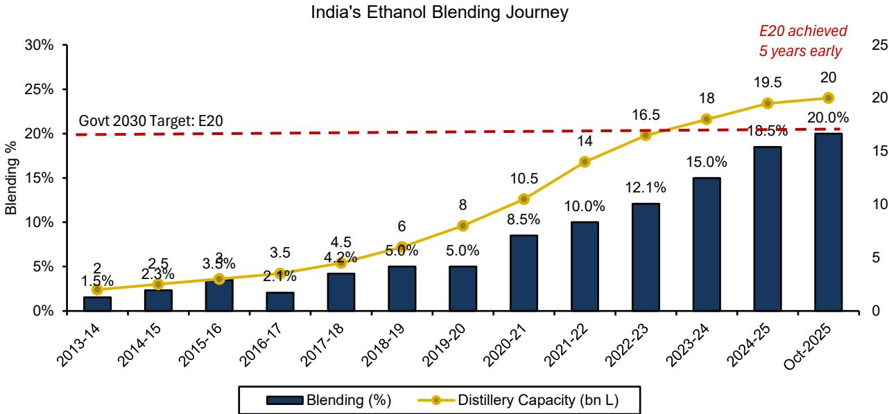  
MoPNG, Bernstein analysis and estimates

## ETHANOL STOPS NEAR E25/E27 AND THAT IS THE CEILING

There is a physical ceiling to how much ethanol a conventional petrol engine can accommodate, and it is not a question of policy ambition. Ethanol contains roughly 65 to 67 percent of petrol's energy by volume, is hygroscopic, and can be corrosive to materials that petrol typically does not affect. At low blend levels, these properties have limited impact. As the blend rises, however, the effects become progressively more significant. Both global experience and India's own engineering standards converge on a threshold of around 20 percent for the existing vehicle base. This is the blend wall, and it is defined by underlying physical and chemical constraints rather than regulatory choice.

India does, however, have some room beyond this level. From April 2025 onward, all new vehicles are required to be equipped with E20-tuned engines. These engines are designed to take advantage of ethanol's higher octane rating through higher compression ratios, partially offsetting the energy penalty. As the fleet gradually transitions, the tolerable blend level can edge higher, which forms the basis for a measured progression toward E25, and potentially E27, by 2030.

The regulatory framework to support this transition is already taking shape. Fuel specifications up to E30 have been notified, and excise duties have been adjusted to support higher blends. However, this framework remains largely regulatory rather than mechanical. The underlying question is one of fleet readiness. The government's recent decision to task ARAI with a 60,000 to 70,000 kilometre durability study on the impact of E25 on existing E10 and E20 vehicles reflects a clear recognition that moving from E20 to E25 is a meaningful technical step, not a routine extension.

Until these results are available, and until either retrofit solutions scale efficiently or original equipment manufacturers upgrade a much larger share of the vehicle base, the transition remains uneven. More than 80 percent of the current fleet is still not fully E20-optimised. In this context, E25 appears achievable for new vehicle sales, but considerably more challenging across the existing stock. We therefore view E25 as a credible base case for new additions to the fleet, but only a conditional outcome for the broader parc. That outcome depends on either the rapid scaling of retrofit ecosystems or a faster-than-expected turnover of legacy vehicles, which current scrappage trends do not yet support.

EXHIBIT 2: Fuel Properties E0 to E100: The physics are clear - energy density drops from 32 MJ/L at E0 to 21 MJ/L at E100, while the RON rises from 91 to 120. The jump from E20 to E85 is not incremental; it requires entirely new engine hardware, cold-start systems, and ECU calibration.  
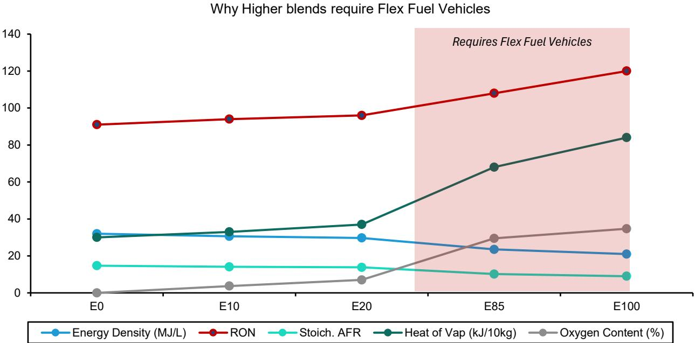  
Source: ARAI, News Articles, Bernstein analysis and estimates

## ETHANOL BLENDING REQUIRES WATER AND HENCE, IT IS ALSO INFLUENCED BY MONSOONS

India does not face a shortage of distillation capacity. Installed capacity stands at roughly 18 to 20 billion litres, well above the approximately 11 billion litres required for E20. Capacity is not the constraint. If anything, the system is operating with surplus capacity. The real limitation lies in sustainable feedstock. Independent estimates place this at around 6 to 10 billion litres, while the government's more optimistic assessment is about 13.5 billion. This gap is critical. It is the difference between a view where E20 already represents the practical ceiling and one where E25 still offers headroom. The answer is not fixed. It shifts each year with rainfall patterns and water availability.

The events of 2023 illustrate this dynamic clearly. A weak monsoon and drought-like conditions hit the key cane-producing states, with Maharashtra and Karnataka seeing yields fall sharply from 120 to 130 tonnes per hectare to closer to 80. As sugar availability tightened, the government restricted the diversion of sugarcane juice toward ethanol. Distilleries pivoted toward maize, but the outcome ran counter to the programme's intent. India, historically a maize exporter of 2 to 4 million tonnes annually, turned into a net importer for the first time in many years. By 2024, it was importing close to a million tonnes from countries such as Myanmar and Ukraine, even as maize-based ethanol became the most expensive option at roughly INR72 per litre. In effect, a programme designed to reduce oil imports ended up relying on imported grain.

ESY refers to Ethanol Supply Year (Oct-Nov)
Source: MoPNG, SIAM, News Articles, Bernstein analysis

The subsequent reversal in September 2025 reinforces the same point. With a recovery in the monsoon, two consecutive good rainfall years replenished reservoirs and revitalized cane output. Sugar moved back into surplus, and cane juice and molasses returned to the ethanol stream in large volumes. The key takeaway is not about whether the system is cane-led or grain-led. It is neither in a structural sense. It is fundamentally driven by water availability. As blending targets rise, the system becomes increasingly exposed to a single weak monsoon year.

This vulnerability is amplified by India's underlying water constraints. The higher the blending ambition, the more sensitive the programme becomes to rainfall variability. At elevated blend levels, even one year of poor rainfall can disrupt the balance, forcing a shift toward imports and undermining the programme's core objective.

EXHIBIT 3: Shift in ethanol feedstock mix showing a temporary pivot toward maize during ESY'24–ESY'25 amid sugarcane shortages, with a rebalancing back to cane-based sources following improved availability and policy easing

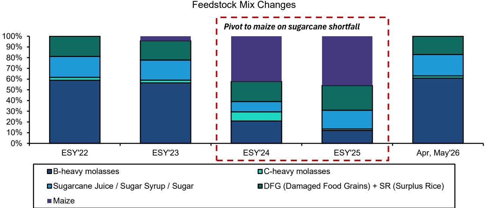

EXHIBIT 4: Ethanol cost trends across feedstocks, highlighting a temporary surge in maize-based ethanol prices during the inversion phase- driven by drought-led sugarcane shortages in Maharashtra and Karnataka  
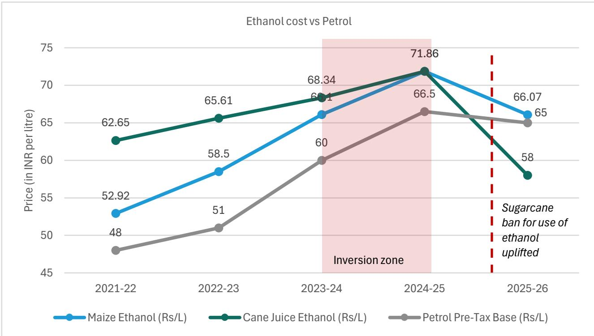  
Source: MoPNG, SIAM, Bernstein analysis

EXHIBIT 5: Water requirement is extremely high across ethanol feedstocks highlighting a key sustainability concern.  
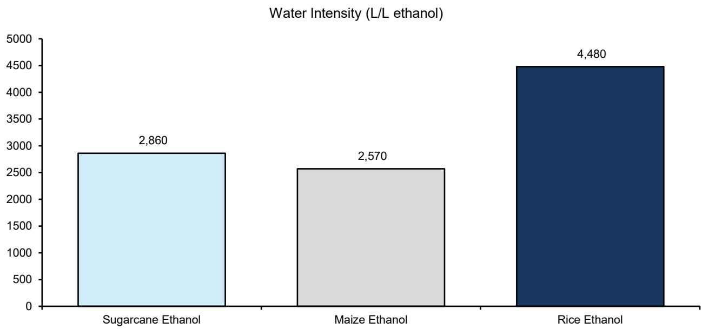  
Source: Niti Aayog 2021, News Articles, Bernstein analysis

EXHIBIT 6: India has a 4.11 water stress score on a scale of 1 (low stress) to 5 (extremely high stress) vs Brazil's 1.04  
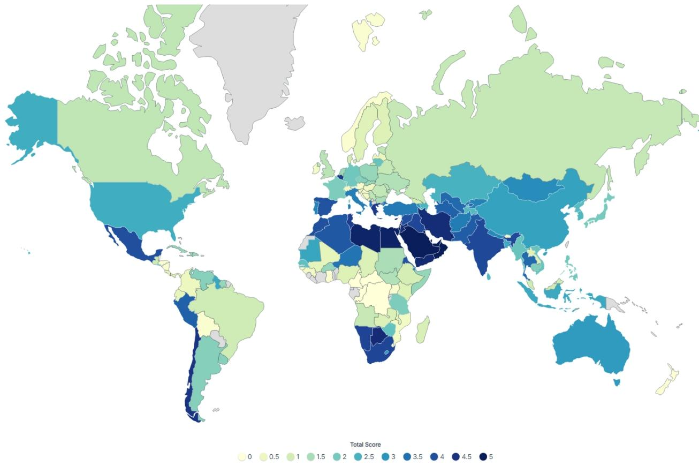  
Source: World population review 2023, Bernstein analysis

## ETHANOL IS NOT CHEAPER THAN PETROL - SO THE CASE FOR GOING FURTHER RESTS ON ONE IDEA: A HEDGE

Confront the fact that quietly undermines the economic premise. At \~\$75 a barrel, a litre of crude costs India about INR 45, and a litre of petrol costs around INR55–58 to make before tax. A litre of ethanol is procured at about INR60–62 today on the cane-led mix, and rose above INR71 during the grain pivot. On every comparison that matters, ethanol costs as much as or more than the petrol it displaces, before a rupee of tax - set aside the more volume requirements due to mileage loss.

Strip away the rhetoric and one serious answer remains for why to push further at all: a hedge. Brazil's genius is to let the anhydrous blend float and to put flex-fuel in 90% of its cars, so drivers switch to ethanol en masse when crude spikes and petrol turns dear, then switch back when crude falls. When the Strait of Hormuz crisis drove crude above \$100 in May and June 2026, a country with Brazil's fleet could have leaned on ethanol precisely when oil turned expensive. We take this argument seriously - it is the strongest case for a flex-fuel future. But the question the rest of this report asks is not whether the hedge has value, but whether it is worth what India would have to spend to build it.

Mileage loss with increasing ethanol blend

EXHIBIT 7: Mileage loss due to increasing ethanol blend % as per govt studies; however consumers seem to report more mileage loss than the below estimates

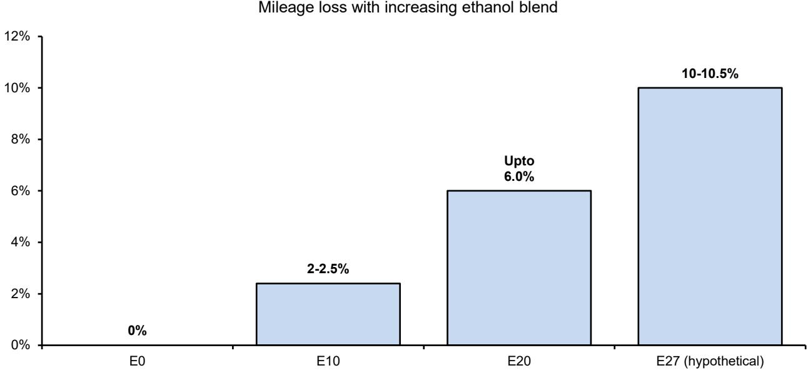  
Source: ARAI, Niti Aayog, Bernstein analysis and estimates

## THE HEDGE PAYS ONLY IN A SPIKE - AND BRAZIL BUILT IT OVER FIFTY YEARS, BEFORE ELECTRIC CARS EXISTED

Grant the hedge its due, then weigh it honestly. The first cut: the hedge pays only in a crude spike. Because ethanol is not cheaper than petrol at ordinary crude prices, the flex driver switches to ethanol only when oil climbs high enough that petrol's making-cost finally exceeds ethanol's. That is a real but occasional event - tail-risk insurance, not an everyday saving. For most of any given decade, with crude in the \$60–80 range, an Indian flex fleet would run mostly on petrol, exactly as Brazil's does in cheap-oil years. You would have built an entire parallel fuel system to capture a benefit that materialises in the minority of years when oil spikes.

The second cut is about timing. Brazil began building this hedge in 1975 with Proálcool (short for Programa Nacional do Álcool - National Alcohol Program), at a moment when there was no alternative to oil for a car - no EVs, no lithium-ion cost curve, no charging networks. If you wanted to insure a transport system against oil, home-grown ethanol was the only instrument available. The hedge made sense because it was the only hedge on offer.

That is no longer true, and it is the heart of our scepticism. India in 2026 has alternatives Brazil in 1975 could not imagine. Battery costs are falling year on year; strong hybrids cut petrol consumption 30-40% with no new fuel and no new infrastructure; CNG penetration is rising across the fleet. Each of these reduces oil dependence - the very thing the ethanol hedge is for and several decarbonise more durably as the grid greens. The opportunity cost of a single-purpose E85 supply chain is everything that same capital could do to accelerate these alternatives.

## WE MODELLED IT: EVEN PHASING OUT EVERY PETROL CAR BY 2030 BARELY IMPACTS CRUDE IMPORTS

This is the calculation that should anchor the investment decision. We built a stock-and-flow model of India's vehicle parc. Its conclusion is hard to escape: vehicle stock turns over slowly, so even violent action on new-vehicle sales changes the fleet only gradually by the end of this decade.

Take the most aggressive scenario we can responsibly model: every petrol car phased out of showrooms from next year, replaced only by flex-fuel cars. Because the cars already on the road keep running for \~15 years, the petrol share of the car parc still stands at 45-50% at end-2030, down only from today's 66-70%, while flex-fuel vehicles rise from zero to just 10-12%.

Attach an aggressive blend assumption - the petrol blend pushed to E27 by 2030 across both cars and 2Ws - and the total reduction in India's crude-import bill by the end of 2030 is about $4.5 - 5\%$ . Decompose it, and $2/3^{\text{rd}}$ of it- about 3.5-4 p.p. - comes from the blend rising toward E27 across the existing fleet, rise of EVs + Hybrids + CNG. Only about 1-1.5 percentage points are attributable to flex-fuel passenger vehicles. The flex-fuel and E85 value chain is the expensive half of the program; the blend increase is the cheap half; and the model says the expensive half buys the smaller share of the prize till 2030. If we extend our workings further till 2035 and 2040, the crude savings jump to 7.5% and 10% respectively (Breakup in Exhibit 9).

The 2030 picture improves only modestly if flex fuel reaches 2Ws, which are 61% of petrol demand. Extend flex penetration into 2Ws and our model adds \~2p.p., lifting the all-in 2030 saving to about 6-7% - broadly the same order of magnitude that EV and hybrid penetration in cars is on course to deliver anyway, without anyone building a second fuel system. Soften any assumption toward realism - a slower flex roll-out, a blend that stalls at E25, faster EV adoption - and the flex contribution shrinks further.

EXHIBIT 8: Even with aggressive Flex Fuel Vehicle adoption starting FY28, the petrol stock vehicle by the end of this decade will be significant

Fleet Movement of Stock Cars across Powertrains with aggressive FFV adoption  
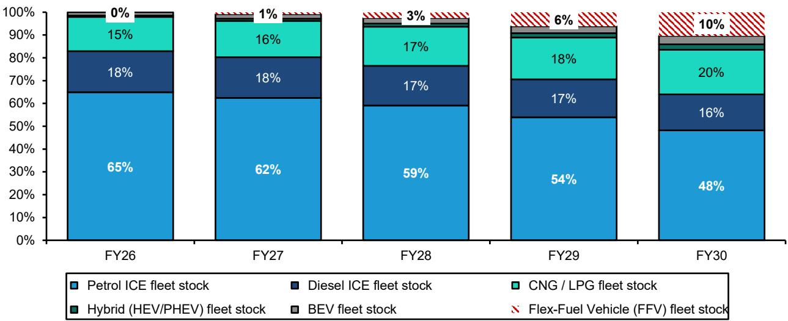  
Source: SIAM, Company Data, Bernstein analysis and estimates

EXHIBIT 9: Crude savings from Increasing Blend Rate and Flex Fuel PV adoption will be low in the next 5 years even in the aggressive scenario (Flex fuel replace Petrol Vehicle sales) - Scenario Analysis for 2030/2035/2040

Crude Import Savings from Ethanol under aggressive assumptions  
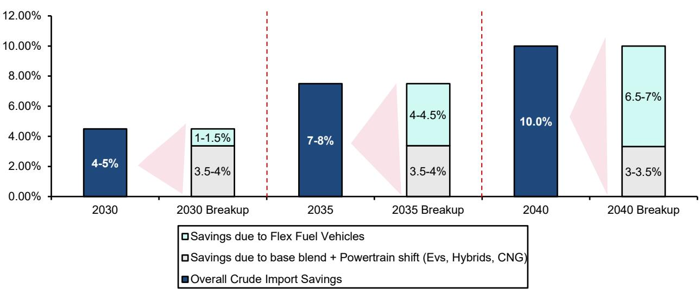  
Source: Bernstein Proprietary Model, Bernstein analysis and estimates

## THE WORLD HAS RUN THIS EXPERIMENT - AND THE SUPPLY CHAIN RARELY REPAID THE BUILD

The most important evidence on whether to build a high-blend supply chain comes from the countries that already did. Three ran the experiment in earnest; each failed in a different and instructive way; and each failure maps onto a specific Indian vulnerability.

The United States had every advantage and still could not make the supply chain pay. E85 reached barely 2% of fueling stations - a chicken-and-egg trap in which retailers would not install pumps without flex drivers and drivers would not buy flex cars without pumps. A GM study found around 70% of flex-fuel owners did not know their car could run on E85, and fewer than 10% ever used it - the vehicles existed only to earn automakers fuel-economy compliance credits. And underneath it all sat the economics: E85's 20–30% range penalty meant that even priced below petrol per gallon, it rarely beat petrol per mile.

China is the cleanest parallel to India's feedstock vulnerability. In 2017 Beijing announced a nationwide E10 mandate by 2020, conceived to digest a vast state corn surplus. Within two years it was quietly abandoned - the surplus had vanished, drawn down by poor harvests and livestock demand - and the government concluded that any promotion of ethanol "must be based on the precondition that food security is guaranteed." The blend never exceeded about 2–4% against the 10% target. That is precisely the kind of wall India hit in December 2023, when a poor monsoon forced a choice between sugar on shelves and cane in fuel tanks - and chose sugar.

Thailand actually built E85 to commercial scale and then dismantled it. Generous subsidies stood up flex vehicles, E85 stations, and real consumer demand. When the subsidy was cut in late 2022, E85 consumption fell significantly (Exhibit 11). By February 2026 Thailand's dominant retailer stopped selling E85 altogether, with surplus ethanol redirected to sustainable aviation fuel. India's E85, priced below E20 only because tax is forgone on a fuel that costs more to make, is the same creature; and India, too, has EVs arriving to inherit the purpose.

EXHIBIT 10: Every market that attempted to go materially beyond E20 has stalled or retreated - the US at E10, China abandoning E10, Thailand dismantling E85. Only Brazil has broken through, and for structural reasons India cannot replicate.  
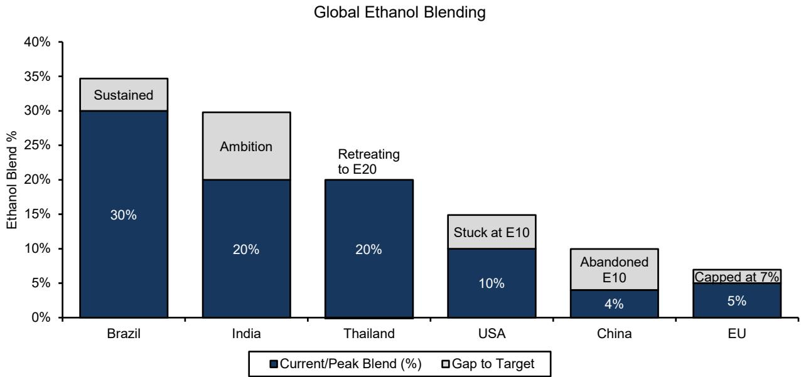  
Source: News Articles, Secondary Research, Bernstein analysis

EXHIBIT 11: Thailand's E85 failure is the most recent and directly relevant global precedent for India. It shows that subsidy-dependent high-blend ethanol is structurally unsustainable without Brazil-like conditions.  
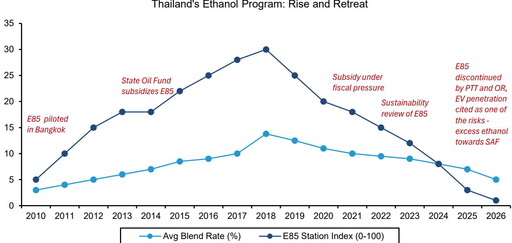  
Source: PTT, OR, Company Data, News Articles, Bernstein analysis

Against these three stands Brazil, the exception that proves the rule - and even Brazil should temper rather than inflame the ambition. Brazil sustains high blends because it has what no one else has: sugarcane yields near 7,000 litres a hectare, an 8–10 times energy balance, abundant land and water, and a pricing market that lets ethanol float against gasoline. After fifty years and a 90% flex fleet, Brazil's effective average blend is about E30 - a destination India can approach by the cheaper road.

## EXHIBIT 12: India scores below Brazil on every metric suitable for ethanol production

Brazil vs India: Why India cannot borrow Brazil's conclusion

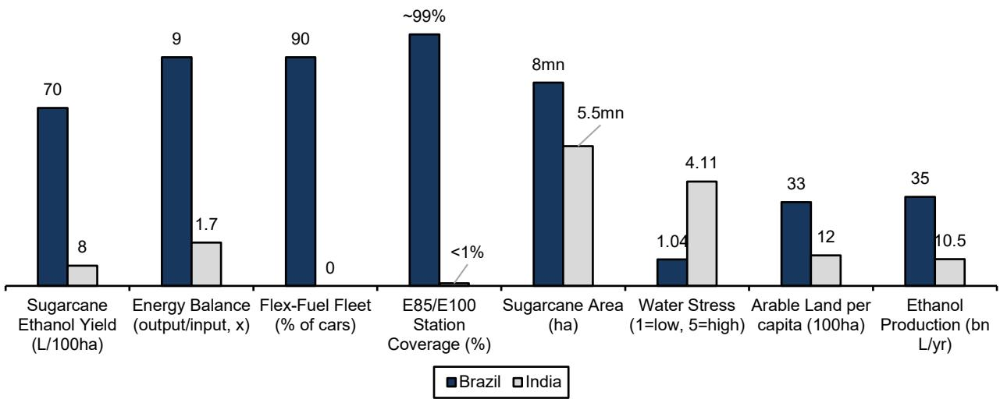  
Source: News Articles, Secondary Research, Bernstein analysis

## OUR CONCLUSION: BANK THE TWENTY-FIVE, SKIP THE SECOND FUEL SYSTEM

India's ethanol programme has earned the credit it now receives. Reaching E20 across a vast and complex vehicle fleet, five years ahead of schedule and on a domestic feedstock base, is a meaningful achievement in both policy and execution. We begin from a position of respect for what has been accomplished, and then draw a clear distinction on what should come next.

## Bank the blending stretch, but remain realistic.

E25, and potentially E27 by 2030, appears achievable for new vehicles entering the fleet from 2025 onward. However, the transition is more challenging for the large base of pre-2023 vehicles, which still accounts for over 80 percent of today's parc and was built for E10. The path forward here requires either a retrofit ecosystem that can scale rapidly at an affordable cost, or an acceptance that legacy vehicles may face measurable impacts on mileage and wear. The government's decision, as recently as May 2026, to assign ARAI the task of studying E25's impact on existing vehicles underscores that even regulators are not yet fully confident about the fleet's ability to absorb this shift.

This makes E25 a logical next step, but not a costless one. It leverages existing engines and fuel systems, benefits integrated producers that can shift between cane and grain depending on monsoon patterns and water availability, and limits incremental burden on consumers relative to E20. The structural constraint, however, remains unchanged. Feedstock is rain-dependent, meaning that even at E25, water risk cannot be mitigated simply through capacity expansion.

## Be deliberate before building beyond the blend wall.

Moving further would require constructing an entirely new national fuel system. Our analysis suggests that the incremental benefit from such a system is modest, contributing roughly 1 to 1.5 percentage points reduction in the crude bill from passenger vehicles by 2030, or up to 3 percentage points if extended to two-wheelers. This sits against a broader 6 to 7 percentage point reduction that blending and electrification are already positioned to deliver. The economic case therefore rests largely on a hedge that pays off primarily in periods of crude price spikes, reflecting a logic rooted in a time when alternatives to oil were limited. Today, electrification, hybrids and CNG have significantly altered that landscape. Flex-fuel infrastructure is not conceptually flawed, but for India, its moment may already have passed.

## The monsoon remains the central risk.

India's ethanol strategy ultimately rests on an agricultural base that is tied to rainfall. At moderate levels of ambition, such as E20 or even E25, this foundation can be managed. Variability in output can be smoothed, as seen in 2023. However, as targets rise, so does the system's vulnerability to a weak monsoon. In such scenarios, the programme's foreign exchange benefits also erode if imports of feedstock become necessary. Brazil's strategy was built on abundant land and water, and at a time when fuel alternatives were scarce. India would be pursuing a similar path under more constrained natural conditions and in a markedly different technological context.

## A precise, not directional, posture is warranted.

The value in this decade lies in extending the blending range to E25 to E27, supporting feedstock-flexible producers, and strengthening the ecosystem around E20-compliant engines and strong hybrids. Flex-fuel remains an option worth preserving, but as a low-cost hedge rather than a large-scale build-out. This stance would change under three conditions: a sustained crude price above \$90 to \$100 per barrel, a genuine breakthrough in second-generation feedstock, or a clear slowdown in the cost and performance curve of electric vehicles. Absent these signals, the conclusion is straightforward. India has successfully reached E20, can reasonably advance to E25, and should weigh carefully before committing significant capital to a strategy whose strategic relevance has diminished over time.

## SUMMARY

India's ethanol programme should, in our view, be assessed in two distinct parts.

The first is the move from E20 toward E25 to E27 by 2030. This could be achievable for new vehicles, but remains conditional for the broader fleet. Distillation capacity is already in place, the September 2025 reinstatement of cane has restored feedstock flexibility, the vehicle base is gradually shifting toward E20-tuned engines, and the regulatory framework, including E22 to E30 specifications and excise support, has already been established. The more difficult reality is that over 80 percent of vehicles currently on the road were originally built for E10. Even E20 is already associated with mileage and fuel-system concerns in parts of this legacy fleet, and the government has only recently tasked ARAI with studying the impact of E25 on existing vehicles. In that context, the stretch to E25 is credible for new sales, and only conditionally so for the existing stock, provided retrofit kits scale meaningfully or scrappage accelerates. We remain cautiously constructive on this part of the story. The key constraint is feedstock sustainability, which remains closely tied to monsoon outcomes and water availability.

The second is the push beyond the blend wall through flex-fuel vehicles and a national E85 to E100 supply chain. Here our caution increases as the numbers are examined more closely. Our stock-and-flow model of the vehicle parc suggests that fleet turnover is simply too slow for aggressive flow-side policy to materially change the picture by 2030. Even if every new petrol passenger vehicle were phased out from next year, petrol vehicles would still account for roughly 45 to 50 percent of the fleet by end-2030, compared with 65 to 70 percent today, while flex-fuel vehicles would make up only around 10 to 12 percent. The resulting crude import saving is approximately 5 percent, and more than two-thirds of that comes from higher blending and the growing contribution of EVs, hybrids and CNG. The flex-fuel passenger vehicle contribution on its own is only around 1 to 1.5 percentage points. Including flex-fuel two-wheelers lifts that contribution to roughly 3 percentage points, and the all-in saving to around 6 to 7 percent, which is broadly comparable to what rising EV and hybrid penetration in passenger vehicles could achieve anyway. On that basis, the marginal return from building an entirely parallel fuel system appears limited.

The strongest argument in favour of building such a system is the hedge it provides. A flex-fuel fleet allows consumers to switch toward ethanol when crude prices spike, as Brazil has demonstrated over time. We take that argument seriously, but its relevance to India is moderated by three considerations. First, ethanol is not cheaper than crude-based petrol procurement for oil marketing companies on a pre-tax basis, with ethanol at about INR 61 per litre against a petrol making cost closer to INR 55 per litre. This means the hedge is valuable mainly in periods of severe crude stress. Second, Brazil built this system over several decades, beginning in a very different era, before alternatives such as EVs existed. Third, India today already has other pathways to reduce both import dependence and emissions, through EVs, hybrids and rising CNG penetration, without creating a single-purpose supply chain. We would become more constructive on this second leg only under three conditions: a structurally higher crude price above \$90 to \$100 per barrel, a genuine breakthrough in second-generation feedstock that is neither food-based nor irrigation-intensive, or a clear stall in the EV cost and range curve. Absent those developments, the case for a parallel supply chain remains weak, with significant capital being deployed for a relatively modest payoff.

## APPENDIX - FINANCIAL FORECASTS

EXHIBIT 13: Maruti Suzuki Financial Summary

<table><tr><td>P&amp;L (Rs mn)</td><td>FY26A</td><td>FY27E</td><td>FY28E</td></tr><tr><td>Revenue</td><td>1,832,661</td><td>2,043,919</td><td>2,232,218</td></tr><tr><td>EBITDA</td><td>214,502</td><td>232,034</td><td>260,532</td></tr><tr><td>EBIT</td><td>147,097</td><td>142,979</td><td>160,477</td></tr><tr><td>Other income</td><td>43,919</td><td>53,404</td><td>61,752</td></tr><tr><td>Pretax income</td><td>188,629</td><td>193,997</td><td>219,842</td></tr><tr><td>Tax</td><td>44,175</td><td>46,559</td><td>52,762</td></tr><tr><td>Net income</td><td>144,454</td><td>147,437</td><td>167,080</td></tr><tr><td>EPS (adjusted)</td><td>459.46</td><td>468.95</td><td>531.43</td></tr><tr><td>EPS (reported)</td><td>459.46</td><td>468.95</td><td>531.43</td></tr><tr><td>Diluted shares (mn)</td><td>314</td><td>314</td><td>314</td></tr><tr><td>DPS (Rs)</td><td>140</td><td>141</td><td>159</td></tr></table>

<table><tr><td>Key ratios/metrics</td><td>FY26A</td><td>FY27E</td><td>FY28E</td></tr><tr><td>Revenue growth</td><td>19.9%</td><td>11.5%</td><td>9.2%</td></tr><tr><td>PAT growth</td><td>0.7%</td><td>2.1%</td><td>13.3%</td></tr><tr><td>EBITDA margin</td><td>11.7%</td><td>11.4%</td><td>11.7%</td></tr><tr><td>EBIT margin</td><td>8.0%</td><td>7.0%</td><td>7.2%</td></tr><tr><td>Pre-tax margin</td><td>10.3%</td><td>9.5%</td><td>9.8%</td></tr><tr><td>PAT margin</td><td>7.9%</td><td>7.2%</td><td>7.5%</td></tr><tr><td>Tax</td><td>23.4%</td><td>24.0%</td><td>24.0%</td></tr><tr><td>ROE</td><td>13.7%</td><td>12.8%</td><td>13.1%</td></tr><tr><td>ROE(ex-cash)</td><td>19.1%</td><td>18.9%</td><td>22.0%</td></tr></table>

Source: Company Data, Bernstein analysis and estimates

<table><tr><td>Balance sheet</td><td>FY26A</td><td>FY27E</td><td>FY28E</td></tr><tr><td>Fixed assets</td><td>826,295</td><td>926,295</td><td>1,026,295</td></tr><tr><td>Cash and equivalents</td><td>457,241</td><td>573,611</td><td>714,097</td></tr><tr><td>Net debt/(funds)</td><td>(751,157)</td><td>(867,527)</td><td>(1,008,013)</td></tr><tr><td>Shareholders&#x27; equity</td><td>1,051,098</td><td>1,154,519</td><td>1,277,369</td></tr><tr><td>Current assets</td><td>389,112</td><td>436,147</td><td>563,194</td></tr><tr><td>Current liabilities</td><td>364,772</td><td>370,621</td><td>404,765</td></tr><tr><td>Change in WC</td><td>16,375</td><td>45,184</td><td>17,583</td></tr><tr><td>CFO</td><td>190,631</td><td>230,659</td><td>225,352</td></tr><tr><td>Capital expenditure</td><td>(103,964)</td><td>(100,000)</td><td>(100,000)</td></tr><tr><td>FCFF</td><td>86,667</td><td>130,659</td><td>125,352</td></tr><tr><td>BVPS</td><td>3,343</td><td>3,672</td><td>4,063</td></tr></table>

<table><tr><td>Operating metrics</td><td>FY26A</td><td>FY27E</td><td>FY28E</td></tr><tr><td>Total volumes (&#x27;000)</td><td>2,423</td><td>2,605</td><td>2,744</td></tr><tr><td>Domestic Cars</td><td>922</td><td>968</td><td>968</td></tr><tr><td>Domestic UVs</td><td>761</td><td>799</td><td>855</td></tr><tr><td>Domestic Vans</td><td>140</td><td>141</td><td>144</td></tr><tr><td>Domestic LCV</td><td>39</td><td>39</td><td>40</td></tr><tr><td>Total domestic</td><td>1,862</td><td>1,948</td><td>2,007</td></tr><tr><td>Exports</td><td>448</td><td>524</td><td>587</td></tr><tr><td>Realisation per car (Rs)</td><td>719,758</td><td>748,548</td><td>778,490</td></tr></table>

EXHIBIT 14: M&M Financial Summary

<table><tr><td>P&amp;L (Rs mn)</td><td>FY26A</td><td>FY27E</td><td>FY28E</td></tr><tr><td>Revenue</td><td>1,455,758</td><td>1,604,602</td><td>1,803,423</td></tr><tr><td>EBITDA</td><td>209,775</td><td>246,681</td><td>278,638</td></tr><tr><td>EBIT</td><td>166,848</td><td>194,444</td><td>218,986</td></tr><tr><td>Other Income</td><td>41,890</td><td>49,277</td><td>57,301</td></tr><tr><td>Pre-tax income</td><td>206,242</td><td>241,678</td><td>274,358</td></tr><tr><td>Tax</td><td>49,498</td><td>56,794</td><td>64,474</td></tr><tr><td>Net income (adj)</td><td>156,744</td><td>184,884</td><td>209,884</td></tr><tr><td>EPS (adj)</td><td>126.0</td><td>148.6</td><td>168.6</td></tr><tr><td>EPS (reported)</td><td>126.0</td><td>148.6</td><td>168.6</td></tr><tr><td>Diluted shares (mn)</td><td>1,244</td><td>1,244</td><td>1,245</td></tr><tr><td>DPS (R)</td><td>30.2</td><td>35.7</td><td>40.5</td></tr></table>

<table><tr><td>Balance Sheet</td><td>FY26A</td><td>FY27E</td><td>FY28E</td></tr><tr><td>Fixed assets</td><td>559,341</td><td>654,341</td><td>749,341</td></tr><tr><td>Cash and equivalents</td><td>335,864</td><td>435,082</td><td>564,566</td></tr><tr><td>Net debt/(funds)</td><td>(193,619)</td><td>(292,837)</td><td>(422,321)</td></tr><tr><td>Shareholders&#x27; equity</td><td>734,976</td><td>875,488</td><td>1,035,000</td></tr><tr><td>Current assets</td><td>623,614</td><td>752,253</td><td>921,037</td></tr><tr><td>Current liabilities</td><td>399,929</td><td>440,820</td><td>495,441</td></tr><tr><td>Change in WC</td><td>30,011</td><td>11,470</td><td>15,321</td></tr><tr><td>CFO</td><td>190,288</td><td>201,357</td><td>229,485</td></tr><tr><td>Capital expenditure</td><td>(85,000)</td><td>(95,000)</td><td>(95,000)</td></tr><tr><td>Free cash flow</td><td>95,288</td><td>96,357</td><td>124,485</td></tr><tr><td>BVPS</td><td>591</td><td>704</td><td>831</td></tr></table>

<table><tr><td>Key ratios/metrics</td><td>FY26A</td><td>FY27E</td><td>FY28E</td></tr><tr><td>Revenue growth</td><td>25.0%</td><td>10.2%</td><td>12.4%</td></tr><tr><td>PAT growth</td><td>32.2%</td><td>18.0%</td><td>13.5%</td></tr><tr><td>EBITDA margin</td><td>13.1%</td><td>14.4%</td><td>15.4%</td></tr><tr><td>EBIT margin</td><td>32.1%</td><td>20.0%</td><td>20.0%</td></tr><tr><td>Pre-tax margin</td><td>13.7%</td><td>14.2%</td><td>15.1%</td></tr><tr><td>PAT margin</td><td>10.9%</td><td>10.8%</td><td>11.5%</td></tr><tr><td>Tax</td><td>20.5%</td><td>24.0%</td><td>23.5%</td></tr><tr><td>ROE</td><td>20.5%</td><td>21.3%</td><td>21.1%</td></tr><tr><td>ROE(ex-cash)</td><td>20.4%</td><td>31.9%</td><td>34.1%</td></tr></table>

Source: Company Data, Bernstein analysis and estimates

<table><tr><td>Key metrics</td><td>FY26A</td><td>FY27E</td><td>FY28E</td></tr><tr><td>Auto segment revenue</td><td>1,093,549</td><td>1,208,332</td><td>1,370,687</td></tr><tr><td>Growth YoY (%)</td><td>25%</td><td>10%</td><td>13%</td></tr><tr><td>Farm segment revenue</td><td>364,093</td><td>398,249</td><td>434,814</td></tr><tr><td>Growth YoY (%)</td><td>25%</td><td>9%</td><td>9%</td></tr><tr><td>Automotive volumes</td><td>1,156,346</td><td>1,237,213</td><td>1,349,938</td></tr><tr><td>Growth YoY (%)</td><td>21%</td><td>7%</td><td>9%</td></tr><tr><td>Tractor volumes</td><td>520,554</td><td>556,798</td><td>595,773</td></tr><tr><td>Growth YoY (%)</td><td>18%</td><td>7%</td><td>7%</td></tr></table>

EXHIBIT 15: Bajaj Auto Financial Summary

<table><tr><td>P&amp;L (Rs mn)</td><td>FY26</td><td>FY27E</td><td>FY28E</td><td>Balance Sheet</td><td>FY26</td><td>FY27E</td><td>FY28E</td></tr><tr><td>Revenue</td><td>629,050</td><td>690,187</td><td>768,226</td><td>Fixed assets</td><td>77,346</td><td>86,335</td><td>95,774</td></tr><tr><td>EBITDA</td><td>130,611</td><td>148,429</td><td>166,558</td><td>Cash and equivalents</td><td>328,033</td><td>398,628</td><td>468,412</td></tr><tr><td>EBIT</td><td>124,164</td><td>143,181</td><td>160,729</td><td>Net debt/(funds)</td><td>(235,668)</td><td>(306,263)</td><td>(376,047)</td></tr><tr><td>Other Income</td><td>21,822</td><td>18,983</td><td>22,520</td><td>Shareholders&#x27; equity</td><td>409,077</td><td>473,135</td><td>548,808</td></tr><tr><td>Pre-tax income</td><td>139,515</td><td>152,080</td><td>175,012</td><td>Current assets</td><td>269,224</td><td>339,648</td><td>424,612</td></tr><tr><td>Tax</td><td>33,770</td><td>37,770</td><td>43,503</td><td>Current liabilities</td><td>103,990</td><td>114,096</td><td>126,997</td></tr><tr><td>Net income</td><td>105,745</td><td>114,310</td><td>131,509</td><td>Change in WC</td><td>(7,775)</td><td>10,278</td><td>(2,279)</td></tr><tr><td>EPS (adj)</td><td>386</td><td>409</td><td>471</td><td>CFO</td><td>94,281</td><td>121,938</td><td>121,775</td></tr><tr><td>EPS (reported)</td><td>385</td><td>409</td><td>471</td><td>Capital expenditure</td><td>(8,561)</td><td>(8,989)</td><td>(9,439)</td></tr><tr><td>Diluted shares (mn)</td><td>279</td><td>279</td><td>279</td><td>Free cash flow</td><td>85,720</td><td>112,949</td><td>112,337</td></tr><tr><td>DPS (R)</td><td>180</td><td>180</td><td>200</td><td>BVPS</td><td>1,465</td><td>1,695</td><td>1,966</td></tr></table>

<table><tr><td>Key ratios/metrics</td><td>FY26</td><td>FY27E</td><td>FY28E</td><td>Volume (units - &#x27;000)</td><td>FY26</td><td>FY27E</td><td>FY28E</td></tr><tr><td>Revenue growth</td><td>23.4%</td><td>9.7%</td><td>11.3%</td><td>Domestic 2w</td><td>2,342</td><td>2,525</td><td>2,663</td></tr><tr><td>PAT growth</td><td>39.4%</td><td>56.1%</td><td>22.4%</td><td>Growth YoY (%)</td><td>2%</td><td>8%</td><td>5%</td></tr><tr><td>EBITDA margin</td><td>20.8%</td><td>21.5%</td><td>21.7%</td><td>Export 2w</td><td>1,962</td><td>2,159</td><td>2,286</td></tr><tr><td>EBIT margin</td><td>19.7%</td><td>20.7%</td><td>20.9%</td><td>Growth YoY (%)</td><td>18%</td><td>10%</td><td>6%</td></tr><tr><td>Pre-tax margin</td><td>22.2%</td><td>22.0%</td><td>22.8%</td><td>Domestic 3w</td><td>517</td><td>543</td><td>586</td></tr><tr><td>PAT margin</td><td>16.8%</td><td>16.6%</td><td>17.1%</td><td>Growth YoY (%)</td><td>8%</td><td>5%</td><td>8%</td></tr><tr><td>Tax</td><td>24.2%</td><td>24.8%</td><td>24.9%</td><td>Export 3w</td><td>461</td><td>553</td><td>591</td></tr><tr><td>ROE</td><td>25.8%</td><td>24.2%</td><td>24.0%</td><td>Growth YoY (%)</td><td>50%</td><td>20%</td><td>7%</td></tr></table>

Source: Company Data, Bernstein analysis and estimates

EXHIBIT 16: Eicher Motors Financial Summary

<table><tr><td>P&amp;L (Rs mn)</td><td>FY25A</td><td>FY26</td><td>FY27E</td><td>FY28E</td></tr><tr><td>Revenue</td><td>188,704</td><td>234,076</td><td>257,649</td><td>307,304</td></tr><tr><td>EBITDA</td><td>47,120</td><td>57,851</td><td>65,501</td><td>78,007</td></tr><tr><td>EBIT</td><td>39,827</td><td>49,447</td><td>56,222</td><td>67,998</td></tr><tr><td>Other Income</td><td>13,049</td><td>14,865</td><td>16,055</td><td>17,018</td></tr><tr><td>Pre-tax income</td><td>59,331</td><td>71,021</td><td>79,596</td><td>93,336</td></tr><tr><td>Tax</td><td>11,986</td><td>15,868</td><td>17,190</td><td>20,248</td></tr><tr><td>Net income</td><td>47,344</td><td>55,152</td><td>62,405</td><td>73,088</td></tr><tr><td>EPS (adj)</td><td>173</td><td>203</td><td>228</td><td>267</td></tr><tr><td>EPS (reported)</td><td>173</td><td>201</td><td>228</td><td>267</td></tr><tr><td>Diluted shares (mn)</td><td>274</td><td>274</td><td>274</td><td>274</td></tr><tr><td>DPS (R)</td><td>61</td><td>71</td><td>80</td><td>93</td></tr></table>

<table><tr><td>Key ratios/metrics</td><td>FY25A</td><td>FY26</td><td>FY27E</td><td>FY28E</td></tr><tr><td>Revenue growth</td><td>14.1%</td><td>24.0%</td><td>10.1%</td><td>19.3%</td></tr><tr><td>PAT growth</td><td>18.3%</td><td>17.7%</td><td>12.0%</td><td>17.1%</td></tr><tr><td>EBITDA margin</td><td>25.0%</td><td>24.7%</td><td>25.4%</td><td>25.4%</td></tr><tr><td>EBIT margin</td><td>21.1%</td><td>21.1%</td><td>21.8%</td><td>22.1%</td></tr><tr><td>Pre-tax margin</td><td>31.4%</td><td>30.3%</td><td>30.9%</td><td>30.4%</td></tr><tr><td>PAT margin</td><td>25.1%</td><td>23.6%</td><td>24.2%</td><td>23.8%</td></tr><tr><td>Tax</td><td>20.2%</td><td>22.3%</td><td>21.6%</td><td>21.7%</td></tr><tr><td>ROE</td><td>22.2%</td><td>22.1%</td><td>21.5%</td><td>21.7%</td></tr><tr><td>ROE(ex-cash)</td><td>39.4%</td><td>42.1%</td><td>47.7%</td><td>56.2%</td></tr><tr><td>NWC days ex-cash</td><td>31</td><td>35</td><td>30</td><td>25</td></tr></table>

<table><tr><td>Balance Sheet</td><td>FY25A</td><td>FY26</td><td>FY27E</td><td>FY28E</td></tr><tr><td>Fixed assets</td><td>68,928</td><td>79,841</td><td>91,299</td><td>103,331</td></tr><tr><td>Cash</td><td>119,131</td><td>145,586</td><td>185,300</td><td>230,991</td></tr><tr><td>Net debt/(funds)</td><td>(116,466)</td><td>(142,521)</td><td>(182,236)</td><td>(227,927)</td></tr><tr><td>Shareholders&#x27; equity</td><td>212,965</td><td>249,174</td><td>289,738</td><td>337,245</td></tr><tr><td>Current assets</td><td>69,542</td><td>111,071</td><td>154,576</td><td>210,856</td></tr><tr><td>Current liabilities</td><td>41,837</td><td>50,220</td><td>55,342</td><td>66,138</td></tr><tr><td>Change in WC</td><td>2,110</td><td>(6,691)</td><td>1,331</td><td>206</td></tr><tr><td>CFO</td><td>39,799</td><td>42,715</td><td>57,611</td><td>66,935</td></tr><tr><td>Capital expenditure</td><td>(10,393)</td><td>(10,913)</td><td>(11,459)</td><td>(12,032)</td></tr><tr><td>Free cash flow</td><td>29,406</td><td>31,802</td><td>46,152</td><td>54,904</td></tr><tr><td>BVPS</td><td>777.8</td><td>910.1</td><td>1,058.2</td><td>1,231.7</td></tr></table>

<table><tr><td>Volume (units - &#x27;000)</td><td>FY25A</td><td>FY26</td><td>FY27E</td><td>FY28E</td></tr><tr><td>Motorcycles Rev.</td><td>169,201</td><td>209,662</td><td>252,919</td><td>301,723</td></tr><tr><td>Growth YoY (%)</td><td>11%</td><td>24%</td><td>21%</td><td>19%</td></tr><tr><td>VECV Rev.</td><td>235,482</td><td>275,790</td><td>303,755</td><td>335,216</td></tr><tr><td>Growth YoY (%)</td><td>8%</td><td>17%</td><td>10%</td><td>10%</td></tr><tr><td>Motorcycles volume</td><td>991,867</td><td>1,226,601</td><td>1,428,480</td><td>1,620,052</td></tr><tr><td>Growth YoY (%)</td><td>10%</td><td>24%</td><td>16%</td><td>13%</td></tr><tr><td>VECV (CV) volumes</td><td>89,055</td><td>101,071</td><td>108,119</td><td>117,105</td></tr><tr><td>Growth YoY (%)</td><td>4%</td><td>13%</td><td>7%</td><td>8%</td></tr></table>

Source: Company Data, Bernstein analysis and estimates

EXHIBIT 17: TVS Motors Financial Summary

<table><tr><td>P&amp;L (Rs mn)</td><td>FY26A</td><td>FY27E</td><td>FY28E</td><td>Balance Sheet</td><td>FY26A</td><td>FY27E</td><td>FY28E</td></tr><tr><td>Revenue</td><td>472,703</td><td>562,015</td><td>637,292</td><td>Fixed assets</td><td>54,381</td><td>63,007</td><td>70,275</td></tr><tr><td>EBITDA</td><td>60,794</td><td>74,188</td><td>86,952</td><td>Cash and equivalents</td><td>41,672</td><td>82,778</td><td>133,889</td></tr><tr><td>EBIT</td><td>51,787</td><td>64,468</td><td>75,691</td><td>Net debt/(funds)</td><td>(25,668)</td><td>(66,773)</td><td>(117,884)</td></tr><tr><td>Other Income</td><td>(300)</td><td>1,800</td><td>1,980</td><td>Shareholders&#x27; equity</td><td>132,431</td><td>177,223</td><td>230,541</td></tr><tr><td>Pre-tax income</td><td>49,035</td><td>64,270</td><td>75,713</td><td>Current assets</td><td>97,617</td><td>151,004</td><td>211,253</td></tr><tr><td>Tax</td><td>12,883</td><td>16,389</td><td>19,307</td><td>Current liabilities</td><td>101,726</td><td>120,945</td><td>137,145</td></tr><tr><td>Net income</td><td>36,566</td><td>47,881</td><td>56,406</td><td>Change in WC</td><td>13,196</td><td>6,938</td><td>7,061</td></tr><tr><td>EPS (adj)</td><td>77.0</td><td>100.8</td><td>118.7</td><td>CFO</td><td>60,693</td><td>64,738</td><td>74,707</td></tr><tr><td>EPS (reported)</td><td>76.1</td><td>100.8</td><td>118.7</td><td>Capital expenditure</td><td>(18,165)</td><td>(18,346)</td><td>(18,530)</td></tr><tr><td>Diluted shares (mn)</td><td>475</td><td>475</td><td>475</td><td>Free cash flow</td><td>42,529</td><td>46,391</td><td>56,177</td></tr><tr><td>DPS (R)</td><td>6.5</td><td>6.5</td><td>6.5</td><td>BVPS</td><td>278.8</td><td>373.0</td><td>485.3</td></tr></table>

<table><tr><td>Key ratios/metrics</td><td>FY26A</td><td>FY27E</td><td>FY28E</td><td>Volume (units - &#x27;000)</td><td>FY26A</td><td>FY27E</td><td>FY28E</td></tr><tr><td>Revenue growth</td><td>30.4%</td><td>18.9%</td><td>13.4%</td><td>Domestic Motorcycles</td><td>1,418</td><td>1,545</td><td>1,669</td></tr><tr><td>PAT growth</td><td>40.4%</td><td>30.9%</td><td>17.8%</td><td>Growth YoY (%)</td><td>18%</td><td>9%</td><td>8%</td></tr><tr><td>EBITDA margin</td><td>12.9%</td><td>13.2%</td><td>13.6%</td><td>Domestic scooters</td><td>2,303</td><td>2,648</td><td>2,966</td></tr><tr><td>EBIT margin</td><td>11.0%</td><td>11.5%</td><td>11.9%</td><td>Growth YoY (%)</td><td>27%</td><td>15%</td><td>12%</td></tr><tr><td>Pre-tax margin</td><td>10.4%</td><td>11.4%</td><td>11.9%</td><td>Domestic Mopeds</td><td>523</td><td>544</td><td>544</td></tr><tr><td>PAT margin</td><td>7.7%</td><td>8.5%</td><td>8.9%</td><td>Growth YoY (%)</td><td>4%</td><td>4%</td><td>0%</td></tr><tr><td>Tax</td><td>26.3%</td><td>25.5%</td><td>25.5%</td><td>Export 2w</td><td>1,411</td><td>1,588</td><td>1,781</td></tr><tr><td>ROE</td><td>27.6%</td><td>27.0%</td><td>24.5%</td><td>Growth YoY (%)</td><td>32%</td><td>13%</td><td>12%</td></tr><tr><td>ROE(ex-cash)</td><td>40.5%</td><td>49.4%</td><td>56.9%</td><td>Total 3w</td><td>219</td><td>255</td><td>284</td></tr><tr><td></td><td></td><td></td><td></td><td>Growth YoY (%)</td><td>63%</td><td>16%</td><td>11%</td></tr></table>

Source: Company Data, Bernstein analysis and estimates

EXHIBIT 18: Hero MotoCorp Financial Summary

<table><tr><td>P&amp;L (Rs mn)</td><td>FY26</td><td>FY27E</td><td>FY28E</td><td>Balance Sheet</td><td>FY26</td><td>FY27E</td><td>FY28E</td></tr><tr><td>Revenue</td><td>468,301</td><td>491,849</td><td>556,182</td><td>Fixed assets</td><td>52,466</td><td>57,257</td><td>59,757</td></tr><tr><td>EBITDA</td><td>68,708</td><td>70,114</td><td>80,722</td><td>Cash &amp; equivalents</td><td>136,667</td><td>159,343</td><td>193,719</td></tr><tr><td>EBIT</td><td>60,728</td><td>61,614</td><td>72,222</td><td>Net debt/(funds)</td><td>(136,667)</td><td>(159,343)</td><td>(193,719)</td></tr><tr><td>Other Income</td><td>10,410</td><td>11,000</td><td>11,000</td><td>Shareholders&#x27; equity</td><td>215,781</td><td>244,425</td><td>281,056</td></tr><tr><td>Pre-tax income</td><td>69,720</td><td>72,364</td><td>82,946</td><td>Current assets</td><td>160,077</td><td>186,146</td><td>229,792</td></tr><tr><td>Tax</td><td>17,038</td><td>17,758</td><td>20,355</td><td>Current liabilities</td><td>83,830</td><td>88,045</td><td>99,561</td></tr><tr><td>Net income</td><td>52,682</td><td>54,606</td><td>62,591</td><td>Change in WC</td><td>6,612</td><td>822</td><td>2,246</td></tr><tr><td>EPS (adj)</td><td>270</td><td>273</td><td>313</td><td>CFO</td><td>57,092</td><td>53,178</td><td>62,613</td></tr><tr><td>EPS (reported)</td><td>270</td><td>273</td><td>313</td><td>Capital expenditure</td><td>(11,000)</td><td>(11,000)</td><td>(11,000)</td></tr><tr><td>Diluted shares (mn)</td><td>200</td><td>200</td><td>200</td><td>Free cash flow</td><td>46,092</td><td>42,178</td><td>51,613</td></tr><tr><td>DPS (R)</td><td>130</td><td>130</td><td>130</td><td>BVPS</td><td>1,081</td><td>1,224</td><td>1,407</td></tr></table>

<table><tr><td>Key ratios/metrics</td><td>FY26</td><td>FY27E</td><td>FY28E</td><td>Volume (units - &#x27;000)</td><td>FY26</td><td>FY27E</td><td>FY28E</td></tr><tr><td>Revenue growth</td><td>14.9%</td><td>5.0%</td><td>13.1%</td><td>Domestic Motorcycles</td><td>5,493</td><td>5,768</td><td>6,229</td></tr><tr><td>PAT growth</td><td>14.1%</td><td>3.7%</td><td>14.6%</td><td>Growth YoY (%)</td><td>5%</td><td>5%</td><td>8%</td></tr><tr><td>EBITDA margin</td><td>14.7%</td><td>14.3%</td><td>14.5%</td><td>Domestic Scooters</td><td>573</td><td>659</td><td>791</td></tr><tr><td>EBIT margin</td><td>13.0%</td><td>12.5%</td><td>13.0%</td><td>Growth YoY (%)</td><td>46%</td><td>15%</td><td>20%</td></tr><tr><td>Pre-tax margin</td><td>14.9%</td><td>14.7%</td><td>14.9%</td><td>Export Motorcycles</td><td>312</td><td>375</td><td>450</td></tr><tr><td>PAT margin</td><td>11.2%</td><td>11.1%</td><td>11.3%</td><td>Growth YoY (%)</td><td>41%</td><td>20%</td><td>20%</td></tr><tr><td>Tax</td><td>24.4%</td><td>24.5%</td><td>24.5%</td><td>Export scooters</td><td>53</td><td>75</td><td>93</td></tr><tr><td>ROE</td><td>24.4%</td><td>22.3%</td><td>22.3%</td><td>Growth YoY (%)</td><td>71%</td><td>40%</td><td>25%</td></tr><tr><td>ROE(ex-cash)</td><td>57.4%</td><td>55.1%</td><td>62.9%</td><td></td><td></td><td></td><td></td></tr></table>

Source: Company Data, Bernstein analysis and estimates

## I. REQUIRED DISCLOSURES

References to "Bernstein" or the "Firm" in these disclosures relate to the following entities: Bernstein Institutional Services LLC (April 1, 2024 onwards), Bernstein & Co., LLC (pre April 1, 2024), Bernstein Autonomous LLP, BSG France S.A. (April 1, 2024 onwards), Bernstein (Hong Kong) Limited 盛博香港有限公司, Bernstein (Canada) Limited, Bernstein (India) Private Limited (SEBI registration no. INH000006378), Bernstein (Singapore) Private Limited, Bernstein Japan KK (サンフォード・C・バーンスタイン株式会社) and analysts employed by SG Africa Technologies & Services to produce Bernstein under a Global Services Agreement in place between Bernstein and SG.

Bernstein is part of a joint venture between SG (SG) and AllianceBernstein, L.P. (AB). Unless specifically noted otherwise, for purposes of these disclosures, references to Bernstein's “affiliates” relate to both SG and AB and their respective affiliates.

## VALUATION METHODOLOGY

## Maruti Suzuki India Ltd

We arrive at our price target of INR18,200 for Maruti Suzuki on DCF (10.5% wacc, 4% terminal growth, FY35 terminal year, 7% volume estimates, 10% ebitda cagr) and the price target implies a P/E multiple of 31x FY28E earnings. A 12% earnings CAGR is estimated from FY26-28E.

## Mahindra & Mahindra Ltd

To arrive at our Rs 4,200 price target, we value M&M on a sum of the parts' basis with its standalone + MVML (ex S&A dividends) business valued at 21.6x FY27/28E. We value the listed subsidiaries, financial services, Tech Mahindra, and auto comps subsidiary at market cap and then apply a holding company discount of 20%. In addition, we value the 92% stake which is valued at \$10bn.

## Hero MotoCorp Ltd

We value Hero MotoCorp on a standalone DCF basis at INR 4,370, implying 16x FY28E earnings. The DCF assumes a 10.6% discount rate, 1.5% terminal growth, and explicit forecasts through FY37, with revenue and EBITDA modelled at 5.8% and 6.5% CAGR respectively over FY23-FY37E. We add INR 640 per share for associate investments in Ather Energy (current market capitalisation), Hero Fincorp (FY25 book value) and Euler Motors (cost), net of a 10% holdco discount. This gives a price target of INR5,010 for Hero MotoCorp.

## Eicher Motors Ltd

We value Eicher Motors at a PT of INR 7,000 using SOTP method - based on DCF for 2W business with an implied PE multiple of 31x on FY27E earnings and using a 20x PE multiple on FY27E for its CV business. Our DCF valuations is based on 10.5% discount rate, 4% terminal growth and explicit forecasts until FY37. Revenue and EBITDA growth built in our DCF model from FY23-FY37E are 14.6%/15% CAGR.

## Bajaj Auto Ltd

We value Bajaj Ltd at a PT of INR11,500 using DCF valuations (10% discount rate, 3% terminal growth and explicit forecasts until FY35). Revenue and EBITDA growth built in our DCF model from FY25-FY35E are 11%/10.4% CAGR. We believe the critical upside could emerge from higher-than-expected long-term EBITDA margins and a scale-up in EV segments. Implied PE multiple is 24x on FY28E earnings.

## TVS Motor Co Ltd

We value TVS Motors at a PT of INR3,460 based on SOTP.

Standalone business is valued at INR 3200 per share using DCF with an implied multiple of 32x on FY27E earnings for the core 2W business. Our DCF valuations is based on 10.5% discount rate, 3% terminal growth and explicit forecasts until FY37. Revenue and EBITDA growth built in our DCF model from FY26-FY37E are 11.1%/13.3% CAGR. We assign INR 120 per share to TVS Credit (value estimated at 2.5x P/B on FY25 Book Value) and INR 140 per share to other investments (valued at 1x P/B on FY25

book value).

## RISKS

## Maruti Suzuki India Ltd

Downside risks to our price target include 1) Slowdown in overall PV demand, 2) Significant increase in new competitors due to the new EV policy, 3) Massive increase in commodity prices, especially Steel and 4) Inability to recover share due to lack of traction in the new launches remains a risk

## Mahindra & Mahindra Ltd

Downside risk emerges from slower-than-expected recovery tractors industry growth and/or market share loss for M&M. A weak monsoon season will also impact the performance of tractors. Failure to improve margins for the automotive business also poses risk.

## Hero MotoCorp Ltd

Upside risks stem from 1) strong rural recovery driving growth for entry-level motorcycles, 2) creating a successful product in premium motorcycle and/or electric vehicle segment.

Downside risk stem from 1) Continued weakness in rural, disproportionately impacting volumes as it is heavily exposed to entry level segment. 2) Lower than expected scale up of its EV model (Hero Vida)

## Eicher Motors Ltd

Downside risk emerges from higher competition in the premium 2W segment (Harley Davidson etc) and weakness in exports. In addition, lack of EV products could trigger a risk to PE multiples. Upside risks for Eicher include better than expected domestic market for premium bikes as the top end of households remains resilient.

## Bajaj Auto Ltd

Downside risk emerges from weaker than expected margins performance and continued weakness in export market and/or 3W segment.

## TVS Motor Co Ltd

Upside risks stem from sharper-than-expected recovery in margins. Downside risk emerges from a loss of share in the scooter market as EV penetration increases. Another risk is lower than expected scale up of its EV model (TVS lqube).

## RATINGS DEFINITIONS, BENCHMARKS AND DISTRIBUTION

## EQUITY RATINGS DEFINITIONS

## Bernstein brand

The Bernstein brand rates stocks based on forecasts of relative performance for the next 12 months versus the S&P 500 for stocks listed on the U.S. and Canadian exchanges, versus the Bloomberg Europe Developed Markets Large and Mid Cap Price Return Index EUR (EDME) for stocks listed on the European exchanges and emerging markets exchanges outside of the Asia Pacific region, versus the Bloomberg Japan Large and Mid Cap Price Return Index USD (JPL) for stocks listed on the Japanese exchanges, and versus the Bloomberg Asia ex-Japan Large and Mid Cap Price Return Index (ASIAX) for stocks listed on the Asian (ex-Japan) exchanges -unless otherwise specified.

The Bernstein brand has three categories of ratings:

\- Outperform: Stock will outpace the market index by more than 15 pp

• Market-Perform: Stock will perform in line with the market index to within +/-15 pp

• Underperform: Stock will trail the performance of the market index by more than 15 pp

Coverage Suspended: Coverage of a company under the Bernstein brand has been suspended. Ratings and price targets are suspended temporarily, are no longer current, and should therefore not be relied upon.

Not Rated: A rating assigned when the stock cannot be accurately valued, or the performance of the company accurately predicted, at the present time. The covering analyst may continue to publish research reports on the company to update investors on events and developments.

Not Covered (NC) denotes companies that are not under coverage.

Bernstein brand stock ratings are based on a 12-month time horizon.

## Autonomous brand – common stocks

The Autonomous brand rates common stocks as indicated below. As our benchmarks we use the Bloomberg Europe 500 Banks And Financial Services Index (BEBANKS) and Bloomberg Europe Dev Mkt Financials Large and Mid Cap Price Ret Index EUR (EDMFI) index for developed European banks and Payments, the Bloomberg Europe 500 Insurance Index (BEINSUR) for European insurers, the S&P 500 and S&P Financials for US banks and Payments coverage, S5LIFE for US Insurance, the S&P Insurance Select Industry (SPSIINS) for US Non-Life Insurers coverage, and the Bloomberg Emerging Markets Financials Large, Mid and Small Cap Price Return Index (EMLSF) for emerging market banks and insurers and Payments. Ratings are stated relative to the sector (not the market).

The Autonomous brand has three categories of common stock ratings:

\- Outperform (OP): Stock will outpace the relevant index by more than 10 pp

\- Neutral (N): Stock will perform in line with the market index to within +/-10 pp

\- Underperform (UP): Stock will trail the performance of the relevant index by more than 10 pp

Coverage Suspended: Coverage of a company under the Autonomous research brand has been suspended. Ratings and price targets are suspended temporarily, are no longer current, and should therefore not be relied upon.

Not Rated: A rating assigned when the stock cannot be accurately valued, or the performance of the company accurately predicted, at the present time. The covering analyst may continue to publish research reports on the company to update investors on events and developments.

Those denoted as ‘Feature’ (e.g., Feature Outperform FOP, Feature Under Outperform FUP) are our core ideas.

Not Covered (NC) denotes companies that are not under coverage.

Autonomous brand common stock ratings are based on a 12-month time horizon.

## Autonomous brand – preferred stocks

The Autonomous brand has three categories of preferred stock ratings:

\- Outperform (OP): The total return of the preferred instrument is expected to outperform preferred securities of other issuers operating in similar sectors or rating categories over the next six months.

\- Neutral (N): The total return of the preferred instrument is expected to perform in line with preferred securities of other issuers operating in similar sectors or rating categories over the next six months.

\- Underperform (UP): The total return of the preferred instrument is expected to underperform preferred securities of other issuers operating in similar sectors or rating categories over the next six months.

Autonomous preferred stock ratings are based on a 6-month time horizon.

## AUTONOMOUS CREDIT RESEARCH

Where this report contains investment recommendations for credit instruments, as defined in article 3(1)(35) of the Market Abuse Regulation, the information below is presented to comply with its disclosure requirements.

The report may also include reference(s) to published opinions by other Autonomous or Bernstein analysts covering the equity securities of the issuer(s) referenced herein. Please note an investment recommendation for credit instruments published by the author(s) of this report may differ from the published view of the analyst covering equity securities for the issuer(s) contained in this report and vice versa.

## CREDIT RATINGS DEFINITIONS

The Autonomous brand has three categories of credit ratings:

\- Credit Outperform (C-OP): The total return of the Reference Credit Instrument is expected to outperform the credit spread of bonds of other issuers operating in similar sectors or rating categories over the next six months.

\- Credit Neutral (C-N): The total return of the Reference Credit Instrument is expected to perform in line with the credit spread of bonds of other issuers operating in similar sectors or rating categories over the next six months.

\- Credit Underperform (C-UP): The total return of the Reference Credit Instrument is expected to underperform the credit spread of bonds of other issuers operating in similar sectors or rating categories over the next six months.

Autonomous credit ratings are based on a 6-month time horizon.

A list of all investment recommendations produced by the author(s) of this report alongside credit ratings history are available upon request.

It is at the sole discretion of the Firm as to when to initiate, update and cease research coverage. The Firm has established, maintains and relies on information barriers to control the flow of information contained in one or more areas (i.e. the private side) within the Firm, and into other areas, units, groups or affiliates (i.e. public side) of the Firm

## DISTRIBUTION OF EQUITY RATINGS/INVESTMENT BANKING SERVICES

<table><tr><td>Equity Rating</td><td>Market Abuse Regulation (MAR) and FINRA Rating Category</td><td>Global Rating Distribution</td><td>Investment Banking Relationships*</td></tr><tr><td>Outperform</td><td>BUY</td><td>51.1%</td><td>16.5%</td></tr><tr><td>Market-Perform (Bernstein Brand) Neutral (Autonomous Brand)</td><td>HOLD</td><td>36.3%</td><td>17.8%</td></tr><tr><td>Underperform</td><td>SELL</td><td>12.6%</td><td>14.9%</td></tr></table>

Outperform (O); Market-Perform (M); Underperform (U); Coverage Suspended (CS); Not Covered (NC)

## PRICE CHARTS / RATINGS AND PRICE TARGET HISTORY

Maruti Suzuki India Ltd (MSIL.IN) Rating History for Bernstein as of 06/22/2026  
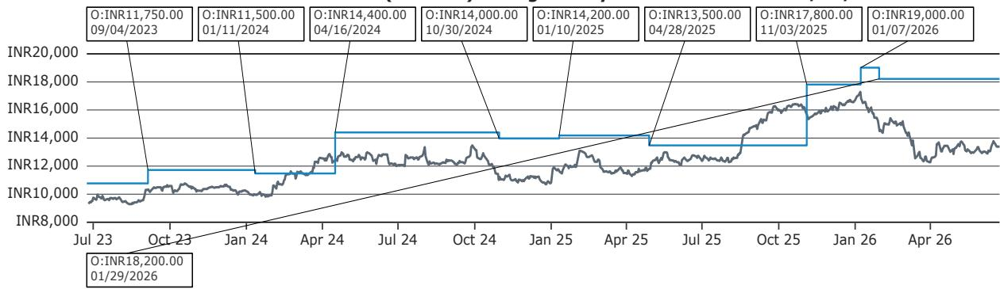  
Outperform (O); Market-Perform (M); Underperform (U); Coverage Suspended (CS); Not Covered (NC)

Mahindra & Mahindra Ltd (MM.IN) Rating History for Bernstein as of 06/22/2026  
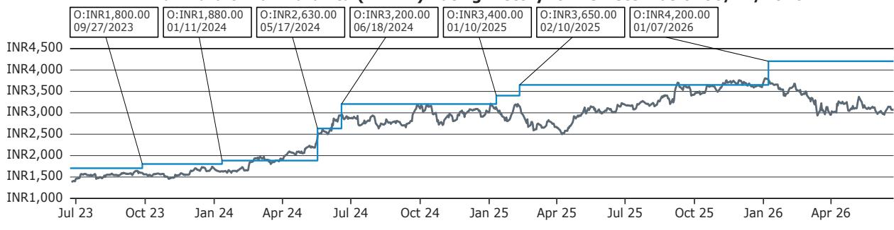  
Outperform (O); Market-Perform (M); Underperform (U); Coverage Suspended (CS); Not Covered (NC)

Hero MotoCorp Ltd (HMCL.IN) Rating History for Bernstein as of 06/22/2026  
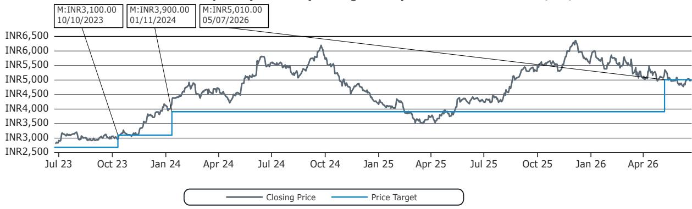

Outperform (O); Market-Perform (M); Underperform (U); Coverage Suspended (CS); Not Covered (NC)

Eicher Motors Ltd (EIM.IN) Rating History for Bernstein as of 06/22/2026  
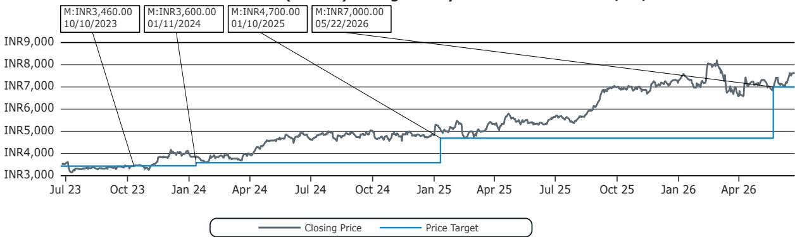

Bajaj Auto Ltd (BJAUT.IN) Rating History for Bernstein as of 06/22/2026  
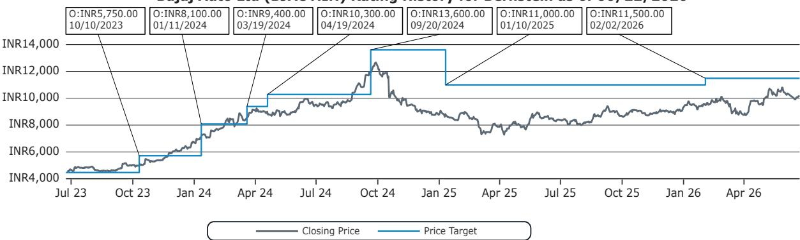  
Outperform (O); Market-Perform (M); Underperform (U); Coverage Suspended (CS); Not Covered (NC)

TVS Motor Co Ltd (TVSL.IN) Rating History for Bernstein as of 06/22/2026  
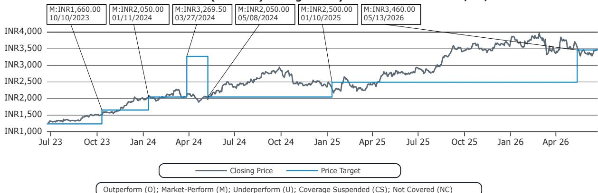  
All price target and closing price data in the chart(s) above are denominated in the currency noted in the Ticker Table of this report.

## CONFLICTS OF INTEREST

SG and/or its affiliates beneficially own 0.5% or more of [the total issued share capital/any class of common equity securities] with a net [long/short] position of: Hero MotoCorp Ltd.

An affiliate of Bernstein has received compensation for non-investment banking securities-related products or services in the previous twelve months from the following clients: Mahindra & Mahindra Ltd.

Bernstein and/or affiliates have received compensation for non-investment banking securities-related products or services in the previous twelve months from the following clients: Mahindra & Mahindra Ltd.

## OTHER MATTERS

The legal entity(ies) employing the analyst(s) listed in this report, and their location, can be determined by the country code of their phone number, as follows:

+1 Bernstein Institutional Services LLC; New York, New York, USA

+44 Bernstein Autonomous LLP; London UK

+212 SG Africa Technologies & Services; Casablanca, Morocco

+33 BSG France S.A.; Paris, France

+34 BSG France S.A.; Madrid, Spain

+41 Bernstein Autonomous LLP; Geneva, Switzerland

+49 BSG France S.A.; Frankfurt, Germany

+91 Bernstein (India) Private Limited; Mumbai, India

+852 Bernstein (Hong Kong) Limited 盛博香港有限公司; Hong Kong, China

+65 Bernstein (Singapore) Private Limited; Singapore

+81 Bernstein Japan KK; Tokyo, Japan

Where this report has been prepared by research analyst(s) employed by a non-US affiliate, such analyst(s), is/are (unless otherwise expressly noted below) not registered as associated persons of Bernstein Institutional Services LLC or any other SEC-registered broker-dealer and are not licensed or qualified as research analysts with FINRA. Accordingly, such analyst(s) may not be subject to FINRA's restrictions regarding (among other things) communications by research analysts with a subject company, interactions between research analysts and investment banking personnel, participation by research analysts in solicitation and marketing activities relating to investment banking transactions, public appearances by research analysts, and trading securities held by a research analyst account.

Where this report has been prepared by research analyst(s) employed by SG Africa Technologies & Services (part of the SG group of companies), it has been prepared on behalf of a Bernstein company under a Global Services Agreement in place between Bernstein and SG.

## CERTIFICATION

Each research analyst listed in this report, who is primarily responsible for the preparation of the content of this report, certifies that all of the views expressed in this publication accurately reflect that analyst's personal views about any and all of the subject securities or issuers and that no part of that analyst's compensation was, is, or will be, directly or indirectly, related to the specific recommendations or views in this publication.

## II. ADDITIONAL GLOBAL CONFLICT DISCLOSURES

It is at the sole discretion of the Firm as to when to initiate, update and cease research coverage. The Firm has established, maintains and relies on information barriers to control the flow of information contained in one or more areas (i.e., the private side) within the Firm, and into other areas, units, groups or affiliates (i.e., public side) of the Firm.

## III. OTHER IMPORTANT INFORMATION AND DISCLOSURES

Separate branding is maintained for “Bernstein” and “Autonomous” research products.

\- Bernstein produces a number of different types of research products including, among others, fundamental analysis and quantitative analysis under both the “Autonomous” and “Bernstein” brands. Recommendations contained within one type of research product may differ from recommendations contained within other types of research products, whether as a result of differing time horizons, methodologies or otherwise. Furthermore, views or recommendations within a research product issued under one brand may differ from views or recommendations under the same type of research product issued under the other brand. The Research Ratings System for the two brands and other information related to those Rating Systems are included in the previous section.

\- Autonomous operates as a separate business unit within the following entities: Bernstein Institutional Services LLC, Bernstein Autonomous LLP, Bernstein (Hong Kong) Limited 盛博香港有限公司 and Bernstein (India) Private Limited. For information relating to “Autonomous” branded products (including certain Sales materials) please visit: www.autonomous.com. For information relating to Bernstein branded products please visit: www.bernsteinresearch.com.

Analysts are compensated based on aggregate contributions to the research franchise as measured by account penetration, productivity and proactivity of investment ideas. No analysts are compensated based on performance in, or contributions to, generating investment banking revenues.

This report has been produced by an independent analyst as defined in Article 3 (1)(34)(i) of EU 596/2014 Market Abuse Regulation (“MAR”) and the same article of MAR as it forms part of United Kingdom domestic law by virtue of the European Union (Withdrawal) Act 2018.

To our readers in the United States: Bernstein Institutional Services LLC, a broker-dealer registered with the U.S. Securities and Exchange Commission (“SEC”) and a member of the U.S. Financial Industry Regulatory Authority, Inc. (“FINRA”) is distributing this publication in the United States and accepts responsibility for its contents. Where this material contains an analysis of debt product(s), such material is intended only for institutional investors and is not subject to the US independence and disclosure standards applicable to debt research prepared for retail investors.

Bernstein Institutional Services LLC may act as principal for its own account or as agent for another person (including an affiliate) in sales or purchases of any security which is a subject of this report. This report does not purport to meet the objectives or needs of any specific individuals, entities or accounts.

To our readers in Canada: If this publication pertains to a Canadian domiciled company, it is being distributed in Canada by Bernstein (Canada) Limited, which is licensed and regulated by the Canadian Investment Regulatory Organization. If the publication pertains to a non-Canadian domiciled company, it is being distributed by Bernstein Institutional Services LLC, which is licensed and regulated by both the SEC and FINRA, into Canada under the International Dealers Exemption.

This document may not be passed onto any person in Canada unless that person qualifies as "permitted client" as defined in Section 1.1 of NI 31-103.

To our readers in Brazil: This report has been prepared by Bernstein Institutional Services LLC, and Banco BTG Pactual S.A. ("BTG") is responsible for the distribution of this report in Brazil.

To readers in the United Kingdom: This publication has been issued or approved for issue in the United Kingdom by Bernstein Autonomous LLP, authorised and regulated by the Financial Conduct Authority and located at 60 London Wall, London EC2M 5SH, +44 (0)20-7170-5000. Registered in England & Wales No OC343985.

This document is for distribution only to persons who (i) have professional experience in matters relating to investments falling within Article 19(5) of the Financial Services and Markets Act 2000 (Financial Promotion) Order 2005 (as amended, the “Financial Promotion Order”), (ii) are persons falling within Article 49(2)(a) to (d) (“high net worth companies, unincorporated associations, etc.”) of the Financial Promotion Order, (iii) are outside the United Kingdom, or (iv) are persons to whom an invitation or inducement to engage in investment activity (within the meaning of section 21 of the FSMA) in connection with the issue or sale of any securities may otherwise lawfully be communicated or caused to be communicated (all such persons together being referred to as “relevant persons”). This document is directed only at relevant persons and must not be acted on or relied on by persons who are not relevant persons. Any investment or investment activity to which this document relates is available only to relevant persons and will be engaged in only with relevant persons.

To our readers in the member states of the EEA: This publication is being distributed by BSG France SA, which is authorised and regulated by the Autorité de Contrôle Prudentiel et de Résolution (ACPR) and Autorité des Marchés Financiers (AMF).

To our readers in Hong Kong: This publication is being distributed in Hong Kong by Bernstein (Hong Kong) Limited 盛博香港有限公司, which is licensed and regulated by the Hong Kong Securities and Futures Commission (Central Entity No. AXC846) to carry out Type 4 (Advising on Securities) regulated activities and subject to the licensing conditions mentioned in the SFC Public Register (https://www.sfc.hk/publicregWeb/corp/AXC846/details)). This publication is solely for professional investors, as defined in the Securities and Futures Ordinance (Cap. 571). The purpose of this report is solely to provide an analysis of the issuers referred to in this report and is not intended for any purpose contrary to the laws of Hong Kong.

To our readers in Singapore: This publication is being distributed in Singapore by Bernstein (Singapore) Private Limited, only to accredited investors or institutional investors, as defined in the Securities and Futures Act 2001 of Singapore ("SFA"). Recipients in Singapore should contact Bernstein (Singapore) Private Limited in respect of matters arising from, or in connection with, this publication. Bernstein (Singapore) Private Limited is regulated by the Monetary Authority of Singapore and licensed under the SFA as a capital markets services licence holder for dealing in capital markets products that are securities and collective investment schemes and an exempt financial adviser for advising on, issuing and promulgating analyses and reports on securities. Bernstein (Singapore) Private Limited is registered in Singapore with Company Registration No. 20213710W and located at 8 Marina Boulevard, #12-01, Marina Bay Financial Centre, Singapore 018981, +65-6326-7000.

To our readers in the People's Republic of China: The securities referred to in this document are not being offered or sold and may not be offered or sold, directly or indirectly, in the People's Republic of China (for such purposes, not including the Hong Kong and Macau Special Administrative Regions or Taiwan, the “PRC”) in contravention of any applicable laws of the PRC.

This document does not constitute an offer to sell or the solicitation of an offer to buy any securities in the PRC to any person to whom it is unlawful to make the offer or solicitation in the PRC.

We do not represent that this document may be lawfully distributed, or that any securities may be lawfully offered, in compliance with any applicable registration or other requirements in the PRC, or pursuant to an exemption available thereunder, or assume any responsibility for facilitating any such distribution or offering. In particular, no action has been taken by us which would permit a public offering of any securities or distribution of this document in the PRC. Accordingly, the securities are not being offered or sold within the PRC by means of this document or any other document. Neither this document nor any advertisement or other offering material may be distributed or published in the PRC, except under circumstances that will result in compliance with any applicable laws and regulations.

To our readers in Japan: This publication is being distributed in Japan by Bernstein Japan KK (サンフォード・C・バーンスタイン株式会社), which is registered in Japan as a Financial Instruments Business Operator with the Kanto Local Finance Bureau (registration number: The Director-General of Kanto Local Finance Bureau (FIBO) No.3387) and regulated by the Financial Services Agency. It is also a member of Investment Management Association of Japan. This publication is solely for qualified institutional investors in Japan only, as defined in Article 2, paragraph (3), items (i) of the Financial Instruments and Exchange Act.

For the institutional client readers in Japan who have been granted access to the Bernstein website by Daiwa Group Inc. ("Daiwa"), your access to this document should not be construed as meaning that Bernstein is providing you with investment advice for any purposes. Whilst Bernstein has prepared this document, your relationship is, and will remain with, Daiwa, and Bernstein has neither any contractual relationship with you nor any obligations towards you.

To our readers in Australia: Bernstein (Hong Kong) Limited 盛博香港有限公司 is responsible for distributing research in Australia. It is regulated by the Securities and Exchange Commission under U.S. laws, by the Financial Conduct Authority under U.K. laws, which differs from Australian laws. Bernstein (Hong Kong) Limited 盛博香港有限公司 is exempt from the requirement to hold an Australian financial services license under the Corporations Act 2001 in respect of the provision of the following financial services to wholesale clients:

• providing financial product advice;

• dealing in a financial product;

• making a market for a financial product; and

• providing a custodial or depository service.

To our readers in India: This publication is being distributed in India by Bernstein (India) Private Limited (SCB India) which is licensed and regulated by Securities and Exchange Board of India ("SEBI") as a research analyst entity under the SEBI (Research Analyst) Regulations, 2014, having registration no. INH000006378 and as a stock broker having registration no. INZ000213537. SCB India is currently engaged in the business of providing research and stock broking services. Please refer to www.bernsteinresearch.in for more information.

\- SCB India is a Private limited company incorporated under the Companies Act, 2013, on April 12, 2017 bearing corporate identification number U65999MH2017FTC293762, and registered office at Level 3A, 4th Floor, First International Financial Centre, Plot Nos C-54 and C-55, G Block, Near CBI Office, Bandra Kurla Complex, Bandra (East), Mumbai 400098, Maharashtra, India (Phone No: +91-22-68421401).

\- For details of Associates (i.e., affiliates/group companies) of SCB India, kindly email MUM-BERNSTEIN-InCompliance@bernsteinsg.com.

• SCB India does not have any disciplinary history as on the date of this report.

\- Except as noted above, SCB India and/or its Associates (i.e., affiliates/group companies), the Research Analysts authoring this report, and their relatives

• do not have any financial interest in the subject company

• do not have actual/beneficial ownership of one percent or more in securities of the subject company;

\- is not engaged in any investment banking activities for Indian companies, as such;

• have not managed or co-managed a public offering in the past twelve months for any Indian companies;

\- have not received any compensation for investment banking services or merchant banking services from the subject company in the past 12 months;

• have not received compensation for brokerage services from the subject company in the past twelve months;

\- have not received any compensation or other benefits from the subject company or third party related to the specific recommendations or views in this report; and

\- do not currently, but may in the future, act as a market maker in the financial instruments of the companies covered in the report.

\- do not have any conflict of interest in the subject company as of the date of this report.

\- Except as noted above, the subject company has not been a client of SCB India during twelve months preceding the date of distribution of this research report. Neither SCB India nor its Associates (i.e., affiliates/group companies) have received compensation for products or services other than investment banking, merchant banking or brokerage services from the subject company in the past twelve months.

\- The principal research analyst(s) who prepared this report, members of the analysts' team, and members of their households are not an officer, director, employee or advisory board member of the companies covered in the report.

\- Our Compliance officer / Grievance officer is Ms. Rupal Talati, who can be reached at +91-22-68421451, or MUM-BERNSTEIN-InCompliance@bernsteinsg.com / Scbin-investorgrievance@bernsteinsg.com

\- The Research investor charter and Terms & Conditions of SCB India are available on its website and may be accessed at Bernstein (India) Private Limited (https://bernsteinresearch.in/) for your reference.

\- Disclaimer: Registration granted by SEBI, and certification from NISM, is in no way a guarantee of performance of the intermediary or provide any assurance of returns to investors. Investments in securities market are subject to market risks. Read all the related documents carefully before investing.

To our readers in Switzerland: This document is provided in Switzerland by or through Bernstein Autonomous LLP, and is provided only to qualified investors as defined in article 10 of the Swiss Collective Investment Scheme Act (“CISA”) and related provisions of the Collective Investment Scheme Ordinance and in strict compliance with applicable Swiss law and regulations. The products mentioned in this document may not be suitable for all types of investors. This document is based on the Directives on the Independence of Financial Research issued by the Swiss Bankers Association (SBA) in January 2008.

To our readers in the Middle East: Bernstein Autonomous LLP, DIFC branch has its principal office at Gate Village 06, DIFC, Dubai, UAE. Bernstein Autonomous LLP, DIFC branch is regulated by the Dubai Financial Services Authority (DFSA) with the registration number CL10040 and is provisioned for Arranging Deals in Investments and Advising on Financial Products. All communications and services are directed at Professional Clients and Market Counterparties only (as defined in the DFSA rulebook). Persons other than Professional Clients and Market Counterparties, such as Retail Clients, are not the intended recipients of our communications or services.

## LEGAL

All research publications are disseminated to our clients through posting on the firm's password protected websites, bernsteinresearch.com and autonomous.com. Certain, but not all, research publications are also made available to clients through third-party vendors or redistributed to clients through alternate electronic means as a convenience.

This publication has been published and distributed in accordance with the Firm's policy for management of conflicts of interest in investment research, a copy of which is available from Bernstein Institutional Services LLC, Director of Compliance, 245 Park Avenue, New York, NY 10167. Additional disclosures and information regarding Bernstein's business are available on our website www.bernsteinresearch.com.

The securities described herein may not be eligible for sale in all jurisdictions or to certain categories of investors where that permission profile is not consistent with the licenses held by the entities noted herein. This document is for distribution only as may be permitted by law. This publication is not directed to, or intended for distribution to or use by, any person or entity who is a citizen or resident of, or located in any locality, state, country or other jurisdiction where such distribution, publication, availability or use would be contrary to law or regulation or which would subject any of the entities referenced herein or any of their subsidiaries or affiliates to any registration or licensing requirement within such jurisdiction. This publication is based upon public sources we believe to be reliable, but no representation is made by us that the publication is accurate or complete. We do not undertake to advise you of any change in the reported information or in the opinions herein. This publication was prepared and issued by entity referred to herein for distribution to eligible counterparties or professional clients. This publication is not an offer to buy or sell any security, and it does not constitute investment, legal or tax advice. The investments referred to herein may not be suitable for you. Investors must make their own investment decisions in consultation with their professional advisors in light of their specific circumstances. The value of investments may fluctuate, and investments that are denominated in foreign currencies may fluctuate in value as a result of exposure to exchange rate movements. Information about past performance of an investment is not necessarily a guide to, indicator of, or assurance of, future performance.

This report is directed to and intended only for our clients who are “eligible counterparties”, “professional clients”, “institutional investors” and/or “professional investors” as defined by the aforementioned regulators, and must not be redistributed to retail clients as defined by the aforementioned regulators. Retail clients who receive this report should note that the services of the entities noted herein are not available to them and should not rely on the material herein to make an investment decision. The result of such act will not hold the entities noted herein liable for any loss thus incurred as the entities noted herein are not registered/authorised/licensed to deal with retail clients and will not enter into any contractual agreement/arrangement with retail clients. This report is provided subject to the terms and conditions of any agreement that the clients may have entered into with the entities noted herein. All research reports are disseminated on a simultaneous basis to eligible clients through electronic publication to our client portal.

The information in this report was prepared by Bernstein solely for the internal business use of our clients. Clients may store, display, analyze, reformat and print the information in this report for this limited use only. Clients may not copy, alter, create derivative works, resell, reverse engineer, commercially exploit, share or distribute any part of the information contained herein for any purpose without Bernstein's express written consent. These restrictions include extracting data or using the content to develop indices or other products. Further, you may not use this report, or any portion of this report, to train or finetune any third-party machine learning or artificial intelligence system, or as a prompt or input into any such system. You also may not, without Bernstein's express written consent, do any of the foregoing in connection with your own internal machine learning or artificial intelligence system.

Bernstein may use artificial intelligence tools in the preparation of its materials. Any such materials are reviewed by Bernstein's research analysts prior to publication.

This report has been prepared for information purposes only and is based on current public information that we consider reliable, but the entities noted herein do not warrant or represent (express or implied) as to the sources of information or data contained herein are accurate, complete, not misleading or as to its fitness for the purpose intended even though the entities noted herein rely on reputable or trustworthy data providers, it should not be relied upon as such. Opinions expressed are the author(s)' current opinions as of the date appearing on the material only and we do not undertake to advise you of any change in the reported information or in the opinions herein.

Any references to SG herein are purely factual, based upon publicly available information, and included for comparative purposes only. They do not constitute an opinion or recommendation with respect to the securities of SG.

This publication was prepared and issued by the entity referred to herein for distribution to eligible counterparties or professional clients. The information in this report is intended for general circulation and does not constitute an offer to buy or sell any security, investment, legal or tax advice nor a personal recommendation, as defined by any of the aforementioned regulators. It does not take into account the particular investment objectives, financial situations, or needs of individual investors. The report has not been reviewed by any of the aforementioned regulators and does not represent any official recommendation from the aforementioned regulators. The investments referred to herein may not be suitable for you. Investors must make their own investment decisions in consultation with advice sought from a financial adviser regarding the suitability of the investment product, taking into account the specific investment objectives, financial situation or particular needs of any recipient of the recommendation, before the recipient makes a commitment to purchase the investment product.

The analysis contained herein is based on numerous assumptions. Different assumptions could result in materially different results. The information in this report does not constitute, or form part of, any offer to sell or issue, or any offer to purchase or subscribe for shares, or to induce engagement in any other investment activity. The value of any securities or financial instruments mentioned in this report may fluctuate subject to market conditions. Information about past performance of an investment is not necessarily a guide to, indicative of, or assurance of future performance. Estimates of future performance mentioned by the research analyst in this report are based on assumptions that may not be realized due to unforeseen factors like market volatility/fluctuation. In relation to securities or financial instruments denominated in a foreign currency other than the clients' home currency, movements in exchange rates will have an effect on the value, either favorable or unfavorable. Before acting on any recommendations in this report, recipients should consider the appropriateness of investing in the subject securities or financial instruments mentioned in this report and, if necessary, seek independent professional advice.

The securities described herein may not be eligible for sale in all jurisdictions or to certain categories of investors where that permission profile is not consistent with the licenses held by the entities noted herein. This document is for distribution only as may be permitted by law. It is not directed to, or intended for distribution to or use by, any person or entity who is a citizen or resident of or located in any locality, state, country or other jurisdiction where such distribution, publication, availability or use would be contrary to law or regulation or would subject the entities noted herein to any regulation or licensing requirement within such jurisdiction.

Source: Bloomberg Index Services Limited. BLOOMBERG® is a trademark and service mark of Bloomberg Finance L.P. and its affiliates (collectively “Bloomberg”). Bloomberg or Bloomberg’s licensors own all proprietary rights in the Bloomberg Indices. Neither Bloomberg nor Bloomberg’s licensors approves or endorses this material, or guarantees the accuracy or completeness of any information herein, or makes any warranty, express or implied, as to the results to be obtained therefrom and, to the maximum extent allowed by law, neither shall have any liability or responsibility for injury or damages arising in connection therewith.

No part of this material may be reproduced, distributed or transmitted or otherwise made available without prior consent of the entities noted herein. Copyright Bernstein Institutional Services LLC Bernstein Autonomous LLP, BSG France S.A., Bernstein (Hong Kong) Limited 盛博香港有限公司, Bernstein (Canada) Limited, Bernstein (India) Private Limited (SEBI registration no. INH000006378), Bernstein (Singapore) Private Limited and Bernstein Japan KK (サンフォード・C・バーンスタイン株式会社). All rights reserved. The trademarks and service marks contained herein are the property of their respective owners. Any unauthorized use or disclosure is strictly prohibited. The entities noted herein may pursue legal action if the unauthorized use results in any defamation and/or reputational risk to the entities noted herein and research published under the Bernstein and Autonomous brands.