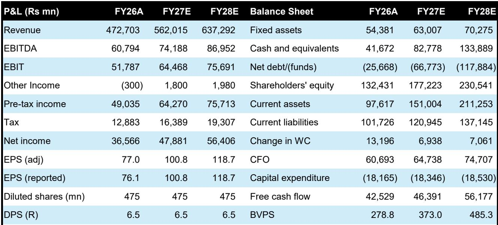
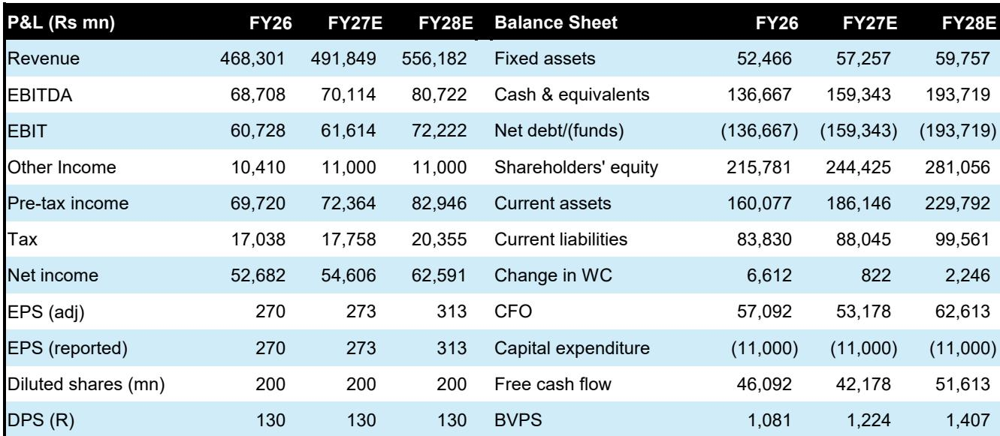
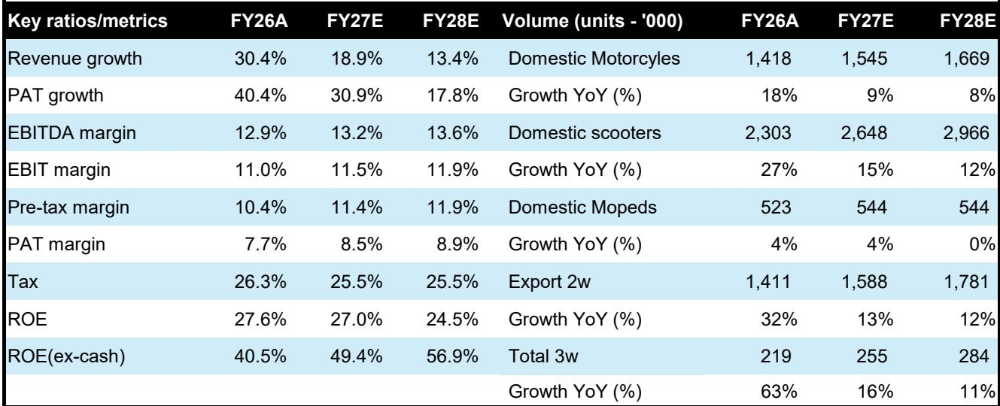

# Bernstein：印度乙醇的尽头是E27，不是E85

印度在2025年底提前五年达到E20乙醇掺混目标，这本应是一个值得庆祝的里程碑。但Bernstein最新发布的这份印度汽车行业深度报告，却给出了一个反直觉的判断：印度乙醇计划的“容易部分”已经结束，继续推进到E25甚至E27虽可行但难度陡增，而建设全国性的灵活燃料和E85供应链，则是一个回报有限、时机已过的昂贵对冲。

这份报告的核心主张可以浓缩为一句话：印度乙醇的故事，在E20之后就不再是关于能源独立，而是关于如何在一个快速电气化的时代，为一个旧时代的解决方案找到合理的退出路径。

## 1. E20的成功恰恰是建立在三个“免费”条件之上，而这些条件在E20之后全部消失

印度乙醇掺混率从十年前的不到2%飙升至2025年的20%，表面上看是政策执行力的胜利。但Bernstein的分析揭示了一个更微妙的真相：这个成功建立在三个恰好成立的条件之上——掺混的乙醇进入的是印度已经拥有的发动机、原料来自印度已经种植的作物、消费者没有被要求付出任何额外成本。

一个不需要任何人改变的方案，自然容易规模化。

但问题在于，这三个条件在E20之后全部开始逆转。超过80%的印度道路车辆是在2023年4月之前制造的，只兼容E10。E20本身已经在老旧车辆中引发了橡胶密封件退化、燃油泵投诉和6-10%的里程损失——这些抱怨随着掺混比例每提高一个百分点而显著加剧。

> **KC评论：** 这份报告最值得注意的洞察在于，它把“政策可行性”和“技术可行性”区分了开来。E20之所以成功，不是因为技术有多成熟，而是因为它恰好落在了一个“所有人都无需改变”的舒适区。一旦进入E25及以上，消费者要承担里程损失、维修成本增加，而政府要面对选民不满。这是典型的“容易的先做，难的在后”。

## 2. 物理法则决定了掺混天花板，这不是政策意志能突破的

乙醇的体积能量密度只有汽油的65-67%，同时具有吸湿性和腐蚀性。在低掺混水平下，这些特性的影响有限。但随着掺混比例上升，影响会非线性地放大。

全球经验和印度自身的工程标准都指向一个阈值：现有车辆基数的掺混上限约为20%。这不是监管选择，而是物理和化学约束。

印度确实有一定空间可以突破这个水平。从2025年4月起，所有新车辆都必须配备E20调校的发动机。这些发动机可以通过更高的压缩比部分抵消乙醇的能量损失。随着车队逐渐更新，可容忍的掺混水平可以逐步提高——这是到2030年向E25、甚至E27迈进的基础。

但关键问题在于存量车队。政府最近委托ARAI进行一项6万至7万公里的耐久性研究，评估E25对现有E10和E20车辆的影响——这本身就说明，从E20到E25是一个实质性的技术步骤，而不是例行扩展。

在改造方案规模化或原始设备制造商升级更大比例的车辆基数之前，这个过渡是不平衡的。E25对新车辆销售是可行的，但对于更广泛的存量车队，这只是一个有条件的结果——取决于改造生态系统的快速规模化或老旧车辆的加速淘汰，而目前的淘汰率并不支持这一点。

## 3. 乙醇不是比汽油便宜，所以继续推进的唯一理由是“对冲”——但这个对冲的时机已经过去

这是一个被政策叙事刻意回避的事实。在每桶75美元的油价下，一升原油的成本约为45卢比，一升汽油的税前成本约为55-58卢比。而一升乙醇的采购成本目前约为60-62卢比（以甘蔗为主的混合原料），在2023年谷物转向期间甚至超过71卢比。

在所有有意义的比较维度上，乙醇的成本都等于或高于它所替代的汽油——这还没有考虑乙醇因能量密度低导致的更多用量。

那么，为什么还要继续推进？报告认为，唯一站得住脚的理由是对冲。巴西的智慧在于让无水乙醇掺混比例浮动，并将90%的汽车改为灵活燃料车，这样当原油飙升、汽油价格走高时，司机可以大规模转向乙醇，当原油下跌时再转回汽油。

但Bernstein提出了两个尖锐的反驳。第一，对冲只在原油价格飙升时才有价值。在大多数年份，当原油价格处于60-80美元区间时，一个灵活燃料车队主要还是会用汽油运行——你等于建了一个完整的平行燃料系统，来捕捉只在少数年份才出现的收益。

第二，也是更关键的，巴西从1975年开始建设这个对冲，当时电动汽车根本不存在。如果你当时想为交通系统保险对抗石油依赖，本国产乙醇是唯一可用的工具。但印度在2026年拥有的替代方案，巴西在1975年无法想象：电池成本逐年下降、强混合动力车可以削减30-40%的汽油消耗而不需要新燃料和基础设施、CNG渗透率正在上升。

> **KC评论：** 这是整份报告最核心的“所以呢”。当一个对冲工具的成本高于被对冲的风险，而且这个风险已经可以通过其他更便宜、更多元的方式管理时，继续投入就是资本错配。Bernstein不是在否定乙醇的价值，而是在质疑：在电动车、混合动力和CNG已经在快速降低石油依赖的今天，再花巨资建一条E85供应链，性价比在哪里？

## 4. 模型推演：即使在最激进的假设下，灵活燃料车对原油进口的节省也微乎其微

报告做了一个关键的量化分析。Bernstein建立了一个存量-流量模型，模拟了最激进的假设——到2030年所有新乘用车销售都转为灵活燃料车，淘汰纯汽油车。

结果令人清醒：即使在这样的激进假设下，到2030年底，存量乘用车中仍有45-50%是纯汽油车（目前为65-70%）。灵活燃料车带来的原油进口节省约为印度石油进口总量的1-2%；加上E25-E27掺混、电动车、混合动力和CNG的贡献，总节省约为4-5%。

到2035年，这一数字可能上升到7-8%，到2040年达到10%。但问题在于，随着电动车、混合动力和CNG的加速普及，这些节省中的大部分将来自这些技术，而不是灵活燃料车。E85供应链的边际贡献正在被快速压缩。

## 5. 全球经验表明，乙醇的“天花板”是普遍现象，巴西是唯一的例外

报告引用了全球乙醇推广的教训。美国建设了E85基础设施，但只有不到2%的加油站实际供应E85；中国在粮食短缺时直接放弃了乙醇强制令；泰国在2026年初削减补贴后，E85需求崩溃，电动车迅速填补了空白。

只有巴西维持着高掺混水平——但巴西从1970年代开始建设，远在电动车出现之前，而且拥有比印度更有利的条件：更丰富的水资源（巴西的水资源压力指数为1.04，印度为4.11）、更长的甘蔗种植历史、以及更灵活的燃料定价机制。

## 6. 报告尚未完全回答的关键问题：谁将承担过渡成本？

这份报告对技术可行性、经济性和战略必要性做了出色的分析，但有一个关键问题没有完全展开：从E20到E25乃至E27的过渡成本将由谁来承担？

对于新车，成本将体现在更高的售价中——E20调校的发动机需要更高的压缩比和更耐腐蚀的燃油系统，这些都会增加制造成本。对于存量车，改造方案的成本和可用性仍然是未知数。如果政府强制推行更高掺混比例而不提供改造成本补贴，消费者将直接承担里程损失和维修成本。

此外，乙醇采购成本高于汽油的事实意味着，如果原油价格保持在75美元/桶以下，石油营销公司（OMCs）每采购一升乙醇都在亏损。这些亏损最终会通过某种方式传导——可能是更高的燃油税、更低的炼油利润，或者间接反映在OMCs的股价中。

> **KC评论：** 这个问题的答案会直接影响我们对印度汽车股和OMCs的定价。如果消费者承担成本，两轮车和入门级乘用车的需求可能受到压制；如果政府补贴，财政负担会加重；如果OMCs承担，它们的利润率会承压。报告的估值表显示，Bernstein对马鲁蒂铃木（Outperform）和巴贾吉汽车（Outperform）给出了积极评级，但对英雄本田（Market-Perform）和艾彻汽车（Market-Perform）态度中性——这可能反映了对不同细分市场影响程度的判断。

## 7. 对投资者的观察框架：三个需要跟踪的信号

基于这份报告的分析，我们可以提炼出三个需要持续跟踪的关键信号。

第一，ARAI的E25耐久性研究结果。如果结果显示对现有车辆的影响可控，那么E25的推进速度可能快于预期，对马鲁蒂等拥有大量存量客户的车企是利好。如果结果显示影响显著，那么政策可能被迫放缓，为电动车和混合动力争取更多时间。

第二，甘蔗产量和降雨模式。2023年的经历表明，一个弱季风就可以打乱整个乙醇供应链。如果2026-2027年再次出现干旱，乙醇供应收紧、价格上涨，政策的可持续性将受到考验。

第三，电动车和混合动力的渗透率曲线。如果电动车TCO（总拥有成本）提前与汽油车持平，或者强混合动力的接受度快速提升，那么乙醇对冲的价值将进一步降低。Bernstein对马鲁蒂的积极评级部分基于“更强的乙醇路径可以帮助其弥补在电动车领域的不足”——这个逻辑成立的前提是，乙醇路径确实在帮助而不是分散资源。

---

这份报告的价值在于，它把乙醇政策从一个“能源独立”的宏大叙事还原为一个需要严格成本效益分析的投资决策。对于产业决策者和高净值投资者而言，真正的问题不是“乙醇好不好”，而是“相对于所有可用的选项，乙醇是不是最好的”。

报告中的模型推演、全球对比和成本分析提供了丰富的决策依据，但受限于篇幅，我们对以下问题尚未充分展开：灵活燃料车的具体成本溢价是多少？印度主要汽车制造商的乙醇技术路线图有何差异？在E25-E27场景下，哪些子行业（如燃油系统供应商、乙醇生产商、发动机零部件制造商）会受益或受损？这些细节，连同报告中的完整数据图表和估值模型，欢迎在知识星球社群里继续讨论。

每天，我们的AI agent配合人工审核，从Bernstein、GS、MS等国际投行最新研报中提取中文摘要与KC评论，日更约10-40页，同时整理当天最新数据图表合集，既方便喂给AI做进一步分析，也方便人工快速把握全球市场动态。

Personal reading notes and learning share only. Not investment advice.

