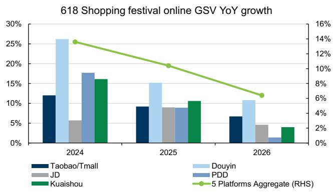
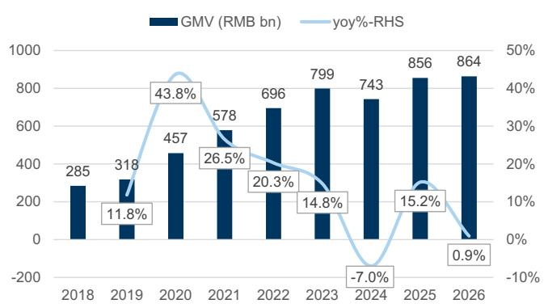
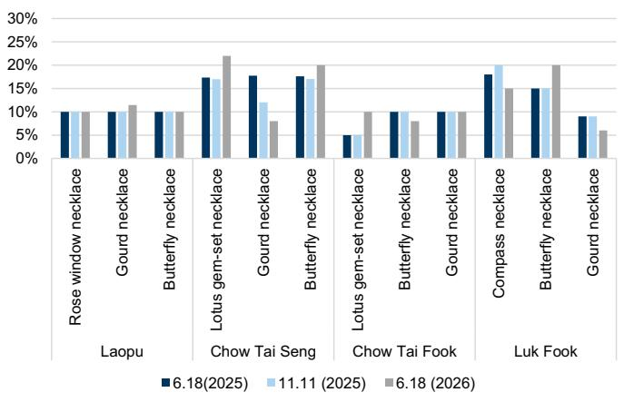
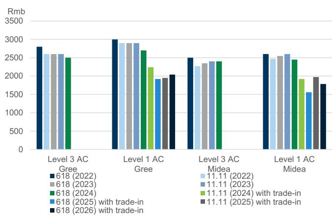
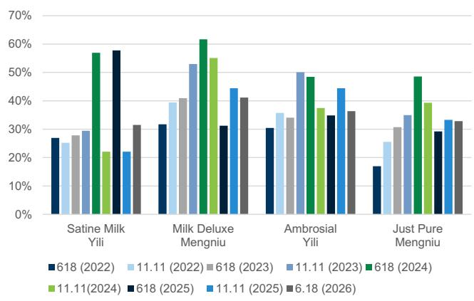
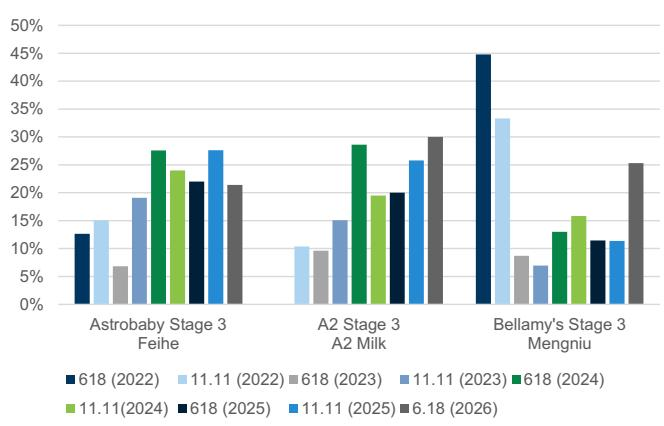
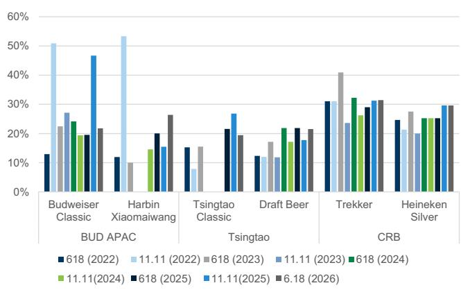
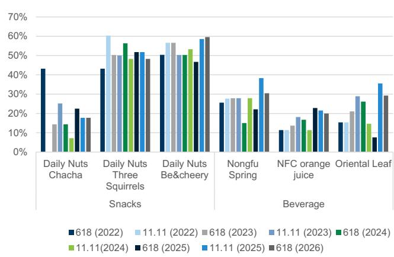
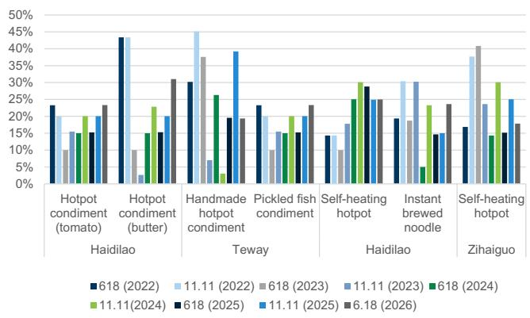
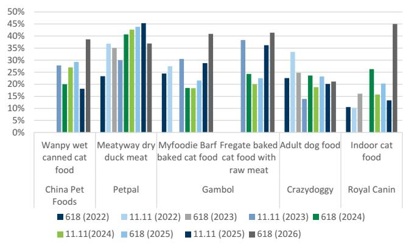

CHINA CONSUMER CONNECTIONS

# 618 wrap: Boosted GMV with divergent ROI on discounts and subsidies; cosmetics outperformed

China's 618 Shopping Festival concluded on June 18/20/21 for Douyin/JD/Tmall. The event this year started from May 15/11/21 for Douyin/JD/Tmall. We summarize within, data points by platform, category and brand level and share our key takeaways.

1. Overall GSV at 6% yoy per Analysys in main platforms in aggregate, moderating from last year 10% yoy; with narrowing gap between GSV and parcel volume growth (8% yoy during May 13 to Jun 14 vs. +16% yoy during the same period last year) likely due to higher ticket size (see our 618 expert call takeaways) but a wider gap vs. yoy GMV growth according to the expert's note of mid-teens yoy GMV in this year/low-teens yoy last year 618 on larger platform and government's supports/subsidies/discounts.

2. Divergent ROI trend with wider discounts but more platform support/rebates: Our price checks (Exhibit 3) also showed that most categories recorded broader discounts (especially on pet foods) except snacks cutting back discounts while beauty/jewelry was flat yoy. Platform-wise, channel checks suggest a stepping up of national subsidies in Taobao/Tmall, for cosmetics in particular, and a Douyin KOL cut-back on slotting fees/commission fees.

3. Growth concentrated in leading players in selected categories: Top players across categories we track were largely stable, with leading players driving growth in selected categories. In cosmetics, MNC leaders occupied the top rankings, while leading domestic brands e.g. Mao Geping/Giant Biogene/Forest Cabin/Proya/Shanghai Jahwa delivering solid growth, outpacing broad industry growth. For spirits, we observe consolidation trends with online growth mainly concentrated in the super-premium category with the JD 618 report indicating that overall spirits GMV was up by 25% yoy this year driven by strong growth in Moutai/Wuliangye.

4. Category performance: Per our earlier expert call, pet (+c.48% yoy), supplements (+c.20% yoy) & 3C products (+19% yoy) delivered fast growth on Tmall/Taobao over 618 while jewelry lagged (-27% yoy). Beauty (incl. skincare and color cosmetics) was in-line with Taobao/Tmall platform growth at 15% yoy while growing 21% yoy in Douyin. Sportswear saw 16% yoy growth in Taobao/Tmall, also roughly in-line with platform growth.

Valerie Zhou
+852-2978-0820 | valerie.zhou@gs.com
GS (Asia) L.L.C.

Michelle Cheng
+852-2978-6631 |
michelle.cheng@gs.com
GS (Asia) L.L.C.

Leaf Liu
+852-3966-4169 | leaf.liu@gs.com
GS (Asia) L.L.C.

Nicolas Yi
+86(21)2401-8922 |
nicolas.yi@goldmansachs.cn
GS (China) Securities
Company Limited

Molly Dai
+852-3966-4000 | molly.dai@gs.com
GS (Asia) L.L.C.

Christina Liu
+852-2978-6983 | christina.liu@gs.com
GS (Asia) L.L.C.

Cecilia Tang
+86(21)2401-8738 |
cecilia.tang@goldmansachs.cn
GS (China) Securities
Company Limited

Xinyu Ruan
+852-2978-7347 | xinyu.ruan@gs.com
GS (Asia) L.L.C.

Carol Chen
+852-2978-7999 | carol.chen@gs.com
GS (Asia) L.L.C.

## Additional highlights by category:

1) Cosmetics: Per our expert call, cosmetics GMV in Tmall during this 618 was 15% yoy, and combining with the 21% yoy in Douyin, we expect mid-high teens yoy growth across all platforms vs. Analysys's c.10% yoy GSV. We continue to see better performance of high-end MNC brands (with Skinceuticals/Estee Lauder brand/SK-II/Clarins/Shiseido improved ranking in Tmall), strong recovery of Comfy and MGP to be on track of their full year target. Shanghai Jahwa/Winona showed strong GMV on Douyin, with 68%/29% yoy growth for 1 May - 18 Jun 2026 (refer to our 618 pulse check).

2) Sportswear & Apparel: Sportswear brands showed lackluster sales trend during 618, with discounts largely stable/slightly deeper. Within sportswear, we highlight that Descente/Decathlon/Kolon Sport/Adidas/Fila/Lulu rankings improved or support ongoing popularity, domestic mass brands overall rankings were largely stable, and Nike/Camel underperformed with rankings declining yoy.

3) Consumer Durables: Home appliances growth was largely muted during 618, due to a high base last year driven by trade-in stimulus. On pricing, we note lower AC prices vs. Singles' Day this year for select brands though were higher yoy, which may indicate that brands may have turned to promotions to boost demand despite rising input costs. Product wise, products with penetration increase potential such as cleaning appliances likely recorded better growths as market leaders continued to highlight robust growth.

4) Staples: Staples saw larger discounts in liquid milk/IMF while relatively rational promotions on spirits were disciplined (on JD). Super-premium spirits brands saw robust growth on JD (mid-teens% GMV growth for Moutai/Wuliangye), with Moutai Feitian 2026 original case GMV reaching Rmb300mn+ and common Wuliangye (world-cup edition) GMV increasing over 13-fold yoy. Tsingtao/Budweiser ranked top 2 on JD among beer brands.

5) Pet Food: Pet food delivered solid GMV growth at 48% yoy in Taobao/Tmall per our expert call. Yet, we saw mixed performance on our covered names: Gambol/China Pet Food group delivered 15%/45% yoy during 5.15-6.18 on Douyin yet Gambol saw weaker Tmall performance in which Myfoodie saw lower ranking vs. last year's 618 while Fregate remained stable. We also saw wider discounts among local names in which China Pet Foods/Gambol/Rosy Fresh saw 3ppt/13ppt/6ppt wider discounts vs. 2025's 618, reflecting intensifying competition in the industry.

Key brands outperformed during 618: Adidas/Descente/Kolon, Forest Cabin/Mao Geping/Estee Lauder, Moutai, Rosy Fresh, Ninebot.

## More reads:

China Cosmetics: 618 pulse check: performance in Douyin: MNCs/higher-end led; MGP rebound to 50%+ yoy

China Cosmetics: 618 pulse check: Expert call takeaways: sound growth, more subsidies/promotion supports and stable channel spending; leading local/MNCs ahead

China Consumer Connection: Online Brand Tracker: May-26: Divergent 618 performance across most sectors; Cosmetics led, IMF/White Goods lag

China Cosmetics: Monthly tracker: May-26: accelerating versus 1Q; local brands rebound likely

## on subsidies; MNCs continue to be strong June to date

China Pet Food Monthly: May 2026: Softer pricing causes sales to moderate; China Pet Foods GMV growth led

China Consumer Durables: Appliance Tracker: May 2025: Still weak domestic demand yet base will ease into June, 618 in focus; exports sequentially improved

Exhibit 1: 618 online GSV yoy moderated to 6% in 2026 vs. 10% in 2025 per Analysys
618 Shopping festival online GSV YoY growth

  
Source: Analysys, Data compiled by GS Global Investment Research  
Exhibit 2: Industry online GMV (excl. Taobao) reached Rmb864bn this 618 largely flat yoy per Syntun

618 Shopping festival online GMV growth  
  
GMV includes Tmall, JD, Douyin, PDD, Kuaishou.  
Source: Syntun, Data compiled by GS Global Investment Research

Exhibit 3: Compared to the 618 shopping festival last year, discounts were higher in most segments with snacks cutting back on discounts while beauty/jewelry were flat yoy

<table><tr><td rowspan="2"></td><td colspan="11">Price discount change</td></tr><tr><td>2022 618</td><td>2022 11.11</td><td>2023 618</td><td>2023 11.11</td><td>2024 618</td><td>2024 11.11</td><td>2025 618</td><td>2025 11.11</td><td>2026 618</td><td>vs 2025 11.11</td><td>vs 2025 618</td></tr><tr><td colspan="12">Consumer staples</td></tr><tr><td>Dairy</td><td>27%</td><td>30%</td><td>27%</td><td>33%</td><td>41%</td><td>29%</td><td>28%</td><td>32%</td><td>33%</td><td>2%</td><td>5%</td></tr><tr><td>IMF</td><td>29%</td><td>20%</td><td>8%</td><td>14%</td><td>23%</td><td>20%</td><td>18%</td><td>22%</td><td>26%</td><td>4%</td><td>8%</td></tr><tr><td>Beer</td><td>18%</td><td>29%</td><td>22%</td><td>21%</td><td>26%</td><td>19%</td><td>23%</td><td>28%</td><td>25%</td><td>-3%</td><td>2%</td></tr><tr><td>Compound condiments</td><td>26%</td><td>32%</td><td>24%</td><td>17%</td><td>19%</td><td>18%</td><td>19%</td><td>23%</td><td>23%</td><td>0%</td><td>4%</td></tr><tr><td>Pet foods</td><td>23%</td><td>27%</td><td>25%</td><td>24%</td><td>23%</td><td>19%</td><td>23%</td><td>28%</td><td>32%</td><td>5%</td><td>10%</td></tr><tr><td>Snacks</td><td>46%</td><td>50%</td><td>39%</td><td>40%</td><td>39%</td><td>36%</td><td>39%</td><td>37%</td><td>36%</td><td>-1%</td><td>-3%</td></tr><tr><td colspan="12">Consumer discretionary</td></tr><tr><td>Beauty</td><td>55%</td><td>58%</td><td>56%</td><td>58%</td><td>55%</td><td>55%</td><td>54%</td><td>55%</td><td>54%</td><td>-1%</td><td>0%</td></tr><tr><td>Jewelry</td><td></td><td></td><td></td><td></td><td></td><td>17%</td><td>12%</td><td>12%</td><td>13%</td><td>0%</td><td>0%</td></tr><tr><td>Sportswear</td><td>27%</td><td>40%</td><td>33%</td><td>32%</td><td>33%</td><td>40%</td><td>40%</td><td>45%</td><td>44%</td><td>-1%</td><td>4%</td></tr><tr><td>AC (incl. trade-in)</td><td>2,724</td><td>2,559</td><td>2,599</td><td>2,624</td><td>2,512</td><td>2,079</td><td>1,739</td><td>1,962</td><td>1,912</td><td>-3%</td><td>10%</td></tr></table>

We use the change in price after discounts for ACs to calculate the price discount change. For other categories, we use the average discount rate to calculate the price discount change. For the Beauty sector, we use discounts incl. gifts. Higher % means higher discounts.

Color makeup (source: Syntum)  
Exhibit 4: Tmall/JD sales ranking by category

<table><tr><td colspan="4">Tmall</td></tr><tr><td>25</td><td>26</td><td>Brand</td><td>Company</td></tr><tr><td colspan="4">Beauty (source: Tmall)</td></tr><tr><td>6</td><td>1</td><td>SkinCeuticals</td><td>L&#x27;Oreal</td></tr><tr><td>4</td><td>2</td><td>Estee Lauder</td><td>Estee Lauder</td></tr><tr><td>1</td><td>3</td><td>Proya</td><td>Proya Cosmetics</td></tr><tr><td>2</td><td>4</td><td>Lancome</td><td>L&#x27;Oreal</td></tr><tr><td>7</td><td>5</td><td>SK-II</td><td>P&amp;G</td></tr><tr><td>3</td><td>6</td><td>L&#x27;Oreal Paris</td><td>L&#x27;Oreal</td></tr><tr><td>5</td><td>7</td><td>La Mer</td><td>Estee Lauder</td></tr><tr><td>10</td><td>8</td><td>Clarins</td><td>Clarins</td></tr><tr><td>8</td><td>9</td><td>HR</td><td>L&#x27;Oreal</td></tr><tr><td>9</td><td>10</td><td>CPB</td><td>Shiseido</td></tr></table>

<table><tr><td colspan="4">JD</td></tr><tr><td>25</td><td>26</td><td>Brand</td><td>Company</td></tr><tr><td colspan="4">Skincare (source: Syntun)</td></tr><tr><td>1</td><td>1</td><td>Lancome</td><td>L&#x27;Oreal</td></tr><tr><td>3</td><td>2</td><td>SK-II</td><td>P&amp;G</td></tr><tr><td>5</td><td>3</td><td>Skinceuticals</td><td>L&#x27;Oreal</td></tr><tr><td>2</td><td>4</td><td>Estee Lauder</td><td>Estee Lauder</td></tr><tr><td>&gt;5</td><td>5</td><td>Anessa</td><td>Shiseido</td></tr></table>

<table><tr><td>1</td><td>1</td><td>YSL</td><td>L&#x27;Oreal</td></tr><tr><td>&gt;5</td><td>2</td><td>MGP</td><td>Maogeping</td></tr><tr><td>2</td><td>3</td><td>CPB</td><td>Shiseido</td></tr><tr><td>4</td><td>4</td><td>NARS</td><td>Shiseido</td></tr><tr><td>5</td><td>5</td><td>Estee Lauder</td><td>Estee Lauder</td></tr></table>

Home appliances (source: Syntun)

Color makeup (source: Syntun)

<table><tr><td>2</td><td>1</td><td>YSL</td><td>L&#x27;Oreal</td></tr><tr><td>1</td><td>2</td><td>Dior</td><td>LVMH</td></tr><tr><td>&gt;5</td><td>3</td><td>Mao Geping</td><td>Mao Geping</td></tr><tr><td>&gt;5</td><td>4</td><td>CPB</td><td>Shiseido</td></tr><tr><td>&gt;5</td><td>5</td><td>Armani</td><td>L&#x27;Oreal</td></tr></table>

<table><tr><td>1</td><td>1</td><td>Midea</td><td>Midea</td></tr><tr><td>2</td><td>2</td><td>Haier</td><td>Haier Smart Home</td></tr><tr><td>4</td><td>3</td><td>Gree</td><td>Gree</td></tr><tr><td>3</td><td>4</td><td>Xiaomi</td><td>Xiaomi Group</td></tr><tr><td>5</td><td>5</td><td>Little Swan</td><td>Midea</td></tr></table>

<table><tr><td colspan="4">Home appliances (source: Syntun)</td></tr><tr><td>1</td><td>1</td><td>Midea</td><td>Midea</td></tr><tr><td>2</td><td>2</td><td>Haier</td><td>Haier Smart Home</td></tr><tr><td>3</td><td>3</td><td>Gree</td><td>Gree</td></tr><tr><td>4</td><td>4</td><td>Xiaomi</td><td>Xiaomi Group</td></tr><tr><td>&gt;5</td><td>5</td><td>TCL</td><td>TCL</td></tr></table>

<table><tr><td colspan="4">Snack (source: Syntun)</td></tr><tr><td>1</td><td>1</td><td>Three Squirrels</td><td>Three Squirrels</td></tr><tr><td>4</td><td>2</td><td>Bestore</td><td>Bestore</td></tr><tr><td>3</td><td>3</td><td>Be &amp; Cheery</td><td>PepsiCo</td></tr><tr><td>2</td><td>4</td><td>BIBIZAN</td><td>Shangke Foods</td></tr><tr><td>&gt;5</td><td>5</td><td>Lay&#x27;s</td><td>PepsiCo</td></tr></table>

<table><tr><td>1</td><td>1</td><td>Three Squirrels</td><td>Three Squirrels</td></tr><tr><td>&gt;5</td><td>2</td><td>J.ZAO</td><td>JD</td></tr><tr><td>2</td><td>3</td><td>Bestore</td><td>Bestore</td></tr><tr><td>&gt;5</td><td>4</td><td>Wolong</td><td>Wolong</td></tr><tr><td>3</td><td>5</td><td>Want Want</td><td>Want Want China</td></tr></table>

<table><tr><td>1</td><td>1</td><td>Rosy Fresh</td><td>Zhejiang Jichong</td></tr><tr><td>2</td><td>2</td><td>Legend Sandy</td><td>Jia Pets</td></tr><tr><td>&gt;5</td><td>3</td><td>Royal Canin</td><td>Mars</td></tr><tr><td>5</td><td>4</td><td>Myfoodie</td><td>Gambol</td></tr><tr><td>4</td><td>5</td><td>Honest Bite</td><td>Jianmo Biotech</td></tr></table>

<table><tr><td colspan="4">Pet foods (source: Syntun)</td></tr><tr><td>1</td><td>1</td><td>Royal Canin</td><td>Mars</td></tr><tr><td>4</td><td>2</td><td>Legend Sandy</td><td>Jia Pets</td></tr><tr><td>2</td><td>3</td><td>Myfoodie</td><td>Gambol</td></tr><tr><td>5</td><td>4</td><td>Pure &amp; Natural</td><td>Shanghai Yiyun Pet Products</td></tr><tr><td>&gt;5</td><td>5</td><td>Orijen</td><td>Champion Petfoods</td></tr></table>

<table><tr><td colspan="4">Sportswear (Source: Tmall)</td></tr><tr><td>2</td><td>1</td><td>Fila</td><td>Anta Sports</td></tr><tr><td>3</td><td>2</td><td>Adidas</td><td>Adidas</td></tr><tr><td>1</td><td>3</td><td>Nike</td><td>Nike</td></tr><tr><td>4</td><td>4</td><td>Lululemon</td><td>Lululemon</td></tr><tr><td>5</td><td>5</td><td>Li Ning</td><td>Li Ning</td></tr><tr><td>6</td><td>6</td><td>Anta</td><td>Anta Sports</td></tr><tr><td>10</td><td>7</td><td>Descente</td><td>Anta Sports</td></tr><tr><td>9</td><td>8</td><td>Decathlon</td><td>Decathlon</td></tr><tr><td>8</td><td>9</td><td>Asics</td><td>Asics</td></tr><tr><td>&gt;10</td><td>10</td><td>Kolon</td><td>Anta Sports</td></tr></table>

For Syntun, 2025 Ranking based on May 13 - Jun 18 2025 GMV and 2024 Ranking based on May 24 - Jun 18 2024 GMV; for Tmall, 2025 Ranking based on May 13 - Jun 20 2025 GMV and 2024 Ranking based on May 24 - Jun 20 2024 GMV.

Source: Tmall, Syntun, GS Global Investment Research

Exhibit 5: Douyin sales ranking by category

<table><tr><td colspan="4">Douyin</td></tr><tr><td>25</td><td>26</td><td>Brand</td><td>Company</td></tr><tr><td colspan="4">Skincare</td></tr><tr><td>3</td><td>1</td><td>Proya</td><td>Proya Cosmetics</td></tr><tr><td>2</td><td>2</td><td>HR</td><td>L&#x27;Oreal</td></tr><tr><td>4</td><td>3</td><td>Estee Lauder</td><td>Estee Lauder</td></tr><tr><td>5</td><td>4</td><td>La Mer</td><td>Estee Lauder</td></tr><tr><td>1</td><td>5</td><td>KANs</td><td>Shanghai Chicmax</td></tr><tr><td>7</td><td>6</td><td>Lancome</td><td>L&#x27;Oreal</td></tr><tr><td>6</td><td>7</td><td>L&#x27;Oreal Paris</td><td>L&#x27;Oreal</td></tr><tr><td>&gt;10</td><td>8</td><td>Pechoin</td><td>Shanghai Pehchaolin Daily Chemical</td></tr><tr><td>10</td><td>9</td><td>Chando</td><td>Shanghai Chando</td></tr><tr><td>&gt;10</td><td>10</td><td>Guyu</td><td>Guyu Biotechnology Group</td></tr></table>

Major appliances

<table><tr><td colspan="4">Douyin</td></tr><tr><td>25</td><td>26</td><td>Brand</td><td>Company</td></tr><tr><td colspan="4">Color makeup</td></tr><tr><td>1</td><td>1</td><td>Dirovo</td><td>Shanghai Youke Jiabei</td></tr><tr><td>2</td><td>2</td><td>MAOGEPING</td><td>Mao Geping</td></tr><tr><td>4</td><td>3</td><td>YSL</td><td>L&#x27;Oreal</td></tr><tr><td>6</td><td>4</td><td>Pramy</td><td>Shanghai PRAMY</td></tr><tr><td>&gt;10</td><td>5</td><td>BABI</td><td>Hangzhou Lanchi Technology</td></tr><tr><td>7</td><td>6</td><td>Carslan</td><td>Carslan</td></tr><tr><td>8</td><td>7</td><td>MAC</td><td>Estee Lauder</td></tr><tr><td>&gt;10</td><td>8</td><td>Socorskin</td><td>Nanjing Maorun Zhicheng</td></tr><tr><td>&gt;10</td><td>9</td><td>Flower Lure</td><td>Guangzhou Aoqi Biotechnology</td></tr><tr><td>&gt;10</td><td>10</td><td>DPDP</td><td>Aromasong Cosmetics</td></tr></table>

Small kitchen appliances

<table><tr><td>1</td><td>1</td><td>Haier</td><td>Haier Smart Home</td></tr><tr><td>2</td><td>2</td><td>Midea</td><td>Midea</td></tr><tr><td>4</td><td>3</td><td>Little Swan</td><td>Midea</td></tr><tr><td>9</td><td>4</td><td>Leader</td><td>Haier Smart Home</td></tr><tr><td>6</td><td>5</td><td>Xiaomi</td><td>Xiaomi Group</td></tr><tr><td>7</td><td>6</td><td>MIJIA</td><td>Xiaomi Group</td></tr><tr><td>5</td><td>7</td><td>Hisense</td><td>Hisense Home Appliances</td></tr><tr><td>3</td><td>8</td><td>Gree</td><td>Gree</td></tr><tr><td>8</td><td>9</td><td>Wahin</td><td>Midea</td></tr><tr><td>&gt;10</td><td>10</td><td>TCL</td><td>TCL</td></tr></table>

<table><tr><td>1</td><td>1</td><td>Midea</td><td>Midea</td></tr><tr><td>4</td><td>2</td><td>Supor</td><td>Supor</td></tr><tr><td>5</td><td>3</td><td>Yangzi</td><td>Yangzi</td></tr><tr><td>3</td><td>4</td><td>Joyoung</td><td>Joyoung</td></tr><tr><td>2</td><td>5</td><td>Royalstar</td><td>Royalstar</td></tr><tr><td>9</td><td>6</td><td>Malata</td><td>Malata</td></tr><tr><td>&gt;10</td><td>7</td><td>CASDON</td><td>CASDON</td></tr><tr><td>&gt;10</td><td>8</td><td>bewinch</td><td>Lexy</td></tr><tr><td>&gt;10</td><td>9</td><td>Jialiquan</td><td>Jialiquan</td></tr><tr><td>6</td><td>10</td><td>Bear</td><td>Bear Electric Appliance</td></tr></table>

Lifestyle appliances

<table><tr><td>3</td><td>1</td><td>Dreame</td><td>Dreame</td></tr><tr><td>2</td><td>2</td><td>Roborock</td><td>Roborock Tech</td></tr><tr><td>1</td><td>3</td><td>Ecovacs</td><td>Ecovacs Robotics</td></tr><tr><td>7</td><td>4</td><td>Uwant</td><td>Uwant</td></tr><tr><td>4</td><td>5</td><td>Tineco</td><td>Ecovacs Robotics</td></tr><tr><td>6</td><td>6</td><td>Skyworth</td><td>Skyworth</td></tr><tr><td>9</td><td>7</td><td>Midea</td><td>Midea</td></tr><tr><td>&gt;10</td><td>8</td><td>Haier</td><td>Haier Smart Home</td></tr><tr><td>&gt;10</td><td>9</td><td>Supor</td><td>Supor</td></tr><tr><td>5</td><td>10</td><td>Yangzi</td><td>Yangzi</td></tr></table>

Sports apparel

Sports shoes

<table><tr><td>2</td><td>1</td><td>Adidas</td><td>Adidas</td></tr><tr><td>3</td><td>2</td><td>Anta</td><td>Anta Sports</td></tr><tr><td>1</td><td>3</td><td>Nike</td><td>Nike</td></tr><tr><td>5</td><td>4</td><td>Li Ning</td><td>Li Ning</td></tr><tr><td>4</td><td>5</td><td>Fila</td><td>Anta Sports</td></tr><tr><td>7</td><td>6</td><td>Skechers</td><td>Skechers</td></tr><tr><td>6</td><td>7</td><td>New Balance</td><td>New Balance</td></tr><tr><td>9</td><td>8</td><td>Xtep</td><td>Xtep</td></tr><tr><td>10</td><td>9</td><td>Erke</td><td>Erke</td></tr><tr><td>&gt;10</td><td>10</td><td>Asics</td><td>Asics Group</td></tr></table>

Sportswear and Outdoor

<table><tr><td>1</td><td>1</td><td>Fila</td><td>Anta Sports</td></tr><tr><td>2</td><td>2</td><td>Adidas</td><td>Adidas</td></tr><tr><td>3</td><td>3</td><td>Nike</td><td>Nike</td></tr><tr><td>4</td><td>4</td><td>Li Ning</td><td>Li Ning</td></tr><tr><td>5</td><td>5</td><td>Anta</td><td>Anta Sports</td></tr><tr><td>10</td><td>6</td><td>Lululemon</td><td>Lululemon</td></tr><tr><td>8</td><td>7</td><td>Fila Fusion</td><td>Anta Sports</td></tr><tr><td>&gt;10</td><td>8</td><td>Descente</td><td>Anta Sports</td></tr><tr><td>6</td><td>9</td><td>Under armour</td><td>Under Armour</td></tr><tr><td>&gt;10</td><td>10</td><td>Kolon</td><td>Anta Sports</td></tr></table>

Snack

<table><tr><td>2</td><td>1</td><td>Adidas</td><td>Adidas</td></tr><tr><td>5</td><td>2</td><td>Li Ning</td><td>Li Ning</td></tr><tr><td>3</td><td>3</td><td>Fila</td><td>Anta Sports</td></tr><tr><td>4</td><td>4</td><td>Anta</td><td>Anta Sports</td></tr><tr><td>1</td><td>5</td><td>Nike</td><td>Nike</td></tr><tr><td>7</td><td>6</td><td>Xtep</td><td>Xtep</td></tr><tr><td>6</td><td>7</td><td>Camel</td><td>Camel</td></tr><tr><td>9</td><td>8</td><td>Skechers</td><td>Skechers</td></tr><tr><td>&gt;10</td><td>9</td><td>Lululemon</td><td>Lululemon</td></tr><tr><td>8</td><td>10</td><td>Under Armour</td><td>Under Armour</td></tr></table>

<table><tr><td>1</td><td>1</td><td>Three Squirrels</td><td>Three Squirrels</td></tr><tr><td>3</td><td>2</td><td>Dove</td><td>Unilever</td></tr><tr><td>&gt;10</td><td>3</td><td>Cuishengsheng</td><td>Ocean Empire</td></tr><tr><td>&gt;10</td><td>4</td><td>Be &amp; Cherry</td><td>PepsiCo</td></tr><tr><td>4</td><td>5</td><td>Mr. Kangaroo</td><td>Mr. Kangaroo</td></tr><tr><td>6</td><td>6</td><td>Wang Xiao Lu</td><td>Beijing Wangxiaolu Network</td></tr><tr><td>&gt;10</td><td>7</td><td>Zhengmaqingyun</td><td>Zhengmaqingyun</td></tr><tr><td>&gt;10</td><td>8</td><td>Kissport</td><td>Zhongshan Jinchao E-Commerce</td></tr><tr><td>&gt;10</td><td>9</td><td>Bestore</td><td>Bestore</td></tr><tr><td>&gt;10</td><td>10</td><td>Dongfangzhenxuai</td><td>Dongfangzhenxuan</td></tr></table>

Pet foods

Dairy

<table><tr><td colspan="4">Dairy</td></tr><tr><td>1</td><td>1</td><td>Adopt A Cow</td><td>Adopt A Cow</td></tr><tr><td>2</td><td>2</td><td>Yili</td><td>Yili</td></tr><tr><td>7</td><td>3</td><td>Satine</td><td>Yili</td></tr><tr><td>6</td><td>4</td><td>Fresh joy</td><td>Junlebao</td></tr><tr><td>3</td><td>5</td><td>Mengniu</td><td>Mengniu</td></tr><tr><td>&gt;10</td><td>6</td><td>Milkland</td><td>Milkland</td></tr><tr><td>&gt;10</td><td>7</td><td>Bonus</td><td>Baifei Dairy</td></tr><tr><td>8</td><td>8</td><td>Europe-asia</td><td>Europe-asia</td></tr><tr><td>&gt;10</td><td>9</td><td>Deluxe</td><td>Mengniu</td></tr><tr><td>&gt;10</td><td>10</td><td>Dongfangzhenxu</td><td>Doongfangzhenxuan</td></tr></table>

<table><tr><td>2</td><td>1</td><td>Golden Tales</td><td>Babuzhenshuai Pet</td></tr><tr><td>3</td><td>2</td><td>Nourse</td><td>Chowsing</td></tr><tr><td>1</td><td>3</td><td>Myfoodie</td><td>Gambol Pet</td></tr><tr><td>6</td><td>4</td><td>Legend Sandy</td><td>Jia Pets</td></tr><tr><td>4</td><td>5</td><td>Fregate</td><td>Gambol Pet</td></tr><tr><td>9</td><td>6</td><td>Kuanfu</td><td>Kuanfu</td></tr><tr><td>&gt;10</td><td>7</td><td>Pure &amp; Natural</td><td>Shanghai Yiyun Pet Products</td></tr><tr><td>8</td><td>8</td><td>Rosy Fresh</td><td>Zhejiang Jichong</td></tr><tr><td>&gt;10</td><td>9</td><td>Yanxuan</td><td>NetEase</td></tr><tr><td>5</td><td>10</td><td>Honest Bite</td><td>Jianmo Biotech</td></tr></table>

IMF

<table><tr><td colspan="4">IMF</td></tr><tr><td>1</td><td>1</td><td>Aptamil</td><td>Danone</td></tr><tr><td>2</td><td>2</td><td>Mengniu</td><td>Mengniu</td></tr><tr><td>4</td><td>3</td><td>Pro-kido</td><td>Yili</td></tr><tr><td>10</td><td>4</td><td>AusNuotore</td><td>M.Love</td></tr><tr><td>7</td><td>5</td><td>Biostime</td><td>H&amp;H Group</td></tr><tr><td>8</td><td>6</td><td>Friso</td><td>FrieslandCampina</td></tr><tr><td>6</td><td>7</td><td>Junlebao</td><td>Junlebao</td></tr><tr><td>5</td><td>8</td><td>A2</td><td>A2 Milk</td></tr><tr><td>3</td><td>9</td><td>Firmus</td><td>China Feihe</td></tr><tr><td>&gt;10</td><td>10</td><td>Adopt A Cow</td><td>Adopt A Cow</td></tr></table>

Spirits

<table><tr><td colspan="4">Spirits</td></tr><tr><td>3</td><td>1</td><td>Fen Wine</td><td>Fen Wine</td></tr><tr><td>1</td><td>2</td><td>Moutai</td><td>Kweichow Moutai</td></tr><tr><td>6</td><td>3</td><td>Langjiu</td><td>Langjiu Group</td></tr><tr><td>4</td><td>4</td><td>Xi Wine</td><td>Kweichow Moutai</td></tr><tr><td>&gt;10</td><td>5</td><td>Huicaofu</td><td>Anhui Huicang</td></tr><tr><td>2</td><td>6</td><td>Wuliangye</td><td>Wuliangye Yibin</td></tr><tr><td>9</td><td>7</td><td>Guotai</td><td>Guotai</td></tr><tr><td>7</td><td>8</td><td>Jiannanchun</td><td>Jiannanchun</td></tr><tr><td>10</td><td>9</td><td>Luzhou Laojiao</td><td>Luzhou Laojiao</td></tr><tr><td>&gt;10</td><td>10</td><td>Shede</td><td>Shede</td></tr></table>

Beer

<table><tr><td colspan="4">Beer</td></tr><tr><td>1</td><td>1</td><td>Tsingtao</td><td>Tsingtao Brewery</td></tr><tr><td>3</td><td>2</td><td>Heineken</td><td>CRB</td></tr><tr><td>2</td><td>3</td><td>Budweiser</td><td>Bud APAC</td></tr><tr><td>6</td><td>4</td><td>Snow</td><td>CRB</td></tr><tr><td>4</td><td>5</td><td>Wusu Beer</td><td>Carlsberg Group</td></tr><tr><td>&gt;10</td><td>6</td><td>Huanghe</td><td>Huanghe</td></tr><tr><td>&gt;10</td><td>7</td><td>Pearl River</td><td>Pearl River</td></tr><tr><td>&gt;10</td><td>8</td><td>Corona</td><td>Bud APAC</td></tr><tr><td>&gt;10</td><td>9</td><td>Pangdonglai</td><td>Pangdonglai</td></tr><tr><td>5</td><td>10</td><td>Derenburg</td><td>Derenburg</td></tr></table>

2026 Ranking based on May 15 – Jun 18 2026 GMV per Chanmama; 2025 Ranking based on May 13 – Jun 18 2025 GMV per Chanmama. Grey highlights represent local brands; others are MNCs.  
Source: Chanmama, GS Global Investment Research

## Beauty

Per our earlier expert call, beauty GMV growth on Tmall/Taobao slightly exceeded 15% yoy, in-line with broad platform growth, driven by expanding user base & subsidies (cosmetics benefited from first-time inclusion in the national subsidy program, with 12%-20% discounts covering c.20% of GMV) (refer to Exhibit 9 on discount comparisons). Douyin beauty GMV outpaced Tmall/Taobao, growing 21% YoY.

Douyin Brand level performance (Exhibit 6):

Local brands: We saw strong performance across our covered local brands led by higher-end brands (i.e. Forest Cabin & Mao Geping). Forest Cabin was the leader with 188% yoy growth on Douyin for 2026 5.1-6.18 and had the highest full-period completion rate at 356%; Mao Geping achieved 54% yoy in 5.1-6.18 and full period completion of 150%, thanks to strong Jun performance (1-18) at 91% yoy, while Giant's GMV was better than expected with 15% yoy growth for 2026 5.1-6.18 and Jun performance catching up at 44% yoy, leading to a 120% full period completion rate. Shanghai Jahwa and Botanee also delivered encouraging yoy growth with 137%/130% full period completion. Proya achieved 24% yoy GMV for 5.1-6.18 and 121% full 618 completion despite Jun weakening at a 5% yoy decline. On the other hand, Bloomage and Chicmax remained under pressure at 77%/63% full period completion.

Western brands: Premium brands continued to be drivers for Western brands. Estee Lauder Group led with 56% yoy GMV growth in Douyin for 2026 5.1-6.18 and further accelerated to 75% yoy in 6.1-6.18, with the highest full-period completion rate at 155%. We observe strength in higher-end brands (Estee Lauder/La Mer at 167%/154% full period completion); L'Oréal Group also achieved 33% yoy in 5.1-6.18 and full period completion of 130%, thanks to strong performance in higher-end brands (Skinceuticals/YSL reached 190%/176% full period completion rates), though mass-market brands were behind. Beiersdorf also delivered encouraging growth with 146% full period completion thanks to strong performance of La Prairie at 168% completion.

■ Japanese brands: We note a slowdown of GMV growth in Jun across Japanese names; Shiseido Group declined at 21% in Jun 1-18, still delivering 113% full period completion thanks to outperformance of higher-end brands CPB/NARS at 166%/151% full period completion. Decorte (under Kose) / SK-II (under P&G) saw weakness at 40%/83% full period completion.

Douyin Rankings (Exhibit 8): For skincare brands on Douyin, Proya emerged as top 1 and Estee Lauder/La Mer/Lancome/Pechoin/Chando/Guyu moved up on the ladder while KANS/L'Oreal Paris recorded lower rankings vs. last 618. Flowerknows, eLL fell out of the top 10. Top color cosmetics brands list on Douyin saw new small players achieving top 10 vs. last 618, including BABI, Socorskin, Flower Lure, DPDP. Dirovo/Mao Geping remained stable at top 2 vs. last 618, with YSL/MAC seeing improvement in ranking while Florasis, eLL, flowerknows & TIMAGE dropped out of the top 10.

On Tmall, Proya was the only local brand among the top 10 within the beauty category, with a shift in rankings among MNCs vs. last 618. Among our covered local names, Mao Geping remained at 18th while Winona/Proya moved down vs. 618 last year.

Exhibit 6: Douyin: For full period (May 15 - Jun 18) vs. 618 last year, Forest Cabin led with $300\%+$ completion rate, partly due to an easier base, followed by MGP/Shanghai Jahwa/Botanee/Proya/Giant at

150%/137%/130%/121%/120%. We note strong performances for MNC leaders as well, with Estee Lauder Group/Beiersdorf/Loreal Group/Shiseido Group at 155%/146%/130%/113%

<table><tr><td>Douyin GMV</td><td>2026 5.1-6.18 yoy growth</td><td>2026 6.1-6.18 yoy growth</td><td>2026 5.15-6.18 as of 2025 5.13-6.18 (Full period Completion Rate)</td></tr><tr><td colspan="4">Local brands</td></tr><tr><td>Proya</td><td>24%</td><td>-5%</td><td>121%</td></tr><tr><td>Proya</td><td>31%</td><td>-13%</td><td>128%</td></tr><tr><td>TIMAGE</td><td>-25%</td><td>33%</td><td>72%</td></tr><tr><td>Off &amp; Relax</td><td>51%</td><td>84%</td><td>150%</td></tr><tr><td>Giant</td><td>15%</td><td>44%</td><td>120%</td></tr><tr><td>Comfy</td><td>7%</td><td>37%</td><td>109%</td></tr><tr><td>Collgene</td><td>52%</td><td>66%</td><td>170%</td></tr><tr><td>Botanee</td><td>31%</td><td>13%</td><td>130%</td></tr><tr><td>Winona</td><td>29%</td><td>10%</td><td>128%</td></tr><tr><td>Bloomage</td><td>-17%</td><td>-42%</td><td>77%</td></tr><tr><td>QuadHA</td><td>-35%</td><td>-71%</td><td>50%</td></tr><tr><td>Biohyalux</td><td>-15%</td><td>-33%</td><td>92%</td></tr><tr><td>Medrepair</td><td>54%</td><td>43%</td><td>159%</td></tr><tr><td>Shanghai Jahwa</td><td>68%</td><td>-16%</td><td>137%</td></tr><tr><td>Herborist</td><td>24%</td><td>-67%</td><td>67%</td></tr><tr><td>Dr. Yu</td><td>90%</td><td>78%</td><td>196%</td></tr><tr><td>Liushen</td><td>128%</td><td>73%</td><td>224%</td></tr><tr><td>Shanghai Chicmax</td><td>-21%</td><td>-55%</td><td>63%</td></tr><tr><td>KANS</td><td>-24%</td><td>-57%</td><td>59%</td></tr><tr><td>New Page</td><td>152%</td><td>51%</td><td>206%</td></tr><tr><td>ARMIYO</td><td>97%</td><td>58%</td><td>194%</td></tr><tr><td>MGP</td><td>54%</td><td>91%</td><td>150%</td></tr><tr><td>MAOGEPING</td><td>54%</td><td>91%</td><td>150%</td></tr><tr><td>Forest Cabin</td><td>188%</td><td>162%</td><td>356%</td></tr><tr><td colspan="4">MNC</td></tr><tr><td>L&#x27;Oreal</td><td>33%</td><td>13%</td><td>130%</td></tr><tr><td>L&#x27;Oreal Paris</td><td>7%</td><td>-22%</td><td>101%</td></tr><tr><td>Lancome</td><td>29%</td><td>51%</td><td>124%</td></tr><tr><td>Maybelline</td><td>-7%</td><td>-21%</td><td>85%</td></tr><tr><td>HR</td><td>24%</td><td>9%</td><td>121%</td></tr><tr><td>Skinceuticals</td><td>89%</td><td>57%</td><td>190%</td></tr><tr><td>La Roche Posay</td><td>25%</td><td>-13%</td><td>111%</td></tr><tr><td>3CE</td><td>64%</td><td>23%</td><td>142%</td></tr><tr><td>Kiehl&#x27;s</td><td>91%</td><td>45%</td><td>185%</td></tr><tr><td>Armani</td><td>40%</td><td>7%</td><td>133%</td></tr><tr><td>YSL</td><td>74%</td><td>36%</td><td>176%</td></tr><tr><td>Estee Lauder</td><td>56%</td><td>75%</td><td>155%</td></tr><tr><td>Estee Lauder</td><td>65%</td><td>115%</td><td>167%</td></tr><tr><td>La Mer</td><td>54%</td><td>79%</td><td>154%</td></tr><tr><td>Clinique</td><td>10%</td><td>27%</td><td>107%</td></tr><tr><td>Origins</td><td>22%</td><td>37%</td><td>118%</td></tr><tr><td>Bobbi Brown</td><td>54%</td><td>35%</td><td>149%</td></tr><tr><td>M.A.C.</td><td>49%</td><td>-16%</td><td>134%</td></tr><tr><td>Jo Malone London</td><td>-17%</td><td>11%</td><td>92%</td></tr><tr><td colspan="4">LG H&amp;H</td></tr><tr><td>Whoo</td><td>-32%</td><td>-1%</td><td>67%</td></tr><tr><td>Shiseido</td><td>14%</td><td>-21%</td><td>113%</td></tr><tr><td>Shiseido</td><td>-38%</td><td>-56%</td><td>61%</td></tr><tr><td>CPB</td><td>63%</td><td>40%</td><td>166%</td></tr><tr><td>Nars</td><td>31%</td><td>50%</td><td>151%</td></tr><tr><td>ANESSA</td><td>35%</td><td>-41%</td><td>118%</td></tr><tr><td>The Ginza</td><td>532%</td><td>n.m.</td><td>n.m.</td></tr><tr><td>Elixir</td><td>252%</td><td>234%</td><td>319%</td></tr><tr><td>IPSA</td><td>188%</td><td>81%</td><td>292%</td></tr><tr><td>Amore</td><td>-42%</td><td>-63%</td><td>53%</td></tr><tr><td>Sulwhasoo</td><td>-54%</td><td>-76%</td><td>42%</td></tr><tr><td>Laneige</td><td>-7%</td><td>4%</td><td>90%</td></tr><tr><td>Innisfree</td><td>-36%</td><td>-52%</td><td>60%</td></tr><tr><td colspan="4">Kose</td></tr><tr><td>Decorte</td><td>-54%</td><td>-46%</td><td>40%</td></tr><tr><td>Beiersdorf</td><td>50%</td><td>17%</td><td>146%</td></tr><tr><td>NIVEA</td><td>82%</td><td>127%</td><td>176%</td></tr><tr><td>Eucerin</td><td>19%</td><td>-28%</td><td>117%</td></tr><tr><td>La Prairie</td><td>73%</td><td>38%</td><td>168%</td></tr><tr><td colspan="4">P&amp;G</td></tr><tr><td>Sk II</td><td>-15%</td><td>-27%</td><td>83%</td></tr></table>

Source: Chanmama, Data compiled by GS Global Investment Research

## Exhibit 7: MNC brands continued to dominate the top 20 brands

Beauty brand ranking over key promotional period on Tmall

<table><tr><td>Ranking</td><td>2025 5.13-2025.6.20 Full period</td><td>2026 5.6-2025.6.21 Full period</td></tr><tr><td colspan="3">Tmall beauty</td></tr><tr><td>1</td><td>Proya</td><td>Skinceuticals</td></tr><tr><td>2</td><td>Lancome</td><td>Estee Lauder</td></tr><tr><td>3</td><td>L&#x27;Oreal Paris</td><td>Proya</td></tr><tr><td>4</td><td>Estee Lauder</td><td>Lancome</td></tr><tr><td>5</td><td>La Mer</td><td>SK-II</td></tr><tr><td>6</td><td>SkinCeuticals</td><td>L&#x27;Oreal Paris</td></tr><tr><td>7</td><td>SK-II</td><td>La Mer</td></tr><tr><td>8</td><td>HR</td><td>Clarins</td></tr><tr><td>9</td><td>CPB</td><td>HR</td></tr><tr><td>10</td><td>Clarins</td><td>CPB</td></tr><tr><td>11</td><td>YSL</td><td>YSL</td></tr><tr><td>12</td><td>Winona</td><td>Shiseido</td></tr><tr><td>13</td><td>Olay</td><td>Comfy</td></tr><tr><td>14</td><td>Kiehl&#x27;s</td><td>Guerlain</td></tr><tr><td>15</td><td>Shiseido</td><td>Winona</td></tr><tr><td>16</td><td>Comfy</td><td>Olay</td></tr><tr><td>17</td><td>La Roche Posay</td><td>La Roche Posay</td></tr><tr><td>18</td><td>MAOGEPING</td><td>MAOGEPING</td></tr><tr><td>19</td><td>Guerlain</td><td>Kiehl&#x27;s</td></tr><tr><td>20</td><td>TIMAGE</td><td>Chando</td></tr></table>

Grey highlights represent local brands; others are MNCs.

Exhibit 8: Skincare/color cosmetics brand ranking over key promotion period on Douyin

<table><tr><td>2211.11</td><td>2311.11</td><td>246.18</td><td>2411.11</td><td>256.18</td><td>2511.11</td><td>266.18</td><td>Brand</td><td>Company</td><td>Ranking chg vs.2025 11.11</td><td>Ranking chg vs. 20256.18</td></tr><tr><td>9</td><td>1</td><td>2</td><td>1</td><td>3</td><td>2</td><td>1</td><td>Proya</td><td>Proya Cosmetics</td><td>↑</td><td>↑</td></tr><tr><td>8</td><td>6</td><td>0</td><td>&gt;10</td><td>2</td><td>3</td><td>2</td><td>HR</td><td>L&#x27;Oreal</td><td>↑</td><td>→</td></tr><tr><td>2</td><td>3</td><td>4</td><td>7</td><td>4</td><td>8</td><td>3</td><td>Estee Lauder</td><td>Estee Lauder</td><td>↑</td><td>↑</td></tr><tr><td></td><td></td><td></td><td>7</td><td>5</td><td>&gt;10</td><td>4</td><td>La Mer</td><td>Estee Lauder</td><td>↑</td><td>↑</td></tr><tr><td>18</td><td>2</td><td>1</td><td>2</td><td>1</td><td>1</td><td>5</td><td>KANs</td><td>Shanghai Chicmax</td><td>↓</td><td>↓</td></tr><tr><td>7</td><td>7</td><td>&gt;10</td><td>&gt;10</td><td>7</td><td>10</td><td>6</td><td>Lancome</td><td>L&#x27;Oreal</td><td>↑</td><td>↑</td></tr><tr><td>3</td><td>4</td><td>7</td><td>3</td><td>6</td><td>4</td><td>7</td><td>L&#x27;Oreal Paris</td><td>L&#x27;Oreal</td><td>↓</td><td>↓</td></tr><tr><td>&gt;10</td><td>&gt;10</td><td>&gt;10</td><td>&gt;10</td><td>&gt;10</td><td>6</td><td>8</td><td>Pechoin</td><td>Shanghai Pehchaolin Daily Chemical</td><td>↓</td><td>↑</td></tr><tr><td>10</td><td>&gt;10</td><td>&gt;10</td><td>6</td><td>10</td><td>7</td><td>9</td><td>Chando</td><td>Shanghai Chando</td><td>↓</td><td>↑</td></tr><tr><td>&gt;10</td><td>&gt;10</td><td>&gt;10</td><td>&gt;10</td><td>&gt;10</td><td>5</td><td>10</td><td>Guyu</td><td>Guyu Biotechnology Group</td><td>↓</td><td>↑</td></tr></table>

Brands falling out of Top 10

<table><tr><td colspan="12">Tik Tok-Color makeup</td></tr><tr><td>2211.11</td><td>2311.11</td><td>246.18</td><td>2411.11</td><td>256.18</td><td>2511.11</td><td>266.18</td><td>Brand</td><td>Company</td><td>Ranking chg vs.2025 11.11</td><td>Ranking chg vs. 20256.18</td><td></td></tr><tr><td>&gt;10</td><td>&gt;10</td><td>&gt;10</td><td>&gt;10</td><td>1</td><td>2</td><td>1</td><td>Dirovo</td><td>Shanghai Youke Jiabei</td><td>↑</td><td>→</td><td></td></tr><tr><td>8</td><td>9</td><td>&gt;10</td><td>2</td><td>2</td><td>3</td><td>2</td><td>MAOGEPIING</td><td>Mao Geping</td><td>↑</td><td>→</td><td></td></tr><tr><td>3</td><td>3</td><td>2</td><td>1</td><td>4</td><td>1</td><td>3</td><td>YSL</td><td>L&#x27;Oreal</td><td>↓</td><td>↑</td><td></td></tr><tr><td></td><td></td><td></td><td>&gt;10</td><td>7</td><td>&gt;10</td><td>4</td><td>Pramy</td><td>Shanghai PRAMY</td><td>↑</td><td>↑</td><td></td></tr><tr><td></td><td></td><td></td><td>&gt;10</td><td>&gt;10</td><td>&gt;10</td><td>5</td><td>BABI</td><td>Hangzhou Lanchi Technology</td><td>↓</td><td>↓</td><td></td></tr><tr><td>4</td><td>5</td><td>5</td><td>6</td><td>7</td><td>5</td><td>6</td><td>Carslan</td><td>Carslan</td><td>↓</td><td>↑</td><td></td></tr><tr><td>&gt;10</td><td>&gt;10</td><td>&gt;10</td><td>8</td><td>8</td><td>6</td><td>7</td><td>MAC</td><td>Estee Lauder</td><td>↓</td><td>↑</td><td></td></tr><tr><td></td><td></td><td></td><td>&gt;10</td><td>&gt;10</td><td>&gt;10</td><td>8</td><td>Socorskin</td><td>Nanjing Maorun Zhicheng</td><td>↓</td><td>↑</td><td></td></tr><tr><td>&gt;10</td><td>&gt;10</td><td>&gt;10</td><td>&gt;10</td><td>&gt;10</td><td>7</td><td>9</td><td>Flower Lure</td><td>Guangzhou Aoqi Biotechnology</td><td>↓</td><td>↓</td><td></td></tr><tr><td></td><td></td><td></td><td>&gt;10</td><td>&gt;10</td><td>&gt;10</td><td>10</td><td>DPDP</td><td>Aromasong Cosmetics</td><td>↓</td><td>↑</td><td></td></tr><tr><td colspan="9">Brands falling out of Top 10</td><td>Florasis, CPB,TIMAGE,flowerknows</td><td>Florasis, eLL,flowerknows, TIMAGE</td><td></td></tr></table>

Grey highlights represent local brands; others are MNCs. Ranking based on May 15 - Jun 18 2026 GMV per Chanmama.  
Source: Chanmama

Exhibit 9: Tmall: On spot prices vs. KOL livestreaming, we saw a general narrower discount vs. top KOL pricings, though discounts could exceed KOL promotion discounts after accounting for all potential benefits
Discount level (discounted price in Rmb/ml as % of regular price) comparison in top-tier KOLs' beauty livestreaming & spot price

<table><tr><td colspan="19">Top KOL Pre-sale</td></tr><tr><td>Brand</td><td>Product</td><td>2024.3.8</td><td>2024.06.18</td><td>2024.11.11</td><td>2025.3.8</td><td>2025.6.18</td><td>2025.11.11</td><td>2026.3.9</td><td>2026.6.18</td><td>2026.6.18 (w/ 88VIP)</td><td>2026.6.18 (Lowest)</td><td>2026.6.18 presale vs. 2026.6.18 spot</td><td>2026.6.18 VIP vs. 2026.6.18 spot</td><td>2026.6.18 lowest vs. 2026.6.18 spot</td><td>2026.6.18 presale vs. 2025.3.8 presale</td><td>2026.6.18 presale vs. 2025.11.11 presale</td><td>2026.6.18 presale vs. 2026.3.9 presale</td><td></td></tr><tr><td>MNC</td><td></td><td></td><td></td><td></td><td></td><td></td><td></td><td></td><td></td><td></td><td></td><td></td><td></td><td></td><td></td><td></td><td></td><td></td></tr><tr><td rowspan="4">Estee Lauder</td><td>Estee Lauder Advanced Night Repair Eye Cream</td><td>42%</td><td>39%</td><td>39%</td><td>43%</td><td>41%</td><td>41%</td><td>42%</td><td>41%</td><td>50%</td><td>45%</td><td>30%</td><td>-9.4 ppt</td><td>-5.3 ppt</td><td>-19.7 ppt</td><td>-1.1 ppt</td><td>0.0 ppt</td><td>-0.9 ppt</td></tr><tr><td>Estee Lauder Advanced Night Repair Essence</td><td>59%</td><td>59%</td><td>52%</td><td>61%</td><td>56%</td><td>61%</td><td>53%</td><td>61%</td><td>61%</td><td>56%</td><td>28%</td><td>0.0 ppt</td><td>-5.1 ppt</td><td>-32.6 ppt</td><td>7.6 ppt</td><td>0.0 ppt</td><td>4.7 ppt</td></tr><tr><td>Re-Nutiva Ultimate Diamond Brilliance Soft Cream</td><td>n.a.</td><td>38%</td><td>37%</td><td>40%</td><td>40%</td><td>38%</td><td>42%</td><td>42%</td><td>42%</td><td>39%</td><td>26%</td><td>0.0 ppt</td><td>-2.2 ppt</td><td>-15.5 ppt</td><td>0.0 ppt</td><td>3.8 ppt</td><td>1.9 ppt</td></tr><tr><td>Double Wear Foundation</td><td>48%</td><td>45%</td><td>43%</td><td>46%</td><td>46%</td><td>43%</td><td>60%</td><td>50%</td><td>55%</td><td>48%</td><td>32%</td><td>-4.5 ppt</td><td>-8.7 ppt</td><td>-22.3 ppt</td><td>-10.0 ppt</td><td>7.5 ppt</td><td>3.8 ppt</td></tr><tr><td rowspan="3">L&#x27;Oreal Paris</td><td>L&#x27;Oreal Black Essence</td><td>31%</td><td>29%</td><td>29%</td><td>31%</td><td>37%</td><td>37%</td><td>37%</td><td>37%</td><td>42%</td><td>38%</td><td>n.a.</td><td>-4.5 ppt</td><td>-3.4 ppt</td><td>n.a.</td><td>0.0 ppt</td><td>0.0 ppt</td><td>0.0 ppt</td></tr><tr><td>L&#x27;Oreal Black Essence Mask</td><td>37%</td><td>36%</td><td>36%</td><td>33%</td><td>33%</td><td>31%</td><td>32%</td><td>27%</td><td>29%</td><td>28%</td><td>n.a.</td><td>-2.2 ppt</td><td>-1.8 ppt</td><td>n.a.</td><td>-4.6 ppt</td><td>-3.6 ppt</td><td>-6.1 ppt</td></tr><tr><td>Lancome Absolute Revisbalising Eye Cream</td><td>43%</td><td>44%</td><td>44%</td><td>44%</td><td>44%</td><td>44%</td><td>50%</td><td>44%</td><td>50%</td><td>48%</td><td>31%</td><td>-5.6 ppt</td><td>-2.5 ppt</td><td>-19.0 ppt</td><td>-5.6 ppt</td><td>0.0 ppt</td><td>0.0 ppt</td></tr><tr><td rowspan="3">Lancome</td><td>Lancome Advanced Génifique Serum</td><td>45%</td><td>45%</td><td>45%</td><td>53%</td><td>53%</td><td>50%</td><td>45%</td><td>55%</td><td>53%</td><td>50%</td><td>39%</td><td>1.8 ppt</td><td>-2.8 ppt</td><td>-13.2 ppt</td><td>9.1 ppt</td><td>4.6 ppt</td><td>1.9 ppt</td></tr><tr><td>Lancome Advanced Génifique Eye Cream</td><td>n.a.</td><td>38%</td><td>39%</td><td>36%</td><td>36%</td><td>36%</td><td>n.a.</td><td>n.a.</td><td>n.a.</td><td>n.a.</td><td>n.a.</td><td>n.a.</td><td>n.a.</td><td>n.a.</td><td>n.a.</td><td>n.a.</td><td>n.a.</td></tr><tr><td>Lancome Aquagel Defense Sunscreen</td><td>n.a.</td><td>42%</td><td>42%</td><td>42%</td><td>43%</td><td>43%</td><td>43%</td><td>43%</td><td>46%</td><td>42%</td><td>24%</td><td>-2.7 ppt</td><td>-3.6 ppt</td><td>-21.9 ppt</td><td>0.0 ppt</td><td>0.0 ppt</td><td>0.0 ppt</td></tr><tr><td rowspan="2">Helena Rubinstein</td><td>HR Powercell Skimmunity The Serum</td><td>50%</td><td>50%</td><td>50%</td><td>47%</td><td>47%</td><td>45%</td><td>49%</td><td>49%</td><td>52%</td><td>46%</td><td>n.a.</td><td>-3.0 ppt</td><td>-6.5 ppt</td><td>n.a.</td><td>0.0 ppt</td><td>-4.0 ppt</td><td>2.2 ppt</td></tr><tr><td>HR Replasty Age Recovery Night Cream</td><td>n.a.</td><td>50%</td><td>45%</td><td>50%</td><td>50%</td><td>63%</td><td>63%</td><td>61%</td><td>63%</td><td>56%</td><td>36%</td><td>-2.3 ppt</td><td>-7.1 ppt</td><td>-26.8 ppt</td><td>-2.3 ppt</td><td>-2.3 ppt</td><td>10.7 ppt</td></tr><tr><td>Skinceuticals</td><td>Skinceuticals Phylo Optective Essence</td><td>39%</td><td>40%</td><td>40%</td><td>41%</td><td>36%</td><td>36%</td><td>45%</td><td>42%</td><td>50%</td><td>45%</td><td>31%</td><td>-8.7 ppt</td><td>-4.8 ppt</td><td>-19.1 ppt</td><td>-3.0 ppt</td><td>6.5 ppt</td><td>5.5 ppt</td></tr><tr><td>Shiseido</td><td>Shiseido Ultimmune Power Infusing Concentrate</td><td>62%</td><td>62%</td><td>56%</td><td>n.a.</td><td>68%</td><td>58%</td><td>61%</td><td>n.a.</td><td>n.a.</td><td>n.a.</td><td>n.a.</td><td>n.a.</td><td>n.a.</td><td>n.a.</td><td>n.a.</td><td>n.a.</td><td>n.a.</td></tr><tr><td>CPB</td><td>CPB Correcting Cream</td><td>56%</td><td>60%</td><td>56%</td><td>49%</td><td>56%</td><td>56%</td><td>56%</td><td>56%</td><td>62%</td><td>58%</td><td>33%</td><td>-5.7 ppt</td><td>-3.4 ppt</td><td>-28.5 ppt</td><td>0.0 ppt</td><td>0.0 ppt</td><td>0.0 ppt</td></tr><tr><td>SICAI</td><td>SI-ki Facial Treatment Essence</td><td>n.a.</td><td>n.a.</td><td>46%</td><td>53%</td><td>46%</td><td>42%</td><td>37%</td><td>42%</td><td>55%</td><td>48%</td><td>34%</td><td>-12.5 ppt</td><td>-7.0 ppt</td><td>-21.2 ppt</td><td>5.5 ppt</td><td>0.4 ppt</td><td>-4.0 ppt</td></tr><tr><td>MNC average</td><td></td><td>46%</td><td>45%</td><td>44%</td><td>45%</td><td>46%</td><td>45%</td><td>48%</td><td>46%</td><td>51%</td><td>46%</td><td>31%</td><td>-4.2 ppt</td><td>-4.4 ppt</td><td>-21.8 ppt</td><td>-0.3 ppt</td><td>1.4 ppt</td><td>1.4 ppt</td></tr><tr><td>Local</td><td></td><td></td><td></td><td></td><td></td><td></td><td></td><td></td><td></td><td></td><td></td><td></td><td></td><td></td><td></td><td></td><td></td><td></td></tr><tr><td rowspan="3">Proya</td><td>Proya Red Gem Essence</td><td>35%</td><td>35%</td><td>35%</td><td>35%</td><td>35%</td><td>35%</td><td>35%</td><td>35%</td><td>39%</td><td>37%</td><td>n.a.</td><td>-4.5 ppt</td><td>-2.4 ppt</td><td>n.a.</td><td>0.0 ppt</td><td>0.0 ppt</td><td>0.0 ppt</td></tr><tr><td>Proya Double effect Essence</td><td>36%</td><td>36%</td><td>36%</td><td>36%</td><td>36%</td><td>36%</td><td>36%</td><td>36%</td><td>37%</td><td>34%</td><td>14%</td><td>-1.1 ppt</td><td>-2.8 ppt</td><td>-22.3 ppt</td><td>0.0 ppt</td><td>0.0 ppt</td><td>0.0 ppt</td></tr><tr><td>Proya Red Gem Facial Cream</td><td>37%</td><td>33%</td><td>33%</td><td>37%</td><td>37%</td><td>37%</td><td>37%</td><td>37%</td><td>38%</td><td>35%</td><td>21%</td><td>-1.3 ppt</td><td>-3.3 ppt</td><td>-17.4 ppt</td><td>0.0 ppt</td><td>0.0 ppt</td><td>0.0 ppt</td></tr><tr><td rowspan="3">Comfy</td><td>Comfy Single Use Essence</td><td>n.a.</td><td>46%</td><td>46%</td><td>46%</td><td>46%</td><td>46%</td><td>46%</td><td>46%</td><td>47%</td><td>43%</td><td>23%</td><td>-1.9 ppt</td><td>-3.9 ppt</td><td>-23.9 ppt</td><td>0.0 ppt</td><td>0.0 ppt</td><td>0.0 ppt</td></tr><tr><td>Comfy Luminous Facial Cream</td><td>n.a.</td><td>n.a.</td><td>43%</td><td>43%</td><td>43%</td><td>43%</td><td>43%</td><td>43%</td><td>47%</td><td>44%</td><td>19%</td><td>-4.4 ppt</td><td>-3.0 ppt</td><td>-28.2 ppt</td><td>0.0 ppt</td><td>0.0 ppt</td><td>0.0 ppt</td></tr><tr><td>Collgene Lifacty Tightening Mask</td><td>n.a.</td><td>n.a.</td><td>71%</td><td>n.a.</td><td>73%</td><td>72%</td><td>71%</td><td>73%</td><td>83%</td><td>76%</td><td>22%</td><td>-9.4 ppt</td><td>-6.9 ppt</td><td>-60.8 ppt</td><td>2.4 ppt</td><td>1.0 ppt</td><td>0.0 ppt</td></tr><tr><td rowspan="2">Collgene</td><td>Collgene Lifacty Compact And Elastic Single Use Essence</td><td>51%</td><td>51%</td><td>51%</td><td>51%</td><td>51%</td><td>51%</td><td>n.a.</td><td>n.a.</td><td>n.a.</td><td>n.a.</td><td>n.a.</td><td>n.a.</td><td>n.a.</td><td>n.a.</td><td>n.a.</td><td>n.a.</td><td>n.a.</td></tr><tr><td>Collgene Firming And Fine Lines Essence Eye Cream</td><td>n.a.</td><td>n.a.</td><td>42%</td><td>n.a.</td><td>42%</td><td>42%</td><td>42%</td><td>42%</td><td>46%</td><td>42%</td><td>n.a.</td><td>-3.9 ppt</td><td>-4.0 ppt</td><td>n.a.</td><td>0.0 ppt</td><td>0.0 ppt</td><td>0.0 ppt</td></tr><tr><td rowspan="3">Winona</td><td>Winona Tolerance Extreme Serum</td><td>38%</td><td>n.a.</td><td>28%</td><td>38%</td><td>38%</td><td>31%</td><td>40%</td><td>40%</td><td>40%</td><td>36%</td><td>n.a.</td><td>0.0 ppt</td><td>-3.7 ppt</td><td>n.a.</td><td>0.0 ppt</td><td>9.0 ppt</td><td>1.3 ppt</td></tr><tr><td>Winona Tolerance Extreme Cream</td><td>45%</td><td>45%</td><td>45%</td><td>45%</td><td>45%</td><td>38%</td><td>43%</td><td>43%</td><td>50%</td><td>45%</td><td>17%</td><td>-7.1 ppt</td><td>-4.7 ppt</td><td>-33.4 ppt</td><td>0.0 ppt</td><td>4.7 ppt</td><td>-2.1 ppt</td></tr><tr><td>MGP Luxury Caviar Facial Mask</td><td>50%</td><td>51%</td><td>51%</td><td>52%</td><td>52%</td><td>49%</td><td>55%</td><td>55%</td><td>76%</td><td>72%</td><td>51%</td><td>-20.9 ppt</td><td>-3.4 ppt</td><td>-24.7 ppt</td><td>0.0 ppt</td><td>5.5 ppt</td><td>2.4 ppt</td></tr><tr><td rowspan="2">MAOEPING</td><td>MGP Caviar soft cushion foundation</td><td>60%</td><td>60%</td><td>58%</td><td>58%</td><td>58%</td><td>58%</td><td>58%</td><td>58%</td><td>58%</td><td>55%</td><td>40%</td><td>0.0 ppt</td><td>-3.5 ppt</td><td>-18.3 ppt</td><td>0.0 ppt</td><td>0.0 ppt</td><td>0.0 ppt</td></tr><tr><td>MGP Luxury Regenerating Black Cream</td><td>n.a.</td><td>n.a.</td><td>54%</td><td>56%</td><td>54%</td><td>54%</td><td>54%</td><td>54%</td><td>76%</td><td>71%</td><td>n.a.</td><td>-22.4 ppt</td><td>-6.4 ppt</td><td>n.a.</td><td>0.0 ppt</td><td>0.0 ppt</td><td>0.0 ppt</td></tr><tr><td>Local player average</td><td></td><td>44%</td><td>44%</td><td>46%</td><td>45%</td><td>47%</td><td>45%</td><td>47%</td><td>47%</td><td>53%</td><td>49%</td><td>26%</td><td>-6.3 ppt</td><td>-3.9 ppt</td><td>-28.6 ppt</td><td>0.2 ppt</td><td>1.7 ppt</td><td>0.1 ppt</td></tr></table>

1) Spot price refers to Tmall flagship store price as of 18 Jun 2026; 2) 88 VIP discounts refer to the price after applying the highest possible 88 VIP voucher; 3) Lowest price refers to the lowest possible checkout price in Tmall after applying all possible discounts (including one-offs), including Platform discount, Merchant Discount (also involves bundling with other products to achieve the highest discount), Taobao coins, Red packets,, 18-19 88 VIP voucher, Cat Coins & other events.  
Source: Tmall, Data compiled by GS Global Investment Research

## Jewelry

Gold price volatility and pull back was a headwind to jewelry sales during 618; by segment, fixed priced products saw more pressure compared to weight based products. At the brand level, Laopu's May sales declined by $47\%$ on the Tmall channel, due to gold price headwinds and last year's high base; that said, we also note that the higher accessibility/promotions offered in the offline channel had a dilutive impact to online sales, though our offline channel checks suggests an improving trend in May. Average

discount was relatively stable yoy.

Exhibit 10: Jewelry offered mixed discount rate vs. year ago
Discount rate comparison (Jewelry)

  
Source: Taobao, Tmall, Data compiled by GS Global Investment Research

## Sportswear

Performance of sportswear brands during 618 was lackluster; discounts were largely stable to slightly deeper vs. last year, as seen in our 618-discount monitor for selective SKUs (44% discount vs. 45% of 2025 11.11/40% of 2025 618) and per communications with companies. For Pou Sheng, yoy Jun-TD overall sales decline came in deeper than May (reflecting weak offline traffic), but the discount level was held steady thanks to company's/brands' discount control.

In terms of ranking, we highlight Descente/Decathlon/Kolon Sport/adidas performed well with rankings rising in both Tmall (+3/+1/entered top 10/+1) and Douyin (+17/+11/+10/+1); Lulu and Fila stayed popular where Lulu's ranking held steady on Tmall and improved 11 positions on Douyin, Fila's ranking held steady on Douyin and improved 1 position to top 1 on Tmall. Domestic mass brands overall rankings were largely stable, with Anta's position held on both platforms and Li Ning improved 3 positions on Douyin and held steady on Tmall. Nike/Camel underperformed with rankings declining (-2/-4, -2/-1 in Tmall/Douyin). Asics/Xtep/Puma/New Balance/Skechers showed more mixed trends with improvements on Douyin but weaker rankings on Tmall.

## Home Appliances

Home appliances growth was largely muted during 618 due to a high base last year amid trade-in stimulus, based on comments from leading appliances companies, e-commerce platforms, and third-party data vendors. Per Syntun, appliances sales recorded mild growth yoy during 618. Leading companies including Midea and Haier highlighted their sales performance in the high-end particularly with AI-related functions and full-suite solutions rather than total GMV growth. During 618, we note lower AC prices vs. Singles' Day for select brands though higher yoy, which may indicate that brands may have turned to promotions to boost demand despite rising input costs.

Brand wise, Midea and Haier kept their leadership positions in home appliances. Roborock showed a leadership position in both RVC and wet dry vacuums with

36%/31% market share in the first phase of 618 (May 18-31). Ecovacs reported 23% yoy GMV growth during 618. Ninebot reported 70% yoy GMV growth during 618 with a faster growth from online (+130% yoy).

Exhibit 11: AC discounts narrowed vs. a year ago
Discount price comparison (air conditioner)  
  
Caveat: AC SKUs selected for the above comparison are entry-level products. We've noticed that leading players have lowered their prices of entry-level products online, yet overall industry ASP appeared largely stable until May as high-end products also sold better.  
Source: Taobao, Tmall, Data compiled by GS Global Investment Research

## Dairy and IMF

Dairy and IMF discounts broadened vs. last 6.18, incl. liquid milk of Mengniu/Bellamy's and A2 milk. For top listed companies, Yili/Satine ranked the top 2/3 brand on Douyin with Satine's ranking improving from No.7 last 6.18, followed by Fresh Joy (Junlebao) and Mengniu (no.5) /Deluxe (no.7). In terms of GMV, Satine/Deluxe Douyin GMV increased by $50\% + / 90\%+$ yoy during the period, according to Chanmama.

## Spirits

We note relatively rational promotion for spirits 618 this year vs. the same period last year for online channels. Online growth mainly concentrated in super-premium category with the JD 618 report indicating that overall spirits GMV was up by 25% yoy driven by strong growth in Moutai (Feitian original package GMV reached Rmb300mn) and Wuliangye (Common 8th Wuliangye World Cup edition GMV increased over 13-fold). Moutai/Wuliangye/Fen Wine ranked the top 3 brands on JD (GMV for Moutai/Wuliangye increased by 15%-16% yoy) with robust performance for key SKUs.

## Beer and F&B

Discount rate offered by beer SKUs generally broadened vs. last 618, e.g. Harbin (BUD APAC) and Heineken Silver (CRB). Leading brands outperformed among the category with Tsingtao/Budweiser/Yanjing ranked top 3 on JD and Heineken classic (500ml \* 4 cans box) GMV increased by 200%. For Douyin, Tsingtao/Heineken/Budweiser ranked the top 3 brands with 48%/0.4%/100%+ yoy GMV growth (Heineken had a tough comp on 2025 6.18), according to Chanmama.

## Snacks

Per Syntun data, Three Squirrels ranked No.1 on Tmall/Taobao as well as on JD, and on Douyin (the same as last 618). For Top 5 on Tmall/Taobao, 4 out of 5 brands come from last year's top 5 list with Lay's being added to the list this year. On JD, we saw 2 new local players J.ZAO/Wolong entering the top 5 list this year at 2nd/4th. We see for Douyin that the top 10 list is still dominated by local players (8 out of 10), while the 2 global brands ranked No.2 and No.4 respectively. Yankershop fell out of the top 10 in Douyin.

## Pet Food

Per the rankings disclosed by Tmall and Taobao, on Tmall, the top 10 pet food brands saw limited change across recent major shopping festivals, with Rosy Fresh remaining No.1 in 2025 618 and 2026 618, while Royal Canin moved up to No.2 in 2026 618 from No.4 in 2025 618, and Legend Sandy stayed stable at No.3 in both periods. The top 5 pet food brands by GMV in 2026 618 were Rosy Fresh, Royal Canin, Legend Sandy, Myfoodie, and Fregate. Under Gambol, Myfoodie ranked No.4 in 2026 618, down from No.1 in 2024 618 and No.2 in 2025 618, while Fregate continued to stand out, improving from No.8 in 2024 618 to No.5 in 2025 618 and maintaining No.5 in 2026 618.

In terms of the sub-categories, for cat staple food, Myfoodie improved vs. 2025 618 (moving from 8th to 6th), while Fregate lowered to 4th vs. 2nd in 2025 618. Rosy Fresh remained No.1 in cat staple food, Royal Canin improved to No.2 from No.4, and Legend Sandy stayed stable at No.3. In dog staple food, Myfoodie declined to No.4 in 2026 618 from No.1 in 2025 618, while Pure & Natural rose to No.1 from No.4, Rosy Fresh moved to No.2 from No.3, and Royal Canin ranked No.3 versus No.2 in 2025 618. Crazy Doggy, which ranked No.10 in 2025 618, dropped out of the top 10 in 2026 618, while Chun newly entered at No.6. Looking at the latest sub-category rankings, Rosy Fresh/ Royal Canin/ Legend Sandy led cat staple food, while Pure & Natural/ Rosy Fresh/ Royal Canin led dog staple food.

On discounts, local names China Pet Foods/Gambol/Rosy Fresh saw 3ppt/13ppt/6ppt wider discounts vs. 2025 618, reflecting greater competition.

Exhibit 12: Discounts for Yili and Mengniu in general broadened yoy
Discount rate comparison (dairy)  
  
Source: Taobao, Tmall, Data compiled by GS Global Investment Research

Exhibit 13: Discount level of A2 Milk and Mengniu notably broadened
Discount rate comparison (IMF)  
  
Source: Taobao, Tmall, Data compiled by GS Global Investment Research

Exhibit 14: Discount rate offered by beer SKUs generally broadened vs. last 618
Discount rate comparison (beer)

  
Source: Taobao, Tmall, Data compiled by GS Global Investment Research

Exhibit 15: Snacks and beverage offered mixed discount rate vs. year ago
Discount rate comparison (snacks & beverage)  
  
Source: Taobao, Tmall, Data compiled by GS Global Investment Research  
Exhibit 16: Compound condiment and convenience food showed broader discount rates by SKU
Discount rate comparison (condiment & convenience food)

  
Source: Taobao, Tmall, Data compiled by GS Global Investment Research

Exhibit 17: Pet food SKUs showed broader discounts vs. last year
Discount rate comparison (pet food)  
  
Source: Taobao, Tmall, Data compiled by GS Global Investment Research

Exhibit 18: Myfoodie saw a lower ranking vs. last year's 618 while Fregate's ranking remained stable
Tmall pet food GMV ranking – full period of major shopping festivals

<table><tr><td rowspan="2">Brand</td><td colspan="4">Full period</td></tr><tr><td>2024</td><td>2025</td><td>2025</td><td>2026</td></tr><tr><td>Ranking</td><td>11.11</td><td>618</td><td>11.11</td><td>618</td></tr><tr><td>No.1</td><td>Myfoodie</td><td>Rosy Fresh</td><td>Rosy Fresh</td><td>Rosy Fresh</td></tr><tr><td>No.2</td><td>Rosy Fresh</td><td>Myfoodie</td><td>Fregate</td><td>Royal Canin</td></tr><tr><td>No.3</td><td>Legend Sandy</td><td>Legend Sandy</td><td>Legend Sandy</td><td>Legend Sandy</td></tr><tr><td>No.4</td><td>Fregate</td><td>Royal Canin</td><td>Myfoodie</td><td>Myfoodie</td></tr><tr><td>No.5</td><td>Honest Bite</td><td>Fregate</td><td>Honest Bite</td><td>Fregate</td></tr><tr><td>No.6</td><td>Royal Canin</td><td>Honest Bite</td><td></td><td>Honest Bite</td></tr><tr><td>No.7</td><td>Instinct</td><td>Instinct</td><td></td><td>Orijen</td></tr><tr><td>No.8</td><td>Yanxuan (NetEase)</td><td>Orijen</td><td></td><td>Yanxuan (NetEase)</td></tr><tr><td>No.9</td><td>Orijen</td><td>Yanxuan (NetEase)</td><td></td><td>Acana</td></tr><tr><td>No.10</td><td>Acana</td><td>Acana</td><td></td><td>Pure&amp;Natural</td></tr></table>

Source: Tmall, Data compiled by GS Global Investment Research

Exhibit 19: Fregate moved down in cat staples vs. last 618, Myfoodie moved up/down in cat/dog staples
Tmall GMV ranking – cat staple food and dog staple food category

<table><tr><td></td><td>2024</td><td>2024</td><td>2025</td><td>2026</td></tr><tr><td></td><td>618</td><td>11.11</td><td>618</td><td>618</td></tr><tr><td></td><td>Cat staple</td><td>Cat staple</td><td>Cat staple</td><td>Cat staple</td></tr><tr><td>No.1</td><td>Rosy Fresh</td><td>Fregate</td><td>Rosy Fresh</td><td>Rosy Fresh</td></tr><tr><td>No.2</td><td>Royal Canin</td><td>Rosy Fresh</td><td>Fregate</td><td>Royal Canin</td></tr><tr><td>No.3</td><td>Legend Sandy</td><td>Legend Sandy</td><td>Legend Sandy</td><td>Legend Sandy</td></tr><tr><td>No.4</td><td>Honest Bite</td><td>Instinct</td><td>Royal Canin</td><td>Fregate</td></tr><tr><td>No.5</td><td>Fregate</td><td>Honest Bite</td><td>Honest Bite</td><td>Orijen</td></tr><tr><td>No.6</td><td>Orijen</td><td>Royal Canin</td><td>Instinct</td><td>Myfoodie</td></tr><tr><td>No.7</td><td>Instinct</td><td>Orijen</td><td>Orijen</td><td>Honest Bite</td></tr><tr><td>No.8</td><td>Yanxuan (NetEase)</td><td>Myfoodie</td><td>Myfoodie</td><td>Yanxuan (NetEase)</td></tr><tr><td>No.9</td><td>Myfoodie</td><td>Yanxuan (NetEase)</td><td>Acana</td><td>Instinct</td></tr><tr><td>No.10</td><td>Acana</td><td>Acana</td><td>Yanxuan (NetEase)</td><td>Toptrees</td></tr><tr><td></td><td>Dog staple</td><td>Dog staple</td><td>Dog staple</td><td>Dog staple</td></tr><tr><td>No.1</td><td>Myfoodie</td><td>Myfoodie</td><td>Myfoodie</td><td>Pure &amp; Natural</td></tr><tr><td>No.2</td><td>Pure &amp; Natural</td><td>Pure &amp; Natural</td><td>Royal Canin</td><td>Rosy Fresh</td></tr><tr><td>No.3</td><td>Royal Canin</td><td>Acana</td><td>Rosy Fresh</td><td>Royal Canin</td></tr><tr><td>No.4</td><td>Acana</td><td>Rosy Fresh</td><td>Pure &amp; Natural</td><td>Myfoodie</td></tr><tr><td>No.5</td><td>Rosy Fresh</td><td>Royal Canin</td><td>Acana</td><td>Legend Sandy</td></tr><tr><td>No.6</td><td>Bile</td><td>Honest Bite</td><td>Honest Bite</td><td>Chun</td></tr><tr><td>No.7</td><td>Honest Bite</td><td>Bile</td><td>Wangbaba</td><td>Acana</td></tr><tr><td>No.8</td><td>Wangbaba</td><td>Orijen</td><td>Bile</td><td>Wangbaba</td></tr><tr><td>No.9</td><td>Lilang</td><td>Wangbaba</td><td>Legend Sandy</td><td>Royal Canin</td></tr><tr><td>No.10</td><td>Orijen</td><td>Legend Sandy</td><td>Crazy Doggy</td><td>Honest Bite</td></tr></table>

Source: Tmall, Data compiled by GS Global Investment Research

Exhibit 20: Key brand strategies we observed for 618

<table><tr><td>Sector</td><td>Brand</td><td>Online/offline strategy</td><td>Marketing strategies</td><td>Price discount/gifts</td><td>New product launch / included in promotion</td></tr><tr><td rowspan="4">Sportswear</td><td>Li Ning</td><td></td><td>Theme &quot;More than 50&quot;, highlight best-sellers</td><td>Rmb 299-55, Rmb 499-115, Rmb 600-130 etc.</td><td>超影 pro, 追风 pro 2, Ultralight 2026 basketball shoes</td></tr><tr><td>Anta</td><td></td><td>Theme &quot;Up to 40% discount on top of existing discounts&quot;, highlight best-sellers</td><td>Rmb 600-170, 5% discount on top of existing discounts.</td><td>Anta Fold running shoes</td></tr><tr><td>Nike</td><td></td><td>Coupons, key SKU discounts</td><td>Rmb 900-120, Rmb 1500-300 etc.</td><td>Mecurial, KD19 EP, FIFA World Cup jerseys</td></tr><tr><td>Adidas</td><td></td><td>Theme &quot;More than 50% discount&quot;, highlight best-selling SKUs</td><td>Rmb 500-60; Rmb 1000-120 etc.</td><td>FIFA World Cup jerseys</td></tr><tr><td rowspan="4">Jewelry</td><td>Chow Tai Fook</td><td></td><td>Coupons, livestreaming</td><td>6% off coupon + up to 12%/40% off for weight-based/fixed price products</td><td>N/A</td></tr><tr><td>Luk Fook</td><td></td><td>Coupons, livestreaming</td><td>5% off + up to 15% off coupon</td><td>N/A</td></tr><tr><td>Laopu</td><td></td><td>Coupons</td><td>c.10% off</td><td>N/A</td></tr><tr><td>Chow Tai Seng</td><td></td><td>Coupons, livestreaming</td><td>6% off + up to 17% off for weight-based/ 2 for 32% off for fixed price products</td><td>N/A</td></tr><tr><td rowspan="4">Dairy</td><td>Feihe</td><td>Livestreaming on key E-com channels</td><td>Coupons, livestreaming, gifts</td><td>c.20% discount for Astrobaby Stage 3 IMF; Discount slightly narrowed vs. last 618 and Double 11</td><td>N/A</td></tr><tr><td>Biostime</td><td>Livestreaming on key E-com channels</td><td>Coupons, livestreaming, gifts</td><td></td><td>N/A</td></tr><tr><td>Yili</td><td>Livestreaming on key E-com channels</td><td>Coupons, livestreaming, featuring celebrities, gifts</td><td>Discounts for IMF and satine larger vs. last 618 and Double 11, while discount for Ambrosial remained flattish vs. last 618</td><td>N/A</td></tr><tr><td>Mengniu</td><td>Livestreaming on key E-com channels; Hisense collaboration</td><td>Coupons, livestreaming, world cup theme, gifts</td><td>Stable discounts vs. last 618 and Double 11</td><td>N/A</td></tr><tr><td>Beverage</td><td>Nongfu</td><td>Livestreaming on key E-com channels</td><td>Coupons, Animals IP, livestreaming, gifts</td><td>Slightly narrowed discounts for Nongfu Spring /NFC orange juice /oriential leaf narrowed vs. last 618 and Double 11</td><td>NA</td></tr><tr><td rowspan="3">Beer</td><td>BUD APAC</td><td>Livestreaming on key E-com channels</td><td>2026 FIFA World Cup partnership</td><td>Discounts largely stable at c.20-30%</td><td>N/A</td></tr><tr><td>CRB</td><td>Livestreaming on key E-com channels</td><td>Coupons, livestreaming, featuring celebrities</td><td>Discounts at c.30%</td><td>N/A</td></tr><tr><td>Tsingtao</td><td>Livestreaming on key E-com channels</td><td>Coupons, livestreaming, world cup theme</td><td>Discounts largely stable at c.20%</td><td>N/A</td></tr><tr><td rowspan="3">Spirits</td><td>Moutai</td><td></td><td>Gift set, lucky draw</td><td></td><td>50ml mini bottle</td></tr><tr><td>Wuliangye</td><td></td><td>Wold cup IP collaboration</td><td></td><td>50ml mini bottle</td></tr><tr><td>Yanghe</td><td>Livestreaming on key E-com channels</td><td>Coupons, livestreaming</td><td></td><td>50ml mini bottle</td></tr><tr><td rowspan="2">Snacks</td><td>ChaCha</td><td>Livestreaming on key E-com channels</td><td>Coupons, livestreaming, gifts, lottery</td><td>c. 18% discount for daily nuts, nawrowed vs. last 618 and in-line with Double 11</td><td>Silver Needle White Tea Crispy-Center Melon Seeds</td></tr><tr><td>Yankershop</td><td>Livestreaming on key E-com channels</td><td>Special packaging featuring World Cup, coupons, livestreaming</td><td>c.6% discounts for classic konjac products, similar to last year 618 with MSD% discounts</td><td>N/A</td></tr><tr><td rowspan="2">Pet</td><td>Gambol</td><td>Livestreaming on key E-com channels</td><td>Coupons, livestreaming, gifts</td><td>c.30-40% discount for Myfoodie Barf baked cat food, widened vs. last 618. Discounts for Fregate cat foods generally widened vs last year 618 as well</td><td>N/A</td></tr><tr><td>China Pet Foods</td><td>Livestreaming on key E-com channels</td><td>Coupons, livestreaming, gifts</td><td>c.30% discount on average for all brands, Wanpy discount narrowed vs last 618 while Zeal/Toptrees widened YoY</td><td>Wanpy fresh duck pear crispy dog food</td></tr><tr><td rowspan="6">Cosmetics</td><td>Giant Biogene</td><td>Comfy had 9 SKUs listed, 4/3 higher than Double 11/618 in 2025; Collgene had 2 SKUs (lower vs. Double 11/618 in 2025).</td><td>Coupons, KOL livestreaming, same product gifts</td><td>c.50% discount in top KOL livestreaming for Comfy and Collgene; Discount is largely flattish LFL compared to 618 last year, except for more disciplined discount of essence eye cream compared to last Double 11</td><td>Aqua moisturizing single use essence Medical skin liquid dressing Collagen skincare set and water oil dual essence single-use serum</td></tr><tr><td>Shanghai Jahwa</td><td>Herborist had 2 SKU (vs. 1 SKU in last Double 11/618); VIVE increased its listing from 2 to 3 SKUs compared to 2025 618; Dr. Yu was absent from the livestreaming.</td><td>Coupons, KOL livestreaming, same product gifts</td><td>c.65% discount for Herborist and VIVE; Herborist stable discount vs. last 618 and Double 11 while VIVE got more discounts</td><td>Intensive regenerating truffle essence mask</td></tr><tr><td>Proya</td><td>Proya core brand had 21 SKUs in the livestreaming, 5/4 higher than Double 11/618 in 2025; TIMAGE has 4 SKUs, 2/1 lower than Double 11/618 in 2025</td><td>Coupons, KOL livestreaming, same product gifts</td><td>c.60% discount in top KOL livestreaming for Proya, Timage and OR; Discount largely stable vs. last 618 and Double 11</td><td>Red Gem micro serum Luminous series essence and skincare set V Cushion foundation Foam cleansing oil</td></tr><tr><td>Botanee</td><td>Winona offered 10 SKUs, flattish vs. 2025 Double 11 and 2 more vs. last 618.</td><td>Coupons, KOL livestreaming, same product gifts</td><td>c.60% discount in top KOL livestreaming for Winona; Winona saw more disciplined discounts on its classic SKU tolerance extreme cream.</td><td>Barrier repairing treatment set Time-pause shaping filing cream</td></tr><tr><td>MAOGEPING</td><td>MAOGEPING had 5 SKUs this 618, with 2 more vs. Double 11 and 618 last year</td><td>Coupons, KOL livestreaming, same product gifts</td><td>c.45% discount in top KOL livestreaming for MAOGEPING; Stable discount vs. last 618 and Double 11</td><td>Fresh Makeup UV Primer Luminous Moisture Liquid Foundation</td></tr><tr><td>Bloomage</td><td>Bloomage removed 2/1 SKUs for QuadHA/Biohyalux vs. last year 618 and MedRepair/Biomeso were absent</td><td>Coupons, KOL livestreaming, same product gifts</td><td>c.70% discount in top KOL livestreaming; Largely stable discount vs. last 618 and Double 11</td><td>N/A</td></tr></table>

Source: Tmall, Douyin, JD, Data compiled by GS Global Investment Research

Exhibit 21: Greater discounts change (yoy) among local brands: China Pet Food, Gambol, Rosy Fresh saw greater discounts vs. last year's 618

<table><tr><td colspan="13">Discount level comparison</td></tr><tr><td>Brand</td><td>Product</td><td>11/11/2023</td><td>6/18/2024</td><td>2024 11.11 pre sale</td><td>11/11/2024 spot sales</td><td>6/18/2025 pre sale</td><td>6/18/2025 spot</td><td>11/11/2025 spot</td><td>ASP (Rmb/kg)</td><td>6/18/2026 spot</td><td>vs. 6/18/2025 spot</td><td>vs. 11/11/2025 spot</td></tr><tr><td colspan="13">Local brands</td></tr><tr><td rowspan="2">Zeal</td><td>Pet treats - beef ribs 500g*2</td><td>32%</td><td>53%</td><td>53%</td><td>51%</td><td>25%</td><td>25%</td><td>40%</td><td>330</td><td>28%</td><td>3ppt</td><td>-13ppt</td></tr><tr><td>Wet cat staple canned food 90g*24</td><td>43%</td><td>n.a.</td><td>39%</td><td>48%</td><td>29%</td><td>35%</td><td>52%</td><td>174</td><td>46%</td><td>11ppt</td><td>-6ppt</td></tr><tr><td rowspan="4">Wanpy</td><td>Treat - Wet canned cat food *24</td><td>28%</td><td>20%</td><td>27%</td><td>17%</td><td>29%</td><td>29%</td><td>35%</td><td>44</td><td>39%</td><td>9ppt</td><td>3ppt</td></tr><tr><td>Staple - Wet canned cat food 8kg</td><td>n.a.</td><td>15%</td><td>30%</td><td>25%</td><td>n.a.</td><td>39%</td><td>30%</td><td>34</td><td>31%</td><td>-8ppt</td><td>1ppt</td></tr><tr><td>Staple - raw meat cat food 8kg</td><td>n.a.</td><td>n.a.</td><td>n.a.</td><td>n.a.</td><td>18%</td><td>25%</td><td>13%</td><td>33</td><td>18%</td><td>-6ppt</td><td>5ppt</td></tr><tr><td>Staple - Little Golden Shield</td><td>n.a.</td><td>n.a.</td><td>n.a.</td><td>n.a.</td><td>47%</td><td>29%</td><td>31%</td><td>44</td><td>20%</td><td>-9ppt</td><td>-11ppt</td></tr><tr><td rowspan="3">Toptrees</td><td>Cat baked food 1.5kg*4</td><td>16%</td><td>N.A.</td><td>19%</td><td>12%</td><td>18%</td><td>21%</td><td>32%</td><td>59</td><td>26%</td><td>4ppt</td><td>-6ppt</td></tr><tr><td>Wet canned cat food 85g*48</td><td>n.a.</td><td>15%</td><td>21%</td><td>0%</td><td>15%</td><td>17%</td><td>40%</td><td>49</td><td>38%</td><td>21ppt</td><td>-3ppt</td></tr><tr><td>Baked dog food 1.5kg*4</td><td>n.a.</td><td>n.a.</td><td>n.a.</td><td>n.a.</td><td>18%</td><td>25%</td><td>33%</td><td>54</td><td>26%</td><td>1ppt</td><td>-7ppt</td></tr><tr><td colspan="2">China Pet Average</td><td>30%</td><td>26%</td><td>32%</td><td>25%</td><td>25%</td><td>27%</td><td>34%</td><td></td><td>30%</td><td>3ppt</td><td>-4ppt</td></tr><tr><td rowspan="6">Myfoodie</td><td>Barf freeze-dried cat staple food 1.8kg</td><td>0%</td><td>0%</td><td>11%</td><td>11%</td><td>17%</td><td>17%</td><td>37%</td><td>367</td><td>34%</td><td>18ppt</td><td>-3ppt</td></tr><tr><td>Barf baked cat food 1.5kg</td><td>30%</td><td>18%</td><td>20%</td><td>18%</td><td>14%</td><td>22%</td><td>44%</td><td>63</td><td>41%</td><td>19ppt</td><td>-3ppt</td></tr><tr><td>Barf baked cat food 1.5kg*4</td><td>30%</td><td>26%</td><td>13%</td><td>15%</td><td>16%</td><td>24%</td><td>45%</td><td>93</td><td>32%</td><td>9ppt</td><td>-13ppt</td></tr><tr><td>Barf freeze-dried dog food 10kg</td><td>29%</td><td>16%</td><td>13%</td><td>15%</td><td>n.a.</td><td>n.a.</td><td>n.a.</td><td>40</td><td>25%</td><td></td><td></td></tr><tr><td>Goat milk raw meat baked cat food 1.5kg*2</td><td>n.a.</td><td>n.a.</td><td>n.a.</td><td>n.a.</td><td>30%</td><td>27%</td><td>27%</td><td>56</td><td>41%</td><td>13ppt</td><td>14ppt</td></tr><tr><td>Goat milk canned cat food 46g*36</td><td>n.a.</td><td>n.a.</td><td>n.a.</td><td>n.a.</td><td>26%</td><td>21%</td><td>25%</td><td>113</td><td>30%</td><td>9ppt</td><td>6ppt</td></tr><tr><td rowspan="3">Fregate</td><td>Baked cat food with raw meat content 1.8kg</td><td>38%</td><td>24%</td><td>20%</td><td>3%</td><td>20%</td><td>23%</td><td>43%</td><td>68</td><td>42%</td><td>19ppt</td><td>-1ppt</td></tr><tr><td>Baked cat food with raw meat 1.8kg*4</td><td>n.a.</td><td>n.a.</td><td>20%</td><td>26%</td><td>25%</td><td>34%</td><td>n.a.</td><td>73</td><td>31%</td><td>-3ppt</td><td></td></tr><tr><td>Cat staple food with raw meat 2kg*4</td><td>18%</td><td>13%</td><td>13%</td><td>16%</td><td>11%</td><td>11%</td><td>33%</td><td>53</td><td>33%</td><td>22ppt</td><td>1ppt</td></tr><tr><td colspan="2">Gambol Average</td><td>24%</td><td>16%</td><td>16%</td><td>15%</td><td>20%</td><td>22%</td><td>36%</td><td></td><td>34%</td><td>13ppt</td><td>0ppt</td></tr><tr><td rowspan="2">Meatyway</td><td>Dog treats pack</td><td>n.a.</td><td>18%</td><td>6%</td><td>6%</td><td>21%</td><td>21%</td><td>24%</td><td>101</td><td>32%</td><td>10ppt</td><td>8ppt</td></tr><tr><td>Canned dog food 130g*3</td><td>9%</td><td>9%</td><td>10%</td><td>0%</td><td>8%</td><td>15%</td><td>15%</td><td>69</td><td>31%</td><td>15ppt</td><td>15ppt</td></tr><tr><td rowspan="3">Yanxuan</td><td>Baked cat food 7.2kg</td><td>17%</td><td>17%</td><td>10%</td><td>14%</td><td>18%</td><td>33%</td><td>24%</td><td>59</td><td>27%</td><td>-6ppt</td><td>3ppt</td></tr><tr><td>Freeze-dried 2kg*5</td><td>20%</td><td>7%</td><td>11%</td><td>10%</td><td>26%</td><td>21%</td><td>n.a.</td><td>44</td><td>22%</td><td>1ppt</td><td></td></tr><tr><td>Baked cat food 2kg</td><td>n.a.</td><td>15%</td><td>16%</td><td>15%</td><td>15%</td><td>11%</td><td>18%</td><td>84</td><td>15%</td><td>4ppt</td><td>-3ppt</td></tr><tr><td rowspan="2">Rosy Fresh</td><td>Baked cat food 1kg - for kitties</td><td>n.a.</td><td>16%</td><td>16%</td><td>9%</td><td>15%</td><td>7%</td><td>17%</td><td>90</td><td>15%</td><td>8ppt</td><td>-2ppt</td></tr><tr><td>Baked dog food</td><td>n.a.</td><td>16%</td><td>16%</td><td>9%</td><td>15%</td><td>7%</td><td>17%</td><td>73</td><td>15%</td><td>8ppt</td><td>-2ppt</td></tr><tr><td colspan="2">Rosy Fresh Average</td><td></td><td>16%</td><td>16%</td><td>11%</td><td>15%</td><td>8%</td><td>17%</td><td></td><td>15%</td><td>6ppt</td><td>3ppt</td></tr><tr><td colspan="2">Local brands avg</td><td>24%</td><td>18%</td><td>19%</td><td>16%</td><td>21%</td><td>22%</td><td>31%</td><td></td><td>29%</td><td>7ppt</td><td>-1ppt</td></tr><tr><td colspan="13">Global brands</td></tr><tr><td rowspan="5">Royal Canin</td><td>Prescription cat food 3.5kg LP34</td><td>15%</td><td>19%</td><td>19%</td><td>22%</td><td>n.a.</td><td>n.a.</td><td>n.a.</td><td>n.a.</td><td>n.a.</td><td></td><td></td></tr><tr><td>Prescription cat food 3.5kg GI32</td><td>17%</td><td>15%</td><td>20%</td><td>22%</td><td>n.a.</td><td>n.a.</td><td>n.a.</td><td>n.a.</td><td>n.a.</td><td></td><td></td></tr><tr><td>Prescription cat food 3.5kg SAT34</td><td>16%</td><td>15%</td><td>19%</td><td>22%</td><td>n.a.</td><td>n.a.</td><td>n.a.</td><td>n.a.</td><td>n.a.</td><td></td><td></td></tr><tr><td>Prescription cat food 4.5kg SA37</td><td>n.a.</td><td>31%</td><td>15%</td><td>n.a.</td><td>15%</td><td>16%</td><td>23%</td><td>74</td><td>15%</td><td>-1ppt</td><td>-8ppt</td></tr><tr><td>Prescription cat food 4.5kg ASA31</td><td>n.a.</td><td>33%</td><td>13%</td><td>n.a.</td><td>15%</td><td>30%</td><td>23%</td><td>88</td><td>15%</td><td>-15ppt</td><td>-8ppt</td></tr><tr><td colspan="2">Royal Canin Average</td><td>16%</td><td>23%</td><td>17%</td><td>22%</td><td>15%</td><td>23%</td><td>23%</td><td></td><td>15%</td><td></td><td></td></tr><tr><td rowspan="2">Instinct</td><td>Instinct freeze-dried food 5kg</td><td>20%</td><td>29%</td><td>47%</td><td>37%</td><td>46%</td><td>34%</td><td>n.a.</td><td>76</td><td>28%</td><td>-6ppt</td><td></td></tr><tr><td>Instinct kitten food 2kg</td><td>23%</td><td>48%</td><td>52%</td><td>41%</td><td>50%</td><td>39%</td><td>43%</td><td>105</td><td>37%</td><td>-2ppt</td><td>-6ppt</td></tr><tr><td colspan="2">Instinct Average</td><td>21%</td><td>39%</td><td>50%</td><td>39%</td><td>48%</td><td>36%</td><td>43%</td><td></td><td>32%</td><td>-4ppt</td><td>-6ppt</td></tr><tr><td colspan="2">Global brands avg</td><td>18%</td><td>27%</td><td>26%</td><td>29%</td><td>32%</td><td>30%</td><td>30%</td><td></td><td>24%</td><td>-6ppt</td><td>-7ppt</td></tr><tr><td colspan="2">Total avg</td><td>22%</td><td>20%</td><td>21%</td><td>18%</td><td>22%</td><td>23%</td><td>31%</td><td></td><td>29%</td><td>5ppt</td><td>-2ppt</td></tr></table>

Source: Taobao, Data compiled by GS Global Investment Research

## Disclosure Appendix

## Reg AC

We, Valerie Zhou, Michelle Cheng, Leaf Liu, Nicolas Yi, Molly Dai, Christina Liu, Cecilia Tang, Xinyu Ruan and Carol Chen, hereby certify that all of the views expressed in this report accurately reflect our personal views about the subject company or companies and its or their securities. We also certify that no part of our compensation was, is or will be, directly or indirectly, related to the specific recommendations or views expressed in this report.

Unless otherwise stated, the individuals listed on the cover page of this report are analysts in GS' Global Investment Research division.

Contributing Authors: Valerie Zhou GS (Asia) L.L.C., Michelle Cheng GS (Asia) L.L.C., Leaf Liu GS (Asia) L.L.C., Nicolas Yi GS (China) Securities Company Limited, Molly Dai GS (Asia) L.L.C., Christina Liu GS (Asia) L.L.C., Cecilia Tang GS (China) Securities Company Limited, Xinyu Ruan GS (Asia) L.L.C., Carol Chen GS (Asia) L.L.C..

Unless otherwise stated, the individuals listed in the Contributing Authors disclosure of this report are analysts in GS' Global Investment Research division.

## GS Factor Profile

The GS Factor Profile provides investment context for a stock by comparing key attributes to the market (i.e. our universe of rated stocks) and its sector peers. The four key attributes depicted are: Growth, Financial Returns, Multiple (e.g. valuation) and Integrated (a composite of Growth, Financial Returns and Multiple). Growth, Financial Returns and Multiple are calculated by using normalized ranks for specific metrics for each stock. The normalized ranks for the metrics are then averaged and converted into percentiles for the relevant attribute. The precise calculation of each metric may vary depending on the fiscal year, industry and region, but the standard approach is as follows:

Growth is based on a stock's forward-looking sales growth, EBITDA growth and EPS growth (for financial stocks, only EPS and sales growth), with a higher percentile indicating a higher growth company. Financial Returns is based on a stock's forward-looking ROE, ROCE and CROCI (for financial stocks, only ROE), with a higher percentile indicating a company with higher financial returns. Multiple is based on a stock's forward-looking P/E, P/B, price/dividend (P/D), EV/EBITDA, EV/FCF and EV/Debt Adjusted Cash Flow (DACF) (for financial stocks, only P/E, P/B and P/D), with a higher percentile indicating a stock trading at a higher multiple. The Integrated percentile is calculated as the average of the Growth percentile, Financial Returns percentile and (100% - Multiple percentile).

Financial Returns and Multiple use the GS analyst forecasts at the fiscal year-end at least three quarters in the future. Growth uses inputs for the fiscal year at least seven quarters in the future compared with the year at least three quarters in the future (on a per-share basis for all metrics).

For a more detailed description of how we calculate the GS Factor Profile, please contact your GS representative.

## M&A Rank

Across our global coverage, we examine stocks using an M&A framework, considering both qualitative factors and quantitative factors (which may vary across sectors and regions) to incorporate the potential that certain companies could be acquired. We then assign a M&A rank as a means of scoring companies under our rated coverage from 1 to 3, with 1 representing high (30%-50%) probability of the company becoming an acquisition target, 2 representing medium (15%-30%) probability and 3 representing low (0%-15%) probability. For companies ranked 1 or 2, in line with our standard departmental guidelines we incorporate an M&A component into our target price. M&A rank of 3 is considered immaterial and therefore does not factor into our price target, and may or may not be discussed in research.

## Quantum

Quantum is GS' proprietary database providing access to detailed financial statement histories, forecasts and ratios. It can be used for in-depth analysis of a single company, or to make comparisons between companies in different sectors and markets.

## Disclosures

## Distribution of ratings/investment banking relationships

GS Investment Research global Equity coverage universe

<table><tr><td rowspan="2"></td><td colspan="3">Rating Distribution</td><td colspan="3">Investment Banking Relationships</td></tr><tr><td>Buy</td><td>Hold</td><td>Sell</td><td>Buy</td><td>Hold</td><td>Sell</td></tr><tr><td>Global</td><td>50%</td><td>34%</td><td>16%</td><td>65%</td><td>60%</td><td>45%</td></tr></table>

As of April 1, 2026, GS Global Investment Research had investment ratings on 3,074 equity securities. GS assigns stocks as Buys and Sells on various regional Investment Lists; stocks not so assigned are deemed Neutral. Such assignments equate to Buy, Hold and Sell for the purposes of the above disclosure required by the FINRA Rules. See ‘Ratings, Coverage universe and related definitions’ below. The Investment Banking Relationships chart reflects the percentage of subject companies within each rating category for whom GS has provided investment banking services within the previous twelve months.

## Regulatory disclosures

## Disclosures required by United States laws and regulations

See company-specific regulatory disclosures above for any of the following disclosures required as to companies referred to in this report: manager or co-manager in a pending transaction; 1% or other ownership; compensation for certain services; types of client relationships; managed/co-managed public offerings in prior periods; directorships; for equity securities, market making and/or specialist role. GS trades or may trade as a principal in debt securities (or in related derivatives) of issuers discussed in this report.

The following are additional required disclosures: Ownership and material conflicts of interest: GS policy prohibits its analysts, professionals reporting to analysts and members of their households from owning securities of any company in the analyst's area of coverage. Analyst compensation: Analysts are paid in part based on the profitability of GS, which includes investment banking revenues. Analyst as officer or director: GS policy generally prohibits its analysts, persons reporting to analysts or members of their households from serving as an officer, director or advisor of any company in the analyst's area of coverage. Non-U.S. Analysts: Non-U.S. analysts may not be associated persons of GS & Co. LLC and therefore may not be subject to FINRA Rule 2241 or FINRA Rule 2242 restrictions on communications with a subject company, public appearances and trading in securities covered by the analysts.

Distribution of ratings: See the distribution of ratings disclosure above. Price chart: See the price chart, with changes of ratings and price targets in prior periods, above, or, if electronic format or if with respect to multiple companies which are the subject of this report, on the GS website at https://www.gs.com/research/hedge.html.

Additional disclosures required under the laws and regulations of jurisdictions other than the United States
The following disclosures are those required by the jurisdiction indicated, except to the extent already made above pursuant to United States laws and regulations. Australia: GS Australia Pty Ltd and its affiliates are not authorised deposit-taking institutions (as that term is defined in the Banking Act 1959 (Cth)) in Australia and do not provide banking services, nor carry on a banking business, in Australia. This research, and any access to it, is intended only for “wholesale clients” within the meaning of the Australian Corporations Act, unless otherwise agreed by GS. In producing research reports, members of Global Investment Research of GS Australia may attend site visits and other meetings hosted by the companies and other entities which are the subject of its research reports. In some instances the costs of such site visits or meetings may be met in part or in whole by the issuers concerned if GS Australia considers it is appropriate and reasonable in the specific circumstances relating to the site visit or meeting. To the extent that the contents of this document contains any financial product advice, it is general advice only and has been prepared by GS without taking into account a client’s objectives, financial situation or needs. A client should, before acting on any such advice, consider the appropriateness of the advice having regard to the client’s own objectives, financial situation and needs. A copy of certain GS Australia and New Zealand disclosure of interests and a copy of GS’ Australian Sell-Side Research Independence Policy Statement are available at: https://www.goldmansachs.com/disclosures/australia-new-zealand/index.html. Brazil: Disclosure information in relation to CVM Resolution n. 20 is available at https://www.gs.com/worldwide/brazil/area/gir/index.html. Where applicable, the Brazil-registered analyst primarily responsible for the content of this research report, as defined in Article 20 of CVM Resolution n. 20, is the first author named at the beginning of this report, unless indicated otherwise at the end of the text. Canada: This information is being provided to you for information purposes only and is not, and under no circumstances should be construed as, an advertisement, offering or solicitation by GS & Co. LLC for purchasers of securities in Canada to trade in any Canadian security. GS & Co. LLC is not registered as a dealer in any jurisdiction in Canada under applicable Canadian securities laws and generally is not permitted to trade in Canadian securities and may be prohibited from selling certain securities and products in certain jurisdictions in Canada. If you wish to trade in any Canadian securities or other products in Canada please contact GS Canada Inc., an affiliate of The GS Group Inc., or another registered Canadian dealer. Hong Kong: Further information on the securities of covered companies referred to in this research may be obtained on request from GS (Asia) L.L.C. India: Further information on the subject company or companies referred to in this research may be obtained from GS (India) Securities Private Limited, Research Analyst - SEBI Registration Number INH000001493, 10th Floor, Ascent-Worli, Sudam Kalu Ahire Marg, Worli, Mumbai-400 025, India, Corporate Identity Number U74140MH2006FTC160634, Phone +91 22 6616 9000, Fax +91 22 6616 9001. GS may beneficially own 1% or more of the securities (as such term is defined in clause 2 (h) the Indian Securities Contracts (Regulation) Act, 1956) of the subject company or companies referred to in this research report. Investment in securities market are subject to market risks. Read all the related documents carefully before investing. Registration granted by SEBI and certification from NISM in no way guarantee performance of the intermediary or provide any assurance of returns to investors. GS (India) Securities Private Limited compliance officer and investor grievance contact details can be found at: https://www.goldmansachs.com/worldwide/india/documents/Grievance-Redressal-and-Escalation-Matrix.pdf, and a copy of the annual audit compliance report can be found at this link: https://publishing.gs.com/content/site/india-annual-compliance-report.html. Japan: See below. Korea: This research, and any access to it, is intended only for “professional investors” within the meaning of the Financial Services and Capital Markets Act, unless otherwise agreed by GS. Further information on the subject company or companies referred to in this research may be obtained from GS (Asia) L.L.C., Seoul Branch. New Zealand: GS New Zealand Limited and its affiliates are neither “registered banks” nor “deposit takers” (as defined in the Reserve Bank of New Zealand Act 1989) in New Zealand. This research, and any access to it, is intended for “wholesale clients” (as defined in the Financial Advisers Act 2008) unless otherwise agreed by GS. A copy of certain GS Australia and New Zealand disclosure of interests is available at: https://www.goldmansachs.com/disclosures/australia-new-zealand/index.html. Russia: Research reports distributed in the Russian Federation are not advertising as defined in the Russian legislation, but are information and analysis not having product promotion as their main purpose and do not provide appraisal within the meaning of the Russian legislation on appraisal activity. Research reports do not constitute a personalized investment recommendation as defined in Russian laws and regulations, are not addressed to a specific client, and are prepared without analyzing the financial circumstances, investment profiles or risk profiles of clients. GS assumes no responsibility for any investment decisions that may be taken by a client or any other person based on this research report. Singapore: GS (Singapore) Pte. (Company Number: 198602165W), which is regulated by the Monetary Authority of Singapore, accepts legal responsibility for this research, and should be contacted with respect to any matters arising from, or in connection with, this research. Taiwan: This material is for reference only and must not be reprinted without permission. Investors should carefully consider their own investment risk. Investment results are the responsibility of the individual investor. United Kingdom: Persons who would be categorized as retail clients in the United Kingdom, as such term is defined in the rules of the Financial Conduct Authority, should read this research in conjunction with prior GS on the covered companies referred to herein and should refer to the risk warnings that have been sent to them by GS International. A copy of these risks warnings, and a glossary of certain financial terms used in this report, are available from GS International on request.

European Union and United Kingdom: Disclosure information in relation to Article 6 (2) of the European Commission Delegated Regulation (EU) (2016/958) supplementing Regulation (EU) No 596/2014 of the European Parliament and of the Council (including as that Delegated Regulation is implemented into United Kingdom domestic law and regulation following the United Kingdom's departure from the European Union and the European Economic Area) with regard to regulatory technical standards for the technical arrangements for objective presentation of investment recommendations or other information recommending or suggesting an investment strategy and for disclosure of particular interests or indications of conflicts of interest is available at https://www.gs.com/disclosures/europeanpolicy.html which states the European Policy for Managing Conflicts of Interest in Connection with Investment Research.

Japan: GS Japan Co., Ltd. is a Financial Instrument Dealer registered with the Kanto Financial Bureau under registration number Kinsho 69, and a member of Japan Securities Dealers Association, Financial Futures Association of Japan Type II Financial Instruments Firms Association, and Investment Management Association of Japan. Sales and purchase of equities are subject to commission pre-determined with clients plus consumption tax. See company-specific disclosures as to any applicable disclosures required by Japanese stock exchanges, the Japanese Securities Dealers Association or the Japanese Securities Finance Company.

## Ratings, coverage universe and related definitions

Buy (B), Neutral (N), Sell (S) Analysts recommend stocks as Buys or Sells for inclusion on various regional Investment Lists. Being assigned a Buy or Sell on an Investment List is determined by a stock's total return potential relative to its coverage universe. Any stock not assigned as a Buy or a Sell on an Investment List with an active rating (i.e., a stock that is not Rating Suspended, Not Rated, Early-Stage Biotech, Coverage Suspended or Not Covered), is deemed Neutral. Each region manages Regional Conviction Lists, which are selected from Buy rated stocks on the respective region's Investment Lists and represent investment recommendations focused on the size of the total return potential and/or the likelihood of the realization of the return across their respective areas of coverage. The addition or removal of stocks from such Conviction Lists are managed by the Investment Review Committee or other designated committee in each respective region and do not represent a change in the analysts' investment rating for such stocks.

Total return potential represents the upside or downside differential between the current share price and the price target, including all paid or anticipated dividends, expected during the time horizon associated with the price target. Price targets are required for all covered stocks. The total return potential, price target and associated time horizon are stated in each report adding or reiterating an Investment List membership.

Coverage Universe: A list of all stocks in each coverage universe is available by primary analyst, stock and coverage universe at https://www.gs.com/research/hedge.html.

Not Rated (NR). The investment rating, target price and earnings estimates (where relevant) are removed pursuant to GS policy when GS is acting in an advisory capacity in a merger or in a strategic transaction involving this company, when there are legal, regulatory or policy constraints due to GS' involvement in a transaction, and in certain other circumstances. Early-Stage Biotech (ES). An investment rating and a target price are not assigned pursuant to GS policy when this company has neither a drug, treatment or medical device that has passed a Phase II clinical trial nor a license to distribute a post-Phase II drug, treatment or medical device. Rating Suspended (RS). GS has suspended the investment rating and price target for this stock, because there is not a sufficient fundamental basis for determining an investment rating or target price. The previous investment rating and target price, if any, are no longer in effect for this stock and should not be relied upon. Coverage Suspended (CS). GS has suspended coverage of this company. Not Covered (NC). GS does not cover this company.

## Global product; distributing entities

GS Global Investment Research produces and distributes research products for clients of GS on a global basis. Analysts based in GS offices around the world produce research on industries and companies, and research on macroeconomics, currencies, commodities and portfolio strategy. This research is disseminated in Australia by GS Australia Pty Ltd (ABN 21 006 797 897); in Brazil by GS do Brasil Corretora de Títulos e Valores Mobiliários S.A.; Public Communication Channel GS Brazil: 0800 727 5764 and / or contatogoldmanbrasil@gs.com. Available Weekdays (except holidays), from 9am to 6pm. Canal de Comunicação com o Público GS Brasil: 0800 727 5764 e/ou contatogoldmanbrasil@gs.com. Horário de funcionamento: segunda-feira à sexta-feira (exceto feriados), das 9h às 18h; in Canada by GS & Co. LLC; in Hong Kong by GS (Asia) L.L.C.; in India by GS (India) Securities Private Ltd.; in Japan by GS Japan Co., Ltd.; in the Republic of Korea by GS (Asia) L.L.C., Seoul Branch; in New Zealand by GS New Zealand Limited; in Russia by OOO GS; in Singapore by GS (Singapore) Pte. (Company Number: 198602165W); and in the United States of America by GS & Co. LLC. GS International has approved this research in connection with its distribution in the United Kingdom.

GS International (“GSI”), authorised by the Prudential Regulation Authority (“PRA”) and regulated by the Financial Conduct Authority (“FCA”) and the PRA, has approved this research in connection with its distribution in the United Kingdom.

European Economic Area: GS Bank Europe SE (“GSBE”) is a credit institution incorporated in Germany and, within the Single Supervisory Mechanism, subject to direct prudential supervision by the European Central Bank and in other respects supervised by German Federal Financial Supervisory Authority (Bundesanstalt für Finanzdienstleistungsaufsicht, BaFin) and Deutsche Bundesbank and disseminates research within the European Economic Area.

## General disclosures

This research is for our clients only. Other than disclosures relating to GS, this research is based on current public information that we consider reliable, but we do not represent it is accurate or complete, and it should not be relied on as such. The information, opinions, estimates and forecasts contained herein are as of the date hereof and are subject to change without prior notification. We seek to update our research as appropriate, but various regulations may prevent us from doing so. Other than certain industry reports published on a periodic basis, the large majority of reports are published at irregular intervals as appropriate in the analyst's judgment.

GS conducts a global full-service, integrated investment banking, investment management, and brokerage business. We have investment banking and other business relationships with a substantial percentage of the companies covered by Global Investment Research. GS & Co. LLC, the United States broker dealer, is a member of SIPC (https://www.sipc.org).

Our salespeople, traders, and other professionals may provide oral or written market commentary or trading strategies to our clients and principal trading desks that reflect opinions that are contrary to the opinions expressed in this research. Our asset management area, principal trading desks and investing businesses may make investment decisions that are inconsistent with the recommendations or views expressed in this research.

The analysts named in this report may have from time to time discussed with our clients, including GS salespersons and traders, or may discuss in this report, trading strategies that reference catalysts or events that may have a near-term impact on the market price of the equity securities discussed in this report, which impact may be directionally counter to the analyst's published price target expectations for such stocks. Any such trading strategies are distinct from and do not affect the analyst's fundamental equity rating for such stocks, which rating reflects a stock's return potential relative to its coverage universe as described herein.

We and our affiliates, officers, directors, and employees will from time to time have long or short positions in, act as principal in, and buy or sell, the securities or derivatives, if any, referred to in this research, unless otherwise prohibited by regulation or GS policy.

The views attributed to third party presenters at GS arranged conferences, including individuals from other parts of GS, do not necessarily reflect those of Global Investment Research and are not an official view of GS.

Any third party referenced herein, including any salespeople, traders and other professionals or members of their household, may have positions in the products mentioned that are inconsistent with the views expressed by analysts named in this report.

This research is not an offer to sell or the solicitation of an offer to buy any security in any jurisdiction where such an offer or solicitation would be illegal. It does not constitute a personal recommendation or take into account the particular investment objectives, financial situations, or needs of individual clients. Clients should consider whether any advice or recommendation in this research is suitable for their particular circumstances and, if appropriate, seek professional advice, including tax advice. The price and value of investments referred to in this research and the income from them may fluctuate. Past performance is not a guide to future performance, future returns are not guaranteed, and a loss of original capital may occur. Fluctuations in exchange rates could have adverse effects on the value or price of, or income derived from, certain investments.

Certain transactions, including those involving futures, options, and other derivatives, give rise to substantial risk and are not suitable for all investors. Investors should review current options and futures disclosure documents which are available from GS sales representatives or at https://www.theocc.com/about/publications/character-risks.jsp and https://www.goldmansachs.com/disclosures/cftc\_fcm\_disclosures. Transaction costs may be significant in option strategies calling for multiple purchase and sales of options such as spreads. Supporting documentation will be supplied upon request.

Differing Levels of Service provided by Global Investment Research: The level and types of services provided to you by GS Global Investment Research may vary as compared to that provided to internal and other external clients of GS, depending on various factors including your individual preferences as to the frequency and manner of receiving communication, your risk profile and investment focus and perspective (e.g., marketwide, sector specific, long term, short term), the size and scope of your overall client relationship with GS, and legal and regulatory constraints. As an example, certain clients may request to receive notifications when research on specific securities is published, and certain clients may request that specific data underlying analysts' fundamental analysis available on our internal client websites be delivered to them electronically through data feeds or otherwise. No change to an analyst's fundamental research views (e.g., ratings, price targets, or material changes to earnings estimates for equity securities), will be communicated to any client prior to inclusion of such information in a research report broadly disseminated through electronic publication to our internal client websites or through other means, as necessary, to all clients who are entitled to receive such reports.

All research reports are disseminated and available to all clients simultaneously through electronic publication to our internal client websites. Not all research content is redistributed to our clients or available to third-party aggregators, nor is GS responsible for the redistribution of our research by third party aggregators. For research, models or other data related to one or more securities, markets or asset classes (including related services) that may be available to you, please contact your GS representative or go to https://research.gs.com.

Disclosure information is also available at https://www.gs.com/research/hedge.html or from Research Compliance, 200 West Street, New York, NY 10282.

## © 2026 GS.

You are permitted to store, display, analyze, modify, reformat, and print the information made available to you via this service only for your own use. You may not resell or reverse engineer this information to calculate or develop any index for disclosure and/or marketing or create any other derivative works or commercial product(s), data or offering(s) without the express written consent of GS. You are not permitted to publish, transmit, or otherwise reproduce this information, in whole or in part, in any format to any third party without the express written consent of GS. This foregoing restriction includes, without limitation, using, extracting, downloading or retrieving this information, in whole or in part, to train or finetune a machine learning or artificial intelligence system, or to provide or reproduce this information, in whole or in part, as a prompt or input to any such system.