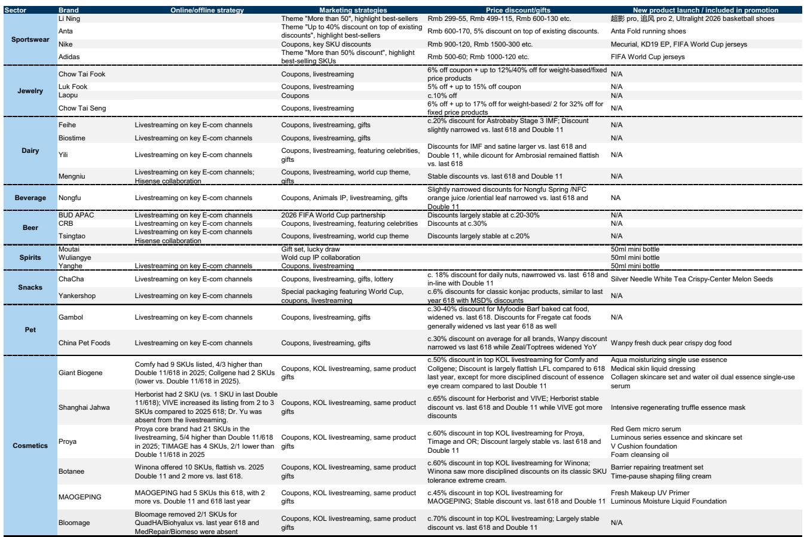
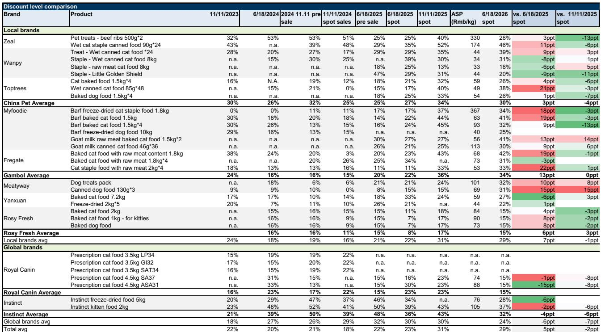
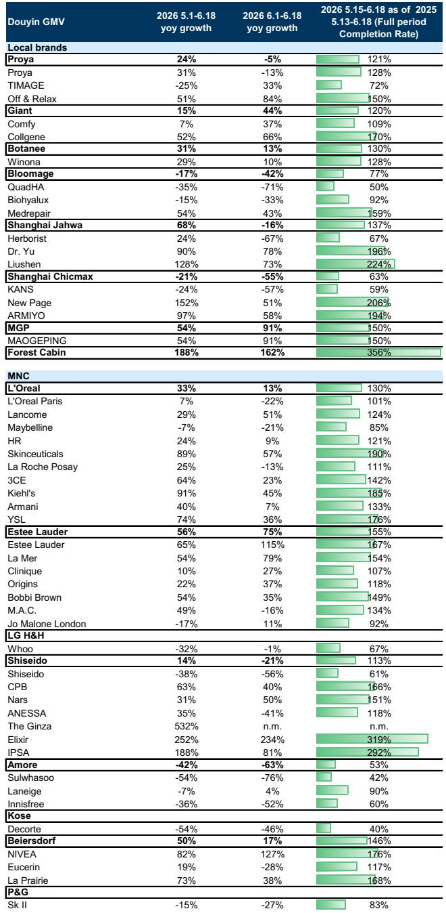

# China's 618 Shopping Festival Reveals a Market That Is Growing Slower but Concentrating Faster

The 2026 edition of China's 618 Shopping Festival delivered a clear strategic signal to investors and executives alike: aggregate growth is decelerating, but the dispersion of outcomes across categories, platforms, and brands is widening dramatically. Overall gross sales value across major platforms grew at approximately 6% year-on-year, a notable moderation from the 10% growth recorded in 2025. This deceleration, however, tells only part of the story. The more consequential pattern lies beneath the top-line numbers. Discounts deepened in most categories, platform subsidies expanded, and promotional calendars lengthened—yet the incremental return on these investments diverged sharply. Cosmetics and pet food posted robust gains; jewelry and home appliances lagged. Multinational leaders in beauty consolidated their positions, while select domestic brands executed powerful rebounds. The festival is no longer a rising tide that lifts all boats. It is a sorting mechanism that separates strategic winners from promotional also-rans.

The implications for corporate strategy are profound. The era of using blanket discounts to drive volume is yielding diminishing returns. Instead, the 618 data suggests that market share gains are increasingly concentrated among brands that have invested in platform-specific capabilities, premium positioning, and category-focused innovation. For investors, the festival provides a high-frequency diagnostic tool: the dispersion of growth rates across categories and brands is a leading indicator of structural shifts in consumer spending patterns. The question is no longer whether China's consumer market is slowing—it is. The question is which players are winning in a slower but more selective environment, and what strategic choices explain their outperformance.

## Discounts Are Widening, but ROI Is Diverging Across Platforms and Categories

The most striking finding from the 618 data is the decoupling between promotional intensity and commercial outcomes. Price checks across categories reveal that discounts widened meaningfully year-on-year in pet foods, dairy, and instant noodles, while remaining flat in beauty and jewelry. Yet the correlation between discount depth and sales growth is weak. Pet food, which saw discounts expand by 10 percentage points versus the 2025 festival, delivered 48% year-on-year growth on Tmall and Taobao. Beauty, where discounts were flat, still grew at 15% on those same platforms and 21% on Douyin. Meanwhile, jewelry, which also saw flat discounts, declined 27% year-on-year.

This divergence suggests that consumers are not simply responding to price cuts. They are responding to perceived value, category relevance, and platform-specific engagement. In beauty, brands that maintained premium pricing while offering bundled gifts or exclusive SKUs performed better than those that engaged in aggressive price reductions. In pet food, the category's structural growth tailwind—rising pet ownership and premiumization—overwhelmed the noise from deeper discounts. In jewelry, the category's discretionary nature and lack of compelling new product cycles made even stable discounts insufficient to drive demand.

The platform-level dynamics reinforce this point. Douyin, which benefited from reduced slotting fees and commission cuts for key opinion leaders, saw cosmetics grow at 21% year-on-year, outpacing Tmall and Taobao. This is not merely a channel shift. It reflects a structural advantage: Douyin's algorithm-driven discovery model allows brands to generate demand rather than simply capture it. Brands that invested in content creation and live-streaming capabilities on Douyin captured outsized share. Brands that treated the platform as just another discount channel underperformed.

The strategic takeaway is clear. In a market where promotional intensity is high and rising, the marginal return on additional discounting is declining. Brands that succeed are those that can segment their promotional strategy by platform, by category, and by consumer cohort. A one-size-fits-all discount approach is not just inefficient—it is value-destructive.

## Category Concentration Is Accelerating, with Cosmetics and Pet Food Leading While Durables and Jewelry Lag

The 618 data reveals a clear hierarchy of category performance that maps onto broader consumer spending trends. At the top, pet food grew approximately 48% year-on-year, supplements grew around 20%, and 3C products grew 19%. Cosmetics grew in line with or above platform averages, with beauty expanding 15% on Tmall and Taobao and 21% on Douyin. At the bottom, jewelry declined 27% year-on-year, and home appliances saw largely muted growth due to a high base from the prior year's trade-in stimulus.

This pattern is not random. It reflects three structural forces. First, categories with high penetration headroom and strong premiumization trends—such as pet food and supplements—continue to benefit from demographic and lifestyle shifts that are independent of the macroeconomic cycle. Second, categories with high emotional engagement and frequent product refresh cycles—such as cosmetics—can sustain growth even in a soft consumption environment, provided brands invest in innovation and platform-specific execution. Third, categories that are heavily dependent on replacement cycles or discretionary spending—such as home appliances and jewelry—are most vulnerable to consumer caution and subsidy fading.

The implications for portfolio construction and corporate resource allocation are direct. Investors should overweight categories where structural demand drivers are intact and where market leaders are gaining share through investment rather than discounting. Corporate executives should reassess their category exposure and consider whether their portfolio is weighted toward structurally growing or structurally challenged segments. The 618 data provides a real-time diagnostic: if a category grew below the platform average in this festival, the issue is likely structural, not tactical.

## Leading Brands Are Consolidating Share, but the Nature of Leadership Is Changing

Across the categories we tracked, top players were largely stable in their rankings, but the nature of their leadership is evolving. In cosmetics, multinational leaders such as Skinceuticals, Estee Lauder, and Lancome occupied the top positions on Tmall, while domestic brands including Mao Geping, Proya, and Forest Cabin delivered solid growth that outpaced the industry average. On Douyin, the pattern was slightly different: domestic brands like Proya and Mao Geping ranked highly, while multinationals like HR and Estee Lauder also performed well.

What distinguishes the winners is not simply brand equity or distribution scale. It is the ability to execute a platform-specific strategy. Mao Geping, for instance, rebounded strongly on both Tmall and Douyin, with growth exceeding 50% year-on-year on Douyin. This was not a function of deeper discounts—beauty discounts were flat year-on-year. It was a function of targeted investment in content, influencer partnerships, and product differentiation. Similarly, Proya maintained its top ranking on Douyin's skincare category, reflecting sustained investment in the platform's ecosystem.

In sportswear, the ranking shifts are equally instructive. Adidas, Descente, and Kolon improved their positions, while Nike and Camel declined. This suggests that brand perception, product innovation, and channel strategy matter more than scale alone. Adidas has invested heavily in both product innovation and digital engagement, and the 618 data suggests these investments are paying off. Nike's relative decline may reflect a period of product transition or channel misalignment.

The strategic lesson is that brand leadership is no longer a static asset. It must be continuously earned through investment in platform capabilities, product differentiation, and consumer engagement. Brands that rest on their legacy risk being overtaken by more agile competitors, whether multinational or domestic.

## What the Report Does Not Fully Explain: The Sustainability of Subsidy-Driven Growth and the Risk of Consumer Fatigue

The 618 data raises an important question that the report does not fully answer: how much of the observed growth is organic, and how much is pulled forward by subsidies and discounts? The report notes that platform and government subsidies stepped up meaningfully, particularly in cosmetics on Tmall and through reduced fees on Douyin. It also notes that parcel volume growth decelerated from 16% year-on-year in 2025 to 8% in 2026, while GMV growth was in the mid-teens. This implies higher average order value, which could reflect either genuine premiumization or a shift toward larger, subsidy-driven purchases.

The risk is that subsidy-driven growth is inherently unsustainable. If consumers are trained to wait for promotional windows, normal-period demand may weaken, forcing platforms and brands into an ever-escalating cycle of discounting. The 618 data shows that this cycle is already underway: discounts widened in most categories, and the festival period lengthened. Yet the incremental growth from these investments declined year-on-year.

The report does not provide a clear answer to whether the 2026 festival represents a peak in promotional intensity or a new normal. It also does not fully address the risk of consumer fatigue. If consumers become desensitized to discounts, the marginal return on promotional investment could turn negative. Brands that have built their growth strategy around festival-driven spikes may face a painful adjustment.

Investors and executives should watch two leading indicators in the coming quarters. First, the trajectory of normal-period GMV relative to festival-period GMV. If normal-period growth continues to decelerate while festival growth stabilizes, the market is becoming increasingly promotion-dependent. Second, the behavior of platforms themselves. If platforms reduce their subsidy commitments or shift toward more targeted, data-driven promotions, it would signal that they recognize the diminishing returns of blanket subsidies.

## A Decision Framework for Investors and Executives: How to Use Festival Data as a Strategic Diagnostic

The 618 festival data is not just a backward-looking report card. It is a forward-looking diagnostic tool that can inform strategic decisions across three time horizons.

For the immediate term (next 6 months), the data should be used to validate or challenge category and brand positioning. If a brand's festival performance was below the category average, the issue is likely structural, not seasonal. Executives should conduct a rapid diagnostic: Is the underperformance driven by platform strategy, product mix, pricing, or brand perception? If a brand's performance was above average, the priority should be to double down on the strategies that worked, particularly platform-specific investments and product innovation.

For the medium term (12 to 18 months), the data should inform resource allocation decisions. Categories that showed strong organic growth—pet food, supplements, cosmetics—deserve incremental investment in product development, marketing, and channel expansion. Categories that showed weakness despite stable discounts—jewelry, home appliances—require a strategic reassessment. Is the category structurally challenged, or is the underperformance company-specific? If the former, the appropriate response may be to reduce exposure. If the latter, the response should focus on fixing the specific issues.

For the long term (3 to 5 years), the data signals a structural shift in how Chinese consumers shop and how brands win. The era of broad-based consumption growth is over. The market is fragmenting by category, by platform, and by consumer segment. Winning requires precision: precise targeting, precise platform strategy, and precise pricing. Brands that treat every platform the same way, or every consumer the same way, will lose share to competitors that have invested in data-driven, platform-specific capabilities.

The festival data also provides a useful framework for risk assessment. If a brand's growth is heavily dependent on festival-driven spikes, its earnings are at risk from any normalization in promotional intensity. If a brand's growth is consistent across festival and normal periods, its earnings are more resilient. Investors should adjust their valuation multiples accordingly.

## The Questions That Matter Now: Which Brands Will Thrive When the Subsidies Fade?

The 618 data leaves investors and executives with a set of unresolved analytical questions that will define the next phase of China's consumer market. First, how much of the growth in cosmetics and pet food is structural, and how much is subsidy-driven? The answer will determine whether current market share leaders can sustain their positions or whether they face mean reversion. Second, will the platform-level divergence continue? If Douyin continues to gain share at the expense of Tmall and JD, brand strategies will need to shift accordingly. Third, can domestic brands maintain their momentum against multinational competitors, or will the latter's scale advantages reassert themselves once promotional intensity normalizes?

These questions cannot be answered by a single festival data point. They require ongoing tracking of market share trends, platform dynamics, and consumer behavior. The full report provides the detailed category-level and brand-level data that can help investors and executives begin to form their own hypotheses. It includes the original charts showing GMV growth trends, discount trajectories, and ranking shifts across platforms and categories.

Join the community to read the full report and review the original charts.

*This article is for learning and discussion only and does not constitute investment advice.*

Personal reading notes and learning share only. Not investment advice.

