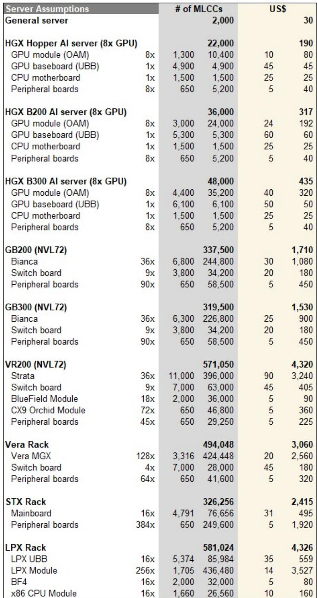
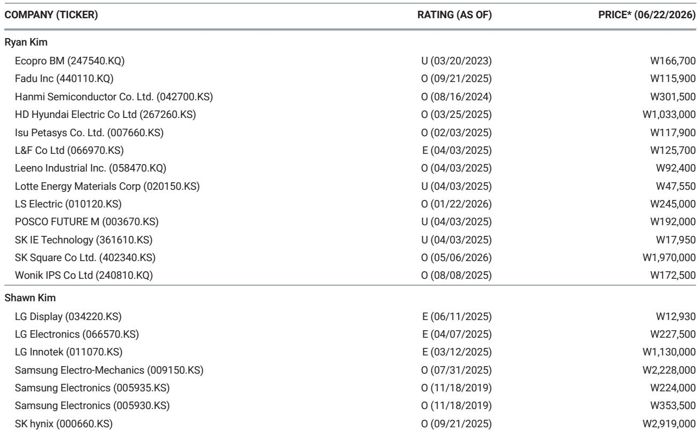
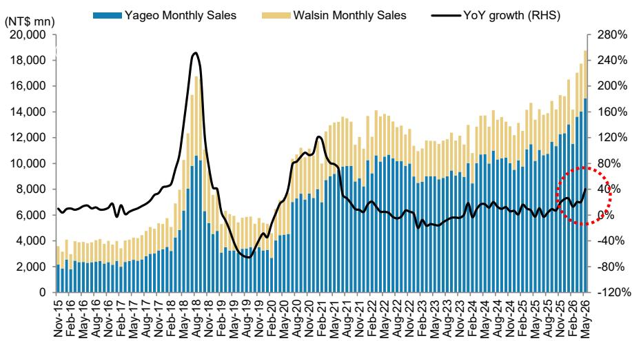

# The MLCC Supercycle Is the Next Structural AI Bottleneck—And It’s Only in the First Inning

The artificial intelligence trade has been defined by semiconductors for the past two years. That framing is becoming dangerously incomplete. While GPUs and HBM memory have captured the spotlight—and the capital—a less glamorous but equally critical component is now entering its own structural shortage: the multilayer ceramic capacitor, or MLCC. A single AI server rack consumes roughly 440,000 MLCCs, 10 to 15 times the volume of a traditional server. That is not a marginal demand shift. It is a step-function change in consumption that the supply base cannot match with its current trajectory.

The implications extend far beyond component pricing. The MLCC industry is evolving from a cyclical commodity business into a strategic bottleneck for AI infrastructure. Producers are reallocating fixed capacity toward high-margin AI-grade products, reducing flexibility for other end markets. Capacity expansion takes roughly two years from commitment to production, and the equipment is largely customized in-house, limiting the kind of rapid scaling that semiconductor fabs have achieved. The result is a supply-demand mismatch that we believe will persist for multiple years, not quarters.

This is not a repeat of the 2017-2018 MLCC supercycle, which was driven by a simultaneous surge in smartphone content and electric vehicle adoption. That cycle was cyclical. This one is structural. The demand driver—AI compute—shows no sign of peaking, and the architecture of AI servers is becoming more capacitor-intensive with each new platform generation. The question is no longer whether supply tightens. It is how long the constraints will last, and which players are positioned to capture the value.

The market has begun to price this shift, but unevenly. Samsung Electro-Mechanics has seen its price target raised to 2,560,000 won from 920,000 won, reflecting AI customer commitments across ABF substrates, embedded MLCCs, and silicon capacitors. Yet the broader MLCC group still trades at a valuation that does not fully reflect the multiyear earnings upgrade cycle that lies ahead. Investors who treat this as another commodity spike risk missing the most important component story in the AI hardware stack.

## AI-Driven MLCC Demand Will More Than Quadruple by 2030, While Capacity Grows Only 10-15% Annually

The arithmetic is stark. Cloud AI demand for high-capacitance MLCCs—those rated at 47 microfarads or above—is projected to expand from approximately 4 billion units in 2025 to 38 billion units by 2030. That is nearly a tenfold increase in the most value-dense segment of the market. Total industry capacity, by contrast, grows at only 10 to 15 percent per year. The gap between these two trajectories defines the opportunity.

The reason for this divergence is not simply higher unit counts. AI servers require fundamentally different capacitor specifications than traditional data center equipment. GPUs, ASICs, and FPGAs operate at very low voltages and switch on and off within nanoseconds, creating transient current demands that require local decoupling capacitance with ultra-low equivalent series resistance and equivalent series inductance. Standard commodity MLCCs cannot meet these requirements. Each high-capacitance AI-grade MLCC requires several hundred to over a thousand dielectric layers, consuming a disproportionate share of production capacity relative to its unit count.

This means that even though AI MLCCs may represent only 3 percent of industry unit volumes and 5 percent of revenue by 2027, they will absorb far more than that share of available capacity. As leading producers shift their lines toward AI, the supply of commodity-grade capacitors tightens, and pricing firms across the entire market. That is precisely what the channel data now shows: spot prices in Shenzhen's Huaqiangbei market have risen 200 to 300 percent since the first quarter of 2026, with some specifications seeing increases of 6 to 10 times year-to-date.

The critical insight is that this is not a demand shock that will be quickly absorbed. Capacity is constrained by the physical realities of ceramic powder processing, precision layering, and sintering. Unlike semiconductor manufacturing, where equipment suppliers can ramp production of lithography tools, MLCC production equipment is largely built in-house by the manufacturers themselves. There is no external supply chain that can accelerate capacity expansion. The two-year lead time is structural, not negotiable.

## The Shift from Volume to Quality Rewrites the Competitive Landscape

The MLCC market has historically been a volume game. Producers competed on cost, scale, and the ability to serve high-volume consumer electronics customers. That model is breaking down. AI demand is not just larger in magnitude; it is fundamentally different in composition. The focus has shifted from how many units a manufacturer can ship to how advanced a product it can engineer.

This rewards a specific set of capabilities. High-capacitance MLCCs require advanced materials science to achieve the dielectric properties needed for stable performance under high voltage and high temperature. They demand precision manufacturing to maintain uniformity across hundreds of layers. And they require rigorous qualification processes that can take 12 to 18 months for a new product to be approved for use in AI server platforms. These barriers to entry are rising, not falling.

The result is a market structure that is increasingly concentrated. A Japanese-Korean duopoly now controls approximately 85 percent of the high-end AI MLCC market. Murata holds roughly 45 percent share, with its AI server orders running at approximately two times capacity and utilization rates at 90 to 95 percent. Samsung Electro-Mechanics holds approximately 40 percent share, having narrowed the gap through a strategic pivot from low-margin consumer electronics to AI and automotive segments. Its Tianjin plant is operating at full capacity.

This concentration has important implications for pricing power. In a fragmented commodity market, price increases are quickly competed away as new capacity comes online. In a duopoly serving a structurally growing demand base, price increases are more durable. The leading producers have already begun to remove volume discounts and stop accepting orders at previous low prices. Distributors are negotiating long-term agreements to secure supply. These are not the behaviors of a market that expects conditions to normalize quickly.

Chinese producers, including CCTC, Guangdong Fenghua, and Chaozhou Three-Circle, are entering domestic server supply chains, but they remain focused on commodity-grade products. The qualification requirements for high-end AI MLCCs create a meaningful moat that will take years to cross. For the foreseeable future, the premium segment belongs to the incumbents.

## Embedded MLCCs and Power Integrity Create a New Design Paradigm

The most technologically significant development in the MLCC space is the emergence of embedded capacitors. Rather than being soldered onto the surface of a printed circuit board, embedded MLCCs are integrated directly into the substrate, shortening the distance between the capacitor and the semiconductor chip. This enables more efficient vertical power delivery, reduces power losses, and frees board space for additional components.

This is not an incremental improvement. It represents a fundamental change in how power integrity is managed in AI servers. As semiconductor process nodes shrink, operating voltages drop, and voltage tolerance narrows. Even small deviations can impair chip functionality. At the same time, AI workloads drive higher processor power consumption, increasing the need for local decoupling capacitance. Embedded MLCCs address both challenges simultaneously.

The technical requirements are demanding. Multilayer substrates in AI servers use copper interconnects, which means embedded components must be copper-plated for effective bonding. Embedded MLCCs feature flat surfaces that improve substrate integration and reliability. This design also increases usable board space, supporting higher component density. It is a solution that requires close collaboration between capacitor manufacturers and substrate producers, further raising the barriers to entry.

For investors, the rise of embedded MLCCs signals that the AI capacitor opportunity is not limited to higher unit volumes. It also includes a shift toward higher-value products with longer qualification cycles and stickier customer relationships. The companies that can execute on this technology will benefit from both volume growth and margin expansion. Those that cannot will be relegated to the commodity segments where pricing remains cyclical and competitive.

## What the Report Does Not Fully Answer: The Scale of Second-Order Demand and the Risk of Over-Ordering

The report makes a compelling case for a structural supply-demand imbalance, but it leaves several important questions unresolved. The first concerns the scale of second-order demand. If AI servers require 10 to 15 times more MLCCs than traditional servers, and if AI server shipments grow at compound rates of 30 to 50 percent annually, the implied demand trajectory is staggering. But what about the downstream effects? Higher MLCC content in AI servers may drive design changes in supporting infrastructure—networking equipment, storage systems, and power distribution units—that themselves require more capacitors. These second-order effects are not captured in the current demand estimates and could add further pressure to supply.

The second question is whether the current spot market activity reflects genuine end-user demand or precautionary stockpiling. The report notes that some extreme price increases of 10 to 20 times reflect inventory hoarding by traders rather than end demand. This is a classic signal of a market in the early stages of a shortage cycle, when participants rush to secure supply ahead of anticipated price increases. The risk is that double-ordering inflates apparent demand, creating a false signal that leads to over-investment in capacity. When the inventory correction comes—and it always does—the pricing cycle could reverse sharply.

The report acknowledges this risk but does not quantify it. The distinction between structural demand and cyclical inventory buildup is the single most important analytical question for investors trying to determine whether the current rally is sustainable. The answer likely lies in the trajectory of book-to-bill ratios and lead times. If orders continue to exceed shipments for multiple quarters, and if lead times remain above 20 weeks for high-end products, the demand is likely real. If book-to-bill ratios reverse sharply, the cycle may be shorter than expected.

## A Decision Framework for Investors Navigating the MLCC Supercycle

For investors trying to position in this market, the analytical challenge is separating signal from noise. The following framework may help.

First, distinguish between AI-grade and commodity-grade MLCCs. The structural shortage is concentrated in high-capacitance, low-ESL, high-reliability products used in AI servers. Commodity-grade capacitors used in smartphones, consumer electronics, and legacy automotive applications face a different dynamic. They benefit from the spillover effect of capacity reallocation, but they do not have the same pricing power or demand visibility. Companies with high exposure to AI-grade products deserve a premium; those that remain dependent on commodity volumes do not.

Second, assess capacity lead times and investment plans. The report notes that greenfield MLCC capacity requires approximately two years from commitment to production. Investors should track capital expenditure announcements from the leading producers. If capacity expansion plans remain modest relative to demand growth, the supply deficit will persist, supporting pricing. If producers announce aggressive expansion, the cycle may peak earlier.

Third, monitor the evolution of AI server specifications. Each new platform generation—from Hopper to Blackwell to Rubin—has increased MLCC content and value per rack. The Rubin generation is estimated to require approximately 1.8 times higher content value than its predecessor. If this trend continues, demand growth will outpace even optimistic volume forecasts. If platform specifications stabilize, the demand trajectory may flatten.

Fourth, watch the behavior of distributors and customers. The report notes that distributors hold approximately 1.5 months of inventory on average, while downstream customers hold less than one month. These are extremely lean levels. The next phase of the cycle will be determined by whether customers begin to rebuild inventories to more normal levels. If they do, the demand surge will be amplified. If they maintain lean operations, the supply-demand balance may tighten more gradually.

Finally, consider the risk of substitution. Silicon capacitors and other alternative technologies could eventually compete with MLCCs in certain AI applications. The report mentions silicon capacitors as part of Samsung Electro-Mechanics' emerging technology portfolio, but it does not assess the timeline for meaningful substitution. Investors should monitor developments in this area, as successful substitution could cap the upside for MLCC producers.

## The Cycle Has Further to Run, But the Entry Points Are Becoming More Selective

The MLCC supercycle is real, and it is still in its early innings. The structural drivers—AI compute demand, rising capacitor content per server, and supply constraints—are durable and likely to persist for multiple years. The leading producers, particularly Samsung Electro-Mechanics and Murata, are well positioned to capture the value created by this shift.

But the easy money may already have been made. Yageo has risen 379 percent year-to-date. Samsung Electro-Mechanics has risen 763 percent. Fenghua has risen 355 percent. At these levels, the margin for error is thin, and the risk of disappointment is real. The next phase of the cycle will reward investors who can distinguish between companies with genuine structural advantages and those that are simply riding the wave.

The report provides a detailed analysis of the supply-demand dynamics, the competitive landscape, and the key indicators to monitor. But it also leaves open questions that only time and data will answer. How much of the current pricing reflects genuine demand versus inventory hoarding? How quickly can Chinese producers qualify for AI-grade products? Will the next generation of AI platforms continue to increase capacitor content, or will design optimization eventually reduce the number of components required?

These are the questions that will determine whether the MLCC supercycle becomes a multiyear earnings story or a shorter-lived pricing spike. The answer will emerge over the next two to three quarters as book-to-bill ratios, lead times, and capacity announcements provide clearer signals.

For now, the evidence points toward a structural shift. The smart money is paying attention. The question is whether the market has already priced it in.

Join the community to read the full report and review the original charts.

*This article is for learning and discussion only and does not constitute investment advice.*

Personal reading notes and learning share only. Not investment advice.

