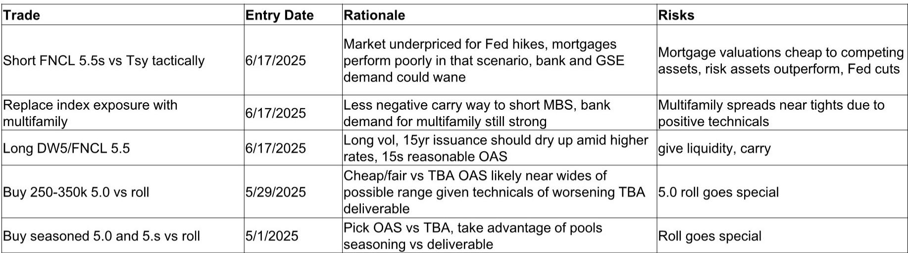
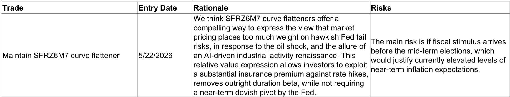
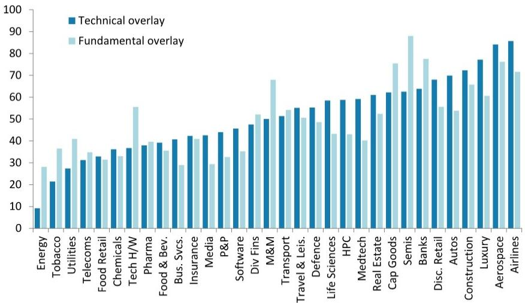

# 摩根斯坦利：MS：新美联储的“沉默”本身就是最响亮的信号

这份来自MS全球宏观论坛的报告，核心判断并非关于加息终点或降息时点，而是指向一个更深层的结构性变化：美联储正在主动退出“预期管理”的角色，将定价权交还给市场。对于习惯了“看美联储脸色”做交易的投资者而言，这意味着一套全新的游戏规则正在建立。

报告由MS首席固定收益策略师Vishwanath Tirupattur领衔，联合首席全球经济学家Seth Carpenter、全球宏观策略主管Matthew Hornbach、首席美股策略师Michael Wilson等核心团队共同撰写。它不只是一份市场展望，更像是一份“新美联储操作手册”的导论。

## 1. 新主席Warsh的“沉默策略”正在重塑市场定价逻辑

报告明确指出，新任美联储主席Warsh有意在沟通中减少“前瞻指引”。他认为，减少对市场的前瞻性引导是其政策思路的核心。这种做法与他的前任们形成了鲜明对比。过去十年，市场习惯了从每一次FOMC会议声明、每一次记者会中寻找关于未来利率路径的蛛丝马迹。现在，这种“确定性”正在被主动撤回。

然而，市场的反应却耐人寻味。尽管Warsh明确表示希望避免任何像前瞻指引的暗示，市场却将他“没有对当前定价进行反驳”的行为，解读为一种默许。结果就是，市场定价反而更加紧密地追随了点阵图。这构成了一种新的博弈：美联储不再告诉你它会怎么做，但它不纠正你，就意味着它认可你的判断。

> **KC评论：** 这相当于美联储把方向盘交给了市场，但又没有完全撒手。投资者需要从“猜美联储想什么”转向“猜市场如何猜美联储”。这种二阶博弈的复杂度，远高于过去。完整报告里包含了对SOFR曲线平坦化交易的详细论证，以及为什么在当前环境下，曲线平坦化比直接做空利率更具性价比。

## 2. 更高的利率波动率是“新常态”，而非短期扰动

Warsh的“沉默策略”最直接的后果，是利率波动率的结构性抬升。报告警告，由于缺乏前瞻指引，波动率不仅不低，反而可能进一步上升。这对所有利率敏感的资产类别都构成了根本性挑战。

对于抵押贷款支持证券（MBS）而言，这意味着一个经典的“双重打击”：更高的长期波动率会压缩抵押贷款指数的相对价值，同时利率曲线熊市平坦化会削弱银行对MBS的需求。MS因此战术性建议做空FNCL 5.5s。这并非看空美国房地产，而是基于一个清晰的相对价值判断——在当前环境下，MBS相对于国债的利差补偿不足。

> **KC评论：** 很多投资者习惯用历史波动率来定价，但报告暗示，我们需要把波动率中枢上移作为一个结构性假设。这会影响所有依赖低波动环境的策略，从MBS套利到风险平价。报告里有一张图展示了当前抵押贷款指数相对于量化宽松时期的水平，非常直观地说明了为什么现在的位置并不安全。

## 3. 美股牛市的核心驱动力仍然是盈利，而非美联储

这是报告中一个容易被忽略但极其重要的判断。首席美股策略师Michael Wilson认为，Warsh减少前瞻指引、更加依赖市场信号的做法，实际上会提高美联储决策的质量和时机。但真正驱动这轮牛市的核心，从来不是美联储的鸽派姿态，而是企业盈利。

报告指出，盈利的广度和韧性已经抵消了今年以来的估值压缩，并且很可能继续缓冲未来来自更紧缩货币政策或不确定性带来的冲击。这意味着，市场正在从“流动性驱动”切换为“盈利驱动”。那些盈利增长强劲、能消化更高利率成本的公司，将继续跑赢；而那些依赖低利率环境进行估值扩张的“故事型”公司，将面临更严峻的考验。

> **KC评论：** 这实际上是在说，不要因为美联储“不友好”就轻易看空美股。只要盈利还在增长，市场就有支撑。但这里的核心问题在于，盈利的韧性是否已经被充分定价？以及，如果利率波动率持续高企，它最终会不会反过来侵蚀企业融资成本和消费者信心？这些二阶效应，报告并没有完全展开，值得在完整报告里深入阅读。

## 4. 欧洲市场的“上海解封交易”正在失去动能，但结构性机会仍在

报告用大量篇幅分析了欧洲市场与美联储政策之间的联动。一个有趣的发现是，欧洲各板块对“上海解封”主题的敏感度，与其对美联储政策的敏感度高度相关。这意味着，中国经济的重启和美联储的政策，正在成为影响欧洲市场的两个并行但相互交织的力量。

然而，欧洲股市正陷入一个类似“解放日”后的季节性低迷期。市场宽度恢复缓慢，资金流入也未见明显起色。MS构建了“上海解封”主题的股票组合，这些股票在今年以来的表现已经出现了显著分化——排名前50的股票与排名后50的股票之间的差距正在拉大。这意味着，即使同一个主题，选股也变得至关重要。

> **KC评论：** 欧洲市场的故事比表面看起来更复杂。它既受益于中国重启带来的需求提振，又受制于美联储紧缩带来的估值压力。报告中的图表显示，欧洲斯托克600指数在触底后的走势，与过去几次市场低谷的表现非常相似，但节奏更慢。这种“慢修复”是否意味着后续有更大的上行空间，还是仅仅是阶段性疲软？报告没有给出确定的答案，这恰恰是值得继续跟踪讨论的地方。

## 5. 报告尚未完全回答的关键问题：当美联储失去“可信度”时会发生什么？

这是整份报告最具思辨价值的问题。Warsh的策略在逻辑上很清晰：减少干预，让市场自己发现价格。但这里隐含了一个关键假设——市场能够有效吸收和解读美联储的“沉默”。然而，如果市场在解读过程中出现系统性偏差，比如将“不反驳”误读为“认可”，进而导致定价过度偏离基本面，美联储是否有能力在不引发恐慌的前提下进行纠偏？

报告提到了“市场信号”的增强，但并没有深入探讨这种信号机制在极端情况下的可靠性。当市场因为缺乏前瞻指引而出现流动性枯竭或价格剧烈扭曲时，美联储是否还能保持“沉默”？这个问题的答案，可能决定了未来一到两年内最大的一次市场波动。

## 未完的讨论与每日跟踪

这份MS的报告，更像是一份“新游戏规则”的说明书，而不是一份具体的“交易地图”。它告诉我们，未来的市场将更依赖数据、更依赖相对价值、更依赖对市场自身行为的解读。

关于“新美联储”的更多细节，比如SOFR曲线平坦化的具体执行逻辑、MBS相对价值交易的风险收益比、以及欧洲“上海解封”股票池的最新筛选标准，都值得在完整报告中仔细推敲。

我们每天会由AI agent结合人工review，生成国际投行中文摘要与KC评论，daily更新约10-40页，并整理当天最新数据图表合集。这些内容既方便直接喂给AI进行二次分析，也方便人工快速把握全球市场的动态变化。欢迎到我们的知识星球和微信群里，继续讨论这份报告背后那些尚未完全展开的细节。

Personal reading notes and learning share only. Not investment advice.

