# ASIA STRATEGY BASKET

# Built for Orbit: Introducing Asia Space Economy Basket (GSSZSPCE)

We see a compelling relative risk/reward in Asia Space Economy stocks, supported by structural demand, measurable earnings delivery, policy support, and under-positioned thematic flows.

The Space Economy is in an active deployment phase. Satellite launches reached 4,400+ in 2025 (+65% YoY), with \~70,000 additional satellites targeted over the next five years. Our Technology equity analysts forecast the LEO satellite market to expand 7× to US\$108bn by 2035. Sovereign constellation programs are already in funded execution through 2028, providing non-discretionary demand independent of end-user adoption.

Asia's role in the global supply chain is critical. Asia represents the hardware backbone of the global buildout, spanning satellite buses and payloads, rocket engines, RF/GNSS chips, phased-array antennas, earth observation instruments, and in-orbit servicing. China, Japan, Korea, Taiwan, and India occupy distinct but complementary positions across the value chain, supported by contracted order books and government-backed programs.

Theme broadening, with AI convergence extending duration. Orbital AI compute is moving into procurement in 2026, driven by terrestrial energy and permitting constraints. The linkage to AI infrastructure capex broadens the investment case and extends the duration of the theme beyond pure space deployment.

Thematic flows are accelerating. Global space-themed funds and ETF AUM have reached \~US\$25bn at peak across 40+ products, up from only \~US\$1bn at the beginning of 2025. However, Asia supply chain companies remain structurally underrepresented, creating a clear gap between positioning and fundamentals.

Structural Investment Opportunity: We introduce the Asia Space Economy basket (GSSZSPCE), focused on companies with direct or supply chain exposure across four categories: (1) Upstream — Launch & Propulsion, (2) Satellite Manufacturing & Components, (3) Ground Segment & Downstream Applications, and (4) Space-Grade Materials & Electronics. The basket has outperformed broader markets since 2025, while trading in a consolidation range over the past 3 months.

Valuation and earnings support an attractive risk/reward. Asia Space Economy stocks are trading at deep discounts to global peers (-60% P/E; -25% P/B), with relative valuations near the low end of the historical range, despite supportive earnings momentum, suggesting fundamentals are not yet fully reflected in pricing.

## Alvin So, CFA

+852-2978-1585 | alvin.so@gs.com
GS (Asia) L.L.C.

Timothy Moe, CFA
+65-6889-1199 | timothy.moe@gs.com
GS (Singapore) Pte

Kinger Lau, CFA
+852-2978-1224 | kinger.lau@gs.com
GS (Asia) L.L.C.

Bruce Kirk, CFA
+81(3)4587-9950 | bruce.kirk@gs.com
GS Japan Co., Ltd.

Sunil Koul
+44(20)7051-4931 | sunil.koul@gs.com
GS International

John Kwon
+65-6654-6337 |
jongmin.kwon@gs.com
GS (Singapore) Pte

Amorita Goel, CFA
+65-6654-5445 | amorita.goel@gs.com
GS (Singapore) Pte

## Lift-Off to a New Growth Frontier

The Space Economy — Scale and TAM Growth
The Satellite Industry Association (SIA)'s Annual State of the Satellite Industry Report estimates the global space economy at US\$429bn in 2025 (+3% YoY), including US\$303bn in revenues across the commercial satellite value chain.

Deployment activity continues to accelerate: 4,434 satellites were launched in 2025 (+65% YoY), bringing the total number of operational satellites to 14,266. Within the value chain, commercial launch revenues grew 33% to US\$12.4bn, satellite manufacturing reached US\$20.4bn, and satellite ground network revenues increased 8% to US\$165bn.

Looking ahead, with \~70,000 satellites targeted for launch over the next five years, our Technology equity analysts forecast the LEO satellite market to expand 7× to US\$108bn by 2035, implying a \~20% CAGR over 2024–35E. In upside scenarios, the TAM could double in a bull case and potentially quadruple in a blue-sky scenario.

Broader industry estimates point to a similarly large opportunity set. The World Economic Forum and McKinsey project the overall space economy to reach US\$1.8tn by 2035, while Novaspace estimates the market could exceed US\$1tn by 2034. Multiple programs are now competing for this TAM, with Asia's supply chain manufacturers positioned to benefit across the deployment cycle.

The Asia opportunity is centred on manufacturing but also extends across a broader economic footprint, including connectivity, earth observation, logistics, climate and agriculture analytics, and digital infrastructure. Deloitte and the Singapore Space & Technology Think Tank estimate that earth observation services alone could contribute \~US\$100bn to ASEAN GDP by 2030.

Exhibit 1: US remains the most active player in launching activities globally, while China is the most active player among Asia  
  
Source: Our World in Data, Orbital Radar

Exhibit 2: Global space object launches (primarily satellites) surged by \~60% to over 4,500 annually in 2025

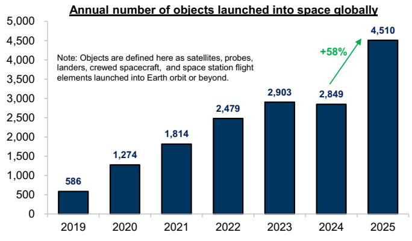  
Source: Our World in Data, Orbital Radar

Exhibit 3: Our Technology equity analysts forecast the LEO satellite TAM to increase from US\$15bn to US\$108bn over 2024–35E  
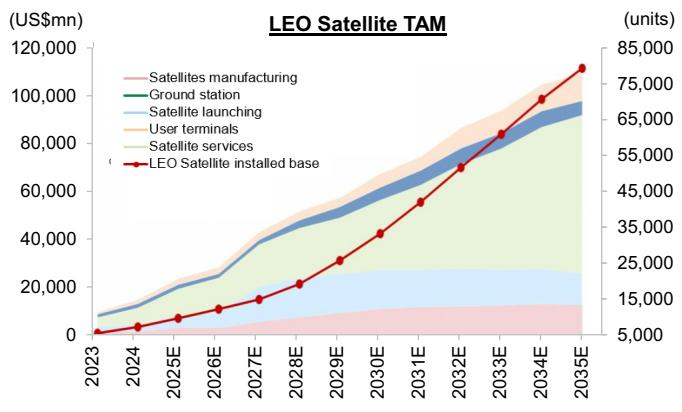  
Source: Company data, GS Global Investment Research

Exhibit 4: Governments across global economies have committed to increased space investment and spending

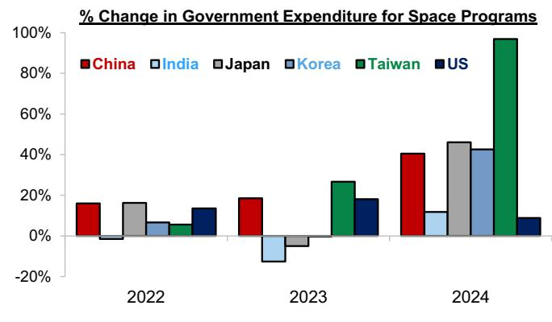  
Source: Novaspace, GS Global Investment Research

The distinction between core/established and early-growth/emerging segments is important in assessing exposure to the theme. We believe core positioning should be anchored in contracted, revenue-generating segments, while emerging areas are better viewed as optionality.

We map the value chain across time horizons, growth profiles, and Asia's role in the supply chain:

## Core / Established

■ Launch Vehicles: The key enabler. Reusability-driven cost declines have unlocked downstream scale. Asia has the broadest non-US launch base, spanning China (state and private), Japan (H3), and India (ISRO and emerging private players).

Satellite Manufacturing: Strongest order book visibility, with sovereign constellations anchoring non-discretionary demand. China leads on scale and integration; Japan on precision systems; Korea is scaling production; Taiwan specialises in subsystems and components; India remains early but is ramping rapidly.

■ Ground Electronics & Infrastructure: The largest segment and most direct volume lever. Satellite deployment mechanically drives hardware demand with limited execution risk. Taiwan dominates RF/GNSS and phased-array components, while Korea and Japan supply network and ground systems.

Earth Observation & Data Services: The most mature downstream segment, supported by recurring data revenues. Japan and India anchor supply; Southeast Asia is the fastest-growing demand market, with Singapore serving as the regional hub.

■ LEO Satellite Connectivity / Broadband: The clearest near-term monetisation pathway. Maritime and aviation lead adoption given meaningful cost advantages versus legacy services. Asia Pacific is a key growth market, with Taiwan, Korea, and Japan supplying core connectivity hardware.

## Early-Growth / Emerging

■ Space Sustainability / In-Orbit Services: Structurally non-discretionary, as LEO congestion scales with deployment. Japan holds a near-monopoly position globally in commercial in-orbit servicing.

Orbital AI Compute / Space Data Centers: Moving into early-stage procurement in 2026, driven by terrestrial energy and permitting constraints. The linkage to AI capex broadens investor relevance. Japan, Korea, and Taiwan are the key hardware beneficiaries.

\- Direct-to-Device / Connected Mobility: Evolving from a niche to an integrated connectivity layer. 6G standardisation is expected to embed D2D structurally. China leads in EV integration, while Taiwan, Korea, and Japan supply core components.

\- Space Pharma / Microgravity Manufacturing: Scientifically validated but commercially early-stage. Regulatory frameworks remain nascent. Asia’s role is currently focused on launch access and payload return logistics (India and Japan), with long-duration optionality.

## Asia Supply Chain — Distinct Market Exposures

We frame the opportunity as geographically diversified but thematically coherent, with each market offering differentiated exposure across the value chain:

China, Japan, and Korea — High exposure: Positioned upstream across launch, satellite manufacturing, and system integration, where contract values are highest and visibility is multi-year. China’s ramp is largely non-discretionary through 2028, driven by ITU filing timelines. Japan adds a differentiated sustainability angle (e.g. Astroscale), while Korea is building toward commercial scale with a more integrated model across launch, manufacturing, and data.

Taiwan — Moderate to high exposure: Positioned in ground electronics, the largest segment by revenue. Established supply chain relationships with global constellation operators provide relatively low execution risk, though exposure is further downstream.

India — Moderate exposure: Reflects a sector still in early commercial scale-up, but with a broad three-pillar opportunity set over the next 3-5 years.

ASEAN/Singapore — Low to moderate exposure: Primarily a demand market and regional hub today, with potential for incremental manufacturing exposure over time as supply chains reallocate.

In parallel, sovereign programs are moving into funded execution, including Japan's JPY1tn Space Strategy Fund, Korea's KRW200bn private space fund, India's IN-SPACe VC facility, and Singapore's NSAS.

Exhibit 5: Asia Space Supply Chain — Market Positioning

<table><tr><td>Market</td><td>Space Economy Exposure</td><td>Value Chain Tier</td><td>What Asia Makes and Sells</td><td>Government Anchor &amp; Target</td></tr><tr><td>China</td><td>High</td><td>Full-Stack:Upstream To Downstream</td><td>Satellite bus, payloads, and subsystems at industrial scale (mass production, smart factories)Liquid and solid rocket engines, incl. reusable launch vehicles targeting &lt;20,000 yuan/kgIntegrated commercial spaceport cluster (700+ companies)RF and ground electronics (broad domestic supply chain)EO data platforms and downstream analytics (agriculture, logistics, climate)Emerging: in-orbit services, space tourism, microgravity manufacturing</td><td>CNSA Commercial Space Action Plan 2025–27; commercial space as core national pillar•ITU-driven sovereign constellation deployment (through 2028)National development fund with patient capital•20+ provincial space industrial policies</td></tr><tr><td>Japan</td><td>High</td><td>Upstream:Launch, Propulsion, Satellite Bus, In-Orbit Sustainability</td><td>Heavy/medium launch vehicles (accelerating cadence)Rocket propulsion systems (high reliability)Satellite bus and system integration (scaling production)Solar arrays and satellite power componentsGround electronics, EO instruments, satcom systemsIn-orbit servicing (only commercial debris-removal capability in operation)</td><td>JPY1tn Space Strategy Fund (10-year,JAXA-led)Targets: low-cost launch, domestic supply chain, GEO refuelling, microsatellite swarmsGoal: 2nd-largest national space program globally</td></tr><tr><td>South Korea</td><td>High</td><td>Midstream:Launch Systems, Satellite Manufacturing</td><td>Rocket engine manufacturing and KSLV-III (preliminary design from 2026)Mass-production satellite facility (operational late 2025)SAR/EO satellite systems (exported to 7+ countries)Integrated space infrastructure model (conglomerate-led)Small satellites, structural components, precision manufacturingEmerging space data services and analytics</td><td>KASA established 2024 • KRW200bn private space fund • KRW1.2tn SAR constellation contract under evaluation (Oct 2026 milestone)•Target: top-7 global space power by 2045</td></tr><tr><td>Taiwan</td><td>Moderate-High</td><td>Midstream:Ground Electronics, RF/GNSS Subsystems, LEO H/W</td><td>RF front-end modules and phased-array antennas (linked to semiconductor strength)GNSS chips, controllers, baseband electronicsPCBs, fibre connectors, precision electronics (dominant revenue driver)Satellite subsystems and payload componentsCubeSat platforms and miniaturised manufacturingSemiconductor packaging and radiation-tolerant chips</td><td>NT$27bn 6G/satellite alliance (6-year)•NT$1tn production target by 2029–30•TASA Emerging Star Plan•Space Development Act (2021)</td></tr><tr><td>India</td><td>Moderate</td><td>Mid-To-Downstream:Launch, Manufacturing, EO Data</td><td>Government/private launch vehicles (multi-payload capability)Satellite manufacturing scaling (300+ startups under IN-SPACe)NavIC/IRNSS domestic navigation systemEO analytics (agriculture, logistics, water, disaster response)Component manufacturing (structures, propulsion, electronics)Emerging space pharma logistics</td><td>IN-SPACe PPP framework•Fully liberalised FDI (satellites, launch, ground systems)•Target: US$44bn sector by 2033 (vs ~US$8.4bn today)•WEF ecosystem initiative</td></tr><tr><td>ASEAN / Singapore</td><td>Low-Moderate</td><td>Downstream:EO Data Demand, LEO Connectivity</td><td>Singapore as regional HQ/financial hub (~70 companies, ~2,000 professionals)High-growth EO demand (agriculture, maritime, O&amp;G, utilities, climate)LEO broadband bridging infrastructure gaps (US$40bn+ potential benefit)Emerging manufacturing/assembly footprint</td><td>Singapore NSAS (Apr 2026), SGD200mn+ committed•Deloitte-SSTL:EO~US$100bn ASEAN GDP contribution by 2030•Vietnam-Japan cooperation; national programs across SEA</td></tr></table>

Source: Various news, government, and industry sources (e.g. Bloomberg, The Economist, SIA, Novaspace, Invest India, Japan Earth Observer, Focus Taiwan, China in Space), company data, GS Global Investment Research.

## Investor Flows and Thematic Positioning

Space-themed funds have seen meaningful inflows since 2015 (+US\$19bn), with aggregate AUM reaching US\$25bn at peak across 40+ funds globally, up from \~US\$1bn at the beginning of 2025. Among the top 10 funds by AUM, six are ETFs, accounting for roughly 50% of assets in the theme. Recent ETF launches by multiple asset managers reflect growing institutional demand for dedicated exposure. That said, flows remain concentrated in US-listed names. Asia supply chain companies remain underrepresented in global thematic allocations and index benchmarks — a structural gap that we believe represents a key source of potential alpha for Asia beneficiaries.

Over the medium to longer term, continued sovereign program execution, convergence with AI infrastructure, and increasing institutional participation should support sustained investor interest across the space economy value chain.

Exhibit 6: Space-themed funds have seen meaningful inflows since 2015, with aggregate AUM reaching US\$24bn across 40+ funds globally  
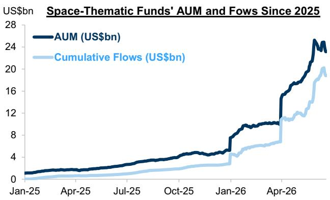  
Source: Bloomberg, GS Global Investment Research

Exhibit 7: Asia supply chain companies remain materially underrepresented in global thematic allocations, with a few exceptions in China-domiciled funds  
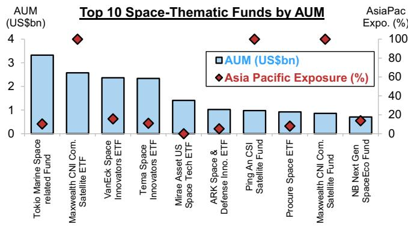  
Source: Bloomberg, GS Global Investment Research

## Asia Space Economy Basket (GSSZSPCE)

Our Asia Space Economy (GSSZSPCE) basket comprises companies with direct or supply chain exposure to the space economy, across four business categories: (1) Upstream — Launch & Propulsion, (2) Satellite Manufacturing & Components, (3) Ground Segment & Downstream Applications, and (4) Space-Grade Materials & Electronics. The basket includes 53 constituents, with 4, 16, 18, and 15 stocks in each segment, respectively, contributing 16% /40% / 26% / 18% of basket weight.

Asia Space Economy stocks have delivered meaningful outperformance vs. broader regional markets since 2025, led by Korea and Taiwan names. The rally was most pronounced in late 2025, with performance subsequently consolidating. At the segment level, Satellite Manufacturing & Components has been the clear outperformer, reflecting strong order book visibility and direct exposure to the constellation deployment ramp. Upstream — Launch & Propulsion saw a sharp run-up into February, followed by a pullback, while Ground Segment & Downstream Applications has lagged, suggesting markets are prioritizing near-term earnings delivery, with volume-driven downstream plays yet to re-rate.

Earnings momentum remains supportive, with Asia Space Economy stocks continuing to deliver positive growth and upward revisions, led by Japan and Korea, partially offset by weaker trends in China. Valuations remain compelling for Asia Space Economy stocks, which are trading at deep P/E (-60%) and P/B (-25%) discounts to global peers, with relative valuations near the low end of the historical range.

During April–May, Asia supply chain names underperformed global peers after tracking broadly in line earlier in the year. We view this divergence as flow-driven, with strong inflows into space-themed ETFs disproportionately benefiting globally listed names. Relative performance has rebounded since June, as US peers likely faced liquidity drag, while Asian stocks remain structurally supported as beneficiaries outside the US.

We see this dislocation as creating a compelling relative risk/reward opportunity for Asia supply chain exposures, supported by a constructive fundamental backdrop.

Exhibit 8: Asia Space Economy stocks have outperformed the broader regional equity market since 2025, led by Korea and Taiwan suppliers, although performance has recently consolidated following a strong rally in late 2025

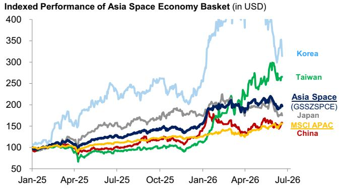  
Source: FactSet, GS Global Investment Research

Exhibit 9: Satellite Manufacturing & Components has been the strongest performer, while Ground Segment & Downstream Applications has lagged, while Launch & Propulsion has seen a drawdown after peaking in February

Indexed Performance of Asia Space Economy Basket by Segment (USD)  
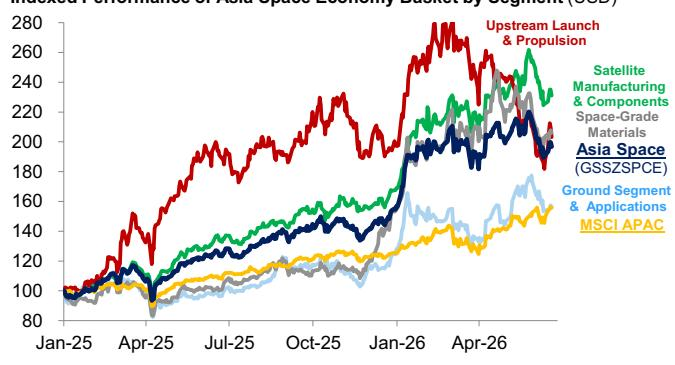  
Source: FactSet, GS Global Investment Research

Business Category Exposure of GS Asia
Space Economy Basket (GSSZSPCE)

Exhibit 10: Asia Space Economy stocks have continued to see earnings growth and upward revisions over the past year, led by Japan and Korea, although partly offset by weaker trends in China

Forward 12M EPS of Asia Space Economy Basket (Indexed in USD)  
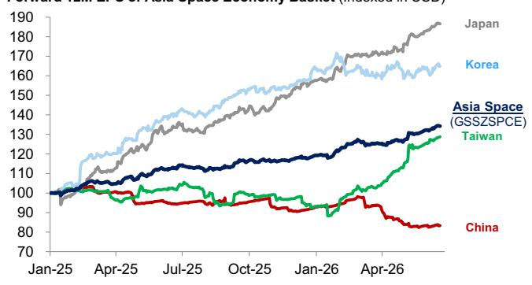  
Source: FactSet, GS Global Investment Research  
Exhibit 12: Asia Space Economy stocks broadly tracked global peers but underperformed in April–May amid strong thematic ETF inflows into global names, before rebounding since June as US peers likely faced liquidity drag

Exhibit 11: By business category, earnings momentum has been strongest in Launch & Propulsion, followed by Satellite Manufacturing & Components, while the other segments have come under pressure

Forward 12M EPS of Asia Space Economy Basket (Indexed in USD)  
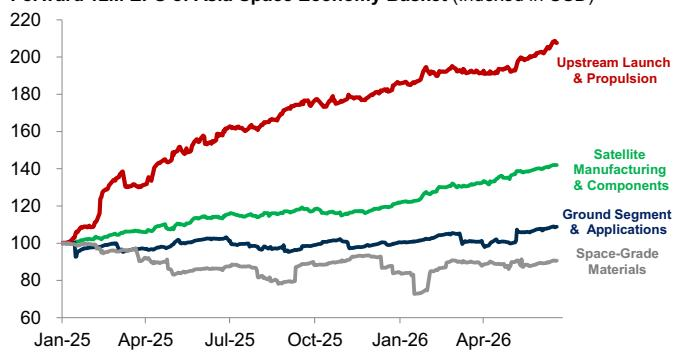  
Source: FactSet, GS Global Investment Research

Relative Performance of Asia Space Economy Stocks vs. Global  
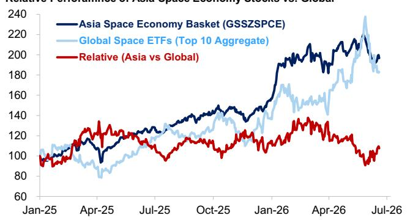  
Source: FactSet, GS Global Investment Research  
Exhibit 14: Market Composition of GS Asia Space Economy basket (GSSZSPCE)  
Exhibit 13: Valuations remain relatively attractive for Asia Space Economy stocks, which are trading at deep P/E and P/B discounts to global peers, near the low end of the historical range

Relative Valuations (Prem/Disc) of Asia Space Economy Stocks vs. Global  
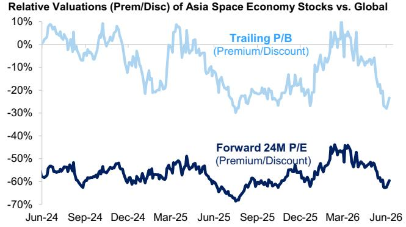  
Source: FactSet, GS Global Investment Research  
Market Composition of GS Asia
Space Economy Basket (GSSZSPCE)

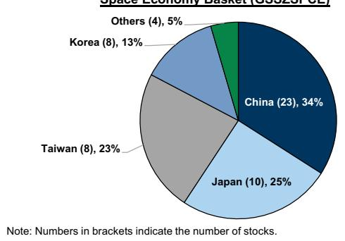  
Source: GS Global Investment Research  
Exhibit 15: Business Category Exposure of GS Asia Space Economy Basket (GSSZSPCE)

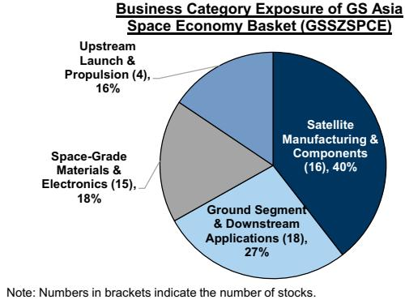  
Source: GS Global Investment Research

## Asia Space Economy Basket (GSSZSPCE)

Universe: Asia-listed equities with 6M average daily value traded (ADTV) > US\$5mn.

Selection Criteria: Stocks with exposure to the defined Space Economy business categories, based on RBICS sub-industry classifications indicating direct space or satellite-related activity, verified supplier or customer linkages to key rocket and satellite operators, disclosed contracts or product-level exposure to space-related component manufacturing, demonstrable correlation to major global space economy stocks, and confirmed, material or growing revenue exposure to the theme.

## Space Economy Business Categories

(1) Upstream — Launch & Propulsion: Design, manufacture, and operation of launch systems and deep-space infrastructure.

■ Launch Vehicles & Integration: Orbital launch vehicle primes, commercial launch services, payload integration, fairing structures, and reusable systems

■ Propulsion & Attitude Control: Liquid and solid rocket engines, upper-stage propulsion, thrusters, and Attitude & Orbit Control System (AOCS) hardware

Lunar & Deep-Space Transport: Commercial lunar landers, payload delivery services, and crewed/uncrewed deep-space infrastructure

(2) Satellite Manufacturing & Components: Design, assembly, and in-orbit servicing of spacecraft and their subsystems.

Satellite Platforms & Payloads: Small, micro, and nano-satellite buses; SAR and optical imaging payloads; RF transponders and communication payloads; AOCS; and onboard computers

Orbital Services: Active debris removal, life-extension servicing, and end-of-life deorbiting

(3) Ground Segment & Downstream Applications: Infrastructure and services connecting space assets to end-users and commercial markets.

Satellite Operators: Commercial operators of GEO and LEO communication fleets, including transponder leasing and managed SatCom services

■ Ground Equipment & Terminals: Satellite terminals, gateway antennas, modems, RF front-end components, TT&C systems, and NTN/D2D connectivity modules

Earth Observation & Navigation Services: Satellite imagery analytics, GIS platforms, GNSS/BDS chipsets and positioning services, SSA, and SatCom network integration

(4) Space-Grade Materials & Electronics: Components and materials qualified for space environments, supported by confirmed commercial applications.

■ Space-Grade Electronics: Radiation-hardened semiconductors, space-qualified PCBs and HDI substrates, RF front-end chips, hermetic packages, and power conditioning units (PCUs)

■ Advanced Materials: Carbon fiber composites, specialty and superalloys (nickel, titanium), high-efficiency III–V solar substrates, and thermal management materials

Weighting Methodology: The basket is weighted based on a blended measure of free-float market cap and 6M ADTV, with max/min weights capped at 5.0%/0.5%.

The authors would like to thank Jerry Cheng, the Asia Portfolio Strategy team's off-cycle intern, for his valuable contribution to this research.

Exhibit 16: GS Asia Space Economy Basket (GSSZSPCE)

<table><tr><td rowspan="2">BBG Ticker</td><td rowspan="2">Company Name</td><td rowspan="2">Market</td><td rowspan="2">GICS Sub-Industry</td><td rowspan="2">Space Economy Business Category</td><td rowspan="2">Quoted Price</td><td colspan="2">Size and Liquidity</td><td colspan="3">Valuations</td><td rowspan="2">Basket Weight(%)</td></tr><tr><td>Listed Market Cap (US$mn)</td><td>6M ADVT (US$mn)</td><td>2027E P/E (X)</td><td>2025 P/B (X)</td><td>2027E ROE (%)</td></tr><tr><td colspan="12">GS Asia Space Economy Basket (GSSZSPCE)</td></tr><tr><td>300433 CS</td><td>Lens Technology</td><td>China A</td><td>Electronic Components</td><td>Ground Segment &amp; Downstream Applications</td><td>CNY 55.77</td><td>41,049</td><td>683</td><td>43</td><td>5.4</td><td>11</td><td>5.0%</td></tr><tr><td>000063 CS</td><td>ZTE (A)</td><td>China A</td><td>Communications Equipment</td><td>Ground Segment &amp; Downstream Applications</td><td>CNY 37.89</td><td>22,571</td><td>701</td><td>20</td><td>2.4</td><td>11</td><td>4.6%</td></tr><tr><td>300136 CS</td><td>SZ Sunway Communication (A)</td><td>China A</td><td>Communications Equipment</td><td>Satellite Manufacturing &amp; Components</td><td>CNY 107.45</td><td>15,375</td><td>1,336</td><td>80</td><td>13.1</td><td>13</td><td>5.0%</td></tr><tr><td>600703 CG</td><td>Sanan Optoelectronics (A)</td><td>China A</td><td>Semiconductors</td><td>Satellite Manufacturing &amp; Components</td><td>CNY 17.54</td><td>12,941</td><td>555</td><td>-</td><td>2.4</td><td>-</td><td>2.5%</td></tr><tr><td>300782 CS</td><td>Maxscend Microelectronics (A)</td><td>China A</td><td>Electronic Components</td><td>Space-Grade Materials &amp; Electronics</td><td>CNY 106.1</td><td>9,022</td><td>312</td><td>103</td><td>5.7</td><td>5</td><td>1.7%</td></tr><tr><td>688375 CG</td><td>Guobo Electronics (A)</td><td>China A</td><td>Semiconductors</td><td>Space-Grade Materials &amp; Electronics</td><td>CNY 101.93</td><td>8,984</td><td>124</td><td>75</td><td>9.4</td><td>12</td><td>0.6%</td></tr><tr><td>688122 CG</td><td>Western Superconducting Technologies (A)</td><td>China A</td><td>Diversified Metals &amp; Mining</td><td>Space-Grade Materials &amp; Electronics</td><td>CNY 60.3</td><td>5,793</td><td>223</td><td>36</td><td>5.5</td><td>-</td><td>1.1%</td></tr><tr><td>002465 CS</td><td>Guangzhou Haige Commun. (A)</td><td>China A</td><td>Communications Equipment</td><td>Ground Segment &amp; Downstream Applications</td><td>CNY 13.68</td><td>4,654</td><td>401</td><td>53</td><td>3.0</td><td>5</td><td>1.5%</td></tr><tr><td>688270 CG</td><td>Great Microwave Technology (A)</td><td>China A</td><td>Semiconductors</td><td>Space-Grade Materials &amp; Electronics</td><td>CNY 85.15</td><td>3,772</td><td>359</td><td>63</td><td>11.3</td><td>15</td><td>1.2%</td></tr><tr><td>300627 CS</td><td>Shanghai HuaCe Navigation Technology (A)</td><td>China A</td><td>Communications Equipment</td><td>Ground Segment &amp; Downstream Applications</td><td>CNY 29.28</td><td>3,432</td><td>86</td><td>22</td><td>5.5</td><td>21</td><td>1.2%</td></tr><tr><td>300762 CS</td><td>Jushri Technologies (A)</td><td>China A</td><td>Communications Equipment</td><td>Space-Grade Materials &amp; Electronics</td><td>CNY 40.9</td><td>3,798</td><td>307</td><td>100</td><td>11.1</td><td>10</td><td>1.3%</td></tr><tr><td>002792 CS</td><td>Tongyu Communication (A)</td><td>China A</td><td>Communications Equipment</td><td>Ground Segment &amp; Downstream Applications</td><td>CNY 37.11</td><td>2,875</td><td>376</td><td>309</td><td>6.9</td><td>-</td><td>2.3%</td></tr><tr><td>002151 CS</td><td>Beijing BDStar Navigation (A)</td><td>China A</td><td>Communications Equipment</td><td>Ground Segment &amp; Downstream Applications</td><td>CNY 33.32</td><td>2,182</td><td>233</td><td>-</td><td>3.7</td><td>-</td><td>0.8%</td></tr><tr><td>300045 CS</td><td>Hwa Create Corporation (A)</td><td>China A</td><td>Aerospace &amp; Defense</td><td>Ground Segment &amp; Downstream Applications</td><td>CNY 18.25</td><td>1,789</td><td>143</td><td>-</td><td>7.9</td><td>-</td><td>0.6%</td></tr><tr><td>688153 CG</td><td>Vanchip (Tianjin) Technology (A)</td><td>China A</td><td>Semiconductors</td><td>Space-Grade Materials &amp; Electronics</td><td>CNY 32.01</td><td>1,934</td><td>28</td><td>46</td><td>3.4</td><td>7</td><td>0.5%</td></tr><tr><td>300638 CS</td><td>Fibocom Wireless (A)</td><td>China A</td><td>Communications Equipment</td><td>Ground Segment &amp; Downstream Applications</td><td>CNY 20.3</td><td>1,592</td><td>98</td><td>32</td><td>2.9</td><td>9</td><td>0.5%</td></tr><tr><td>002583 CS</td><td>Hytera Communications (A)</td><td>China A</td><td>Communications Equipment</td><td>Ground Segment &amp; Downstream Applications</td><td>CNY 8.7</td><td>1,650</td><td>52</td><td>-</td><td>7.6</td><td>-</td><td>0.5%</td></tr><tr><td>300053 CS</td><td>Zhuhai Aerospace Microchips Science &amp; Tech (A)</td><td>China A</td><td>Semiconductors</td><td>Space-Grade Materials &amp; Electronics</td><td>CNY 16.42</td><td>1,580</td><td>153</td><td>-</td><td>8.0</td><td>-</td><td>0.6%</td></tr><tr><td>688418 CG</td><td>Genew Technologies (A)</td><td>China A</td><td>Communications Equipment</td><td>Ground Segment &amp; Downstream Applications</td><td>CNY 46.14</td><td>1,314</td><td>74</td><td>-</td><td>10.2</td><td>-</td><td>0.5%</td></tr><tr><td>688311 CG</td><td>Chengdu M&amp;S Electronics Tech (A)</td><td>China A</td><td>Aerospace &amp; Defense</td><td>Space-Grade Materials &amp; Electronics</td><td>CNY 28</td><td>720</td><td>37</td><td>25</td><td>2.8</td><td>10</td><td>0.5%</td></tr><tr><td>300123 CS</td><td>YaGuang Technology Group (A)</td><td>China A</td><td>Aerospace &amp; Defense</td><td>Space-Grade Materials &amp; Electronics</td><td>CNY 4.06</td><td>601</td><td>60</td><td>-</td><td>12.2</td><td>-</td><td>0.5%</td></tr><tr><td>300177 CS</td><td>Guangzhou Hi-Target Navigation Tech (A)</td><td>China A</td><td>Electronic Equipment</td><td>Ground Segment &amp; Downstream Applications</td><td>CNY 6.78</td><td>591</td><td>25</td><td>-</td><td>3.9</td><td>-</td><td>0.5%</td></tr><tr><td>1045 HK</td><td>APT Satellite Holdings</td><td>China H</td><td>Alternative Carriers</td><td>Ground Segment &amp; Downstream Applications</td><td>HKD 2.48</td><td>294</td><td>5</td><td>-</td><td>0.4</td><td>-</td><td>0.5%</td></tr><tr><td>6503 JT</td><td>Mitsubishi Electric</td><td>Japan</td><td>Heavy Electrical Equipment</td><td>Satellite Manufacturing &amp; Components</td><td>JPY 6051</td><td>79,338</td><td>247</td><td>23</td><td>2.9</td><td>11</td><td>5.0%</td></tr><tr><td>7011 JT</td><td>Mitsubishi Heavy Industries</td><td>Japan</td><td>Industrial Machinery &amp; Supplies</td><td>Upstream Launch &amp; Propulsion</td><td>JPY 3917</td><td>81,992</td><td>754</td><td>28</td><td>4.5</td><td>13</td><td>5.0%</td></tr><tr><td>6701 JT</td><td>NEC</td><td>Japan</td><td>IT Consulting &amp; Other Services</td><td>Satellite Manufacturing &amp; Components</td><td>JPY 3756</td><td>31,793</td><td>258</td><td>16</td><td>2.3</td><td>13</td><td>5.0%</td></tr><tr><td>7013 JT</td><td>IHI</td><td>Japan</td><td>Industrial Machinery &amp; Supplies</td><td>Upstream Launch &amp; Propulsion</td><td>JPY 2817</td><td>18,925</td><td>436</td><td>20</td><td>4.9</td><td>19</td><td>5.0%</td></tr><tr><td>9412 JT</td><td>SKY Perfect JSAT</td><td>Japan</td><td>Cable &amp; Satellite</td><td>Ground Segment &amp; Downstream Applications</td><td>JPY 3200</td><td>5,910</td><td>43</td><td>32</td><td>3.0</td><td>9</td><td>2.0%</td></tr><tr><td>186A JT</td><td>Astroscale Holdings</td><td>Japan</td><td>Aerospace &amp; Defense</td><td>Ground Segment &amp; Downstream Applications</td><td>JPY 1198</td><td>1,029</td><td>99</td><td>-</td><td>21.0</td><td>(76)</td><td>1.3%</td></tr><tr><td>290A JT</td><td>Synspective</td><td>Japan</td><td>Research &amp; Consulting Services</td><td>Satellite Manufacturing &amp; Components</td><td>JPY 1269</td><td>1,040</td><td>23</td><td>32</td><td>4.3</td><td>12</td><td>0.5%</td></tr><tr><td>464A JT</td><td>QPS Holdings</td><td>Japan</td><td>Aerospace &amp; Defense</td><td>Satellite Manufacturing &amp; Components</td><td>JPY 2180</td><td>756</td><td>37</td><td>19</td><td>4.7</td><td>16</td><td>0.5%</td></tr><tr><td>9348 JT</td><td>ispace,inc.</td><td>Japan</td><td>Aerospace &amp; Defense</td><td>Upstream Launch &amp; Propulsion</td><td>JPY 434</td><td>394</td><td>9</td><td>-</td><td>4.6</td><td>-</td><td>0.5%</td></tr><tr><td>402A JT</td><td>Axelspace Holdings</td><td>Japan</td><td>Aerospace &amp; Defense</td><td>Satellite Manufacturing &amp; Components</td><td>JPY 582</td><td>241</td><td>19</td><td>34</td><td>6.4</td><td>14</td><td>0.5%</td></tr><tr><td>012450 KP</td><td>Hanwha Aerospace</td><td>Korea</td><td>Aerospace &amp; Defense</td><td>Upstream Launch &amp; Propulsion</td><td>KRW 1E+06</td><td>37,870</td><td>241</td><td>20</td><td>6.0</td><td>22</td><td>5.0%</td></tr><tr><td>272210 KP</td><td>Hanwha Systems</td><td>Korea</td><td>Aerospace &amp; Defense</td><td>Satellite Manufacturing &amp; Components</td><td>KRW 91100</td><td>11,266</td><td>180</td><td>42</td><td>3.5</td><td>8</td><td>2.8%</td></tr><tr><td>047810 KP</td><td>Korea Aerospace Industries</td><td>Korea</td><td>Aerospace &amp; Defense</td><td>Satellite Manufacturing &amp; Components</td><td>KRW 146500</td><td>9,347</td><td>103</td><td>29</td><td>7.8</td><td>21</td><td>2.3%</td></tr><tr><td>001430 KP</td><td>SeAH Besteel Holdings Corporation</td><td>Korea</td><td>Steel</td><td>Space-Grade Materials &amp; Electronics</td><td>KRW 40950</td><td>961</td><td>16</td><td>11</td><td>0.8</td><td>6</td><td>0.5%</td></tr><tr><td>347700 KQ</td><td>Sphere Corp.</td><td>Korea</td><td>Health Care Technology</td><td>Space-Grade Materials &amp; Electronics</td><td>KRW 25250</td><td>852</td><td>52</td><td>40</td><td>17.0</td><td>31</td><td>0.7%</td></tr><tr><td>099320 KQ</td><td>Satrec Initiative</td><td>Korea</td><td>Aerospace &amp; Defense</td><td>Satellite Manufacturing &amp; Components</td><td>KRW 107100</td><td>768</td><td>26</td><td>61</td><td>4.7</td><td>8</td><td>0.5%</td></tr><tr><td>189300 KQ</td><td>Intellian Technologies</td><td>Korea</td><td>Communications Equipment</td><td>Ground Segment &amp; Downstream Applications</td><td>KRW 91600</td><td>644</td><td>18</td><td>20</td><td>3.5</td><td>14</td><td>0.5%</td></tr><tr><td>295310 KQ</td><td>HVM CO.</td><td>Korea</td><td>Diversified Metals &amp; Mining</td><td>Space-Grade Materials &amp; Electronics</td><td>KRW 65800</td><td>519</td><td>25</td><td>42</td><td>8.7</td><td>18</td><td>0.5%</td></tr><tr><td>2313 TT</td><td>Compeq Manufacturing</td><td>Taiwan</td><td>Electronic Components</td><td>Satellite Manufacturing &amp; Components</td><td>TWD 259.5</td><td>9,803</td><td>628</td><td>20</td><td>6.5</td><td>25</td><td>5.0%</td></tr><tr><td>3105 TT</td><td>Win Semiconductors</td><td>Taiwan</td><td>Semiconductors</td><td>Space-Grade Materials &amp; Electronics</td><td>TWD 528</td><td>7,095</td><td>387</td><td>53</td><td>5.4</td><td>10</td><td>5.0%</td></tr><tr><td>2324 TT</td><td>Compal Electronics</td><td>Taiwan</td><td>Tech H/W Storage &amp; Peripherals</td><td>Satellite Manufacturing &amp; Components</td><td>TWD 37.75</td><td>5,274</td><td>78</td><td>15</td><td>1.2</td><td>8</td><td>1.8%</td></tr><tr><td>6285 TT</td><td>Wistron Neweb (WNC)</td><td>Taiwan</td><td>Communications Equipment</td><td>Ground Segment &amp; Downstream Applications</td><td>TWD 274</td><td>4,201</td><td>196</td><td>18</td><td>3.9</td><td>19</td><td>4.2%</td></tr><tr><td>3491 TT</td><td>Universal Microwave Technology</td><td>Taiwan</td><td>Electronic Components</td><td>Satellite Manufacturing &amp; Components</td><td>TWD 1560</td><td>3,402</td><td>89</td><td>38</td><td>29.7</td><td>59</td><td>3.1%</td></tr><tr><td>2455 TT</td><td>Visual Photonics Epitaxy</td><td>Taiwan</td><td>Semiconductor Materials &amp; Equipme</td><td>Satellite Manufacturing &amp; Components</td><td>TWD 416</td><td>2,438</td><td>118</td><td>48</td><td>23.3</td><td>38</td><td>1.8%</td></tr><tr><td>2367 TT</td><td>Unitech PCB</td><td>Taiwan</td><td>Electronic Components</td><td>Space-Grade Materials &amp; Electronics</td><td>TWD 61.3</td><td>1,372</td><td>168</td><td>-</td><td>3.4</td><td>-</td><td>2.1%</td></tr><tr><td>3138 TT</td><td>Auden Techno</td><td>Taiwan</td><td>Communications Equipment</td><td>Ground Segment &amp; Downstream Applications</td><td>TWD 136.5</td><td>224</td><td>20</td><td>-</td><td>3.3</td><td>-</td><td>0.5%</td></tr><tr><td colspan="2">DATAPATT I Data Patterns (India)</td><td>India</td><td>Aerospace &amp; Defense</td><td>Space-Grade Materials &amp; Electronics</td><td>INR 4822.3</td><td>2,862</td><td>44</td><td>67</td><td>16.1</td><td>19</td><td>0.7%</td></tr><tr><td>PARAS IS</td><td>Paras Defence &amp; Space Technologies</td><td>India</td><td>Aerospace &amp; Defense</td><td>Satellite Manufacturing &amp; Components</td><td>INR 1410.6</td><td>1,205</td><td>22</td><td>90</td><td>16.1</td><td>16</td><td>0.5%</td></tr><tr><td>STE SP</td><td>Singapore Tech. Engineering</td><td>Singapore</td><td>Aerospace &amp; Defense</td><td>Satellite Manufacturing &amp; Components</td><td>SGD 10.83</td><td>26,176</td><td>46</td><td>28</td><td>13.1</td><td>37</td><td>2.8%</td></tr><tr><td>EOS AT</td><td>Electro Optic Systems</td><td>Australia</td><td>Aerospace &amp; Defense</td><td>Ground Segment &amp; Downstream Applications</td><td>AUD 10.66</td><td>1,620</td><td>24</td><td>169</td><td>8.4</td><td>4</td><td>0.5%</td></tr><tr><td colspan="12">Median</td></tr><tr><td colspan="12"></td></tr><tr><td colspan="12"></td></tr><tr><td colspan="12"></td></tr><tr><td colspan="12"></td></tr><tr><td colspan="12"></td></tr><tr><td colspan="12"></td></tr><tr><td colspan="12"></td></tr><tr><td colspan="2"></td><td></td><td></td><td></td><td></td><td></td><td></td><td></td><td></td><td></td><td></td></tr></table>

Note: Average of free-float market cap and 6-month ADTV weights, with a max/min weight cap of 5.0% / 0.5% applied. Valuations and earnings growth forecasts are based on I/B/E/S estimates. Pricing as of Jun 19, 2026.  
Source: Company Data, FactSet, GS Global Investment Research

## Disclosure Appendix

## Reg AC

We, Alvin So, CFA, Timothy Moe, CFA, Kinger Lau, CFA, Bruce Kirk, CFA, Sunil Koul, John Kwon and Amorita Goel, CFA, hereby certify that all of the views expressed in this report accurately reflect our personal views, which have not been influenced by considerations of the firm's business or client relationships.

Unless otherwise stated, the individuals listed on the cover page of this report are analysts in GS' Global Investment Research division.

Contributing Authors: Alvin So, CFA GS (Asia) L.L.C., Timothy Moe, CFA GS (Singapore) Pte, Kinger Lau, CFA GS (Asia) L.L.C., Bruce Kirk, CFA GS Japan Co., Ltd., Sunil Koul GS International, John Kwon GS (Singapore) Pte, Amorita Goel, CFA GS (Singapore) Pte.

Unless otherwise stated, the individuals listed in the Contributing Authors disclosure of this report are analysts in GS' Global Investment Research division.

## Disclosures

## Basket disclosure

The ability to trade the basket(s) in this report will depend upon market conditions, including liquidity and borrow constraints at the time of trade.

## Regulatory disclosures

## Disclosures required by United States laws and regulations

See company-specific regulatory disclosures above for any of the following disclosures required as to companies referred to in this report: manager or co-manager in a pending transaction; 1% or other ownership; compensation for certain services; types of client relationships; managed/co-managed public offerings in prior periods; directorships; for equity securities, market making and/or specialist role. GS trades or may trade as a principal in debt securities (or in related derivatives) of issuers discussed in this report.

The following are additional required disclosures: Ownership and material conflicts of interest: GS policy prohibits its analysts, professionals reporting to analysts and members of their households from owning securities of any company in the analyst's area of coverage. Analyst compensation: Analysts are paid in part based on the profitability of GS, which includes investment banking revenues. Analyst as officer or director: GS policy generally prohibits its analysts, persons reporting to analysts or members of their households from serving as an officer, director or advisor of any company in the analyst's area of coverage. Non-U.S. Analysts: Non-U.S. analysts may not be associated persons of GS & Co. LLC and therefore may not be subject to FINRA Rule 2241 or FINRA Rule 2242 restrictions on communications with a subject company, public appearances and trading in securities covered by the analysts.

Additional disclosures required under the laws and regulations of jurisdictions other than the United States
The following disclosures are those required by the jurisdiction indicated, except to the extent already made above pursuant to United States laws and regulations. Australia: GS Australia Pty Ltd and its affiliates are not authorised deposit-taking institutions (as that term is defined in the Banking Act 1959 (Cth)) in Australia and do not provide banking services, nor carry on a banking business, in Australia. This research, and any access to it, is intended only for “wholesale clients” within the meaning of the Australian Corporations Act, unless otherwise agreed by GS. In producing research reports, members of Global Investment Research of GS Australia may attend site visits and other meetings hosted by the companies and other entities which are the subject of its research reports. In some instances the costs of such site visits or meetings may be met in part or in whole by the issuers concerned if GS Australia considers it is appropriate and reasonable in the specific circumstances relating to the site visit or meeting. To the extent that the contents of this document contains any financial product advice, it is general advice only and has been prepared by GS without taking into account a client’s objectives, financial situation or needs. A client should, before acting on any such advice, consider the appropriateness of the advice having regard to the client’s own objectives, financial situation and needs. A copy of certain GS Australia and New Zealand disclosure of interests and a copy of GS’ Australian Sell-Side Research Independence Policy Statement are available at: https://www.goldmansachs.com/disclosures/australia-new-zealand/index.html. Brazil: Disclosure information in relation to CVM Resolution n. 20 is available at https://www.gs.com/worldwide/brazil/area/gir/index.html. Where applicable, the Brazil-registered analyst primarily responsible for the content of this research report, as defined in Article 20 of CVM Resolution n. 20, is the first author named at the beginning of this report, unless indicated otherwise at the end of the text. Canada: This information is being provided to you for information purposes only and is not, and under no circumstances should be construed as, an advertisement, offering or solicitation by GS & Co. LLC for purchasers of securities in Canada to trade in any Canadian security. GS & Co. LLC is not registered as a dealer in any jurisdiction in Canada under applicable Canadian securities laws and generally is not permitted to trade in Canadian securities and may be prohibited from selling certain securities and products in certain jurisdictions in Canada. If you wish to trade in any Canadian securities or other products in Canada please contact GS Canada Inc., an affiliate of The GS Group Inc., or another registered Canadian dealer. Hong Kong: Further information on the securities of covered companies referred to in this research may be obtained on request from GS (Asia) L.L.C. India: Further information on the subject company or companies referred to in this research may be obtained from GS (India) Securities Private Limited, Research Analyst - SEBI Registration Number INH000001493, 10th Floor, Ascent-Worli, Sudam Kalu Ahire Marg, Worli, Mumbai-400 025, India, Corporate Identity Number U74140MH2006FTC160634, Phone +91 22 6616 9000, Fax +91 22 6616 9001. GS may beneficially own 1% or more of the securities (as such term is defined in clause 2 (h) the Indian Securities Contracts (Regulation) Act, 1956) of the subject company or companies referred to in this research report. Investment in securities market are subject to market risks. Read all the related documents carefully before investing. Registration granted by SEBI and certification from NISM in no way guarantee performance of the intermediary or provide any assurance of returns to investors. GS (India) Securities Private Limited compliance officer and investor grievance contact details can be found at: https://www.goldmansachs.com/worldwide/india/documents/Grievance-Redressal-and-Escalation-Matrix.pdf, and a copy of the annual audit compliance report can be found at this link: https://publishing.gs.com/content/site/india-annual-compliance-report.html. Japan: See below. Korea: This research, and any access to it, is intended only for “professional investors” within the meaning of the Financial Services and Capital Markets Act, unless otherwise agreed by GS. Further information on the subject company or companies referred to in this research may be obtained from GS (Asia) L.L.C., Seoul Branch. New Zealand: GS New Zealand Limited and its affiliates are neither “registered banks” nor “deposit takers” (as defined in the Reserve Bank of New Zealand Act 1989) in New Zealand. This research, and any access to it, is intended for “wholesale clients” (as defined in the Financial Advisers Act 2008) unless otherwise agreed by GS. A copy of certain GS Australia and New Zealand disclosure of interests is available at: https://www.goldmansachs.com/disclosures/australia-new-zealand/index.html.
Russia: Research reports distributed in the Russian Federation are not advertising as defined in the Russian legislation, but are information and analysis not having product promotion as their main purpose and do not provide appraisal within the meaning of the Russian legislation on appraisal activity. Research reports do not constitute a personalized investment recommendation as defined in Russian laws and regulations, are not addressed to a specific client, and are prepared without analyzing the financial circumstances, investment profiles or risk profiles of clients. GS assumes no responsibility for any investment decisions that may be taken by a client or any other person based on this research report. Singapore: GS (Singapore) Pte. (Company Number: 198602165W), which is regulated by the Monetary Authority of Singapore, accepts legal responsibility for this research, and should be contacted with respect to any matters arising from, or in connection with, this research. Taiwan: This material is for reference only and must not be reprinted without permission. Investors should carefully consider their own investment risk. Investment results are the responsibility of the individual investor. United Kingdom: Persons who would be categorized as retail clients in the United Kingdom, as such term is defined in the rules of the Financial Conduct Authority, should read this research in conjunction with prior GS on the covered companies referred to herein and should refer to the risk warnings that have been sent to them by GS International. A copy of these risks warnings, and a glossary of certain financial terms used in this report, are available from GS International on request.

European Union and United Kingdom: Disclosure information in relation to Article 6 (2) of the European Commission Delegated Regulation (EU) (2016/958) supplementing Regulation (EU) No 596/2014 of the European Parliament and of the Council (including as that Delegated Regulation is implemented into United Kingdom domestic law and regulation following the United Kingdom's departure from the European Union and the European Economic Area) with regard to regulatory technical standards for the technical arrangements for objective presentation of investment recommendations or other information recommending or suggesting an investment strategy and for disclosure of particular interests or indications of conflicts of interest is available at https://www.gs.com/disclosures/europeanpolicy.html which states the European Policy for Managing Conflicts of Interest in Connection with Investment Research.

Japan: GS Japan Co., Ltd. is a Financial Instrument Dealer registered with the Kanto Financial Bureau under registration number Kinsho 69, and a member of Japan Securities Dealers Association, Financial Futures Association of Japan Type II Financial Instruments Firms Association, and Investment Management Association of Japan. Sales and purchase of equities are subject to commission pre-determined with clients plus consumption tax. See company-specific disclosures as to any applicable disclosures required by Japanese stock exchanges, the Japanese Securities Dealers Association or the Japanese Securities Finance Company.

## Global product; distributing entities

GS Global Investment Research produces and distributes research products for clients of GS on a global basis. Analysts based in GS offices around the world produce research on industries and companies, and research on macroeconomics, currencies, commodities and portfolio strategy. This research is disseminated in Australia by GS Australia Pty Ltd (ABN 21 006 797 897); in Brazil by GS do Brasil Corretora de Títulos e Valores Mobiliários S.A.; Public Communication Channel GS Brazil: 0800 727 5764 and / or contatogoldmanbrasil@gs.com. Available Weekdays (except holidays), from 9am to 6pm. Canal de Comunicação com o Público GS Brasil: 0800 727 5764 e/ou contatogoldmanbrasil@gs.com. Horário de funcionamento: segunda-feira à sexta-feira (exceto feriados), das 9h às 18h; in Canada by GS & Co. LLC; in Hong Kong by GS (Asia) L.L.C.; in India by GS (India) Securities Private Ltd.; in Japan by GS Japan Co., Ltd.; in the Republic of Korea by GS (Asia) L.L.C., Seoul Branch; in New Zealand by GS New Zealand Limited; in Russia by OOO GS; in Singapore by GS (Singapore) Pte. (Company Number: 198602165W); and in the United States of America by GS & Co. LLC. GS International has approved this research in connection with its distribution in the United Kingdom.

GS International (“GSI”), authorised by the Prudential Regulation Authority (“PRA”) and regulated by the Financial Conduct Authority (“FCA”) and the PRA, has approved this research in connection with its distribution in the United Kingdom.

European Economic Area: GS Bank Europe SE (“GSBE”) is a credit institution incorporated in Germany and, within the Single Supervisory Mechanism, subject to direct prudential supervision by the European Central Bank and in other respects supervised by German Federal Financial Supervisory Authority (Bundesanstalt für Finanzdienstleistungsaufsicht, BaFin) and Deutsche Bundesbank and disseminates research within the European Economic Area.

## General disclosures

This research is for our clients only. Other than disclosures relating to GS, this research is based on current public information that we consider reliable, but we do not represent it is accurate or complete, and it should not be relied on as such. The information, opinions, estimates and forecasts contained herein are as of the date hereof and are subject to change without prior notification. We seek to update our research as appropriate, but various regulations may prevent us from doing so. Other than certain industry reports published on a periodic basis, the large majority of reports are published at irregular intervals as appropriate in the analyst's judgment.

GS conducts a global full-service, integrated investment banking, investment management, and brokerage business. We have investment banking and other business relationships with a substantial percentage of the companies covered by Global Investment Research. GS & Co. LLC, the United States broker dealer, is a member of SIPC (https://www.sipc.org).

Our salespeople, traders, and other professionals may provide oral or written market commentary or trading strategies to our clients and principal trading desks that reflect opinions that are contrary to the opinions expressed in this research. Our asset management area, principal trading desks and investing businesses may make investment decisions that are inconsistent with the recommendations or views expressed in this research.

We and our affiliates, officers, directors, and employees will from time to time have long or short positions in, act as principal in, and buy or sell, the securities or derivatives, if any, referred to in this research, unless otherwise prohibited by regulation or GS policy.

The views attributed to third party presenters at GS arranged conferences, including individuals from other parts of GS, do not necessarily reflect those of Global Investment Research and are not an official view of GS.

Any third party referenced herein, including any salespeople, traders and other professionals or members of their household, may have positions in the products mentioned that are inconsistent with the views expressed by analysts named in this report.

This research is focused on investment themes across markets, industries and sectors. It does not attempt to distinguish between the prospects or performance of, or provide analysis of, individual companies within any industry or sector we describe.

Any trading recommendation in this research relating to an equity or credit security or securities within an industry or sector is reflective of the investment theme being discussed and is not a recommendation of any such security in isolation.

This research is not an offer to sell or the solicitation of an offer to buy any security in any jurisdiction where such an offer or solicitation would be illegal. It does not constitute a personal recommendation or take into account the particular investment objectives, financial situations, or needs of individual clients. Clients should consider whether any advice or recommendation in this research is suitable for their particular circumstances and, if appropriate, seek professional advice, including tax advice. The price and value of investments referred to in this research and the income from them may fluctuate. Past performance is not a guide to future performance, future returns are not guaranteed, and a loss of original capital may occur. Fluctuations in exchange rates could have adverse effects on the value or price of, or income derived from, certain investments.

Certain transactions, including those involving futures, options, and other derivatives, give rise to substantial risk and are not suitable for all investors. Investors should review current options and futures disclosure documents which are available from GS sales representatives or at

https://www.theocc.com/about/publications/character-risks.jsp and https://www.goldmansachs.com/disclosures/cftc\_fcm\_disclosures. Transaction costs may be significant in option strategies calling for multiple purchase and sales of options such as spreads. Supporting documentation will be supplied upon request.

Differing Levels of Service provided by Global Investment Research: The level and types of services provided to you by GS Global Investment Research may vary as compared to that provided to internal and other external clients of GS, depending on various factors including your individual preferences as to the frequency and manner of receiving communication, your risk profile and investment focus and perspective (e.g., marketwide, sector specific, long term, short term), the size and scope of your overall client relationship with GS, and legal and regulatory constraints. As an example, certain clients may request to receive notifications when research on specific securities is published, and certain clients may request that specific data underlying analysts' fundamental analysis available on our internal client websites be delivered to them electronically through data feeds or otherwise. No change to an analyst's fundamental research views (e.g., ratings, price targets, or material changes to earnings estimates for equity securities), will be communicated to any client prior to inclusion of such information in a research report broadly disseminated through electronic publication to our internal client websites or through other means, as necessary, to all clients who are entitled to receive such reports.

All research reports are disseminated and available to all clients simultaneously through electronic publication to our internal client websites. Not all research content is redistributed to our clients or available to third-party aggregators, nor is GS responsible for the redistribution of our research by third party aggregators. For research, models or other data related to one or more securities, markets or asset classes (including related services) that may be available to you, please contact your GS representative or go to https://research.gs.com.

Disclosure information is also available at https://www.gs.com/research/hedge.html or from Research Compliance, 200 West Street, New York, NY 10282.

## © 2026 GS.

You are permitted to store, display, analyze, modify, reformat, and print the information made available to you via this service only for your own use. You may not resell or reverse engineer this information to calculate or develop any index for disclosure and/or marketing or create any other derivative works or commercial product(s), data or offering(s) without the express written consent of GS. You are not permitted to publish, transmit, or otherwise reproduce this information, in whole or in part, in any format to any third party without the express written consent of GS. This foregoing restriction includes, without limitation, using, extracting, downloading or retrieving this information, in whole or in part, to train or finetune a machine learning or artificial intelligence system, or to provide or reproduce this information, in whole or in part, as a prompt or input to any such system.