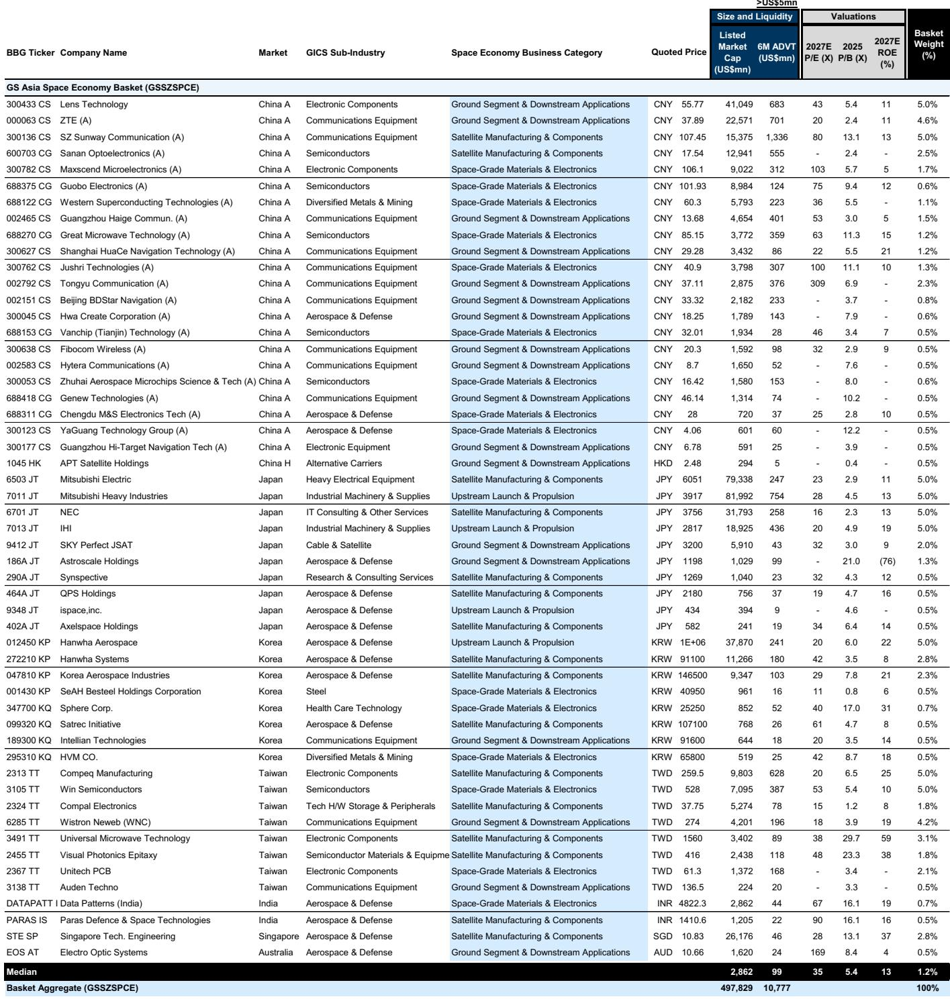
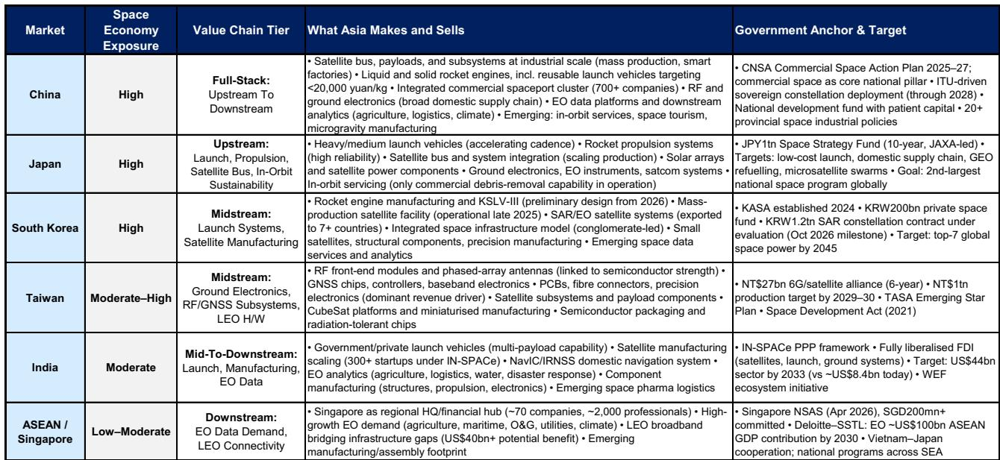
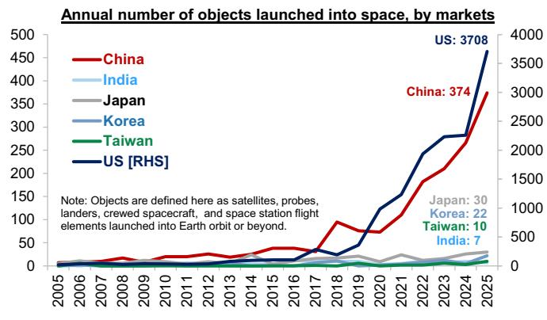

# GS：亚洲太空经济正在从“故事”转向“订单”，但市场定价仍落后60%

这份GS最新发布的亚洲太空经济专题报告，核心判断并不复杂：全球太空经济正从概念验证进入大规模部署阶段，而亚洲供应链公司在这一轮部署中扮演着不可替代的硬件核心角色。但市场对这些公司的定价，仍然停留在“概念主题”阶段，而非“盈利交付”阶段。

报告最值得关注的信号，不是太空经济的长期增长数字——那些已经足够震撼，LEO卫星市场预计到2035年增长7倍至1080亿美元——而是三个更具体的、对投资者有直接含义的发现：

第一，亚洲太空经济股票相对于全球同行的市盈率折价高达60%，市净率折价25%，且这一折价水平处于历史区间的低位附近。第二，全球太空主题基金和ETF的资产管理规模已经从2025年初的约10亿美元飙升至峰值约250亿美元，但亚洲供应链公司在这些基金中的配置比例仍然极低。第三，亚洲太空经济股票自2025年以来已经跑赢更广泛的区域市场，但在过去三个月进入盘整区间，而全球同行仍在上涨。

这意味着什么？如果太空经济确实在进入一个由订单和收入支撑的部署周期，那么亚洲供应链公司目前被低估的程度，可能提供了一个罕见的、基本面与定价之间存在系统性错位的窗口。

这份报告由GS亚洲策略团队Alvin So、Timothy Moe、Kinger Lau等多位分析师联合撰写，于2026年6月发布。它不仅仅是一份行业扫描，更是一份带有明确投资主张的“买入框架”。以下是我们从报告中提炼出的五个核心洞察。

> **KC评论：** 报告的核心主张是“亚洲太空经济股票被低估”，但支撑这一主张的关键证据——60%的市盈率折价——需要结合报告中的具体拆解来理解。折价本身并不自动意味着机会，关键在于折价是否被基本面恶化所解释。GS认为不是，因为盈利势头仍然积极。这正是完整报告中最值得细读的部分：分国家、分环节的盈利修正数据和相对估值图表。

## 1. 亚洲不是太空经济的“配角”，而是全球硬件供应链的“骨架”

许多投资者仍然将太空经济等同于马斯克的SpaceX或美国的星座运营商。但GS的报告清晰地指出，亚洲的角色远不止于此。

报告将太空经济价值链划分为四个环节：上游（发射与推进）、卫星制造与组件、地面段与下游应用、太空级材料与电子。在这四个环节中，亚洲几乎占据了硬件制造的全部关键节点。

中国的角色是“全栈式”的，从卫星总线、有效载荷到可重复使用火箭发动机，已经形成工业级量产能力，且受到ITU频率申报时间表的强约束，订单可见性至少到2028年。日本在发射系统和在轨服务领域占据独特位置，其商业碎片清除能力是目前全球唯一在运营的。韩国正在从火箭发动机制造向集成化太空基础设施模式转型，其大规模卫星生产设施预计2025年底投产。台湾则凭借半导体产业基础，主导了射频前端模块、相控阵天线和GNSS芯片等地面电子环节。

这一分工格局意味着，无论全球哪个星座运营商最终胜出，亚洲供应链公司都大概率是硬件供应商。这种“卖铲子”的商业模式，在太空经济的部署阶段，往往比星座运营商本身拥有更确定的收入和更低的执行风险。

## 2. 主权项目提供了“非可自由裁量需求”，这是与其他主题最根本的区别

太空经济投资常常被质疑的一个问题是：终端用户需求是否真实？如果企业客户和消费者对卫星宽带或地球观测服务的付费意愿不足，那么整个产业链的订单可能只是“一次性建设”。

GS的报告提供了一个有力的反论据：主权星座项目已经在2028年之前获得资金并进入执行阶段。这些项目不是由商业需求驱动的，而是由频谱申报、国家安全和产业政策驱动的。这意味着，即使商业端需求低于预期，上游供应链仍然有确定的订单支撑。

日本的1万亿日元太空战略基金、韩国的2000亿韩元私人太空基金、印度的IN-SPACe风险投资设施、新加坡的NSAS计划——这些政府锚定项目构成了亚洲太空经济需求的“基本盘”。报告明确指出，中国的星座部署在2028年前基本是非可自由裁量的。

> **KC评论：** 这里有一个值得追问的问题：主权项目虽然提供了订单确定性，但利润率是否同样有保障？政府合同往往利润率较低，且付款周期较长。GS报告在估值部分没有单独拆解主权项目与商业项目的利润率差异，这可能是完整报告里需要进一步验证的假设。对投资者而言，区分哪些公司主要依赖政府订单、哪些公司更多服务商业客户，可能是筛选标的的关键步骤。

## 3. AI与太空经济的融合，正在延长这一主题的投资久期

这是报告中最具前瞻性的判断之一。GS指出，轨道AI计算正在进入2026年的早期采购阶段，驱动力来自地面能源和审批限制。

逻辑链条是这样的：地面数据中心的能源消耗和碳排放限制日益严格，审批周期也在拉长。而太空数据中心的优势在于，它可以利用太阳能发电，且不需要占用地面土地资源。虽然这一领域目前仍处于早期阶段，但GS认为，它与AI基础设施资本开支的关联性，将显著拓宽太空经济的投资逻辑，并延长主题的投资久期。

对投资者而言，这意味着太空经济不再只是“卫星和火箭”的故事。它正在与全球最大的资本开支主题——AI基础设施——产生交集。日本、韩国和台湾是这一领域的主要硬件受益者。

## 4. 资金流正在加速涌入，但亚洲公司被严重低配

报告提供了一组令人惊讶的数据：全球太空主题基金和ETF的数量已经超过40只，资产管理规模峰值达到约250亿美元，而2025年初这一数字仅有约10亿美元。资金流入的速度堪称爆炸性。

但问题在于，这些资金绝大多数流向了美国上市的太空公司。亚洲供应链公司在全球主题配置和指数基准中的代表性仍然极低。GS认为，这种“定位与基本面之间的差距”是亚洲受益者潜在超额收益的关键来源。

报告同时指出，2026年4月至5月期间，亚洲供应链股票跑输了全球同行。GS将这一背离归因于资金流驱动——大量资金涌入太空主题ETF，但ETF的持仓主要集中在全球上市的大型公司，亚洲中小型供应商未能直接受益。6月以来，相对表现已经有所反弹。

> **KC评论：** 资金流背离的观察很敏锐，但它也引出了一个更复杂的问题：亚洲太空经济股票的流动性是否足以容纳机构资金的大规模流入？报告中的GSSZSPCE篮子包含53只成分股，但其中许多公司的市值可能较小，流动性有限。这一点在报告中没有详细展开，但对大型机构投资者来说，这是必须考虑的实际约束。完整报告中的成分股列表和流动性分析，可能是决定能否执行这一策略的关键信息。

## 5. 估值折价是真实的，但需要区分“被低估”和“被误解”

报告最有力的论据是估值。亚洲太空经济股票相对于全球同行有60%的市盈率折价和25%的市净率折价，且相对估值处于历史区间低位。

但估值折价本身并不自动意味着投资机会。关键在于：折价是否反映了亚洲公司更低的盈利质量、更高的风险或更差的增长前景？

GS认为不是。报告指出，亚洲太空经济股票的盈利势头仍然积极，日本和韩国领涨，中国部分有所拖累但整体向上。估值折价与盈利势头之间的背离，才是真正值得关注的机会信号。

从细分环节看，卫星制造与组件是表现最强的板块，反映了订单可见性的直接支撑。发射与推进板块在2月大幅上涨后出现回调，而地面段与下游应用板块则相对滞后。GS认为，这表明市场目前优先奖励即期盈利交付，而更依赖量的下游环节尚未获得重新定价。

## 报告没有完全回答的关键问题

尽管这份报告提供了令人信服的框架，但有几个关键问题仍然悬而未决。

第一，亚洲太空经济公司能否将订单增长转化为利润率扩张？目前的市场定价可能隐含了对“量增利不增”的担忧，尤其是在政府合同为主的环节。第二，地缘政治风险如何定价？亚洲太空供应链横跨中国、日本、韩国、台湾、印度等多个经济体，任何贸易摩擦或技术出口管制都可能对供应链产生不对称冲击。第三，报告中的估值折价是基于当前盈利，但太空经济公司的盈利可能尚未反映大规模资本开支后的折旧和摊销。如果资本密集度高于预期，自由现金流可能弱于盈利表面所示。

这些未解问题，恰恰是完整报告中最值得深入阅读的部分。GS在报告中提供了详细的成分股列表、分国家估值对比、盈利修正趋势图以及资金流数据，这些原始材料可以帮助投资者自己做出判断。

---

每天，我们由AI agent与人工review共同生成国际投行中文摘要与KC评论，每日更新约10-40页，并整理当天最新数据图表合集。这些材料既方便直接喂给AI模型进行进一步分析，也方便人工快速把握全球市场动态。欢迎加入我们的社群微信群继续讨论，一起跟踪太空经济这一正在从主题走向基本面的结构性机会。

Personal reading notes and learning share only. Not investment advice.

