Investor Presentation | Japan

# Japan Summer School: Japan Equity Strategy: Structural Tailwinds and Investment Themes Behind Japan's Secular Bull Market

## Japan's equity market is entering a structural inflection point.

In this webinar, we will discuss the four key factors underpinning our constructive view on Japanese equities: the establishment of a more stable and sustained inflationary environment, the acceleration of growth-oriented policy initiatives, continued progress in corporate governance reform, and rising household participation in Japanese equities through NISA.

We will examine how these structural developments are supporting the long-term upward trajectory of Japanese equities, while also highlighting the near-term and cyclical themes that investors should watch in assessing the market outlook.

MS MUFG SECURITIES CO., LTD.+

Sho Nakazawa

Equity Strategist
Sho.Nakazawa@morganstanleymufg.com

+81 3 6836-8926

Japan Summer School 2026

MS does and seeks to do business with companies covered in MS. As a result, investors should be aware that the firm may have a conflict of interest that could affect the objectivity of MS. Investors should consider MS as only a single factor in making their investment decision.

For analyst certification and other important disclosures, refer to the Disclosure Section, located at the end of this report.

+= Analysts employed by non-U.S. affiliates are not registered with FINRA, may not be associated persons of the member and may not be subject to FINRA restrictions on communications with a subject company, public appearances and trading securities held by a research analyst account.

## Japan Summer School 2026

## 4 reasons we are bullish on Japan equities

Structural drivers underpinning the long-term Japan equity bull market we have long argued for are strengthening further

## Sustained, stable inflation

Japan is shifting to a phase where inflation moves toward the 2% target as the output gap gradually narrows. This shift opens a path to sustainable growth, wage gains, more flexible pricing, stronger capex, and higher productivity.

## Expectation of long Takaichi tenure / faster growth strategy incl. national security

The LDP led by PM Takaichi won 316 Lower House seats, a landslide with a solo >2/3 supermajority. Via (1) higher policy predictability, (2) faster decision-making, and (3) higher execution certainty of growth strategy, this is likely positive for both mid-term earnings outlook and the risk premium demanded by capital markets.

## Progress in corporate governance reform

After reforms triggered by the TSE market restructuring in Apr 2022, Prime market PBR is up c.40%. In 2026, we expect a CG Code revision (around Jun) is to push better use of corporate cash. Faster reform should lift ROE and support Japan equities via PBR/PER expansion.

## #

## Rising household Japan equity investment via NISA

With sustained, stable inflation, balance-sheet management is being reassessed not only by corporates but also households. NISA supports this trend. From Jan 2027, a "Kids NISA" is planned, allowing under-18s to invest up to JPY 600k/year. (JPY 6mn total) tax-free via tsumitate.

Source: MS

## The Summit Lies Ahead: MS TOPIX target (end-Jun 2027) 4,300pt

## MS base-case forecast

An energy supply shock from Middle East tensions modestly drags global growth in 2026, then recovery in 2027. AI underpins demand.

\- US: AI-led capex drives growth, while higher energy prices curb consumption. Fed on hold through 2026; expect 50bp cuts in early 2027.

\- Japan faces stagflation-like headwinds (slower growth + higher inflation), but underlying fundamentals remain solid.

\- China: resilient on export-led growth; domestic demand is polarized.

<table><tr><td rowspan="2">Category</td><td rowspan="2">Item</td><td colspan="4">2025</td><td colspan="4">2026e</td><td colspan="4">2027e</td></tr><tr><td>Q2</td><td>Q3</td><td>Q4</td><td>Q1</td><td>Q2</td><td>Q3</td><td>Q4</td><td>Q1</td><td>Q2</td><td>Q3</td><td>Q4</td><td></td></tr><tr><td colspan="14">GDP (YoY %)</td></tr><tr><td rowspan="4"></td><td>US</td><td>2.1</td><td>2.3</td><td>2.0</td><td>2.6</td><td>2.2</td><td>1.7</td><td>2.2</td><td>2.4</td><td>2.4</td><td>2.5</td><td>2.6</td><td></td></tr><tr><td>Euro Area</td><td>1.6</td><td>1.4</td><td>1.3</td><td>0.8</td><td>0.7</td><td>0.5</td><td>0.5</td><td>0.6</td><td>0.9</td><td>1.1</td><td>1.2</td><td></td></tr><tr><td>Japan</td><td>2.0</td><td>0.5</td><td>0.2</td><td>0.6</td><td>0.1</td><td>0.6</td><td>0.5</td><td>0.4</td><td>1.0</td><td>1.2</td><td>1.2</td><td></td></tr><tr><td>China</td><td>5.2</td><td>4.8</td><td>4.5</td><td>5.0</td><td>4.7</td><td>4.8</td><td>4.9</td><td>4.7</td><td>4.8</td><td>4.8</td><td>4.6</td><td></td></tr><tr><td colspan="14">CPI (YoY %)</td></tr><tr><td rowspan="4"></td><td>US</td><td>2.5</td><td>2.9</td><td>2.7</td><td>2.7</td><td>4.0</td><td>3.7</td><td>3.4</td><td>3.2</td><td>1.9</td><td>1.9</td><td>2.1</td><td></td></tr><tr><td>Euro Area</td><td>2.0</td><td>2.1</td><td>2.1</td><td>2.0</td><td>3.2</td><td>3.5</td><td>3.6</td><td>3.3</td><td>2.2</td><td>1.8</td><td>1.6</td><td></td></tr><tr><td>Japan</td><td>3.4</td><td>2.9</td><td>2.7</td><td>1.4</td><td>1.8</td><td>2.3</td><td>3.5</td><td>4.0</td><td>2.2</td><td>1.8</td><td>0.2</td><td></td></tr><tr><td>China</td><td>0.0</td><td>-0.2</td><td>0.6</td><td>0.8</td><td>0.8</td><td>0.7</td><td>0.7</td><td>0.5</td><td>0.6</td><td>0.6</td><td>0.7</td><td></td></tr><tr><td colspan="14">Policy Rate (%)</td></tr><tr><td rowspan="4"></td><td>US</td><td>4.4</td><td>4.1</td><td>3.6</td><td>3.6</td><td>3.6</td><td>3.6</td><td>3.6</td><td>3.4</td><td>3.1</td><td>3.1</td><td>3.1</td><td></td></tr><tr><td>Euro Area</td><td>2.0</td><td>2.0</td><td>2.0</td><td>2.0</td><td>2.3</td><td>2.5</td><td>2.5</td><td>2.5</td><td>2.3</td><td>2.0</td><td>2.0</td><td></td></tr><tr><td>Japan</td><td>0.5</td><td>0.5</td><td>0.8</td><td>0.8</td><td>1.0</td><td>1.0</td><td>1.0</td><td>1.0</td><td>1.3</td><td>1.3</td><td>1.3</td><td></td></tr><tr><td>China</td><td>1.4</td><td>1.4</td><td>1.4</td><td>1.4</td><td>1.4</td><td>1.4</td><td>1.4</td><td>1.4</td><td>1.4</td><td>1.4</td><td>1.4</td><td></td></tr><tr><td colspan="14">Bond Yield (10Y, %)</td></tr><tr><td rowspan="2"></td><td>US</td><td></td><td></td><td></td><td></td><td>4.5</td><td>4.4</td><td>4.3</td><td>4.3</td><td>4.2</td><td>4.2</td><td>4.2</td><td></td></tr><tr><td>Japan</td><td></td><td></td><td></td><td></td><td>2.3</td><td>2.3</td><td>2.1</td><td>2.0</td><td>2.3</td><td>2.3</td><td>2.3</td><td></td></tr><tr><td colspan="14">FX (Spot)</td></tr><tr><td rowspan="2"></td><td>USD/JPY</td><td></td><td></td><td></td><td></td><td>160</td><td>160</td><td>157</td><td>159</td><td>156</td><td>154</td><td>152</td><td></td></tr><tr><td>DXY</td><td></td><td></td><td></td><td></td><td>97</td><td>95</td><td>96</td><td>98</td><td>99</td><td>99</td><td>99</td><td></td></tr><tr><td colspan="14">Commodity ($/unit)</td></tr><tr><td rowspan="3"></td><td>Brent (bbl)</td><td></td><td></td><td></td><td></td><td>110</td><td>100</td><td>90</td><td>80</td><td>80</td><td></td><td></td><td></td></tr><tr><td>Copper (lb)</td><td></td><td></td><td></td><td></td><td>5.15</td><td>5.44</td><td>5.90</td><td>5.90</td><td>5.90</td><td></td><td></td><td></td></tr><tr><td>Gold (oz)</td><td></td><td></td><td></td><td></td><td>4,400</td><td>5,200</td><td>5,200</td><td>5,000</td><td>5,000</td><td></td><td></td><td></td></tr></table>

Source: MS

## The Summit Lies Ahead: MS TOPIX target (end-Jun 2027) 4,300pt

## MS equity outlook

DM equities: we assume low-teens expected returns. Upside similar across US/Europe/Japan, but we most prefer US equities given bull/bear skew and earnings strength.

\- US has the highest resilience to an energy shock and the clearest earnings rebound. AI capex cycle continues.

\- Japan's structural bull narrative intact. Recommend unhedged FX exposure.

<table><tr><td colspan="6">EQUITY FORECASTS</td></tr><tr><td></td><td>Index</td><td>2026</td><td>2027</td><td>Price Target</td><td>Fwd P/E</td></tr><tr><td colspan="6">S&amp;P 500</td></tr><tr><td></td><td>EPS</td><td>339.0</td><td>380.0</td><td>8,300</td><td>20.5x</td></tr><tr><td></td><td>(EPS Growth YoY %)</td><td>23.0</td><td>12.0</td><td></td><td></td></tr><tr><td colspan="6">MSCI Europe</td></tr><tr><td></td><td>EPS</td><td>153.0</td><td>162.0</td><td>2,700</td><td>16.0x</td></tr><tr><td></td><td>(EPS Growth YoY %)</td><td>11.2</td><td>5.9</td><td></td><td></td></tr><tr><td colspan="6">Topix</td></tr><tr><td></td><td>EPS</td><td>216.0</td><td>234.0</td><td>4,300</td><td>17.5x</td></tr><tr><td></td><td>(EPS Growth YoY %)</td><td>9.0</td><td>8.0</td><td></td><td></td></tr><tr><td colspan="6">MSCI EM</td></tr><tr><td></td><td>EPS</td><td>125.0</td><td>136.0</td><td>1,800</td><td>13.0x</td></tr><tr><td></td><td>(EPS Growth YoY %)</td><td>40.0</td><td>8.0</td><td></td><td></td></tr><tr><td colspan="6">MSCI China</td></tr><tr><td></td><td>EPS</td><td>6.6</td><td>7.2</td><td>90</td><td>12.2x</td></tr><tr><td></td><td>(EPS Growth YoY %)</td><td>6.0</td><td>9.0</td><td></td><td></td></tr></table>

Source: MS forecasts

## The Summit Lies Ahead: MS TOPIX target (end-Jun 2027) 4,300pt

## Bullish stance on Japanese equities unchanged

Base case assumes Middle East de-escalation and avoidance of major supply-chain disruption.

Base-case EPS assumes a lag in pass-through from higher oil costs, c. 2-3ppt below consensus.

Equity markets discount future developments in advance. Assume mid/long-term earnings normalization can coexist; fwd P/E 17.5x.

Assuming the past 'low inflation/low pass-through/low margin' regime and treating the historical P/E range as a future upside cap is, in our view, not sufficient.

TOPIX targets by bear/base/bull case

<table><tr><td rowspan="2"></td><td rowspan="2">Current Price</td><td rowspan="2">MS Target (Jun-2027)</td><td rowspan="2">Prior MS Target (Dec-2026)</td><td colspan="3">MS Top-Down EPS YoY %</td><td colspan="3">Consensus EPS Forecast YoY %</td><td rowspan="2">MS Target Fwd P/E Jun - 2027</td><td rowspan="2">Prior MS Target Dec-2026</td><td rowspan="2">Consensus 12m Fwd P/E Current</td><td rowspan="2">MS Target Fwd P/E 10yr Percentile</td></tr><tr><td>Dec-26</td><td>Dec-27</td><td>Jun-28</td><td>Dec-26</td><td>Dec-27</td><td>Jun-28</td></tr><tr><td>Base Case</td><td>3,996</td><td>4,3008%</td><td>4,2506%</td><td>2169%</td><td>2359%</td><td>2469%</td><td>22715%</td><td>25312%</td><td>26611%</td><td>17.5x</td><td>17.0x</td><td>16.5x</td><td>93%</td></tr><tr><td>Bull Case</td><td>3,996</td><td>4,90023%</td><td>4,60015%</td><td>22413%</td><td>25514%</td><td>27215%</td><td>22715%</td><td>25312%</td><td>26611%</td><td>18.0x</td><td>18.0x</td><td>16.5x</td><td>96%</td></tr><tr><td>Bear Case</td><td>3,996</td><td>2,600-35%</td><td>3,000-25%</td><td>2022%</td><td>2094%</td><td>2177%</td><td>22715%</td><td>25312%</td><td>26611%</td><td>12.0x</td><td>13.0x</td><td>16.5x</td><td>4%</td></tr></table>

## The Summit Lies Ahead: MS TOPIX target (end-Jun 2027) 4,300pt

## Bullish stance on Japanese equities unchanged

Japanese equities are expected to continue rising despite a temporary pause in economic momentum.

Nominal GDP growth is projected to stall temporarily in 2026 (calendar year: -0.3%) due to deteriorating terms of trade linked to tensions in the Middle East, but is expected to recover to +4.9% in 2027.

TOPIX is likely to trend higher, supported by expectations for medium- to long-term earnings normalization. We see inflation expectations, a security premium, and the AI investment cycle driving a shift toward a “real assets” regime.

TOPIX (pts), Japan Nominal GDP (¥ tn)  
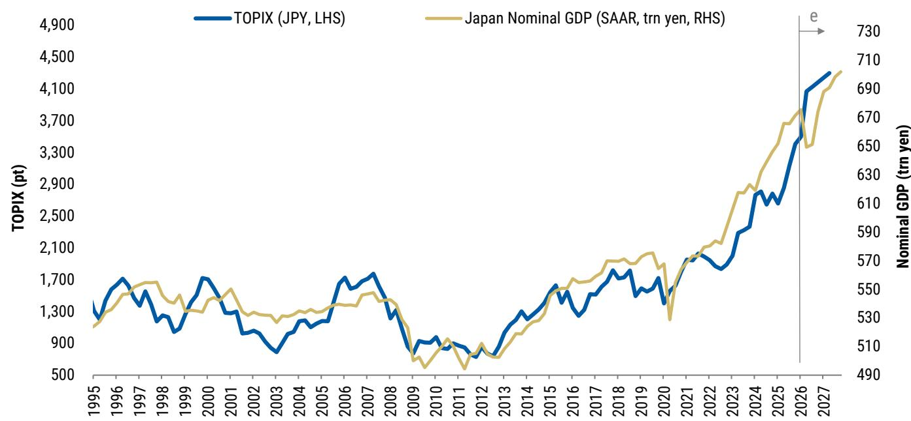  
e = MS estimates
Source: Cabinet Office; MS

## The Summit Lies Ahead: MS TOPIX target (end-Jun 2027) 4,300pt

## But our bull/bear scenario gap is wide

Our base case remains constructive, but uncertainty is still high.

\- In a bear case where Middle East escalation drives a sharp oil spike and triggers a global recession, forward P/E could fall to 12.0x.

\- In this scenario, Japanese equities likely face both EPS pressure and valuation compression.

\- Conversely, in a bull case where US-led investment/consumption is stronger than expected and AI-driven productivity gains enable both lower inflation and easier financial conditions, fwd P/E of 18.0x is in sight.

TOPIX vs. consensus EPS

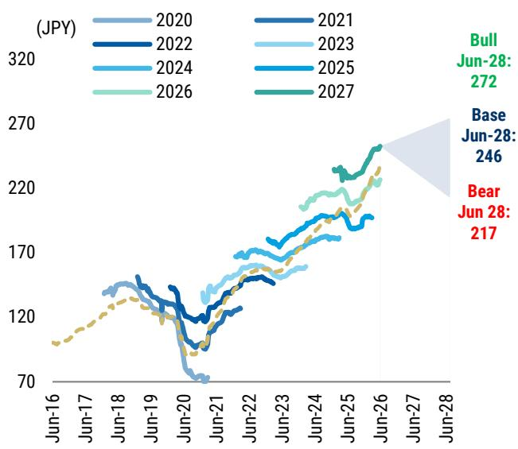  
12M fwd P/E: major equity indices

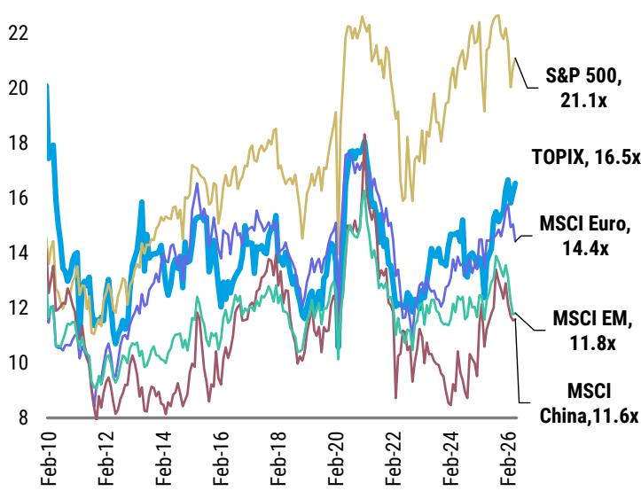

## The Summit Lies Ahead: MS TOPIX target (end-Jun 2027) 4,300pt

## Japanese corporates steadily expanding margins

USD/JPY and Japanese equities show a positive correlation, but the regression beta has trended down over the past decade since Abenomics, suggesting export FX sensitivity has clearly declined.

\- Since experiencing higher import prices post-COVID, Japanese corporates have continued efforts to improve margins.

\- This should make earnings less vulnerable to JPY appreciation than in the past.

\- Therefore, we do not see USD/JPY as the sole driver of JPY-denominated earnings.

USD/JPY is not the sole driver of Japan equity upside

TOPIX sensitivity to USD/JPY

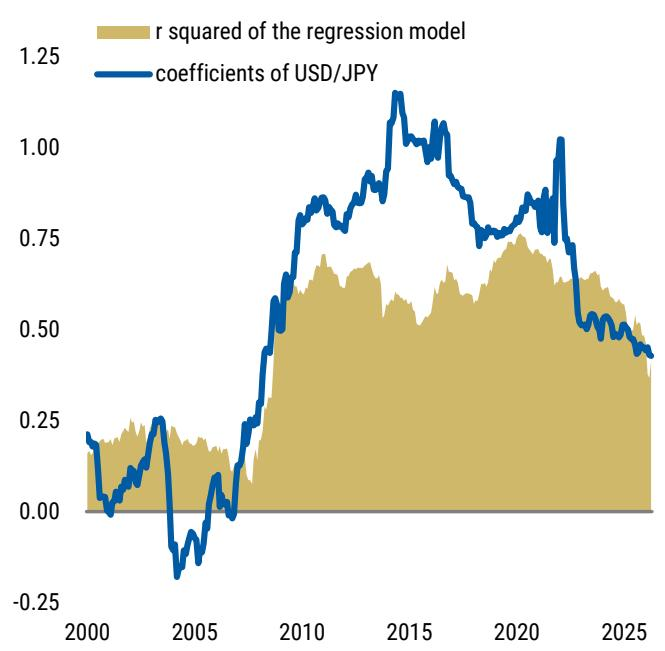  
Import prices vs. domestic corporate goods prices

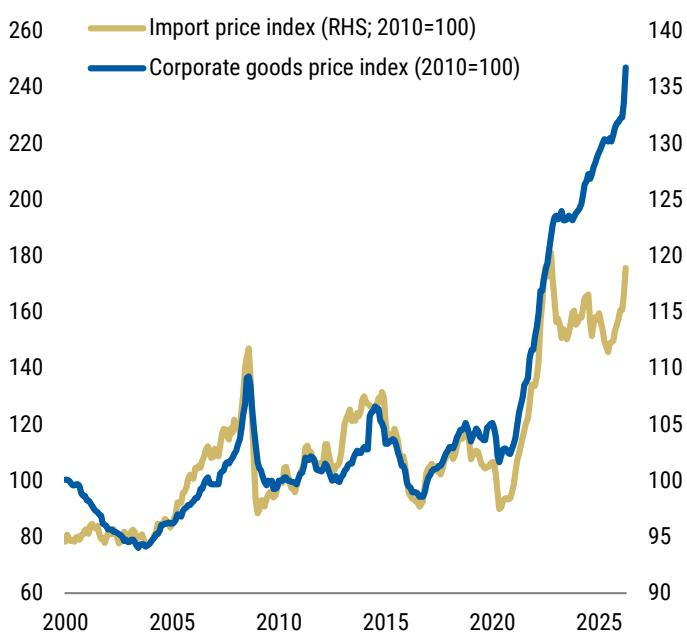

Note: Import Price Index: total avg, JPY-based. Domestic Corporate Goods Price Index: total avg, chain-linked basis. Source: Bloomberg, FactSet, QUICK Workstation, I.N. Information Center, MS

## The Summit Lies Ahead: MS TOPIX target (end-Jun 2027) 4,300pt.

Japan equities: pricing in near-term earnings deterioration + mid/long-term earnings normalization

Current Middle East situation: cyclical disruption factor.

\- Near-term EPS downside risk and mid/long-term earnings normalization hopes can coexist.

\- Japan equities appear to be pricing in both.

Index resilient despite worsening analyst revisions.

TOPIX500 revisions and stock price YoY

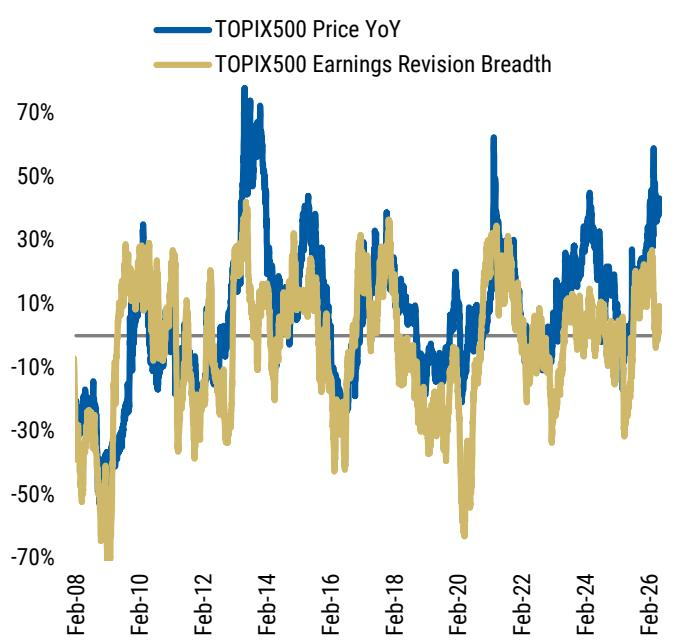  
Source: Bloomberg, MS  
TOPIX cumulative change: EPS and P/E drivers

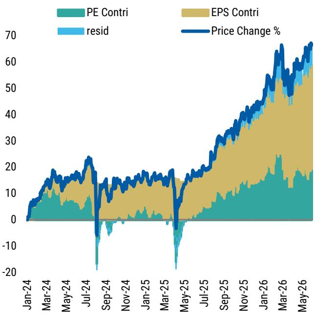

## The Summit Lies Ahead: MS TOPIX target (end-Jun 2027) 4,300pt.

Japan equities: pricing in near-term earnings deterioration + mid/long-term earnings normalization

With USD/JPY staying high, outperformance of export-oriented names continues.

– Analyst revisions have recently deteriorated in both domestic- and export-oriented sectors.

\- From here, sector thematic appeal may be the key source of excess returns.

## Themes, rather than earnings, are becoming a key source of excess returns

TOPIX500 revisions

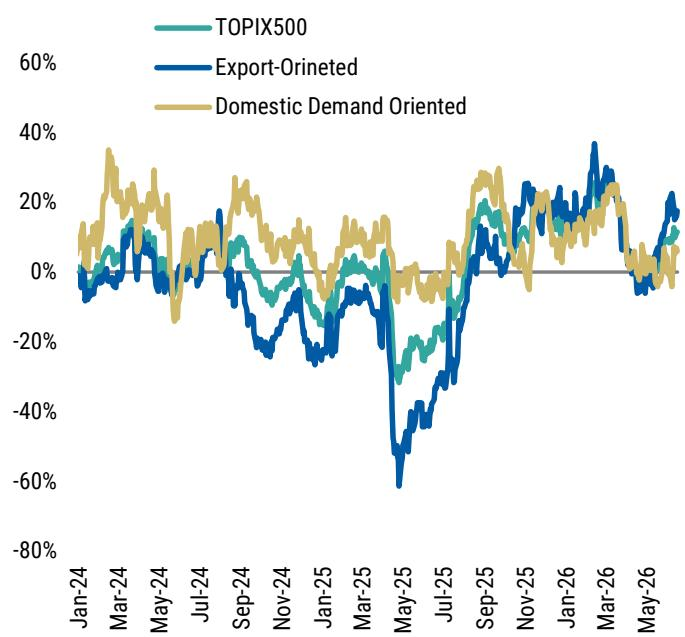  
Export- vs. domestic-oriented relative returns & USD/JPY

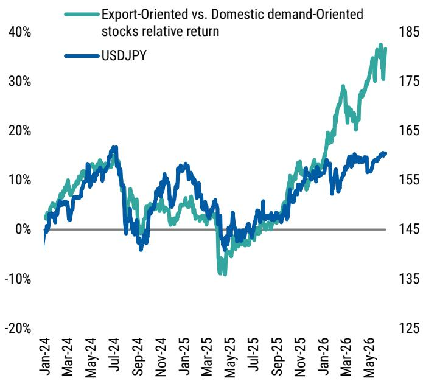  
Note: Export-oriented = Autos & Transport Equip., Steel & Nonferrous, Machinery, Electric Appliances & Precision, Trading Cos. & Wholesale. Domestic-oriented = Foods, Construction & Materials, Info & Comms/Services & Others, Transport & Logistics, Retail. Source: Bloomberg, MS

## The Summit Lies Ahead: MS TOPIX target (end-Jun 2027) 4,300pt.

Japan equities: pricing in near-term earnings deterioration + mid/long-term earnings normalization

Export-oriented outperformance is most pronounced in growth, regardless of mkt cap.

Domestic growth: recent underperformance easing, likely on rising hedging demand.

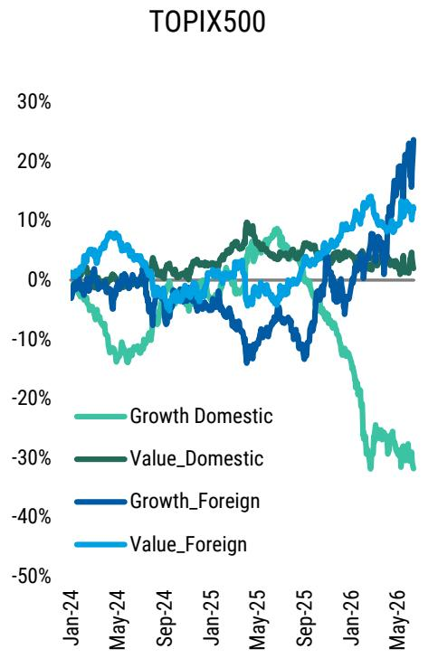  
Excess returns vs. index by domestic/export and value/growth

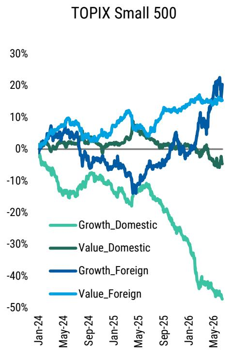

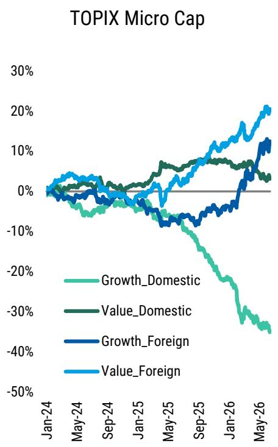  
Note: Export-oriented = Autos & Transport Equip., Steel & Nonferrous, Machinery, Electric Appliances & Precision, Trading Cos. & Wholesale. Domestic-oriented = Foods, Construction & Materials, Info & Comms/Services & Others, Transport & Logistics, Retail. Value = 3rd tertile of BPR tertiles in the universe; Growth = 1st tertile of BPR tertiles. Cumulative excess returns vs. index since 2024.

Source: Bloomberg, MS

## The Summit Lies Ahead: MS TOPIX target (end-Jun 2027) 4,300pt

## Seasonality suggests net foreign buying into July

Seasonality in foreign flows: selling tends to emerge in Mar, then shifts to buybacks from Apr; net buying often persists into July

As early-FY repositioning progresses, supply-demand tends to support Japanese equities.

On factors, momentum often improves into July after an early-spring pullback. With foreign buybacks as a tailwind, odds are relatively high that Japan equity momentum holds into summer.

Factor returns and seasonality in foreign investor flows

<table><tr><td>Group</td><td>Factor</td><td>Jan</td><td>Feb</td><td>Mar</td><td>Apr</td><td>May</td><td>Jun</td><td>Jul</td><td>Aug</td><td>Sep</td><td>Oct</td><td>Nov</td><td>Dec</td></tr><tr><td>Value</td><td>Book/Price</td><td>2.33</td><td>1.50</td><td>-0.11</td><td>1.45</td><td>-0.76</td><td>-0.41</td><td>-0.37</td><td>0.44</td><td>0.32</td><td>0.28</td><td>0.18</td><td>2.20</td></tr><tr><td>Value</td><td>Earnings/Price</td><td>1.53</td><td>1.26</td><td>0.12</td><td>1.02</td><td>0.98</td><td>-0.27</td><td>0.65</td><td>0.49</td><td>-0.26</td><td>0.61</td><td>0.26</td><td>0.29</td></tr><tr><td>Value</td><td>Sales/Price</td><td>1.14</td><td>0.77</td><td>-0.06</td><td>1.28</td><td>0.12</td><td>-0.45</td><td>0.01</td><td>0.38</td><td>-0.71</td><td>-0.13</td><td>-0.35</td><td>2.36</td></tr><tr><td>Value</td><td>Div Yield</td><td>2.35</td><td>1.35</td><td>0.03</td><td>0.85</td><td>0.35</td><td>-0.03</td><td>0.97</td><td>1.68</td><td>0.53</td><td>1.02</td><td>1.05</td><td>1.58</td></tr><tr><td>Est. Value</td><td>Est. E/P</td><td>1.49</td><td>0.29</td><td>-0.37</td><td>0.62</td><td>1.04</td><td>-0.91</td><td>0.51</td><td>-0.36</td><td>-0.51</td><td>0.27</td><td>0.29</td><td>0.05</td></tr><tr><td>Est. Value</td><td>Est. S/P</td><td>1.35</td><td>0.74</td><td>0.11</td><td>1.27</td><td>0.20</td><td>-0.56</td><td>-0.10</td><td>0.17</td><td>-0.69</td><td>-0.18</td><td>-0.73</td><td>2.15</td></tr><tr><td>Est. Value</td><td>Est. DY</td><td>2.28</td><td>1.15</td><td>-0.44</td><td>0.54</td><td>0.19</td><td>-0.64</td><td>0.01</td><td>1.19</td><td>-0.35</td><td>0.33</td><td>0.12</td><td>1.26</td></tr><tr><td>Quality</td><td>ROE</td><td>-0.91</td><td>0.16</td><td>0.82</td><td>-0.60</td><td>2.02</td><td>0.49</td><td>1.54</td><td>0.06</td><td>-0.40</td><td>0.02</td><td>0.73</td><td>-2.33</td></tr><tr><td>Quality</td><td>Est. ROE</td><td>-1.30</td><td>-0.58</td><td>0.57</td><td>-1.24</td><td>1.93</td><td>0.08</td><td>0.99</td><td>-0.49</td><td>-0.58</td><td>0.07</td><td>0.56</td><td>-2.26</td></tr><tr><td>Earnings</td><td>Earnings Trend</td><td>-0.48</td><td>0.75</td><td>0.32</td><td>-0.04</td><td>1.31</td><td>0.22</td><td>0.00</td><td>-0.26</td><td>-0.84</td><td>-0.66</td><td>0.40</td><td>-2.02</td></tr><tr><td>Earnings</td><td>Revision</td><td>-0.17</td><td>0.02</td><td>0.33</td><td>-0.67</td><td>-0.01</td><td>0.49</td><td>1.02</td><td>-0.72</td><td>1.40</td><td>-0.07</td><td>-0.80</td><td>0.15</td></tr><tr><td>Momentum</td><td>Mom 3M</td><td>-0.86</td><td>0.38</td><td>-0.33</td><td>-0.88</td><td>-0.28</td><td>-0.14</td><td>0.30</td><td>0.85</td><td>1.77</td><td>-0.77</td><td>-0.32</td><td>0.04</td></tr><tr><td>Momentum</td><td>Mom 1Y</td><td>-0.79</td><td>-0.60</td><td>0.01</td><td>-1.43</td><td>0.42</td><td>0.69</td><td>0.31</td><td>-0.94</td><td>1.88</td><td>-0.98</td><td>-1.93</td><td>0.18</td></tr><tr><td>Momentum</td><td>Mom 2Y</td><td>-1.05</td><td>-0.22</td><td>0.04</td><td>-1.75</td><td>1.22</td><td>0.73</td><td>0.79</td><td>-0.35</td><td>1.42</td><td>-0.74</td><td>-0.16</td><td>-1.84</td></tr><tr><td>Momentum</td><td>Mom 3Y</td><td>-1.25</td><td>0.17</td><td>0.40</td><td>-1.48</td><td>1.02</td><td>0.75</td><td>0.89</td><td>-0.23</td><td>0.71</td><td>-0.89</td><td>-0.55</td><td>-2.08</td></tr><tr><td>Size</td><td>Size</td><td>-0.40</td><td>0.29</td><td>-1.28</td><td>-0.76</td><td>1.17</td><td>-0.72</td><td>0.22</td><td>-0.09</td><td>-0.38</td><td>0.59</td><td>0.49</td><td>-0.88</td></tr><tr><td>Risk</td><td>Volatility</td><td>0.08</td><td>0.98</td><td>-0.10</td><td>3.13</td><td>1.67</td><td>-0.67</td><td>-0.14</td><td>-1.91</td><td>-1.31</td><td>1.10</td><td>1.11</td><td>0.89</td></tr><tr><td>Flow</td><td>Foreign Net (bn)</td><td>179.3</td><td>57.4</td><td>-1,006.1</td><td>1,270.9</td><td>473.9</td><td>58.3</td><td>301.6</td><td>-505.6</td><td>-501.5</td><td>222.8</td><td>623.0</td><td>-10.4</td></tr></table>

Source: Bloomberg, FactSet, QUICK Workstation, MS

## The Summit Lies Ahead: MS TOPIX target (end-Jun 2027) 4,300pt

## Seasonality suggests net foreign buying into July

Seasonality with relatively high hit rate: foreign net selling in Mar; net buying into July

Monthly returns: Nikkei 225 and TOPIX

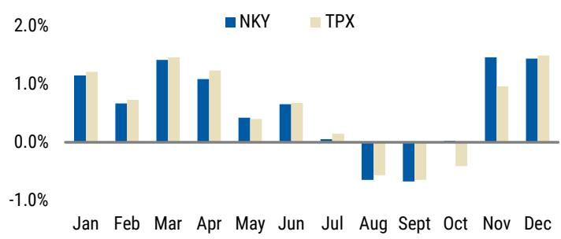  
Monthly win rate: Nikkei 225 and TOPIX

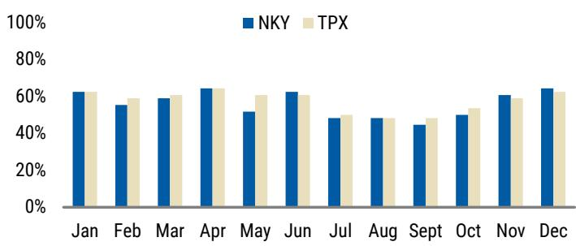  
Foreign investors: monthly net buy/sell (JPY bn)  
Foreign investors: monthly net buying ratio

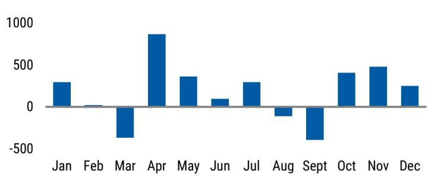  
Note: Data since 1970.  
Source: JPX, Bloomberg, FactSet, QUICK Workstation, IN Information Center, MS

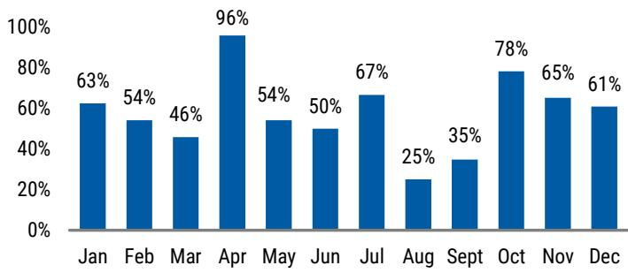

## The Summit Lies Ahead: MS TOPIX target (end-Jun 2027) 4,300pt

## Seasonality suggests net foreign buying into July

From early Apr, momentum and growth factors become more effective.

Looking ahead: AGM season ramps up in Jun; CG Code revision due this summer.

If focus shifts to names with cross-shareholding unwind optionality, cash-rich names, or large unrealized real estate gains, risk of higher value-factor efficacy.

Factor returns and foreign investor flows (since Mar 2025)

<table><tr><td>Group</td><td>Factor</td><td>2025-03</td><td>2025-04</td><td>2025-05</td><td>2025-06</td><td>2025-07</td><td>2025-08</td><td>2025-09</td><td>2025-10</td><td>2025-11</td><td>2025-12</td><td>2026-01</td><td>2026-02</td><td>2026-03</td><td>2026-04</td><td>2026-05</td><td>2026-06 MTD</td><td>Cumulative</td></tr><tr><td>Value</td><td></td><td></td><td></td><td></td><td></td><td></td><td></td><td></td><td></td><td></td><td></td><td></td><td></td><td></td><td></td><td></td><td></td><td></td></tr><tr><td></td><td>Book/Price</td><td>2.11</td><td>-5.55</td><td>-2.10</td><td>-2.74</td><td>6.60</td><td>6.98</td><td>2.56</td><td>-2.98</td><td>8.16</td><td>5.53</td><td>5.25</td><td>5.81</td><td>1.44</td><td>-6.81</td><td>1.19</td><td>-1.91</td><td>26.28</td></tr><tr><td></td><td>Earnings/Price</td><td>1.44</td><td>-2.90</td><td>1.08</td><td>-2.59</td><td>5.22</td><td>6.26</td><td>0.56</td><td>-1.75</td><td>6.29</td><td>1.82</td><td>0.57</td><td>-0.29</td><td>2.73</td><td>-9.76</td><td>-7.62</td><td>-1.16</td><td>0.72</td></tr><tr><td></td><td>Sales/Price</td><td>1.61</td><td>-3.45</td><td>-2.14</td><td>-3.68</td><td>5.93</td><td>5.52</td><td>-0.29</td><td>-3.38</td><td>7.05</td><td>2.15</td><td>-0.12</td><td>0.98</td><td>0.31</td><td>-10.79</td><td>-1.69</td><td>-2.01</td><td>-6.12</td></tr><tr><td></td><td>Div Yield</td><td>2.27</td><td>-5.18</td><td>-0.65</td><td>-3.66</td><td>5.64</td><td>3.81</td><td>-0.06</td><td>-3.43</td><td>7.36</td><td>5.17</td><td>1.47</td><td>-0.37</td><td>3.25</td><td>-7.50</td><td>-4.15</td><td>-1.14</td><td>2.84</td></tr><tr><td>Est. Value</td><td></td><td></td><td></td><td></td><td></td><td></td><td></td><td></td><td></td><td></td><td></td><td></td><td></td><td></td><td></td><td></td><td></td><td></td></tr><tr><td></td><td>Est. E/P</td><td>1.68</td><td>-3.74</td><td>0.13</td><td>-4.56</td><td>6.19</td><td>5.47</td><td>1.34</td><td>-4.43</td><td>10.19</td><td>3.27</td><td>1.93</td><td>-1.05</td><td>2.91</td><td>-7.88</td><td>-3.62</td><td>-1.43</td><td>6.22</td></tr><tr><td></td><td>Est. S/P</td><td>1.65</td><td>-3.27</td><td>-2.08</td><td>-3.41</td><td>5.66</td><td>5.89</td><td>-0.49</td><td>-4.01</td><td>6.55</td><td>2.10</td><td>-1.12</td><td>0.95</td><td>0.45</td><td>-10.83</td><td>-1.78</td><td>-2.15</td><td>-8.81</td></tr><tr><td></td><td>Est. DY</td><td>2.28</td><td>-5.19</td><td>0.77</td><td>-3.87</td><td>5.36</td><td>3.27</td><td>0.13</td><td>-3.13</td><td>6.52</td><td>5.22</td><td>1.12</td><td>-0.77</td><td>3.17</td><td>-7.51</td><td>-3.26</td><td>-1.47</td><td>2.09</td></tr><tr><td>Quality</td><td></td><td></td><td></td><td></td><td></td><td></td><td></td><td></td><td></td><td></td><td></td><td></td><td></td><td></td><td></td><td></td><td></td><td></td></tr><tr><td></td><td>ROE</td><td>-1.33</td><td>3.74</td><td>4.55</td><td>2.93</td><td>-2.86</td><td>-1.55</td><td>-2.08</td><td>3.70</td><td>-2.66</td><td>-3.89</td><td>-3.63</td><td>-5.72</td><td>1.60</td><td>0.79</td><td>-5.71</td><td>0.72</td><td>-10.13</td></tr><tr><td></td><td>Est. ROE</td><td>-1.70</td><td>3.20</td><td>3.21</td><td>1.88</td><td>-4.46</td><td>-3.92</td><td>-2.32</td><td>2.25</td><td>-1.00</td><td>-3.70</td><td>-3.67</td><td>-4.65</td><td>1.03</td><td>1.88</td><td>-3.18</td><td>0.16</td><td>-15.69</td></tr><tr><td>Earnings</td><td></td><td></td><td></td><td></td><td></td><td></td><td></td><td></td><td></td><td></td><td></td><td></td><td></td><td></td><td></td><td></td><td></td><td></td></tr><tr><td></td><td>Earnings Trend</td><td>0.86</td><td>3.14</td><td>0.20</td><td>0.69</td><td>1.28</td><td>5.03</td><td>-1.66</td><td>1.14</td><td>-0.49</td><td>-1.87</td><td>-0.97</td><td>0.34</td><td>-0.91</td><td>4.67</td><td>-0.58</td><td>-0.02</td><td>11.29</td></tr><tr><td></td><td>Revision</td><td>-0.86</td><td>0.24</td><td>-0.70</td><td>1.57</td><td>-0.72</td><td>2.16</td><td>-0.10</td><td>3.21</td><td>-3.65</td><td>-1.20</td><td>3.84</td><td>3.82</td><td>-5.93</td><td>9.05</td><td>4.49</td><td>0.12</td><td>16.32</td></tr><tr><td>Momentum</td><td></td><td></td><td></td><td></td><td></td><td></td><td></td><td></td><td></td><td></td><td></td><td></td><td></td><td></td><td></td><td></td><td></td><td></td></tr><tr><td></td><td>Mom 3M</td><td>-0.25</td><td>2.77</td><td>-4.31</td><td>1.67</td><td>-1.17</td><td>2.01</td><td>1.21</td><td>6.72</td><td>-3.89</td><td>1.27</td><td>7.24</td><td>11.22</td><td>-9.89</td><td>4.89</td><td>8.93</td><td>3.70</td><td>38.04</td></tr><tr><td></td><td>Mom 1Y</td><td>1.89</td><td>0.86</td><td>-1.03</td><td>1.25</td><td>-2.83</td><td>-1.07</td><td>-1.71</td><td>5.62</td><td>-3.79</td><td>-1.80</td><td>9.11</td><td>11.50</td><td>-8.91</td><td>10.83</td><td>9.24</td><td>1.48</td><td>29.36</td></tr><tr><td></td><td>Mom 2Y</td><td>0.32</td><td>0.37</td><td>1.52</td><td>1.62</td><td>0.98</td><td>3.76</td><td>0.09</td><td>7.37</td><td>-3.34</td><td>-2.36</td><td>5.25</td><td>9.51</td><td>-7.11</td><td>6.27</td><td>3.55</td><td>0.13</td><td>31.36</td></tr><tr><td></td><td>Mom 3Y</td><td>1.37</td><td>-0.16</td><td>2.43</td><td>1.46</td><td>0.63</td><td>4.01</td><td>0.27</td><td>6.22</td><td>-3.52</td><td>-0.53</td><td>7.27</td><td>9.19</td><td>-6.47</td><td>5.63</td><td>1.66</td><td>1.02</td><td>33.60</td></tr><tr><td>Size</td><td></td><td></td><td></td><td></td><td></td><td></td><td></td><td></td><td></td><td></td><td></td><td></td><td></td><td></td><td></td><td></td><td></td><td></td></tr><tr><td></td><td>Size</td><td>-2.17</td><td>2.11</td><td>1.99</td><td>0.46</td><td>-2.25</td><td>-0.41</td><td>0.36</td><td>5.88</td><td>-2.13</td><td>-0.51</td><td>2.03</td><td>4.20</td><td>-3.98</td><td>4.24</td><td>0.74</td><td>0.71</td><td>12.98</td></tr><tr><td>Risk</td><td></td><td></td><td></td><td></td><td></td><td></td><td></td><td></td><td></td><td></td><td></td><td></td><td></td><td></td><td></td><td></td><td></td><td></td></tr><tr><td></td><td>Volatility</td><td>-2.46</td><td>-1.94</td><td>8.96</td><td>5.16</td><td>1.31</td><td>0.60</td><td>3.33</td><td>8.97</td><td>-6.72</td><td>0.08</td><td>6.41</td><td>3.78</td><td>-7.38</td><td>19.14</td><td>9.68</td><td>1.94</td><td>59.86</td></tr><tr><td></td><td></td><td></td><td></td><td></td><td></td><td></td><td></td><td></td><td></td><td></td><td></td><td></td><td></td><td></td><td></td><td></td><td></td><td></td></tr><tr><td>Flow</td><td></td><td></td><td></td><td></td><td></td><td></td><td></td><td></td><td></td><td></td><td></td><td></td><td></td><td></td><td></td><td></td><td></td><td></td></tr><tr><td></td><td>Foreign Cash (bn JPY)</td><td>-2,097.9</td><td>1,197.9</td><td>2,276.5</td><td>926.6</td><td>1,738.6</td><td>-122.8</td><td>-1,414.5</td><td>3,095.5</td><td>4.9</td><td>-266.9</td><td>2,342.2</td><td>2,840.7</td><td>-2,281.0</td><td>5,338.8</td><td>2,611.0</td><td></td><td>16,207.9</td></tr><tr><td></td><td>Foreign Futures (bn JPY)</td><td>-360.1</td><td>-538.9</td><td>404.6</td><td>347.8</td><td>150.0</td><td>269.0</td><td>474.2</td><td>-606.1</td><td>25.9</td><td>184.7</td><td>-624.6</td><td>522.1</td><td>-718.0</td><td>537.8</td><td>-163.7</td><td></td><td>-649.1</td></tr></table>

Source: Bloomberg, FactSet, QUICK Workstation, MS

MACD

## The Summit Lies Ahead: MS TOPIX target (end-Jun 2027) at 4,300pt

## Technicals: room to run, not yet overheated

TOPIX remains above the 20-day MA; short-term trend still up.

RSI has rebounded to the 60s; still below overbought, leaving upside room.

However, TOPIX is nearing the upper Bollinger Band; near-term profit-taking pressure may build.

Key focus: hold near the upper band and form a pullback without breaking the 20-day MA.

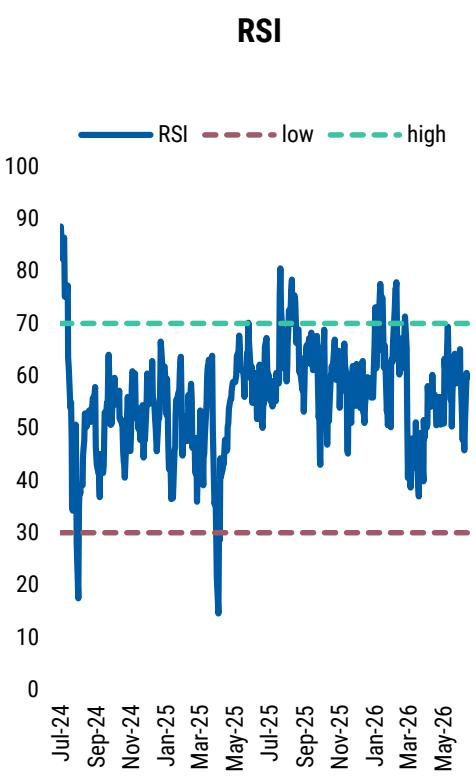  
Source: Bloomberg, FactSet, MS

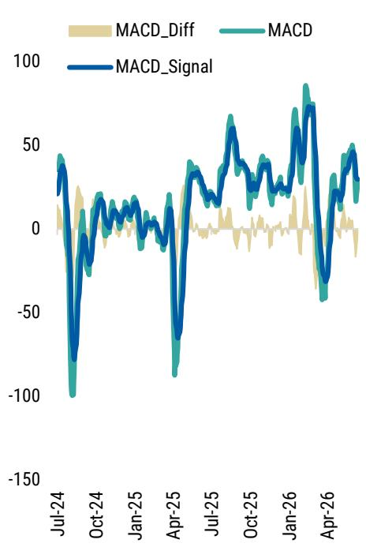

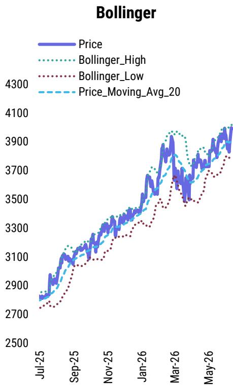

## Top-down sector preferences: favor upstream B2B sectors

Growth momentum continues: investor focus shifting from value (cheapness) to growth (earnings growth)

## FY2025 results broadly solid.

\- Recent FY results, led by AI-related names, were strong; TOPIX 12-month forward EPS was sharply revised up post-results.

\- Yet despite strong earnings growth, the share price response to shareholder returns (e.g., buybacks) remains weaker than in the past.

TOPIX 12-month forward EPS

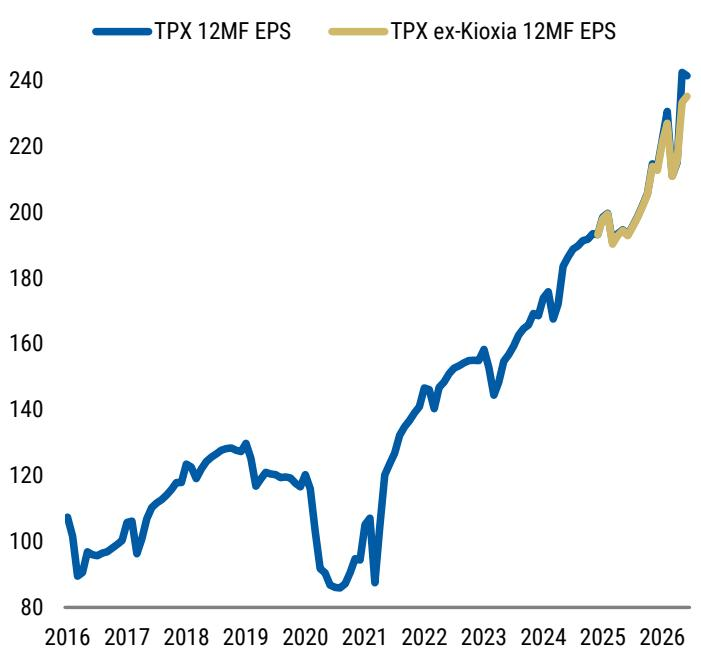  
Share price reaction to buybacks

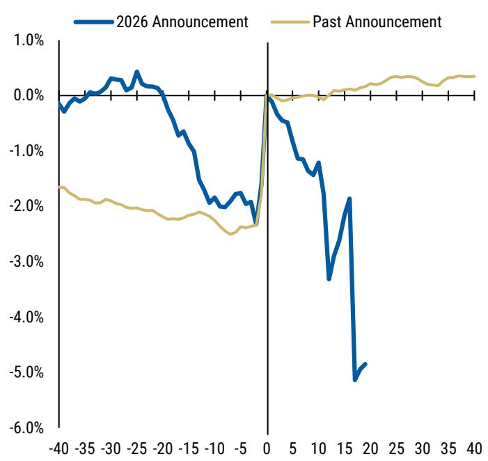

Source: Bloomberg, FactSet, QUICK Workstation, IN Information Center, MS

## Top-down sector preferences: favor upstream B2B sectors

## Growth momentum continues: FY2026 outlook is bifurcating

Key feature of FY2026 guidance: outlook increasingly bifurcated depending on whether profit-growth drivers exist.

\- Semis, infrastructure, construction/installation, and machinery tied to AI, data centers, and domestic capex: relatively high confidence in profit growth and clearer visibility.

\- By contrast, Auto, Transportation & Logi, and Utilities (Power & Gas) with high sensitivity to fuel/raw materials and geopolitical risk: elevated uncertainty; many cases where company plans are well below consensus.

FY2026 company guidance by sector (YoY)

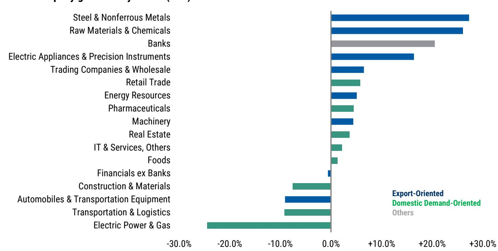  
Note: Universe = TOPIX constituents with Feb/Mar FY-ends and available actuals under the same accounting standard. Where recurring profit is not defined under the accounting standard, pre-tax profit is used as recurring profit. For parent-subsidiary listings, listed subsidiaries are excluded. As of 5/13.
Source: Bloomberg, FactSet, QUICK Workstation, IN Information Center, MS

## Top-down sector preference: favor upstream supply-chain B2B sectors

## Performance bifurcated among names with high US vs. China/India revenue exposure

Recently, returns for high China/India revenue-exposure names have improved sharply.

Meanwhile, high US revenue-exposure names have seen a gradual deterioration in performance.

Cumulative excess return vs. TOPIX: top 30 stocks by revenue exposure (by country/region)

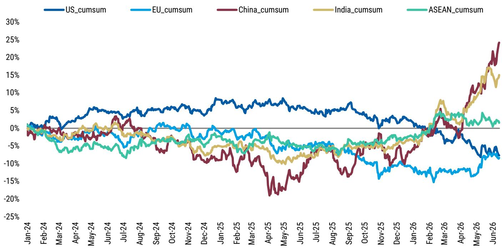  
Note: TOPIX500 universe; excess vs. TOPIX; top 30 by exposure (equal-weight). Source: Bloomberg, FactSet, QUICK Workstation, MS

## Expectation of a long Takaichi administration / faster growth strategy incl. national security

## Japan equities entering a phase of pricing in a redesign of the national structure

The LDP led by PM Takaichi won 316 seats in the Lower House snap election, exceeding 2/3 on its own (akin to "all red" / "all blue" in a US presidential election) - a landslide. Most seats ever won by a single party in the postwar era.

\- In July's "Basic Policy 2026," focus on priority items and policy direction for next FY budget formulation

Seats won by each party in the Feb 2026 Lower House snap election

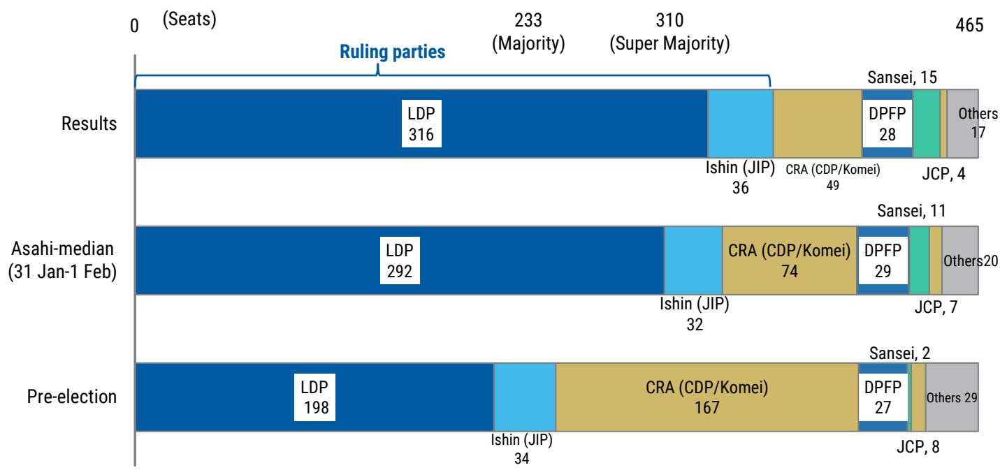  
Source: Bloomberg, FactSet, QUICK Workstation, I-N Information Systems, MS

## Expectation of a long Takaichi administration / faster growth strategy incl. national security

## Fiscal sustainability and sustained market confidence could drive a Japan re-rating

In the Japan market recently, rising overseas rates, fiscal deficit concerns, and BoJ behind-the-curve worries have combined to push up long and super-long yields.

JGB yield curve, %

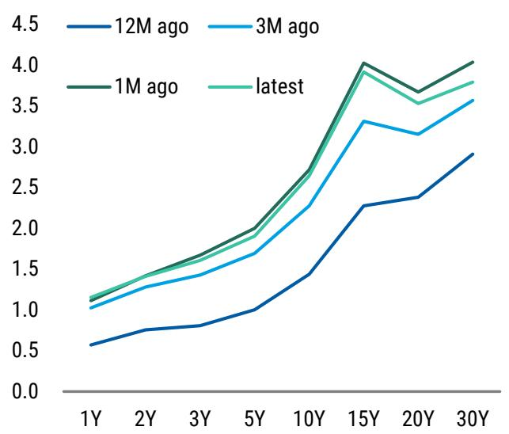  
JGB term premium, %

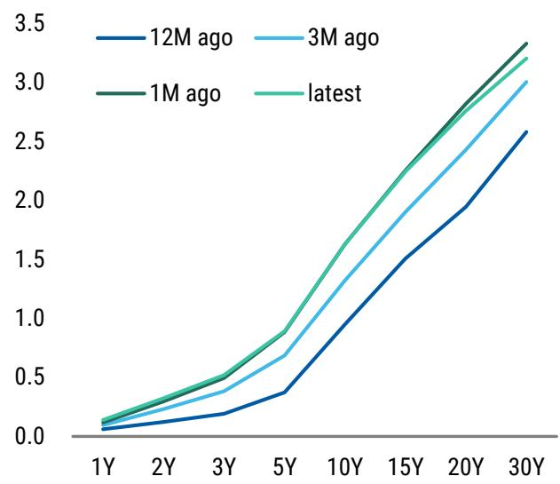

## Expectation of a long Takaichi administration / faster growth strategy incl. national security

## Concerns over fiscal policy and BoJ being behind the curve may both fade

Our team is watching Japan's version of DOGE, overseen by Finance Minister Katayama, as one potential lever to address fiscal concerns.

\- A 2018 METI report estimated tax revenue forgone from the Special Taxation Measures Law at JPY 10.1tn in total.

\- Efficiency gains from reforming tax expenditures under the Special Taxation Measures Law could be sizable.

\- If fiscal efficiency gains become clearer and lead to JGB buying and JPY buying, concerns about the BoJ being behind the curve should also recede.

METI estimate of revenue loss from the Special Taxation Measures Law (by beneficiary, 2018)

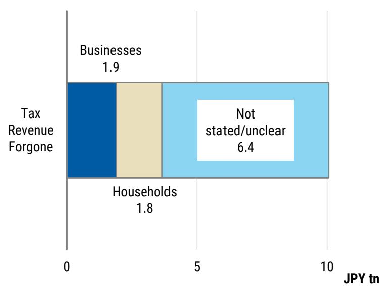  
General government fiscal balance (% of GDP, flow of funds basis)

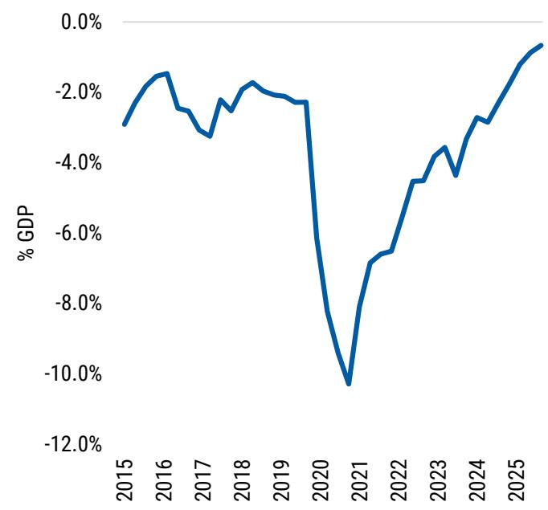

## Long-tenure expectations for Takaichi / faster growth strategy incl. national security

## Key themes to watch under a Takaichi administration

Of the Takaichi administration's "17 strategic areas", we see four long-duration themes likely to attract capital allocation: (1) economic security & supply-chain resilience, (2) AI deployment & computing revolution, (3) energy security & decarbonization, (4) infrastructure renewal & national resilience.

1. Econ security & supply-chain resilience: core themes = defense, aerospace, advanced materials, cyber

2. AI deployment & compute revolution: AI/semis at the core; includes robotics

3. Energy security & decarbonization: core themes = next-gen power sources, T&D grid

4. Infrastructure renewal & national resilience: core themes = disaster prevention, port logistics, ICT infrastructure

Takaichi growth strategy: 17 focus areas converge into 6 concepts
Key to valuing Japanese equities under Takaichi: not just budget size

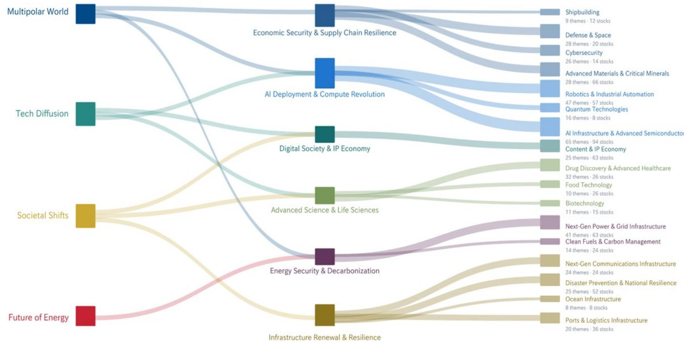  
Note: Define MS's 4 Big Themes as the top-level investment concept (L0). L1 = 6 investment narratives derived from L0. L2 = Takaichi 17 strategic areas containing multiple sub-themes L3 (e.g., within L2 defense/space, L3 includes satellite data, unmanned systems, etc.). L3 includes L4, the stock-selection categories. For each L4, screen stocks by business similarity and relevance; totals used for L2 constituent-count analysis. Universe: TSE Prime-listed companies plus Astroscale. Source: MS

## Long-tenure expectations for Takaichi / faster growth strategy incl. national security

## What themes will the equity market price in next?

Takaichi's 17 strategic areas: not standalone themes, but one interconnected ecosystem

\- Strongest inflows now: upstream in the theme network - AI infrastructure/advanced semis; next-gen power grid

\- Govt strategic capex likely flows: upstream platform tech (AI, power base, materials) -> midstream (defense, robotics, comms) -> downstream (drug discovery, quantum, cyber, content/IP)

## Tracing the transmission mechanism of thematic rotation

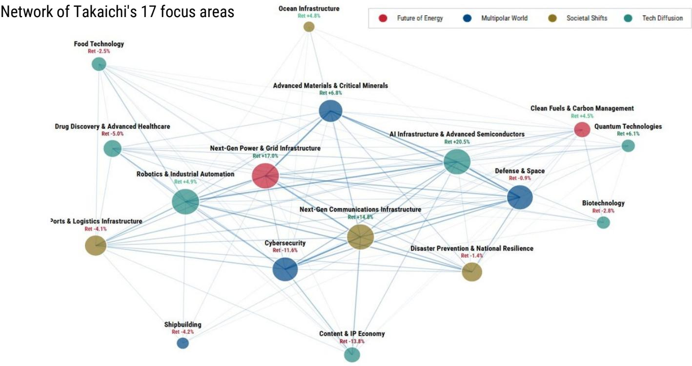  
Note: See report for PE/return methodology (Japan Equity Strategy: Japan Equity Grand Strategy under a Takaichi Administration (23 Feb 2026)). Weighted degree = total number of links connecting embedded L3s. Source: MS

## Long-tenure expectations for Takaichi / faster growth strategy incl. national security

## Stocks with high affinity to Takaichi's 17 strategic areas outperform TOPIX

We surveyed our analysts on strength of exposure to Takaichi's 17 strategic areas.

\- Since around last autumn's LDP leadership election, high-score stocks have clearly outperformed.

\- High-score group skews to names in electrics/precision, materials/chemicals, construction/materials, etc. - beneficiaries of econ security & supply-chain resilience, AI deployment & compute revolution, energy security & decarbonization, and infrastructure renewal & resilience.

Cumulative excess return vs. TOPIX by exposure to Takaichi's 17 strategic areas

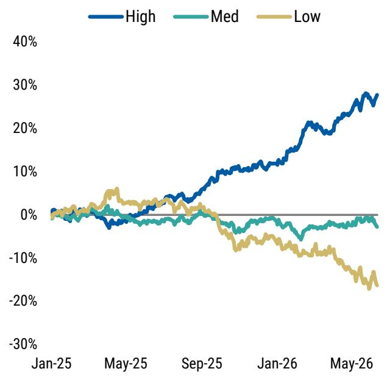  
Sector mix by universe and stock counts by sector

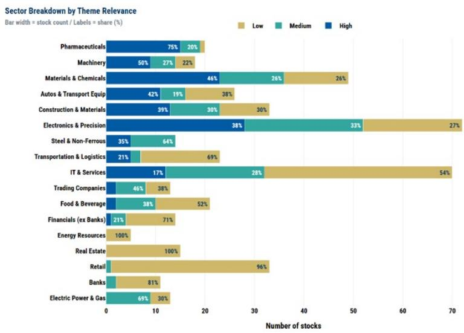  
Note: Exposure buckets based on our survey responses from each analyst for covered stocks (assessment of each company's business exposure). Source: Bloomberg, MS

## Long-tenure expectations for Takaichi / faster growth strategy incl. national security

Historical P/E by the 17 focus areas  
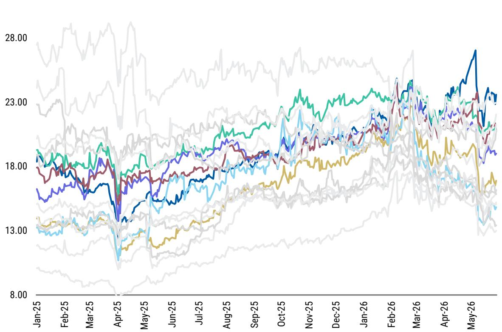  
Note: Stock-level P/E = market cap / forecast net profit (QUICK consensus). Median PE calculated daily for each L2 theme. Source: Quick Workstation, MS

## Expectation of a long Takaichi administration / faster growth strategy incl. national security

Current market setup is narrowing, effectively simplifying to 'AI vs. non-AI'.

Still, we continue to be in an acceleration phase of AI-related capex, led by hyperscalers.

\- Unlike the IT bubble/dot-com era's pre-profit firms, today's hyperscalers are highly profitable with low leverage.

\- What the market is pricing: potential non-linearity in expected returns upon reaching AGI (artificial general intelligence).

\- We see the AI theme as likely to persist. But with positioning rapidly crowded, a simple 'just ride it' strategy is risky.

Hyperscalers' capex-to-sales ratio, incl. leases, could reach levels above the dot-com bubble peak.

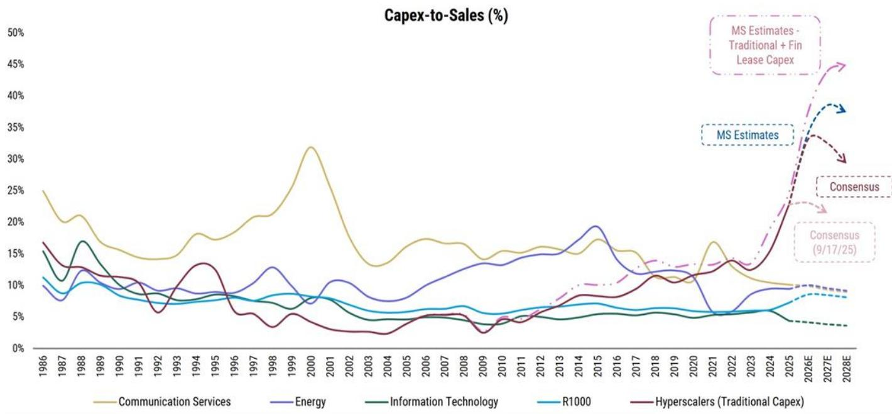  
Note: Hyperscalers include AMZN, GOOGL, META, MSFT, ORCL and are excluded from other sector buckets. Lease (finance lease) estimates cover MSFT and ORCL only. R1000 excludes Real Estate and Financials sectors.
Source: FactSet, MS

# Expectation of a long Takaichi administration / faster growth strategy incl. national security

## Rising efficacy of a strategy: sell expensive AI, buy cheap AI

Using a universe of "high AI beta" stocks and sorting into quintiles by valuation (B/P; Book-to-Price), since "Liberation Day" in Apr 2025 the low-valuation group has outperformed the high-valuation group.

Suggests that even within the AI theme, maintaining valuation discipline can be an effective way to secure returns.

High AI-beta universe: B/P quantile returns  
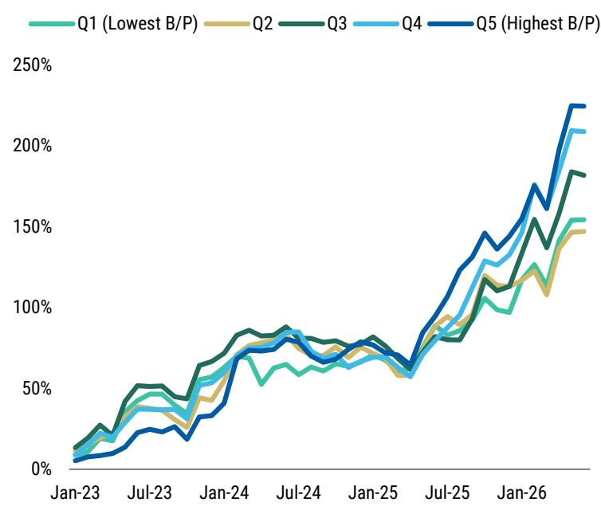  
Source: Bloomberg, FactSet, QUICK Workstation, MS

High AI-beta universe: B/P factor return  
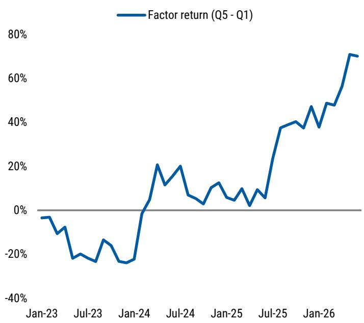

## Expectation of a long Takaichi administration / faster growth strategy incl. national security

During the IT bubble, expensive stocks kept rising further

Note: the IT bubble showed a different pattern vs. today. From mid-1999 to late 1999, expensive stocks rose further.

To judge whether the market is "healthy," key is whether valuation discipline holds going forward.

High Nasdaq-beta universe: B/P quantile returns (IT bubble)

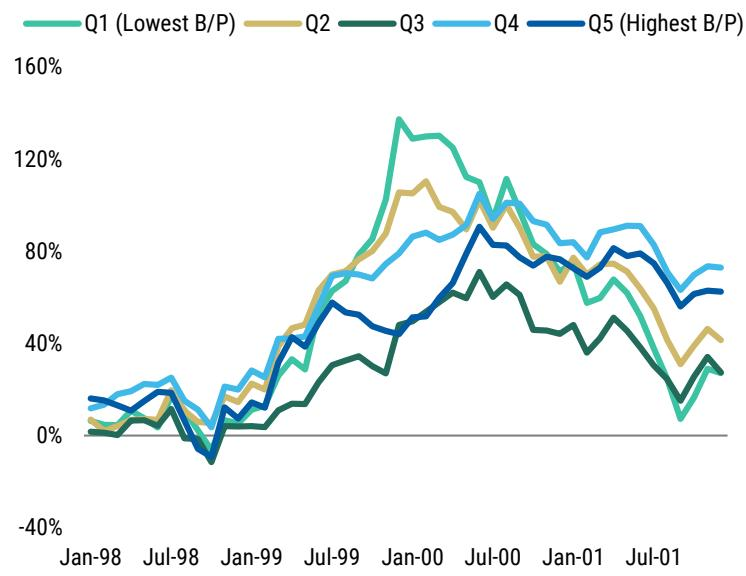  
Source: Bloomberg, FactSet, QUICK Workstation, MS  
High Nasdaq-beta universe: B/P factor return (IT bubble)

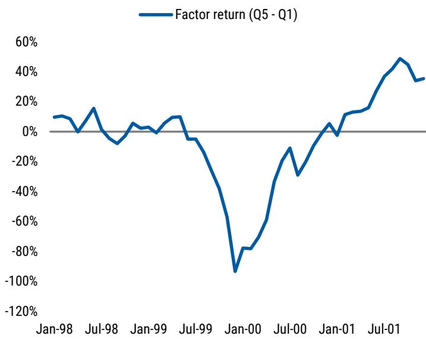

## Expectation of a long Takaichi administration / faster growth strategy incl. national security

## Investor positioning rapidly shifting toward cyclicals

By AI core theme, since early 2026 optical & connectivity tech stands out as outperforming.

Recently, power semis and thermal management have rapidly outperformed.

Meanwhile, amid Middle East uncertainty, front-end materials and front-end substrates/masks are underperforming vs. the universe.

AI-related stocks: core-theme performance (cumulative excess return vs. universe since Apr 2025, %)

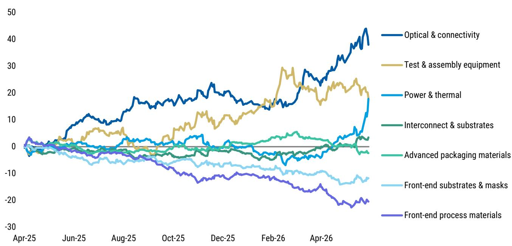  
Note: Using LLM pre-training knowledge and web search, we extracted market-focused AI themes/technologies. After standardizing granularity and grouping, we identified related TSE-listed companies based on business descriptions, LLM pre-training info, and each firm's IR materials/disclosures.
Source: QUICK Workstation, MS

## Expectation of a long Takaichi administration / faster growth strategy incl. national security

## Investor positioning rapidly tilting toward cyclicals

Cyclical/defensive index: cyclical leadership persists in both Japan and the US.

With positioning increasingly concentrated in AI-related stocks, any event that undermines confidence in AI rally durability could drive a larger-than-expected near-term drawdown.

Cyclical/Defensive Index

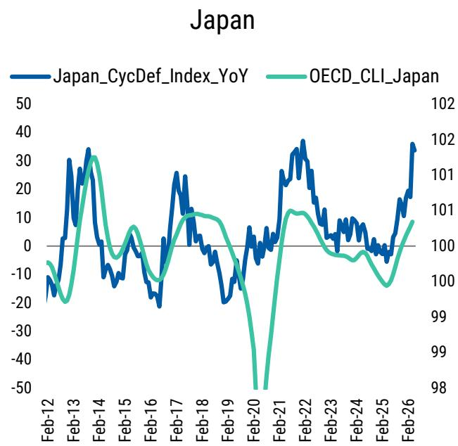

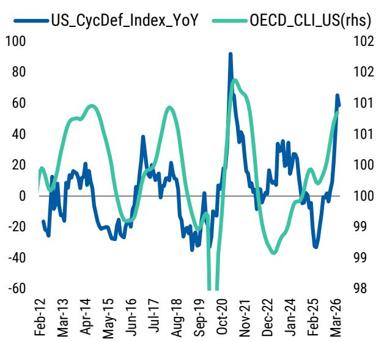

Note: Classified into 4 quadrants using the AI universe median of 3-month stock price momentum and PE contraction rate ((Trailing PE - FY2 PE)/Trailing PE) as the boundary. Q1 = high momentum/high PE contraction, Q2 = high momentum/low PE contraction, Q3 = low momentum/high PE contraction, Q4 = low momentum/low PE contraction. Cumulative excess return vs. TOPIX for stocks in Q1 and Q2.
Source: QUICK Workstation, Toyo Keizai, MS

## Expectation of a long Takaichi administration / faster growth strategy incl. national security

## Rising need for protection against an AI-rally reversal

Our base case remains continuation of the AI rally.

However, pairing it with selective option strategies to prepare for a reversal is, in the current market, one of the most effective risk-management approaches.

Cumulative excess return vs. TOPIX: stocks with earnings support + price momentum vs. theme-led names with limited earnings validation

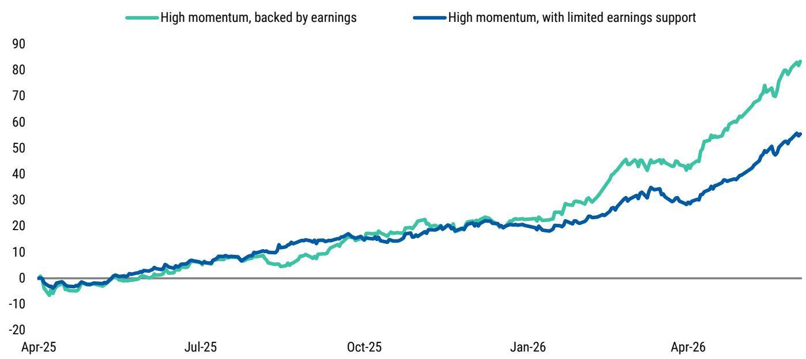

## Expectation of a long Takaichi administration / faster growth strategy incl. national security

## Economic security and supply-chain resilience

Defense investment focus likely to broaden beyond equipment shortfalls vs. superpowers to building 'space-layer' infrastructure.

Watch for space-related stocks to be re-rated not as a subset of defense, but as a cross-cutting investment domain spanning 17 fields.

## Defense / space-related stocks

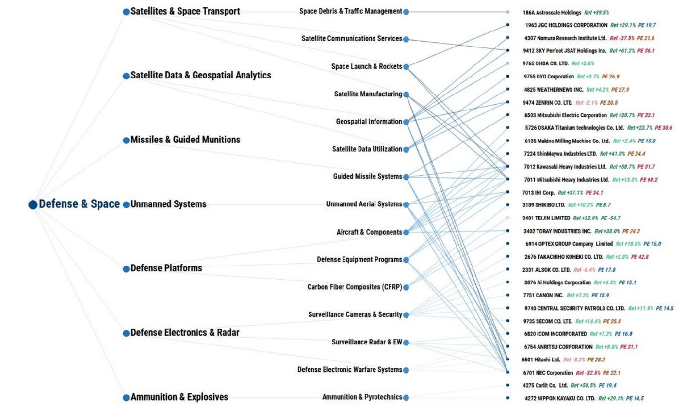  
Source: Bloomberg, MS

## Expectation of a long Takaichi administration / faster growth strategy incl. national security

## Infrastructure renewal and national resilience

To address intensifying/frequent natural disasters and aging infrastructure, the National Resilience budget (FY2026) is seen exceeding JPY 5tn.

\- Maintenance/renewal of aging infrastructure is increasingly required; margin improvement trend likely to continue.

\- Our estimated construction cycle suggests the long cycle is entering an expansion phase as rebuild demand rises for structures built mainly in the bubble era, implying long-lasting demand growth.

National resilience: domestic-demand-led theme, directly tied to economic security

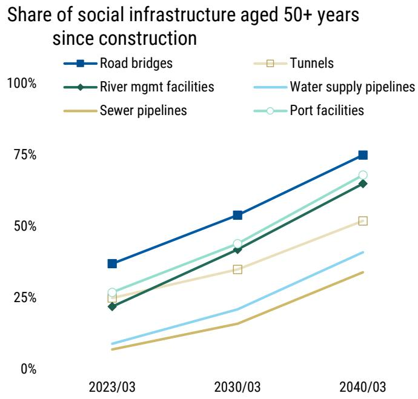  
Construction investment cycle, JPY tn

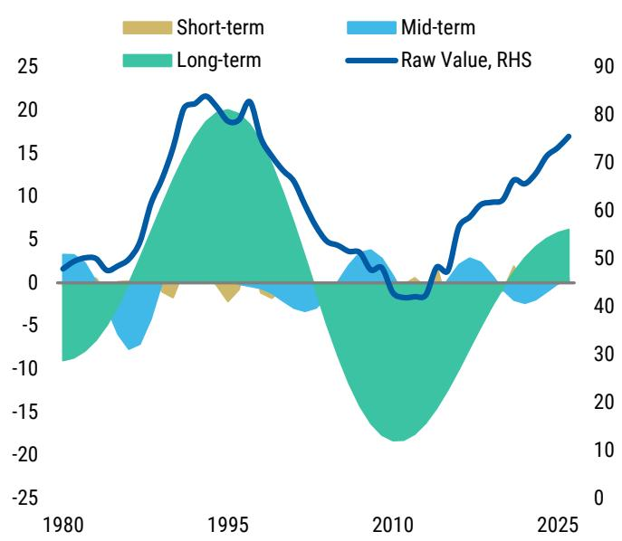

## BOJ monetary policy

## BOJ hike expectations too aggressive: hard to see bank P/E expanding as hike pace accelerates

Japan Economics team expects BOJ hikes from 0.75% to 1.0% in Jun 2026, and 1.0% to 1.25% in Apr 2027. If underlying inflation persists, policy rate could reach 1.5% by Oct 2027.

\- Market already pricing in 2+ hikes over the next 12 months.

\- Japan terminal rate rising to c.2%.

Real interest rate

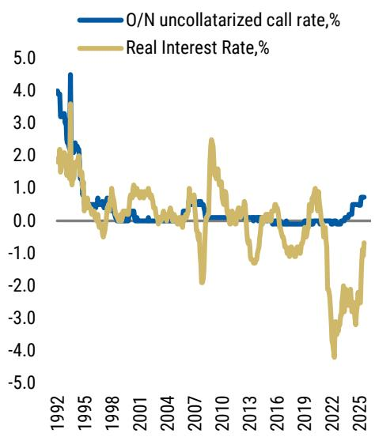  
Market-implied number of BOJ hikes over next 12 months

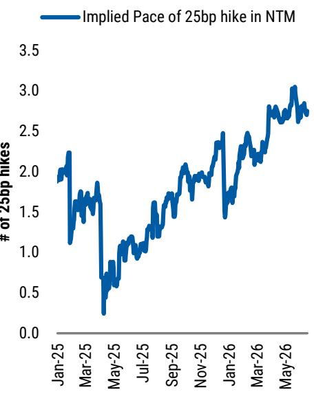  
JPY OIS 2y1y forward rate and TOPIX Banks Index

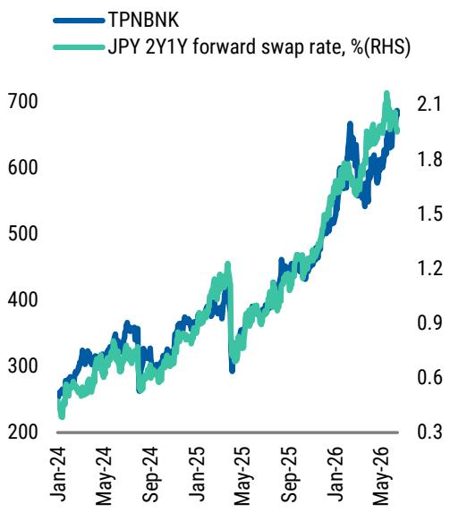  
Source: Bloomberg, MS

## BoJ monetary policy

## Real wages back in positive territory: large-cap retailers attractive as a hedge

Our Japan Economics team sees Japan-style core CPI (ex-fresh food) likely exceeding 3% in 2H, risking a temporary pause in private consumption via worsening real wages.

Even so, we see liquid retail names offering some appeal as a hedge vs. positioning concentrated in AI semis.

Real wages (cash earnings total minus national headline CPI)

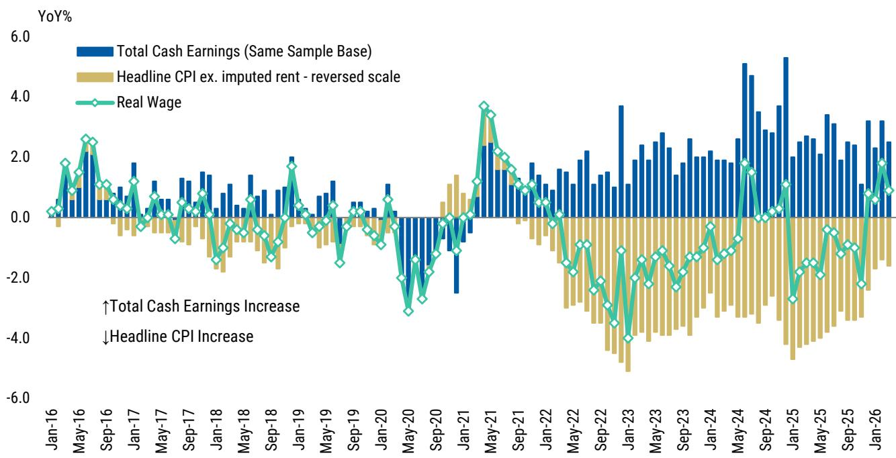  
Source: Bloomberg, MS

## BoJ monetary policy

## Policy likely adjusted sequentially based on real-economy response, not a "theoretical equilibrium"

Policy stance judged by real-rate levels and macro data, not the gap vs. neutral rate.

\- Wide neutral-rate estimate range raises terminal-rate uncertainty.

– Policy predictability structurally declines.

\- Policy adjusted sequentially based on real-economy response, not a "theoretical equilibrium."

\- Key reaction function remains: underlying inflation, wage growth, output gap, financial conditions (FX, etc.).

Estimated natural rate of interest  
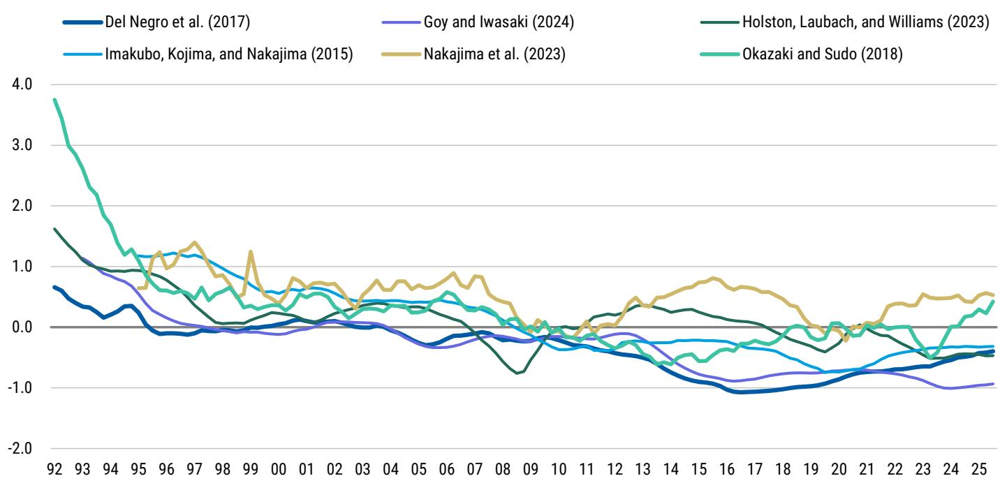  
Source: Bank of Japan, MS

## BoJ monetary policy

## FX stabilization by authorities aims to ease hike pressure from excessive JPY weakness

Our FX team expects USD/JPY to stay broadly flat, without major deviation from current levels.

\- Authorities' FX stabilization could, near term, be a headwind to export earnings expectations by curbing further JPY weakness.

\- However, for offshore investors, intervention that caps excessive JPY weakness can also be positive by stabilizing Japan equities' USD-based performance.

Our FX team's DXY and USDJPY outlook

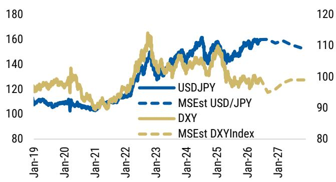

US terminal rate pricing vs. labor market surprises  
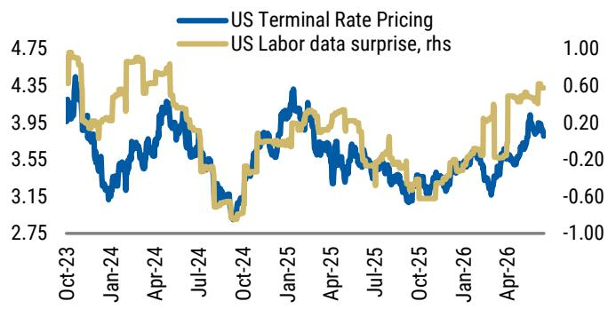  
Source: Bloomberg, MS  
Market-implied next-12M US-JP policy rate gap and USDJPY

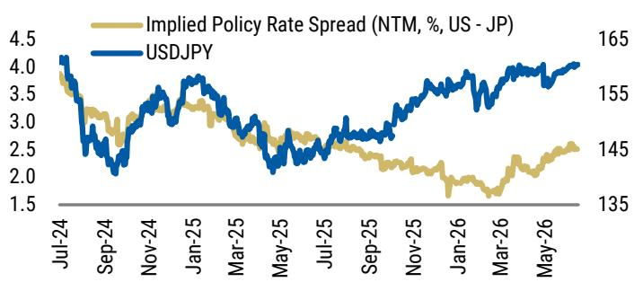

Leveraged funds' JPY positioning  
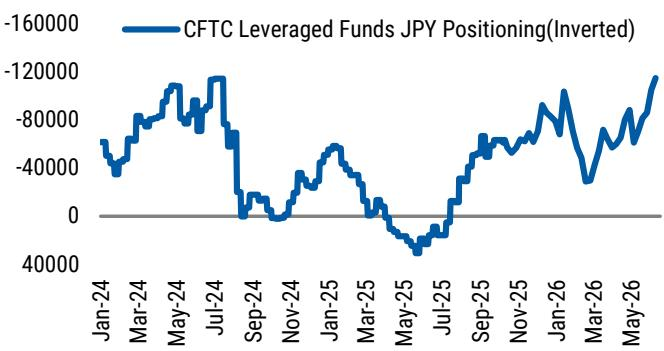

## Progress in corporate governance reform

## TSE (Tokyo Stock Exchange)

## 2015

\- Establish Corporate Governance Code 2018

\- Revise Corporate Governance Code

## 2021

\- Further revision of Corporate Governance Code

\- Announce market segment reorg (Prime, Standard, Growth)

## 2022

\- Market segment reorg

\- Strengthen minority shareholder protections at listed firms with controlling shareholders

## 2023

\- Especially for companies with PBR < 1x, require disclosure of concrete action plans to improve capital efficiency and growth expectations

## 2024

\- Disclose list of issuers publishing "measures to realize management mindful of cost of capital and share price"
- Announce policy for periodic TOPIX constituent changes based on liquidity criteria

## 2025

\- Phased abolition of transitional measures for listing maintenance criteria by market segment

\- Publish "investor perspective on parent-subsidiary listings, etc."

\- Consider tightening Growth Market listing requirements

Source: TSE, FSA, METI, MS

## FSA

## 2014

\- Establish Japan's Stewardship Code

\- Publish Ito Report 2015

\- Establish Corporate Governance Code

## 2018

\- Revise Corporate Governance Code 2020

\- Revise Stewardship Code

## 2021

\- Re-revise Corporate Governance Code

## 2023

\- Proposal on direction of "Action Program to Accelerate Corporate Governance Reform"

## 2024

\- Submit to the Diet bill to partially amend the Financial Instruments and Exchange Act, etc. (clarify scope of "joint holders" under the large shareholding reporting regime)

\- Enact partial amendments to the Financial Instruments and Exchange Act, etc.

## 2025

\- Expand disclosure requirements for changing purpose from policy shareholdings to pure investment; revise disclosure in securities reports (disclose, for 5 FYs, names and amounts of shares whose holding purpose was changed to pure investment)

## 2026

\- Revise Corporate Governance Code (around summer)

## METI

## 2014

\- Publish Ito Report

## 2021

\- Establish "Practical Guidelines for Corporate Governance Systems (CGS Guidelines)"

## 2022

\- Revise "Practical Guidelines for Corporate Governance Systems (CGS Guidelines)"

## 2023

\- Tax regime for spin-offs

\- Promote tax incentives for partial spin-offs

\- Publish "Guidelines for Corporate Takeovers"

\- Present M&A best practices (ensure shareholder value)

\- Redefine "hostile takeovers" as "unsolicited takeovers"

\- Specify management/directors' duty to report to the board upon receiving a takeover proposal

## 2025

\- Discuss Companies Act amendments (items under review below)

\- Grant treasury shares to employees free of charge as incentives

\- Enable use of own shares as consideration in overseas M&A to facilitate smooth corporate reorganizations

## Progress in corporate governance reform

Record highs in cross-shareholding sales, shareholder returns, shareholder proposals, and adoption of stock-based comp plans

Four years have passed since the TSE market restructuring in Apr 2022 - and since various initiatives to drive capital efficiency improvements at Japanese companies began.

Impact evident in record highs: shareholder proposals, adoption of stock-based comp plans, sales of cross-shareholdings, and shareholder returns.

Record High

Cross-shareholding sales

JPY 11.9trn

Record High

Companies with FY end in March 2025

Record High

Shareholder proposals

488

Shareholder returns

JPY 50trn

As of June 2025

Record High

FY 2025

Companies adopting stock compensation

2,085 Companies

FY 2023

## Progress in corporate governance reform

## Steadily rising shareholder returns: record expansion continues in both dividends and buybacks

Total shareholder returns (dividends plus share buybacks) by TOPIX companies reached a record high of ¥43.5 trillion in FY2025, up 13% year-on-year.

Total shareholder returns: trend

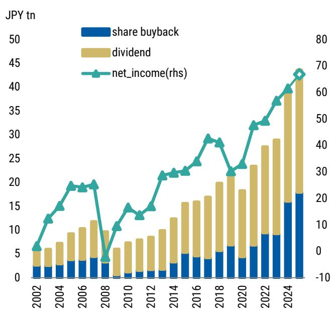  
Total dividends and payout ratio

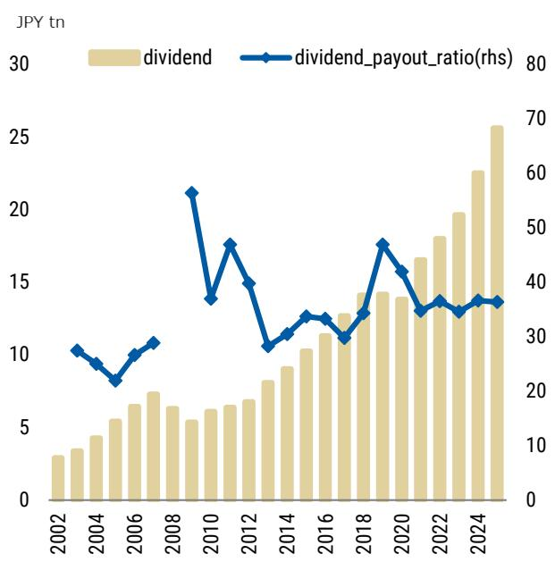

## Progress in corporate governance reform

## Japanese equities: large room for cost-of-capital compression

After reforms triggered by the TSE market restructuring in Apr 2022, Prime PBR rose c.35%. Driven by PER expansion; ROE improvement still incomplete.

\- We see PER uplift from governance reform largely reflecting greater focus on cost of capital, lowering the high investor-required cost of capital that had long been a penalty.

Cumulative change in PBR for TSE Prime firms (since the Apr 2022 TSE market restructuring)

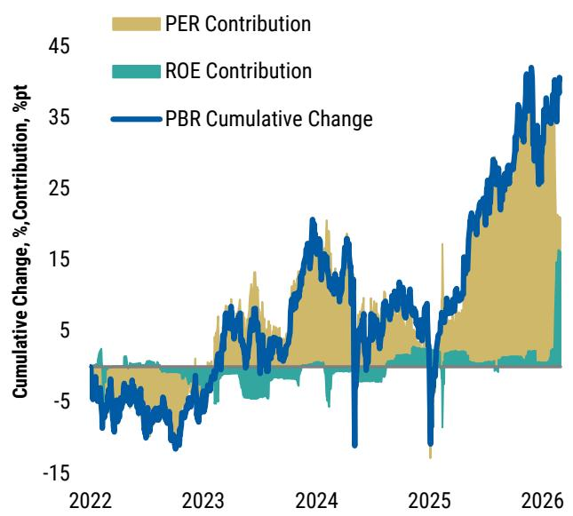

Historical PBR and ROE: Japan vs. US  
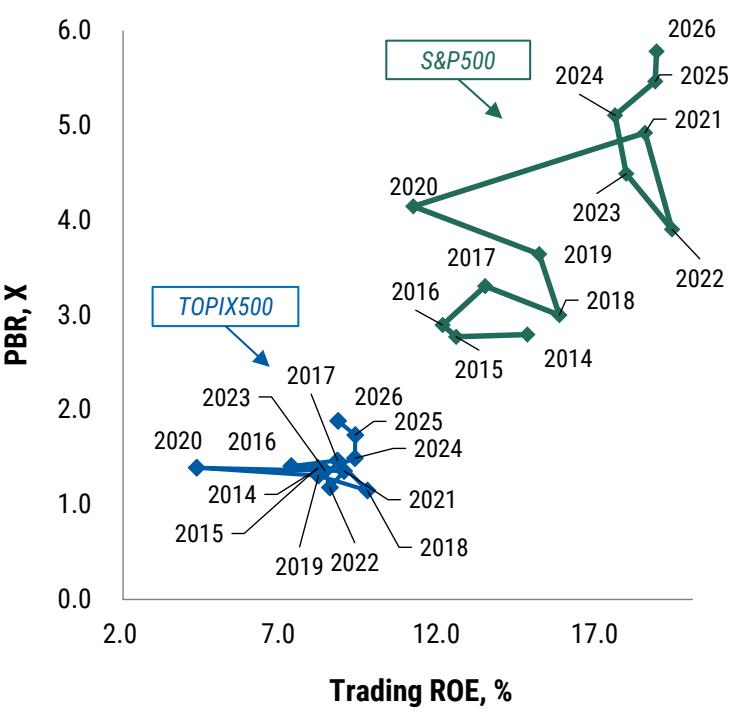  
Note: PER is mkt-cap weighted avg on 12M forward estimates. PBR is mkt-cap weighted avg. ROE calculated as PBR/PER (left). Right chart calculated for TOPIX500 and S&P500 constituents with PBR and ROE available on Bloomberg.
Source: Bloomberg, FactSet, QUICK Workstation, I.N. Information Center, MS

## Progress in corporate governance reform

## Governance reform moves to execution: accountability for idle cash

PM Takaichi remains consistently focused on corporate use of cash and deposits

\- The FSA plans to revise the Corporate Governance Code in summer 2026.

\- The CG Code revision draft released in Apr 2026 calls for effective use of retained earnings (cash & deposits) and tangible assets.

Non-financial corporates: saving-investment balance (IS balance) in major countries

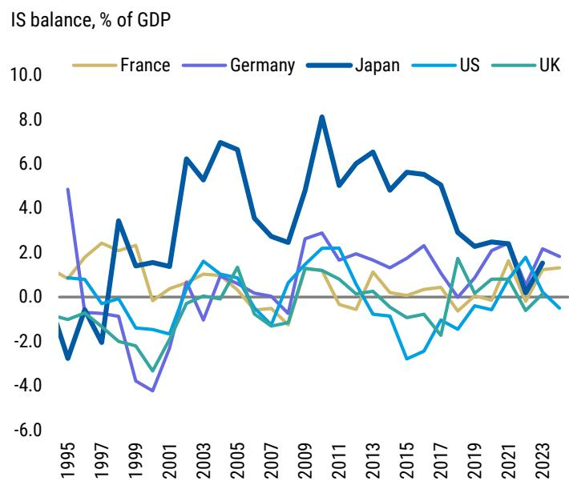  
Cross-country comparison: corporate cash & deposits ratio

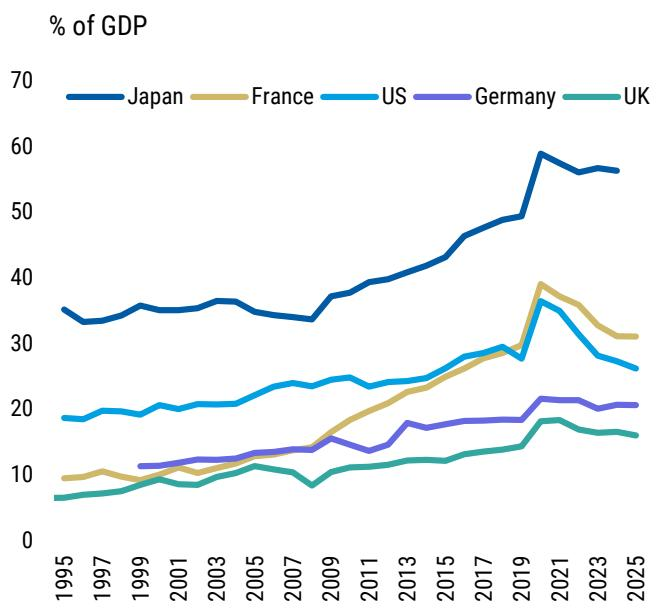

Note: Cash & deposit balances of non-financial corporates (incl. private & public) as % of GDP (calendar year-end). For Japan only, 2024 uses end-Sep cash & deposits divided by nominal GDP for Jul-Sep (annualized, SA).
Source: Cabinet Office, MOF, BOJ, OECD, MS

## Progress in corporate governance reform

## However, investors do not simply demand "maximize payouts" or "step up investment"

Investors generally prioritize sustainable earnings growth (steady improvement in growth rate), strong cash generation, and consistent, rational capital allocation.

For Japanese firms, past M&A has not always translated into higher shareholder value; investor scrutiny of growth investment remains cautious.

## Key mid-to-long-term investment & financial priorities

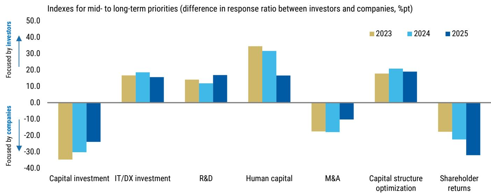

Source: The Life Insurance Association of Japan, "Initiatives to Enhance Equity Value," MS

## Progress in corporate governance reform

## Improving Japan ROE requires pruning low-return businesses and reallocating to high-return areas

Japan's ROE remains low vs. the US and Europe.

\- DuPont breakdown: Japan's net profit margin and asset turnover are relatively low vs. the US/Europe.

\- Sustainable ROE improvement requires fundamental action: exit low-return businesses and concentrate resources in high-profit areas.

ROE: Japan vs. US vs. Europe  
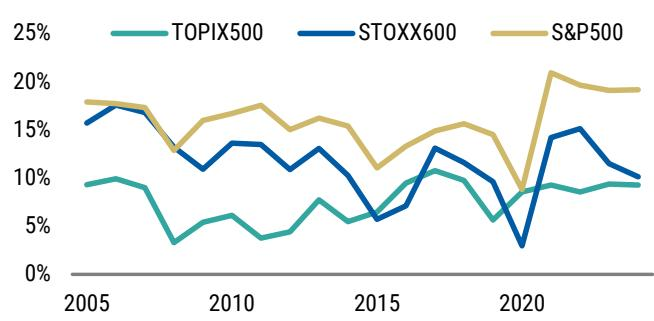  
Asset turnover: Japan vs. US vs. Europe  
Net profit margin: Japan vs. US vs. Europe

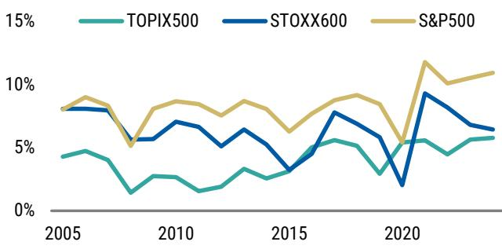

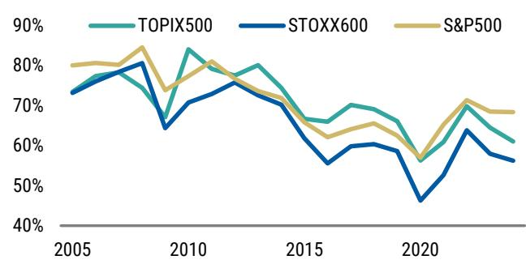

Financial leverage: Japan vs. US vs. Europe  
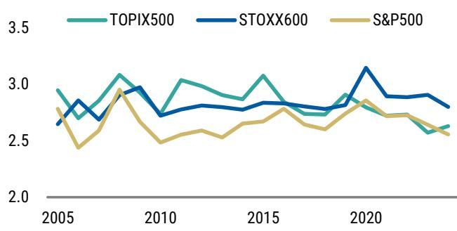  
Note: Ex-financials; FY basis.  
Source: Bloomberg, FactSet, QUICK Workstation, IN Information Center, Toyo Keizai, MS

## Progress in corporate governance reform

## Key to higher enterprise value: not payout level or capex size, but capital allocation quality

Comparing top vs. bottom quartile by EBITDA CAGR, high-growth firms are not investing more in terms of "amount."

\- High-EBITDA-growth firms have improved ROIC with margin gains by exiting unprofitable businesses and reallocating capital to higher-return areas.

\- As ROIC stays above the cost of capital, ROE has also risen sustainably.

\- Despite similar starting points, a wide gap emerged over 10 years, showing that differences in capital allocation and profitability improvement quality drove long-term divergence.

Reinvestment / Sales (EBITDA growth quartiles)

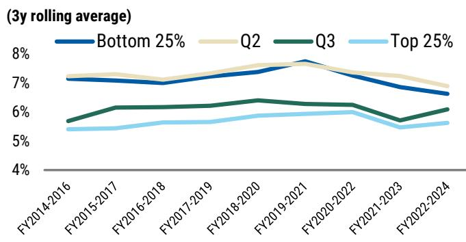  
ROIC trend (median, EBITDA growth quartiles)

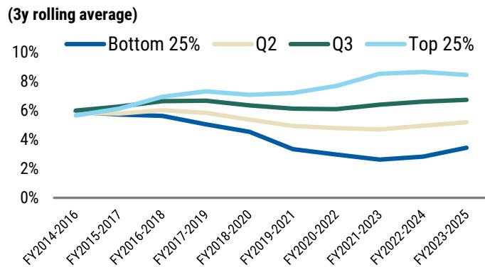  
Reinvestment / EBITDA (EBITDA growth quartiles)

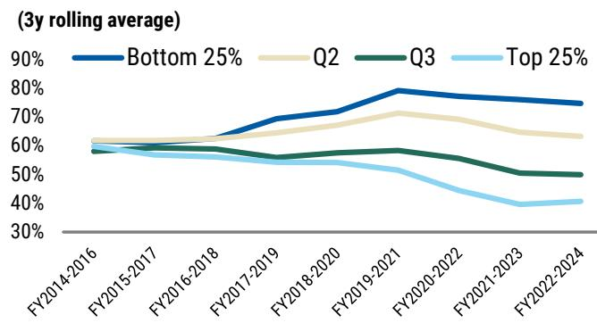  
ROE trend (median, EBITDA growth quartiles)

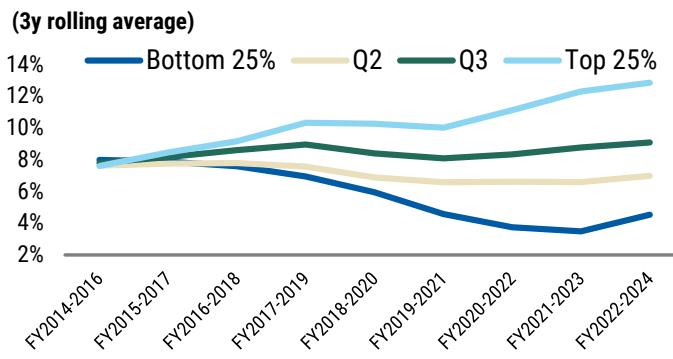  
Source: QUICK Workstation, MS  
Note: EBITDA growth = 10yr CAGR between avg FY14-16 and avg FY22-24. Universe: stocks listed on TSE Prime / former TSE 1st Section during the period

## Progress in corporate governance reform

## Calls to eliminate Japanese corporates' inefficiencies are only getting louder

As focus on improving Japanese corporates' capital efficiency rises, shareholder proposals likely to hit a record high.

\- By objective, activist campaigns increasingly push for capital efficiency/capital structure resets: higher dividends, buybacks, sale of cross-shareholdings, disposal of real estate holdings, etc.

Activist campaigns by objective

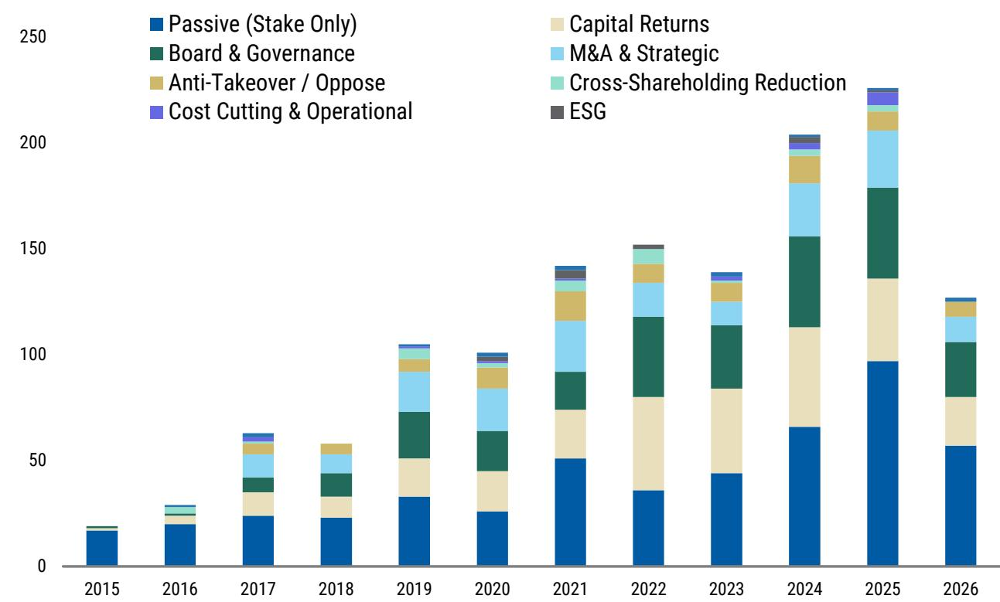  
Source: Bloomberg, MS

## Progress in corporate governance reform

## Governance reform: the most important long-duration theme for Japan equities

Our governance screening has underperformed vs. TOPIX, especially since April as value lagged amid the AI rally.

\- But into the June AGM season, investor interest may return to names with cross-shareholding unwind optionality, cash-rich balance sheets, and large unrealized real estate gains.

\- In that sense, we should be cautious about treating governance-related names uniformly as shorts.

MS Corporate Governance Screening: cumulative excess return vs. TOPIX (YTD, %)

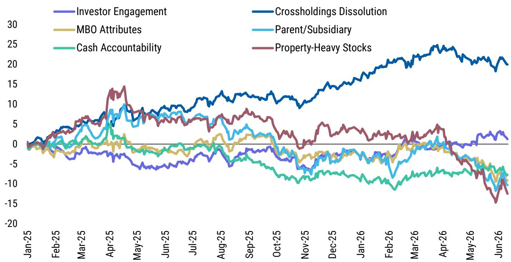  
Note: See report (Rising Sun, Roaring Bull – Japan Is Back(16 Nov 2025)). Source: Bloomberg, MS

## Progress in corporate governance reform

## Prepare for the TOB/MBO wave

TSE and FSA initiatives effectively raise the cost of being listed for corporates.

\- Since the 2023 release of the Takeover Guidelines, TOBs/MBOs have kept rising; corporate/industry restructuring is steadily progressing.

No. of TOBs and value

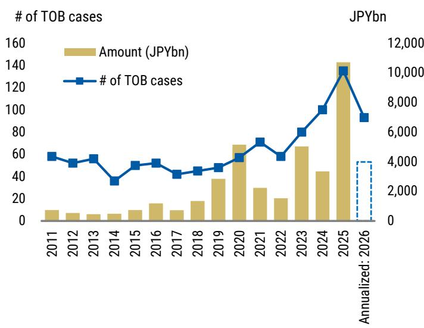

## No. of MBOs and value

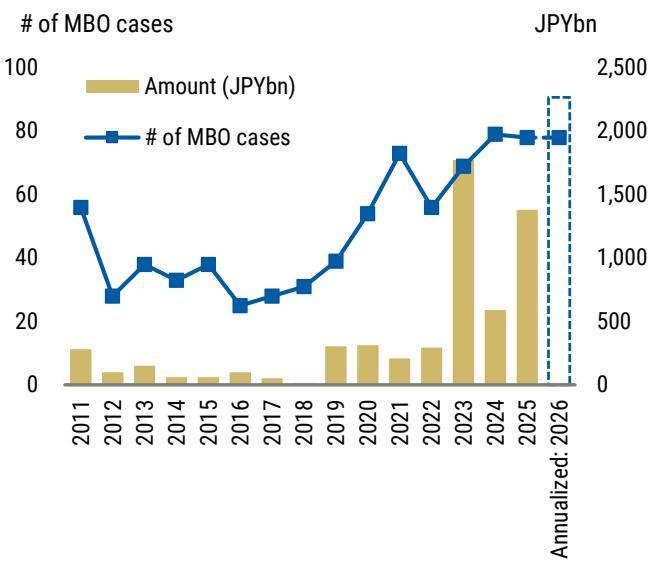

## Rising household investment in Japanese equities via NISA

## Beginning of the end for households' cash/deposit bias

Key takeaway of the new NISA: leveraging (1) sustained, stable inflation and (2) a shift in Japanese corporates' stance on capital efficiency, long-term investing becomes embedded as a household "culture" (i.e., reduced bias toward cash/deposits in household financial assets).

\- Under the "Doubling Asset Income Plan," the govt targets 34.0m total NISA accounts and JPY 56tn cumulative purchases by end-2027.

\- As of Jun 2025, purchases reached JPY 63tn, beating the target ahead of schedule. Account count still needs further growth to hit the target.

No. of NISA accounts  
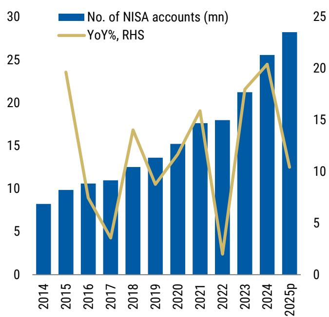

NISA purchase amount  
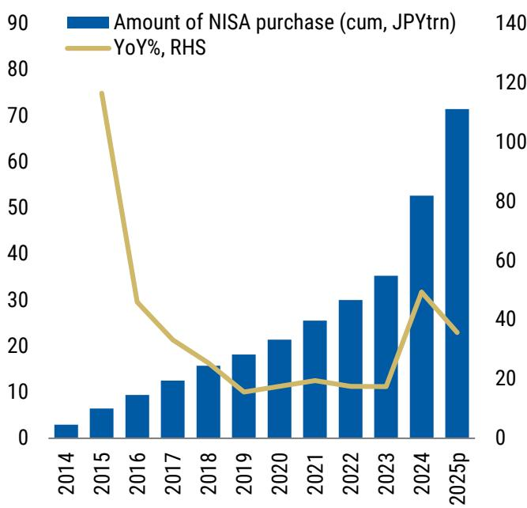

## Rising household investment in Japanese equities via NISA

## Beginning of the end for households' cash/deposit bias

Purchase patterns via NISA unchanged.

\- Breakdown of the Growth Investment and Tsumitate Investment quotas (Mar 2026): c.60% invested in investment trusts, incl. all-country funds.

\- Single stocks account for 40% (c.JPY 2.9tn); of this, over 90% (c.JPY 2.9tn) is invested in Japanese equities.

Breakdown of NISA purchases (Mar 2026)

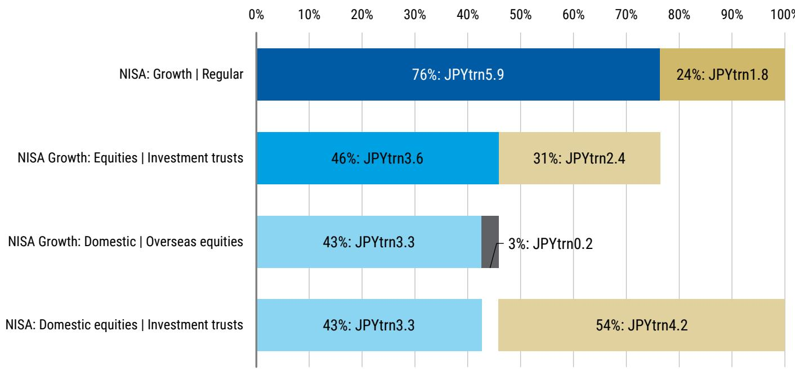  
Source: JSDA, MS

## Rising household investment in Japanese equities via NISA

## Beginning of the end for households' cash/deposit bias

Balance-sheet reshuffling under inflation is not just a corporate story.

\- The share of equities/investment trusts in Japan's household assets has historically tracked inflation closely.

CPI vs. share of equities/investment trusts in household financial assets

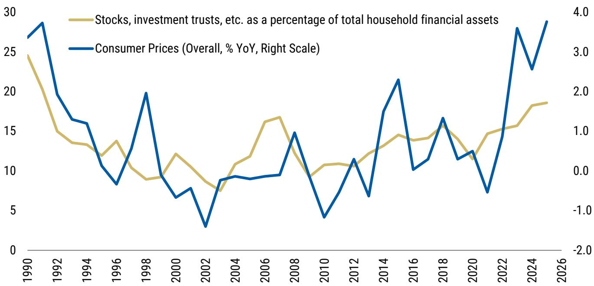  
Source: INDB, Bank of Japan, MS

## Rising household investment in Japanese equities via NISA

## Beginning of the end for households' cash/deposit bias

With sustained, stable inflation, if Japanese corporate behavior shifts, the shift of household cash/deposits into Japanese equities could accelerate into next year.

\- If household asset allocation moves closer to Europe - equity share rising from 14.5% to 25.6% - potential household equity buying could reach JPY 270tn.

\- Equivalent to 20% of the market cap of TSE Prime-listed companies.

Shift in Japan household financial asset allocation

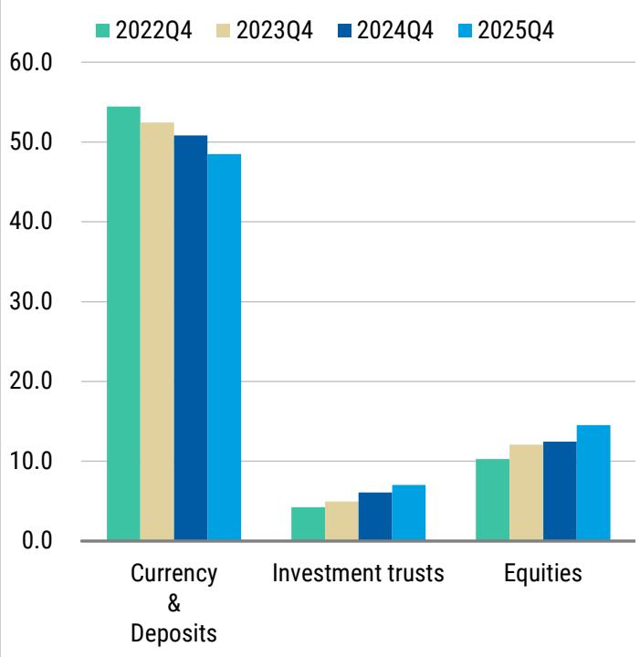  
Source: INDB, HAVER, Bank of Japan, MS  
Household financial asset allocation (as of 2025Q4)

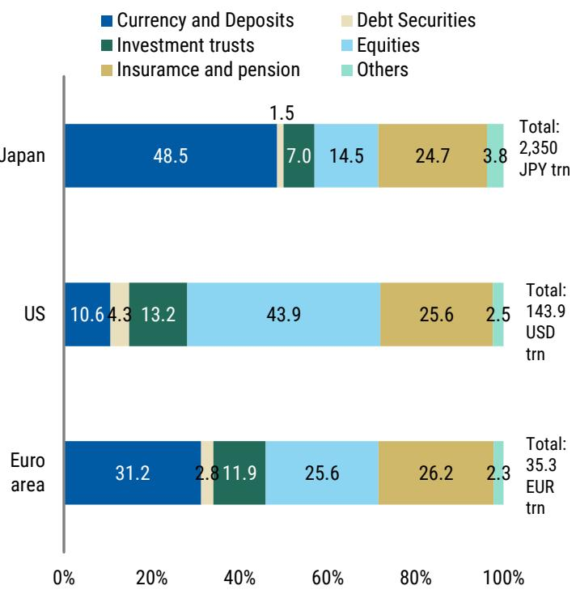

## Disclosure Section

The information and opinions in MS were prepared by MS MUFG Securities Co., Ltd. and its affiliates (collectively, "MS").

For important disclosures, stock price charts and equity rating histories regarding companies that are the subject of this report, please see the MS Disclosure Website at www.morganstanley.com/eqr/disclosures/webapp/generalresearch, or contact your investment representative or MS at 1585 Broadway, (Attention: Research Management), New York, NY, 10036 USA.

For valuation methodology and risks associated with any recommendation, rating or price target referenced in this research report, please contact the Client Support Team as follows: US/Canada +1800 303-2495; Hong Kong +852 2848-5999; Latin America +1718 754-5444 (U.S.); London +44 (0)20-7425-8169; Singapore +65 6834-6860; Sydney +61(0)2-9770-1505; Tokyo +81(0)3-6836-9000. Alternatively you may contact your investment representative or MS at 1585 Broadway, (Attention: Research Management), New York, NY 10036 USA.

## Analyst Certification

The following analysts hereby certify that their views about the companies and their securities discussed in this report are accurately expressed and that they have not received and will not receive direct or indirect compensation in exchange for expressing specific recommendations or views in this report: Sho Nakazawa.

## Global Research Conflict Management Policy

MS has been published in accordance with our conflict management policy, which is available at www.morganstanley.com/institutional/research/conflictpolicies. A Portuguese version of the policy can be found at www.morganstanley.com.br

## Important Regulatory Disclosures on Subject Companies

The equity research analysts or strategists principally responsible for the preparation of MS have received compensation based upon various factors, including quality of research, investor client feedback, stock picking, competitive factors, firm revenues and overall investment banking revenues. Equity Research analysts' or strategists' compensation is not linked to investment banking or capital markets transactions performed by MS or the profitability or revenues of particular trading desks.

MS and its affiliates do business that relates to companies/instruments covered in MS, including market making, providing liquidity, fund management, commercial banking, extension of credit, investment services and investment banking. MS sells to and buys from customers the securities/instruments of companies covered in MS on a principal basis. MS may have a position in the debt of the Company or instruments discussed in this report. MS trades or may trade as principal in the debt securities (or in related derivatives) that are the subject of the debt research report.

Certain disclosures listed above are also for compliance with applicable regulations in non-US jurisdictions.

## STOCK RATINGS

MS uses a relative rating system using terms such as Overweight, Equal-weight, Not-Rated or Underweight (see definitions below). MS does not assign ratings of Buy, Hold or Sell to the stocks we cover. Overweight, Equal-weight, Not-Rated and Underweight are not the equivalent of buy, hold and sell. Investors should carefully read the definitions of all ratings used in MS. In addition, since MS contains more complete information concerning the analyst's views, investors should carefully read MS, in its entirety, and not infer the contents from the rating alone. In any case, ratings (or research) should not be used or relied upon as investment advice. An investor's decision to buy or sell a stock should depend on individual circumstances (such as the investor's existing holdings) and other considerations.

## Global Stock Ratings Distribution

## (as of May 31, 2026)

The Stock Ratings described below apply to MS's Fundamental Equity Research and do not apply to Debt Research produced by the Firm.

For disclosure purposes only (in accordance with FINRA requirements), we include the category headings of Buy, Hold, and Sell alongside our ratings of Overweight, Equal-weight, Not-Rated and Underweight. MS does not assign ratings of Buy, Hold or Sell to the stocks we cover. Overweight, Equal-weight, Not-Rated and Underweight are not the equivalent of buy, hold, and sell but represent recommended relative weightings (see definitions below). To satisfy regulatory requirements, we correspond Overweight, our most positive stock rating, with a buy recommendation; we correspond Equal-weight and Not-Rated to hold and Underweight to sell recommendations, respectively.

<table><tr><td></td><td colspan="2">Coverage Universe</td><td colspan="3">Investment Banking Clients (IBC)</td><td colspan="2">Other Material Investment Services Clients (MISC)</td></tr><tr><td>Stock Rating Category</td><td>Count</td><td>% of Total</td><td>Count</td><td>% of Total IBC</td><td>% of Rating Category</td><td>Count</td><td>% of Total Other MISC</td></tr><tr><td>Overweight/Buy</td><td>1542</td><td>42%</td><td>465</td><td>51%</td><td>30%</td><td>707</td><td>43%</td></tr><tr><td>Equal-weight/Hold</td><td>1571</td><td>43%</td><td>369</td><td>40%</td><td>23%</td><td>723</td><td>44%</td></tr><tr><td>Not-Rated/Hold</td><td>3</td><td>0%</td><td>0</td><td>0%</td><td>0%</td><td>1</td><td>0%</td></tr><tr><td>Underweight/Sell</td><td>551</td><td>15%</td><td>86</td><td>9%</td><td>16%</td><td>201</td><td>12%</td></tr><tr><td>Total</td><td>3,667</td><td></td><td>920</td><td></td><td></td><td>1632</td><td></td></tr></table>

Data include common stock and ADRs currently assigned ratings. Investment Banking Clients are companies from whom MS received investment banking compensation in the last 12 months. Due to rounding off of decimals, the percentages provided in the "% of total" column may not add up to exactly 100 percent.

## Analyst Stock Ratings

Overweight (O). The stock's total return is expected to exceed the average total return of the analyst's industry (or industry team's) coverage universe, on a risk-adjusted basis, over the next 12-18 months.

Equal-weight (E). The stock's total return is expected to be in line with the average total return of the analyst's industry (or industry team's) coverage universe, on a risk-adjusted basis, over the next 12-18 months.

Not-Rated (NR). Currently the analyst does not have adequate conviction about the stock's total return relative to the average total return of the analyst's industry (or industry team's) coverage universe, on a risk-adjusted basis, over the next 12-18 months. Underweight (U). The stock's total return is expected to be below the average total return of the analyst's industry (or industry team's) coverage universe, on a risk-adjusted basis, over the next 12-18 months. Unless otherwise specified, the time frame for price targets included in MS is 12 to 18 months.

## Analyst Industry Views

Attractive (A): The analyst expects the performance of his or her industry coverage universe over the next 12-18 months to be attractive vs. the relevant broad market benchmark, as indicated below.

In-Line (I): The analyst expects the performance of his or her industry coverage universe over the next 12-18 months to be in line with the relevant broad market benchmark, as indicated below.

Cautious (C): The analyst views the performance of his or her industry coverage universe over the next 12-18 months with caution vs. the relevant broad market benchmark, as indicated below.

Benchmarks for each region are as follows: North America - S&P 500; Latin America - relevant MSCI country index or MSCI Latin America Index; Europe - MSCI Europe; Japan - TOPIX; Asia - relevant MSCI country index or MSCI sub-regional index or MSCI AC Asia Pacific ex Japan Index.

## Important Disclosures for MS Smith Barney LLC Customers

Important disclosures regarding any material conflict of interest that can reasonably be expected to have influenced MS Smith Barney LLC's choice of a third-party research provider or the subject company of a third-party research report, are available on the MS Wealth Management disclosure website at www.morganstanley.com/online/researchdisclosures. For MS specific disclosures, you may refer to https://www.morganstanley.com/eqr/disclosures/webapp/generalresearch.

Each MS report is reviewed and approved on behalf of MS Smith Barney LLC. This review and approval is conducted by the same person who reviews the research report on behalf of MS. This could create a conflict of interest.

## Other Important Disclosures

MS policy is to update research reports as and when the Research Analyst and Research Management deem appropriate, based on developments with the issuer, the sector, or the market that may have a material impact on the research views or opinions stated therein. In addition, certain Research publications are intended to be updated on a regular periodic basis (weekly/monthly/quarterly/annual) and will ordinarily be updated with that frequency, unless the Research Analyst and Research Management determine that a different publication schedule is appropriate based on current conditions.

MS is not acting as a municipal advisor and the opinions or views contained herein are not intended to be, and do not constitute, advice within the meaning of Section 975 of the Dodd-Frank Wall Street Reform and Consumer Protection Act. MS produces an equity research product called a "Tactical Idea." Views contained in a "Tactical Idea" on a particular stock may be contrary to the recommendations or views expressed in research on the same stock. This may be the result of differing time horizons, methodologies, market events, or other factors. For all research available on a particular stock, please contact your sales representative or go to Matrix at http://www.morganstanley.com/matrix.

MS is provided to our clients through our proprietary research portal on Matrix and also distributed electronically by MS to clients. Certain, but not all, MS products are also made available to clients through third-party vendors or redistributed to clients through alternate electronic means as a convenience. For access to all available MS, please contact your sales representative or go to Matrix at http://www.morganstanley.com/matrix.Any access and/or use of MS is subject to MS's Terms of Use (http://www.morganstanley.com/terms.html). By accessing and/or using MS, you are indicating that you have read and agree to be bound by our Terms of Use (http://www.morganstanley.com/terms.html). In addition you consent to MS processing your personal data and using cookies in accordance with our Privacy Policy and our Global Cookies Policy (http://www.morganstanley.com/privacy\_pledge.html), including for the purposes of setting your preferences and to collect readership data so that we can deliver better and more personalized service and products to you. To find out more information about how MS processes personal data, how we use cookies and how to reject cookies see our Privacy Policy and our Global Cookies Policy (http://www.morganstanley.com/privacy\_pledge.html). Please use the provided link to review the Terms and Conditions and Most Important

Terms and Conditions for MS India Company Private Limited (https://www.morganstanley.com/assets/pdfs/about-us-global-offices/india/Terms\_and\_conditions.pdf) and the following link to review the audit report (https://ny.matrix.ms.com/eqr/research/webapp/researchdocs/MSICPL\_Morgan\_Stanley\_Research\_Audit\_Report.pdf).

If you do not agree to our Terms of Use and/or if you do not wish to provide your consent to MS processing your personal data or using cookies please do not access our research.

MS does not provide individually tailored investment advice. MS has been prepared without regard to the circumstances and objectives of those who receive it. MS recommends that investors independently evaluate particular investments and strategies, and encourages investors to seek the advice of a financial adviser. The appropriateness of an investment or strategy will depend on an investor's circumstances and objectives. The securities, instruments, or strategies discussed in MS may not be suitable for all investors, and certain investors may not be eligible to purchase or participate in some or all of them. MS is not an offer to buy or sell or the solicitation of an offer to buy or sell any security/instrument or to participate in any particular trading strategy. The value of and income from your investments may vary because of changes in interest rates, foreign exchange rates, default rates, prepayment rates, securities/instruments prices, market indexes, operational or financial conditions of companies or other factors. There may be time limitations on the exercise of options or other rights in securities/instruments transactions. Past performance is not necessarily a guide to future performance. Estimates of future performance are based on assumptions that may not be realized. If provided, and unless otherwise stated, the closing price on the cover page is that of the primary exchange for the subject company's securities/instruments.

The fixed income research analysts, strategists or economists principally responsible for the preparation of MS have received compensation based upon various factors, including quality, accuracy and value of research, firm profitability or revenues (which include fixed income trading and capital markets profitability or revenues), client feedback and competitive factors. Fixed Income Research analysts', strategists' or economists' compensation is not linked to investment banking or capital markets transactions performed by MS or the profitability or revenues of particular trading desks.

The "Important Regulatory Disclosures on Subject Companies" section in MS lists all companies mentioned where MS owns 1% or more of a class of common equity securities of the companies. For all other companies mentioned in MS, MS may have an investment of less than 1% in securities/instruments or derivatives of securities/instruments of companies and may trade them in ways different from those discussed in MS. Employees of MS not involved in the preparation of MS may have investments in securities/instruments or derivatives of securities/instruments of companies mentioned and may trade them in ways different from those discussed in MS. Derivatives may be issued by MS or associated persons.

With the exception of information regarding MS, MS is based on public information. MS makes every effort to use reliable, comprehensive information, but we make no representation that it is accurate or complete. We have no obligation to tell you when opinions or information in MS change apart from when we intend to discontinue equity research coverage of a subject company. Facts and views presented in MS have not been reviewed by, and may not reflect information known to, professionals in other MS business areas, including investment banking personnel.

MS personnel may participate in company events such as site visits and are generally prohibited from accepting payment by the company of associated expenses unless pre-approved by authorized members of Research management. MS may make investment decisions that are inconsistent with the recommendations or views in this report.

To our readers based in Taiwan or trading in Taiwan securities/instruments: Information on securities/instruments that trade in Taiwan is distributed by MS Taiwan Limited ("MSTL"). Such information is for your reference only. The reader should independently evaluate the investment risks and is solely responsible for their investment decisions. MS may not be distributed to the public media or quoted or used by the public media without the express written consent of MS. Any non-customer reader within the scope of Article 7-1 of the Taiwan Stock Exchange Recommendation Regulations accessing and/or receiving MS is not permitted to provide MS to any third party (including but not limited to related parties, affiliated companies and any other third parties) or engage in any activities regarding MS which may create or give the appearance of creating a conflict of interest. Information on securities/instruments that do not trade in Taiwan is for informational purposes only and is not to be construed as a recommendation or a solicitation to trade in such securities/instruments. MSTL may not execute transactions for clients in these securities/instruments.

MS is not incorporated under PRC law and the research in relation to this report is conducted outside the PRC. MS does not constitute an offer to sell or the solicitation of an offer to buy any securities in the PRC. PRC investors shall have the relevant qualifications to invest in such securities and shall be responsible for obtaining all relevant approvals, licenses, verifications and/or registrations from the relevant governmental authorities themselves. Neither this report nor any part of it is intended as, or shall constitute, provision of any consultancy or advisory service of securities investment as defined under PRC law. Such information is provided for your reference only.

MS is disseminated in Brazil by MS C.T.V.M. S.A. located at Av. Brigadeiro Faria Lima, 3600, 6th floor, São Paulo - SP, Brazil; and is regulated by the Comissão de Valores Mobiliários; in Mexico by MS México, Casa de Bolsa, S.A. de C.V which is regulated by Comision Nacional Bancaria y de Valores. Paseo de los Tamarindos 90, Torre 1, Col. Bosques de las Lomas Floor 29, 05120 Mexico City; in Japan by MS MUFG Securities Co., Ltd. and, for Commodities related research reports only, MS Capital Group Japan Co., Ltd; in Hong Kong by MS Asia Limited (which accepts responsibility for its contents) and by MS Bank Asia Limited; in Singapore by MS Asia (Singapore) Pte. (Registration number 199206298Z) and/or MS Asia (Singapore) Securities Pte Ltd (Registration number 200008434H), regulated by the Monetary Authority of Singapore (which accepts legal responsibility for its contents and should be contacted with respect to any matters arising from, or in connection with, MS) and by MS Bank Asia Limited, Singapore Branch (Registration number T14FCO118); in Australia to "wholesale clients" within the meaning of the Australian Corporations Act by MS Australia Limited A.B.N. 67 003 734 576, holder of Australian financial services license No. 233742, which accepts responsibility for its contents; in Australia to "wholesale clients" and "retail clients" within the meaning of the Australian Corporations Act by MS Wealth Management Australia Pty Ltd (A.B.N. 19 009 145 555, holder of Australian financial services license No. 240813, which accepts responsibility for its contents; in Korea by MS & Co International plc, Seoul Branch; in India by MS India Company Private Limited having Corporate Identification No (CIN) U22990MH1998PTC115305, regulated by the Securities and Exchange Board of India ("SEBI") and holder of licenses as a Research Analyst (SEBI Registration No. INH000001105); Stock Broker (SEBI Stock Broker Registration No. INZ000244438), Merchant Banker (SEBI Registration No. INM000011203), and depository participant with National Securities Depository Limited (SEBI Registration No. IN-DP-NSDL-567-2021) having registered office at Altimus, Level 39 & 40, Pandurang Budhkar Marg, Worli, Mumbai 400018, India; Telephone no. +91-22-61181000; Compliance Officer Details: Mr. Tejarshi Hardas, Tel. No.: +91-22-61181000 or Email: tejarshi.hardas@morganstanley.com; Grievance officer details: Mr. Tejarshi Hardas, Tel. No.: +91-22-61181000 or Email: msic-compliance@morganstanley.com. MS India Company Private Limited (MSICPL) may use AI tools in providing research services. All recommendations contained herein are made by the duly qualified research analysts; in Canada by MS Canada Limited; in Germany and the European Economic Area where required by MS Europe S.E., authorised and regulated by Bundesanstalt fuer Finanzdienstleistungsaufsicht (BaFin) under the reference number 149169; in the US by MS & Co. LLC, which accepts responsibility for its contents. MS & Co. International plc, authorized by the Prudential Regulation Authority and regulated by the Financial Conduct Authority and the Prudential Regulation Authority, disseminates in the UK research that it has prepared, and research which has been prepared by any of its affiliates, only to persons

who (i) are investment professionals falling within Article 19(5) of the Financial Services and Markets Act 2000 (Financial Promotion) Order 2005 (as amended, the "Order"); (ii) are persons who are high net worth entities falling within Article 4.9(2)(a) to (d) of the Order; or (iii) are persons to whom an invitation or inducement to engage in investment activity (within the meaning of section 21 of the Financial Services and Markets Act 2000, as amended) may otherwise lawfully be communicated or caused to be communicated. RMB MS Proprietary Limited is a member of the JSE Limited and A2X (Pty) Ltd. RMB MS Proprietary Limited is a joint venture owned equally by MS International Holdings Inc. and RMB Investment Advisory (Proprietary) Limited, which is wholly owned by FirstRand Limited. The information in MS is being disseminated by MS Saudi Arabia, regulated by the Capital Market Authority in the Kingdom of Saudi Arabia, and is directed at Sophisticated investors only.

The information in MS is being communicated by MS & Co. International plc (DIFC Branch), regulated by the Dubai Financial Services Authority (the DFSA) or by MS & Co. International plc (ADGM Branch), regulated by the Financial Services Regulatory Authority Abu Dhabi (the FSRA), and is directed at Professional Clients only, as defined by the DFSA or the FSRA, respectively. The financial products or financial services to which this research relates will only be made available to a customer who we are satisfied meets the regulatory criteria of a Professional Client. A distribution of the different MS Research ratings or recommendations, in percentage terms for Investments in each sector covered, is available upon request from your sales representative.

The information in MS is being communicated by MS & Co. International plc (QFC Branch), regulated by the Qatar Financial Centre Regulatory Authority (the QFCRA), and is directed at business customers and market counterparties only and is not intended for Retail Customers as defined by the QFCRA.

As required by the Capital Markets Board of Turkey, investment information, comments and recommendations stated here, are not within the scope of investment advisory activity. Investment advisory service is provided exclusively to persons based on their risk and income preferences by the authorized firms. Comments and recommendations stated here are general in nature. These opinions may not fit to your financial status, risk and return preferences. For this reason, to make an investment decision by relying solely to this information stated here may not bring about outcomes that fit your expectations.

The trademarks and service marks contained in MS are the property of their respective owners. Third-party data providers make no warranties or representations relating to the accuracy, completeness, or timeliness of the data they provide and shall not have liability for any damages relating to such data. The Global Industry Classification Standard (GICS) was developed by and is the exclusive property of MSCI and S&P.

MS, or any portion thereof may not be reprinted, sold or redistributed without the written consent of MS.

Indicators and trackers referenced in MS may not be used as, or treated as, a benchmark under Regulation EU 2016/1011, or any other similar framework.

The issuers and/or fixed income products recommended or discussed in certain fixed income research reports may not be continuously followed. Accordingly, investors should regard those fixed income research reports as providing stand-alone analysis and should not expect continuing analysis or additional reports relating to such issuers and/or individual fixed income products.

MS may hold, from time to time, material financial and commercial interests regarding the company subject to the Research report.

Registration granted by SEBI and certification from the National Institute of Securities Markets (NISM) in no way guarantee performance of the intermediary or provide any assurance of returns to investors. Investment in securities market are subject to market risks. Read all the related documents carefully before investing.

## © 2026 MS MUFG