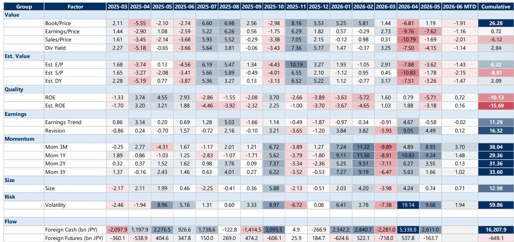
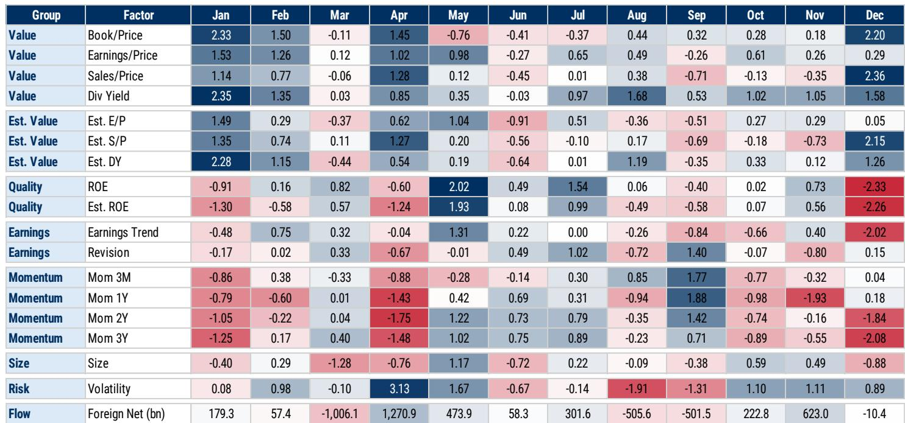
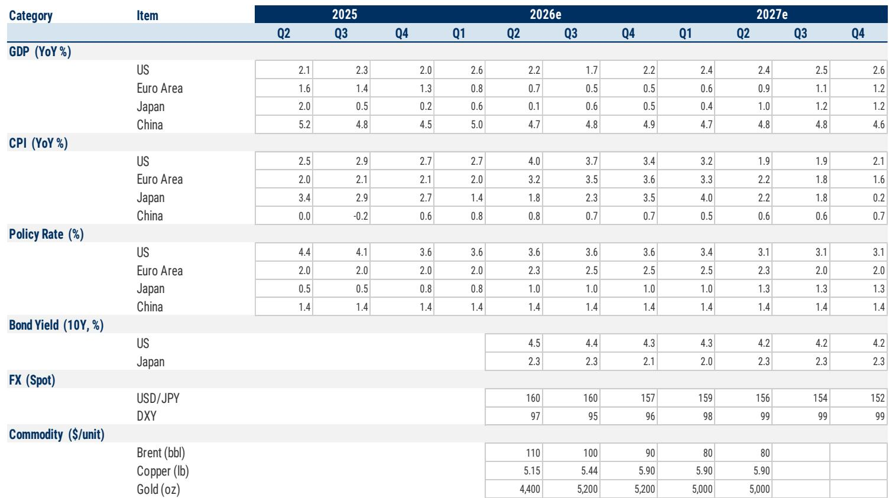

# Japan's Secular Bull Market Is Real—But the Path to 4,300 Requires Navigating a Stagflationary Interlude

The argument for Japanese equities has never been cleaner, yet the near-term outlook has never been more confusing. On one hand, Japan is undergoing a structural transformation that is rare in developed markets: sustained inflation, a government with a supermajority mandate for growth, corporate governance reforms that are actually changing behavior, and households beginning to shift savings from cash to equities. On the other hand, a Middle East energy shock is expected to drag global growth in 2026, pushing Japan into what a major investment bank calls "stagflation-like headwinds"—slower growth combined with higher inflation. The TOPIX target of 4,300 by mid-2027 implies roughly 8% upside from current levels, but the bull case of 4,900 and bear case of 2,600 reveal a scenario spread that is unusually wide. This is not a market for blanket conviction. It is a market for selective positioning and scenario-aware portfolio construction.

The core thesis is straightforward but powerful: Japan's equity market is exiting a three-decade regime of deflation, low margins, and low household equity participation. The four structural drivers—stable inflation, pro-growth policy, governance reform, and NISA-driven retail inflows—are mutually reinforcing. Inflation gives companies pricing power, which boosts margins and enables wage growth. Wage growth sustains inflation and shifts household balance sheets from cash to risk assets. Governance reform forces companies to deploy cash more efficiently, lifting ROE and justifying higher valuations. Policy stability under a strong government reduces the risk premium. These are not cyclical tailwinds. They are regime changes.

Yet the report makes clear that 2026 will test this narrative. The base case assumes a Middle East de-escalation and no major supply-chain disruption, but the macro forecasts show Japan's nominal GDP growth stalling to -0.3% in calendar 2026 before rebounding to +4.9% in 2027. The TOPIX target of 4,300 is built on a forward P/E of 17.5x, which is in the 93rd percentile of its 10-year range. That valuation requires investors to accept that the old regime's P/E cap no longer applies. The report explicitly argues that "assuming the past 'low inflation/low pass-through/low margin' regime and treating the historical P/E range as a future upside cap is, in our view, not sufficient." This is the intellectual hinge of the entire thesis. If you accept that Japan has structurally re-rated, the upside is compelling. If you doubt it, the downside is severe.

## Japan's Four Structural Drivers Are Strengthening, but the Timing of Their Market Impact Is Uneven

The four pillars of the bull case are not moving in lockstep. Sustained inflation is the foundation, and the data supports the view that Japan is shifting toward a 2% inflation trajectory as the output gap narrows. This is not a temporary cost-push shock; it is a structural shift in pricing behavior. The report shows that domestic corporate goods prices have risen significantly since 2021, and Japanese companies have continued efforts to improve margins. This is visible in the declining beta of TOPIX to USD/JPY—export sensitivity has clearly fallen over the past decade. Companies are less vulnerable to yen appreciation because they have rebuilt pricing power. That is a genuine structural improvement.

The political driver is equally significant. The LDP's landslide victory under Prime Minister Takaichi, with a solo two-thirds supermajority, provides three things that markets value: higher policy predictability, faster decision-making, and higher execution certainty for the growth strategy. This is particularly important for national security-related spending and for the broader growth agenda. A government that can act decisively reduces the tail risk of policy paralysis, which has historically been a drag on Japan's equity risk premium.

Corporate governance reform is the third pillar, and it is the one with the most quantifiable track record. Since the Tokyo Stock Exchange's market restructuring in April 2022, Prime market PBR has risen approximately 40%. A further Corporate Governance Code revision is expected around June 2026, which the report anticipates will push for better use of corporate cash. Faster reform should lift ROE and support valuations through both PBR and PER expansion. This is not speculative. The trend is established, and the regulatory machinery is still in motion.

The fourth driver—rising household equity investment via NISA—is the longest-tailed but potentially most transformative. From January 2027, a "Kids NISA" will allow under-18s to invest up to JPY 600,000 per year tax-free. This is a multi-decade shift in household asset allocation. The report frames it as part of a broader reassessment of balance-sheet management by households, mirroring what corporates have already begun. Sustained inflation makes cash less attractive, and NISA provides the tax-efficient vehicle for the shift. This is a slow-moving but powerful demand-side support.

The problem is that these four drivers operate on different time horizons. Inflation and governance are already priced in to some degree. Political stability is a backdrop, not a catalyst. NISA flows are a multi-year story. The market's near-term direction will be determined by the interplay between these structural supports and the cyclical headwinds from the energy shock.

## The Stagflationary Interlude of 2026 Creates a Valuation Paradox That Demands a Regime-Change Mindset

The report's macro forecasts are revealing. Japan's CPI is projected to spike to 4.0% year-on-year in Q1 2027, while GDP growth troughs at just 0.1% in Q2 2026. Policy rates rise only modestly, from 0.5% to 1.3% by late 2027. This is not a normal recession. It is a terms-of-trade shock that depresses growth while raising prices. For equity investors, this creates a paradox: near-term earnings are under pressure, but the medium-term normalization path is intact. The report explicitly states that "near-term EPS downside risk and mid/long-term earnings normalization hopes can coexist," and that Japanese equities appear to be pricing in both.

This is the crux of the investment challenge. If you believe the structural regime change is real, then the 2026 earnings weakness is a buying opportunity. If you treat the historical P/E range as binding, then current valuations look stretched. The report's base case assumes a forward P/E of 17.5x, which is a bet that the market will look through the cyclical weakness to the structural recovery. The bull case of 18.0x assumes that AI-driven productivity gains and easier financial conditions create a virtuous cycle. The bear case of 12.0x assumes that the energy shock triggers a global recession and a re-rating back to historical norms.

The data on analyst revisions supports the view that the market is already discounting near-term weakness. The report shows that TOPIX500 revisions have deteriorated recently in both export-oriented and domestic-oriented sectors, yet the index has remained resilient. This suggests that investors are willing to look through the earnings downgrades because they are focused on the structural story. The key question is how long this patience lasts. If the energy shock persists into 2027, the structural narrative will be tested.

## Themes, Not Earnings, Are Increasingly Driving Excess Returns—and the Sector Rotation Has Already Begun

One of the most striking findings in the report is that sector thematic appeal is becoming a more important source of excess returns than earnings revisions. This is a sign of a maturing bull market where the easy gains from broad multiple expansion are giving way to more selective positioning. The report shows that export-oriented outperformance is most pronounced in growth stocks, regardless of market capitalization, while domestic growth stocks have recently underperformed as hedging demand rises.

This thematic shift has implications for portfolio construction. In the early stages of Japan's re-rating, the trade was simple: buy the market, benefit from governance reform and BOJ normalization. Now, the dispersion between sectors and factors is widening. The report's factor seasonality analysis shows that momentum tends to improve into July after an early-spring pullback, and that foreign buying seasonality supports Japanese equities from April through July. But within that, the differentiation between export growth and domestic value is likely to persist.

The report does not fully answer which themes will sustain outperformance if the energy shock persists. Export-oriented growth stocks benefit from a weak yen and AI-related demand, but they are also exposed to global demand weakness. Domestic-oriented stocks benefit from wage growth and inflation, but they face margin pressure from higher input costs. The thematic trade is not obvious. This is where the report's framework becomes most useful for investors: it forces a decision on which structural driver you are betting on.

## What the Report Does Not Fully Answer: The Interaction Between NISA Flows and a Correction

The report is comprehensive on the four structural drivers, but it leaves a critical question under-explored: what happens to household equity participation if the market corrects sharply? The NISA-driven retail inflow story is compelling in a rising market, but its resilience has not been tested. Japanese households have been conditioned by three decades of deflation to view equities as risky. A bear case scenario where TOPIX falls to 2,600 would represent a 35% decline from current levels. Would retail investors see that as a buying opportunity, or would they retreat back to cash?

The report's bull case assumes that NISA flows continue to grow, but it does not model the elasticity of those flows to market returns. This is a meaningful gap. In other developed markets, retail participation tends to be pro-cyclical—rising in bull markets and falling in corrections. If Japanese households behave similarly, the downside scenario could be amplified by a withdrawal of the very demand that the bull case relies upon. Conversely, if the government maintains its policy support and the Kids NISA creates a new generation of investors, the structural demand could prove stickier than historical patterns suggest.

This is not a criticism of the report's framework. It is an acknowledgment that the NISA story is unprecedented in Japan, and therefore its dynamics are inherently uncertain. Investors should monitor retail flow data closely, particularly during any periods of market stress in 2026.

## A Decision Framework for Investors: Three Scenarios and the Trigger Points That Shift Probability Weights

The report's base, bull, and bear cases provide a useful starting point, but investors need a framework for updating their views as new information arrives. Based on the report's logic, three trigger points are critical.

First, the energy shock trajectory. The base case assumes Middle East de-escalation and Brent crude falling from $110 in Q2 2026 to $80 by early 2027. If oil remains elevated above $100 through year-end 2026, the stagflationary headwinds intensify and the bear case becomes more probable. The trigger to watch is not the absolute level of oil prices, but the duration of the spike. A short spike is manageable. A prolonged one is not.

Second, the earnings revision cycle. The report's base-case EPS assumes a 2-3ppt lag below consensus, reflecting a cautious view on pass-through from higher oil costs. If actual earnings come in closer to consensus, it would support the bull case by validating that companies have maintained pricing power. If earnings fall short of even the base case, the bear case gains credibility.

Third, the BOJ's reaction function. The report assumes policy rates rise to 1.3% by late 2027, which is modest relative to the inflation trajectory. If the BOJ is forced to hike more aggressively to defend the yen or contain inflation expectations, it would tighten financial conditions and pressure equity valuations. If the BOJ remains dovish, it supports the reflation narrative but risks currency weakness.

The most important insight from the report is that the bull and bear cases are not symmetric in their probability distribution. The structural drivers give the bull case a higher baseline probability, but the tail risks in the bear case are severe. This argues for a barbell approach: maintain core exposure to Japan equities through the structural themes, but hedge tail risks through options or macro overlays.

## Join the Community to Read the Full Report and Review the Original Charts

The analysis above draws on a detailed investor presentation that includes proprietary macro forecasts, factor return seasonality tables, and sector-level decomposition of excess returns. The full report contains the original charts on TOPIX sensitivity to USD/JPY, the breakdown of export versus domestic-oriented performance, and the multi-year trend in corporate margin expansion. These visuals are essential for understanding the nuance behind the headline thesis. Join the community to read the full report and review the original charts.

*This article is for learning and discussion only and does not constitute investment advice.*

Personal reading notes and learning share only. Not investment advice.

