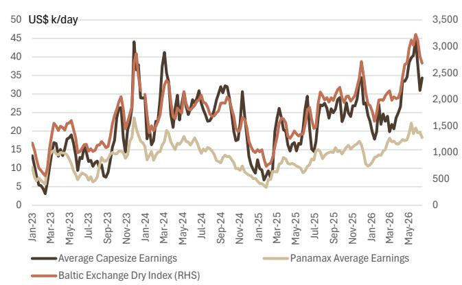
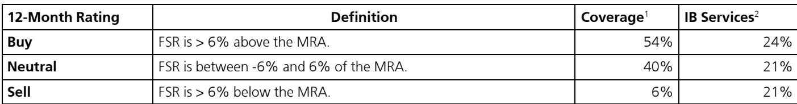
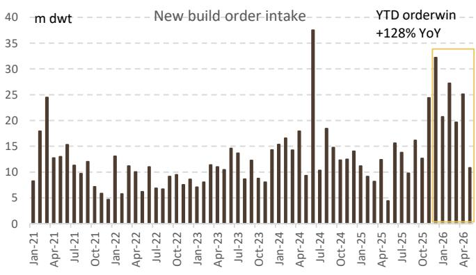

# The Strait of Hormuz Reopening Is Not a Normalization Signal — It Is a Catalyst for Structural Repricing Across Global Shipping

The past week delivered what many market participants had been waiting for: a partial reopening of the Strait of Hormuz, a spike in VLCC earnings to nearly $195,000 per day, and continued strength in container freight rates that now stand 67% higher year-on-year on the Shanghai Containerized Freight Index. On the surface, these data points suggest a market returning to equilibrium after disruption. That interpretation is dangerously incomplete.

The reopening of Hormuz is not a return to normalcy. It is a controlled release of pent-up demand into a supply chain that remains structurally constrained by vessel re-routing, elevated newbuild prices, and a front-loading pattern in container volumes that signals anticipatory behavior rather than genuine demand recovery. The data from the most recent weekly tracking of trade flows, freight rates, and vessel transits reveals a market that is repricing risk in real time — and that repricing has further to run.

Three forces are converging to reshape the shipping cycle. First, the geopolitical risk premium embedded in tanker rates is being re-evaluated as vessels re-enter the Persian Gulf, but the volume of available tonnage remains well below pre-conflict levels. Second, container shipping is experiencing a structural shift in demand patterns, with Asia-US volumes showing strong year-on-year growth since May that is driven more by inventory front-loading than by end-consumer demand. Third, the shipbuilding sector is signaling that capacity constraints are here to stay, with newbuild price indices remaining elevated and demand concentrated in VLCC and gas carrier segments.

This is not a cyclical bounce. It is the early stage of a structural repricing of maritime risk that will have second-order implications for freight budgets, inventory strategies, and capital allocation in shipping assets. The question for investors is not whether rates will normalize, but what the new normal looks like — and whether the market is correctly pricing the duration of elevated earnings.

## The Hormuz Reopening Is a Liquidity Event, Not a Supply Solution

The data on vessel transits through the Strait of Hormuz tells a clear story: last week, daily transits recovered to approximately 25 vessels, up from roughly 10 during the peak of the disruption, but still 80% below the pre-conflict average of 125. This is not a reopening in any operational sense. It is a carefully managed resumption of movement for a subset of vessels, likely those that had been anchored in safe zones and are now being released under monitored conditions.

The market's response was immediate and dramatic. VLCC average earnings on the Middle East/West Africa to China route surged 87% week-on-week to approximately $195,000 per day. This spike reflects an initial scramble for available tonnage as operators rush to position vessels in the Persian Gulf. But the sustainability of these earnings depends on the pace of further vessel releases, which remains uncertain.

The critical insight here is that the earnings spike is not a function of demand strength in the underlying crude market. It is a function of a liquidity mismatch: a sudden increase in the number of cargoes seeking transport against a fleet that is still partially immobilized and has been further constrained by the need to reposition vessels from alternative routes. The Maritime Trade Disruption Monitor data shows a notable increase in tankers departing eastbound from Hormuz since last Friday, confirming that the initial wave of cargoes is moving. But the question of how many vessels remain trapped, and how quickly they can be cleared, will determine whether current earnings are a spike or a plateau.

The second-order implication is that the risk premium embedded in tanker rates will not simply revert to pre-conflict levels. Even if Hormuz returns to full operational capacity within weeks — which is far from guaranteed — the experience of disruption has permanently altered the cost of insuring and financing vessels operating in the region. Owners will demand higher compensation for the risk of future closures, and charterers will need to build that premium into their freight budgets.

## Container Freight Strength Is Masking a Divergence Between Volume and Demand

The container shipping data presents a more complex picture than the headline rate increases suggest. Overall SCFI freight rates rose 5% week-on-week and stand 67% higher year-on-year. Shanghai-Europe rates increased 3% week-on-week, while Transpacific rates rose 9-11% week-on-week. These are strong numbers by any measure, and they have prompted some analysts to call for a sustained upcycle in container shipping.

But a closer examination of the data reveals a pattern that is more consistent with front-loading than with genuine demand growth. Container throughput at key ports in China increased 3% week-on-week and 2% year-on-year. That is healthy but not exceptional. More tellingly, the Port of LA imports were down 12% year-on-year in week 25 and are estimated to decline approximately 6% year-on-year in week 26. The strong year-on-year growth in Asia-US container volumes since May, as tracked by the Maritime Destination Monitor, is not being matched by a commensurate increase in US import volumes.

This divergence suggests that shippers are moving goods earlier than usual — building inventory buffers in anticipation of further disruptions, tariff changes, or capacity constraints. This is rational behavior in a world where Red Sea re-routing remains at elevated levels (4-5% year-on-year) and where the risk of further choke-point disruptions has been vividly demonstrated. But front-loading is not the same as demand growth. It simply pulls forward volume from future periods, creating a temporary boost that will reverse once inventories are rebuilt.

The risk for investors is that the current strength in container rates is being misinterpreted as a signal of robust global trade. If the front-loading thesis is correct, then the second half of the year could see a volume correction just as new vessel deliveries begin to add capacity. The Intra-Asia containership chartering index recovered only 1% week-on-week, suggesting that the regional market is not experiencing the same tightness as the main lanes. This is consistent with a market where demand is being concentrated on long-haul routes for inventory-building purposes, rather than reflecting broad-based trade expansion.

## The Bulker Market Is Softening, But Newbuild Prices Refuse to Follow

The bulker market provided a useful contrast to the tanker and container segments last week. The Baltic Dry Index decreased 4% week-on-week, and while average earnings for capesize bulkers increased 11% week-on-week, the overall trend is one of softening. The BDI remains 43% higher year-to-date, but the week-on-week decline suggests that the initial post-disruption surge in bulker demand may be fading.

This is where the data becomes strategically interesting. Despite the softening in the bulker market, the shipbuilding newbuild price index remained flattish week-on-week, with sustained demand for VLCC and gas carriers. The newbuild market is not pricing in a normalization of shipping markets. It is pricing in a structural shortage of capacity, particularly in the tanker and gas carrier segments, that will persist regardless of short-term fluctuations in freight rates.

The logic is straightforward. The global orderbook for newbuild vessels is already stretched, with shipyard capacity constrained by years of underinvestment and competition from higher-value segments such as LNG carriers. The demand for VLCC newbuilds, in particular, reflects a recognition that the existing fleet is aging and that replacement demand will be a multi-year phenomenon. The elevated newbuild prices are a signal that the cost of adding capacity is rising, which in turn sets a floor under asset values and, by extension, under freight rates.

The implication for investors is that the traditional relationship between spot freight rates and asset values may be breaking down. In previous cycles, a softening in freight rates would lead to a decline in newbuild prices as owners deferred orders. Today, the newbuild market is being driven by structural factors — fleet age, environmental regulations, and shipyard capacity — that are independent of the current freight cycle. This creates a situation where asset values remain elevated even as operating earnings soften, compressing returns for new investors and favoring those who already own vessels.

## What the Report Does Not Yet Tell Us: The Unanswered Questions on Duration and Demand Elasticity

For all the richness of the high-frequency data in this report, there are several critical questions that remain unanswered. These are not gaps in the analysis but rather the natural boundaries of a data set that tracks flows rather than intentions.

The first unanswered question is the duration of the Hormuz disruption premium. The data shows that vessel transits have recovered from 10 to 25 per day, but it does not tell us the trajectory of further recovery. Is 25 vessels per day the beginning of a steady ramp-up, or is it the ceiling of what can be safely managed under current conditions? The answer to this question determines whether the current VLCC earnings spike is a matter of weeks or months.

The second question concerns the demand elasticity of container freight. If the current volume strength is indeed driven by front-loading, then the key variable is the point at which inventories reach target levels and the front-loading stops. The report shows the volume pattern but does not provide the inventory data that would allow an estimate of how much further front-loading can run. This is a critical missing piece for anyone trying to forecast container rates beyond the next quarter.

The third question is the most strategic: how will the relationship between freight rates and trade volumes evolve if rates remain elevated for an extended period? The report documents that rates are rising, but it does not — and cannot — model the demand destruction that would occur at current or higher levels. At some point, high freight costs will lead to a reduction in trade volumes as importers pass costs to consumers or simply reduce orders. The question is where that threshold lies, and whether we are approaching it.

These are not weaknesses in the report. They are the natural limits of a data-driven analysis that tracks what is happening, not what will happen. For investors, the value of the data is precisely that it raises these questions and provides the foundation for scenario analysis.

## A Decision Framework for Investors: Three Scenarios and Their Implications

Given the structural shifts identified above, investors need a framework for making decisions under uncertainty. The following three scenarios capture the range of plausible outcomes and their implications for different parts of the shipping value chain.

**Scenario One: The Smooth Normalization.** Hormuz returns to full capacity within four to six weeks. VLCC earnings decline from current spike levels but settle at a premium of 20-30% above pre-conflict levels due to higher insurance and financing costs. Container front-loading peaks in Q3 and reverses in Q4, leading to a 10-15% decline in rates from current levels. Newbuild prices remain elevated but stop rising. In this scenario, the best risk-adjusted returns are in tanker assets that can capture the remaining premium, while container shipping stocks face headwinds from the volume correction.

**Scenario Two: The Extended Disruption.** Hormuz recovery stalls at 40-50 vessels per day due to operational bottlenecks. VLCC earnings remain above $150,000 per day for an extended period. Container front-loading continues into Q4 as shippers build additional buffers, keeping rates at current levels or higher. Newbuild prices continue to rise as owners rush to order vessels. In this scenario, all segments benefit, but the largest relative gains are in tanker and container shipping, while bulker owners see more modest benefits.

**Scenario Three: The Demand Shock.** High freight rates begin to destroy demand in Q3. Container volumes decline as importers reduce orders, leading to a sharp correction in rates. VLCC earnings decline as crude buyers reduce spot purchases. Newbuild orders slow as owners reassess the outlook. In this scenario, the best position is cash or short-duration assets, with selective opportunities in distressed asset purchases.

The report data supports Scenario One or Two as the most likely outcomes, but the distribution of probabilities is highly sensitive to developments in the Middle East and the pace of inventory rebuilding in the US and Europe. Investors should prepare for Scenario Two while stress-testing their portfolios for Scenario Three.

## The Full Picture Requires Access to the Original Data and Charts

The analysis above is based on a careful reading of the weekly data on trade flows, freight rates, and vessel transits. But the richness of the data set cannot be fully conveyed in text. The charts on VLCC earnings trends, vessel passage at Hormuz, container throughput at Chinese ports, and the front-loading pattern in Asia-US container volumes provide visual evidence that supports the arguments made here. The weekly time series data on SCFI rates across multiple routes, the newbuild price indices, and the intra-Asia chartering index all contain granular information that is essential for building a complete picture.

The original report also includes access to the underlying datasets — the Maritime Trade Disruption Monitor, the Global Maritime Destination Monitor, and the Global Maritime Fleet Monitor — which allow investors to run their own analysis on vessel movements, cargo flows, and fleet composition. For serious investors who want to move beyond headline rates and understand the structural forces shaping the shipping cycle, these datasets are indispensable.

Join the community to read the full report and review the original charts.

*This article is for learning and discussion only and does not constitute investment advice.*

Personal reading notes and learning share only. Not investment advice.

