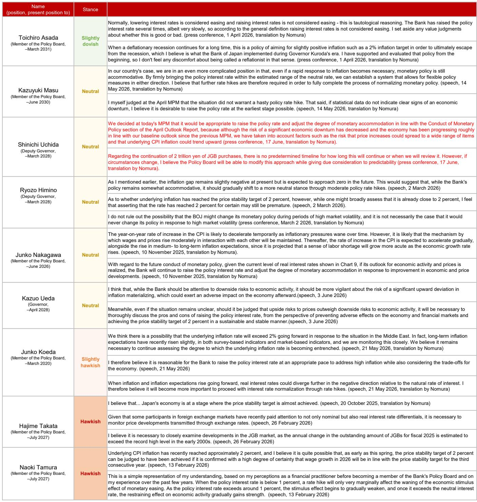
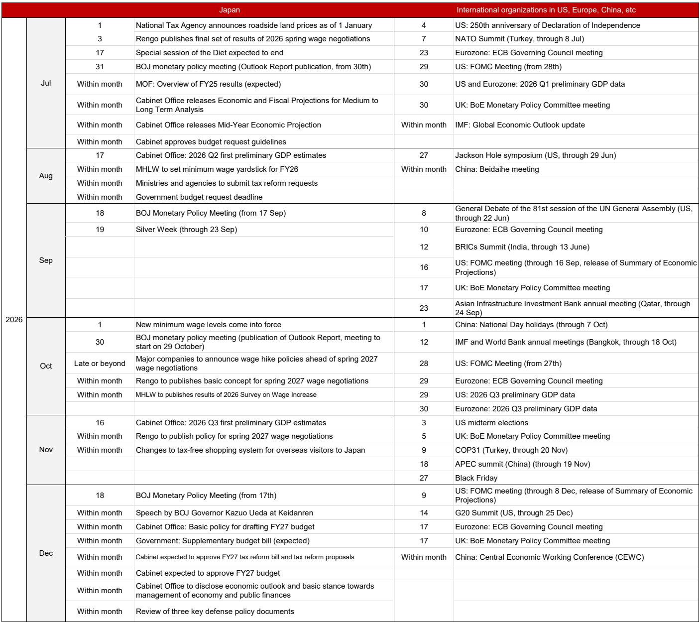
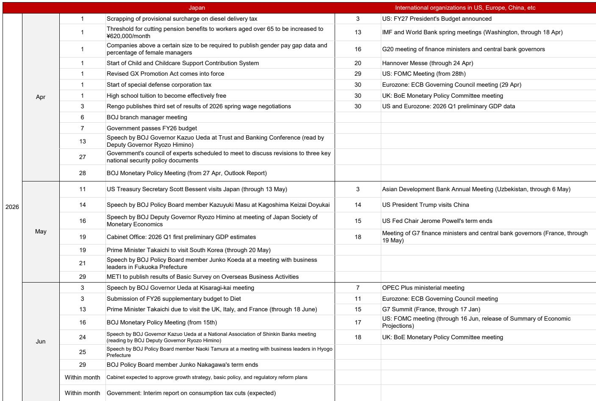

# NOM：日本加息周期已过中点，但市场真正该关注的是财政牌

当全球投资者的目光仍聚焦于日本央行何时结束负利率、加息路径是否被打断时，NOM在最新一期《日本经济周报》中给出了一个值得细品的判断：日本央行的加息周期可能已经走过了一半。更关键的是，随着6月货币政策会议尘埃落定，市场关注重心正从央行转向政府——增长战略与消费税减税将成为决定日本资产定价的下一个变量。

这份报告的核心信号并不复杂：日本经济、物价和金融条件三者目前都支持继续加息。但NOM同时指出，真正需要投资者警惕的，不是加息本身，而是财政政策的不确定性，尤其是消费税减税方案的资金来源与推进节奏。后者可能比加息更深刻地影响日本内需、通胀路径和国债定价。

以下是这份NOM研报的核心洞察与延伸思考。

## 1. 加息周期已过中点，但终点线可能比市场预期的更近

NOM在报告中明确写道：“我们认为，日本央行可能已经过了本轮加息周期的中点。” 这一判断基于三个关键信号：一是政策委员会成员Asada投下反对票，暗示鸽派力量正在集结；二是央行对经济风险的评估出现微妙变化，认为“经济显著放缓的风险相比此前有所下降”；三是央行在措辞上删除了“实际利率处于极低水平”的表述，代之以“金融条件一直宽松”。

> **KC评论：** 措辞调整看似微小，但信号意义很强。央行主动降低对宽松程度的评估，意味着未来加息的理由将更依赖数据而非“补涨”逻辑。这对市场意味着，加息节奏可能从“追赶式”转向“确认式”，每一次加息都需要更强的通胀或增长数据支撑。

NOM维持其基准情景：2026年12月和2027年6月各加息一次，共两次。风险情景则是在此基础上再加一次，时间点落在2026年10月、2027年3-4月和9-10月。无论哪种情景，加息周期的终点都指向2027年中后期，而非市场此前预期的2028年或更晚。

## 2. 中东局势缓和，但供应链约束不会立刻消失

一个容易被忽视的细节是，NOM对中东局势的评估并非“问题解决”，而是“问题开始缓解”。美国与伊朗于6月18日签署谅解备忘录，但霍尔木兹海峡的油轮通行量已从冲突前的每天60-70艘骤降至几乎为零。即使邻近的曼德海峡通行量在3月下旬后略有回升，但替代航线远未建立。

这意味着，即便地缘政治风险溢价下降，量化的供应约束——即原油和石油产品的进口量——仍将在一段时间内压制日本经济的复苏弹性。NOM提醒投资者关注两个关键指标：石油进口量的恢复程度，以及主要经济体制造业面临的原材料采购延迟幅度。

> **KC评论：** 市场往往对“停火”或“谅解”这类消息反应过度乐观，但供应链的物理恢复需要时间。日本作为能源进口依赖度极高的经济体，其通胀与增长对原油供应的敏感度远高于美国或欧洲。这份报告提醒我们，不要因为油价短期回落就忽视供应端风险。

## 3. 通胀峰值可能在2027年一季度，但上行风险不容小觑

NOM预计，日本核心CPI通胀可能在2027年一季度见顶。这一判断基于价格传导的时滞：日元计价的进口价格已大幅上涨，这些成本将从上游（PPI）向下游（CPI）逐步传导，整个过程大约需要6-9个月。

但报告同时指出，日本央行在6月声明中明确警告“核心CPI存在向上偏离2%目标的风险”。这意味着，即便通胀如预期在2027年一季度见顶，其峰值水平可能高于央行和市场的当前预测。如果这一风险兑现，加息的终点利率也将相应上调。

## 4. 贷款增速跑赢通胀，金融条件仍在鼓励借贷

一个支持继续加息的硬数据是贷款增长。日本银行和信用金库的贷款余额同比增长6%，超过CPI涨幅。城市银行的贷款增长尤为显著。住房贷款也在持续增长，尽管加息推高了房贷利率，但房价上涨抵消了部分利率压力，贷款需求依然旺盛。

NOM认为，持续的贷款增长是“政策利率低于中性利率”的直接证据。只要贷款增速保持高位，央行就有理由继续加息，直到金融条件从“宽松”转向“中性”或“紧缩”。

## 5. 财政牌才是下半年的最大变量：370万亿投资与消费税减税

如果说加息是“已知的未知”，那么财政政策就是“未知的未知”。NOM明确指出，随着6月货币政策会议结束，市场焦点将转向政府的增长战略和消费税减税方案。

增长战略方面，日本增长战略委员会正在考虑在17个战略领域实现约370万亿日元（约合2.5万亿美元）的官民投资，时间跨度为2027-2040年。作为对比，2023年启动的绿色转型（GX）政策10年官民投资目标为150万亿日元。这意味着新战略的年均投资规模约为GX的1.8倍。

> **KC评论：** 370万亿的规模听起来很大，但关键在于公共部门支持的比例和资金来源。如果大部分靠财政赤字融资，日本国债收益率将面临上行压力，进而倒逼央行调整政策。如果主要靠民间资本，则需要足够的政策激励和回报预期。这份报告没有给出明确的资金来源方案，这恰恰是投资者最需要跟踪的变量。

消费税减税方面，自民党方案包括：2027年4月起将食品饮料消费税降至1%，并在2027年和2028年秋季实施与收入挂钩的现金发放，总额相当于消费税收入的1%（约6000亿日元）。但反对党强烈反对这一方案，尤其是资金缺口问题——每年约5万亿日元的成本尚未明确来源。

## 6. 报告尚未完全回答的关键问题：消费税减税的资金来源与政治博弈

NOM在报告中坦承，消费税减税的资金来源“仍未明确”。一个可能的选项是利用外汇基金特别账户（FEFSA）的盈余资金，但该账户每年的盈余规模有限，且部分已被指定用于外汇操作。另一个选项是发行专项国债，但这与自民党“不依赖赤字融资债券”的承诺相矛盾。

更复杂的是政治博弈。自民党在众议院拥有三分之二多数，理论上可以强行通过减税法案。但若该法案未能在超党派的国家社会保障委员会中获得充分讨论，强行通过将损害执政党的公信力。国民民主党（DPP）提出了一个相对接近的方案，但要求现金发放时间提前至2026年底，而非2027年秋季。两党能否在6月底前达成一致，将直接决定减税方案的推进节奏。

## 7. 给读者的观察框架：三个维度跟踪日本资产定价

基于NOM这份报告的逻辑，我们建议投资者从以下三个维度建立观察框架：

第一，盯住贷款增速与通胀的剪刀差。只要贷款增速持续高于CPI，央行就有充分理由继续加息。这一指标的月度变化比任何央行官员的言论都更具信号意义。

第二，关注消费税减税方案的最终形态。减税幅度、资金来源和推进节奏将直接影响日本内需、通胀预期和国债供需。如果减税方案以赤字融资为主，长端利率上行风险将显著增加。

第三，不要忽视中东供应链的恢复速度。即使地缘政治风险下降，原油进口量的恢复也需要时间。这一变量将决定日本通胀的“尾部风险”——即通胀超预期上行的概率。

---

**这些判断背后，还有哪些图表和假设没有展开？** NOM对贷款增速与中性利率的关系作了更细致的拆解，对消费税减税的政治博弈给出了不同情景下的推演，还提供了日本经济指标的最新数据图表合集。这些内容在完整报告中以10-40页的篇幅呈现，每天由AI agent与人工review生成，既方便喂给AI，也方便人工快速把握市场动态。欢迎来到我们的知识星球微信群继续讨论，每天获取最新的国际投行中文摘要与KC评论。

Personal reading notes and learning share only. Not investment advice.

