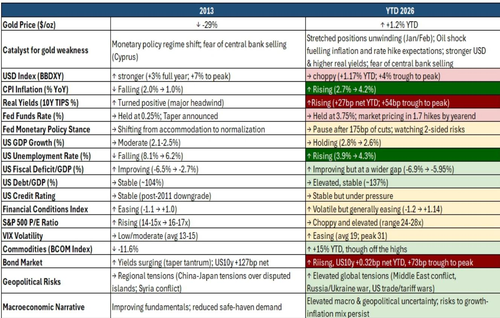
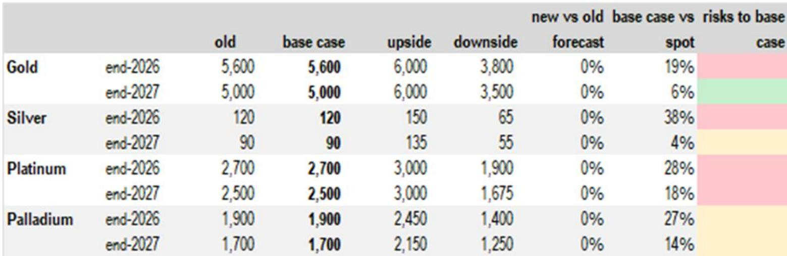
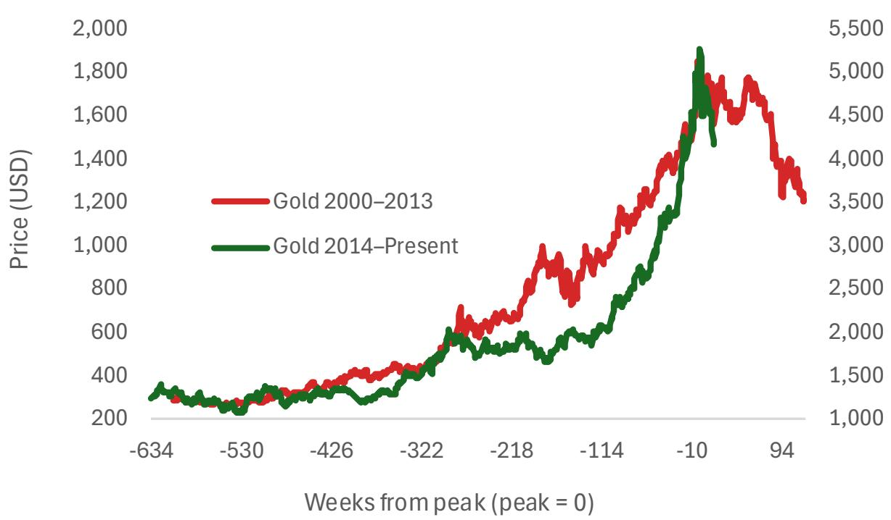

# Gold Is Trapped Between a Hawkish Fed and a Structural Bull Case — and That Creates the Most Dangerous Opportunity in Precious Metals

The most dangerous position in precious metals right now is not being long or short. It is being certain. Gold has entered what a global investment bank report calls a "no-man's land" — a zone where the short-term macro headwinds are real, but the long-term structural drivers are arguably stronger than at any point in the last decade. The market is pricing in further rate hikes, real yields are climbing, and the dollar remains resilient. Yet the underlying case for gold has not broken. It has been postponed. The critical question for any serious portfolio allocator is whether this consolidation is a pause before a breakout or the beginning of a deeper structural unwind.

The answer depends entirely on which timeframe you are willing to bet on. The report makes clear that downside risks to its own views have increased materially. That is an honest admission, and it should command attention. But the report also shows that the composition of gold demand has shifted in ways that make a simple replay of the 2013 bear market unlikely. The buyers are different. The motivations are different. And the macro backdrop, while superficially similar in some respects, is fundamentally distinct in others.

This article will parse the report's logic, extend its implications into a strategic framework, and identify the unresolved questions that any investor must answer before placing a bet on precious metals today.

## The Current Gold Sell-Off Looks Like 2013 on the Surface, But the Underlying Regime Is Fundamentally Different

The temptation to draw a straight line from today's gold price action to the 2013 bear market is understandable. In both episodes, gold came under pressure from rising real yields, a stronger dollar, and fears that central banks might sell reserves. In 2013, the catalyst was the taper tantrum and the Cyprus crisis. Today, it is a combination of stretched positioning unwinding in early 2026, an oil shock fueling inflation and rate hike expectations, and persistent chatter about potential central bank selling.

But the report's comparative table reveals a critical divergence. In 2013, CPI inflation was falling from 2.0 percent to 1.0 percent. Today, inflation is rising from 2.7 percent to 4.2 percent. In 2013, the unemployment rate was falling from 8.1 percent to 6.2 percent. Today, it is rising from 3.9 percent to 4.3 percent. In 2013, the Fed was shifting from accommodation to normalization. Today, the Fed is on pause after 175 basis points of cuts, watching two-sided risks. In 2013, the fiscal deficit was improving sharply from -6.5 percent to -2.7 percent of GDP. Today, the deficit is improving but from a much wider gap, and US debt-to-GDP is elevated at roughly 137 percent versus 104 percent in 2013.

The macro narrative in 2013 was one of improving fundamentals and reduced safe-haven demand. Today, the narrative is elevated macro and geopolitical uncertainty with persistent risks to the growth-inflation mix. That is not a minor difference. It is a regime difference. The 2013 sell-off occurred because the macro environment was genuinely improving. The current sell-off is occurring because the macro environment remains unstable, but the market is temporarily fixated on the hawkish tail of the distribution.

The implication is straightforward: if the macro environment deteriorates further — if growth softens or inflation proves stickier than expected — gold's reprieve from its structural drivers may be shorter than many expect. The report notes that US economic data prints will be a key focus in the coming months, with any signs of softening likely to encourage re-engagement in gold. That is the pivot point.

## The Composition of Gold Demand Has Shifted Irreversibly, Making the Market More Resilient to Western Rate Cycles

One of the most underappreciated developments in the gold market is the changing identity of the marginal buyer. The report provides compelling evidence that Asia now accounts for over 70 percent of physical investment demand. Total bar and coin demand has held up despite record high prices, and strong growth has been seen across most regions. This is not a market that is solely dependent on Western ETF flows or speculative positioning on COMEX.

The official sector is equally important. The report shows that the composition of top central bank buyers in 2022 is different from the top buyers in 2026 year-to-date. As some central banks slow down purchases, others have room to step up. Poland and Turkey are highlighted, but the broader point is that central bank gold buying has become a diversified, multi-year structural trend rather than a cyclical trade. The report also notes that growth in assets of other official institutions suggests there is room for them to also diversify into gold.

This structural shift has a powerful implication for price dynamics. It means that the gold market is less sensitive to the US rate cycle than it was a decade ago. A buyer in Asia or a central bank in Eastern Europe does not make allocation decisions based on the Fed funds rate in the same way that a macro hedge fund does. Their time horizons are longer. Their motivations include de-dollarization, reserve diversification, and geopolitical hedging. These are not factors that disappear when real yields rise by 50 basis points.

The report's data on the potential impact of a 1 percent increase in gold allocations is instructive. The effect depends on the speed and timing of execution, but the sheer scale of assets under management growth creates space for gold diversification that did not exist in 2013. The market as a whole remains largely underinvested. That is a structural tailwind that operates independently of the next CPI print.

## The White Precious Metals Are Not a Unified Trade — Silver and Platinum Offer Asymmetric Exposure, While Palladium Faces Existential Headwinds

The report makes a crucial distinction that many investors overlook: white precious metals remain highly correlated with gold in the short term, but their demand drivers diverge significantly. This is not a homogeneous asset class. Each metal has a different industrial exposure, a different investor base, and a different risk profile.

Silver's long-term demand story is compelling given its exposure to AI, renewable energy, and electric vehicles. But the report warns that any slowdown in industrial demand is likely to be a headwind in the near term. The key metric to watch is the gold-to-silver ratio. The report argues that this ratio is likely to struggle to revisit previous lows, meaning silver will underperform gold on a relative basis during periods of industrial weakness. That is a nuanced but important call: silver can still rise in an absolute sense if gold rallies, but its relative performance will be constrained by industrial demand concerns.

Platinum and palladium are both vulnerable to weaker auto demand, but their trajectories diverge from there. Platinum has more potential to attract investor flows in a rising gold price environment, partly because it is trading at a significant discount to gold on a historical basis. Palladium, by contrast, continues to be challenged by the increasing market share of battery electric vehicles, especially as China's exports of more affordable models continue to rise. The report's data on EV wholesale penetration in China is stark. This is not a cyclical headwind for palladium. It is a structural decline.

The actionable insight for investors is that a long gold position is not a proxy for a long precious metals position. If you want exposure to the gold thesis, buy gold. If you want to express a view on industrial demand or the energy transition, silver and platinum offer asymmetric upside — but only if you are willing to tolerate higher volatility and longer timeframes. Palladium, by contrast, looks like a value trap unless you have a specific view that the EV transition will slow dramatically.

## The Report's Unresolved Question: How Long Can the Macro Headwind Persist Before It Breaks the Structural Case?

The report is honest about its limitations. It acknowledges that downside risks to its views have increased materially and that timelines for its price forecasts may be pushed out. There is greater uncertainty on how long the current consolidation might extend. This is not a trivial caveat. It is the central analytical question that the report does not fully answer.

The reason is that the answer depends on a variable that no one can predict with confidence: the path of US economic data. The report's house view remains for Fed rate cuts from 2027, with the federal funds rate projected to decline from 3.75 percent to 2.9 percent by the end of 2028. But that forecast assumes that inflation will eventually moderate and that the economy will avoid a hard landing. If those assumptions prove wrong, the gold thesis strengthens. If they prove right, the gold thesis is merely delayed.

The unresolved question is whether the structural drivers — central bank buying, Asian demand, de-dollarization, fiscal sustainability concerns — are strong enough to carry gold through an extended period of high real yields and a hawkish Fed. The report suggests they are, but it cannot prove it because the scenario has no modern precedent. We have never seen a period of such elevated macro uncertainty combined with such a dramatic shift in the composition of gold demand. The market is navigating uncharted territory.

Investors should therefore focus on the conditions that would break the current impasse. A significant softening in US economic data is the most obvious catalyst. But so is a sharp equity selloff that triggers a liquidity event and forces a rebalancing out of gold. The report lists rebalancing, a sharp equity selloff, significantly lower central bank purchases, better-than-expected US growth, a hawkish Fed, and higher real rates as downside risks. Each of these scenarios would require a different response from a portfolio perspective.

## A Decision Framework for Precious Metals Allocation in a No-Man's Land Market

For investors trying to navigate this environment, the report provides enough data to construct a decision framework. The framework should be based on three variables: your macro outlook, your time horizon, and your conviction in the structural thesis.

If your macro outlook is that the US economy will soften in the next six to twelve months, then gold should be a core holding. The report explicitly states that any signs of softening in US economic data are likely to encourage re-engagement in gold. In this scenario, silver and platinum offer leveraged upside, but with higher volatility. Palladium should be avoided unless you have a specific contrarian view.

If your macro outlook is that the Fed will remain hawkish and the economy will hold up, then gold is likely to remain in a consolidation range. In this scenario, the opportunity cost of holding gold is real, but the structural thesis suggests that the downside is limited. The report's base case for gold at end-2026 is $5,600 per ounce, which implies roughly 19 percent upside from current levels. The downside case is $3,800. That is a wide range, and it reflects genuine uncertainty.

If your time horizon is longer than two years, the structural thesis becomes increasingly compelling. The report's data on fiscal sustainability, debt-to-GDP ratios, and the growing list of long-term concerns — stagflation risks, de-dollarization, shifting global trade relationships, Fed independence and credibility, higher volatility and potential liquidity issues — all point to a multi-year environment that is favorable for gold. The report's price forecasts for end-2027 show gold at $5,000, silver at $90, and platinum at $2,500. These are not explosive returns, but they represent meaningful appreciation from current levels.

The most important decision for most investors is whether to treat the current consolidation as an opportunity to build positions or a reason to wait. The report does not give a definitive answer, but it provides enough evidence to tilt the scales toward the former. The structural drivers are real. The composition of demand has shifted. The macro headwinds, while significant, are cyclical. The question is not whether the gold thesis will play out. The question is whether you have the patience and the conviction to hold through the noise.

Join the community to read the full report and review the original charts.

*This article is for learning and discussion only and does not constitute investment advice.*

Personal reading notes and learning share only. Not investment advice.

