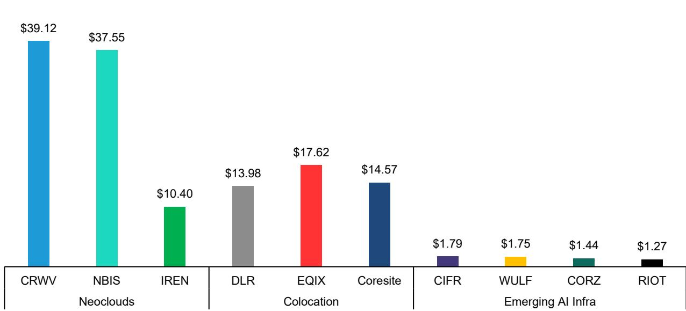
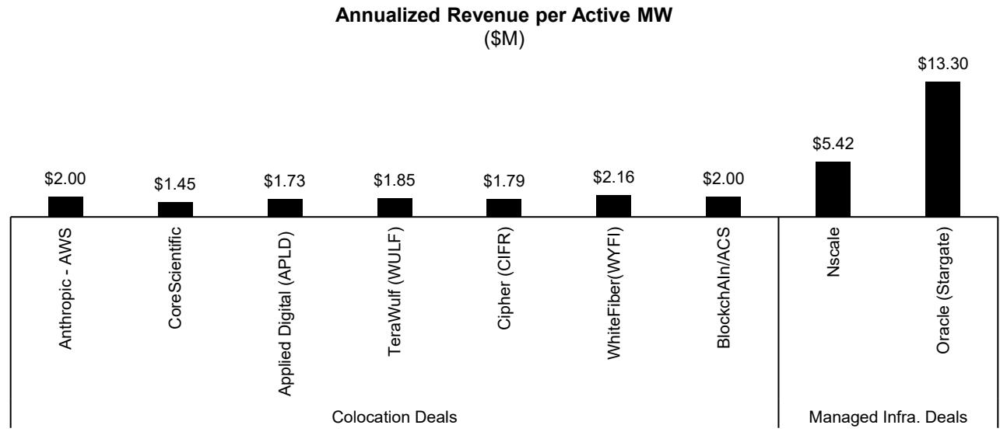
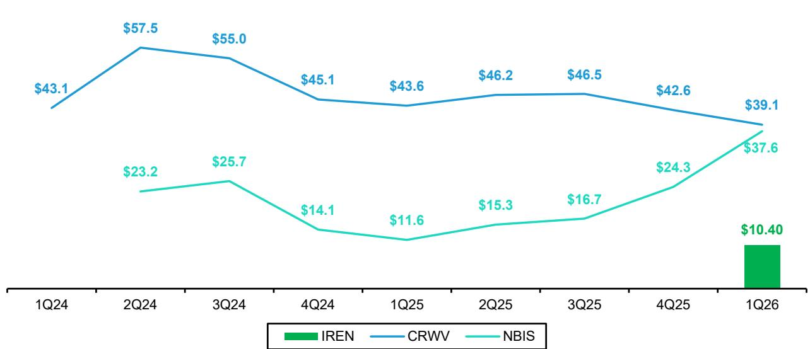
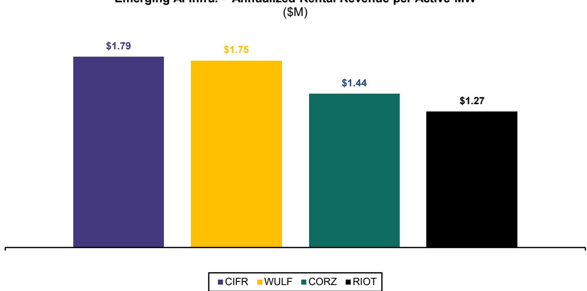
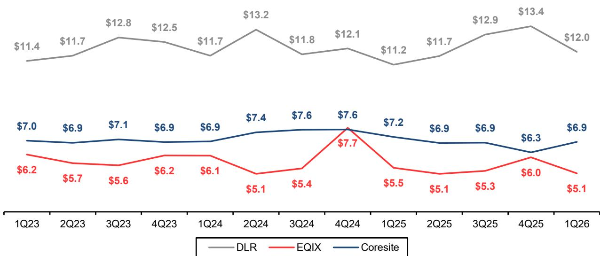
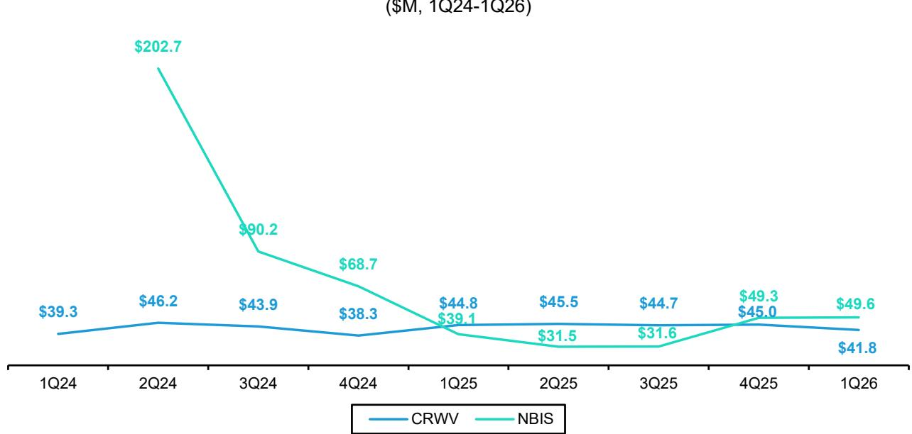
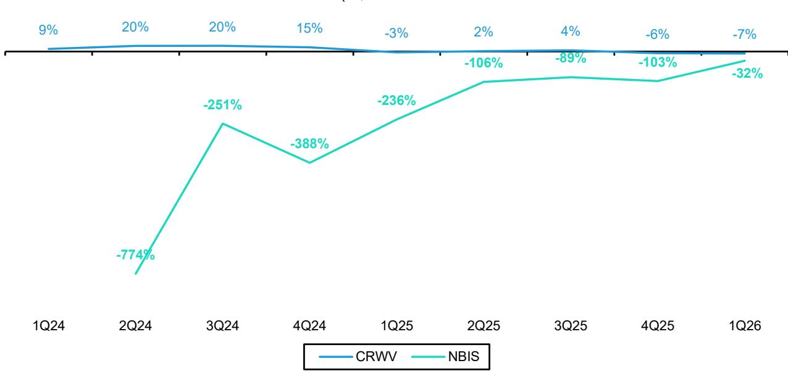
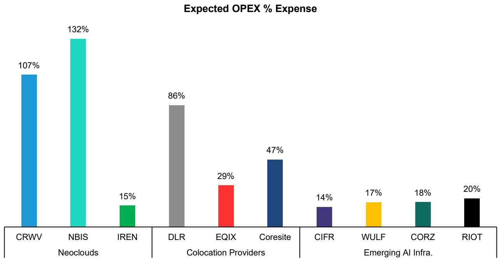
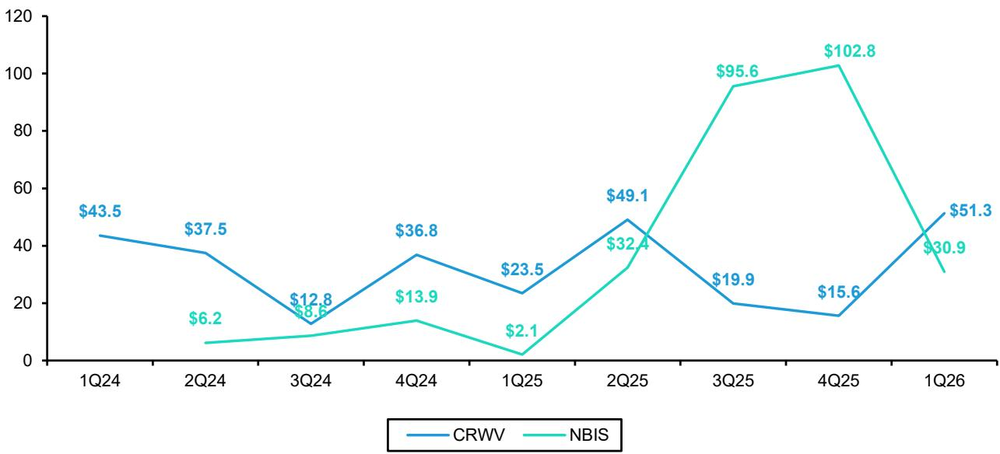

# US Communications Infrastructure & Global Digital Assets

# Data Centers & Neoclouds: How much is a megawatt worth?

Madison Rezaei
+1 917 344 8622
madison.rezaei@bernsteinsg.com

Gautam Chhugani
+91 226 842 1416
gautam.chhugani@bernsteinsg.com

Nancy Wu
+1 917 344 8545
nancy.wu@bernsteinsg.com

Mahika Sapra
+91 226 842 1408
mahika.sapra@bernsteinsg.com

Sanskar Chindalia
+91 226 842 1445
sanskar.chindalia@bernsteinsg.com

Harsh Misra
+91 226 842 1457
harsh.misra@bernsteinsg.com

Almost every time a splashy GPU cloud or colocation contract hits, we get questions on whether that is a “good deal”. Today, we look at the \$/MW of the public data center and neocloud companies, in addition to benchmarking the publicly announced deals with other private providers. We continue to prefer the colo model to the neocloud model, but can appreciate that some neocloud contracts are quite attractive, particularly when the neocloud owns its own real estate.

Revenue/MW is a frequently assessed metric for both colo and cloud deals (not always rightly so). It can vary dramatically by business model, location of capacity, time to service, contract duration, and size of deal. We've seen ranges from <\$1M to \$55M/MW. Generally, neocloud models look attractive on a revenue basis with very high \$/MW, but when you layer in opex, actual performance varies.

Colocation model: landlord-style REITs sell powered capacity on long-term leases - either on more of a retail or wholesale basis. They serve a broad base: enterprise, hyperscaler, and sometimes neocloud customers, anchoring pricing and utilization. Increasingly, we see emerging AI infra providers (WULF, CIFR) playing with this model. The highest revenue per MW in this space unsurprisingly belongs to EQIX (\$5M/MW), who has a retail-focused model, layering services and interconnection revenue on top of a valuable major metro footprint. More wholesale-type models end up in the \$3-\$4M range, with the emerging entrants lower on a per-MW basis than the established REITs. This likely has to do with available capacity and location—DLR, EQIX, and CoreSite all have strong footprints in top markets and can sell capacity immediately, whereas the emerging players are in more rural areas and mostly preselling for yet-to-be-completed builds.

GPU cloud model: The main players in this space are CRWV, NBIS, and IREN, though we are seeing other non-neocloud players announce competitive large-scale deals. Since the neoclouds are offering a vertically integrated solution, monetizing the same MWs with hardware and services on top of the real estate, the \$/MW levels are higher. Scarce/near-term capacity, fungible terms, and shorter contract durations or flexible contract-outs (for example, 90-day terms instead of traditional 5-year leases) increase the value per MW.

Return differences: Colocation providers are relatively asset-heavy but OpEx-light; while they incur the upfront cost of developing and building facilities, once a data center is stabilized, ongoing operating costs are comparatively low. A significant portion of power and facility-related OpEx is either passed through to customers or embedded within lease structures. By contrast, neocloud providers are RE-light (generally, some are building themselves) but remain capital-intensive as they bear the cost of GPU purchases and see correspondingly high CapEx levels.

Across our coverage, we continue to prefer the colo model over the cloud model for subscale providers. The emerging AI infra providers represent an interesting counterpoint to traditional REITs as they look to pursue the same model on a higher-risk, potentially higher-reward basis. Without a ton of history, it's hard to assess them on the same basis today.

## BERNSTEIN TICKER TABLE

<table><tr><td rowspan="2">Ticker</td><td rowspan="2">Rating</td><td colspan="3">22 Jun 2026</td><td rowspan="2">TTMRel.</td><td colspan="4">EBITDA (M)</td><td colspan="3">Adjusted P/E (x)</td></tr><tr><td>Cur</td><td>Closing Price</td><td>Price Target</td><td>Cur</td><td>2025A</td><td>2026E</td><td>2027E</td><td>2025A</td><td>2026E</td><td>2027E</td></tr><tr><td>DLR (Digital Realty)</td><td>O</td><td>USD</td><td>195.54</td><td>232.00</td><td>(13.7)%</td><td>USD</td><td>3.87</td><td>2.74</td><td>2.37</td><td>50.5</td><td>71.5</td><td>82.4</td></tr><tr><td>EQIX (Equinix)</td><td>O</td><td>USD</td><td>1,115.94</td><td>1,222.00</td><td>1.2%</td><td>USD</td><td>14.96</td><td>17.88</td><td>21.36</td><td>74.6</td><td>62.4</td><td>52.2</td></tr><tr><td>AMT (American Tower)</td><td>O</td><td>USD</td><td>176.43</td><td>207.00</td><td>(44.1)%</td><td>USD</td><td>5.40</td><td>6.60</td><td>7.08</td><td>32.7</td><td>26.7</td><td>24.9</td></tr><tr><td>CRWV (CoreWeave)</td><td>U</td><td>USD</td><td>111.29</td><td>67.00</td><td>(64.6)%</td><td>USD</td><td>(1.20)</td><td>(4.20)</td><td>(2.41)</td><td>38.4</td><td>15.1</td><td>8.0</td></tr><tr><td>IREN (IREN)</td><td>O</td><td>USD</td><td>56.87</td><td>100.00</td><td>418.0%</td><td>USD</td><td>269.67</td><td>233.06</td><td>1,296</td><td>81.9</td><td>94.7</td><td>17.0</td></tr><tr><td>CIFR (Cipher)</td><td>O</td><td>USD</td><td>28.14</td><td>32.00</td><td>617.3%</td><td>USD</td><td>22.24</td><td>50.72</td><td>636.93</td><td>700.1</td><td>306.9</td><td>24.4</td></tr><tr><td>WULF (TeraWulf)</td><td>O</td><td>USD</td><td>28.31</td><td>36.00</td><td>631.7%</td><td>USD</td><td>(23.11)</td><td>115.77</td><td>768.30</td><td>(17.0)</td><td>(16.3)</td><td>(49.1)</td></tr><tr><td>CORZ (Core Scientific)</td><td>O</td><td>USD</td><td>29.08</td><td>32.00</td><td>120.0%</td><td>USD</td><td>(29.66)</td><td>276.21</td><td>630.77</td><td>(33.0)</td><td>(31.5)</td><td>111.8</td></tr><tr><td>RIOT (Riot)</td><td>O</td><td>USD</td><td>28.63</td><td>30.00</td><td>174.3%</td><td>USD</td><td>164.30</td><td>281.69</td><td>405.58</td><td>(14.7)</td><td>21.0</td><td>(37.0)</td></tr><tr><td>SPX</td><td></td><td></td><td>7,472.79</td><td></td><td></td><td></td><td></td><td></td><td></td><td></td><td></td><td></td></tr></table>

O - Outperform, M - Market-Perform, U - Underperform, NR - Not Rated, CS - Coverage Suspended

DLR, EQIX, AMT, CRWV estimate is Adjusted EPS; CRWV, IREN, CIFR valuation is EV/EBITDA (x); WULF, CORZ, RIOT valuation is Reported P/E (x); Source: Bloomberg, Bernstein estimates and analysis.

## INVESTMENT IMPLICATIONS

U.S. Communications Infrastructure: We value DLR on a Price to Adjusted Funds From Operations (AFFO) per share multiple. Our \$232 price target is based on 27x our 2027E AFFO per share of \$8.52.

We value EQIX on a Price to Adjusted Funds From Operations (AFFO) per share multiple. Our \$1,222 price target is based on 25x our 2027E AFFO per share of \$48.63.

We value AMT on a Price to NTM Adjusted Funds From Operations (AFFO) per share multiple. Our \$207 price target is based on 18x our 2027E AFFO per share of \$11.49.

We value CRWV on an EV/Adjusted EBIT multiple. Our \$67 price target is based on an Enterprise Value calculated as 28.4x our 2027E Adj. EBIT per share of \$5.81.

Bitcoin Miners/Emerging AI Infra: Crypto miners remain well positioned to solve ‘time to compute’ given their planned 30GW power portfolio and operating ability to deliver ‘warm powered shells’ in time. Over the past two years, miners have contracted 6 GW of power capacity to hyperscalers, neoclouds and AI-chip manufacturers across 17 deals worth over \$110Bn. The contracted 6 GW represents \~20% of the 30 GW pipeline of crypto miners, allowing runway for new contracts. We rate WULF Outperform (PT\$36), CIFR Outperform (PT\$32), IREN Outperform (PT\$100), CORZ Outperform (PT\$32), RIOT Outperform (PT\$30), CLSK Outperform (PT\$24), and MARA Market-Perform (PT\$17)

Emerging AI & IREN figures are calculated based on a per contract basis.

## DETAILS

A number of factors could impact the unit economics of how much value can be extracted from a megawatt of active power, depending on the operating model, customer mix, and service stack of the business. While landlord-style colocation REITs sell primarily powered capacity via long-term leases, neoclouds like CoreWeave are vertically integrated GPU cloud providers that monetize the same one MW with more IT and software services on top. Specifically, Digital Realty, Equinix, and CoreSite focus on 2-15 year leases for blocks of capacity, trading away usage volatility for stable, lower-margin lease revenue per MW. On the other hand, CoreWeave buys or leases the same physical capacity (from other colo providers), fills it with GPUs and resells compute with platform tooling, enabling higher revenue density per MW. They are capturing value from both the infrastructure and application layer. Lastly, emerging AI infra players (former crypto miners) span both ends of the spectrum, with IREN operating a vertically integrated neocloud model while other players (CIFR, WULF, CORZ etc.) follow a colocation-based, power-landlord style model which drives divergence in revenue intensity per MW despite access to similar underlying power assets.

In this note, we examine per-MW revenue, OpEx, and CapEx across our coverage and the two different business models—colocation providers and neoclouds—to highlight how customer mix, stack position, scale, and capital intensity drive wide dispersion in unit economics.

EXHIBIT 1: Resume Annualized Revenue per Active MW (\$M) per Segments  
Annualized Revenue per Active MW (\$M)  
  
Source: Company filings, Bernstein Analysis and Estimates

EXHIBIT 2: Annualized Revenue per Active MW (\$M) by Other AI Contracts  
  
Source: Company filings and public disclosures, Bernstein Analysis and Estimates

## CUSTOMER MIX AND PRICING POWER

\- Colocation model: Digital Realty, Equinix, and CoreSite serve a broad mix of enterprise, network, and hyperscaler customers, while CoreWeave is concentrated in AI-heavy workloads needing dense GPUs. This customer composition changes average utilization, term, and pricing structures per MW. Equinix and CoreSite have historically skewed towards retail colo and interconnection, with many smaller customers at lower power densities but high cross-connect and networking revenue; this is evident in their revenue per MW figures of \$4.7M and \$3.8M (3-yr average basis), compared with Digital Realty's heavier weight towards wholesale and hyperscaler deals with large tenants, resulting in lower effective pricing per MW of \$3.4M.

\- GPU cloud model: In comparison, neoclouds like CoreWeave and Nebius have higher revenue-per-MW figures of \$20.8M and \$8.4M respectively (on average from FY24-25), due to their customer base of mostly AI labs, startups, and enterprises that need large pools of GPUs for training and inference. They can sustain higher, near 24/7 utilization and maximize monetizable compute hours, allowing them to sign large multi-year deals at premium rates and ultimately driving relatively higher revenue per deployed MW. IREN's customer mix, on the other hand, is anchored by long-term hyperscaler contracts (Microsoft, NVIDIA) along with enterprise clients at their Canada sites, with revenue-per-MW \$10.4 Mn/IT-MW basis contracted capacity, positioning it close to neocloud peers CRWV and NBIS. IREN's position is contingent on timely delivery to hyperscale clients and further buildout of their 5.8 GW owned global power portfolio.

\- AI infrastructure players (CIFR, WULF, CORZ etc.) serve both hyperscalers and neoclouds under long duration (10-15 year) colocation agreements that result in stable, but comparatively lower revenue, at \$1.75 Mn/IT-MW reflecting landlord style monetization of power capacity. WULF and CORZ currently have contracts with neoclouds such as CoreWeave, Core 42 and Fluidstack (backed by Google) while CIFR fares better with 2/3 long term contracts with AWS and the remaining with Google backed Fluidstack. In the colocation business, obtaining hyperscaler rent guarantees and/or stake through warrants acts as a major catalyst for contracts and proof of pedigree, with focus shifting to timely design, procurement and execution.

EXHIBIT 3: Colocation Prov - Annualized Q Rental Revenue per Active MW (\$M, 1Q23-1Q26)  
  
Source: Company filings, Bernstein Analysis and Estimates  
Neoclouds - Annualized Revenue per Active MW (\$M, 1Q24-1Q26)

EXHIBIT 4: Neoclouds - Annualized Q Revenue per Active MW (\$M, 1Q24-1Q26)

  
Source: Company filings, Bernstein Analysis and Estimates

EXHIBIT 5: Emerging AI Infra. - Annualized Rental Revenue per Active MW (\$M)  
Emerging AI Infra. - Annualized Rental Revenue per Active MW (\$M)  
  
Emerging AI figures are calculated based on a per contract basis.  
Source: Company filings and public announcements, Bernstein Analysis and Estimates

## WHO BEARS THE OPEX?

\- Colocation model: For Digital Realty, Equinix, and CoreSite, a significant portion of power and operating costs is either passed through to customers or structured in lease economics, whereas neoclouds incur most of the OpEx directly on their P&L. Interestingly, operating margin per MW nets out to 8.2% for Digital Realty but 66.2% for Equinix, likely due to the higher mix of retail and higher-margin interconnection business, increased pricing power, and a less development-heavy P&L.

\- GPU cloud model: On the other hand, neoclouds buy power, operate the IT stack, and bundle these services into the compute price. They also bear the cost of GPU depreciation, orchestration software, and support engineering, which also sit as a layer on top of the physical infrastructure cost, leading to a comparatively higher OpEx per MW figure. Notably, while the three colocation REITs incur an average of \$2.2M of OpEx per MW, CoreWeave and Nebius post a whopping \$18.6M and \$33.3M respectively, on average annually from FY24-25. CoreWeave's operating margin per MW, at 10.8%, is within range of Digital Realty, while Nebius is still earlier stage and not yet breaking even on a per-MW basis. IREN bears the full OpEx including power procurement, GPU depreciation, and cloud operations, driving higher absolute OpEx per MW but also higher revenue capture.

\- Emerging AI infra: The distinction is evident here as well: Companies like CIFR, WULF, CORZ enter into long-term contracts in the form of gross net deals (typically \~70-90% NOI margins) or triple net (NNN) deals (\~100% NOI margin), and pass through either most or all power and operating costs to tenants resulting in structurally lower OpEx per MW and higher EBITDA margins at the asset level. The average margin across bitcoin miners pivoting to AI colocation deals is \~85%, expected to improve as the companies land better contracts (progressing towards triple net) with proven execution.

## SCALE, UTILIZATION, AND MARGINS

\- Colocation model: Digital Realty and Equinix both have large global footprints with relatively mature utilization patterns, while neoclouds are still in rapid growth and scaling into high-demand AI workloads. Both dynamics affect revenue intensity and the efficiency of OpEx per MW. Large REITs aim for high occupancy but still carry some underutilized capacity and development pipeline, so some MW of "active" power may not yet be fully revenue-generating, diluting revenue per MW but supporting long-term growth. Their OpEx is spread across a mix of stabilized and ramping facilities—which explains Digital Realty's relatively lower per-MW margin when compared with Equinix.

\- GPU cloud model: Neoclouds have achieved strong top-line growth on the back of building concentrated GPU footprints as AI demand surged, but the high revenue per MW also requires intensive spend on infrastructure and networking. In effect, the colocation REITs in our coverage optimize for steady, lower-risk returns on capital per MW, while neoclouds optimize for high-growth, higher-risk, and the unit economics reflect those different objectives and risk profiles. Specifically, IREN has expanded from a pure North American play into a global firm with a total of 5.8 GW owned power capacity as its USP with site acquisitions in Europe (Nostrum acquisition) and Australia. IREN's revenue is expected to improve with time and scale as utilization ramps, remaining contingent on execution of cloud deployment cycle and customer demand for enterprise scale compute. We see improvement in deal terms in the NVIDIA contract, (vs MSFT contract, assuming PUE for air cooled capacity to be 1.2) as revenue per IT-MW increased from \$9.5 Mn/IT-MW to \$14 Mn/IT-MW.

\- As for emerging AI infra firms, WULF has a multi-state footprint in the US and now has contracts with neoclouds Core42 and Fluidstack (Google-backed) and has begun delivering data rooms. CIFR's sites are concentrated in Texas with nascent diversification with long term contracts with Fluidstack (Google) and AWS (2 separate contracts) - AWS returning as tenant for a deal is evidence of trust placed in CIFR's execution capability, with delivery slated to start in Q4CY26. Both CIFR and WULF demonstrate REIT-like characteristics with high visibility, contract-backed utilization and triple net (NNN) EBITDA margins (\~80-95%) as assets stabilize, and future upside contingent on converting owned power sites into revenue-generating colocation contracts.

EXHIBIT 6: Colocation Prov - Annualized Q OPEX per Active MW (\$M, 1Q23-1Q26)  
Colocation Providers - Annualized OPEX per Active MW (\$M, 1Q23-1Q26)  
  
Source: Company filings, Bernstein Analysis and Estimates

EXHIBIT 7: Colocation Prov - Operating Margin per Active MW (%, 1Q23-1Q26)  
Colocation Providers - Operating Margin per Active MW (% , 1Q23-1Q26)  
  
Source: Company filings, Bernstein Analysis and Estimates

EXHIBIT 8: Neoclouds - Annualized Q OPEX per Active MW (\$M, 1Q24-1Q26)  
Neoclouds - Annualized OPEX per Active MW (\$M, 1Q24-1Q26)  
  
Source: Company filings, Bernstein Analysis and Estimates

EXHIBIT 9: Neoclouds - Operating Margin per Active MW (%, 1Q24-1Q26)  
Neoclouds - Operating Margin per Active MW
(%, 1Q24-1Q26  
  
Source: Company filings, Bernstein Analysis and Estimates  
EXHIBIT 10: Expected OPEX % Expense

  
IREN & Emerging AI Infra % are calculated based on disclosed contract's basis. For remaining figures 1Q26 figures are shown. Source: Company filings, Bernstein Analysis and Estimates

## ASSET MIX AND CAPITAL INTENSITY

Data center REITs invest heavily in land, buildings, and core infrastructure (power distribution, cooling) and then lease capacity to tenants, recovering capital over long contracts; their revenue per MW reflects rent plus fees with little IT value-add. Neoclouds often lease the data hall capacity from REITs and invest their balance sheet in GPUs, networking, and software, so their revenue per MW of power includes returns on both leased physical capacity and owned IT assets. This lease-versus-owned split means that some OpEx per MW that would show up in a landlord's numbers is effectively embedded in a tenant's rent and does not directly appear in the neocloud's OpEx, while GPU depreciation and software operations make up OpEx per MW for the neocloud. Accordingly, Digital Realty's CapEx per MW remains the lowest at \$23.4M, while Equinix's \$58.1M sits closer to the neoclouds—with CoreWeave and Nebius at \$40.4M and \$54.1M respectively.

EXHIBIT 11: Neoclouds - CAPEX per New Active MW (\$M, 1Q24-1Q26)  
Neoclouds - CAPEX per New Active MW (\$M, 1Q24-1Q26)  
  
Source: Company filings, Bernstein Analysis and Estimates

Across all firms (IREN, CIFR, WULF, CORZ), the major investment is similar to data center REITs in the powered shell for AI capacity, with IREN going a step further and incurring GPU capex under its vertically integrated cloud model. IREN's total capex (powered shell plus GPUs) comes to \~\$45M/MW for its liquid cooled Microsoft campus whereas CIFR and WULF operate with lower infrastructure capex intensity (\~\$8-12M/MW) as tenants bring GPUs and IT stack, positioning them as capital-light "power landlords" with faster payback cycles and infrastructure-style returns.

## I. REQUIRED DISCLOSURES

References to "Bernstein" or the "Firm" in these disclosures relate to the following entities: Bernstein Institutional Services LLC (April 1, 2024 onwards), Bernstein & Co., LLC (pre April 1, 2024), Bernstein Autonomous LLP, BSG France S.A. (April 1, 2024 onwards), Bernstein (Hong Kong) Limited 盛博香港有限公司, Bernstein (Canada) Limited, Bernstein (India) Private Limited (SEBI registration no. INH000006378), Bernstein (Singapore) Private Limited, Bernstein Japan KK (サンフォード・C・バーンスタイン株式会社) and analysts employed by SG Africa Technologies & Services to produce Bernstein under a Global Services Agreement in place between Bernstein and SG.

Bernstein is part of a joint venture between SG (SG) and AllianceBernstein, L.P. (AB). Unless specifically noted otherwise, for purposes of these disclosures, references to Bernstein's “affiliates” relate to both SG and AB and their respective affiliates.

## VALUATION METHODOLOGY

This research publication covers six or more companies. For valuation methodology and other company disclosures: Please visit: https://bernstein-autonomous.bluematrix.com/sellside/Disclosures.action.

Or, you can also write to the Director of Compliance, Bernstein Institutional Services LLC, 245 Park Avenue, New York, NY 10167.

## RISKS

This research publication covers six or more companies. For risks and other company disclosures:

Please visit: https://bernstein-autonomous.bluematrix.com/sellside/Disclosures.action.

Or, you can also write to the Director of Compliance, Bernstein Institutional Services LLC, 245 Park Avenue, New York, NY 10167.

RATINGS DEFINITIONS, BENCHMARKS AND DISTRIBUTION

## EQUITY RATINGS DEFINITIONS

## Bernstein brand

The Bernstein brand rates stocks based on forecasts of relative performance for the next 12 months versus the S&P 500 for stocks listed on the U.S. and Canadian exchanges, versus the Bloomberg Europe Developed Markets Large and Mid Cap Price Return Index EUR (EDME) for stocks listed on the European exchanges and emerging markets exchanges outside of the Asia Pacific region, versus the Bloomberg Japan Large and Mid Cap Price Return Index USD (JPL) for stocks listed on the Japanese exchanges, and versus the Bloomberg Asia ex-Japan Large and Mid Cap Price Return Index (ASIAX) for stocks listed on the Asian (ex-Japan) exchanges -unless otherwise specified.

The Bernstein brand has three categories of ratings:

\- Outperform: Stock will outpace the market index by more than 15 pp

• Market-Perform: Stock will perform in line with the market index to within +/-15 pp

• Underperform: Stock will trail the performance of the market index by more than 15 pp

Coverage Suspended: Coverage of a company under the Bernstein brand has been suspended. Ratings and price targets are suspended temporarily, are no longer current, and should therefore not be relied upon.

Not Rated: A rating assigned when the stock cannot be accurately valued, or the performance of the company accurately predicted, at the present time. The covering analyst may continue to publish research reports on the company to update investors on events and developments.

Not Covered (NC) denotes companies that are not under coverage.

Bernstein brand stock ratings are based on a 12-month time horizon.

Autonomous brand – common stocks

The Autonomous brand rates common stocks as indicated below. As our benchmarks we use the Bloomberg Europe 500 Banks And Financial Services Index (BEBANKS) and Bloomberg Europe Dev Mkt Financials Large and Mid Cap Price Ret Index EUR (EDMFI) index for developed European banks and Payments, the Bloomberg Europe 500 Insurance Index (BEINSUR) for European insurers, the S&P 500 and S&P Financials for US banks and Payments coverage, S5LIFE for US Insurance, the S&P Insurance Select Industry (SPSIINS) for US Non-Life Insurers coverage, and the Bloomberg Emerging Markets Financials Large, Mid and Small Cap Price Return Index (EMLSF) for emerging market banks and insurers and Payments. Ratings are stated relative to the sector (not the market).

The Autonomous brand has three categories of common stock ratings:

\- Outperform (OP): Stock will outpace the relevant index by more than 10 pp

\- Neutral (N): Stock will perform in line with the market index to within +/-10 pp

\- Underperform (UP): Stock will trail the performance of the relevant index by more than 10 pp

Coverage Suspended: Coverage of a company under the Autonomous research brand has been suspended. Ratings and price targets are suspended temporarily, are no longer current, and should therefore not be relied upon.

Not Rated: A rating assigned when the stock cannot be accurately valued, or the performance of the company accurately predicted, at the present time. The covering analyst may continue to publish research reports on the company to update investors on events and developments.

Those denoted as ‘Feature’ (e.g., Feature Outperform FOP, Feature Under Outperform FUP) are our core ideas.

Not Covered (NC) denotes companies that are not under coverage.

Autonomous brand common stock ratings are based on a 12-month time horizon.

## Autonomous brand – preferred stocks

The Autonomous brand has three categories of preferred stock ratings:

\- Outperform (OP): The total return of the preferred instrument is expected to outperform preferred securities of other issuers operating in similar sectors or rating categories over the next six months.

\- Neutral (N): The total return of the preferred instrument is expected to perform in line with preferred securities of other issuers operating in similar sectors or rating categories over the next six months.

\- Underperform (UP): The total return of the preferred instrument is expected to underperform preferred securities of other issuers operating in similar sectors or rating categories over the next six months.

Autonomous preferred stock ratings are based on a 6-month time horizon.

## AUTONOMOUS CREDIT RESEARCH

Where this report contains investment recommendations for credit instruments, as defined in article 3(1)(35) of the Market Abuse Regulation, the information below is presented to comply with its disclosure requirements.

The report may also include reference(s) to published opinions by other Autonomous or Bernstein analysts covering the equity securities of the issuer(s) referenced herein. Please note an investment recommendation for credit instruments published by the author(s) of this report may differ from the published view of the analyst covering equity securities for the issuer(s) contained in this report and vice versa.

## CREDIT RATINGS DEFINITIONS

The Autonomous brand has three categories of credit ratings:

\- Credit Outperform (C-OP): The total return of the Reference Credit Instrument is expected to outperform the credit spread of bonds of other issuers operating in similar sectors or rating categories over the next six months.

\- Credit Neutral (C-N): The total return of the Reference Credit Instrument is expected to perform in line with the credit spread of bonds of other issuers operating in similar sectors or rating categories over the next six months.

\- Credit Underperform (C-UP): The total return of the Reference Credit Instrument is expected to underperform the credit spread of bonds of other issuers operating in similar sectors or rating categories over the next six months.

Autonomous credit ratings are based on a 6-month time horizon.

A list of all investment recommendations produced by the author(s) of this report alongside credit ratings history are available upon request.

It is at the sole discretion of the Firm as to when to initiate, update and cease research coverage. The Firm has established, maintains and relies on information barriers to control the flow of information contained in one or more areas (i.e. the private side) within the Firm, and into other areas, units, groups or affiliates (i.e. public side) of the Firm

## DISTRIBUTION OF EQUITY RATINGS/INVESTMENT BANKING SERVICES

<table><tr><td>Equity Rating</td><td>Market Abuse Regulation (MAR) and FINRA Rating Category</td><td>Global Rating Distribution</td><td>Investment Banking Relationships*</td></tr><tr><td>Outperform</td><td>BUY</td><td>51.1%</td><td>16.5%</td></tr><tr><td>Market-Perform (Bernstein Brand) Neutral (Autonomous Brand)</td><td>HOLD</td><td>36.3%</td><td>17.8%</td></tr><tr><td>Underperform</td><td>SELL</td><td>12.6%</td><td>14.9%</td></tr></table>

\* These figures represent the percentage of companies within each equity rating category for which affiliates of Bernstein have provided investment banking services within the previous 12 months.
As of March 31, 2026. All figures are updated quarterly.

## PRICE CHARTS/ RATINGS AND PRICE TARGET HISTORY

This research publication covers six or more companies. For price chart and other company disclosures, please visit https://bernstein-autonomous.bluematrix.com/sellside/Disclosures.action or you can write to the Director of Compliance, Bernstein Institutional Services LLC, 245 Park Avenue, New York, NY 10167.

## CONFLICTS OF INTEREST

Gautam Chhugani maintains long positions in various crypto currencies.

Bernstein Autonomous LLP or BSG France SA, beneficially, has either a net long or short position of 0.5% or more of the total issued share capital of a class of common equity securities of the following MiFID eligible securities: Digital Realty Trust, Inc. and Core Scientific Inc.

SG and/or its affiliates beneficially own 0.5% or more of [the total issued share capital/any class of common equity securities] with a net [long/short] position of: Equinix, Inc. and Cipher Digital Inc.

AB and/or its affiliates beneficially own 1% or more of a class of common equity securities of the following company: Core Scientific Inc.

SG and/or its affiliates beneficially own 1% or more of a class of common equity securities of the following company: Riot Platforms Inc.

Bernstein and/or affiliates have received compensation for investment banking services in the past twelve months from CoreWeave, Inc..

An affiliate of Bernstein has received compensation for non-investment banking securities-related products or services in the previous twelve months from the following clients: Equinix, Inc. and CoreWeave, Inc..

Bernstein and/or affiliates have received compensation for non-investment banking securities-related products or services in the previous twelve months from the following clients: Equinix, Inc. and CoreWeave, Inc..

Bernstein and/or affiliates expect to receive or intend to seek compensation for investment banking services in the next three months from CoreWeave, Inc..

Certain affiliates of Bernstein act as market maker or liquidity provider in the debt securities of: Digital Realty Trust, Inc., Equinix, Inc., American Tower Corporation and Riot Platforms Inc.

Certain affiliates of Bernstein act as market maker or liquidity provider in the equities securities of: American Tower Corporation, Cipher Digital Inc and TeraWulf Inc.

Bernstein and/or affiliates had an investment banking client relationship during the past twelve months with CoreWeave, Inc..

Affiliates of Bernstein managed or co-managed in the past twelve months a public offering of securities of CoreWeave, Inc..

## OTHER MATTERS

The legal entity(ies) employing the analyst(s) listed in this report, and their location, can be determined by the country code of their phone number, as follows:

+1 Bernstein Institutional Services LLC; New York, New York, USA

+44 Bernstein Autonomous LLP; London UK

+212 SG Africa Technologies & Services; Casablanca, Morocco

+33 BSG France S.A.; Paris, France

+34 BSG France S.A.; Madrid, Spain

+41 Bernstein Autonomous LLP; Geneva, Switzerland

+49 BSG France S.A.; Frankfurt, Germany

+91 Bernstein (India) Private Limited; Mumbai, India

+852 Bernstein (Hong Kong) Limited 盛博香港有限公司; Hong Kong, China

+65 Bernstein (Singapore) Private Limited; Singapore

+81 Bernstein Japan KK; Tokyo, Japan

Where this report has been prepared by research analyst(s) employed by a non-US affiliate, such analyst(s), is/are (unless otherwise expressly noted below) not registered as associated persons of Bernstein Institutional Services LLC or any other SEC-registered broker-dealer and are not licensed or qualified as research analysts with FINRA. Accordingly, such analyst(s) may not be subject to FINRA's restrictions regarding (among other things) communications by research analysts with a subject company, interactions between research analysts and investment banking personnel, participation by research analysts in solicitation and marketing activities relating to investment banking transactions, public appearances by research analysts, and trading securities held by a research analyst account.

Where this report has been prepared by research analyst(s) employed by SG Africa Technologies & Services (part of the SG group of companies), it has been prepared on behalf of a Bernstein company under a Global Services Agreement in place between Bernstein and SG.

## CERTIFICATION

Each research analyst listed in this report, who is primarily responsible for the preparation of the content of this report, certifies that all of the views expressed in this publication accurately reflect that analyst's personal views about any and all of the subject securities or issuers and that no part of that analyst's compensation was, is, or will be, directly or indirectly, related to the specific

recommendations or views in this publication.

## II. ADDITIONAL GLOBAL CONFLICT DISCLOSURES

It is at the sole discretion of the Firm as to when to initiate, update and cease research coverage. The Firm has established, maintains and relies on information barriers to control the flow of information contained in one or more areas (i.e., the private side) within the Firm, and into other areas, units, groups or affiliates (i.e., public side) of the Firm.

## III. OTHER IMPORTANT INFORMATION AND DISCLOSURES

Separate branding is maintained for “Bernstein” and “Autonomous” research products.

\- Bernstein produces a number of different types of research products including, among others, fundamental analysis and quantitative analysis under both the “Autonomous” and “Bernstein” brands. Recommendations contained within one type of research product may differ from recommendations contained within other types of research products, whether as a result of differing time horizons, methodologies or otherwise. Furthermore, views or recommendations within a research product issued under one brand may differ from views or recommendations under the same type of research product issued under the other brand. The Research Ratings System for the two brands and other information related to those Rating Systems are included in the previous section.

\- Autonomous operates as a separate business unit within the following entities: Bernstein Institutional Services LLC, Bernstein Autonomous LLP, Bernstein (Hong Kong) Limited 盛博香港有限公司 and Bernstein (India) Private Limited. For information relating to “Autonomous” branded products (including certain Sales materials) please visit: www.autonomous.com. For information relating to Bernstein branded products please visit: www.bernsteinresearch.com.

Analysts are compensated based on aggregate contributions to the research franchise as measured by account penetration, productivity and proactivity of investment ideas. No analysts are compensated based on performance in, or contributions to, generating investment banking revenues.

This report has been produced by an independent analyst as defined in Article 3 (1)(34)(i) of EU 596/2014 Market Abuse Regulation (“MAR”) and the same article of MAR as it forms part of United Kingdom domestic law by virtue of the European Union (Withdrawal) Act 2018.

To our readers in the United States: Bernstein Institutional Services LLC, a broker-dealer registered with the U.S. Securities and Exchange Commission (“SEC”) and a member of the U.S. Financial Industry Regulatory Authority, Inc. (“FINRA”) is distributing this publication in the United States and accepts responsibility for its contents. Where this material contains an analysis of debt product(s), such material is intended only for institutional investors and is not subject to the US independence and disclosure standards applicable to debt research prepared for retail investors.

Bernstein Institutional Services LLC may act as principal for its own account or as agent for another person (including an affiliate) in sales or purchases of any security which is a subject of this report. This report does not purport to meet the objectives or needs of any specific individuals, entities or accounts.

To our readers in Canada: If this publication pertains to a Canadian domiciled company, it is being distributed in Canada by Bernstein (Canada) Limited, which is licensed and regulated by the Canadian Investment Regulatory Organization. If the publication pertains to a non-Canadian domiciled company, it is being distributed by Bernstein Institutional Services LLC, which is licensed and regulated by both the SEC and FINRA, into Canada under the International Dealers Exemption.

This document may not be passed onto any person in Canada unless that person qualifies as "permitted client" as defined in Section 1.1 of NI 31-103.

To our readers in Brazil: This report has been prepared by Bernstein Institutional Services LLC, and Banco BTG Pactual S.A. ("BTG") is responsible for the distribution of this report in Brazil.

To readers in the United Kingdom: This publication has been issued or approved for issue in the United Kingdom by Bernstein Autonomous LLP, authorised and regulated by the Financial Conduct Authority and located at 60 London Wall, London EC2M 5SH, +44 (0)20-7170-5000. Registered in England & Wales No OC343985.

This document is for distribution only to persons who (i) have professional experience in matters relating to investments falling within Article 19(5) of the Financial Services and Markets Act 2000 (Financial Promotion) Order 2005 (as amended, the “Financial Promotion Order”), (ii) are persons falling within Article 49(2)(a) to (d) (“high net worth companies, unincorporated associations, etc.”) of the Financial Promotion Order, (iii) are outside the United Kingdom, or (iv) are persons to whom an invitation or inducement to engage in investment activity (within the meaning of section 2.1 of the FSMA) in connection with the issue or sale of any securities may otherwise lawfully be communicated or caused to be communicated (all such persons together being referred to as “relevant persons”). This document is directed only at relevant persons and must not be acted on or relied on by persons who are not relevant persons. Any investment or investment activity to which this document relates is available only to relevant persons and will be engaged in only with relevant persons.

To our readers in the member states of the EEA: This publication is being distributed by BSG France SA, which is authorised and regulated by the Autorité de Contrôle Prudentiel et de Résolution (ACPR) and Autorité des Marchés Financiers (AMF).

To our readers in Hong Kong: This publication is being distributed in Hong Kong by Bernstein (Hong Kong) Limited 盛博香港有限公司, which is licensed and regulated by the Hong Kong Securities and Futures Commission (Central Entity No. AXC846) to carry out Type 4 (Advising on Securities) regulated activities and subject to the licensing conditions mentioned in the SFC Public Register (https://www.sfc.hk/publicregWeb/corp/AXC846/details)). This publication is solely for professional investors, as defined in the Securities and Futures Ordinance (Cap. 571). The purpose of this report is solely to provide an analysis of the issuers referred to in this report and is not intended for any purpose contrary to the laws of Hong Kong.

To our readers in Singapore: This publication is being distributed in Singapore by Bernstein (Singapore) Private Limited, only to accredited investors or institutional investors, as defined in the Securities and Futures Act 2001 of Singapore ("SFA"). Recipients in Singapore should contact Bernstein (Singapore) Private Limited in respect of matters arising from, or in connection with, this publication. Bernstein (Singapore) Private Limited is regulated by the Monetary Authority of Singapore and licensed under the SFA as a capital markets services licence holder for dealing in capital markets products that are securities and collective investment schemes and an exempt financial adviser for advising on, issuing and promulgating analyses and reports on securities. Bernstein (Singapore) Private Limited is registered in Singapore with Company Registration No. 20213710W and located at 8 Marina Boulevard, #12-01, Marina Bay Financial Centre, Singapore 018981, +65-6326-7000.

To our readers in the People's Republic of China: The securities referred to in this document are not being offered or sold and may not be offered or sold, directly or indirectly, in the People's Republic of China (for such purposes, not including the Hong Kong and Macau Special Administrative Regions or Taiwan, the "PRC") in contravention of any applicable laws of the PRC.

This document does not constitute an offer to sell or the solicitation of an offer to buy any securities in the PRC to any person to whom it is unlawful to make the offer or solicitation in the PRC.

We do not represent that this document may be lawfully distributed, or that any securities may be lawfully offered, in compliance with any applicable registration or other requirements in the PRC, or pursuant to an exemption available thereunder, or assume any responsibility for facilitating any such distribution or offering. In particular, no action has been taken by us which would permit a public offering of any securities or distribution of this document in the PRC. Accordingly, the securities are not being offered or sold within the PRC by means of this document or any other document. Neither this document nor any advertisement or other offering material may be distributed or published in the PRC, except under circumstances that will result in compliance with any applicable laws and regulations.

To our readers in Japan: This publication is being distributed in Japan by Bernstein Japan KK (サンフォード・C・バーンスタイン株式会社), which is registered in Japan as a Financial Instruments Business Operator with the Kanto Local Finance Bureau (registration number: The Director-General of Kanto Local Finance Bureau (FIBO) No.3387) and regulated by the Financial Services Agency. It is also a member of Investment Management Association of Japan. This publication is solely for qualified institutional investors in Japan only, as defined in Article 2, paragraph (3), items (i) of the Financial Instruments and Exchange Act.

For the institutional client readers in Japan who have been granted access to the Bernstein website by Daiwa Group Inc. ("Daiwa"), your access to this document should not be construed as meaning that Bernstein is providing you with investment advice for any purposes. Whilst Bernstein has prepared this document, your relationship is, and will remain with, Daiwa, and Bernstein has neither any contractual relationship with you nor any obligations towards you.

To our readers in Australia: Bernstein (Hong Kong) Limited 盛博香港有限公司 is responsible for distributing research in Australia. It is regulated by the Securities and Exchange Commission under U.S. laws, by the Financial Conduct Authority under U.K. laws, which differs from Australian laws. Bernstein (Hong Kong) Limited 盛博香港有限公司 is exempt from the requirement to hold an Australian financial services license under the Corporations Act 2001 in respect of the provision of the following financial services to wholesale clients:

• providing financial product advice;

• dealing in a financial product;

\- making a market for a financial product; and

• providing a custodial or depository service.

To our readers in India: This publication is being distributed in India by Bernstein (India) Private Limited (SCB India) which is licensed and regulated by Securities and Exchange Board of India ("SEBI") as a research analyst entity under the SEBI (Research Analyst) Regulations, 2014, having registration no. INH000006378 and as a stock broker having registration no. INZ000213537. SCB India is currently engaged in the business of providing research and stock broking services. Please refer to www.bernsteinresearch.in for more information.

\- SCB India is a Private limited company incorporated under the Companies Act, 2013, on April 12, 2017 bearing corporate identification number U65999MH2017FTC293762, and registered office at Level 3A, 4th Floor, First International Financial Centre, Plot Nos C-54 and C-55, G Block, Near CBI Office, Bandra Kurla Complex, Bandra (East), Mumbai 400098, Maharashtra, India (Phone No: +91-22-68421401).

\- For details of Associates (i.e., affiliates/group companies) of SCB India, kindly email MUM-BERNSTEIN-InCompliance@bernsteinsg.com.

• SCB India does not have any disciplinary history as on the date of this report.

\- Except as noted above, SCB India and/or its Associates (i.e., affiliates/group companies), the Research Analysts authoring this report, and their relatives

• do not have any financial interest in the subject company

• do not have actual/beneficial ownership of one percent or more in securities of the subject company;

\- is not engaged in any investment banking activities for Indian companies, as such;

• have not managed or co-managed a public offering in the past twelve months for any Indian companies;

\- have not received any compensation for investment banking services or merchant banking services from the subject company in the past 12 months;

• have not received compensation for brokerage services from the subject company in the past twelve months;

\- have not received any compensation or other benefits from the subject company or third party related to the specific recommendations or views in this report; and

\- do not currently, but may in the future, act as a market maker in the financial instruments of the companies covered in the report.

\- do not have any conflict of interest in the subject company as of the date of this report.

\- Except as noted above, the subject company has not been a client of SCB India during twelve months preceding the date of distribution of this research report. Neither SCB India nor its Associates (i.e., affiliates/group companies) have received compensation for products or services other than investment banking, merchant banking or brokerage services from the subject company in the past twelve months.

\- The principal research analyst(s) who prepared this report, members of the analysts' team, and members of their households are not an officer, director, employee or advisory board member of the companies covered in the report.

\- Our Compliance officer / Grievance officer is Ms. Rupal Talati, who can be reached at +91-22-68421451, or MUM-BERNSTEIN-InCompliance@bernsteinsg.com / Scbin-investorgrievance@bernsteinsg.com

\- The Research investor charter and Terms & Conditions of SCB India are available on its website and may be accessed at Bernstein (India) Private Limited (https://bernsteinresearch.in/) for your reference.

\- Disclaimer: Registration granted by SEBI, and certification from NISM, is in no way a guarantee of performance of the intermediary or provide any assurance of returns to investors. Investments in securities market are subject to market risks. Read

all the related documents carefully before investing.

To our readers in Switzerland: This document is provided in Switzerland by or through Bernstein Autonomous LLP, and is provided only to qualified investors as defined in article 10 of the Swiss Collective Investment Scheme Act (“CISA”) and related provisions of the Collective Investment Scheme Ordinance and in strict compliance with applicable Swiss law and regulations. The products mentioned in this document may not be suitable for all types of investors. This document is based on the Directives on the Independence of Financial Research issued by the Swiss Bankers Association (SBA) in January 2008.

To our readers in the Middle East: Bernstein Autonomous LLP, DIFC branch has its principal office at Gate Village 06, DIFC, Dubai, UAE. Bernstein Autonomous LLP, DIFC branch is regulated by the Dubai Financial Services Authority (DFSA) with the registration number CL10040 and is provisioned for Arranging Deals in Investments and Advising on Financial Products. All communications and services are directed at Professional Clients and Market Counterparties only (as defined in the DFSA rulebook). Persons other than Professional Clients and Market Counterparties, such as Retail Clients, are not the intended recipients of our communications or services.

## LEGAL

All research publications are disseminated to our clients through posting on the firm's password protected websites, bernsteinresearch.com and autonomous.com. Certain, but not all, research publications are also made available to clients through third-party vendors or redistributed to clients through alternate electronic means as a convenience.

This publication has been published and distributed in accordance with the Firm's policy for management of conflicts of interest in investment research, a copy of which is available from Bernstein Institutional Services LLC, Director of Compliance, 245 Park Avenue, New York, NY 10167. Additional disclosures and information regarding Bernstein's business are available on our website www.bernsteinresearch.com.

The securities described herein may not be eligible for sale in all jurisdictions or to certain categories of investors where that permission profile is not consistent with the licenses held by the entities noted herein. This document is for distribution only as may be permitted by law. This publication is not directed to, or intended for distribution to or use by, any person or entity who is a citizen or resident of, or located in any locality, state, country or other jurisdiction where such distribution, publication, availability or use would be contrary to law or regulation or which would subject any of the entities referenced herein or any of their subsidiaries or affiliates to any registration or licensing requirement within such jurisdiction. This publication is based upon public sources we believe to be reliable, but no representation is made by us that the publication is accurate or complete. We do not undertake to advise you of any change in the reported information or in the opinions herein. This publication was prepared and issued by entity referred to herein for distribution to eligible counterparties or professional clients. This publication is not an offer to buy or sell any security, and it does not constitute investment, legal or tax advice. The investments referred to herein may not be suitable for you. Investors must make their own investment decisions in consultation with their professional advisors in light of their specific circumstances. The value of investments may fluctuate, and investments that are denominated in foreign currencies may fluctuate in value as a result of exposure to exchange rate movements. Information about past performance of an investment is not necessarily a guide to, indicator of, or assurance of, future performance.

This report is directed to and intended only for our clients who are “eligible counterparties”, “professional clients”, “institutional investors” and/or “professional investors” as defined by the aforementioned regulators, and must not be redistributed to retail clients as defined by the aforementioned regulators. Retail clients who receive this report should note that the services of the entities noted herein are not available to them and should not rely on the material herein to make an investment decision. The result of such act will not hold the entities noted herein liable for any loss thus incurred as the entities noted herein are not registered/authorised/licensed to deal with retail clients and will not enter into any contractual agreement/arrangement with retail clients. This report is provided subject to the terms and conditions of any agreement that the clients may have entered into with the entities noted herein. All research reports are disseminated on a simultaneous basis to eligible clients through electronic publication to our client portal.

The information in this report was prepared by Bernstein solely for the internal business use of our clients. Clients may store, display, analyze, reformat and print the information in this report for this limited use only. Clients may not copy, alter, create derivative works, resell, reverse engineer, commercially exploit, share or distribute any part of the information contained herein for any purpose without Bernstein's express written consent. These restrictions include extracting data or using the content to develop indices or other products. Further, you may not use this report, or any portion of this report, to train or finetune any third-party machine learning or artificial intelligence system, or as a prompt or input into any such system. You also may not, without Bernstein's express written consent, do any of the foregoing in connection with your own internal machine learning or artificial intelligence system.

Bernstein may use artificial intelligence tools in the preparation of its materials. Any such materials are reviewed by Bernstein's research analysts prior to publication.

This report has been prepared for information purposes only and is based on current public information that we consider reliable, but the entities noted herein do not warrant or represent (express or implied) as to the sources of information or data contained herein are accurate, complete, not misleading or as to its fitness for the purpose intended even though the entities noted herein rely on reputable or trustworthy data providers, it should not be relied upon as such. Opinions expressed are the author(s)' current opinions as of the date appearing on the material only and we do not undertake to advise you of any change in the reported information or in the opinions herein.

Any references to SG herein are purely factual, based upon publicly available information, and included for comparative purposes only. They do not constitute an opinion or recommendation with respect to the securities of SG.

This publication was prepared and issued by the entity referred to herein for distribution to eligible counterparties or professional clients. The information in this report is intended for general circulation and does not constitute an offer to buy or sell any security, investment, legal or tax advice nor a personal recommendation, as defined by any of the aforementioned regulators. It does not take into account the particular investment objectives, financial situations, or needs of individual investors. The report has not been reviewed by any of the aforementioned regulators and does not represent any official recommendation from the aforementioned regulators. The investments referred to herein may not be suitable for you. Investors must make their own investment decisions in consultation with advice sought from a financial adviser regarding the suitability of the investment product, taking into account the specific investment objectives, financial situation or particular needs of any recipient of the recommendation, before the recipient makes a commitment to purchase the investment product.

The analysis contained herein is based on numerous assumptions. Different assumptions could result in materially different results. The information in this report does not constitute, or form part of, any offer to sell or issue, or any offer to purchase or subscribe for shares, or to induce engagement in any other investment activity. The value of any securities or financial instruments mentioned in this report may fluctuate subject to market conditions. Information about past performance of an investment is not necessarily a guide to, indicative of, or assurance of future performance. Estimates of future performance mentioned by the research analyst in this report are based on assumptions that may not be realized due to unforeseen factors like market volatility/fluctuation. In relation to securities or financial instruments denominated in a foreign currency other than the clients' home currency, movements in exchange rates will have an effect on the value, either favorable or unfavorable. Before acting on any recommendations in this report, recipients should consider the appropriateness of investing in the subject securities or financial instruments mentioned in this report and, if necessary, seek independent professional advice.

The securities described herein may not be eligible for sale in all jurisdictions or to certain categories of investors where that permission profile is not consistent with the licenses held by the entities noted herein. This document is for distribution only as may be permitted by law. It is not directed to, or intended for distribution to or use by, any person or entity who is a citizen or resident of or located in any locality, state, country or other jurisdiction where such distribution, publication, availability or use would be contrary to law or regulation or would subject the entities noted herein to any regulation or licensing requirement within such jurisdiction.

Source: Bloomberg Index Services Limited. BLOOMBERG® is a trademark and service mark of Bloomberg Finance L.P. and its affiliates (collectively “Bloomberg”). Bloomberg or Bloomberg’s licensors own all proprietary rights in the Bloomberg Indices. Neither Bloomberg nor Bloomberg’s licensors approves or endorses this material, or guarantees the accuracy or completeness of any information herein, or makes any warranty, express or implied, as to the results to be obtained therefrom and, to the maximum extent allowed by law, neither shall have any liability or responsibility for injury or damages arising in connection therewith.

No part of this material may be reproduced, distributed or transmitted or otherwise made available without prior consent of the entities noted herein. Copyright Bernstein Institutional Services LLC Bernstein Autonomous LLP, BSG France S.A., Bernstein (Hong Kong) Limited 盛博香港有限公司, Bernstein (Canada) Limited, Bernstein (India) Private Limited (SEBI registration no. INH000006378), Bernstein (Singapore) Private Limited and Bernstein Japan KK (サンフォード・C・バーンスタイン株式会社). All rights reserved. The trademarks and service marks contained herein are the property of their respective owners. Any unauthorized use or disclosure is strictly prohibited. The entities noted herein may pursue legal action if the unauthorized use results in any defamation and/or reputational risk to the entities noted herein and research published under the Bernstein and Autonomous brands.