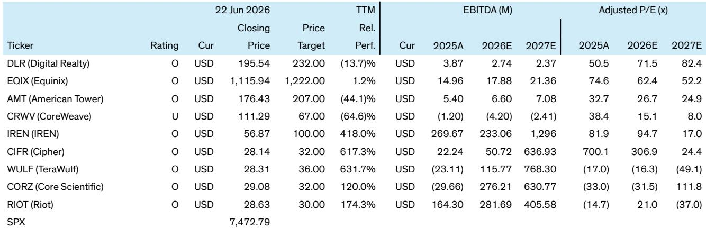
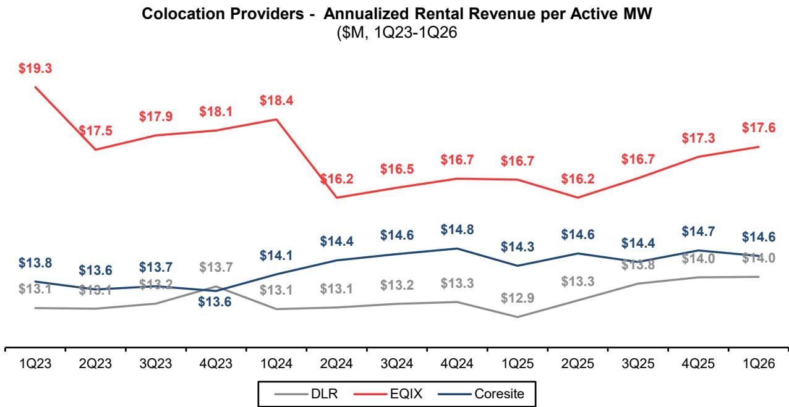
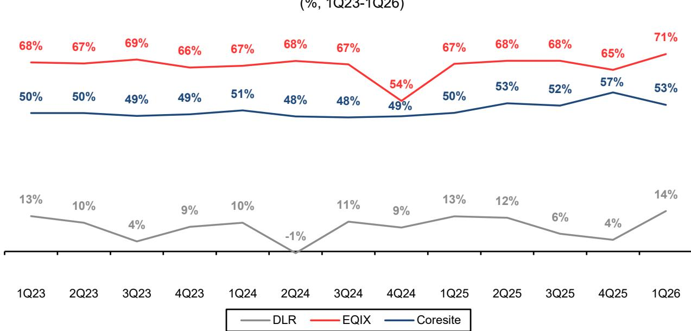

# The Megawatt Is Not a Commodity: Why Revenue Per MW Reveals the True Strategic Divide in AI Infrastructure

Every time a headline-grabbing GPU cloud contract is announced, the question from investors is almost always the same: Is that a good deal? The instinct is to look at the headline number and compare it to the last big announcement. But this instinct is deeply misleading. The value of a megawatt of data center capacity can vary by more than 50 times depending on who is selling it, to whom, and under what terms. Understanding this dispersion is not an academic exercise. It is the single most important analytical task for anyone trying to assess which business models in AI infrastructure will generate sustainable returns and which are merely capturing temporary scarcity premiums.

The conventional wisdom frames the data center buildout as a race for power. The winners, it is assumed, will be those who secure the most megawatts fastest. This framing is incomplete. Power access is necessary but not sufficient. The real strategic question is not how much power a company controls, but how much economic value it can extract from each megawatt it deploys. A global investment bank report on US communications infrastructure and digital assets provides the analytical framework for answering this question, and the answer is far from uniform.

The report examines revenue per megawatt across colocation providers, GPU cloud operators, and emerging AI infrastructure players. The range is staggering. At the low end, wholesale colocation deals can generate less than $1 million per megawatt annually. At the high end, GPU cloud contracts can approach $55 million per megawatt. This is not a measurement error. It is a reflection of fundamentally different business models, customer segments, and risk profiles. The megawatt is not a commodity. It is a vessel for value creation, and the vessel itself is only as valuable as the services layered on top of it.

The argument of this article is straightforward: Investors must stop evaluating AI infrastructure companies on total megawatt capacity alone. The correct metric is revenue per megawatt, adjusted for the capital intensity and operating costs required to generate that revenue. When you apply this lens, a clear strategic hierarchy emerges, and with it, a set of actionable decisions for allocators of capital.

## The Colocation Model Is a Real Estate Business, and It Should Be Valued Like One

The colocation model is the most straightforward to understand, but its simplicity masks its strategic depth. Companies like Digital Realty, Equinix, and CoreSite operate as landlord-style REITs. They develop and own data center facilities, sell powered capacity on long-term leases, and pass through a significant portion of power and facility-related operating costs to tenants. Their revenue per megawatt is relatively low, but so is their operational complexity and risk.

Equinix stands out within this group, generating approximately $5 million per megawatt annually. This premium is not accidental. Equinix has built a retail-focused model that layers interconnection services and cross-connect revenue on top of its physical footprint. The company benefits from a dense concentration of network nodes and enterprise customers in major metropolitan markets. This is not just a data center business. It is a marketplace business, where the value of the platform exceeds the sum of its parts.

Digital Realty and CoreSite, by contrast, lean more heavily into wholesale deals with hyperscalers and large enterprises. Their revenue per megawatt is lower, in the $3 million to $4 million range, because they are selling capacity in larger blocks to tenants with more negotiating power. The trade-off is stability. Wholesale leases are longer, occupancy rates are higher, and the revenue stream is more predictable.

The emerging AI infrastructure players, many of which are former crypto miners, represent an interesting variation on this theme. Companies like Cipher Mining, TeraWulf, and Core Scientific are building data centers in rural areas with access to cheap power. Their revenue per megawatt is lower than the established REITs, partly because they are pre-selling capacity for facilities that are not yet completed and partly because their locations command lower pricing. But their cost structure is also lower, and their contracts often include triple-net lease structures that pass nearly all operating costs to tenants.

The strategic implication is clear. For investors who want stable, predictable cash flows with low operational risk, the colocation model is the right choice. The returns are lower, but they are more certain. The question is whether the market is correctly pricing this stability, or whether the hype around AI is inflating expectations for what is fundamentally a real estate business.

## The GPU Cloud Model Captures the Full Stack, But Bears the Full Cost

The GPU cloud model is the mirror image of colocation. Companies like CoreWeave, Nebius, and IREN are not just selling powered space. They are buying or leasing physical capacity, filling it with GPUs, and reselling compute with platform tooling and orchestration software. They are capturing value from both the infrastructure layer and the application layer. The result is dramatically higher revenue per megawatt.

CoreWeave, for example, generates approximately $21 million per megawatt annually. Nebius generates approximately $8 million. IREN, which operates a vertically integrated model, generates approximately $10 million on a contracted capacity basis. These figures are multiples of what colocation providers achieve. But the revenue comes with a commensurate increase in cost and risk.

The GPU cloud operators bear the full cost of GPU depreciation, power procurement, orchestration software, and support engineering. Their operating expenses per megawatt are an order of magnitude higher than those of colocation providers. CoreWeave and Nebius incur approximately $19 million and $33 million in operating expenses per megawatt respectively, compared to an average of approximately $2 million for the colocation REITs. The margin compression is severe. CoreWeave's operating margin per megawatt is approximately 11%, which is within range of Digital Realty but far below Equinix's 66%.

The key insight here is that high revenue per megawatt is not synonymous with high profitability. The GPU cloud model requires massive upfront capital expenditure on GPUs, which depreciate quickly and become obsolete as new generations of hardware are released. The model also depends on near-24/7 utilization to justify the capital outlay. Any downtime or underutilization erodes returns rapidly.

For investors, the GPU cloud model is a bet on sustained demand for compute capacity at premium prices. This is a reasonable bet in the current environment, where AI training workloads are growing exponentially and supply of high-end GPUs is constrained. But it is a bet with significant downside risk. If demand softens, or if new competitors enter the market and drive down pricing, the GPU cloud operators will face a margin squeeze that the colocation providers can avoid.

## The Emerging AI Infrastructure Players Are a Hybrid Model With Asymmetric Upside

The most interesting part of the AI infrastructure landscape is the group of companies that are transitioning from crypto mining to AI colocation. These companies, which include Cipher Mining, TeraWulf, Core Scientific, and Riot Platforms, have built large power portfolios for Bitcoin mining and are now repurposing that capacity for AI workloads.

Their business model is a hybrid. They own the real estate and the power infrastructure, which gives them a cost advantage over pure-play GPU cloud operators. But they are not operating the full stack. They are entering into long-term colocation agreements with hyperscalers and neoclouds, passing through most of the power and operating costs to tenants. The result is revenue per megawatt that is lower than the GPU cloud operators but higher than the traditional REITs, with operating margins that are significantly higher.

The report highlights that these companies have contracted approximately 6 gigawatts of power capacity to hyperscalers, neoclouds, and AI-chip manufacturers across 17 deals worth over $110 billion. This represents only about 20% of their total pipeline of 30 gigawatts, leaving substantial room for new contracts. The key catalyst for these companies is obtaining hyperscaler rent guarantees and equity stakes, which serve as proof of pedigree and unlock further contract opportunities.

The strategic implication is that these emerging players offer an asymmetric risk-reward profile. If they execute on their buildout plans and secure additional hyperscaler contracts, their revenue per megawatt should improve as they move toward triple-net lease structures with higher margins. If they fail to execute, they can fall back on their crypto mining operations, which provide a floor on cash flows. This optionality is valuable, but it also introduces complexity. Investors must assess both the AI colocation opportunity and the crypto mining business simultaneously, which requires a more nuanced analytical framework than a pure-play REIT or GPU cloud operator.

## What the Report Does Not Fully Answer: The Sustainability of Premium Pricing

The report provides a detailed snapshot of current revenue per megawatt across different business models. What it does not fully address is whether the premium pricing enjoyed by GPU cloud operators is sustainable over a full cycle.

The current market is characterized by extreme scarcity of high-end GPUs, particularly NVIDIA's H100 and B200 series. This scarcity has allowed GPU cloud operators to charge premium prices for compute capacity. But scarcity is not a permanent condition. As manufacturing capacity expands and new competitors enter the market, GPU pricing is likely to normalize. When that happens, the revenue per megawatt of GPU cloud operators will come under pressure.

The question is whether the GPU cloud operators can maintain their revenue premium through superior service, platform lock-in, or customer relationships. CoreWeave, for example, has built a strong reputation for delivering compute capacity quickly, which is valuable in a market where time to compute is the primary constraint. But reputation is easier to lose than to build, and the barriers to entry in GPU cloud are lower than in colocation, where the real estate and power infrastructure are the primary assets.

For investors, the sustainability of premium pricing is the most important variable that the report does not fully answer. It is also the most difficult to analyze, because it depends on competitive dynamics that are still evolving. The report's framework provides the tools to ask the right questions, but the answers will only become clear over time.

## A Decision Framework for Allocating Capital Across AI Infrastructure Models

For investors trying to decide where to allocate capital across AI infrastructure, the report's analysis suggests a three-step decision framework.

First, assess the risk-reward profile of each business model. Colocation providers offer lower returns but higher stability. GPU cloud operators offer higher returns but higher risk. Emerging AI infrastructure players offer an asymmetric profile with upside optionality. There is no single correct answer. The right choice depends on the investor's return requirements, risk tolerance, and time horizon.

Second, evaluate the specific company's execution capability and competitive position. Within each business model, there is wide dispersion in performance. Equinix has demonstrated the ability to generate premium revenue per megawatt within the colocation model through its interconnection business. CoreWeave has achieved high revenue per megawatt within the GPU cloud model through speed and customer relationships. IREN has built a large owned power portfolio that gives it a cost advantage. The key is to identify which companies have sustainable competitive advantages that will allow them to maintain their premium positioning.

Third, stress-test the assumptions. For colocation providers, the key assumption is that occupancy rates and lease pricing will remain stable. For GPU cloud operators, the key assumption is that demand for compute capacity will continue to grow at current rates and that GPU pricing will not decline faster than expected. For emerging AI infrastructure players, the key assumption is that they can execute on their buildout plans and secure additional hyperscaler contracts. Each of these assumptions is reasonable, but none is guaranteed. The investor who stress-tests the assumptions and plans for downside scenarios will be better positioned to weather the inevitable volatility.

## The Open Questions That Make the Full Report Worth Reading

The report leaves several meaningful questions unanswered, which is precisely why it is worth reading in full.

How will the revenue per megawatt of GPU cloud operators evolve as GPU supply catches up with demand? Will the premium pricing persist, or will it normalize to levels closer to traditional cloud compute? What happens to the emerging AI infrastructure players if the hyperscalers decide to build their own data centers rather than leasing from third parties? Can the colocation providers maintain their occupancy rates as new supply comes online, or will there be a period of oversupply?

These are the questions that will determine the winners and losers in AI infrastructure over the next three to five years. The report provides the analytical framework to answer them, but the answers require ongoing analysis and a willingness to update assumptions as new data becomes available.

The full report includes detailed charts on revenue per megawatt, operating expenses per megawatt, and operating margins across the different business models, as well as a ticker table with price targets and valuation multiples. For investors who want to go beyond the headlines and build a rigorous analytical foundation for their AI infrastructure investments, the report is an essential resource.

Join the community to read the full report and review the original charts.

*This article is for learning and discussion only and does not constitute investment advice.*

Personal reading notes and learning share only. Not investment advice.

