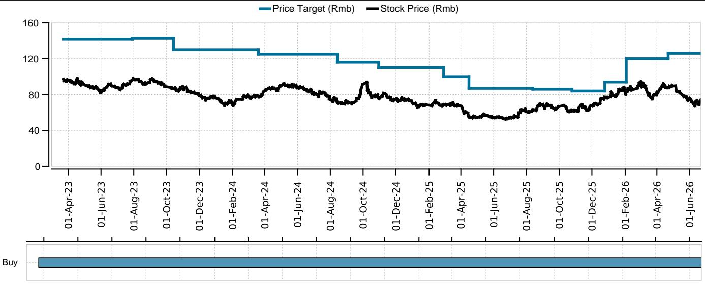
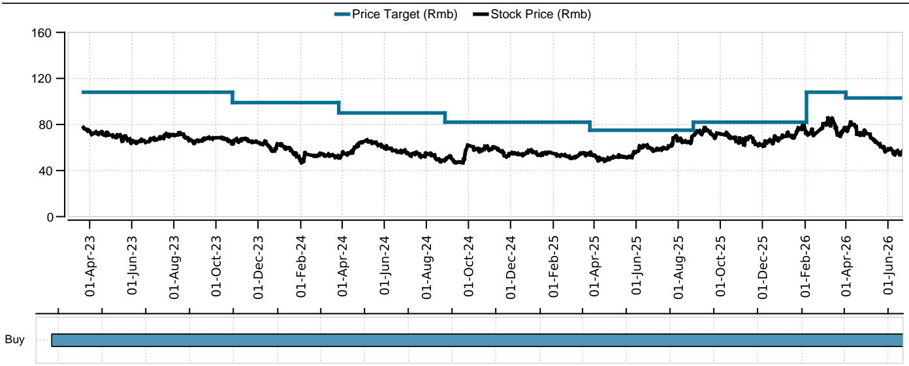
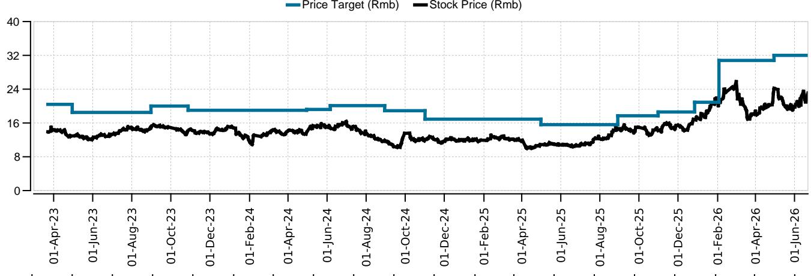

# UBS：当炼厂开工率跌至45%，化工行业下一个机会在AI制冷剂

中国化工行业正在经历一轮罕见的“双低”震荡：原油库存自6月初持续下降，地方炼厂开工率已跌至45.74%，而聚酯、聚丙烯等主要化工品的产能利用率同比下滑幅度普遍在10个百分点以上。市场弥漫着对需求疲软的担忧，但UBS最新发布的化工周报给出了一条清晰的差异化路径——当传统化工品陷入库存与开工率的双重压力时，AI算力驱动的含氟化学品需求正在打开一个被低估的定价空间。

这份报告的核心判断是：市场尚未充分定价AI对氟化学材料带来的结构性增长机遇，部分氟化工企业存在明确的估值重估潜力。而这一判断的逻辑，需要从当前化工行业最真实的运营数据说起。

## 1. 炼厂开工率持续下滑，原油库存降至年内低位，但这不是系统性危机

UBS周报数据显示，截至上周，中国主营炼厂开工率小幅回升0.23个百分点至67.41%，但地方炼厂开工率环比大幅下降2.9个百分点至45.74%。中国原油总加工量环比下降12.8万桶/日，至1232.1万桶/日。与此同时，根据Kpler数据，中国原油库存自6月初以来持续下降，截至6月22日已降至12.68亿桶。

这两个数据放在一起看，容易让人联想到需求崩塌。但UBS的解读更克制：开工率分化本身说明问题不在总量，而在结构。主营炼厂开工率相对稳定，地方炼厂则面临更为严峻的利润压力和原料获取能力差异。原油库存下降叠加开工率走低，更多反映的是炼厂主动去库存和调节开工节奏，而非终端需求的全面失速。

> **KC评论：** 这个地方最容易被误读。很多人看到开工率45%就会联想到“行业萧条”，但UBS把主营炼厂和地方炼厂分开看，就是为了说明这轮压力更多集中在成本传导能力弱、议价权低的环节。对于下游化工品而言，原料端的价格压力正在通过炼厂减产释放，这反而可能为后续某些化工品的价差修复创造条件。完整报告里有一张炼厂开工率的分化图表，值得仔细看。

## 2. 化工品开工率普遍承压，但库存数据透露出需求并非全线溃败

报告覆盖的主要化工品中，除了TDI开工率环比上升7个百分点至71%、PTA开工率环比上升4个百分点至69%外，其余品种的产能利用率普遍低于去年同期。聚酯长丝开工率同比下降15个百分点至74%，PP开工率同比下降15个百分点至63%，PVC开工率同比下降9个百分点至70%。

库存数据则呈现分化格局。PP库存同比下降26%，PE库存同比下降5%，PVC库存同比下降21%，二氧化钛库存同比下降43%。但聚酯长丝库存同比飙升112%，硅酮DMC库存同比下降21%。

这里的关键洞察在于：库存下降快的品种，并非需求旺盛，而是供给收缩更猛烈。PP和PVC的库存去化主要来自开工率大幅下降，而非下游采购回暖。聚酯长丝库存高企则直接反映出纺织终端需求的疲弱，即使开工率已经大幅下调，库存仍在累积。

> **KC评论：** UBS的库存数据来自样本工厂，不是全行业统计，但趋势指向明确。当前化工品市场正在经历一轮“供给主动出清”的阶段，而不是需求自然修复。这意味着，接下来谁能在供给出清中保持开工率、同时控制库存，谁就能在下一轮价格反弹中占据主动。这份周报里对每个品种的开工率和库存做了连续追踪，如果你在关注具体标的，这些数据是判断拐点的基础。

## 3. 氟化工是报告中唯一的“结构性增长叙事”，AI算力正在改写估值坐标

在通篇以“下降”和“承压”为主调的周报中，UBS专门发布了一份氟化工行业报告，并明确提出：氟化学品在半导体和数据中心的应用正在快速增长，AI带来的算力需求提升和材料体系迭代，将推动氟化材料的增长。

目前，氟化工材料供应商的估值相较电子化学品企业存在显著折价。UBS认为，市场尚未充分定价AI给氟化学材料带来的增长机会，部分氟化工企业具备进一步重估的潜力。

这个判断的逻辑链条很清晰：AI算力提升带来数据中心散热需求升级，含氟冷却液等高性能材料成为关键；半导体制造工艺迭代对高纯度氟化学品需求增加；而当前市场仍将氟化工企业视为周期性化工股，没有给予科技成长股的估值溢价。

> **KC评论：** 这是这份周报最值得反复读的部分。UBS没有把氟化工和传统化工品放在一起讨论，而是单独成篇，本身就说明他们认为这是一个不同的投资逻辑。传统化工品的定价锚在油价、开工率和库存周期，而氟化工的定价锚正在向AI资本开支和半导体设备投资迁移。估值折价的存在意味着，如果这个逻辑被市场接受，重估空间可能相当可观。完整报告里对氟化工的细分应用场景和具体受益标的都有拆解。

## 4. 报告尚未完全回答的关键问题：AI对氟化学品的需求何时进入利润表

UBS的氟化工逻辑在方向上是清晰的，但报告没有完全回答几个关键问题。

第一，AI对氟化学品的需求增长，在时间维度上有多快？是未来12个月就能体现在订单中，还是需要更长的孵化周期？报告提到了“fast growth”和“AI tailwinds”，但没有给出具体的需求增速预测或渗透率假设。

第二，当前氟化工企业的产能布局和客户结构，是否已经为AI需求做好了准备？哪些企业已经进入了数据中心或半导体客户的供应链，哪些还在导入阶段？估值折价的存在，部分原因可能是市场对这些企业能否真正兑现AI红利存在疑虑。

第三，如果AI需求确实快速增长，氟化工行业的供给端是否存在瓶颈？产能扩张需要多长时间？如果供给跟不上需求，价格弹性有多大？

这些问题的答案，将直接决定估值重估的幅度和时间节点。UBS在报告中给出了受益标的的买入评级，但投资者需要更多的供应链验证和业绩兑现信号。

## 5. 一个观察框架：如何区分“周期底部”和“结构增长”

对于关注化工行业的读者，UBS这份周报提供了一个很实用的分析框架：把化工品分为两类来观察。

第一类是传统大化工品，如聚酯、PP、PE、PVC等。这类品种的核心变量是开工率、库存和油价。当前它们处于供给出清阶段，需要等待需求端出现明确复苏信号才能确认底部。UBS偏好的方向是受益于原材料价格压力的品种，如聚酯长丝（桐昆股份）和磷化工。

第二类是电子级化学品和氟化工材料。这类品种的核心变量已经从传统的化工周期切换为下游科技产业的资本开支周期。估值方法也需要从PB-ROE切换到成长股框架。UBS在此列出的标的包括万华化学和扬农化工，并专门强调了氟化工的重估潜力。

这个框架的价值在于，它帮助投资者避免用同一套逻辑去判断两类完全不同的资产。当市场还在为PP和PVC的开工率焦虑时，氟化工的估值逻辑可能已经先行一步。

## 6. 顺着这些未解问题，继续读完整报告

UBS这份周报提供了大量一手运营数据，从炼厂开工率到各化工品库存，从传统周期品到AI驱动的氟化工新叙事。但数据背后的判断，往往比数据本身更值得反复推敲。

比如，氟化工的AI需求到底有多大的收入弹性？估值折价何时开始收敛？传统化工品的供给出清需要多长时间才能转化为价格反弹？这些问题，UBS在完整报告中给出了更细致的拆解——包括氟化工细分应用场景的规模测算、受益标的的估值对比、以及不同情景下的需求敏感性分析。

这些内容，在我们每天由AI agent和人工review生成的国际投行中文摘要与KC评论中都有覆盖。每天更新约10-40页，包含当天最新数据图表合集，既方便喂给AI做进一步分析，也方便人工快速把握市场动态。欢迎来星球微信群里继续讨论，把这份报告的完整逻辑和数据链条一起过一遍。

Personal reading notes and learning share only. Not investment advice.

