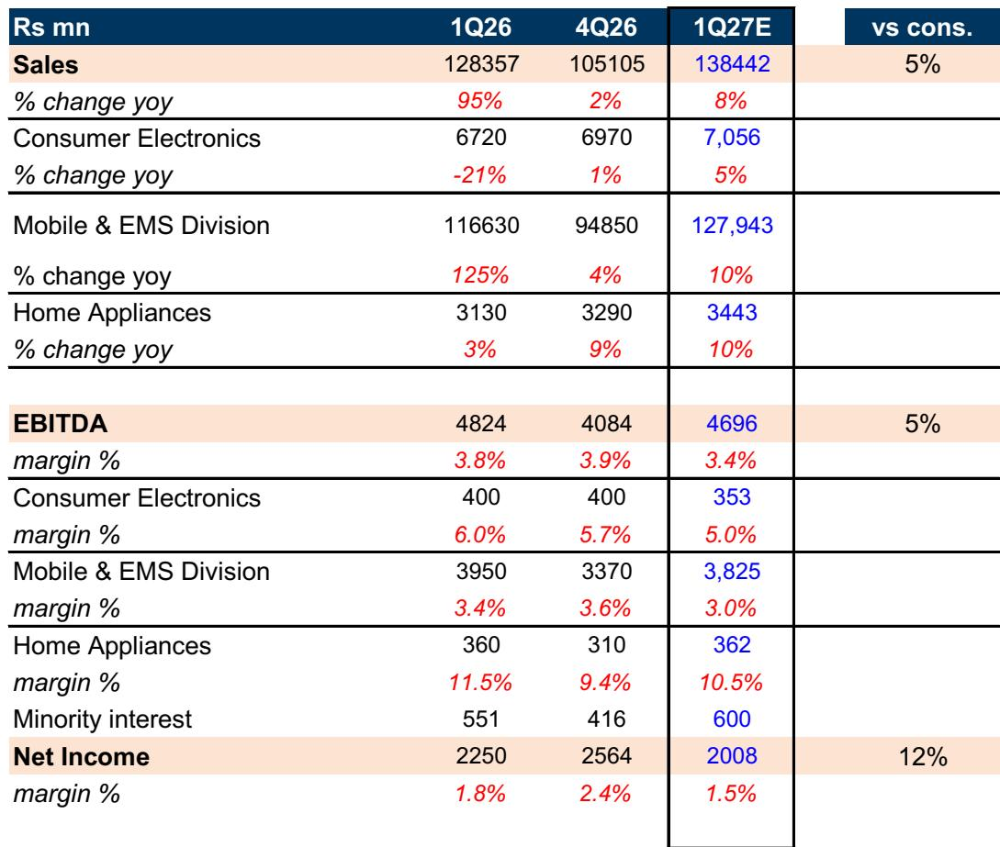
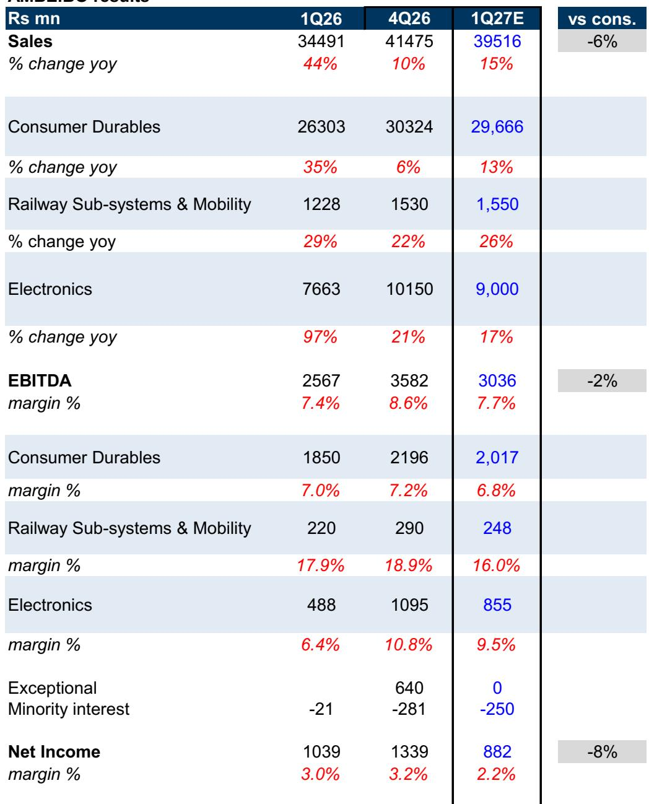
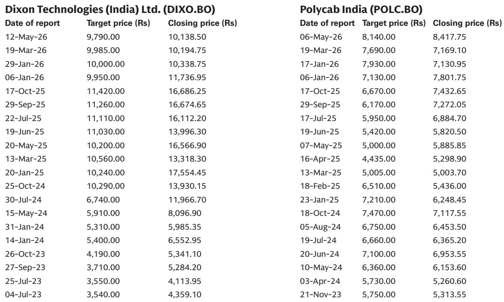

# Input Inflation Is Reshaping Indian Cables, Wires, and EMS Margins—But Not All Revenue Growth Is Equal

The coming earnings season for India’s cables, wires, and electronics manufacturing services (EMS) sector will reveal a critical divergence: revenue growth driven by input price pass-through is not the same as growth driven by genuine volume expansion. As copper and aluminium prices surge more than 35% year-on-year, companies in the cables and wires (C&W) space are set to report robust top-line numbers for Q1FY27. Yet beneath the surface, volume growth remains stuck in the mid-to-high single digits, and margin trajectories are diverging sharply across the coverage universe. For investors, the key question is not whether revenues will rise—they will—but whether the quality of that growth can sustain valuations that already reflect optimistic assumptions.

The current environment forces a strategic reassessment. In C&W, the revenue lift is largely mechanical: higher input costs flow through to realizations, creating the illusion of acceleration. In EMS, the story is more nuanced. Dixon Technologies faces a margin squeeze from memory cost inflation in mobile components, while Amber Enterprises benefits from a delayed monsoon extending air conditioner demand into Q2. A global investment bank report on Q1FY27 expectations provides the analytical scaffolding, but the real insight lies in what these patterns imply for the next 12 to 18 months: a sector where pricing power is tested, capacity utilization becomes the swing factor, and the ability to manage working capital through volatile commodity cycles will separate market leaders from laggards.

This is not a quarter to celebrate headline growth. It is a quarter to diagnose which companies have genuine earnings resilience and which are merely riding a commodity wave.

## Surging Copper and Aluminium Prices Will Mask Weak Volume Growth in Cables and Wires

The most immediate takeaway from the Q1 outlook is that C&W companies will report revenue growth that looks impressive on a year-on-year basis, but the engine is almost entirely price. Copper and aluminium prices have increased month-on-month every month in Q1, and year-on-year comparisons show the largest quantum of price increases in 16 quarters. For Polycab India and KEI Industries, this means top-line growth of 36% and 27% year-on-year respectively, according to the report’s estimates. Yet volume growth is expected to be only mid-to-high single digits, driven by some channel restocking after a weak Q4.

This distinction matters because it changes how investors should interpret the revenue beat. If copper prices stabilize or reverse, the revenue growth will vanish. The underlying demand environment—infrastructure capex, real estate, and industrial activity—is supportive but not accelerating. The report notes that higher input prices have led to some inventory building in the channel, but this is a one-time restocking effect, not sustained demand momentum.

The strategic implication is clear: companies that have invested in capacity ahead of the curve, like KEI with its new EHV cable lines, are better positioned to convert pricing power into market share gains. Polycab, rated Neutral, faces a more balanced risk-reward because its larger FMEG segment and EPC business add complexity without commensurate margin upside. The commodity tailwind is a tide that lifts all boats, but when it recedes, only those with genuine volume growth and cost control will keep their margins.

## EMS Companies Face a Margin Squeeze as Memory Cost Inflation Distorts Realizations and Profit Per Unit

The EMS segment presents a different, but equally challenging, dynamic. For Dixon Technologies, the story is about mobile memory components. DRAM and NAND flash prices have risen sharply over the last three to six months, forcing smartphone brands to increase prices by 10% to 40%. Dixon, which earns a fixed profit per unit, sees its realization rise mechanically—but its margin percentage contracts because the fixed rupee profit is spread over a higher revenue base. The report forecasts a 24% increase in mobile realizations in Q1, paired with an 18% year-on-year decline in volumes. Revenue grows 8% year-on-year, but EBITDA margins shrink by 30 to 40 basis points.

This is a textbook example of why margin percentage alone can be misleading in EMS. The underlying economics depend on the profit-per-unit model, and when input costs inflate the denominator, margins compress even as absolute profits remain stable. The report also flags that PLI incentives will phase out from FY27 onward, adding another layer of margin pressure. For a Sell-rated stock like Dixon, the combination of volume delays (the Vivo JV is still awaiting approval), margin compression, and incentive expiry creates a negative earnings trajectory that the market may be underestimating.

Amber Enterprises offers a contrasting case. Its consumer durables segment benefits from an extended summer and delayed monsoons, pushing AC demand into Q2. The report expects growth to improve in Q1 versus Q4, but the full effect will show in Q2 as channel inventory replenishment accelerates. More importantly, Amber’s recent increase in stake in Ascent Circuits from 60% to 98.5% reduces minority interest and boosts EPS by 11% to 12% over FY27-28E. This is a structural improvement, not a cyclical one. However, margins in the PCB business remain under pressure from delayed cost pass-through and currency depreciation, which tempers the optimism.

## The Report’s Key Analytical Gap: What Happens When Input Prices Stabilize or Decline?

For all its granularity, the report leaves a critical question unanswered: what is the earnings trajectory for C&W and EMS companies if commodity prices plateau or fall? The EPS estimates for Polycab and KEI have been raised by 2% to 3% purely on mark-to-market of higher input costs. This is a mechanical adjustment, not a reflection of improved operating performance. If copper and aluminium prices correct by 10% to 15%—a plausible scenario given global demand uncertainty and potential supply responses—the revenue growth narrative collapses, and inventory losses could compress margins.

The report does not model this downside scenario in detail. It acknowledges commodity volatility as a key risk in the disclosure tables, but the earnings estimates are built on current prices. For investors, this creates an asymmetric risk profile: the upside from further price increases is limited (input costs can only go so high before demand destruction kicks in), while the downside from a correction is significant.

Similarly, for EMS, the assumption that memory cost inflation will persist and support Dixon’s realizations is untested. Memory prices are cyclical, and a correction in the second half of FY27 would reverse the revenue tailwind while leaving the margin compression legacy in place. The report’s own EPS adjustments for Dixon (-3% in FY27E, +3% in FY28E) hint at this uncertainty, but the analysis does not fully explore the second-order effects on working capital, inventory holding costs, or customer renegotiation dynamics.

## A Decision Framework for Investors: Separate Commodity Tailwinds from Structural Earnings Power

To navigate this earnings season, investors need a clear framework that separates cyclical noise from structural trends. The following three-step lens can help:

First, assess the source of revenue growth. If top-line expansion is driven entirely by input price pass-through with single-digit volume growth, the earnings quality is low. Companies like KEI, which have volume growth driven by new capacity and export approvals, offer higher quality than those relying solely on commodity inflation. The report highlights KEI’s EHV capability and US market approvals as genuine volume drivers, which justify its Buy rating despite the commodity noise.

Second, evaluate margin resilience through the profit-per-unit lens, not just percentage margins. For EMS companies like Dixon, the fixed profit-per-unit model means that margin percentages are inversely correlated with input costs. Investors should focus on absolute EBITDA and cash flow, not margin expansion. The report’s estimate of 30-40bps margin decline in Q1 for Dixon is a signal to look beyond the top line.

Third, monitor balance sheet and working capital intensity. In a rising input cost environment, companies need more working capital to fund inventory and receivables. Those with strong balance sheets and efficient working capital cycles—like KEI, which has a targeted dealer expansion of 5% to 6%—are better positioned than those that stretch payables or rely on short-term debt. The report does not provide detailed working capital projections, but this is a critical dimension that investors should analyze in the upcoming earnings calls.

## The Unresolved Tension: Valuations Already Reflect Optimism, Leaving Little Room for Error

The report’s price targets imply limited upside for most names. Polycab’s target of Rs 8,730 suggests 13% downside from its current price of Rs 10,021. KEI’s target of Rs 5,350 implies 5% downside from Rs 5,659. Amber’s target of Rs 7,290 implies 8% downside from Rs 7,912. Dixon’s target of Rs 10,025 implies 19% downside from Rs 12,334. These are not bullish calls. They reflect a view that current market prices already incorporate the commodity tailwind and leave little room for disappointment.

The report’s ratings—Neutral on Polycab and Amber, Buy on KEI, Sell on Dixon—suggest a selective approach. KEI stands out because its volume growth story is more structural, with new capacity and export momentum. But even here, the target price implies a negative return, which raises questions about the risk-reward at current levels. The report’s own disclosure tables list multiple downside risks: commodity volatility, slowdown in capex, higher industry capacity additions, and competitive intensity. These are not hypothetical; they are live risks that could materialize in the next two quarters.

For investors who want to dig deeper into the original data—including the detailed quarterly estimates, commodity price charts, and valuation methodologies—the full report contains exhibits that are essential for building a complete picture. The charts on copper and aluminium year-on-year growth, the segment-level margin breakdowns for each company, and the changes in estimates and target prices provide the raw material for independent analysis.

Join the community to read the full report and review the original charts.

*This article is for learning and discussion only and does not constitute investment advice.*

Personal reading notes and learning share only. Not investment advice.

