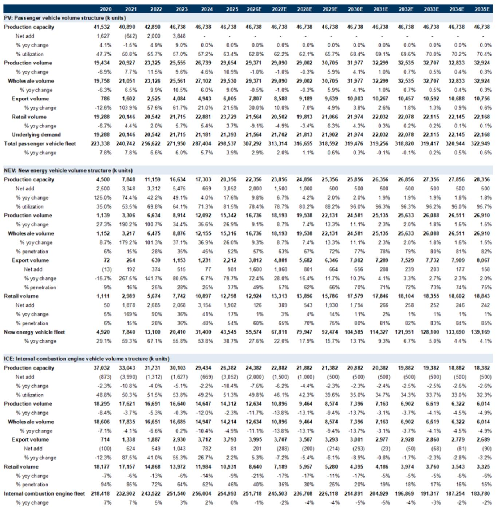
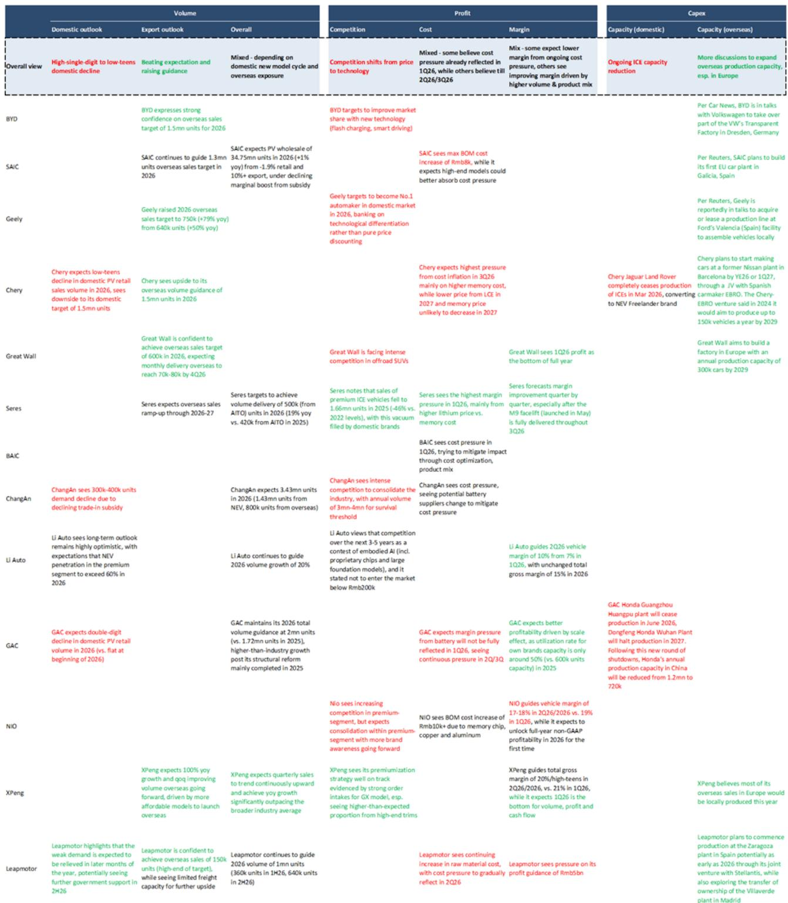
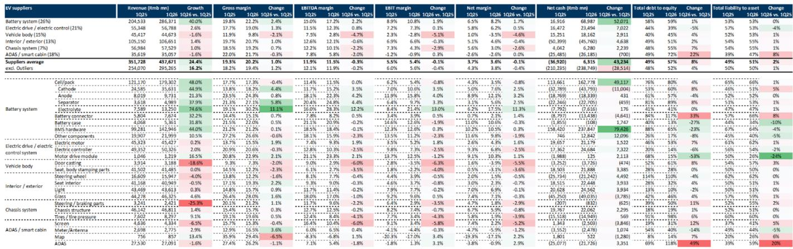

# China’s Auto Industry Is Not Ready to Consolidate — And That Makes It More Dangerous for Investors

The conventional wisdom among many investors is that China’s automotive market, after years of brutal price competition and overcapacity, must be approaching a consolidation event that will separate winners from losers. That thesis is premature. Based on a detailed cyclical framework applied to the 14 largest Chinese OEMs, the data shows that industry consolidation is unlikely in the near term — not because the market is healthy, but because the conditions that typically force a shakeout have not yet materialized. The majority of OEMs remain above cash cost levels, management teams have not capitulated on profitability or expansion plans, and balance sheets are not yet in distress territory. The result is a market that will continue to bleed collectively rather than consolidate cleanly.

This matters now because the momentum of earnings cuts is accelerating. Consensus estimates for 2026 and 2027 EBITDA have been revised downward four consecutive times over the past year, with the most recent round cutting aggregate industry EBITDA by RMB 1.7 billion for 2026 and RMB 1.8 billion for 2027. The pace of downgrades is quickening, not slowing. Investors who are waiting for a clear inflection point — a moment when the weakest players exit and pricing power returns to survivors — may be waiting longer than they expect. The pain will be prolonged, and the opportunity set is shifting from cyclical recovery plays to structural export stories.

The central argument of this analysis is straightforward: the Chinese auto industry is in a multi-year transition where domestic volume decline is being offset by export growth, but the offset is incomplete and unevenly distributed. The companies that will emerge stronger are those that can accelerate overseas exposure while maintaining domestic cost discipline. The rest will face a slow erosion of margins and balance sheet strength that may not trigger a crisis for several more years.

## The Three-Parameter Framework Shows No Near-Term Inflection Point

The framework used to assess consolidation risk rests on three conditions that must be met simultaneously for a genuine industry shakeout: OEMs must be operating at or near cash cost levels, management must capitulate on profitability and expansion ambitions, and balance sheets must turn to net debt. As of the first quarter of 2026, only one of these conditions is close to being met.

On the first parameter, 10 out of 14 OEMs remain above cash cost levels. While this is a slight deterioration from 11 out of 14 in full-year 2025, it is still far from the point where the majority of the industry is burning cash at the operating level. The aggregate industry EBITDA actually increased 11% year-over-year in the first quarter of 2026, driven by cost optimization and strong export contributions. The cash cost breakeven analysis shows that profitable OEMs on average have room to cut prices by 14% before hitting break-even — meaning they have significant pricing power to defend market share without immediate existential risk.

On the second parameter, management outlooks are mixed rather than uniformly pessimistic. Volume guidance reflects a shared recognition of weak domestic demand, but this is mitigated by a stronger export outlook. Margin expectations diverge sharply depending on each company's cost structure and timing of input cost inflation. Capacity plans show a consensus toward lowering domestic ICE capacity and expanding overseas, but this is expansion, not retreat. No major OEM is signaling a strategic withdrawal from the market.

On the third parameter, only one out of 14 OEMs is in a net debt position. This is unchanged from 2025. The industry’s net cash position has declined — by RMB 65 billion year-over-year in the first quarter of 2026 — but this is primarily due to shortening payable cycles under government guidelines and reduced equity raising, not a fundamental deterioration in operating cash flow. The balance sheet picture is weaker than it appears at first glance, but it is not yet at crisis levels.

The implication is clear: the conditions for consolidation are not present, and consensus estimates assume that more OEMs will turn EBITDA positive by 2027, driven by overseas expansion and internal restructuring. This means the inflection point, if it comes at all, is beyond the 2027 horizon. Investors who are positioned for a near-term shakeout are likely to be disappointed.

## Earnings Momentum Is Deteriorating Faster Than Balance Sheets

While the consolidation framework suggests stability, the earnings revision cycle tells a different story. Aggregate 2026 and 2027 EBITDA consensus estimates for Chinese OEMs have undergone four consecutive rounds of cuts over the past year. The most recent round, following first-quarter 2026 results, was the largest in absolute terms, with a 4% downward revision to the industry total. The momentum of cuts is accelerating, not decelerating.

This divergence between balance sheet stability and earnings deterioration is the key analytical tension in the market. Balance sheets are not yet in distress, but earnings are being revised down at an increasing pace. This suggests that the market is pricing in a deterioration that has not yet fully manifested in cash positions or debt levels. The risk is that earnings cuts will eventually translate into balance sheet stress, but with a lag that makes timing difficult.

The source of the earnings pressure is twofold. First, domestic retail volumes are declining sharply — down 19% year-to-date. Second, cost inflation, particularly in battery raw materials, is compressing margins even for companies that are holding volume steady. The export growth of 70% year-to-date is a powerful offset, but it is concentrated among a few players. Companies with limited export exposure are bearing the full weight of domestic decline without the compensating benefit of overseas profits.

The acceleration of earnings cuts also raises a question about consensus reliability. If analysts have been consistently too optimistic over the past four quarters, there is no reason to assume the current estimates are the floor. The pattern of cuts suggests that the industry’s earnings power is structurally lower than the market expects, and that further downward revisions are likely as domestic weakness persists and cost pressures continue to build.

## Export Growth Is Reshaping the Competitive Landscape, Not Just the Volume Story

The most important structural shift in the Chinese auto industry is the rapid acceleration of exports. With domestic retail volumes declining 19% year-to-date and exports growing 70%, the growth engine has moved decisively offshore. This is not a temporary trade flow adjustment; it is a fundamental reorientation of the industry’s production base and profit pool.

The report projects that export growth of 30% year-over-year in 2026 will offset a 9% domestic retail decline, resulting in largely stable wholesale and production volumes. This means that the industry’s capacity utilization is being sustained by overseas demand, not domestic recovery. Companies that can build export channels and local production capacity will effectively decouple from the domestic downturn.

However, the export opportunity is not evenly distributed. The report identifies BYD, Leapmotor, and XPeng as better positioned for both domestic volume growth acceleration and higher overseas exposure, citing accelerating new export model pipelines and sales network expansion. This is a critical insight: the export story is not a rising tide that lifts all boats. It is a competitive advantage that accrues to companies with the product portfolio, manufacturing flexibility, and distribution infrastructure to serve multiple markets simultaneously.

The second-order implication is that the domestic market may become even more competitive as weaker players lose export share to stronger ones. If the top three exporters capture most of the overseas growth, the remaining OEMs will be forced to compete even more aggressively in a shrinking domestic market. This could accelerate the earnings deterioration for the laggards without triggering a full consolidation event, because they may still have access to funding or government support.

## What the Report Does Not Fully Answer: The Timing and Trigger of the Inflection Point

The report provides a robust framework for assessing whether consolidation is imminent, but it leaves several critical questions unanswered. The most important is the timing and trigger of the eventual inflection point. If the three parameters are not met in the near term, what combination of events would cause them to align? Is it a further acceleration of domestic volume decline? A sharper cost inflation shock? A withdrawal of government support? A funding crisis at a major player?

The report suggests that the inflection point is beyond 2027, but this is a forecast, not a conclusion based on the framework. The framework tells us that consolidation is unlikely now, but it does not tell us what will change to make it likely later. Investors need to identify the leading indicators that would signal a shift — for example, a sustained period of negative EBITDA for a majority of OEMs, a wave of equity issuance that weakens balance sheets further, or a regulatory change that reduces export profitability.

Another open question is the role of government policy. The report notes that shortening payable cycles under government guidelines has reduced industry net cash, but it does not analyze how further policy interventions could delay or accelerate consolidation. If the government provides financial support to struggling OEMs to maintain employment and industrial capacity, the consolidation timeline could be pushed out indefinitely. If it allows market forces to operate, the inflection could come sooner.

Finally, the report does not fully address the implications of the supplier ecosystem. The data shows that suppliers are also under pressure, with net debt increasing and debt-to-equity ratios rising. If the supplier base deteriorates faster than the OEMs, it could create a supply chain crisis that forces consolidation even if the OEMs themselves are not yet at cash cost levels. The interdependence between OEMs and suppliers is a potential transmission mechanism for a faster-than-expected inflection.

## A Decision Framework for Investors Navigating the Pre-Consolidation Phase

Given that consolidation is unlikely in the near term but earnings momentum is deteriorating, investors need a framework that separates defensible positions from value traps. The following decision framework is derived from the report’s logic and is designed to help allocate capital in a market that is structurally weak but not yet in crisis.

First, prioritize export exposure over domestic market share. The report’s volume model shows that domestic retail will decline 9% in 2026 while exports grow 30%. Companies with high export revenue as a percentage of total revenue are effectively insulated from the domestic downturn. Investors should screen for OEMs where export growth is accelerating and where overseas production capacity is being built, as this reduces tariff and logistics risk.

Second, assess cash cost buffers rather than reported EBITDA margins. The report shows that profitable OEMs have room to cut prices by 14% before hitting cash cost break-even. This is a measure of pricing power and competitive resilience. Companies with large cash cost buffers can afford to defend market share without destroying their balance sheets. Companies with thin buffers are one bad quarter away from distress.

Third, monitor balance sheet trends rather than levels. The industry’s net cash position has declined, but the absolute level is still above crisis thresholds. The more important signal is the trajectory: if net cash continues to decline at the current pace, it will reach 2024 levels within two quarters. Investors should watch for acceleration in the rate of decline, particularly if it is driven by operating cash flow deterioration rather than working capital adjustments.

Fourth, differentiate between cost-cutting and restructuring. The report notes that internal organizational restructuring is one reason consensus expects more OEMs to turn EBITDA positive by 2027. But restructuring is not the same as sustainable cost reduction. If earnings improvement is driven by one-time headcount reductions or asset sales, it is not a reliable foundation for long-term profitability. Investors should look for evidence of structural cost advantages, such as vertical integration, proprietary technology, or scale in battery production.

Finally, avoid the temptation to bottom-fish on weak balance sheets. The report identifies that only one OEM is in a net debt position, but several are approaching that threshold. In a pre-consolidation market, the weakest players may survive longer than expected, but they will not generate returns for equity holders. The value creation in this phase will come from companies that can grow earnings despite the headwinds, not from companies that are simply surviving.

## Why the Full Report Matters Now

The framework and data presented here offer a rigorous way to think about the Chinese auto industry, but they are necessarily incomplete. The full report contains detailed exhibits on EBITDA distribution by company, net cash trends, management commentary on capacity plans, and the supplier margin analysis that underpins the inflection point calculation. It also includes specific price targets and risk assessments for the companies identified as better positioned.

For investors who want to move beyond the headline narrative of “China auto consolidation coming soon” and into a data-driven assessment of when and how that consolidation might actually occur, the full report is essential reading. The charts alone — showing the evolution of EBITDA-positive OEMs over time, the sequential earnings revision patterns, and the cash cost breakeven analysis — provide a visual confirmation of the arguments made here that cannot be replicated in a summary.

Join the community to read the full report and review the original charts.

*This article is for learning and discussion only and does not constitute investment advice.*

Personal reading notes and learning share only. Not investment advice.

