This material is neither intended to be distributed to Mainland China investors nor to provide securities investment consultancy services within the territory of Mainland China. This material or any portion hereof may not be reprinted, sold or redistributed without the written consent of JPM.

# Sustainable Investing 2026 mid-year Outlook

Catching our breath

Flows and performance: respite, finally... Despite growing by 3% YTD to reach US\$3.8tn in April, the market share of sustainable funds has declined further, to 5.6% of global AuM. Relative performance has been broadly in line. In equities, European sustainable funds marginally outperformed European broad market funds, while sustainable US funds underperformed slightly. In fixed income, sustainable fund performance was positive and roughly in line with the broader market. As a result, sustainable flows in equities have shifted from outflows to neutral, while fixed income continues to register inflows. Although outflows from sustainable equity seem to have stopped, we believe that material inflows will be contingent on relative performance improving in a consistent fashion.

... But tech introduces downside risks for the performance of sustainable equity funds. Globally, sustainable funds often appear to be underweight technology relative to the broad market due to the former having a European bias, which has less tech, and the latter having a US bias, which is more tech heavy. Regionally, our strategists have a preference for Europe over the US, but at the same time, they have laid out a very strong case for the outperformance of the AI theme, which is more US-centric. It is unclear how these cross-currents will continue to play out within sustainable funds. The downside risk is more pronounced today vs. our last outlook, as the preference for tech has broadened beyond the US, with our EM and Japan strategists also OW the sector.

Six screens for sustainable idea generation. We feature three global screens focusing on grids, battery supply chains and adaptation to climate change, two screens in EMEA on “electro-sovereignty” and “Shareholder activism”, and one with low-carbon winners in the US. These offer 20-51% upside on average. We also discuss how to position for El Niño in LatAm and Asia.

Issuance outlook: Euro GSS+ issuance has tracked slightly higher as a proportion of the overall market, following the gradual decline seen over 2022-2025. Elsewhere, GSS issuance has continued its steep decline in the GBP IG and Euro high yield markets, and remains marginal in the US. Going forward, we expect the share of EUR GSS+ issuance to be flat or slightly down.

Global policy remains generally supportive of sustainability: The EU signaled its commitment to the climate agenda by approving a target to reduce 90% GHG emissions by 2040 vs. 1990 and continues its shift towards more pragmatic delivery. In the US policy remains supportive of baseload power sources, and capacity additions in renewables and storage for the 2026-27 period are expected to exceed, on average, those in 2025, although several potential policy/geopolitical headwinds remain (i.e. further clarification on FEOC guidelines). Finally, in Brazil we note several developments along the environmental pillar, and in Asia we continue to see momentum by governments and regulators to improve corporate governance and sustainability reporting.

## Sustainable Investing Research

Virginia Martin Heriz AC
(44-20) 7134-5197
virginia.martinheriz@JPM.com
JPM Securities plc

Arthur Pereira, CFA AC
(55-11) 4950-4101
arthur.pereira@JPM.com
Banco JPM S.A.

Danielle Ward, CFA AC
(44-20) 7742-7344
danielle.x.ward@JPM.com
JPM Securities plc

Ethan Ross AC
(1-212) 622-5281
ethan.ross@JPM.com
JPM Securities LLC

Hannah L Lee AC
(852) 2800-8886
hannah.l.lee@JPM.com
JPM Securities (Asia Pacific) Limited/ JPM Broking (Hong Kong) Limited

Jean-Xavier Hecker AC
(33-1) 4015 4472
jean-xavier.hecker@JPM.com
JPM Securities plc

Mark Streeter, CFA AC
(1-212) 834-5086
mark.streeter@JPM.com
JPM Securities LLC

Mark Strouse, CFA AC
(1-212) 622-8244
mark.w.strouse@JPM.com
JPM Securities LLC

William Summer AC
(44-20) 7742-6079
william.summer@JPM.com
JPM Securities plc

See page 55 for analyst certification and important disclosures, including non-US analyst disclosures.

## Table Of Contents

Meet the sustainable investing analysts around the world . 3   
If you only have five minutes. 4   
Global policy tour. 4   
Sustainable equity alpha: we are all energy analysts now. 6   
Sustainable fixed income. 6   
Performance review and outlook. 8   
Looking to the future: tech could hurt. 11   
ESGQ: An Inadvertent AI Hedge. 13   
Performance: Caught on the Wrong Side of AI. 14   
Valuation: Elevated but Supported. 15   
ESGQ Sector Positioning: An Implicit AI Hedge. 16   
Factor Profile: Defensive Through Selection. 17   
Macro Sensitivities: The World Has Changed, Not the Strategy. 18   
Regulation and policy. 20   
EU: still a balancing act. 20   
UK: pragmatic decarbonization. 23   
US: noise and reality. 27   
Latin America: focus on the environmental pillar. 28   
Asia: ongoing governance tsunami and energy security prioritization. 31   
Investable themes in equities. 34   
Global: batteries, grids, and adaptation to climate change. 34   
EMEA: electro sovereignty and shareholder activists. 38   
US clean energy: Tier 1 renewable players for tier 1 customers. 40   
LatAm: positioning for El Niño and ESS ideas. 41   
Asia: positioning for El Niño (II) and renewables ideas. 43   
Investable themes in credit. 46   
EU renewables in 2026. 46   
Sustainable debt. 47   
Sovereign GSS bond club swells to 65 members. 47   
Issuance trends in corporate credit. 49   
Global Index. 51   
Appendix 1: sustainability calendar. 53   
Appendix 2: stock pricing information. 54

# Meet the sustainable investing analysts around the world

## Global Cross-Asset

Virginia Martin Heriz
Global Coordinator of Sustainable Investing
virginia.martinheriz@JPM.com

## Fundamental

Jean-Xavier Hecker
Head of EMEA Equity Sustainable Investing
Jean-xavier.hecker@JPM.com

Mark S. Streeter, CFA
Co-Head of Sustainable Credit Investing
mark.streeter@JPM.com

Mark Strouse, CFA
Head of NA Equity Sustainable Investing
mark.w.strouse@JPM.com

Jeremy Tonet, CFA
NA Equity Sustainable Investing
jeremy.b.tonet@JPM.com

Diego Celedon
Equity Sustainable Investing, LatAm
diego.celedon@JPM.com

Cinthya M Mizuguchi
Equity Sustainable Investing, LatAm
cinthya.mizuguchi@JPM.com

## Quantitative

Khuram Chaudhry
Head of Global Quantitative Strategy
khuram.chaudhry@JPM.com

## Index

Ethan Ross
Sustainable Index Specialist
ethan.ross@JPM.com

Harrison Jamin
Global Sustainable Investing
harrison.jamin@jpmchase.com

Hannah Lee
Head of Asia Pacific Equity Sustainable Investing
hannah.l.lee@JPM.com

Danielle Ward, CFA
Co-Head of Sustainable Credit Investing
danielle.x.ward@JPM.com

Hugo Dubourg
Equity Sustainable Investing, EMEA
hugo.dubourg@JPM.com

Noemie de la Gorce, CFA
Equity Sustainable Investing, EMEA
noemie.delagorce@JPM.com

Arthur Pereira, CFA
Equity Sustainable Investing, LatAm
arthur.pereira@JPM.com

Amy Sze, CFA
Sustainable Credit Investing
amy.sze@JPM.com

William Summer
European Equity Quantitative Strategy
william.summer@JPM.com

# If you only have five minutes

Flows and performance: respite, finally, but...

Despite growing by 3% YTD to reach US\$3.8tn in April, the market share of sustainable funds continues to slide and now represents 5.6% of global funds AuM. Relative performance has been broadly in line. In equities, European sustainable funds marginally outperformed European broad market funds, while sustainable US funds underperformed slightly. This is not dissimilar to the expectations we laid out in our FY outlook, where we flagged that superimposing our strategists' sector allocation onto the tilts found in the average sustainable fund did not yield a clear conclusion on the direction of performance. In fixed income, sustainable fund performance was positive, and roughly in line with the broader market. As a result, sustainable flows in equities have shifted from outflows to neutral, with European inflows offset by outflows in Asia and the US, while fixed income continues to register inflows both in Europe and the US. Although the flow dynamic in sustainable equity funds seems to have stabilized, we believe that material inflows into the asset class will be contingent on relative performance improving in a consistent fashion.

## Macro: this could hurt

If we left IT out of the equation, the implications of our Strategists' preferred sector allocations on the performance of sustainable funds would be broadly neutral when we superimpose them with the tilts found in sustainable funds. Excluding IT, the other sector views roughly cancel each other out: the positioning of sustainable funds in utilities, industrials and energy aligns to our Strategists' views in those sectors, whilst communication services and real estate could act as headwinds to sustainable fund performance.

Tech introduces downside risks, though. Globally, sustainable funds often appear to be underweight technology relative to the broad market due to the fact that the former has a European bias, which has less tech, and the latter has a US bias, where the tech sector accounts for a much higher proportion of the market. Regionally, our strategists have a preference for Europe, where they are OW, over the US, where they hold a Neutral. At the same time, however, they have laid out a very strong case for the outperformance of the AI theme, which is more US-centric. It is unclear how these cross-currents will continue to play out within sustainable funds. The downside risk, however, is more pronounced today vs. our last outlook, as the preference for tech has broadened beyond the US, with our EM and Japan strategists also OW the sector.

## Global policy tour

## Europe: pragmatic decarbonization

The EU signaled its commitment to the Green Deal and the broader climate agenda by amending the European Climate Law to target a 90% GHG reduction by 2040 versus 1990, but continues its shift towards more pragmatic delivery. The key shift is a broader mix of “sticks and carrots”: carbon pricing and regulation are being paired with subsidies, state aid, public procurement, targeted protectionism, and infrastructure investment. Climate policy remains focused on decarbonization (electrification to account for 32% in final energy consumption in 2030 from 23% in 2024), circularity (target doubling by 2030), and nature protection (EUDR kicks in December), while easing burdens on firms and households and supporting competitiveness, energy security, and industrial sovereignty. Adaptation is also rising on the agenda. Finally,

simplification efforts are ongoing on Sustainable Finance Investing regulations and directives, as exemplified by the current legislative process to reform the Sustainable Finance Disclosure Regulation (SFDR). We estimate that at least $\sim$ 24% of European equity assets might remain in “sustainable products” under the new regime, compared to >50% of AuMs currently accounted for by Article 8/9.

The UK continues to tighten its net zero pathway, pairing the proposed Seventh Carbon Budget with measures to scale clean power—via renewables, electricity market reforms, and ongoing commitments to nuclear. In parallel, recent sustainable finance updates signal a pragmatic approach focused on ISSB alignment while limiting incremental reporting burdens for companies.

## US: noise vs. facts

The OBBBA is supportive of baseload power sources, with unchanged or extended tax credits for geothermal, energy storage, nuclear and fuel cells. The expiry date for solar and wind tax credits for project owners was pulled forward to YE27, though safe harbor rules allow owners to lock-in tax credits thru YE30 under certain conditions. Overall, capacity additions in renewables+storage for the 2026-27 period are expected to exceed on average those in 2025. Beyond that, BNEF projects a decline in 2028-29, and a renewed acceleration afterwards.

Several potential policy/geopolitical headwinds remain: (1) the DoC's Section 232 investigation into US imports of polysilicon could increase costs for solar, (2) The requirement that all solar and wind projects touching federal land must receive the Interior Secretary's sign-off to receive a permit could introduce potential project-specific risks, (3) there could be a prolonged legal battle regarding the legality of President Biden's two year AD/CVD moratorium between June 2022-June 2024, and (4) stricter than expected FEOC guidelines could pose risks to the industry.

On policy, the past months have seen a revoking of the EPA's 2009 “endangerment finding” that greenhouse gases threaten public health and welfare, undermining the legal basis for federal regulation of GHG emissions. This has been coupled with broad regulatory rollbacks, including plans or actions to abolish greenhouse gas standards for cars and trucks, weaken fuel-economy and tailpipe rules, loosen pollution controls on fossil-fuel power plants, and narrow Clean Water Act protections. At the same time, the Administration has proposed deep cuts to NOAA, NASA, and other research programs for 2027, although it is unclear that they will materialise: 2026 saw similar proposals, but they were broadly rejected by Congress.

## LatAm: focus on the environmental pillar

Brazil's ongoing momentum on environmental policy is exemplified by (1) upcoming energy storage regulated auctions at the end of the year, (2) compliance markets moving from paper to execution, with a three-phase implementation timeline from 2027 to 2031 being proposed, (3) the introduction of no-deforestation requirements to receive subsidized rural loans. By contrast, the regulator has backtracked from mandatory ISSB disclosure, which will only be voluntary.

## Asia: ongoing governance tsunami and energy security prioritization

Following the State Council's release of a 2035 target date for a “more refined, modern corporate system with distinctive Chinese features” last year, the Asset Management Association of China (AMAC) released what can be interpreted as the first Stewardship

Code for the A-share market, increasing pressure on asset managers to vote and disclose how they vote. Although the “distinctive Chinese features” mentioned by the State Council include features that reference Party leadership and alignment with national strategies, the emphasis on protection of minority shareholders, corporate governance, ESG responsibilities and information disclosure are still in line with the spirit of corporate governance standards elsewhere. Focus on governance principles remains top of the agenda in Korea with recent amendments to the Commercial Act and ongoing work to strengthen the Stewardship Code. In Japan, the newly proposed stewardship code marks a departure from box-ticking towards the articulation of how retained capital supports a coherent growth strategy and proposes increasing the ratio of independent directors.

At the intersection of energy and climate, China's 15th Five-Year Plan was approved on March 12th, with two numerical anchors around clean energy security: non-fossil energy (wind, solar, hydro and nuclear) reaching $25\%$ of total consumption by 2030 and grid capex potentially exceeding Rmb 5 trillion over the plan period.

Momentum in corporate sustainability disclosures continues, with listed companies in Hong Kong to begin reporting against ISSB-aligned standards this year, whilst in Korea large companies on the KOSPI will be required to begin sustainability reporting in 2028.

## Sustainable equity alpha: we are all energy analysts now

We propose six screens implementing the key alpha-delivering trends we see for the next twelve months. Globally, our grids, battery supply chains and adaptation to climate change screens offer on average potential upsides of 20%, 39% and 30%, respectively. The stocks in our “electro-sovereignty” screen featuring ideas on electrification, nuclear, autos and grids in EMEA have an average upside of 26%. Staying in the region, we have also collated a “Shareholder activism” screen where shareholder activism is a key feature of our fundamental analysts’ investment case, with 51% upside on average. Finally, in the US we highlight the low-carbon winners to be lifted by increasing energy demand, with an average 28% upside.

## Sustainable fixed income

## Issuance outlook: tug of war between corporate supply and investor demand

Euro GSS+ issuance has tracked slightly higher as a proportion of the overall market, following the gradual decline seen over 2022-2025, with green bonds dominating at 90% of issuance, whilst SLB share continues to shrink further. Elsewhere, GSS issuance has continued its steep decline in the GBP IG and Euro high yield markets, and remains marginal in the US. Going forward, we expect the share of EUR GSS+ issuance to be flat or slightly down: while GSS issuance is tracking slightly ahead YTD, we note that this has been heavily weighted by issuance from Financials, with the pace now likely to slow in H2. Interestingly though, coverage ratios have continued to exceed those for vanilla paper throughout the year, suggesting robust demand from investors.

## EU renewables credit: keep your options open

Even though sentiment from some European clients who anticipate a resurgence in renewables investing seems to be shifting, our credit analysts are keeping their options open and maintain a preference for diversified integrated utilities that retain a meaningful renewables component in their business mix.

## Sustainable index update

Q1 2026 saw the completion of the key action points from the last set of governance meetings in Q3 2025: the rebrand of the JPM Screened Tilted and Reweighted (JSTAR) suite from its previous name of JPM ESG (JESG), as well as the migration of ESG data from Sustainalytics' legacy products to Sustainalytics' current products for both corporate and sovereign issuers.

The next JSTAR Forum will be held later this year and cover several agenda topics, including an update on RepRisk's enhanced issuer mapping proposal, index substitutions within the Verisk Maplecroft ESG Rating, index treatment of uncovered issuers, and proposals for new sustainable index products.

## Performance review and outlook

## Flows and performance: respite, finally, but...

Despite growing by 3% YTD to reach US\$3.8tn in April (Figure 1), the market share of sustainable funds continues to slide and now represents 5.6% of global funds AuM (Figure 2). The vast majority of sustainable assets are domiciled in Europe (84%), with a further 10% based in the US (Figure 3). Within the sustainable universe, equity funds account for 67% of assets, and over 50% in each region (Figure 4).

Figure 1: Sustainable AuM has stabilized YTD...  
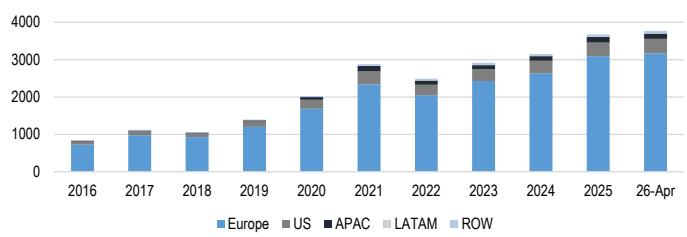  
Source: JPM, Morningstar. Data as of April 30 $^{th}$ 2026

Figure 2: Sustainable AuM market share  
Sustainable AuM market share by region (%)  
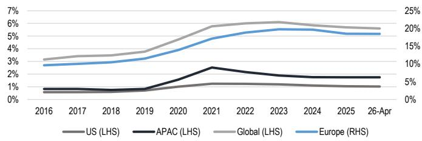  
Source: JPM, Morningstar. Data as of April 30 $^{th}$ 2026  
Figure 3: European funds account for the vast majority of sustainable assets  
AuM of Sustainable Funds, by domicile (%)

Figure 4: Equity funds account for roughly two-thirds of sustainable funds  
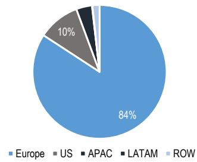

AuM of Sustainable Funds, by asset class and region (%)  
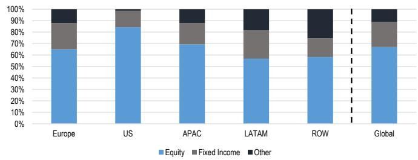  
Source: JPM, Morningstar. Data as of April 30 $^{th}$ 2026  
Source: JPM, Morningstar. Data as of April 30 $^{th}$ 2026

Sustainable equity have seen marginal inflows in the first four months of the year; this contrasts with 2025, where the asset class saw outflows (Figure 5). European inflows were offset by outflows in Asia and the US (Figure 6).

Sustainable fixed income continues to register inflows, and these have come in roughly in line with broad market funds (Figure 7). By region, sustainable flows were better than the broad market in Europe, and worse in the US. Asia registered outflows, and these were of a larger magnitude (as % of AuM) in sustainable funds (Figure 8).

Figure 5: Equity flows  
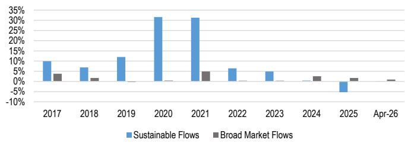  
Source: JPM, Morningstar. Data as of April 30 $^{th}$ 2026

Figure 6: YTD equity flows by region  
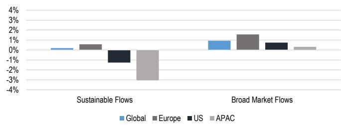  
Source: JPM, Morningstar. Data as of April 30 $^{th}$ 2026

Figure 7: Fixed income flows  
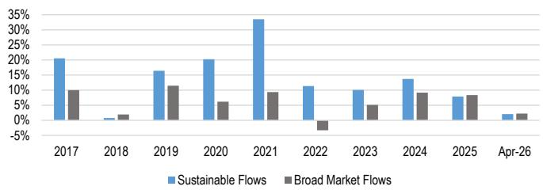  
Source: JPM, Morningstar. Data as of April 30 $^{th}$ 2026

Figure 8: YTD fixed income flows by region  
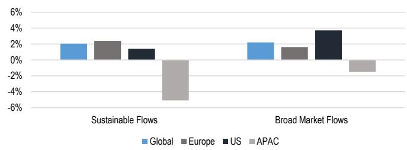  
Source: JPM, Morningstar. Data as of April 30 $^{th}$ 2026

Relative performance up to April has been broadly in line.

In equities, European sustainable funds marginally outperformed European broad market funds (Figure 9), while sustainable US funds underperformed slightly (Figure 10). This is not dissimilar to the expectations we laid out in our FY outlook, where we flagged that superimposing our strategists' sector allocation onto the tilts found in the average sustainable fund did not yield a clear conclusion on the direction of performance.

In fixed income, both sustainable funds in Europe and in the US performed in line with their respective broad market funds (Figure 11 and Figure 12).

Figure 9: Sustainable equity funds outperformed in Europe by 0.8% YTD...  
Annualized returns of sustainable and broad market European equity funds (%)  
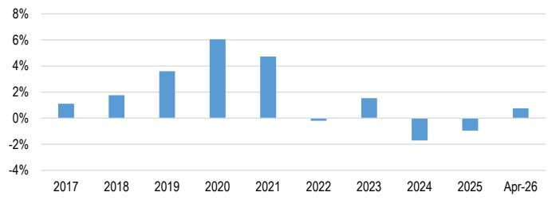  
Based on EUR returns.  
Source: JPM, Morningstar. Data as of April 30 $^{th}$ 2026

Figure 10: ...and underperformed by 0.6% in the US  
Annualized returns of sustainable and broad market US equity funds (%)  
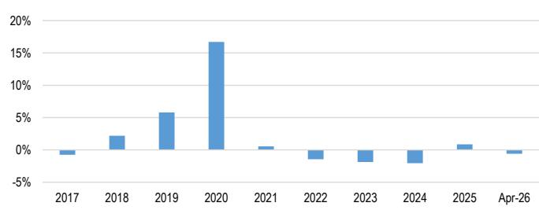  
Based on USD returns.  
Source: JPM, Morningstar. Data as of April 30 $^{th}$ 2026

Figure 11: European sustainable fixed income funds performed in line with the broad market...  
Annualized returns of sustainable and broad market European fixed income funds (%)  
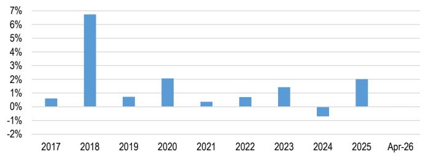  
Based on EUR returns.  
Source: JPM, Morningstar. Data as of April 30 $^{th}$ 2026

Figure 12: ...whilst US Sustainable fixed income funds registered very marginal underperformance  
Annualized returns of sustainable and broad market US fixed income funds (%)  
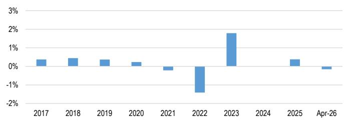  
Based on USD returns.  
Source: JPM, Morningstar. Data as of April 30 $^{th}$ 2026

## SFDR funds: assets rising, returns uneven

Funds that classify themselves as Article 8 or 9 under SFDR accounted for 49% of the European fund market in April. In equities, assets in Article 8 and 9 funds have grown by 0.4% and 5%, respectively, in the first four months of 2026. In fixed income, assets in Article 8 and 9 funds have grown by 2% and 0.4%, respectively, in the same period.

In equities, Article 8 funds have slightly underperformed Article 6 funds YTD, while Article 9 funds have slightly outperformed Article 6 funds (Figure 13). However, Article 8 and 9 equity funds have both underperformed Article 6 funds over longer time horizons. Inflows over the period have been concentrated in Article 6, followed by Article 8, while Article 9 funds have experienced outflows (Figure 14).

In fixed income, Article 6, 8 and 9 funds have performed broadly in line YTD (Figure 15), and have all experienced inflows over the period (Figure 16).

Figure 13: SFDR equity returns  
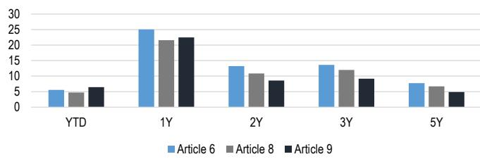  
Based on local currency returns.

Figure 14: Quarterly flows SFDR equity  
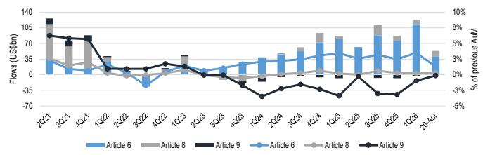  
Source: JPM, Morningstar. Data as of April 30 $^{th}$ 2026

Source: JPM, Morningstar. Data as of April 30 $^{th}$ 2026  
Figure 15: SFDR fixed income returns  
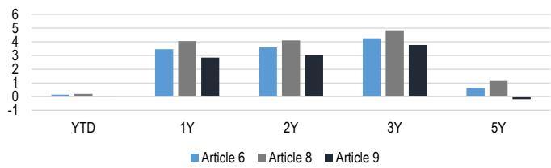  
Based on local currency returns.  
Source: JPM, Morningstar. Data as of April 30 $^{th}$ 2026

Figure 16: Quarterly flows SFDR fixed income  
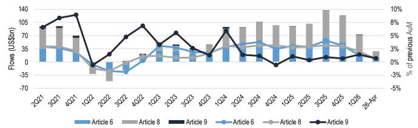  
Source: JPM, Morningstar. Data as of April 30 $^{th}$ 2026

## Looking to the future: tech could hurt

If we left IT out of the equation, the implications of our Strategists' preferred sector allocations on the performance of sustainable funds would be broadly neutral when we superimpose them with the tilts found in sustainable funds. Excluding IT, the other sector views roughly cancel each other out: the positioning of sustainable funds in utilities, industrials and energy aligns to our Strategists' views in those sectors, whilst communication services and real estate could act as headwinds to sustainable fund performance.

Tech introduces downside risks, though. Globally, sustainable funds often appear to be underweight technology relative to the broad market due to the fact that the former has a European bias, which has less tech, and the latter has a US bias, where the tech sector accounts for a much higher proportion of the market. Regionally, our strategists have a preference for Europe, where they are OW, over the US, where they hold a Neutral. At the same time, however, they have laid out a very strong case for the outperformance of the AI theme, which is more US-centric. It is unclear how these cross-currents will continue to play out within sustainable funds. The downside risk, however, is more pronounced today vs. our last outlook, as the preference for tech has broadened beyond the US, with our EM and Japan strategies also OW the sector.

Table 1: Global Strategy sector calls

<table><tr><td>Sector</td><td>US</td><td>Europe</td><td>Japan</td><td>EM</td></tr><tr><td>Materials</td><td>UW</td><td>OW</td><td>OW</td><td>OW</td></tr><tr><td>Information Technology</td><td>OW</td><td>N</td><td>OW</td><td>OW</td></tr><tr><td>Communication Services</td><td>OW</td><td>N</td><td>N</td><td>N</td></tr><tr><td>Utilities</td><td>OW</td><td>N</td><td>UW</td><td>N</td></tr><tr><td>Industrials</td><td>N</td><td>OW</td><td>N</td><td>N</td></tr><tr><td>Consumer Discretionary</td><td>N</td><td>OW</td><td>N</td><td>N</td></tr><tr><td>Consumer Staples</td><td>N</td><td>UW</td><td>UW</td><td>UW</td></tr><tr><td>Health Care</td><td>N</td><td>N</td><td>UW</td><td>UW</td></tr><tr><td>Financials</td><td>N</td><td>N</td><td>OW</td><td>OW</td></tr><tr><td>Real Estate</td><td>UW</td><td>N</td><td>N</td><td>N</td></tr><tr><td>Energy</td><td>UW</td><td>UW</td><td>OW</td><td>OW</td></tr></table>

Source: JPM

Figure 17: Sector exposure of sustainable funds  
Sector exposure of sustainable equity funds relative to the MSCI ACWI (%)  
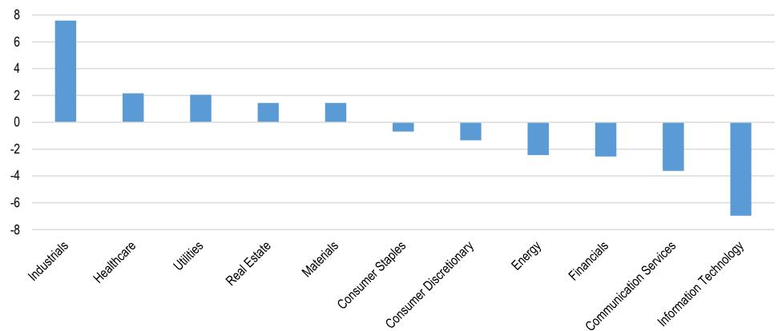  
Source: JPM, Morningstar, MSCI. Data as of April 30 $^{th}$ 2026

What is ESGQ? From our quantitative lens, we look at the world of sustainability by using JPM's ESGQ framework. ESGQ is a quantitative tool to help investors pick stocks in a responsible way. In brief, we use: 1) stable ESG scores that capture the long-term corporate responsibility profile of a company, 2) use faster moving ESG data that isolate newsflow on potential controversies, and 3) add the Momentum in these scores to capture changes in sentiment and price behaviour

## ESGQ: An Inadvertent AI Hedge

The first half of 2026 has been a difficult one to read for ESG investors. A volatile geopolitical backdrop into late Q1 rewarded defensive, quality-tilted exposures and gave ESG strategies a brief moment of relative outperformance, before a concentrated AI hardware rally from late March pulled the index higher on leadership that most ESG-screened universes structurally underweight. The result is a market where the same characteristics that defined ESG investing through the post-2020 period, defensive sector composition and a tilt away from mega-cap Tech, have become the dominant source of underperformance. Whether that constitutes a problem or an opportunity depends on the lens, and that is the question this section addresses for our quantitative ESG strategy, ESGQ.

Our central finding is that ESGQ has not changed; the world around it has. The factor and sector profile of the strategy is broadly in line with its historical character, with the only material extension being a deeper IT underweight that now sits at roughly three times its long-run average. What has shifted is what the macro environment now signals: dollar strength tracks AI leadership rather than risk-on, falling yields pair with dispersion shocks rather than growth scares, and volatility regimes have changed character. The strategy's defensive identity is intact, but it is being expressed through a different macro signature than the full sample suggested.

The actionable takeaway is to think about ESGQ as offering two distinct defensive properties rather than one. The first is the classical equity-drawdown hedge, which the macro analysis confirms with a 6.9 percentage point asymmetry between falling and rising equity markets. The second is an implicit AI hedge, mechanically embedded in the IT underweight, which would translate into relative outperformance if disappointment around the financial returns of AI capex triggers a re-rating of the leadership cohort. The headwind on the long-only side and the hedge are the same position, which is the single most important thing to internalize about the strategy in this regime.

For allocators with significant AI exposure already in the portfolio, we note ESGQ offers a genuine diversification benefit. For those without it, long-short ESG appears the cleaner expression: ESGQ and SQ are in positive territory YTD on the back of wide stock and sector dispersion, while long-only ESG has paid the full cost of the AI underweight without the offsetting short leg. The sections that follow build the evidence behind this view, working through performance, valuation, sector and factor positioning, and macro sensitivities in turn.

## Performance: Caught on the Wrong Side of AI

ESG quantitative strategies have experienced a mixed 2026 so far, and the macro backdrop explains most of the path. Geopolitical stress into late Q1 drove a roughly 10% S&P 500 drawdown that rewarded quality-tilted, lower-beta exposures, then a concentrated AI hardware rally from late March carried US equities back to new highs. The ESGQ universe is structurally underweight that complex, which is the proximate cause of the long-only drag and, as the sector and macro sections develop, the basis for treating the strategy as an implicit AI hedge rather than a strategy fighting the tape. Style leadership compounded the second-leg headwind: value is ahead of growth by 11% in the US, with small caps, high beta, and EM also leading, and the MSCI USA Energy has outperformed the MSCI USA by more than 20 percent YTD. The L/S strategy, with access to the short leg, has held its ground; long-only ESGQ has not.

Table 2: Global ESGQ Excess Long Performance 2026  
YTD to 31st of May 2026

<table><tr><td></td><td>YTD</td><td>1M</td><td>3M</td><td>6M</td><td>12M</td><td>3Y</td><td>5Y</td><td>Since Incpt</td></tr><tr><td>ESGQ</td><td>-2.4%</td><td>-2.3%</td><td>-6.7%</td><td>-2.7%</td><td>-9.1%</td><td>-19.1%</td><td>-20.3%</td><td>32%</td></tr><tr><td>EQ</td><td>-1.0%</td><td>-4.1%</td><td>-8.6%</td><td>-0.7%</td><td>-7.0%</td><td>-15.8%</td><td>-14.1%</td><td>15%</td></tr><tr><td>SQ</td><td>-4.5%</td><td>-2.1%</td><td>-7.3%</td><td>-4.9%</td><td>-14.7%</td><td>-20.6%</td><td>-25.8%</td><td>9%</td></tr><tr><td>GQ</td><td>-3.0%</td><td>-3.5%</td><td>-7.5%</td><td>-2.8%</td><td>-10.2%</td><td>-19.8%</td><td>-20.8%</td><td>16%</td></tr></table>

Source: JPM Global Quantitative Strategy

SQ is the weakest long-only performer YTD and the heaviest loser over five years, consistent with the market punishing high-scoring names once the risk-on rotation took hold. EQ holds up best on the long leg but offers little cushion at longer horizons. ESGQ and GQ sit between the two, with three- and five-year excess returns deep in negative territory across the group. Long-only ESG has not paid for itself on any meaningful lookback, and the AI and semis complex that has driven both the US rebound and the April EM rally sits underweight in most ESG-screened universes. We document the magnitude of that underweight in the sector section and return to its defensive properties in the macro discussion.

Table 3: Global ESGQ L/S Performance 2026

Long-short is working because the short leg is. With over 80 points of stock dispersion in Europe and similar in the US, ESGQ and SQ are capturing it; EQ is not.

<table><tr><td></td><td>YTD</td><td>1M</td><td>3M</td><td>6M</td><td>12M</td><td>3Y</td><td>5Y</td><td>Since Incpt</td></tr><tr><td>ESGQ</td><td>0.7%</td><td>-0.2%</td><td>-1.8%</td><td>-0.3%</td><td>-0.4%</td><td>-17.2%</td><td>-4.1%</td><td>99%</td></tr><tr><td>EQ</td><td>-5.0%</td><td>-2.7%</td><td>-7.7%</td><td>-4.0%</td><td>-6.2%</td><td>-17.9%</td><td>-4.0%</td><td>12%</td></tr><tr><td>SQ</td><td>2.1%</td><td>1.5%</td><td>0.7%</td><td>2.2%</td><td>-2.0%</td><td>-15.4%</td><td>-16.9%</td><td>17%</td></tr><tr><td>GQ</td><td>-2.9%</td><td>-1.4%</td><td>-3.5%</td><td>-4.5%</td><td>-7.4%</td><td>-21.0%</td><td>-3.8%</td><td>49%</td></tr></table>

Source: JPM Global Quantitative Strategy

The L/S read is more constructive. ESGQ retains the strongest since-inception spread in the set and SQ posts the best YTD L/S return, helped by the wide sector and stock dispersion that has characterized this market. EQ is the standout disappointment, the weakest L/S performer YTD despite its relative strength on the long leg. GQ lags on both legs, with the softest three-year L/S print of the group.

Figure 18: Global ESGQ, EQ, SG and GQ YTD Excess Long Performance  
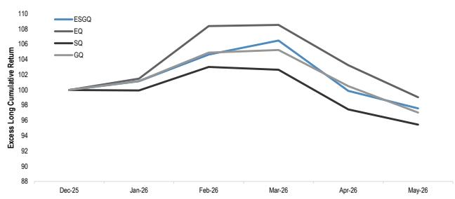  
Source: JPM Global Quantitative Strategy

Figure 19: Global ESGQ, EQ, SG and GQ YTD L/S Performance  
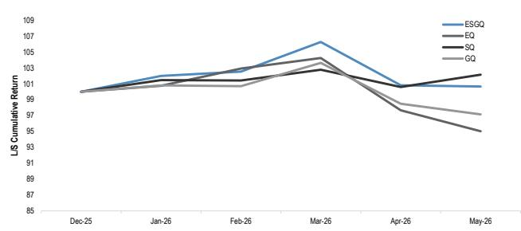  
Source: JPM Global Quantitative Strategy  
The headwind and the hedge are the same position. ESGQ's IT underweight is the largest source of long-only tracking error this year, and the largest source of differentiation if AI leadership breaks.

The cumulative curves map cleanly to the regime shift. All four long-only signals rallied into late Q1 as geopolitical risk kept defensive exposures bid, then peaked in February or March and surrendered the gain and more into May once AI and semis led the market higher; SQ travelled the furthest from peak to trough. The L/S panel tells a different story. ESGQ held a steady drift higher through the volatile period and finished May closest to its peak, while SQ posted the strongest print through a wider arc that gave back most of the March highs as risk appetite returned. EQ and GQ trended lower throughout. We believe this argues for running ESG factor exposure on a long-short basis, with ESGQ as the core strategy and SQ as a higher-beta complement, while sizing long-only ESG positions to beta tolerance rather than expected alpha. The risk to monitor is continued AI-led leadership, which would keep the long-only headwind in place; the offset is that the same underweight makes ESGQ a hedge against an AI re-rating, a property we develop in the sections that follow.

## Valuation: Elevated but Supported

If long-only ESG is hard to defend on performance alone, the next question is whether the fundamentals make the case any easier. They make part of it, in our view. The long leg looks expensive against both the short leg and its own history, with fundamentals that justify part but not all of the premium. ESGQ longs trade on a higher forward multiple than shorts and the benchmark, with rising EPS revisions and stronger growth, but the gap has widened beyond what earnings alone can explain.

Table 4: ESGQ Fundamentals - Mean

<table><tr><td></td><td>Fwd P/E</td><td>DY</td><td>EPS Revs</td><td>EPS Revs Change</td><td>EPS Growth</td><td>RoE</td><td>Beta</td><td>Size</td></tr><tr><td>Long</td><td>17.2</td><td>2.4</td><td>9%</td><td>Rising</td><td>13.9</td><td>62.6</td><td>0.8</td><td>37,869</td></tr><tr><td>Short</td><td>14.3</td><td>2.0</td><td>0%</td><td>Falling</td><td>17.0</td><td>7.3</td><td>0.9</td><td>41,104</td></tr><tr><td>Benchmark</td><td>15.8</td><td>2.3</td><td>13%</td><td>Rising</td><td>147.9</td><td>24.6</td><td>0.9</td><td>69,497</td></tr></table>

The fundamentals mostly support a higher valuation premium. The exception is EPS Growth.  
Source: JPM Global Quantitative Strategy

The long leg carries a meaningful quality and growth tilt: higher forward P/E, higher EPS Revisions, higher RoE, and rising EPS revisions against a falling print on the short side. The dividend yield is also higher, and beta sits below the benchmark, consistent with the defensive profile that supported performance into Q1. The short leg shows the inverse, with depressed multiples, no revision support, and beta in line with the index. The fundamentals do their job; the question is the price being paid for them.

Figure 20: Global ESGQ Long vs Market P/E Relative  
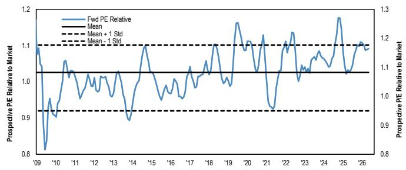  
Source: JPM Global Quantitative Strategy

Figure 21: Global ESGQ Long vs Short P/E Relative  
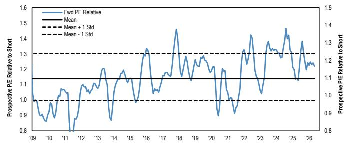  
Source: JPM Global Quantitative Strategy

Both relative P/E series sit near the upper end of their post-2009 ranges, above the long-run mean and pressing against the +1 standard deviation band. Long versus market has stretched in line with the broader quality and growth re-rating, while long versus short is the more extended of the two and the more relevant for the long-short strategy, where multiple compression on the long leg without an offsetting move on the short leg is the principal mean-reversion risk. We believe this argues for keeping long-short ESG exposure tilted toward ESGQ and SQ, which carry less directional valuation risk than running long-only outright, and treating any further widening in the long versus short P/E as a signal to trim rather than add.

## ESGQ Sector Positioning: An Implicit AI Hedge

The dominant active call is a deep IT underweight paired with a large Industrials overweight, and the gap between current and historical positioning has rarely been wider. This is what gives ESGQ its character as an implicit AI hedge: the strategy is structurally underweight the complex that has led the market, the positioning has extended further from history in 2026 than in some time, and the resulting active risk is the proximate cause of the long-only drag flagged in the performance section.

Figure 22: Global ESGQ Long vs Market Sector Allocation  
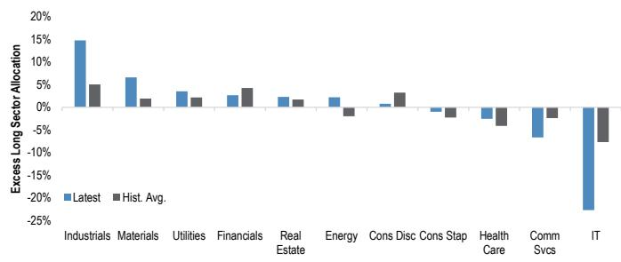  
Source: JPM Global Quantitative Strategy

Figure 23: Global ESGQ L/S Sector Allocation  
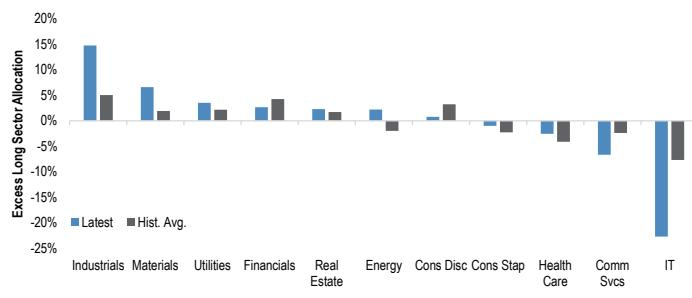  
Source: JPM Global Quantitative Strategy

## Three times the historical IT

underweight. That single position is doing more to drive long-only tracking error than any other call in the strategy.

The long-only position is 22.7% underweight IT against a historical average of -7.7%, the largest active call in the strategy and roughly three times its long-run tilt. Industrials runs +14.7%, also close to three times the historical +5.1%, with Materials at +6.6% versus +1.9% and Real Estate and Utilities each carrying small overweights against modest historical positions. Financials sits at +2.7% against a +4.3% average, a rare case of an active weight running below history. The long-short positioning preserves the same direction with smaller magnitudes: IT at -4%, Industrials at +12%, Materials at

The hedge only pays if AI breaks. Until then, the same call that defines ESGQ is what costs it on the long side.

+4%, with Energy and Financials each at +2%. The shape is consistent across the two views; only the size differs.

The implication is that sector positioning, not stock selection, has been the dominant driver of recent long-only underperformance, and the AI hedge characteristic cuts both ways. We believe the IT call needs to be sized deliberately rather than allowed to drift further: at three times its historical magnitude, the underweight is the clearest source of the long-only headwind if AI leadership persists, but it is also what

makes ESGQ valuable in a drawdown of the AI complex or a broadening of market leadership, the second defensive property we develop in the macro discussion. For allocators with significant AI exposure already in the portfolio, this offers a genuine diversification benefit; for those without it, long-short ESG remains the cleaner expression, with the short leg offsetting part of the directional sector risk that long-only carries outright.

## Factor Profile: Defensive Through Selection

Quality tilt remains notably higher than the historical average - both Long and L/S.

The strategy is running a more pronounced Quality and low-Risk profile than its long-run average, with a Value underweight that has also extended. This is the factor signature of a defensive, AI-hedged strategy, but it is being expressed through stock selection rather than through the sector tilt itself, which is worth flagging because the sector overweights, Industrials, Materials, and Financials, are not natural homes for Quality or low-Risk exposures.

Figure 24: ESGQ Long Factor Exposures  
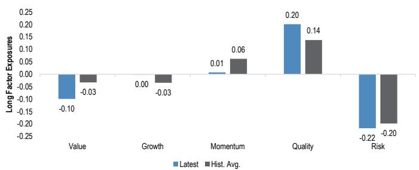  
Source: JPM Global Quantitative Strategy

Figure 25: ESGQ L/S Factor Exposures  
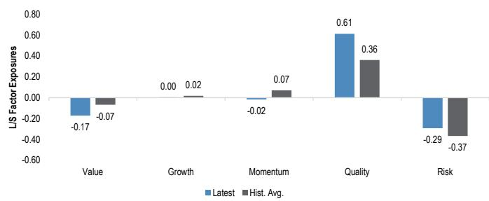  
Source: JPM Global Quantitative Strategy

Quality is the dominant active exposure on both views, at 0.20 on the long leg against a 0.14 historical average and 0.61 on the long-short against 0.36, the latter close to double its long-run tilt. The low-Risk exposure is the natural pair, at -0.22 long and -0.29 long-short, both deeper than history on the long view and slightly less negative than the -0.37 historical average on the long-short. Value sits at -0.10 long and -0.17 long-short, meaningfully below the long-run average, which is consistent with the IT-underweight, Industrials-overweight sector picture: the strategy is paying up for quality rather than buying it cheap. Growth and Momentum are essentially neutral on both views, with current readings close to zero and modestly below their historical averages.

The factor and sector readings agree on the underweight to the high-multiple growth complex, but the natural counterparts, a Value overweight or a clean Quality short, are both absent. ESGQ is long Quality, the same factor the AI leadership cohort scores well on, so the strategy cannot rely on a factor-level short of Quality to express its sector view. What separates ESGQ from a strategy that would happily own the Mag 7 alongside its Quality tilt is twofold: the absence of positive Growth and Momentum

exposures, both of which the leadership cohort carries, and the deep low-Risk exposure, which is the cleanest factor counter to a complex with a large high-risk bias. The defensive character is therefore built from three sources working together: a Quality tilt sourced from within Industrials, Materials, and Financials rather than from mega-cap Tech, a low-Risk exposure that directly offsets the high-risk profile of the leadership, and the absence of the Growth and Momentum exposures that would otherwise pull the strategy toward the same names it is trying to underweight on the IT side. We believe this argues for the same positioning conclusion as the sector section, run the exposure long-short, where the Quality and low-Risk premiums are expressed at close to double the long-only magnitude without the directional Value drag. The principal risks to monitor are a broadening of market leadership that revives Value, and a cyclical drawdown that would test whether stock selection can keep the sector-level beta in check.

## Macro Sensitivities: The World Has Changed, Not the Strategy

To assess how ESGQ behaves across macro environments, we sort monthly long-short returns into rising and falling regimes for each of six variables: Dollar, Bond Yields, Inflation, Equity Markets, VIX, and Oil. The analysis reports annualized returns within each regime and lets the asymmetry between rising and falling speak to the direction and strength of each sensitivity. In prior outlooks, we ran this over the full sample to establish the strategy's unconditional macro signature. This year we have shortened the window to 60 months. The post-2020 environment has differed materially from the longer history on rates, inflation, and equity leadership, and we believe a regime-relevant lookback is more useful for an investor allocating today than a coefficient stabilized over twenty years. The trade-off is fewer observations and wider error bands, particularly for variables where rising and falling months are unevenly distributed.

Figure 26: ESGQ L/S Macro Sensitivities - Full Sample
Full Sample - from June 2008 onwards  
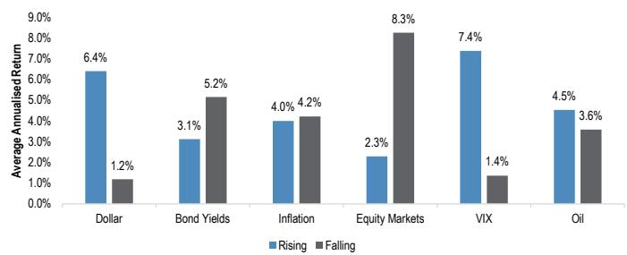  
Source: JPM Global Quantitative Strategy

Figure 27: ESGQ L/S Macro Sensitivities - 60M
Last 60M Window  
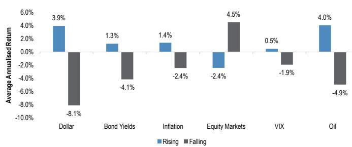  
Source: JPM Global Quantitative Strategy  
Same factor, different world. Three of six macro relationships have flipped or compressed; the equity-market hedge has not.

The two charts side by side make the case directly. Over the long sample, ESGQ delivered a textbook defensive profile: positive returns to dollar strength, falling yields, falling equity markets, rising VIX, and broad insensitivity to inflation and oil. In the 60-month window, three of those relationships have flipped or compressed and two have held. Where the sensitivities have shifted, we attribute the change to the macro environment rather than the strategy. The factor and sector exposure sections show ESGQ running broadly in line with its historical profile, with the only material extension being a deeper IT underweight. What has changed is what the macro variables now signal, not how the factor responds. The strategy still returns 4.5% annualized in falling equity markets versus -2.4% in rising ones, the largest

asymmetry in the recent table and the result that anchors the hedge case. Alongside this, the IT underweight gives ESGQ a second defensive property the macro bars cannot capture: relative outperformance if disappointment around AI capex returns triggers a re-rating of the leadership cohort.

\- Equity Markets (MSCI World): The strategy delivers 4.5% annualized in falling markets against -2.4% in rising ones, a 6.9 percentage point asymmetry that preserves the property an allocator most needs from a defensive strategy. The full sample showed the same direction at 8.3% versus 2.3%, so the relationship has held in sign and roughly in magnitude. This is the load-bearing result and the one that has held cleanly through the regime shift.

\- Dollar (DXY Index): The dollar relationship has flipped, with ESGQ returning -8.1% in rising-dollar months and 3.9% in falling-dollar months, against +6.4% rising and +1.2% falling over the full sample. We read this as the dollar's signal having changed rather than the strategy's response. In recent years, dollar strength has tracked AI leadership and US risk-on phases that ESGQ structurally underweights, while dollar weakness has more often paired with geopolitical stress and policy uncertainty, environments where the defensive tilt earns its keep.

\- Oil (WTI): Oil has moved from broadly insensitive in the long sample (4.5% rising, 3.6% falling) to a clear pro-cyclical asymmetry in the recent window (4.0% rising, -4.9% falling). Rising oil in this cycle is a geopolitical and supply-driven signal rather than a demand one, and the asymmetry is consistent with the defensive read: ESGQ has worked in the same periods where energy prices have spiked on geopolitical stress.

\- Yields (US 10Y): The full-sample tailwind from falling yields (5.2% versus 3.1%) has reversed in the 60-month window (1.3% rising, -4.1% falling). We would not over-read this. The recent sample is dominated by the 2022 to 2024 rate cycle, where falling-yield episodes were often growth-scare or AI-dispersion events that did not produce the classical low-risk bid, and the result reflects that pairing rather than a structural change in factor behavior.

\- VIX (VIX Index): The volatility hedge has effectively gone. The full sample showed a 7.4% versus 1.4% asymmetry; the 60-month window shows 0.5% versus -1.9%, too small to underwrite. Recent volatility events have more often been rate-led or dispersion-driven than growth-scare-driven, and quality and low-risk factors have not responded the way they did historically.

\- Inflation (US YoY CPI): Inflation remains close to neutral, with a mild 1.4% versus -2.4% asymmetry in the recent window against an essentially flat 4.0% versus 4.2% in the full sample. This is one variable where the regime shift has not changed the read.

The VIX hedge is gone, the equity hedge is not. Volatility no longer behaves the way it did, but drawdowns still do, and that is the relationship that pays.

The defensive role is intact and now operates through two distinct channels: the equity-drawdown hedge confirmed by a 6.9 point asymmetry, and the AI-disappointment hedge implied by the IT underweight. Where the macro readings have flipped or compressed, the cause sits with the environment rather than the factor. Dollar weakness and rising oil now signal geopolitical and policy stress rather than cyclical risk-on, falling yields have more often paired with dispersion shocks than growth scares, and volatility regimes have changed character. The strategy's underlying behavior is unchanged, as the steady factor and sector profile confirms. Allocators sizing ESGQ should anchor on the equity-market result and the AI underweight, treating the remaining readings as confirmation rather than independent support.

## Regulation and policy

## EU: still a balancing act

The EU is keeping its Green Deal ambition, but shifting toward more pragmatic delivery. Policy remains focused on decarbonization, electrification, circularity, and nature protection, while easing burdens on firms and households and supporting competitiveness, energy security, and industrial sovereignty. The key shift is a broader mix of “sticks and carrots”: carbon pricing and regulation are being paired with subsidies, state aid, public procurement, targeted protectionism, and infrastructure investment. Simplification efforts are also ongoing on Sustainable Finance & Investing regulations and directives, as exemplified by the current legislative process to reform the Sustainable Finance Disclosure Regulation (SFDR).

## Climate Policy: Ambition Maintained, Tools Adjusted

The EU has locked in a legally binding 2040 climate target. In March 2026, the EU amended the European Climate Law to target a 90% GHG reduction by 2040 versus 1990, split between 85% domestic cuts and up to 5% international carbon credits (here). The target is designed to align climate ambition with competitiveness, industrial policy, and energy affordability.

The ETS remains central, despite political pressure. ETS2, covering buildings and transport, has been delayed to 2028 and adjusted to reduce household inflation risks. ETS1 has faced criticism from heavy industry and some Member States, but major weakening has not materialized so far. The Commission’s €30bn industrial decarbonization “investment booster,” meant to be funded by selling 400 million allowances, was read as a reassuring carbon-price anchor around €75/t (see JPM’s comment here). A broader ETS reform is expected in July 2026.

CBAM has entered its compliance phase, with implementation details still being finalized. The mechanism began compliance in January 2026 after its transition period. Smaller importers below 50 tonnes are excluded, and the first certificate surrender deadline is September 30, 2027 for 2026 embedded emissions. Free allowances for covered sectors will decline gradually.

Climate adaptation is rising on the EU agenda. Annual climate-related economic damage is about €45bn, while only around 25% of losses are insured. A new Climate Resilience and Risk Management framework is expected in late 2026, likely including a common 3°C reference scenario, harmonized risk assessments, and a focus on finance and insurance gaps.

## Industrial Policy, Trade, and Energy: Decarbonization Reframed Around Competitiveness

Climate policy is increasingly being integrated with industrial policy. The EU is balancing carbon pricing with subsidies, state aid, procurement, and de-risking tools that aim to lower the relative cost of clean technologies while protecting domestic industrial capacity.

The Industrial Accelerator Act aims to rebuild EU manufacturing. Proposed in March 2026, it targets manufacturing at 20% of EU GDP by 2035, up from 14.3% in

2024. It would streamline permitting, create lead markets for strategic products, use public procurement and support schemes to foster “Made in EU” goods, regulate foreign investment, and designate industrial acceleration areas. (see JPM’s analysis here),

The EU is becoming more willing to use targeted protectionism. Steel measures include halving tariff-free import quotas and doubling out-of-quota tariffs to 50% from July 2026. Similar logic appears in duties on Chinese EVs, restrictions linked to Chinese solar inverters, and “Made in EU” and low-carbon procurement requirements across strategic sectors as per the IAA.

Energy security has accelerated electrification and grid policy. The Middle East energy shock has pushed the EU to speed up existing plans through AccelerateEU, combining short-term support for households and industry with longer-term electrification and grid investment. (See JPM's analysis here). State aid flexibility is central, though fiscal differences among Member States will shape delivery.

Electrification and grids are the main implementation tests. The EU wants electricity's share of final energy consumption to rise from $23\%$ in 2024 to $32\%$ by 2030. Transport offers the largest near-term potential, buildings face renovation and heat-pump cost barriers, and industrial electrification depends on affordable inputs such as green hydrogen. Grid investment needs are estimated at €584bn by 2030.

Circular Economy and Critical Materials: Resource Security Becomes Strategic The Circular Economy Act will be a key 2026 milestone. Expected in Q3 2026, it will aim to create a single market for secondary raw materials, improve recycled material supply, stimulate demand, and support the EU goal of becoming a circular economy leader by 2030.

The EU aims to double the rate of circularity by 2030. The expected target is to raise the circularity rate from 12% to 24%, linking waste reduction and recycling to competitiveness and supply security.

Critical raw materials are now central to sovereignty. The RESourceEU Action Plan seeks to secure rare earths, cobalt, lithium, and other strategic inputs through a Critical Raw Materials Centre, joint purchasing, stockpiling, crisis coordination, and strategic projects. The EU aims to cut dependencies by up to 50% by 2029 and mobilize up to €3bn in 2026.

PFAS regulation is moving toward wider restrictions. ECHA opinions under REACH are expected in 2026 and will shape the Commission's proposal. Companies face compliance risks, but firms developing PFAS-free alternatives may benefit.

## Biodiversity and Nature: Simplification and Market Tools

The EU is simplifying biodiversity rules while keeping the core objectives. The revised EU Deforestation Regulation has been simplified through updated guidance, FAQs, scope changes, and system updates intended to cut compliance costs by about 75%.

EUDR implementation has been delayed and clarified. It will apply from December 30, 2026 for large and medium firms and June 30, 2027 for small and micro firms, with scope changes including soluble coffee added and leather excluded. (EC's review of the simplified EUDR here)

Nature legislation is under review for competitiveness. The Birds and Habitats Directives were opened for public consultation in May 2026, following the Water Framework Directive in April, as part of a broader deregulation and competitiveness agenda.

The Nature Credit Roadmap points to biodiversity finance. The Commission is developing standards and certification for nature-positive actions to make biodiversity credits more reliable, effective, and credible.

## SFDR 2.0 : A Reshuffled European Sustainable Investing Market?

The European Commission published its SFDR 2.0 legislative proposal on Nov 20, 2025, positioning it as a clarification and simplification of the existing regime, with an estimated \~25% compliance cost reduction (our view and details here: SFDR 2: Transition or Revolution?). The core change was a move away from a disclosure-led approach towards a product categorisation framework with minimum characteristics, aiming to improve clarity, reduce greenwashing risk, and align more closely with other EU frameworks (e.g., Benchmark rules, Taxonomy, fund naming rules).

The proposal introduces three categories: ESG Basics (Article 8), Transition (Article 7), and Sustainable (Article 9), with a common 70% investment threshold and mandatory exclusions (e.g., coal, tobacco, UN Global Compact violators, controversial weapons), while Transition/Sustainable add forward-looking fossil fuel-related exclusions. It also formalised the treatment of impact objectives for Articles 7 and 9 (but not Article 8) and explicitly stated that defence can be compatible with the framework if sustainability standards are met.

The Commission suggested limited disruption, we believe that SFDR 2 could lead to yet another regulatory driven overhaul of the market, and we estimate that at least \~24% of European equity assets might remain in “sustainable products” under the new regime. The proposal also includes a Taxonomy “safe harbour” concept: products with ≥15% taxonomy-aligned investments could be deemed to meet the main threshold for Transition/Sustainable classification, potentially increasing demand for Taxonomy reporting (even as mandatory taxonomy-alignment disclosures for SFDR products would fall away).

Parliament rapporteur draft: largely keeps the architecture but tightens investor-facing rules: On May 4, 2026, the EU Parliament rapporteur Gerben-Jan Gerbendy published a draft parliamentary position on SFDR 2.0 that broadly preserves the Commission's direction of travel while tightening several calibration points. We view the Parliament's draft as an incremental step in the SFDR reform process rather than a definitive resolution. (Our View and details here: SFDR 2.0: Key Takeaways from the EU Parliament Rapporteur's Draft and What it Means for Investors)

Key proposed amendments: mandatory PAI, higher thresholds, fewer “automatic” safe harbours, longer transition: The rapporteur draft proposes several material changes versus the Commission text: (i) making product-level Principal Adverse Impact (PAI) disclosures mandatory across all three categories, including a new PAI requirement for ESG Basics; (ii) tightening ESG Basics by requiring at least a 20%

exclusion floor (i.e. removing the lowest-rated/lowest-indicator part of the universe before the outperformance test); (iii) raising the Taxonomy alignment safe harbour from 15% to 20% for Articles 7 and 9; (iv) removing the automatic “deeming” safe harbours for CTB/PAB benchmark-tracking funds; (v) introducing a prominent disclaimer requirement for non-categorised products; and (vi) extending the main implementation period from 18 to 24 months, while accelerating certain provisions (e.g., removal of entity-level PAI and remuneration disclosures) to apply at entry into force. The draft also introduces a comply-or-explain engagement strategy disclosure, adds a consistency requirement for general-purpose public sector debt held outside the 70% threshold, and highlights potential future regulation/standards for third-party sustainability data products and estimates used under SFDR.

Investor response and further legislative steps: Initial investor reaction was mixed: participants broadly welcomed the longer timeline, retention of the category architecture, and acknowledgment of third-party data challenges, but flagged unresolved issues. Key pressure points include treatment of general-purpose sovereign bonds (still excluded from the 70% threshold, raising challenges for large asset owners), lack of professional-investor carve-outs, unresolved naming/marketing interactions, and the risk that tighter ESG Basics rules could drive significant reclassification of existing Article 8 funds.

Parliament's ECON vote scheduled, key amendments and debating points emerge: The stage has been set for debate in the European Parliament over the future of the SFDR, with the deadline having passed on June 4th for MEPs to file amendments to the rapporteur's proposed reforms. The ECON committee is scheduled to vote on the SFDR 2.0 file on July 15, after which the text will be subject to plenary discussions involving all MEPs to decide the Parliament's final position by the end of September 2026.

Look before you leap: Our main message to PMs & Product Specialists is: “Look before you leap”—or, to use a French expression, « Il est urgent d’attendre » (“It is urgent to wait”). At this stage, we are still far from a clear view of what the final SFDR 2.0 will look like. As a result, portfolio managers and product specialists should be cautious about amending existing processes or products. For policy and engagement experts within financial market participants, however, SFDR 2.0 is already a timely and important discussion: in our view an agreement between co-legislators could be found by the end of this year, paving the way for the subsequent formal adoption of the revised regulation. Once adopted by all, the changes will be effective after a 24 month implementation period (provided that this suggestion from the rapporteur is kept), i.e. in 2029 at the earliest.

## UK: pragmatic decarbonization

The UK continues to tighten its net zero pathway, pairing the proposed Seventh Carbon Budget with measures to scale clean power—via renewables, electricity market reforms, and ongoing commitments to nuclear. In parallel, recent sustainable finance updates signal a pragmatic approach focused on ISSB alignment while limiting incremental reporting burdens for companies.

## Energy & Climate Policy Update

Seventh Carbon Budget tightens the path to Net Zero: On 2 June 2026, the government published its proposed Seventh Carbon Budget, setting a target of approximately 87% emissions reduction over the period 2038 to 2042 compared to 1990 levels. The government cited an independent report from the Energy and Climate Intelligence Unit, supported by analysis from Confederation of British Industries (CBI) Economics, indicating that the net zero economy supported over 1mn jobs in the UK and contributed £105bn in gross value added (GVA) to the UK economy in 2025. The announcement projects that by 2050, the UK could reduce its reliance on fossil fuels from approximately three-quarters of current energy supply to around 15%, while avoiding an estimated £445bn in fossil fuel expenditure over the next 25 years. MPs have until 30 June 2026 to adopt the text.

Energy Independence Bill: Accelerating further domestic renewables. The King's Speech on 13 May 2026 placed energy security at the centre of the UK Government's legislative agenda and announced the Energy Independence Bill, which aims to expand domestic renewables and enhance energy security amid global instability, marking a shift towards clean power.

## Electricity Market Reforms

The UK has enacted a set of energy market interventions to decouple gas and electricity prices, aiming to limit the impact of international commodity shocks on electricity bills given the UK's exposure to LNG markets for gas supply (for more detail, see the European Utilities & Clean Energy team's note). There are three main actions that have taken place:

\- Offering legacy ROC contracts to move to CfDs: Generators with legacy Renewables Obligation Contracts (ROCs) receive subsidies added to consumer bills, supporting various renewable technologies; although the scheme ended in 2017, many contracts remain active until 2037. The proposal is to offer these generators a voluntary switch to fixed-price Contracts for Difference (CfDs), which would reduce market risk and could offset near-term revenue losses by providing stability and mitigating exposure to declining wholesale power prices expected in the 2030s, making the transition NPV-neutral or positive for the companies.

\- The increase in the EGL rate: The electricity generator levy (EGL) was raised from 45% to 55% on revenues above £83/MWh, impacting inframarginal generators with merchant exposure, including those on ROC contracts. While this increases taxes in 2026, wholesale prices remain higher than pre-war levels, making CfDs, which are untaxed by EGL, more attractive.

\- Removal of the legacy CPS: The Carbon Price Support (CPS), a £18/t carbon tax introduced in 2013 to supplement the UK ETS and phase out coal generation, will be removed in April 2028.

The team expects overall UK power prices to decrease, with the expected removal of CPS lowering emissions costs. However, alignment with the EU ETS could offset some of this decrease, leading to a smaller reduction in power prices. EU climate commissioner W. Hoekstra expressed optimism about reaching an agreement to link the EU ETS with the UK ETS, though no target completion date has been set.

Nuclear Energy Update: Sizewell C has progressed from financial close into early construction, with construction cost estimates of approximately £38bn and a target completion/commissioning date of summer 2039. In parallel, the broader UK nuclear landscape over the same period included material progress in Small Modular Reactors (SMRs), including the June 2025 selection of Rolls-Royce SMR as preferred technology partner via a Great British Energy-Nuclear (GBE-N) process, confirmation of Wylfa

(North Wales) in November 2025 for the first three units, and a delivery contract signed in April 2026 supported by £2.6bn of allocated government funding plus a National Wealth Fund commitment of up to £599m.

## Sustainable Finance

We summarize below the main developments in the UK sustainable investing market over recent months:

\- UK Sustainability Reporting Standards: Converging with ISSB. Following the June 2025 consultation, the UK government in February 2026 published its formal response and the final UK SRS S1 (General Requirements for Disclosure of Sustainability-related Financial Information) and UK SRS 2 (Climate-related disclosures), aligned with the ISSB's S1 and S2. While reporting is currently voluntary, the FCA consulted earlier this year on making it mandatory for listed companies, with final rules expected in Autumn 2026. The new requirements would apply to financial years beginning on or after 1 January 2027, with first reports due in 2028, replacing the current TCFD-aligned disclosure framework. Earlier this month, the FCA also proposed to simplify fund-level TCFD disclosures, which it expects will save asset managers £20 million annually.

\- Scope 3 emissions: “Comply or Explain” becomes the default: The final UK SRS 2 makes Scope 3 emissions disclosures optional, with a “comply or explain” approach: companies must either disclose Scope 3 emissions or explain why they have not, including the steps and timelines for future disclosure. The FCA or Companies Act could later make Scope 3 reporting mandatory. Investors raised concerns that this approach may impair comparability.

\- ESG ratings in the FCA perimeter (rules due Q4 2026): At the end of 2025, the FCA consulted on its rules for ESG ratings providers, including specific rules on conflicts of interest. The FCA also launched a voluntary reporting pilot for ESG ratings providers, which will help assess whether proposed metrics for ESG ratings reporting are clear, feasible, proportionate, and useful for supervisory purposes. Final rules are expected to be published by Q4 2026 and to enter into force by June 2028.

\- Stewardship Code refresh: The UK's updated Stewardship Code came into effect in January 2026. The Code is not binding and applies only to investors who choose to become signatories (as of January 2026, 291 asset managers, asset owners, and service providers representing £57.3 trillion AUM were signatories). UK policymakers have used the Code as a tool to encourage institutional shareholders to engage with companies, generally with a focus on long-term value creation rather than short-term profit maximization.

\- SDR labelling: Earlier this year, the FCA published examples of good and poor practice for funds under its Sustainability Disclosure Requirements labeling regime, notably highlighting the need for clear, consistent, and plain-language disclosures.

\- Transition Finance Guidelines: The UK Transition Finance Council (TFC) consulted in 2025 on a set of principles and factors for financial institutions to assess the eligibility of entities to transition finance. In November 2025, the TFC released a second version of its guidelines, clarifying that a credible transition needs to be compatible with the goal of the Paris Agreement, with 1.5 alignment preferred but not required. In March 2026, the Transition Finance Council published additional guidance (here), to help investors and lenders to “assess the credibility of a real economy entity’s transition ambition, planning and investment”, including whether they are “anchored to the Paris Agreement average temperature goal”.

## US: noise and reality

US renewable policy became more clear during the summer of 2025 with the passage of the One Big Beautiful Bill Act (OBBBA) and subsequent safe harbor update, though there are still some pending decisions that could create disruption in the space.

The OBBBA was supportive of baseload power sources, with unchanged or extended tax credits for geothermal, energy storage, nuclear and fuel cells. The expiry date for solar and wind tax credits for project owners (48E and 45Y, respectively) was pulled forward to YE27, though safe harbor rules allow owners to lock-in tax credits thru YE30 if certain conditions are met (see note). Developers have until July 4, 2026 to safe harbor tax credits thru YE30. 45X manufacturing tax credits were left unchanged, with the exception of wind components.

Importantly, the OBBBA for the first time included restrictions on foreign entities of concern (FEOC) ability to qualify for renewable tax credits, which went into effect on January 1, 2026. Certain FEOC provisions were clearly defined in the OBBBA (e.g. entity can have no more than 25% equity owned by a FEOC), while others such as “material assistance” from FEOC are still to be provided in pending guidelines from the government. We believe FEOC is likely the most disruptive to BESS given Chinese supply of LFP batteries. We note that the absence of clearly defined FEOC guidelines has led to some project delays as some tax equity providers await final policy clarity before committing funding.

Several potential policy/geopolitical headwinds remain. 1) The Department of Commerce's Section 232 investigation into US imports of polysilicon could increase costs for solar, a potential tailwind for U.S.-based FSLR, though a potential headwind for the remainder of the industry. 2) The Department of the Interior notified staff in mid-2025 that all solar and wind projects that touch federal land must receive the Interior Secretary's sign-off to receive a permit. While industry checks suggest that there has been no/little impact to most project activity, we believe there could still be potential project-specific risks. 3) There could be a prolonged legal battle regarding the legality of President Biden's two year AD/CVD moratorium between June 2022-June 2024. Within our coverage, we believe CSIQ faces the most potential risk in this regard. 4) As discussed above, initial FEOC guidelines are expected to be issued soon. Stricter than expected guidelines could be a positive for FSLR though a potential risk to the overall industry.

On policy, the past months have seen a revoking of the EPA's 2009 “ $endangerment \ finding$ ” that greenhouse gases threaten public health and welfare, undermining the legal basis for federal regulation of GHG emissions (link). This has been coupled with broad regulatory rollbacks, including plans or actions to abolish greenhouse gas standards for cars and trucks (link), weaken fuel-economy and tailpipe rules (link), loosen pollution controls on fossil-fuel power plants (link), and narrow Clean Water Act protections (link). At the same time, the Administration has proposed deep cuts to NOAA, NASA, and other research programs for 2027 (link), although it is unclear whether they will materialise: 2026 saw similar proposals but they were broadly rejected by Congress.

## Latin America: focus on the environmental pillar

## Brazil: ongoing momentum on environmental policy, u-turn on disclosure requirements

Social policy - workweek reduction: the main ongoing discussion on the social policy front is the reduction of the workweek from 44 hours to 40 hours, through a constitutional amendment (“PEC 6x1”, Pec 221/2019). If approved, the implementation should take 14 months, which is much faster than other LatAm countries like Chile (5 years), Mexico (5 years) and Colombia (4 years). According to the bill’s rapporteur, the new workweek would impact roughly one-third of formal employees (“CLT”), with some exemptions (e.g. high-earner individuals). Industry players have raised concerns about a potential 20% increase in costs for labor-intensive activities, such as logistics and hospitality.

Energy storage regulation: the Energy Ministry will hold two regulated auctions for energy storage (BESS) in December, one limited to local-content equipment and another open to global suppliers. The auction size and economic terms should be disclosed in 3Q26. Separately, power regulator Aneel has defined how transmission costs will be charged for energy storage systems, which was seen as one of the main regulatory risks to the segment.

SBCE Moves from Law to Execution: In 2026, Brazil's SBCE shifted from a 2024 legal framework into concrete rulemaking, with the Ministry of Finance presenting a preliminary proposal to define which sectors will fall under mandatory emissions reporting, as part of a phased implementation of the regulated carbon market. The plan starts in 2027 (phase 1) with pulp & paper, iron & steel, cement, primary aluminum, fertilizers, oil & gas production and refining, and air transport. It will expand in 2029 (phase 2) to mining, recycled aluminum, power, glass, food beverages, chemicals, ceramics, and waste. Finally, road, waterway, and rail transport will be included from 2031 (phase 3). Each phase runs over four years (monitoring plan → effective monitoring → national allocation plan), and the transition period is built around reporting and plans—not mandatory emissions reductions. The proposal also signals how compliance will work in practice: MRV is the core building block, companies above 10k tCO $_{2}$ /year would be required to report, and those above 25k tCO $_{2}$ /year could later face emissions limits, with the option to buy carbon credits to offset part of the obligation.

Eco Invest Brazil gains momentum: In late May 2026, Eco Invest Brasil meaningfully increased green funding availability by unlocking R\$13.2bn in its 4th auction for bioeconomy, sustainable tourism, and infrastructure projects—about R\$9bn allocated to the Legal Amazon—and the Treasury then announced a 5th auction focused on six strategic technology-innovation value chains. Eco Invest is a central instrument in the government’s ecological transformation agenda, designed to crowd in private capital and lower financing costs for transition-aligned projects. By the end of 2025 the program had mobilized more than R\$75bn, according to the Finance Ministry. The immediate equity takeaway is pipeline creation: more supported projects across sustainable infrastructure, bioeconomy, innovation, PE/VC, and “green” industrial chains, with 2026 expected to scale further into green fertilizers, critical minerals, batteries, sustainable fuels, green chemicals, applied AI, and circular economy.

Rural Credit Gets Environmental Screening: In April 2026, Brazil put in place a rule that ties access to subsidized rural credit to environmental compliance by requiring

banks to use official satellite tools to check whether borrowers have had any deforestation since 2019; if there is a flag, the producer must prove legal authorization to qualify. The policy is market-relevant because it turns land-use and deforestation risk into a hard underwriting gate for roughly US\$53bn of subsidized rural credit and can spill over into up to US\$114bn of private credit to agribusiness. The immediate effect was institutional and political: banks were forced into a more active environmental “filter” role, while agribusiness pushed back on perceived satellite-error risk and added bureaucracy. In May 2026, implementation deadlines were delayed: large properties (above 15 fiscal modules) were shifted to January 2027, mid-sized (4–15) to July 2027, and small properties to January 2028—reducing near-term pressure but not the structural direction.

CVM Softens Sustainability Disclosure — IFRS S1/S2 Move Further Toward Voluntary Adoption: In late May 2026, Brazil’s securities regulator (CVM) amended Resolution CVM 193 and removed the mandatory requirement to disclose sustainability-related financial information, effectively giving issuers more flexibility to adopt the CBPS/ISSB standards on a voluntary basis. The immediate effect is a lower near-term compliance burden, especially for smaller issuers, but it also reduces comparability across the market and with other jurisdictions and can widen the disclosure gap between leaders and laggards.

Chile's Reconstruction Bill: Implications for Environmental Approval Procedures The National Reconstruction and Economic and Social Development Bill (Bulletin 18216-05), promoted by the Executive Branch, seeks to reactivate the economy, attract investment, and streamline permitting processes, including environmental approval procedures, through significant changes to the General Environmental Framework Law and Chile's Environmental Impact Assessment System (SEIA). Among its main proposals, it provides that modifications, technological upgrades, or process optimizations to projects already approved with a favorable Environmental Qualification Resolution (RCA) would be exempt from re-entering the SEIA provided they do not generate significant environmental impacts; it removes the automatic requirement for SEIA review for the relocation of aquaculture concessions (with exceptions for certain cartographic adjustments); it narrows the assessment of “cumulative environmental impacts” exclusively to projects already in operation, excluding future initiatives as well as those approved or under construction; it sharply reduces the administrative invalidation period for sectoral and environmental authorizations from two years to six months; and it reinstates the Committee of Ministers as the deciding and appeals body for Environmental Impact Studies.

## Colombia pushes for critical minerals governance

Colombia's UNEA-7 initiative on critical minerals (Nairobi, Dec 2025) aimed to pull critical-minerals governance into a global ESG framework and position the country as an agenda-setter on supply-chain standards. The push was underpinned by two drivers: (i) acute domestic concerns over environmental harm tied to illegal mining, and (ii) a strategic read-through to rising global demand for transition-linked inputs (copper, lithium, cobalt, nickel). In terms of structure, Colombia initially sought a legally binding global treaty featuring mandatory sustainability standards and end-to-end traceability across the minerals value chain; the negotiated outcome was meaningfully softer—a nonbinding UNEA-7 resolution centered on enhanced international dialogue/cooperation, resource recovery from waste/tailings, and environmentally sound management of key minerals, with no binding treaty or

mandatory traceability mechanism.

Despite dilution, we see the resolution as directionally important for policy and compliance pathways. First, it creates a “sticky” foothold in the UN process—critical-minerals governance is now embedded in the UNEA agenda and likely to recur (including at UNEA-8), which can catalyze subsequent national rulemaking in producer jurisdictions. Second, it reinforces an ESG-forward framing for extractives in Colombia, signaling potentially tighter expectations around concessions, permitting, and operating standards. Third, traceability is increasingly converging toward a tangible cost center even without a UN treaty, as major end-markets tighten due-diligence and import-related requirements—raising the bar for compliance infrastructure for operators exposed to Colombia/Andean supply chains. Finally, the explicit linkage to illegal mining highlights an enduring regional overhang: reputational and compliance narratives can spill from illicit activity into the formal sector, making credible traceability (if it hardens over time) a potential differentiator.

## Asia: ongoing governance tsunami and energy security prioritization

## China

The $15^{\text{th}}$ Five-Year Plan was finalized and approved in China on March $12^{\text{th}}$ . Notably, energy security features as a core pillar, and energy was treated as strategic infrastructure, with the scaling of new energy part of the agenda for China's modern industrial strategy. Three numerical anchors frame the opportunity set:

1. Non-fossil energy (wind, solar, hydro and nuclear) reaching 25% of total consumption by 2030;

2. Domestic energy production capacity growing to 5.8 billion tonnes of coal equivalent by 2030 from 5.13 billion tce in 2025, implying roughly 2.5% CAGR; and

3. Grid capex potentially exceeding Rmb 5 trillion over the plan period, with annual ultra-high-voltage spending alone surpassing Rmb 100 billion, according to our analyst's channel checks (link). Grid upgrades are framed as a “new-type power system,” with expanded flexibility through new-type storage and smarter dispatch and markets.

Taken together, these targets industrialize energy security into a sustained, multi-year systems-upgrade cycle rather than a one-off stimulus. Notably, the goals also pair with the country's carbon peaking timeline a broader push to accelerate a comprehensive green transition and build a "Beautiful China".

Elsewhere, there has been growing momentum in China on corporate governance. Last year, the State Council released guidelines to improve modern corporate governance “with Chinese features”. The project explicitly mentions a 5-year time period for the establishment of the system and a 2035 target date for a “more refined, modern corporate system with distinctive Chinese features, which would significantly boost the global competitiveness of Chinese enterprises” (link). Following the announcement, the Asset Management Association of China (AMAC) released a set of rules (link - available in Chinese only) that can be interpreted as establishing the first Stewardship Code for the A-share market. The new framework is a mix of voluntary and mandatory obligations and mostly increases pressure on asset managers to vote (those with >5% of a company’s free float shares have an obligation to vote on 13 types of resolutions) and disclose how they vote, but is less focused on engagement.

These efforts have laid the groundwork for a renaissance of corporate governance in China. However, the move from regulation to implementation needs to be monitored going forward. International investors should also be aware of the nuances in the context of these developments in corporate governance, namely the “distinctive Chinese features” mentioned by the State Council (link). These include features that reference Party leadership and also the principles within the AMAC rules relating to alignment with national strategies. However, the emphasis on protection of minority shareholders, corporate governance, ESG responsibilities and information disclosure are still in line with the spirit of corporate governance standards elsewhere.

## South Korea

The Financial Services Commission released a draft roadmap at the end of February this year that lays the groundwork for the implementation of mandatory sustainability

disclosures. The roadmap was released alongside finalized Sustainability Reporting Standards, which broadly align with ISSB, although timelines for scope 3 reporting are notably longer and reporting on non-climate related issues will remain optional, with third-party assurance also considered optional. Under the proposal, companies listed on the KOSPI Index with assets greater than KRW 30trn (\~US\$20bn) will be required to begin sustainability reporting in 2028 (based on 2027 data). Eventually, reporting requirements will be expanded to companies with more than KRW 10trn (\~US\$7bn) in assets.

Outside of ESG reporting, the integration of ESG and in particular corporate governance principles has been a hot topic in Korea this year. The ruling Democratic Party has already made several amendments (e.g. the mandatory cancelation of treasury shares and clarification on the fiduciary duty of company directors) to the Commercial Act since last summer in an effort to overhaul Korea's corporate governance practices. Attention has similarly turned to the Stewardship Code (first introduced in Korea in 2016), the strengthening of which was identified as a key task for the K-Capital Markets Committee earlier this year. Efforts have similarly been made to require financial authorities to inspect and evaluate asset managers' stewardship activities, including the submission of an annual report on their Stewardship Code implementation to the FSC.

Multiple bills pertaining to the implementation of ESG in the investment process have also been proposed in relation to the National Pension Act. These include those suggesting provisions requiring the National Pension Service (NPS), the country's largest asset owner, to reflect the level of Stewardship Code implementation when selecting asset managers, and making the consideration of ESG factors mandatory in the investment process. However, this latter bill, focused on making ESG a mandatory consideration, failed to clear the Health and Welfare Committee due to opposition.

## Elsewhere in Asia

The ESG ETF market in Taiwan has notably enjoyed steady growth in recent years, representing a bright spot for AUM growth (reaching US\$24bn as of April this year according to TWSE) and bearing the fruits of previous efforts by the Taiwan Stock Exchange to introduce ESG reporting.

Elsewhere on ESG topics, it is worth highlighting that, just as Taiwan completed the phase out of nuclear power last year, shutting down its last reactor in May 2025, it is now looking to restart its nuclear agenda. In March this year, Taipower applied to restart the Maanshan and Kuosheng plants (link) as Taiwan grapples with the energy volatility introduced by the Middle East conflict. Note that Taiwan imports 98% of its energy, which is vital to maintaining the economy, which has at the same time boomed in terms of tech-related exports. The development of nuclear policy in Taiwan is a theme to watch for this year.

Figure 28: Taiwan's listed ESG ETF market has demonstrated steady growth in recent years
ESG ETF AUM (NTD bn)  
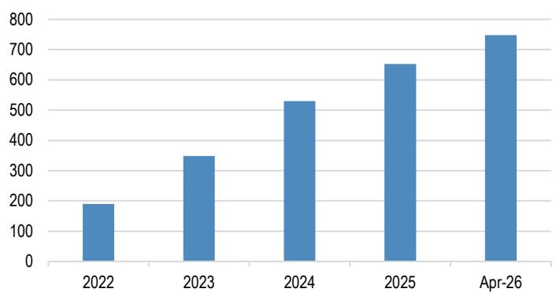  
Source: TWSE.

Figure 29: Taiwan is in the midst of reconsidering its nuclear future
Taiwan operable nuclear power capacity: Reference Unit Power (MWe)  
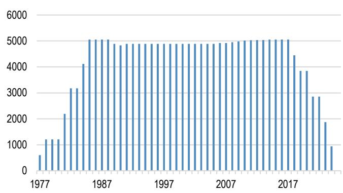  
Source: World Nuclear Association.

In Hong Kong The Accounting and Financial Reporting Council has proposed that all companies that are required to make sustainability disclosure obtain limited assurance for Scope 1 and 2 emissions from the third year of reporting. Large listed companies begin reporting against ISSB-aligned standards this year (based on 2025 information).

Emissions trading entered the mandatory phase in Japan on the 1 $^{st}$ of April this year. The GX-ETS is now in its second phase following a three-year voluntary period, and will run from FY2026-2032. The mandatory system operates on a baseline-and-credit system with an absolute cap, and applies to companies with average annual direct CO $_{2}$ emissions of at least 100,000 tonnes over FY2023–2025, corresponding to approximately 300–400 entities. For the FY2027 period, lower and upper limits on prices for a metric ton of CO $_{2}$ equivalent are set at JPY 1,700 - 4,300 (US\$ 11.36 - 28.73).

On the subject of corporate governance in Japan, the FSA and Tokyo Stock Exchange released draft versions of the Corporate Governance Code in April (link). The new code sharpens expectations on value creation at listed companies with a focus on “growth-orientated governance” and how balance sheet resources are deployed, with an emphasis on managing cash resources. The proposed Code suggests a move away from box-ticking towards the articulation of how retained capital supports a coherent growth strategy. Other changes suggested in the new Code include the enhancement of the Board, including increasing the ratio of independent directors, and a statement of best practice in terms of the disclosure of annual securities reports before general shareholder meetings. Companies are expected to make disclosures of items prescribed in the new Code by July 2027 at the latest.

Malaysia published the country's first National Carbon Market Policy this year, which reinforces domestic climate targets. However, the implementation of an anticipated carbon tax to be applied to hard-to-abate sectors has been put on hold due to current geopolitical circumstances and an unwillingness to place “any extra burden” on industry at this time, according to the Minster for Environmental Sustainability and Natural Resources (link).

# Investable themes in equities

## Global: batteries, grids, and adaptation to climate change

Power me up, Scotty! Alpha generation in the battery revolution

Three reasons underpin our positive stance on batteries: (1) thanks to innovation, ESS is turning intermittent renewables into baseload at increasingly competitive prices; (2) double-digit growth expectations in ESS additions driven by electrification, data centres and AI; and (3) batteries are an enabling technology for the three single-largest decarbonization levers: solar, wind and EVs. We discuss the opportunity in our deep dive battery thematic report. and summarise the OW-rated ideas below.

Table 5: “Power me up”: OW-rated ideas in the Battery value chain

<table><tr><td>Name</td><td>Ticker</td><td>Country</td><td>Sector</td><td>Electrification solution</td><td>Mkt cap ($mn)</td><td>Analyst</td><td>Upside</td></tr><tr><td>LG Energy Solution</td><td>373220 KS</td><td>South Korea</td><td>Electrical Components &amp; Equipment</td><td>Battery producer and equipment</td><td>63,500</td><td>Parsley Ong</td><td>29</td></tr><tr><td>Simplo Technology Co Ltd</td><td>6121 TT</td><td>Taiwan, China</td><td>Electronic Components</td><td>Battery producer and equipment</td><td>2,468</td><td>William Yang</td><td>0</td></tr><tr><td>CATL - A</td><td>300750 CH</td><td>China</td><td>Electrical Components &amp; Equipment</td><td>Battery producer and equipment</td><td>263,229</td><td>Rebecca Wen</td><td>29</td></tr><tr><td>Samsung SDI</td><td>006400 KS</td><td>South Korea</td><td>Electronic Components</td><td>Battery producer and equipment</td><td>29,852</td><td>Sonny Lee</td><td>40</td></tr><tr><td>Wuxi Lead - A</td><td>300450 CH</td><td>China</td><td>Industrial Machinery &amp; Supplies &amp; Components</td><td>Battery producer and equipment</td><td>11,318</td><td>Rebecca Wen</td><td>26</td></tr><tr><td>LG Chem Ltd</td><td>051910 KS</td><td>South Korea</td><td>Commodity Chemicals</td><td>Battery producer and equipment</td><td>19,071</td><td>Parsley Ong</td><td>25</td></tr><tr><td>TDK (6762)</td><td>6762 JP</td><td>Japan</td><td>Electronic Components</td><td>Battery producer and equipment</td><td>44,997</td><td>Akinori Kanemoto</td><td>45</td></tr><tr><td>CALB</td><td>3931 HK</td><td>China</td><td>Automotive Parts &amp; Equipment</td><td>Battery producer and equipment</td><td>2,648</td><td>Rebecca Wen</td><td>47</td></tr><tr><td>Sungrow - A</td><td>300274 CH</td><td>China</td><td>Electrical Components &amp; Equipment</td><td>Battery producer and equipment</td><td>46,783</td><td>Alan Hon</td><td>39</td></tr><tr><td>L&amp;F</td><td>066970 KS</td><td>South Korea</td><td>Electrical Components &amp; Equipment</td><td>Battery Materials</td><td>3,407</td><td>Sonny Lee</td><td>104</td></tr><tr><td>Umicore</td><td>UMI BB</td><td>Belgium</td><td>Specialty Chemicals</td><td>Battery Materials</td><td>6,854</td><td>Chetan Udeshi, CFA</td><td>8</td></tr><tr><td>Putailai</td><td>603659 CH</td><td>China</td><td>Specialty Chemicals</td><td>Battery Materials</td><td>9,387</td><td>Rebecca Wen</td><td>42</td></tr><tr><td>Vale Indonesia</td><td>INCO IJ</td><td>Indonesia</td><td>Diversified Metals &amp; Mining</td><td>Raw Materials</td><td>2,823</td><td>Benny Kurniawan, CFA</td><td>77</td></tr><tr><td>PLS Group</td><td>PLS AU</td><td>Australia</td><td>Diversified Metals &amp; Mining</td><td>Raw Materials</td><td>13,169</td><td>Lyndon Fagan</td><td>21</td></tr><tr><td>Merdeka Copper Gold</td><td>MDKA IJ</td><td>Indonesia</td><td>Diversified Metals &amp; Mining</td><td>Raw Materials</td><td>3,478</td><td>Benny Kurniawan, CFA</td><td>47</td></tr><tr><td>Aneka Tambang</td><td>ANTM IJ</td><td>Indonesia</td><td>Gold</td><td>Raw Materials</td><td>4,211</td><td>Benny Kurniawan, CFA</td><td>50</td></tr><tr><td>Vale</td><td>VALE3 BZ</td><td>Brazil</td><td>Steel</td><td>Raw Materials</td><td>68,737</td><td>Rodolfo Angele, CFA</td><td>34</td></tr></table>

Source: JPM

## Ideas to Make the Grid Great Again

Grid investments and related infrastructure represent a significant growth opportunity, driven by the increasing share of electrification and energy demand from buildings, manufacturing, transportation and datacenters. Investment in the grid is estimated to have reached US\$490bn in 2025, and is expected to grow at a CAGR of 4% over the next five years (BNEF). Within this, smart grid and cybersecurity investments are likely to see the strongest growth, with a CAGR of 9% each. Energy storage systems (ESS) are poised for even higher growth than grid infrastructure itself, with conservative forecasts of annual global installations seeing a 20% CAGR over the next five years.

However, underinvestment in grids is emerging as a key bottleneck in meeting energy demand: Over 2,500 GW of renewable, data center and storage projects worldwide are currently waiting to be connected to the grid. The median wait time to connect to the grid in the US was five years in 2022, whilst developers have to wait for more than ten years in parts of Europe. An unreliable grid has measurable costs: every year, outages cost firms in EMDEs US\$185 billion in efficiency losses, lost sales and back-up generation, and losses from theft and metering inefficiency amount to an estimated US \$90bn globally. Curtailment has increased meaningfully on the back of a higher share of renewables in the power matrix, to the point that our fundamental analysts expect it to average 30% for solar and 20% for wind in Brazil. Cyberattacks are an emerging risk: an improbable, but technologically feasible attack on the US power grid could cause economic and insurance losses between \$240bn and US\$1tn. In our “Make the Grid Great Again” thematic report, we discuss the challenges facing the grid, examine relevant policy, size the growth opportunity, and, more importantly, identify investment ideas, which are summarized in the following table.

Table 6: OW-rated stocks to “make the grid great again”

<table><tr><td>Name</td><td>Ticker</td><td>Country</td><td>Sector</td><td>Grid solution</td><td>Mkt cap ($mn)</td><td>Analyst</td><td>Upside</td></tr><tr><td>KEI Industries Limited</td><td>KEII IN</td><td>India</td><td>Electrical Components &amp; Equipment</td><td>Cables</td><td>5,437</td><td>Rishabh Gupta</td><td>6</td></tr><tr><td>Polycab India Limited</td><td>POLY CAB IN</td><td>India</td><td>Electrical Components &amp; Equipment</td><td>Cables</td><td>15,247</td><td>Rishabh Gupta</td><td>7</td></tr><tr><td>Orient Cables - A</td><td>603606 CH</td><td>China</td><td>Electrical Components &amp; Equipment</td><td>Cables</td><td>4,985</td><td>Alan Hon</td><td>49</td></tr><tr><td>Prysmian</td><td>PRY IM</td><td>Italy</td><td>Electrical Components &amp; Equipment</td><td>Cables</td><td>47,749</td><td>Akash Gupta</td><td>18</td></tr><tr><td>Rolls-Royce</td><td>RR/ LN</td><td>United Kingdom</td><td>Aerospace &amp; Defense</td><td>Distributed Generation</td><td>155,687</td><td>David H Perry, CFA</td><td>8</td></tr><tr><td>Vibra Energia SA</td><td>VBBR3 BZ</td><td>Brazil</td><td>Automotive Retail</td><td>Distributed generation</td><td>6,175</td><td>Rodolfo Angele, CFA</td><td>43</td></tr><tr><td>Sungrow - A</td><td>300274 CH</td><td>China</td><td>Electrical Components &amp; Equipment</td><td>ESS</td><td>46,783</td><td>Alan Hon</td><td>39</td></tr><tr><td>LG Energy Solution</td><td>373220 KS</td><td>South Korea</td><td>Electrical Components &amp; Equipment</td><td>ESS</td><td>63,500</td><td>Parsley Ong</td><td>29</td></tr><tr><td>CALB</td><td>3931 HK</td><td>China</td><td>Automotive Parts &amp; Equipment</td><td>ESS</td><td>2,648</td><td>Rebecca Wen</td><td>47</td></tr><tr><td>Samsung SDI</td><td>006400 KS</td><td>South Korea</td><td>Electronic Components</td><td>ESS</td><td>29,852</td><td>Sonny Lee</td><td>40</td></tr><tr><td>CATL - H</td><td>3750 HK</td><td>Hong Kong SAR, Ch</td><td>Electrical Components &amp; Equipment</td><td>ESS</td><td>14,249</td><td>Rebecca Wen</td><td>1</td></tr><tr><td>Bloom Energy</td><td>BE US</td><td>United States</td><td>Heavy Electrical Equipment</td><td>Generators and UPS</td><td>81,411</td><td>Mark Strouse, CFA</td><td>-3</td></tr><tr><td>Generac</td><td>GNRC US</td><td>United States</td><td>Electrical Components &amp; Equipment</td><td>Generators and UPS</td><td>15,969</td><td>Mark Strouse, CFA</td><td>-1</td></tr><tr><td>Caterpillar Inc.</td><td>CAT US</td><td>United States</td><td>ion Machinery &amp; Heavy Transportation E</td><td>Generators and UPS</td><td>473,503</td><td>Tami Zakaria, CFA</td><td>21</td></tr><tr><td>United Rentals, Inc.</td><td>URI US</td><td>United States</td><td>Trading Companies &amp; Distributors</td><td>Generators and UPS</td><td>72,195</td><td>Tami Zakaria, CFA</td><td>-3</td></tr><tr><td>Xuji Electric - A</td><td>000400 CH</td><td>China</td><td>Heavy Electrical Equipment</td><td>Grid equipment, modernization and reliability</td><td>3,477</td><td>Stephen Tsui, CFA</td><td>43</td></tr><tr><td>Quanta Services</td><td>PWR US</td><td>United States</td><td>Construction &amp; Engineering</td><td>Grid equipment, modernization and reliability</td><td>108,492</td><td>Mark Strouse, CFA</td><td>11</td></tr><tr><td>Hyosung Heavy Industries</td><td>298040 KS</td><td>South Korea</td><td>Heavy Electrical Equipment</td><td>Grid equipment, modernization and reliability</td><td>23,827</td><td>Stephen Tsui, CFA</td><td>1</td></tr><tr><td>Legrand</td><td>LR FP</td><td>France</td><td>Electrical Components &amp; Equipment</td><td>Grid equipment, modernization and reliability</td><td>42,893</td><td>Phil Buller</td><td>30</td></tr><tr><td>Nari Technology - A</td><td>600406 CH</td><td>China</td><td>Heavy Electrical Equipment</td><td>Grid equipment, modernization and reliability</td><td>27,979</td><td>Stephen Tsui, CFA</td><td>27</td></tr><tr><td>Hitachi (6501)</td><td>6501 JP</td><td>UAE</td><td>Industrial Conglomerates</td><td>Grid equipment, modernization and reliability</td><td>129,361</td><td>Junya Ayada</td><td>20</td></tr><tr><td>Qingdao TGOOD Electric</td><td>300001 CH</td><td>China</td><td>Electrical Components &amp; Equipment</td><td>Grid equipment, modernization and reliability</td><td>6,093</td><td>Stephen Tsui, CFA</td><td>-10</td></tr><tr><td>Schneider Electric</td><td>SU FP</td><td>France</td><td>Electrical Components &amp; Equipment</td><td>Grid equipment, modernization and reliability</td><td>180,456</td><td>Phil Buller</td><td>17</td></tr><tr><td>Samsung C&amp;T</td><td>028260 KS</td><td>South Korea</td><td>Industrial Conglomerates</td><td>Grid equipment, modernization and reliability</td><td>55,329</td><td>Jay Kwon</td><td>16</td></tr><tr><td>Valmont Industries</td><td>VMI US</td><td>United States</td><td>Construction &amp; Engineering</td><td>Grid equipment, modernization and reliability</td><td>10,745</td><td>Tomohiko Sano</td><td>-4</td></tr><tr><td>SPIE</td><td>SPIE FP</td><td>France</td><td>Diversified Support Services</td><td>Grid equipment, modernization and reliability</td><td>9,733</td><td>Jane L Sparrow</td><td>12</td></tr><tr><td>Siemens Energy</td><td>ENR GR</td><td>Germany</td><td>Heavy Electrical Equipment</td><td>Grid equipment, modernization and reliability</td><td>144,076</td><td>Phil Buller</td><td>45</td></tr><tr><td>GE Vernova</td><td>GEV US</td><td>United States</td><td>Heavy Electrical Equipment</td><td>Grid equipment, modernization and reliability</td><td>266,307</td><td>Mark Strouse, CFA</td><td>33</td></tr><tr><td>MasTec</td><td>MTZ US</td><td>United States</td><td>Construction &amp; Engineering</td><td>Grid equipment, modernization and reliability</td><td>28,986</td><td>Mark Strouse, CFA</td><td>32</td></tr><tr><td>Mitsubishi Electric (6503)</td><td>6503 JP</td><td>Japan</td><td>Heavy Electrical Equipment</td><td>Grid equipment, modernization and reliability</td><td>73,064</td><td>Junya Ayada</td><td>11</td></tr><tr><td>Infineon Technologies</td><td>IFX GR</td><td>Germany</td><td>Semiconductors</td><td>Grid equipment, modernization and reliability</td><td>119,528</td><td>Sandeep Deshpande</td><td>-6</td></tr><tr><td>Siemens</td><td>SIE GR</td><td>Germany</td><td>Industrial Conglomerates</td><td>Grid equipment, modernization and reliability</td><td>249,672</td><td>Phil Buller</td><td>23</td></tr><tr><td>Itron</td><td>ITRI US</td><td>United States</td><td>Electronic Equipment &amp; Instruments</td><td>Meters</td><td>3,719</td><td>Mark Strouse, CFA</td><td>39</td></tr><tr><td>Sunrun Inc.</td><td>RUN US</td><td>United States</td><td>Electrical Components &amp; Equipment</td><td>Rooftop solar PV</td><td>3,335</td><td>Mark Strouse, CFA</td><td>76</td></tr><tr><td>Hanwha Solutions Corp</td><td>009830 KS</td><td>South Korea</td><td>Commodity Chemicals</td><td>Rooftop solar PV</td><td>4,784</td><td>Parsley Ong</td><td>42</td></tr><tr><td>Premier Energies</td><td>PREMIERE IN</td><td>India</td><td>Semiconductors</td><td>Rooftop solar PV</td><td>5,047</td><td>Sanjay Mookim</td><td>4</td></tr><tr><td>HD Hyundai Electric</td><td>267260 KS</td><td>South Korea</td><td>Heavy Electrical Equipment</td><td>Transformers</td><td>26,537</td><td>Stephen Tsui, CFA</td><td>18</td></tr><tr><td>CG Power Ltd</td><td>CGPOWER IN</td><td>India</td><td>Electrical Components &amp; Equipment</td><td>Transformers</td><td>15,187</td><td>Atul Tiwari</td><td>-1</td></tr><tr><td>Isa Energia</td><td>ISAE4 BZ</td><td>Brazil</td><td>Electric Utilities</td><td>Transmission and distribution</td><td>3,598</td><td>Arthur Pereira, CFA</td><td>9</td></tr><tr><td>Entergy Corp.</td><td>ETR US</td><td>United States</td><td>Electric Utilities</td><td>Transmission and distribution</td><td>48,947</td><td>Jeremy Tonet, CFA</td><td>16</td></tr><tr><td>Equatorial</td><td>EQTL3 BZ</td><td>Brazil</td><td>Electric Utilities</td><td>Transmission and distribution</td><td>9,242</td><td>Arthur Pereira, CFA</td><td>36</td></tr><tr><td>Power Grid Ltd</td><td>PWGR IN</td><td>India</td><td>Electric Utilities</td><td>Transmission and distribution</td><td>28,001</td><td>Atul Tiwari</td><td>21</td></tr><tr><td>National Grid</td><td>NG/ LN</td><td>United Kingdom</td><td>Multi-Utilities</td><td>Transmission and distribution</td><td>82,089</td><td>Pavan Mahbubani, CFA</td><td>18</td></tr><tr><td>Energisa</td><td>ENGI11 BZ</td><td>Brazil</td><td>Electric Utilities</td><td>Transmission and distribution</td><td>4,588</td><td>Arthur Pereira, CFA</td><td>36</td></tr><tr><td>Alupar</td><td>ALUP11 BZ</td><td>Brazil</td><td>Electric Utilities</td><td>Transmission and distribution</td><td>2,081</td><td>Arthur Pereira, CFA</td><td>28</td></tr><tr><td>Xcel Energy</td><td>XEL US</td><td>HK SAR, China</td><td>Electric Utilities</td><td>Transmission and distribution</td><td>45,706</td><td>Jeremy Tonet, CFA</td><td>15</td></tr><tr><td>E.ON</td><td>EOAN GR</td><td>Germany</td><td>Multi-Utilities</td><td>Transmission and distribution</td><td>55,594</td><td>Pavan Mahbubani, CFA</td><td>20</td></tr><tr><td>Copel</td><td>CPLE3 BZ</td><td>Brazil</td><td>Electric Utilities</td><td>Transmission and distribution</td><td>8,569</td><td>Arthur Pereira, CFA</td><td>24</td></tr><tr><td>CMS Energy Corporation</td><td>CMS US</td><td>HK SAR, China</td><td>Multi-Utilities</td><td>Transmission and distribution</td><td>22,522</td><td>Jeremy Tonet, CFA</td><td>11</td></tr><tr><td>SSE Plc</td><td>SSE LN</td><td>United Kingdom</td><td>Electric Utilities</td><td>Transmission and distribution</td><td>38,552</td><td>Pavan Mahbubani, CFA</td><td>24</td></tr><tr><td>DEWA</td><td>DEWA UH</td><td>United Arab Emirat</td><td>Multi-Utilities</td><td>Transmission and distribution</td><td>37,435</td><td>Anna Antonova, CFA</td><td>20</td></tr><tr><td>Manila Electric Company</td><td>MER PM</td><td>Philippines</td><td>Electric Utilities</td><td>Transmission and distribution</td><td>10,867</td><td>Jelline Gaza, CFA</td><td>30</td></tr><tr><td>PPL Corporation</td><td>PPL US</td><td>United States</td><td>Electric Utilities</td><td>Transmission and distribution</td><td>26,952</td><td>Jeremy Tonet, CFA</td><td>16</td></tr><tr><td>Larsen &amp; Toubro Ltd.</td><td>LT IN</td><td>India</td><td>Construction &amp; Engineering</td><td>Transmission and distribution</td><td>60,793</td><td>Atul Tiwari</td><td>21</td></tr><tr><td>NiSource Inc.</td><td>NI US</td><td>United States</td><td>Multi-Utilities</td><td>Transmission and distribution</td><td>22,449</td><td>Eli Jossen, CFA</td><td>10</td></tr><tr><td>Axia ON</td><td>AXIA3 BZ</td><td>Brazil</td><td>Electric Utilities</td><td>Transmission and distribution</td><td>24,212</td><td>Arthur Pereira, CFA</td><td>22</td></tr><tr><td>Ameren Corporation</td><td>AEE US</td><td>United States</td><td>Multi-Utilities</td><td>Transmission and distribution</td><td>29,737</td><td>Jeremy Tonet, CFA</td><td>15</td></tr><tr><td>PPC Group</td><td>PPC GA</td><td>Greece</td><td>Electric Utilities</td><td>Transmission and distribution</td><td>15,745</td><td>Anna Antonova, CFA</td><td>10</td></tr><tr><td>ENEL</td><td>ENEL IM</td><td>Italy</td><td>Construction Machinery</td><td>Transmission and distribution</td><td>117,068</td><td>Javier Garrido</td><td>5</td></tr><tr><td>CK Infrastructure</td><td>1038 HK</td><td>HK SAR, China</td><td>Electric Utilities</td><td>Transmission and distribution</td><td>19,038</td><td>Stephen Tsui, CFA</td><td>17</td></tr><tr><td>Tenaga</td><td>TNB MK</td><td>Malaysia</td><td>Electric Utilities</td><td>Transmission and distribution</td><td>20,850</td><td>Samuel Tan</td><td>4</td></tr><tr><td>Power Assets</td><td>6 HK</td><td>Hong Kong SAR, Ch</td><td>Electric Utilities</td><td>Transmission and distribution</td><td>15,477</td><td>Stephen Tsui, CFA</td><td>14</td></tr><tr><td>PG&amp;E Corp.</td><td>PCG US</td><td>United States</td><td>Electric Utilities</td><td>Transmission and distribution</td><td>37,873</td><td>Aidan C Kelly</td><td>39</td></tr></table>

Source: JPM

## Adaptation reloaded

The past 11 years have been the hottest on record globally, each posting temperatures at least $1^{\circ}$ C above pre-industrial levels. Furthermore, 2024 broke all records, at about $1.55^{\circ}$ C above pre-industrial levels, and 2025 was not far behind, highlighting the urgency of not just mitigating GHG emissions but also the importance of learning to live on and adapt to a warmer planet.

Adaptation strategies can also deliver positive economic returns, with estimates from the Global Center for Adaptation resulting in \~US\$7tn of net economic, social and

environmental benefit from just US\$1.8tn of investment in adaptation solutions by 2030 (link). Finally, adaptation financing needs of developing countries are expected to be at least US\$310bn per year by 2035 according to UNEP (link), highlighting opportunities for investment. Consequently, we expect investors to have a greater focus on adaptation solutions.

In our Adaptation Reloaded report, we screened the JPM coverage universe to identify companies that have significant exposure to climate adaptation solutions/activities, such as:

\- Early warning and environmental assessment: includes climate modeling, emergency response and environmental services;

\- Agrifood and forestry: includes fertilizers, sustainable food, preventing food waste, agricultural productivity, crop protection, precision agriculture, ecosystem conservation, sustainable agriculture and cold chain;

• Water: includes water efficiency, water utilities and desalination;

\- Resilient health;

\- Infrastructure and Urban: includes energy storage systems, industrial cooling, district cooling, home cooling, insulation, resilient infrastructure, smart grid, smart meters, uninterruptible power supply and air quality;

• Finance: includes P&C insurance and reinsurance;

• R&D

The following table summarizes the “adaptation stocks” that are currently rated OW by our covering analysts.

Table 7: OW-rated companies that provide solutions and services related to Adaptation

<table><tr><td>Name</td><td>Ticker</td><td>Country</td><td>Sector</td><td>Adaptation solution</td><td>Mkt cap ($mn)</td><td>Analyst</td><td>Upside</td></tr><tr><td>Novonesis</td><td>NSISB DC</td><td>Denmark</td><td>Specialty Chemicals</td><td>Agricultural productivity</td><td>27,410</td><td>Chetan Udeshi, CFA</td><td>32</td></tr><tr><td>International Flavors &amp; Fragrance</td><td>IFF US</td><td>United States</td><td>Specialty Chemicals</td><td>Agricultural productivity</td><td>20,098</td><td>Jeffrey J. Zekauskas</td><td>17</td></tr><tr><td>Croda</td><td>CRDA LN</td><td>United Kingdom</td><td>Specialty Chemicals</td><td>Crop protection</td><td>5,758</td><td>Chetan Udeshi, CFA</td><td>30</td></tr><tr><td>Smurfit WestRock (LN)</td><td>SWR LN</td><td>Ireland</td><td>ar &amp; Plastic Packaging Products &amp; Mate</td><td>Ecosystem conservation</td><td>22,938</td><td>Detlef Winckelmann</td><td>39</td></tr><tr><td>Dexco</td><td>DXCO3 BZ</td><td>Brazil</td><td>Forest Products</td><td>Ecosystem conservation</td><td>861</td><td>Rodolfo Angele, CFA</td><td>77</td></tr><tr><td>Suzano SA</td><td>SUZB3 BZ</td><td>Brazil</td><td>Paper Products</td><td>Ecosystem conservation</td><td>10,485</td><td>Rodolfo Angele, CFA</td><td>58</td></tr><tr><td>Nutrien</td><td>NTR US</td><td>Canada</td><td>Fertilizers &amp; Agricultural Chemicals</td><td>Fertilizers</td><td>31,190</td><td>Jeffrey J. Zekauskas</td><td>21</td></tr><tr><td>Mahindra &amp; Mahindra</td><td>MM IN</td><td>India</td><td>Automobile Manufacturers</td><td>Precision agriculture</td><td>41,187</td><td>Amyn Pirani</td><td>32</td></tr><tr><td>AGCO Corp.</td><td>AGCO US</td><td>United States</td><td>Agricultural &amp; Farm Machinery</td><td>Precision agriculture</td><td>8,407</td><td>Tami Zakaria, CFA</td><td>27</td></tr><tr><td>Darling Ingredients Inc.</td><td>DAR US</td><td>United States</td><td>Agricultural Products &amp; Services</td><td>Preventing food waste</td><td>9,037</td><td>Thomas Palmer, CFA</td><td>41</td></tr><tr><td>Danone</td><td>BN FP</td><td>France</td><td>Packaged Foods &amp; Meats</td><td>Sustainable Agriculture</td><td>49,578</td><td>Celine Pannuti, CFA</td><td>36</td></tr><tr><td>PepsiCo</td><td>PEP US</td><td>United States</td><td>Soft Drinks &amp; Non-alcoholic Beverages</td><td>Sustainable agriculture</td><td>203,288</td><td>Andrea Teixeira, CFA</td><td>22</td></tr><tr><td>Verisk Analytics</td><td>VRSK US</td><td>United States</td><td>Research &amp; Consulting Services</td><td>Climate modelling</td><td>24,402</td><td>Andrew C. Steinerman</td><td>28</td></tr><tr><td>Neurocrine Biosciences</td><td>NBIX US</td><td>United States</td><td>Biotechnology</td><td>Resilient health</td><td>16,031</td><td>Anupam Rama</td><td>16</td></tr><tr><td>Coway</td><td>021240 KS</td><td>South Korea</td><td>Household Appliances</td><td>Air quality</td><td>4,285</td><td>Jihyun Cho</td><td>42</td></tr><tr><td>Empower</td><td>EMPOWER UH</td><td>Inited Arab Emirate</td><td>Water Utilities</td><td>District cooling</td><td>4,492</td><td>Anna Antonova, CFA</td><td>30</td></tr><tr><td>CALB</td><td>3931 HK</td><td>China</td><td>Automotive Parts &amp; Equipment</td><td>Energy storage systems</td><td>2,648</td><td>Rebecca Wen</td><td>47</td></tr><tr><td>Sungrow - A</td><td>300274 CH</td><td>China</td><td>Electrical Components &amp; Equipment</td><td>Energy storage systems</td><td>46,783</td><td>Alan Hon</td><td>39</td></tr><tr><td>CATL - A</td><td>300750 CH</td><td>China</td><td>Electrical Components &amp; Equipment</td><td>Energy storage systems</td><td>263,229</td><td>Rebecca Wen</td><td>29</td></tr><tr><td>Bloom Energy</td><td>BE US</td><td>United States</td><td>Heavy Electrical Equipment</td><td>Energy storage systems</td><td>81,411</td><td>Mark Strouse, CFA</td><td>-3</td></tr><tr><td>Sunrun Inc.</td><td>RUN US</td><td>United States</td><td>Electrical Components &amp; Equipment</td><td>Energy storage systems</td><td>3,335</td><td>Mark Strouse, CFA</td><td>76</td></tr><tr><td>Brookfield Renewable Partners</td><td>BEP US</td><td>United States</td><td>Renewable Electricity</td><td>Energy storage systems</td><td>10,596</td><td>Mark Strouse, CFA</td><td>16</td></tr><tr><td>Midea Group - A</td><td>000333 CH</td><td>China</td><td>Household Appliances</td><td>Home cooling</td><td>88,897</td><td>DS Kim</td><td>33</td></tr><tr><td>Haier Smart Home Co Ltd - H</td><td>6690 HK</td><td>China</td><td>Household Appliances</td><td>Home cooling</td><td>25,454</td><td>DS Kim</td><td>18</td></tr><tr><td>Sunonwealth</td><td>2421 TT</td><td>Taiwan, China</td><td>istrial Machinery &amp; Supplies &amp; Compon</td><td>Industrial cooling</td><td>1,133</td><td>Jerry Tsai</td><td>50</td></tr><tr><td>Asia Vital Components</td><td>3017 TT</td><td>Taiwan, China</td><td>chnology Hardware, Storage &amp; Peripher</td><td>Industrial cooling</td><td>28,790</td><td>William Yang</td><td>35</td></tr><tr><td>Nien Made</td><td>8464 TT</td><td>Taiwan, China</td><td>Home Furnishings</td><td>Insulation</td><td>3,260</td><td>Gokul Hariharan</td><td>57</td></tr><tr><td>Rockwool</td><td>ROCKB DC</td><td>Denmark</td><td>Building Products</td><td>Insulation</td><td>7,190</td><td>Zaim Beekawa</td><td>16</td></tr><tr><td>Saint-Gobain</td><td>SGO FP</td><td>France</td><td>Building Products</td><td>Insulation</td><td>45,021</td><td>Elodie Rall</td><td>27</td></tr><tr><td>Nittobo (3110)</td><td>3110 JP</td><td>Japan</td><td>Building Products</td><td>Insulation</td><td>4,925</td><td>Mio Shikanai</td><td>34</td></tr><tr><td>Chicony Power Technology</td><td>6412 TT</td><td>Taiwan, China</td><td>Electrical Components &amp; Equipment</td><td>Resilient Infrastructure</td><td>1,115</td><td>Jerry Tsai</td><td>21</td></tr><tr><td>James Hardie Industries PLC</td><td>JHX AU</td><td>Australia</td><td>Construction Materials</td><td>Resilient Infrastructure</td><td>14,465</td><td>Lee Power</td><td>8</td></tr><tr><td>Ferrovial</td><td>FER SM</td><td>Spain</td><td>Construction &amp; Engineering</td><td>Resilient Infrastructure</td><td>51,492</td><td>Elodie Rall</td><td>9</td></tr><tr><td>CRH Plc</td><td>CRH US</td><td>Ireland</td><td>Construction Materials</td><td>Resilient Infrastructure</td><td>73,765</td><td>Adrian E Huerta</td><td>28</td></tr><tr><td>Holcim Ltd</td><td>HOLN SW</td><td>Switzerland</td><td>Construction Materials</td><td>Resilient Infrastructure</td><td>53,285</td><td>Elodie Rall</td><td>11</td></tr><tr><td>Heidelberg Materials</td><td>HEI GR</td><td>Germany</td><td>Construction Materials</td><td>Resilient Infrastructure</td><td>42,107</td><td>Elodie Rall</td><td>37</td></tr><tr><td>Cemex</td><td>CX US</td><td>Mexico</td><td>Construction Materials</td><td>Resilient Infrastructure</td><td>18,675</td><td>Adrian E Huerta</td><td>13</td></tr><tr><td>Iron Mountain</td><td>IRM US</td><td>United States</td><td>Other Specialized REITs</td><td>Resilient infrastructure</td><td>37,737</td><td>Andrew C. Steinerman</td><td>9</td></tr><tr><td>Xuji Electric - A</td><td>000400 CH</td><td>China</td><td>Heavy Electrical Equipment</td><td>Smart grid</td><td>3,477</td><td>Stephen Tsui, CFA</td><td>43</td></tr><tr><td>Nari Technology - A</td><td>600406 CH</td><td>China</td><td>Heavy Electrical Equipment</td><td>Smart grid</td><td>27,979</td><td>Stephen Tsui, CFA</td><td>27</td></tr><tr><td>Siemens Energy</td><td>ENR GR</td><td>Germany</td><td>Heavy Electrical Equipment</td><td>Smart grid</td><td>144,076</td><td>Phil Buller</td><td>45</td></tr><tr><td>Itron</td><td>ITRI US</td><td>United States</td><td>Electronic Equipment &amp; Instruments</td><td>Smart meters</td><td>3,719</td><td>Mark Strouse, CFA</td><td>39</td></tr><tr><td>Chroma ATE</td><td>2360 TT</td><td>Taiwan, China</td><td>Electronic Equipment &amp; Instruments</td><td>Uninterruptible power supply</td><td>31,339</td><td>Jerry Tsai</td><td>29</td></tr><tr><td>Generac</td><td>GNRC US</td><td>United States</td><td>Electrical Components &amp; Equipment</td><td>Uninterruptible power supply</td><td>15,969</td><td>Mark Strouse, CFA</td><td>-1</td></tr><tr><td>ICICI Lombard General Insurance</td><td>ICICIGI IN</td><td>India</td><td>Property &amp; Casualty Insurance</td><td>Insurance and Reinsurance</td><td>9,244</td><td>Madhukar Ladha</td><td>22</td></tr><tr><td>LPI Capital</td><td>LPI MK</td><td>Malaysia</td><td>Property &amp; Casualty Insurance</td><td>Insurance and Reinsurance</td><td>1,493</td><td>MW Kim</td><td>32</td></tr><tr><td>General Insurance Corp of India</td><td>GICRE IN</td><td>India</td><td>Reinsurance</td><td>Insurance and Reinsurance</td><td>6,639</td><td>Madhukar Ladha</td><td>40</td></tr><tr><td>QBE Insurance Group</td><td>QBE AU</td><td>Australia</td><td>Property &amp; Casualty Insurance</td><td>Insurance and Reinsurance</td><td>24,931</td><td>Siddharth Parameswaran</td><td>2</td></tr><tr><td>Tokio Marine Holdings (8766)</td><td>8766 JP</td><td>Japan</td><td>Property &amp; Casualty Insurance</td><td>Insurance and Reinsurance</td><td>87,907</td><td>Koki Sato</td><td>6</td></tr><tr><td>IRB Brasil Re</td><td>IRBR3 BZ</td><td>Brazil</td><td>Reinsurance</td><td>Insurance and Reinsurance</td><td>836</td><td>Guilherme Grespan</td><td>20</td></tr><tr><td>Palomar</td><td>PLMR US</td><td>United States</td><td>Property &amp; Casualty Insurance</td><td>Insurance and Reinsurance</td><td>2,996</td><td>Pablo S. Singzon</td><td>33</td></tr><tr><td>Springer Nature</td><td>SPG GR</td><td>Germany</td><td>Publishing</td><td>R&amp;D</td><td>4,196</td><td>Daniel Kerven</td><td>70</td></tr><tr><td>RELX PLC</td><td>REL LN</td><td>United Kingdom</td><td>Research &amp; Consulting Services</td><td>R&amp;D</td><td>60,946</td><td>Daniel Kerven</td><td>110</td></tr><tr><td>DEWA</td><td>DEWA UH</td><td>United Arab Emirate</td><td>Multi-Utilities</td><td>Desalination</td><td>37,435</td><td>Anna Antonova, CFA</td><td>20</td></tr><tr><td>Rotork</td><td>ROR LN</td><td>United Kingdom</td><td>istrial Machinery &amp; Supplies &amp; Compon</td><td>Desalination</td><td>3,502</td><td>Chitrita C Sinha</td><td>25</td></tr><tr><td>Toray (3402)</td><td>3402 JP</td><td>Japan</td><td>Commodity Chemicals</td><td>Desalination</td><td>11,748</td><td>Yasuhiro Nakada</td><td>16</td></tr><tr><td>Genuit Group</td><td>GEN LN</td><td>United Kingdom</td><td>Building Products</td><td>Water efficiency</td><td>903</td><td>Chitrita C Sinha</td><td>62</td></tr><tr><td>Elis</td><td>ELIS FP</td><td>France</td><td>Diversified Support Services</td><td>Water efficiency</td><td>7,224</td><td>Jane L Sparrow</td><td>6</td></tr><tr><td>Metso Corporation</td><td>METSO FH</td><td>Finland</td><td>on Machinery &amp; Heavy Transportation f</td><td>Water efficiency</td><td>15,022</td><td>Chitrita C Sinha</td><td>12</td></tr><tr><td>Ecolab Inc.</td><td>ECL US</td><td>United States</td><td>Specialty Chemicals</td><td>Water efficiency</td><td>76,565</td><td>Jeffrey J. Zekauskas</td><td>10</td></tr><tr><td>CK Infrastructure</td><td>1038 HK</td><td>ong Kong SAR, Chi</td><td>Electric Utilities</td><td>Water utilities</td><td>19,038</td><td>Stephen Tsui, CFA</td><td>17</td></tr><tr><td>Sabesp</td><td>SBSP3 BZ</td><td>Brazil</td><td>Water Utilities</td><td>Water utilities</td><td>3,893</td><td>Arthur Pereira, CFA</td><td>43</td></tr><tr><td>Copasa</td><td>CSMG3 BZ</td><td>Brazil</td><td>Water Utilities</td><td>Water utilities</td><td>4,248</td><td>Arthur Pereira, CFA</td><td>17</td></tr></table>

Source: JPM

## EMEA: electro sovereignty and shareholder activists

## EU Electro-Sovereignty Opportunities

AccelerateEU, published by the European Commission on 22 April 2026, is framed as a “comprehensive toolbox” responding to recent spikes in imported fossil-fuel prices and an estimated €24bn increase in the EU’s energy import costs since the Middle East conflict began. In our view (here), this communication is more of a roadmap than a legislative arsenal. Yet, it highlights a near-term policy window—legislative proposals expected between May and July 2026 and key milestones such as an Electrification Action Plan by summer 2026 and a push to conclude negotiations on the European Grids Package before summer 2026. The policy thrust is towards consumer/industry protection plus structural electrification and grid investment, including mobilizing €100bn for industry via the Industrial Decarbonisation Bank, inc. a €30 bn Investment Booster funded by 400 mn EU ETS allowances. This comes against a backdrop of \~€660bn in annual clean-energy investment needs through 2030. In our view, AccelerateEU reinforces the investment case for the EU “electro-sovereignty” theme. Beyond policy-driven catalysts mentioned above, the case is reinforced by improving renewable economics & secular energy transition trends, exemplified by the fact that, in 2025, wind and solar produced more electricity than fossil fuels in the EU for the first time. At the same time, higher gas generation lifted the fossil gas import bill by 16%, highlighting the need to focus on domestic low-carbon electrification as a way to 1) increase strategic autonomy, 2) reduce exposure to fossil fuel volatility to ensure access to long term affordable energy and 3) deliver on EU climate goals. Against this setup, and based on published research on Electrification, Nuclear, Grids, & Autos, we highlight 28 Overweight-rated EMEA listed companies, positioned across clean tech, grids, storage, EVs, and building electrification/efficiency as potential beneficiaries of the policy momentum and capital deployment focus.

Table 8: EU Electro-sovereignty

<table><tr><td>Name</td><td>Ticker</td><td>Sector</td><td>Electrification solution</td><td>Mkt cap ($mn)</td><td>Analyst</td><td>Upside</td></tr><tr><td>Legrand</td><td>LR FP</td><td>Electrical Components &amp; Equipment</td><td>Datacenters,Grid Equipment</td><td>42,893</td><td>Phil Buller</td><td>30</td></tr><tr><td>Siemens</td><td>SIE GR</td><td>Industrial Conglomerates</td><td>Datacenters,Grid Equipment</td><td>249,672</td><td>Phil Buller</td><td>23</td></tr><tr><td>Renault</td><td>RNO FP</td><td>Automobile Manufacturers</td><td>Evs</td><td>8,783</td><td>Jose M Asumendi</td><td>62</td></tr><tr><td>Mercedes Benz</td><td>MBG GR</td><td>Automobile Manufacturers</td><td>Evs</td><td>59,361</td><td>Jose M Asumendi</td><td>46</td></tr><tr><td>BMW</td><td>BMW GR</td><td>Automobile Manufacturers</td><td>Evs</td><td>48,659</td><td>Jose M Asumendi</td><td>56</td></tr><tr><td>Prysmian</td><td>PRY IM</td><td>Electrical Components &amp; Equipment</td><td>Grid Equipment</td><td>47,749</td><td>Akash Gupta</td><td>18</td></tr><tr><td>SPIE</td><td>SPIE FP</td><td>Diversified Support Services</td><td>Grid Equipment</td><td>9,733</td><td>Jane L Sparrow</td><td>12</td></tr><tr><td>Atlas Copco</td><td>ATCOA SS</td><td>Industrial Machinery &amp; Supplies &amp; Components</td><td>Industrial Electrification</td><td>99,687</td><td>Phil Buller</td><td>14</td></tr><tr><td>IMI</td><td>IMI LN</td><td>Industrial Machinery &amp; Supplies &amp; Components</td><td>Industrial Electrification, Nuclear</td><td>9,989</td><td>Chitrita C Sinha</td><td>2</td></tr><tr><td>Schneider Electric</td><td>SU FP</td><td>Electrical Components &amp; Equipment</td><td>Industrial Electrification,Grid Equipment</td><td>180,456</td><td>Phil Buller</td><td>17</td></tr><tr><td>Rexel</td><td>RXL FP</td><td>Trading Companies &amp; Distributors</td><td>Industrial Electrification, Heat Pumps, Buildings Efficiency</td><td>12,977</td><td>Akash Gupta</td><td>12</td></tr><tr><td>Rockwool</td><td>ROCKB DC</td><td>Building Products</td><td>Insulation &amp; Buildings Efficiency</td><td>7,190</td><td>Zaim Beekawa</td><td>16</td></tr><tr><td>Saint Gobain</td><td>SGO FP</td><td>Building Products</td><td>Insulation &amp; Buildings Efficiency</td><td>45,021</td><td>Elodie Rall</td><td>27</td></tr><tr><td>Alstom</td><td>ALO FP</td><td>Construction Machinery &amp; Heavy Transportation Equipment</td><td>Modal Shifts, Transport Electrification</td><td>8,340</td><td>Akash Gupta</td><td>68</td></tr><tr><td>E.ON</td><td>EOAN GR</td><td>Multi-Utilities</td><td>Networks</td><td>55,594</td><td>Pavan Mahbubani, CFA</td><td>20</td></tr><tr><td>National Grid</td><td>NG/ LN</td><td>Multi-Utilities</td><td>Networks</td><td>82,089</td><td>Pavan Mahbubani, CFA</td><td>18</td></tr><tr><td>Engie</td><td>ENGI FP</td><td>Multi-Utilities</td><td>Networks, BESS</td><td>79,267</td><td>Javier Garrido</td><td>19</td></tr><tr><td>Bouygues</td><td>EN FP</td><td>Construction &amp; Engineering</td><td>Nuclear</td><td>22,562</td><td>Akhil Dattani</td><td>45</td></tr><tr><td>Babcock</td><td>BAB LN</td><td>Aerospace &amp; Defense</td><td>Nuclear</td><td>7,020</td><td>David H Perry, CFA</td><td>44</td></tr><tr><td>Rotork</td><td>ROR LN</td><td>Industrial Machinery &amp; Supplies &amp; Components</td><td>Nuclear</td><td>3,502</td><td>Chitrita C Sinha</td><td>25</td></tr><tr><td>Rolls Royce</td><td>RR/ LN</td><td>Aerospace &amp; Defense</td><td>Nuclear, Distributed Generation</td><td>155,687</td><td>David H Perry, CFA</td><td>8</td></tr><tr><td>Centrica</td><td>CNA LN</td><td>Multi-Utilities</td><td>Nuclear, Power Generation</td><td>11,234</td><td>Pavan Mahbubani, CFA</td><td>29</td></tr><tr><td>ENEL</td><td>ENEL IM</td><td>Electric Utilities</td><td>Power Generation &amp; Networks</td><td>117,068</td><td>Javier Garrido</td><td>5</td></tr><tr><td>SSE Plc</td><td>SSE LN</td><td>Electric Utilities</td><td>Power Generation &amp; Networks</td><td>38,552</td><td>Pavan Mahbubani, CFA</td><td>24</td></tr><tr><td>RWE</td><td>RWE GR</td><td>Independent Power Producers &amp; Energy Traders</td><td>Power Generation, Renewables</td><td>44,889</td><td>Pavan Mahbubani, CFA</td><td>19</td></tr><tr><td>Andritz</td><td>ANDR AV</td><td>Industrial Machinery &amp; Supplies &amp; Components</td><td>Renewable Energy Equipment</td><td>8,973</td><td>Akash Gupta</td><td>-3</td></tr><tr><td>Siemens Energy</td><td>ENR GR</td><td>Heavy Electrical Equipment</td><td>Renewable Energy, Grid Equipment, Nuclear</td><td>144,076</td><td>Phil Buller</td><td>45</td></tr><tr><td>Vestas</td><td>VWS DC</td><td>Heavy Electrical Equipment</td><td>Renewable Manufacturing</td><td>26,717</td><td>Akash Gupta</td><td>27</td></tr></table>

Source: JPM

## Shareholder Activism

Based on the team's recent primer on Shareholder Activism and EMEA-focused companion note, we introduce below a list of 5 OW-rated stocks, where either activism has contributed positively to our analysts' investment thesis, or where ongoing activist pressure — despite attracting significant attention — has not altered our analysts' constructive view on the name.

Bloomberg's data suggests that campaign volumes have structurally stepped up since 2022, driven by Japan, the US, South Korea, but also some European markets like the UK and Germany. In the medium term, the revision of the EU Shareholder Rights Directive could be a potential catalyst for further shareholder activism in the region, in our view, by harmonizing key shareholder rights and facilitating cross-border investor engagement. Proposed actions relevant to activists include introducing an EU-wide definition of “shareholder”, enabling virtual and hybrid general meetings more systematically, further standardizing AGM practices, and strengthening regulatory oversight of proxy advisors. However, we expect implementation will take time: following the consultation’s closure in early May 2026, the Commission must now publish a legislative proposal, which must then be adopted by the co-legislators and transposed into national law by Member States within two years.

Table 9: Shareholder Activism ideas

<table><tr><td>Name</td><td>Ticker</td><td>Sector</td><td>Mkt cap ($mn)</td><td>Analyst</td><td>Upside</td></tr><tr><td>Delivery Hero</td><td>DHER GR</td><td>Restaurants</td><td>11,822</td><td>Marcus Diebel</td><td>-26</td></tr><tr><td>Leonardo</td><td>LDO IM</td><td>Aerospace &amp; Defense</td><td>34,431</td><td>David H Perry, CFA</td><td>35</td></tr><tr><td>Marston&#x27;s</td><td>MARS LN</td><td>Restaurants</td><td>435</td><td>Karan Puri</td><td>65</td></tr><tr><td>UMG</td><td>UMG NA</td><td>Movies &amp; Entertainment</td><td>38,202</td><td>Daniel Kerven</td><td>165</td></tr><tr><td>Workspace</td><td>WKP LN</td><td>Office REITs</td><td>892</td><td>Neil Green, CFA</td><td>18</td></tr></table>

Source: JPM

Table 10: Shareholder Activism ideas in detail

<table><tr><td>Name</td><td>Ticker</td><td>Explanation</td></tr><tr><td>Delivery Hero</td><td>DHER GR</td><td>In the weeks following Aspex&#x27;s escalation of its activist campaign, Delivery Hero announced the departure of Co-Founder and CEO Niklas Östberg, and an increase in Uber&#x27;s stake — amid an ongoing strategic review. Covering analyst Marcus Diebel sees the Uber&#x27;s announcement as providing further momentum to the M&amp;A investment case. He sees limited likelihood of the Delivery Hero board engaging in further disposals at this stage, absent a public bid at a required compelling valuation. He also expects any meaningful regulatory intervention/review to be protracted, potentially 12 months or longer, but notes that visibility on the timeline is arguably low.</td></tr><tr><td>Leonardo</td><td>LDO IM</td><td>Activist investor Wyser-Pratte rallied opposition to the Italian government&#x27;s decision to replace CEO Roberto Cingolani by Mr. Lorenzo Mariani. At the May 2026 AGM, the government&#x27;s slate prevailed with 50.1% of votes against 49.5% for the institutional investor alternative (backed by ISS and Glass Lewis), despite the government holding only 30.2% of shares. Following the general meeting, Mr. Francesco Macri became the new Chairman of the Board and Mr. Lorenzo Mariana the new CEO. On May 8th, Covering analyst David Perry hosted a virtual roadshow with Leonardo&#x27;s CFO, Giuseppe Aurilio, who indicated he does not expect any change to Leonardo&#x27;s strategy and current Industrial Plan following the management changes.</td></tr><tr><td>Marston&#x27;s</td><td>MARS LN</td><td>Bradley L. Radoff voted against the re-election of all five non-executive directors at the January 2026 AGM, criticizing the board for failing to return capital to shareholders. All non-executive directors were re-elected, though Chair Ken Lever received the highest opposition at 11.9% of votes against — notably above the opposition received by executive directors. Covering analyst Karan Puri continues to view the MARS equity story as appealing, given its: 1) potential for margin expansion, 2) ongoing de-leveraging, with potential for shareholder returns as early as FY 27, and 3) defensiveness, given its wet-led, suburban and value end exposure. Separately, he sees valuation as attractive, with its 1-yr fwd EV/EBITDA coming in ~30% below the pre-COVID average.</td></tr><tr><td>UMG</td><td>UMG NA</td><td>In April 2026, Pershing Square proposed a merger transaction that would combine UMG with Pershing Square SPARC Holdings, with the merged entity becoming “New UMG”, a Nevada corporation listed on the NYSE. Pershing also proposed a refreshed board, revised capital allocation framework and a U.S. listing structure. In line with the expectation of covering analyst Daniel Kerven, UMG&#x27;s board rejected Pershing&#x27;s proposal, which would have potentially required investors to sell 23% of their shares at a material discount to UMG&#x27;s fair value. However, Daniel highlights that Pershing&#x27;s activism already had some impact, with UMG announcing a bigger buyback and some additional disclosure to help investors better understand the business.</td></tr><tr><td>Workspace</td><td>WKP LN</td><td>Saba Capital demanded a managed wind-down of Workspace&#x27;s portfolio and the return of capital to shareholders within a year, citing the company&#x27;s persistent trading discount and poor share price performance. The board rejected the proposal as unachievable; Workspace replaced its CEO in January 2026. In May 2026, Saba called a vote to install its own board to oversee the wind-down. Covering analyst Neil Green agrees with the new management team&#x27;s assessment that the portfolio is made up of quality buildings in good locations with long-term structural demand, and also that the opportunity lies in repositioning (and elevating) the offer. However, this repositioning will take some time, with the market likely wanting to see progress here before re-engaging.</td></tr></table>

Source: JPM

## US clean energy: Tier 1 renewable players for tier 1 customers

Overall, capacity additions in renewables+storage for the 2026-27 period are expected to exceed on average those in 2025. Beyond that, BNEF projects a decline in 2028-29, and a renewed acceleration afterwards.

As evidenced by FY26 guidance for utility-scale providers, many management teams see strong growth in their respective markets over the coming years, which we believe may be evidence of a market divergence between large, tier-1 renewable developers/EPCs versus smaller peers. We believe the US industry is ripe for consolidation as projects become larger and more complex (e.g. solar+storage instead of solar-only), and larger participants generally have stronger experience and financial wherewithal to adapt to changing policy regulations (e.g. compliance with safe harbor and FEOC). We believe this dynamic supports our continued preference for high-quality tier-1 renewable developers/financiers and equipment makers that primarily serve tier-1 customers (BEP, FSLR, MWH, NXT).

Separately, we have recently initiated on Fervo (FRVO), an industry pioneer in enhanced geothermal systems (EGS), a market that we believe is ripe to revolutionize the traditional geothermal and broader power markets by providing clean, baseload power. The founder-led company maintains a first mover advantage with strong operational data from initial project activity, solid access to prime acreage, and leverages an already established OFS supply chain. We believe EGS is now reaching a boiling point and look for contract announcements and project execution to serve as positive catalysts, increasing visibility into ramping earnings over the next several years. FRVO is Mark's only stock on the NA Analyst Focus List.

Table 11: Preferred OW-rated renewables players in the US

<table><tr><td>Name</td><td>Ticker</td><td>Sector</td><td>Mkt cap ($mn)</td><td>Analyst</td><td>Upside</td></tr><tr><td>Brookfield Renewable Partners</td><td>BEP US</td><td>Renewable Electricity</td><td>10,596</td><td>Mark Strouse, CFA</td><td>16</td></tr><tr><td>First Solar, Inc</td><td>FSLR US</td><td>Semiconductors</td><td>29,407</td><td>Mark Strouse, CFA</td><td>-6</td></tr><tr><td>SOLV Energy</td><td>MWH US</td><td>Construction &amp; Engineering</td><td>3,712</td><td>Mark Strouse, CFA</td><td>59</td></tr><tr><td>Nextpower</td><td>NXT US</td><td>Electrical Components &amp; Equipment</td><td>19,461</td><td>Mark Strouse, CFA</td><td>38</td></tr><tr><td>Fervo</td><td>FRVO US</td><td>Renewable Electricity</td><td>7,543</td><td>Mark Strouse, CFA</td><td>33</td></tr></table>

Source: JPM

## LatAm: positioning for El Niño and ESS ideas

## El Niño - mixed impacts across regions and sectors

El Niño has moved from a monitoring risk to a high-probability macro factor for 2026. NOAA's Climate Prediction Center now sees an 82% probability of El Niño emerging in May–July 2026 and a 96% probability of it persisting through Dec/26–Feb/27.

The phenomenon starts with unusually warm waters in the equatorial Pacific and can reshape weather globally; in Brazil, it tends to tilt parts of the North and Northeast toward hotter, drier conditions while increasing the likelihood of heavier rainfall and flooding in the South. The Center-West and Southeast are typically more mixed, which makes timing—planting windows, reservoir replenishment, and peak-demand months—at least as important as the absolute intensity of the event.

El Niño is expected to negatively impact: 1) food retailers due to substitution effects driven by food inflation, and 2) financial institutions with exposure to agribusiness loans and insurance.

For Utilities and Agribusiness, the impact is mixed and depends on assets' locations. In Utilities, El Niño is likely to drive: 1) high temperatures in the Northeast region, boosting volumes for power distributors and 2) high rainfall in the South region, which could pressure regional power prices. In Agribusiness, the downside is most acute in names where on-farm productivity and field execution are the profit engine, because yield swings, delays, and higher costs tend to flow directly into margins. The upside is generally more selective: tighter supply can lift commodity prices, but the winners depend on cost position, product mix, and the hedge book.

Our main recommendations: 1) Long: EQTL, with 50% of NAV coming from NE power distributors, 2) Short: EGIE, given high concentration of its generation portfolio in the South region. A deeper analysis is available in El Niño - How to Position: Stock ideas.

Table 12: How to position for El Niño

<table><tr><td>Name</td><td>Ticker</td><td>Sector</td><td>Mkt cap ($mn)</td><td>Analyst</td><td>Reco</td><td>Upside</td></tr><tr><td>Equatorial</td><td>EQTL3 BZ</td><td>Electric Utilities</td><td>9,242</td><td>Arthur Pereira, CFA</td><td>OW</td><td>36</td></tr><tr><td>AXIA</td><td>AXIA3 BZ</td><td>Electric Utilities</td><td>24,212</td><td>Arthur Pereira, CFA</td><td>OW</td><td>22</td></tr><tr><td>Engie Brasil</td><td>EGIE3 BZ</td><td>Renewable Electricity</td><td>7,807</td><td>Arthur Pereira, CFA</td><td>UW</td><td>-5</td></tr></table>

Source: JPM

Table 13: El Niño ideas, explained

<table><tr><td>Name</td><td>Ticker</td><td>Explanation</td></tr><tr><td>Equatorial</td><td>EQTL3</td><td>El Nino could boost power consumption in Brazil&#x27;s Northeast, posing risk to EQTL&#x27;s distributors in the region (50% of NAV). Moreover, EQTL&#x27;s renewable platform (10% NAV) could also benefit from higher wind output at higher spot prices.</td></tr><tr><td>AXIA</td><td>AXIA3</td><td>El Nino could support higher power prices due to lack of rainfall in Brazil&#x27;s N/NE, in which AXIA has 60% of its generation capacity. Moreover, expected warmer temperatures in Brazil&#x27;s Southeast could support higher average prices for the system and AXIA is the most levered name to power prices.</td></tr><tr><td>Engie Brasil</td><td>EGIE3</td><td>We recommend a short position on EGIE as we expect El Nino to negatively impact power prices in Brazil&#x27;s South region, translating into lower realized prices for 38% of EGIE&#x27;s generation portfolio.</td></tr></table>

Source: JPM

Energy storage – first regulated auction could pave the way for >2GW greenfield Brazil’s power regulators have scheduled two Capacity Auctions for energy storage systems for early Dec/2026, marking the first contracts designed for BESS and kicking off a >5GW expansion plan for the next few years (Figure 30). Developers should benefit from 15-year fixed and inflation-adjusted revenues to remunerate their invested capital, while not bearing power price risks. For suppliers, government officials decided to break the planned auction into two parts to foster local supply chain, with one of the auctions including local-content requirements.

We see OW-rated WEG as a potential beneficiary, especially in the auction designated for local content. Eyeing this market, WEG's will expand its production capacity in BESS systems to up to 2 GWh per year, equivalent to 400 systems of 5 MWh, including investment of \~R\$300mn funded from BNDES Mais Inovação. This plan is scheduled to go online in 2027. We estimate that in a bull case scenario, BESS potential revenue contribution for WEG of up to \~R\$71bn (\~US\$12bn) until 2035 or \~R\$6.4bn/year (\~US \$1.1bn/year), assuming the company will have a market share of up to 70% in Brazil and up to 50% in other countries.

Figure 30: Brazilian regulators plan 5GW of BESS capacity in the next years  
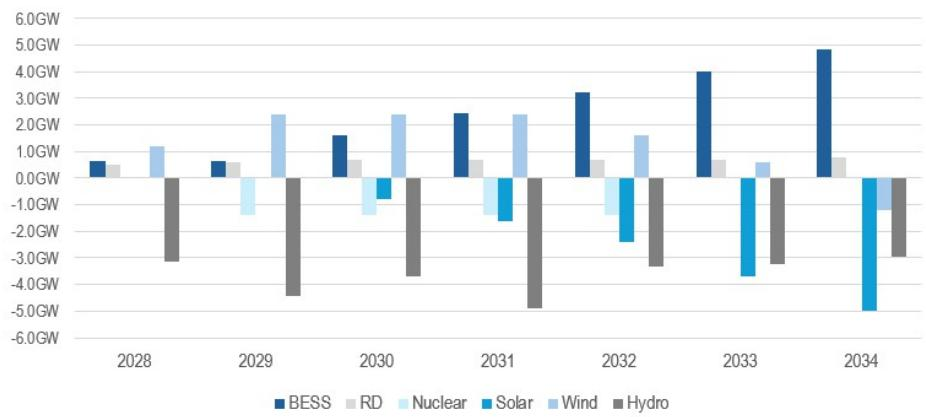  
Source: Brazil Energy Planner ("EPE")

# Asia: positioning for El Niño (II) and renewables ideas

El Niño - Expected heat waves this summer are likely to drive up power demand in Asia

Despite the last 11 years being the hottest ever on record, there is a further reason for concern around heatwaves this summer in the Northern Hemisphere: the coming Super El Niño. The WMO are ascribing an 80% likelihood of a switch to El Niño conditions later this year, meaning Asia will be (even) hotter and (mostly) drier in the coming months.

Figure 31: Climate models are predicting >80% chance of an El Niño event for June-August  
Y axis: Percentage Chance (%); X axis: Season  
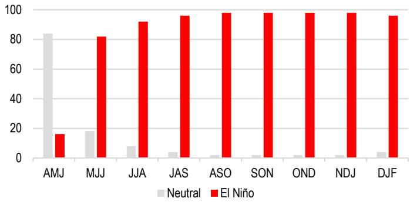  
Based on $-0.5^{\circ}/+0.5^{\circ}$ c thresholds in ERSSTv5 Relative Niño-3.4 index/RONI Source: NOAA.

Figure 32: El Niño typically brings dry conditions, droughts and heatwaves to SE and S Asia, while escalating rainfall in China and Japan  
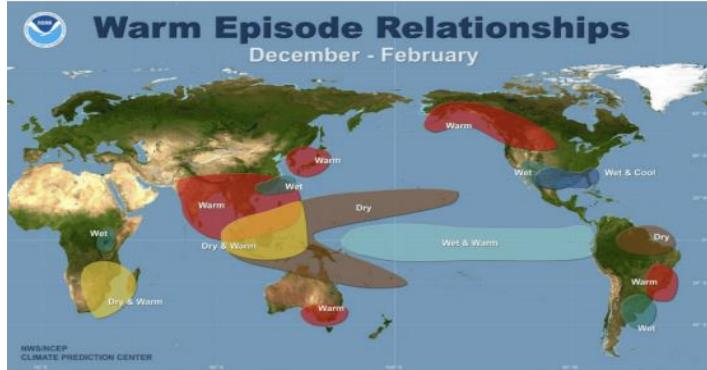  
Source: NOAA, Climate Prediction Center.

Beating the heat will mean elevated power demand. In China, for example, a 1°C rise in temperature on a hot day could raise residential power demand by 14.5%. Notably, Southeast Asia is among the regions most exposed to El Niño-related heat, where higher temperatures can quickly translate into an incremental cooling load. Historically, electricity consumption growth in El Niño years has tended to be stronger than in other periods, implying that peak-load stress could intensify further as the El Niño dynamic plays out.

Figure 33: Electricity consumption growth in ASEAN is stronger in El Niño years. Electricity consumption growth (kWh, % yoy)

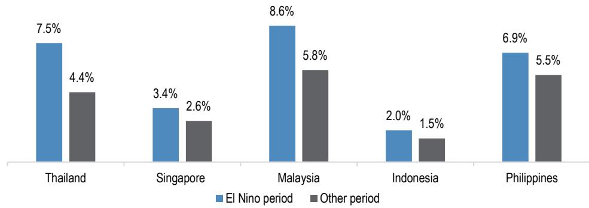  
Source: CEIC Data, JPM.

Warmer-than-normal temperatures this year are already testing system peaks. Power demand in India reached record-breaking levels for four days in a row in May this year, culminating in 270.82GW of all-time high peak power demand on 21 May as temperatures hovered around 45°C in many regions.

All in all, the El Niño set-up this year suggests a firm summer power-demand backdrop. As such, we highlight APAC electricity generators as in the table below, which tend to outperform in summer

Table 14: Valuation comparison of APAC Power Utilities sector

<table><tr><td rowspan="2"></td><td rowspan="2">Ticker</td><td rowspan="2">JPM analyst</td><td rowspan="2">JPM rating</td><td rowspan="2">Share price (LC)</td><td rowspan="2">Mkt Cap (USDm)</td><td rowspan="2">Daily liquidity (USDm)</td><td colspan="2">PE (x)</td><td colspan="2">P/BV (x)</td><td colspan="2">ROE (%)</td><td colspan="2">EV/EBITDA (x)</td></tr><tr><td>2026E</td><td>2027E</td><td>2026E</td><td>2027E</td><td>2026E</td><td>2027E</td><td>2026E</td><td>2027E</td></tr><tr><td>NTPC</td><td>NTPC IN</td><td>Atul Tiwari</td><td>OW</td><td>365.8</td><td>37,604</td><td>51.3</td><td>n.a.</td><td>n.a.</td><td>n.a.</td><td>n.a.</td><td>n.a.</td><td>n.a.</td><td>n.a.</td><td>n.a.</td></tr><tr><td>Power Grid</td><td>PWGR IN</td><td>Atul Tiwari</td><td>OW</td><td>292.3</td><td>28,816</td><td>44.0</td><td>17.3</td><td>16.0</td><td>2.7</td><td>2.5</td><td>16.2</td><td>16.2</td><td>10.2</td><td>9.5</td></tr><tr><td>Manila Electric</td><td>MER PM</td><td>Jelline Gaza</td><td>OW</td><td>591.0</td><td>10,987</td><td>3.7</td><td>12.7</td><td>11.0</td><td>3.5</td><td>3.1</td><td>28.7</td><td>29.7</td><td>10.9</td><td>7.8</td></tr><tr><td>Tenaga Nasional</td><td>TNB MK</td><td>Sumedh Samant</td><td>OW</td><td>14.5</td><td>20,434</td><td>21.3</td><td>17.4</td><td>16.6</td><td>1.6</td><td>1.5</td><td>9.1</td><td>9.3</td><td>7.5</td><td>7.2</td></tr><tr><td>YTL Corp</td><td>YTL MK</td><td></td><td>NC</td><td>2.0</td><td>5,649</td><td>12.3</td><td>n.a.</td><td>n.a.</td><td>n.a.</td><td>n.a.</td><td>n.a.</td><td>n.a.</td><td>n.a.</td><td>n.a.</td></tr><tr><td>Sembcorp Industries</td><td>SCI SP</td><td>Sumedh Samant</td><td>N</td><td>6.3</td><td>8,711</td><td>28.9</td><td>11.9</td><td>9.9</td><td>1.9</td><td>1.8</td><td>16.5</td><td>18.6</td><td>11.2</td><td>9.1</td></tr><tr><td>Huaneng Power</td><td>902 HK</td><td>Stephen Tsui</td><td>UW</td><td>6.5</td><td>16,289</td><td>37.3</td><td>7.7</td><td>8.1</td><td>1.1</td><td>1.0</td><td>7.5</td><td>6.8</td><td>10.6</td><td>10.4</td></tr><tr><td>China Resources Power</td><td>836 HK</td><td>Stephen Tsui</td><td>N</td><td>18.4</td><td>12,128</td><td>42.0</td><td>7.0</td><td>7.1</td><td>0.8</td><td>0.8</td><td>12.3</td><td>11.2</td><td>7.5</td><td>7.5</td></tr><tr><td>Huadian Power</td><td>1071 HK</td><td></td><td>NC</td><td>4.2</td><td>7,884</td><td>7.7</td><td>n.a.</td><td>n.a.</td><td>n.a.</td><td>n.a.</td><td>n.a.</td><td>n.a.</td><td>n.a.</td><td>n.a.</td></tr></table>

Source: Bloomberg Finance L.P. and JPM. Bloomberg consensus estimates for Not Covered (NC) stocks, JPM estimates for all others.

Figure 34: Performance of the APAC Power Utilities vs. respective index from early May to mid-July  
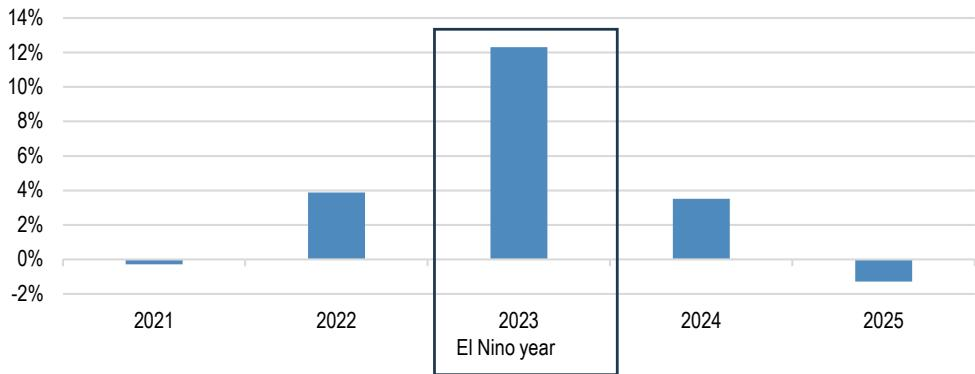  
Source: Bloomberg New Energy Finance.

## Diesel shock, solar lock

Energy supply disruptions from the Middle East conflict are lifting demand for DG solar and ESS, in our view, as end users prioritize the reliability of electricity access and pull forward adoption. This dynamic could be amplified in an El Niño year: with energy prices - and in some markets energy availability - already elevated, a weather-driven step-up in electricity demand raises the value of dependable, on-site generation.

Improving DG economics strengthens the adoption case, with the clearest near-term upside in high-utilisation island settings. In an ideal remote-island use case, payback has compressed from $\sim$ 20 months to $\sim$ 10 months, which should support faster uptake. Over time, policy tilts toward energy resilience may add a structural tailwind; in ASEAN, for example, rooftop solar is projected to represent a 9% share of installed variable renewable energy capacity by 2045.

Figure 35: Policy tailwinds and improving economics should support a growing share of rooftop solar PV in ASEAN, where island use cases can be especially strong
ASEAN vRE growth in power generation (2025-2045)  
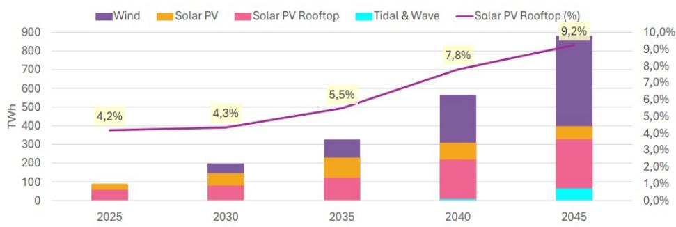  
Source: ASEAN Centre for Energy.

Within our coverage space, we prefer Deye (605117 CH, OW). Deye is a first-mover and cost leader in distributed energy storage systems, especially in Emerging Markets. Its legacy home appliances business enables superior margins and competitive pricing through vertical integration. The company benefits from strong demand driven by energy supply disruptions, rising fuel prices, and global policy incentives for renewables, with a diversified geographic footprint and robust supply chain supporting sustained growth and resilience.

## ESS: Energy security with an AI angle

Long lead times for gas and nuclear development are driving earlier adoption of alternative power solutions, with a knock-on benefit for emerging AIDC ESS use cases. Per BNEF, clean power is now usually the fastest to deploy across multiple regions of the US. This dynamic, in our view, supports a more durable demand backdrop for ESS, as AIDC-linked use cases complement the energy security angle that has become more relevant in the current environment. We observed 40% to 60% yoy global ESS installation growth in 1Q26, and now expect global ESS installations may reach 680 GWh to 930 GWh in 2030. (See our note here). Our top picks for this theme include CATL-A, LG Energy Solution and Sungrow.

## Investable themes in credit

## EU renewables in 2026

Developing new renewable assets has become less popular in the utilities sector. Conditions for renewables are stable but not optimal. Headwinds include cost inflation, high funding costs and US trade policy.

Renewable growth targets have been cut. ‘Selective’ approach to new capacity adopted with higher return hurdle rates. Lower renewables capex should support credit ratios and reduce new issuance.

European policy support for renewables is steady. Demand for subsidy auctions has recovered and long-term targets remain intact. The Middle East energy crisis is creating both risks and opportunities.

The Trump Administration continues its efforts to block renewables project development. European utilities are rotating investment into non-renewable subsectors or withdrawing capital from the US.

Overall, European Utilities Credit analyst William Wade is cautious on issuers with high renewables exposure, although the team has noted a sentiment shift from some European clients who anticipate a resurgence in renewables investing. For now, William maintains a preference for diversified integrated utilities that retain a meaningful renewables component in their business mix (JPM OW ratings include EnBW, Enel, Engie and Iberdrola).

Figure 36: European Integrated Utility Renewable Exposures  
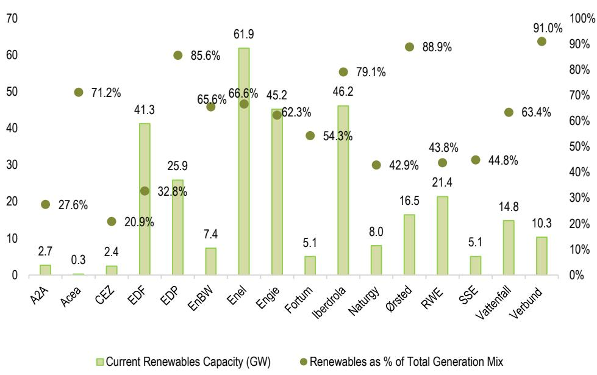  
Source: Company reports, JPM, as of Dec'25 or most recently available date

## Sustainable debt

## Sovereign GSS bond club swells to 65 members

Cumulative sovereign GSS issuance reached USD 843.48 bn at the end of May 2026. Green bonds account for the largest share (82%) of the market, followed by sustainability bonds (13%) and social bonds (5%). Year-to-date, sovereign GSS issuance has totaled USD 66.43 bn, putting the market on track to eclipse last year's total issuance (USD 120.37 bn) but fall short of the issuance record set in 2024 (USD 163.69 bn).

2026 YTD volumes reflect 48 issues from 18 sovereign issuers, mostly from Europe (9 countries), followed by Asia-Pacific (6) and one issuer each from Latin America, North America, and the Middle East and Africa. Reflecting the broader sovereign issuance trends highlighted in Figure 37, the majority of 2026 YTD sovereign issuance has been green bonds (89%), with the sole issuer of sustainability bonds being Mexico with a three-part deal in January (EUR 4.75 bn) and a two-part deal in May (MXN 8 bn). Egypt was the sole sovereign issuer of social bonds, placing USD 1 bn in May.

The sovereign GSS Bond club membership continues to grow, with 65 countries issuing GSS bonds through the end of May 2026, of which 37 are EM countries. Since last year's publication, notable additions to the club include China (CNY 6 bn across two green bonds in April 2025), Pakistan (PKR 32 bn green bond in May 2025), and Taiwan (TWD 400 mn green bond in January 2026). Regionally, European sovereigns issue the most GSS bonds, reaching a cumulative volume of USD 579.2 bn. In 2025, Europe issued USD 90.5 bn in sovereign GSS bonds (75% of global issuance), of which 99% were green bonds (by issued notional). The largest contributions came from Germany (USD 17.3 bn), Austria (USD 17.1 bn), and the UK (USD 14.7 bn).

The JPM Green, Social and Sustainability Bond Index (GESSIE) is designed to track labeled bonds issued with proceeds dedicated to green and/or social activities, assets, projects, or expenditures. The index provides a comprehensive measure of the global labeled bond market across various asset classes and credit sectors. SLB instruments are not eligible for JPM's suite of labeled bond benchmarks at this time, however this remains under review. Figure 38 shows the breakdown of the JPM Green, Social and Sustainability Bond Index (GESSIE). The lion's share of the index is issued by corporates (38%), followed by Supranationals (22%) and Local Sovereign (19%). The majority of issuance is green (64%), followed by sustainability (21%) and social (14%). Table 15 showcases the performance of the GESSIE broken down by label, sector and region.

Figure 37: Historical Sovereign GSS Issuance (USD bn)  
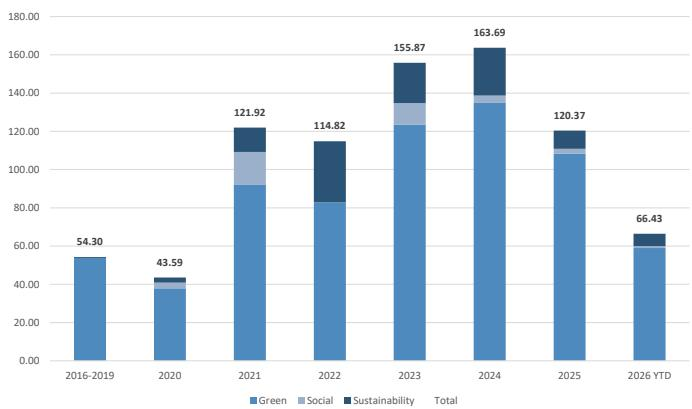  
Source: JPM, 29 May 2026.

Figure 38: Market Capitalization of the JPM GESSIE (USD bn)  
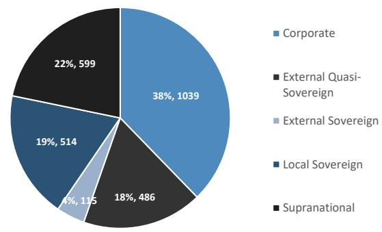

Source: JPM, 29 May 2026.  
Table 15: JPM GESSIE Performance

<table><tr><td rowspan="2">Index</td><td colspan="3">Total Returns (%)</td><td colspan="3">Yield to Worst</td><td colspan="4">Spread To Worst (bps)</td></tr><tr><td>1W Return</td><td>MTD Return</td><td>YTD Return</td><td>Current</td><td>1W Change</td><td>YTD Change</td><td>Current</td><td>1W Change</td><td>YTD Change</td><td>Market Value Weight in (%)</td></tr><tr><td>GSS</td><td>1.12</td><td>0.48</td><td>0.31</td><td>3.96</td><td>-0.12</td><td>0.13</td><td>74</td><td>-2</td><td>-5</td><td></td></tr><tr><td>Green</td><td>1.25</td><td>0.57</td><td>0.33</td><td>3.88</td><td>-0.12</td><td>0.07</td><td>83</td><td>-2</td><td>-5</td><td>64</td></tr><tr><td>Social</td><td>1.03</td><td>0.28</td><td>0.26</td><td>3.68</td><td>-0.11</td><td>0.19</td><td>53</td><td>-2</td><td>-7</td><td>14</td></tr><tr><td>Sustainable</td><td>0.78</td><td>0.32</td><td>0.26</td><td>4.42</td><td>-0.11</td><td>0.33</td><td>62</td><td>0</td><td>-4</td><td>21</td></tr><tr><td colspan="11">By Sector</td></tr><tr><td>External Quasi-Sovereign</td><td>1.05</td><td>0.26</td><td>0.23</td><td>3.58</td><td>-0.11</td><td>0.15</td><td>60</td><td>-2</td><td>-7</td><td>18</td></tr><tr><td>Sovereign</td><td>1.58</td><td>0.96</td><td>0.27</td><td>3.87</td><td>-0.15</td><td>0.08</td><td>103</td><td>-4</td><td>-4</td><td>23</td></tr><tr><td>Supranational</td><td>0.98</td><td>0.23</td><td>0.40</td><td>3.62</td><td>-0.09</td><td>0.12</td><td>34</td><td>-1</td><td>-6</td><td>22</td></tr><tr><td>Corporate</td><td>0.96</td><td>0.43</td><td>0.32</td><td>4.51</td><td>-0.12</td><td>0.19</td><td>107</td><td>-2</td><td>-5</td><td>38</td></tr><tr><td colspan="11">By Region</td></tr><tr><td>Asia</td><td>0.88</td><td>0.44</td><td>0.49</td><td>3.72</td><td>-0.10</td><td>0.12</td><td>71</td><td>0</td><td>-5</td><td>9</td></tr><tr><td>Eastern Europe</td><td>1.03</td><td>0.42</td><td>1.52</td><td>4.82</td><td>-0.14</td><td>0.03</td><td>167</td><td>-5</td><td>-20</td><td>2</td></tr><tr><td>Latin America</td><td>1.11</td><td>1.03</td><td>-0.25</td><td>5.60</td><td>-0.12</td><td>0.17</td><td>129</td><td>-2</td><td>-15</td><td>4</td></tr><tr><td>Middle East and Africa</td><td>0.65</td><td>0.36</td><td>0.25</td><td>5.32</td><td>-0.14</td><td>0.43</td><td>119</td><td>-2</td><td>9</td><td>3</td></tr><tr><td>North America</td><td>0.74</td><td>0.25</td><td>0.72</td><td>4.37</td><td>-0.09</td><td>0.15</td><td>48</td><td>1</td><td>-9</td><td>17</td></tr><tr><td>Western Europe</td><td>1.28</td><td>0.51</td><td>0.16</td><td>3.74</td><td>-0.12</td><td>0.11</td><td>73</td><td>-3</td><td>-3</td><td>65</td></tr></table>

Source: JPM, 29 May 2026.

## Issuance trends in corporate credit

Sustainable Euro IG issuance has remained relatively stable thus far in 2026, while EUR HY and GBP IG GSS+ issuance has clearly lagged

YTD, Euro GSS+ issuance has tracked slightly higher as a proportion of the overall market, following the gradual decline seen over 2022-2025 (22% of EUR IG paper issued YTD vs. 18% to the equivalent point in 2025 and 21% in FY25). However, in the GBP IG market, GSS issuance has continued its steep decline, representing about 8% of YTD total issuance, compared to 17% and 30% in 2025 and 2024, respectively. GSS representation has also shrunk in Euro high yield (Figure 43), where GSS+ issuance has almost halved as a proportion of the total (7% YTD in 2026 vs. 13% in 2025).

Green bonds remain the dominant component of GSS+ issuance, making up 90% of EUR IG GSS+ paper issued YTD (an increase from 84% in 2025 and 2024), while sustainability-linked bonds have shrunk further, representing just 2% of YTD GSS+ issuance (down from 6% in 2025 and 7% in 2024).

GSS issuance technicals have fluctuated YTD, with an average NIP disadvantage of c. +0.3bp YTD (GSS new issue premium (NIP) compared to non-GSS NIP - see Figure 41), compared to a -0.2bp advantage on an LTM basis (through May'26) and a -2.0bp advantage in 2025. Book coverage ratios have continued to exceed those for vanilla paper through the year (Figure 42).

USD GSS+ bond issuance remains marginal (<1% of total USD IG primary).

Going forward, we expect the share of EUR GSS+ issuance to be flat or slightly down on FY25: while GSS issuance is tracking slightly ahead YTD, we note that this has been heavily weighted by issuance from Financials, with the pace now likely to slow in H2.

Figure 39: EUR IG GSS+ Issuance  
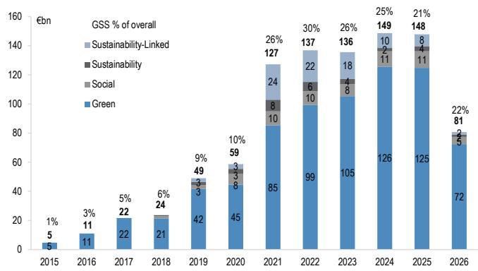  
Source: JPM, Data as of 1-Jun 2026

Figure 40: GBP IG GSS+ Issuance  
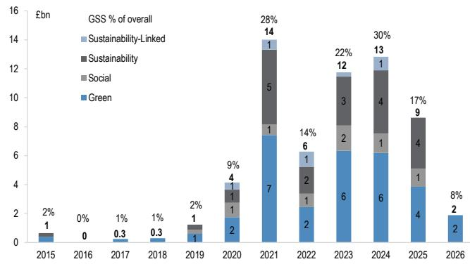  
Source: JPM, Data as of 1-Jun 2026

Figure 41: EUR IG NIP Differential - GSS vs. non-GSS  
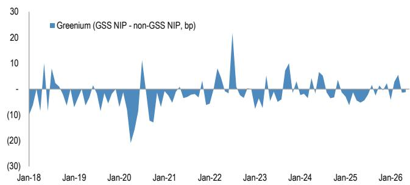  
Source: JPM, Data as of 1-Jun 2026

Figure 42: Primary Book Coverage Ratios: GSS vs. non-GSS  
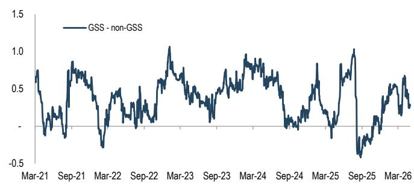  
Source: JPM, Data as of 1-Jun 2026

Figure 43: EUR HY GSS+ Issuance  
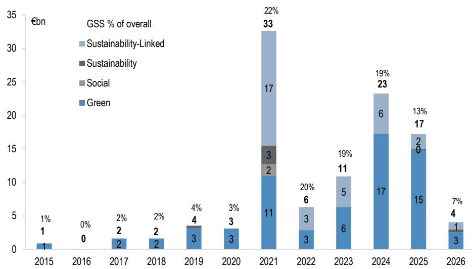  
Source: JPM, Data as of 1-Jun 2026

## Global Index

The JSTAR Index Governance - introduced in 2023 - has paved the way for key enhancements to the flagship JSTAR index suite, including more robust data inputs and reduced turnover. This iterative feedback process with our clients informs the continuous improvement of our sustainable index suite, with the last set of meetings announcing the rebrand of the JPM Screened Tilted and Reweighted (JSTAR) suite from its previous name of JPM ESG (JESG). Additionally, the most recent governance cycle covered the migration of ESG data from Sustainalytics' legacy products to Sustainalytics' current products for both corporate and sovereign issuers.

Since the JSTAR suite was launched in 2018, the Index team has included sustainable index topics within its annual client governance meetings. However, as both the focus on sustainable investing and benchmarked AuM against the JSTAR Index family continues to grow, the need to engage clients more regularly and with more granularity developed. As a result, in 2023, the Sustainable Index team began engaging with clients via stand-alone JSTAR Index Forums, held on a more regular basis.

With this new engagement model, the team has been able to implement a number of key enhancements to the JSTAR Index methodology (link). The table below highlights the methodological changes that have been made throughout the past year.

Table 16: Takeaways from JSTAR Index Governance

<table><tr><td>Effective Date</td><td>Summary</td><td>Methodological Changes</td></tr><tr><td>Mar-26</td><td>JESG Index Suite Renamed to JSTAR</td><td>The JPM ESG (JESG) Index suite was renamed to the JPM Screened, Tilted, and Reweighted (JSTAR) Index Suite. We decided to implement a name change to the JESG indices, in response to new fund naming regulations in the UK and EU and to achieve consistency between the naming of indices and the funds that track them.</td></tr><tr><td>Jan-26</td><td>JSTAR Methodology Migrated to Sustainalytics RIsk Ratings</td><td>The JSTAR index methodology migrated to the Sustainalytics Risk Ratings at the January 30th, 2026, rebalance. The transition within the JSTAR scoring methodology decommissioned the use of the legacy Sustainalytics ESG Rating and Country Risk Monitor (CRM) scores as inputs. The October 2025 rebalance was the last index rebalance to use the legacy Sustainalytics scores.</td></tr><tr><td>Aug-25</td><td>No Change to Exclusionary Screening Applied Within JSTAR</td><td>There will be no change to the exclusionary screening applied to the JSTAR index suite at this time. The proposal to review the exclusion of issuers exposed to military contracting or small arms sales to military/police was not supported by most investors. The JSTAR indices will continue to exclude issuers with revenue derived from thermal coal, oil sands, weapons, and tobacco, as well as those flagged as UNGC non-compliant by Sustainalytics, pursuant to the field definitions outlined in the index methodology document.</td></tr></table>

Source: JPM Index Research.

The JSTAR suite was last expanded in 2024 with the launch of the JSTAR Asia Pacific Credit Index (JSTAR JACI APAC). The JSTAR product offering now includes thirteen flagship benchmarks, covering emerging and developed markets across corporate, quasi-sovereign, sovereign, and supranational issuance. In the coming months, the Index team plans to further grow the JSTAR suite to cover the Euro Emerging Markets Bond Index Global (EURO EMBIG), Government Bond Index (GBI Broad), and Economic and Monetary Union (EMU) Index universes.

The next JSTAR Forum will be held later this year and cover several agenda topics, including an update on RepRisk's enhanced issuer mapping proposal, index substitutions within the Verisk Maplecroft ESG Rating, index treatment of uncovered issuers, and proposals for new sustainable index products.

## The JPM Fixed Income Sustainability Index suite

JPM's comprehensive suite of Fixed Income Sustainability Indices is divided into three distinct families, each tailored to address specific investment goals and sustainability criteria. These diverse methodologies assess and rank companies or issuers differently, allowing investors to select indices that reflect their ESG priorities.

First, the flagship JSTAR Index Suite (link), launched in 2018, sets the standard for fixed income ESG investing in emerging markets. This pioneering family of indices integrates multiple ESG best practices, including industry-standard exclusionary screening, while maintaining alignment with the asset class profile. The JSTAR indices are designed to empower investors to make informed decisions that align with their sustainability values.

The second family, our sustainable debt suite, is designed to guide investors through the burgeoning market of green, social and sustainability bonds. These indices ensure that capital is directed towards impactful projects that drive positive change, providing a clear pathway for investors committed to sustainable finance and impact investing.

Completing our suite are the JPM Paris-Aligned (PAB) and Climate Transition (CTB) Benchmarks (link). These indices represent our most rigorous sustainability offering, adhering to the European Commission's Delegated Act's minimum technical requirements. While both benchmarks pursue similar sustainability objectives, they differ in their level of ambition and focus, providing investors with options that align with their specific climate goals. The first JPM PAB and JPM CTB Indices are available for the flagship JPM Corporate Emerging Markets Bond Index (CEMBI) (see the JPM Paris-Aligned CEMBI Broad Diversified Index Factsheet and the JPM Climate-Transition CEMBI Broad Diversified Index Factsheet). The Parent Index for these benchmarks is the CEMBI Broad Diversified.

## Appendix 1: sustainability calendar

Table 17: Key events for sustainable investors in the next twelve months

<table><tr><td>Event</td><td>Date</td><td>Significance</td></tr><tr><td></td><td></td><td>2026</td></tr><tr><td>London Climate Action Week</td><td>Jun 20-28</td><td>Large city-wide climate event in Europe</td></tr><tr><td>UNEP FI Global Roundtable</td><td>Jun 22-26</td><td>Biennial sustainable finance event organized by UN Environment Program</td></tr><tr><td>US SIF Forum</td><td>Jun 24-26</td><td>Sustainability gathering for leaders across the capital markets ecosystem</td></tr><tr><td>UNFCCC Climate Week 4</td><td>Sep 7-11</td><td>Regional UN climate dialogue focused on accelerating the climate transition through country-specific strategies</td></tr><tr><td>NY Climate Week</td><td>Sep 20-27</td><td>Largest annual climate event bringing together business leaders, policy makers, and civil society</td></tr><tr><td>PRI in Person</td><td>Oct 13-15</td><td>Largest annual responsible investing event globally</td></tr><tr><td>Biodiversity COP</td><td>Oct 19-30</td><td>Biennial international biodiversity negotiations</td></tr><tr><td>US Midterm Elections</td><td>Nov 3</td><td>Shapes the balance of power in the House and Senate and could impact future US climate policy</td></tr><tr><td>Climate COP</td><td>Nov 9-20</td><td>Annual international climate negotiations</td></tr><tr><td>UN Water Conference</td><td>Dec 2-6</td><td>International meeting on achieving SDG 6 (ensure availability and sustainable management of water and sanitation for all)</td></tr><tr><td></td><td></td><td>2027</td></tr><tr><td>World Economic Forum (WEF) Annual Meeting</td><td>Jan 18-22</td><td>Global agenda-setting forum convening leaders from government, business and civil society</td></tr><tr><td>San Francisco (SF) Climate Week</td><td>Apr 17-25</td><td>West Coast climate technology event promoting collaboration on clean energy innovation, battery scaling and commercialization</td></tr></table>

Source: JPM

## Appendix 2: stock pricing information

Figure 44: Stock pricing information (I)

<table><tr><td>Name</td><td>Ticker</td><td>Sector</td><td>Country</td><td>Region</td><td>Analyst</td><td>CCY</td><td>Price</td><td>PT</td><td>Upside</td><td>PT end date</td><td>Reco</td></tr><tr><td>Novonesis</td><td>NSISB DC</td><td>Specialty Chemicals</td><td>Denmark</td><td>Europe</td><td>Chetan Udeshi, CFA</td><td>DKK</td><td>380</td><td>500</td><td>31.6</td><td>Dec-27</td><td>OW</td></tr><tr><td>International Flavors &amp; Frag</td><td>IFF US</td><td>Specialty Chemicals</td><td>United States</td><td>North America</td><td>Jeffrey J. Zekauskas</td><td>USD</td><td>78.36</td><td>92</td><td>17.4</td><td>Dec-26</td><td>OW</td></tr><tr><td>Croda</td><td>CRDA LN</td><td>Specialty Chemicals</td><td>United Kingdom</td><td>Europe</td><td>Chetan Udeshi, CFA</td><td>GBp</td><td>3074</td><td>4000</td><td>30.1</td><td>Dec-27</td><td>OW</td></tr><tr><td>Smurfit WestRock (LN)</td><td>SWR LN</td><td>Paper &amp; Plastic Packaging Products &amp; Materials</td><td>Ireland</td><td>Europe</td><td>Detlef Winckelmann</td><td>GBp</td><td>3314</td><td>4600</td><td>38.8</td><td>Dec-27</td><td>OW</td></tr><tr><td>Dexco</td><td>DXCO3 BZ</td><td>Forest Products</td><td>Brazil</td><td>Latin America</td><td>Rodolfo Angele, CFA</td><td>BRL</td><td>4.8</td><td>8.5</td><td>77.1</td><td>Dec-26</td><td>OW</td></tr><tr><td>Suzano SA</td><td>SUZB3 BZ</td><td>Paper Products</td><td>Brazil</td><td>Latin America</td><td>Rodolfo Angele, CFA</td><td>BRL</td><td>42.93</td><td>68</td><td>58.4</td><td>Dec-26</td><td>OW</td></tr><tr><td>Nutrien</td><td>NTR US</td><td>Fertilizers &amp; Agricultural Chemicals</td><td>Canada</td><td>North America</td><td>Jeffrey J. Zekauskas</td><td>USD</td><td>66.13</td><td>80</td><td>21</td><td>Dec-26</td><td>OW</td></tr><tr><td>Mahindra &amp; Mahindra</td><td>MM IN</td><td>Automobile Manufacturers</td><td>India</td><td>Asia Ex</td><td>Amyn Pirani</td><td>INR</td><td>3137.9</td><td>4135</td><td>31.8</td><td>Mar-27</td><td>OW</td></tr><tr><td>AGCO Corp.</td><td>AGCO US</td><td>Agricultural &amp; Farm Machinery</td><td>United States</td><td>North America</td><td>Tami Zakaria, CFA</td><td>USD</td><td>112.54</td><td>143</td><td>27.1</td><td>Dec-26</td><td>OW</td></tr><tr><td>Darling Ingredients Inc.</td><td>DAR US</td><td>Agricultural Products &amp; Services</td><td>United States</td><td>North America</td><td>Thomas Palmer, CFA</td><td>USD</td><td>56.12</td><td>79</td><td>40.8</td><td>Dec-26</td><td>OW</td></tr><tr><td>Danone</td><td>BN FP</td><td>Packaged Foods &amp; Meats</td><td>France</td><td>Europe</td><td>Celine Pannuti, CFA</td><td>EUR</td><td>66.2</td><td>90</td><td>36</td><td>Dec-27</td><td>OW</td></tr><tr><td>PepsiCo</td><td>PEP US</td><td>Soft Drinks &amp; Non-alcoholic Beverages</td><td>United States</td><td>North America</td><td>Andrea Teixeira, CFA</td><td>USD</td><td>146.25</td><td>178</td><td>21.7</td><td>Dec-26</td><td>OW</td></tr><tr><td>Verisk Analytics</td><td>VRSK US</td><td>Research &amp; Consulting Services</td><td>United States</td><td>North America</td><td>Andrew C. Steinerman</td><td>USD</td><td>180.46</td><td>230</td><td>27.5</td><td>Dec-26</td><td>OW</td></tr><tr><td>Neurocrine Biosciences</td><td>NBIX US</td><td>Biotechnology</td><td>United States</td><td>North America</td><td>Anupam Rama</td><td>USD</td><td>159.51</td><td>185</td><td>16</td><td>Dec-26</td><td>OW</td></tr><tr><td>Coway</td><td>021240 KS</td><td>Household Appliances</td><td>South Korea</td><td>Asia Ex</td><td>Jihyun Cho</td><td>KRW</td><td>91700</td><td>130000</td><td>41.8</td><td>Jun-27</td><td>OW</td></tr><tr><td>Empower</td><td>EMPOWER UH</td><td>Water Utilities</td><td>nited Arab Emirate</td><td>CEEMEA</td><td>Anna Antonova, CFA</td><td>AED</td><td>1.65</td><td>2.14</td><td>29.7</td><td>Dec-27</td><td>OW</td></tr><tr><td>CALB</td><td>3931 HK</td><td>Automotive Parts &amp; Equipment</td><td>China</td><td>Asia Ex</td><td>Rebecca Wen</td><td>HKD</td><td>27.24</td><td>40</td><td>46.8</td><td>Jun-27</td><td>OW</td></tr><tr><td>Sungrow - A</td><td>300274 CH</td><td>Electrical Components &amp; Equipment</td><td>China</td><td>Asia Ex</td><td>Alan Hon</td><td>CNY</td><td>152.49</td><td>212</td><td>39</td><td>Dec-26</td><td>OW</td></tr><tr><td>CATL - A</td><td>300750 CH</td><td>Electrical Components &amp; Equipment</td><td>China</td><td>Asia Ex</td><td>Rebecca Wen</td><td>CNY</td><td>403.53</td><td>520</td><td>28.9</td><td>Dec-26</td><td>OW</td></tr><tr><td>Bloom Energy</td><td>BE US</td><td>Heavy Electrical Equipment</td><td>United States</td><td>North America</td><td>Mark Strouse, CFA</td><td>USD</td><td>274.5</td><td>267</td><td>-2.7</td><td>Dec-26</td><td>OW</td></tr><tr><td>Sunrun Inc.</td><td>RUN US</td><td>Electrical Components &amp; Equipment</td><td>United States</td><td>North America</td><td>Mark Strouse, CFA</td><td>USD</td><td>12.47</td><td>22</td><td>76.4</td><td>Dec-26</td><td>OW</td></tr><tr><td>Brookfield Renewable Parti</td><td>BEP US</td><td>Renewable Electricity</td><td>United States</td><td>North America</td><td>Mark Strouse, CFA</td><td>USD</td><td>34.63</td><td>40</td><td>15.5</td><td>Dec-26</td><td>OW</td></tr><tr><td>Midea Group - A</td><td>000333 CH</td><td>Household Appliances</td><td>China</td><td>Asia Ex</td><td>DS Kim</td><td>CNY</td><td>78.96</td><td>105</td><td>33</td><td>Jun-27</td><td>OW</td></tr><tr><td>Haier Smart Home Co Ltd</td><td>6690 HK</td><td>Household Appliances</td><td>China</td><td>Asia Ex</td><td>DS Kim</td><td>HKD</td><td>21.26</td><td>25</td><td>17.6</td><td>Jun-27</td><td>OW</td></tr><tr><td>Sunwealth</td><td>2421 TT</td><td>Industrial Machinery &amp; Supplies &amp; Components</td><td>Taiwan, China</td><td>Asia Ex</td><td>Jerry Tsai</td><td>TWD</td><td>142.5</td><td>214</td><td>50.2</td><td>Jun-26</td><td>OW</td></tr><tr><td>Asia Vital Components</td><td>3017 TT</td><td>Technology Hardware, Storage &amp; Peripherals</td><td>Taiwan, China</td><td>Asia Ex</td><td>William Yang</td><td>TWD</td><td>2370</td><td>3200</td><td>35</td><td>Dec-26</td><td>OW</td></tr><tr><td>Nien Made</td><td>8464 TT</td><td>Home Furnishings</td><td>Taiwan, China</td><td>Asia Ex</td><td>Gokul Hariharan</td><td>TWD</td><td>351</td><td>550</td><td>56.7</td><td>Dec-26</td><td>OW</td></tr><tr><td>Rockwool</td><td>ROCKB DC</td><td>Building Products</td><td>Denmark</td><td>Europe</td><td>Zaim Beekawa</td><td>DKK</td><td>215</td><td>250</td><td>16.3</td><td>Dec-27</td><td>OW</td></tr><tr><td>Saint-Gobain</td><td>SGO FP</td><td>Building Products</td><td>France</td><td>Europe</td><td>Elodie Rall</td><td>EUR</td><td>78.5</td><td>100</td><td>27.4</td><td>Dec-27</td><td>OW</td></tr><tr><td>Nittobo (3110)</td><td>3110 JP</td><td>Building Products</td><td>Japan</td><td>Japan</td><td>Mio Shikanai</td><td>JPY</td><td>21690</td><td>29000</td><td>33.7</td><td>Dec-26</td><td>OW</td></tr><tr><td>Chicony Power Technology</td><td>6412 TT</td><td>Electrical Components &amp; Equipment</td><td>Taiwan, China</td><td>Asia Ex</td><td>Jerry Tsai</td><td>TWD</td><td>91.6</td><td>111</td><td>21.2</td><td>Dec-26</td><td>OW</td></tr><tr><td>James Hardie Industries PI</td><td>JHX AU</td><td>Construction Materials</td><td>Australia</td><td>Australia</td><td>Lee Power</td><td>AUD</td><td>35.31</td><td>38</td><td>7.6</td><td>May-27</td><td>OW</td></tr><tr><td>Ferrovial</td><td>FER SM</td><td>Construction &amp; Engineering</td><td>Spain</td><td>Europe</td><td>Elodie Rall</td><td>EUR</td><td>59.86</td><td>65</td><td>8.6</td><td>Dec-27</td><td>OW</td></tr><tr><td>CRH Plc</td><td>CRH US</td><td>Construction Materials</td><td>Ireland</td><td>Latin America</td><td>Adrian E Huerta</td><td>USD</td><td>109.59</td><td>140</td><td>27.7</td><td>Dec-26</td><td>OW</td></tr><tr><td>Holcim Ltd</td><td>HOLN SW</td><td>Construction Materials</td><td>Switzerland</td><td>Europe</td><td>Elodie Rall</td><td>CHF</td><td>75.92</td><td>84</td><td>10.6</td><td>Dec-27</td><td>OW</td></tr><tr><td>Heidelberg Materials</td><td>HEI GR</td><td>Construction Materials</td><td>Germany</td><td>Europe</td><td>Elodie Rall</td><td>EUR</td><td>183.1</td><td>250</td><td>36.5</td><td>Dec-27</td><td>OW</td></tr><tr><td>Cemex</td><td>CX US</td><td>Construction Materials</td><td>Mexico</td><td>Latin America</td><td>Adrian E Huerta</td><td>USD</td><td>12.89</td><td>14.5</td><td>12.5</td><td>Dec-26</td><td>OW</td></tr><tr><td>Iron Mountain</td><td>IRM US</td><td>Other Specialized REITs</td><td>United States</td><td>North America</td><td>Andrew C. Steinerman</td><td>USD</td><td>126.28</td><td>138</td><td>9.3</td><td>Dec-26</td><td>OW</td></tr><tr><td>Xuji Electric - A</td><td>000400 CH</td><td>Heavy Electrical Equipment</td><td>China</td><td>Asia Ex</td><td>Stephen Tsui, CFA</td><td>CNY</td><td>23.06</td><td>33</td><td>43.1</td><td>Dec-26</td><td>OW</td></tr><tr><td>Nari Technology - A</td><td>600406 CH</td><td>Heavy Electrical Equipment</td><td>China</td><td>Asia Ex</td><td>Stephen Tsui, CFA</td><td>CNY</td><td>23.54</td><td>30</td><td>27.4</td><td>Dec-26</td><td>OW</td></tr><tr><td>Siemens Energy</td><td>ENR GR</td><td>Heavy Electrical Equipment</td><td>Germany</td><td>Europe</td><td>Phil Buller</td><td>EUR</td><td>155.58</td><td>225</td><td>44.6</td><td>Jun-27</td><td>OW</td></tr><tr><td>Itron</td><td>ITRI US</td><td>Electronic Equipment &amp; Instruments</td><td>United States</td><td>North America</td><td>Mark Strouse, CFA</td><td>USD</td><td>80.71</td><td>112</td><td>38.8</td><td>Dec-26</td><td>OW</td></tr><tr><td>Chroma ATE</td><td>2360 TT</td><td>Electronic Equipment &amp; Instruments</td><td>Taiwan, China</td><td>Asia Ex</td><td>Jerry Tsai</td><td>TWD</td><td>2325</td><td>3000</td><td>29</td><td>Dec-26</td><td>OW</td></tr><tr><td>Generac</td><td>GNRC US</td><td>Electrical Components &amp; Equipment</td><td>United States</td><td>North America</td><td>Mark Strouse, CFA</td><td>USD</td><td>270.1</td><td>267</td><td>-1.1</td><td>Dec-26</td><td>OW</td></tr><tr><td>ICICI Lombard General Ins</td><td>ICICIGI IN</td><td>Property &amp; Casualty Insurance</td><td>India</td><td>Asia Ex</td><td>Madhukar Ladha</td><td>INR</td><td>1783.6</td><td>2170</td><td>21.7</td><td>Mar-27</td><td>OW</td></tr><tr><td>LPI Capital</td><td>LPI MK</td><td>Property &amp; Casualty Insurance</td><td>Malaysia</td><td>Asia Ex</td><td>MW Kim</td><td>MYR</td><td>15.18</td><td>20</td><td>31.8</td><td>Dec-26</td><td>OW</td></tr><tr><td>General Insurance Corp of</td><td>GICRE IN</td><td>Reinsurance</td><td>India</td><td>Asia Ex</td><td>Madhukar Ladha</td><td>INR</td><td>358.4</td><td>500</td><td>39.5</td><td>Mar-27</td><td>OW</td></tr><tr><td>QBE Insurance Group</td><td>QBE AU</td><td>Property &amp; Casualty Insurance</td><td>Australia</td><td>Australia</td><td>Siddharth Parameswaran</td><td>AUD</td><td>23.47</td><td>24</td><td>2.3</td><td>Dec-26</td><td>OW</td></tr><tr><td>Tokio Marine Holdings (87€)</td><td>8766 JP</td><td>Property &amp; Casualty Insurance</td><td>Japan</td><td>Japan</td><td>Koki Sato</td><td>JPY</td><td>7288</td><td>7700</td><td>5.7</td><td>Dec-26</td><td>OW</td></tr><tr><td>IRB Brasil Re</td><td>IRBR3 BZ</td><td>Reinsurance</td><td>Brazil</td><td>Latin America</td><td>Guilherme Grespan</td><td>BRL</td><td>51.7</td><td>62</td><td>19.9</td><td>Dec-26</td><td>OW</td></tr><tr><td>Palomar</td><td>PLMR US</td><td>Property &amp; Casualty Insurance</td><td>United States</td><td>North America</td><td>Pablo S. Singzon</td><td>USD</td><td>113.01</td><td>150</td><td>32.7</td><td>Dec-26</td><td>OW</td></tr><tr><td>Springer Nature</td><td>SPG GR</td><td>Publishing</td><td>Germany</td><td>Europe</td><td>Daniel Kerven</td><td>EUR</td><td>18.2</td><td>31</td><td>70.3</td><td>Dec-27</td><td>OW</td></tr><tr><td>RELX PLC</td><td>REL LN</td><td>Research &amp; Consulting Services</td><td>United Kingdom</td><td>Europe</td><td>Daniel Kerven</td><td>GBp</td><td>2420</td><td>5070</td><td>109.5</td><td>Dec-27</td><td>OW</td></tr><tr><td>DEWA</td><td>DEWA UH</td><td>Multi-Utilities</td><td>nited Arab Emirate</td><td>CEEMEA</td><td>Anna Antonova, CFA</td><td>AED</td><td>2.75</td><td>3.3</td><td>20</td><td>Dec-27</td><td>OW</td></tr><tr><td>Rotork</td><td>ROR LN</td><td>Industrial Machinery &amp; Supplies &amp; Components</td><td>United Kingdom</td><td>Europe</td><td>Chitrita C Sinha</td><td>GBp</td><td>312.4</td><td>390</td><td>24.8</td><td>Jun-27</td><td>OW</td></tr><tr><td>Toray (3402)</td><td>3402 JP</td><td>Commodity Chemicals</td><td>Japan</td><td>Japan</td><td>Yasuhiro Nakada</td><td>JPY</td><td>1177</td><td>1360</td><td>15.5</td><td>Dec-26</td><td>OW</td></tr><tr><td>Genuit Group</td><td>GEN LN</td><td>Building Products</td><td>United Kingdom</td><td>Europe</td><td>Chitrita C Sinha</td><td>GBp</td><td>271.2</td><td>440</td><td>62.2</td><td>Jun-27</td><td>OW</td></tr><tr><td>Elis</td><td>ELIS FP</td><td>Diversified Support Services</td><td>France</td><td>Europe</td><td>Jane L Sparrow</td><td>EUR</td><td>26.74</td><td>28.3</td><td>5.8</td><td>Dec-27</td><td>OW</td></tr><tr><td>Metso Corporation</td><td>METSO FH</td><td>Instruction Machinery &amp; Heavy Transportation Equiprrr</td><td>Finland</td><td>Europe</td><td>Chitrita C Sinha</td><td>EUR</td><td>15.66</td><td>17.5</td><td>11.7</td><td>Jun-27</td><td>OW</td></tr><tr><td>Ecolab Inc.</td><td>ECL US</td><td>Specialty Chemicals</td><td>United States</td><td>North America</td><td>Jeffrey J. Zekauskas</td><td>USD</td><td>268.58</td><td>295</td><td>9.8</td><td>Dec-26</td><td>OW</td></tr><tr><td>CK Infrastructure</td><td>1038 HK</td><td>Electric Utilities</td><td>Hong Kong SAR, Ch</td><td>Asia Ex</td><td>Stephen Tsui, CFA</td><td>HKD</td><td>59.2</td><td>69</td><td>16.6</td><td>Dec-26</td><td>OW</td></tr><tr><td>Sabesp</td><td>SBSP3 BZ</td><td>Water Utilities</td><td>Brazil</td><td>Latin America</td><td>Arthur Pereira, CFA</td><td>BRL</td><td>27.95</td><td>40</td><td>43.1</td><td>Dec-26</td><td>OW</td></tr><tr><td>Copasa</td><td>CSMG3 BZ</td><td>Water Utilities</td><td>Brazil</td><td>Latin America</td><td>Arthur Pereira, CFA</td><td>BRL</td><td>56.54</td><td>66</td><td>16.7</td><td>Dec-26</td><td>OW</td></tr><tr><td>LG Energy Solution</td><td>373220 KS</td><td>Electrical Components &amp; Equipment</td><td>South Korea</td><td>Asia Ex</td><td>Parsley Ong</td><td>KRW</td><td>411000</td><td>530000</td><td>29</td><td>Dec-26</td><td>OW</td></tr><tr><td>Simplo Technology Co Ltd</td><td>6121 TT</td><td>Electronic Components</td><td>Taiwan, China</td><td>Asia Ex</td><td>William Yang</td><td>TWD</td><td>421</td><td>420</td><td>-0.2</td><td>Dec-26</td><td>OW</td></tr><tr><td>Samsung SDI</td><td>006400 KS</td><td>Electronic Components</td><td>South Korea</td><td>Asia Ex</td><td>Sonny Lee</td><td>KRW</td><td>550000</td><td>770000</td><td>40</td><td>Dec-26</td><td>OW</td></tr><tr><td>Wuxi Lead - A</td><td>300450 CH</td><td>Industrial Machinery &amp; Supplies &amp; Components</td><td>China</td><td>Asia Ex</td><td>Rebecca Wen</td><td>CNY</td><td>49.4</td><td>62</td><td>25.5</td><td>Jun-27</td><td>OW</td></tr><tr><td>LG Chem Ltd</td><td>051910 KS</td><td>Commodity Chemicals</td><td>South Korea</td><td>Asia Ex</td><td>Parsley Ong</td><td>KRW</td><td>369000</td><td>460000</td><td>24.7</td><td>Dec-27</td><td>OW</td></tr><tr><td>TDK (6762)</td><td>6762 JP</td><td>Electronic Components</td><td>Japan</td><td>Japan</td><td>Akinori Kanemoto</td><td>JPY</td><td>3802</td><td>5500</td><td>44.7</td><td>Dec-26</td><td>OW</td></tr><tr><td>L&amp;F</td><td>066970 KS</td><td>Electrical Components &amp; Equipment</td><td>South Korea</td><td>Asia Ex</td><td>Sonny Lee</td><td>KRW</td><td>142100</td><td>290000</td><td>104.1</td><td>Dec-26</td><td>OW</td></tr><tr><td>Umicore</td><td>UMI BB</td><td>Specialty Chemicals</td><td>Belgium</td><td>Europe</td><td>Chetan Udeshi, CFA</td><td>EUR</td><td>24</td><td>26</td><td>8.3</td><td>Dec-27</td><td>OW</td></tr><tr><td>Putailai</td><td>603659 CH</td><td>Specialty Chemicals</td><td>China</td><td>Asia Ex</td><td>Rebecca Wen</td><td>CNY</td><td>29.68</td><td>42</td><td>41.5</td><td>Jun-27</td><td>OW</td></tr><tr><td>Vale Indonesia</td><td>INCO IJ</td><td>Diversified Metals &amp; Mining</td><td>Indonesia</td><td>Asia Ex</td><td>Benny Kurniawan, CFA</td><td>IDR</td><td>5075</td><td>9000</td><td>77.3</td><td>Jun-27</td><td>OW</td></tr><tr><td>PLS Group</td><td>PLS AU</td><td>Diversified Metals &amp; Mining</td><td>Australia</td><td>Australia</td><td>Lyndon Fagan</td><td>AUD</td><td>6.19</td><td>7.5</td><td>21.2</td><td>Dec-26</td><td>OW</td></tr><tr><td>Merdeka Copper Gold</td><td>MDKA IJ</td><td>Diversified Metals &amp; Mining</td><td>Indonesia</td><td>Asia Ex</td><td>Benny Kurniawan, CFA</td><td>IDR</td><td>2740</td><td>4030</td><td>47.1</td><td>Jun-27</td><td>OW</td></tr><tr><td>Aneka Tambang</td><td>ANTM IJ</td><td>Gold</td><td>Indonesia</td><td>Asia Ex</td><td>Benny Kurniawan, CFA</td><td>IDR</td><td>3130</td><td>4700</td><td>50.2</td><td>Jun-27</td><td>OW</td></tr><tr><td>Vale</td><td>VALE3 BZ</td><td>Steel</td><td>Brazil</td><td>Latin America</td><td>Rodolfo Angele, CFA</td><td>BRL</td><td>81.5</td><td>109</td><td>33.7</td><td>Dec-26</td><td>OW</td></tr></table>

Source: JPM. Pricing as of COB 17 $^{th}$ June 2026

Figure 45: Stock pricing information (II)

<table><tr><td>Name</td><td>Ticker</td><td>Sector</td><td>Country</td><td>Region</td><td>Analyst</td><td>CCY</td><td>Price</td><td>PT</td><td>Upside</td><td>PT end date</td><td>Reco</td></tr><tr><td>KEI Industries Limited</td><td>KEII IN</td><td>Electrical Components &amp; Equipment</td><td>India</td><td>Asia Ex</td><td>Rishabh Gupta</td><td>INR</td><td>5386.5</td><td>5700</td><td>5.8</td><td>Mar-27</td><td>OW</td></tr><tr><td>Polycab India Limited</td><td>POLYCAB IN</td><td>Electrical Components &amp; Equipment</td><td>India</td><td>Asia Ex</td><td>Rishabh Gupta</td><td>INR</td><td>9591.5</td><td>10250</td><td>6.9</td><td>Mar-27</td><td>OW</td></tr><tr><td>Orient Cables - A</td><td>603606 CH</td><td>Electrical Components &amp; Equipment</td><td>China</td><td>Asia Ex</td><td>Alan Hon</td><td>CNY</td><td>40.82</td><td>61</td><td>49.4</td><td>Jun-27</td><td>OW</td></tr><tr><td>Prysmian</td><td>PRY IM</td><td>Electrical Components &amp; Equipment</td><td>Italy</td><td>Europe</td><td>Akash Gupta</td><td>EUR</td><td>146.35</td><td>172</td><td>17.5</td><td>Jun-27</td><td>OW</td></tr><tr><td>Rolls-Royce</td><td>RR/LN</td><td>Aerospace &amp; Defense</td><td>United Kingdom</td><td>Europe</td><td>David H Perry, CFA</td><td>GBp</td><td>1393</td><td>1500</td><td>7.7</td><td>Dec-27</td><td>OW</td></tr><tr><td>Vibra Energia SA</td><td>VBBR3 BZ</td><td>Automotive Retail</td><td>Brazil</td><td>Latin America</td><td>Rodolfo Angele, CFA</td><td>BRL</td><td>27.92</td><td>40</td><td>43.3</td><td>Dec-26</td><td>OW</td></tr><tr><td>CATL - H</td><td>3750 HK</td><td>Electrical Components &amp; Equipment</td><td>Hong Kong SAR, Ch</td><td>Asia Ex</td><td>Rebecca Wen</td><td>HKD</td><td>716</td><td>725</td><td>1.3</td><td>Dec-26</td><td>OW</td></tr><tr><td>Caterpillar Inc.</td><td>CAT US</td><td>nstruction Machinery &amp; Heavy Transportation Equipm</td><td>United States</td><td>North America</td><td>Tami Zakaria, CFA</td><td>USD</td><td>933.93</td><td>1125</td><td>20.5</td><td>Dec-26</td><td>OW</td></tr><tr><td>United Rentals, Inc.</td><td>URI US</td><td>Trading Companies &amp; Distributors</td><td>United States</td><td>North America</td><td>Tami Zakaria, CFA</td><td>USD</td><td>1084.01</td><td>1050</td><td>-3.1</td><td>Dec-26</td><td>OW</td></tr><tr><td>Quanta Services</td><td>PWR US</td><td>Construction &amp; Engineering</td><td>United States</td><td>North America</td><td>Mark Strouse, CFA</td><td>USD</td><td>724.35</td><td>805</td><td>11.1</td><td>Dec-26</td><td>OW</td></tr><tr><td>Hyosung Heavy Industries</td><td>298040 KS</td><td>Heavy Electrical Equipment</td><td>South Korea</td><td>Asia Ex</td><td>Stephen Tsui, CFA</td><td>KRW</td><td>3870000</td><td>3900000</td><td>0.8</td><td>Dec-26</td><td>OW</td></tr><tr><td>Legrand</td><td>LR FP</td><td>Electrical Components &amp; Equipment</td><td>France</td><td>Europe</td><td>Phil Buller</td><td>EUR</td><td>138.7</td><td>180</td><td>29.8</td><td>Jun-27</td><td>OW</td></tr><tr><td>Hitachi (6501)</td><td>6501 JP</td><td>Industrial Conglomerates</td><td>Japan</td><td>Japan</td><td>Junya Ayada</td><td>JPY</td><td>4747</td><td>5700</td><td>20.1</td><td>Dec-26</td><td>OW</td></tr><tr><td>Qingdao TGOOD Electric</td><td>300001 CH</td><td>Electrical Components &amp; Equipment</td><td>China</td><td>Asia Ex</td><td>Stephen Tsui, CFA</td><td>CNY</td><td>39.01</td><td>35</td><td>-10.3</td><td>Dec-26</td><td>OW</td></tr><tr><td>Schneider Electric</td><td>SU FP</td><td>Electrical Components &amp; Equipment</td><td>France</td><td>Europe</td><td>Phil Buller</td><td>EUR</td><td>276.95</td><td>325</td><td>17.3</td><td>Jun-27</td><td>OW</td></tr><tr><td>Samsung C&amp;T</td><td>028260 KS</td><td>Industrial Conglomerates</td><td>South Korea</td><td>Asia Ex</td><td>Jay Kwon</td><td>KRW</td><td>493000</td><td>570000</td><td>15.6</td><td>Dec-26</td><td>OW</td></tr><tr><td>Valmont Industries</td><td>VMI US</td><td>Construction &amp; Engineering</td><td>United States</td><td>North America</td><td>Tomohiko Sano</td><td>USD</td><td>540.62</td><td>520</td><td>-3.8</td><td>Dec-26</td><td>OW</td></tr><tr><td>SPIE</td><td>SPIE FP</td><td>Diversified Support Services</td><td>France</td><td>Europe</td><td>Jane L Sparrow</td><td>EUR</td><td>49.92</td><td>56</td><td>12.2</td><td>Dec-27</td><td>OW</td></tr><tr><td>GE Vernova</td><td>GEV US</td><td>Heavy Electrical Equipment</td><td>United States</td><td>North America</td><td>Mark Strouse, CFA</td><td>USD</td><td>979.07</td><td>1302</td><td>33</td><td>Dec-26</td><td>OW</td></tr><tr><td>MasTec</td><td>MTZ US</td><td>Construction &amp; Engineering</td><td>United States</td><td>North America</td><td>Mark Strouse, CFA</td><td>USD</td><td>371.85</td><td>491</td><td>32</td><td>Dec-26</td><td>OW</td></tr><tr><td>Mitsubishi Electric (6503)</td><td>6503 JP</td><td>Heavy Electrical Equipment</td><td>Japan</td><td>Japan</td><td>Junya Ayada</td><td>JPY</td><td>5872</td><td>6500</td><td>10.7</td><td>Dec-26</td><td>OW</td></tr><tr><td>Infineon Technologies</td><td>IFX GR</td><td>Semiconductors</td><td>Germany</td><td>Europe</td><td>Sandeep Deshpande</td><td>EUR</td><td>78.97</td><td>74</td><td>-6.3</td><td>Dec-27</td><td>OW</td></tr><tr><td>Siemens</td><td>SIE GR</td><td>Industrial Conglomerates</td><td>Germany</td><td>Europe</td><td>Phil Buller</td><td>EUR</td><td>272.15</td><td>335</td><td>23.1</td><td>Jun-27</td><td>OW</td></tr><tr><td>Hanwha Solutions Corp</td><td>009830 KS</td><td>Commodity Chemicals</td><td>South Korea</td><td>Asia Ex</td><td>Parsley Ong</td><td>KRW</td><td>42150</td><td>60000</td><td>42.3</td><td>Jun-27</td><td>OW</td></tr><tr><td>Premier Energies</td><td>PREMIERE IN</td><td>Semiconductors</td><td>India</td><td>Asia Ex</td><td>Sanjay Mookim</td><td>INR</td><td>1055.3</td><td>1095</td><td>3.8</td><td>Mar-27</td><td>OW</td></tr><tr><td>HD Hyundai Electric</td><td>267260 KS</td><td>Heavy Electrical Equipment</td><td>South Korea</td><td>Asia Ex</td><td>Stephen Tsui, CFA</td><td>KRW</td><td>1115000</td><td>1315000</td><td>17.9</td><td>Dec-26</td><td>OW</td></tr><tr><td>CG Power Ltd</td><td>CGPOWER IN</td><td>Electrical Components &amp; Equipment</td><td>India</td><td>Asia Ex</td><td>Atul Tiwari</td><td>INR</td><td>940.7</td><td>930</td><td>-1.1</td><td>Mar-28</td><td>OW</td></tr><tr><td>Isa Energia</td><td>ISAE4 BZ</td><td>Electric Utilities</td><td>Brazil</td><td>Latin America</td><td>Arthur Pereira, CFA</td><td>BRL</td><td>27.64</td><td>30</td><td>8.5</td><td>Dec-26</td><td>OW</td></tr><tr><td>Entergy Corp.</td><td>ETR US</td><td>Electric Utilities</td><td>United States</td><td>North America</td><td>Jeremy Tonet, CFA</td><td>USD</td><td>111.08</td><td>129</td><td>16.1</td><td>Dec-26</td><td>OW</td></tr><tr><td>Equatorial</td><td>EQTL3 BZ</td><td>Electric Utilities</td><td>Brazil</td><td>Latin America</td><td>Arthur Pereira, CFA</td><td>BRL</td><td>37.48</td><td>51</td><td>36.1</td><td>Dec-26</td><td>OW</td></tr><tr><td>Power Grid Ltd</td><td>PWGR IN</td><td>Electric Utilities</td><td>India</td><td>Asia Ex</td><td>Atul Tiwari</td><td>INR</td><td>285.15</td><td>345</td><td>21</td><td>Mar-28</td><td>OW</td></tr><tr><td>National Grid</td><td>NG/LN</td><td>Multi-Utilities</td><td>United Kingdom</td><td>Europe</td><td>Pavan Mahbubani, CFA</td><td>GBp</td><td>1224</td><td>1440</td><td>17.6</td><td>Mar-28</td><td>OW</td></tr><tr><td>Energisa</td><td>ENGI11 BZ</td><td>Electric Utilities</td><td>Brazil</td><td>Latin America</td><td>Arthur Pereira, CFA</td><td>BRL</td><td>46.18</td><td>63</td><td>36.4</td><td>Dec-26</td><td>OW</td></tr><tr><td>Alupar</td><td>ALUP11 BZ</td><td>Electric Utilities</td><td>Brazil</td><td>Latin America</td><td>Arthur Pereira, CFA</td><td>BRL</td><td>31.95</td><td>41</td><td>28.3</td><td>Dec-26</td><td>OW</td></tr><tr><td>Xcel Energy</td><td>XEL US</td><td>Electric Utilities</td><td>United States</td><td>North America</td><td>Jeremy Tonet, CFA</td><td>USD</td><td>79.35</td><td>91</td><td>14.7</td><td>Dec-26</td><td>OW</td></tr><tr><td>E.ON</td><td>EOAN GR</td><td>Multi-Utilities</td><td>Germany</td><td>Europe</td><td>Pavan Mahbubani, CFA</td><td>EUR</td><td>18.16</td><td>21.7</td><td>19.5</td><td>Dec-27</td><td>OW</td></tr><tr><td>Copel</td><td>CPLE3 BZ</td><td>Electric Utilities</td><td>Brazil</td><td>Latin America</td><td>Arthur Pereira, CFA</td><td>BRL</td><td>14.54</td><td>18</td><td>23.8</td><td>Dec-26</td><td>OW</td></tr><tr><td>CMS Energy Corporation</td><td>CMS US</td><td>Multi-Utilities</td><td>United States</td><td>North America</td><td>Jeremy Tonet, CFA</td><td>USD</td><td>73.65</td><td>82</td><td>11.3</td><td>Dec-26</td><td>OW</td></tr><tr><td>SSE Plc</td><td>SSE LN</td><td>Electric Utilities</td><td>United Kingdom</td><td>Europe</td><td>Pavan Mahbubani, CFA</td><td>GBp</td><td>2358</td><td>2925</td><td>24</td><td>Mar-28</td><td>OW</td></tr><tr><td>Manila Electric Company</td><td>MER PM</td><td>Electric Utilities</td><td>Philippines</td><td>Asia Ex</td><td>Jelline Gaza, CFA</td><td>PHP</td><td>583</td><td>760</td><td>30.4</td><td>Jun-27</td><td>OW</td></tr><tr><td>PPL Corporation</td><td>PPL US</td><td>Electric Utilities</td><td>United States</td><td>North America</td><td>Jeremy Tonet, CFA</td><td>USD</td><td>36.17</td><td>42</td><td>16.1</td><td>Dec-26</td><td>OW</td></tr><tr><td>Larsen &amp; Toubro Ltd.</td><td>LT IN</td><td>Construction &amp; Engineering</td><td>India</td><td>Asia Ex</td><td>Atul Tiwari</td><td>INR</td><td>4185.7</td><td>5060</td><td>20.9</td><td>Sep-27</td><td>OW</td></tr><tr><td>NiSource Inc.</td><td>NI US</td><td>Multi-Utilities</td><td>United States</td><td>North America</td><td>Eli Jossen, CFA</td><td>USD</td><td>47.47</td><td>52</td><td>9.5</td><td>Dec-26</td><td>OW</td></tr><tr><td>Axia ON</td><td>AXIA3 BZ</td><td>Electric Utilities</td><td>Brazil</td><td>Latin America</td><td>Arthur Pereira, CFA</td><td>BRL</td><td>53.08</td><td>64.5</td><td>21.5</td><td>Dec-26</td><td>OW</td></tr><tr><td>Ameren Corporation</td><td>AEE US</td><td>Multi-Utilities</td><td>United States</td><td>North America</td><td>Jeremy Tonet, CFA</td><td>USD</td><td>109.57</td><td>126</td><td>15</td><td>Dec-26</td><td>OW</td></tr><tr><td>PPC Group</td><td>PPC GA</td><td>Electric Utilities</td><td>Greece</td><td>CEEMEA</td><td>Anna Antonova, CFA</td><td>EUR</td><td>22.74</td><td>25</td><td>9.9</td><td>Dec-27</td><td>OW</td></tr><tr><td>ENEL</td><td>ENEL IM</td><td>Electric Utilities</td><td>Italy</td><td>Europe</td><td>Javier Garrido</td><td>EUR</td><td>9.94</td><td>10.4</td><td>4.7</td><td>Dec-27</td><td>OW</td></tr><tr><td>Tenaga</td><td>TNB MK</td><td>Electric Utilities</td><td>Malaysia</td><td>Asia Ex</td><td>Samuel Tan</td><td>MYR</td><td>14.56</td><td>15.2</td><td>4.4</td><td>Dec-26</td><td>OW</td></tr><tr><td>Power Assets</td><td>6 HK</td><td>Electric Utilities</td><td>Hong Kong SAR, Ch</td><td>Asia Ex</td><td>Stephen Tsui, CFA</td><td>HKD</td><td>56.9</td><td>65</td><td>14.2</td><td>Dec-26</td><td>OW</td></tr><tr><td>PG&amp;E Corp.</td><td>PCG US</td><td>Electric Utilities</td><td>United States</td><td>North America</td><td>Aidan C Kelly</td><td>USD</td><td>16.58</td><td>23</td><td>38.7</td><td>Dec-26</td><td>OW</td></tr><tr><td>First Solar, Inc</td><td>FSLR US</td><td>Semiconductors</td><td>United States</td><td>North America</td><td>Mark Strouse, CFA</td><td>USD</td><td>273.51</td><td>256</td><td>-6.4</td><td>Dec-26</td><td>OW</td></tr><tr><td>SOLV Energy</td><td>MWH US</td><td>Construction &amp; Engineering</td><td>United States</td><td>North America</td><td>Mark Strouse, CFA</td><td>USD</td><td>32.18</td><td>51</td><td>58.5</td><td>Dec-26</td><td>OW</td></tr><tr><td>Nextpower</td><td>NXT US</td><td>Electrical Components &amp; Equipment</td><td>United States</td><td>North America</td><td>Mark Strouse, CFA</td><td>USD</td><td>125.83</td><td>174</td><td>38.3</td><td>Dec-26</td><td>OW</td></tr><tr><td>Fervo</td><td>FRVO US</td><td>Renewable Electricity</td><td>United States</td><td>North America</td><td>Mark Strouse, CFA</td><td>USD</td><td>35.32</td><td>47</td><td>33.1</td><td>Dec-27</td><td>OW</td></tr><tr><td>Delivery Hero SE</td><td>DHER GR</td><td>Restaurants</td><td>Germany</td><td>Europe</td><td>Marcus Diebel</td><td>EUR</td><td>38.03</td><td>28</td><td>-26.4</td><td>Dec-27</td><td>OW</td></tr><tr><td>Leonardo</td><td>LDO IM</td><td>Aerospace &amp; Defense</td><td>Italy</td><td>Europe</td><td>David H Perry, CFA</td><td>EUR</td><td>51.7</td><td>70</td><td>35.4</td><td>Dec-27</td><td>OW</td></tr><tr><td>Marston&#x27;s</td><td>MARS LN</td><td>Restaurants</td><td>United Kingdom</td><td>Europe</td><td>Karan Puri</td><td>GBp</td><td>49.05</td><td>81</td><td>65.1</td><td>Dec-27</td><td>OW</td></tr><tr><td>UMG</td><td>UMG NA</td><td>Movies &amp; Entertainment</td><td>Netherlands</td><td>Europe</td><td>Daniel Kerven</td><td>EUR</td><td>18.18</td><td>48.1</td><td>164.6</td><td>May-28</td><td>OW</td></tr><tr><td>Workspace</td><td>WKP LN</td><td>Office REITs</td><td>United Kingdom</td><td>Europe</td><td>Neil Green, CFA</td><td>GBp</td><td>346.2</td><td>410</td><td>18.4</td><td>Dec-27</td><td>OW</td></tr><tr><td>Renault</td><td>RNO FP</td><td>Automobile Manufacturers</td><td>France</td><td>Europe</td><td>Jose M Asumendi</td><td>EUR</td><td>27.82</td><td>45</td><td>61.8</td><td>Jun-27</td><td>OW</td></tr><tr><td>Mercedes-Benz Group AG</td><td>MBG GR</td><td>Automobile Manufacturers</td><td>Germany</td><td>Europe</td><td>Jose M Asumendi</td><td>EUR</td><td>47.88</td><td>70</td><td>46.2</td><td>Jun-27</td><td>OW</td></tr><tr><td>BMW</td><td>BMW GR</td><td>Automobile Manufacturers</td><td>Germany</td><td>Europe</td><td>Jose M Asumendi</td><td>EUR</td><td>64.08</td><td>100</td><td>56.1</td><td>Dec-27</td><td>OW</td></tr><tr><td>Atlas Copco</td><td>ATCOA SS</td><td>Industrial Machinery &amp; Supplies &amp; Components</td><td>Sweden</td><td>Europe</td><td>Phil Buller</td><td>SEK</td><td>192.7</td><td>220</td><td>14.2</td><td>Jun-27</td><td>OW</td></tr><tr><td>IMI</td><td>IMI LN</td><td>Industrial Machinery &amp; Supplies &amp; Components</td><td>United Kingdom</td><td>Europe</td><td>Chitrita C Sinha</td><td>GBp</td><td>2986</td><td>3050</td><td>2.1</td><td>Jun-27</td><td>OW</td></tr><tr><td>Rexel</td><td>RXL FP</td><td>Trading Companies &amp; Distributors</td><td>France</td><td>Europe</td><td>Akash Gupta</td><td>EUR</td><td>37.25</td><td>41.8</td><td>12.2</td><td>Jun-27</td><td>OW</td></tr><tr><td>Alstom</td><td>ALO FP</td><td>nstruction Machinery &amp; Heavy Transportation Equipm</td><td>France</td><td>Europe</td><td>Akash Gupta</td><td>EUR</td><td>16.04</td><td>27</td><td>68.3</td><td>Jun-27</td><td>OW</td></tr><tr><td>Engie</td><td>ENGI FP</td><td>Multi-Utilities</td><td>France</td><td>Europe</td><td>Javier Garrido</td><td>EUR</td><td>26.9</td><td>32</td><td>19</td><td>Dec-27</td><td>OW</td></tr><tr><td>Bouygues</td><td>EN FP</td><td>Construction &amp; Engineering</td><td>France</td><td>Europe</td><td>Akhil Dattani</td><td>EUR</td><td>50.52</td><td>73</td><td>44.5</td><td>Dec-27</td><td>OW</td></tr><tr><td>Babcock International</td><td>BAB LN</td><td>Aerospace &amp; Defense</td><td>United Kingdom</td><td>Europe</td><td>David H Perry, CFA</td><td>GBp</td><td>1042</td><td>1500</td><td>44</td><td>Dec-27</td><td>OW</td></tr><tr><td>Centrica</td><td>CNA LN</td><td>Multi-Utilities</td><td>United Kingdom</td><td>Europe</td><td>Pavan Mahbubani, CFA</td><td>GBp</td><td>181.65</td><td>235</td><td>29.4</td><td>Dec-27</td><td>OW</td></tr><tr><td>RWE</td><td>RWE GR</td><td>Independent Power Producers &amp; Energy Traders</td><td>Germany</td><td>Europe</td><td>Pavan Mahbubani, CFA</td><td>EUR</td><td>54.66</td><td>65</td><td>18.9</td><td>Dec-27</td><td>OW</td></tr><tr><td>Andritz</td><td>ANDR AV</td><td>Industrial Machinery &amp; Supplies &amp; Components</td><td>Austria</td><td>Europe</td><td>Akash Gupta</td><td>EUR</td><td>79</td><td>77</td><td>-2.5</td><td>Jun-27</td><td>OW</td></tr><tr><td>Vestas</td><td>VWS DC</td><td>Heavy Electrical Equipment</td><td>Denmark</td><td>Europe</td><td>Akash Gupta</td><td>DKK</td><td>170.6</td><td>216</td><td>26.6</td><td>Jun-27</td><td>OW</td></tr><tr><td>NTPC Ltd.</td><td>NTPC IN</td><td>Independent Power Producers &amp; Energy Traders</td><td>India</td><td>Asia Ex</td><td>Atul Tiwari</td><td>INR</td><td>355.55</td><td>468</td><td>31.6</td><td>Mar-28</td><td>OW</td></tr><tr><td>Sembcorp Industries</td><td>SCI SP</td><td>Multi-Utilities</td><td>Singapore</td><td>Asia Ex</td><td>Terence M Khi</td><td>SGD</td><td>6.25</td><td>5.8</td><td>-7.2</td><td>Dec-26</td><td>N</td></tr><tr><td>Huaneng Power - H</td><td>902 HK</td><td>Independent Power Producers &amp; Energy Traders</td><td>China</td><td>Asia Ex</td><td>Stephen Tsui, CFA</td><td>HKD</td><td>6.84</td><td>4.8</td><td>-29.8</td><td>Dec-26</td><td>UW</td></tr><tr><td>China Resources Power</td><td>836 HK</td><td>Independent Power Producers &amp; Energy Traders</td><td>China</td><td>Asia Ex</td><td>Stephen Tsui, CFA</td><td>HKD</td><td>19.8</td><td>17</td><td>-14.1</td><td>Dec-26</td><td>N</td></tr></table>

Source: JPM. Pricing as of COB 17 $^{th}$ June 2026

Companies Discussed in This Report (all prices in this report as of market close on 22 June 2026, unless otherwise indicated) Coway(021240.KS/W86,600/OW), HD Hyundai Electric(267260.KS/W1,041,000/OW), Hanwha Solutions Corp(009830.KS/W37,900/OW), Hyosung Heavy Industries(298040.KS/W3,865,000/OW), L&F(066970.KQ/W124,400/OW), LG Chem Ltd(051910.KS/W324,000/OW), LG Energy Solution(373220.KS/W386,500/OW), Nittobo (3110)(3110.T/¥20,680/OW), Samsung C&T(028260.KS/W531,000/OW), Samsung SDI(006400.KS/W534,000/OW), TDK (6762)(6762.T/¥4,063/OW), Tokio Marine Holdings (8766)(8766.T/¥7,298/OW), Toray (3402)(3402.T/¥1,172/OW)

## Disclosures

Analyst Certification: The Research Analyst(s) denoted by an “AC” on the cover of this report certifies (or, where multiple Research Analysts are primarily responsible for this report, the Research Analyst denoted by an “AC” on the cover or within the document individually certifies, with respect to each security or issuer that the Research Analyst covers in this research) that: (1) all of the views expressed in this report accurately reflect the Research Analyst’s personal views about any and all of the subject securities or issuers; and (2) no part of any of the Research Analyst's compensation was, is, or will be directly or indirectly related to the specific recommendations or views expressed by the Research Analyst(s) in this report. For all Korea-based Research Analysts listed on the front cover, if applicable, they also certify, as per KOFIA requirements, that the Research Analyst’s analysis was made in good faith and that the views reflect the Research Analyst’s own opinion, without undue influence or intervention.

All authors named within this report are Research Analysts who produce independent research unless otherwise specified. In Europe, Sector Specialists (Sales and Trading) may be shown on this report as contacts but are not authors of the report or part of the Research Department.

Pursuant to Brazilian regulation, the primary research analyst signing this report certifies that (1) all recommendations expressed herein by the research analyst reflect the analyst's sole and exclusive personal views and have been independently produced, including from the JPM entity in which the research analyst is an employee; and (2) the research analyst responsible for or any research analyst involved in the preparation of this report will disclose herein any situation that impacts or that could impact the impartiality of the recommendations contained in this report or that constitutes or may constitute a conflict of interest.

## Important Disclosures

• Market Maker/ Liquidity Provider: JPM is a market maker and/or liquidity provider in the financial instruments of/related to Coway, Hanwha Solutions Corp, HD Hyundai Electric, Hyosung Heavy Industries, L&F, LG Chem Ltd, LG Energy Solution, Nittobo (3110), Samsung C&T, Samsung SDI, TDK (6762), Tokio Marine Holdings (8766), Toray (3402) or related entities.

- Manager or Co-manager: JPM acted as manager or co-manager in a public offering of securities or financial instruments (as such term is defined in Directive 2014/65/EU) of/for LG Energy Solution or related entities within the past 12 months.

- Beneficial Ownership (1% or more): JPM beneficially owns 1% or more of a class of common equity securities of Hanwha Solutions Corp, L&F, LG Chem Ltd, LG Energy Solution or related entities.

- Client: JPM currently has, or had within the past 12 months, the following entity(ies) as clients: Hanwha Solutions Corp, HD Hyundai Electric, Hyosung Heavy Industries, L&F, LG Chem Ltd, LG Energy Solution, Nittobo (3110), Samsung C&T, Samsung SDI, TDK (6762), Tokio Marine Holdings (8766), Toray (3402) or related entities.

- Client/Investment Banking: JPM currently has, or had within the past 12 months, the following entity(ies) as investment banking clients: LG Energy Solution, Toray (3402) or related entities.

- Client/Non-Investment Banking, Securities-Related: JPM currently has, or had within the past 12 months, the following entity(ies) as clients, and the services provided were non-investment-banking, securities-related: Hanwha Solutions Corp, HD Hyundai Electric, Hyosung Heavy Industries, LG Chem Ltd, LG Energy Solution, Nittobo (3110), Samsung C&T, Samsung SDI, TDK (6762), Tokio Marine Holdings (8766), Toray (3402) or related entities.

- Client/Non-Securities-Related: JPM currently has, or had within the past 12 months, the following entity(ies) as clients, and the services provided were non-securities-related: Hyosung Heavy Industries, LG Chem Ltd, LG Energy Solution, Samsung C&T, Tokio Marine Holdings (8766), Toray (3402) or related entities.

- Investment Banking Compensation Received: JPM has received in the past 12 months compensation for investment banking services from LG Energy Solution, Toray (3402) or related entities.

- Potential Investment Banking Compensation: JPM expects to receive, or intends to seek, compensation for investment banking services in the next three months from Hanwha Solutions Corp, L&F, LG Chem Ltd, LG Energy Solution, Nittobo (3110), Samsung C&T, Samsung SDI, TDK (6762), Tokio Marine Holdings (8766), Toray (3402) or related entities.

• Non-Investment Banking Compensation Received: JPM has received compensation in the past 12 months for products or services other than investment banking from Hanwha Solutions Corp, HD Hyundai Electric, Hyosung Heavy Industries, LG Chem Ltd, LG Energy Solution, Nittobo (3110), Samsung C&T, Samsung SDI, TDK (6762), Tokio Marine Holdings (8766), Toray (3402) or related entities.

- Debt Position: JPM may hold a position in the debt securities of Coway, Hanwha Solutions Corp, HD Hyundai Electric, Hyosung

Heavy Industries, L&F, LG Chem Ltd, LG Energy Solution, Nittobo (3110), Samsung C&T, Samsung SDI, TDK (6762), Tokio Marine Holdings (8766), Toray (3402) or related entities, if any.

Company-Specific Disclosures: Important disclosures, including price charts and credit opinion history tables (if applicable), are available for compendium reports and all JPM-covered companies, and certain non-covered companies, by visiting https://www.jpmm.com/research/disclosures, calling 1-800-477-0406, or e-mailing research.disclosure.inquiries@JPM.com with your request.

Company-Specific Disclosures: JPM does and seeks to do business with companies covered in its research reports. As a result, investors should be aware that the firm may have a conflict of interest that could affect the objectivity of this report. Investors should consider this report as only a single factor in making their investment decision. Important disclosures, including price charts and credit opinion history tables (if applicable), are available for compendium reports and all JPM-covered companies, and certain non-covered companies, by visiting https://www.jpmm.com/research/disclosures, calling 1-800-477-0406, or e-mailing research.disclosure.inquiries@JPM.com with your request.

## Explanation of Equity Research Ratings, Designations and Analyst(s) Coverage Universe:

JPM uses the following rating system: Overweight (over the duration of the price target indicated in this report, we expect this stock will outperform the average total return of the stocks in the Research Analyst's, or the Research Analyst's team's, coverage universe); Neutral (over the duration of the price target indicated in this report, we expect this stock will perform in line with the average total return of the stocks in the Research Analyst's, or the Research Analyst's team's, coverage universe); and Underweight (over the duration of the price target indicated in this report, we expect this stock will underperform the average total return of the stocks in the Research Analyst's, or the Research Analyst's team's, coverage universe. NR is Not Rated. In this case, JPM has removed the rating and, if applicable, the price target, for this stock because of either a lack of a sufficient fundamental basis or for legal, regulatory or policy reasons. The previous rating and, if applicable, the price target, no longer should be relied upon. An NR designation is not a recommendation or a rating. Some stocks under coverage have a rating but no price target; in these cases, we expect the stock will outperform/perform in line/underperform the average total return of the stocks in the Research Analyst's, or the Research Analyst's team's, coverage universe of the relevant duration of the region. In our Asia (ex-Australia and ex-India) and U.K. small- and mid-cap Equity Research, each stock's expected total return is compared to the expected total return of a benchmark country market index, not to those Research Analysts' coverage universe. If it does not appear in the Important Disclosures section of this report, the certifying Research Analyst's coverage universe can be found on JPM's Research website, https://www.JPMmarkets.com.

Coverage Universe: Pereira, Arthur : Alupar (ALUP11.SA), Auren (AURE3.SA), Axia ON (AXIA3.SA), Axia PN (AXIA6.SA), CPFL Energia (CPFE3.SA), Cemig (CMIG4.SA), Colbún (COLBUN.SN), Compass SA (PASS3.SA), Copasa (CSMG3.SA), Copel (CPLE3.SA), Enel Americas (ENELAM.SN), Enel Chile (ENELCHILE.SN), Energisa (ENGI11.SA), Eneva (ENEV3.SA), Engie Brasil (EGIE3.SA), Equatorial (EQTL3.SA), Isa Energia (ISAE4.SA), Sabesp (SBSP3.SA), Sanepar (SAPR11.SA), Taesa (TAEE11.SA) Strouse, Mark W: Array Technologies (ARRY), Bloom Energy (BE), Brookfield Renewable Corp (BEPC), Brookfield Renewable Partners (BEP), Canadian Solar (CSIQ), Centuri (CTRI), EVgo (EVGO), Enlight Renewable Energy (ENLT), Enphase Energy (ENPH), Eos Energy (EOSE), Fervo (FRVO), First Solar, Inc (FSLR), Fluence Energy (FLNC), FuelCell Energy (FCEL), GE Vernova (GEV), Generac (GNRC), HA Sustainable Infrastructure Capital Inc (HASI), Itron (ITRI), MasTec (MTZ), Nextpower (NXT), Ormat Technologies (ORA), Primoris (PRIM), Quanta Services (PWR), SOLV Energy (MWH), Shoals (SHLS), SolarEdge Technologies (SEDG), Sunrun Inc. (RUN)

## JPM Equity Research Ratings Distribution, as of April 04, 2026

<table><tr><td></td><td>Overweight (buy)</td><td>Neutral (hold)</td><td>Underweight (sell)</td></tr><tr><td>JPM Global Equity Research Coverage*</td><td>51%</td><td>37%</td><td>12%</td></tr><tr><td>IB clients**</td><td>83%</td><td>79%</td><td>74%</td></tr><tr><td>JPMS Equity Research Coverage*</td><td>49%</td><td>39%</td><td>13%</td></tr><tr><td>IB clients**</td><td>94%</td><td>93%</td><td>85%</td></tr></table>

\*Please note that the percentages may not add to 100% because of rounding.

\*\*Percentage of subject companies within each of the "buy," "hold" and "sell" categories for which JPM has provided investment banking services within the previous 12 months.

For purposes of FINRA ratings distribution rules only, our Overweight rating falls into a buy rating category; our Neutral rating falls into a hold rating category; and our Underweight rating falls into a sell rating category. Please note that stocks with an NR designation are not included in the table above. This information is current as of the end of the most recent calendar quarter.

Equity Valuation and Risks: For valuation methodology and risks associated with covered companies or price targets for covered companies, please see the most recent company-specific research report at http://www.JPMmarkets.com, contact the primary analyst or your JPM representative, or email research.disclosure.inquiries@JPM.com. For material information about the proprietary models used, please see the Summary of Financials in company-specific research reports and the Company Tearsheets, which are available to download on the company pages of our client website, http://www.JPMmarkets.com. This report also sets out within it the material underlying assumptions used.

## History of Investment Recommendations:

A history of JPM investment recommendations disseminated during the preceding 12 months can be accessed on the Research &

Commentary page of http://www.JPMmarkets.com where you can also search by analyst name, sector or financial instrument.

LG Chem Ltd - JPM Credit Opinion History

<table><tr><td></td><td>Date</td><td>Action</td><td>Rating/Designation</td><td>Ticker/ISIN</td></tr><tr><td>Issuer</td><td>05 Jun 24</td><td>Initiate</td><td>Neutral</td><td>LGCHM</td></tr><tr><td>3.625% due 29 *</td><td>05 Jun 24</td><td>Initiate</td><td>Neutral</td><td>USY52758AD47</td></tr><tr><td>1.375% due 26</td><td>05 Jun 24</td><td>Initiate</td><td>Neutral</td><td>USY52758AE20</td></tr><tr><td>2.375% due 31</td><td>05 Jun 24</td><td>Initiate</td><td>Underweight</td><td>USY52758AF94</td></tr><tr><td>2.375% due 31</td><td>29 Oct 25</td><td>Upgrade</td><td>Neutral</td><td>USY52758AF94</td></tr><tr><td>4.375% due 25</td><td>05 Jun 24</td><td>Initiate</td><td>Overweight</td><td>USY52758AG77</td></tr><tr><td>4.375% due 25</td><td>11 Sep 25</td><td>Terminate</td><td>Not Covered</td><td>USY52758AG77</td></tr></table>

LG Energy Solution - JPM Credit Opinion History

<table><tr><td></td><td>Date</td><td>Action</td><td>Rating/Designation</td><td>Ticker/ISIN</td></tr><tr><td>Issuer</td><td>15 May 25</td><td>Initiate</td><td>Neutral</td><td>LGENSO</td></tr><tr><td>Issuer</td><td>29 Oct 25</td><td>Upgrade</td><td>Overweight</td><td>LGENSO</td></tr><tr><td>5.375% &#x27;30 *</td><td>29 Oct 25</td><td>Initiate</td><td>Overweight</td><td>USY5S5CGAP79</td></tr><tr><td>5.375% &#x27;27</td><td>29 Oct 25</td><td>Initiate</td><td>Neutral</td><td>USY5S5CGAK82</td></tr><tr><td>5.375% &#x27;29</td><td>29 Oct 25</td><td>Initiate</td><td>Overweight</td><td>USY5S5CGAL65</td></tr><tr><td>5.5% &#x27;34</td><td>29 Oct 25</td><td>Initiate</td><td>Overweight</td><td>USY5S5CGAM49</td></tr><tr><td>5.625% due 26</td><td>15 May 25</td><td>Initiate</td><td>Neutral</td><td>USY5S5CGAA01</td></tr><tr><td>5.625% due 26</td><td>29 Oct 25</td><td>Terminate</td><td>Not Covered</td><td>USY5S5CGAA01</td></tr><tr><td>5.75% due 28</td><td>15 May 25</td><td>Initiate</td><td>Neutral</td><td>USY5S5CGAB83</td></tr><tr><td>5.875% &#x27;35</td><td>29 Oct 25</td><td>Initiate</td><td>Overweight</td><td>USY5S5CGAR36</td></tr></table>

## \*Indicates representative/primary bond/instrument.

The table(s) above show the recommendation changes made by JPM Credit Research Analysts in the subject company and/or instruments over the past three years (or, if no recommendation changes were made during that period, the most recent change). Notes: Effective April 11, 2016, JPM changed its Credit Research Ratings System. Please see the Explanation of Credit Research Ratings below for the new definitions. The previous rating system no longer should be relied upon. For the history prior to April 11, 2016, please call 1-800-447-0406 or e-mail research.disclosure.inquiries@JPM.com.

## Explanation of Credit Research Valuation Methodology, Ratings and Risk to Ratings:

JPM uses a bond-level rating system that incorporates valuations (relative value) and our fundamental view on the security. Our fundamental credit view of an issuer is based on the company's underlying credit trends, overall creditworthiness and our opinion on whether the issuer will be able to service its debt obligations when they become due and payable. We analyze, among other things, the company's cash flow capacity and trends and standard credit ratios, such as gross and net leverage, interest coverage and liquidity ratios. We also analyze profitability, capitalization and asset quality, among other variables, when assessing financials. Analysts also rate the issuer, based on the rating of the benchmark or representative security. Unless we specify a different recommendation for the company's individual securities, an issuer recommendation applies to all of the bonds at the same level of the issuer's capital structure. We may also rate certain loans and preferred securities, as applicable. This report also sets out within it the material underlying assumptions used. We use the following ratings for bonds (issues), issuers, loans, and preferred securities: Overweight (over the next three months, the recommended risk position is expected to outperform the relevant index, sector, or benchmark); Neutral (over the next three months, the recommended risk position is expected to perform in line with the relevant index, sector, or benchmark); and Underweight (over the next three months, the recommended risk position is expected to underperform the relevant index, sector, or benchmark). For CDS, we use the following rating system: Long Risk (over the next three months, the credit return on the recommended position is expected to exceed the relevant index, sector or benchmark); Neutral (over the next three months, the credit return on the recommended position is expected to match the relevant index, sector or benchmark); and Short Risk (over the next three months, the credit return on the recommended position is expected to underperform the relevant index, sector or benchmark).

## General

This material has been prepared by personnel in JPM's Global Index Research Group and is provided for informational purposes only. For further information regarding the Global Index Research Group products (“Indices”), please refer to:

https://www.JPM.com/insights/research/index-research. This material is for distribution to institutional and professional clients only and is not intended for retail customer use. It is provided on a confidential basis and may not be reproduced, redistributed or disseminated, in whole or in part, without the prior written consent of JPM. Any unauthorized use is strictly prohibited.

Unless otherwise specifically stated, any views or opinions expressed herein are solely those of the individual author from which it originates and may differ from the views or opinions expressed by other areas of JPM.

JPM is a marketing name for the investment banking and markets businesses of JPM Chase & Co. and its subsidiaries worldwide. Securities, markets and research activities are conducted through a combination of JPM Securities LLC, JPM Securities plc and the appropriately licensed subsidiaries of JPM Chase & Co. in EMEA and Asia-Pacific. JPM Global Index Research Group personnel may be employees of any of the foregoing entities.

The Indices are the exclusive property of JPM Securities LLC as administrator of the Indices (the “Index Administrator”), and the Index Administrator retains all property rights therein. In such capacity, the Index Administrator does not sponsor, endorse or otherwise promote any security or financial product or transaction referencing any Indices.

The products and services referenced herein may not be suitable for all clients and are subject to change at any time without notice. This material is not intended as an offer or solicitation for the purchase or sale of any financial instrument. The information in this material has been obtained from sources believed to be reliable, but JPM does not warrant its completeness or accuracy. Any modelling scenario analysis or other forward-looking information herein is intended to illustrate hypothetical results based on certain assumptions, information and/or financial data (not all of which will be specified herein). JPM does not guarantee expressly or impliedly the accuracy or completeness of any information and/or financial data used. Further, the information and/or financial data used by JPM may not be representative of all information and/or financial data available to JPM. The information and/or financial data available herein may change at any time without notice to you. Actual events or conditions may differ materially from those assumed; therefore, actual results are not guaranteed. All market prices, data and other information (including that which may be derived from third party sources believed to be reliable) are not warranted as to completeness or accuracy and are subject to change without notice. JPM disclaims any responsibility or liability to the fullest extent permitted by applicable law, whether in contract, tort (including, without limitation, negligence), equity or otherwise, for any loss or damage arising from any reliance on or the use of this material in any way. The information contained herein is as of the date and time referenced only, and JPM does not undertake any obligation to update such information. Past performance (including backtesting) is not indicative of future returns, which will vary. JPM and/or its affiliates and employees may hold positions (long or short), effect transactions or act as market maker in the financial instruments of any issuer data contained herein or act as underwriter, placement agent, advisor, or lender to such issuer.

Nothing in this material should be construed as investment, tax, legal, accounting, regulatory or other advice or as creating a fiduciary relationship. If you deem it necessary, you must seek independent professional advice to ascertain the investment, legal, tax, accounting, regulatory or other consequences before investing or transacting.

To the extent this material includes any data on issuers or securities targeted by economic or financial sanctions imposed or administered by the governmental authorities of the U.S., EU, UK or other relevant jurisdictions (Sanctioned Securities), nothing herein is intended to be read or construed as encouraging, facilitating, promoting or otherwise approving investment or dealing in such Sanctioned Securities. Clients should be aware of their own legal and compliance obligations when making investment decisions.

The author(s) of this material may not be licensed to carry on regulated activities in your jurisdiction and, if not licensed, do not hold themselves out as being able to do so. This material is not an advertisement for or marketing of any issuer, its products or services, or its securities in any jurisdiction.

Product names, company names and logos mentioned herein are trademarks or registered trademarks of their respective owners.

Any long form nomenclature for references to China; Hong Kong; Taiwan; and Macau within this material are Mainland China; Hong Kong SAR (China); Taiwan (China); and Macau SAR (China).

ESG Data Integrity: Where an index administered by the Index Administrator pursues environmental, social or governance (ESG) objectives, the Index Administrator is, wholly or in part, reliant on public sources of information and other third party sources. Further, the ability of the Index Administrator to verify such objectives may be limited by the integrity, quality, and detail of the data available in respect of the underlying constituents at the relevant point in time and the status and evolution of global laws, guidelines, regulations, and market practice in relation to the preparation, tracking and provision of such data. Therefore, such disclosures are made on a commercially reasonable efforts basis and are subject to change. In particular, new laws, guidelines or regulations may be introduced in relation to the methodology used to provide corporate ESG ratings which could impact the Index Administrator's ESG index score and the relevant screenings and exclusions and cause them to change. ESG data may be inconsistent across providers. The Index Administrator's ESG index score, relevant screenings and exclusions and related disclosures are also subject to change as a result of periodic reviews conducted by the Index Administrator in relation to the sources of

ESG data. In calculating the index in line with the methodology articulated herein, the Index Administrator relies on the data provided by the ESG data providers. The Index Administrator does not independently source its own ESG data or exercise any discretion with respect to the substitution of third party ESG data. The integrity of the ESG data sourced from third parties is limited by the ability of those providers to source accurate data on the ESG performance of certain corporate structures, such as parent versus subsidiary, including SPVs, holding company versus operating company and the activities of any affiliated entities and derived structures. Further, ESG data pertaining to sovereign issuers is limited to the sourcing of ESG performance data at the level of the relevant country. The current data integrity landscape means it is not possible to screen all issuers for exclusion (e.g. issuers other than corporate and quasi-sovereign issuers). Issuers in respect of whom ESG data is limited may still be included in the index.

Legal entity responsible for the production and distribution of this material: The legal entity identified below the name of the author is the legal entity responsible for the production of this material. Where there are multiple authors with different legal entities identified below their names, these legal entities are jointly responsible for the production of this material. Authors from various JPM affiliates may have contributed to the production of this material but may not be licensed to carry out regulated activities in your jurisdiction (and do not hold themselves out as being able to do so). Unless otherwise stated below, this material has been distributed by the legal entity responsible for production. If you have any queries, please contact the relevant Global Index Research Group personnel in your jurisdiction or the entity in your jurisdiction that has distributed this material.

Confidentiality and Security Notice: This transmission may contain information that is privileged, confidential, legally privileged, and/or exempt from disclosure under applicable law. If you are not the intended recipient, you are hereby notified that any disclosure, copying, distribution, or use of the information contained herein (including any reliance thereon) is STRICTLY PROHIBITED. Although this transmission and any attachments are believed to be free of any virus or other defect that might affect any computer system into which it is received and opened, it is the responsibility of the recipient to ensure that it is virus free and no responsibility is accepted by JPM Chase & Co., its subsidiaries and affiliates, as applicable, for any loss or damage arising in any way from its use. If you received this transmission in error, please immediately contact the sender and destroy the material in its entirety, whether in electronic or hard copy format. This message is subject to electronic monitoring: https://www.JPM.com/disclosures/email

Sustainalytics: Certain information, data, analyses and opinions contained herein are reproduced by permission of Sustainalytics and: (1) includes the proprietary information of Sustainalytics; (2) may not be copied or redistributed except as specifically authorized; (3) do not constitute investment advice nor an endorsement of any product or project; (4) are provided solely for informational purposes; and (5) are not warranted to be complete, accurate or timely. Sustainalytics is not responsible for any trading decisions, damages or other losses related to it or its use. The use of the data is subject to conditions available at https://www.sustainalytics.com/legal-disclaimers. ©2025 Sustainalytics. All Rights Reserved.

For full Global Index Research Group disclosures, please refer to: https://www.JPM.com/disclosures/girg.

JPM Credit Research Ratings Distribution, as of April 04, 2026

<table><tr><td></td><td>Overweight (buy)</td><td>Neutral (hold)</td><td>Underweight (sell)</td></tr><tr><td>Global Credit Research Universe*</td><td>27%</td><td>57%</td><td>16%</td></tr><tr><td>IB clients**</td><td>84%</td><td>84%</td><td>89%</td></tr></table>

\*Please note that the percentages may not add to 100% because of rounding.

\*\*Percentage of subject companies within each of the "Overweight," "Neutral" and "Underweight" categories for which JPM has provided investment banking services within the previous 12 months.

For purposes of FINRA ratings distribution rules only, our Overweight rating falls into a buy rating category; our Neutral rating falls into a hold rating category; and our Underweight rating falls into a sell rating category. The Credit Research Rating Distribution is at the issuer level. Issuers with an NR or an NC designation are not included in the table above. This information is current as of the end of the most recent calendar quarter.

Analysts' Compensation: The research analysts responsible for the preparation of this report receive compensation based upon various factors, including the quality and accuracy of research, client feedback, competitive factors, and overall firm revenues.

Registration of non-US Analysts: Unless otherwise noted, the non-US analysts listed on the front of this report are employees of non-US affiliates of JPM Securities LLC, may not be registered as research analysts under FINRA rules, may not be associated persons of JPM Securities LLC, and may not be subject to FINRA Rule 2241 or 2242 restrictions on communications with covered companies, public appearances, and trading securities held by a research analyst account.

## Other Disclosures

JPM is a marketing name for investment banking businesses of JPM Chase & Co. and its subsidiaries and affiliates worldwide.

UK MIFID FICC research unbundling exemption: UK clients should refer to UK MIFID Research Unbundling exemption for details of JPM's implementation of the FICC research exemption and guidance on relevant FICC research categorisation.

All research material made available to clients are simultaneously available on our client website, JPM Markets, unless specifically permitted by relevant laws. Not all research content is redistributed, e-mailed or made available to third-party aggregators. For all research material available on a particular stock, please contact your sales representative.

Any long form nomenclature for references to China; Hong Kong; Taiwan; and Macau within this research material are Mainland China; Hong Kong SAR (China); Taiwan (China); and Macau SAR (China).

JPM may, from time to time, write on issuers or securities targeted by economic or financial sanctions imposed or administered by the governmental authorities of the U.S., EU, UK or other relevant jurisdictions (Sanctioned Securities). Nothing in this report is intended to be read or construed as encouraging, facilitating, promoting or otherwise approving investment or dealing in such Sanctioned Securities. Clients should be aware of their own legal and compliance obligations when making investment decisions.

Any digital or crypto assets discussed in this research report are subject to a rapidly changing regulatory landscape. For relevant regulatory advisories on crypto assets, including bitcoin and ether, please see https://www.JPM.com/disclosures/cryptoasset-disclosure.

The author(s) of this research report may not be licensed to carry on regulated activities in your jurisdiction and, if not licensed, do not hold themselves out as being able to do so.

Exchange-Traded Funds (ETFs): JPM Securities LLC (“JPMS”) acts as authorized participant for substantially all U.S.-listed ETFs. To the extent that any ETFs are mentioned in this report, JPMS may earn commissions and transaction-based compensation in connection with the distribution of those ETF shares and may earn fees for performing other trade-related services, such as securities lending to short sellers of the ETF shares. JPMS may also perform services for the ETFs themselves, including acting as a broker or dealer to the ETFs. In addition, affiliates of JPMS may perform services for the ETFs, including trust, custodial, administration, lending, index calculation and/or maintenance and other services.

Options and Futures related research: If the information contained herein regards options- or futures-related research, such information is available only to persons who have received the proper options or futures risk disclosure documents. Please contact your JPM Representative or visit https://www.theocc.com/components/docs/riskstoc.pdf for a copy of the Option Clearing Corporation's Characteristics and Risks of Standardized Options or

https://www.finra.org/sites/default/files/2020-08/Security\_Futures\_Risk\_Disclosure\_Statement\_2020.pdf for a copy of the Security Futures Risk Disclosure Statement.

Changes to Interbank Offered Rates (IBORs) and other benchmark rates: Certain interest rate benchmarks are, or may in the future become, subject to ongoing international, national and other regulatory guidance, reform and proposals for reform. For more information, please consult: https://www.JPM.com/global/disclosures/interbank\_offered\_rates

Private Bank Clients: Where you are receiving research as a client of the private banking businesses offered by JPM Chase & Co. and its subsidiaries (“JPM Private Bank”), research is provided to you by JPM Private Bank and not by any other division of JPM, including, but not limited to, the JPM Corporate and Investment Bank and its Global Research division.

Legal entity responsible for the production and distribution of research: The legal entity identified below the name of the Reg AC Research Analyst who authored this material is the legal entity responsible for the production of this research. Where multiple Reg AC Research Analysts authored this material with different legal entities identified below their names, these legal entities are jointly responsible for the production of this research. Where more than one legal entity is listed under an analyst's name, the first legal entity is responsible for the production unless stated otherwise. Research Analysts from various JPM affiliates may have contributed to the production of this material but may not be licensed to carry out regulated activities in your jurisdiction (and do not hold themselves out as being able to do so). Unless otherwise stated below in the legal entity disclosures, this material has been distributed by the legal entity responsible for production, or where more than one legal entity is listed under the analyst's name, the first legal entity will be responsible for distribution. If you have any queries, please contact the relevant Research Analyst in your jurisdiction or the entity in your jurisdiction that has distributed this research material.

## Legal Entities Disclosures and Country-/Region-Specific Disclosures:

Argentina: JPM Chase Bank N.A Sucursal Buenos Aires is regulated by Banco Central de la República Argentina (“BCRA”- Central Bank of Argentina) and Comisión Nacional de Valores (“CNV”- Argentinian Securities Commission - ALYC y AN Integral N°51).

Australia: JPM Securities Australia Limited (“JPMSAL”) (ABN 61 003 245 234/AFS Licence No: 238066) is regulated by the Australian Securities and Investments Commission and is a Market Participant of ASX Limited, a Clearing and Settlement Participant of ASX Clear Pty Limited and a Clearing Participant of ASX Clear (Futures) Pty Limited. This material is issued and distributed in Australia by or on behalf of JPMSAL only to "wholesale clients" (as defined in section 761G of the Corporations Act 2001). A list of all financial products covered can be found by visiting https://www.jpmm.com/research/disclosures. JPM seeks to cover companies of relevance to the domestic and international investor base across all Global Industry Classification Standard (GICS) sectors, as well as across a range of market capitalisation sizes. If applicable, in the course of conducting public side due diligence on the subject company(ies), the Research Analyst team may at times perform such diligence through corporate engagements such as site visits, discussions with company representatives, management presentations, etc. Research issued by JPMSAL has been prepared in accordance with JPM Australia's Research Independence Policy which can be found at the following link: JPM Australia - Research Independence Policy.

Brazil: Banco JPM S.A. is regulated by the Comissao de Valores Mobiliarios (CVM) and by the Central Bank of Brazil. Ombudsman JPM: 0800-7700847 / 0800-7700810 (For Hearing Impaired) / ouvidoria.jp.morgan@jpmchase.com.

Canada: JPM Securities Canada Inc. is a registered investment dealer, regulated by the Canadian Investment Regulatory Organization and the Ontario Securities Commission and is the participating member on Canadian exchanges. This material is distributed in Canada by or on behalf of JPM Securities Canada Inc.

Chile: Inversiones JPM Limitada is an unregulated entity incorporated in Chile.

China: JPM Securities (China) Company Limited has been approved by CSRC to conduct the securities investment consultancy business.

Colombia: Banco JPM Colombia S.A. is supervised by the Superintendencia Financiera de Colombia (SFC). Any reference in this material to products or services offered abroad by entities other than the Bank in Colombia is included exclusively for descriptive purposes. Such references do not constitute, and should not be construed as, promotional activity or the provision of financial products or services within Colombian territory, as defined under applicable Colombian regulation.

Dubai International Financial Centre (DIFC): JPM Chase Bank, N.A., Dubai Branch is regulated by the Dubai Financial Services Authority (DFSA) and its registered address is Dubai International Financial Centre - The Gate, West Wing, Level 3 and 9 PO Box 506551, Dubai, UAE. This material has been distributed by JPM Chase Bank, N.A., Dubai Branch to persons regarded as professional clients or market counterparties as defined under the DFSA rules.

European Economic Area (EEA): Unless specified to the contrary, research is distributed in the EEA by JPM SE (“JPM SE”), which is authorised as a credit institution by the Federal Financial Supervisory Authority (Bundesanstalt für Finanzdienstleistungsaufsicht, BaFin) and jointly supervised by the BaFin, the German Central Bank (Deutsche Bundesbank) and the European Central Bank (ECB). JPM SE is a company headquartered in Frankfurt with registered address at TaunusTurm, Taunustor 1, Frankfurt am Main, 60310, Germany. The material has been distributed in the EEA to persons regarded as professional investors (or equivalent) pursuant to Art. 4 para. 1 no. 10 and Annex II of MiFID II and its respective implementation in their home jurisdictions (“EEA professional investors”). This material must not be acted on or relied on by persons who are not EEA professional investors. Any investment or investment activity to which this material relates is only available to EEA relevant persons and will be engaged in only with EEA relevant persons.

Hong Kong: JPM Securities (Asia Pacific) Limited (CE number AAJ321) is regulated by the Hong Kong Monetary Authority and the Securities and Futures Commission in Hong Kong, and JPM Broking (Hong Kong) Limited (CE number AAB027) is regulated by the Securities and Futures Commission in Hong Kong. JPM Chase Bank, N.A., Hong Kong Branch (CE Number AAL996) is regulated by the Hong Kong Monetary Authority and the Securities and Futures Commission, is organized under the laws of the United States with limited liability. Where the distribution of this material is a regulated activity in Hong Kong, the material is distributed in Hong Kong by or through JPM Securities (Asia Pacific) Limited and/or JPM Broking (Hong Kong) Limited.

India: JPM India Private Limited (Corporate Identity Number - U67120MH1992FTC068724), having its registered office at JPM Tower, Off. C.S.T. Road, Kalina, Santacruz - East, Mumbai – 400098, is registered with the Securities and Exchange Board of India (SEBI) as a 'Research Analyst' having registration number INH000001873. JPM India Private Limited is also registered with SEBI as a member of the National Stock Exchange of India Limited and the Bombay Stock Exchange Limited (SEBI Registration Number – INZ000239730) and as a Merchant Banker (SEBI Registration Number - MB/INM000002970). Telephone: 91-22-6157 3000, Facsimile: 91-22-6157 3990 and Website: http://www.jpmipl.com. JPM Chase Bank, N.A. - Mumbai Branch is licensed by the Reserve Bank of India (RBI) (Licence No. 53/Licence No. BY.4/94; SEBI - IN/CUS/014/ CDSL : IN-DP-CDSL-444-2008/ IN-DP-NSDL-285-2008/ INBI00000984/ INE231311239) as a Scheduled Commercial Bank in India, which is its primary license allowing it to carry on Banking business in India and other activities, which a Bank branch in India are permitted to undertake. For non-local research material, this material is not distributed in India by JPM India Private Limited. Compliance Officer: Ashutosh Sharma; ashutosh.j.sharma@jpmchase.com; +912261575002. Grievance Officer: Ramprasadh K, jpmipl.research.feedback@JPM.com; +912261573000. Registration granted by SEBI and certification from NISM in no way guarantee performance of the intermediary or provide any assurance of returns to investors. Please visit Terms and Conditions and Most Important Terms and Conditions (MITC). The annual Compliance audit report is available at http://www.jpmipl.com/#research.

Indonesia: PT JPM Sekuritas Indonesia is a member of the Indonesia Stock Exchange and is registered and supervised by the Otoritas Jasa Keuangan (OJK).

Korea: JPM Securities (Far East) Limited, Seoul Branch, is a member of the Korea Exchange (KRX). JPM Chase Bank, N.A., Seoul Branch, is licensed as a branch office of foreign bank (JPM Chase Bank, N.A.) in Korea. Both entities are regulated by the Financial Services Commission (FSC) and the Financial Supervisory Service (FSS). For non-macro research material, the material is distributed in Korea by or through JPM Securities (Far East) Limited, Seoul Branch.

Japan: JPM Securities Japan Co., Ltd. and JPM Chase Bank, N.A., Tokyo Branch are regulated by the Financial Services Agency in Japan.

Malaysia: This material is issued and distributed in Malaysia by JPM Securities (Malaysia) Sdn Bhd (18146-X), which is a Participating

Organization of Bursa Malaysia Berhad and holds a Capital Markets Services License issued by the Securities Commission in Malaysia.

Mexico: JPM Casa de Bolsa, S.A. de C.V., JPM Grupo Financiero is member of the Mexican Stock Exchange (“Bolsa Mexicana de Valores”) and the Institutional Stock Exchange (“Bolsa Institucional de Valores”), and it is authorized to act as a broker dealer by the National Banking and Securities Exchange Commission (“Comisión Nacional Bancaria y de Valores”).

New Zealand: This material is issued and distributed by JPMSAL in New Zealand only to "wholesale clients" (as defined in the Financial Markets Conduct Act 2013). JPMSAL is registered as a Financial Service Provider under the Financial Service providers (Registration and Dispute Resolution) Act of 2008.

Philippines: JPM Securities Philippines Inc. is a Trading Participant of the Philippine Stock Exchange and a member of the Securities Clearing Corporation of the Philippines and the Securities Investor Protection Fund. It is regulated by the Securities and Exchange Commission.

Singapore: This material is issued and distributed in Singapore by or through JPM Securities Singapore Private Limited (JPMSS) [MDDI (P) 057/08/2025 and Co. Reg. No.: 199405335R], which is a member of the Singapore Exchange Securities Trading Limited, and/or JPM Chase Bank, N.A., Singapore branch (JPMCB Singapore), both of which are regulated by the Monetary Authority of Singapore. This material is issued and distributed in Singapore only to accredited investors, expert investors and institutional investors, as defined in Section 4A of the Securities and Futures Act, Cap. 289 (SFA). This material is not intended to be issued or distributed to any retail investors or any other investors that do not fall into the classes of “accredited investors,” “expert investors” or “institutional investors,” as defined under Section 4A of the SFA. Recipients of this material in Singapore are to contact JPMSS or JPMCB Singapore in respect of any matters arising from, or in connection with, the material.

South Africa: JPM Equities South Africa Proprietary Limited and JPM Chase Bank, N.A., Johannesburg Branch are members of the Johannesburg Securities Exchange and are regulated by the Financial Services Conduct Authority (FSCA).

Taiwan: JPM Securities (Taiwan) Limited is a participant of the Taiwan Stock Exchange (company-type) and regulated by the Taiwan Securities and Futures Bureau. Material relating to equity securities is issued and distributed in Taiwan by JPM Securities (Taiwan) Limited, subject to the license scope and the applicable laws and the regulations in Taiwan. To the extent that JPM Securities (Taiwan) Limited produces research materials on securities not listed on the Taiwan Stock Exchange or Taipei Exchange (“Non-Taiwan Listed Securities”), these materials shall not constitute securities recommendations for the purpose of applicable Taiwan regulations, and, for the avoidance of doubt, JPM Securities (Taiwan) Limited does not act as broker for Non-Taiwan Listed Securities. According to Paragraph 2, Article 7-1 of Operational Regulations Governing Securities Firms Recommending Trades in Securities to Customers (as amended or supplemented) and/or other applicable laws or regulations, please note that the recipient of this material is not permitted to engage in any activities in connection with the material that may give rise to conflicts of interests, unless otherwise disclosed in the “Important Disclosures” in this material.

Thailand: This material is issued and distributed in Thailand by JPM Securities (Thailand) Ltd., which is a member of the Stock Exchange of Thailand and is regulated by the Ministry of Finance and the Securities and Exchange Commission. The registered address is 548 One City Center Building, 50th Floor, Ploenchit Road, Lymphini, Pathum Wan, Bangkok 10330.

UK: Research is produced in the UK by JPM Securities plc (“JPMS plc”) which is a member of the London Stock Exchange and is authorised by the Prudential Regulation Authority and regulated by the Financial Conduct Authority and the Prudential Regulation Authority or JPM Markets Limited (“JPMML Ltd”) which is authorised and regulated by the Financial Conduct Authority. Unless specified to the contrary, this material is distributed in the UK by JPMS plc and is directed in the UK only to: (a) persons having professional experience in matters relating to investments falling within article 19(5) of the Financial Services and Markets Act 2000 (Financial Promotion) (Order) 2005 (“the FPO”); (b) persons outlined in article 49 of the FPO (high net worth companies, unincorporated associations or partnerships, the trustees of high value trusts, etc.); or (c) any persons to whom this communication may otherwise lawfully be made; all such persons being referred to as "UK relevant persons". This material must not be acted on or relied on by persons who are not UK relevant persons. Any investment or investment activity to which this material relates is only available to UK relevant persons and will be engaged in only with UK relevant persons. A description of JPM EMEA’s policy for prevention and avoidance of conflicts of interest related to the production of Research can be found at the following link: JPM EMEA - Research Independence Policy.

U.S.: JPM Securities LLC (“JPMS”) is a member of the NYSE, FINRA, SIPC, and the NFA. JPM Chase Bank, N.A. is a member of the FDIC. Material published by non-U.S. affiliates is distributed in the U.S. by JPMS who accepts responsibility for its content.

General: Additional information is available upon request. The information in this material has been obtained from sources believed to be reliable. While all reasonable care has been taken to ensure that the facts stated in this material are accurate and that the forecasts, opinions and expectations contained herein are fair and reasonable, JPM Chase & Co. or its affiliates and/or subsidiaries (collectively JPM) make no representations or warranties whatsoever to the completeness or accuracy of the material provided, except with respect to any disclosures relative to JPM and the Research Analyst's involvement with the issuer that is the subject of the material. Accordingly, no reliance should be placed on the accuracy, fairness or completeness of the information contained in this material. There may be certain discrepancies with data and/or limited content in this material as a result of calculations, adjustments, translations to different languages, and/or local regulatory restrictions, as applicable. These discrepancies should not impact the overall investment analysis, views and/or recommendations of the subject company(ies) that may be discussed in the material. Artificial intelligence tools may have been used in the preparation of this material, including assisting in data analysis, pattern recognition, and content drafting for research material. JPM accepts no liability whatsoever for any loss arising from any use of this material or its contents, and neither JPM nor any of its respective directors, officers or employees, shall be in any way responsible for the contents hereof, apart from the liabilities and responsibilities that may be imposed on them by the relevant regulatory authority in the jurisdiction in question, or the regulatory regime thereunder. Opinions, forecasts or projections contained in this material represent JPM's current opinions or judgment as of the date of the material only and are therefore subject to change without notice. Periodic updates may be provided on companies/industries based on company-specific developments or announcements, market conditions or any other publicly available information. There can be no assurance that future results or events will be consistent with any such opinions, forecasts or projections, which represent only one possible outcome. Furthermore, such opinions, forecasts or projections are subject to certain risks, uncertainties and assumptions that have not been verified, and future actual results or events could differ materially. The value of, or income from, any investments referred to in this material may fluctuate and/or be affected by changes in exchange rates. All pricing is indicative as of the close of market for the securities discussed, unless otherwise stated. Past performance is not indicative of future results. Accordingly, investors may receive back less than originally invested. This material is not intended as an offer or solicitation for the purchase or sale of any financial instrument. The opinions and recommendations herein do not take into account individual client circumstances, objectives, or needs and are not intended as recommendations of particular securities, financial instruments or strategies to particular clients. This material may include views on structured securities, options, futures and other derivatives. These are complex instruments, may involve a high degree of risk and may be appropriate investments only for sophisticated investors who are capable of understanding and assuming the risks involved. The recipients of this material must make their own independent decisions regarding any securities or financial instruments mentioned herein and should seek advice from such independent financial, legal, tax or other adviser as they deem necessary. JPM may trade as a principal on the basis of the Research Analysts' views and research, and it may also engage in transactions for its own account or for its clients' accounts in a manner inconsistent with the views taken in this material, and JPM is under no obligation to ensure that such other communication is brought to the attention of any recipient of this material. Others within JPM, including Strategists, Sales staff and other Research Analysts, may take views that are inconsistent with those taken in this material. Employees of JPM not involved in the preparation of this material may have investments in the securities (or derivatives of such securities) mentioned in this material and may trade them in ways different from those discussed in this material. This material is not an advertisement for or marketing of any issuer, its products or services, or its securities in any jurisdiction.

Confidentiality and Security Notice: This transmission may contain information that is privileged, confidential, legally privileged, and/or exempt from disclosure under applicable law. If you are not the intended recipient, you are hereby notified that any disclosure, copying, distribution, or use of the information contained herein (including any reliance thereon) is STRICTLY PROHIBITED. Although this transmission and any attachments are believed to be free of any virus or other defect that might affect any computer system into which it is received and opened, it is the responsibility of the recipient to ensure that it is virus free and no responsibility is accepted by JPM Chase & Co., its subsidiaries and affiliates, as applicable, for any loss or damage arising in any way from its use. If you received this transmission in error, please immediately contact the sender and destroy the material in its entirety, whether in electronic or hard copy format. This message is subject to electronic monitoring: https://www.JPM.com/disclosures/email

MSCI: Certain information herein (“Information”) is reproduced by permission of MSCI Inc., its affiliates and information providers (“MSCI”) ©2026. No reproduction or dissemination of the Information is permitted without an appropriate license. MSCI MAKES NO EXPRESS OR IMPLIED WARRANTIES (INCLUDING MERCHANTABILITY OR FITNESS) AS TO THE INFORMATION AND DISCLAIMS ALL LIABILITY TO THE EXTENT PERMITTED BY LAW. No Information constitutes investment advice, except for any applicable Information from MSCI ESG Research. Subject also to msci.com/disclaimer

Sustainalytics: Certain information, data, analyses and opinions contained herein are reproduced by permission of Sustainalytics and: (1) includes the proprietary information of Sustainalytics; (2) may not be copied or redistributed except as specifically authorized; (3) do not constitute investment advice nor an endorsement of any product or project; (4) are provided solely for informational purposes; and (5) are not warranted to be complete, accurate or timely. Sustainalytics is not responsible for any trading decisions, damages or other losses related to it or its use. The use of the data is subject to conditions available at https://www.sustainalytics.com/legal-disclaimers. ©2026 Sustainalytics. All Rights Reserved.

"Other Disclosures" last revised May 16, 2026.

Copyright 2026 JPM Chase & Co. All rights reserved. This material or any portion hereof may not be reprinted, sold or redistributed without the written consent of JPM. It is strictly prohibited to use or share without prior written consent from JPM any research material received from JPM or an authorized third-party (“JPM Data”) in any third-party artificial intelligence (“AI”) systems or models when such JPM Data is accessible by a third-party.