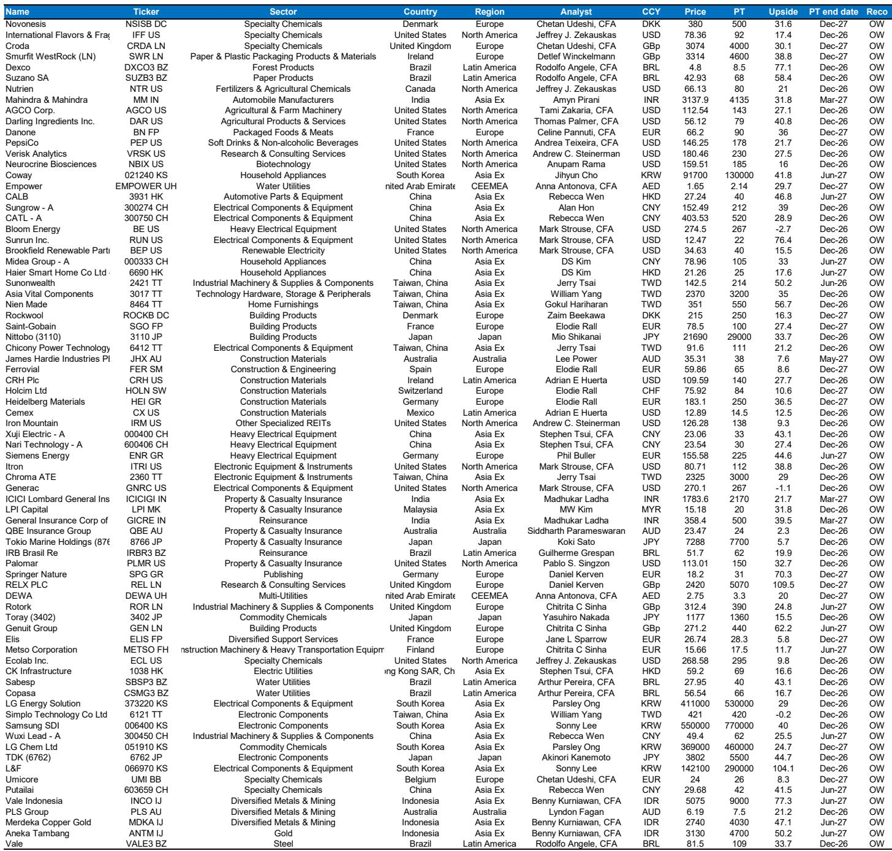
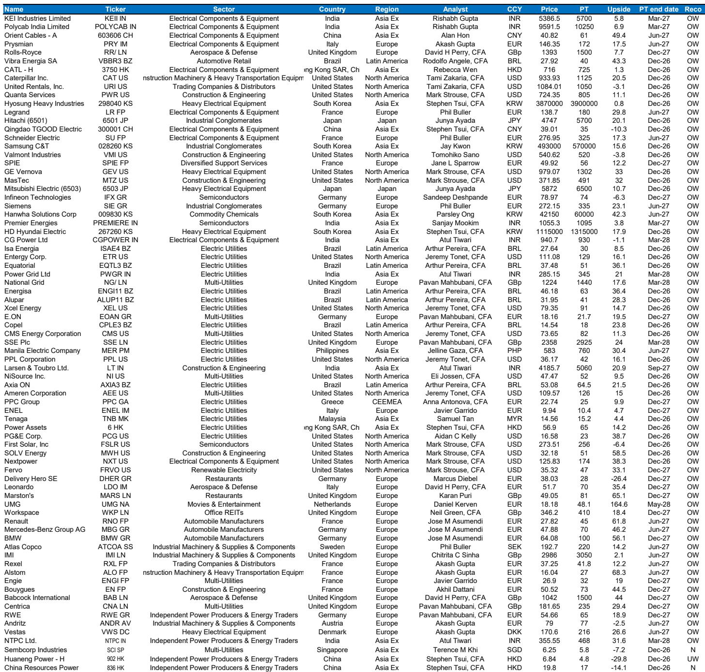
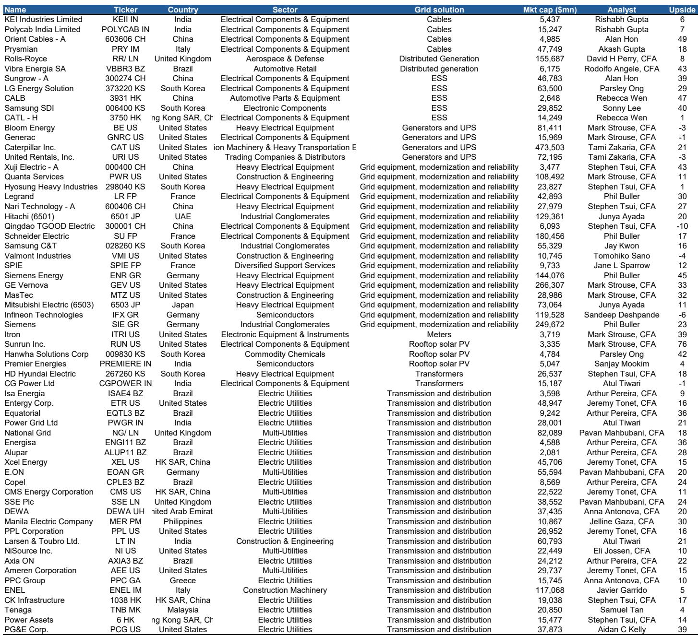

# Sustainable Investing Faces Its Defining Test: The Technology Paradox

The sustainable investing narrative has spent the last three years in a defensive crouch, battered by underperformance, regulatory whiplash, and a political environment that has turned skepticism into a campaign platform. For the first time in 2026, the data suggests a pause in the bleeding. Global sustainable fund assets have crept to $3.8 trillion, equity outflows have stabilized to neutral, and relative performance has broadly matched broad market benchmarks. This is not a victory lap. It is the calm before a far more consequential storm.

The respite is real but fragile. Sustainable funds now represent just 5.6 percent of global assets under management, a market share that has declined even as absolute dollars grew. The stabilization in flows is less a vote of confidence and more a holding pattern. Investors are waiting for proof that sustainable strategies can deliver alpha without the structural drag that has defined them since 2022. The evidence from the first half of 2026 is mixed: European sustainable funds marginally outperformed, US funds slightly lagged, and fixed income held its ground. None of this is decisive enough to trigger a wave of reallocation.

What makes this moment genuinely different from the past two years is the emergence of a structural tension that the sustainable investing framework was not designed to handle. The single largest driver of global equity returns has become the technology sector, and specifically the artificial intelligence theme. Sustainable funds, by construction, are underweight technology. This is not a temporary positioning error. It is an embedded feature of how sustainable portfolios are built, with their European bias, their sector exclusion frameworks, and their historical overweight in utilities, industrials, and energy. The question for every allocator is whether this structural tilt can be reconciled with a market environment where tech dominance is broadening beyond the United States into emerging markets and Japan.

This report from a global investment bank's sustainable investing team offers a candid, data-rich assessment of where the industry stands and where it is heading. It does not sugarcoat the contradictions. It names the risks. And it proposes a set of investable themes that attempt to bridge the gap between sustainability objectives and alpha generation. But the report also leaves open questions that every serious investor should be asking.

## The Technology Underweight Is Not a Bug; It Is a Feature of the Current Construction

The most analytically honest section of the report confronts what the authors call the "downside risk" of technology underweight in sustainable funds. This is not a peripheral concern. It is the central performance question for the next twelve to eighteen months. The report's strategists hold an overweight on Europe relative to the United States, which aligns with the regional bias of most sustainable funds. But those same strategists have laid out a compelling case for the outperformance of the AI theme, which is overwhelmingly US-centric. The cross-currents are not merely uncomfortable; they are structurally unresolvable within the current sustainable fund architecture.

Consider the mechanics. Global sustainable funds are disproportionately European in their benchmark composition, and European equity markets have a much lower technology weighting than US markets. This is not a matter of active manager discretion; it is a function of the index composition that most sustainable funds track or benchmark against. When the report notes that the preference for tech has broadened beyond the US, with emerging market and Japan strategists also overweighting the sector, the implication is clear: the underweight is becoming a global phenomenon, not just a transatlantic one.

The report does not offer a neat solution to this tension. It acknowledges that, excluding information technology, the sector allocation views of its strategists would be broadly neutral for sustainable fund performance. But tech is too large and too influential to be excluded from the analysis. The honest conclusion is that sustainable funds are structurally positioned to lag in a market environment where technology and AI continue to drive returns. This is not a forecast of underperformance; it is a statement of structural vulnerability.

For investors, the implication is uncomfortable. Either sustainable funds need to find a way to increase their technology exposure without violating their sustainability mandates, or they need to accept that relative performance will depend on a rotation away from tech and into the sectors where sustainable funds are overweight. Neither outcome is guaranteed, and neither is within the control of fund managers.

## The Policy Landscape Is More Supportive Than the Headlines Suggest, but the Support Is Shifting Shape

A casual observer of global politics might conclude that sustainable investing is under coordinated assault. The US administration has revoked the Environmental Protection Agency's 2009 endangerment finding, rolled back greenhouse gas standards for vehicles, and proposed deep cuts to climate research programs. In Europe, the political narrative around green regulation has turned defensive, with simplification and competitiveness replacing ambition as the dominant themes.

The report paints a more nuanced picture. In the European Union, the commitment to the climate agenda remains intact at the level of targets. The amendment to the European Climate Law targeting a 90 percent greenhouse gas reduction by 2040 relative to 1990 is a concrete, legally binding objective. What has changed is the delivery mechanism. The shift is toward a broader mix of policy tools: carbon pricing and regulation are being paired with subsidies, state aid, public procurement, targeted protectionism, and infrastructure investment. The authors describe this as "pragmatic decarbonization," and the framing is accurate. The destination has not changed, but the route is being redesigned to account for competitiveness and energy security.

The United States presents a more complex picture. While the regulatory rollbacks are real and damaging to the federal framework for climate action, the report points to a countervailing force in the form of tax credit support for baseload power sources. Geothermal, energy storage, nuclear, and fuel cells have seen their tax credits maintained or extended. The expiry date for solar and wind tax credits has been pulled forward to 2027, but safe harbor rules allow project owners to lock in credits through 2030 under certain conditions. The result is that capacity additions in renewables and storage for 2026 and 2027 are expected to exceed those in 2025. Beyond that, the picture becomes murkier, with BloombergNEF projecting a decline in 2028 and 2029 before a renewed acceleration.

The policy environment is not hostile to sustainable investing in aggregate. It is fragmenting along regional lines and becoming more sector-specific. The risk for investors is not that policy disappears, but that it becomes less predictable and more tied to the political cycle. The report's policy tour across Latin America and Asia reinforces this point: Brazil is moving forward with energy storage auctions and compliance carbon markets, while China's 15th Five-Year Plan anchors clean energy security targets. The global policy direction remains supportive, but the support is increasingly conditional and localized.

## The Investable Themes Offer a Bridge, but the Gap between Alpha and Sustainability Remains Wide

The report proposes six screens for sustainable idea generation, spanning grids, battery supply chains, climate adaptation, European "electro-sovereignty," shareholder activism, and US low-carbon winners. The average upside potential ranges from 20 to 51 percent. These are not passive index tilts; they are active, thematic bets that require conviction and a willingness to look beyond conventional sustainable fund construction.

The grids screen is perhaps the most straightforward. Electrification is a global megatrend that cuts across sustainability and economic competitiveness. The report's focus on grids reflects a recognition that renewable energy generation is only half the equation; the infrastructure to transmit, store, and manage that energy is equally critical. The battery supply chain screen addresses the same logic from the storage side. Climate adaptation, often overlooked in favor of mitigation, is gaining attention as the physical impacts of climate change become more frequent and more costly.

The European "electro-sovereignty" screen is particularly interesting because it ties sustainability to the geopolitics of energy independence. The argument is that Europe's push for electrification, nuclear power, and grid investment is not just an environmental objective but a strategic imperative. The shareholder activism screen, with its 51 percent average upside, suggests that engagement and governance pressure remain powerful tools for value creation in markets where corporate behavior lags behind sustainability expectations.

These themes are intellectually coherent and directionally correct. But they are also narrow. They represent a small subset of the global equity universe, and they require active management and thematic conviction that most sustainable funds are not structured to deliver. The gap between the broad-market sustainable fund and these targeted thematic screens is wide. The report does not fully address how the average sustainable fund can bridge that gap without fundamentally altering its construction.

## What the Report Does Not Fully Answer: The Scale Problem

The report leaves one critical question unresolved. If the structural underweight in technology is a drag on sustainable fund performance, and if the investable themes that offer the most compelling upside are narrow and sector-specific, how does the sustainable investing industry scale its way out of this dilemma?

The data on flows is telling. Equity outflows have stopped, but the report explicitly states that "material inflows will be contingent on relative performance improving in a consistent fashion." This creates a circular problem. To attract inflows, sustainable funds need to perform. To perform, they need to address the technology underweight. To address the technology underweight, they need to either change their construction or wait for a market rotation. Neither is happening quickly.

The report does not model what happens if technology continues to outperform for another twelve to eighteen months. It does not address whether sustainable fund mandates can be adjusted to allow greater technology exposure without violating their ESG criteria. It does not explore whether the solution lies in factor-based approaches, such as the ESGQ framework that the report mentions as an "inadvertent AI hedge." These are not criticisms of the report's quality; they are acknowledgments that the sustainable investing industry is facing a structural challenge that no single piece of research can fully resolve.

The question for investors is whether they are willing to accept the performance implications of the current construction, or whether they need to rethink what "sustainable" means in a portfolio context. The report provides the data and the analysis. The decision belongs to the allocator.

## A Decision Framework for the Second Half of 2026

For investors trying to navigate this environment, the report's analysis suggests three questions that should guide decision-making.

First, what is your time horizon for sustainable investing? If you are a long-term allocator with a decade-long perspective, the current technology underweight is a cyclical headwind that will eventually reverse as market leadership rotates. If you are evaluating performance on a one-to-three-year basis, the structural drag from technology is a material risk that needs to be addressed.

Second, can you tolerate the sector concentration that comes with the most compelling sustainable themes? The screens in this report are concentrated in utilities, industrials, energy, and infrastructure. They are not diversified. The upside potential is real, but so is the tracking error relative to broad market benchmarks.

Third, are you willing to engage with the complexity of regional policy divergence? The policy environment in Europe, the United States, Latin America, and Asia is moving in different directions at different speeds. A global sustainable fund that treats all regions the same is likely to underperform a fund that makes active regional bets based on policy momentum.

The report does not prescribe answers to these questions. It provides the framework. The execution is up to the investor.

## The Path Forward Requires Honesty about Trade-Offs

The sustainable investing industry has spent the last decade selling a narrative of alignment: that doing good and doing well are not just compatible but mutually reinforcing. The data from 2026 suggests a more complicated reality. The alignment exists in fixed income, where sustainable bond performance has been broadly in line with the market. It exists in European equities, where sustainable funds have marginally outperformed. But it is under strain in the single largest driver of global equity returns, and the strain is not temporary.

The report's most valuable contribution is its willingness to name the tension without resolving it prematurely. The technology underweight is real. The policy support is real but fragmenting. The investable themes are compelling but narrow. The sustainable investing industry is not broken, but it is facing a test of its construction and its narrative.

The next twelve months will determine whether the industry adapts or whether it accepts a permanent role as a niche allocation within broader portfolios. The data is on the table. The analysis is clear. The choices belong to the investors who are willing to read the full report and draw their own conclusions.

Join the community to read the full report and review the original charts.

*This article is for learning and discussion only and does not constitute investment advice.*

Personal reading notes and learning share only. Not investment advice.

