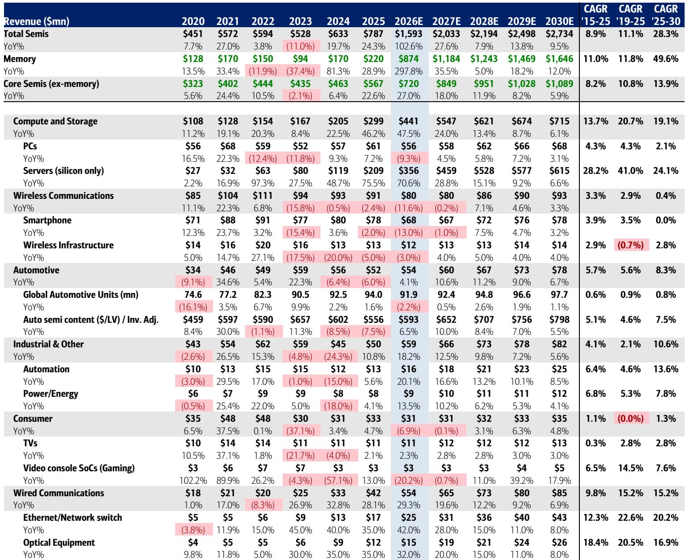
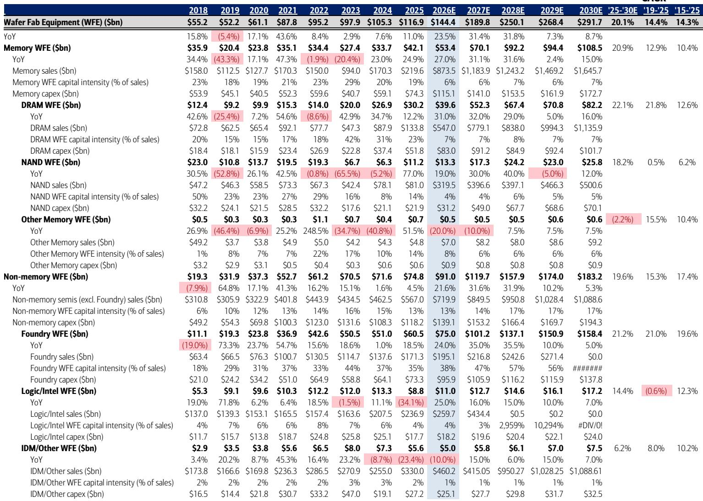
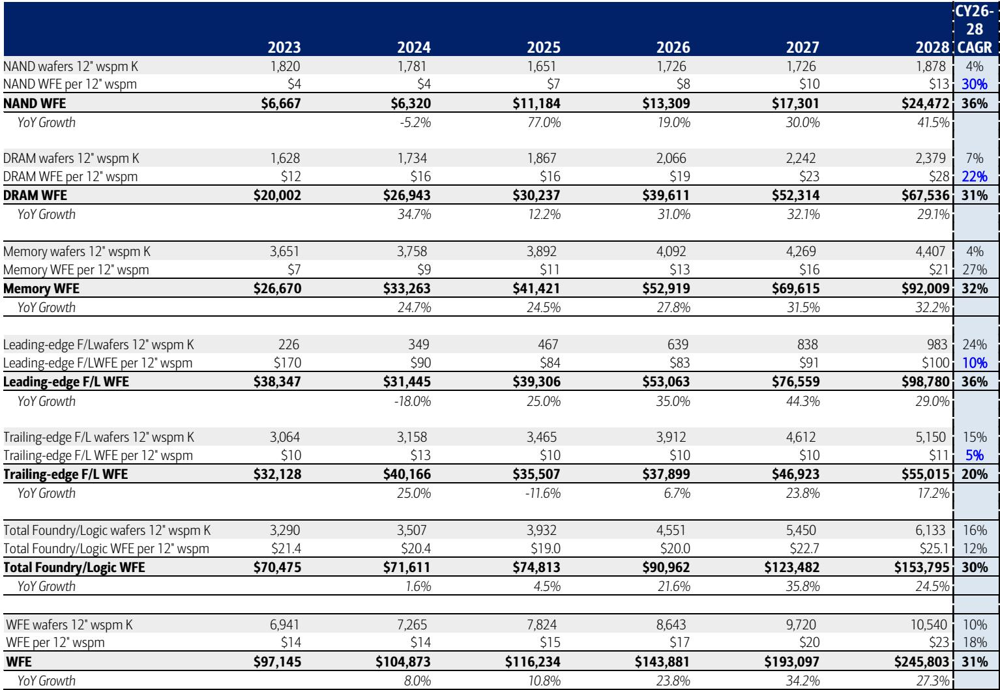

# AI Is Not Just Driving Semiconductor Growth—It Is Fundamentally Reshaping the Industry’s Structural Economics

The semiconductor industry took roughly half a century to generate its first trillion dollars in cumulative annual sales. According to a major investment bank's latest analysis, the next trillion will be added in just five years. This is not a cyclical upswing. It is a structural re-rating of the entire industry's addressable market, driven by the recognition that artificial intelligence has moved from a return-on-investment debate into a physical-constraint reality. The report raises its calendar 2030 total semiconductor industry TAM to $2.7 trillion, representing a 28% compound annual growth rate from 2025 to 2030, up from a prior estimate of $2.3 trillion. This revision is not incremental. It is a fundamental shift in how investors must think about chip demand, supply elasticity, and the duration of the current cycle.

The argument is straightforward but profound. The AI industry is no longer asking whether its investments will pay off; it is now confronting the harder question of how to build enough chips, power, and physical infrastructure to meet demand that is already visible into 2028. Memory shortages and price inflation are the critical moving pieces, but the implications extend far beyond DRAM and NAND. Every segment of the semiconductor value chain—from wafer fab equipment to analog chips to networking silicon—is being pulled into a new growth trajectory. The report's price objective changes across a dozen companies reflect this breadth. This is not a memory story alone. It is a systems story.

For serious investors, the key question is no longer whether AI is real. It is whether the industry can scale its physical capacity fast enough to avoid becoming the bottleneck on its own growth. The report provides the analytical framework to answer that question, but it also raises several uncomfortable ones.

## The Industry Has Entered a Regime of Structural Constraints, Not Cyclical Doubts

The first and most important insight is that the semiconductor industry has crossed a threshold. For the past two years, the dominant narrative around AI infrastructure spending was defensive: hyperscalers had to justify massive capital outlays to skeptical shareholders. That debate is over. The report explicitly states that the industry has moved from having to defend return-on-investment to addressing structural and physical constraints—chips, power, and cleanroom space.

This is a critical distinction. In a cyclical debate, the question is when demand will peak and how far multiples will compress. In a structural-constraint regime, the question is how quickly supply can be expanded and which companies own the bottlenecks. The report's upward revision to wafer fab equipment (WFE) forecasts is the clearest signal of this shift. The new estimate calls for $250 billion in WFE by calendar 2028, up 23% from the prior estimate of $203 billion, with further growth to $292 billion by 2030. This is not a forecast based on optimistic unit demand. It is a forecast based on the physical reality that building enough advanced chip capacity requires more tools, more complexity, and more time than previously assumed.

The implication for investors is that the duration of this cycle is longer than historical analogs. Memory long-term agreements (LTAs) are providing two-to-three-year visibility on supply, demand, and pricing. The recent partnership between a major memory manufacturer and an AI frontier lab is a concrete example of how these agreements are locking in demand well beyond typical planning horizons. When customers are willing to sign multi-year contracts for HBM and high-capacity DRAM, the industry is no longer operating on a spot-market basis. It is operating on a subscription model for compute capacity.

## Memory Is No Longer a Commodity Business—It Is the Structural Laggard in the AI Supply Chain

The report's most dramatic revision is in memory. It models calendar 2026 memory sales growing nearly 298% year over year, following 81% growth in 2024 and 29% growth in 2025. By 2030, memory is forecast to reach $1.65 trillion, representing a 50% CAGR from 2025 to 2030. This is not a typo. Memory is expected to grow nearly four times faster than the rest of the semiconductor industry over that period.

The conventional view of memory as a cyclical commodity is no longer tenable. The report identifies two structural reasons for this transformation. First, memory content per AI system is scaling faster than compute content. As AI models grow larger and require more parameters, the ratio of memory to compute in each server node is increasing. Second, supply elasticity is structurally lower than in previous cycles. The capital intensity and technological complexity of advanced DRAM and NAND fabrication have created barriers that prevent rapid capacity additions. Even with aggressive WFE spending, it takes years to bring new cleanrooms online and qualify advanced memory products.

The price objective for the leading memory manufacturer is raised to $1,500, based on a sum-of-the-parts valuation that applies a 31x PE multiple to its HBM business and a 2.5x price-to-book multiple to its traditional memory business. This dual valuation framework is revealing. The market is being asked to value HBM as a growth technology, not a commodity. The report's assumption that HBM deserves a premium multiple reflects the view that this product line has structural pricing power and multi-year visibility that traditional DRAM never had.

## Wafer Fab Equipment Is the Most Direct Way to Bet on Physical Constraints

If memory is the structural story on the demand side, WFE is the structural story on the supply side. The report raises its WFE forecasts significantly, with calendar 2028 now expected to reach $250 billion, up from $203 billion. The reasoning is multi-layered. Cleanroom availability is expected to improve by 2028, allowing more fab construction. Memory LTAs provide the demand visibility needed to justify long-term capacity investments. And critical technology inflections—gate-all-around transistors, advanced packaging, and high-NA lithography—are driving WFE intensity per wafer higher during upcycles.

The report's price objective changes for semicap companies are among the most aggressive. Applied Materials is raised to $720, KLA to $317, Lam Research to $480, and Teradyne to $525. These are not small adjustments. They reflect a view that the equipment cycle has multiple years of growth ahead, driven by both volume and complexity. The report explicitly calls out customer progress at Intel and Samsung as positives for advanced logic and foundry, while also noting that the concept of a "Terafab"—a factory capable of producing a trillion transistors per second—could become a credible planning assumption.

For investors, the WFE thesis is straightforward. If the semiconductor industry needs to double its output in five years, it needs to buy a lot more equipment. And because each generation of equipment is more expensive than the last, the revenue per wafer is rising. This is a volume-plus-price story, not a volume-only story. The report's decision to move to a calendar 2028 valuation basis for multiple semicap companies is a signal that the cycle is expected to persist longer than the typical three-to-four-year equipment upcycle.

## Core Semiconductors Are Benefiting from AI, but Consumer End Markets Remain a Drag

Not every part of the semiconductor industry is participating equally in the AI boom. The report models core semiconductors (excluding memory) reaching $1.1 trillion by 2030, growing at a 14% CAGR from $567 billion in 2025. Within that, server silicon is the standout, growing at a 24% CAGR. Wired communications, driven by data center networking, grows at 15%. But PCs grow at only 2%, and smartphones are essentially flat at 0% growth.

This bifurcation is important. The AI-driven upgrade cycle is concentrated in the data center. Consumer end markets are facing structural unit headwinds that AI cannot solve. Smartphone unit volumes are declining, and PC replacement cycles remain elongated. The report models wireless communications revenue declining 12% in 2026, driven by smartphone unit weakness. Consumer semiconductors decline 7%.

The implication is that investors need to be highly selective within core semiconductors. Companies with exposure to hyperscaler data center buildout, networking, and AI accelerators will see compounding growth. Companies reliant on consumer demand will see stagnation. The report's price objective for Marvell Technology is raised to $365, reflecting its position in data center networking and custom silicon. Credo Technology is raised to $340, reflecting its role in high-speed connectivity. But the report also notes that the consumer headwind is real and persistent, and it is not going away.

## What the Report Does Not Fully Answer: The Risk of Overinvestment and the Shape of the Demand Curve

For all its analytical rigor, the report leaves several critical questions unanswered. First, it does not fully address the risk of overinvestment. If every hyperscaler, memory manufacturer, and foundry is building capacity simultaneously, there is a non-trivial risk that supply eventually outstrips demand. The report acknowledges that memory LTAs provide visibility, but it does not model what happens if AI model training demand plateaus or if inference becomes dramatically more efficient. The assumption that memory demand grows at a 50% CAGR for five years is aggressive by any historical standard.

Second, the report does not fully disaggregate the demand curve for AI compute. It treats "AI data center systems TAM" of $1.7 trillion by 2030 as a single number, but the composition of that demand matters enormously. Is it driven by training large frontier models, or by widespread inference deployment? The answer determines which parts of the value chain benefit most. If inference dominates, the demand for memory and networking may look different than if training dominates.

Third, the report's price objectives are based on calendar 2028 earnings power for many companies, which requires a leap of faith about execution. The report assumes that Intel becomes a "fully established IDM by CY30" with $6+ in EPS power. That assumption is plausible but far from certain. Similarly, the report assumes that the Terafab concept becomes real and that cleanroom availability expands as modeled. These are reasonable planning assumptions, but they are not guaranteed.

## A Decision Framework for Investors: Three Questions to Ask About Every Semiconductor Position

Given the scale of the opportunity and the uncertainty around timing, investors need a disciplined framework for evaluating semiconductor positions. The report's analysis suggests three questions that should drive every decision.

First, is the company a direct beneficiary of AI infrastructure buildout, or is it exposed to consumer end markets? The report's data is clear: the growth is in data center, memory, networking, and equipment. Everything else is at best a recovery story. An investor holding a consumer-exposed semiconductor company is making a bet on macro recovery, not on AI structural growth. Those are different theses with different risk profiles.

Second, does the company have multi-year visibility into demand? The report's emphasis on memory LTAs is instructive. Companies that can sign long-term agreements with hyperscalers or AI labs have revenue visibility that reduces execution risk. Companies that rely on spot market demand or quarterly procurement cycles are more exposed to demand volatility. The premium that the market is willing to pay for visibility is likely to persist.

Third, is the company benefiting from technology complexity, or from volume alone? The WFE thesis is powerful because it combines volume growth with rising complexity per wafer. Companies that sell tools for advanced packaging, high-NA lithography, or gate-all-around transistors have pricing power that commodity equipment suppliers do not. The same logic applies to memory: HBM is a higher-value product than standard DRAM, and it commands a higher multiple for a reason.

## The Full Report Contains the Charts and Data That Make These Decisions Actionable

The analysis summarized here is based on a detailed report from a global investment bank, and it contains the original charts, company-level financial models, and price objective derivations that serious investors need to build conviction. The report includes a full breakdown of semiconductor sales by end market and device type, a detailed WFE forecast with sensitivity analysis, and individual company write-ups with explicit valuation methodologies. The price objective changes are not arbitrary; they are derived from specific earnings power assumptions and multiple frameworks that are laid out in the report.

For investors who want to understand which companies are positioned to compound through the next five years and which are at risk of being left behind, the full report provides the analytical foundation. The charts in particular are valuable because they show the trajectory of the revisions and the magnitude of the opportunity in a way that text alone cannot convey.

Join the community to read the full report and review the original charts.

*This article is for learning and discussion only and does not constitute investment advice.*

Personal reading notes and learning share only. Not investment advice.

