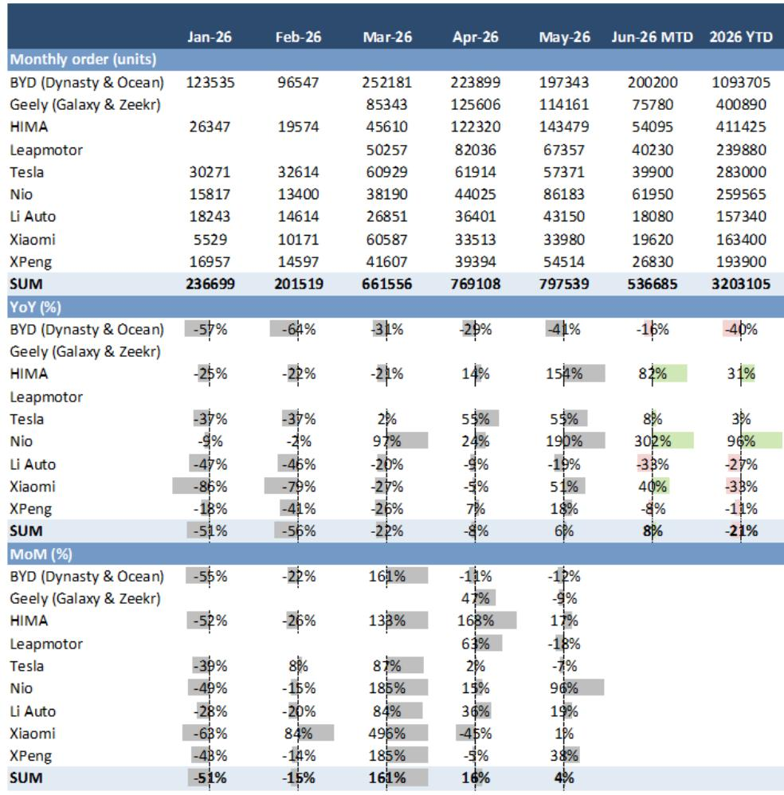
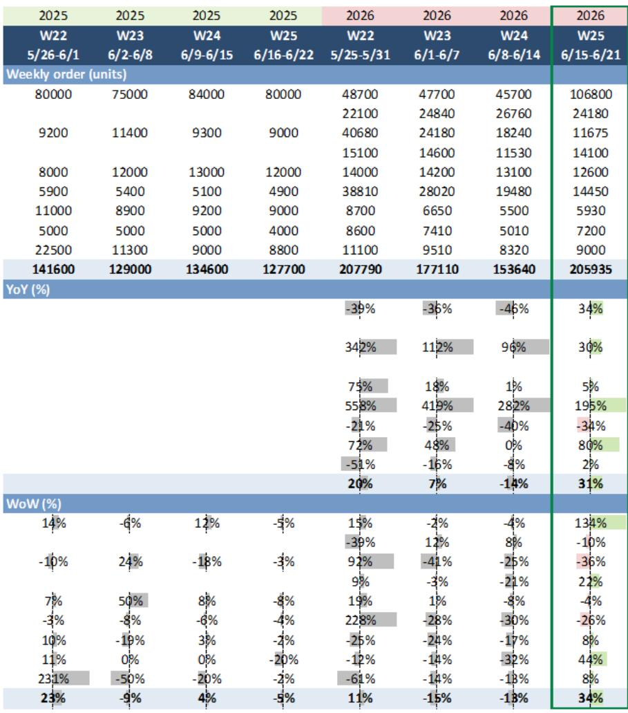
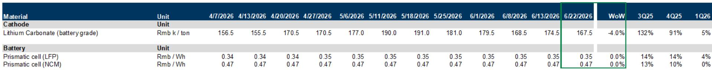

# GS：新能源车周订单暴增34%，但真正的胜负手不在销量

6月第三周，中国新能源车市场交出了一份让多数人意外的高分答卷。GS最新发布的周度追踪数据显示，在6月15日至21日这一周，主要新能源品牌合计订单同比大增31%，环比更是飙升34%。比亚迪、小米、零跑成为环比增长最快的三家车企，增幅分别达到134%、44%和22%。

这份数据发布的时间点值得注意。市场此前普遍担忧价格战持续侵蚀利润，叠加传统燃油车在6月加大折扣力度，新能源车渗透率的上升势头可能遭遇阻力。但GS的周度数据给出了相反的信号：新能源车零售渗透率在6月前两周已达到63.9%，批发渗透率更是攀升至67.9%，均高于5月全月的水平。

订单的爆发式增长，最直接的驱动力是新车型集中上市。比亚迪“大唐”于6月17日开启交付，零跑C10/C11/C16改款于6月16日上市。这些新车型在上市首周即贡献了显著的增量订单。但问题在于：这种由新品脉冲驱动的增长，能否持续？订单转化率如何？价格战是否真的在缓和？

GS这份周度图表报告提供了大量高频数据，但真正值得产业决策者和投资者关注的，不是某一家公司单周订单的起伏，而是这些数据背后隐藏的结构性变化。

> **KC评论：** GS这份周报的核心价值不在于告诉你“哪家卖得好”，而在于它提供了从订单、折扣、渗透率到上游电池价格的完整高频拼图。对于跟踪竞争格局的人来说，单周数据是噪音，但连续数周的趋势变化，往往比季报更能提前暴露拐点。完整报告中的逐周对比图表和品牌级折扣数据，是判断“涨价是否可持续”的关键素材。

## 1. 这轮订单脉冲的含金量，取决于新车型能否跨越“尝鲜期”的鸿沟

比亚迪“大唐”上市首周贡献了惊人的订单增量，但仔细看GS的数据，比亚迪王朝与海洋系列YTD订单同比仍下降40%。这意味着，新车型带来的增量，目前更多是在弥补老车型的订单流失，而非整体市场的净扩张。

零跑的情况类似。其改款车型上市后周订单环比增长22%，但YTD订单数据缺失，难以判断其增长是否可持续。真正值得关注的是蔚来和小米。蔚来YTD订单同比增长96%，在所有品牌中表现最为“抗跌”；小米虽然YTD订单同比下降33%，但6月第三周订单环比增长44%，显示出SU7交付爬坡后需求仍在恢复。

这里的关键问题在于：新车型带来的订单脉冲，通常会在上市后2-4周达到峰值，随后逐步回落。GS报告并未给出新车型订单的转化率数据，也没有区分“新增订单”与“老车型流失订单”的净效果。对于投资者而言，需要关注的是7月初各品牌公布的6月交付量，届时才能判断这轮脉冲有多少转化为了实际交付。

> **KC评论：** GS这份周报最宝贵的地方，在于它提供了品牌级别的周度订单数据，这在其他公开渠道几乎无法获得。但报告没有回答一个关键问题：这些订单有多少是“真实新增”，多少是“老车型订单转移”？对于比亚迪这样的巨头，如果新车型只是分流了自家老车型的客户，那对整体利润率的提升就非常有限。完整报告中的月度订单对比表和YTD同比数据，是判断这一问题的起点。

## 2. 新能源车折扣在收窄，但燃油车折扣在扩大——这个分化比销量数字更重要

GS的数据显示了一个容易被忽略但意义深远的变化：截至6月20日，新能源车经销商平均折扣率为7.48%，低于6月13日的7.54%，更低于去年同期的8.15%。而同期燃油车经销商平均折扣率从19.56%扩大至19.62%，且远高于去年同期的22.95%（折扣率越高，意味着终端降价幅度越大）。

这个分化意味着什么？新能源车行业的“价格战”可能正在进入一个新阶段：头部品牌开始有能力收窄折扣，而燃油车为了守住市场份额，不得不进一步加大优惠力度。比亚迪的折扣率稳定在4.27%，远低于行业平均，说明其定价权在增强。

但这并不意味着新能源车行业已经走出了价格战的泥潭。折扣率的收窄，更多是结构性因素导致：新车型上市初期通常折扣较小，而新车型在订单中的占比提升，拉低了整体折扣率。一旦新车型进入“走量期”，折扣是否还会重新放大，仍需观察。

> **KC评论：** 折扣数据是判断行业利润拐点的先行指标。GS报告中的品牌级折扣趋势图，比整体平均数更有价值——它揭示了谁在主动涨价、谁在被动跟降。完整报告中的比亚迪、特斯拉、蔚来等品牌的逐周折扣曲线，是判断各品牌定价权强弱的关键证据。

## 3. 上游锂价再次承压，但电池成本传递到整车价格存在明显时滞

GS数据显示，电池级碳酸锂价格跌至16.75万元/吨，周环比下降4.0%。而方形LFP电芯和方形NCM电芯价格周环比持平。

锂价下跌对整车企业来说本应是利好，但现实是：上游原材料价格波动传递到下游整车成本，通常需要2-3个季度。这意味着，2025年下半年的锂价上涨压力，正在体现在当前的新能源车成本中；而当前锂价的下跌，要到2026年下半年才能对整车成本产生显著影响。

更重要的是，电芯价格已经连续多周持平，并未跟随锂价下跌。这说明电池厂商在通过锁定利润来对冲上游波动，整车企业短期内难以享受到原材料降价的红利。对于毛利率本就承压的新能源车企来说，这意味着2026年下半年的成本压力可能比市场预期的更大。

> **KC评论：** GS报告中的上游电池定价数据，表面上只是一个价格跟踪，但结合折扣率和订单数据，可以构建一个完整的“成本-定价-销量”分析框架。完整报告中的历史价格对比表和季度均价数据，是判断电池成本趋势是否出现拐点的必要素材。

## 4. 渗透率突破67%之后，增量空间正在从“替代”转向“升级”

6月前两周，新能源车批发渗透率达到67.9%。这个数字已经超过了多数人年初的预期。但高渗透率意味着两件事：第一，新能源车在增量市场中的主导地位已经确立；第二，未来增长的边际难度在加大。

当渗透率超过60%后，市场的主要驱动力将从“燃油车替代”转向“存量升级”——消费者不再是第一次购买新能源车，而是换购或增购。这意味着，产品力、品牌力和服务体验的权重将大幅提升，而价格敏感度可能下降。

这对于不同品牌的意义截然不同。对于蔚来这样的高端品牌，换购需求占比高意味着客户留存和复购率成为关键指标；对于比亚迪这样的全品类品牌，则需要同时应对首次购车和换购两种不同的需求结构。GS报告中的品牌订单数据，如果结合车型级别和价格带的细分，将能更清晰地揭示这一结构性变化。

> **KC评论：** 渗透率突破67%后，市场分析框架需要从“总量增长”转向“结构分化”。GS报告提供了品牌级订单数据，但没有展开价格带和车型级别的分析。完整报告中的CPCA分车型数据和品牌折扣率，是拆解“谁在吃换购红利、谁在吃首次购车红利”的关键。

## 5. 报告没有完全回答的关键问题：订单转化率和终端库存水位

GS的周度数据提供了订单、折扣、渗透率和上游价格的完整拼图，但有两个关键变量没有被覆盖：订单转化率和终端库存水位。

订单转化率决定了周度订单数据在多大程度上能转化为实际交付量。不同品牌的转化率差异巨大：特斯拉和比亚迪的直营/直销模式，转化率通常较高；而依赖经销商的品牌，订单流失率可能更高。GS报告没有提供这一数据，使得周度订单的“含金量”难以准确判断。

终端库存水位则是判断价格战是否会升级的关键指标。如果经销商库存高企，即使订单好转，折扣也难以收窄。GS报告中的折扣数据是一个滞后指标，而库存数据才是先行指标。对于投资者来说，需要关注CPCA即将发布的6月批发和零售数据，以及各品牌在7月初公布的月度交付量，才能更准确地判断这轮订单脉冲的可持续性。

## 6. 对决策者的观察框架：从“谁卖得多”转向“谁卖得贵、谁留得住”

基于GS这份报告提供的高频数据，可以建立一个更实用的观察框架，用于跟踪新能源车行业的竞争格局演变：

第一，关注折扣率的变化方向，而不是绝对值。折扣率收窄的品牌，意味着定价权在增强；折扣率扩大的品牌，则可能面临更大的利润压力。

第二，关注YTD订单增速，而不是单周波动。单周订单容易受新车型上市等一次性因素扰动，YTD数据更能反映品牌的真实竞争力。蔚来YTD订单增长96%，这个数字比单周订单波动更有意义。

第三，关注渗透率突破60%后的品牌分化。当市场从“替代”转向“升级”，谁能留住老客户、谁能吸引换购用户，将成为决定未来3年竞争格局的关键。

第四，关注上游成本传递的时滞。当前锂价下跌，但电芯价格未动，这意味着2026年下半年整车企业的成本压力可能超出预期。对于毛利率较低的品牌，这可能意味着新一轮的价格战压力。

GS这份周度报告的价值，不在于给出了一个简单的“买或卖”信号，而在于它提供了一个高频、多维的数据框架，让决策者能够比市场更早地捕捉到竞争格局变化的信号。但正如上文所分析的，这份报告也留下了几个关键问题没有回答：订单转化率、终端库存、以及新车型对老车型的替代效应。这些问题的答案，隐藏在完整报告的逐周对比图表和更细分的品牌数据中。

---

GS这份周度图表报告共包含超过40页的原始数据与图表，涵盖8大品牌逐周订单变化、经销商折扣率趋势、上游电池价格波动等核心指标。每天，我们的AI agent会与人工review结合，生成这类国际投行中文摘要与KC评论，并整理当天最新数据图表合集，方便直接喂给AI，也方便人工快速把握市场动态。欢迎来我们的知识星球和微信群中继续讨论这些未解问题——比如订单转化率如何估算、终端库存数据如何获取、以及哪些品牌最可能在下一轮价格战中守住利润。

Personal reading notes and learning share only. Not investment advice.

