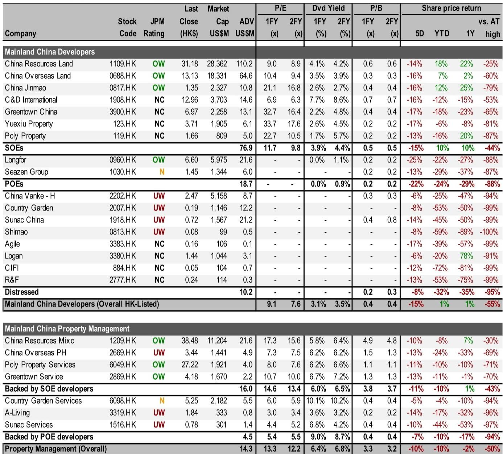
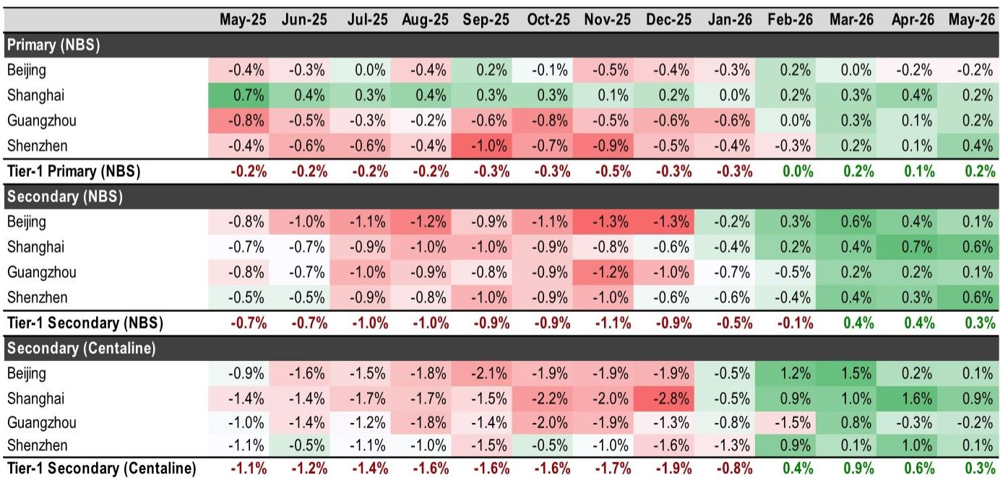
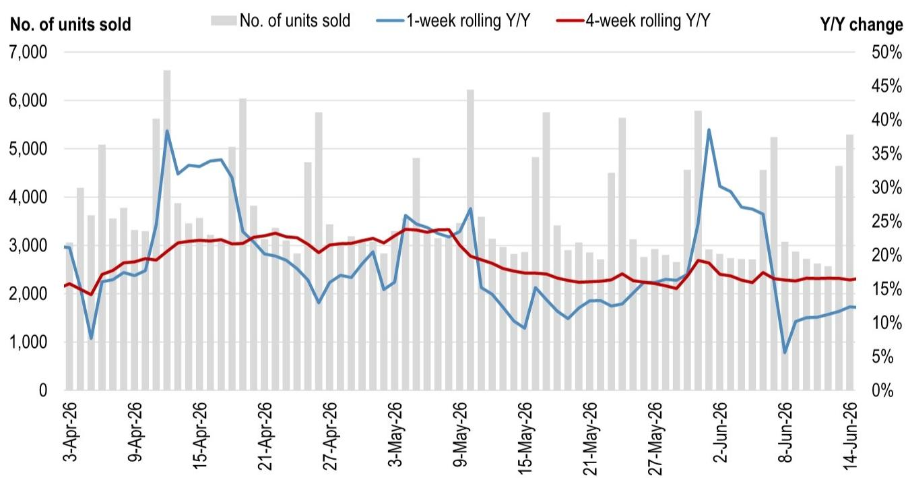

# JPM：地产股急跌不是基本面反转，而是噪音窗口

过去四个交易日，中国地产板块跑输恒生指数9%。对于持有国企开发商仓位的投资者来说，这轮急跌像是突如其来的冷水。但仔细拆解JPM这份最新报告可以发现，市场关心的核心问题——房价是否企稳、销售是否可持续——并没有被高频数据否定。

相反，报告给出的判断值得认真对待：这轮下跌主要是四重噪音的叠加，而非基本面趋势的逆转。真正关键的变化藏在两个被市场低估的信号里——一线城市二手挂牌量的持续下降，以及房价环比连续第四个月转正。这些信号指向的结论是：市场正在从“全面下跌”切换到“K型分化”，而分化的赢家已经清晰。

**KC评论：** 这份报告最核心的判断是，过去几天的急跌不是基本面的“第二只脚”，而是噪音。但噪音本身也值得认真对待——它告诉我们市场对什么信号敏感、什么变量正在被错误定价。完整报告里的高频数据拆解和个股估值表，能帮你判断哪些资产在这轮噪音中反而值得加仓。

---

## 1. 四重噪音叠加，不是基本面逆转

JPM把过去四天的下跌归结为四个原因，每一个都指向“情绪和结构因素”，而非销售或价格数据的恶化。

第一，消费数据的疲弱产生了负面传导。当居民消费信心走弱，市场自然怀疑房地产复苏的可持续性。第二，地产板块的高贝塔属性在市场整体回调中被放大——同期恒生指数本身就在下跌，地产只是跌得更快。第三，短期缺乏催化剂。高频数据虽然“intact”（完好），但没有出现“明显更好”的边际改善，这让市场缺少一个买入的理由。第四，部分投资者过度关注了二手成交的环比下滑，而忽视了季节性因素——3月和4月通常是成交旺季，环比回落是正常现象。

报告特别指出，即使是华润置地和中海地产这样此前相对抗跌的国企龙头，也在过去两个交易日急跌了11%，而同期恒生指数仅跌2%。但即便如此，这两只股票年初至今依然分别跑赢恒生指数22和14个百分点。

> **KC评论：** 这四重噪音中，最容易被误读的是第四点——环比数据。JPM明确说，用环比判断市场健康度是“不准确的”，同比才是更合理的指标。但市场上大量交易型资金和量化模型恰恰在用环比做决策。完整报告里关于季节性调整后的同比数据对比，能帮你建立更可靠的观测框架。

## 2. 一线城市二手挂牌量持续下降，这是被低估的关键信号

报告中最值得关注的图表之一，是一线城市二手挂牌量的冰山指数变化。数据显示，自3月峰值以来，一线城市二手挂牌量已经持续下降了2.5%。

这个信号之所以重要，是因为供给端的收缩是房价企稳的必要条件。过去两年，中国房地产市场的核心矛盾一直是“卖盘过多、买盘不足”。挂牌量的持续下降意味着，一线城市正在从“买方市场”向“均衡市场”过渡。如果这个趋势能够持续，二手房价的环比转正将从“脉冲式修复”升级为“趋势性企稳”。

JPM明确表示，这个因素“likely under-appreciated by the market”——很可能被市场低估了。

**KC评论：** 挂牌量下降2.5%听起来不大，但放在一线城市动辄数万套的存量池里，边际影响不可忽视。更重要的是，这个趋势是否可持续，取决于两个变量：一是价格预期是否已经触底，二是持有成本是否稳定。完整报告里对冰山指数的跟踪是周度的，能帮你判断这个趋势是在加速还是在放缓。

## 3. 同比增速仍维持在10-20%区间，端午节扰动是假摔

高频数据中，市场最担心的是“上周同比增速从+12%骤降到+1%”。但JPM的解读非常直接：这个下降主要来自端午节假期造成的基数效应。如果对比去年同样包含端午节的那一周，同比增速仍然是+15%，与此前数周10-20%的区间一致。

官方网签数据也呈现同样的模式。60城一手房网签同比下降23%，但同样是因为假期因素；如果只对比端午节前三天的数据，同比增速是+60%。12城二手房网签同比下降13%，结束了连续9周的同比正增长，但JPM预期下周就会看到明显的环比和同比改善——因为网签数据本身有“季末冲量”的季节性特征。

报告强调：同比增速是评估市场趋势的更准确指标。而同比数据依然在10-20%的健康区间。

## 4. 房价连续第四个月环比正增长，K型分化的赢家已经清晰

根据国家统计局数据，5月一线城市新房环比+0.2%，二手房环比+0.3%，均为连续第三个月正增长。中原地产的一线城市二手房价指数则显示，5月环比+0.3%，是连续第四个月正增长，尽管增速从4月的+0.6%有所放缓。

这意味着，一线城市的房价已经确认了一个“底部区间”。但JPM同时提醒，这个企稳是K型的——只有国企开发商和聚焦一线城市的公司才能受益。报告明确建议“selectively buy”华润置地、中海地产和金茂这三家国企开发商，因为它们同时具备“销售增长跑赢同行”和“强一线城市敞口”两个特征。

而对于万科、融创等非国企开发商，报告维持谨慎态度，认为它们“可能无法从K型稳定中受益”。

> **KC评论：** 这里有一个关键问题报告没有完全展开：K型分化的“K”会持续多宽？如果一线城市房价继续企稳但二三四线仍在探底，国企开发商的估值溢价能维持到什么水平？完整报告中的个股估值表和P/E对比，能帮你量化这个溢价是否已经price in。

## 5. 报告尚未完全回答的关键问题：消费弱化会否反噬地产复苏

JPM把“消费数据弱化”列为下跌原因之一，但报告并没有深入展开这个逻辑链。消费信心走弱如何传导到地产销售？是通过影响首付能力、还是通过影响购房意愿？如果消费数据持续恶化，一线城市已经企稳的房价会不会再次承压？

这可能是当前地产板块最大的不确定性。过去三个月的房价企稳，很大程度上建立在“政策刺激+积压需求释放”的基础上。如果居民收入预期和消费信心进一步走弱，释放的需求可能难以持续。报告对此没有给出明确判断，而是选择聚焦于高频数据的“事实层面”。

**KC评论：** 这个问题的答案可能需要更宏观的框架——消费数据与地产销售的联动，在历史上往往有3-6个月的滞后。完整报告虽然没有直接回答这个问题，但提供了足够细分的城市级和公司级数据，可以帮你自己搭建这个判断模型。

## 6. 投资者的观察框架：三个维度判断“噪音”是否结束

基于JPM的逻辑，投资者可以通过三个维度来判断这轮急跌是否已经消化完毕：

第一，高频数据的同比趋势是否保持稳定。如果下周的网签数据确认同比增速回到10-20%区间，那么“端午节扰动”的叙事就会被市场接受。

第二，一线城市二手挂牌量是否继续下降。这是最关键的先行指标——挂牌量下降意味着供给端收缩，是房价可持续企稳的前提。

第三，国企开发商相对大盘的表现是否企稳。华润置地和中海地产年初至今仍然大幅跑赢恒指，如果它们相对大盘的跌幅开始收窄，说明市场对K型分化的定价正在回归理性。

报告建议，在下跌中“on dips”选择性买入具备“销售增长跑赢+一线城市敞口”的国企开发商，同时回避非国企开发商。

---

这轮下跌是一次典型的“噪音窗口”——情绪和结构因素叠加，但基本面信号并未确认趋势逆转。真正的考验在于，当噪音消退后，市场是否愿意重新定价一线城市房价企稳的持续性。而那个判断，取决于你能否从周度高频数据中识别出真正的趋势信号，而不是被环比波动牵着走。

每天，我们的AI agent和人工review团队会从JPM、GS、MS等国际投行的最新报告中，提炼出中文摘要与KC评论，daily更新约10-40页，同时整理当天最新数据图表合集。这些内容既方便直接喂给AI做进一步分析，也方便人工快速把握market dynamics。欢迎加入星球和微信群，在数据图表和深度讨论中，一起判断这轮噪音何时结束。

Personal reading notes and learning share only. Not investment advice.

