# Humanoids: The Tide is Rising, Lifting 2026 Forecast

Commercial verification, policy support, and supply-chain feedback point to faster humanoid adoption in China. We raise our 2026 shipment forecast to 50k units. We prefer Leaderdrive, Hengli Hydraulic and Shuanghuan.

We lift our 2026 humanoid robot shipment forecast to 50k units, from 28k, and expect 446k by 2030e, as integrators compete to leverage deployment scale to close the deployment-data loop. More companies in China have announced mass production starting from late 2026, such as XPeng. In the meantime, the shipment mix should gradually shift toward full-size humanoids, at c.30%/50%/70% in 2026-28, in our view. Our supply-chain checks point to a constructive outlook for volume and the start of automated production lines.

Accelerated progress: Commercialization was the key theme in our 2026 outlook. In 1H26, we saw humanoid integrators, enterprise users, and government push commercial verification/adoption. For example, State Grid placed a Rmb6.8bn order for humanoid, quadruped, and dual-arm robots; SF Express and China Post are deploying Robotera's humanoids across logistics centers. For policy, the recent MIIT and SASAC's initiative is use-case driven, targeting 10k-level deployment capacity and >100 high-value applications by end-2026. Local governments and SOEs must identify operational sites (≥20/province, ≥10/central SOE) for humanoid training.

Wave of catalysts ahead. 3Q26 is likely to be eventful for the sector, with potential Optimus Gen 3 unveil and humanoid integrator IPOs. WAIC will be held in July, and WRC / World Humanoid Robot Games in August. We expect a wave of product launches around these events, which should support positive sector sentiment.

We add Kedali and Lens to our China Humanoid Value Chain List, while removing Guomao, Xusheng, and Zhongjian. Among our coverage, our preferred names are:

\- Leaderdrive's harmonic reducers hold a leading market share among humanoid integrators. With strong demand outlook, it has expanded capacity from 50k/month in 1Q26 to \~70k currently, and 100-120k by year-end. We expect humanoid to contribute 35%/50% of revenue in 2026/27e. We lift our PT 72% to Rmb464, assuming 25% long-term global market share in humanoid harmonic reducers.

\- Hengli Hydraulic, a key planetary roller screw supplier for humanoid, potentially expanding offerings to motor and linear actuator assembly. Mexico capacity aims for c.100k robots by year-end.

\- Shuanghuan supplies gears for reducer production and has been developing a new reducer with a leading US humanoid integrator for >2 years. We believe its precision gear know-how will transfer into humanoid components.

<table><tr><td colspan="2">MS ASIA LIMITED+</td></tr><tr><td colspan="2">Sheng Zhong</td></tr><tr><td colspan="2">Equity Analyst</td></tr><tr><td>Sheng Zhong@morganstanley.com</td><td>+852 2239-7821</td></tr><tr><td colspan="2">Carlos Chai</td></tr><tr><td colspan="2">Research Associate</td></tr><tr><td>Carlos Orai@morganstanley.com</td><td>+852 3963-3180</td></tr><tr><td colspan="2">Chelsea Wang</td></tr><tr><td colspan="2">Equity Analyst</td></tr><tr><td>Jiulin.Wang@morganstanley.com</td><td>+852 2239-1118</td></tr></table>

<table><tr><td colspan="3"></td></tr><tr><td colspan="3">CHINA INDUSTRIALS</td></tr><tr><td>Asia Pacific Industry View</td><td></td><td>In-Line</td></tr><tr><td colspan="3">WHAT&#x27;S CHANGED</td></tr><tr><td>Leader Harmonious Drive Systems (688017.SS)</td><td>From</td><td>To</td></tr><tr><td>Price Target</td><td>Rmb269.00</td><td>Rmb464.00</td></tr></table>

Exhibit 1: Upcoming Catalysts - For details, please see our catalyst preview report.

<table><tr><td>Date</td><td>Catalyst</td></tr><tr><td>Jun 30</td><td>UBTECH&#x27;s UWORLD U1 Launch Event</td></tr><tr><td>July</td><td>World Artificial Intelligence Conference 2026 (WAIC)</td></tr><tr><td>Aug 19-23</td><td>World Robot Conference 2026 (WRC)</td></tr><tr><td>Aug 22-26</td><td>2nd World Humanoid Robot Games</td></tr><tr><td>3Q26</td><td>Tesla Optimus Gen3 unveil &amp; production update</td></tr><tr><td>Aug/Oct</td><td>2Q26 &amp; 3Q26 earnings release</td></tr><tr><td>-</td><td>Other integrators&#x27; production and commercialization updateCommercial order announcement for real use cases</td></tr></table>

<table><tr><td colspan="2">IPO Pipeline Status</td></tr><tr><td>Unitree</td><td>Passed the Shanghai Stock Exchange listing committee review on June 1, awaiting CSRC registration</td></tr><tr><td>DeepRobot</td><td>Filed prospectus on May 18</td></tr><tr><td>Leju</td><td>Filed prospectus on May 19</td></tr></table>

Source: MS.

MS does and seeks to do business with companies covered in MS. As a result, investors should be aware that the firm may have a conflict of interest that could affect the objectivity of MS. Investors should consider MS as only a single factor in making their investment decision.

## For analyst certification and other important disclosures, refer to the Disclosure Section, located at the end of this report.

+= Analysts employed by non-U.S. affiliates are not registered with FINRA, may not be associated persons of the member and may not be subject to FINRA restrictions on communications with a subject company, public appearances and trading securities held by a research analyst account.

# Our Latest Humanoid Volume Forecast

Exhibit 2: China humanoid development has seen rapid developments in 2024-26; we are in the early commercialization stage.

  
Source: MS

## China Humanoid Market Forecast

Stronger push toward commercialization. As highlighted in our 2026 outlook, the focus of the humanoid industry is shifting from demonstrations to commercialization and real business value creation. In 1H26, we have observed accelerated progress, with initial use cases broadening across production lines, sorting lines, and commercial services, etc. Recent examples include continuous livestreams of humanoid robots working in factory and logistics settings, as well as further rollouts in unmanned retail stores and interactive commercial services. As business verification typically takes several months, we expect projects that began testing in 1H26 to translate into adoption from 2H26 onward.

Policy support is strengthening. In March 2026, the central government included robotics as a strategic emerging industry for the first time in the 15th five-year-plan (FYP). In June 2026, the Ministry of Industry and Information Technology (MIIT) and the State-owned Assets Supervision and Administration Commission (SASAC), announced a new nationwide initiative to push humanoids into real, operational environments. By end-2026, the government targets validated deployment in representative applications, forming 10k-level deployment capacity, alongside over 100 high-value application scenarios. Local governments and SOEs are required to identify real operational sites (≥20 per province, ≥10 per central SOE) and convert them into training environments for humanoids. MIIT and SASAC will evaluate case progress in November 2026. Support from state-owned enterprises is also materializing in actual orders. State Grid has placed a Rmb6.8bn (\~US \$940mn) order to procure 500 humanoid robots, 3k dual-arm robots, and 5k quadrupeds.

Supplier checks point to a more constructive outlook. During our recent trip, companies' commentary was broadly positive, with the humanoid supply chain moving toward an early volume ramp in 2026-27. We highlight three key trends from our checks.

1. Expanding capacity in anticipation of rising humanoid demand. Hengli's Mexico plant is targeting year-end capacity sufficient to support c.100k robot units. Leaderdrive has increased its monthly harmonic reducer capacity from 50k units in 1Q26 to c.70k currently, with a year-end target of 100-120k, while also benchmarking against Harmonic Drive's planned annual capacity of c.2mn units next year. Xinje is planning c.2mn sets of capacity for humanoid frameless torque motors this year and c.3mn sets next year.

2. Component shipment and revenue to scale quickly. Leadshine anticipates frameless torque motor shipments to rise from 120k units in 2025 to the million-unit level in 2026, while dexterous-hand shipments are expected to ramp from 1k units in 2025 to 10-30k units in 2026. Zhaowei expects humanoid-related revenue to at least double to Rmb40mn this year, with a bull case of c.Rmb100mn. Huayan expects humanoid-related revenue to approach Rmb100mn this year and reach Rmb400-500mn next year.

3. Demand emerging for equipment and automated production lines. Wuxi Lead has signed a strategic cooperation agreement with Beijing Humanoid Robot Innovation Center, covering future assembly-line equipment. Topstar indicated that humanoid robotics already accounts for c.30-40% of downstream demand for its CNC machine tools, suggesting that capacity expansion is starting to translate into equipment demand.

\- For more company-level details and commentary, please refer to our note here.

## We raise our 2026 shipment forecast to 50k units. Reflecting stronger

commercialization momentum, policy support, and positive supplier feedback, we now forecast China humanoid robot shipments of 50k units in 2026, up from our previous estimate of 28k units. As commercialization is still at an early stage, the current shipments mostly come from entertainment, data collection, government projects, and interaction-focused commercial service applications. We estimate half-size humanoid robots, such as Unitree's G1, could account for \~70% of total humanoid robot shipments in 2026. As verification continues and adoption of manipulation-focused, full-size humanoids increases, we expect the mix of full-size units to rise to \~50% in 2027 and \~70% in 2028. By 2030, we forecast China humanoid robot shipments to reach 446k units, implying a 106% CAGR over 2025-30e.

Cost deflation set to continue. We expect the industry's blended ASP to decline 15% in 2026 but rise 5%/2% in 2027/28, mainly due to the increasing adoption of full-size humanoids with higher prices. As the industry remains at an early stage of scaling, many integrators have yet to adopt fully automated production processes. However, based on our supplier checks, some equipment suppliers have already received related orders, suggesting room for manufacturing efficiency gains and cost reduction.

Combining our revised volume and ASP forecasts, we now expect China's humanoid robot market size to reach US\$2bn in 2026 and US\$15bn by 2030e.

\- For a copy of our Global Humanoid Model and Robot Model with forecasts across the full range of embodied AI (not just humanoids), please reach out to your MS representative.

\- The humanoid sales figures in our forecast represent external sales only. We do not include humanoids that are produced for prototypes, pre-order trials, or internal R&D and uses, due to the uncertain commercial value. But we do factor them into the larger production volume for the component TAM model, considering component suppliers benefit no matter what the end use is.

\- Also, we exclude small-size humanoid robots, defined as robots below 1m in height or without arms. We also exclude humanoid robots without the ability to move.

Exhibit 3: We raise our China 2026 humanoid forecast to 50k unit and expect full-size humanoids to see more adoption with improving abilities.

China Humanoid Sales ('k unit)

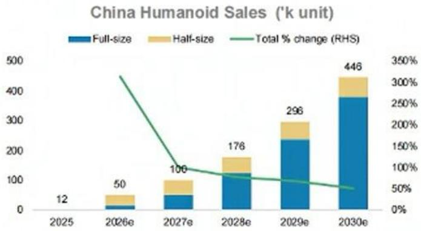  
Source: MS estimates

Exhibit 4: We expect the industry's blended ASP to decline 15% in 2026 but rise 5%/2% in 2027/28, mainly due to the increasing adoption of full-size humanoid

China Humanoid Blended ASP (Rmb'k)

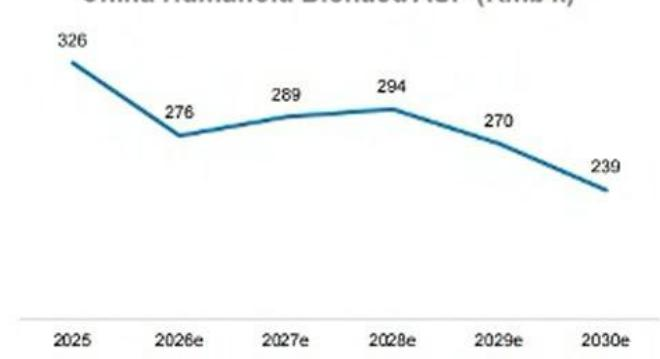  
Source: MS estimates  
Exhibit 5: ...Implying a market size of US\$2bn/\$15bn in 2026e/2030e.  
China Humanoid Market Size (US\$'bn)

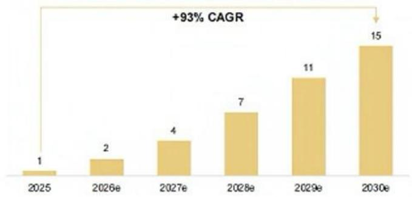  
Source: MS estimates  
Exhibit 6: Our long-term global humanoid forecast is largely unchanged, expecting 1bn units of stock and US\$7.5tr market size by 2050e.

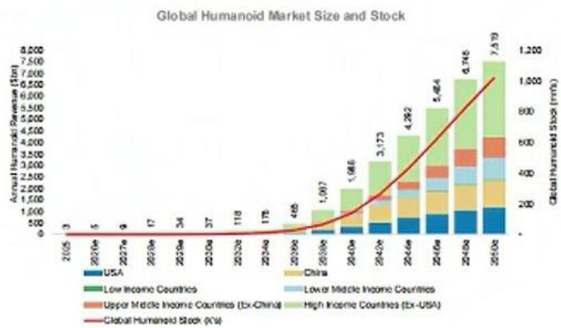  
Source: MS estimates

## China Humanoid Value Chain

We update our humanoid stock list for China in this report: This is a constantly evolving list to reflect the latest progress in the industry. In this report, we add the below names:

\- Kedali (covered by Chris Jiang) - offers harmonic reducers and joint modules. Per the company's 1Q26 earnings call (see the note here), management reiterated its confidence in obtaining orders from a leading humanoid integrator. Harmonic reducers are seeing the fastest progress in terms of orders; other products are also on the way.

\- Lens (covered by Derrick Yang) - supplies domestic customers with joint modules/structural components, while overseas opportunities are mainly head modules and structural parts; for one customer, head modules and structural parts in a dexterous-hand body robot are under validation, according to the company.

We remove Guomao (covered by Sheng Zhong, 603915.SS), Xusheng (covered by Shelley Wang, 603305.SS), and Zhongjian (not covered, 002779.SZ), considering their limited progress in the humanoid business.

For YTD 2026, the sector has been under pressure, the China Humanoid Value Chain index is down 11.3%, broadly in line with MSCI China's 12.1% decline, but with much wider intra-sector divergence. "Body" (component suppliers) have held up best at -8.7%, mainly supported by China supply chain order updates, and multiple domestic humanoid integrators' IPO filings. Integrators' stocks have declined 14.9% and companies making robot brains are down 27.2%.

Exhibit 7: China's Humanoid Value Chain Performance, Equal-weighted  
China Humanoid Value Chain - Equal-weighted Performance  
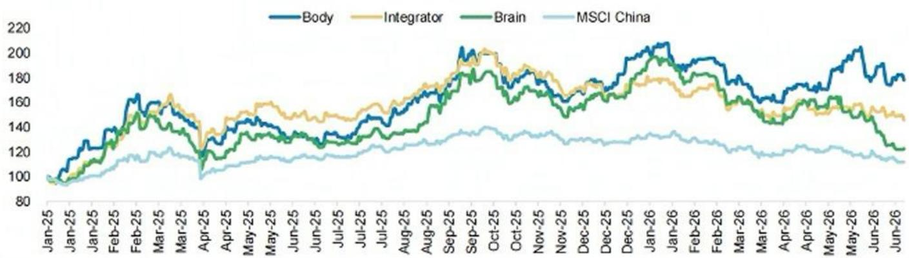  
Source: FactSet as of June 22, 2026 close, MS. Note: the list of companies are before the change of our China Humanoid Value Chain List as stated below. Results shown represent return excluding dividends, brokerage commissions and transaction costs. These figures are not audited. Past performance is no guarantee of future results.

Exhibit 8: China Humanoid Value Chain list: 45 stocks in total, including three in brains, 32 in body components, and 10 integrators. We add Kedali and Lens, remove Guomao, Xusheng, and Zhongjian.

<table><tr><td rowspan="2"></td><td rowspan="2">Ticker</td><td rowspan="2">Company</td><td rowspan="2">Analyst</td><td rowspan="2">Market Cap</td><td rowspan="2">Last Close (LCY)</td><td colspan="4">Price Change</td><td rowspan="2">Notes</td></tr><tr><td>1W</td><td>3M</td><td>YTD</td><td>1Y</td></tr><tr><td>Brain</td><td>BIDU-US</td><td>Baidu</td><td>Yu, Gory</td><td>33,115</td><td>111.8</td><td>(4%)</td><td>(1%)</td><td>(14%)</td><td>34%</td><td>EPNE 5.0, a relatively multimodal foundation model that supports the &quot;brainplatform&quot; layer.</td></tr><tr><td>Brain</td><td>002230-CN</td><td>iFlytek</td><td>Shin, Sharon</td><td>13,794</td><td>43.9</td><td>6%</td><td>(6%)</td><td>(13%)</td><td>(4%)</td><td>Dooponed cooperation with Boeing Humanoid Innovation Center, and delivered the first ~100 unit soft-core order</td></tr><tr><td>Brain</td><td>0660-HK</td><td>Horizon Robotics</td><td>Hsiao, Tim</td><td>6,767</td><td>4.2</td><td>(11%)</td><td>(42%)</td><td>(52%)</td><td>NA</td><td>D-Robotics&#x27; RDK S1006600 platforms target on device robotics workloads including humanoids</td></tr><tr><td>Actuator</td><td>002060-CN</td><td>Sanhua</td><td>Wang, Shelley</td><td>26,929</td><td>45.2</td><td>(1%)</td><td>6%</td><td>(18%)</td><td>81%</td><td>One of Tesla for-1 suppliers, developing humanoid actuators</td></tr><tr><td>Actuator</td><td>601680-CN</td><td>Tuopu</td><td>Wang, Shelley</td><td>16,011</td><td>60.2</td><td>(2%)</td><td>5%</td><td>(22%)</td><td>33%</td><td>One of Tesla for-1 suppliers, developing humanoid actuators</td></tr><tr><td>Battery</td><td>300750-CN</td><td>CATL</td><td>Lu, Jock</td><td>266,226</td><td>409.0</td><td>3%</td><td>3%</td><td>11%</td><td>70%</td><td>Galbot S1 has reportedly entered CATL&#x27;s production line, and CATL previously led Galbot finending</td></tr><tr><td>Battery</td><td>002245-CN</td><td>Azure</td><td>NC</td><td>4,847</td><td>22.2</td><td>10%</td><td>87%</td><td>84%</td><td>183%</td><td>Azure supplies robot batteries to Unitree, DeepRobotics, Fourier and others</td></tr><tr><td>Boating</td><td>300719-CN</td><td>Changzhong</td><td>NC</td><td>3,607</td><td>64.9</td><td>(5%)</td><td>(6%)</td><td>(24%)</td><td>(1%)</td><td>Provides bearing products, screw products under R&amp;D sample stage, in collaboration with Unitree</td></tr><tr><td>Exterior</td><td>300433-CN</td><td>Lons</td><td>Yang, Dornick</td><td>42,202</td><td>53.8</td><td>17%</td><td>92%</td><td>78%</td><td>152%</td><td>Supplies domestic customers with joint-modulobstructural components, and overseas clients with head modules</td></tr><tr><td>Hands</td><td>003021-CN</td><td>Zheowei</td><td>NC</td><td>4,504</td><td>84.4</td><td>(5%)</td><td>(3%)</td><td>(24%)</td><td>(4%)</td><td>Offers deverous hands, motors and modules; guides revenue to double in 2026, Thailand capacity is largely ready</td></tr><tr><td>Hands</td><td>002979-CN</td><td>Leadshine</td><td>NC</td><td>2,577</td><td>53.4</td><td>4%</td><td>51%</td><td>27%</td><td>28%</td><td>Frameless torque motor shipments increased to ~120k units in 2025, targeting the million-unit level in 2026</td></tr><tr><td>LiDAR</td><td>HSAI-US</td><td>Hesai</td><td>Hsiao, Tim</td><td>2,245</td><td>16.9</td><td>(10%)</td><td>(17%)</td><td>(25%)</td><td>(7%)</td><td>1Q26 robotics LiDAR shipments were 118k units, up 137.8% YoY</td></tr><tr><td>LiDAR</td><td>2498-HK</td><td>Roboence</td><td>NC</td><td>1,469</td><td>23.3</td><td>(17%)</td><td>(29%)</td><td>(36%)</td><td>(24%)</td><td>1Q26 robotics LiDAR shipments were 186k units, up 1458.6% YoY</td></tr><tr><td>Magnelix</td><td>300748-CN</td><td>JL Mag</td><td>Zheng, Rachel</td><td>6,221</td><td>34.4</td><td>9%</td><td>14%</td><td>1%</td><td>55%</td><td>Investing US$144mn in Mexico magnetic-component project, to improve competitiveness in humanoid and EVs</td></tr><tr><td>Motor</td><td>300126-CN</td><td>Inovance</td><td>Zhong, Sheng</td><td>25,248</td><td>59.0</td><td>(1%)</td><td>4%</td><td>(8%)</td><td>11%</td><td>++</td></tr><tr><td>Motor</td><td>600580-CN</td><td>Vialong</td><td>NC</td><td>8,339</td><td>35.8</td><td>1%</td><td>(7%)</td><td>(27%)</td><td>90%</td><td>Received small order for frameless torque motor, partnership with Zhangjiang humanoid center</td></tr><tr><td>Motor</td><td>603728-CN</td><td>Moons</td><td>NC</td><td>3,956</td><td>60.3</td><td>(3%)</td><td>6%</td><td>(17%)</td><td>12%</td><td>Offers coreless motor, frameless torque motor, encoder, reducer products for humanoids</td></tr><tr><td>Motor</td><td>688699-CN</td><td>Veichi</td><td>NC</td><td>1,991</td><td>57.0</td><td>(4%)</td><td>(12%)</td><td>(42%)</td><td>33%</td><td>Formed JV with Rongtai in Thailand for robotics products</td></tr><tr><td>Motor</td><td>588150-CN</td><td>Kinco</td><td>NC</td><td>1,506</td><td>109.0</td><td>(2%)</td><td>7%</td><td>(29%)</td><td>37%</td><td>Offers frameless torque motor and modules, collaborating with leading humanoid players</td></tr><tr><td>Reducer</td><td>002472-CN</td><td>Shuanghuan</td><td>Zhong, Sheng</td><td>4,845</td><td>42.1</td><td>(2%)</td><td>15%</td><td>(11%)</td><td>39%</td><td>Leading supplier of gears, developing new type of reducer for humanoids with a key North America client</td></tr><tr><td>Reducer</td><td>688017-CN</td><td>Leaderdrive</td><td>Zhong, Sheng</td><td>11,062</td><td>393.3</td><td>6%</td><td>115%</td><td>103%</td><td>238%</td><td>Monthly shipment reached c.50k units and capacity expansion continues, involved in module-related projects</td></tr><tr><td>Reducer</td><td>002850-CN</td><td>Kedali</td><td>Chris Jiang</td><td>8,022</td><td>169.0</td><td>(1%)</td><td>26%</td><td>20%</td><td>74%</td><td>Confident in getting orders from leading humanoid integrator. Harmonic reducer has fastest progress.</td></tr><tr><td>Reducer</td><td>002856-CN</td><td>Zhongda Leader</td><td>NC</td><td>2,392</td><td>79.7</td><td>(1%)</td><td>7%</td><td>(11%)</td><td>48%</td><td>Certified supplier for a key domestic integrator, announced to invest Rmb200mn for prediction cone components</td></tr><tr><td>Reducer</td><td>301550-CN</td><td>Sling</td><td>NC</td><td>3,037</td><td>98.7</td><td>(9%)</td><td>6%</td><td>1%</td><td>163%</td><td>Claims its harmonic reducer will take a significant share in the North American integrator</td></tr><tr><td>Screw</td><td>601100-CN</td><td>Hangli Hydraulic</td><td>Zhong, Sheng</td><td>23,378</td><td>115.1</td><td>(1%)</td><td>24%</td><td>5%</td><td>71%</td><td>Hengli&#x27;s share in body screw products is indicated at 70%+. The capacity is being prepared mainly in Mexico</td></tr><tr><td>Screw</td><td>300100-CN</td><td>Shuanglin</td><td>NC</td><td>2,681</td><td>30.2</td><td>2%</td><td>(1%)</td><td>(24%)</td><td>(33%)</td><td>Developed roller screw and grinding machine for humanoid, 10k-unit capacity was planned for Jun-2008</td></tr><tr><td>Screw</td><td>603119-CN</td><td>Rongtai</td><td>NC</td><td>2,055</td><td>70.4</td><td>(3%)</td><td>29%</td><td>(21%)</td><td>140%</td><td>To invest US$77mn in Thailand for 7mn sets of robotics components, formed JV with Vischi in Thailand for robots</td></tr><tr><td>Screw</td><td>603667-CN</td><td>XCC</td><td>NC</td><td>3,838</td><td>65.8</td><td>(2%)</td><td>3%</td><td>(6%)</td><td>106%</td><td>To invest Rmb1.tbn for a new plant with an annual capacity of 950k sets of planetary roller screws</td></tr><tr><td>Sumi</td><td>603501-CN</td><td>OmniVision</td><td>Chan, Charlie</td><td>16,566</td><td>90.5</td><td>2%</td><td>(3%)</td><td>(28%)</td><td>(27%)</td><td>Its existing sensor technology can be easily applied to humanoid&#x27;s vision</td></tr><tr><td>Sumi</td><td>688279-CN</td><td>Fortior</td><td>NC</td><td>3,225</td><td>203.2</td><td>(4%)</td><td>32%</td><td>(0%)</td><td>4%</td><td>Offers motor ASIC, driver IC, MCU, and established JV with Sanhua to develop dangerous hands</td></tr><tr><td>Sensor</td><td>600660-CN</td><td>Joyson</td><td>Wang, Shelley</td><td>5,228</td><td>23.8</td><td>(3%)</td><td>3%</td><td>(24%)</td><td>41%</td><td>Developed 6-axis force sensors, bottle sensors, IMU, and has placed commercial orders for humanoid robots</td></tr><tr><td>Sensor</td><td>603662-CN</td><td>Koli</td><td>NC</td><td>2,911</td><td>69.6</td><td>5%</td><td>27%</td><td>(3%)</td><td>16%</td><td>Developed 6-axis force sensor, and depolying humanoid robots in production line</td></tr><tr><td>Sensor</td><td>300007-CN</td><td>Hanwol</td><td>NC</td><td>1,934</td><td>38.5</td><td>(4%)</td><td>(9%)</td><td>(28%)</td><td>10%</td><td>Focus on soft, flexible sensor, cooperating with multiple loading integrators</td></tr><tr><td>Vision</td><td>688322-CN</td><td>Orboc</td><td>NC</td><td>5,106</td><td>128.0</td><td>0%</td><td>71%</td><td>43%</td><td>133%</td><td>A key structured light camera supplier to loading domestic players</td></tr><tr><td>Vision</td><td>688400-CN</td><td>Luster LightTech</td><td>NC</td><td>4,710</td><td>68.2</td><td>15%</td><td>66%</td><td>61%</td><td>171%</td><td>Providing motion capturing solution - F2Motion for Unitree</td></tr><tr><td>Integrator</td><td>700-HK</td><td>Tencent</td><td>Yu, Gory</td><td>511,553</td><td>433.0</td><td>(6%)</td><td>(16%)</td><td>(28%)</td><td>(14%)</td><td>Tencent established a Robotics X lab in Shenzhen in 2018, unveiled XiaomViu</td></tr><tr><td>Integrator</td><td>BABA-US</td><td>Alibaba</td><td>Yu, Gory</td><td>256,882</td><td>107.1</td><td>(5%)</td><td>(16%)</td><td>(27%)</td><td>(5%)</td><td>Released Qwon Studio, a foundation model for physical intelligence. Ant Group&#x27;s Robbyont unveiled LingBot VA</td></tr><tr><td>Integrator</td><td>1810-HK</td><td>Xiaomi</td><td>Mong, Andy</td><td>67,075</td><td>23.7</td><td>(10%)</td><td>(27%)</td><td>(40%)</td><td>(56%)</td><td>Unvoiled Xiaomi Robotics 0, on open-source VLA modell</td></tr><tr><td>Integrator</td><td>1211-HK</td><td>IYD</td><td>Hsiao, Tim</td><td>83,445</td><td>78.4</td><td>(8%)</td><td>(27%)</td><td>(18%)</td><td>(30%)</td><td>Developing humanoid project - Yao Shun Yu, testing UBITECH humanoids; invested in Psaini</td></tr><tr><td>Integrator</td><td>300-HK</td><td>MideaUKA</td><td>Lou, Liikan</td><td>86,031</td><td>82.7</td><td>(9%)</td><td>0%</td><td>(3%)</td><td>N/A</td><td>The self-developed 6-arm wheel-based humanoid Robot Ultra has entered its washing machine factory</td></tr><tr><td>Integrator</td><td>XPEV-US</td><td>XPENG</td><td>Hsiao, Tim</td><td>10,288</td><td>13.2</td><td>(9%)</td><td>(30%)</td><td>(35%)</td><td>(28%)</td><td>Its humanoid robot - Iron, is expected to enter mass production stage by end-of-2026</td></tr><tr><td>Integrator</td><td>002747-CN</td><td>Estun</td><td>Zhong, Sheng</td><td>4,483</td><td>37.2</td><td>12%</td><td>86%</td><td>57%</td><td>98%</td><td>Codroid 02 was unveiled in Jun-2025 for flexible manufacturing</td></tr><tr><td>Integrator</td><td>9830-HK</td><td>UBTECH</td><td>NC</td><td>5,980</td><td>105.0</td><td>(7%)</td><td>12%</td><td>(17%)</td><td>39%</td><td>Walker S2 has begun mass production and delivery, targeting 5,000 annual industrial humanoids by 2026</td></tr><tr><td>Integrator</td><td>2432-HK</td><td>Dobot</td><td>NC</td><td>1,445</td><td>27.5</td><td>(3%)</td><td>(24%)</td><td>(27%)</td><td>N/A</td><td>Dobot started mass production and delivery of the third batch of industrial humanoid ATOM robots in Feb-2026</td></tr><tr><td>ODM</td><td>002000-CN</td><td>Lingyi iTech</td><td>Shih, Sharon</td><td>10,179</td><td>16.7</td><td>11%</td><td>30%</td><td>7%</td><td>103%</td><td>ODM for multiple integrators, first humanoid robots rolled off Lingyi&#x27;s flexing Super Factory</td></tr></table>

Source: FactSet as of June 22, 2026 close, MS. Note: This is a constantly evolving list of Chinese companies involved in humanoids. Companies are included based on the following criteria: (1) MS covered companies; (2) Non-MS covered companies - either announced cooperation with key humanoid companies, or a certain revenue level in products to be applied in humanoid robots. Blue indicates brain, yellow is body/component suppliers and green is integrators/00Ms.

Results shown represent return excluding dividends, brokerage commissions and transaction costs. These figures are not audited. Past performance is no guarantee of future results. For important disclosures regarding companies that are the subject of this screen, please see the MS Disclosure Website at www.morganstanley.com/researchdisclosures. ++ Rating and estimates for this company have been removed from consideration in this report because, under applicable law and/or MS policy, MS may be precluded from issuing such information with respect to this company at this time.

# Leaderdrive (688017.SS), Raising PT to Rmb464; Reiterate OW

A major beneficiary of the rise in humanoids. Leaderdrive is well positioned in the humanoid robot value chain, with shipments to key domestic humanoid integrators including UBTECH and Galbot. Reflecting its strong customer exposure and our revised China humanoid shipment forecast, we now assume a 2026 and long-term global market share for Leaderdrive's humanoid harmonic reducers at 40% and 25%, respectively. We expect humanoid-related sales to contribute 35%/50% of revenue in 2026/27, respectively. We lift our 2026/27e revenue forecasts by 16%/35%. Our 2026/27e revenue forecasts are 7%/12% above Visible Alpha consensus as of June 22, reflecting our positive view on humanoid sector growth and Leaderdrive's ability to sustain a leading market position.

Non-humanoid harmonic reducers to deliver steady growth. We expect Leaderdrive's traditional harmonic reducer business to maintain stable growth, supported by robust cobot growth (industry-level +34% in 1Q26), and the company's ongoing share gains among the "big four" global industrial robot players.

Stable margins supported by scale ramp-up. Despite ASP deflation, we expect Leaderdrive's margins to remain resilient, supported by higher utilization, economies of scale, and improving production efficiency. As a result, we raise our 2026/27e EPS forecasts by 19%/36%, respectively. We also introduce our 2028 forecasts.

Raising PT 72% to Rmb464; reiterate OW. We continue to value Leaderdrive using a DCF to capture the long-term structural potential of its robotics component business. Given the company's product competitiveness and strong customer positioning, we assume Leaderdrive's 2026 and long-term global market-share for humanoid harmonic reducers at 40% and 25%, respectively. Using an unchanged 11% WACC and 4% terminal growth rate, we discount cash flows over 2026-50e and derive our new price target of Rmb464 on the back of higher earnings forecasts. We also raise our bull case 122% to Rmb908 to reflect our bull case global humanoid volumes, and higher margin as Leaderdrive improving its product competitiveness and market position. However, we lower our bear case 15% to Rmb120 to reflect our bear case global humanoid volume and lower margin amid fiercer competition.

Key downside risks include: 1) slower humanoid volume growth due to delayed commercialization or limited commercial ROI; 2) lower-than-expected penetration of harmonic reducers in humanoid robots; 3) market-share erosion, being excluded in the US leading integrator's supply chain; and 4) intensified competition leading to greater pricing pressure.

Exhibit 9: Revision Summary

<table><tr><td rowspan="2"></td><td rowspan="2">2025Actual</td><td rowspan="2">YoY%</td><td colspan="2">2026E</td><td rowspan="2">Change%</td><td rowspan="2">YoY%</td><td colspan="2">2027E</td><td rowspan="2">Change%</td><td rowspan="2">YoY%</td><td rowspan="2">2028ENew</td><td rowspan="2">YoY%</td></tr><tr><td>Old</td><td>New</td><td>Old</td><td>New</td></tr><tr><td>EPS (Rmb)</td><td>0.69</td><td>108%</td><td>0.95</td><td>1.13</td><td>19%</td><td>63%</td><td>1.31</td><td>1.78</td><td>36%</td><td>58%</td><td>2.64</td><td>48%</td></tr><tr><td>Recurring EPS (Rmb)</td><td>0.59</td><td>92%</td><td>0.91</td><td>1.00</td><td>9%</td><td>69%</td><td>1.28</td><td>1.66</td><td>31%</td><td>67%</td><td>2.55</td><td>53%</td></tr><tr><td>Net profit (Rmb mn)</td><td>124</td><td>121%</td><td>174</td><td>207</td><td>19%</td><td>66%</td><td>240</td><td>327</td><td>36%</td><td>58%</td><td>484</td><td>48%</td></tr><tr><td>Revenue (Rmb mn)</td><td>571</td><td>47%</td><td>821</td><td>950</td><td>16%</td><td>66%</td><td>1,104</td><td>1,488</td><td>35%</td><td>57%</td><td>2,164</td><td>45%</td></tr><tr><td>Harmonic reducer &amp; Precision parts</td><td>476</td><td>46%</td><td>670</td><td>828</td><td>24%</td><td>74%</td><td>907</td><td>1,327</td><td>46%</td><td>60%</td><td>1,963</td><td>48%</td></tr><tr><td>Gross profit (Rmb mn)</td><td>211</td><td>45%</td><td>303</td><td>338</td><td>12%</td><td>60%</td><td>407</td><td>529</td><td>30%</td><td>57%</td><td>770</td><td>46%</td></tr><tr><td>Harmonic reducer &amp; Precision parts</td><td>175</td><td>49%</td><td>250</td><td>291</td><td>16%</td><td>66%</td><td>334</td><td>462</td><td>38%</td><td>59%</td><td>679</td><td>47%</td></tr><tr><td colspan="13">Margin</td></tr><tr><td>GP Margin</td><td>36.9%</td><td>-0.6%</td><td>36.9%</td><td>35.6%</td><td>-1.3%</td><td>-1.3%</td><td>36.9%</td><td>35.6%</td><td>-1.3%</td><td>0.0%</td><td>35.6%</td><td>0.0%</td></tr><tr><td>OP Margin</td><td>20.0%</td><td>5.2%</td><td>18.9%</td><td>20.1%</td><td>1.3%</td><td>0.2%</td><td>19.7%</td><td>20.5%</td><td>0.8%</td><td>0.3%</td><td>20.6%</td><td>0.2%</td></tr><tr><td>NP Margin</td><td>21.8%</td><td>7.3%</td><td>21.2%</td><td>21.8%</td><td>0.6%</td><td>0.0%</td><td>21.7%</td><td>22.0%</td><td>0.2%</td><td>0.2%</td><td>22.4%</td><td>0.4%</td></tr></table>

Source: Company data, MS estimates

Leader Harmonious Drive Systems  
Exhibit 10: Leaderdrive: Financial Summary

<table><tr><td>(Rmb Mn)</td><td>2024A</td><td>2025A</td><td>2026E</td><td>2027E</td><td>2028E</td></tr><tr><td>Revenue</td><td>387</td><td>571</td><td>950</td><td>1,488</td><td>2,164</td></tr><tr><td>Cost of sales and services</td><td>(242)</td><td>(360)</td><td>(812)</td><td>(959)</td><td>(1,394)</td></tr><tr><td>Gross profit</td><td>145</td><td>211</td><td>338</td><td>529</td><td>770</td></tr><tr><td>Business Tax and plus</td><td>(4)</td><td>(3)</td><td>(5)</td><td>(8)</td><td>(12)</td></tr><tr><td>Selling exp.</td><td>(13)</td><td>(13)</td><td>(18)</td><td>(29)</td><td>(42)</td></tr><tr><td>G&amp;A exp.</td><td>(72)</td><td>(80)</td><td>(123)</td><td>(188)</td><td>(271)</td></tr><tr><td>Operating profit</td><td>57</td><td>114</td><td>191</td><td>304</td><td>446</td></tr><tr><td>Financial cost/income</td><td>0</td><td>(2)</td><td>1</td><td>1</td><td>1</td></tr><tr><td>Other Income</td><td>11</td><td>12</td><td>19</td><td>30</td><td>43</td></tr><tr><td>Asset impairment Loss</td><td>(34)</td><td>(30)</td><td>(29)</td><td>(35)</td><td>(33)</td></tr><tr><td>Net Income from fair value charges</td><td>4</td><td>16</td><td>20</td><td>18</td><td>13</td></tr><tr><td>Investment Gains/Other Income</td><td>28</td><td>36</td><td>48</td><td>74</td><td>108</td></tr><tr><td>Credit Impairment Loss</td><td>(5)</td><td>(1)</td><td>(8)</td><td>(10)</td><td>(11)</td></tr><tr><td>Non-operating profit</td><td>0</td><td>0</td><td>-</td><td>-</td><td>-</td></tr><tr><td>Non-operating loss</td><td>(0)</td><td>(1)</td><td>(2)</td><td>(3)</td><td>(5)</td></tr><tr><td>Gains on Asset Dispositions</td><td>0</td><td>0</td><td>-</td><td>-</td><td>-</td></tr><tr><td>Profit before tax</td><td>61</td><td>144</td><td>240</td><td>379</td><td>562</td></tr><tr><td>Tax</td><td>(5)</td><td>(18)</td><td>(31)</td><td>(48)</td><td>(72)</td></tr><tr><td>Net profit</td><td>56</td><td>126</td><td>209</td><td>331</td><td>490</td></tr><tr><td>Minority</td><td>0</td><td>(1)</td><td>(2)</td><td>(4)</td><td>(6)</td></tr><tr><td>Net profit to shareholders</td><td>56</td><td>124</td><td>207</td><td>327</td><td>484</td></tr><tr><td>EPS (Rmb)</td><td>0.33</td><td>0.69</td><td>1.13</td><td>1.78</td><td>2.64</td></tr><tr><td>Net profit to shareholders - recurring</td><td>52</td><td>106</td><td>183</td><td>305</td><td>468</td></tr><tr><td>EPS (Rmb) - recurring</td><td>0.31</td><td>0.59</td><td>1.00</td><td>1.66</td><td>2.55</td></tr></table>

<table><tr><td>(Rmb Mn)</td><td>2024A</td><td>2025A</td><td>2026E</td><td>2027E</td><td>2028E</td></tr><tr><td colspan="6">Growth (%)</td></tr><tr><td>Turnover</td><td>8.8%</td><td>47.3%</td><td>66.5%</td><td>56.6%</td><td>45.4%</td></tr><tr><td>Operating Profit</td><td>-7.6%</td><td>99.8%</td><td>67.8%</td><td>59.3%</td><td>46.5%</td></tr><tr><td>Net Profit</td><td>-33.3%</td><td>121.4%</td><td>66.2%</td><td>58.1%</td><td>48.3%</td></tr><tr><td colspan="6">Margins (%)</td></tr><tr><td>Gross Margin</td><td>37.5%</td><td>36.9%</td><td>35.6%</td><td>35.6%</td><td>35.6%</td></tr><tr><td>Selling expenses</td><td>3.3%</td><td>2.3%</td><td>1.9%</td><td>1.9%</td><td>1.9%</td></tr><tr><td>G&amp;A expenses</td><td>18.5%</td><td>14.1%</td><td>13.0%</td><td>12.6%</td><td>12.5%</td></tr><tr><td>Operating Margin</td><td>14.7%</td><td>20.0%</td><td>20.1%</td><td>20.5%</td><td>20.6%</td></tr><tr><td>Net Margin</td><td>14.5%</td><td>21.8%</td><td>21.8%</td><td>22.0%</td><td>22.4%</td></tr><tr><td colspan="6">Efficiency</td></tr><tr><td>Asset Turnover (X)</td><td>0.1</td><td>0.1</td><td>0.2</td><td>0.3</td><td>0.4</td></tr><tr><td>Inventory Days</td><td>370.4</td><td>288.9</td><td>280.0</td><td>270.0</td><td>265.0</td></tr><tr><td>Account Receivables Days</td><td>138.1</td><td>124.4</td><td>115.0</td><td>105.0</td><td>95.0</td></tr><tr><td>Account Payable Days</td><td>101.7</td><td>113.8</td><td>80.0</td><td>80.0</td><td>80.0</td></tr><tr><td colspan="6">Return (%)</td></tr><tr><td>ROA</td><td>1.5%</td><td>3.2%</td><td>5.2%</td><td>7.5%</td><td>9.9%</td></tr><tr><td>ROE</td><td>1.6%</td><td>3.5%</td><td>5.6%</td><td>8.4%</td><td>11.4%</td></tr><tr><td>ROIC</td><td>1.6%</td><td>3.6%</td><td>5.7%</td><td>8.5%</td><td>11.6%</td></tr><tr><td colspan="6">Gearing (X)</td></tr><tr><td>Asset/Equity</td><td>1.1</td><td>1.1</td><td>1.1</td><td>1.1</td><td>1.1</td></tr><tr><td>Total Liabilities/Equity</td><td>0.1</td><td>0.1</td><td>0.1</td><td>0.1</td><td>0.2</td></tr><tr><td>Net Cash</td><td>1,455.5</td><td>746.1</td><td>572.9</td><td>470.4</td><td>407.2</td></tr><tr><td colspan="6">Valuations (X)</td></tr><tr><td>P/E</td><td>324.5x</td><td>350.1x</td><td>215.0x</td><td>136.0x</td><td>0.0x</td></tr><tr><td>P/BV</td><td>5.3x</td><td>11.6x</td><td>11.1x</td><td>10.5x</td><td>0.0x</td></tr><tr><td>EV/EBITDA</td><td>148.9x</td><td>231.1x</td><td>137.8x</td><td>92.1x</td><td>0.0x</td></tr><tr><td>Dividend Yield (%)</td><td>0.1%</td><td>0.1%</td><td>0.1%</td><td>0.2%</td><td>0.0%</td></tr></table>

<table><tr><td>(Rmb Mn)</td><td>2024A</td><td>2025A</td><td>2026E</td><td>2027E</td><td>2028E</td></tr><tr><td>Non-current assets</td><td>1,550</td><td>1,337</td><td>1,491</td><td>1,729</td><td>2,063</td></tr><tr><td>PPE</td><td>494</td><td>610</td><td>757</td><td>979</td><td>1,290</td></tr><tr><td>Intangible assets</td><td>59</td><td>57</td><td>56</td><td>56</td><td>57</td></tr><tr><td>Other current assets</td><td>998</td><td>670</td><td>877</td><td>694</td><td>716</td></tr><tr><td>Current assets</td><td>2,205</td><td>2,592</td><td>2,499</td><td>2,629</td><td>2,808</td></tr><tr><td>Cash</td><td>1,525</td><td>746</td><td>573</td><td>470</td><td>407</td></tr><tr><td>Cash Deposits and Equivalents</td><td>7</td><td>9</td><td>9</td><td>9</td><td>9</td></tr><tr><td>Notes Receivable</td><td>53</td><td>61</td><td>47</td><td>78</td><td>122</td></tr><tr><td>Account Receivable</td><td>147</td><td>194</td><td>299</td><td>428</td><td>563</td></tr><tr><td>Prepayments</td><td>13</td><td>7</td><td>34</td><td>53</td><td>76</td></tr><tr><td>Other Receivables</td><td>2</td><td>3</td><td>4</td><td>7</td><td>10</td></tr><tr><td>Inventory</td><td>246</td><td>285</td><td>470</td><td>709</td><td>1,012</td></tr><tr><td>Other Current Assets</td><td>212</td><td>1,286</td><td>1,063</td><td>874</td><td>808</td></tr><tr><td>Total Assets</td><td>3,755</td><td>3,929</td><td>3,989</td><td>4,358</td><td>4,871</td></tr><tr><td colspan="6"></td></tr><tr><td>Current liabilities</td><td>228</td><td>271</td><td>232</td><td>338</td><td>471</td></tr><tr><td>Notes Payable</td><td>-</td><td>56</td><td>-</td><td>-</td><td>-</td></tr><tr><td>Account Payable</td><td>67</td><td>112</td><td>134</td><td>210</td><td>305</td></tr><tr><td>Advances from Customers</td><td>11</td><td>3</td><td>13</td><td>20</td><td>30</td></tr><tr><td>Salary payable</td><td>12</td><td>25</td><td>29</td><td>45</td><td>65</td></tr><tr><td>Tax payable</td><td>3</td><td>24</td><td>10</td><td>15</td><td>22</td></tr><tr><td>Other current assets</td><td>133</td><td>50</td><td>47</td><td>48</td><td>49</td></tr><tr><td>Non-current liabilities</td><td>97</td><td>115</td><td>73</td><td>115</td><td>167</td></tr><tr><td>Non-controlling interests</td><td>5</td><td>6</td><td>4</td><td>(0)</td><td>(6)</td></tr><tr><td>Shareholders&#x27; equity</td><td>3,425</td><td>3,537</td><td>3,680</td><td>3,905</td><td>4,240</td></tr><tr><td>Share Capital</td><td>169</td><td>183</td><td>183</td><td>183</td><td>183</td></tr><tr><td>Additional Paid-in Capital</td><td>2,826</td><td>2,830</td><td>2,830</td><td>2,830</td><td>2,830</td></tr><tr><td>Retained Earnings</td><td>431</td><td>523</td><td>686</td><td>892</td><td>1,226</td></tr><tr><td>Total Liabilities and Equity</td><td>3,755</td><td>3,929</td><td>3,989</td><td>4,358</td><td>4,871</td></tr></table>

Source: Company data, MS  
E = MS estimates  
Source: Company data, MS

<table><tr><td colspan="6">Cashflow Statement</td></tr><tr><td>(Rmb Mfr)</td><td>2024A</td><td>2025A</td><td>2026E</td><td>2027E</td><td>2028E</td></tr><tr><td>Operating cash flow</td><td>28</td><td>152</td><td>110</td><td>103</td><td>220</td></tr><tr><td>Investing cash flow</td><td>(312)</td><td>(762)</td><td>(245)</td><td>(144)</td><td>(199)</td></tr><tr><td>Financing cash flow</td><td>840</td><td>(108)</td><td>(38)</td><td>(62)</td><td>(85)</td></tr><tr><td>Increase in cash</td><td>556</td><td>(779)</td><td>(173)</td><td>(103)</td><td>(63)</td></tr><tr><td>Effect of FX changes</td><td>(0)</td><td>(1)</td><td>-</td><td>-</td><td>-</td></tr><tr><td>Cash Restatement</td><td>0</td><td>1</td><td>-</td><td>-</td><td>-</td></tr><tr><td>Cash and cash equivalents at BOP</td><td>969</td><td>1.525</td><td>746</td><td>573</td><td>470</td></tr><tr><td>Cash and cash equivalents at EOP</td><td>1,525</td><td>746</td><td>573</td><td>470</td><td>407</td></tr></table>

Exhibit 11: Base case DCF

<table><tr><td colspan="2">(in Rmb&#x27;mn unless specified)</td><td>2025</td><td>2026e</td><td>2027e</td><td>2028e</td><td>2029e</td><td>2030e</td><td>2040e</td><td>2050e</td></tr><tr><td colspan="2">Revenue</td><td>571</td><td>950</td><td>1,489</td><td>2,170</td><td>3,171</td><td>3,723</td><td>83,879</td><td>379,668</td></tr><tr><td colspan="2">Harmonic reducer - non-humanoid</td><td>395</td><td>463</td><td>552</td><td>609</td><td>714</td><td>862</td><td>4,504</td><td>18,129</td></tr><tr><td colspan="2">Humanoid components (reducer, screw, and actuator)</td><td>47</td><td>330</td><td>739</td><td>1,320</td><td>2,175</td><td>2,536</td><td>78,197</td><td>358,942</td></tr><tr><td colspan="2">Precision Parts</td><td>34</td><td>36</td><td>38</td><td>40</td><td>43</td><td>47</td><td>87</td><td>127</td></tr><tr><td colspan="2">Integrated actuator</td><td>74</td><td>96</td><td>129</td><td>162</td><td>190</td><td>219</td><td>765</td><td>1,672</td></tr><tr><td colspan="2">Intelligent equipment</td><td>15</td><td>21</td><td>27</td><td>34</td><td>43</td><td>54</td><td>321</td><td>793</td></tr><tr><td colspan="2">Other business</td><td>5</td><td>5</td><td>5</td><td>5</td><td>5</td><td>5</td><td>5</td><td>5</td></tr><tr><td colspan="2">Gross profit</td><td>211</td><td>338</td><td>529</td><td>770</td><td>1,128</td><td>1,323</td><td>29,358</td><td>125,290</td></tr><tr><td>GPM</td><td>%</td><td>36.9%</td><td>35.6%</td><td>35.5%</td><td>35.5%</td><td>35.6%</td><td>35.5%</td><td>35.0%</td><td>33.0%</td></tr><tr><td colspan="2">Operating profit</td><td>114</td><td>191</td><td>304</td><td>445</td><td>659</td><td>777</td><td>18,453</td><td>83,527</td></tr><tr><td>OPM</td><td>%</td><td>20.0%</td><td>20.1%</td><td>20.4%</td><td>20.5%</td><td>20.8%</td><td>20.9%</td><td>22.0%</td><td>22.0%</td></tr><tr><td colspan="2">FCFF</td><td></td><td>74</td><td>121</td><td>179</td><td>271</td><td>324</td><td>8,690</td><td>43,130</td></tr><tr><td>Start year</td><td>2026</td><td></td><td></td><td></td><td></td><td></td><td></td><td></td><td></td></tr><tr><td>End year</td><td>2050</td><td></td><td></td><td></td><td></td><td></td><td></td><td></td><td></td></tr><tr><td>NPV of future cash flow</td><td>36,473</td><td></td><td></td><td></td><td></td><td></td><td></td><td></td><td></td></tr><tr><td>Terminal value</td><td>591,502</td><td></td><td></td><td></td><td></td><td></td><td></td><td></td><td></td></tr><tr><td>NPV of terminal value</td><td>48,513</td><td></td><td></td><td></td><td></td><td></td><td></td><td></td><td></td></tr><tr><td>Terminal value % of EV</td><td>57.1%</td><td></td><td></td><td></td><td></td><td></td><td></td><td></td><td></td></tr><tr><td>Equity value</td><td>84,986</td><td></td><td></td><td></td><td></td><td></td><td></td><td></td><td></td></tr><tr><td>Per share value (Rmb)</td><td>464</td><td></td><td></td><td></td><td></td><td></td><td></td><td></td><td></td></tr></table>

Source: Company data, MS estimates

Exhibit 12: WACC methodology

<table><tr><td colspan="2">WACC</td></tr><tr><td>Cost of equity</td><td>13.2%</td></tr><tr><td>Risk free rate</td><td>4.2%</td></tr><tr><td>Equity risk premium</td><td>6.0%</td></tr><tr><td>Beta</td><td>1.5</td></tr><tr><td>Cost of debt</td><td>2.1%</td></tr><tr><td>Pre-tax CofD</td><td>2.4%</td></tr><tr><td>Tax rate</td><td>12.0%</td></tr><tr><td>Equity/Capital</td><td>80.0%</td></tr><tr><td>Debt/Capital</td><td>20.0%</td></tr><tr><td>WACC</td><td>11.0%</td></tr></table>

Exhibit 13: Bull/bear case value

<table><tr><td colspan="5">Bull/Base/Bear Scenario</td></tr><tr><td></td><td>2025e Global Volume</td><td>2050e OPM</td><td>Share Value</td><td>Upside/Downside</td></tr><tr><td>Bull case</td><td>344</td><td>24%</td><td>908</td><td>131%</td></tr><tr><td>Base case</td><td>202</td><td>22%</td><td>464</td><td>18%</td></tr><tr><td>Bear case</td><td>38</td><td>20%</td><td>120</td><td>-69%</td></tr></table>

Source: MS. Note: market share represents humanoid harmonic reducer market share. Upside/downside represents the difference to the closing price of Rmb393 on June 22, 2026  
Source: MS estimate

Source: Refinitiv, MS

Risk Reward Themes
Secular Growth: Positive
View descriptions of Risk Rewards Themes here

## Risk Reward – Leader Harmonious Drive Systems (688017.SS)

Well positioned to capture structural tailwind of humanoids and other robotics

## PRICE TARGET Rmb464.00

Base case. We use DCF to value Leaderdrive, by discounting 2025-50e cash flow at a WACC of 11% and terminal growth rate of 4%, to derive per share value of Rmb464.

<table><tr><td rowspan="3">Consensus Price Target Distribution</td><td rowspan="3">Rmb52.90</td><td>Rmb218.11</td><td>Rmb496.00</td></tr><tr><td colspan="2">MS PT</td></tr><tr><td>Mean</td><td>MS Estimates</td></tr><tr><td colspan="4">Source: Refinitiv, MS</td></tr></table>

## RISK REWARD CHART

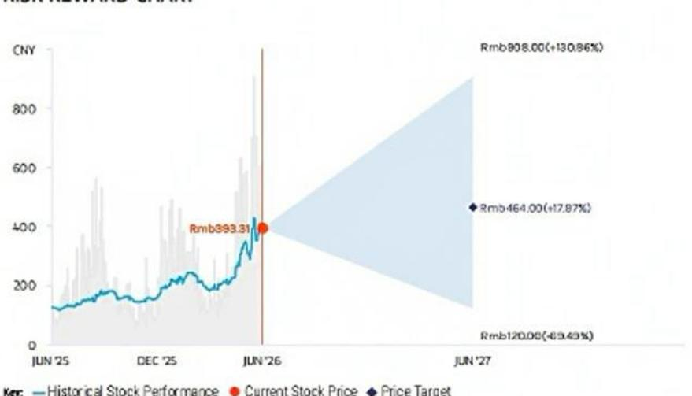

## OVERWEIGHT THESIS

\- Leaderdrive is a key supplier of humanoid harmonic reducers, supplying key domestic integrators and has a leading market share.
- For other robots, we expect an increase in the average number of harmonic reducers per robot, thanks to rising manipulation capabilities, offsetting the price impact.
- Leaderdrive is developing other products for humanoids, such as planetary roller screws and linear actuators, which can capture higher value per robot.

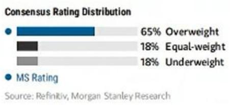  
Source: Refinitiv, MS

## BULL CASE

## Bull case DCF

## Rmb908.00 BASE CASE

Leaderdrive's bargaining power continues to improve, supported by high technological barriers and quality, resulting in margin expansion. Humanoid robots progress is better than expected, bull case global volume.

## Base case DCF

## Rmb464.00

Leaderdrive, is a leading domestic harmonic reducer company, with leading market share in domestic humanoid integrators. Industrial robots continue steady growth. Rising manipulation capability leads to an increase in the average number of harmonic reducers per robot.

## BEAR CASE

## Rmb120.00

## Bear case DCF

Mass production of humanoid robots is slower than expected with much smaller volume. Harmonic reducers are no longer a mainstream solutions for humanoids, leading to price competition and margin erosion.

## Risk Reward – Leader Harmonious Drive Systems (688017.SS)

## KEY EARNINGS INPUTS

<table><tr><td>Drivers</td><td>Dec 2025</td><td>Dec 2026e</td><td>Dec 2027e</td><td>Dec 2028e</td></tr><tr><td>Harmonic reducer revenue growth (%)</td><td>31.3</td><td>17.1</td><td>19.3</td><td>10.3</td></tr><tr><td>Harmonic reducer GP margin (%)</td><td>38.0</td><td>36.0</td><td>36.0</td><td>36.2</td></tr></table>

## INVESTMENT DRIVERS

1) The average unit price of harmonic reducers returns to positive growth and the company's cost control ability remains strong.

2) Integrated actuator business expands quickly, with continuous gross profit margin improvement.

## GLOBAL REVENUE EXPOSURE

<table><tr><td rowspan="4">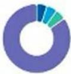</td><td>● 0-10%</td><td>APAC, ex Japan, Mainland China and India</td></tr><tr><td>● 0-10%</td><td>Europe ex UK</td></tr><tr><td>● 0-10%</td><td>North America</td></tr><tr><td>● 80-90%</td><td>Mainland China</td></tr></table>

Source: MS Estimate View explanation of regional hierarchies here

## MS ALPHA MODELS

5/5 MOST 3 Month Horizon

Source: Refinitiv, FactSet, MS; 1 is the highest favored Quintile and 5 is the least favored Quintile

## RISKS TO PT/RATING

## RISKS TO UPSIDE

\- Faster growth in industrial robot demand

\- Faster humanoid adoption

\- Penetrating into more integrators' supply chain

\- Margin expansion with high utilization and favorable product mix

## RISKS TO DOWNSIDE

\- Slower humanoid volume growth

\- Lower penetration of harmonic reducers in humanoids

• Market-share erosion and failed to enter the US leading integrator supply chain

\- Intensified competition, greater pricing pressure

## OWNERSHIP POSITIONING

<table><tr><td>Inst. Owners, % Active</td><td>95.1%</td></tr></table>

MS ESTIMATES VS. CONSENSUS  
◆ Mean ◆ MS Estimates
Source: Refinitiv, MS

Source: Refinitiv, MS

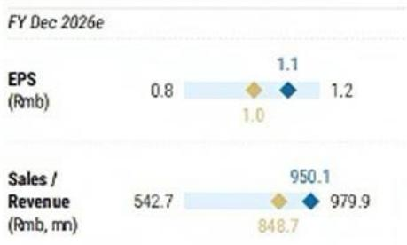

## Valuation Methodology and Risks

## Jiangsu Hengli Hydraulic Co.Ltd (601100.SS)

Our price target is derived by 1) applying a 35x 2026e P/E multiple to its core business (excl. FX impact); and 2) using DCF for the humanoid robot parts business, discounting 2025-50e cash flows at a WACC of 11% and applying a terminal growth rate of 4%. Combining both yields a price target of Rmb133.

## Risks to Upside

■ Stronger-than-expected excavator and pumps & valves demand.

■ Notable penetration into foreign brands' supply chain.

■ Faster-than-expected humanoid robots penetration and market share gain in the supply chain.

## Risks to Downside

■ Sharp decline in excavator and pumps & valves demand in China.

■ Failure to expand its share in non-excavator parts.

■ Slower-than-expected humanoid robot penetration.

## Risk Reward Reference links

1. View explanation of Options Probabilities methodology -

Options\_Probabilities\_Exhibit\_Link.pdf

2. View descriptions of Risk Rewards Themes - RR\_Themes\_Exhibit\_Link.pdf

3. View explanation of regional hierarchies - GEG\_Exhibit\_Link.pdf

4. View explanation of Theme/Exposure methodology -

ESG\_Sustainable\_Solutions\_External\_Link.pdf

5. View explanation of HERS methodology - ESG\_HERS\_External\_Link.pdf

## Disclosure Section

The information and opinions in MS were prepared or are disseminated by MS Asia Limited (which accepts the responsibility for its contents) and/or MS Asia (Singapore) Pte. (Registration number 199206298Z) and/or MS Asia (Singapore) Securities Pte Ltd (Registration number 200008434H), regulated by the Monetary Authority of Singapore (which accepts legal responsibility for its contents and should be contacted with respect to any matters arising from, or in connection with, MS), and/or MS Taiwan Limited and/or MS & Co International plc, Seoul Branch, and/or MS Australia Limited (A.B.N. 67 003 734 576, holder of Australian financial services License No. 233742, which accepts responsibility for its contents), and/or MS Wealth Management Australia Pty Ltd (A.B.N. 19 009 145 555, holder of Australian financial services License No. 240813, which accepts responsibility for its contents), and/or MS India Company Private Limited having Corporate Identification No (CIN) U2299OMH1998PTC115305, regulated by the Securities and Exchange Board of India ("SEBI") and holder of licenses as a Research Analyst (SEBI Registration No.INH000001105); Stock Broker (SEBI Stock Broker Registration No. INZ000244438), Merchant Banker (SEBI Registration No.INM000011203), and depository participant with National Securities Depository Limited (SEBI Registration No. IN-DP-NSDL-567-2021) having registered office at Altimus,Level39 & 40, Pandurang Budhkar Marg, Worli, Mumbai 400018,India; Telephone no.+91-22-61181000; Compliance Officer Details: Mr. Tejarshi Hardas, Tel No.: +91-22-61181000 or Email: tejarshihardas@morganstanley.com; Grievance officer details: Mr. Tejarshi Hardas, Tel No.: +91-22-61181000 or Email: msic-compliance@morganstanley.com which accepts the responsibility for its contents and should be contacted with respect to any matters arising from, or in connection with, MS, and their affiliates (collectively, "MS"). MS India Company Private Limited (MSICPL) may use AI tools in providing research services. All recommendations contained herein are made by the duly qualified research analysts.

For important disclosures, stock price charts and equity rating histories regarding companies that are the subject of this report, please see the MS Disclosure Website at www.morganstanley.com/eqr/disclosures/webapp/generalresearch, or contact your investment representative or MS at 1585 Broadway, (Attention: Research Management), New York, NY, 10036 USA

For valuation methodology and risks associated with any recommendation, rating or price target referenced in this research report, please contact the Client Support Team as follows: US/Canada +1 800 303-2495; Hong Kong +852 2848-5999; Latin America +1 718 754-5444 (U.S.); London +44 (0)20-7425-8159; Singapore +65 6834-6860; Sydney +61 (0)2-9770-1505; Tokyo +81 (0)3-6836-9000. Alternatively you may contact your investment representative or MS at 158S Broadway. (Attention: Research Management), New York, NY 10036 USA.

## Analyst Certification

The following analysts hereby certify that their views about the companies and their securities discussed in this report are accurately expressed and that they have not received and will not receive direct or indirect compensation in exchange for expressing specific recommendations or views in this report: Chelsea Wang, Sheng Zhong.

## Global Research Conflict Management Policy

MS has been published in accordance with our conflict management policy, which is available at www.morganstanley.com/institutional/research/conflictpolicies. A Portuguese version of the policy can be found at www.morganstanley.com.br

## Important Regulatory Disclosures on Subject Companies

As of May 29, 2026, MS beneficially owned 1% or more of a class of common equity securities of the following companies covered in MS: Beijing Geekplus Technology Co., Ltd., China Railway Group, Estun Automation Co Ltd, Han's Laser, iRay Technology Company Limited, Leader Harmonious Drive Systems, Sany Heavy Industry Co, Ltd., Shenzhen Inovance Technology, Shenzhen SC New Energy Technology Corp, Suzhou Maxwell Technologies Co Ltd, WeiChai Power, Wuxi Autowell Technology Co Ltd, Wuxi Lead Intelligent, Zhejiang Dingli Machinery Co Ltd., Zhejiang Shuanghuan Driveline Co. Ltd..

Within the last 12 months, MS managed or co-managed a public offering (or 144A offering) of securities of Beijing Geekplus Technology Co., Ltd, Zoomlion Heavy Industry. Within the last 12 months, MS has received compensation for investment banking services from Shenzhen Inovance Technology, Zoomlion Heavy Industry.

In the next 3 months, MS expects to receive or intends to seek compensation for investment banking services from Beijing Geekplus Technology Co., Ltd., China State Construction Engineering, Sany Heavy Industry Co., Ltd., Shenzhen Inovance Technology, Wuxi Lead Intelligent, Zhejiang Hangke Technology, Zoomlion Heavy Industry.

Within the last 12 months, MS has received compensation for products and services other than investment banking services from China State Construction Engineering, CRRC Corp Ltd, Haitian International Holdings Limited, Sinotruk (Hong Kong) Limited.

Within the last 12 months, MS has provided or is providing investment banking services to, or has an investment banking client relationship with, the following company: Beijing Geekplus Technology Co., Ltd., China State Construction Engineering, Sany Heavy Industry Co., Ltd., Shenzhen Inovance Technology, Wuxi Lead Intelligent, Zhejiang Hangke Technology, Zoomlion Heavy Industry.

Within the last 12 months, MS has either provided or is providing non-investment banking, securities-related services to and/or in the past has entered into an agreement to provide services or has a client relationship with the following company: Beijing Geekplus Technology Co., Ltd, China State Construction Engineering, CRRC Corp Ltd, Haitian International Holdings Limited, Snotruk (Hong Kong) Limited.

An employee, director or consultant of MS is a director of Beijing Geekplus Technology Co., Ltd.. This person is not a research analyst or a member of a research analyst's household. The equity research analysts or strategists principally responsible for the preparation of MS have received compensation based upon various factors, including quality of research, investor client feedback, stock picking, competitive factors, firm revenues and overall investment banking revenues. Equity Research analysts' or strategists' compensation is not linked to investment banking or capital markets transactions performed by MS or the profitability or revenues of particular trading desks.

MS and its affiliates do business that relates to companies/instruments covered in MS, including market making, providing liquidity, fund management, commercial banking, extension of credit, investment services and investment banking. MS sells to and buys from customers the securities/instruments of companies covered in MS on a principal basis. MS may have a position in the debt of the Company or instruments discussed in this report. MS trades or may trade as principal in the debt securities (or in related derivatives) that are the subject of the debt research report.

Certain disclosures listed above are also for compliance with applicable regulations in non-US jurisdictions.

## STOCK RATINGS

MS uses a relative rating system using terms such as Overweight, Equal-weight, Not-Rated or Underweight (see definitions below). MS does not assign ratings of Buy, Hold or Sell to the stocks we cover. Overweight, Equal-weight, Not-Rated and Underweight are not the equivalent of buy, hold and sell. Investors should carefully read the definitions of all ratings used in MS. In addition, since MS contains more complete information concerning the analyst's views, investors should carefully read MS, in its entirety, and not infer the contents from the rating alone. In any case, ratings (or research) should not be used or relied upon as investment advice. An investor's decision to buy or sell a stock should depend on individual circumstances (such as the investor's existing holdings) and other considerations.

## Global Stock Ratings Distribution

## (as of May 31, 2026)

The Stock Ratings described below apply to MS's Fundamental Equity Research and do not apply to Debt Research produced by the Firm.

For disclosure purposes only (in accordance with FINRA requirements), we include the category headings of Buy, Hold, and Sell alongside our ratings of Overweight, Equal-weight, Not-Rated and Underweight. MS does not assign ratings of Buy, Hold or Sell to the stocks we cover. Overweight, Equal-weight, Not-Rated and Underweight are not the equivalent of buy, hold, and sell but represent recommended relative weightings (see definitions below). To satisfy regulatory requirements, we correspond Overweight, our most positive stock rating, with a buy recommendation; we correspond Equal-weight and Not-Rated to hold and Underweight to sell recommendations, respectively.

<table><tr><td></td><td colspan="2">Coverage Universe</td><td colspan="3">Investment Banking Clients (IBC)</td><td colspan="2">Other Material Investment Services Clients (MISC)</td></tr><tr><td>Stock Rating Category</td><td>Count</td><td>% of Total</td><td>Count</td><td>% of Total IBC</td><td>% of Rating Category</td><td>Count</td><td>% of Total Other MISC</td></tr><tr><td>Overweight/Buy</td><td>1542</td><td>42%</td><td>465</td><td>51%</td><td>30%</td><td>707</td><td>43%</td></tr><tr><td>Equal-weight/Hold</td><td>1571</td><td>43%</td><td>369</td><td>40%</td><td>23%</td><td>723</td><td>44%</td></tr><tr><td>Not-Rated/Hold</td><td>3</td><td>0%</td><td>0</td><td>0%</td><td>0%</td><td>1</td><td>0%</td></tr><tr><td>Underweight/Sell</td><td>551</td><td>15%</td><td>86</td><td>9%</td><td>16%</td><td>201</td><td>12%</td></tr><tr><td>Total</td><td>3,667</td><td></td><td>920</td><td></td><td></td><td>1632</td><td></td></tr></table>

Data include common stock and ADRs currently assigned ratings. Investment Banking Clients are companies from whom MS received Investment banking compensation in the last 12 months. Due to rounding off of decimals, the percentages provided in the "6% of total" column may not add up to exactly 100 percent.

## Analyst Stock Ratings

Overweight (O). The stock's total return is expected to exceed the average total return of the analyst's industry (or industry team's) coverage universe, on a risk-adjusted basis, over the next 12-18 months.

Equal-weight (E). The stock's total return is expected to be in line with the average total return of the analyst's industry (or industry team's) coverage universe, on a risk-adjusted basis, over the next 12-18 months.

Not-Rated (NR). Currently the analyst does not have adequate conviction about the stock's total return relative to the average total return of the analyst's industry (or industry team's) coverage universe, on a risk-adjusted basis, over the next 12-18 months.

Underweight (U). The stock's total return is expected to be below the average total return of the analyst's industry (or industry team's) coverage universe, on a risk-adjusted basis, over the next 12-18 months.

Unless otherwise specified, the time frame for price targets included in MS is 12 to 18 months.

## Analyst Industry Views

Attractive (A): The analyst expects the performance of his or her industry coverage universe over the next 12-18 months to be attractive vs. the relevant broad market benchmark, as indicated below.

In-Line (I): The analyst expects the performance of his or her industry coverage universe over the next 12-18 months to be in line with the relevant broad market benchmark, as indicated below. Cautious (C): The analyst views the performance of his or her industry coverage universe over the next 12-18 months with caution vs. the relevant broad market benchmark, as indicated below. Benchmarks for each region are as follows: North America - S&P 500; Latin America - relevant MSCI country index or MSCI Latin America Index; Europe - MSCI Europe; Japan - TOPIX; Asia - relevant MSCI country index or MSCI sub-regional Index or MSCI AC Asia Pacific ex Japan Index.

## Stock Price, Price Target and Rating History (See Rating Definitions)

Price Target History: 3/17/21 : 95; 8/16/21 : 90; 8/24/21 : 83; 6/30/22 : 59; 9/29/22 : 52; 12/13/22 : 55; 5/23/23 : 63;
7/11/23 : 68; 10/11/23 : 71; 1/3/24 : 68; 2/26/24 : 67; 4/25/24 : 61; 8/28/24 : 63; 10/8/24 : 69; 11/5/24 : 63; 3/12/25 : 104;
5/19/25 : 99; 7/14/25 : 93; 9/8/25 : 105; 1/22/26 : 133

Stock Rating History: 6/1/21 : 0/I; 6/30/22 : E/I; 2/4/23 : E/A; 5/23/23 : U/A; 1/8/25 : U/I; 5/19/25 : E/I; 1/22/26 : 0/I

Jiangsu Hengli Hydraulic Co.Ltd (601100.SS) - As of 06/23/26 GMT in CNY Industry : China Industrials  
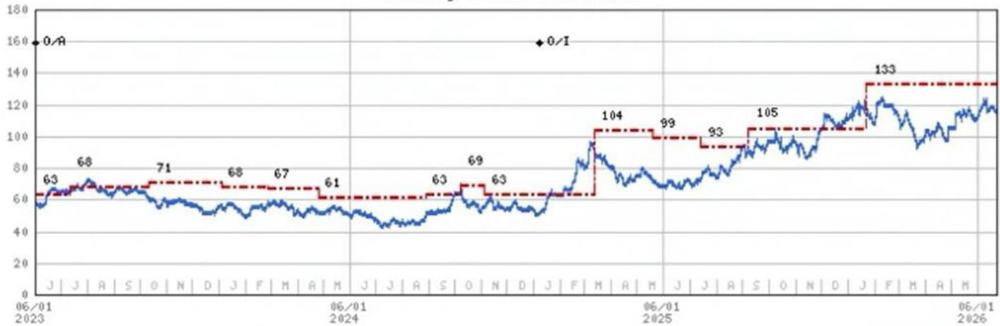  
Stock Rating History: 6/1/21 : E/I; 2/4/23 : E/A; 5/23/23 : 0/A; 1/8/25 : 0/I  
Source: MS Date Format : MM/DD/YY Price Target = No Price Target Assigned (NA)  
Stock Price (Not Covered by Current Analyst) — Stock Price (Covered by Current Analyst)  
Stock and Industry Ratings (abbreviations below) appear as ♦ Stock Rating/Industry View  
Stock Ratings: Overweight (O) Equal-weight (E) Underweight (U) Not-Rated (NR) No Rating Available (NA)  
Industry View: Attractive (A) In-line (I) Cautious (C) No Rating (NR)  
Effective January 13, 2014, the stocks covered by MS Asia Pacific will be rated relative to the analyst's industry (or industry team's) coverage.  
Effective January 13, 2014, the industry view benchmarks for MS Asia Pacific are as follows: relevant MSCI country index or MSCI sub-regional index or MSCI AC Asia Pacific ex Japan Index.

Leader Harmonious Drive Systems (688017.SS) - As of 06/23/26 GMT in CNY Industry : China Industrials  
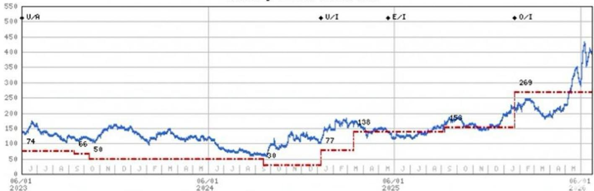  
Stock Price (Not Covered by Current Analyst) — Stock Price (Covered by Current Analyst)  
Stock and Industry Ratings (abbreviations below) appear as ♦ Stock Rating/Industry View  
Stock Ratings: Overweight (O) Equal-weight (E) Underweight (U) Not-Rated (NR) No Rating Available (NA)  
Industry View: Attractive (A) In-line (I) Cautious (C) No Rating (NR)  
Effective January 13, 2014, the stocks covered by MS Asia Pacific will be rated relative to the analyst's industry (or industry team's) coverage.  
Effective January 13, 2014, the industry view benchmarks for MS Asia Pacific are as follows: relevant MSCI country index or MSCI sub-regional index or MSCI AC Asia Pacific ex Japan Index.

## Important Disclosures for MS Smith Barney LLC Customers

Important disclosures regarding any material conflict of interest that can reasonably be expected to have influenced MS Smith Bamey LLC's choice of a third-party research provider or the subject company of a third-party research report, are available on the MS Wealth Management disclosure website at www.morganstanley.com/online/researchdisclosures. For MS specific disclosures, you may refer to https://www.morganstanley.com/eqr/disclosures/webapp/generalresearch.

Each MS report is reviewed and approved on behalf of MS Smith Barney LLC. This review and approval is conducted by the same person who reviews the research report on behalf of MS. This could create a conflict of interest.

## Other Important Disclosures

MS policy is to update research reports as and when the Research Analyst and Research Management deem appropriate, based on developments with the issuer, the sector, or the market that may have a material impact on the research views or opinions stated therein. In addition, certain Research publications are intended to be updated on a regular periodic basis (weekly/monthly/quarterly/annual) and will ordinarily be updated with that frequency, unless the Research Analyst and Research Management determine that a different publication schedule is appropriate based on current conditions.

MS is not acting as a municipal advisor and the opinions or views contained herein are not intended to be, and do not constitute, advice within the meaning of Section 975 of the Dodd-Frank Wall Street Reform and Consumer Protection Act.

MS produces an equity research product called a "Tactical Idea." Views contained in a "Tactical Idea" on a particular stock may be contrary to the recommendations or views expressed in research on the same stock. This may be the result of differing time horizons, methodologies, market events, or other factors. For all research available on a particular stock, please contact your sales representative or go to Matrix at http://www.morganstanley.com/matrix.

MS is provided to our clients through our proprietary research portal on Matrix and also distributed electronically by MS to clients. Certain, but not all, MS products are also made available to clients through third-party vendors or redistributed to clients through alternate electronic means as a convenience. For access to all available MS, please contact your sales representative or go to Matrix at http://www.morganstanley.com/matrix.

Any access and/or use of MS is subject to MS's Terms of Use (http://www.morganstanley.com/terms.html). By accessing and/or using MS, you are indicating that you have read and agree to be bound by our Terms of Use (http://www.morganstanley.com/terms.html). In addition, you consent to MS processing your personal data and using cookies in accordance with our Privacy Policy and our Global Cookies Policy (http://www.morganstanley.com/privacy\_pledge.html), including for the purposes of setting your preferences and to collect readership data so that we can deliver better and more personalized service and products to you. To find out more information about how MS processes personal data, how we use cookies and how to reject cookies see our Privacy Policy and our Global Cookies Policy (http://www.morganstanley.com/privacy\_pledge.html). Please use the provided link to review the Terms and Conditions and Most Important Terms and Conditions for MS India Company Private Limited (https://www.morganstanley.com/assets/pdfs/about-us-global-offices/India/Terms\_and\_conditions.pdf) and the following link to review the audit report (https://ny.matrix.ms.com/eqd/research/webapp/researchdocs/MSICPL\_Morgan\_Stanley\_Research\_Audit\_Report.pdf).

If you do not agree to our Terms of Use and/or if you do not wish to provide your consent to MS processing your personal data or using cookies please do not access our research. MS does not provide individually tailored investment advice. MS has been prepared without regard to the circumstances and objectives of those who receive it. MS recommends that investors independently evaluate particular investments and strategies, and encourages investors to seek the advice of a financial adviser. The appropriateness of an investment or strategy will depend on an investor's circumstances and objectives. The securities, instruments, or strategies discussed in MS may not be suitable for all investors, and certain investors may not be eligible to purchase or participate in some or all of them. MS is not an offer to buy or sell or the solicitation of an offer to buy or sell any security/instrument or to participate in any particular trading strategy. The value of and income from your investments may vary because of changes in interest rates, foreign exchange rates, default rates, prepayment rates, securities/instruments prices, market indexes, operational or financial conditions of companies or other factors. There may be time limitations on the exercise of options or other rights in securities/instruments transactions. Past performance is not necessarily a guide to future performance. Estimates of future performance are based on assumptions that may not be realized. If provided, and unless otherwise stated, the closing price on the cover page is that of the primary exchange for the subject company's securities/instruments.

The fixed income research analysts, strategists or economists principally responsible for the preparation of MS have received compensation based upon various factors, including quality, accuracy and value of research, firm profitability or revenues (which include fixed income trading and capital markets profitability or revenues), client feedback and competitive factors. Fixed Income Research analysts', strategists' or economists' compensation is not linked to investment banking or capital markets transactions performed by MS or the profitability or revenues of particular trading desks.

The "Important Regulatory Disclosures on Subject Companies" section in MS lists all companies mentioned where MS owns 1% or more of a class of common equity securities of the companies. For all other companies mentioned in MS, MS may have an investment of less than 1% in securities/instruments or derivatives of securities/instruments of companies and may trade them in ways different from those discussed in MS. Employees of MS not involved in the preparation of MS may have investments in securities/instruments or derivatives of securities/instruments of companies mentioned and may trade them in ways different from those discussed in MS. Derivatives may be issued by MS or associated persons.

With the exception of information regarding MS, MS is based on public information. MS makes every effort to use reliable, comprehensive information, but we make no representation that it is accurate or complete. We have no obligation to tell you when opinions or information in MS change apart from when we intend to discontinue equity research coverage of a subject company. Facts and views presented in MS have not been reviewed by, and may not reflect information known to, professionals in other MS business areas, including investment banking personnel.

MS personnel may participate in company events such as site visits and are generally prohibited from accepting payment by the company of associated expenses unless pre-approved by authorized members of Research management.

MS may make investment decisions that are inconsistent with the recommendations or views in this report.

To our readers based in Taiwan or trading in Taiwan securities/instruments: Information on securities/instruments that trade in Taiwan is distributed by MS Taiwan Limited ("MSTL"). Such information is for your reference only. The reader should independently evaluate the investment risks and is solely responsible for their investment decisions. MS may not be distributed to the public media or quoted or used by the public media without the express written consent of MS. Any non-customer reader within the scope of Article 7-1 of the Taiwan Stock Exchange Recommendation Regulations accessing and/or receiving MS is not permitted to provide MS to any third party (including but not limited to related parties, affiliated companies and any other third parties) or engage in any activities regarding MS which may create or give the appearance of creating a conflict of interest. Information on securities/instruments that do not trade in Taiwan is for informational purposes only and is not to be construed as a recommendation or a solicitation to trade in such securities/instruments. MSTL may not execute transactions for clients in these securities/instruments.

Certain information in MS was sourced by employees of the Shanghai Representative Office of MS Asia Limited for the use of MS Asia Limited. MS is not incorporated under PRC law and the research in relation to this report is conducted outside the PRC. MS does not constitute an offer to sell or the solicitation of an offer to buy any securities in the PRC. PRC investors shall have the relevant qualifications to invest in such securities and shall be responsible for obtaining all relevant approvals, licenses, verifications and/or registrations from the relevant governmental authorities themselves. Neither this report nor any part of it is intended as, or shall constitute, provision of any consultancy or advisory service of securities investment as defined under PRC law. Such information is provided for your reference only.

MS is disseminated in Brazil by MS C.T.V.M.S.A. located at Av. Brigadeiro Faria Lima, 3600, 6th floor, São Paulo - SP, Brazil; and is regulated by the Comissão de Valores Mobiliários; in Mexico by MS México, Casa de Bolsa, S.A. de C.V which is regulated by Comision Nacional Bancaria y de Valores. Paseo de los Tamarindos 90, Torre 1, Col. Bosques de las Lomas Floor 29, 05120 Mexico City; in Japan by MS MUFG Securities Co., Ltd. and, for Commodities related research reports only, MS Capital Group Japan Co., Ltd; in Hong Kong by MS Asia Limited (which accepts responsibility for its contents) and by MS Bank Asia Limited; in Singapore by MS Asia (Singapore) Pte. (Registration number 199206298Z) and/or MS Asia (Singapore) Securities Pte Ltd (Registration number 200008434H), regulated by the Monetary Authority of Singapore (which accepts legal responsibility for its contents and should be contacted with respect to any matters arising from, or in connection with, MS) and by MS Bank Asia Limited, Singapore Branch (Registration number T14FCOT18); in Australia to "wholesale clients" within the meaning of the Australian Corporations Act by MS Australia Limited A.B.N. 67 003 734 576, holder of Australian financial services license No. 233742, which accepts responsibility for its contents; in Australia to "wholesale clients" and "retail clients" within the meaning of the Australian Corporations Act by MS Wealth Management Australia Pty Ltd (A.B.N. 19 009 145 555, holder of Australian financial services license No. 240813, which accepts responsibility for its contents; in Korea by MS & Co International plc, Seoul Branch; in India by MS India Company Private Limited having Corporate Identification No (CIN) U22990MH1998PTC115305, regulated by the Securities and Exchange Board of India ("SEBI") and holder of licenses as a Research Analyst (SEBI Registration No INH00000T105); Stock Broker (SEBI Stock Broker Registration No INZ000244438), Merchant Banker (SEBI Registration No INM0000T1203), and depository participant with National Securities Depository Limited (SEBI Registration No. IN-DP-NSDL-567-2021) having registered office at Altimus, Level 39 & 40, Pandurang Budhkar Marg. Worli, Mumbai 400018, India; Telephone no.+91-22-61181000; Compliance Officer Details: Mr. Tejarshi Hardas, Tel. No.: +91-22-61181000 or Email: tejarshi.hardas@morganstanley.com; Grievance officer details: Mr. Tejarshi Hardas, Tel. No.: +91-22-61181000 or Email: msic-compliance@morganstanley.com. MS India Company Private Limited (MSICPL) may use AI tools in providing research services. All recommendations contained herein are made by the duly qualified research analysts; in Canada by MS Canada Limited; in Germany and the European Economic Area where required by MS Europe S.E., authorised and regulated by Bundesanstalt fuer Finanzdienstleistungsaufsicht (BaFin) under the reference number 149169; in the US by MS & Co. LLC, which accepts responsibility for its contents. MS & Co. International plc, authorized by the Prudential Regulation Authority and regulated by the Financial Conduct Authority and the Prudential Regulation Authority, disseminates in the UK research that it has prepared, and research which has been prepared by any of its affiliates, only to persons who (i) are investment professionals falling within Article 19(S) of the Financial Services and Markets Act 2000 (Financial Promotion) Order 2005 (as amended, the "Order"); (ii) are persons who are high net worth entities falling within Article 49(2)(a) to (d) of the Order; or (iii) are persons to whom an invitation or inducement to engage in investment activity (within the meaning of section 21 of the Financial Services and Markets Act 2000, as amended) may otherwise lawfully be communicated or caused to be communicated. RMB MS Proprietary Limited is a member of the JSE Limited and A2X (Pty) Ltd. RMB MS Proprietary Limited is a joint venture owned equally by MS International Holdings Inc. and RMB Investment Advisory (Proprietary) Limited, which is wholly owned by FirstRand Limited. The information in MS is being disseminated by MS Saudi Arabia, regulated by the Capital Market Authority in the Kingdom of Saudi Arabia, and is directed at Sophisticated investors only.

MS Hong Kong Securities Limited is the liquidity provider/market maker for securities of China State Construction Engineering, WeChai Power, Zoomlion Heavy Industry listed on the Stock Exchange of Hong Kong Limited. An updated list can be found on HKEx website: http://www.hkex.com.hk.

The information in MS is being communicated by MS & Co. International plc (DIFC Branch), regulated by the Dubai Financial Services Authority (the DFSA) or by MS & Co. International plc (ADGM Branch), regulated by the Financial Services Regulatory Authority Abu Dhabi (the FSRA), and is directed at Professional Clients only, as defined by the DFSA or the FSRA, respectively. The financial products or financial services to which this research relates will only be made available to a customer who we are satisfied meets the regulatory criteria of a Professional Client. A distribution of the different MS Research ratings or recommendations, in percentage terms for Investments in each sector covered, is available upon request from your sales representative.

The information in MS is being communicated by MS & Co. International plc (QFC Branch), regulated by the Qatar Financial Centre Regulatory Authority (the QFCRA), and is directed at business customers and market counterparties only and is not intended for Retail Customers as defined by the QFCRA.

As required by the Capital Markets Board of Turkey, investment information, comments and recommendations stated here, are not within the scope of investment advisory activity. Investment advisory service is provided exclusively to persons based on their risk and income preferences by the authorized firms. Comments and recommendations stated here are general in nature. These opinions may not fit to your financial status, risk and return preferences. For this reason, to make an investment decision by relying solely to this information stated here may not bring about outcomes that fit your expectations.

The trademarks and service marks contained in MS are the property of their respective owners. Third-party data providers make now warranties or representations relating to the accuracy, completeness, or timeliness of the data they provide and shall not have liability for any damages relating to such data. The Global Industry Classification Standard (GICS) was developed by and is the exclusive property of MSCI and S&P.

MS, or any portion thereof may not be reprinted, sold or redistributed without the written consent of MS.

Indicators and trackers referenced in MS may not be used as, or treated as, a benchmark under Regulation EU 2015/1011 or any other similar framework.

The issuers and/or fixed income products recommended or discussed in certain fixed income research reports may not be continuously followed. Accordingly, investors should regard those fixed income research reports as providing stand-alone analysis and should not expect continuing analysis or additional reports relating to such issuers and/or individual fixed income products. MS may hold, from time to time, material financial and commercial interests regarding the company subject to the Research report.

Registration granted by SEBI and certification from the National Institute of Securities Markets (NISM) in no way guarantee performance of the intermediary or provide any assurance of returns to investors. Investment in securities market are subject to market risks. Read all the related documents carefully before investing.

## INDUSTRY COVERAGE: China Industrials

<table><tr><td>COMPANY (TICKER)</td><td>RATING (AS OF)</td><td>PRICE* (06/23/2026)</td></tr></table>

Chelsea Wang

<table><tr><td>China Railway Group (601390.SS)</td><td>E (05/12/2022)</td><td>Rmb4.51</td></tr><tr><td>China Railway Group (0390.HK)</td><td>E (08/11/2025)</td><td>HK$3.51</td></tr><tr><td>China State Construction Engineering (601668.SS)</td><td>U (08/11/2025)</td><td>Rmb4.57</td></tr><tr><td>Han&#x27;s Laser (002008.SZ)</td><td>O (10/02/2025)</td><td>Rmb145.11</td></tr><tr><td>Hefei Meyer Optoelectronic Technology (002690.SZ)</td><td>E (09/08/2025)</td><td>Rmb14.42</td></tr><tr><td>iRay Technology Company Limited (688301.SS)</td><td>E (01/16/2025)</td><td>Rmb111.38</td></tr><tr><td>Neway Valve (Suzhou) Co., Ltd (603699.SS)</td><td>O (09/12/2025)</td><td>Rmb53.55</td></tr><tr><td>Shanghai BOCHU Electronic Technology (688188.SS)</td><td>O (08/22/2024)</td><td>Rmb154.30</td></tr><tr><td>Shenzhen Envicool Technology Co Ltd (002837.SZ)</td><td>O (08/19/2024)</td><td>Rmb81.48</td></tr><tr><td colspan="3">Sheng Zhong</td></tr><tr><td>Beijing Geekplus Technology Co., Ltd. (2590.HK)</td><td>O (08/07/2025)</td><td>HK$12.50</td></tr><tr><td>Centre Testing International Group (300012.SZ)</td><td>E (11/18/2024)</td><td>Rmb14.31</td></tr><tr><td>CRRC Corp Ltd (1766.HK)</td><td>U (01/22/2026)</td><td>HK$4.83</td></tr><tr><td>CRRC Corp Ltd (601766.SS)</td><td>U (01/22/2026)</td><td>Rmb5.43</td></tr><tr><td>DR Laser (300776.SZ)</td><td>E (12/17/2021)</td><td>Rmb166.21</td></tr><tr><td>Estun Automation Co Ltd (002747.SZ)</td><td>U (06/30/2022)</td><td>Rmb38.25</td></tr><tr><td>Haitian International Holdings Limited (1882.HK)</td><td>E (09/08/2025)</td><td>HK$18.76</td></tr><tr><td>Hongfa Technology Co Ltd (600885.SS)</td><td>O (05/23/2023)</td><td>Rmb33.43</td></tr><tr><td>Jiangsu Guomao Reducer Co Ltd (603915.SS)</td><td>U (01/08/2025)</td><td>Rmb15.20</td></tr><tr><td>Jiangsu Hengli Hydraulic Co.Ltd (601100.SS)</td><td>O (05/23/2023)</td><td>Rmb112.18</td></tr><tr><td>Jingsheng Mechanical &amp; Electrical Co (300316.SZ)</td><td>U (01/08/2025)</td><td>Rmb55.80</td></tr><tr><td>Leader Harmonious Drive Systems (688017.SS)</td><td>O (01/22/2026)</td><td>Rmb378.53</td></tr><tr><td>Sany Heavy Industry Co., Ltd. (600031.SS)</td><td>O (01/08/2025)</td><td>Rmb18.05</td></tr><tr><td>Shenzhen Inovance Technology (300124.SZ)</td><td>++</td><td>Rmb66.82</td></tr><tr><td>Shenzhen SC New Energy Technology Corp (300724.SZ)</td><td>U (09/08/2025)</td><td>Rmb68.48</td></tr><tr><td>Sinotruk (Hong Kong) Limited (3808.HK)</td><td>E (05/19/2025)</td><td>HK$41.22</td></tr><tr><td>Suzhou Maxwell Technologies Co Ltd (300751.SZ)</td><td>U (09/15/2023)</td><td>Rmb208.31</td></tr><tr><td>Times Electric (3898.HK)</td><td>E (01/22/2026)</td><td>HK$39.58</td></tr><tr><td>WeiChai Power (2338.HK)</td><td>O (03/30/2026)</td><td>HK$39.20</td></tr><tr><td>WeiChai Power (000338.SZ)</td><td>O (03/30/2026)</td><td>Rmb30.06</td></tr><tr><td>Wuxi Autowell Technology Co Ltd (688516.SS)</td><td>U (09/08/2025)</td><td>Rmb54.80</td></tr><tr><td>Wuxi Lead Intelligent (300450.SZ)</td><td>O (09/08/2025)</td><td>Rmb44.31</td></tr><tr><td>Zhejiang Dingli Machinery Co Ltd. (603338.SS)</td><td>O (11/05/2025)</td><td>Rmb45.75</td></tr><tr><td>Zhejiang Hangke Technology (688006.SS)</td><td>O (09/08/2025)</td><td>Rmb38.17</td></tr><tr><td>Zhejiang Shuanghuan Driveline Co. Ltd. (002472.SZ)</td><td>O (08/25/2023)</td><td>Rmb40.56</td></tr><tr><td>Zoomlion Heavy Industry (1157.HK)</td><td>O (09/08/2025)</td><td>HK$7.67</td></tr><tr><td>Zoomlion Heavy Industry (000157.SZ)</td><td>O (09/08/2025)</td><td>Rmb7.38</td></tr></table>

Stock Ratings are subject to change. Please see latest research for each company.  
\* Historical prices are not split adjusted.

© 2026 MS