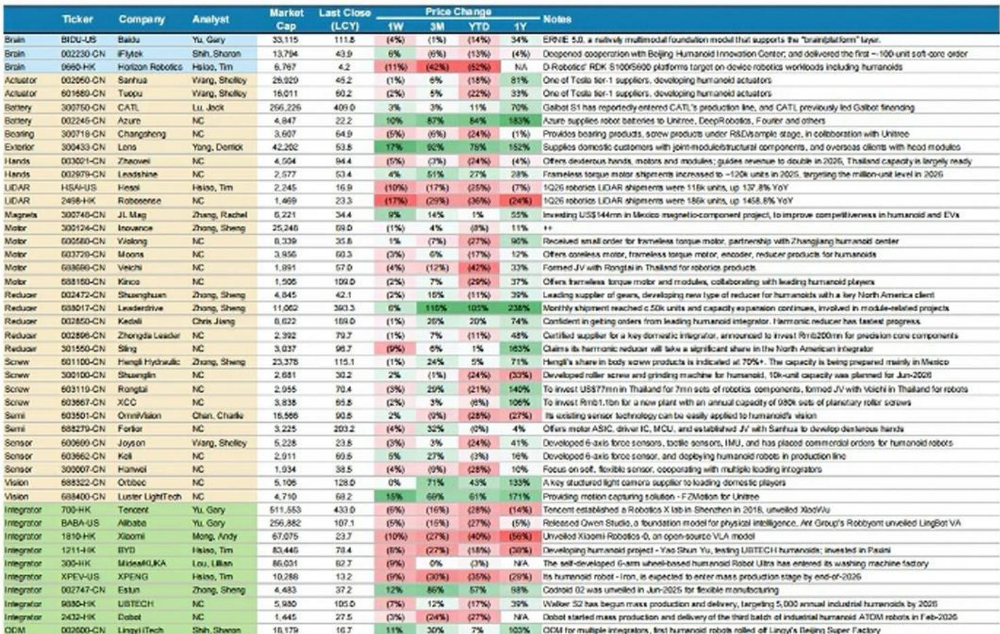
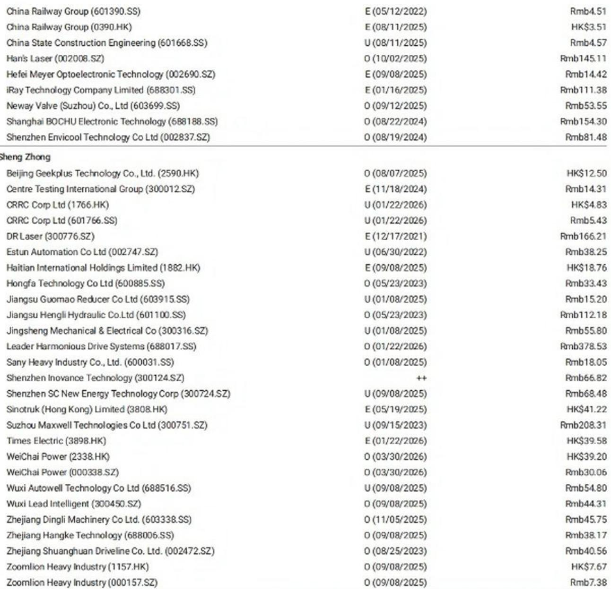
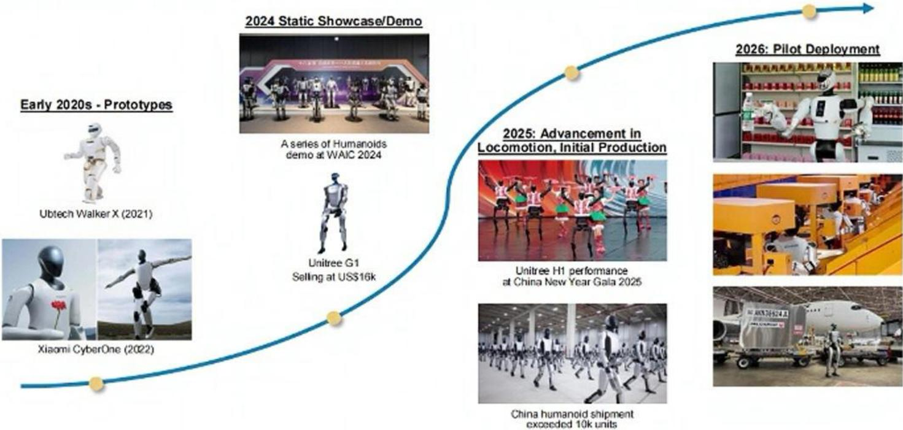

# 摩根斯坦利：人形机器人2026年出货量上调近八成，关键不在技术而在“部署数据闭环”

2026年6月，摩根斯坦利发布了一份关于中国人形机器人产业的深度研报，核心判断清晰且直接：**商业化验证、政策支持与供应链反馈正同步加速，该机构将2026年中国人形机器人出货量预测从此前的2.8万台大幅上调至5万台，2030年预期达到44.6万台。**

这不是一份关于“机器人能否造出来”的报告。报告的核心主张是：产业正在从“展示能力”进入“创造商业价值”的阶段，而决定这一轮成败的关键，不是单台机器人的技术参数，而是**谁能最快通过规模化部署，形成“部署-数据采集-算法迭代-再部署”的正向循环。**

对于关注中国制造业升级、供应链重构以及AI硬件落地的读者，这份报告提供了一个从宏观政策到微观订单、从整机厂到核心零部件供应商的完整观察框架。它既指出了明确的投资主线，也留下了需要持续跟踪的关键变量。

> **KC评论：** 摩根斯坦利上调出货量预测的直接驱动因素，不是实验室的技术突破，而是国家电网一笔68亿元订单、顺丰和邮政的物流场景落地、以及MIIT与SASAC联合推动的“万级部署能力”目标。这意味着，人形机器人已经从“概念验证”进入了“政策+订单”双轮驱动的阶段。完整报告中对这些订单的细节、供应链验证的现场反馈、以及各环节公司的产能规划都有更细致的拆解，值得细读。

## 1. 这轮加速的真正推手不是技术，而是“用起来”的政策与订单

报告指出，2026年上半年，人形机器人的商业化进程明显提速，标志性事件密集出现。

政策层面的信号最为明确。2026年3月，中央政府首次在“十五五”规划中将机器人列为战略性新兴产业。6月，工信部和国资委联合发布新倡议，目标是在2026年底前形成“万级部署能力”，并落地超过100个高价值应用场景。具体要求是：每个省份至少确定20个、每个中央国企至少确定10个真实运营场地，将其改造为人形机器人训练环境。11月，两部委将对进展进行评估。

订单层面，国家电网一笔68亿元人民币的采购订单成为行业里程碑——采购内容包括500台人形机器人、3000台双臂机器人和5000台四足机器人。顺丰和邮政已经在物流中心部署Robotera的人形机器人。这些不是小规模试点，而是带有明确商业目标的规模化采购。

报告认为，商业化验证通常需要数月时间，2026年上半年启动测试的项目，预计将从下半年开始转化为实际部署。这意味着5万台的出货量预测并非激进假设，而是对已有订单和验证进度的合理外推。

## 2. 供应链已经在为“万台级”做准备：产能扩张与设备订单先行

供应链的反馈是验证产业趋势最扎实的“硬数据”。摩根斯坦利在近期调研中发现，上游零部件供应商的产能规划已经远远超过当前出货量，说明产业链对需求爆发的预期是真实且一致的。

谐波减速器龙头绿的谐波（Leaderdrive）的月产能已从2026年一季度的5万台提升至当前的约7万台，年底目标为10-12万台。其产能规划对标的是日本哈默纳科（Harmonic Drive）明年约200万台的年产能计划。行星滚柱丝杠供应商恒立液压（Hengli Hydraulic）的墨西哥工厂目标是在年底前具备支撑约10万台机器人的产能。信捷电气（Xinje）计划今年形成约200万套无框力矩电机产能，明年扩至约300万套。

更值得关注的信号是，产能扩张已经开始向上游设备端传导。先导智能（Wuxi Lead）已与北京人形机器人创新中心签署战略合作协议，涉及未来装配线设备。拓斯达（Topstar）表示，人形机器人已占其数控机床下游需求的30-40%。这意味着，设备供应商已经收到了明确的扩产订单，产业链的投资正在从“零部件”向“生产零部件的工具”扩散。

> **KC评论：** 供应链的产能规划往往比终端出货量领先6-12个月。当一家减速器企业将月产能从5万扩到10万，意味着它已经看到了足够明确的客户订单或意向。报告中对这些公司的具体订单情况、客户结构以及产能爬坡节奏都有更详细的分析，这些信息对于判断供应链的真实景气度至关重要。

## 3. 出货量结构正在变化：半尺寸人形机器人是当前主力，全尺寸才是未来

摩根斯坦利在报告中区分了两种产品形态：半尺寸人形机器人（如宇树科技的G1，高度约1米左右）和全尺寸人形机器人（接近成年人身高）。2026年，半尺寸机型预计将占总出货量的约70%，主要应用于娱乐、数据采集、政府项目和互动型商业服务。

但报告预期，随着验证推进和全尺寸机型在操作能力上的提升，其占比将在2027年升至约50%，2028年达到约70%。这一结构性变化对供应链的影响是直接的：全尺寸机型需要更大扭矩的关节模组、更高精度的减速器、更复杂的灵巧手，其ASP（平均销售价格）显著高于半尺寸机型。

报告预计，2026年行业综合ASP将下降15%，但2027年和2028年将分别回升5%和2%——这看似反直觉，实则反映了产品结构从“低价半尺寸”向“高价全尺寸”的切换。这意味着，即使出货量增速放缓，市场规模的扩张速度可能更快。

## 4. 优选标的的逻辑：谁在“部署-数据闭环”中卡住了关键位置

摩根斯坦利在这份报告中更新了其中国人形机器人价值链条，新增科达利（Kedali）和蓝思科技（Lens），剔除国茂股份（Guomao）、旭升集团（Xusheng）和中坚科技（Zhongjian），目前共覆盖45家公司，包括3家“大脑”公司、32家“身体”组件公司和10家整机集成商。

报告明确看好的三家标的是：绿的谐波、恒立液压和双环传动（Shuanghuan）。

绿的谐波的核心逻辑是：在谐波减速器领域已占据人形机器人集成商的领先市场份额，且正在快速扩产。报告预计人形机器人业务将贡献2026年收入的35%和2027年的50%。摩根斯坦利将其目标价从此前269元大幅上调72%至464元，隐含的假设是其能在人形机器人谐波减速器市场长期占据25%的全球份额。

恒立液压的逻辑是：作为人形机器人行星滚柱丝杠的关键供应商，并可能将产品线扩展至电机和线性执行器总成。其墨西哥产能规划是支撑估值的重要锚点。

双环传动的逻辑是：为减速器生产提供齿轮，并已与一家领先的美国整机集成商合作开发新型减速器超过两年。报告认为其精密齿轮know-how将成功迁移至人形机器人组件。

> **KC评论：** 这三家公司的共同特点是：它们不仅是“卖零件”的，而是在人形机器人最核心、壁垒最高的精密传动环节卡位。谐波减速器、行星滚柱丝杠、精密齿轮——这些部件的精度、寿命和成本，直接决定了人形机器人的性能与商业化可行性。报告中对这三家公司的产能规划、客户绑定程度、以及长期市场份额假设的推导过程，是理解其估值逻辑的关键。但需要警惕的是，25%的长期全球市场份额是一个相当激进的假设，需要持续跟踪竞争格局的变化。

## 5. 报告尚未完全回答的关键问题：IPO潮与产能过剩的风险

摩根斯坦利在报告中提到了一个重要的催化剂集群：2026年三季度，特斯拉Optimus Gen 3可能亮相，同时中国人形机器人集成商将迎来IPO潮。宇树科技已于6月1日通过上交所上市委审议，等待证监会注册；DeepRobot和乐聚（Leju）分别于5月18日和19日提交招股书。

IPO带来的不仅是融资渠道，更是信息披露的透明度。一旦这些公司上市，市场将能更清晰地看到其真实订单、毛利率、研发投入和产能利用率。这对于当前基于供应链调研和订单推测的投资逻辑，既是验证也是挑战。

但报告没有充分展开的一个风险是：当政策推动、资本涌入、企业纷纷扩产时，人形机器人行业是否会重演新能源车和光伏行业的“产能过剩-价格战-洗牌”剧本？当前绿的谐波、信捷电气等公司的产能规划已经远超当前出货量，如果终端需求增速不及预期，供应链的产能利用率将承受压力。

此外，报告对“大脑”类公司（如百度、科大讯飞、地平线）的股价表现评价为“年内下跌27.2%”，但并未深入分析这是否反映了市场对“大脑”商业化路径的不确定性。人形机器人的智能水平——尤其是在复杂环境中的自主决策能力——仍然是制约其从“展示”走向“大规模替代人力”的核心瓶颈。报告对出货量的乐观预测，隐含了一个假设：算法迭代的速度能够跟上硬件部署的节奏。这个假设是否成立，需要持续跟踪。

## 6. 给读者的观察框架：三个需要持续跟踪的信号

基于这份报告的逻辑，以下三个信号可以帮助读者自行判断产业进展是否在摩根斯坦利预期的轨道上：

第一，政策订单的落地节奏。国家电网68亿元订单的执行进度、MIIT与SASAC在11月评估中公布的“万级部署能力”达成情况，是验证政策驱动力的最直接指标。

第二，供应链的产能利用率。绿的谐波、恒立液压、信捷电气等公司的产能爬坡数据，以及它们是否在2026年下半年开始接到重复订单而非试点订单，将反映真实需求的持续性。

第三，IPO公司的招股书细节。宇树科技、DeepRobot、乐聚的招股书将披露其客户结构、订单金额、毛利率和研发投入，这些数据将提供比供应链调研更可靠的产业图景。

> **KC评论：** 这三个信号中，最容易被忽视的是“重复订单”与“试点订单”的区别。当前很多订单是政府项目或企业试点，一旦进入重复采购阶段，才意味着人形机器人真正通过了ROI验证。报告中对“商业化验证周期”的讨论，实际上就是在强调这个区别。完整报告中对各环节的订单类型和验证阶段有更详细的分类，有助于理解当前产业究竟处于哪个位置。

人形机器人产业正在从“看样机”进入“看订单”的阶段。摩根斯坦利的这份报告提供了一个清晰的框架：上调出货量预测的核心依据不是技术突破，而是政策推动和供应链准备。但产业能否真正走通“部署-数据-迭代”的闭环，仍需要时间来验证。

每天，我们的AI agent会与人工review结合，生成国际投行中文摘要与KC评论，daily更新约10-40页，并整理当天最新数据图表合集。这些内容既方便喂给AI进行深度分析，也方便人工快速把握全球市场的动态变化。如果你对这份报告的完整图表、供应链公司详细数据、以及后续的IPO跟踪感兴趣，欢迎来我们的星球和微信群继续讨论。我们会在那里持续追踪这些关键信号，并分享更细致的拆解。

Personal reading notes and learning share only. Not investment advice.

