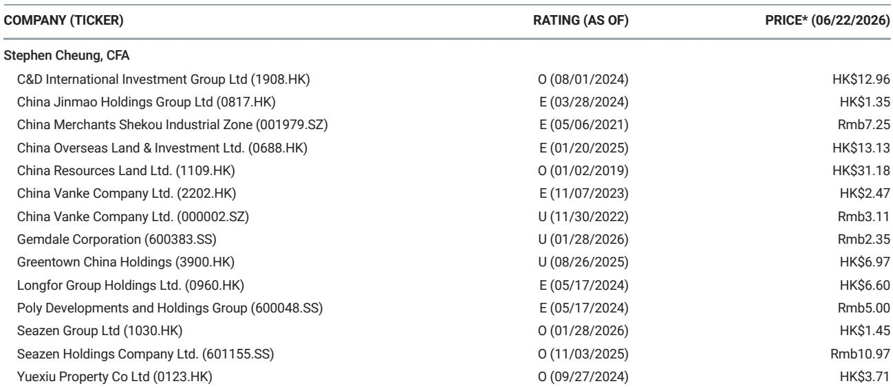
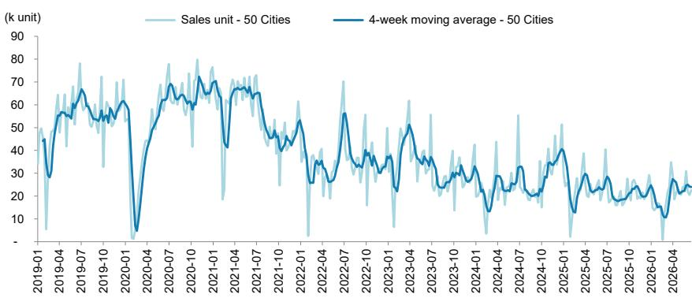
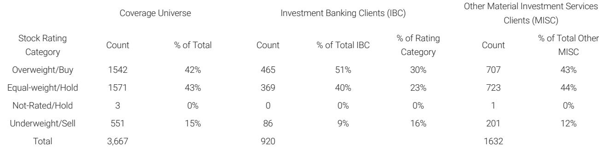

# China's Property Market Is Not Recovering — It Is Re-Segmenting, and the Divergence Is Accelerating

The latest weekly data from a major investment bank tracker reveals a market that is often misinterpreted. Headline numbers show a 16% year-on-year decline in primary unit sales across 50 cities and a 15% decline in secondary sales. To a casual observer, this looks like a uniform downturn. But that reading is dangerously incomplete. The real story is not about aggregate weakness; it is about a structural re-segmentation of demand, where Tier 1 and Tier 2 cities are beginning to behave as fundamentally different asset classes from Tier 3 cities. The gap in performance is not a temporary anomaly — it is the new equilibrium.

This matters now because the market is approaching a critical inflection point. The Dragon Boat Festival calendar effect only partially explains the weekly decline. Deeper analysis shows that the divergence between tiers is widening at an accelerating pace. For investors, policymakers, and developers, the strategic question is no longer "when will the market recover?" It is "which parts of the market are worth betting on, and which are structurally impaired?" The data from the week ended June 21 provides the clearest evidence yet that a one-size-fits-all view of Chinese property is obsolete.

The sell-through rate data is particularly revealing. Nationally, the rate sits at 47%, barely changed from 48% the prior week. But this aggregate masks a chasm: Tier 1 cities recorded a sell-through rate of 59%, up sharply from 45% the week before, while Tier 2 cities collapsed to 24% from 51%. This is not noise. It is a signal that buyer psychology and developer pricing power are diverging dramatically. The market is not flat; it is fracturing.

## The Aggregate Decline Masks a Critical Divergence: Tier 1 Sell-Through Rates Are Surging While Tier 2 and Tier 3 Markets Are Stalling

The headline 16% YoY decline in primary sales is the kind of number that leads to blanket pessimism. But when you decompose it by tier, the picture becomes far more nuanced and strategically important. Tier 1 city sales declined 15% YoY, but this is a sharp deterioration from the prior week's +2% YoY. That swing is notable, but it must be contextualized. Tier 1 markets are highly sensitive to supply timing, policy announcements, and individual project launches. A single week's data, especially one affected by a holiday, does not define a trend.

What is more telling is the trajectory of sell-through rates. In Tier 1 cities, the rate jumped from 45% to 59% in a single week. This suggests that when quality supply is available in prime locations, demand is still there and is willing to transact. This is not a market in freefall; it is a market where buyers have become extremely selective but are still active. The 59% sell-through rate is healthy by historical standards and indicates that developers with well-located, well-priced projects in top-tier cities can still achieve strong absorption.

Contrast this with Tier 2 cities, where the sell-through rate halved from 51% to 24%. This is a drastic move that cannot be dismissed as a one-week aberration. It suggests a structural shift in buyer confidence in these markets. Tier 2 cities, which have been the bellwether for the broader recovery narrative, are now showing signs of significant demand fatigue. Year-to-date primary sales in Tier 2 are down 12% YoY, and the weekly decline accelerated from -7% to -12% YoY. The momentum is clearly negative.

Tier 3 cities are in a different category altogether. Weekly primary sales fell 28% YoY, a dramatic reversal from +9% YoY the prior week. Year-to-date, they are down 12% YoY. These markets are not just slowing; they are contracting. The combination of oversupply, weaker economic fundamentals, and population outflows is creating a negative feedback loop that will be difficult to break. For developers with heavy exposure to Tier 3, the strategic imperative is clear: reduce inventory, write down assets, and pivot capital.

## Secondary Market Data Confirms That Liquidity Is Shifting, Not Drying Up

Secondary registered unit sales across 10 cities declined 15% YoY, a sharp reversal from +4% YoY the prior week. On the surface, this looks like a broad-based deterioration in resale market activity. But again, the tier breakdown tells a different story. Tier 1 secondary sales fell 10% YoY, while Tier 2 secondary sales dropped 19% YoY. The gap is meaningful.

Year-to-date, secondary sales are still up 5% YoY overall. This is a critical point. The secondary market, which is a better indicator of genuine housing demand than primary sales (which can be influenced by developer promotions and bulk transactions), is still in positive territory for the year. What we are seeing is a deceleration, not a collapse. The question is whether this deceleration is a pause or a reversal.

The asking price index for six Centraline cities was 17.3%, virtually unchanged from 17.4% the prior week. This stability in asking prices, despite declining transaction volumes, suggests that sellers are not yet panicking. They are holding the line on pricing, which is a rational response in a market where buyers are waiting for further discounts. The standoff between buyers and sellers is intensifying, and the resolution will depend on which side blinks first.

The property agent index in Tier 1 cities fell from 53.2 to 51.0. This is a meaningful decline, as the index measures agent sentiment and activity levels. A reading above 50 is still positive, but the downward trajectory indicates that even in the strongest markets, intermediaries are feeling the chill. This is a leading indicator. If the agent index continues to fall, it will likely be followed by further price concessions.

## The Calendar Effect Is Real, but It Is Not the Dominant Driver — Policy and Sentiment Are

The report attributes part of the weekly decline to the Dragon Boat Festival calendar effect. This is a valid point. Holiday periods in China often distort weekly data as transaction registrations are delayed or pushed into adjacent weeks. However, the magnitude of the decline — 16% YoY in primary and 15% in secondary — is too large to be explained by calendar alone. The prior week's data showed primary sales down only 3% YoY, so the swing is 13 percentage points. Even accounting for the holiday, this suggests a genuine softening.

The more important driver is policy uncertainty and buyer sentiment. The property market in China is heavily influenced by government signals, and the current environment is one of cautious incrementalism. Stimulus measures have been announced, but they are targeted and gradual. Buyers are waiting to see if more aggressive measures will be forthcoming. This wait-and-see mentality is particularly pronounced in Tier 2 and Tier 3 cities, where the marginal buyer is more sensitive to economic conditions and job security.

For Tier 1 cities, the calculus is different. Demand is supported by population inflow, wealth concentration, and limited supply in prime locations. The policy environment matters, but the structural drivers are stronger. This is why Tier 1 sell-through rates can remain robust even as overall market sentiment weakens. The divergence is not just about price; it is about the fundamental desirability of the asset.

## What the Report Does Not Fully Answer: The Sustainability of Tier 1 Demand and the Path to Tier 2 Stabilization

The weekly tracker provides invaluable granularity, but it leaves several critical questions open. First, can Tier 1 cities sustain their current sell-through rates? The jump from 45% to 59% is impressive, but it may be driven by a few high-profile project launches. If the supply pipeline in Tier 1 shifts toward less desirable locations, the sell-through rate could normalize lower. The data does not break down project-level performance, so we cannot assess whether the strength is broad-based or concentrated.

Second, what is the trigger for Tier 2 stabilization? The halving of the sell-through rate from 51% to 24% is alarming, but it may also represent a bottoming process. If developers in Tier 2 cities begin to cut prices more aggressively, they could stimulate demand. However, price cuts risk triggering a negative wealth effect and further eroding buyer confidence. The report does not provide data on developer pricing behavior, which is a critical missing piece.

Third, what is the role of policy in the coming months? The tracker is a backward-looking snapshot. It does not model the impact of potential policy changes, such as further reductions in mortgage rates, relaxation of purchase restrictions, or direct government purchases of unsold inventory. Investors need to form their own views on the likelihood and timing of such measures, as they will be the primary catalyst for any change in trajectory.

## A Decision Framework for Investors: How to Navigate the Fracturing Market

Given the evidence of accelerating divergence, investors need a clear framework for decision-making. The following three-step approach is designed to cut through the noise and focus on what matters.

**Step One: Segment by City Tier, Not by National Aggregate.** The data conclusively shows that Tier 1, Tier 2, and Tier 3 markets are operating on different fundamentals. Do not use national averages to make decisions about individual exposures. If your portfolio or investment thesis is based on a broad China property recovery, you are likely misallocating capital. Focus on the tier-specific dynamics.

**Step Two: Monitor Sell-Through Rates as the Leading Indicator, Not Sales Volume.** Sales volume can be volatile and influenced by supply timing. Sell-through rates, which measure the percentage of available units that are sold in a given period, are a cleaner signal of demand relative to supply. A rising sell-through rate in Tier 1 is bullish. A collapsing sell-through rate in Tier 2 is a warning. Track this metric weekly.

**Step Three: Assess Developer Exposure and Balance Sheet Quality.** Not all developers are equally positioned. Those with concentrated exposure to Tier 1 and high-quality Tier 2 projects, strong balance sheets, and the ability to offer price concessions without impairing solvency are better placed. Developers with heavy Tier 3 exposure, high leverage, and slow inventory turnover face existential risk. The data supports a barbell strategy: overweight high-quality Tier 1 developers, underweight or avoid Tier 3-exposed names.

The open question remains: will policy intervention be sufficient to arrest the decline in Tier 2 and Tier 3, or will the market be allowed to find its own floor? The answer will determine whether the current divergence is a temporary phase or a permanent structural shift. Investors who treat this as a binary question are missing the nuance. The most likely outcome is a multi-speed recovery where Tier 1 leads, Tier 2 stabilizes slowly, and Tier 3 remains under pressure for an extended period.

---

This analysis is based on a single week of data from a proprietary tracker, but the patterns it reveals are consistent with a broader structural narrative. To make informed investment decisions, you need to see the full picture — including the original charts, historical comparisons, and the detailed city-level breakdowns that are not included here.

Join the community to read the full report and review the original charts.

*This article is for learning and discussion only and does not constitute investment advice.*

Personal reading notes and learning share only. Not investment advice.

