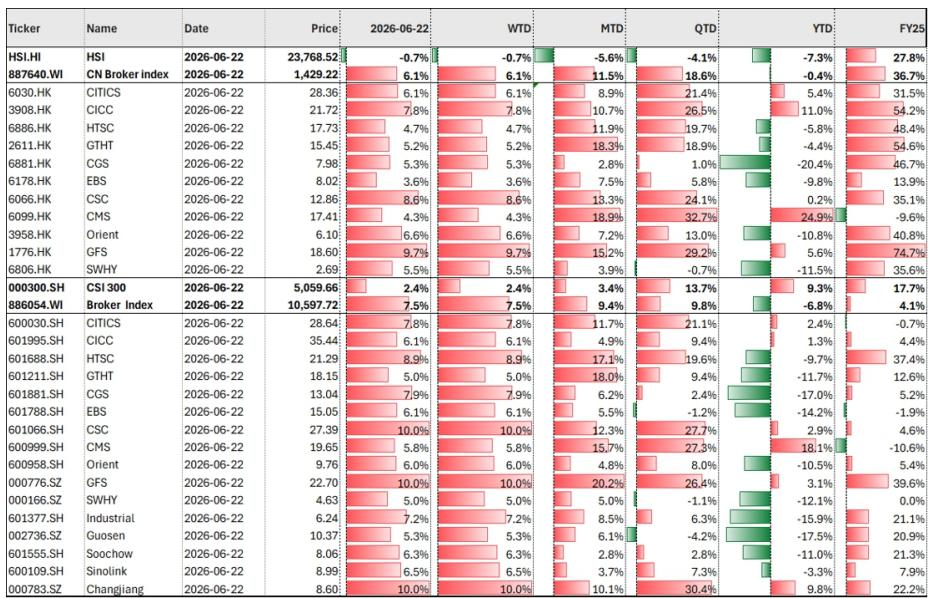
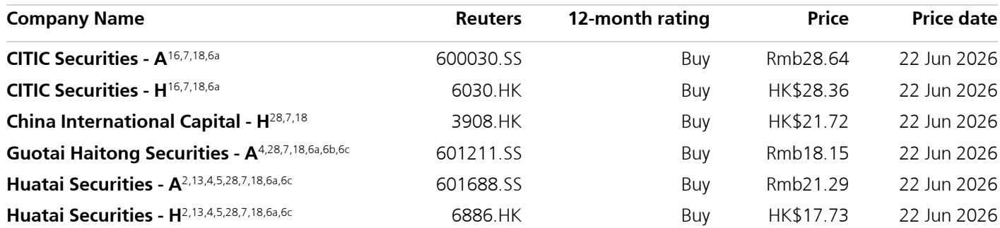
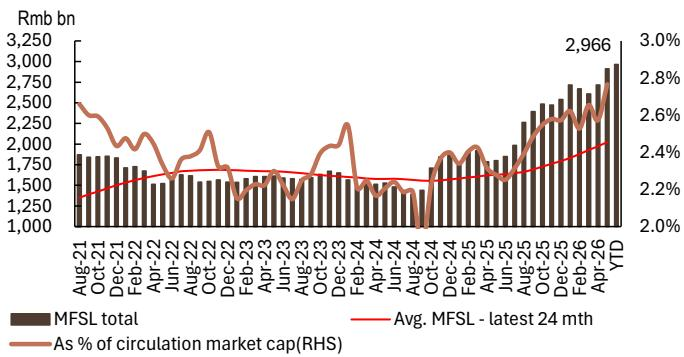

# UBS：中国券商股不只是反弹，是估值体系正在被政策重写

6月22日，中国券商H股板块单日大涨6.1%，同期恒生指数下跌0.65%。这不是一次简单的情绪修复。UBS在当天发布的研报中给出了一个值得认真对待的判断：券商板块正在进入一个由政策组合拳和基本面共振驱动的重新定价窗口。

这份报告的核心主张是，市场低估了两件事——第二季度业绩的强劲程度，以及政策层面正在发生的结构性变化。前者是短期催化剂，后者才是估值中枢上移的真正来源。

如果你还停留在“券商股是牛市放大器、熊市拖累者”的旧框架里，这篇研报可能会让你重新审视这个行业的定价逻辑。

## 1. 第二季度业绩的强劲程度，可能超出市场目前的预期

UBS的判断起点是业绩。这不是一个模糊的“有望改善”，而是有数据支撑的强信号。

报告指出，A股二季度至今的股票日均成交额已跃升至2.8万亿元人民币，同比增长1.2倍，环比增长9%。融资融券余额升至3.0万亿元，同比增长62%，环比增长14%。A股IPO募资额同比增长65%，环比增长91%。新发混合型基金规模达到960亿元，同比增长1.8倍。4至5月新开股票账户数达530万户，同比增长51%。

这些数字合在一起意味着什么？券商的核心收入来源——经纪、两融、投行、资管——在第二季度几乎全线走强。而市场目前对券商股的定价，显然还没有充分反映这一现实。

以CITICH股为例，其年内涨幅仅为5.4%，CICCH股年内涨幅11%。对于一个营收增速可能在30%以上的行业，这样的估值水平并不算贵。

> **KC评论：** 这里的关键不是“业绩好”，而是“业绩好但股价还没充分反映”。UBS的测算框架显示，上市券商一季度经常性净利润已同比增长39%，二季度大概率会更高。但板块年内H股整体下跌0.4%，A股下跌6.8%，与恒生指数下跌7.3%相比只是小幅跑赢。这意味着，如果业绩兑现，估值修复的空间是真实的。完整报告中对各业务线的拆解和盈利预测，值得仔细看。

## 2. 陆家嘴论坛释放的信号，比市场解读的更系统

报告特别强调了上周陆家嘴论坛的政策信号。这不是一次简单的“安抚市场”，而是一个系统性的制度框架调整。

UBS提炼了三个层次：第一，市场稳定基调明确，吸引长期资金、扩大金融工具（包括活跃ETF）等举措，本质上是为市场结构加固；第二，对科创板和创业板的上市标准做出更包容的调整，重点聚焦AI和深科技领域，这意味着投行业务的增量空间被打开；第三，跨境层面，推进人民币外汇期货试点，支持香港推出5年期国债期货，同时通过沪深港通、QDII、跨境理财通等渠道引导资金流动。

这三个层次叠加在一起，指向一个结论：监管层正在用制度设计推动券商从通道型业务向买方投顾模式转型。这不是一个短期的政策刺激，而是一个中长期的结构性利好。

> **KC评论：** 市场往往把政策解读为“利好出尽”或“短期情绪”，但UBS看到的是一套组合拳。比如，外资机构获得国债期货准入和基金投顾牌照，短期内可能加剧竞争，但长期看会加速行业向买方投顾模式转型——这对头部券商是利好，对中小券商是压力。完整报告中对政策影响的量化估算，是理解这个判断的关键。

## 3. 真正的结构性变化，是行业集中度加速提升

UBS在报告中明确表达了偏好：CICCH股、CITICA/H股、HTSCA/H股、GTJAA股。这不是随机的选股，而是基于一个清晰的逻辑——行业集中度正在加速提升，头部券商的竞争优势正在被制度性放大。

报告提到，领先券商在科创板业务中具有显著优势，通过跟投承诺和私募股权持仓，能够实现投行、研究、投资的一体化协同。这种能力不是所有券商都具备的。同时，监管对并购重组、再融资的支持，以及对符合条件的港股上市公司回归A股上市的政策，都将使头部券商受益更多。

UBS的估值框架显示，其覆盖的券商平均交易在2026年预测市净率的1.2倍（H股）和0.8倍（A股）。对于一个盈利前景改善、结构性增长动力明确的行业，这个估值水平并不高。

但这里有一个关键问题：头部券商的优势能否持续转化为定价权和市场份额？这需要更细致的拆解。

## 4. 一个尚未完全回答的问题：这轮增长周期能持续多久？

UBS的报告给出了乐观的判断，但也没有回避风险。报告在风险提示部分列出了六个主要风险：市场下行和牌照开放导致竞争加剧、佣金率持续下降、两融和股票质押等资本中介业务规模低于预期、监管处罚、创新失败导致声誉损失、投资收入波动。

这些风险中，最值得关注的是佣金率的长期下行趋势。随着互联网开户、轻型营业部等渠道的普及，经纪业务的佣金率一直在下降。如果市场活跃度回落，佣金率下行压力会进一步加大。

另一个需要警惕的风险是，这轮业绩增长很大程度上依赖于市场活跃度。如果A股市场出现持续调整，券商的收入结构会迅速承压。UBS报告中的一个细节值得注意：虽然IPO募资额大幅增长，但再融资承销额同比下降45%。这意味着投行业务的结构正在发生变化，对头部券商的综合能力提出了更高要求。

> **KC评论：** 报告没有完全回答的问题是，这轮政策驱动的增长周期，是否真的能改变券商行业的周期性特征？如果市场再次进入低迷期，头部券商能否凭借买方投顾和资本中介业务维持盈利韧性？这些问题的答案，需要在完整报告中对各家券商的业务结构和盈利质量做更深入的拆解。

## 5. 对投资者的观察框架：三个维度判断券商股的估值是否合理

基于UBS的分析框架，我们可以提炼出一个观察券商股的三个维度：

第一，市场活跃度能否维持。日均成交额、两融余额、新开户数这些领先指标，是判断业绩能否兑现的最直接窗口。如果这些指标出现拐点，券商的业绩预期需要同步调整。

第二，政策落地速度。陆家嘴论坛释放的信号需要转化为具体的规则和实施细则。外资机构获得国债期货准入和基金投顾牌照后，行业竞争格局会如何演变？头部券商能否在买方投顾转型中占据先机？这些都需要跟踪。

第三，头部券商的定价权。在佣金率下行的大趋势下，头部券商能否通过投行、资管、资本中介等非经纪业务建立差异化优势？这决定了估值中枢能否上移。

UBS认为，当前估值水平下，这些结构性因素尚未被充分定价。但如果市场活跃度回落或政策落地不及预期，估值修复的逻辑就会面临挑战。

## 6. 一个值得追问的伏笔：外资机构的进入会改变什么？

报告提到，商务部、发改委和财政部联合发布的《稳外资行动方案》将衍生品市场准入和基金投顾牌照授予外资机构。这是一个值得深挖的信号。

外资机构的进入，短期内可能加剧竞争，尤其是对本土券商的高端财富管理和机构业务形成挑战。但长期看，这可能会加速行业的分化——拥有强大研究能力、产品能力和品牌力的头部券商，将更有能力与外资竞争；而依赖通道业务的中小券商，可能会面临更大的生存压力。

UBS报告没有详细展开的是，外资机构的进入是否会改变券商行业的估值体系。如果外资能够带来更成熟的买方投顾模式和风险管理框架，行业的盈利稳定性和估值中枢可能会系统性提升。但这个过程需要时间，也充满了不确定性。

---

UBS这份报告的真正价值，不在于它给出了一个“买入”评级，而在于它提供了一个重新审视券商行业的框架。当市场还在用“牛市放大器”的旧逻辑看待这个行业时，政策、业绩和竞争格局正在发生结构性的变化。

但正如报告所暗示的，这个变化能否兑现，取决于市场活跃度的持续性、政策落地的速度，以及头部券商能否真正建立起差异化优势。这些问题的答案，需要更深入的数据和更细致的拆解。

我们每天会由AI agent和人工review生成国际投行的中文摘要与KC评论，daily更新约10-40页，整理当天最新数据图表合集，方便喂给AI，也方便快速把握market dynamics。如果你对这个框架感兴趣，欢迎来我们的微信群里继续讨论，一起跟踪这些关键变量的变化。

Personal reading notes and learning share only. Not investment advice.

