# China Chemical Sector Fluorochemicals: Beneficiary of AI-driven new opportunities

## Fluorochemicals outperformed chemical sector amid AI-driven opportunities

The fluorochemical index has outperformed the broader chemical index by c.9% since early May, which we mainly attribute to 1) the US announcement about a delay in the phase-out of certain third-generation refrigerants across selected applications, and 2) market expectations for growing potential of fluorochemical materials' application in the AI field. We expect fast growth in the AI-related applications of fluorochemicals, amidst the higher compute power demand and the iteration of material systems induced by AI developments. Currently, fluorochemical material suppliers are trading at a notable discount to electronic chemical material firms. We think the market has yet to fully price in the growth opportunities that AI brings to fluorochemical materials and see further re-rating potential for select fluorochemical firms poised to ride the AI tailwinds.

## Semis applications: watching EG-HF, fluorinated fluids and fluorinated gases

We expect domestic semiconductor (semis) chemical material manufacturers to benefit from cyclical recovery and ongoing domestic substitution. We suggest watching: Electronic-grade hydrofluoric acid (EG-HF): G5 (semis-grade) products have higher technical barriers, with the top three producers exerting stronger market influence. Fluorinated fluids: Indispensable in semis manufacturing. The largest producer, 3M, ceased production at end-2025 due to per- and polyfluoroalkyl substances (PFAS) regulations, creating substitution opportunities for Chinese suppliers. Fluorinated gases: Among a wide range of products, we suggest focusing on those with high technical barriers, strong localisation potential and favorable pricing outlooks, such as tungsten hexafluoride and hexafluorobutadiene.

## Data centre applications: eyes on PTFE/liquid cooling chemical materials

Given AI servers' rising requirements for cooling efficiency and low dielectric constants, we see fluorochemical materials as a viable solution. PTFE could serve as a candidate material for next-generation PCB systems, given its low dielectric constant and low dielectric loss. We see leading PTFE producers with advanced technologies as potential beneficiaries. For liquid cooling chemical materials, mainstream solutions have yet to be standardized. We suggest watching 1) refrigerants for cold-plate liquid cooling (with R134a/R1234yf likely to benefit), and 2) the pace of immersion cooling adoption and the choice of cooling medium (where fluorinated fluids look set to benefit).

## We lift PTs for Dongyue/Capchem/EM Technology; we also like Guanggang

We prefer fluorochemical material producers such as Dongyue and Capchem, as well as Guanggang (see note) as potential beneficiaries of AI-driven demand growth. We raise earnings estimates for Dongyue's fluoropolymer/silicone segments, lift profit estimates for Capchem's capacitor chemicals/fluorochemicals, and nudge up revenue estimates for EM Technology's high-frequency resin segment. We lift our price targets based on expectations for AI-driven fluorochemical material demand and peer re-rating.

Figure 1: Earnings estimates and PT changes

<table><tr><td rowspan="2">Company</td><td rowspan="2">Rating</td><td colspan="3">Price target (lcy)</td><td colspan="3">Earnings Change</td><td rowspan="2">2028E earnings exposure to AI-related downstream</td><td colspan="2">PE</td><td>EPS CAGR</td><td rowspan="2">PEG</td></tr><tr><td>New</td><td>Old</td><td>Chg.</td><td>2026E</td><td>2027E</td><td>2028E</td><td>2026E</td><td>2027E</td><td>2026-28E</td></tr><tr><td>Capchem</td><td>Buy</td><td>122.0</td><td>86.0</td><td>42%</td><td>21%</td><td>12%</td><td>14%</td><td>15-20%</td><td>31</td><td>25</td><td>18%</td><td>1.8</td></tr><tr><td>Dongyue Group</td><td>Buy</td><td>29.7</td><td>17.5</td><td>70%</td><td>5%</td><td>8%</td><td>7%</td><td>3-5%</td><td>13</td><td>11</td><td>8%</td><td>1.6</td></tr><tr><td>EM Technology</td><td>Buy</td><td>94.1</td><td>41.5</td><td>127%</td><td>1%</td><td>11%</td><td>17%</td><td>60-65%</td><td>96</td><td>56</td><td>53%</td><td>1.8</td></tr><tr><td>Guanggang</td><td>Buy</td><td>42.0</td><td>42.0</td><td>-</td><td></td><td></td><td></td><td>&gt;50%</td><td>101</td><td>63</td><td>52%</td><td>1.9</td></tr></table>

Source: Wind, UBS-S estimates. Note: Pricing data as of 18 June 2026.

Equities

China

Chemicals

Amily Guo

Analyst

amily.guo@ubs.com

+86-105-832 8845

Richard Li

Analyst

S1460121090003

richard-ze.li@ubs.com

+86-21-3866 8802

Jay LIN

Analyst

S1460525070001

jay.lin@ubs.com

+86-105-832 8044

Eason Tang

Analyst

eason.tang@ubs.com

+852-3712 3883

Figure 2: Fluorochemical value chain and its connection with Al  
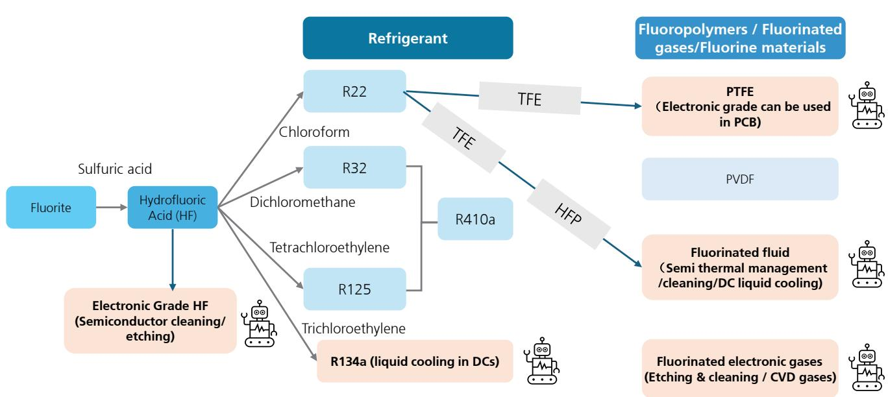  
Source: UBS-S

## Semis manufacturing: electronic-grade hydrofluoric acid

Electronic-grade hydrofluoric acid (EG-HF) is a key wet electronic chemical. It is an aqueous solution prepared by purifying anhydrous hydrogen fluoride and absorbing it into ultrapure water. EG-HF is one of the larger-scale categories in the field of wet electronic chemicals with relatively rigid demand, with 2025 market size around Rmb4.25bn in China. EG-HF has seen its total addressable market (TAM) driven by downstream capacity expansion (e.g. semis and display panels) as well as domestic substitution. It is mainly used in cleaning and etching processes in semiconductor manufacturing. Cleaning primarily involves removing the natural oxide layer and trace residual impurities from the wafer surface to ensure the interface cleanliness required for subsequent thin-film deposition and processing. Etching, which is primarily based on its chemical reaction with materials such as silicon dioxide, is to achieve precise patterning and structural formation on the wafer surface.

Figure 3: China's electronic-grade hydrofluoric acid consumption and revenue  
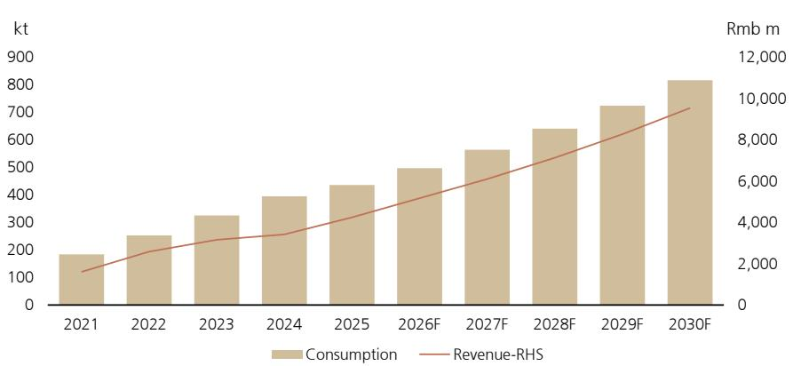  
Source: Befar Group's H-share IPO prospectus (Application Proof), China Chemical Economic and Technological Development Center (CNCET), Frost & Sullivan analysis

In terms of application and purity levels, EG-HF is classified into grades of EL, UP, UPS, UPSS, and UPSSS (semis G5). UPSSS is currently the highest grade (typically used in 12-inch wafer manufacturing at 55nm and below) and features notably higher technical barriers and pricing than lower-grade products. Global G5 hydrofluoric acid leaders include Stella Chemifa, Kanto Chemical, Soulbrain and ENF Technology.

The supply landscape of G5-grade EG-HF among Chinese companies is concentrated. According to Befar Group's H-share IPO prospectus (Application Proof), China's EG-HF (semis G5) capacity, output and revenue reached 135kt, 74.9kt and Rmb658m in 2025, respectively. Among the approximately 30 domestic EG-HF producers, only a limited number can meet semiconductor G5 standards and deliver sustained, stable supply. The CR5 of G5 electronic hydrofluoric acid supplied by domestic players stands at $98\%$ in 2025. Among listcos, Do-Fluoride, Grandit (Juhua's associated company) and Befar Group are the key domestic suppliers. Sanmei and Capchem also show presence in the market through joint venture/associated companies.

Figure 4: UPSSS-grade EG-HF prices are higher than those of other grades  
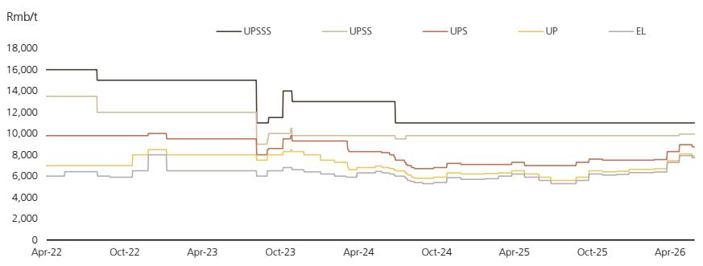  
Source: Baiinfo

We expect Chinese G5 EG-HF producers to benefit from downstream semiconductor demand growth and the trend of import substitution. We expect the fast demand growth of G5-grade EG-HF to sustain driven by AI. On the supply side, reports indicate that the Middle East conflict has tightened global sulfur supply since March, pushing up anhydrous hydrofluoric acid prices and raising expectations for EG-HF price hikes. Supply of high-end G5 products is tight due to robust demand from memory. China is the world's largest supplier of anhydrous hydrofluoric acid. We believe domestic EG-HF producers could benefit from stable raw material supply and further expand their global market share.

Figure 5: China's anhydrous hydrogen fluoride price on the rise overall YTD  
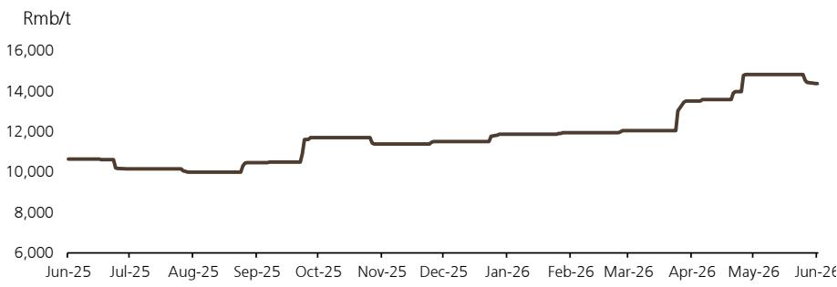  
Source: Baiinfo

Figure 6: Profile of major domestic EG-HF listcos

<table><tr><td>Company</td><td>Ticker</td><td>Product layout</td><td>Key customers and progress</td></tr><tr><td>Do-Fluoride</td><td>002407.SZ</td><td>Capacity of 60,000 tons/year (40,000 tons semiconductor grade + 20,000 tons photovoltaic grade)</td><td>Semiconductor-grade hydrofluoric acid has been supplied in batches to leading semiconductor manufacturers such as TSMC and Samsung</td></tr><tr><td>Grandit (associate of Juhua)</td><td>688549.SH</td><td>The company disclosed 2021 sales volume of 8,507 tons for integrated circuit applications, with a domestic market share of 20%; According to Bainfo, its subsidiary Kaisheng Fluorochemical has electronic-grade hydrofluoric acid capacity of 28,000 tons</td><td>Supplies leading domestic wafer fabs; obtained SK hynix confirmation for batch supply for 12-inch 1Xnm (10–20 nm) process</td></tr><tr><td>Capchem</td><td>300037.SZ</td><td>Holds a 24.03% equity stake in Fujian Yongjing Technology, expanding into electronic-grade hydrofluoric acid</td><td>Fujian Yongjing&#x27;s hydrofluoric acid has achieved small-batch deliveries to downstream semiconductor and panel customers.</td></tr><tr><td>Befar Group</td><td>601678.SH</td><td>Capacity of 6,000 tons/year (all G5 grade)</td><td>Successfully used by leading domestic semiconductor manufacturers and exported to overseas markets including Japan, South Korea, and Singapore</td></tr><tr><td>Sanmei Chemical</td><td>603379.SH</td><td>Electronic-grade hydrofluoric acid business is arranged through investee company Morita New Materials</td><td>Morita New Materials mainly produces industrial-grade anhydrous hydrofluoric acid and ultra-pure microelectronics etching and cleaning-grade products, used in semiconductor microelectronics manufacturing</td></tr></table>

Source: Company data, Baiinfo

## Semis manufacturing: fluorinated fluids

Fluorinated fluids refer to a large category of high-performance fluids based on fluorinated molecules. They are widely used in cleaning and cooling processes in semiconductor manufacturing, due to their strong chemical inertness, non-flammability, excellent electrical insulation, low surface tension, and minimal residue after volatilisation.

Among mainstream products, hydrofluoroether (HFE) is commonly used for cleaning and drying precision electronic components, as it can penetrate microstructures by leveraging its low surface tension and high volatility to remove particles, organic residues, and moisture. Perfluoropolyether (PFPE) is primarily applied in high-end thermal management applications. With superior chemical stability and insulation properties, PFPE is primarily used for temperature control and cooling in semis etching processes. In addition, some perfluorocarbons and other fluorinated fluids are also used for cleaning and temperature control during semis manufacturing.

Fluorinated fluids are essential in semis manufacturing, while 3M's exit from PFAS production may lead to a substantial supply shortfall. HFE and PFPE, as mainstream fluorinated fluids, are both PFAS, which have been under increasingly stringent regulation globally in recent years due to their high persistence, non-degradability and potential environmental and health risks. The US and Europe have been shifting their regulatory frameworks from single-product restrictions to broader category controls (see Japan ESG and Sustainability Research "Update", Leigha Miyata, 28 May 2026). Against this backdrop, 3M, the world's largest supplier of semis-grade fluoridated fluids, exited from PFAS manufacturing at end-2025. Given the lack of substitutes (overseas regulators are considering longer exemption periods for critical applications, including electronics and semis), the semis industry may face a significant deficit in fluorinated fluid supply (see "APAC Focus: Exploring opportunities in the China fluorine chemicals sector," Amily Guo, 24 Jan 2024).

Figure 7: PFAS substitutes and Chinese manufacturers (by chemical)

<table><tr><td>Chemical</td><td>Category</td><td>Application</td><td>Non-PFAS Alternative (Chinese producer)</td><td>Availability</td></tr><tr><td>HFCs (HFC-125, HFC-134a, etc.)</td><td>Refrigerant</td><td>Application for fluorinated gases - Refrigeration</td><td>Hydrocarbon refrigerant (Juhua, Dymatic)</td><td>Mature for some uses, early stage for others</td></tr><tr><td rowspan="3">PFPE &amp; HFE</td><td rowspan="3">Fine chemical</td><td>Electronics- Data center immersion cooling agent</td><td>Silicone oil (Runhe High-tech Materials), Synthetic Hydrocarbon oil</td><td>Mature for some uses, early stage for others</td></tr><tr><td>Semiconductor-Heat transfer fluid</td><td>-</td><td>Immature</td></tr><tr><td>Industrials-Lubricant in harsh conditions / for safety equipment</td><td>-</td><td>Immature for some uses</td></tr><tr><td>Hexafluoroethane (C2F6)Carbon tetrafluoride (CF4)</td><td>Electronic gas</td><td>Electronics-Dry etching, chamber cleaning for chip manufacture</td><td>Nitrogen trifluoride (NF3, Peric, Nata, Haohua, Huate)</td><td>Mature for some uses</td></tr><tr><td rowspan="7">PTFE</td><td rowspan="7">Fluoropolymer</td><td>Industrials-Gasket</td><td>PU (Wanhua), Graphite (BTR, Xiang Fenghua)</td><td>Mature for some uses</td></tr><tr><td>Industrials-Engineering Plastic</td><td>PE/PP (SinoChem, Hengli, Rongsheng etc.)</td><td>Mature for mid-to-low end uses</td></tr><tr><td>Consumer-Non-stick pan coating</td><td>Ceramic (Sinocera), Andonized Aluminum (Yunan Aluminum, Nanshan Aluminum)</td><td>Mature, likely higher cost</td></tr><tr><td>Electronics-PCB CCL</td><td>PPO/Hydrocarbon resin (EM Technology)</td><td>Mature for some uses</td></tr><tr><td>Electronics-insulation and fireproof</td><td>PVC (Sanyou, Junzheng Group), PE/PP (SinoChem, Hengli, Rongsheng etc.)</td><td>Mature for mid-to-low end uses</td></tr><tr><td>Healthcare-some medical devices (guidewire, artificial blood vessels, etc.)</td><td>PA, HDPE (Rongsheng, Satellite Chemical, Wanhua)</td><td>Early stage for some uses, immature for others</td></tr><tr><td>Aviation and aerospace- mechanical component</td><td>-</td><td>Immature</td></tr><tr><td rowspan="2">FEP</td><td rowspan="2">Fluoropolymer</td><td>Electronics-insulation and fireproof</td><td>PVC (Sanyou, Junzheng Group), PE/PP (SinoChem, Hengli, Rongsheng etc.)</td><td>Mature for mid-to-low end uses</td></tr><tr><td>Healthcare-some medical devices (guidewire, artificial blood vessels, etc.)</td><td>PA, HDPE (Rongsheng, Satellite Chemical, Wanhua)</td><td>Early stage for some uses, immature for others</td></tr><tr><td></td><td></td><td>Industrials-Engineering Plastic</td><td>PE/PP (SinoChem, Hengli, Rongsheng etc.)</td><td>Mature for mid-to-low end uses</td></tr><tr><td></td><td></td><td>Aviation and aerospace- mechanical component</td><td>-</td><td>Immature</td></tr><tr><td rowspan="4">PVDF</td><td rowspan="4">Fluoropolymer</td><td>Industrials-Coating</td><td>Silicon Modified Polyester</td><td>Mature</td></tr><tr><td>Energy-Solar back panel</td><td>PET &amp; PA membrane (EM technology, Shuangxing), Glass panel (Xinyi Solar, Flat)</td><td>Mature</td></tr><tr><td>Energy-EV battery separator coating</td><td>Boehmite/aluminium oxide (Sinocera, Estone), Aramid fibre (Tayho), PMMA (Wanhua, Enjie)</td><td>Mature, likely higher cost for some alternatives</td></tr><tr><td>Energy-EV battery cathode binder</td><td>Polyimide (Tinci, lone)</td><td>Immature</td></tr><tr><td>FKM</td><td>Fluoropolymer</td><td>Automobile-exhaust after treatment system</td><td>Silicone rubber (Hoshine, Dongyue), Polyurethane (Wanhua)</td><td>Mature for some uses</td></tr><tr><td>PFSA</td><td>Fluoropolymer</td><td>Energy-Fuel Cell/Electrolyzer PEM</td><td>PEEK (ZYPEEK), Non-fluorine PEM (Valiant)</td><td>Immature</td></tr></table>

Source: UBS estimates, UBS-S estimates Note: APAC Focus: Exploring opportunities in the China fluorine chemicals sector, Amily Guo, 24 Jan 2024

Figure 8: 3M's PFAS net sales and EBITDA (US\$bn)  
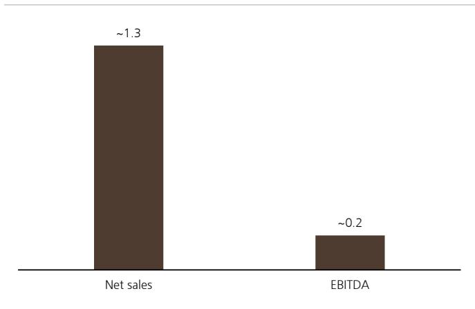  
Source: Company data, UBS-S

Figure 9: Semis and auto contributed 35-40% of 3M's PFAS revenue  
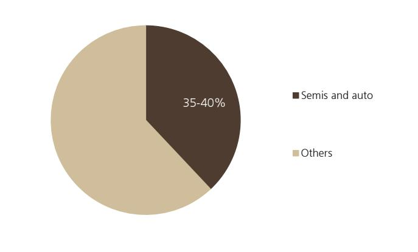  
Source: Company data, UBS, see note 3M Company "Plan to Phase Out PFAS Production by YE 2025"

Chinese fluorinated fluid producers are embracing domestic substitution opportunities, with Capchem being better positioned in the semis-grade fluorinated fluid segment. 3M's exit from PFAS production has created considerable substitution demand, and Chinese suppliers are grasping the opportunity, with Capchem, Zhejiang Juhua and Yongtai Technology having established capacity in fluorinated fluids. Among them, we think Capchem is better placed to capture the substitution demand in the semis space. Since fluorinated fluids directly impact process stability and product yields in downstream wafer manufacturing, the industry has high technical barriers, long customer verification cycles and high entry barriers. As such, first

Leveraging its well-established product development and application service capabilities, Capchem has built stable partnerships with major domestic fabs (covering both logic and memory), OEMs, and cooling equipment manufacturers. In the field of semiconductor cooling fluid, the company ranks No.1 among domestic players in China by market share. As for capacity layout, Capchem has built 3ktpa HFE capacity and 2.5ktpa PFPE capacity, and plans to release capacity in a timely manner, based on the construction progress of its 30ktpa high-end fluorinated fine chemicals project and evolving market demand dynamics.

Figure 10: Fluorinated fluid capacity layout of main listcos

<table><tr><td>Company</td><td>Ticker</td><td>Product matrix</td><td>Progress in semis/data centre applications</td></tr><tr><td>Capchem</td><td>300037.SZ</td><td>3ktpa HFE capacity + 2.5ktpa PFPE capacity</td><td>Stable mass shipments of fluorinated fluids (incl. HFE/PFPE) to clients for semis process cooling, precision cleaning, and immersion cooling in data centres etc.</td></tr><tr><td>Juhua</td><td>600160.SH</td><td>Electronic fluorinated fluids include HFE D series and PFPE JHT series. Its Juxin coolant project has planned capacity of 5ktpa (incl. JHT electronic fluid series, JHLO lubricating oil series and JX immersion cooling fluids), of which Phase I of 1ktpa capacity already came online</td><td>It has launched cooperation with multiple domestic data centers, with verification and mass shipments in progress</td></tr><tr><td>Yongtai Technology</td><td>002326.SZ</td><td>It is reported that the environmental impact assessment results for Shaowu Yongtai High-Tech Materials Co., Ltd.&#x27;s 4.2ktpa fluorinated coolant project were announced publicly for the first time in H225</td><td>Marketing and client verification are underway for the company&#x27;s fluorinated fluids; some have been verified by leading server producers, but yet to secure orders at scale, implying limited revenue contribution. The company will focus on promoting fluorinated fluid applications in semis manufacturing and data centre cooling, strengthen communication with prospective clients, and accelerate commercialisation in 2026</td></tr><tr><td>Dongyue</td><td>0189.HK</td><td>Recently, the company&#x27;s 200-ton/year electronic fluorinated fluid project was completed.</td><td>N.M.</td></tr><tr><td>Guangdong Hec Technology</td><td>600673.SH</td><td>The company has developed mainstream fluorinated cooling fluids, including perfluoropolyether and hexafluoropropylene oligomers.</td><td>The company has established a joint venture with Zhongji Innolight, Guangdong Deep Intelligent Cooling Technology Co., Ltd. The company will continue to invest R&amp;D resources, optimize cooling-fluid formulations and thermal-system design, and leverage the strategic position and policy advantages of the Shaoguan national data-center cluster to deepen cooperation with upstream and downstream companies across the industry chain.</td></tr></table>

Source: Company data

## Semis manufacturing: fluorinated ESGs

Fluorinated electronic specialty gases (ESGs) refer to high-purity specialty gases containing fluorine, mainly used in dry etching and chemical vapor deposition (CVD) during semis manufacturing. These gases are typically required to have purity of 5N or even above 6N, with stringent control over moisture, oxygen content, metal impurities, and particulates. Common varieties include carbon tetrafluoride (CF₄), sulfur hexafluoride (SF₆), tungsten hexafluoride (WF₆), nitrogen trifluoride (NF₃), octafluorocyclobutane (c-C₄F₈), and hexafluorobutadiene (C₄F₆). The rapid growth of Al computing power is driving expansion in downstream semiconductor demand, while domestic wafer capacity expansion is accelerating ESG localisation trends. We expect domestic ESG suppliers to benefit significantly from these tailwinds.

Figure 11: ESGs by semis manufacturing processes  
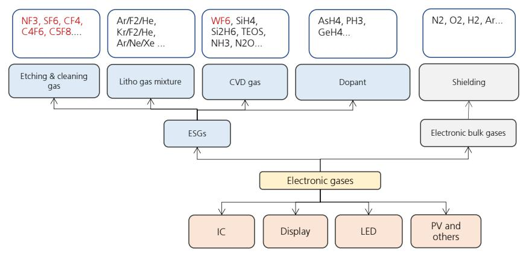  
Source: UBS-S estimates. Note: Items highlighted in red refer to fluorinated ESGs.

The high-end fluorinated ESG market has long been dominated by leading overseas companies, especially for varieties with high entry barriers. including C4F6 and WF6. Domestic substitution is accelerating. Domestic companies, led by Haohua Chemical, Peric Special Gases, Nata Opto-Electronic and Yoke Technology, are advancing technological breakthroughs and capacity build-out. Some fluorocarbon gases have relatively high localisation rates, such as NF3, SF6 and CF4. Given the high global warming potential (GWP) of SF6 and NF3, some downstream clients are actively pursuing low-carbon transformation and substitution solutions (see note)

Figure 12: Main fluorinated ESGs and major producers

<table><tr><td>Product</td><td>Chemical Formula</td><td>Function</td><td>Features</td><td>Major domestic players</td><td>Major overseas players</td></tr><tr><td>nitrogen trifluoride</td><td>NF3</td><td>cleaning and etching</td><td>etching silicon materials like Si3N4; high etching rate and selectivity</td><td>Peric Special Gases, Haohua, Nata</td><td>SK, Hyosung, Kanto Denka</td></tr><tr><td>tungsten hexafluoride</td><td>WF6</td><td>film formation</td><td>CVD tungsten or tungsten silicide</td><td>Peric Special Gases, Haohua</td><td>SK, Kanto Denka, Foosung</td></tr><tr><td>hexafluorobutadiene</td><td>C4F6</td><td>etching</td><td>Good selectivity and accuracy; GWP close to zero</td><td>Haohua, Peric Special Gases, Jinhong</td><td>Linde, Taiyo Nippon Sanso, Showa Denko, SK, Solvay</td></tr><tr><td>trifluoromethane</td><td>CHF3</td><td>cleaning</td><td>silicon dioxide etching and cleaning</td><td>Huate Gas, Linggas</td><td>Showa Denko, Linde, Air Liquide, Kanto Denka</td></tr><tr><td>octafluorocyclobutane</td><td>C4F8</td><td>cleaning, etching</td><td>large-scale IC etching and cleaning</td><td>Huate Gas, Peric Special Gases, Jinhong Gas, Linggas</td><td>Daikin, Kanto Denka, Showa Denko</td></tr></table>

Source: Company data, UBS-S estimates

The price of tungsten hexafluoride (WF $_{6}$ ) is up significantly YTD. On one hand, upstream tungsten resources have seen a sharp price increase due to export controls and tighter regulation on mining, directly driving up costs. On the other hand, major Japanese producers are expected to scale down supply. Coupled with growing demand from memory chips, WF $_{6}$ prices have risen sharply.

Figure 13: WF6 export price trend  
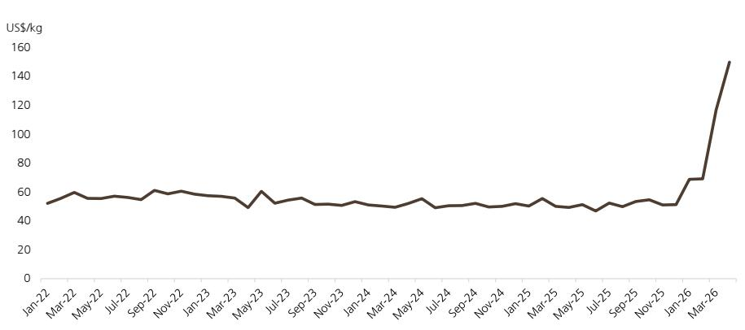  
Source: Wind, Customs data

## PCB copper clad laminate (CCL): PTFE

AI servers have significantly raised their requirements for high-frequency, high-speed materials. As such, the industry considers PTFE (polytetrafluoroethylene) to be one of the potential solutions for next-generation high-speed transmission scenarios, due to its low DK (dielectric constant) and low DF (dielectric loss factor). However, pure PTFE resin has inherent drawbacks, including a high coefficient of thermal expansion and poor machinability, and therefore usually requires modification with fillers such as glass fibre or silicon micro powder, involving complex formulations and processes.

Multiple listed CCL/PCB companies have relevant technical know-how, with product R&D underway. Among them, Shengyi Technology, a leader in PTFE-based orthogonal backplane materials, exhibited at DesignCon 2026 its material pathways and solutions (including PTFE orthogonal backplane materials) that meet next-generation hardware requirements for 224G/448G ultra-high-speed transmission.

For upstream fluorochemical companies producing PTFE resin, there are high entry barriers to the CCL material supply chain for AI hardware. In terms of material performance, as new generation low-DF, high-speed materials have stringent requirements for controlling metal ion impurities, PTFE manufacturers need to improve the purity and consistency of base resins and develop targeted electronic-grade PTFE varieties. Besides, suppliers need to cooperate with downstream enterprises on modification, with the focus on processability, composite performance, and multilayer board compatibility. This implies that companies with strong technical expertise, long-term R&D investment and close collaboration with downstream CCL manufacturers have strong competitive advantages.

Domestic leaders building a presence in electronic-grade PTFE include Dongyue Group and Haohua Chemical, with the former being the largest PTFE producer in China, with 55ktpa capacity (mainly for general-purpose applications). The Journal of Functional Polymers published a paper titled “Key Technologies of PTFE and Its Composite Materials for High-Power RF Microwaves” co-authored by the School of Polymer Science and Engineering at Sichuan University, Dongyue Polymer Material (a subsidiary of Dongyue Group), and researchers at Shengyi Technology. The company also announced in August 2025 an investment of HK\$89.56m to improve the quality of ultra-high-purity PTFE, including high-end PTFE products targeting the semis industry.

Figure 14: PTFE resin producers' capacity and electronic-grade product layout

<table><tr><td>Ticker</td><td>Company</td><td>PTFE Capacity (ktpa)</td><td>Electronic-grade PTFE layout</td></tr><tr><td>0189.HK</td><td>Dongyue</td><td>55</td><td>The Journal of Functional Polymers included the paper &quot;Key Technologies of PTFE and Its Composite Materials for High-Power RF Microwaves&quot; co-authored by the School of Polymer Science and Engineering at Sichuan University, Dongyue Polymer Material (a subsidiary of Dongyue Group), and researchers at Shengyi Technology. Company is advancing &quot;PTFE ultra-high-purity project&quot;, targeting applications in the field of semiconductor.</td></tr><tr><td>600378.SH</td><td>Haohua</td><td>48</td><td>According to the company, its PTFE products are used in PCB substrates, and there are plans to increase investment and research in the PCB field.</td></tr><tr><td>600160.SH</td><td>Juhua</td><td>28</td><td>The company is actively advancing cooperation with customers in the electronics and semiconductor sectors.</td></tr></table>

Source: Company data

## Data centre liquid cooling: refrigerants and fluorinated fluids

Rapid AI advances have been boosting demand for high-power-density server cabinets. Traditional air cooling is increasingly unable to meet the heat dissipation requirements of high-power-density server chips, coupled with notably high energy consumption. Liquid cooling offers higher heat dissipation efficiency and can reduce PUE (power usage effectiveness), supporting the development of green and low-carbon data centres. UBS projects direct liquid cooling (DLC) TAM to reach US\$31bn in 2030E, implying a CAGR of 51% over 2025-30E. (See APAC Focus: The coolest theme in AI – direct liquid cooling for AI accelerators, Timson Lee, 5 December 2025)

Companies are still exploring optimal technical routes for liquid cooling chemical materials, many of which demonstrate application potential. Cold plate liquid cooling is the mainstream solution, with the advantages of mature technology, low cost, and ease of maintenance and management. Traditional single-phase cold plate liquid cooling typically adopts deionized water or ethylene glycol as the coolant, absorbing heat through liquid conduction and convection. The two-phase cold plate liquid cooling solution, which emerged in recent years, leverages liquid vaporization for heat dissipation and thus offers enhanced cooling performance. Applicable coolants include refrigerants such as R134a, R1234yf, and R1233zd.

Immersion cooling is more costly but offers stronger heat dissipation and greater long-term potential. With the launch of higher-performance chips, server power density is expected to further increase, thereby driving the penetration of immersion cooling solutions featuring stronger heat dissipation capability. Immersion cooling involves submerging servers directly in coolants, including both single-phase and two-phase solutions, with the latter offering superior cooling performance. Chemical materials for single-phase immersion cooling include fluorinated fluids (including PFPE, HFE and HFPD/HFPT), silicone oils, and hydrocarbons. Under two-phase immersion cooling scenarios, fluorinated fluids exhibit clear advantages in overall compatibility. Currently, as lower-cost cold plate solutions can meet most liquid cooling needs, the market of immersion cooling (especially two-phase liquid cooling) is small. UBS foresees significant growth in two-phase immersion cooling after 2030 with rising server power density (see note The Chemours Company “Datacenter cooling; a chilling opportunity”, Joshua Spector, 30 June 2025).

Figure 15: Data centre cooling roadmap

<table><tr><td rowspan="2"></td><td rowspan="2">Legacy servers</td><td colspan="2">2024/2025</td><td>2026</td><td>2027+</td><td>2035+</td></tr><tr><td colspan="2">AI Generation 1</td><td>AI Generation 2</td><td>AI Generation 3</td><td>AI Generation 4</td></tr><tr><td>Rack Server Density</td><td>10-60 kilowatt</td><td colspan="2">80-140 Kilowatt</td><td>200-300 Kilowatt</td><td>400-600 Kilowatt</td><td>1000+ Kilowatt</td></tr><tr><td>NVDA server sets</td><td></td><td>Hopper</td><td>Blackwell</td><td>Rubin</td><td>Rubin Ultra</td><td>Next Gen</td></tr><tr><td rowspan="6">Cooling modes</td><td>Air Cooling (15 kW)</td><td></td><td></td><td></td><td></td><td></td></tr><tr><td>In Row air cooling (25kW)</td><td></td><td></td><td></td><td></td><td></td></tr><tr><td>Rear Door HX (55 kW)</td><td colspan="2">Single Phase Liquid to Chip (75 kW)</td><td></td><td></td><td></td></tr><tr><td></td><td></td><td colspan="2">Single Phase Immersion Cooling (200 kW)</td><td></td><td></td></tr><tr><td></td><td></td><td></td><td colspan="2">2-Phase Liquid to Chip</td><td></td></tr><tr><td></td><td></td><td></td><td></td><td colspan="2">2-Phase Immersion Cooling</td></tr></table>

Source: Company data, UBS estimates Note: The Chemours Company "Datacenter cooling; a chilling opportunity", Joshua Spector, 30 June 2025

## Company recommendations and PT changes

## Dongyue (Buy; price target raised to HK\$29.70)

As the largest PTFE producer in China (capacity of 55ktpa), Dongyue has been building a presence in multiple fluorochemical materials. In terms of technical strength, Dongyue has ended overseas peers' rein over various fluorochemical materials, achieving domestic substitution. It has won major scientific awards, including the State Technological Innovation Award, the National Patent Gold Award, and the Provincial Special Award for Technological Invention. As for high value-added fluorochemical materials, its product matrix includes electronic-grade PTFE (applicable to CCL), medical-grade PTFE, electronic fluorinated coolants, PFPE oil (applicable to aerospace), electronic-grade c-C4F8/CHF3 (fluorinated specialty gases), among other products with high entry barriers.

Our rationales for stock pick: 1) the company could maintain high profitability of its refrigerant segment; 2) its silicone and fluoropolymers could benefit from improving industry discipline, with earnings likely to enter an upcycle; 3) relative to fluorochemical material peers, the company could re-rate on electronic-grade PTFE's potential application in AI orthogonal backplanes. We expect the company's AI-related earnings contribution in 2028 to be around 3-5% (currently, electronic-grade PTFE applications in the AI field are still under testing; future actual contribution depends on downstream material system iterations).

We raise our price target from HK\$17.5 to HK\$29.7, as recent price recovery of fluoropolymers/silicone beat our expectations slightly, and its high-margin products could be applied to computing hardware. We lift 2026/27/28E earnings 5%/8%/7% accordingly. Given the market' more positive outlook for PTFE application in AI server cabinet's orthogonal backplane materials, we lift our 2027E PE multiple for PTFE and other fluoropolymers from 15x to 30x (we expect the company's fluoropolymer segment EBIT to have a 2025-28 CAGR of 37%, so we lift our target valuation to a level close to the fluorochemical firms with notable AI exposure, such as Capchem and Haohua Chemical). Considering peer re-rating, we revise up the target PE for its cyclical chemical segment from 11x to 13x. Our SOTP-based (20/30/13x 2027E PE for PVDF/PTFE & other fluoropolymers/cyclical chemicals) price target is raised to HK\$29.7, implying 16x 2027E PE. We think the rationale for the company's re-rating lies in the iteration of AI materials systems and expanding demand from liquid cooling, which could drive faster growth in demand for the company's high-margin products.

Figure 16: SOTP valuation contribution by segment of Dongyue  
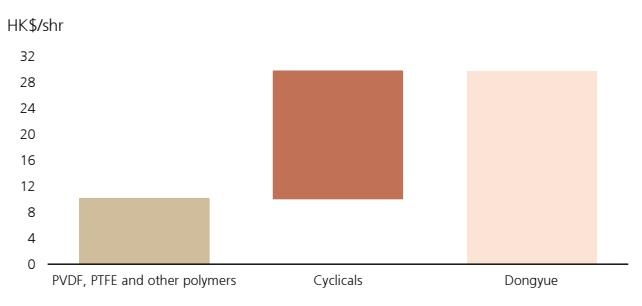  
Source: UBS-S estimates

## Capchem (Buy; price target raised to Rmb122.0)

As a leading producer of fluorinated fine chemicals in China, Capchem started with key upstream intermediates including TFE and HFPO, and has established a complete fluorochemical supply chain. The company is in a prominent position in the high-end organic fluorochemicals market, holding the largest market share in China among domestic producers of semis coolants/HFE cleaning agent in 2024. We expect net profit from semiconductor materials/fluorinated fluid to account for over 10%/5% of company's total net profit in 2026-27E.

Our rationales for stock pick: 1) we expect the company to maintain electrolyte/LiPF6 sales growth, with unit profitability likely to improve YoY; 2) we think its fluorinated fluids could benefit from accelerating domestic substitution as overseas companies exited from PFAS production; 3) its capacitor chemicals could ride on rising penetration of supercapacitors in AI data centres; 4) there is still upside to its valuation relative to the average of electronic materials.

We lift our price target from Rmb86.0 to Rmb122.0. We raise our revenue estimates for its capacitor chemicals/fluorochemical segments, and 2026-28E earnings 12-21%. We revise up our DCF-based (WACC unchanged at 8.0%, mid-term growth lifted from 11% to 12% to reflect long-term growth potentials of its fluorochemicals business) to Rmb122, implying 37x 2027E PE (prior: 29x). We think potential re-rating is mainly driven by 1) growing LiPF6 production and enhancing integration; 2) rapid growth in liquid cooling demand driven by data centre build-out, likely to significantly boost demand for fluorinated fluids; 3) rising penetration of supercapacitors in AI data centres set to drive demand for capacitor chemicals.

## EM Technology (Buy; price target raised to Rmb94.10)

The company is a domestic leader in high-frequency, high-speed resins. Specifically, it is the domestic leader in M6-M8 grade hydrocarbon resin and has penetrated the supply chains of Taiwanese copper-clad laminate (CCL) producers. We expect the BOPET/high-frequency, high-speed resin segment to fuel a 52% net profit CAGR over 2026-28E, with a potential 54% sales CAGR for high-frequency resins in 2026-28E. We estimate a net profit contribution of 60%-plus from its high-frequency, high-speed resin business in 2027-28E.

We raise our price target from Rmb41.50 to Rmb94.10. We raise our 2026 earnings estimate 1%, while lifting 2027/2028 earnings estimate 11%/17% (chiefly as we raise our 2027-28 high-frequency, high-speed resin sales forecasts by 13%/22%). Our PEG-derived price target implies 1.8x 2027E PEG, vs a 36% 2027-29E EPS CAGR (previously 1.2x 2026E PEG, vs a 42% 2026-28E EPS CAGR). EM Technology is trading at 1.0x 2027E PEG (on 2028E EPS growth), below the CCL value chain peer average of 1.9x.

Figure 17: PCB value chain comps table

<table><tr><td rowspan="2"></td><td rowspan="2">Ticker</td><td rowspan="2">Price LC</td><td rowspan="2">Mkt cap RMb bn</td><td colspan="2">P/E (x)</td><td colspan="2">EPS growth (%)</td><td colspan="2">P/BV (x)</td><td colspan="2">ROE (%)</td><td rowspan="2">PEG 2027E</td></tr><tr><td>2027E</td><td>2028E</td><td>2027E</td><td>2028E</td><td>2027E</td><td>2028E</td><td>2027E</td><td>2028E</td></tr><tr><td colspan="13">CCL</td></tr><tr><td>Shenyi Technology</td><td>600183.SH</td><td>183.87</td><td>447</td><td>56</td><td>42</td><td>43%</td><td>32%</td><td>17.5</td><td>13.6</td><td>34%</td><td>37%</td><td>1.7x</td></tr><tr><td>Nanya New Material</td><td>688519.SH</td><td>397.00</td><td>93</td><td>113</td><td>72</td><td>60%</td><td>59%</td><td>23.5</td><td>19.2</td><td>24%</td><td>27%</td><td>1.9x</td></tr><tr><td colspan="13">E-Glass</td></tr><tr><td>China Jushi</td><td>600176.SH</td><td>53.50</td><td>214</td><td>25</td><td>22</td><td>21%</td><td>15%</td><td>5.0</td><td>4.4</td><td>21%</td><td>21%</td><td>1.7x</td></tr><tr><td>Sinoma</td><td>002080.SZ</td><td>80.55</td><td>135</td><td>34</td><td>24</td><td>37%</td><td>39%</td><td>5.5</td><td>4.7</td><td>15%</td><td>16%</td><td>0.9x</td></tr><tr><td>Polycomp International</td><td>301526.SZ</td><td>40.89</td><td>154</td><td>63</td><td>49</td><td>55%</td><td>29%</td><td>13.5</td><td>11.5</td><td>20%</td><td>20%</td><td>2.2x</td></tr><tr><td>Feilihua Quartz Glass</td><td>300395.SZ</td><td>135.75</td><td>71</td><td>54</td><td>44</td><td>54%</td><td>25%</td><td>11.0</td><td>9.1</td><td>20%</td><td>21%</td><td>2.2x</td></tr><tr><td colspan="13">Copper Foil</td></tr><tr><td>Nuode Investment*</td><td>600110.SH</td><td>17.57</td><td>30</td><td>74</td><td>52</td><td>34%</td><td>41%</td><td>4.8</td><td>4.4</td><td>7%</td><td>9%</td><td>1.8x</td></tr><tr><td>Defu Tech*</td><td>301511.SZ</td><td>160.90</td><td>101</td><td>74</td><td>62</td><td>43%</td><td>20%</td><td>15.8</td><td>12.6</td><td>24%</td><td>23%</td><td>3.7x</td></tr><tr><td>Jiayuan Tech</td><td>688388.SH</td><td>47.18</td><td>31</td><td>26</td><td>20</td><td>61%</td><td>31%</td><td>3.7</td><td>3.2</td><td>14%</td><td>16%</td><td>0.9x</td></tr><tr><td>Tongguan Copper Foil</td><td>301217.SZ</td><td>200.00</td><td>166</td><td>219</td><td>NA</td><td>48%</td><td>74%</td><td>25.5</td><td>21.3</td><td>12%</td><td>17%</td><td>3.0x</td></tr><tr><td colspan="13">Resin</td></tr><tr><td>Shengquan Group*</td><td>605589.SH</td><td>69.82</td><td>59</td><td>37</td><td>32</td><td>22%</td><td>15%</td><td>4.7</td><td>4.3</td><td>13%</td><td>14%</td><td>2.5x</td></tr><tr><td>EM Tech*</td><td>601208.SH</td><td>74.83</td><td>76</td><td>56</td><td>41</td><td>52%</td><td>54%</td><td>10.6</td><td>9.4</td><td>20%</td><td>24%</td><td>1.0x</td></tr><tr><td>China Average</td><td></td><td></td><td></td><td>69</td><td>42</td><td>44%</td><td>36%</td><td>11.8</td><td>9.8</td><td>19%</td><td>20%</td><td>1.9x</td></tr></table>

Source: Wind, \*UBS-S estimates Note:\* for UBS-S estimates, price as of Jun 18.

## Guanggang

Our rationales for stock pick: We estimate total capacity of the company's on-site gas production projects (tender wins in 2024-25) at above 100,000 cubic meters per hour, which could drive a $23\%$ revenue CAGR for its electronic bulk gas segment in 2026-30. The company now trades at 63x 2027E PE, still below the peer average. That said, we think Guanggang is leading in bidding for domestic integrated circuit on-site gas production projects, thus warranting a valuation premium (see note).

Figure 18: Price target and earnings estimates changes

<table><tr><td rowspan="2">Company</td><td rowspan="2">Rating</td><td colspan="3">Price target (lcy)</td><td colspan="3">26E earnings - Rmb mn</td><td colspan="3">27E earnings - Rmb mn</td><td colspan="3">28E earnings - Rmb mn</td></tr><tr><td>New</td><td>Old</td><td>Chg.</td><td>New</td><td>Old</td><td>Chg.</td><td>New</td><td>Old</td><td>Chg.</td><td>New</td><td>Old</td><td>Chg.</td></tr><tr><td>Capchem</td><td>Buy</td><td>122.0</td><td>86.0</td><td>42%</td><td>2,036</td><td>1,680</td><td>21%</td><td>2,507</td><td>2,248</td><td>12%</td><td>2,811</td><td>2,468</td><td>14%</td></tr><tr><td>Dongyue Group</td><td>Buy</td><td>29.7</td><td>17.5</td><td>70%</td><td>2,500</td><td>2,374</td><td>5%</td><td>2,793</td><td>2,583</td><td>8%</td><td>2,905</td><td>2,726</td><td>7%</td></tr><tr><td>EM Technology</td><td>Buy</td><td>94.1</td><td>41.5</td><td>127%</td><td>790</td><td>779</td><td>1%</td><td>1,347</td><td>1,216</td><td>11%</td><td>1,835</td><td>1,569</td><td>17%</td></tr></table>

Source: UBS-S estimates.

## Valuation analysis

Electronic chemical material suppliers are at a significant valuation premium to traditional chemical companies, while some fluorochemical companies have re-rating potential, in our view. Comparable electronic chemical material (PCB resin, semis manufacturing materials, and electronic specialty gases) companies are valued at 89/10/2.7x 2026E PE/PB/PEG on average, notably higher than 22/5/1.7x for fluorochemical material companies, chiefly as the demand for electronic chemical materials could grow rapidly amid AI advances. We see further re-rating potential for some fluorochemical companies (electronic-grade PTFE, electronic-grade hydrofluoric acid, fluorinated fluids, and liquid cooling chemical materials) benefiting from AI development.

Figure 19: Valuation comparison table

<table><tr><td rowspan="2"></td><td rowspan="2">Share price Local cry</td><td rowspan="2">Mktcap US$bn</td><td colspan="2">PE (x)</td><td colspan="2">P/B (x)</td><td colspan="2">ROE (%)</td><td rowspan="2">EPS CAGR 26-28E</td><td rowspan="2">PEG 2026E</td></tr><tr><td>2026E</td><td>2027E</td><td>2026E</td><td>2027E</td><td>2026E</td><td>2027E</td></tr><tr><td colspan="11">Polymer and refrigerants</td></tr><tr><td>Dongyue*</td><td>21.1</td><td>5.2</td><td>12.7</td><td>11.3</td><td>2.9</td><td>1.6</td><td>15.0</td><td>15.0</td><td>7.8%</td><td>1.6</td></tr><tr><td>Sanmei Chemical*</td><td>65.4</td><td>5.7</td><td>16.0</td><td>15.3</td><td>6.8</td><td>3.7</td><td>28.4</td><td>25.6</td><td>4.5%</td><td>3.5</td></tr><tr><td>Zhejiang Juhua</td><td>44.1</td><td>17.0</td><td>20.3</td><td>17.1</td><td>4.8</td><td>4.0</td><td>23.5</td><td>23.1</td><td>16.8%</td><td>1.2</td></tr><tr><td>Haohua</td><td>65.2</td><td>12.0</td><td>38.5</td><td>32.9</td><td>4.0</td><td>3.7</td><td>10.8</td><td>11.5</td><td>14.5%</td><td>2.7</td></tr><tr><td>Yonghe Refrigerant</td><td>34.2</td><td>2.5</td><td>19.5</td><td>15.9</td><td>2.8</td><td>2.5</td><td>14.1</td><td>15.3</td><td>19.0%</td><td>1.0</td></tr><tr><td>Capchem*</td><td>83.3</td><td>9.0</td><td>30.8</td><td>25.0</td><td>6.8</td><td>4.4</td><td>17.5</td><td>18.8</td><td>17.5%</td><td>1.8</td></tr><tr><td>Tinci Materials*</td><td>51.6</td><td>15.0</td><td>16.5</td><td>12.0</td><td>7.4</td><td>3.6</td><td>30.7</td><td>33.0</td><td>21.7%</td><td>0.8</td></tr><tr><td>Duo Fluoride</td><td>38.8</td><td>6.6</td><td>19.9</td><td>16.2</td><td>4.9</td><td>4.6</td><td>24.8</td><td>29.2</td><td>25.9%</td><td>0.8</td></tr><tr><td>Average</td><td></td><td></td><td>21.8</td><td>18.2</td><td>5.1</td><td>3.5</td><td>20.6</td><td>21.4</td><td>16.0%</td><td>1.7</td></tr><tr><td colspan="11">Electronic chemical new materials</td></tr><tr><td>EM Technology*</td><td>74.8</td><td>10.8</td><td>96.0</td><td>56.1</td><td>15.0</td><td>10.6</td><td>12.7</td><td>19.9</td><td>52.7%</td><td>1.8</td></tr><tr><td>Shengquan Group*</td><td>69.8</td><td>8.4</td><td>49.5</td><td>37.5</td><td>6.0</td><td>4.7</td><td>10.8</td><td>13.1</td><td>23.4%</td><td>2.1</td></tr><tr><td>Huate Gas*</td><td>188.4</td><td>3.4</td><td>112.5</td><td>72.3</td><td>12.4</td><td>9.7</td><td>9.7</td><td>13.9</td><td>38.7%</td><td>2.9</td></tr><tr><td>Jinhong Gas*</td><td>30.3</td><td>2.3</td><td>47.2</td><td>35.8</td><td>4.6</td><td>4.2</td><td>9.6</td><td>12.0</td><td>25.4%</td><td>1.9</td></tr><tr><td>Guanggang Gas*</td><td>33.4</td><td>6.3</td><td>100.7</td><td>63.2</td><td>7.7</td><td>6.5</td><td>7.1</td><td>10.7</td><td>52.4%</td><td>1.9</td></tr><tr><td>Shanghai Sinyang</td><td>105.8</td><td>4.7</td><td>78.2</td><td>56.0</td><td>6.3</td><td>5.8</td><td>8.2</td><td>10.7</td><td>30.7%</td><td>2.5</td></tr><tr><td>Sinophorus Electronic Material</td><td>109.8</td><td>5.6</td><td>125.6</td><td>84.8</td><td>12.6</td><td>11.6</td><td>10.0</td><td>13.5</td><td>41.5%</td><td>3.0</td></tr><tr><td>Nata Opto-electronic</td><td>64.9</td><td>6.4</td><td>102.3</td><td>84.4</td><td>12.0</td><td>11.1</td><td>11.9</td><td>13.2</td><td>19.7%</td><td>5.2</td></tr><tr><td>Average</td><td></td><td></td><td>89.0</td><td>61.3</td><td>9.6</td><td>8.0</td><td>10.0</td><td>13.4</td><td>35.6%</td><td>2.7</td></tr></table>

Source: Wind, UBS-S estimates. Note: \* are UBS-S covered companies; for companies we do not cover, we use Wind consensus. Priced as of 18 June 2026.

## UBSVIEW

UBSResearch THESIS MAP a guide to our thinking and what's where in this report

## Q: Can Dongyue's fluoropolymer and organosilicon profitability recover notably in 2026?

Yes. Fluoropolymer sector margins troughed in 2025, with marginal makers generally loss-making. Fluoropolymer producers are increasingly motivated to restore margins, with prices of raw materials like hydrofluoric acid on the rise since the start of 2026. Besides, we expect the robust growth of select downstreams (e.g., energy storage and electronics) to drive incremental demand. For organosilicon DMC, we expect limited supply additions in 2026. Moreover, key firms have held multiple meetings to discuss ways to control production and support pricing, amid the ongoing industry-wide "anti-involution" drive.

## Q: Can Dongyue benefit from AI development in the medium to long term?

Yes. PTFE (polytetrafluoroethylene) features a low DK (dielectric constant) and low DF (dielectric loss factor), and is thus likely to be used in the orthogonal backplane material systems of Al racks. Dongyue is a domestic PTFE leader with strong technology expertise, and has invested in PTFE purification projects (targeting semis-grade applications). Its refrigerants and fluorine-containing fine chemicals are also well-placed to benefit from the expanding liquid cooling demand of data centers.

We think Dongyue is poised to benefit from the bottoming-out of fluoropolymer and organosilicon DMC prices. Its high-end PTFE products, refrigerants, and fluorine-containing fine chemicals could also benefit from the growing AI compute demand and technology iteration. We lift 2026/27/28E earnings 5%/8%/7% accordingly. Given the market's more positive outlook for PTFE application in AI server cabinet's orthogonal backplane materials, we lift 2027E PE for PTFE and other fluoropolymers from 15x to 30x (we expect the company's fluoropolymer segment EBIT to have a 2025-28 CAGR of 37%). Considering peer re-rating, we revise up the target PE for its cyclical chemical segment from 11x to 13x. Our SOTP-based (20/30/13x 2027E PE for PVDF/PTFE & other fluoropolymers/cyclical chemicals) price target is raised to HK\$29.7, implying 16x 2027E PE. We think the rationale for the company's re-rating lies in the iteration of AI materials systems and expanding demand from liquid cooling, which could drive faster growth in demand for the company's high-margin products.

1) The prices of PTFE/organosilicon DMC have risen 32%/8% YTD (as of 22 June). 2) Shengyi Technology showcased material routes and solutions (including PTFE-based orthogonal backplane materials) adapted to next-generation hardware needs (e.g., 224G/448G ultra-high-speed transmission) at DesignCon 2026. 3) In August 2025, Dongyue announced an investment of HK \$89.56m to enhance the quality of ultra-high-purity PTFE (e.g., high-end PTFE for the semis industry). 4) Dongyue has built a portfolio of fluorinated fluid product pathways, including perfluoropolyether (PFPE), hydrofluoroether (HFE), hexafluoropropylene dimers/trimers. Company also extended into the field of fluorinated ESGs.

Dongyue currently trades at 13x/11x 2026E/2027E PE, below the mean of fluorochemical peers. We believe the market has yet to fully price in the continuous profitability recovery of fluoropolymer and silicone and the new growth driver of PCB material/liquid cooling for the fluorochemical industry.

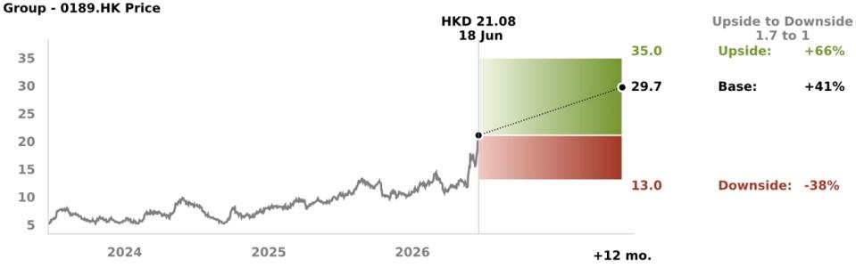

<table><tr><td>Value drivers (2027E)</td><td>PVDF ASP (Rmb/kg)</td><td>PTFE ASP (Rmb/kg)</td><td>R22 ASP (Rmb/kg)</td><td>R32 ASP (Rmb/kg)</td></tr><tr><td>HK$35.0 upside</td><td>80.0</td><td>55.0</td><td>25.0</td><td>69.0</td></tr><tr><td>HK$29.7 base</td><td>69.0</td><td>47.1</td><td>20.4</td><td>61.9</td></tr><tr><td>HK$13.0 downside</td><td>57.4</td><td>40.0</td><td>18.3</td><td>50.0</td></tr></table>

Source: UBS-S estimates

## COMPANY DESCRIPTION

Dongyue Group is the largest fluorine & silicone material production base in Asia, and the company is also expanding its capacity in the organosilicon and high-performance fluoropolymer segments...

UBSResearch THESIS MAP a guide to our thinking and what's where in this report

## Q: Will electrolyte prices stabilise and rebound in H226?

Likely. We expect LiPF6 (a raw material for electrolyte) prices to rebound modestly in H226 as: 1) downstream energy storage demand supports higher electrolyte/LiPF6 demand, but LiPF6 capacity growth could slow to <20%, pointing to tight industry supply/demand dynamics; 2) H2 is usually the peak season for electrolyte demand; and 3) lithium carbonate prices have risen from Rmb120k/t to Rmb170k/t YTD, which we think could provide cost support for LiPF6 prices.

## Q: Can electrolyte leaders maintain competitive advantages in the long run?

Yes. We think in-house raw material production and overseas expansion capabilities are key competitive advantages of leading electrolyte makers. Among raw materials, LiFSI penetration could ramp up gradually; LiFSI production is dominated by leaders along the industry chain, including Tinci, Capchem and Do-Fluoride. Capchem and Tinci have built capacity overseas, which could support their long-term electrolyte sales volume growth.

Q: Can its organic fluorine/semi/capacitor chemicals biz benefit from data centre build-out? Yes. Fluorinated fluids are well suited as coolants for immersion cooling in data centres. With rising server power density, UBS expects the penetration rate of two-phase immersion cooling to rise sharply after 2030. Capchem has a $50\%$ -plus domestic market share in capacitor chemicals. Downstream applications such as supercapacitors and aluminum electrolytic capacitors are poised to benefit from data center build-out.

We lift our 2026-28 net profit forecasts 12-21%, chiefly reflecting: 1) potential electrolyte earnings growth driven by its incremental LiPF6 capacity launches and increased electrolyte shipments. 2) Potential stabilization and improvement in Heptafluo's profitability; the company's fluorinated fluids segment riding the tailwinds of increasing penetration in semis and data centers and 3M's announced full exit of PFAS production by end-2025; 3) application of electrolytic capacitors in data centers as a potential boon to its capacitor chemicals sales growth. Maintain Buy rating.

Subsidiary Jiangxi Shilei Fluorine Materials' monthly LiPF6 output was \~2,000t in 2025, and ramped up to 3,000-4,000t in April 2026. Its LiPF6 capacity stands at 36ktpa, with a long-term plan to expand to >110ktpa. Capchem targets 500kt in electrolyte shipments for 2026, with a potential long-run target of >1.5mt. The company expects Heptafluo to turn profitable at the monthly level in 2026, before swinging to full-year profitability in 2027.

Capchem trades at 25x 2027E PE, below the mean of wet electronic chemicals firms. We think the market has not fully reflected the growth potential of its fluorine materials amidst data centre build-out and domestic substitution opportunities due to tightening PFAS regulations.

Shenzhen Capchem Technology - 300037.SZ Price

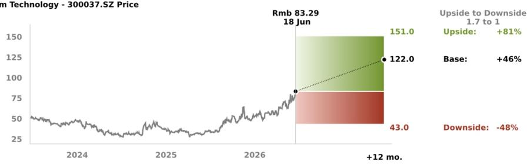

<table><tr><td>Value drivers (2027E)</td><td>Electrolyte ASP (Rmb/kg)</td><td>Electrolyte spread (Rmb/kg)</td><td>Electrolyte sales volume growth</td><td>Fluorochemical revenue growth</td></tr><tr><td>Rmb151.00 upside</td><td>29.9</td><td>3.0</td><td>25%</td><td>29%</td></tr><tr><td>Rmb122.00 base</td><td>22.9</td><td>2.1</td><td>15%</td><td>23%</td></tr><tr><td>Rmb43.00 downside</td><td>20.5</td><td>2.0</td><td>10%</td><td>12%</td></tr></table>

Source: UBS-S estimates

COMPANY DESCRIPTION Founded in 2002, Capchem initially focused on R&D and production of capacitor-related chemicals...

UBS THESIS MAP a guide to our thinking and what's where in this report

## Q: Will BOPET film's supply/demand improve in 2026?

Yes. We think the capacity expansion cycle for biaxially oriented polyethylene terephthalate (BOPET) is ending. 2020 marked the start of BOPET film's price-hike cycle and the current capacity expansion cycle. It usually takes 2-3 years for a BOPET production line to come online, but pandemic-related disruptions extended this by 1-2 years. For 2026, we foresee continued single-digit growth in BOPET demand and no meaningful, additional BOPET supply.

Q: Can the optical film and electronic resin businesses fuel a 50%-plus NP CAGR in 2026-28? Yes. We project the company to deliver a 50%-plus NP CAGR in 2026-28E, chiefly driven by: 1) the rising revenue mix and penetration rate of functional optical films; 2) 54% revenue CAGR in 2026-28E for high-frequency, high-speed resin, which has high GPM and could drive segment GPM to over 40%; and 3) improving expense amortisation on higher utilisation, after the completion of capacity expansion for optical film.

We lift EM Technology's price target to Rmb94.1, mainly as we expect: 1) AIDC tailwinds to drive its high-frequency, high-speed resin segment to deliver a 54% revenue CAGR for 2026-28E; 2) BOPET industry demand to grow 5% YoY in 2026E, while the industry capacity expansion cycle is likely near its end; and as 3) we think the company is subject to less uncertainty related to utilisation ramp of new production lines, after the last of its planned optical film production lines came onstream in 2025.

2020 marked the start of improving BOPET fundamentals and the current capacity expansion cycle. It usually takes 2-3 years for a BOPET production line to come online. Capacity expansion in 2025 mainly came from Kanghui New Material; no major capacity plans for 2026 have been announced so far. EM Technology brought the last of its planned new production lines online in 2025.

We expect the company's BOPET/high-frequency, high-speed resin segments to fuel a 52% overall NP CAGR in 2026-28E. The stock trades at 56x 2027E PE, implying 1.0x PEG (vs. 54% EPS growth in 2028E), lower than peers' average.

Sichuan EM Technology - 601208.SS Price

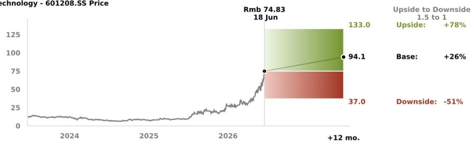

<table><tr><td>Value drivers (2027E)</td><td>Optical film sales volume YoY</td><td>Optical film ASP (Rmb/kg)</td><td>High-frequency, high-speed resin revenue (Rmb m)</td><td>Insulation materials GPM</td></tr><tr><td>Rmb133.00 upside</td><td>21%</td><td>12.3</td><td>2,500</td><td>22%</td></tr><tr><td>Rmb94.10 base</td><td>18%</td><td>12.0</td><td>2,108</td><td>19%</td></tr><tr><td>Rmb37.00 downside</td><td>13%</td><td>11.8</td><td>1,500</td><td>16%</td></tr></table>

Source: UBS-S estimates

Sichuan EM Technology Group Co., Ltd. is a domestic insulation material provider with the most complete product offering. It provides over 8 categories and 100+ varieties of products, including insulation paint resin, layer (molded) pressed products and electrotechnical plastics...

## Valuation Method and Risk Statement

We believe risks to the fluorochemicals sector include: 1) product and raw material price fluctuations; 2) downstream demand is subject to multiple uncertainties, including weather and economic volatility; 3) uncertainties in the quota policy for third-generation refrigerants; and 4) overseas PFAS regulations leading to a fluorochemicals market contraction.

Dongyue Group. Our price target is based on SOTP methodology. Key downside risks include: 1) the high volatility of organic silicone and refrigerant prices; 2) policy risks associated with PVDF/fluorochemical products; 3) electric vehicles are the major downstream market for battery-grade PVDF and the industry is still young, making it vulnerable to technological and policy risks; and 4) the company has a property segment, exposing it to property-related risks.

Capchem. Our price target is based on DCF methodology. Key downside risks include: 1) electrolyte formulas change fairly often, thus upstream materials are at risk of being replaced; 2) a changing battery technology roadmap could lead to dramatic changes in the usage and prices of electrolytes; 3) the sector is still in its early stages, and potential new entrants could substantially alter the industry landscape; 4) electrolyte enterprises face uncertainties in new-energy-related policies (such as subsidies); and 5) the fluorine chemical segment's profitability is cyclical and could be squeezed by rising HFP prices.

EM Technology. We use PEG valuation method to derive our price target as we factor in uncertainty regarding optical film capacity ramp-up. Downside risks include: 1) It may be difficult to verify the progress of the BOPET film capacity ramp-up, and capacity delays may result in earnings missing expectations. 2) The upstream of BOPET film consists of petrochemical companies, so sustained high oil prices could weigh on the sector's profitability.

Guanggang Gas. Our price target is based on DCF methodology. Downside risks include: 1) the price of helium, one of its primary products, has historically been volatile and affected by geopolitical risks; 2) M&A is relatively common in the bulk gas sector, but can have complex implications; and 3) delivery of stable gas supply by the electronic bulk gas business, as supply can be impacted by qualification progress and changes in clients' capacity.

## Quantitative Research Review

UBS Global Research publishes a quantitative assessment of its analysts' responses to certain questions about the likelihood of an occurrence of a number of short term factors in a product known as the 'Quantitative Research Review'. The views for this month can be found below. Views contained in this assessment on a particular stock reflect only the views on those short term factors which are a different timeframe to the 12-month timeframe reflected in any equity rating set out in this note. For previous responses please make reference to (i) previous UBS Global Research reports; and (ii) where no applicable research report was published that month, the Quantitative Research Review which can be found at https://neo.ubs.com/quantitative, or contact your UBS sales representative for access to the report or the Quantitative Research Team on ubs-quant-answers@ubs.com. A consolidated report which contains all responses is also available and again you should contact your UBS sales representative for details and pricing or the Quantitative Research Team on the email above.

## Dongyue Group

<table><tr><td>Question</td><td>Response</td></tr><tr><td>1. Is the industry structure facing the firm likely to improve or deteriorate over the next six months? Rate on a scale of 1-5 (1 = getting worse, 3 = no change, 5 = getting better, N/A = no view)</td><td>4</td></tr><tr><td>2. Is the regulatory/government environment facing the firm likely to improve or deteriorate over the next six months? Rate on a scale of 1-5 (1 = getting tougher 3 = no change, 5 = getting better, N/A = no view)</td><td>3</td></tr><tr><td>3. Over the last 3-6 months in broad terms have things been improving/no change/getting worse for this stock? Rate on a scale of 1-5 (1 = getting a lot worse, 3 = not much change, 5 = getting a lot better, N/A = no view)</td><td>4</td></tr><tr><td>4. Relative to the current CONSENSUS EPS forecast, is the next company EPS update likely to lead to: (1 = negative surprise vs consensus, 3 = in-line with consensus, 5 = positive surprise vs consensus expectations, N/A = no view)</td><td>3</td></tr><tr><td>5. What&#x27;s driving the difference?</td><td></td></tr><tr><td>6. Relative to YOUR current earnings forecast, is there relatively greater risk at the next earnings result of:(1 = downside skew risk to earnings, 3 = equal upside or downside risk to earnings, 5 = upside skew risk to earnings, N/A = no view)</td><td>3</td></tr><tr><td>7. What&#x27;s driving the difference?</td><td></td></tr><tr><td>8. Is there an upcoming catalyst for the company over the next three months?</td><td></td></tr><tr><td>9. Is there an actual or approximate date for the catalyst?</td><td></td></tr><tr><td>10. Is the catalyst date an actual or approximate date?</td><td></td></tr><tr><td>11. What is the catalyst?</td><td></td></tr></table>

## Shenzhen Capchem Technology

<table><tr><td>Question</td><td>Response</td></tr><tr><td>1. Is the industry structure facing the firm likely to improve or deteriorate over the next six months? Rate on a scale of 1-5 (1 = getting worse, 3 = no change, 5 = getting better, N/A = no view)</td><td>3</td></tr><tr><td>2. Is the regulatory/government environment facing the firm likely to improve or deteriorate over the next six months? Rate on a scale of 1-5 (1 = getting tougher 3 = no change, 5 = getting better, N/A = no view)</td><td>3</td></tr><tr><td>3. Over the last 3-6 months in broad terms have things been improving/no change/getting worse for this stock? Rate on a scale of 1-5 (1 = getting a lot worse, 3 = not much change, 5 = getting a lot better, N/A = no view)</td><td>4</td></tr><tr><td>4. Relative to the current CONSENSUS EPS forecast, is the next company EPS update likely to lead to: (1 = negative surprise vs consensus, 3 = in-line with consensus, 5 = positive surprise vs consensus expectations, N/A = no view)</td><td>3</td></tr><tr><td>5. What's driving the difference?</td><td></td></tr><tr><td>6. Relative to YOUR current earnings forecast, is there relatively greater risk at the next earnings result of:(1 = downside skew risk to earnings, 3 = equal upside or downside risk to earnings, 5 = upside skew risk to earnings, N/A = no view)</td><td>3</td></tr><tr><td>7. What's driving the difference?</td><td></td></tr><tr><td>8. Is there an upcoming catalyst for the company over the next three months?</td><td></td></tr><tr><td>9. Is there an actual or approximate date for the catalyst?</td><td></td></tr><tr><td>10. Is the catalyst date an actual or approximate date?</td><td></td></tr><tr><td>11. What is the catalyst?</td><td></td></tr></table>

Sichuan EM Technology

<table><tr><td>Question</td><td>Response</td></tr><tr><td>1. Is the industry structure facing the firm likely to improve or deteriorate over the next six months? Rate on a scale of 1-5 (1 = getting worse, 3 = no change, 5 = getting better, N/A = no view)</td><td>4</td></tr><tr><td>2. Is the regulatory/government environment facing the firm likely to improve or deteriorate over the next six months? Rate on a scale of 1-5 (1 = getting tougher 3 = no change, 5 = getting better, N/A = no view)</td><td>3</td></tr><tr><td>3. Over the last 3-6 months in broad terms have things been improving/no change/getting worse for this stock? Rate on a scale of 1-5 (1 = getting a lot worse, 3 = not much change, 5 = getting a lot better, N/A = no view)</td><td>3</td></tr><tr><td>4. Relative to the current CONSENSUS EPS forecast, is the next company EPS update likely to lead to: (1 = negative surprise vs consensus, 3 = in-line with consensus, 5 = positive surprise vs consensus expectations, N/A = no view)</td><td>4</td></tr><tr><td>5. What&#x27;s driving the difference?</td><td></td></tr><tr><td>6. Relative to YOUR current earnings forecast, is there relatively greater risk at the next earnings result of:(1 = downside skew risk to earnings, 3 = equal upside or downside risk to earnings, 5 = upside skew risk to earnings, N/A = no view)</td><td>3</td></tr><tr><td>7. What&#x27;s driving the difference?</td><td></td></tr><tr><td>8. Is there an upcoming catalyst for the company over the next three months?</td><td></td></tr><tr><td>9. Is there an actual or approximate date for the catalyst?</td><td></td></tr><tr><td>10. Is the catalyst date an actual or approximate date?</td><td></td></tr><tr><td>11. What is the catalyst?</td><td></td></tr></table>

## Required Disclosures

This document has been prepared by UBS Asia Limited, an affiliate of UBS AG. UBS AG, its subsidiaries, branches and affiliates, including former CS AG and its subsidiaries, branches and affiliates are referred to herein as "UBS".

For information on the ways in which UBS manages conflicts and maintains independence of its UBS Global Research product; historical performance information; certain additional disclosures concerning UBS Global Research recommendations; and terms and conditions for certain third party data used in research report, please visit https://www.ubs.com/disclosures. Unless otherwise indicated, information and data in this report are based on company disclosures including but not limited to annual, interim, quarterly reports and other company announcements. The figures contained in performance charts refer to the past; past performance is not a reliable indicator of future results. Additional information will be made available upon request. UBS Co. Limited is licensed to conduct securities investment consultancy businesses by the China Securities Regulatory Commission. UBS acts or may act as principal in the debt securities (or in related derivatives) that may be the subject of this report. This recommendation was finalized on: 22 June 2026 09:11 AM GMT. UBS has designated certain UBS Global Research department members as Derivatives Research Analysts where those department members publish research principally on the analysis of the price or market for a derivative, and provide information reasonably sufficient upon which to base a decision to enter into a derivatives transaction. Where Derivatives Research Analysts co-author research reports with Equity Research Analysts or Economists, the Derivatives Research Analyst is responsible for the derivatives investment views, forecasts, and/or recommendations. Quantitative Research Review: UBS Global Research publishes a quantitative assessment of its analysts' responses to certain questions about the likelihood of an occurrence of a number of short term factors in a product known as the 'Quantitative Research Review'. Views contained in this assessment on a particular stock reflect only the views on those short term factors which are a different timeframe to the 12-month timeframe reflected in any equity rating set out in this note. For the latest responses, please see the Quantitative Research Review Addendum at the back of this report, where applicable. For previous responses please make reference to (i) previous UBS Global Research reports; and (ii) where no applicable research report was published that month, the Quantitative Research Review which can be found at https://neo.ubs.com/quantitative, or contact your UBS sales representative for access to the report or the Quantitative Research Team on ubs-quant-answers@ubs.com. A consolidated report which contains all responses is also available and again you should contact your UBS sales representative for details and pricing or the Quantitative Research team on the email above.

## Analyst Certification:

Each research analyst primarily responsible for the content of this research report, in whole or in part, certifies that with respect to each security or issuer that the analyst covered in this report: (1) all of the views expressed accurately reflect his or her personal views about those securities or issuers and were prepared in an independent manner, including with respect to UBS, and (2) no part of his or her compensation was, is, or will be, directly or indirectly, related to the specific recommendations or views expressed by that research analyst in the research report.

UBS Global Research: Global Equity Rating Definitions

<table><tr><td>12-Month Rating</td><td>Definition</td><td>Coverage $^{1}$ </td><td>IB Services $^{2}$ </td></tr><tr><td>Buy</td><td>FSR is &gt; 6% above the MRA.</td><td>54%</td><td>24%</td></tr><tr><td>Neutral</td><td>FSR is between -6% and 6% of the MRA.</td><td>40%</td><td>21%</td></tr><tr><td>Sell</td><td>FSR is &gt; 6% below the MRA.</td><td>6%</td><td>21%</td></tr></table>

Source: UBS. Rating allocations are as of 31 March 2026.  
1: Percentage of companies under coverage globally within the 12-month rating category.

2: Percentage of companies within the 12-month rating category for which investment banking (IB) services were provided within the past 12 months.

KEY DEFINITIONS: Forecast Stock Return (FSR) is defined as expected percentage price appreciation plus gross dividend yield over the next 12 months. In some cases, this yield may be based on accrued dividends. Market Return Assumption (MRA) is defined as the one-year local market interest rate plus 5% (a proxy for, and not a forecast of, the equity risk premium). Under Review (UR) Stocks may be flagged as UR by the analyst, indicating that the stock's price target and/or rating are subject to possible change in the near term, usually in response to an event that may affect the investment case or valuation. Equity Price Targets have an investment horizon of 12 months.

EXCEPTIONS AND SPECIAL CASES:UK and European Investment Fund ratings and definitions are: Buy: Positive on factors such as structure, management, performance record, discount; Neutral: Neutral on factors such as structure, management, performance record, discount; Sell: Negative on factors such as structure, management, performance record, discount. Core Banding Exceptions (CBE): Exceptions to the standard +/-6% bands may be granted by the Investment Review Consultation (IRC). Factors considered by the IRC include the stock's volatility and the credit spread of the respective company's debt. As a result, stocks deemed to be very high or low risk may be subject to higher or lower bands as they relate to the rating. When such exceptions apply, they will be identified in the Company Disclosures table in the relevant research piece.

Research analysts contributing to this report who are employed by any non-US affiliate of UBS LLC are not registered/qualified as research analysts with FINRA. Such analysts may not be associated persons of UBS LLC and therefore are not subject to the FINRA restrictions on communications with a subject company, public appearances, and trading securities held by a research analyst account. The name of each affiliate and analyst employed by that affiliate contributing to this report, if any, follows.
UBS AG Hong Kong Branch: Eason Tang. UBS Co. Limited: Amily Guo, Jay LIN, Richard Li.

Company Disclosures

<table><tr><td>Company Name</td><td>Reuters</td><td>12-month rating</td><td>Price</td><td>Price date</td></tr><tr><td>Dongyue Group $^{28}$ </td><td>0189.HK</td><td>Buy</td><td>HK$21.08</td><td>18 Jun 2026</td></tr><tr><td>Guangzhou Guanggang Gas &amp; Energy</td><td>688548.SS</td><td>Buy</td><td>Rmb38.38</td><td>22 Jun 2026</td></tr><tr><td>Shenzhen Capchem Technology</td><td>300037.SZ</td><td>Buy</td><td>Rmb89.99</td><td>22 Jun 2026</td></tr><tr><td>Sichuan EM Technology</td><td>601208.SS</td><td>Suspended</td><td>Rmb79.83</td><td>22 Jun 2026</td></tr></table>

Source: UBS Global Research; LSEG Eikon. All prices as of local market close. Ratings in this table are the most current published ratings prior to this report. They may be more recent than the stock pricing date.
28. UBS holds a long or short position of 0.5% or more of the listed shares of this company.

Unless otherwise indicated, please refer to the Valuation and Risk sections within the body of this report. For a complete set of disclosure statements associated with the companies discussed in this report, including information on valuation and risk, please contact UBS LLC, 11 Madison Avenue, New York, NY 10010, USA, Attention: Investment Research.

Sichuan EM Technology (Rmb)  
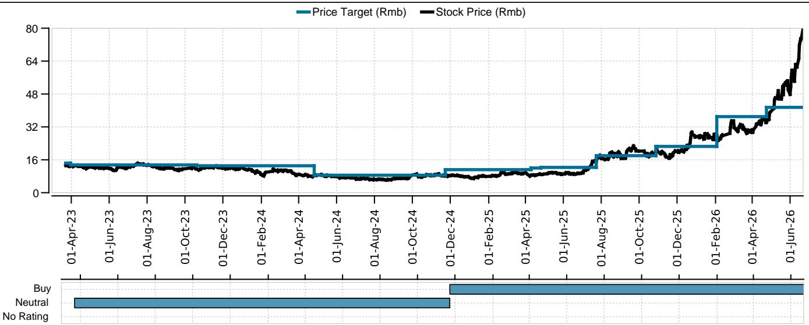

<table><tr><td>Date</td><td>Stock Price (Rmb)</td><td>Price Target (Rmb)</td><td>Rating</td></tr><tr><td>2023-03-22</td><td>13.00</td><td>14.40</td><td>Neutral</td></tr><tr><td>2023-03-30</td><td>12.85</td><td>13.50</td><td>Neutral</td></tr><tr><td>2023-10-19</td><td>11.68</td><td>13.10</td><td>Neutral</td></tr><tr><td>2024-04-25</td><td>8.12</td><td>8.50</td><td>Neutral</td></tr><tr><td>2024-11-22</td><td>8.14</td><td>11.20</td><td>Buy</td></tr><tr><td>2025-04-09</td><td>8.29</td><td>12.00</td><td>Buy</td></tr><tr><td>2025-04-25</td><td>8.97</td><td>12.30</td><td>Buy</td></tr><tr><td>2025-07-23</td><td>15.10</td><td>18.00</td><td>Buy</td></tr><tr><td>2025-10-27</td><td>18.44</td><td>22.50</td><td>Buy</td></tr><tr><td>2026-02-02</td><td>26.50</td><td>37.00</td><td>Buy</td></tr><tr><td>2026-04-23</td><td>34.13</td><td>41.50</td><td>Buy</td></tr><tr><td>2026-06-22</td><td>79.83</td><td>-</td><td>No Rating</td></tr></table>

Source: UBS Global Research; LSEG Eikon as of 22-Jun-2026. All prices as of local market close. Ratings as of date shown.

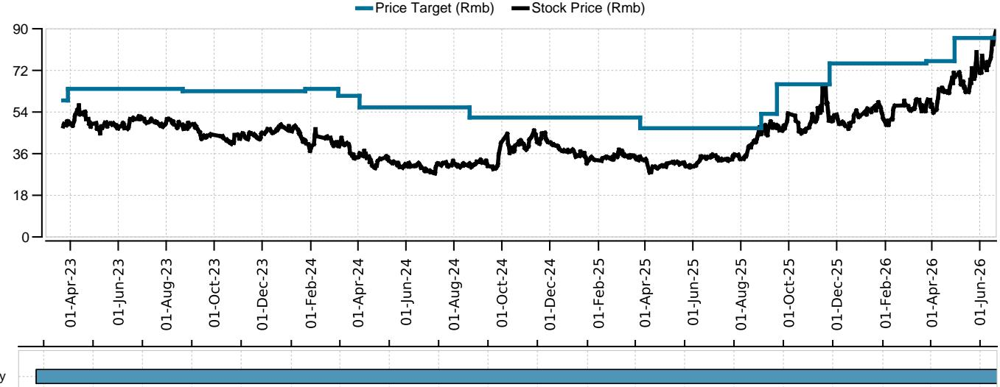

<table><tr><td>Date</td><td>Stock Price (Rmb)</td><td>Price Target (Rmb)</td><td>Rating</td></tr><tr><td>2023-03-22</td><td>47.88</td><td>59.00</td><td>Buy</td></tr><tr><td>2023-03-28</td><td>49.98</td><td>64.00</td><td>Buy</td></tr><tr><td>2023-08-21</td><td>48.16</td><td>63.00</td><td>Buy</td></tr><tr><td>2024-01-24</td><td>41.85</td><td>64.00</td><td>Buy</td></tr><tr><td>2024-03-06</td><td>40.86</td><td>61.00</td><td>Buy</td></tr><tr><td>2024-04-02</td><td>34.71</td><td>56.00</td><td>Buy</td></tr><tr><td>2024-08-20</td><td>31.32</td><td>51.60</td><td>Buy</td></tr><tr><td>2025-03-25</td><td>34.56</td><td>47.00</td><td>Buy</td></tr><tr><td>2025-08-26</td><td>45.24</td><td>53.20</td><td>Buy</td></tr><tr><td>2025-09-15</td><td>47.12</td><td>66.00</td><td>Buy</td></tr><tr><td>2025-11-21</td><td>50.32</td><td>75.00</td><td>Buy</td></tr><tr><td>2026-03-24</td><td>54.40</td><td>76.00</td><td>Buy</td></tr><tr><td>2026-04-29</td><td>70.93</td><td>86.00</td><td>Buy</td></tr></table>

Source: UBS Global Research; LSEG Eikon as of 22-Jun-2026. All prices as of local market close. Ratings as of date shown.

Guangzhou Guanggang Gas & Energy (Rmb)  
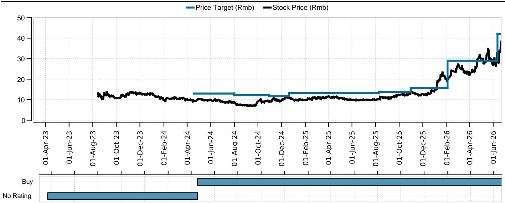

<table><tr><td>Date</td><td>Stock Price (Rmb)</td><td>Price Target (Rmb)</td><td>Rating</td></tr><tr><td>2023-03-22</td><td>NaN</td><td>-</td><td>No Rating</td></tr><tr><td>2024-04-17</td><td>9.42</td><td>13.00</td><td>Buy</td></tr><tr><td>2024-07-31</td><td>8.90</td><td>12.20</td><td>Buy</td></tr><tr><td>2024-10-28</td><td>9.44</td><td>11.70</td><td>Buy</td></tr><tr><td>2024-12-19</td><td>11.62</td><td>13.30</td><td>Buy</td></tr><tr><td>2025-04-21</td><td>11.21</td><td>13.20</td><td>Buy</td></tr><tr><td>2025-08-08</td><td>10.21</td><td>13.80</td><td>Buy</td></tr><tr><td>2025-10-30</td><td>13.04</td><td>15.70</td><td>Buy</td></tr><tr><td>2026-02-02</td><td>19.10</td><td>29.00</td><td>Buy</td></tr><tr><td>2026-06-11</td><td>32.80</td><td>42.00</td><td>Buy</td></tr></table>

Source: UBS Global Research; LSEG Eikon as of 22-Jun-2026. All prices as of local market close. Ratings as of date shown.

Dongyue Group (HK\$)  
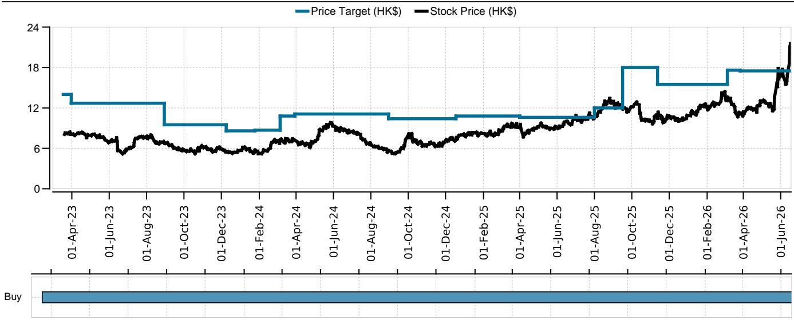

<table><tr><td>Date</td><td>Stock Price (HK$)</td><td>Price Target (HK$)</td><td>Rating</td></tr><tr><td>2023-03-17</td><td>8.15</td><td>14.00</td><td>Buy</td></tr><tr><td>2023-03-30</td><td>8.11</td><td>12.70</td><td>Buy</td></tr><tr><td>2023-08-29</td><td>7.00</td><td>9.50</td><td>Buy</td></tr><tr><td>2023-12-08</td><td>5.48</td><td>8.60</td><td>Buy</td></tr><tr><td>2024-01-24</td><td>5.43</td><td>8.70</td><td>Buy</td></tr><tr><td>2024-03-05</td><td>6.75</td><td>10.80</td><td>Buy</td></tr><tr><td>2024-03-29</td><td>7.34</td><td>11.10</td><td>Buy</td></tr><tr><td>2024-08-29</td><td>5.58</td><td>10.40</td><td>Buy</td></tr><tr><td>2024-12-17</td><td>7.17</td><td>10.80</td><td>Buy</td></tr><tr><td>2025-03-31</td><td>9.11</td><td>10.60</td><td>Buy</td></tr><tr><td>2025-07-31</td><td>10.42</td><td>12.00</td><td>Buy</td></tr><tr><td>2025-09-15</td><td>12.00</td><td>18.00</td><td>Buy</td></tr><tr><td>2025-11-11</td><td>10.73</td><td>15.50</td><td>Buy</td></tr><tr><td>2026-03-05</td><td>13.09</td><td>17.60</td><td>Buy</td></tr><tr><td>2026-03-26</td><td>11.09</td><td>17.50</td><td>Buy</td></tr></table>

Source: UBS Global Research; LSEG Eikon as of 18-Jun-2026. All prices as of local market close. Ratings as of date shown.

The Disclaimer relevant to Global Wealth Management clients follows the Global Research Disclaimer. The Disclaimer relevant to CS Wealth Management follows the Global Wealth Management Disclaimer.

## UBS Global Research Disclaimer

This document has been prepared by UBS Asia Limited, an affiliate of UBS AG. UBS AG, its subsidiaries, branches and affiliates, including former CS AG and its subsidiaries, branches and affiliates are referred to herein as "UBS".

Any opinions expressed in this document may change without notice and are only current as of the date of publication. Different areas, groups, and personnel within UBS may produce and distribute separate research products independently of each other. For example, research publications from UBS CIO are produced by UBS Global Wealth Management. UBS Global Research is produced by UBS Investment Bank. Research methodologies and rating systems of each separate research organization may differ, for example, in terms of investment recommendations, investment horizon, model assumptions, and valuation methods. As a consequence, except for certain economic forecasts (for which UBS CIO and UBS Global Research may collaborate), investment recommendations, ratings, price targets, and valuations provided by each of the separate research organizations may be different, or inconsistent. You should refer to each relevant research product for the details as to their methodologies and rating system. Not all clients may have access to all products from every organization. Each research product is subject to the policies and procedures of the organization that produces it.

This document is provided solely to recipients who are expressly authorized by UBS to receive it. If you are not so authorized you must immediately destroy the document.

UBS Global Research is provided to our clients through UBS Neo, and in certain instances, UBS.com and any other system or distribution method specifically identified in one or more communications distributed through UBS Neo or UBS.com (each a system) as an approved means for distributing UBS Global Research. It may also be made available through third party vendors and distributed by UBS and/or third parties via e-mail or alternative electronic means.

All UBS Global Research is available on UBS Neo. Please contact your UBS sales representative if you wish to discuss your access to UBS Neo. Where UBS Global Research refers to "UBS Evidence Lab Inside" or has made use of data provided by UBS Evidence Lab and you would like to access that data please contact your UBS sales representative. UBS Evidence Lab data is available on UBS Neo. The level and types of services provided by UBS Global Research and UBS Evidence Lab to a client may vary depending upon various factors such as a client's individual preferences as to the frequency and manner of receiving communications, a client's risk profile and investment focus and perspective (e.g., market wide, sector specific, long-term, short-term, etc.), the size and scope of the overall client relationship with UBS Global Research and UBS Evidence Lab and legal and regulatory constraints. UBS HOLT and UBS Pharma Values are offerings of UBS Global Research. HOLT Lens is a corporate performance platform offering that provides an objective accounting-led framework for comparing and valuing companies and is available to clients of UBS Global Research; for further details and pricing please contact your UBS Sales representative. In particular, HOLT has a variety of warranted prices based on the scenario chosen; please mail UBS LLC, 11 Madison Avenue, New York, NY 10010, USA, Attention: Investment Research, if you are interested in the warranted price on a particular company, again subject to commercial considerations. UBS Pharma Values is an analytical tool that involves the creation of a number of individual product net present value calculations, based on published forecasts of sales for pharmaceuticals, and is available to clients of UBS Global Research; for further details and pricing please contact your UBS Sales representative. For all other specific disclaimers, please see https://www.ubs.com/disclosures.

When you receive UBS Global Research through a system, your access and/or use of such UBS Global Research is subject to this UBS Global Research Disclaimer and to the UBS Neo Platform Use Agreement (the "Neo Terms") together with any other relevant terms of use governing the applicable System.

When you receive UBS Global Research via a third party vendor, e-mail or other electronic means, you agree that use shall be subject to this UBS Global Research Disclaimer, the Neo Terms and where applicable the UBS Investment Bank terms of business (https://www.ubs.com/global/en/investment-bank/regulatory.html) and to UBS's Terms of Use/Disclaimer (https://www.ubs.com/global/en/legalinfo2/disclaimer.html). In addition, you consent to UBS processing your personal data and using cookies in accordance with our Privacy Statement (https://www.ubs.com/global/en/legalinfo2/privacy.html) and cookie notice (https://www.ubs.com/global/en/legal/privacy/users.html).

If you receive UBS Global Research, whether through a System or by any other means, you agree that you shall not copy, revise, amend, create a derivative work, provide to any third party, or in any way commercially exploit any UBS provided via UBS Global Research or otherwise, and that you shall not extract data from any research or estimates provided to you via UBS Global Research or otherwise, without the prior written consent of UBS. You agree not to use UBS Global Research in any artificial intelligence system, without the prior written consent of UBS.

In certain circumstances you may receive UBS Global Research otherwise than in the capacity of a client of UBS and you understand and agree that under these circumstances (i) the UBS Global Research is provided to you for information purposes only; (ii) for the purposes of receiving it you are not intended to be and will not be treated as a “client” of UBS for any legal or regulatory purpose; (iii) the UBS Global Research must not be relied on or acted upon for any purpose; and (iv) such content is subject to the relevant disclaimers that follow.

This document is for distribution only as may be permitted by law. It is not directed to, or intended for distribution to or use by, any person or entity who is a citizen or resident of or located in any locality, state, country or other jurisdiction where such distribution, publication, availability or use would be contrary to law or regulation or would subject UBS to any registration or licensing requirement within such jurisdiction.

This document is a general communication and is educational in nature; it is not an advertisement nor is it a solicitation or an offer to buy or sell any financial instruments or to participate in any particular trading strategy. Nothing in this document constitutes a representation that any investment strategy or recommendation is suitable or appropriate to an investor's individual circumstances or otherwise constitutes a personal recommendation. By providing this document, none of UBS or its representatives has any responsibility or authority to provide or have provided investment advice in a fiduciary capacity or otherwise. Investments involve risks, and investors should exercise prudence and their own judgment in making their investment decisions. None of UBS or its representatives is suggesting that the recipient or any other person take a specific course of action or any action at all. The recipient should carefully read this document in its entirety and not draw inferences or conclusions from the rating alone. By receiving this document, the recipient acknowledges and agrees with the intended purpose described above and further disclaims any expectation or belief that the information constitutes investment advice to the recipient or otherwise purports to meet the investment objectives of the recipient. The financial instruments described in the document may not be eligible for sale in all jurisdictions or to certain categories of investors.

Options, structured derivative products and futures (including OTC derivatives) are not suitable for all investors. Trading in these instruments is considered risky and may be appropriate only for sophisticated investors. Prior to buying or selling an option, and for the complete risks relating to options, you must receive a copy of "The Characteristics and Risks of Standardized Options." You may read the document at https://www.theocc.com/publications/risks/riskchap1.jsp or ask your salesperson for a copy. Various theoretical explanations of the risks associated with these instruments have been published. Supporting documentation for any claims, comparisons, recommendations, statistics or other technical data will be supplied upon request. Past performance is not necessarily indicative of future results. Transaction costs may be significant in option strategies calling for multiple purchases and sales of options, such as spreads and straddles. Because of the importance of tax considerations to many options transactions, the investor considering options should consult with his/her tax advisor as to how taxes affect the outcome of contemplated options transactions.

Mortgage and asset-backed securities may involve a high degree of risk and may be highly volatile in response to fluctuations in interest rates or other market conditions. Foreign currency rates of exchange may adversely affect the value, price or income of any security or related instrument referred to in the document. For investment advice, trade execution or other enquiries, clients should contact their local sales representative.

UBS notes that no globally accepted framework or definition (legal, regulatory or otherwise) currently exists, nor is there a market consensus as to what constitutes an “ESG” (Environmental, Social or Governance) or an equivalent-label, or as to what precise attributes are required for the Information (as defined below) to be defined as ESG or equivalently-labelled. Any information, data or other content including from a third party source contained, referred to herein or used for whatsoever purpose by UBS or a third party (“Information”), in relation to any actual or potential ESG objective, issue or consideration is not intended to be relied upon for ESG classification, regulatory regime or industry initiative purposes (“ESG Regimes”). Nothing in these materials is intended to convey, suggest or indicate that UBS considers or represents any product, service, person or body mentioned in these materials as meeting or qualifying for any ESG classification, labelling or similar standards that may exist under the ESG Regimes. UBS has not conducted any assessment of compliance with ESG Regimes. Parties are reminded to make their own assessments for these purposes.

The value of any investment or income may go down as well as up, and investors may not get back the full (or any) amount invested. Past performance is not necessarily a guide to future performance. Neither UBS nor any of its directors, employees or agents accepts any liability for any loss (including investment loss) or damage arising out of the use of all or any of the Information.

Prior to making any investment or financial decisions, any recipient of this document or the information should take steps to understand the risk and return of the investment and seek individualized advice from his or her personal financial, legal, tax and other professional advisors that takes into account all the particular facts and circumstances of his or her investment objectives.

Any prices stated in this document are for information purposes only and do not represent valuations for individual securities or other financial instruments. There is no representation that any transaction can or could have been effected at those prices, and any prices do not necessarily reflect UBS's internal books and records or theoretical model-based valuations and may be based on certain assumptions. Different assumptions by UBS or any other source may yield substantially different results.

No representation or warranty, either expressed or implied, is provided in relation to the accuracy, completeness or reliability of the information contained in any materials to which this document relates (the "Information"), except with respect to Information concerning UBS. The Information is not intended to be a complete statement or summary of the securities, markets or developments referred to in the document. UBS does not undertake to update or keep current the Information. Any statements contained in this report attributed to a third party represent UBS's interpretation of the data, information and/or opinions provided by that third party either publicly or through a subscription service, and such use and interpretation have not been reviewed by the third party. In no circumstances may this document or any of the Information (including any forecast, value, index or other calculated amount ("Values")) be used for any of the following purposes:

(i) valuation or accounting purposes;

(ii) to determine the amounts due or payable, the price or the value of any financial instrument or financial contract; or

(iii) to measure the performance of any financial instrument including, without limitation, for the purpose of tracking the return or performance of any Value or of defining the asset allocation of portfolio or of computing performance fees.

By receiving this document and the Information you will be deemed to represent and warrant to UBS that you will not use this document or any of the Information for any of the above purposes or otherwise rely upon this document or any of the Information.

UBS has policies and procedures, which include, without limitation, independence policies and permanent information barriers, that are intended, and upon which UBS relies, to manage potential conflicts of interest and control the flow of information within divisions of UBS and among its subsidiaries, branches and affiliates. UBS does and seeks to do business with companies covered in its research reports. As a result, investors should be aware that the firm may have a conflict of interest that could affect the objectivity of this report. Investors should consider this report as only a single factor in making their investment decision. For further information on the ways in which UBS Global Research manages conflicts and maintains independence of its research products, historical performance information and certain additional disclosures concerning UBS Global Research recommendations, please visit https://www.ubs.com/disclosures.

UBS Global Research will initiate, update and cease coverage solely at the discretion of UBS Global Research Management, which will also have sole discretion on the timing and frequency of any published research product. The analysis contained in this document is based on numerous assumptions. All material information in relation to published research reports, such as valuation methodology, risk statements, underlying assumptions (including sensitivity analysis of those assumptions), ratings history etc. as required by the Market Abuse Regulation, can be found on UBS Neo. Different assumptions could result in materially different results.

UBS Global Research may utilise artificial intelligence tools (“AI Tools”) in the preparation of this document. Notwithstanding any such use of AI Tools, this document has undergone human review.

The analyst(s) responsible for the preparation of this document may interact with trading desk personnel, sales personnel and other parties for the purpose of gathering, applying and interpreting market information. UBS relies on information barriers to control the flow of information contained in one or more areas within UBS into other areas, units, groups or affiliates of UBS. The compensation of the analyst who prepared this document is determined exclusively by UBS Global Research management and senior management (not including investment banking). Analyst compensation is not based on investment banking revenues; however, compensation may relate to the revenues of UBS and/or its divisions as a whole, of which investment banking, sales and trading are a part, and UBS as a whole.

For financial instruments admitted to trading on an EU regulated market: UBS (excluding UBS LLC) acts as a market maker or liquidity provider (in accordance with the interpretation of these terms under English law or, if not carried out by UBS in the UK the law of the relevant jurisdiction in which UBS determines it carries out the activity) in the financial instruments of the issuer save that where the activity of liquidity provider is carried out in accordance with the definition given to it by the laws and regulations of any other EU jurisdictions, such information is separately disclosed in this document. For financial instruments admitted to trading on a non-EU regulated market: UBS may act as a market maker save that where this activity is carried out in the US in accordance with the definition given to it by the relevant laws and regulations, such activity will be specifically disclosed in this document. UBS may have issued a warrant the value of which is based on one or more of the financial instruments referred to in the document. UBS and its affiliates and employees may have long or short positions, trade as principal and buy and sell in instruments or derivatives identified herein; such transactions or positions may be inconsistent with the opinions expressed in this document.

Within the past 12 months UBS may have received or provided investment services and activities or ancillary services as per MiFID II which may have given rise to a payment or promise of a payment in relation to these services from or to this company.

Please note that all transactions conducted by UBS are consistent with sanctions regulations imposed by Switzerland, the European Union, the United Nations, the United Kingdom and the United States, per UBS' global sanctions policy. UBS opinion as to future investment worthiness assumes no new sanctions are imposed.

US persons are prohibited from purchasing or selling securities of certain companies designated as being associated with the Chinese Military in accordance with the amended US Presidential Executive Order 13959.

United Kingdom: This material is distributed by UBS AG, London Branch to persons who are eligible counterparties or professional clients. UBS AG, London Branch is authorised by the Prudential Regulation Authority and subject to regulation by the Financial Conduct Authority and limited regulation by the Prudential Regulation Authority. Europe: Except as otherwise specified herein, these materials are distributed by UBS Europe SE, a subsidiary of UBS AG, to persons who are eligible counterparties or professional clients (as detailed in the Bundesanstalt für Finanzdienstleistungsaufsicht (BaFin) Rules and according to MIFID) and are only available to such persons. The information does not apply to, and should not be relied upon by, retail clients. UBS Europe SE is authorised by the European Central Bank (ECB) and regulated by the BaFin and the ECB. Germany, Luxembourg, the Netherlands, Belgium and Ireland: Where an analyst of UBS Europe SE has contributed to this document, the document is also deemed to have been prepared by UBS Europe SE. In all cases it is distributed by UBS Europe SE and UBS AG, London Branch. Turkey: Distributed by UBS AG, London Branch. No information in this document is provided for the purpose of offering, marketing and sale by any means of any capital market instruments and services in the Republic of Turkey. Therefore, this document may not be considered as an offer made or to be made to residents of the Republic of Turkey. UBS AG, London Branch is not licensed by the Turkish Capital Market Board under the provisions of the Capital Market Law (Law No. 6362). Accordingly, neither this document nor any other offering material related to the instruments/services may be utilized in connection with providing any capital market services to persons within the Republic of Turkey without the prior approval of the Capital Market Board. However, according to article 15 (d) (ii) of the Decree No. 32, there is no restriction on the purchase or sale of the securities abroad by residents of the Republic of Turkey. Poland: Distributed by UBS Europe SE (spolka z ograniczona odpowiedzialnoscia) Oddzial w Polsce. Where an analyst of UBS Europe SE (spolka z ograniczona odpowiedzialnoscia) Oddzial w Polsce has contributed to this document, the document is also deemed to have been prepared by UBS Europe SE (spolka z ograniczona odpowiedzialnoscia) Oddzial w Polsce. Russia: Prepared and distributed by UBS Bank (OOO). Should not be construed as an individual Investment Recommendation for the purpose of the Russian Law - Federal Law #39-FZ ON THE SECURITIES MARKET Articles 6.1-6.2. Switzerland: Distributed by UBS AG to persons who are institutional investors only. UBS AG is regulated by the Swiss Financial Market Supervisory Authority (FINMA). Italy: Prepared by UBS Europe SE and distributed by UBS Europe SE and UBS Europe SE, Italy Branch. Where an analyst of UBS Europe SE, Italy Branch has contributed to this document, the document is also deemed to have been prepared by UBS Europe SE, Italy Branch. France: Prepared by UBS Europe SE and distributed by UBS Europe SE and UBS Europe SE, France Branch. Where an analyst of UBS Europe SE, France Branch has contributed to this document, the document is also deemed to have been prepared by UBS Europe SE, France Branch. Spain: Prepared by UBS Europe SE and distributed by UBS Europe SE and UBS Europe SE, Spain Branch. Where an analyst of UBS Europe SE, Spain Branch has contributed to this document, the document is also deemed to have been prepared by UBS Europe SE, Spain Branch. Sweden: Prepared by UBS Europe SE and distributed by UBS Europe SE and UBS Europe SE, Sweden Branch. Where an analyst of UBS Europe SE, Sweden Branch has contributed to this document, the document is also deemed to have been prepared by UBS Europe SE, Sweden Branch. South Africa: Distributed by UBS South Africa (Pty) Limited (Registration No. 1995/011140/07), an authorised user of the JSE and an authorised Financial Services Provider (FSP 7328). Saudi Arabia: This document has been issued by UBS AG (and/or any of its subsidiaries, branches or affiliates), a public company limited by shares, incorporated in Switzerland with its registered offices at Aeschenvorstadt 1, CH-4051 Basel and Bahnhofstrasse 45, CH-8001 Zurich. This publication has been approved by UBS Saudi Arabia (a subsidiary of UBS AG), a Saudi closed joint stock company incorporated in the Kingdom of Saudi Arabia under commercial register number 1010257812 having its registered office at Tatweer Towers, P.O. Box 75724, Riyadh 11588, Kingdom of Saudi Arabia. UBS Saudi Arabia is authorized and regulated by the Capital Market Authority to conduct securities business under license number 08113-37. UAE / Dubai: The information distributed by UBS AG Dubai Branch is only intended for Professional Clients and/or Market Counterparties, as classified under the DFSA rulebook. No other person should act upon this material/communication. The information is not for further distribution within the United Arab Emirates. UBS AG Dubai Branch is regulated by the DFSA in the DIFC. UBS is not licensed to provide banking services in the UAE by the Central Bank of the UAE, nor is it licensed by the UAE Securities and Commodities Authority. Israel: This Material is distributed by UBS AG, London Branch. UBS Israel Ltd is a licensed Investment Marketer that is supervised by the Israel Securities Authority (ISA). UBS AG, London Branch and its affiliates incorporated outside Israel are not licensed under the Israeli Advisory Law. UBS may engage among others in issuance of Financial Assets or in distribution of Financial Assets of other issuers for fees or other benefits. UBS AG, London Branch and its affiliates may prefer various Financial Assets to which they have or may have an Affiliation (as such term is defined under the Israeli Advisory Law). Nothing in this Material should be considered as investment advice under the Israeli Advisory Law. This Material is being issued only to and/or is directed only at persons who are Eligible Clients within the meaning of the Israeli Advisory Law, and this Material must not be furnished to, relied on or acted upon by any other persons. United States: Distributed to US persons by either UBS LLC or by UBS Financial Services Inc., subsidiaries of UBS AG; or by a group, subsidiary or affiliate of UBS AG that is not registered as a US broker-dealer (a 'non-US affiliate') to major US institutional investors only. UBS LLC or UBS Financial Services Inc. accepts responsibility for the content of a report prepared by another non-US affiliate when distributed to US persons by UBS LLC or UBS Financial Services Inc. All transactions by a US person in the securities mentioned in this report must be effected through UBS LLC or UBS Financial Services Inc., and not through a non-US affiliate. UBS LLC is not acting as a municipal advisor to any municipal entity or obligated person within the meaning of

Section 15B of the Securities Exchange Act (the "Municipal Advisor Rule"), and the opinions or views contained herein are not intended to be, and do not constitute, advice within the meaning of the Municipal Advisor Rule. Canada: Distributed by UBS Canada Inc., a registered investment dealer in Canada and a Member-Canadian Investor Protection Fund, or by another affiliate of UBS AG that is registered to conduct business in Canada or is otherwise exempt from registration. Brazil: Except as otherwise specified herein, this Material is prepared by UBS BB Corretora de Câmbio, Títulos e Valores Mobiliários S.A. (UBS BB CCTV) to persons who are eligible investors residing in Brazil, which are considered to be Professional Investors (Investidores Profissionais), as designated by the applicable regulation, mainly the CVM Resolution No. 30 from the 11th of May 2021 (determines the duty to verify the suitability of products, services and transactions with regards to the client's profile). UBS BB CCTV is a subsidiary of UBS BB Servicos de Assessoria Financeira e Participacoes S.A. ("UBS BB"). UBS BB is an association between UBS AG and Banco do Brasil (through its subsidiary BB – Banco de Investimentos S.A.), of which UBS AG is the majority owner and which provides investment banking services and coverage in Brazil, Argentina, Chile, Paraguay, Peru and Uruguay. UBS BB CCTV is regulated by the Comissao de Valores Mobiliarios (CVM) and by the Central Bank of Brazil. Ombudsman: 0800-940-0266/ https://www.ubs.com/br/pt/ubsbb-investment-bank/ombudsman.html. UBS may hold relevant financial and commercial interest in relation to the company subject to this Research report. Hong Kong: Distributed by UBS Asia Limited. Please contact local licensed persons of UBS Asia Limited in respect of any matters arising from, or in connection with, the analysis or document Singapore: Distributed by UBS Pte. Ltd. [Co. Reg. No.: 198500648C] or UBS AG, Singapore Branch. Please contact UBS Pte. Ltd., an exempt financial adviser under the Singapore Financial Advisers Act (Cap. 110); or UBS AG, Singapore Branch, an exempt financial adviser under the Singapore Financial Advisers Act (Cap. 110) and a wholesale bank licensed under the Singapore Banking Act (Cap. 19) regulated by the Monetary Authority of Singapore, in respect of any matters arising from, or in connection with, the analysis or document. The recipients of this document represent and warrant that they are accredited and institutional investors as defined in the Securities and Futures Act (Cap. 289). Japan: Distributed by UBS Japan Co., Ltd. to professional investors (except as otherwise permitted). Where this report has been prepared by UBS Japan Co., Ltd., UBS Japan Co., Ltd. is the author, publisher and distributor of the report. Distributed by UBS AG, Tokyo Branch to Professional Investors (except as otherwise permitted) in relation to foreign exchange and other banking businesses when relevant. Australia: Clients of UBS AG: Distributed by UBS AG (ABN 47 088 129 613 and holder of Australian Financial Services License No. 231087). For all other recipients: Distributed by UBS Australia Ltd (ABN 62 008 586 481 and holder of Australian Financial Services License No. 231098). This document contains general information and/or general advice only and does not constitute personal financial product advice. As such, the Information in this document has been prepared without taking into account any investor's objectives, financial situation or needs, and investors should, before acting on the Information, consider the appropriateness of the Information, having regard to their objectives, financial situation and needs. If the Information contained in this document relates to the acquisition, or potential acquisition of a particular financial product by a 'Retail' client as defined by section 761G of the Corporations Act 2001 where a Product Disclosure Statement would be required, the retail client should obtain and consider the Product Disclosure Statement relating to the product before making any decision about whether to acquire the product. New Zealand: Distributed by UBS New Zealand Ltd. UBS New Zealand Ltd is not a registered bank in New Zealand. You are being provided with this publication or material because you have indicated to UBS that you are a "wholesale client" within the meaning of clause 4 of schedule 5 of the Financial Markets Conduct Act 2013 of New Zealand (Permitted Client). This publication or material is not intended for clients who are not Permitted Clients (non-permitted Clients). If you are a non-permitted Client you must not rely on this publication or material. If despite this warning you nevertheless rely on this publication or material, you hereby (i) acknowledge that you may not rely on the content of this publication or material and that any recommendations or opinions in such this publication or material are not made or provided to you, and (ii) to the maximum extent permitted by law (a) indemnify UBS and its associates or related entities (and their respective Directors, officers, agents and Advisors) (each a 'Relevant Person') for any loss, damage, liability or claim any of them may incur or suffer as a result of, or in connection with, your unauthorised reliance on this publication or material and (b) waive any rights or remedies you may have against any Relevant Person for (or in respect of) any loss, damage, liability or claim you may incur or suffer as a result of, or in connection with, your unauthorised reliance on this publication or material. Korea: Distributed in Korea by UBS Pte. Ltd., Seoul Branch. This report may have been edited or contributed to from time to time by affiliates of UBS Pte. Ltd., Seoul Branch. This material is intended for professional/institutional clients only and not for distribution to any retail clients. Malaysia: This material is authorized to be distributed in Malaysia by UBS Malaysia Sdn. Bhd (Capital Markets Services License No.: CMSL/A0063/2007). This material is intended for professional/institutional clients only and not for distribution to any retail clients. India: Distributed by UBS India Private Ltd. (Corporate Identity Number U67120MH1996PTC097299) 2/F, 3 North Avenue, Maker Maxity, Bandra Kurla Complex, Bandra (East), Mumbai (India) 400051. Phone: +912261556000. It provides brokerage services bearing SEBI Registration Number: INZ000259830; Merchant Banking services bearing SEBI Registration Number: INM000013101; and Research Analyst services bearing SEBI Registration Number: INH000001204. Name of Compliance Officer Mr. Parameshwaran Shivaramakrishnan, Phone: +912261556151, Email: parameshwaran.s@ubs.com, Name of Grievance Officer Parameshwaran Shivaramakrishnan, Phone: +912261556151, Email: ol-ubs-sec-compliance@ubs.com Registration granted by SEBI, and certification from NISM in no way guarantee performance of the intermediary or provide any assurance of returns to investors. UBS may have debt holdings or positions in the subject Indian company/companies. UBS may have financial interests (e.g. loan/derivative products, rights to or interests in investments, etc.) in the subject Indian company/companies from time to time. Within the past 12 months, UBS may have received compensation for non-investment banking securities-related services and/or non-securities services from the subject Indian company/companies. The subject company/companies may have been a client/clients of UBS during the 12 months preceding the date of distribution of the research report with respect to investment banking and/or non-investment banking securities-related services and/or non-securities services. With regard to information on associates, please refer to the Annual Report at: https://www.ubs.com/global/en/about\_ubs/investor\_relations/annualreporting.html The Research Annual Compliance Report for UBS India Private Limited is available on www.ubs.com/ubss under Research tab. Taiwan: Except as otherwise specified herein, this material may not be distributed in Taiwan. Information and material on securities/instruments that are traded in a Taiwan organized exchange is deemed to be issued and distributed by UBS Pte. LTD., Taipei Branch, which is licensed and regulated by Taiwan Financial Supervisory Commission. Save for securities/instruments that are traded in a Taiwan organized exchange, this material should not constitute "recommendation" to clients or recipients in Taiwan for the covered companies or any companies mentioned in this document. No portion of the document may be reproduced or quoted by the press or any other person without authorisation from UBS. Indonesia: This report is being distributed by PT UBS Sekuritas Indonesia and is delivered by its licensed employee(s), including marketing/sales person, to its client. PT UBS Sekuritas Indonesia, having its registered office at Sequis Tower Level 22 unit 22-1,Jl.Jend. Sudirman, kav.71, SCBD lot 11B, Jakarta 12190. Indonesia, is a subsidiary company of UBS AG and licensed under Capital Market Law no. 8 year 1995, a holder of broker-dealer and underwriter licenses issued by the Capital Market and Financial Institution Supervisory Agency (now Otoritas Jasa Keuangan/OJK). PT UBS Sekuritas Indonesia is also a member of Indonesia Stock Exchange and supervised by Otoritas Jasa Keuangan (OJK). Neither this report nor any copy hereof may be distributed in Indonesia or to any Indonesian citizens except in compliance with applicable Indonesian capital market laws and regulations. This report is not an offer of securities in Indonesia and may not be distributed within the territory of the Republic of Indonesia or to Indonesian citizens in circumstance which constitutes an offering within the meaning of Indonesian capital market laws and regulations.

The disclosures contained in research documents produced by UBS AG, London Branch or UBS Europe SE shall be governed by and construed in accordance with English law.

UBS specifically prohibits the redistribution of this document in whole or in part without the written permission of UBS and in any event UBS accepts no liability whatsoever for any redistribution of this document or its contents or the actions of third parties in this respect. Images may depict objects or elements that are protected by third party copyright, trademarks and other intellectual property rights. © UBS 2026. The key symbol and UBS are among the registered and unregistered trademarks of UBS. All rights reserved.

## Global Wealth Management Disclaimer

You receive this document in your capacity as a client of UBS Global Wealth Management. This publication has been distributed to you by UBS Switzerland AG (regulated by FINMA in Switzerland) or its affiliates ("UBS") with whom you have a banking relationship with. The full name of the distributing affiliate and its competent authority can be found in the country-specific disclaimer at the end of this document. UBS may utilise artificial intelligence tools ("AI Tools") in the preparation of this document. Notwithstanding any such use of AI Tools, this document has undergone human review.

The date and time of the first dissemination of this publication is the same as the date and time of its publication.

## Risk information:

You agree that you shall not copy, revise, amend, create a derivative work, provide to any third party, or in any way commercially exploit any UBS, and that you shall not extract data from any research or estimates, without the prior written consent of UBS.

This document is for distribution only as may be permitted by law. It is not directed to, or intended for distribution to or use by, any person or entity who is a citizen or resident of or located in any locality, state, country or other jurisdiction where such distribution, publication, availability or use would be contrary to law or regulation or would subject UBS to any registration or licensing requirement within such jurisdiction.

This document is for your information only; it is not an advertisement nor is it a solicitation or an offer to buy or sell any financial instruments or to participate in any particular trading strategy. Nothing in this document constitutes a representation that any investment strategy or recommendation is suitable or appropriate to an investor's individual circumstances or otherwise constitutes a personal recommendation. By providing this document, none of UBS or its representatives has any responsibility or authority to provide or have provided investment advice in a fiduciary capacity or otherwise. Investments involve risks, and investors should exercise prudence and their own judgment in making their investment decisions. None of UBS or its representatives is suggesting that the recipient or any other person take a specific course of action or any action at all. By receiving this document, the recipient acknowledges and agrees with the intended purpose described above and further disclaims any expectation or belief that the information constitutes investment advice to the recipient or otherwise purports to meet the investment objectives of the recipient. The financial instruments described in the document may not be eligible for sale in all jurisdictions or to certain categories of investors.

Options, derivative products and futures are not suitable for all investors, and trading in these instruments is considered risky. Mortgage and asset-backed securities may involve a high degree of risk and may be highly volatile in response to fluctuations in interest rates or other market conditions. Foreign currency rates of exchange may adversely affect the value, price or income of any security or related instrument referred to in the document. For investment advice, trade execution or other enquiries, clients should contact their local sales representative.

The value of any investment or income may go down as well as up, and investors may not get back the full (or any) amount invested. Past performance is not necessarily a guide to future performance. Neither UBS nor any of its directors, employees or agents accepts any liability for any loss (including investment loss) or damage arising out of the use of all or any of the information (as defined below).

Prior to making any investment or financial decisions, any recipient of this document or the information should take steps to understand the risk and return of the investment and seek individualized advice from his or her personal financial, legal, tax and other professional advisors that takes into account all the particular facts and circumstances of his or her investment objectives.

Any prices stated in this document are for information purposes only and do not represent valuations for individual securities or other financial instruments. There is no representation that any transaction can or could have been effected at those prices, and any prices do not necessarily reflect UBS's internal books and records or theoretical model-based valuations and may be based on certain assumptions. Different assumptions by UBS or any other source may yield substantially different results.

No representation or warranty, either expressed or implied, is provided in relation to the accuracy, completeness or reliability of the information contained in any materials to which this document relates (the "Information"), except with respect to Information concerning UBS. The Information is not intended to be a complete statement or summary of the securities, markets or developments referred to in the document. UBS does not undertake to update or keep current the Information. Any opinions expressed in this document may change without notice and may differ or be contrary to opinions expressed by other business areas or groups, personnel or other representative of UBS. Any statements contained in this report attributed to a third party represent UBS's interpretation of the data, information and/or opinions provided by that third party either publicly or through a subscription service, and such use and interpretation have not been reviewed by the third party. In no circumstances may this document or any of the Information (including any forecast, value, index or other calculated amount ("Values")) be used for any of the following purposes: (i) valuation or accounting purposes; (ii) to determine the amounts due or payable, the price or the value of any financial instrument or financial contract; or (iii) to measure the performance of any financial instrument including, without limitation, for the purpose of tracking the return or performance of any Value or of defining the asset allocation of portfolio or of computing performance fees.

By receiving this document and the Information you will be deemed to represent and warrant to UBS that you will not use this document or any of the Information for any of the above purposes or otherwise rely upon this document or any of the Information.

UBS has policies and procedures, which include, without limitation, independence policies and permanent information barriers, that are intended, and upon which UBS relies, to manage potential conflicts of interest and control the flow of information within divisions of UBS (including between Global Wealth Management and UBS Global Research) and among its subsidiaries, branches and affiliates. For further information on the ways in which UBS manages conflicts and maintains independence of its research products, historical performance information and certain additional disclosures concerning UBS recommendations, please visit https://www.ubs.com/research-methodology.

Research will initiate, update and cease coverage solely at the discretion of research management, which will also have sole discretion on the timing and frequency of any published research product. The analysis contained in this document is based on numerous assumptions. Different assumptions could result in materially different results.

The analyst(s) responsible for the preparation of this document may interact with trading desk personnel, sales personnel and other parties for the purpose of gathering, applying and interpreting market information. UBS relies on information barriers to control the flow of information contained in one or more areas within UBS into other areas, units, groups or affiliates of UBS. The compensation of the analyst who prepared this document is determined exclusively by research management and senior management (not including investment banking). Analyst compensation is not based on investment banking revenues; however, compensation may relate to the revenues of UBS and/or its divisions as a whole, of which investment banking, sales and trading are a part, and UBS's subsidiaries, branches and affiliates as a whole.

For financial instruments admitted to trading on an EU regulated market: UBS AG, its affiliates or subsidiaries (excluding UBS LLC) acts as a market maker or liquidity provider (in accordance with the interpretation of these terms in the UK) in the financial instruments of the issuer save that where the activity of liquidity provider is carried out in accordance with the definition given to it by the laws and regulations of any other EU jurisdictions, such information is separately disclosed in this document. For financial instruments admitted to trading on a non-EU regulated market: UBS may act as a market maker save that where this activity is carried out in the US in accordance with the definition given to it by the relevant laws and regulations, such activity will be specifically disclosed in this document. UBS may have issued a warrant the value of which is based on one or more of the financial instruments referred to in the document. UBS and its affiliates and employees may have long or short positions, trade as principal and buy and sell in instruments or derivatives identified herein; such transactions or positions may be inconsistent with the opinions expressed in this document.

Options and futures are not suitable for all investors, and trading in these instruments is considered risky and may be appropriate only for sophisticated investors. Prior to buying or selling an option, and for the complete risks relating to options, you must receive a copy of "Characteristics and Risks of Standardized Options". You may read the document at https://www.theocc.com/about/publications/character-risks.jsp or ask your financial advisor for a copy.

Investing in structured investments involves significant risks. For a detailed discussion of the risks involved in investing in any particular structured investment, you must read the relevant offering materials for that investment. Structured investments are unsecured obligations of a particular issuer with returns linked to the performance of an underlying asset. Depending on the terms of the investment, investors could lose all or a substantial portion of their investment based on the performance of the underlying asset. Investors could also lose their entire investment if the issuer becomes insolvent. UBS does not guarantee in any way the obligations or the financial condition of any issuer or the accuracy of any financial information provided by any issuer. Structured investments are not traditional investments and investing in a structured investment is not equivalent to investing directly in the underlying asset. Structured investments may have limited or no liquidity, and investors should be prepared to hold their investment to maturity. The return of structured investments may be limited by a maximum gain, participation rate or other feature. Structured investments may include call features and, if a structured investment is called early, investors would not earn any further return and may not be able to reinvest in similar investments with similar terms. Structured investments include costs and fees which are generally embedded in the price of the investment. The tax treatment of a structured investment may be complex and may differ from a direct investment in the underlying asset. UBS and its employees do not provide tax advice. Investors should consult their own tax advisor about their own tax situation before investing in any securities.

Important Information About Sustainable Investing Strategies: Sustainable investing strategies aim to consider and incorporate environmental, social and governance (ESG) factors into investment process and portfolio construction. Strategies across geographies approach ESG analysis and incorporate the findings in a variety of ways. Incorporating ESG factors or Sustainable Investing considerations may inhibit the portfolio manager's ability to participate in certain investment opportunities that otherwise would be consistent with its investment objective and other principal investment strategies. The returns on a portfolio incorporating ESG factors or Sustainable Investing considerations may be lower or higher than portfolios where ESG factors, exclusions, or other sustainability issues are not considered by the portfolio manager, and the investment opportunities available to such portfolios may differ.

Within the past 12 months UBS Switzerland AG, its affiliates or subsidiaries may have received or provided investment services and activities or ancillary services as per MiFID II which may have given rise to a payment or promise of a payment in relation to these services from or to this company.

Disclosures: If you require detailed information on disclosures of interest or conflict of interest as required by Market Abuse Regulation please contact the mailbox MAR\_disclosure\_twopager@ubs.com. Please note that e-mail communication is unsecured.

External Asset Managers / External Financial Consultants: In case this research or publication is provided to an External Asset Manager or an External Financial Consultant, UBS expressly prohibits that it is redistributed by the External Asset Manager or the External Financial Consultant and is made available to their clients and/or third parties.

Argentina: All securities that will be offered to you by UBS are not authorized by the Argentine Securities and Exchange Commission (CNV) and are not subject to its reporting, periodic information requirements, or oversight. Furthermore, the CNV has not reviewed or endorsed the information provided in any securities offering document, nor the accuracy of any accounting, financial, economic data, or any other information disclosed therein, which remains the sole responsibility of the respective issuer and the other parties involved. Australia: This document is provided by UBS Switzerland AG. UBS Switzerland AG does not hold an Australian Financial Services Licence (AFSL) and relies on an exemption to provide financial services to persons in Australia. This document is intended only for distribution to wholesale clients under the Corporations Act 2001 (Cth). UBS Switzerland AG is a related body corporate of UBS AG, Australia Branch and UBS Australia Limited. This document may be distributed to clients by those entities, but it is provided by UBS Switzerland AG and is not provided under any of the other entities' AFSL. The information in this document is general in nature and is not intended to address the objectives, financial situation or needs of any particular individual or entity. Each recipient should consider their own objectives, financial situation or needs before acting on the advice and obtain the relevant Product Disclosure Statement (if required) before making any decision whether to acquire any product. In Australia, UBS entities, other than UBS AG, Australia Branch, are not authorized deposit-taking institutions for the purposes of the Banking Act 1959 (Cth.) and their obligations do not represent deposits or other liabilities of UBS AG, Australia Branch. UBS AG, Australia Branch does not guarantee or otherwise provide assurance in respect of the obligations of such UBS entities or the funds. An investor is exposed to investment risk including possible delays in repayment and loss of income and principal invested, as relevant. If you do not wish to receive marketing materials from UBS, please contact your UBS representative or the contact details listed in the Australia Privacy Notice: https://www.ubs.com/global/en/legal/privacy.html. Your personal data will be processed in accordance with this notice. Bahrain: This report is being distributed by UBS AG, Bahrain Branch, duly licensed and regulated by the Central Bank of Bahrain (CBB) as an Investment Business Firm - Category 2 (Branch). Related financial services or products are only made available to Accredited Investors, as defined by the CBB, and are not intended for any other persons. UBS AG, Bahrain Branch is a Foreign Branch of UBS AG, Zurich/Switzerland and is located on Level 21, East Tower, Bahrain World Trade Centre, Manama, Kingdom of Bahrain. Brazil: This report is distributed in Brazil by UBS BB Corretora de Câmbio, Títulos e Valores Mobiliários S.A. or its affiliates ("UBS"). Pursuant to CVM Resolution No. 20/2021, of February 25, 2021, the author(s) of the report hereby certify(ies) that the views expressed in this report solely and exclusively reflect their personal opinions and have been prepared independently, including with respect to UBS. Part of the author(s)'s compensation is based on various factors, including the total revenues of the relevant UBS Group entity of which they are in employment of, but no part of the compensation has been, is, or will be related to the specific recommendations or views expressed in this report. In addition, UBS declares that: UBS has provided, and/or may in the future provide investment banking, brokerage, asset management, commercial banking and other financial services to the subject company/companies or its affiliates, for which they have received or may receive customary fees and commissions, and which constituted or may constitute relevant financial or commercial interests in relation to the subject company/companies or the subject securities. Canada: The information contained herein is not, and under no circumstances is to be construed as, a prospectus, an advertisement, a public offering, an offer to sell securities described herein, solicitation of an offer to buy securities described herein, in Canada or any province or territory thereof. Any offer or sale of the securities described herein in Canada will be made only under an exemption from the requirements to file a prospectus with the relevant Canadian securities regulators and only by a dealer properly registered under applicable securities laws or, alternatively, pursuant to an exemption from the dealer registration requirement in the relevant province or territory of Canada in which such offer or sale is made. Under no circumstances is the information contained herein to be construed as investment advice in any province or territory of Canada and is not tailored to the needs of the recipient. To the extent that the information contained herein references securities of an issuer incorporated, formed or created under the laws of Canada or a province or territory of Canada, any trades in such securities must be conducted through a dealer registered in Canada or, alternatively, pursuant to a dealer registration exemption. No securities commission or similar regulatory authority in Canada has reviewed or in any way passed upon these materials, the information contained herein or the merits of the securities described herein and any representation to the contrary is an offence. In Canada, this publication is distributed by UBS Investment Management Canada Inc. China: This report and any offering material such as term sheet, research report, other product or service documentation or any other information (the "Material") sent with this report was done so as a result of a request received by UBS from you and/or persons entitled to make the request on your behalf. Should you have received the material erroneously, UBS asks that you kindly delete it and inform UBS immediately. This report is prepared by UBS Switzerland AG or its offshore subsidiary or affiliate (collectively as "UBS Offshore"). UBS Offshore is an entity incorporated out of China and is not licensed, supervised or regulated in China to carry out banking or securities business. The recipient should not contact the analysts or UBS Offshore which produced this report for advice as they are not licensed to provide securities investment advice in China. UBS Investment Bank (including Research) has its own wholly independent research and views which at times may vary from the views of UBS Global Wealth Management. The recipient should not use this document or otherwise rely on any of the information contained in this report in making investment decisions and UBS takes no responsibility in this regard. Czech Republic: UBS is not a licensed bank in the Czech Republic and thus is not allowed to provide regulated banking or investment services in the Czech Republic. This communication and/or material is distributed for marketing purposes and constitutes a "Commercial Message" under the laws of Czech Republic in relation to banking and/or investment services. Please notify UBS if you do not wish to receive any further correspondence. Denmark: This publication is not intended to constitute a public offer under Danish law. It is distributed only for information purposes to clients of UBS Europe SE, Denmark Branch, filial af UBS Europe SE, with place of business at Sankt Annae Plads 13, 1250 Copenhagen, Denmark, registered with the Danish Commerce and Companies Agency, under No. 38 17 24 33. UBS Europe SE, Denmark Branch, filial af UBS Europe SE is subject to the joint supervision of the European Central Bank, the German Central Bank (Deutsche Bundesbank), the German Federal Financial Services Supervisory Authority (Bundesanstalt für Finanzdienstleistungsaufsicht, "BaFin"), as well as of the Danish Financial Supervisory Authority (Finanstilsynet), to which this publication has not been submitted for approval. UBS Europe SE is a credit institution constituted under German law in the form of a Societas Europaea, duly authorized by BaFin. Egypt: Securities or other investment products are not being offered or sold by UBS to the public in Egypt and they have not been and will not be registered with the Egyptian Financial Regulatory Authority (FRA). France: This publication is not intended to constitute a public offer under French law, it does not constitute a personal recommendation as it is distributed only for information purposes to clients of UBS Europe SE Succursale de France (a branch of UBS Europe SE), having its registered office at 39, rue du Colisée, 75008 Paris, France, registered with the "Registre du Commerce et des Sociétés" of Paris under N°844 425 629. UBS Europe SE Succursale de France is subject to the joint supervision of the European Central Bank, the German Central Bank (Deutsche Bundesbank), the German Federal Financial Services Supervisory Authority (Bundesanstalt für Finanzdienstleistungsaufsicht, "BaFin"), as well as of the French "Autorité de contrôle prudentiel et de résolution" and "Autorité des marchés financiers", to which this publication has not been submitted for approval. UBS Europe SE is a credit institution constituted under German law in the form of a Societas Europaea, duly authorized by BaFin. Germany: This publication is not intended to constitute a public offer under German law. It is distributed only for information purposes to clients of UBS Europe SE, Germany, with place of business at Bockenheimer Landstrasse 2-4, 60306 Frankfurt am Main. UBS Europe SE is a credit institution constituted under German law in the form of a Societas Europaea, duly authorized by the German Federal Financial Services Supervisory Authority (Bundesanstalt für Finanzdienstleistungsaufsicht, "BaFin") and supervised jointly by the European Central Bank, the German Central Bank (Deutsche Bundesbank) and BaFin, to which this publication has not been submitted for approval. Hong Kong SAR: This publication is distributed to clients of UBS AG Hong Kong Branch by UBS AG Hong Kong Branch, a licensed bank under the Hong Kong Banking Ordinance and a registered institution under the Securities and Futures Ordinance. UBS AG Hong Kong Branch is incorporated in Switzerland with limited liability. The contents of this material have not been reviewed by any regulatory authority in Hong Kong. India: UBS India Private Ltd. (Corporate Identity Number U67120MH1996PTC097299) 2/F, 3 North Avenue, Maker Maxity, Bandra Kurla Complex, Bandra (East), Mumbai (India) 400051. Phone: +912261556000. It provides brokerage services bearing SEBI Registration Number: INZ000259830; Merchant Banking services bearing SEBI Registration Number: INM000013101 and Research Analyst services bearing SEBI Registration Number: INH000001204. Name of Compliance Officer Mr Parameshwaran Shivaramakrishnan, Phone: +912261556151, Email: parameshwaran@ubs.com, Name of Grievance Officer Parameshwaran Shivaramakrishnan, Phone: +912261556151, Email: ol-ubs-sec-compliance@ubs.com. Registration granted by SEBI, and certification from NISM in no way guarantee performance of the intermediary or provide any assurance of returns to investors. UBS AG, its affiliates or subsidiaries may have debt holdings or positions in the subject Indian company/companies. UBS AG, its affiliates or subsidiaries may have financial interests (e.g. loan/derivative products, rights to or interests in investments, etc.) in the subject Indian company/companies from time to time. Within the past 12 months, UBS AG, its affiliates or subsidiaries may have received compensation for non-investment banking securities-related services and/or non-securities services from the subject Indian company/companies. The subject company/companies may have been a client/clients of UBS AG, its affiliates or subsidiaries during the 12 months preceding the date of distribution of the research report with respect to investment banking and/or non-investment banking securities-related services and/or non-securities services. With regard to information on associates, please refer to the Annual Report at: https://www.ubs.com/global/en/about\_ubs/investor\_relations/annualreporting.html. The Research Annual Compliance report for UBS India Private Limited is available on www.ubs.com/ubssj under Research tab. Indonesia: This communication and any offering material term sheet, research report, other product or service documentation or any other information (the "Material") sent with this communication was done so as a result of a request received by UBS from you and/or persons entitled to make the request on your behalf. Should you have received the Material erroneously, UBS asks that you kindly delete/destroy the communication and Material and inform UBS immediately. The Material, where provided, was provided for your information only and is not to be further distributed without the consent of UBS. None of the Material has been registered or filed under the prevailing laws and with any financial or regulatory authority in your jurisdiction. The Material may not have been approved, disapproved, endorsed, registered or filed with any financial or regulatory authority in your jurisdiction. UBS has not, by virtue of the Material, made available, issued any invitation to subscribe for or to purchase any investment (including securities or products or futures contracts). The Material is neither an offer nor a solicitation to enter into any transaction or contract (including futures contracts) nor is it an offer to buy or to sell any securities or products. The relevant investments will be subject to restrictions and obligations on transfer as set forth in the Material, and by receiving the Material you undertake to comply fully with such restrictions and obligations. You should carefully study and ensure that you understand and exercise due care and discretion in considering your investment objective, risk appetite and personal circumstances against the risk of the investment. You are advised to seek independent professional advice in case of doubt. Any and all advice provided on and/or trades executed by UBS pursuant to the Material will only have been provided upon your specific request or executed upon your specific instructions, as the case may be, and may be deemed as such by UBS and you. Israel: UBS is a premier global financial firm offering wealth management, asset management and investment banking services from its headquarters in Switzerland and its operations in over 50 countries worldwide to individual, corporate and institutional investors. This publication is intended for information only and is not intended as an offer to buy or solicitation of an offer. Furthermore, this publication is not intended as an investment advice. Nothing contrary to the above, no action has been, or will be, taken in Israel that would permit an offering of the product(s) mentioned in this document or a distribution of this document to the public in Israel. In particular, this document has not been reviewed or approved by the Israeli Securities Authority. The product(s) mentioned in this document is/are being offered to a limited number of sophisticated investors who qualify as one of the investors listed in the first supplement to the Israeli Securities Law, 5728-1968. This document may not be reproduced or used for any other purpose, nor be furnished to any other person other than those to whom copies have been sent. Anyone who purchases the product(s) mentioned herein shall do so for its own benefit and for its own account and not with the aim or intention of distributing or offering the product(s) to other parties. Anyone who purchases the product(s) shall do so in accordance with its own understanding and discretion and after it has received any relevant financial, legal, business, tax or other advice or opinion required by it in connection with such purchase(s). The word "advice" and/or any of its equivalent terms shall be read and construed in conjunction with the definition of the term "investment marketing" as defined under the Israeli Regulation of Investment Advice, Investment Marketing and Portfolio Management Law. The Swiss laws and regulations require a number of mandatory disclosures to be made in independent financial research reports or recommendations. Pursuant to the Swiss Financial Market Infrastructure Act and the Financial Market Infrastructure Ordinance-FINMA, banks must disclose the percentage of voting rights they hold in companies being researched, if these holdings are equal to or exceed the statutory thresholds. In addition, the Directives on the Independence of Financial Research, issued by the Swiss Bankers Association, mandate a number of disclosures, including the disclosure of potential conflicts of interest, the participation within previous 12 months in any securities issues on behalf of the company being researched, as well as the fact that remuneration paid to the financial analysts is based generally upon the performance of (i) the new issues department or investment banking; or (ii) securities trading performance (including proprietary trading) or sales. Italy: This publication is not intended to constitute a public offer under Italian law. It is distributed only for information purposes to clients of UBS Europe SE, Succursale Italia, with place of business at Via del Vecchio Politecnico, 3-20121 Milano. UBS Europe SE, Succursale Italia is subject to the joint supervision of the European Central Bank, the German Central Bank (Deutsche Bundesbank), the German Federal Financial Services Supervisory Authority (Bundesanstalt für

Finanzdienstleistungsaufsicht, "BaFin"), as well as of the Bank of Italy (Banca d'Italia) and the Italian Financial Markets Supervisory Authority (CONSOB - Commissione Nazionale per le Società e la Borsa), to which this publication has not been submitted for approval. UBS Europe SE is a credit institution constituted under German law in the form of a Societas Europaea, duly authorized by BaFin. Japan: This report is solely distributed in Japan by UBS SuMi TRUST Wealth Management Co., Ltd, Financial Instruments Dealer, Director-General of Kanto Local Finance Bureau (Kinsho) No. 3233, a member of the Japan Securities Dealers Association, Financial Futures Association of Japan, Investment Management Association of Japan. UBS SuMi TRUST Wealth Management Co., Ltd will not distribute or forward this report outside Japan. Jersey: UBS AG, Jersey Branch, is regulated and authorized by the Jersey Financial Services Commission for the conduct of banking, funds and investment business. Where services are provided from outside Jersey, they will not be covered by the Jersey regulatory regime. UBS AG, Jersey Branch is a branch of UBS AG a public company limited by shares, incorporated in Switzerland whose registered offices are at Aeschenvorstadt 1, CH-4051 Basel and Bahnhofstrasse 45, CH 8001 Zurich. UBS AG, Jersey Branch's principal place of business is 1, IFC Jersey, St Helier, Jersey, JE2 3BX. Luxembourg: This publication is not intended to constitute a public offer under Luxembourg law. It is distributed only for information purposes to clients of UBS Europe SE, Luxembourg Branch ("UBS Luxembourg"), R.C.S. Luxembourg n° B209123, with registered office at 33A, Avenue J.F. Kennedy, L-1855 Luxembourg. UBS Europe SE is a credit institution constituted under German law in the form of a Societas Europaea (HRB n° 107046), with registered office at Bockenheimer Landstrasse 2-4, D-60306 Frankfurt am Main, Germany, duly authorized by the German Federal Financial Services Supervisory Authority (Bundesanstalt für Finanzdienstleistungsaufsicht, "BaFin") and subject to the joint prudential supervision of BaFin, the European Central Bank and the central bank of Germany (Deutsche Bundesbank). UBS Luxembourg is furthermore supervised by the Luxembourg prudential supervisory authority (Commission de Surveillance du Secteur Financier), in its role as host member state authority. This publication has not been submitted for approval to any public supervisory authority. Malaysia: This communication and any offering material term sheet, research report, other product or service documentation or any other information (the "Material") sent with this communication was done so as a result of a request received by UBS from you and/or persons entitled to make the request on your behalf. Should you have received the Material erroneously, UBS asks that you kindly delete/destroy the communication and Material and inform UBS immediately. The Material, where provided, was provided for your information only and is not to be further distributed in whole or in part in or into your jurisdiction without the consent of UBS. The Material may not have been reviewed, approved, disapproved, endorsed, registered or filed with any financial or regulatory authority in your jurisdiction. UBS has not, by virtue of the Material, made available, issued any invitation to subscribe for or to purchase any investment (including securities or derivatives products). The Material is neither an offer nor a solicitation to enter into any transaction or contract (including future contracts) nor is it an offer to buy or to sell any securities or derivatives products. The relevant investments will be subject to restrictions and obligations on transfer as set forth in the Material, and by receiving the Material you undertake to comply fully with such restrictions and obligations. You should carefully study and ensure that you understand and exercise due care and discretion in considering your investment objective, risk appetite and personal circumstances against the risk of the investment. You are advised to seek independent professional advice in case of doubt. Any and all advice provided on and/or trades executed by UBS pursuant to the Material will only have been provided upon your specific request or executed upon your specific instructions, as the case may be, and may be deemed as such by UBS and you. Mexico: This information is distributed by UBS Assores México, S.A. de C.V. ("UBS Assores"), an affiliate of UBS Switzerland AG, incorporated as a non-independent investment advisor under the Mexican regulation due to the relation with a Foreign Bank. UBS Assores is registered under number 30060-001-(14115)-21/06/2016 and subject to the supervision of the Mexican Banking and Securities Commission ("CNBV") exclusively regarding the rendering of (i) portfolio management services, (ii) securities investment advisory services, analysis and issuance of individual investment recommendations, and (iii) anti-money laundering and terrorism financing matters. This UBS publication or any material related thereto is addressed only to Sophisticated or Institutional Investors located in Mexico. Research reports only reflect the views of the analysts responsible for the report. The compensation of the analyst(s) who prepared this report is determined exclusively by research management and senior management of any entity of UBS Group to which such analyst(s) render(s) services. Monaco: This document is not intended to constitute a public offering or a comparable solicitation under the Principality of Monaco laws, but might be made available for information purposes to clients of UBS (Monaco) S.A., a regulated bank having its registered office at 2 avenue de Grande Bretagne 98000 Monaco operating under a banking license granted by the "Autorité de Contrôle Prudentiel et de Résolution" (ACPR) and the Monegasque government which authorizes the provision of banking services in Monaco. UBS (Monaco) S.A. is also licensed by the "Commission de Contrôle des Activités Financières" (CCAF) to provide investment services in Monaco. The latter has not approved this publication. Philippines: This communication was done so as a result of a request received by UBS from you and/or persons entitled to make the request on your behalf. Should you have received the Material erroneously, UBS asks that you kindly delete/destroy the communication and Material and inform UBS immediately. The Material, where provided, was provided for your information only and is not to be further distributed in whole or in part in or into your jurisdiction without the consent of UBS. The Material may not have been reviewed; approved, disapproved, endorsed or filed with any financial or regulatory authority in your jurisdiction. UBS has not, by virtue of the Material, made available, issued any invitation to subscribe for or to purchase any investment (including securities or derivatives products). The Material is neither an offer nor a solicitation to enter into any transaction or contract (including future contracts) nor is it an offer to buy or to sell any securities or derivatives products. The relevant investments will be subject to restrictions and obligations on transfer as set forth in the Materials, and by receiving the Material you undertake to comply fully with such restrictions and obligations. You should carefully study and ensure that you understand and exercise due care and discretion in considering your investment objective, risk appetite and personal circumstances against the risk of the investment. You are advised to seek independent professional advice in case of doubt. Any and all advice provided on and/or trades executed by UBS pursuant to the Material will only have been provided upon your specific request or executed upon your specific instructions, as the case May be, and may be deemed as such by UBS and you. Portugal: UBS Switzerland AG is not licensed to conduct banking and financial activities in Portugal nor is UBS Switzerland AG supervised by the portuguese regulators (Bank of Portugal "Banco de Portugal" and Portuguese Securities Exchange Commission "Comissão do Mercado de Valores Mobiliários"). Qatar: UBS Qatar LLC is licensed by the Qatar Financial Centre Authority and authorized by the QFC Regulatory Authority, with QFC no. 01169, and has its registered office at Building No. 36, 4th Floor, Abdulla Bin Thani Street, Doha Design District 1, Msheireb Downtown Doha, State of Qatar. This material is strictly intended for Eligible Counterparties and/or Business Customers only as classified under the QCERA's Customer and Investor Protection Rules 2019. No other person should act upon this material. Russia: This document or information contained therein is for information purposes only and constitutes neither a public nor a private offering, is not an invitation to make offers, to sell, exchange or otherwise transfer any financial instruments in the Russian Federation to or for the benefit of any Russian person or entity and does not constitute an advertisement or offering of securities in the Russian Federation within the meaning of Russian securities laws. The information contained herein is not an "individual investment recommendation" as defined in Federal Law of 22 April 1996 No 39-FZ "On Securities Market" (as amended) and the financial instruments and operations specified herein may not be suitable for your investment profile or your investment goals or expectations. The determination of whether or not such financial instruments and operations are in your interests or are suitable for your investment goals, investment horizon or the acceptable risk level is your responsibility. We assume no liability for any losses connected with making any such operations or investing into any such financial instruments and we do not recommend to use such information as the only source of information for making an investment decision. Saudi Arabia: This material is for marketing and information purposes by UBS Saudi Arabia only. It has been distributed by UBS Saudi Arabia or reviewed and approved by UBS Saudi Arabia if it was issued by UBS Switzerland AG, by UBS AG, or any of its subsidiaries or branches. UBS Switzerland AG is a public company limited by shares, incorporated in Switzerland with its registered offices at Bahnhofstrasse 45, CH-8001 Zurich. UBS Saudi Arabia (a subsidiary of UBS AG) is a Saudi closed joint stock company incorporated in the Kingdom of Saudi Arabia with a paid capital of 110,000,000 Saudi Riyals under commercial register number 1010257812 having its registered office at Laysen Valley, P.O. Box 75724, Riyadh 11588, Kingdom of Saudi Arabia. UBS Saudi Arabia is authorized and regulated by the Capital Market Authority to conduct securities business under license number 08113-37. This document is distributed only under such circumstances as may be permitted by applicable laws and regulations. The information and – if any - opinions contained in this document have been compiled or arrived at based upon information obtained from sources believed to be reliable and in good faith, but is not guaranteed as being accurate, nor is it a complete statement or summary of the securities, markets or developments referred to in the document. All such information and opinions are subject to changes without notice. Past performance of investments (whether simulated or actual) is not necessarily an indicator of future results. Forward looking data is based on estimates that are subject to changes. Should the currency of a financial product or service not match your reference currency, performance may rise or fall due to currency fluctuations. UBS Switzerland AG and / or other members of the UBS Group may have a position in and may make a purchase and/or sale of any of the securities or other financial instruments mentioned in this document While statements that constitute "forward-looking statements", including, but not limited to, statements relating to our future business development represent UBS judgments and future expectations concerning the development of our business, a number of risks, uncertainties and other important factors could cause actual developments and results to differ materially from our expectations. This document may not be forwarded, reproduced, redistributed or republished for any purpose without the written permission of UBS Saudi Arabia. Source for all data and charts (if not indicated otherwise) is UBS Switzerland AG. Singapore: Where applicable, this material is distributed in Singapore by UBS AG, Singapore Branch, which is licensed by the Monetary Authority of Singapore under the Banking Act 1970 to carry on banking business. UBS AG is incorporated in Switzerland with limited liability. UBS AG has a branch registered in Singapore (UEN S98FC556OC). This material has been prepared and issued for distribution in Singapore to institutional investors, accredited investors and expert investors (each as defined under the Financial Advisers Regulations (the "FAR")) only. By virtue of your status as an institutional investor, accredited investor, or expert investor, UBS AG is exempted from complying with certain requirements under the Financial Advisers Act 2001 (the "FAA"), the FAR and the relevant Notices and Guidelines issued thereunder, in respect of any financial advisory service which UBS AG may provide to you. These include exemptions from complying with: Section 34 of the FAA (pursuant to Regulation 33(1) of the FAR); Section 36 of the FAA (pursuant to Regulation 34(1) of the FAR); and Section 45 of the FAA (pursuant to Regulation 35(1) of the FAR). Singapore recipients and clients of UBS AG, Singapore Branch should contact UBS AG, Singapore Branch for any matters arising from, or in connection with, this material. Where applicable, this communication and any offering material term sheet, research report, other product or service documentation or any other information (the "Material") sent with this communication was done so as a result of a request received by UBS from you and/or persons entitled to make the request on your behalf. Should you have received the Material erroneously, UBS asks that you kindly delete/destroy the communication and Material and inform UBS immediately. The Material, where provided, was provided for your information only and is notto be further distributed in whole or in part in or into your jurisdiction without the consent of UBS. The Material may not have been reviewed, approved, disapproved or endorsed by any financial or regulatory authority in your jurisdiction. UBS has not, by virtue of the Material, made available, issued any invitation to subscribe for or to purchase any investment (including securities or products or futures contracts). The Material is neither an offer nor a solicitation to enter into any transaction or contract (including future contracts) nor is it an offer to buy or to sell any securities or products with respect to which you should pay more than \$500 per share.

advised to seek independent professional advice in case of doubt. Any and all advice provided on and/or trades executed by UBS pursuant to the Material will only have been provided upon your specific request or executed upon your specific instructions, as the case may be, and may be deemed as such by UBS and you. Spain: This report is distributed in Spain by UBS AG, Sucursal en España, authorized under number 1460 in the Register by the Banco de España. Sweden: This publication is not intended to constitute a public offer under Swedish law. It is distributed only for information purposes to clients of UBS Europe SE, Sweden Bankfilial, with place of business at Regeringsgatan 38, 11153 Stockholm, Sweden, registered with the Swedish Companies Registration Office under Reg. No 516406-1011. UBS Europe SE, Sweden Bankfilial is subject to the joint supervision of the European Central Bank, the German Central Bank (Deutsche Bundesbank), the German Federal Financial Services Supervisory Authority (Bundesanstalt für Finanzdienstleistungsaufsicht, "BaFin"), as well as of the Swedish supervisory authority (Finansinspektionen), to which this publication has not been submitted for approval. UBS Europe SE is a credit institution constituted under German law in the form of a Societas Europaea, duly authorized by BaFin. Taiwan: This material is provided by UBS AG, Taipei Branch in accordance with laws of Taiwan, in agreement with or at the request of clients/prospects. Thailand: This communication and any offering material, term sheet, research report, other product or service documentation or any other information (the "Material") sent with this communication were done so as a result of a request received by UBS from you and/or persons entitled to make the request on your behalf. Should you have received the Material erroneously, UBS asks that you kindly delete/destroy the communication and Material and inform UBS immediately. The Material, where provided, was provided for your information only and is not to be further distributed in whole or in part in or into your jurisdiction without the consent of UBS. The Material may not have been reviewed, approved, disapproved, endorsed, registered or filed with any financial or regulatory authority in your jurisdiction. UBS has not, by virtue of the Material, made available, issued any invitation to subscribe for or to purchase any investment (including securities or derivatives products). The Material is neither an offer nor a solicitation to enter into any transaction or contract (including future contracts) nor is it an offer to buy or to sell any securities or derivatives products. The relevant investments will be subject to restrictions and obligations on transfer as set forth in the Material, and by receiving the Material you undertake to comply fully with such restrictions and obligations. You should carefully study and ensure that you understand and exercise due care and discretion in considering your investment objective, risk appetite and personal circumstances against the risk of the investment. You are advised to seek independent professional advice in case of doubt. Any and all advice provided and/or trades executed by UBS pursuant to the Material will only have been provided upon your specific request or executed upon your specific instructions, as the case may be, and may be deemed as such by UBS and you. Türkiye: The information in this document is not provided for the purpose of offering, marketing or sale of any capital market instrument or service in the Republic of Türkiye. Therefore, this document may not be considered as an offer made, or to be made, to residents of the Republic of Türkiye in the Republic of Türkiye. UBS Switzerland AG is not licensed by the Capital Markets Board of Türkiye (the CMB) under the provisions of the Capital Market Law (Law No. 6362). Accordingly, neither this document nor any other offering material related to the instrument/service may be utilized in connection with providing any capital market services to persons within the Republic of Türkiye without the prior approval of the CMB. However, according to article 15 (d) (ii) of the Decree No. 32 residents of the Republic of Türkiye are allowed to purchase or sell the financial instruments traded in financial markets outside of the Republic of Türkiye. Further to this, pursuant to article 9 of the Communiqué on Principles Regarding Investment Services, Activities and Ancillary Services No. III-37.1, investment services provided abroad to residents of the Republic of Türkiye based on their own initiative are not restricted. United Arab Emirates (UAE) / DIFC / Abu Dhabi: UBS is not licensed in the UAE by the Central Bank of the UAE nor by the Emirates' Securities and Commodities Authority and does not undertake banking activities in the UAE. This document is provided for your information only and does not constitute financial advice. DIFC: UBS AG Dubai Branch is regulated by the DFSA in the DIFC. This material is strictly intended for Professional Clients and/or Market Counterparties only as classified under the DFSA rulebook. It should not be distributed to Retail Clients. The Investment Research is provided for information purposes only and is not a recommendation or offer to buy/sell/hold a particular investment. The investment research may be out of date. You should seek investment advice before acting on the basis of the Investment Research. Abu Dhabi: UBS AG Abu Dhabi Branch is licensed and regulated by the Financial Services Regulatory Authority ("FSRA") of the Abu Dhabi Global Market. This material is intended solely for professional clients or market counterparties, as defined in the rules of the FSRA. It is not directed at, nor intended for, retail clients or any person who does not meet the criteria of a professional client or market counterparty. United Kingdom: This document is issued by UBS Wealth Management, a division of UBS AG which is authorised and regulated by the Financial Market Supervisory Authority in Switzerland. In the United Kingdom, UBS AG is authorised by the Prudential Regulation Authority and is subject to regulation by the Financial Conduct Authority and limited regulation by the Prudential Regulation Authority. Details about the extent of regulation by the Prudential Regulation Authority are available from us on request. A member of the London Stock Exchange. This publication is distributed to retail clients of UBS Wealth Management. Ukraine: UBS is a premier global financial services firm offering wealth management services to individual, corporate and institutional investors. UBS is established in Switzerland and operates under Swiss law and in over 50 countries and from all major financial centers. UBS is not registered and licensed as a bank/financial institution under Ukrainian legislation and does not provide banking and other financial services in Ukraine. UBS has not made, and will not make, any offer of the mentioned products to the public in Ukraine. No action has been taken to authorize an offer of the mentioned products to the public in Ukraine and the distribution of this document shall not constitute financial services for the purposes of the Law of Ukraine "On Financial Services and Financial Companies" dated 14 December 2021. Any offer of the mentioned products shall not constitute an investment advice, public offer, circulation, transfer, safekeeping, holding or custody of securities in the territory of Ukraine. Accordingly, nothing in this document or any other document, information or communication related to the mentioned products shall be interpreted as containing an offer, a public offer or invitation to offer or to a public offer, or solicitation of securities in the territory of Ukraine or investment advice under Ukrainian law. Electronic communication must not be considered as an offer to enter into an electronic agreement or other electronic instrument within the meaning of the Law of Ukraine "On Electronic Commerce" dated 3 September 2015. This document is strictly for private use by its holder and may not be passed on to third parties or otherwise publicly distributed. USA: Distributed to US persons only by UBS Financial Services Inc. or UBS LLC, subsidiaries of UBS AG. UBS Switzerland AG, UBS Europe SE, UBS Bank, S.A., UBS BB Corretora de Câmbio, Títulos e Valores Mobiliários S.A., UBS Asesores México, S.A.' de C.V., UBS SuMi TRUST Wealth Management Co., Ltd., UBS Wealth Management Israel Ltd. and UBS Menkul Degerler AS are affiliates of UBS AG. UBS Financial Services Inc. accepts responsibility for the content of a report prepared by a non-US affiliate when it distributes reports to US persons. All transactions by a US person in the securities mentioned in this report should be effected through a US-registered broker dealer affiliated with UBS, and not through a non-US affiliate. The contents of this report have not been and will not be approved by any securities or investment authority in the United States or elsewhere. UBS Financial Services Inc. is not acting as a municipal advisor to any municipal entity or obligated person within the meaning of Section 15B of the Securities Exchange Act (the "Municipal Advisor Rule") and the opinions or views contained herein are not intended to be, and do not constitute, advice within the meaning of the Municipal Advisor Rule. For information on the ways in which UBS LLC manages conflicts and maintains independence of its UBS Global Research product; historical performance information; certain additional disclosures concerning UBS Global Research recommendations; and terms and conditions for certain third party data used in research report, please visit https://www.ubs.com/disclosures.

© UBS 2026. The key symbol and UBS are among the registered and unregistered trademarks of UBS. All rights reserved.

## CS Wealth Management Disclaimer

This disclaimer must be read in conjunction with “Risk information” and “Important Information About Sustainable Investing Strategies” sections of the Global Wealth Management Disclaimer above. You receive this document in your capacity as a client of CS Wealth Management. Your personal data will be processed in accordance with the CS privacy statement accessible at your domicile through the official CS website https://www.credit-suisse.com. In order to provide you with marketing materials concerning our products and services, UBS Group AG and its subsidiaries may process your basic personal data (i.e. contact details such as name, e-mail address) until you notify us that you no longer wish to receive them. You can optout from receiving these materials at any time by informing your Relationship Manager.

Except as otherwise specified herein and/or depending on the local CS entity from which you are receiving this report, this report is distributed by UBS Switzerland AG, authorised and regulated by the Swiss Financial Market Supervisory Authority (FINMA). Saudi Arabia: This document is being distributed by CS Saudi Arabia I Part of UBS Group (CR Number 1010228645, NUN Number 7001515373), duly licensed and regulated by the Saudi Arabian Capital Market Authority pursuant to License Number 08104-37 dated 23/03/1429H corresponding to 21/03/2008AD. CS Saudi Arabia's principal place of business is at King Khaled Road, Laysen Valley, Building number 6, 12329-2376, Riyadh, Saudi Arabia. Website: https://www.credit-suisse.com/sa/en/cssa.html.

© UBS 2026. The key symbol and UBS are among the registered and unregistered trademarks of UBS. All rights reserved.