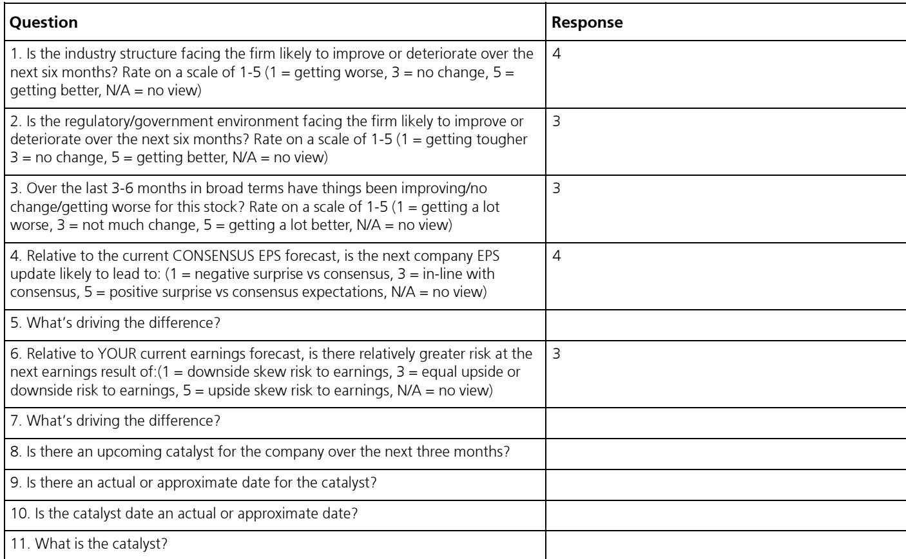
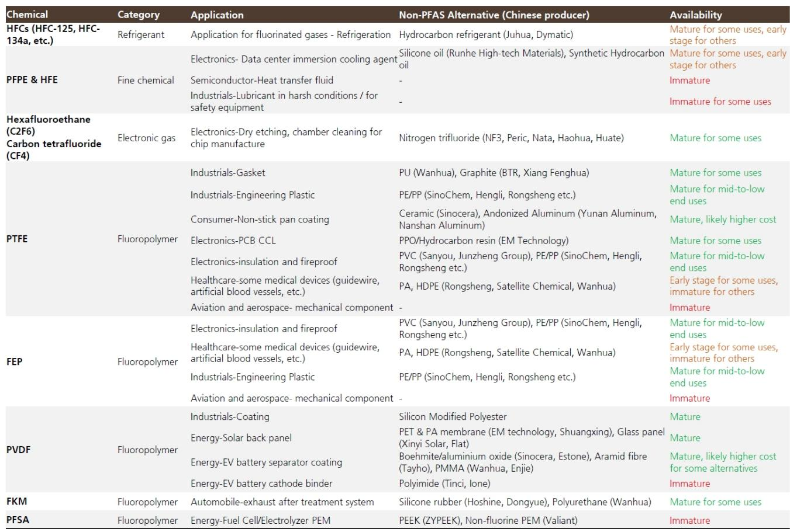

# UBS：氟化工正被AI重新定价，但市场还没看懂

当AI算力竞赛从芯片蔓延到材料，一个被低估的板块正在浮出水面。

UBS最新发布的氟化工行业报告，给出了一个值得产业决策者和投资者认真审视的判断：氟化工材料在AI领域的应用潜力正在快速增长，但市场对这一结构性变化的定价仍然不足。报告明确指出，“氟化工材料供应商目前相对于电子化工材料企业存在显著折价，我们认为市场尚未完全定价AI带给氟化工材料的增长机会。”

这不是一个关于“氟化工涨价”的短期交易故事。这是一个关于材料体系迭代、供应链重构和国产替代交汇的长逻辑。

这份报告发布于2026年6月，覆盖了从电子级氢氟酸到氟化液、从PTFE到氟化气体的完整产业链。但它的核心洞察其实非常集中：AI对算力的需求正在倒逼材料体系的升级，而氟化工材料在性能上的不可替代性，使其成为这一进程中的关键受益者。

如果你只是把氟化工看作一个周期性化工子行业，你可能正在错过一个结构性重估的窗口。

## 1. AI对氟化工的需求不是“蹭概念”，而是材料体系的必然迭代

UBS报告开篇就点明了这一轮氟化工指数跑赢化工指数的两大驱动力：一是美国推迟部分第三代制冷剂退出时间表，二是市场对氟化工材料AI应用潜力的预期升温。但真正值得关注的，是后者。

为什么AI会拉动氟化工材料？核心逻辑并不复杂。

AI服务器对散热效率和低介电常数提出了远超传统服务器的要求。当芯片功耗从几百瓦跃升至上千瓦，空气冷却已经达到物理极限，液冷成为必然选择。而在液冷方案中，氟化液凭借其化学惰性、不燃性、优异的电绝缘性和低表面张力，成为目前最理想的冷却介质之一。

同时，AI服务器对PCB基板材料的介电性能提出了更高要求。PTFE（聚四氟乙烯）因其极低的介电常数和介电损耗，被视为下一代PCB系统的候选材料。

这不是“概念炒作”，这是算力密度提升带来的物理约束倒逼材料升级。UBS的报告把这一点讲得很清楚：AI发展带来的更高算力需求和材料体系迭代，是氟化工材料需求增长的底层驱动力。

> **KC评论：**
> 很多人看到“氟化工+AI”的第一反应是“又在蹭概念”。但这份报告给出的逻辑链是：算力密度提升 -> 散热方案从风冷到液冷 -> 氟化液成为关键材料。这不是想象，是物理规律。完整报告里有两张产业链图，清晰地展示了氟化工与AI从芯片制造到数据中心的全链条连接，值得细看。

## 2. 3M退出PFAS生产，给中国氟化液供应商打开了天窗

如果说AI需求是需求侧的“拉力”，那么3M退出PFAS生产则是供给侧的“推力”。两个力量叠加，构成了中国氟化工企业的结构性机遇。

UBS报告指出，3M作为全球最大的半导体级氟化液供应商，于2025年底退出了PFAS生产。这一决定源于全球范围内对PFAS（全氟和多氟烷基物质）日益严格的监管。PFAS因其高持久性、不可降解性和潜在环境健康风险，正从单一产品限制转向更广泛的类别管控。

问题在于，氟化液在半导体制造中几乎不可替代。尤其是HFE（氢氟醚）和PFPE（全氟聚醚），它们用于精密电子元件的清洗和散热，在芯片制造过程中直接影响工艺稳定性和良率。海外监管机构正在考虑对电子和半导体等关键应用给予更长的豁免期，但这并不能解决供给短缺的问题。

这就给中国供应商创造了替代窗口。UBS报告明确提到，Capchem（新宙邦）在半导体级氟化液领域占据了有利位置，已与国内主要晶圆厂建立了稳定合作关系，在国内半导体冷却液市场排名第一。

> **KC评论：**
> 3M退出PFAS这件事，很多人知道，但很少有人算清楚它对产业格局意味着什么。UBS这份报告给出了一个关键数据：半导体和汽车业务贡献了3M PFAS营收的35-40%。这部分市场突然空出来，谁能接得住？完整报告里有一张中国主要上市公司氟化液产能布局表，可以看到谁在真金白银地扩产，谁还在“准备中”。

## 3. G5级电子级氢氟酸的国产替代，正在从“能做”走向“能打”

在半导体制造环节，电子级氢氟酸（EG-HF）是湿电子化学品中用量最大的品类之一。UBS报告估算，2025年中国EG-HF市场规模约42.5亿元。

但这个市场真正的壁垒在于纯度等级。G5级（半导体级UPSSS）是目前最高等级，主要用于12英寸55nm及以下制程，技术壁垒和定价都显著高于低等级产品。全球G5级氢氟酸的领先者包括Stella Chemifa、Kanto Chemical等日韩企业。

中国企业的进展值得关注。UBS报告显示，2025年中国G5级EG-HF产能达到13.5万吨，产量7.49万吨，营收6.58亿元。更重要的是，国内G5级供应商的CR5高达98%，意味着头部集中度极高。

多氟多、巨化股份旗下的凯圣氟化、滨化集团是主要的国内供应商。多氟多已向台积电、三星批量供应半导体级氢氟酸；凯圣氟化获得了SK海力士12英寸1Xnm工艺的批量供应确认。

但UBS报告也指出了关键变量：中东冲突导致全球硫磺供应趋紧，推动无水氢氟酸价格上涨，进而推高了EG-HF的提价预期。中国作为全球最大的无水氢氟酸供应国，国内EG-HF生产商在原材料供应稳定性上具有优势，有望进一步扩大全球市场份额。

## 4. 报告没有完全回答的问题：估值溢价何时兑现？

UBS报告给出了明确的投资结论：偏好能够受益于AI驱动需求增长的氟化工材料生产商，如东岳集团、新宙邦、广钢气体等，并大幅上调了目标价。

但有一个问题，报告没有完全展开：当前氟化工材料企业的估值折价，何时会收敛？

UBS报告提到，氟化工材料供应商目前相对于电子化工材料企业存在显著折价。这是一个有趣的现象——如果市场已经认可AI对氟化工材料的拉动逻辑，为什么估值还没有跟上？

可能的原因有几个。第一，AI对氟化工材料的拉动，目前更多体现在“预期”而非“业绩”上。报告显示，东岳集团2028年AI相关下游收入占比仅为3-5%，新宙邦为15-20%，而EM科技高达60-65%。这种巨大的结构差异意味着，不同公司的AI受益程度和兑现节奏完全不同。

第二，氟化工材料的技术路线仍在迭代中。UBS报告指出，液冷方案尚未标准化，冷板式液冷和浸没式液冷的技术路线之争仍在继续，冷却介质的选择也存在不确定性。这意味着，哪些公司能最终受益，还需要观察。

第三，PFAS监管的演变方向存在不确定性。虽然3M已经退出，但全球监管框架仍在变化中。如果未来对PFAS的管控进一步收紧，可能会影响氟化液的使用范围，反过来抑制需求。

这些不确定性，恰恰是当前估值折价存在的原因。但也是这些不确定性，为深入研究提供了价值。

## 5. 投资者需要的观察框架：三个维度锁定受益标的

面对这个正在展开的结构性机会，UBS报告提供了三个观察维度，值得投资者建立自己的分析框架。

第一，看技术壁垒。无论是电子级氢氟酸、氟化液还是氟化气体，高纯度、高稳定性的产品具有显著的技术壁垒和客户验证周期。能够率先通过头部晶圆厂认证、实现批量供应的企业，将获得先发优势。

第二，看产能布局。3M退出后留下的供给缺口不会一夜之间被填满。谁在扩产、扩产节奏如何，直接决定了谁能抓住替代窗口。UBS报告给出了主要上市公司的产能布局表，这是一个很好的起点。

第三，看AI敞口结构。不同公司的AI相关收入占比差异巨大，从3%到65%，这意味着它们的业绩弹性完全不同。投资者需要区分“真正受益”和“主题受益”。

> **KC评论：**
> 这三个维度听起来简单，但实际操作中需要大量数据和持续跟踪。比如，你如何判断一家公司的G5级氢氟酸是否真的通过了客户验证？它的产能爬坡节奏是否如期？这些信息散落在公司公告、行业调研和投行报告中，很难靠零散信息拼出全貌。这也是为什么我们每天会整理国际投行的中文摘要和最新数据图表，方便快速把握这些关键变量的变化。

## 6. 一个尚未被充分讨论的变量：氟化气体的结构性机会

在UBS报告的各个细分领域中，氟化气体可能是被讨论最少、但潜力不容忽视的一个方向。

报告提到，在众多氟化气体产品中，需要重点关注那些技术壁垒高、国产替代潜力大、定价前景好的品种，如六氟化钨和六氟丁二烯。

六氟化钨是半导体制造中用于化学气相沉积的关键气体，在先进制程中的用量持续增长。六氟丁二烯则用于刻蚀工艺。这些产品目前仍高度依赖进口，国产替代的空间明确。

但UBS报告没有深入展开的是：这些特种气体的盈利模式和竞争格局与大宗氟化工产品有本质区别。它们具有更高的定制化程度、更长的客户认证周期和更强的议价能力。一旦进入供应链，客户的切换成本很高，这意味着先发优势的持续时间会更长。

这个细分领域的投资逻辑，值得单独花时间研究。完整报告中有关于主要氟化气体产品的详细对比分析，包括技术壁垒、国产化进展和定价趋势，是理解这个细分领域的绝佳起点。

## 7. 最大的风险不是技术路线，而是估值定价的错位

任何投资逻辑都需要面对风险。UBS报告没有回避这一点。

最大的风险可能不是技术路线的不确定性，而是估值定价的错位。目前氟化工材料企业的估值折价，反映的是市场对其“化工属性”的定价，而非“材料属性”的定价。如果AI需求兑现的速度慢于预期，或者竞争格局恶化导致利润率下滑，估值折价的收敛可能不会发生。

另一个风险是PFAS监管的“双刃剑”效应。一方面，监管趋严导致3M退出，创造了替代需求；另一方面，如果监管范围进一步扩大，氟化液的使用本身也可能受到限制。这是一个需要持续跟踪的政策变量。

UBS报告对这些问题着墨不多，但这恰恰是读者需要自己去深入研究的部分。报告给出了框架和方向，但具体的投资决策，需要结合自己的风险偏好和投资期限来判断。

---

这份UBS报告的价值，不在于它给出了多少目标价，而在于它建立了一个清晰的逻辑框架：AI对氟化工材料的需求不是概念，是物理约束下的必然趋势；3M退出PFAS生产不是孤立事件，是中国供应商结构性崛起的催化剂；而市场对这一变化的定价，目前仍不充分。

但这些结论的成立，依赖于一系列假设：AI算力需求的持续增长、液冷技术路线的标准化进程、中国供应商的产能爬坡节奏、全球PFAS监管的演变方向。每一个假设的偏离，都会影响最终的投资结果。

这些未解问题，也是我们每天在社群中持续跟踪和讨论的内容。每天由AI agent和人工review生成国际投行中文摘要与KC评论，daily更新约10-40页，并整理当天最新数据图表合集，方便喂给AI，也方便人工快速把握市场动态。欢迎来星球微信群里继续讨论。

Personal reading notes and learning share only. Not investment advice.

