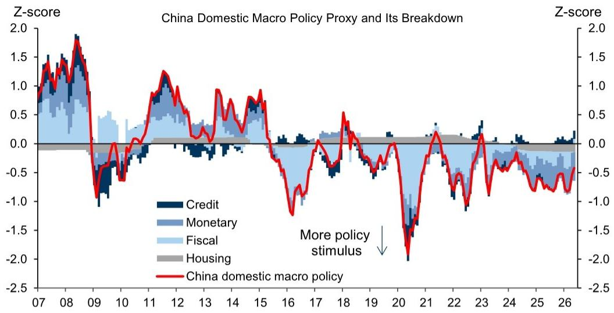
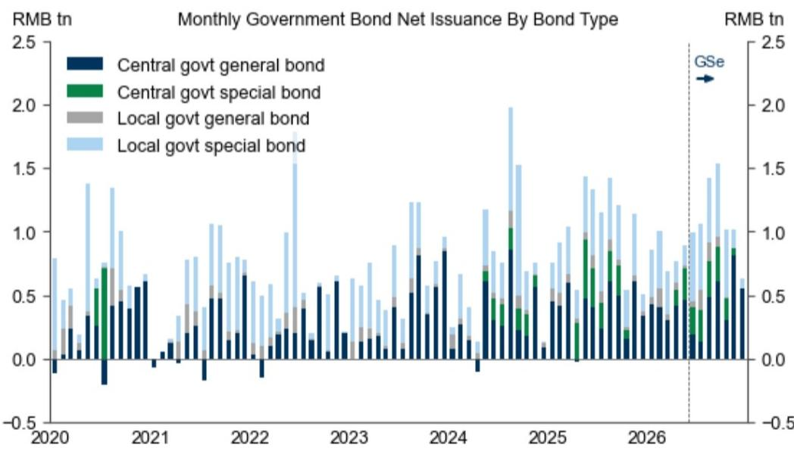
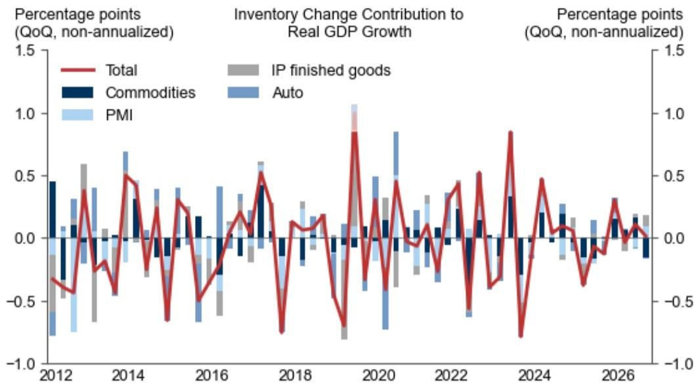

# GS：中国经济5月边际回暖，但内需疲软与信用紧缩的“温差”才是真正挑战

中国经济在5月出现了一丝令人宽慰的边际改善，但这份改善的底色，远非“复苏”二字可以概括。GS最新发布的6月中国自营经济指标报告揭示了一个更复杂的图景：制造业产出带动了整体活动指标的微幅回升，然而，隐藏在数据背后的内需疲软、信用紧缩和财政节奏滞后，构成了当前经济运行的真正挑战。对于投资者和决策者而言，理解这组“温差”信号，比关注单一数据点的好坏更为关键。

这份报告的核心价值不在于给出了一个乐观或悲观的结论，而在于它通过一系列自营的高频和结构性指标，拆解了经济增长的动力来源与阻力所在。它提醒我们，当前的经济修复更像是一次局部反弹，而非全面的趋势反转。

## 1. 制造业是5月唯一的亮点，但这一“独木”能否支撑全局？

GS的中国当前活动指标在5月环比年化增长4.6%，高于4月的2.9%。这一改善的主要驱动力来自制造业部门。报告中的制造业增长代理指标在5月出现回升，这与官方PMI数据所显示的产出扩张趋势是一致的。

然而，我们必须追问一个“所以呢”的问题：制造业的韧性能够持续多久，并且能否有效传导至消费和服务业？目前来看，答案并不乐观。制造业的改善更多是基于供给端的修复和部分外需的支撑，而非内需的全面启动。如果消费和房地产等终端需求持续疲弱，制造业的反弹很可能只是库存周期的一次短暂补库，缺乏持续扩张的动力。这就像一场接力赛，第一棒跑得不错，但第二棒迟迟未能接棒。

> **KC评论：** GS的制造业增长代理指标（基于机床、汽车、发电设备等产出）是值得持续跟踪的先行指标。但读者必须意识到，这一指标的改善与终端需求的关联度正在减弱。完整报告中关于消费和“其他”（包含房地产和劳动力市场）领域的CAI分项数据，才是判断这一反弹能否延续的关键。这部分数据在公开摘要中被一笔带过，但在完整报告中有更细致的拆解。

## 2. 内需疲软是当前最大的结构性隐忧，进口数据已经发出预警

报告中最值得警惕的信号，来自其自营的进口隐含国内需求代理指标。该指标显示，二季度中国国内需求增长明显走弱。这与我们通过其他渠道感知到的消费降级、房地产财富效应消退等现象高度吻合。

GS通过将中国进口商品按其最终用途，并利用投入产出表进行归因，构建了这一指标。其核心逻辑是：进口是内需的“映射”。当企业进口减少，通常意味着它们对未来的终端销售预期变得谨慎。这一指标的走弱，直接回答了“为什么制造业反弹可能不可持续”的问题——因为下游没有足够的需求来消化上游的产出。

> **KC评论：** 许多市场参与者更关注出口数据，因为外需表现尚可。但GS的这个进口隐含内需指标，实际上是在提醒我们：不要被月度出口数据的波动所迷惑。内需的疲软是结构性的，它决定了经济的长期均衡水平。完整报告中对这一指标的方法论和与国民账户内需数据的交叉验证，提供了更严谨的分析框架，值得深入阅读。

## 3. 信用紧缩正在实质性收紧，金融条件指数发出“偏冷”信号

GS的中国金融条件指数在5月小幅收紧。更关键的是，其自营的信用脉冲指标预计将在下半年继续为负。信用脉冲衡量的是新增信贷占GDP比重的变化，其转为负值，意味着信贷对经济增长的边际贡献正在下降。

这一信号的重要性在于，它直接关联到资产定价。历史上，信用脉冲的走势对中国股市和房地产市场都有较强的领先意义。当信用脉冲为负时，意味着金融体系向实体经济输送的“血液”在减少，企业的融资环境在恶化，这将对投资和经营活动构成制约。5月份金融条件的收紧，部分由人民币对贸易加权篮子升值以及股市表现疲弱导致，这进一步压缩了宽松政策的空间。

报告尚未完全回答的一个关键问题是：这种信用紧缩是暂时的季节性波动，还是政策主动调控的结果？如果是后者，那么下半年经济面临的下行压力可能会超出市场预期。

## 4. 财政政策节奏“前慢后快”，但“花钱效率”才是核心

GS的报告显示，其自营的中国宏观政策代理指数在5月小幅收紧，主要驱动力来自更紧的财政政策和更慢的信贷增长。同时，其广义财政赤字指标在5月进一步收窄。

这似乎与市场对“积极财政政策”的普遍预期相悖。GS的分析提供了一个解释：政府债券的净发行将在未来几个月加速。这意味着，财政政策的节奏是“前慢后快”。上半年的收紧，更多是发行节奏滞后导致的被动结果，而非政策取向的转向。

然而，这里有一个更深层的洞察：财政政策的宽松程度，不仅取决于“发了多少债”，更取决于“花了多少钱”。GS的“财政支出比率”指标在5月仅小幅上升，这表明政府虽然开始发债，但资金从国库拨付到实际项目、形成实物工作量的效率仍有待提高。这才是决定下半年经济动能的关键变量。

## 5. 一个尚未被充分讨论的风险：库存周期的“二阶效应”

报告中关于库存的追踪器提供了一个有趣的视角。GS的库存追踪器显示，二季度库存水平可能大致持平，而库存变化对GDP增长的贡献可能下降。

这看似是一个中性甚至偏正面的信号，因为它意味着企业没有在被动累库。但我们需要思考其“二阶效应”：库存水平的稳定，可能恰恰是企业主动去库的结果。当企业对未来需求预期悲观时，它们会主动压缩库存。这种主动去库行为，本身就会压制对上游原材料和中间品的采购，从而拖累工业生产和投资。因此，库存持平背后，可能隐藏着企业信心的低迷。报告中的库存追踪器是基于大宗商品、PMI分项、产成品库存等多个指标合成的，其细微变化值得持续跟踪。

> **KC评论：** GS的库存分析框架非常精细。它告诉我们，不能只看库存的绝对水平，更要看库存变化的驱动因素。完整报告中对库存追踪器六个底层指标的拆解，可以帮助我们判断当前的库存行为究竟是主动还是被动。这对于判断大宗商品价格和工业品利润的短期走势至关重要。

## 6. 在“温差”中寻找确定性：一个决策者的观察框架

综合GS这份报告，我们可以提炼出一个面向未来的观察框架。对于决策者而言，与其纠结于GDP增速是否达到5%，不如关注以下三个核心“温差”的收窄情况：

第一，制造业与内需的温差。如果制造业的反弹无法带动消费和投资的跟进，那么经济的修复基础就是不牢固的。我们需要看到进口隐含内需指标的企稳回升。

第二，信用脉冲与资产价格的温差。信用脉冲的持续为负，意味着流动性环境对风险资产并不友好。投资者需要警惕信用紧缩对估值的压制作用，并关注政策层面是否有新的宽松信号来扭转这一趋势。

第三，财政发行与财政支出的温差。政府债券发行加速只是第一步，资金能否高效转化为实际支出，形成对总需求的直接拉动，才是财政政策能否见效的关键。财政支出比率指标是比赤字率更真实的风向标。

这份报告没有给出一个简单的“买”或“卖”的建议，但它提供了一套严谨的诊断工具。它告诉我们，当前市场对经济的定价，可能低估了内需疲弱和信用紧缩的持续性。真正的投资机会，或许不在于追逐短期的数据反弹，而在于识别出那些能够在“温差”中保持自身定价能力和现金流稳定的结构性赢家。

以上讨论仅触及了GS这份长达数十页报告的核心脉络。关于每个指标的详细方法论、历史回测数据以及更深入的情景分析，报告中均有详尽阐述。这些内容对于构建自己的独立判断框架至关重要。

我们每天会由AI agent和人工review相结合，生成国际投行中文摘要与KC评论，daily更新约10-40页，并整理当天最新数据图表合集。这些内容既方便喂给AI进行深度分析，也方便人工快速把握全球市场的动态变化。欢迎来我们的星球和微信群中继续讨论，一起穿透数据，看清本质。

Personal reading notes and learning share only. Not investment advice.

